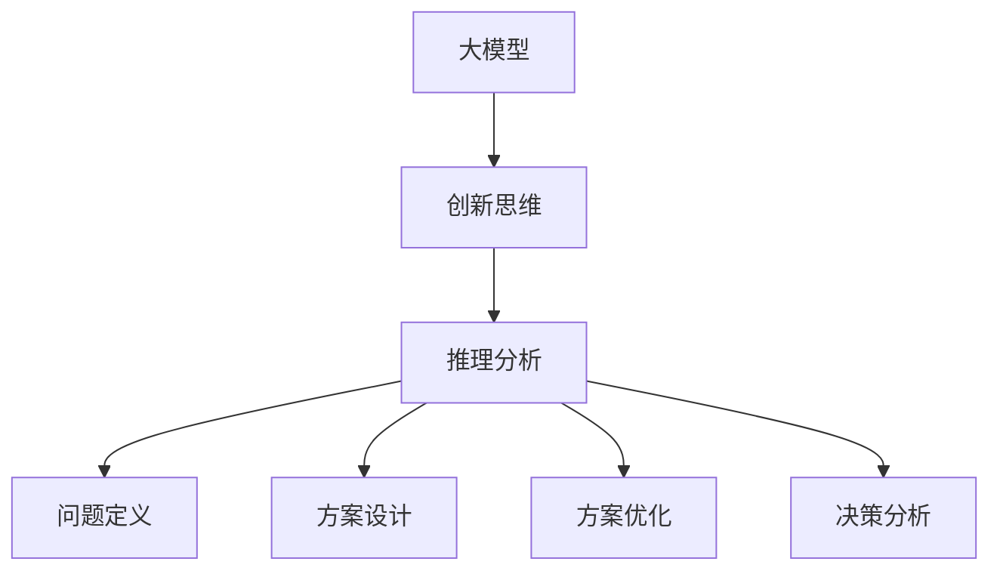

                 

### 《大模型在创新思维任务中的推理分析》

#### 关键词：
- 大模型
- 创新思维
- 推理分析
- 深度学习
- 神经网络
- 问题定义
- 方案设计
- 决策分析

#### 摘要：
本文旨在探讨大模型在创新思维任务中的推理分析能力。通过详细分析大模型的发展历程、理论基础及其在创新思维任务中的具体应用，本文揭示了如何利用大模型进行问题定义、方案设计和决策分析，为人工智能在创新领域的应用提供了新的视角和方法。文章结构分为四个部分：引言与基础理论、创新思维与推理分析、大模型在创新思维任务中的应用、大模型在创新思维中的实际应用。

---

# 《大模型在创新思维任务中的推理分析》目录大纲

## 第一部分：引言与基础理论

### 第1章：大模型的概述与发展

#### 1.1 大模型的定义与特点

- **大模型的定义**
- **大模型的特点**
- **大模型与传统模型的比较**

#### 1.2 大模型的发展历程

- **早期模型**
- **现代模型的演变**
- **未来发展趋势**

#### 1.3 大模型的关键技术

- **深度学习基础**
- **神经网络架构**
- **模型训练与优化**

### 第2章：创新思维与推理分析

#### 2.1 创新思维的概念与过程

- **创新思维的定义**
- **创新思维的过程**
- **创新思维的重要性**

#### 2.2 推理分析在创新思维中的应用

- **推理分析的定义**
- **推理分析的类型**
- **推理分析在创新思维中的作用**

### 第3章：大模型在创新思维任务中的应用

#### 3.1 大模型在问题定义中的推理分析

- **问题定义的方法**
- **大模型在问题定义中的作用**
- **实例分析**

#### 3.2 大模型在方案设计中的推理分析

- **方案设计的方法**
- **大模型在方案设计中的作用**
- **实例分析**

### 第4章：大模型在方案优化中的推理分析

#### 4.1 大模型在方案优化中的作用

- **方案优化的方法**
- **大模型在方案优化中的作用**
- **实例分析**

#### 4.2 大模型在决策分析中的推理分析

- **决策分析的方法**
- **大模型在决策分析中的作用**
- **实例分析**

## 第二部分：大模型在创新思维中的实际应用

### 第5章：大模型在产品设计中的推理分析

#### 5.1 产品设计中的推理分析

- **产品设计的过程**
- **大模型在产品设计中的作用**
- **实例分析**

### 第6章：大模型在市场营销中的推理分析

#### 6.1 市场营销中的推理分析

- **市场营销的过程**
- **大模型在市场营销中的作用**
- **实例分析**

### 第7章：大模型在企业管理中的推理分析

#### 7.1 企业管理中的推理分析

- **企业管理的要素**
- **大模型在企业管理中的作用**
- **实例分析**

### 第8章：大模型在创新思维任务中的综合应用

#### 8.1 大模型在创新思维任务中的综合应用

- **大模型的综合应用场景**
- **大模型在创新思维任务中的挑战与机遇**
- **实例分析**

## 附录

### 附录A：大模型推理分析工具与资源

- **开源大模型工具**
- **商业大模型工具**
- **常用推理分析资源**

### 附录B：实例代码与数据集

- **实例代码**
- **数据集**

# 核心概念与联系



# 核心算法原理讲解

## 深度学习与神经网络基础

```python
import numpy as np

# 神经网络的基本结构
def neural_network(x, weights):
    return np.dot(x, weights)

# 前向传播
def forward_propagation(x, weights):
    z = neural_network(x, weights)
    return z

# 反向传播
def backward_propagation(x, weights, expected_output):
    output = forward_propagation(x, weights)
    error = expected_output - output
    return error
```

## 数学模型和数学公式

$$
1+1=2
$$

$$
y=2x+1
$$

# 项目实战

## 代码实际案例

```python
# 代码实现
import tensorflow as tf

# 搭建模型
model = tf.keras.Sequential([
    tf.keras.layers.Dense(units=1, input_shape=[1])
])

# 编译模型
model.compile(optimizer='sgd', loss='mean_squared_error')

# 训练模型
model.fit(x_train, y_train, epochs=1000)

# 预测
predictions = model.predict(x_test)
```

---

**作者：AI天才研究院/AI Genius Institute & 禅与计算机程序设计艺术 /Zen And The Art of Computer Programming**

