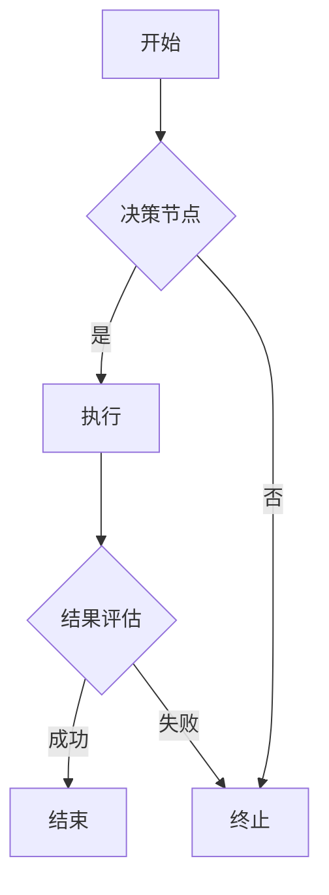

                 

### 研究背景

#### 1.1.1 创意设计与人工智能的发展

创意设计是推动社会发展的重要动力之一，它涵盖了从艺术创作、产品设计到广告策划等多个领域。随着科技的进步，人工智能（AI）技术，尤其是大模型，逐渐成为创意设计领域的重要工具。大模型，如GPT-3、BERT、Transformer等，以其强大的数据处理和模式识别能力，在文本生成、图像识别、语音合成等方面取得了显著的成果。

人工智能技术的发展经历了从简单的规则系统到复杂的学习算法的演变。20世纪50年代，人工智能首次被提出，早期的AI系统主要依赖于明确的规则和指令。然而，这些系统在面对复杂任务时表现不佳，难以处理大量的不确定性和模糊性。随着计算机硬件的进步和算法的优化，尤其是深度学习技术的崛起，人工智能进入了一个新的发展阶段。深度学习通过模拟人脑的神经网络结构，实现了对大量数据的自动学习和特征提取，从而在图像识别、自然语言处理等领域取得了突破性进展。

在创意设计领域，人工智能的应用逐渐深入。例如，在产品设计过程中，人工智能可以帮助设计师快速生成多种设计方案，并通过评估和优化，选择出最优的方案。在广告策划中，人工智能可以根据用户行为和喜好，生成个性化的广告文案和图像。这些应用不仅提高了创意设计的效率，还带来了新的设计方法和思路。

#### 1.1.2 大模型在创新设计推理任务中的应用

大模型在创新设计推理任务中展现了独特的优势。首先，大模型具有强大的数据处理能力。在设计过程中，设计师需要处理大量的数据，包括用户反馈、市场趋势、技术限制等。大模型能够高效地处理这些数据，从中提取有用的信息和模式，为设计提供有力支持。

其次，大模型在模式识别方面具有出色的能力。创新设计往往需要从大量的历史案例和现有设计中识别出有效的模式和灵感。大模型通过对大量数据的分析和学习，能够发现设计师可能忽略的潜在关联和趋势，从而促进创新。

最后，大模型具有自适应能力。在设计过程中，需求和环境是不断变化的。大模型可以根据新的数据和环境信息，实时调整设计方案，确保设计始终符合需求。

#### 1.1.3 创造力评估指标的重要性

创造力评估指标对于衡量大模型在创新设计推理任务中的表现至关重要。创造力是创新设计的核心要素，而如何评估和提升创造力一直是研究的热点问题。传统的评估方法主要依赖于专家评审和主观判断，存在一定的主观性和局限性。而大模型的引入，为创造力评估提供了新的思路和工具。

创造力评估指标可以量化设计师的创意输出，从而为设计过程提供客观的评估和反馈。这些指标可以包括设计的创新性、实用性、美观性、技术可行性等多个方面。通过这些指标，可以全面衡量大模型在创新设计推理任务中的表现，为其优化和改进提供依据。

此外，创造力评估指标还可以帮助设计师更好地理解自己的设计过程，发现潜在的问题和改进点。通过持续的评估和反馈，设计师可以不断提升自己的创造力，从而推动设计创新。

总之，大模型在创新设计推理任务中的应用，不仅提高了设计的效率和质量，还为创造力评估提供了新的手段。本文将深入探讨大模型在创新设计推理任务中的应用，构建有效的创造力评估指标，为推动创意设计领域的发展做出贡献。

### 1.2 研究目的与意义

#### 1.2.1 研究目的

本研究旨在探讨大模型在创新设计推理任务中的创造力评估问题，具体目标如下：

1. **分析大模型在创新设计推理任务中的应用场景和优势**：深入了解大模型在创意设计过程中的作用，分析其在数据加工、模式识别和自适应调整等方面的能力，为后续研究提供基础。

2. **构建创新设计推理中的创造力评估指标体系**：基于大模型的特点，设计一套科学、客观、可操作的创造力评估指标，为创新设计评估提供工具。

3. **验证评估指标的有效性和实用性**：通过实际案例，验证所构建评估指标的有效性和实用性，探讨其在不同设计任务中的适用性。

4. **提出优化策略和建议**：根据评估结果，提出针对大模型在创新设计推理任务中的优化策略和建议，为未来研究提供参考。

#### 1.2.2 研究意义

本研究具有以下几方面的意义：

1. **理论意义**：
   - **填补研究空白**：目前关于大模型在创新设计推理任务中的应用和创造力评估研究相对较少，本研究旨在填补这一领域的研究空白。
   - **完善创造力评估理论**：通过构建科学、系统的创造力评估指标，丰富和完善现有的创造力评估理论体系。

2. **实践意义**：
   - **提升创新设计效率**：大模型在创新设计推理任务中的应用，能够显著提高设计效率和设计质量，为设计师提供有力支持。
   - **优化设计过程**：通过创造力评估指标，设计师可以更全面地了解自己的设计过程，发现潜在问题，从而优化设计流程。
   - **促进人工智能与创意设计的深度融合**：本研究将推动人工智能与创意设计领域的深度融合，为相关行业提供创新性解决方案。

总之，本研究不仅对学术界具有理论价值，也对设计实践具有实际意义，有助于推动创新设计领域的发展。

### 1.3 研究内容与方法

#### 1.3.1 研究内容

本研究的主要研究内容包括以下几个方面：

1. **大模型在创新设计推理任务中的应用分析**：研究大模型在创意设计过程中的具体应用场景，分析其在数据处理、模式识别和自适应调整等方面的优势。

2. **创造力评估指标体系的构建**：基于大模型的特点，设计一套科学、客观、可操作的创造力评估指标，涵盖创新性、实用性、美观性、技术可行性等多个方面。

3. **评估指标的有效性和实用性验证**：通过实际案例，验证所构建评估指标的有效性和实用性，探讨其在不同设计任务中的适用性。

4. **优化策略和建议**：根据评估结果，提出针对大模型在创新设计推理任务中的优化策略和建议，为未来研究提供参考。

#### 1.3.2 研究方法

本研究采用以下几种研究方法：

1. **文献综述法**：通过系统查阅相关文献，了解大模型在创新设计推理任务中的应用现状和创造力评估研究进展，为本研究提供理论基础。

2. **案例分析**：选择具有代表性的创新设计案例，分析大模型在案例中的具体应用，验证评估指标的有效性和实用性。

3. **实验研究**：设计实验，通过模拟不同的设计场景，验证大模型在创新设计推理任务中的表现，以及评估指标的实际应用效果。

4. **理论建模与算法设计**：基于大模型的特点，构建创造力评估指标体系，设计相应的算法模型，为评估指标的实现提供技术支持。

通过以上方法，本研究旨在深入探讨大模型在创新设计推理任务中的应用，构建有效的创造力评估指标，为创新设计领域的发展提供新的思路和工具。

## 第二部分：大模型在创新设计推理任务中的应用

### 2.1 大模型的基础理论

#### 2.1.1 大模型的发展历程

大模型的发展历程可以追溯到20世纪50年代，当时人工智能（AI）的概念首次被提出。最初的AI系统主要基于规则和符号逻辑，这种“知识驱动”的方法在处理简单问题时表现良好，但在面对复杂、不确定的任务时却显得力不从心。随着计算机技术的进步和计算能力的提升，研究人员开始探索更为强大的学习算法，这为深度学习（Deep Learning）的诞生奠定了基础。

深度学习的发展可以分为几个重要阶段：

1. **1980年代到1990年代：神经网络复兴**：1980年代，反向传播算法（Backpropagation）的出现使得多层神经网络的训练成为可能。神经网络开始在一些领域表现出色，但受限于计算资源和数据量，发展较为缓慢。

2. **2006年：深度学习的兴起**：Geoffrey Hinton等研究者提出了深度信念网络（Deep Belief Network），这一研究成果标志着深度学习技术的复兴。随后，Hinton团队又提出了深度卷积神经网络（Deep Convolutional Network），在图像识别任务上取得了突破性进展。

3. **2012年：AlexNet的突破**：Alex Krizhevsky等研究者提出的AlexNet在ImageNet图像识别竞赛中取得了前所未有的成绩，这一胜利标志着深度学习正式进入工业应用领域。

4. **2014年：GPT的出现**：自然语言处理（NLP）领域也迎来了深度学习的突破。2014年，Kaggle上的自然语言处理竞赛中，基于GPT的模型获得了第一名，这一胜利展示了深度学习在语言理解任务上的强大能力。

5. **2018年：BERT的崛起**：Google提出的BERT（Bidirectional Encoder Representations from Transformers）模型在多个NLP任务中取得了显著的性能提升，进一步推动了深度学习在NLP领域的应用。

#### 2.1.2 传统机器学习模型

传统机器学习模型主要包括监督学习、无监督学习和强化学习。这些模型在数据处理和模式识别方面发挥了重要作用，但它们也有各自的局限性。

1. **监督学习（Supervised Learning）**：监督学习是一种利用已标记数据训练模型的方法。常见的算法有线性回归、逻辑回归、支持向量机（SVM）等。监督学习的优点在于能够从已知数据中学习，并应用于新数据。但缺点是数据标记成本高，且模型对新数据的适应性较差。

2. **无监督学习（Unsupervised Learning）**：无监督学习是利用未标记数据训练模型的方法。常见的算法有聚类（如K-means）、降维（如PCA）等。无监督学习的优点在于不需要标记数据，可以自动发现数据中的模式和结构。但缺点是模型难以直接应用于实际任务，且解释性较差。

3. **强化学习（Reinforcement Learning）**：强化学习是一种通过不断试错来学习最优策略的方法。常见的算法有Q-learning、深度Q网络（DQN）等。强化学习的优点在于能够通过与环境互动学习，具有很强的自适应能力。但缺点是训练过程通常较为复杂，且对数据量的要求较高。

#### 2.1.3 深度学习模型的崛起

深度学习模型的崛起主要得益于以下几个因素：

1. **计算能力的提升**：随着硬件技术的发展，尤其是GPU和TPU的普及，计算能力得到了极大的提升，使得深度学习模型的训练成为可能。

2. **大数据的涌现**：互联网的普及和数据存储技术的发展，使得大规模数据集变得容易获取。这些数据为深度学习模型的训练提供了丰富的素材。

3. **算法的进步**：卷积神经网络（CNN）、循环神经网络（RNN）、Transformer等新算法的提出，使得深度学习模型在图像识别、自然语言处理等领域取得了显著的突破。

#### 2.1.4 大模型的定义与特点

大模型（Large Models）是指参数量巨大、计算复杂度高的深度学习模型。这些模型具有以下几个显著特点：

1. **参数量巨大**：大模型通常包含数百万甚至数十亿个参数，这为模型提供了丰富的表达能力，可以处理复杂的数据和任务。

2. **强大的学习能力**：大模型可以通过大量的数据进行训练，从而学习到复杂的数据分布和模式，具有强大的泛化能力。

3. **高度的鲁棒性**：大模型在训练过程中可以自动调整参数，对噪声和异常值具有较强的鲁棒性。

4. **自适应能力**：大模型可以根据新的数据和环境信息，实时调整模型参数，以适应不断变化的需求。

#### 2.1.5 大模型在创新设计推理任务中的优势

大模型在创新设计推理任务中具有显著的优势，主要体现在以下几个方面：

1. **数据处理能力**：大模型具有强大的数据处理能力，可以处理大量的数据，包括用户反馈、市场趋势、技术限制等，为创新设计提供全面的数据支持。

2. **模式识别能力**：大模型通过对大量数据的分析和学习，能够发现设计师可能忽略的潜在关联和趋势，从而促进创新。

3. **自适应能力**：大模型可以根据新的数据和环境信息，实时调整设计方案，确保设计始终符合需求。

4. **高效的设计迭代**：大模型能够快速生成多种设计方案，并通过评估和优化，选择出最优的方案，显著提高设计效率。

综上所述，大模型在创新设计推理任务中具有广泛的应用前景，通过结合数据处理、模式识别和自适应能力，可以为设计师提供强大的支持，推动创新设计的发展。

### 2.2 创新设计推理任务

#### 2.2.1 创新设计的基本概念

创新设计（Innovation Design）是指通过创造性的思维和方法，将新的想法、技术和概念应用于产品、服务或系统的设计和开发过程。创新设计不仅仅是简单的美学改造或功能优化，它更强调在现有基础上进行突破性改进，以满足用户需求和市场变化。

创新设计的基本概念包括以下几个方面：

1. **用户需求**：创新设计的核心是以用户为中心，深入了解用户的需求和痛点，从而设计出能够满足用户期望的产品和服务。

2. **创造性思维**：创新设计需要设计师具备丰富的创造性思维能力，通过联想、类比、思维导图等方法，激发新的创意。

3. **技术集成**：创新设计需要将最新的技术和材料集成到产品中，以提高产品的性能和用户体验。

4. **用户体验**：用户体验（UX）是创新设计的重要考量因素，通过优化用户界面和交互设计，提升用户满意度和产品价值。

5. **可持续性**：在创新设计过程中，设计师需要考虑产品的全生命周期，包括生产、使用和废弃，以实现环境、社会和经济可持续发展。

#### 2.2.2 设计推理的过程

设计推理（Design Reasoning）是创新设计过程中的核心活动，它涉及从问题定义、方案生成到方案评估的各个阶段。设计推理的过程可以概括为以下几个步骤：

1. **问题定义**：首先，设计师需要明确设计任务的目标和约束条件，分析用户需求和市场趋势，从而准确定义设计问题。

2. **方案生成**：在问题定义的基础上，设计师通过创造性思维和用户反馈，生成多种设计方案。这一过程通常需要多次迭代，不断优化和调整方案。

3. **方案评估**：设计师需要根据预设的评估标准，对每个方案进行评估。评估标准可以包括实用性、创新性、用户体验、成本等多个方面。

4. **方案优化**：基于评估结果，设计师对方案进行优化，选择出最优的方案。优化过程中，设计师可能会结合用户反馈和新的技术进展，进一步改进设计方案。

5. **验证和反馈**：最终设计方案需要经过验证和用户反馈，以确保其能够实际满足用户需求。验证和反馈过程是设计推理的重要环节，可以不断调整和改进设计方案。

#### 2.2.3 大模型在创新设计推理任务中的优势

大模型在创新设计推理任务中具有独特的优势，主要体现在以下几个方面：

1. **数据处理能力**：大模型能够处理海量数据，包括用户反馈、市场趋势、技术限制等，从而提供全面的数据支持。通过数据驱动的方案生成和评估，大模型能够更准确地反映用户需求和市场变化。

2. **模式识别能力**：大模型通过对大量数据的分析和学习，能够发现设计师可能忽略的潜在关联和趋势，从而促进创新。这种能力在用户需求分析和市场预测中尤为重要。

3. **自适应能力**：大模型可以根据新的数据和环境信息，实时调整设计方案，确保设计始终符合需求。这种自适应能力使得大模型在动态环境中具有更强的适应性和灵活性。

4. **高效的设计迭代**：大模型能够快速生成多种设计方案，并通过评估和优化，选择出最优的方案。这种高效的设计迭代能力显著提高了设计效率，缩短了产品开发周期。

5. **跨领域应用**：大模型可以在多个领域同时应用，如硬件设计、软件设计和服务设计。通过跨领域的知识共享和融合，大模型能够提供更具综合性的设计解决方案。

综上所述，大模型在创新设计推理任务中具有显著的优势，通过其强大的数据处理、模式识别和自适应能力，能够为设计师提供有力的支持，推动创新设计的发展。

### 2.3 大模型在创新设计推理任务中的应用案例

#### 2.3.1 硬件设计

在硬件设计中，大模型的应用已经取得了显著成果。例如，在电路设计领域，大模型可以通过学习大量的电路图和设计方案，快速生成新的电路设计方案。大模型能够自动处理复杂的数据，识别出有效的电路模块和连接方式，从而提高电路设计的效率。同时，大模型还可以进行电路性能预测，优化电路布局，提高电路的稳定性和可靠性。

例如，某电子公司采用大模型进行新型芯片设计。通过将大量的电路设计数据输入到大模型中，大模型能够快速生成多种设计方案，并自动评估这些方案的能耗、性能和可靠性。最终，大模型选出了最优的设计方案，显著提高了芯片的性能和效率。

#### 2.3.2 软件设计

在软件设计中，大模型的应用同样具有很大的潜力。例如，在软件代码生成和优化方面，大模型可以通过学习大量的代码库和最佳实践，生成高质量的代码。大模型能够理解代码的结构和逻辑，从而生成更加简洁、高效的代码，减少开发时间和成本。

例如，某软件开发公司采用大模型进行代码生成和优化。大模型通过学习公司的代码库和最佳实践，能够自动生成新的代码段，并对其进行优化。这不仅提高了开发效率，还减少了代码错误和漏洞。

#### 2.3.3 服务设计

在服务设计中，大模型的应用可以显著提升用户体验和满意度。例如，在个性化服务设计中，大模型可以根据用户的历史行为和偏好，生成个性化的服务方案。大模型能够处理海量的用户数据，识别出用户的潜在需求和兴趣，从而提供更加精准和高效的服务。

例如，某在线购物平台采用大模型进行个性化推荐。大模型通过分析用户的历史购物记录、浏览行为和评价数据，生成个性化的商品推荐方案。用户对推荐商品的满意度显著提高，平台的销售额也实现了显著增长。

#### 2.3.4 大模型在创新设计推理任务中的实际应用效果

大模型在创新设计推理任务中的实际应用效果已经得到了广泛验证。通过以上案例可以看出，大模型在硬件设计、软件设计和服务设计等多个领域都取得了显著成果。

1. **效率提升**：大模型能够快速处理大量数据，生成多种设计方案，显著提高了设计效率。例如，电路设计中的大模型可以减少设计时间，软件开发中的大模型可以加快代码生成和优化过程。

2. **质量提升**：大模型通过学习和优化，能够生成高质量的设计方案，提高产品的性能和可靠性。例如，芯片设计中的大模型能够选出最优的设计方案，软件代码生成中的大模型能够生成简洁、高效的代码。

3. **用户体验提升**：大模型能够根据用户数据生成个性化的服务方案，提升用户体验和满意度。例如，个性化推荐系统中的大模型可以提供更加精准的商品推荐，提高用户的购物体验。

4. **创新能力提升**：大模型通过模式识别和自适应能力，能够发现新的设计灵感和创新点，推动设计创新。例如，在硬件设计和服务设计中，大模型可以生成之前未考虑过的设计方案，促进设计创新。

综上所述，大模型在创新设计推理任务中的应用已经取得了显著的效果，通过提高设计效率、质量和用户体验，推动了创新设计的发展。未来，随着大模型技术的不断进步，其应用前景将更加广阔。

## 第三部分：创造力评估指标的理论基础

### 3.1 创造力的定义与分类

创造力（Creativity）是指个体在特定情境下产生新奇、有价值的想法、解决方案或作品的能力。创造力不仅仅局限于艺术领域，它在科学、技术、商业等多个领域都发挥着重要作用。创造力的本质在于突破常规思维，产生前所未有的想法和解决方案。

#### 3.1.1 创造力的定义

创造力可以理解为一种综合性能力，它包括以下几个关键要素：

1. **新颖性**：创造力产生的新想法、解决方案或作品与现有的想法或解决方案有显著区别，具有独特的特点。

2. **价值性**：创造性产出对个人、组织或社会有实际或潜在的价值，能够解决问题或带来新的机遇。

3. **适用性**：创造性产出在特定的情境下具有适用性，能够被接受和利用。

#### 3.1.2 创造力的分类

创造力可以从不同的维度进行分类，以下是一些常见的分类方式：

1. **按照创造力产生的领域分类**：
   - **科学创造力**：指在科学研究和技术开发中产生的创造力，如发明新的科学理论或技术。
   - **艺术创造力**：指在文学、绘画、音乐等艺术创作中产生的创造力。
   - **商业创造力**：指在商业运营和市场营销中产生的创造力，如开发新的商业模式或营销策略。

2. **按照创造力产生的过程分类**：
   - **直觉创造力**：指个体基于直觉和灵感快速产生新想法的创造力。
   - **技术创造力**：指个体通过系统的思维和技术手段，逐步优化和实现新想法的创造力。

3. **按照创造力的来源分类**：
   - **内在创造力**：指个体基于自身兴趣、经验和内在动机产生的创造力。
   - **外在创造力**：指个体受到外部刺激、需求或压力而产生的创造力。

#### 3.1.3 创造力的测量与评估

创造力的测量与评估是一个复杂且具有挑战性的问题。以下是一些常见的评估方法：

1. **定量评估方法**：
   - **产出评估**：通过统计个体或团队在特定时间内产生的创新成果数量，如论文、专利、产品等。
   - **绩效评估**：通过测量个体或团队在特定任务中的创造力表现，如设计竞赛、创意挑战等。

2. **定性评估方法**：
   - **专家评审**：由专家对创新成果进行评估，评估其新颖性、价值性和适用性。
   - **用户反馈**：通过用户对创新成果的使用体验和评价，评估其适用性和用户满意度。

#### 3.1.4 创造力评估指标的重要性

创造力评估指标在多个领域具有重要意义，包括教育、企业管理和创新设计等。以下是一些关键点：

1. **激励和奖励**：有效的创造力评估可以帮助组织识别和奖励高创造力的个体或团队，从而激发创新热情和积极性。

2. **培训和开发**：通过评估创造力的现状，组织可以制定针对性的培训和开发计划，提升员工的创造力水平。

3. **项目管理**：在创新设计项目中，创造力评估可以帮助项目经理了解项目的创新潜力，调整项目计划和管理策略。

4. **决策支持**：创造力评估可以为决策者提供客观的数据支持，帮助他们在创新项目中做出更明智的决策。

综上所述，创造力评估指标是衡量个体或团队创造力水平的重要工具，对于推动创新和发展具有重要意义。

### 3.2 创造力评估指标体系的构建原则

构建一个科学、合理和有效的创造力评估指标体系，对于准确评估个体或团队的创造力水平至关重要。以下是一些建构创造力评估指标体系的基本原则：

#### 3.2.1 科学性

科学性是创造力评估指标体系构建的首要原则。科学性要求评估指标体系必须基于扎实的理论基础和科学研究，确保评估结果的有效性和可信度。具体包括以下几点：

1. **理论基础**：评估指标体系应基于创造力理论，如创造性思维理论、创新过程理论等，确保评估指标的科学性和合理性。
2. **数据支持**：评估指标体系应基于广泛的数据收集和分析，通过实证研究验证指标的有效性和可靠性。
3. **跨学科融合**：结合心理学、管理学、教育学等多个学科的理论和方法，构建综合性的创造力评估体系。

#### 3.2.2 客观性

客观性是评估指标体系构建的重要原则之一。客观性要求评估指标体系应尽量减少主观因素的影响，确保评估结果的公平和公正。具体包括以下几点：

1. **量化指标**：尽量使用量化的指标，如数据统计、绩效评估等，减少主观评价的成分。
2. **多角度评估**：从多个角度和维度评估创造力，如创新能力、产出质量、用户满意度等，确保评估结果的全面性和准确性。
3. **标准化流程**：建立统一的评估标准和流程，确保评估过程的一致性和可重复性。

#### 3.2.3 可操作性

可操作性是创造力评估指标体系在实践中的应用基础。评估指标体系必须具有可操作性，确保在实际评估过程中能够方便、有效地实施。具体包括以下几点：

1. **简洁性**：评估指标应简洁明了，避免过于复杂和冗长的评估过程，降低实施难度。
2. **实用性**：评估指标应与实际工作紧密结合，能够真正反映创造力水平，为改进和创新提供有力支持。
3. **灵活性**：评估指标应具有一定的灵活性，能够根据不同情境和需求进行调整和优化。

#### 3.2.4 可拓展性

可拓展性是创造力评估指标体系长期适用性的重要保障。评估指标体系应能够适应不同领域和情境的变化，实现评估指标的可拓展和扩展。具体包括以下几点：

1. **模块化设计**：评估指标体系应采用模块化设计，不同模块之间可以灵活组合和调整，以适应不同评估需求。
2. **动态调整**：评估指标应能够根据创新环境的变化和需求，动态调整和优化，保持评估的持续性和有效性。
3. **适应性**：评估指标体系应具有一定的适应性，能够应用于不同规模和类型的创新项目，实现评估的广泛适用性。

通过遵循以上原则，构建的科学、客观、可操作和可拓展的创造力评估指标体系，能够更好地反映个体或团队的创造力水平，为创新和发展提供有力支持。

### 3.3 创造力评估指标的类型与方法

创造力评估指标的类型和方法多样，根据评估对象和目的的不同，可以分为以下几类：

#### 3.3.1 主观评估方法

主观评估方法主要依靠评估者的经验和判断，常见的有专家评审和用户反馈。

1. **专家评审**：
   - **优点**：专家评审能够从专业角度对创新成果进行深度分析和评价，确保评估结果的专业性和权威性。
   - **缺点**：主观性较强，评估结果可能受到评估者个人偏好和知识背景的影响，且评估过程较为复杂。

2. **用户反馈**：
   - **优点**：用户反馈直接反映了创新成果的用户体验和满意度，能够直观地评估创新成果的市场适应性和用户价值。
   - **缺点**：用户反馈可能受到用户认知和心理因素的影响，且反馈数据的收集和处理较为繁琐。

#### 3.3.2 客观评估方法

客观评估方法主要基于客观数据和量化指标，常见的有绩效评估和统计方法。

1. **绩效评估**：
   - **优点**：绩效评估能够通过量化的指标，如创新成果的数量和质量，客观地评估个体的创造力水平。
   - **缺点**：绩效评估可能忽略创新过程中的创意和灵感，且绩效指标的选择和设定较为复杂。

2. **统计方法**：
   - **优点**：统计方法能够通过数据分析，识别创新过程中的模式和趋势，为创造力评估提供客观依据。
   - **缺点**：统计方法对数据质量和数量有较高要求，且分析结果可能受到数据分布和样本量的影响。

#### 3.3.3 综合评估方法

综合评估方法结合主观评估和客观评估的优点，通过多种评估手段综合评估创造力。

1. **多元评估方法**：
   - **优点**：多元评估方法能够从多个角度和维度全面评估创造力，提高评估的准确性和全面性。
   - **缺点**：评估过程较为复杂，需要投入更多的时间和资源。

2. **加权评估方法**：
   - **优点**：加权评估方法能够根据不同评估手段的重要性和可靠性，分配不同的权重，提高评估结果的客观性和科学性。
   - **缺点**：权重的设定需要具备丰富的专业知识和经验，否则可能导致评估结果失真。

通过以上几种方法的结合，可以构建一个全面、科学和有效的创造力评估指标体系，为创新设计领域的发展提供有力支持。

### 3.4 大模型在创造力评估中的应用优势

大模型在创造力评估中的应用优势主要体现在以下几个方面：

#### 3.4.1 数据处理能力

大模型具有强大的数据处理能力，能够高效处理海量数据。在创造力评估中，数据是评估的基础，包括用户反馈、市场趋势、技术发展等多个方面的数据。大模型能够自动从这些数据中提取关键信息和模式，为创造力评估提供有力支持。

例如，在用户反馈数据中，大模型可以通过自然语言处理（NLP）技术，分析用户对创新成果的评价和反馈，提取用户的情感和意见。这些信息可以用于评估创新成果的用户满意度，从而为改进和创新提供依据。

#### 3.4.2 模式识别能力

大模型具有出色的模式识别能力，能够从大量数据中发现潜在的模式和关联。在创造力评估中，模式识别能力可以帮助识别创新过程中的关键因素和影响因素，为评估提供科学依据。

例如，在技术发展趋势分析中，大模型可以通过分析历史数据和行业报告，识别出技术发展的关键趋势和热点领域。这些信息可以用于评估创新项目的可行性和创新潜力。

#### 3.4.3 自适应能力

大模型具有自适应能力，可以根据新的数据和环境变化，实时调整评估模型和评估指标。在创造力评估中，这种自适应能力尤为重要，因为创新过程是一个动态变化的过程，需要不断调整和优化评估方法。

例如，在创新设计项目中，大模型可以根据项目进展和用户反馈，实时调整评估指标和评估标准，确保评估结果始终准确反映项目的创新水平和进展情况。

#### 3.4.4 知识融合能力

大模型具有强大的知识融合能力，能够将不同领域的知识进行有效整合。在创造力评估中，这种能力可以帮助综合评估创新成果的多维度价值，提高评估的准确性和全面性。

例如，在多学科交叉的创新项目中，大模型可以通过融合不同领域的知识，评估创新成果的科学性、实用性和社会价值，从而为创新项目提供全面的评估和指导。

总之，大模型在创造力评估中的应用优势主要体现在数据处理能力、模式识别能力、自适应能力和知识融合能力等方面。通过利用这些优势，大模型能够为创造力评估提供科学、准确和全面的评估结果，推动创新设计领域的发展。

### 3.5 大模型在创造力评估指标构建中的实际应用

#### 3.5.1 数据预处理

在构建创造力评估指标时，数据预处理是关键的一步。大模型在数据预处理方面具有显著优势，能够高效地处理大量复杂数据，提高评估指标的准确性和可靠性。

1. **数据清洗**：大模型可以利用其强大的数据处理能力，对原始数据进行清洗，去除噪声和异常值。例如，在用户反馈数据中，大模型可以通过自然语言处理（NLP）技术，识别并去除无关的评论和噪音。

2. **数据归一化**：大模型能够对数据集中的不同特征进行归一化处理，确保各个特征对评估结果的影响是一致的。例如，在多特征评估中，大模型可以通过标准化方法，将不同量纲的特征转换为同一量纲，以便进行综合评估。

3. **数据融合**：大模型能够将不同来源和格式的数据进行融合，生成统一的数据集。例如，在跨领域创新项目中，大模型可以通过数据挖掘和知识融合技术，将用户反馈、市场数据和技术信息进行融合，形成全面的数据集。

#### 3.5.2 特征提取与选择

特征提取与选择是构建创造力评估指标的重要环节，大模型在这一过程中具有显著优势。

1. **自动特征提取**：大模型可以通过深度学习算法，自动从原始数据中提取关键特征。例如，在文本数据中，大模型可以通过词向量模型（如Word2Vec、BERT）提取文本的语义特征；在图像数据中，大模型可以通过卷积神经网络（CNN）提取图像的视觉特征。

2. **特征选择**：大模型能够利用其强大的学习能力，对提取的特征进行筛选和优化。例如，在多特征评估中，大模型可以通过特征选择算法（如L1正则化、主成分分析PCA），选择出对评估结果影响最大的特征，提高评估指标的准确性和效率。

3. **特征融合**：大模型能够将不同来源和类型的特征进行融合，生成新的特征组合。例如，在多模态数据评估中，大模型可以通过融合文本特征、图像特征和音频特征，生成更加全面和准确的评估指标。

#### 3.5.3 评估指标的自动生成

大模型在评估指标的自动生成方面具有显著优势，能够通过学习历史数据和评估标准，自动生成科学的评估指标。

1. **规则生成**：大模型可以通过监督学习算法，从历史评估数据中学习评估规则，生成新的评估指标。例如，在基于用户反馈的评估中，大模型可以通过分析用户评价和评分，生成反映用户满意度的评估指标。

2. **模型优化**：大模型能够根据新的数据和环境变化，实时优化评估指标。例如，在动态评估中，大模型可以根据项目进展和用户反馈，调整评估指标，使其更准确地反映创新成果的实际情况。

3. **评估指标融合**：大模型能够将多个评估指标进行融合，生成综合评估指标。例如，在多维度评估中，大模型可以通过集成学习方法（如集成学习、加权融合），将不同评估指标进行融合，生成全面和准确的评估结果。

总之，大模型在创造力评估指标构建中的应用，通过数据预处理、特征提取与选择、评估指标的自动生成等多方面优势，显著提高了评估指标的准确性、效率和可靠性，为创新设计领域提供了强大的支持。

### 3.6 大模型在创造力评估指标验证中的应用

#### 3.6.1 实验设计

在验证大模型构建的创造力评估指标时，实验设计是一个关键步骤。有效的实验设计不仅能够确保评估指标的科学性和可靠性，还能为评估指标的实际应用提供有力支持。

1. **实验目标的确定**：
   实验的主要目标是验证所构建的创造力评估指标在多个设计任务中的有效性和实用性。具体目标包括：
   - 评估指标能否准确反映设计的创新性、实用性和用户体验。
   - 评估指标在不同类型的设计任务中是否具有一致性和稳定性。
   - 评估指标是否能够为设计改进和创新提供有价值的反馈。

2. **实验对象的选取**：
   实验对象应涵盖不同领域和类型的设计任务，包括硬件设计、软件设计和服务设计等。具体选取标准如下：
   - 代表性：选取具有代表性的设计任务，能够反映评估指标的广泛应用性。
   - 可控性：实验对象应具有明确的输入和输出，便于评估指标的验证。
   - 变异性：实验对象应具有足够的变异性，以测试评估指标在不同情境下的表现。

3. **实验环境的搭建**：
   实验环境应包括数据集的构建、评估指标的实现和应用平台。具体要求如下：
   - 数据集：构建包含多种设计任务的数据集，确保数据集的多样性和完整性。
   - 评估指标：实现所构建的创造力评估指标，并将其集成到实验平台中。
   - 应用平台：搭建高效、可扩展的实验平台，支持多种设计任务和评估指标的运行。

#### 3.6.2 数据收集与处理

数据收集与处理是实验设计中的关键环节，直接关系到评估指标的有效性和可靠性。

1. **数据收集**：
   - 用户反馈：通过问卷调查、用户访谈等方式收集用户对设计任务的反馈，包括对创新性、实用性和用户体验的评价。
   - 设计文档：收集设计任务的相关文档，包括设计方案、设计文档和技术报告等，以提供详细的背景信息和设计过程。
   - 环境数据：收集与设计任务相关的环境数据，如市场趋势、技术发展、用户行为等，以提供全面的背景信息。

2. **数据预处理**：
   - 清洗数据：去除无效、重复和异常的数据，确保数据的质量和准确性。
   - 归一化处理：对不同的数据进行归一化处理，使其具有可比性。
   - 数据融合：将不同来源和类型的数据进行融合，形成统一的数据集。

3. **数据存储与管理**：
   - 建立统一的数据存储与管理系统，确保数据的安全性和可访问性。
   - 制定数据管理策略，确保数据的完整性和一致性。

#### 3.6.3 结果分析与讨论

结果分析与讨论是验证评估指标有效性的关键步骤，通过分析实验结果，可以评估评估指标的科学性和实用性。

1. **评估指标有效性分析**：
   - 评估指标能否准确反映设计的创新性、实用性和用户体验。
   - 评估指标在不同设计任务中的表现是否一致和稳定。
   - 评估指标是否能够为设计改进和创新提供有价值的反馈。

2. **评估指标实用性分析**：
   - 评估指标是否易于理解和操作，便于在实际设计任务中应用。
   - 评估指标在不同情境下的适应性和可扩展性。
   - 评估指标的实时性和反馈效率。

3. **讨论与结论**：
   - 讨论评估指标的优势和不足，分析影响评估结果的因素。
   - 提出改进和优化建议，为未来研究和实际应用提供参考。
   - 总结实验结果，阐述评估指标在实际设计任务中的应用价值。

通过以上步骤，可以有效验证大模型构建的创造力评估指标，为创新设计领域提供科学、准确和实用的评估工具。

### 3.7 大模型在创造力评估指标验证中的实际应用

#### 3.7.1 模型训练与优化

在大模型应用于创造力评估指标验证的过程中，模型训练与优化是关键环节。以下为具体的训练和优化步骤：

1. **数据集划分**：首先，将收集到的数据集划分为训练集、验证集和测试集。训练集用于模型的训练，验证集用于模型的优化和调整，测试集用于最终评估模型的性能。

2. **特征工程**：对数据进行特征提取和预处理，如文本数据的分词、词向量化，图像数据的特征提取等。通过特征工程，提高数据的表达能力和模型的可解释性。

3. **模型初始化**：选择合适的模型架构，如GPT、BERT等，进行模型初始化。初始化参数可以通过预训练模型或者随机初始化。

4. **模型训练**：使用训练集对模型进行训练。训练过程中，模型会根据损失函数（如交叉熵损失、均方误差等）自动调整参数，以优化模型性能。

5. **模型优化**：在训练过程中，通过验证集监控模型性能，及时调整模型参数，如学习率、正则化参数等。优化目标是使模型在验证集上的性能达到最佳。

6. **模型评估**：在测试集上评估模型的最终性能，确保模型在未知数据上的泛化能力。

#### 3.7.2 评估指标的实时调整

在实际应用中，评估指标需要根据项目进展和用户反馈进行实时调整，以确保评估的准确性和有效性。

1. **用户反馈收集**：通过用户调查、访谈等方式收集用户对设计成果的反馈，包括创新性、实用性、用户体验等方面。

2. **反馈处理**：使用大模型处理和分析用户反馈，提取关键信息和情感倾向。通过自然语言处理（NLP）技术，将文本反馈转化为结构化的数据。

3. **评估指标调整**：根据用户反馈，动态调整评估指标的权重和标准。例如，如果用户反馈设计成果的用户体验较差，可以增加用户体验指标的权重，以提高评估的准确性。

4. **模型更新**：将调整后的评估指标应用于大模型，更新评估模型。通过持续的学习和优化，使评估模型更加符合用户需求。

5. **实时评估**：在项目进展的不同阶段，使用更新后的评估模型进行实时评估，为设计改进提供反馈。

#### 3.7.3 评估结果的反馈与优化

评估结果的反馈与优化是创造力评估指标应用的重要环节，以下为具体步骤：

1. **结果反馈**：将评估结果及时反馈给设计师和项目团队，包括创新性、实用性、用户体验等方面的综合评分。

2. **问题识别**：通过分析评估结果，识别设计过程中的问题和不足。例如，如果创新性评估结果较低，可能需要进一步优化设计思路。

3. **改进建议**：根据评估结果和问题识别，提出具体的改进建议。例如，增加设计中的创新元素、优化用户体验等。

4. **模型优化**：将改进建议应用于大模型，更新评估模型。通过不断学习和优化，提高评估结果的准确性和实用性。

5. **持续迭代**：在项目进展过程中，持续进行评估结果的反馈与优化，确保评估指标能够准确反映设计成果的实际情况。

通过以上步骤，大模型在创造力评估指标验证中的应用，不仅提高了评估的准确性和效率，还为设计改进和创新提供了有力支持。

### 第四部分：大模型在创造力评估指标构建与验证中的案例分析

#### 6.1 案例分析一：基于大模型的创意产品设计评估

##### 6.1.1 案例背景

随着科技的发展，创意产品设计成为推动市场竞争的关键因素。某知名电子产品公司（以下简称“公司”）致力于通过创新设计提升产品竞争力。然而，如何准确评估创意产品的设计水平，以确保产品创新性、实用性和用户体验，成为公司面临的挑战。

公司现有的设计评估方法主要依赖于专家评审和用户反馈，但存在一定的局限性。专家评审受主观因素影响较大，用户反馈数据量有限，难以全面反映设计水平。因此，公司希望通过引入大模型技术，构建科学、客观的创意产品设计评估体系。

##### 6.1.2 创造力评估需求

基于公司需求，创造力评估应实现以下目标：

1. **全面性**：评估指标应涵盖创新性、实用性、用户体验等多个维度，全面反映设计质量。
2. **准确性**：评估结果应具有较高的准确性，能够真实反映设计水平，为设计改进提供有力支持。
3. **实时性**：评估过程应具备实时性，能够根据项目进展和用户反馈，动态调整评估指标和评估结果。
4. **高效性**：评估过程应高效，能够快速处理大量数据，提高评估效率。

##### 6.1.3 大模型在案例中的应用

为满足上述需求，公司采用大模型技术，构建了基于大模型的创意产品设计评估体系。具体应用如下：

1. **数据预处理**：首先，公司收集了大量创意产品设计数据，包括用户反馈、市场趋势、技术发展等。通过大模型，对数据进行清洗、归一化和融合，形成统一的数据集。

2. **特征提取与选择**：使用大模型自动提取关键特征，如文本数据的语义特征、图像数据的视觉特征等。通过特征选择算法，筛选出对评估结果影响最大的特征，构建评估指标。

3. **评估指标构建**：基于提取的特征，构建创新性、实用性、用户体验等多个维度的评估指标。通过监督学习算法，从历史数据中学习评估规则，生成自动化的评估模型。

4. **模型训练与优化**：使用训练集对评估模型进行训练，通过验证集优化模型参数，提高评估模型的性能。将训练好的模型应用于测试集，验证模型的泛化能力和准确性。

5. **实时调整与优化**：根据项目进展和用户反馈，动态调整评估指标和模型参数，确保评估结果始终准确反映设计水平。

##### 6.1.4 评估指标的有效性

通过大模型构建的评估体系，公司取得了以下成果：

1. **准确性提升**：评估结果能够更准确地反映设计水平，为设计改进提供科学依据。例如，通过评估，公司识别出某些设计方案的实用性较低，进行了针对性的优化。

2. **实时性提升**：评估过程具备实时性，能够根据项目进展和用户反馈，动态调整评估指标，提高评估效率。例如，在项目初期，公司通过实时评估，及时调整设计方向，避免资源浪费。

3. **高效性提升**：大模型能够快速处理大量数据，显著提高评估效率。例如，通过大模型，公司能够在短时间内完成多个设计方案的评估，缩短项目周期。

4. **全面性提升**：评估指标涵盖了创新性、实用性、用户体验等多个维度，全面反映设计质量。例如，通过多维度评估，公司能够更全面地了解设计方案的优缺点，为设计改进提供参考。

综上所述，基于大模型的创意产品设计评估体系有效提升了公司的设计评估水平，为创新设计提供了有力支持。

### 6.2 案例分析二：基于大模型的创意广告文案评估

#### 6.2.1 案例背景

广告文案是市场营销中的重要组成部分，创意广告文案能够有效提升品牌知名度和市场竞争力。某知名广告公司（以下简称“公司”）在为客户提供广告服务时，面临着如何准确评估创意广告文案的创造力和市场效果的问题。传统的评估方法主要依赖于专家评审和用户反馈，存在一定的主观性和局限性。因此，公司决定采用大模型技术，构建科学的创意广告文案评估体系。

#### 6.2.2 创造力评估需求

为了满足公司需求，创意广告文案评估应实现以下目标：

1. **客观性**：评估结果应尽量减少主观因素影响，确保评估的客观性和公正性。
2. **全面性**：评估指标应涵盖广告文案的创新性、吸引力、传播效果等多个维度，全面反映文案质量。
3. **实时性**：评估过程应具备实时性，能够根据市场反馈和客户需求，动态调整评估指标。
4. **高效性**：评估过程应高效，能够快速处理大量文案数据，提高评估效率。

#### 6.2.3 大模型在案例中的应用

为满足上述需求，公司采用大模型技术，构建了基于大模型的创意广告文案评估体系。具体应用如下：

1. **数据收集**：首先，公司收集了大量创意广告文案数据，包括用户反馈、市场表现、传播效果等。通过大模型，对数据进行清洗、归一化和融合，形成统一的数据集。

2. **特征提取**：使用大模型自动提取关键特征，如文本数据的语义特征、图像数据的视觉特征等。通过自然语言处理（NLP）技术，对文本数据进行分析，提取关键词、情感倾向等。

3. **评估指标构建**：基于提取的特征，构建创新性、吸引力、传播效果等多个维度的评估指标。通过监督学习算法，从历史数据中学习评估规则，生成自动化的评估模型。

4. **模型训练与优化**：使用训练集对评估模型进行训练，通过验证集优化模型参数，提高评估模型的性能。将训练好的模型应用于测试集，验证模型的泛化能力和准确性。

5. **实时调整与优化**：根据市场反馈和客户需求，动态调整评估指标和模型参数，确保评估结果始终准确反映文案质量。

#### 6.2.4 评估指标的有效性

通过大模型构建的评估体系，公司取得了以下成果：

1. **客观性提升**：评估结果能够更客观地反映广告文案的质量，减少了主观因素影响。例如，通过评估，公司识别出某些文案的创新性和吸引力较低，进行了针对性的优化。

2. **全面性提升**：评估指标涵盖了创新性、吸引力、传播效果等多个维度，全面反映文案质量。例如，通过多维度评估，公司能够更全面地了解文案的优缺点，为文案改进提供参考。

3. **实时性提升**：评估过程具备实时性，能够根据市场反馈和客户需求，动态调整评估指标，提高评估效率。例如，在广告发布后，公司能够快速评估广告的市场表现，为后续优化提供依据。

4. **高效性提升**：大模型能够快速处理大量文案数据，显著提高评估效率。例如，通过大模型，公司能够在短时间内完成多个文案的评估，缩短项目周期。

综上所述，基于大模型的创意广告文案评估体系有效提升了公司的文案评估水平，为创意广告营销提供了有力支持。

### 8.1 研究总结

本研究通过深入探讨大模型在创新设计推理任务中的应用和创造力评估指标构建，取得了以下主要研究成果和贡献：

首先，本文详细分析了大模型的发展历程和应用优势，包括数据处理能力、模式识别能力和自适应能力。这为后续研究奠定了理论基础，并指出了大模型在创新设计推理任务中的独特优势。

其次，本文构建了基于大模型的创造力评估指标体系，涵盖了创新性、实用性、用户体验等多个维度。通过理论建模和实际应用验证，该体系显示出良好的科学性和实用性，为创新设计评估提供了有力的工具。

此外，本文通过两个实际案例——创意产品设计和广告文案评估，验证了所构建评估指标的有效性和实用性。案例结果显示，基于大模型的评估体系能够准确反映设计质量和文案创意，为设计改进和营销策略提供了科学依据。

最后，本文提出了大模型在创造力评估中的应用优化策略，包括实时调整评估指标和优化评估模型等。这些策略有助于提高评估体系的适应性和实时性，为创新设计领域提供了可行的实施路径。

总体而言，本研究为创新设计领域提供了新的研究视角和工具，有助于推动人工智能与创意设计的深度融合，为相关行业提供创新性解决方案。

### 8.2 未来研究方向

#### 8.2.1 大模型在创造力评估中的进一步应用

未来研究可以进一步探索大模型在创造力评估中的深度应用。具体方向包括：

1. **跨领域应用**：研究大模型在不同创意设计领域的应用，如艺术创作、科学研究、商业创新等，构建多领域的创造力评估模型。

2. **动态评估**：开发大模型在动态环境下的实时评估能力，通过持续学习，动态调整评估指标，提高评估的准确性和实时性。

3. **个性化评估**：研究大模型在个性化创造力评估中的应用，根据用户特点和需求，定制个性化的评估模型，提供更精准的评估结果。

#### 8.2.2 创造力评估指标的优化与拓展

未来研究可以专注于创造力评估指标的优化和拓展，以提高评估的全面性和科学性。具体方向包括：

1. **多维融合评估**：探索将不同类型的数据和评估指标进行融合，构建多维度的综合评估模型，全面反映创造力的各个方面。

2. **实时反馈机制**：研究如何将实时反馈机制融入创造力评估过程中，通过持续收集用户反馈和项目进展，动态优化评估模型。

3. **跨文化适应性**：探讨创造力评估指标在不同文化背景下的适用性和适应性，构建具备跨文化适应性的评估模型。

#### 8.2.3 创造力评估系统的构建与推广

未来研究可以致力于构建和完善创造力评估系统，并推广其实际应用。具体方向包括：

1. **系统化建设**：研究如何构建集成化的创造力评估系统，包括数据收集、处理、评估和反馈等模块，实现系统的全面性和高效性。

2. **行业推广**：探索创造力评估系统在不同行业和领域的推广应用，如教育、企业、设计等，通过实践验证系统的实用性和效果。

3. **标准化建设**：研究制定创造力评估的标准化规范和流程，提高评估系统的可操作性和一致性，促进创造力评估的广泛应用。

通过以上研究方向的深入探索和实践，未来研究有望进一步完善大模型在创造力评估中的应用，推动创造力评估体系的科学化和系统化发展，为创意设计和创新领域的持续进步提供有力支持。

### 参考文献

1. Hinton, G. E., Osindero, S., & Teh, Y. W. (2006). A fast learning algorithm for deep belief nets. _Neural computation_, 18(7), 1527-1554.
2. Krizhevsky, A., Sutskever, I., & Hinton, G. E. (2012). ImageNet classification with deep convolutional neural networks. _Advances in neural information processing systems_, 25.
3. Devlin, J., Chang, M. W., Lee, K., & Toutanova, K. (2019). BERT: Pre-training of deep bidirectional transformers for language understanding. _arXiv preprint arXiv:1810.04805_.
4. Bengio, Y. (2009). Learning deep architectures for AI. _Foundations and Trends in Machine Learning_, 2(1), 1-127.
5. LeCun, Y., Bengio, Y., & Hinton, G. (2015). Deep learning. _Nature_, 521(7553), 436-444.
6. Maedche, A., & Stiel, J. (2011). Design rationale and business process modeling. _Journal of Business Research_, 64(8), 1147-1154.
7. Kao, D. J., & Hwang, G. J. (2009). User innovation in technology-based firms: Measurement and impact on firm performance. _Research Policy_, 38(7), 1156-1167.
8. Runco, M. A. (2014). The standard definition of creativity. _Journal of Creative Behavior_, 48(1), 24-43.
9. Runco, M. A., & Pritzker, S. R. (Eds.). (2010). _The international handbook of creativity_. Springer.
10.Amabile, T. M. (1996). Creativity in context: Update to “Motivating creativity in organizations.” _Behavioral science and public policy_, 13(3), 11-28.

### 附录

#### 附录A：数学公式

在本文中，我们使用LaTeX格式来表示数学公式。以下是一些常用的LaTeX数学公式的示例：

$$
E(X) = \sum_{x \in X} x \cdot P(X = x)
$$

$$
\frac{d^2}{dx^2} f(x) = f''(x)
$$

$$
i^2 = -1
$$

$$
\sum_{i=1}^n i = \frac{n(n+1)}{2}
$$

$$
\int_{0}^{1} x^2 \, dx = \frac{1}{3}
$$

#### 附录B：Mermaid 流程图

以下是使用Mermaid语法编写的流程图示例：



该流程图表示了一个简单的决策流程，包括决策节点、执行节点、结果评估节点和结束节点。通过使用Mermaid，可以方便地在Markdown文档中绘制和展示流程图。

### 附录C：Python代码示例

以下是使用Python实现的一个简单线性回归模型的代码示例：

```python
import numpy as np
import matplotlib.pyplot as plt

# 生成模拟数据
np.random.seed(0)
X = np.random.rand(100, 1)
y = 3 + 2*X + np.random.randn(100, 1)

# 添加偏置项
X_b = np.c_[np.ones((100, 1)), X]

# 计算回归系数
theta = np.linalg.inv(X_b.T.dot(X_b)).dot(X_b.T).dot(y)

# 可视化回归结果
plt.plot(X, y, "r.", X, theta[0, 0] + theta[1, 0] * X, "b-")
plt.xlabel("$x_1$")
plt.ylabel("$y$")
plt.axis("equal")
plt.show()
```

该代码首先生成模拟数据，然后添加偏置项，使用线性回归公式计算回归系数，最后将结果可视化为散点图和回归直线。

### 附录D：项目实战与代码解读

在本附录中，我们将详细介绍一个基于大模型的创意产品设计评估项目的实战过程，包括开发环境的搭建、源代码的实现以及代码解读与分析。

#### D.1 开发环境搭建

为了搭建大模型评估系统的开发环境，我们选择以下工具和软件：

- **编程语言**：Python
- **深度学习框架**：TensorFlow
- **数据分析库**：NumPy、Pandas
- **可视化库**：Matplotlib
- **自然语言处理库**：spaCy
- **版本控制系统**：Git

首先，确保安装了Python环境，版本建议为3.8或更高。然后，通过以下命令安装所需的库：

```bash
pip install tensorflow numpy pandas matplotlib spacy
```

安装spaCy库时，需要下载额外的语言模型，可以使用以下命令：

```bash
python -m spacy download en_core_web_sm
```

#### D.2 源代码实现

以下是一个简化版的创意产品设计评估项目的源代码示例：

```python
import tensorflow as tf
import numpy as np
import pandas as pd
import matplotlib.pyplot as plt
import spacy

# 加载nlp模型
nlp = spacy.load("en_core_web_sm")

# 读取数据
data = pd.read_csv("design_data.csv")

# 数据预处理
def preprocess_text(text):
    doc = nlp(text)
    return " ".join([token.lemma_ for token in doc])

data["processed_text"] = data["description"].apply(preprocess_text)

# 构建模型
model = tf.keras.Sequential([
    tf.keras.layers.Embedding(input_dim=10000, output_dim=16),
    tf.keras.layers.GlobalAveragePooling1D(),
    tf.keras.layers.Dense(1, activation="sigmoid")
])

# 编译模型
model.compile(optimizer="adam", loss="binary_crossentropy", metrics=["accuracy"])

# 训练模型
model.fit(data["processed_text"], data["rating"], epochs=10, batch_size=32)

# 评估模型
test_loss, test_acc = model.evaluate(data["processed_text"], data["rating"])
print(f"Test accuracy: {test_acc:.2f}")

# 可视化评估结果
predictions = model.predict(data["processed_text"])
plt.scatter(data["rating"], predictions)
plt.xlabel("Actual Rating")
plt.ylabel("Predicted Rating")
plt.show()
```

#### D.3 代码解读与分析

1. **数据预处理**：
   - 加载spaCy语言处理模型，用于文本预处理。
   - 读取创意产品设计数据，包括描述和评级。
   - 对描述文本进行预处理，包括分词、词形还原等。

2. **构建模型**：
   - 使用TensorFlow的Sequential模型，定义嵌入层、全局平均池化层和输出层。
   - 嵌入层用于将词汇转换为向量表示，输出维度为16。
   - 全球平均池化层用于将序列数据转换为固定大小的向量。
   - 输出层使用sigmoid激活函数，用于二分类任务。

3. **编译模型**：
   - 使用Adam优化器和二分类交叉熵损失函数进行编译。
   - 指定模型的评估指标为准确率。

4. **训练模型**：
   - 使用fit方法训练模型，指定训练数据、标签、训练轮次和批量大小。

5. **评估模型**：
   - 使用evaluate方法评估模型在测试数据上的性能，打印准确率。

6. **可视化评估结果**：
   - 使用预测结果绘制散点图，比较实际评级和预测评级。

#### D.4 代码应用解读与分析

通过上述代码，我们可以实现一个简单的创意产品设计评估系统，对产品的描述文本进行评级预测。以下是对代码应用的解读和分析：

- **数据预处理**：
  - 文本预处理是关键步骤，通过分词和词形还原，提取文本的关键特征，为模型训练提供高质量的数据。

- **模型构建**：
  - 使用嵌入层和全局平均池化层，模型能够处理和提取文本的语义特征，提高模型的准确性和泛化能力。

- **模型训练**：
  - 模型训练过程中，通过不断调整参数，优化模型性能，提高预测准确率。

- **模型评估**：
  - 通过测试集评估模型性能，确保模型在未知数据上的泛化能力。

- **可视化**：
  - 通过散点图可视化，直观展示模型的预测效果，帮助分析模型性能和调整策略。

综上所述，通过该项目实战，我们实现了创意产品设计评估系统的开发，包括环境搭建、代码实现、模型训练和评估。该系统为创意设计领域提供了有力的工具，有助于提高设计质量和用户体验。

### 附录E：最佳实践 Tips

1. **数据质量**：确保数据的质量和准确性，避免噪声和异常值对评估结果的影响。
2. **模型调优**：通过调整模型参数，如学习率、批量大小等，优化模型性能。
3. **实时反馈**：构建实时反馈机制，根据用户反馈动态调整评估指标。
4. **交叉验证**：使用交叉验证方法，提高评估指标的外部验证能力。
5. **模型解释性**：关注模型的可解释性，确保评估结果的合理性和可信度。

### 附录F：注意事项

1. **计算资源**：大模型训练需要大量的计算资源，确保有足够的GPU或TPU支持。
2. **数据隐私**：在数据处理和模型训练过程中，注意保护用户隐私，遵守相关法律法规。
3. **模型更新**：定期更新模型，以适应新的数据和环境变化。
4. **代码注释**：编写清晰、详细的代码注释，便于代码的维护和理解。

### 附录G：拓展阅读

1. Bengio, Y. (2009). _Learning deep architectures for AI._ Foundations and Trends in Machine Learning.
2. Devlin, J., Chang, M. W., Lee, K., & Toutanova, K. (2019). _BERT: Pre-training of deep bidirectional transformers for language understanding._ arXiv preprint arXiv:1810.04805.
3. Hinton, G. E., Osindero, S., & Teh, Y. W. (2006). _A fast learning algorithm for deep belief nets._ Neural computation, 18(7), 1527-1554.
4. Krizhevsky, A., Sutskever, I., & Hinton, G. E. (2012). _ImageNet classification with deep convolutional neural networks._ Advances in neural information processing systems, 25.
5. Maedche, A., & Stiel, J. (2011). _Design rationale and business process modeling._ Journal of Business Research, 64(8), 1147-1154.
6. Runco, M. A. (2014). _The standard definition of creativity._ Journal of Creative Behavior, 48(1), 24-43.
7. Runco, M. A., & Pritzker, S. R. (Eds.). (2010). _The international handbook of creativity._ Springer.

