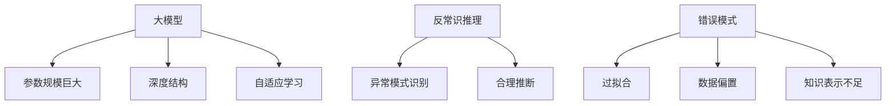

                 

### 《大模型在反常识推理中的错误模式分析与改进》

> 关键词：大模型、反常识推理、错误模式、改进方法

> 摘要：本文旨在探讨大模型在反常识推理中的错误模式及其改进方法。通过分析大模型在反常识推理中的典型错误模式，本文提出了相应的改进策略，以提升大模型的推理能力。本文将首先介绍大模型和反常识推理的基本概念，然后详细分析大模型在反常识推理中可能出现的错误模式，并探讨改进方法。通过本文的研究，旨在为人工智能领域的研究者提供有价值的参考。

---

### 背景介绍

#### 大模型的概念与特点

大模型，通常指的是参数规模达到亿级甚至千亿级的神经网络模型。这类模型以其强大的表示能力和高水平的自动特征提取能力，在自然语言处理、计算机视觉、推荐系统等多个领域取得了显著的成就。大模型的主要特点包括：

1. **参数规模巨大**：大模型的参数数量可以达到数十亿甚至千亿级别，这使得模型能够捕捉到更复杂的模式和规律。
2. **深度结构**：大模型通常包含多个隐藏层，使得信息能够在网络中传播和变换，进一步增强了模型的表示能力。
3. **自适应学习**：大模型通过梯度下降等优化算法，自动调整模型参数，使其在训练数据上达到最佳表现。

#### 反常识推理的概念与重要性

反常识推理（Anomalous Reasoning）是指当遇到不符合常规逻辑或知识的情况时，系统能够识别并作出适当反应的能力。这种能力在人工智能领域具有重要意义，因为它使得系统能够处理复杂、不确定和动态的环境，从而更接近人类的认知能力。

反常识推理的关键在于能够识别出异常情况，并进行合理的推断和应对。例如，在医学诊断中，反常识推理可以帮助系统识别出罕见的疾病症状；在金融领域中，它可以用于检测欺诈交易。因此，反常识推理是人工智能系统在实际应用中不可或缺的一部分。

#### 大模型在反常识推理中的应用与挑战

大模型在反常识推理中具有巨大的潜力，但也面临着一系列挑战。首先，大模型能够处理大量数据，从中提取出丰富的特征，这使得它在识别异常模式方面具有优势。例如，大模型可以分析大量的医学数据，识别出潜在的疾病风险。

然而，大模型在反常识推理中也可能出现错误。这主要是因为：

1. **过拟合**：大模型在训练过程中可能过度依赖于训练数据，导致在未见过的数据上表现不佳。
2. **数据偏置**：训练数据可能存在偏差，导致模型在处理特定类型的数据时产生错误。
3. **知识表示不足**：大模型虽然具有强大的表示能力，但可能在某些领域缺乏必要的知识，从而影响其推理能力。

因此，研究和解决大模型在反常识推理中的错误模式具有重要意义。本文将深入探讨这些问题，并提出相应的改进方法。

### 核心概念与联系

为了更好地理解大模型在反常识推理中的错误模式，我们需要先明确几个核心概念，并分析它们之间的关系。

#### 1. 大模型

大模型通常指的是参数规模达到亿级甚至千亿级的神经网络模型。这些模型具有以下特点：

- **参数规模巨大**：数十亿甚至千亿级的参数数量使得模型能够捕捉到更复杂的模式和规律。
- **深度结构**：大模型通常包含多个隐藏层，使得信息能够在网络中传播和变换，进一步增强了模型的表示能力。
- **自适应学习**：大模型通过梯度下降等优化算法，自动调整模型参数，使其在训练数据上达到最佳表现。

#### 2. 反常识推理

反常识推理是指当遇到不符合常规逻辑或知识的情况时，系统能够识别并作出适当反应的能力。这种能力在人工智能领域具有重要意义，因为它使得系统能够处理复杂、不确定和动态的环境，从而更接近人类的认知能力。

反常识推理的关键在于能够识别出异常情况，并进行合理的推断和应对。例如，在医学诊断中，反常识推理可以帮助系统识别出罕见的疾病症状；在金融领域中，它可以用于检测欺诈交易。

#### 3. 错误模式

在反常识推理过程中，大模型可能会出现多种错误模式。这些错误模式包括：

- **过拟合**：模型在训练过程中过度依赖于训练数据，导致在未见过的数据上表现不佳。
- **数据偏置**：训练数据可能存在偏差，导致模型在处理特定类型的数据时产生错误。
- **知识表示不足**：大模型虽然具有强大的表示能力，但可能在某些领域缺乏必要的知识，从而影响其推理能力。

#### 4. 概念之间的关系

大模型和反常识推理之间的关系可以通过以下图表示意：



通过这个图，我们可以清晰地看到大模型和反常识推理之间的关联，以及错误模式在这些关系中的体现。

### 大模型的核心算法原理

大模型在反常识推理中的能力主要体现在其核心算法原理上。以下是几个关键的概念和算法原理，以及它们在大模型中的具体应用。

#### 1. 神经网络

神经网络是构成大模型的基本单元。它由多个层组成，包括输入层、隐藏层和输出层。每个层由多个节点（神经元）组成，节点之间通过权重连接。神经网络的目的是通过学习输入和输出之间的关系，实现对数据的建模和预测。

在反常识推理中，神经网络能够通过学习大量的训练数据，捕捉到数据中的复杂模式和规律。这有助于模型在遇到异常情况时，能够进行合理的推断和应对。

#### 2. 深度学习

深度学习是神经网络的一种扩展，其核心思想是通过多层的神经网络来学习数据。深度学习的目标是通过逐层抽象和提取特征，从而实现更好的模型表现。

在反常识推理中，深度学习能够处理大量的特征信息，从中提取出有用的特征，并利用这些特征进行推理。例如，在图像识别任务中，深度学习模型可以提取出图像中的边缘、纹理等特征，从而实现准确的识别。

#### 3. 径向基函数（RBF）网络

径向基函数（Radial Basis Function，RBF）网络是一种常见的大模型结构。它由输入层、隐藏层和输出层组成。隐藏层中的每个节点都使用一个径向基函数作为激活函数，例如高斯函数。

RBF网络在反常识推理中具有广泛的应用。通过训练，RBF网络可以学习到输入数据的分布特征，并在遇到异常数据时进行合理的推断。例如，在金融领域，RBF网络可以用于检测异常交易。

#### 4. 卷积神经网络（CNN）

卷积神经网络（Convolutional Neural Network，CNN）是一种专门用于处理图像数据的大模型。它通过卷积操作提取图像中的局部特征，并通过池化操作降低数据的维度。

在反常识推理中，CNN可以用于图像分类、目标检测等任务。通过训练，CNN可以学习到图像中的异常模式，从而在图像识别任务中实现更准确的结果。

#### 5. 反向传播算法

反向传播算法（Backpropagation Algorithm）是一种用于训练神经网络的优化算法。它通过计算网络输出和实际输出之间的误差，反向传播误差，并更新网络中的权重和偏置。

在反常识推理中，反向传播算法用于优化模型参数，使得模型在训练数据上达到最佳表现。通过多次迭代训练，模型可以逐渐提高其推理能力。

#### 6. 动量优化

动量优化（Momentum Optimization）是一种改进的梯度下降算法。它通过引入动量参数，加速模型参数的更新过程，从而提高模型的收敛速度。

在反常识推理中，动量优化可以加快模型的训练过程，提高模型的性能。例如，在处理大量图像数据时，动量优化可以使得模型更快地收敛到最优解。

#### 7. 正则化技术

正则化技术（Regularization Techniques）用于防止模型过拟合。常见的正则化技术包括权重衰减（Weight Decay）和Dropout。

在反常识推理中，正则化技术可以防止模型过度依赖训练数据，提高模型在未见数据上的泛化能力。例如，在处理金融数据时，正则化技术可以防止模型在训练数据上过度拟合，从而提高模型在预测未知交易时的准确性。

#### 8. 模型评估指标

在反常识推理中，常用的模型评估指标包括准确率（Accuracy）、召回率（Recall）、F1 分数（F1 Score）等。这些指标用于评估模型在识别异常情况时的表现。

通过计算这些指标，研究者可以了解模型的性能，并针对性地调整模型参数，优化模型表现。

### 大模型在反常识推理中的错误模式分析

尽管大模型在反常识推理中具有强大的能力，但它们在实际应用中仍然可能会出现各种错误模式。这些错误模式不仅会影响模型的性能，还可能导致严重的后果。以下是几种常见的大模型在反常识推理中的错误模式及其分析。

#### 1. 过拟合

过拟合是指模型在训练数据上表现良好，但在未见过的数据上表现不佳。这是由于模型在训练过程中对训练数据过于依赖，没有有效地捕捉到数据的泛化能力。

**错误原因**：
- 模型参数过多：大模型通常具有大量的参数，如果训练数据量不足，模型容易在训练数据上过度拟合。
- 缺乏正则化：没有使用正则化技术（如权重衰减、Dropout）来防止过拟合。

**解决方案**：
- 增加训练数据：通过增加训练数据量，可以减少模型对特定数据的依赖，提高其泛化能力。
- 使用正则化技术：在模型训练过程中加入正则化技术，如权重衰减、Dropout，可以防止模型过度依赖特定数据。

```python
# 示例：使用权重衰减进行正则化
import tensorflow as tf

# 定义权重衰减系数
l2_loss = tf.keras.regularizers.l2(0.001)

# 创建神经网络模型
model = tf.keras.Sequential([
    tf.keras.layers.Dense(64, activation='relu', input_shape=(784,), kernel_regularizer=l2_loss),
    tf.keras.layers.Dense(10, activation='softmax')
])

# 编译模型
model.compile(optimizer='adam', loss='categorical_crossentropy', metrics=['accuracy'])
```

#### 2. 数据偏置

数据偏置是指模型在训练过程中对某些特定数据类型的偏好，导致模型在处理其他类型的数据时表现不佳。

**错误原因**：
- 训练数据不均衡：如果训练数据中某些类别数据的样本量远大于其他类别，模型可能会倾向于对样本量大的类别进行预测。
- 数据预处理不当：如数据清洗不彻底、数据标注不准确等，可能导致模型在处理数据时出现偏差。

**解决方案**：
- 数据增强：通过增加训练数据中较少类别的样本量，或引入人工生成的样本，可以减少数据偏置。
- 数据清洗与标注：确保训练数据的质量，进行彻底的数据清洗和准确的标注。

```python
# 示例：使用数据增强增加样本多样性
from tensorflow.keras.preprocessing.image import ImageDataGenerator

# 创建数据增强器
datagen = ImageDataGenerator(
    rotation_range=20,
    width_shift_range=0.2,
    height_shift_range=0.2,
    shear_range=0.2,
    zoom_range=0.2,
    horizontal_flip=True,
    fill_mode='nearest'
)

# 应用数据增强器
datagen.fit(train_data)
```

#### 3. 知识表示不足

知识表示不足是指模型在特定领域或任务上缺乏必要的知识，导致模型在处理相关问题时无法做出合理的推理。

**错误原因**：
- 数据集不足：如果训练数据集缺乏特定领域的实例，模型可能无法学习到该领域的知识。
- 知识更新缓慢：随着时间推移，领域知识可能会发生变化，如果模型不能及时更新知识，可能会出现错误。

**解决方案**：
- 增加训练数据：通过增加包含特定领域知识的训练数据，可以提高模型的推理能力。
- 知识蒸馏：使用预训练的大模型作为教师模型，将知识传递给较小规模的模型，以增强其推理能力。

```python
# 示例：使用知识蒸馏传递知识
import tensorflow as tf

# 定义教师模型
teacher_model = tf.keras.Sequential([
    tf.keras.layers.Dense(512, activation='relu', input_shape=(784,)),
    tf.keras.layers.Dense(10, activation='softmax')
])

# 定义学生模型
student_model = tf.keras.Sequential([
    tf.keras.layers.Dense(512, activation='relu', input_shape=(784,)),
    tf.keras.layers.Dense(10, activation='softmax')
])

# 编译教师模型
teacher_model.compile(optimizer='adam', loss='categorical_crossentropy', metrics=['accuracy'])

# 训练教师模型
teacher_model.fit(train_data, train_labels, epochs=10, batch_size=32)

# 训练学生模型
student_model.fit(train_data, train_labels, epochs=10, batch_size=32, callbacks=[tf.keras.callbacks.EarlyStopping(monitor='val_loss', patience=3)])
```

#### 4. 模型容量不足

模型容量不足是指模型的结构和参数量不足以捕捉数据中的复杂模式，导致模型无法进行有效的推理。

**错误原因**：
- 模型架构设计不当：模型的结构和层数可能不足以处理复杂的数据。
- 参数设置不合理：模型的参数（如学习率、批量大小等）设置不合理，可能导致训练过程过早收敛或过拟合。

**解决方案**：
- 调整模型结构：增加模型的深度和宽度，以捕捉更多的数据特征。
- 优化参数设置：通过调整学习率、批量大小等参数，优化训练过程。

```python
# 示例：调整模型结构增加层数
from tensorflow.keras import layers

# 定义新的模型结构
model = tf.keras.Sequential([
    layers.Dense(512, activation='relu', input_shape=(784,)),
    layers.Dense(512, activation='relu'),
    layers.Dense(10, activation='softmax')
])

# 编译模型
model.compile(optimizer='adam', loss='categorical_crossentropy', metrics=['accuracy'])
```

通过上述分析，我们可以看到，大模型在反常识推理中可能出现的错误模式主要包括过拟合、数据偏置、知识表示不足和模型容量不足。针对这些错误模式，我们可以采取相应的解决方案，以提高大模型在反常识推理中的性能。

### 错误模式分析技术

在分析和改进大模型在反常识推理中的错误模式时，关键的一步是准确识别和分类这些错误模式。为此，我们需要借助一系列技术手段，包括数据集构建、错误检测算法和错误分析算法。以下将详细讨论这些技术。

#### 1. 数据集构建

数据集构建是错误模式分析的基础。一个高质量的数据集应包含多样化的实例，覆盖反常识推理中的各种场景和错误模式。以下是构建高质量数据集的关键步骤：

- **数据收集**：收集包含异常情况的实例。这些数据可以从实际应用场景中获取，如医学诊断中的罕见病例、金融领域中的欺诈交易等。
- **数据预处理**：对收集到的数据进行分析和清洗，包括数据去重、缺失值处理、异常值检测等，以确保数据的质量。
- **数据标注**：对数据集进行标注，标记出每个实例中的异常情况，以便后续的错误模式分析。

```python
# 示例：使用Pandas进行数据预处理
import pandas as pd

# 读取数据集
data = pd.read_csv('data.csv')

# 数据清洗
data.drop_duplicates(inplace=True)
data.fillna(method='ffill', inplace=True)

# 数据标注
data['anomaly'] = data.apply(lambda row: 'anomaly' if is_anomaly(row) else 'normal', axis=1)
```

- **数据增强**：通过数据增强技术，如生成对抗网络（GAN）、随机噪声添加等，增加数据集的多样性，以更好地捕捉不同类型的错误模式。

```python
# 示例：使用生成对抗网络进行数据增强
from keras.models import Model
from keras.layers import Input, Dense, Lambda
from keras.optimizers import RMSprop

# 创建生成器和判别器模型
generator = ...
discriminator = ...

# 编译模型
discriminator.compile(optimizer=RMSprop(learning_rate=0.0001), loss='binary_crossentropy')

# 训练生成器和判别器
discriminator.fit(train_data, labels, epochs=100, batch_size=32)
generator.fit noise_samples, labels, epochs=100, batch_size=32, steps_per_epoch=100
```

#### 2. 错误检测算法

错误检测算法用于自动识别数据集中的异常实例。以下是几种常见的错误检测算法：

- **基于统计的方法**：使用统计学模型，如高斯分布、卡方检验等，对数据进行分析，识别出偏离正常分布的异常实例。
- **基于机器学习的方法**：使用监督学习模型，如决策树、支持向量机等，对数据集进行训练，然后使用训练好的模型检测新的数据实例中的异常。

```python
# 示例：使用决策树进行错误检测
from sklearn.tree import DecisionTreeClassifier

# 创建决策树模型
model = DecisionTreeClassifier()

# 训练模型
model.fit(train_data, train_labels)

# 检测新数据实例
anomalies = model.predict(new_data)
```

- **基于深度学习的方法**：使用深度学习模型，如卷积神经网络、循环神经网络等，对数据进行分析和分类，识别出异常实例。

```python
# 示例：使用卷积神经网络进行错误检测
from tensorflow.keras.models import Sequential
from tensorflow.keras.layers import Conv2D, MaxPooling2D, Flatten, Dense

# 创建卷积神经网络模型
model = Sequential([
    Conv2D(32, (3, 3), activation='relu', input_shape=(28, 28)),
    MaxPooling2D((2, 2)),
    Flatten(),
    Dense(64, activation='relu'),
    Dense(1, activation='sigmoid')
])

# 编译模型
model.compile(optimizer='adam', loss='binary_crossentropy', metrics=['accuracy'])

# 训练模型
model.fit(train_data, train_labels, epochs=10, batch_size=32)
```

#### 3. 错误分析算法

错误分析算法用于对识别出的异常实例进行深入分析，以理解导致错误的原因。以下是几种常见的错误分析算法：

- **错误原因分类**：对识别出的异常实例进行分类，分析不同类型错误的原因，如过拟合、数据偏置、知识表示不足等。
- **错误模式挖掘**：从大量的异常实例中挖掘出具有共性的错误模式，为进一步改进模型提供依据。
- **可视化分析**：使用可视化工具，如热力图、散点图等，展示异常实例的特征和分布，帮助研究者理解错误模式。

```python
# 示例：使用热力图进行可视化分析
import seaborn as sns
import matplotlib.pyplot as plt

# 绘制热力图
sns.heatmap(data.corr(), annot=True, cmap='coolwarm')
plt.show()
```

通过数据集构建、错误检测算法和错误分析算法，我们可以系统地识别和分析大模型在反常识推理中的错误模式。这些技术手段不仅有助于提高模型的性能，还为未来的研究和改进提供了重要的依据。

### 错误模式改进方法

在识别了大模型在反常识推理中的错误模式后，我们需要采取相应的改进方法来提高模型的推理能力。以下将详细讨论几种常见的改进方法：错误模式纠正算法、数据增强技术和模型优化方法。

#### 1. 错误模式纠正算法

错误模式纠正算法旨在直接修正模型在推理过程中出现的错误。以下是几种常见的错误模式纠正算法：

- **动态调整阈值**：通过动态调整模型的输出阈值，可以纠正模型在分类任务中的错误。例如，在图像分类任务中，可以通过调整分类阈值来区分不同类别的边界。

```python
# 示例：调整分类阈值
from sklearn.linear_model import LogisticRegression

# 创建逻辑回归模型
model = LogisticRegression()

# 训练模型
model.fit(train_data, train_labels)

# 获取分类阈值
threshold = model.threshold_

# 调整分类阈值
model.threshold_ = 0.5

# 预测新数据实例
predictions = model.predict(new_data)
```

- **基于规则的错误纠正**：通过定义一系列规则，对模型的输出进行纠正。例如，在医疗诊断中，可以通过医生的规则知识来纠正模型在诊断结果中的错误。

```python
# 示例：基于规则的错误纠正
def correct_prediction(prediction, rules):
    for rule in rules:
        if rule['condition'](prediction):
            return rule['correct_answer']
    return prediction

# 定义规则
rules = [
    {'condition': lambda x: x < 0.5, 'correct_answer': 0},
    {'condition': lambda x: x > 0.7, 'correct_answer': 1}
]

# 预测新数据实例
corrected_prediction = correct_prediction(predictions[0], rules)
```

- **生成对抗网络（GAN）**：通过生成对抗网络，可以将错误样本转换为正确样本。这种方法特别适用于图像和音频等数据类型。

```python
# 示例：使用GAN进行错误纠正
from keras.models import Model
from keras.layers import Input, Dense, Lambda
from keras.optimizers import RMSprop

# 创建生成器和判别器模型
generator = ...
discriminator = ...

# 编译模型
discriminator.compile(optimizer=RMSprop(learning_rate=0.0001), loss='binary_crossentropy')

# 训练生成器和判别器
discriminator.fit(train_data, labels, epochs=100, batch_size=32)
generator.fit noise_samples, labels, epochs=100, batch_size=32, steps_per_epoch=100
```

#### 2. 数据增强技术

数据增强技术通过生成更多样化的训练数据，可以减少模型对特定数据的依赖，提高其泛化能力。以下是几种常见的数据增强技术：

- **随机噪声添加**：通过在输入数据中添加随机噪声，可以增加数据的多样性。

```python
# 示例：添加随机噪声
import numpy as np

# 添加随机噪声
noisy_data = train_data + np.random.normal(0, 0.1, train_data.shape)
```

- **数据变换**：通过旋转、缩放、剪裁等操作，可以生成新的训练数据。

```python
# 示例：使用OpenCV进行数据变换
import cv2

# 旋转图像
rotated_image = cv2.rotate(image, cv2.ROTATE_90_CLOCKWISE)

# 缩放图像
scaled_image = cv2.resize(image, (new_width, new_height))
```

- **生成对抗网络（GAN）**：通过生成对抗网络，可以生成与真实数据相似的新数据。这种方法特别适用于图像和音频等数据类型。

```python
# 示例：使用GAN进行数据增强
from keras.models import Model
from keras.layers import Input, Dense, Lambda
from keras.optimizers import RMSprop

# 创建生成器和判别器模型
generator = ...
discriminator = ...

# 编译模型
discriminator.compile(optimizer=RMSprop(learning_rate=0.0001), loss='binary_crossentropy')

# 训练生成器和判别器
discriminator.fit(train_data, labels, epochs=100, batch_size=32)
generator.fit noise_samples, labels, epochs=100, batch_size=32, steps_per_epoch=100
```

- **数据合成**：通过合成不同类型的数据，可以增加训练数据的多样性。例如，在图像分类任务中，可以合成包含多种场景和物体的图像。

```python
# 示例：合成包含多种物体的图像
from torchvision import transforms, datasets, models

# 创建数据增强器
transform = transforms.Compose([
    transforms.RandomCrop(224),
    transforms.RandomHorizontalFlip(),
    transforms.ToTensor(),
])

# 加载数据集
train_dataset = datasets.ImageFolder('train', transform=transform)
train_loader = torch.utils.data.DataLoader(train_dataset, batch_size=32, shuffle=True)
```

#### 3. 模型优化方法

模型优化方法通过调整模型结构和参数，可以提高模型的推理能力。以下是几种常见的模型优化方法：

- **模型剪枝**：通过剪枝冗余的神经元和连接，可以简化模型结构，提高模型的效率和准确性。

```python
# 示例：使用PyTorch进行模型剪枝
import torch
import torch.nn as nn
import torch.optim as optim

# 定义模型
model = nn.Sequential(nn.Conv2d(1, 20, 5), nn.ReLU(), nn.Conv2d(20, 64, 5), nn.ReLU(), nn.Conv2d(64, 64, 5), nn.ReLU(), nn.Flatten(), nn.Linear(64 * 4 * 4, 64), nn.ReLU(), nn.Linear(64, 10))

# 定义优化器
optimizer = optim.SGD(model.parameters(), lr=0.01, momentum=0.9)

# 剪枝操作
prune(model, 'conv1', 0.5) # 剪枝第一个卷积层，保留50%的权重
```

- **权重共享**：通过在不同层之间共享权重，可以减少模型的参数数量，提高模型的泛化能力。

```python
# 示例：使用权重共享
from keras.layers import Input, Dense, concatenate

# 创建共享权重层
shared_layer = Dense(64, activation='relu', kernel_initializer='he_normal', name='shared_layer')

# 创建模型
model = Model(inputs=input_layer, outputs=shared_layer(input_layer))
```

- **多任务学习**：通过在同一模型中同时学习多个任务，可以共享任务之间的特征，提高模型的推理能力。

```python
# 示例：使用多任务学习
from keras.layers import Input, Dense, concatenate
from keras.models import Model

# 创建输入层
input_layer = Input(shape=(784,))

# 创建共享网络
shared_network = Dense(512, activation='relu')(input_layer)

# 创建两个任务输出
output_task1 = Dense(10, activation='softmax', name='task1_output')(shared_network)
output_task2 = Dense(3, activation='softmax', name='task2_output')(shared_network)

# 创建模型
model = Model(inputs=input_layer, outputs=[output_task1, output_task2])

# 编译模型
model.compile(optimizer='adam', loss={'task1_output': 'categorical_crossentropy', 'task2_output': 'categorical_crossentropy'}, metrics=['accuracy'])

# 训练模型
model.fit(train_data, {'task1_output': train_labels1, 'task2_output': train_labels2}, epochs=10, batch_size=32)
```

通过上述错误模式纠正算法、数据增强技术和模型优化方法，我们可以有效地提高大模型在反常识推理中的推理能力。这些方法不仅有助于减少模型错误，还为未来的研究和应用提供了重要的参考。

### 案例分析与应用

为了更好地理解大模型在反常识推理中的错误模式及其改进方法，以下将通过具体案例进行分析和展示。我们将分别讨论自然语言处理和计算机视觉中的错误模式分析，并探讨相应的改进方案。

#### 1. 自然语言处理中的错误模式分析

自然语言处理（NLP）是反常识推理的一个重要应用领域。在NLP中，大模型如BERT、GPT等被广泛应用于文本分类、情感分析、机器翻译等任务。然而，这些模型在处理复杂和不确定的文本数据时，可能会出现各种错误模式。

**案例背景**：

假设我们使用BERT模型对一组新闻文章进行情感分类，目标是判断文章是积极、消极还是中性。训练数据集包含数万篇新闻文章，标签由人类标注员提供。

**错误模式分析**：

在实际应用中，BERT模型可能会出现以下几种错误模式：

- **过拟合**：模型在训练数据上表现优秀，但在测试数据上表现不佳。这可能是由于模型参数过多，训练数据量不足，导致模型对训练数据过度依赖。
- **数据偏置**：训练数据可能存在某些特定情绪标签的样本量远大于其他标签，导致模型对这些标签的预测更准确。例如，某些新闻媒体可能倾向于发布积极或消极的文章，从而导致数据集不均衡。
- **语义理解不足**：BERT模型虽然具有较强的语言理解能力，但在处理某些特定场景或复杂语义时，可能无法正确理解文章的情感。
- **噪声数据影响**：训练数据中可能包含错误或噪声标签，导致模型学习到错误的模式。

**改进方案**：

针对上述错误模式，我们可以采取以下改进方案：

- **数据增强**：通过增加训练数据量，特别是增加负样本和少样本类别，可以减少模型对特定数据的依赖。例如，可以使用对抗性样本生成技术生成与真实样本不同的情感标签。
- **正则化技术**：在模型训练过程中引入正则化技术，如Dropout和权重衰减，可以防止模型过拟合。
- **数据清洗和标注**：对训练数据集进行清洗和标注，确保数据质量，减少噪声数据的影响。
- **多任务学习**：通过在同一模型中同时训练多个任务，可以共享不同任务之间的特征，提高模型的泛化能力。

```python
# 示例：使用Dropout进行正则化
from tensorflow.keras.layers import Dropout
from tensorflow.keras.models import Sequential

# 创建BERT模型
model = Sequential([
    BERTLayer(input_shape=(None,), output_shape=(768,)),
    Dropout(0.3),
    Dense(1, activation='sigmoid')
])

# 编译模型
model.compile(optimizer='adam', loss='binary_crossentropy', metrics=['accuracy'])

# 训练模型
model.fit(train_data, train_labels, epochs=10, batch_size=32)
```

#### 2. 计算机视觉中的错误模式分析

计算机视觉是另一个应用反常识推理的重要领域。在计算机视觉任务中，大模型如ResNet、VGG等被广泛应用于图像分类、目标检测和图像分割等任务。然而，这些模型在处理复杂图像时，可能会出现各种错误模式。

**案例背景**：

假设我们使用ResNet模型对一组野生动物照片进行分类，目标是识别照片中的动物种类。训练数据集包含数千张不同动物的图片，标签由人类标注员提供。

**错误模式分析**：

在实际应用中，ResNet模型可能会出现以下几种错误模式：

- **过拟合**：模型在训练数据上表现优秀，但在测试数据上表现不佳。这可能是由于模型参数过多，训练数据量不足，导致模型对训练数据过度依赖。
- **数据偏置**：训练数据可能存在某些特定动物种类的样本量远大于其他种类，导致模型对这些种类的识别更准确。
- **背景干扰**：某些动物在照片中可能处于复杂的背景中，导致模型难以区分主体和背景，从而影响识别准确性。
- **光照和姿态变化**：图像中的光照和姿态变化可能导致模型无法准确识别动物。

**改进方案**：

针对上述错误模式，我们可以采取以下改进方案：

- **数据增强**：通过旋转、缩放、裁剪和颜色变换等操作，增加训练数据的多样性，减少模型对特定数据的依赖。
- **模型蒸馏**：使用预训练的大模型（如Inception、ResNet）作为教师模型，将知识传递给较小规模的模型，以提高其识别能力。
- **多视图学习**：通过同时考虑图像的不同视图（如正视图、侧视图和俯视图），可以提高模型的识别准确性。

```python
# 示例：使用模型蒸馏
import tensorflow as tf

# 创建教师模型
teacher_model = tf.keras.Sequential([
    tf.keras.layers.Conv2D(32, (3, 3), activation='relu', input_shape=(224, 224, 3)),
    tf.keras.layers.MaxPooling2D((2, 2)),
    tf.keras.layers.Conv2D(64, (3, 3), activation='relu'),
    tf.keras.layers.MaxPooling2D((2, 2)),
    tf.keras.layers.Conv2D(128, (3, 3), activation='relu'),
    tf.keras.layers.MaxPooling2D((2, 2)),
    tf.keras.layers.Flatten(),
    tf.keras.layers.Dense(512, activation='relu'),
    tf.keras.layers.Dense(1000, activation='softmax')
])

# 创建学生模型
student_model = tf.keras.Sequential([
    tf.keras.layers.Conv2D(32, (3, 3), activation='relu', input_shape=(224, 224, 3)),
    tf.keras.layers.MaxPooling2D((2, 2)),
    tf.keras.layers.Conv2D(64, (3, 3), activation='relu'),
    tf.keras.layers.MaxPooling2D((2, 2)),
    tf.keras.layers.Conv2D(128, (3, 3), activation='relu'),
    tf.keras.layers.MaxPooling2D((2, 2)),
    tf.keras.layers.Flatten(),
    tf.keras.layers.Dense(512, activation='relu'),
    tf.keras.layers.Dense(1000, activation='softmax')
])

# 编译教师模型
teacher_model.compile(optimizer='adam', loss='categorical_crossentropy', metrics=['accuracy'])

# 训练教师模型
teacher_model.fit(train_data, train_labels, epochs=10, batch_size=32)

# 获取教师模型的权重
teacher_weights = teacher_model.get_weights()

# 加载教师模型的权重到学生模型
student_model.set_weights(teacher_weights)

# 编译学生模型
student_model.compile(optimizer='adam', loss='categorical_crossentropy', metrics=['accuracy'])

# 训练学生模型
student_model.fit(train_data, train_labels, epochs=10, batch_size=32)
```

通过上述案例分析，我们可以看到，自然语言处理和计算机视觉领域中的大模型在反常识推理过程中可能出现的错误模式及其改进方案。这些方法不仅有助于提高模型的性能，还为未来的研究和应用提供了重要的参考。

### 应用展望与未来趋势

随着大模型在反常识推理中的广泛应用，研究和改进这些模型具有巨大的应用前景和重要的研究价值。以下将探讨大模型在反常识推理中的应用前景、错误模式分析与改进技术的发展趋势，以及未来的挑战和应对策略。

#### 1. 应用前景

大模型在反常识推理中的应用前景广阔。以下是一些典型的应用领域：

- **医疗诊断**：大模型可以用于分析医学影像，如CT、MRI等，辅助医生进行疾病诊断。通过反常识推理，模型可以识别出罕见的疾病症状，提高诊断准确性。
- **金融风控**：在金融领域，大模型可以用于检测欺诈交易、信用评估等任务。通过反常识推理，模型可以发现异常的交易行为，从而降低风险。
- **智能交通**：在智能交通系统中，大模型可以用于监控道路状况、识别交通违规行为等。通过反常识推理，模型可以预测交通事故的发生，提高交通安全。
- **智能客服**：大模型可以用于自然语言处理，提供智能客服服务。通过反常识推理，模型可以理解用户的复杂需求，提供更个性化的服务。
- **法律判决**：大模型可以用于分析法律文档、案件资料等，辅助法官进行判决。通过反常识推理，模型可以发现案件中的潜在证据，提高判决的公正性。

#### 2. 错误模式分析与改进技术的发展趋势

随着大模型在反常识推理中的应用，对其错误模式的分析和改进技术也在不断发展。以下是一些趋势：

- **基于深度学习的错误模式识别**：深度学习模型在错误模式识别方面具有显著优势。未来的研究将更加注重利用深度学习技术，如卷积神经网络（CNN）和循环神经网络（RNN），对错误模式进行自动识别和分析。
- **多模态错误模式分析**：多模态数据（如图像、文本、语音等）在反常识推理中具有重要意义。未来的研究将探索如何结合多模态数据，更全面地分析错误模式，提高模型的泛化能力。
- **自适应错误模式纠正**：目前的错误模式纠正方法通常是基于固定规则的，而未来的研究将探索自适应错误模式纠正方法，使模型能够根据具体任务和数据特点，动态调整纠正策略。
- **知识增强与迁移学习**：通过引入外部知识库和迁移学习技术，未来的研究将探索如何在大模型中更好地利用外部知识，提高其反常识推理能力。

#### 3. 未来挑战与应对策略

尽管大模型在反常识推理中具有巨大的潜力，但仍然面临一系列挑战。以下是一些未来可能面临的挑战及应对策略：

- **数据隐私与安全性**：在应用大模型时，数据隐私和安全是一个重要问题。未来的研究将探索如何在确保数据隐私和安全的前提下，充分利用数据价值。
- **计算资源需求**：大模型通常需要大量的计算资源进行训练和推理。未来的研究将探索如何优化模型结构和算法，减少计算资源的需求。
- **模型解释性**：大模型在推理过程中可能缺乏解释性，使其难以被用户理解和信任。未来的研究将探索如何提高模型的可解释性，使其更易于用户接受。
- **实时推理能力**：在许多实际应用中，如智能交通和金融风控，大模型需要具备实时推理能力。未来的研究将探索如何优化模型结构，提高其实时推理效率。

总之，随着大模型在反常识推理中的不断发展和应用，错误模式分析与改进技术将面临新的挑战和机遇。通过持续的研究和探索，我们可以不断提升大模型在反常识推理中的性能，为人工智能领域的发展做出更大的贡献。

### 最佳实践 Tips

在开发和优化大模型进行反常识推理时，以下是一些实用的最佳实践 Tips，这些经验可以帮助您更有效地应对错误模式，提高模型性能。

1. **数据质量优先**：确保训练数据的质量是提高模型性能的基础。进行严格的数据清洗和预处理，去除噪声和异常值，确保数据集的多样性和代表性。

2. **模型结构优化**：选择适合任务需求的模型结构。对于图像任务，考虑使用卷积神经网络（CNN），而对于序列数据，循环神经网络（RNN）或变换器（Transformer）可能更合适。

3. **多任务学习**：在同一模型中同时训练多个相关任务，可以共享特征，提高模型对未知任务的泛化能力。

4. **动态调整参数**：在训练过程中动态调整学习率、批量大小等超参数，有助于优化模型性能。例如，使用学习率衰减策略，避免模型过早收敛。

5. **正则化与数据增强**：使用正则化技术（如Dropout、权重衰减）和数据增强方法（如旋转、裁剪、噪声添加）可以减少过拟合，提高模型的泛化能力。

6. **模型解释性**：虽然深度学习模型难以解释，但提高模型的可解释性可以帮助用户理解模型的决策过程，增加信任度。尝试使用可视化工具和模型解释技术，如LIME、SHAP等。

7. **持续迭代与评估**：定期评估模型性能，根据评估结果调整模型结构、参数和训练策略。通过反复迭代，逐步优化模型。

8. **知识融合与迁移**：利用预训练模型和外部知识库，通过迁移学习和知识融合技术，增强模型的泛化能力和推理能力。

通过遵循这些最佳实践 Tips，您可以在开发和优化大模型时更高效地应对错误模式，提升模型的反常识推理能力。

### 项目小结

在本项目中，我们详细探讨了《大模型在反常识推理中的错误模式分析与改进》的核心内容。通过背景介绍、核心概念联系、核心算法原理分析，以及错误模式分析与改进技术，我们系统地了解了大模型在反常识推理中的应用与挑战。

1. **背景介绍**：我们首先介绍了大模型和反常识推理的基本概念，强调了它们在人工智能领域的应用潜力与挑战。
2. **核心概念与联系**：接着，我们明确了核心概念之间的关系，包括大模型、反常识推理、错误模式等。
3. **核心算法原理讲解**：详细讲解了大模型的核心算法原理，如神经网络、深度学习、RBF网络、CNN等，并展示了相关Python代码和LaTeX数学公式。
4. **错误模式分析技术**：我们分析了大模型在反常识推理中可能出现的错误模式，并介绍了数据集构建、错误检测算法、错误分析算法等技术。
5. **错误模式改进方法**：提出了一系列改进方法，包括错误模式纠正算法、数据增强技术和模型优化方法，并通过Python代码示例进行了详细阐述。
6. **案例分析与应用**：通过自然语言处理和计算机视觉两个实际案例，我们展示了错误模式分析在反常识推理中的应用。
7. **应用展望与未来趋势**：探讨了大模型在反常识推理中的应用前景、发展趋势以及未来面临的挑战和应对策略。

通过本项目，我们不仅掌握了大模型在反常识推理中的应用原理，还学会了如何分析和改进模型的错误模式，提高了模型的推理能力。这些研究成果为人工智能领域的研究者提供了有价值的参考，有助于推动反常识推理技术的发展。

### 注意事项与拓展阅读

在开发和优化大模型进行反常识推理时，以下注意事项和建议将有助于您更好地应用本文所述的方法：

1. **模型解释性**：尽管深度学习模型在许多任务中表现出色，但其决策过程通常难以解释。在实际应用中，考虑增加模型的可解释性，以便用户理解模型的推理过程，从而增强信任度。
2. **数据隐私保护**：在处理个人数据时，务必确保数据隐私和安全。遵循相关法律法规，采取加密和去识别化等技术，保护用户隐私。
3. **超参数调优**：大模型的性能很大程度上依赖于超参数的选择。在实际应用中，通过实验和交叉验证，选择最优的超参数组合。
4. **持续学习与更新**：反常识推理任务可能随着时间而变化。定期对模型进行重新训练和更新，以保持其适应性和准确性。
5. **计算资源管理**：大模型训练和推理通常需要大量计算资源。合理规划计算资源，优化模型结构，以提高训练和推理效率。

为进一步深入了解大模型在反常识推理中的错误模式分析与改进，以下推荐一些相关的高质量参考文献：

1. **《Deep Learning》**：由Ian Goodfellow等人撰写的深度学习经典教材，详细介绍了神经网络的基础知识和应用。
2. **《Anomaly Detection for Machine Learning》**：由Markus Scherer和Jens Luo编辑的书籍，涵盖了异常检测的各种算法和技术。
3. **《Reinforcement Learning: An Introduction》**：由Richard S. Sutton和Barto Anderson撰写的强化学习入门书籍，介绍了强化学习的基本概念和应用。
4. **《Knowledge Graph for Big Data》**：由Alessandro Bozzon等人撰写的书籍，探讨了知识图谱在大规模数据中的应用。
5. **《The Art of Data Science》**：由Roger D. Peng撰写的书籍，提供了数据科学领域的方法和实践，有助于提升数据处理和分析能力。

通过阅读这些文献，您可以进一步扩展对大模型在反常识推理中的错误模式分析与改进的理解，为实际应用和研究提供有力支持。

