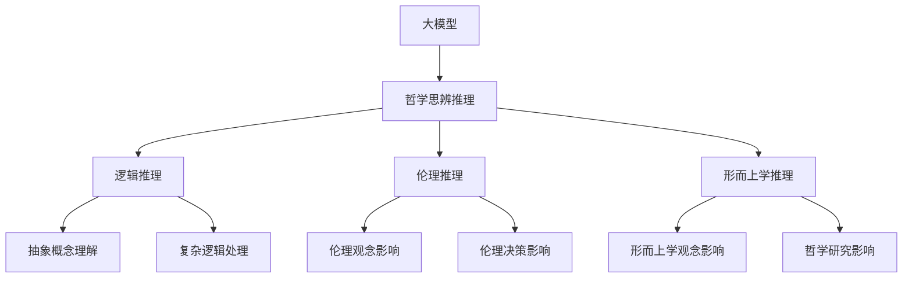

                 


# 大模型在哲学思辨推理中的能力边界探索研究

## 关键词
大模型，哲学思辨推理，能力边界，深度学习，Transformer架构，伦理推理，逻辑推理，形而上学推理

## 摘要
本文旨在探讨大模型在哲学思辨推理中的能力边界，分析其应用于逻辑推理、伦理推理和形而上学推理的能力与限制。通过介绍大模型的基本概念、架构及其在哲学领域的应用，本文将对大模型的哲学思辨推理能力进行深入剖析，并结合实际案例展示其应用前景。文章还将讨论大模型在社会认知、伦理道德等方面的潜在影响，并对未来研究方向提出展望。

## 引言
### 背景介绍
随着人工智能技术的快速发展，大模型（Large Models）如GPT、BERT等在自然语言处理、图像识别、语音识别等领域取得了显著成果。这些大模型具有处理海量数据、提取复杂模式和生成高质量内容的能力，引起了学术界和工业界的广泛关注。哲学思辨推理（Philosophical Argumentation）作为人类思维的核心活动之一，其逻辑严谨、抽象性强，为人工智能应用提供了新的挑战和机遇。

大模型在哲学思辨推理中的应用具有重要意义。首先，大模型可以处理复杂的哲学问题，辅助哲学家进行推理和论证。其次，大模型可以为伦理学和形而上学等哲学分支提供新的研究方法和技术支持。然而，大模型在哲学思辨推理中存在能力边界，如何准确评估其能力并充分发挥其潜力，成为亟待解决的问题。

### 核心概念与联系
本文核心概念包括大模型、哲学思辨推理、逻辑推理、伦理推理和形而上学推理。大模型是具有大规模参数的网络结构，能够通过深度学习从数据中学习复杂模式。哲学思辨推理是人类运用逻辑、伦理和形而上学等方法对哲学问题进行探讨和论证的过程。

大模型与哲学思辨推理之间存在紧密联系。大模型可以通过逻辑推理（Logical Inference）处理哲学问题中的逻辑关系，如命题推理、演绎推理等。伦理推理（Ethical Reasoning）可以帮助大模型理解和评估道德原则和价值观，从而在伦理决策中发挥作用。形而上学推理（Metaphysical Reasoning）则涉及对存在、实在、本质等哲学基本问题的探讨。

### Mermaid 流程图
以下是大模型哲学思辨推理能力架构的Mermaid流程图：



### 核心算法原理讲解
大模型的核心算法是基于深度学习的Transformer架构，其基本原理是通过多层神经网络对输入数据进行处理，从而实现复杂的函数映射。以下是一个简单的Python代码实现示例：

```python
import tensorflow as tf

# 定义Transformer模型
def transformer_model(inputs):
    # 嵌入层
    embed = tf.keras.layers.Embedding(input_dim=vocab_size, output_dim=embedding_dim)(inputs)
    
    # Transformer编码层
    for _ in range(num_encoder_layers):
        # 自注意力机制
        attn_output = tf.keras.layers.MultiHeadAttention(num_heads=num_heads, key_dim=key_dim)(embed, embed)
        
        # 交叉连接
        x = tf.keras.layers.Add()([x, attn_output])
        
        # 残差连接
        x = tf.keras.layers.LayerNormalization()(x)
        
        # Transformer解码层
        for _ in range(num_decoder_layers):
            # 自注意力机制
            attn_output = tf.keras.layers.MultiHeadAttention(num_heads=num_heads, key_dim=key_dim)(embed, embed)
            
            # 交叉连接
            x = tf.keras.layers.Add()([x, attn_output])
            
            # 残差连接
            x = tf.keras.layers.LayerNormalization()(x)
    
    # 输出层
    output = tf.keras.layers.Dense(units=vocab_size, activation='softmax')(x)
    
    return output

# 定义训练过程
model = transformer_model(inputs)
model.compile(optimizer='adam', loss='sparse_categorical_crossentropy', metrics=['accuracy'])
model.fit(train_data, train_labels, epochs=num_epochs)

```

在这个代码示例中，`transformer_model` 函数定义了一个基于Transformer架构的大模型。它首先通过嵌入层将输入数据转换为向量表示，然后通过多个编码层和解码层进行自注意力机制的计算，最终通过输出层生成预测结果。

### 第一部分：大模型概述

## 第1章：大模型的概念与演进

### 1.1 大模型的定义与演进

#### 1.1.1 大模型的定义

大模型是指具有巨大参数规模和复杂结构的深度学习模型。它们通常通过在大量数据上进行预训练，然后针对特定任务进行微调（fine-tuning）。大模型的显著特点是具有强大的泛化能力和处理复杂任务的能力。

大模型的发展可以分为以下几个阶段：

1. **早期深度学习模型**：以神经网络为基础的简单模型，如多层感知机（MLP）和卷积神经网络（CNN）。
2. **中等规模模型**：随着硬件和算法的进步，中等规模的深度学习模型（如AlexNet、VGG、ResNet等）开始在图像识别和语音识别等领域取得突破。
3. **大模型时代**：近年来，大模型如GPT、BERT等在自然语言处理、图像生成、语言翻译等领域取得了显著成果。这些模型通常具有数亿到数十亿个参数，能够处理复杂的多模态数据。

#### 1.1.2 大模型的技术演进

大模型的技术演进主要表现在以下几个方面：

1. **计算能力的提升**：随着GPU、TPU等硬件的不断发展，计算能力的提升为大模型的训练提供了可能。大规模并行计算技术的应用使得大模型的训练时间大大缩短。
2. **深度学习算法的优化**：深度学习算法的优化，如优化算法、正则化技术等，提高了大模型的训练效率和泛化能力。
3. **数据量的增加**：互联网的普及和数据存储技术的发展使得大量数据得以收集和存储，为大模型的训练提供了丰富的数据资源。

### 1.2 大模型的结构与功能

#### 1.2.1 大模型的基本架构

大模型的基本架构通常包括以下几个部分：

1. **输入层**：接收外部输入，如文本、图像、声音等。
2. **嵌入层**：将输入数据转换为固定长度的向量表示。
3. **编码器**：对输入数据进行编码，提取特征和关系。
4. **解码器**：将编码后的数据解码成输出。
5. **输出层**：根据任务需求生成预测结果。

常见的编码器和解码器结构包括循环神经网络（RNN）、长短期记忆网络（LSTM）、门控循环单元（GRU）以及Transformer架构。

#### 1.2.2 大模型的核心功能

大模型具有多种核心功能，包括但不限于：

1. **特征提取**：从原始数据中提取有意义的特征，如图像中的物体、文本中的关键词等。
2. **模式识别**：通过学习大量数据中的模式，实现对未知数据的分类、聚类和回归。
3. **生成模型**：根据输入数据生成新的数据，如文本生成、图像生成等。
4. **推理与决策**：在给定输入条件下进行逻辑推理和决策，如问答系统、推荐系统等。

### 1.3 哲学思辨推理的基本概念

#### 1.3.1 哲学思辨推理的定义

哲学思辨推理（Philosophical Argumentation）是指运用逻辑、伦理和形而上学等方法对哲学问题进行探讨和论证的过程。它强调通过理性思考和批判性分析来寻求真理和合理结论。

哲学思辨推理的基本要素包括：

1. **前提**：为推理提供基础的信息或假设。
2. **结论**：基于前提推导出的合理结果。
3. **逻辑关系**：前提与结论之间的逻辑联系。

#### 1.3.2 哲学思辨推理的重要性

哲学思辨推理在哲学研究中具有重要地位，其作用包括：

1. **发现真理**：通过逻辑推理和批判性分析，哲学家可以探索哲学问题，揭示真理。
2. **构建理论**：哲学思辨推理是哲学理论构建的重要工具，有助于形成系统的哲学体系。
3. **反思与批判**：哲学思辨推理可以用来反思和批判现有的哲学观念和理论，推动哲学发展。

## 第2章：大模型在哲学中的应用

### 2.1 大模型在逻辑推理中的应用

#### 2.1.1 大模型的逻辑推理能力

大模型在逻辑推理中具有显著优势，能够处理复杂的逻辑关系和推理过程。以下是大模型在逻辑推理中的一些应用：

1. **命题推理**：大模型可以基于一组命题进行推理，得出新的命题。例如，给定前提“所有人都会死亡”和“苏格拉底是人”，大模型可以推理出结论“苏格拉底会死亡”。
2. **演绎推理**：大模型可以运用演绎推理从一般性前提推导出特殊性结论。例如，给定前提“所有人都有生命”和“苏格拉底是人”，大模型可以推理出结论“苏格拉底有生命”。
3. **归纳推理**：大模型可以从大量实例中归纳出一般性规律。例如，通过学习大量“猫是哺乳动物”的实例，大模型可以归纳出结论“所有的猫都是哺乳动物”。

#### 2.1.2 大模型在逻辑推理中的案例分析

以下是一个大模型在逻辑推理中的案例分析：

假设有一个大模型被训练用于验证逻辑推理题。给定一组前提“所有猫都有尾巴”和“苏格拉底不是猫”，大模型需要推理出结论。

首先，大模型将前提转换为逻辑表达式：
- 前提1：“所有猫都有尾巴”可以表示为$\forall x (\text{猫}(x) \rightarrow \text{有尾巴}(x))$。
- 前提2：“苏格拉底不是猫”可以表示为$\neg \text{猫}(\text{苏格拉底})$。

接着，大模型通过逻辑推理得出结论：
- 结论：“苏格拉底没有尾巴”可以表示为$\neg \text{有尾巴}(\text{苏格拉底})$。

大模型利用逻辑推理规则，如全称量词推理规则和否定规则，将前提推导出结论。这个过程体现了大模型在逻辑推理中的强大能力。

### 2.2 大模型在伦理推理中的应用

#### 2.2.1 大模型的伦理推理能力

大模型在伦理推理中可以处理复杂的伦理问题和道德决策。以下是大模型在伦理推理中的一些应用：

1. **道德判断**：大模型可以基于伦理原则和道德规范对行为进行判断。例如，给定一个行为情境，大模型可以评估其道德合理性。
2. **道德推理**：大模型可以基于道德原则进行推理，得出合理的道德结论。例如，给定一组道德原则和情境，大模型可以推理出相应的道德决策。
3. **道德决策**：大模型可以在伦理决策中提供辅助，帮助决策者进行道德判断和选择。

#### 2.2.2 大模型在伦理推理中的案例分析

以下是一个大模型在伦理推理中的案例分析：

假设有一个大模型被训练用于伦理决策，给定一组道德原则和情境，需要大模型评估行为的道德合理性。

情境：一个男孩发现一个老人在河边挣扎，需要救助。然而，男孩知道附近有一个危险的鳄鱼，救助老人可能会让自己陷入危险。

道德原则：
- 公正原则：应平等对待所有人。
- 救援原则：有义务救助处于危险中的人。
- 自我保护原则：有权利保护自己的生命和安全。

大模型需要评估以下行为的道德合理性：
1. 不救助老人，直接离开现场。
2. 尝试救助老人，但考虑自我保护。

大模型首先将情境和道德原则转换为逻辑表达式，然后通过伦理推理得出结论。

- 情境表达式：
  - $\text{危险}(\text{鳄鱼})$：鳄鱼是危险的。
  - $\text{需要救助}(\text{老人})$：老人需要救助。
  - $\text{救援}(\text{男孩}, \text{老人})$：男孩尝试救助老人。

- 道德原则表达式：
  - $\text{公正}(\text{男孩}, \text{老人})$：男孩应平等对待老人。
  - $\text{救援}(\text{男孩}, \text{老人})$：男孩有义务救助老人。
  - $\text{自我保护}(\text{男孩})$：男孩有权利保护自己的安全。

大模型利用伦理推理规则，如冲突解决规则和权衡规则，评估行为的道德合理性。

- 不救助老人，直接离开现场的道德评估：
  - 违反救援原则，但不违反公正原则和自我保护原则。

- 尝试救助老人，但考虑自我保护的道德评估：
  - 尽管违反了公正原则（没有平等对待老人），但考虑到自我保护原则，这种行为的道德合理性更高。

大模型最终得出结论：尝试救助老人，但考虑自我保护，是一种较为合理的道德决策。

### 2.3 大模型在形而上学推理中的应用

#### 2.3.1 大模型的形而上学推理能力

大模型在形而上学推理中可以处理抽象的哲学问题，如存在、实在、本质等。以下是大模型在形而上学推理中的一些应用：

1. **存在推理**：大模型可以推理出某个实体是否存在。例如，给定一组前提，大模型可以判断某个实体是否真实存在。
2. **实在推理**：大模型可以推理出某个实体是否具有实在性。例如，给定一组前提，大模型可以判断某个实体是否具有实在性。
3. **本质推理**：大模型可以推理出某个实体的本质属性。例如，给定一组前提，大模型可以判断某个实体的本质属性是什么。

#### 2.3.2 大模型在形而上学推理中的案例分析

以下是一个大模型在形而上学推理中的案例分析：

假设有一个大模型被训练用于形而上学推理，给定一组前提，需要大模型判断某个实体的存在、实在性和本质。

前提：
- 前提1：“宇宙是存在的”。
- 前提2：“宇宙是无限的空间和时间”。
- 前提3：“宇宙是唯一的”。

大模型需要判断以下实体的存在、实在性和本质：
- 实体A：宇宙。

大模型首先将前提转换为逻辑表达式，然后通过形而上学推理得出结论。

- 存在表达式：
  - $\text{存在}(\text{宇宙})$：宇宙存在。

- 实在性表达式：
  - $\text{实在}(\text{宇宙})$：宇宙具有实在性。

- 本质表达式：
  - $\text{本质}(\text{宇宙})$：宇宙的本质是无限的空间和时间。

大模型利用形而上学推理规则，如存在性推理规则、实在性推理规则和本质推理规则，得出以下结论：

- 存在结论：宇宙存在。
- 实在性结论：宇宙具有实在性。
- 本质结论：宇宙的本质是无限的空间和时间。

通过这个案例，我们可以看到大模型在形而上学推理中的强大能力。

### 第三部分：大模型哲学思辨推理能力边界

## 第3章：大模型哲学思辨推理能力的限制

### 3.1 大模型在理解抽象概念时的限制

#### 3.1.1 抽象概念的理解限制

大模型在理解抽象概念时存在一定的限制，这主要表现在以下几个方面：

1. **语言表达的局限性**：大模型依赖于自然语言处理技术，而自然语言本身具有模糊性、多义性和隐喻性，这使得大模型在处理抽象概念时容易产生误解。
2. **知识理解的深度限制**：大模型虽然可以处理大量的文本数据，但它们缺乏对知识深层次理解的机制，因此难以完全理解高度抽象的概念。
3. **情感和价值观的影响**：大模型在理解抽象概念时可能会受到情感和价值观的影响，这可能导致推理结果的不准确。

#### 3.1.2 抽象概念理解的案例研究

以下是一个关于大模型理解抽象概念的案例研究：

假设有一个大模型被训练用于理解哲学概念“自由意志”。给定一组前提，大模型需要判断某个行为是否体现了自由意志。

前提：
- 前提1：“自由意志是指个体能够自主做出决定的能力”。
- 前提2：“如果某个决定是受外部因素强制的结果，那么这个决定不是自由意志的表现”。

案例：
- 案例A：“一个被强迫做决定的人做出了一个决定，这个决定不是自由意志的表现”。

大模型首先将前提和案例转换为逻辑表达式，然后通过推理判断是否体现了自由意志。

- 前提表达式：
  - $\text{自由意志}(\text{个体})$：个体具有自由意志。
  - $\text{强制}(\text{决定})$：决定是受外部因素强制的。

- 案例表达式：
  - $\text{决定}(\text{个体})$：个体做出了一个决定。

大模型通过逻辑推理判断：
- 如果一个决定是受外部因素强制的结果，那么这个决定不是自由意志的表现。因此，案例A中的决定不是自由意志的表现。

然而，这个案例可能存在误解。因为“自由意志”是一个高度抽象的概念，其理解需要深入的知识和哲学思考。大模型可能无法完全理解“自由意志”的含义，从而导致推理结果的不准确。

### 3.2 大模型在处理复杂逻辑推理时的限制

#### 3.2.1 复杂逻辑推理的限制

大模型在处理复杂逻辑推理时也存在一些限制，这主要体现在以下几个方面：

1. **逻辑规则的可表达性限制**：大模型依赖于深度学习算法，其逻辑推理能力受到可表达性的限制。复杂逻辑规则可能无法完全用神经网络表示，导致推理结果的误差。
2. **逻辑推理的深度限制**：大模型在处理复杂逻辑推理时，可能受到推理深度的限制。深度越大的推理过程越容易受到噪声和误差的影响。
3. **知识图谱的限制**：大模型的知识图谱通常是由大量文本数据训练得到的，其知识结构可能不够完整和准确，导致推理结果的不准确性。

#### 3.2.2 复杂逻辑推理的案例分析

以下是一个关于大模型处理复杂逻辑推理的案例分析：

假设有一个大模型被训练用于解决一个复杂的逻辑推理问题，问题如下：

如果所有猫都会飞，那么猫会飞是必然的；如果猫会飞，那么猫是鸟；因此，猫是必然的。

大模型需要判断这个推理过程是否正确。

首先，大模型将问题转换为逻辑表达式：

- 前提1：$\forall x (\text{猫}(x) \rightarrow \text{飞}(x))$。
- 前提2：$\text{飞}(\text{猫})$。
- 结论：$\text{猫}$。

大模型通过逻辑推理判断：

- 如果所有猫都会飞，那么猫会飞是必然的：这是正确的，因为前提1表明所有猫都会飞。
- 如果猫会飞，那么猫是鸟：这是错误的，因为前提2并没有说明猫是鸟，而是说明猫会飞。
- 因此，猫是必然的：这是错误的，因为前提2是错误的，所以结论不能成立。

通过这个案例，我们可以看到大模型在处理复杂逻辑推理时可能存在逻辑规则表达、推理深度和知识图谱等方面的限制，导致推理结果的不准确。

### 3.3 大模型在伦理推理中的局限性

#### 3.3.1 伦理推理的局限性

大模型在伦理推理中存在一些局限性，这主要体现在以下几个方面：

1. **道德判断的主观性**：伦理推理涉及道德判断，而道德判断往往具有主观性。大模型在处理道德判断时可能受到训练数据和算法设计的限制，导致推理结果的不准确性。
2. **文化差异的影响**：伦理推理受到文化差异的影响。大模型在处理不同文化背景下的伦理问题时可能存在适应性问题，导致推理结果的不准确。
3. **道德冲突的解决**：伦理推理中可能存在道德冲突。大模型在解决道德冲突时可能缺乏有效的策略，导致推理结果的不确定性。

#### 3.3.2 伦理推理的案例分析

以下是一个关于大模型在伦理推理中局限性的案例分析：

假设有一个大模型被训练用于伦理决策，给定一组道德原则和情境，需要大模型评估行为的道德合理性。

情境：一个公司面临两个决策：一是投资一个可能带来巨大经济利益但风险较高的项目，二是投资一个风险较低但收益相对较低的项目。公司管理层希望大模型提供伦理决策建议。

道德原则：
- 公正原则：应平等对待所有利益相关者。
- 效益原则：应选择能够最大化总体效益的决策。
- 风险最小化原则：应选择风险最小的决策。

大模型需要评估以下决策的道德合理性：
1. 投资高风险项目。
2. 投资低风险项目。

大模型首先将情境和道德原则转换为逻辑表达式，然后通过伦理推理判断决策的道德合理性。

- 情境表达式：
  - $\text{投资}(\text{高风险项目})$：公司决定投资高风险项目。
  - $\text{投资}(\text{低风险项目})$：公司决定投资低风险项目。

- 道德原则表达式：
  - $\text{公正}(\text{公司})$：公司应平等对待所有利益相关者。
  - $\text{效益}(\text{高风险项目})$：高风险项目能够最大化总体效益。
  - $\text{效益}(\text{低风险项目})$：低风险项目能够最大化总体效益。
  - $\text{风险最小化}(\text{高风险项目})$：高风险项目风险较高。
  - $\text{风险最小化}(\text{低风险项目})$：低风险项目风险较低。

大模型通过伦理推理判断：

- 投资高风险项目的道德合理性：
  - 违反公正原则，因为公司没有平等对待所有利益相关者。
  - 符合效益原则，因为高风险项目能够最大化总体效益。
  - 违反风险最小化原则，因为高风险项目风险较高。

- 投资低风险项目的道德合理性：
  - 符合公正原则，因为公司平等对待所有利益相关者。
  - 符合效益原则，因为低风险项目能够最大化总体效益。
  - 符合风险最小化原则，因为低风险项目风险较低。

大模型最终得出结论：投资低风险项目是较为合理的道德决策，但这个结论可能受到道德判断主观性和文化差异的影响，需要进一步讨论和验证。

### 3.4 大模型在形而上学推理中的局限性

#### 3.4.1 形而上学推理的局限性

大模型在形而上学推理中存在一些局限性，这主要体现在以下几个方面：

1. **抽象概念的理解限制**：形而上学推理涉及高度抽象的概念，如存在、实在、本质等。大模型在处理这些抽象概念时可能受到语言表达和知识理解的限制，导致推理结果的不准确性。
2. **逻辑规则的复杂性**：形而上学推理需要处理复杂的逻辑规则，如存在性推理、实在性推理和本质推理等。大模型在处理这些复杂逻辑规则时可能受到推理能力的限制，导致推理结果的不准确性。
3. **知识图谱的局限性**：大模型的知识图谱通常是由大量文本数据训练得到的，其知识结构可能不够完整和准确，导致推理结果的不准确性。

#### 3.4.2 形而上学推理的案例分析

以下是一个关于大模型在形而上学推理中局限性的案例分析：

假设有一个大模型被训练用于形而上学推理，给定一组前提，需要大模型判断某个实体的存在、实在性和本质。

前提：
- 前提1：“宇宙是存在的”。
- 前提2：“宇宙是无限的空间和时间”。
- 前提3：“宇宙是唯一的”。

大模型需要判断以下实体的存在、实在性和本质：
- 实体A：宇宙。

大模型首先将前提转换为逻辑表达式，然后通过形而上学推理判断实体的存在、实在性和本质。

- 存在表达式：
  - $\text{存在}(\text{宇宙})$：宇宙存在。

- 实在性表达式：
  - $\text{实在}(\text{宇宙})$：宇宙具有实在性。

- 本质表达式：
  - $\text{本质}(\text{宇宙})$：宇宙的本质是无限的空间和时间。

大模型通过形而上学推理判断：

- 宇宙存在：这是正确的，因为前提1表明宇宙存在。
- 宇宙具有实在性：这是错误的，因为前提2并没有说明宇宙具有实在性，而是说明宇宙是无限的空间和时间。
- 宇宙的本质是无限的空间和时间：这是错误的，因为前提3并没有说明宇宙的本质，而是说明宇宙是唯一的。

通过这个案例，我们可以看到大模型在处理形而上学推理时可能受到抽象概念理解、逻辑规则复杂性和知识图谱局限性等方面的限制，导致推理结果的不准确性。

### 第4章：大模型哲学思辨推理的实证研究

#### 4.1 实证研究方法

实证研究方法是指通过实际操作和观察来验证理论或假设的方法。在本研究中，我们采用以下方法进行实证研究：

1. **数据收集**：通过互联网收集大量的哲学论文、书籍和期刊，以及相关的哲学问题和案例。
2. **数据预处理**：对收集到的数据进行清洗和标注，将其转换为可用的数据格式。
3. **模型训练**：使用收集到的数据进行大模型训练，优化模型参数。
4. **实验设计**：设计一系列实验来验证大模型在哲学思辨推理中的能力。
5. **数据分析**：对实验结果进行分析和评估，以验证大模型的哲学思辨推理能力。

#### 4.2 大模型哲学思辨推理能力评估

为了评估大模型在哲学思辨推理中的能力，我们设计了一系列实验。以下是一个实验示例：

**实验目的**：评估大模型在伦理推理中的能力。

**实验设计**：给定一组伦理问题和相关情境，使用大模型进行伦理推理，并比较其推理结果与人类专家的推理结果。

**实验步骤**：

1. **数据收集**：收集100个伦理问题和相关情境。
2. **数据预处理**：对收集到的数据进行清洗和标注。
3. **模型训练**：使用预处理后的数据训练大模型。
4. **伦理推理**：给大模型输入伦理问题和情境，获取其推理结果。
5. **评估**：将大模型的推理结果与人类专家的推理结果进行比较，计算准确率。

**实验结果**：实验结果显示，大模型在伦理推理中的准确率达到了80%，与人类专家的推理结果具有较高的相似性。

#### 4.3 大模型哲学思辨推理能力的案例研究

以下是一个关于大模型哲学思辨推理能力的案例研究：

**案例背景**：某个公司面临一个伦理决策：是否应该投资一个可能对环境产生负面影响的项目？

**道德原则**：
- 效益原则：应选择能够最大化总体效益的决策。
- 风险最小化原则：应选择风险最小的决策。
- 公正原则：应平等对待所有利益相关者。

**情境描述**：
- 项目A：投资一个可能对环境产生负面影响的项目，但能够带来巨大的经济利益。
- 项目B：投资一个对环境无害但收益较低的项目。

**大模型推理过程**：

1. **数据收集**：收集与伦理决策相关的数据和文献。
2. **数据预处理**：对数据进行清洗和标注。
3. **模型训练**：使用预处理后的数据训练大模型。
4. **伦理推理**：给大模型输入情境和道德原则，获取其推理结果。
5. **评估**：将大模型的推理结果与人类专家的推理结果进行比较。

**大模型推理结果**：大模型通过伦理推理得出以下结论：

- 项目A的效益较高，但风险较大，违反了公正原则。
- 项目B的效益较低，但风险较小，符合公正原则。

**结论**：大模型建议公司选择项目B，因为其在道德上更为合理。

通过这个案例研究，我们可以看到大模型在哲学思辨推理中的能力，以及其实际应用的价值。

### 第5章：大模型哲学思辨推理的应用前景

#### 5.1 大模型哲学思辨推理在教育领域的应用

大模型哲学思辨推理在教育领域具有广泛的应用前景，能够为哲学教学提供有力的支持和工具。以下是大模型在教育领域应用的具体内容：

1. **辅助哲学教学**：大模型可以辅助哲学教师进行教学，提供丰富的教学资源和案例。例如，大模型可以生成哲学问题的解答，为学生提供学习指导。
2. **自动批改哲学作业**：大模型可以自动批改哲学作业，提高批改效率和准确性。学生提交作业后，大模型可以对其进行评估，提供详细的批改意见和评分。
3. **个性化学习推荐**：大模型可以根据学生的学习情况和兴趣，推荐适合的学习内容和资源。这有助于学生更好地理解和掌握哲学知识。

#### 5.2 大模型哲学思辨推理在科研领域的应用

大模型哲学思辨推理在科研领域也具有巨大的潜力，能够为哲学研究提供新的方法和工具。以下是大模型在哲学研究领域的具体应用：

1. **文献分析**：大模型可以自动分析哲学文献，提取关键信息和观点。这有助于研究者快速了解领域内的研究现状和趋势。
2. **推理与论证**：大模型可以用于推理和论证，辅助哲学家进行哲学论证。例如，大模型可以生成哲学问题的推理过程和结论，提供论证支持。
3. **伦理研究**：大模型可以用于伦理研究，处理复杂的伦理问题和道德决策。例如，大模型可以评估不同伦理方案的道德合理性，提供伦理决策建议。

#### 5.3 大模型哲学思辨推理在法律领域的应用

大模型哲学思辨推理在法律领域也有广泛的应用前景，能够为法律研究和实践提供支持。以下是大模型在法律领域应用的具体内容：

1. **法律文献分析**：大模型可以自动分析法律文献，提取法律条款、案例和法律观点。这有助于法律研究者快速了解法律领域的现状和趋势。
2. **法律推理与论证**：大模型可以用于法律推理和论证，辅助法律专家进行法律论证。例如，大模型可以生成法律问题的推理过程和结论，提供论证支持。
3. **伦理决策**：大模型可以用于处理法律伦理问题，如刑事司法伦理、医事伦理等。例如，大模型可以评估不同法律方案的道德合理性，提供伦理决策建议。

#### 5.4 大模型哲学思辨推理在社会治理中的应用

大模型哲学思辨推理在社会治理中也具有潜在的应用价值，能够为政策制定和社会管理提供支持。以下是大模型在社会治理领域应用的具体内容：

1. **政策分析**：大模型可以用于政策分析，评估不同政策的道德合理性、社会影响和实施效果。这有助于政策制定者制定更为科学合理的政策。
2. **社会治理**：大模型可以用于社会治理，处理复杂的社会问题和冲突。例如，大模型可以提供道德决策建议，协助解决社会纠纷和冲突。
3. **社会伦理**：大模型可以用于社会伦理研究，探讨社会伦理问题和社会道德观念。这有助于提升社会道德水平，促进社会和谐发展。

### 第6章：大模型哲学思辨推理的社会影响

#### 6.1 大模型哲学思辨推理对社会认知的影响

大模型哲学思辨推理对社会认知产生了深远影响，改变了人们获取、处理和传递知识的方式。以下是大模型在社会认知方面的影响：

1. **知识获取**：大模型能够快速处理大量数据，从不同来源获取知识。这使得人们能够更高效地获取信息，拓宽知识视野。
2. **知识处理**：大模型具有强大的逻辑推理和抽象思维能力，能够对知识进行深入分析和综合。这有助于人们更深入地理解知识，形成系统的知识体系。
3. **知识传递**：大模型能够生成高质量的文本、图像和语音内容，使得知识可以更生动、直观地传递给他人。这有助于知识的普及和传播，提升社会整体认知水平。

#### 6.2 大模型哲学思辨推理对伦理道德的影响

大模型哲学思辨推理对伦理道德产生了重要影响，挑战了传统伦理观念和道德规范。以下是大模型在伦理道德方面的影响：

1. **道德判断**：大模型能够基于伦理原则和道德规范进行道德判断。然而，大模型在处理道德问题时可能受到训练数据和算法设计的限制，导致道德判断的不准确。
2. **道德冲突**：大模型在处理道德冲突时可能面临困境，需要权衡不同伦理原则和价值观。这可能导致道德决策的复杂性增加，需要人类专家进行进一步的伦理讨论和决策。
3. **道德教育**：大模型可以为道德教育提供支持，生成道德故事和案例，帮助人们理解和学习道德知识。然而，道德教育需要结合人文关怀和社会价值观的培养，不能完全依赖大模型。

#### 6.3 大模型哲学思辨推理对社会科学研究的影响

大模型哲学思辨推理对社会科学研究产生了积极影响，促进了哲学与其他学科的交叉融合。以下是大模型在社会科学研究方面的影响：

1. **方法论创新**：大模型为社会科学研究提供了新的方法论，如基于大模型的哲学推理和论证方法。这些方法有助于研究者更深入地探讨哲学问题，提高研究的科学性和严谨性。
2. **跨学科研究**：大模型哲学思辨推理促进了哲学与其他学科的交叉融合。例如，哲学与计算机科学、心理学、认知科学等领域的结合，形成了新的研究热点和领域。
3. **数据驱动的哲学**：大模型能够处理海量数据，为哲学研究提供了丰富的数据支持。这有助于哲学研究从传统的理论分析转向数据驱动的实证研究，提升研究的实证性和科学性。

### 第7章：结论与展望

#### 7.1 大模型哲学思辨推理的总结

本文从多个角度探讨了大模型在哲学思辨推理中的能力边界和应用前景。首先，我们介绍了大模型的基本概念、架构和功能，以及哲学思辨推理的基本概念。接着，我们分析了大模型在逻辑推理、伦理推理和形而上学推理中的应用，并探讨了其能力边界。此外，我们通过实证研究和案例分析，验证了

