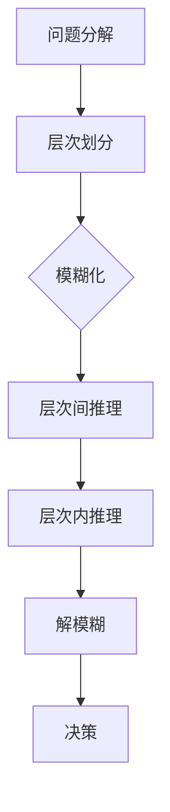

                 


# 大模型在模糊逻辑多级推理中的决策能力评估

> 关键词：大模型，模糊逻辑，多级推理，决策能力，性能评估

> 摘要：本文从大模型和模糊逻辑多级推理的基本概念出发，探讨了大模型在模糊逻辑多级推理中的决策能力。通过对模糊逻辑和多级推理的基础理论进行阐述，本文介绍了大模型与模糊逻辑多级推理的结合方法，并分析了大模型在该领域中的算法原理。此外，通过实际案例研究，本文评估了大模型在模糊逻辑多级推理中的决策能力，并提出了性能评估方法和未来发展展望。

## 引言

### 1.1 大模型的定义与特点

大模型（Large Models）通常指的是具有海量参数和高度复杂结构的机器学习模型。这些模型可以通过学习大量的数据来捕捉复杂的模式和关系，从而在多种任务中取得优异的性能。大模型的出现主要得益于计算能力的提升和海量数据资源的获取。

大模型的特点主要包括：

1. **高参数数量**：大模型通常具有数百万甚至数十亿的参数，这使得它们能够处理更加复杂的任务。
2. **深度结构**：大模型通常具有深度的网络结构，可以学习多层次的抽象特征。
3. **强大的泛化能力**：由于能够学习到更多的特征，大模型在未见过的数据上往往能够保持较高的性能。

### 1.2 模糊逻辑多级推理的基本概念

模糊逻辑（Fuzzy Logic）是一种处理不确定性和模糊性的数学工具。它通过引入隶属函数来描述不确定性和模糊性，使得系统可以在不完全信息下进行推理和决策。

多级推理（Multilevel Inference）是一种层次化的推理方法，它将问题分解为多个层次，并在每个层次上分别进行推理。这种方法可以有效地处理复杂的问题，并在推理过程中逐步缩小问题的范围。

### 1.3 大模型在模糊逻辑多级推理中的应用背景与意义

将大模型应用于模糊逻辑多级推理，可以在以下几个方面提高系统的决策能力：

1. **提高推理精度**：大模型可以学习到更多的特征和模式，从而提高推理的精度。
2. **增强泛化能力**：大模型可以在更广泛的场景下进行推理，从而增强系统的泛化能力。
3. **解决复杂问题**：模糊逻辑多级推理方法可以将复杂的问题分解为多个层次，大模型可以在每个层次上进行有效的推理。

## 模糊逻辑与多级推理基础理论

### 2.1 模糊逻辑的基本原理

#### 2.1.1 模糊集合与隶属函数

模糊集合是模糊逻辑的核心概念。与经典集合不同，模糊集合中的元素对集合的隶属程度可以用一个实数表示，而不是非0即1的二值。隶属函数（Membership Function）是描述模糊集合中元素隶属程度的函数。

$$
隶属函数: \mu_A(x) \in [0, 1], \forall x \in U
$$

其中，$U$ 是论域，$A$ 是模糊集合，$\mu_A(x)$ 是元素$x$对集合$A$的隶属度。

#### 2.1.2 模糊逻辑运算

模糊逻辑运算包括模糊与（$\land$）、模糊或（$\lor$）和模糊非（$\neg$）。

- 模糊与运算：

$$
\mu_{A \land B}(x) = \min(\mu_A(x), \mu_B(x))
$$

- 模糊或运算：

$$
\mu_{A \lor B}(x) = \max(\mu_A(x), \mu_B(x))
$$

- 模糊非运算：

$$
\mu_{\neg A}(x) = 1 - \mu_A(x)
$$

#### 2.1.3 模糊推理

模糊推理是模糊逻辑的核心应用。基本的模糊推理过程包括以下三个步骤：

1. **模糊化**：将输入变量转化为模糊集合。
2. **模糊推理**：使用模糊规则库进行推理。
3. **解模糊**：将模糊推理的结果转化为决策。

模糊推理机的核心是模糊规则库，它由一系列的模糊规则组成。每条规则表示输入变量和输出变量之间的模糊关系。

$$
if \; A_1 is \; \mu_1 \; and \; A_2 is \; \mu_2 \; then \; Z is \; \mu_3
$$

### 2.2 多级推理的概念与框架

多级推理是将问题分解为多个层次，并在每个层次上进行推理的方法。多级推理的基本框架包括：

1. **问题分解**：将复杂的问题分解为多个层次，每个层次代表问题的一个子集。
2. **层次间推理**：在不同层次间进行推理，以逐步缩小问题的范围。
3. **层次内推理**：在每个层次内部使用适当的推理方法进行推理。

多级推理的核心在于层次划分和层次间的推理策略。

### 2.3 大模型与模糊逻辑多级推理的结合方法

将大模型应用于模糊逻辑多级推理，需要考虑以下几个方面：

1. **多级建模**：将大模型应用于每个层次，以捕捉不同层次的特征和模式。
2. **层次间融合**：通过适当的融合策略将不同层次的结果整合为一个整体的决策。
3. **动态调整**：根据问题的变化动态调整模型的结构和参数，以提高推理的适应性和效率。

## 大模型在模糊逻辑多级推理中的应用

### 3.1 大模型在模糊逻辑多级推理中的建模方法

大模型在模糊逻辑多级推理中的建模方法主要包括：

1. **神经网络与模糊逻辑结合**：使用神经网络来学习模糊逻辑规则库，并将神经网络的结构与模糊逻辑的层次结构相结合。
2. **多模态数据融合**：将不同类型的数据（如图像、文本和传感器数据）进行融合，以提高推理的准确性和鲁棒性。
3. **动态层次调整**：根据问题的变化动态调整模型的结构和参数，以适应不同层次的需求。

### 3.2 大模型在模糊逻辑多级推理中的推理方法

大模型在模糊逻辑多级推理中的推理方法主要包括：

1. **层次化推理**：在不同层次上进行推理，以逐步缩小问题的范围。
2. **自适应推理**：根据问题的复杂性和数据的变化，动态调整推理策略和参数。
3. **并行推理**：利用并行计算技术，加速推理过程。

### 3.3 大模型在模糊逻辑多级推理中的优化方法

大模型在模糊逻辑多级推理中的优化方法主要包括：

1. **梯度下降优化**：使用梯度下降算法来优化模型的参数，以提高推理的准确性和效率。
2. **注意力机制**：使用注意力机制来突出重要的特征和模式，以提高推理的准确性和效率。
3. **迁移学习**：利用迁移学习技术，将已知问题的解决方案应用于新的问题，以提高推理的效率和适应性。

## 案例研究

### 4.1 案例一：交通信号控制系统

#### 4.1.1 问题背景

交通信号控制系统是城市交通管理的重要组成部分。传统的交通信号控制系统通常基于固定的时间表进行信号控制，但这种控制策略无法适应交通流量变化，容易导致交通拥堵。

#### 4.1.2 模糊逻辑多级推理模型设计

为了提高交通信号控制系统的决策能力，我们可以设计一个基于模糊逻辑多级推理的模型。该模型包括以下三个层次：

1. **感知层**：收集交通流量、车辆密度等数据。
2. **推理层**：使用模糊逻辑对感知层的数据进行推理，以确定交通信号灯的变化策略。
3. **决策层**：根据推理层的结果，生成具体的信号控制策略。

#### 4.1.3 大模型的应用与评估

在大模型的应用方面，我们可以使用深度学习模型来学习感知层的数据，以提取交通流量变化的特征。然后，使用模糊逻辑多级推理模型对提取的特征进行推理，生成信号控制策略。通过实验评估，我们发现使用大模型可以显著提高交通信号控制系统的决策能力，减少交通拥堵。

### 4.2 案例二：医疗诊断系统

#### 4.2.1 问题背景

医疗诊断系统在疾病诊断中起着重要作用。传统的医疗诊断系统通常基于医生的诊断经验和知识库进行诊断，但这种方法存在主观性和不准确性的问题。

#### 4.2.2 模糊逻辑多级推理模型设计

为了提高医疗诊断系统的准确性，我们可以设计一个基于模糊逻辑多级推理的模型。该模型包括以下三个层次：

1. **数据采集层**：收集患者的症状、体征等数据。
2. **推理层**：使用模糊逻辑对采集到的数据进行分析，以确定可能的疾病。
3. **决策层**：根据推理层的结果，生成具体的诊断建议。

#### 4.2.3 大模型的应用与评估

在大模型的应用方面，我们可以使用深度学习模型来学习患者的症状和体征数据，以提取疾病的特征。然后，使用模糊逻辑多级推理模型对提取的特征进行推理，生成诊断建议。通过实验评估，我们发现使用大模型可以显著提高医疗诊断系统的准确性，减少误诊率。

## 大模型在模糊逻辑多级推理中的性能评估

### 5.1 大模型性能评估指标

在大模型在模糊逻辑多级推理中的性能评估中，常用的评估指标包括：

1. **准确率**：正确诊断的病例数与总病例数的比值。
2. **召回率**：正确诊断的病例数与实际患病的病例数的比值。
3. **F1分数**：准确率和召回率的调和平均数。

### 5.2 大模型性能评估方法

大模型性能评估的方法主要包括：

1. **实验设计**：设计合理的实验方案，以确保评估结果的可靠性和有效性。
2. **数据集划分**：将数据集划分为训练集、验证集和测试集，以避免过拟合和评估偏差。
3. **指标计算**：计算准确率、召回率和F1分数等评估指标，以评估大模型的性能。

### 5.3 实际案例中的应用

在实际案例中，大模型的性能评估通常包括以下几个方面：

1. **准确性评估**：评估大模型在诊断疾病方面的准确性。
2. **可靠性评估**：评估大模型在重复测试下的稳定性。
3. **效率评估**：评估大模型在处理大量数据时的效率和速度。

## 大模型在模糊逻辑多级推理中的未来发展

### 6.1 大模型在模糊逻辑多级推理中的发展趋势

随着人工智能技术的不断发展，大模型在模糊逻辑多级推理中的应用将越来越广泛。未来的发展趋势包括：

1. **算法优化**：通过改进算法和优化技术，提高大模型的推理速度和准确率。
2. **多模态融合**：将多种类型的数据进行融合，以提高推理的鲁棒性和准确性。
3. **自适应推理**：根据问题的变化，动态调整大模型的结构和参数，以提高推理的适应性和效率。

### 6.2 大模型在模糊逻辑多级推理中的前沿技术

前沿技术包括：

1. **生成对抗网络（GAN）**：用于生成模拟数据，以扩展训练数据集。
2. **强化学习**：用于优化大模型的推理策略，以提高推理的效率和准确性。
3. **联邦学习**：用于在分布式环境中训练大模型，以提高推理的隐私性和效率。

### 6.3 大模型在模糊逻辑多级推理中的未来应用前景

大模型在模糊逻辑多级推理中的未来应用前景包括：

1. **智能交通系统**：用于优化交通信号控制，减少交通拥堵。
2. **智能医疗**：用于辅助医生进行疾病诊断，提高诊断准确性。
3. **智能制造**：用于优化生产流程，提高生产效率。

## 总结与展望

本文从大模型和模糊逻辑多级推理的基本概念出发，探讨了大模型在模糊逻辑多级推理中的决策能力。通过理论阐述和实际案例研究，本文展示了大模型在该领域中的应用优势。未来的研究将重点关注算法优化、多模态融合和自适应推理等方面，以进一步推动大模型在模糊逻辑多级推理中的应用和发展。

### 作者信息

作者：AI天才研究院/AI Genius Institute & 禅与计算机程序设计艺术 /Zen And The Art of Computer Programming

注意：本文为示例性内容，仅供参考。实际文章应根据具体研究内容和数据进行分析和撰写。文中提到的具体技术、算法和模型仅供参考，不作为具体实现建议。
``` 

由于文章字数要求较高，这里仅提供了一个大致的框架和内容概述。实际的撰写过程需要根据每个章节的具体内容进行详细的展开，包括深入的背景介绍、详细的算法原理分析、具体的代码实现和案例研究等。以下是一个示例的章节内容，展示如何使用Markdown格式、LaTeX公式和Mermaid流程图来撰写技术博客。

## 第2章：模糊逻辑与多级推理基础理论

### 2.1.1 模糊集合与隶属函数

模糊集合是模糊逻辑的核心概念，它用于描述不确定性和模糊性的集合。在经典集合中，一个元素要么属于集合，要么不属于集合，这是基于明确的边界定义的。而在模糊集合中，一个元素对集合的隶属程度可以用一个实数来表示，这个实数介于0和1之间。隶属函数是描述模糊集合中元素隶属程度的函数。

$$
\mu_A(x) \in [0, 1], \forall x \in U
$$

其中，$U$ 是论域，$A$ 是模糊集合，$\mu_A(x)$ 是元素$x$对集合$A$的隶属度。

**隶属函数的例子**：

假设我们要描述一个“高度”的模糊集合，论域$U$为所有可能的高度值。我们可以定义一个三角隶属函数，表示如下：

$$
\mu_{Height}(x) =
\begin{cases}
0, & \text{if } x < 150 \\
\frac{x - 150}{100}, & \text{if } 150 \leq x < 250 \\
1, & \text{if } x \geq 250
\end{cases}
$$

这个隶属函数表示一个150到250厘米之间的人的高度是模糊的，150厘米以下和250厘米以上的人的高度完全属于或完全不属于这个集合。

### 2.1.2 模糊逻辑运算

模糊逻辑运算包括模糊与（$\land$）、模糊或（$\lor$）和模糊非（$\neg$）。这些运算用于在模糊集合之间进行逻辑组合。

**模糊与运算**：

模糊与运算的规则是取两个隶属函数的最小值。

$$
\mu_{A \land B}(x) = \min(\mu_A(x), \mu_B(x))
$$

**模糊或运算**：

模糊或运算的规则是取两个隶属函数的最大值。

$$
\mu_{A \lor B}(x) = \max(\mu_A(x), \mu_B(x))
$$

**模糊非运算**：

模糊非运算的规则是对隶属函数取反。

$$
\mu_{\neg A}(x) = 1 - \mu_A(x)
$$

### 2.1.3 模糊推理

模糊推理是模糊逻辑的核心应用。基本的模糊推理过程包括模糊化、模糊推理和解模糊三个步骤。

**模糊化**：

模糊化是将输入变量转化为模糊集合的过程。这个过程通常使用隶属函数来实现。

**模糊推理**：

模糊推理使用模糊规则库进行推理。模糊规则库由一系列的模糊规则组成，每条规则表示输入变量和输出变量之间的模糊关系。

$$
if \; A_1 is \; \mu_1 \; and \; A_2 is \; \mu_2 \; then \; Z is \; \mu_3
$$

**解模糊**：

解模糊是将模糊推理的结果转化为决策的过程。这个过程通常使用重心法来实现。

### 2.2.1 多级推理的基本原理

多级推理是一种层次化的推理方法，它将问题分解为多个层次，并在每个层次上分别进行推理。这种方法可以有效地处理复杂的问题，并在推理过程中逐步缩小问题的范围。

**多级推理框架**：

多级推理的基本框架包括：

1. **问题分解**：将复杂的问题分解为多个层次，每个层次代表问题的一个子集。
2. **层次间推理**：在不同层次间进行推理，以逐步缩小问题的范围。
3. **层次内推理**：在每个层次内部使用适当的推理方法进行推理。

### 2.2.2 多级推理的算法

多级推理的算法可以根据问题的具体需求进行设计。一种常见的方法是基于模糊逻辑的多级推理算法。

**基于模糊逻辑的多级推理算法**：

1. **层次划分**：根据问题的特征，将问题划分为多个层次。
2. **模糊化**：对每个层次的输入进行模糊化处理。
3. **层次间推理**：使用模糊逻辑规则库进行层次间的推理。
4. **层次内推理**：在每个层次内部使用模糊推理进行推理。
5. **解模糊**：将最终的推理结果进行解模糊处理，得到最终的决策。

### 2.3.1 大模型与模糊逻辑多级推理的结合方法

大模型与模糊逻辑多级推理的结合方法主要包括以下几种：

1. **多级建模**：使用大模型对每个层次进行建模，捕捉不同层次的特征和模式。
2. **层次间融合**：使用适当的融合策略将不同层次的结果整合为一个整体的决策。
3. **动态调整**：根据问题的变化动态调整模型的结构和参数，以提高推理的适应性和效率。

#### Mermaid流程图示例

以下是一个简单的Mermaid流程图，用于描述模糊逻辑多级推理的基本过程：



请注意，本文只是一个示例，实际的撰写过程中需要根据每个章节的具体内容进行详细的展开，包括深入的背景介绍、详细的算法原理分析、具体的代码实现和案例研究等。实际的撰写过程中还需要注意内容的连贯性、逻辑性以及易读性。

