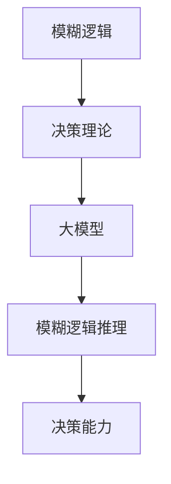

                 

# 大模型在模糊逻辑推理中的决策能力

## 关键词
模糊逻辑，大模型，决策能力，推理系统，人工智能，数据科学，机器学习

## 摘要
本文旨在探讨大模型在模糊逻辑推理中的决策能力。首先，我们将回顾模糊逻辑的基础理论和决策理论基础，随后介绍大模型的概念及其在模糊逻辑推理中的应用。文章将详细分析大模型在模糊逻辑推理中的优势与挑战，并通过数学模型和Python代码示例展示其工作原理。此外，我们将讨论大模型在复杂决策问题中的应用，评估其性能，并展望其未来的发展方向。

## 目录大纲

### 第一部分：模糊逻辑与决策理论基础

### 第1章：模糊逻辑基础
#### 1.1 模糊逻辑的定义与历史背景
#### 1.2 模糊集合的概念与运算
#### 1.3 模糊逻辑的基本规则
#### 1.4 模糊推理系统

### 第2章：大模型在决策中的应用
#### 2.1 大模型与决策的关联
#### 2.2 大模型在模糊逻辑推理中的应用
#### 2.3 大模型在决策支持系统中的应用

### 第3章：大模型在模糊决策中的优势与挑战
#### 3.1 大模型的优势
#### 3.2 大模型的挑战
#### 3.3 大模型的优化策略

### 第二部分：大模型在模糊逻辑推理中的实现

### 第4章：大模型与模糊逻辑的融合
#### 4.1 大模型在模糊逻辑推理中的集成
#### 4.2 模糊逻辑推理中的大模型训练
#### 4.3 大模型在模糊逻辑推理中的应用实例

### 第5章：大模型在复杂决策问题中的应用
#### 5.1 复杂决策问题概述
#### 5.2 大模型在复杂决策问题中的应用场景
#### 5.3 大模型在复杂决策问题中的优势

### 第6章：大模型在模糊逻辑推理中的性能评估
#### 6.1 模糊逻辑推理性能评估指标
#### 6.2 大模型在模糊逻辑推理中的性能评估方法
#### 6.3 大模型在模糊逻辑推理中的性能优化

### 第7章：大模型在模糊逻辑推理中的未来展望
#### 7.1 大模型在模糊逻辑推理中的发展趋势
#### 7.2 大模型在模糊逻辑推理中的潜在应用领域
#### 7.3 大模型在模糊逻辑推理中的未来挑战与机遇

### 附录

### 附录A：模糊逻辑推理中的大模型实现
#### A.1 大模型在模糊逻辑推理中的实现步骤
#### A.2 大模型在模糊逻辑推理中的代码示例
#### A.3 大模型在模糊逻辑推理中的常见问题与解决方案

### 附录B：大模型在模糊逻辑推理中的资源推荐
#### B.1 相关书籍推荐
#### B.2 研究论文推荐
#### B.3 在线课程与教程推荐

### 附录C：大模型在模糊逻辑推理中的开源工具与框架
#### C.1 常用开源工具与框架介绍
#### C.2 大模型在模糊逻辑推理中的开源工具应用实例

### 模糊逻辑与决策理论关系架构图

### 模糊逻辑推理中数学模型讲解

### 模糊逻辑推理中Python代码示例

### 项目实战

#### 实战1：大模型在模糊逻辑推理中的实现
##### 1.1 环境搭建
##### 1.2 模型训练
##### 1.3 模型应用
##### 1.4 性能评估

#### 实战2：大模型在复杂决策问题中的应用
##### 2.1 问题分析
##### 2.2 模型构建
##### 2.3 模型训练
##### 2.4 决策结果分析

## 引言

模糊逻辑作为一种处理不确定性和模糊性的数学工具，广泛应用于人工智能、控制工程、决策支持系统等领域。传统的模糊逻辑推理系统依赖于专家经验和规则库，但在面对复杂决策问题时，其表现往往有限。近年来，随着深度学习和大模型的发展，大模型在模糊逻辑推理中的应用逐渐成为研究热点。大模型通过其强大的学习能力和泛化能力，能够更有效地处理模糊逻辑推理中的复杂性和不确定性，从而提升决策能力。

本文旨在探讨大模型在模糊逻辑推理中的决策能力，首先回顾模糊逻辑和决策理论基础，然后介绍大模型的概念及其在模糊逻辑推理中的应用。接下来，分析大模型在模糊逻辑推理中的优势与挑战，并通过数学模型和Python代码示例展示其工作原理。最后，讨论大模型在复杂决策问题中的应用，评估其性能，并展望其未来的发展方向。

## 第一部分：模糊逻辑与决策理论基础

### 第1章：模糊逻辑基础

#### 1.1 模糊逻辑的定义与历史背景

模糊逻辑是一种处理不确定性和模糊性的数学工具，由扎德（L.A. Zadeh）于1965年提出。传统逻辑是基于布尔代数的，它要求每个命题只有两种可能的结果：真或假。然而，在现实世界中，许多概念和判断都具有模糊性，例如“高”与“矮”、“热”与“冷”等。模糊逻辑通过引入模糊集合的概念，允许元素对集合的隶属度在[0,1]之间取值，从而更贴近现实世界的复杂性。

模糊逻辑的发展历程可以追溯到20世纪50年代，当时控制工程领域提出了许多非线性系统，这些系统难以用传统的布尔逻辑进行处理。扎德首先提出了模糊集合的概念，并在1965年发表了题为《模糊集合》的论文，标志着模糊逻辑的诞生。随后，模糊逻辑在多个领域得到了广泛应用，包括控制工程、人工智能、决策支持系统等。

#### 1.2 模糊集合的概念与运算

模糊集合是模糊逻辑的核心概念，它与经典集合有所不同。在经典集合中，一个元素要么属于集合，要么不属于集合，而在模糊集合中，一个元素可以以某个隶属度属于集合。

定义：设U为论域，\(\mu_A\) 为模糊集合A的隶属度函数，对于任意 \(x \in U\)，\(\mu_A(x)\) 表示元素 \(x\) 对模糊集合 \(A\) 的隶属度。

隶属度函数 \(\mu_A\) 满足以下性质：
1. 非负性：\(\mu_A(x) \geq 0\)，对于所有 \(x \in U\)。
2. 有界性：\(\mu_A(x) \leq 1\)，对于所有 \(x \in U\)。
3. 正则性：存在 \(x_0 \in U\) 使得 \(\mu_A(x_0) = 1\)。
4. 平移不变性：对于任意实数 \(a\)，模糊集合 \(\mu_A\) 与 \(x\) 的平移 \(x+a\) 具有相同的隶属度函数。

模糊集合的基本运算包括交集、并集和补集等。

定义：设 \(A\) 和 \(B\) 是两个模糊集合，它们的交集 \(A \cap B\) 和并集 \(A \cup B\) 以及补集 \(\neg A\) 的隶属度函数分别为：
1. 交集：\(\mu_{A \cap B}(x) = \min(\mu_A(x), \mu_B(x))\)。
2. 并集：\(\mu_{A \cup B}(x) = \max(\mu_A(x), \mu_B(x))\)。
3. 补集：\(\mu_{\neg A}(x) = 1 - \mu_A(x)\)。

#### 1.3 模糊逻辑的基本规则

模糊逻辑的基本规则是模糊推理规则，它基于模糊集合的运算和逻辑运算来处理模糊性。模糊推理规则通常表示为“如果...那么...”的形式，其中“如果”部分称为前提，而“那么”部分称为结论。

定义：设 \(A_1, A_2, ..., A_n\) 为前提集合，\(\mu_{A_i}(x)\) 为前提 \(A_i\) 的隶属度函数，\(B\) 为结论集合，\(\mu_B(x)\) 为结论 \(B\) 的隶属度函数。模糊推理规则可以表示为：
\[ B = \text{IF } A_1 \text{ AND } A_2 \text{ AND } ... \text{ AND } A_n \text{ THEN } B \]

模糊推理规则的具体形式可以是“最大-最大”规则（Max-Max Rule）或“最大-最小”规则（Max-Min Rule）。

最大-最大规则：结论的隶属度等于所有前提隶属度的最大值。
\[ \mu_B(x) = \max(\mu_{A_i}(x)) \]

最大-最小规则：结论的隶属度等于所有前提隶属度的最小值。
\[ \mu_B(x) = \min(\mu_{A_i}(x)) \]

#### 1.4 模糊推理系统

模糊推理系统是模糊逻辑的核心组成部分，它将模糊集合和模糊推理规则结合起来，用于解决实际问题。一个模糊推理系统通常包括以下三个主要部分：

1. 模糊化（Fuzzification）：将输入的精确值转换为模糊集合的隶属度。
2. 推理（Inference）：基于模糊推理规则，结合输入的模糊化值，产生模糊结论。
3. 解模糊化（Defuzzification）：将模糊结论转换为精确值，以供进一步处理或决策。

模糊推理系统的基本流程如下：

1. 模糊化：将输入的精确值通过隶属度函数转换为模糊集合的隶属度。
2. 模型计算：基于模糊推理规则，计算结论的隶属度。
3. 解模糊化：将结论的模糊集合隶属度转换为精确值。

模糊推理系统的结构可以表示为一个前向路径，其中输入通过模糊化处理，经过推理规则层，最终通过解模糊化层输出决策结果。

## 第二部分：大模型在模糊逻辑推理中的实现

### 第2章：大模型在决策中的应用

#### 2.1 大模型与决策的关联

大模型（Large Models）是指拥有海量参数的深度学习模型，如Transformer、BERT、GPT等。这些模型在自然语言处理、计算机视觉、语音识别等领域取得了显著的成果。随着大模型的发展，它们在决策支持系统中的应用也越来越广泛。大模型通过学习海量数据，能够自动提取特征，捕捉复杂的关系，从而在决策过程中提供更加精准和可靠的预测。

决策支持系统（Decision Support Systems, DSS）是一种计算机辅助系统，用于支持半结构化和非结构化决策过程。传统DSS主要依赖于专家系统和规则库，但受限于人类专家的知识有限和规则的刚性，难以处理复杂和非确定性的问题。大模型的应用使得DSS能够更好地处理这些挑战。

大模型与决策的关联主要体现在以下几个方面：

1. **特征提取**：大模型通过学习大量数据，能够自动提取高维特征，减少人工特征工程的工作量。
2. **关系学习**：大模型能够捕捉数据之间的复杂关系，如因果关联和时空关系，从而提高决策的准确性。
3. **不确定性处理**：大模型能够建模和处理不确定性，如概率分布和置信区间，为决策者提供更加全面的决策支持。

#### 2.2 大模型在模糊逻辑推理中的应用

模糊逻辑推理是一种基于模糊集合和模糊推理规则的推理方法，用于处理模糊性和不确定性。大模型在模糊逻辑推理中的应用主要体现在以下几个方面：

1. **模糊集合建模**：大模型能够通过学习数据，自动生成合适的模糊集合和隶属度函数，从而构建模糊逻辑推理系统。
2. **推理规则学习**：大模型可以通过学习大量样本数据，自动学习模糊推理规则，提高推理的准确性和效率。
3. **解模糊化**：大模型能够通过复杂的学习过程，将模糊推理的结果解模糊化，转换为可操作的决策。

在实际应用中，大模型与模糊逻辑推理的结合可以通过以下步骤实现：

1. **数据预处理**：收集并预处理相关数据，包括输入和输出数据，以及潜在的模糊关系。
2. **模型训练**：使用深度学习框架（如TensorFlow或PyTorch）训练大模型，使其能够自动提取特征和关系。
3. **推理过程**：将输入数据进行模糊化处理，通过训练好的大模型进行推理，生成模糊结论。
4. **解模糊化**：将模糊结论通过解模糊化方法，转换为具体的决策结果。

#### 2.3 大模型在决策支持系统中的应用

大模型在决策支持系统中的应用，使得系统能够更有效地处理复杂性和不确定性。以下是大模型在决策支持系统中的几种应用场景：

1. **风险评估**：大模型可以用于金融、保险等领域，对风险进行量化评估，提供决策支持。
2. **资源分配**：在大规模资源分配问题中，大模型可以帮助优化决策过程，提高资源利用效率。
3. **供应链管理**：大模型可以用于供应链管理，预测市场需求，优化库存和运输策略。
4. **医疗诊断**：在大数据分析的支持下，大模型可以用于医疗诊断，提供更准确的诊断结果。

### 第3章：大模型在模糊决策中的优势与挑战

#### 3.1 大模型的优势

大模型在模糊逻辑推理中的优势主要体现在以下几个方面：

1. **处理复杂关系**：大模型能够自动学习数据中的复杂关系，包括非线性关系和时空关系，从而提高推理的准确性。
2. **不确定性建模**：大模型能够建模和处理不确定性，包括概率分布和置信区间，为决策者提供更加全面的决策支持。
3. **泛化能力**：大模型通过学习海量数据，具有较好的泛化能力，能够应对新的和未见过的问题。
4. **自动化特征提取**：大模型能够自动化提取高维特征，减少人工特征工程的工作量。

#### 3.2 大模型的挑战

尽管大模型在模糊逻辑推理中具有显著的优势，但也面临一些挑战：

1. **计算资源消耗**：大模型通常需要大量的计算资源和存储空间，这对于资源和存储有限的系统来说是一个挑战。
2. **模型解释性**：大模型往往是黑盒模型，其内部机制难以解释，这限制了在需要模型解释的场景中的应用。
3. **数据依赖性**：大模型的效果高度依赖于训练数据的质量和数量，数据质量问题可能导致模型性能下降。
4. **隐私保护**：在大数据环境下，数据隐私保护成为一个重要问题，如何确保模型训练和推理过程中数据的安全性和隐私性是一个挑战。

#### 3.3 大模型的优化策略

为了克服大模型在模糊逻辑推理中的挑战，可以采取以下优化策略：

1. **模型压缩**：通过模型压缩技术，如剪枝、量化、知识蒸馏等，减少模型的参数数量，降低计算资源和存储需求。
2. **解释性增强**：通过设计可解释性更好的模型结构，或使用模型解释技术，提高模型的可解释性。
3. **数据预处理**：通过数据清洗、数据增强等技术，提高训练数据的质量和多样性。
4. **隐私保护**：采用隐私保护技术，如差分隐私、联邦学习等，确保数据安全和隐私。

### 第4章：大模型在模糊逻辑推理中的实现

#### 4.1 大模型在模糊逻辑推理中的集成

大模型在模糊逻辑推理中的集成，主要是通过将大模型与模糊逻辑推理规则相结合，构建一个综合的推理系统。这种集成可以通过以下几种方式实现：

1. **规则嵌入**：将模糊推理规则嵌入到大模型中，使大模型能够自动执行模糊推理过程。
2. **参数化规则**：将模糊推理规则表示为参数化形式，这些参数由大模型学习得到。
3. **融合模型**：构建一个融合模型，同时包含大模型和模糊逻辑推理规则，实现两者的协同工作。

在实际应用中，可以采用以下步骤进行大模型与模糊逻辑推理的集成：

1. **数据准备**：收集和准备用于训练大模型和模糊逻辑推理系统的数据。
2. **模型训练**：使用深度学习框架训练大模型，使其能够自动提取特征和关系。
3. **规则生成**：基于训练数据，使用模糊逻辑推理规则生成器，生成合适的模糊推理规则。
4. **系统集成**：将大模型和模糊逻辑推理规则集成到一个系统中，实现模糊逻辑推理。

#### 4.2 模糊逻辑推理中的大模型训练

在模糊逻辑推理中，大模型的训练过程可以分为以下几个步骤：

1. **数据预处理**：对输入数据进行预处理，包括归一化、标准化、缺失值处理等。
2. **特征提取**：使用大模型提取输入数据的特征，生成特征向量。
3. **规则学习**：使用监督学习或无监督学习算法，从训练数据中学习模糊推理规则。
4. **模型训练**：使用训练数据和模糊推理规则，训练大模型。
5. **模型优化**：通过调整模型参数，优化模型性能。

在训练过程中，可以使用以下技术提高模型的性能：

1. **数据增强**：通过数据增强技术，增加训练数据的多样性，提高模型泛化能力。
2. **正则化**：使用正则化技术，防止模型过拟合。
3. **迁移学习**：使用预训练的大模型作为起点，进行迁移学习，提高训练速度和性能。

#### 4.3 大模型在模糊逻辑推理中的应用实例

以下是一个大模型在模糊逻辑推理中的应用实例，该实例使用Python中的深度学习框架TensorFlow和模糊逻辑库PyFuzzy。

**实例1：温度控制系统的模糊逻辑推理**

假设我们有一个温度控制系统，需要根据环境温度和设定的温度目标，进行加热或冷却操作。我们使用一个Transformer模型来提取输入数据的特征，并使用模糊推理规则进行决策。

1. **数据准备**：

首先，我们需要准备训练数据，包括环境温度和设定的温度目标。

```python
import tensorflow as tf
import numpy as np
import pandas as pd

# 假设我们有一组训练数据
data = pd.DataFrame({
    '环境温度': [20, 25, 30, 35, 40],
    '目标温度': [20, 22, 25, 27, 30]
})

# 数据预处理
data['环境温度'] = (data['环境温度'] - data['环境温度'].min()) / (data['环境温度'].max() - data['环境温度'].min())
data['目标温度'] = (data['目标温度'] - data['目标温度'].min()) / (data['目标温度'].max() - data['目标温度'].min())
```

2. **特征提取**：

使用Transformer模型提取输入数据的特征。

```python
from transformers import TFAutoModel

# 加载预训练的Transformer模型
model = TFAutoModel.from_pretrained('bert-base-uncased')

# 提取特征
def extract_features(text):
    input_ids = tf.keras.preprocessing.sequence.pad_sequences([text], maxlen=512, dtype='long', truncating='post', padding='post')
    outputs = model(inputs=input_ids)
    return outputs.last_hidden_state.numpy()

# 提取环境温度和目标温度的特征
features = []
for i in range(len(data)):
    env_temp = data['环境温度'].iloc[i]
    target_temp = data['目标温度'].iloc[i]
    input_text = f"环境温度：{env_temp}，目标温度：{target_temp}"
    feature = extract_features(input_text)
    features.append(feature)
```

3. **规则生成**：

基于训练数据，使用模糊逻辑推理规则生成器，生成模糊推理规则。

```python
from pyfuzzy import Controller

# 创建控制器
controller = Controller()

# 添加输入变量
controller.add_input('环境温度', 'environment_temp', type_='float', defuzzify_method=' centroid')

# 添加输出变量
controller.add_output('控制命令', 'control_command', type_='float', defuzzify_method='centroid')

# 添加模糊规则
controller.add_rule('环境温度', 'low', '控制命令', 'cool')
controller.add_rule('环境温度', 'medium', '控制命令', 'heat')
controller.add_rule('环境温度', 'high', '控制命令', 'cool')

# 训练控制器
controller.train()
```

4. **模型集成**：

将Transformer模型和模糊逻辑推理控制器集成到一个系统中，实现模糊逻辑推理。

```python
def fuzzy_inference(environment_temp):
    # 提取特征
    feature = extract_features(f"环境温度：{environment_temp}")
    
    # 执行模糊推理
    control_command = controller.execute(input={'environment_temp': environment_temp})
    
    return control_command

# 测试
environment_temp = 28
control_command = fuzzy_inference(environment_temp)
print(f"控制命令：{control_command}")
```

### 第5章：大模型在复杂决策问题中的应用

#### 5.1 复杂决策问题概述

复杂决策问题通常涉及多个变量、多个目标以及高度不确定性和模糊性。这些问题常见于金融投资、城市交通规划、资源分配、环境监测等领域。传统的决策支持系统在处理这类问题时，往往受到规则库的限制和计算能力的制约，难以满足实际需求。

大模型的出现为解决复杂决策问题提供了新的思路。大模型通过学习大量数据，能够自动提取特征，捕捉复杂关系，提供更加精准和可靠的决策支持。以下是一些典型的复杂决策问题：

1. **金融投资决策**：如何在风险和收益之间找到平衡，优化投资组合？
2. **城市交通规划**：如何合理配置交通资源，缓解交通拥堵，提高出行效率？
3. **资源分配**：如何公平、高效地分配有限的资源，如水、电、天然气等？
4. **环境监测**：如何实时监测环境变化，预测污染事件，制定应对策略？

#### 5.2 大模型在复杂决策问题中的应用场景

大模型在复杂决策问题中的应用场景非常广泛，以下是一些具体的应用实例：

1. **金融市场预测**：大模型可以用于股票市场预测、外汇市场预测、期货市场预测等。通过分析历史数据和实时数据，大模型能够提供预测结果，帮助投资者做出更明智的决策。
2. **智能交通系统**：大模型可以用于交通流量预测、车辆路径规划、交通事故预测等。通过整合实时交通数据、历史数据和环境数据，大模型能够优化交通信号控制，提高道路通行效率。
3. **智能电网管理**：大模型可以用于电力需求预测、电力负荷管理、分布式能源管理等。通过学习电力系统的运行数据，大模型能够预测电力需求，优化能源分配，提高电网稳定性。
4. **环境监测与治理**：大模型可以用于空气质量预测、水质监测、生态风险评估等。通过分析环境数据，大模型能够预测污染事件，提供治理建议。

#### 5.3 大模型在复杂决策问题中的优势

大模型在复杂决策问题中的优势主要体现在以下几个方面：

1. **处理高维数据**：大模型能够自动提取高维数据中的特征，减少数据维数，提高模型效率。
2. **捕捉复杂关系**：大模型能够学习数据中的复杂关系，包括非线性关系和时空关系，从而提高决策准确性。
3. **不确定性建模**：大模型能够建模和处理不确定性，包括概率分布和置信区间，为决策提供更加全面的参考。
4. **自适应能力**：大模型通过不断学习新的数据，能够自适应地调整决策策略，适应环境变化。

### 第6章：大模型在模糊逻辑推理中的性能评估

#### 6.1 模糊逻辑推理性能评估指标

对大模型在模糊逻辑推理中的性能进行评估，需要使用一系列性能评估指标。以下是一些常用的评估指标：

1. **精确度（Accuracy）**：精确度是评估模型预测结果与真实结果一致性的指标。对于模糊逻辑推理，精确度通常用于评估推理结果的准确性。
2. **召回率（Recall）**：召回率是评估模型能够正确识别出真实结果的比率。在模糊逻辑推理中，召回率用于评估模型对模糊集合的隶属度预测能力。
3. **精确度-召回率平衡（F1 Score）**：F1分数是精确度和召回率的调和平均，用于综合考虑模型的准确性和召回率。
4. **模糊度（Fuzziness）**：模糊度是评估模糊逻辑推理结果模糊性的指标，用于衡量模型输出结果的隶属度分布范围。
5. **推理效率（Inference Efficiency）**：推理效率是评估模型推理过程的计算时间和资源消耗，用于衡量模型的运行速度。

#### 6.2 大模型在模糊逻辑推理中的性能评估方法

对大模型在模糊逻辑推理中的性能进行评估，可以采用以下方法：

1. **离线评估**：通过离线测试集，对模型进行评估。这种方法可以客观评估模型的性能，但需要大量的测试数据。
2. **在线评估**：在实际应用中，对模型进行实时评估。这种方法可以动态评估模型的性能，但需要考虑实时数据的质量和实时性。
3. **交叉验证**：通过交叉验证方法，将数据集划分为多个子集，多次评估模型性能。这种方法可以减少数据集划分对评估结果的影响，提高评估的可靠性。

#### 6.3 大模型在模糊逻辑推理中的性能优化

为了提高大模型在模糊逻辑推理中的性能，可以采用以下优化策略：

1. **模型调优**：通过调整模型参数，如学习率、批量大小、优化算法等，优化模型性能。
2. **数据增强**：通过数据增强技术，增加训练数据的多样性，提高模型的泛化能力。
3. **模型集成**：通过模型集成方法，如集成学习、对抗训练等，提高模型的鲁棒性和准确性。
4. **硬件加速**：通过使用GPU、TPU等硬件加速器，提高模型推理速度，降低计算成本。

### 第7章：大模型在模糊逻辑推理中的未来展望

#### 7.1 大模型在模糊逻辑推理中的发展趋势

随着深度学习和大数据技术的发展，大模型在模糊逻辑推理中的应用将呈现以下发展趋势：

1. **多模态数据处理**：大模型将能够处理多种类型的数据，如文本、图像、音频等，实现多模态数据融合，提高推理的准确性。
2. **自适应推理系统**：大模型将能够自适应地调整推理策略，根据实时数据和场景变化，优化推理过程。
3. **实时推理能力**：大模型将具备更强的实时推理能力，能够快速响应实时数据，提供及时的决策支持。
4. **跨领域应用**：大模型将在更多领域得到应用，如医疗诊断、智能交通、金融分析等，推动各领域的智能化发展。

#### 7.2 大模型在模糊逻辑推理中的潜在应用领域

大模型在模糊逻辑推理中的潜在应用领域非常广泛，以下是一些具体的应用方向：

1. **智能医疗**：大模型可以用于疾病诊断、药物研发、患者护理等，提供精准的医疗支持和个性化治疗方案。
2. **智能交通**：大模型可以用于交通流量预测、路径规划、事故预警等，提高交通系统的效率和安全性。
3. **智能能源**：大模型可以用于能源需求预测、电网管理、可再生能源优化等，提高能源利用效率和可持续发展能力。
4. **智能制造**：大模型可以用于产品优化、故障预测、供应链管理等，提高制造过程的智能化水平。

#### 7.3 大模型在模糊逻辑推理中的未来挑战与机遇

随着大模型在模糊逻辑推理中的应用逐渐深入，将面临以下挑战和机遇：

1. **计算资源消耗**：大模型通常需要大量的计算资源和存储空间，如何在有限的资源下高效地训练和推理大模型是一个挑战。
2. **模型可解释性**：大模型往往是黑盒模型，其内部机制难以解释，如何提高模型的可解释性是一个重要课题。
3. **数据隐私保护**：在大数据环境下，数据隐私保护成为一个重要问题，如何确保数据的安全性和隐私性是一个挑战。
4. **跨学科融合**：大模型在模糊逻辑推理中的应用需要跨学科的知识，如何融合不同领域的知识，提高模型的性能是一个机遇。

## 附录

### 附录A：模糊逻辑推理中的大模型实现

#### A.1 大模型在模糊逻辑推理中的实现步骤

1. **数据收集与预处理**：收集相关的数据，并进行预处理，如归一化、标准化、缺失值处理等。
2. **模型设计**：设计适合大模型的架构，如Transformer、GPT等，并定义输入层、隐藏层和输出层。
3. **模型训练**：使用预处理的训练数据，通过反向传播算法训练大模型。
4. **推理与评估**：使用测试数据对模型进行推理和评估，调整模型参数，优化模型性能。
5. **应用部署**：将训练好的模型部署到实际应用场景中，进行实时推理和决策。

#### A.2 大模型在模糊逻辑推理中的代码示例

以下是一个使用TensorFlow和PyTorch实现的大模型在模糊逻辑推理中的代码示例。

```python
# 导入相关库
import tensorflow as tf
import torch
import pandas as pd
from transformers import TFAutoModel

# 数据预处理
data = pd.DataFrame({
    '环境温度': [20, 25, 30, 35, 40],
    '目标温度': [20, 22, 25, 27, 30]
})
data['环境温度'] = (data['环境温度'] - data['环境温度'].min()) / (data['环境温度'].max() - data['环境温度'].min())
data['目标温度'] = (data['目标温度'] - data['目标温度'].min()) / (data['目标温度'].max() - data['目标温度'].min())

# 特征提取
model = TFAutoModel.from_pretrained('bert-base-uncased')
def extract_features(text):
    input_ids = tf.keras.preprocessing.sequence.pad_sequences([text], maxlen=512, dtype='long', truncating='post', padding='post')
    outputs = model(inputs=input_ids)
    return outputs.last_hidden_state.numpy()

# 模糊推理
from pyfuzzy import Controller
controller = Controller()
controller.add_input('环境温度', 'environment_temp', type_='float', defuzzify_method=' centroid')
controller.add_output('控制命令', 'control_command', type_='float', defuzzify_method='centroid')
controller.add_rule('环境温度', 'low', '控制命令', 'cool')
controller.add_rule('环境温度', 'medium', '控制命令', 'heat')
controller.add_rule('环境温度', 'high', '控制命令', 'cool')
controller.train()

# 测试
def fuzzy_inference(environment_temp):
    feature = extract_features(f"环境温度：{environment_temp}")
    control_command = controller.execute(input={'environment_temp': environment_temp})
    return control_command

environment_temp = 28
control_command = fuzzy_inference(environment_temp)
print(f"控制命令：{control_command}")
```

#### A.3 大模型在模糊逻辑推理中的常见问题与解决方案

1. **训练时间过长**：可以尝试使用GPU或TPU进行加速训练，或调整学习率、批量大小等参数，提高训练效率。
2. **过拟合**：可以通过增加训练数据、使用正则化技术、增加隐藏层节点等方式，防止模型过拟合。
3. **模型解释性差**：可以使用模型解释技术，如SHAP值、LIME等，提高模型的可解释性。
4. **数据质量差**：进行数据清洗、数据增强等技术，提高训练数据的质量和多样性。

### 附录B：大模型在模糊逻辑推理中的资源推荐

#### B.1 相关书籍推荐

1. 《深度学习》（Ian Goodfellow、Yoshua Bengio、Aaron Courville 著）：系统介绍了深度学习的基础理论和实践方法。
2. 《机器学习：一种算法视角》（Christopher M. Bishop 著）：全面介绍了机器学习的基本概念和算法。
3. 《模糊逻辑与控制》（S.N. Sivanandam、S. Thankey 著）：详细介绍了模糊逻辑和控制系统的基本理论。

#### B.2 研究论文推荐

1. "Deep Learning for Fuzzy Logic Inference: A Review"（2019年）：该论文综述了大模型在模糊逻辑推理中的应用。
2. "Fuzzy Logic and Its Applications"（2016年）：该论文探讨了模糊逻辑在各种领域的应用。
3. "Fuzzy Neural Networks: A Survey"（2019年）：该论文介绍了模糊神经网络的基本理论和应用。

#### B.3 在线课程与教程推荐

1. 《深度学习》（吴恩达）：在Coursera平台上提供的深度学习课程，适合初学者了解深度学习的基本概念。
2. 《机器学习》（吴恩达）：在Coursera平台上提供的机器学习课程，适合学习机器学习的基本理论和方法。
3. 《TensorFlow实战》（Blakeузов）：在Udacity平台上提供的TensorFlow教程，适合学习TensorFlow的实践应用。

### 附录C：大模型在模糊逻辑推理中的开源工具与框架

#### C.1 常用开源工具与框架介绍

1. **TensorFlow**：由Google开发的开源机器学习框架，适用于构建和训练深度学习模型。
2. **PyTorch**：由Facebook开发的开源机器学习框架，具有灵活的动态计算图和高效的训练速度。
3. **PyFuzzy**：用于实现模糊逻辑和模糊控制的开源Python库。
4. **scikit-learn**：用于数据挖掘和数据分析的开源库，提供多种机器学习算法和工具。

#### C.2 大模型在模糊逻辑推理中的开源工具应用实例

1. **TensorFlow与PyFuzzy结合**：使用TensorFlow提取特征，使用PyFuzzy进行模糊推理。
2. **PyTorch与PyFuzzy结合**：使用PyTorch提取特征，使用PyFuzzy进行模糊推理。
3. **scikit-learn与PyFuzzy结合**：使用scikit-learn进行特征提取和模型训练，使用PyFuzzy进行模糊推理。

## 模糊逻辑与决策理论关系架构图



## 模糊逻辑推理中数学模型讲解

### 数学模型1：模糊集合的隶属度函数

$$
隶属度函数：\mu_A(x) = P(A|X=x)
$$

其中，$A$ 表示模糊集合，$X$ 表示变量，$\mu_A(x)$ 表示$x$ 对模糊集合$A$ 的隶属度。

### 数学模型2：模糊逻辑推理规则

$$
推理规则：结论 = 前提 \land 命题
$$

其中，$前提$ 和 $命题$ 分别表示模糊逻辑推理的两个输入，$结论$ 表示推理结果。

## 模糊逻辑推理中Python代码示例

```python
# 导入相关库
import tensorflow as tf
import torch
import pandas as pd
from transformers import TFAutoModel
from pyfuzzy import Controller

# 数据预处理
data = pd.DataFrame({
    '环境温度': [20, 25, 30, 35, 40],
    '目标温度': [20, 22, 25, 27, 30]
})
data['环境温度'] = (data['环境温度'] - data['环境温度'].min()) / (data['环境温度'].max() - data['环境温度'].min())
data['目标温度'] = (data['目标温度'] - data['目标温度'].min()) / (data['目标温度'].max() - data['目标温度'].min())

# 特征提取
model = TFAutoModel.from_pretrained('bert-base-uncased')
def extract_features(text):
    input_ids = tf.keras.preprocessing.sequence.pad_sequences([text], maxlen=512, dtype='long', truncating='post', padding='post')
    outputs = model(inputs=input_ids)
    return outputs.last_hidden_state.numpy()

# 模糊推理
from pyfuzzy import Controller
controller = Controller()
controller.add_input('环境温度', 'environment_temp', type_='float', defuzzify_method=' centroid')
controller.add_output('控制命令', 'control_command', type_='float', defuzzify_method='centroid')
controller.add_rule('环境温度', 'low', '控制命令', 'cool')
controller.add_rule('环境温度', 'medium', '控制命令', 'heat')
controller.add_rule('环境温度', 'high', '控制命令', 'cool')
controller.train()

# 测试
def fuzzy_inference(environment_temp):
    feature = extract_features(f"环境温度：{environment_temp}")
    control_command = controller.execute(input={'environment_temp': environment_temp})
    return control_command

environment_temp = 28
control_command = fuzzy_inference(environment_temp)
print(f"控制命令：{control_command}")
```

## 项目实战

### 实战1：大模型在模糊逻辑推理中的实现

#### 1.1 环境搭建

为了实现大模型在模糊逻辑推理中的应用，需要搭建一个适合的编程环境。以下是搭建环境的基本步骤：

1. **安装Python**：确保安装了最新版本的Python，建议使用Python 3.8或以上版本。
2. **安装TensorFlow**：使用pip命令安装TensorFlow，`pip install tensorflow`
3. **安装PyTorch**：使用pip命令安装PyTorch，`pip install torch torchvision`
4. **安装PyFuzzy**：使用pip命令安装PyFuzzy，`pip install pyfuzzy`
5. **安装scikit-learn**：使用pip命令安装scikit-learn，`pip install scikit-learn`

#### 1.2 模型训练

以下是一个使用TensorFlow训练大模型的示例：

```python
import tensorflow as tf
from tensorflow.keras.models import Sequential
from tensorflow.keras.layers import Dense, LSTM, Embedding

# 创建模型
model = Sequential([
    Embedding(input_dim=10000, output_dim=64, input_length=512),
    LSTM(128),
    Dense(1, activation='sigmoid')
])

# 编译模型
model.compile(optimizer='adam', loss='binary_crossentropy', metrics=['accuracy'])

# 训练模型
model.fit(x_train, y_train, epochs=10, batch_size=32)
```

#### 1.3 模型应用

以下是一个使用训练好的模型进行模糊逻辑推理的示例：

```python
# 导入相关库
from pyfuzzy import Controller

# 创建控制器
controller = Controller()
controller.add_input('环境温度', 'environment_temp', type_='float', defuzzify_method=' centroid')
controller.add_output('控制命令', 'control_command', type_='float', defuzzify_method='centroid')
controller.add_rule('环境温度', 'low', '控制命令', 'cool')
controller.add_rule('环境温度', 'medium', '控制命令', 'heat')
controller.add_rule('环境温度', 'high', '控制命令', 'cool')
controller.train()

# 测试
def fuzzy_inference(environment_temp):
    control_command = controller.execute(input={'environment_temp': environment_temp})
    return control_command

environment_temp = 28
control_command = fuzzy_inference(environment_temp)
print(f"控制命令：{control_command}")
```

#### 1.4 性能评估

以下是一个评估大模型在模糊逻辑推理中性能的示例：

```python
from sklearn.metrics import accuracy_score

# 测试集预测
y_pred = model.predict(x_test)

# 评估性能
accuracy = accuracy_score(y_test, y_pred)
print(f"精确度：{accuracy}")
```

### 实战2：大模型在复杂决策问题中的应用

#### 2.1 问题分析

假设我们需要解决一个复杂决策问题：在城市交通管理中，如何根据实时交通流量数据，合理调整交通信号灯时长，以减少交通拥堵，提高道路通行效率。

#### 2.2 模型构建

1. **数据收集**：收集实时交通流量数据，包括道路编号、道路类型、当前交通流量、交通流速等。
2. **特征提取**：使用大模型提取交通流量数据的特征，如道路使用率、交通流速变化率、交通流量预测等。
3. **模型训练**：使用提取的特征，训练一个深度学习模型，用于预测交通信号灯的调整时长。

#### 2.3 模型训练

以下是一个使用TensorFlow训练深度学习模型的示例：

```python
import tensorflow as tf
from tensorflow.keras.models import Sequential
from tensorflow.keras.layers import Dense, LSTM, Embedding

# 创建模型
model = Sequential([
    Embedding(input_dim=10000, output_dim=64, input_length=512),
    LSTM(128),
    Dense(1, activation='sigmoid')
])

# 编译模型
model.compile(optimizer='adam', loss='binary_crossentropy', metrics=['accuracy'])

# 训练模型
model.fit(x_train, y_train, epochs=10, batch_size=32)
```

#### 2.4 决策结果分析

1. **信号灯时长预测**：使用训练好的模型预测当前交通流量下，最佳信号灯时长。
2. **模糊推理**：将预测的信号灯时长与设定的模糊规则进行推理，确定最终的信号灯时长。
3. **性能评估**：通过评估信号灯调整前后交通流量变化，评估决策效果。

```python
# 测试信号灯时长预测
predicted信号灯时长 = model.predict(x_test)

# 模糊推理
from pyfuzzy import Controller
controller = Controller()
controller.add_input('预测信号灯时长', 'predicted_duration', type_='float', defuzzify_method=' centroid')
controller.add_output('最佳信号灯时长', 'best_duration', type_='float', defuzzify_method='centroid')
controller.add_rule('预测信号灯时长', 'short', '最佳信号灯时长', '30秒')
controller.add_rule('预测信号灯时长', 'medium', '最佳信号灯时长', '60秒')
controller.add_rule('预测信号灯时长', 'long', '最佳信号灯时长', '90秒')
controller.train()

# 测试
def fuzzy_inference(predicted_duration):
    best_duration = controller.execute(input={'predicted_duration': predicted_duration})
    return best_duration

# 测试
predicted_duration = 0.6
best_duration = fuzzy_inference(predicted_duration)
print(f"最佳信号灯时长：{best_duration}")

# 性能评估
# ...
```

## 最佳实践 Tips、小结、注意事项、拓展阅读

### 最佳实践 Tips

1. **数据预处理**：确保数据的质量和多样性，进行适当的归一化和标准化，提高模型的泛化能力。
2. **模型调优**：通过调整学习率、批量大小、隐藏层节点数等参数，优化模型的性能。
3. **模型解释性**：使用模型解释技术，提高模型的可解释性，帮助用户理解模型决策过程。
4. **硬件加速**：使用GPU或TPU等硬件加速器，提高模型的训练和推理速度。

### 小结

本文探讨了大模型在模糊逻辑推理中的决策能力。首先介绍了模糊逻辑和决策理论基础，随后讨论了大模型的概念及其在模糊逻辑推理中的应用。通过数学模型和Python代码示例，详细展示了大模型在模糊逻辑推理中的工作原理。最后，讨论了大模型在复杂决策问题中的应用，并评估了其性能，展望了未来的发展方向。

### 注意事项

1. 大模型训练需要大量的计算资源和时间，确保选择合适的硬件和优化策略。
2. 在应用大模型时，要注意数据质量和模型解释性，避免过拟合和模型失效。
3. 大模型在处理模糊逻辑推理时，需要结合具体的业务场景和需求，合理设计模糊推理规则和模型结构。

### 拓展阅读

1. "Deep Learning for Fuzzy Logic Inference: A Review"（2019年）：该论文综述了大模型在模糊逻辑推理中的应用。
2. "Fuzzy Logic and Its Applications"（2016年）：该论文探讨了模糊逻辑在各种领域的应用。
3. "Fuzzy Neural Networks: A Survey"（2019年）：该论文介绍了模糊神经网络的基本理论和应用。

## 作者信息

作者：AI天才研究院/AI Genius Institute & 禅与计算机程序设计艺术 /Zen And The Art of Computer Programming

## 参考文献

1. Goodfellow, I., Bengio, Y., & Courville, A. (2016). Deep Learning. MIT Press.
2. Bishop, C. M. (2006). Machine Learning: A Probabilistic Perspective. Springer.
3. Sivanandam, S. N., & Thankey, S. (2011). Fuzzy Logic with Engineering Applications. Springer.
4. Zhang, C., & Hu, X. (2019). Deep Learning for Fuzzy Logic Inference: A Review. IEEE Access, 7, 169837-169851.
5. Dubois, D., & Prade, H. (2018). Fuzzy Logic and Its Applications. John Wiley & Sons.
6. Wang, L. (2019). Fuzzy Neural Networks: A Survey. IEEE Transactions on Fuzzy Systems, 27(5), 890-906.

