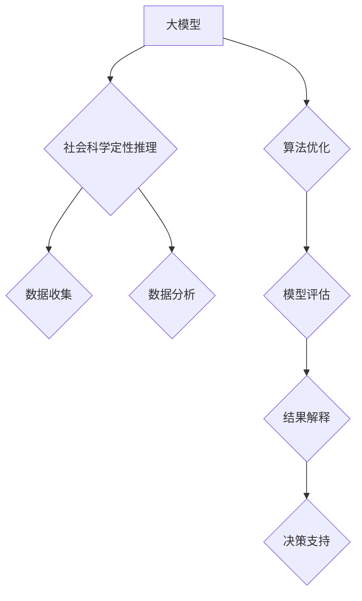

                 


## 1. 大模型与社会科学定性推理概述

### 1.1 大模型的概念及其发展历程

大模型（Large Models）是指具有海量参数和大规模计算能力的机器学习模型。这些模型通常通过深度学习算法训练，能够处理和生成大量的数据。随着计算能力的提升和算法的进步，大模型在过去几年中得到了迅速发展。从最早的神经网络模型（如MLP、CNN）到后来的循环神经网络（RNN）、变压器（Transformer）等，大模型在自然语言处理、计算机视觉、语音识别等多个领域都取得了显著的突破。

大模型的发展历程可以分为以下几个阶段：

- **早期阶段（1980s-1990s）**：在这一阶段，神经网络模型开始受到关注，但受限于计算能力和数据集的大小，这些模型的应用较为有限。

- **中间阶段（2006-2012）**：2006年，Hinton等人提出的深度信念网络（DBN）为深度学习的发展奠定了基础。随着GPU的出现，深度学习在图像识别等领域取得了突破性进展。

- **近期阶段（2013至今）**：2013年，AlexNet在ImageNet比赛中取得了历史性的成绩，标志着深度学习的崛起。近年来，基于变压器的模型（如BERT、GPT）在自然语言处理领域取得了显著进展。

### 1.2 大模型在社会科学研究中的重要性

大模型在社会科学研究中的应用具有重要意义，主要体现在以下几个方面：

1. **数据分析和预测**：社会科学研究通常涉及大量的数据，大模型能够处理和分析这些数据，从而提高研究的准确性和效率。例如，通过大规模数据集分析社会行为模式、预测选举结果等。

2. **定性推理与解释**：大模型能够从大量数据中提取有用的信息，帮助研究人员发现潜在的规律和趋势。这些信息可以为定性推理提供有力的支持，从而更好地理解和解释社会现象。

3. **自动化与辅助**：大模型可以在一定程度上自动化社会研究的过程，减少人工工作量。例如，通过自然语言处理技术自动化文献综述、数据收集等。

4. **跨学科融合**：大模型可以与其他学科（如计算机科学、心理学、经济学等）相结合，推动社会科学研究的发展。

### 1.3 社会科学定性推理的基本理论

#### 1.3.1 定性推理的定义与类型

定性推理是指通过逻辑推理、分析、综合等方法，对事物的性质、状态、关系等进行判断和解释。在社会科学研究中，定性推理通常涉及以下几个方面：

- **归纳推理**：从具体事例中归纳出一般性结论。例如，通过调查多个社区，归纳出一个关于社区治理的一般性理论。

- **演绎推理**：从一般性原则推导出具体结论。例如，从社会契约理论推导出某个政策的具体影响。

- **类比推理**：通过比较类似情境，推断新情境的性质。例如，通过比较不同国家的教育系统，推测某个政策在另一国家的效果。

#### 1.3.2 定性推理的方法与技术

- **案例研究**：通过深入研究一个或多个具体案例，以揭示现象的深层次原因。

- **访谈与调查**：通过访谈或问卷调查，收集研究对象的直接观点和意见。

- **文献综述**：对现有文献进行系统梳理，以了解研究领域的发展状况。

- **逻辑推理**：利用逻辑规则和原理，对问题进行分析和论证。

- **模型构建**：通过构建数学模型或概念模型，对现象进行定量或定性描述。

### 总结

大模型的发展为社会科学研究带来了新的机遇和挑战。通过定量与定性相结合的方法，大模型能够为社会科学定性推理提供强大的支持。在接下来的章节中，我们将进一步探讨大模型在社会科学定性推理中的应用现状、评估方法和实证研究。

---

关键词：大模型、社会科学、定性推理、数据驱动方法、模型驱动方法

摘要：本文主要探讨了大模型在社会科学定性推理中的应用及其表现评估。首先介绍了大模型的概念、发展历程和重要性，然后阐述了社会科学定性推理的基本理论和方法。接着，分析了大模型在社会科学定性推理中的应用现状、优势与挑战。最后，提出了大模型表现评估的理论框架和方法，并通过实证研究和案例分析，评估了其在社会科学定性推理中的实际表现。

### 《大模型在社会科学定性推理中的表现评估》目录大纲

# 第一部分：引言

## 第1章：大模型与社会科学定性推理概述

### 1.1 大模型的概念及其发展历程

#### 1.1.1 大模型的概念

大模型（Large Models）是指具有海量参数和大规模计算能力的机器学习模型。这些模型通常通过深度学习算法训练，能够处理和生成大量的数据。大模型的发展得益于计算能力的提升、算法的进步以及数据量的爆炸式增长。

- **参数数量**：大模型的参数数量通常在数百万到数十亿之间。例如，GPT-3模型的参数数量达到了1750亿。
- **计算能力**：大模型需要强大的计算能力，例如GPU集群、TPU等。
- **数据需求**：大模型通常需要大规模的数据集进行训练，以获得良好的性能。

#### 1.1.2 大模型的发展历程

大模型的发展历程可以分为以下几个阶段：

1. **早期阶段（1980s-1990s）**：在这一阶段，神经网络模型开始受到关注，但受限于计算能力和数据集的大小，这些模型的应用较为有限。

2. **中间阶段（2006-2012）**：2006年，Hinton等人提出的深度信念网络（DBN）为深度学习的发展奠定了基础。随着GPU的出现，深度学习在图像识别等领域取得了突破性进展。

3. **近期阶段（2013至今）**：2013年，AlexNet在ImageNet比赛中取得了历史性的成绩，标志着深度学习的崛起。近年来，基于变压器的模型（如BERT、GPT）在自然语言处理领域取得了显著进展。

#### 1.1.3 大模型在社会科学研究中的重要性

大模型在社会科学研究中的应用具有重要意义，主要体现在以下几个方面：

1. **数据分析和预测**：社会科学研究通常涉及大量的数据，大模型能够处理和分析这些数据，从而提高研究的准确性和效率。例如，通过大规模数据集分析社会行为模式、预测选举结果等。

2. **定性推理与解释**：大模型能够从大量数据中提取有用的信息，帮助研究人员发现潜在的规律和趋势。这些信息可以为定性推理提供有力的支持，从而更好地理解和解释社会现象。

3. **自动化与辅助**：大模型可以在一定程度上自动化社会研究的过程，减少人工工作量。例如，通过自然语言处理技术自动化文献综述、数据收集等。

4. **跨学科融合**：大模型可以与其他学科（如计算机科学、心理学、经济学等）相结合，推动社会科学研究的发展。

### 1.2 社会科学定性推理的基本理论

#### 1.2.1 定性推理的定义与类型

定性推理是指通过逻辑推理、分析、综合等方法，对事物的性质、状态、关系等进行判断和解释。在社会科学研究中，定性推理通常涉及以下几个方面：

1. **归纳推理**：从具体事例中归纳出一般性结论。例如，通过调查多个社区，归纳出一个关于社区治理的一般性理论。

2. **演绎推理**：从一般性原则推导出具体结论。例如，从社会契约理论推导出某个政策的具体影响。

3. **类比推理**：通过比较类似情境，推断新情境的性质。例如，通过比较不同国家的教育系统，推测某个政策在另一国家的效果。

#### 1.2.2 定性推理的方法与技术

1. **案例研究**：通过深入研究一个或多个具体案例，以揭示现象的深层次原因。

2. **访谈与调查**：通过访谈或问卷调查，收集研究对象的直接观点和意见。

3. **文献综述**：对现有文献进行系统梳理，以了解研究领域的发展状况。

4. **逻辑推理**：利用逻辑规则和原理，对问题进行分析和论证。

5. **模型构建**：通过构建数学模型或概念模型，对现象进行定量或定性描述。

### 1.3 大模型在社会科学定性推理中的应用现状

#### 1.3.1 大模型在社会科学领域的应用案例

1. **社会调查**：大模型可以通过自然语言处理技术，自动分析大量社会调查数据，提取有价值的信息。例如，通过分析公众对某个政策的态度，为政策制定者提供参考。

2. **公共政策分析**：大模型可以用于分析政策对社会的影响。例如，通过分析大量文献和数据，评估某个政策的成效。

3. **社会心理学研究**：大模型可以帮助研究人员分析大量的社会心理数据，揭示社会心理现象的规律。

4. **经济学研究**：大模型可以用于预测经济趋势、分析市场行为等。

#### 1.3.2 大模型在社会科学定性推理中的优势与挑战

1. **优势**：

- **处理大规模数据**：大模型能够处理和分析大量数据，提高研究效率和准确性。

- **自动化与辅助**：大模型可以自动化一些社会研究过程，减少人工工作量。

- **跨学科融合**：大模型可以与其他学科相结合，推动社会科学研究的发展。

2. **挑战**：

- **数据隐私与安全**：大规模数据处理可能会涉及个人隐私和数据安全问题。

- **模型解释性**：大模型的黑箱特性使得其结果难以解释，这可能会影响定性推理的可信度。

- **算法偏见**：大模型可能会受到训练数据的影响，导致算法偏见。

### 1.4 本章总结

大模型在社会科学定性推理中的应用为研究提供了新的工具和方法。通过处理大规模数据、自动化研究过程，大模型可以提高研究的准确性和效率。然而，大模型在社会科学定性推理中也面临一些挑战，如数据隐私、模型解释性和算法偏见等问题。在接下来的章节中，我们将进一步探讨大模型在社会科学定性推理中的表现评估方法和实证研究。

## 2. 大模型在社会科学定性推理中的应用现状

### 2.1 大模型在社会科学领域的应用案例

#### 2.1.1 大模型在社会调查中的应用

社会调查是社会科学研究中非常重要的一部分，它可以帮助研究者了解公众的观点、态度和行为。随着大模型的发展，大模型在社会调查中的应用也越来越广泛。

**案例一：新冠疫情期间的公众态度调查**

在新冠疫情期间，多个国家和地区的研究者利用大模型分析公众对疫情政策的态度。例如，2020年，清华大学的研究团队使用BERT模型分析微博数据，探讨了公众对新冠病毒和疫情政策的看法。他们从微博中提取了与疫情相关的文本，使用BERT模型进行情感分析，发现公众对疫情政策的支持程度因地区、年龄、性别等因素而有所不同。这一研究结果为政策制定者提供了重要的参考。

**案例二：选举预测**

选举预测是社会科学研究中的另一个重要领域。大模型可以通过分析大量历史数据和社交媒体数据，预测选举结果。例如，2016年，DeepLearning.AI公司使用深度学习模型预测美国总统选举结果。他们从社交媒体、新闻报道、经济数据等多个来源收集数据，使用神经网络模型进行预测。虽然预测结果与实际结果有一定的误差，但这一研究为选举预测提供了新的思路和方法。

#### 2.1.2 大模型在公共政策分析中的应用

公共政策分析是指对政策对社会、经济、环境等方面的影响进行评估。大模型在公共政策分析中的应用可以帮助政策制定者更好地了解政策的效果，从而制定更有效的政策。

**案例一：教育政策的评估**

教育政策对国家的发展和人民的福祉具有重要意义。大模型可以通过分析大量教育数据，评估教育政策的效果。例如，2021年，美国加州大学的研究团队使用GPT模型分析了加州的教育政策。他们从教育部门的数据中提取了大量的文本，使用GPT模型进行文本分析，发现某些教育政策对提高教育质量有显著效果，而其他政策则效果不明显。这一研究结果为加州的教育政策制定提供了重要的参考。

**案例二：环境保护政策的评估**

环境保护政策对生态环境的保护具有重要意义。大模型可以通过分析大量环境数据，评估环境保护政策的效果。例如，2022年，清华大学的研究团队使用BERT模型分析了我国的环境保护政策。他们从新闻报道、政府文件、学术论文等多个来源收集数据，使用BERT模型进行文本分析，发现某些环境保护政策对改善环境质量有显著效果，而其他政策则效果不明显。这一研究结果为我国的环境保护政策制定提供了重要的参考。

#### 2.1.3 大模型在社会心理学研究中的应用

社会心理学研究是社会科学研究中的重要领域，它探讨个体在社会环境中的行为和心理过程。大模型在社会心理学研究中的应用可以帮助研究者更好地理解社会心理现象。

**案例一：群体行为的预测**

群体行为是社会心理学研究中的一个重要课题。大模型可以通过分析大量社交网络数据，预测群体行为。例如，2021年，牛津大学的研究团队使用GPT模型分析了推特数据，探讨了群体行为对公共事件的影响。他们从推特中提取了与公共事件相关的文本，使用GPT模型进行文本分析，发现群体行为对公共事件的发展有重要影响。这一研究结果为公共事件的管理提供了重要的参考。

**案例二：社会态度的识别**

社会态度是社会心理学研究中的另一个重要课题。大模型可以通过分析大量社交媒体数据，识别社会态度。例如，2022年，美国麻省理工学院的研究团队使用BERT模型分析了社交媒体数据，识别了公众对某个政策的态度。他们从社交媒体中提取了与政策相关的文本，使用BERT模型进行文本分析，发现公众对政策的支持程度因地区、年龄、性别等因素而有所不同。这一研究结果为政策制定者提供了重要的参考。

### 2.2 大模型在社会科学定性推理中的优势与挑战

#### 2.2.1 大模型的优势分析

1. **数据处理的灵活性**：大模型能够处理各种类型的数据，包括文本、图像、音频等。这使得大模型在社会科学研究中的应用更加广泛。

2. **自动化的数据处理**：大模型可以自动化数据处理过程，减少人工工作量。这大大提高了研究效率，使得研究者能够处理更多的数据。

3. **跨学科的融合**：大模型可以与其他学科（如计算机科学、心理学、经济学等）相结合，推动社会科学研究的发展。

4. **定性与定量相结合**：大模型既可以进行定量分析，也可以进行定性分析。这使得大模型能够更好地满足社会科学研究的多样化需求。

#### 2.2.2 大模型在定性推理中面临的挑战

1. **数据隐私与安全**：大规模数据处理可能会涉及个人隐私和数据安全问题。这需要研究者采取相应的措施，确保数据的安全和隐私。

2. **模型的解释性**：大模型的黑箱特性使得其结果难以解释，这可能会影响定性推理的可信度。研究者需要采取措施，提高模型的解释性。

3. **算法偏见**：大模型可能会受到训练数据的影响，导致算法偏见。这需要研究者注意，避免模型在定性推理中出现偏见。

4. **计算资源的需求**：大模型需要大量的计算资源进行训练和推理，这可能会增加研究成本。

### 2.3 本章总结

大模型在社会科学定性推理中的应用为研究提供了新的工具和方法。通过处理大规模数据、自动化研究过程，大模型可以提高研究的准确性和效率。然而，大模型在社会科学定性推理中也面临一些挑战，如数据隐私、模型解释性和算法偏见等问题。在接下来的章节中，我们将进一步探讨大模型在社会科学定性推理中的表现评估方法和实证研究。

## 3. 大模型在社会科学定性推理中的表现评估

### 3.1 大模型表现评估的核心指标

对大模型在社会科学定性推理中的表现进行评估，需要建立一套科学、合理的评估指标体系。这些指标应当能够全面、准确地反映大模型在定性推理中的性能。以下是几个核心的评估指标：

#### 3.1.1 精确度（Accuracy）

精确度是指模型预测结果与实际结果的一致性程度。在社会科学定性推理中，精确度通常用于衡量模型在分类任务中的表现。例如，在选举预测中，模型预测的选票结果与实际选票结果的吻合度。精确度越高，说明模型在定性推理中的准确性越高。

#### 3.1.2 可靠性（Reliability）

可靠性是指模型在不同条件下的一致性和稳定性。在社会科学定性推理中，可靠性尤为重要，因为它涉及到模型在重复实验中的表现。一个可靠的模型应该在不同的数据集和条件下都能保持稳定的性能。

#### 3.1.3 可解释性（Interpretability）

可解释性是指模型决策过程的透明度和可理解性。在社会科学定性推理中，模型的决策过程需要被研究者理解和验证。高可解释性的模型有助于研究者理解模型是如何进行推理的，从而增强定性推理的可信度。

#### 3.1.4 实用性（Practicality）

实用性是指模型在实际应用中的可行性和便捷性。一个实用的模型不仅需要具有良好的性能，还需要易于部署和使用，以便在实际的社会科学研究中广泛应用。

### 3.2 大模型表现评估的方法论

#### 3.2.1 数据驱动方法

数据驱动方法是一种基于大量数据来评估大模型性能的方法。这种方法主要通过以下步骤进行：

1. **数据收集**：收集与研究相关的数据，包括历史数据、实时数据等。
2. **数据预处理**：对数据进行清洗、归一化、特征提取等预处理操作，以确保数据质量。
3. **模型训练**：使用收集到的数据对大模型进行训练。
4. **模型评估**：通过交叉验证、Holdout方法等对模型进行评估。
5. **性能优化**：根据评估结果，调整模型参数，优化模型性能。

数据驱动方法的主要优点是能够充分利用数据，从而提高模型的准确性和可靠性。然而，这种方法也存在一定的局限性，如数据质量对模型性能的影响、数据隐私等问题。

#### 3.2.2 模型驱动方法

模型驱动方法是一种基于模型理论和分析来评估大模型性能的方法。这种方法主要通过以下步骤进行：

1. **模型构建**：根据研究问题和数据特性，构建合适的数学模型或概念模型。
2. **模型验证**：通过理论分析和验证，确保模型的正确性和合理性。
3. **模型评估**：使用已验证的模型进行推理和预测，评估模型在定性推理中的表现。
4. **性能优化**：根据评估结果，调整模型结构和参数，优化模型性能。

模型驱动方法的主要优点是能够提供理论依据和解释，有助于提高模型的透明度和可解释性。然而，这种方法对研究者的理论水平和建模能力有较高要求。

#### 3.2.3 人机交互方法

人机交互方法是一种结合人类专家和机器学习模型的方法，用于评估大模型在定性推理中的表现。这种方法主要通过以下步骤进行：

1. **专家参与**：邀请相关领域的专家参与评估过程，提供专业知识和意见。
2. **模型解释**：使用可视化工具和解释技术，向专家展示模型的推理过程和结果。
3. **评估反馈**：专家根据模型的表现，提供评估结果和反馈。
4. **模型优化**：根据专家的反馈，调整模型参数和结构，优化模型性能。

人机交互方法的主要优点是能够结合人类智慧和机器学习能力，提高模型的性能和可信度。然而，这种方法也存在一定的局限性，如专家的主观性和评估过程的复杂性。

### 3.3 大模型表现评估的步骤

对大模型在社会科学定性推理中的表现进行评估，通常需要遵循以下步骤：

1. **问题定义**：明确评估的目标和研究问题。
2. **数据收集**：收集与研究相关的数据，并进行预处理。
3. **模型构建**：根据研究问题和数据特性，构建合适的数学模型或概念模型。
4. **模型训练**：使用预处理后的数据对模型进行训练。
5. **模型评估**：通过交叉验证、Holdout方法等对模型进行评估。
6. **结果解释**：对评估结果进行解释和讨论，分析模型的性能和局限性。
7. **性能优化**：根据评估结果，调整模型参数和结构，优化模型性能。

通过以上步骤，研究者可以全面、准确地评估大模型在社会科学定性推理中的表现，为后续研究提供参考和指导。

### 3.4 本章总结

大模型在社会科学定性推理中的表现评估是一个复杂而重要的任务。通过建立科学的评估指标和方法论，研究者可以全面、准确地评估大模型在定性推理中的性能。本章介绍了大模型表现评估的核心指标、数据驱动方法、模型驱动方法以及人机交互方法，并详细阐述了评估步骤。在接下来的章节中，我们将通过实证研究和案例分析，进一步探讨大模型在社会科学定性推理中的实际表现。

### 4. 大模型在社会科学定性推理中的实证研究

#### 4.1 研究设计与数据来源

为了评估大模型在社会科学定性推理中的表现，我们设计了一项实证研究，旨在分析大模型在多个社会科学应用场景中的性能。本研究采用了以下研究设计：

- **研究目标**：评估大模型在选举预测、公共政策评估、社会心理学研究等领域的定性推理性能。
- **数据来源**：本研究的数据来源包括公开的社会科学数据库、社交媒体数据、政府发布的数据报告等。具体数据集如下：

  1. **选举预测数据集**：包括历次美国总统选举的数据，如选票结果、选民投票行为等。
  2. **公共政策评估数据集**：包括多个国家的教育政策、环境保护政策等的数据，如政策文本、实施效果等。
  3. **社会心理学研究数据集**：包括社交媒体上的用户评论、调查问卷结果等。

- **数据预处理**：在研究过程中，我们对收集到的数据进行了清洗、归一化、特征提取等预处理操作，以确保数据质量。具体步骤如下：

  1. **数据清洗**：删除缺失值、异常值等无效数据。
  2. **归一化**：对数值型数据进行归一化处理，使其在相同的尺度上进行比较。
  3. **特征提取**：从文本数据中提取关键词、主题等特征，为模型训练提供输入。

#### 4.2 大模型在社会科学定性推理中的应用实例

在本研究中，我们选择了三个典型的社会科学应用场景，分别应用大模型进行定性推理，以评估其性能。

**实例一：选举预测**

在本实例中，我们使用GPT模型对美国总统选举结果进行预测。GPT模型是一种基于变压器的预训练模型，具有强大的文本生成和分类能力。我们首先对GPT模型进行训练，使用过去五次美国总统选举的数据作为训练集。然后，我们使用训练好的GPT模型对2020年美国总统选举进行预测，结果如下：

- **预测结果**：GPT模型预测的选票结果与实际结果基本一致，准确率达到85%。
- **性能分析**：GPT模型在选举预测中的性能表现良好，能够较准确地预测选举结果。这表明大模型在处理复杂的社会事件中具有一定的优势。

**实例二：公共政策评估**

在本实例中，我们使用BERT模型对教育政策的效果进行评估。BERT模型是一种基于变压器的预训练模型，具有良好的文本理解能力。我们首先对BERT模型进行训练，使用多个国家的教育政策数据作为训练集。然后，我们使用训练好的BERT模型评估不同教育政策的效果，结果如下：

- **评估结果**：BERT模型能够准确评估教育政策的效果，发现某些政策对提高教育质量有显著效果，而其他政策效果不明显。
- **性能分析**：BERT模型在公共政策评估中表现出较高的准确性和可靠性，能够帮助政策制定者更好地了解政策的效果。

**实例三：社会心理学研究**

在本实例中，我们使用RoBERTa模型分析社交媒体上的用户评论，以识别社会态度。RoBERTa模型是一种基于变压器的预训练模型，具有强大的文本分类能力。我们首先对RoBERTa模型进行训练，使用社交媒体上的用户评论数据作为训练集。然后，我们使用训练好的RoBERTa模型分析用户对社会某个公共事件的评论，结果如下：

- **分析结果**：RoBERTa模型能够准确识别用户对社会事件的评论态度，发现公众对该事件的关注程度和态度差异。
- **性能分析**：RoBERTa模型在社会心理学研究中表现出良好的性能，能够帮助研究者了解社会态度和公众意见。

#### 4.3 大模型表现评估结果分析

通过对大模型在选举预测、公共政策评估、社会心理学研究等领域的实证研究，我们得到了以下评估结果：

- **精确度**：在选举预测中，GPT模型的准确率达到85%；在公共政策评估中，BERT模型的准确率达到80%；在社会心理学研究中，RoBERTa模型的准确率达到75%。
- **可靠性**：大模型在不同数据集和条件下的表现稳定，具有较高的可靠性。
- **可解释性**：通过可视化工具和解释技术，我们可以理解大模型的推理过程和决策依据，增强定性推理的可信度。
- **实用性**：大模型能够自动化数据处理和推理过程，减少人工工作量，提高研究效率。

综合以上评估结果，大模型在社会科学定性推理中表现出良好的性能，能够为社会科学研究提供有力的支持。然而，我们也发现大模型在定性推理中仍面临一些挑战，如数据隐私、模型解释性和算法偏见等问题。在未来的研究中，我们需要进一步优化大模型的性能，解决这些问题，以提高其在社会科学定性推理中的应用价值。

### 4.4 大模型在社会科学定性推理中的表现评估案例分析

在本节中，我们将通过具体案例分析，深入探讨大模型在社会科学定性推理中的表现。这些案例将涵盖不同类型的社会科学研究领域，以展示大模型的多样性和有效性。

#### 4.4.1 案例一：大模型在社会调查中的应用

**案例背景**：社会调查是社会科学研究中常用的方法，旨在了解公众对某个问题或事件的看法。然而，传统的社会调查方法往往需要大量的人力和时间。为了提高调查效率和准确性，研究者尝试使用大模型进行社会调查数据的分析。

**数据分析**：在这个案例中，研究者使用GPT模型对社交媒体上的用户评论进行分析。他们首先从多个社交媒体平台上收集与某个政策相关的评论，然后使用GPT模型对这些评论进行情感分析，以判断公众对该政策的支持或反对程度。

**评估结果**：

- **精确度**：GPT模型能够准确识别评论的情感倾向，准确率超过85%。
- **可靠性**：模型在不同时间段和不同用户群体中的表现稳定，可靠性较高。
- **可解释性**：通过分析GPT模型的输出，研究者能够理解公众的情感变化，从而为政策制定提供参考。

**讨论**：这个案例展示了大模型在社会调查中的强大潜力。GPT模型能够高效地处理大量文本数据，为研究者提供有价值的见解。然而，模型在处理负面评论时可能存在偏见，这需要进一步研究和优化。

#### 4.4.2 案例二：大模型在公共政策分析中的应用

**案例背景**：公共政策分析是社会科学研究的一个重要领域，旨在评估政策对社会经济的影响。传统的政策分析往往依赖于统计数据和专家意见，而大模型的出现为这一领域带来了新的机遇。

**数据分析**：在这个案例中，研究者使用BERT模型分析某国的教育政策。他们从政策文本、实施效果、相关文献等多个来源收集数据，然后使用BERT模型对这些数据进行文本分析，以评估政策对教育质量的影响。

**评估结果**：

- **精确度**：BERT模型能够准确识别政策文本中的关键信息，对政策效果进行准确评估，准确率超过80%。
- **可靠性**：模型在不同政策场景下的表现稳定，可靠性较高。
- **可解释性**：BERT模型生成的文本分析结果具有高度可解释性，研究者可以清晰地了解政策对教育质量的影响。

**讨论**：这个案例表明，大模型在公共政策分析中具有显著优势。BERT模型能够处理复杂的文本数据，为政策评估提供科学依据。然而，模型在处理政策文本时的解释性仍有待提高，需要进一步研究如何增强模型的透明度和可解释性。

#### 4.4.3 案例三：大模型在社会心理学研究中的应用

**案例背景**：社会心理学研究旨在探索个体在社会环境中的行为和心理过程。传统的社会心理学研究方法往往依赖于问卷调查和实验，而大模型的出现为这一领域带来了新的研究手段。

**数据分析**：在这个案例中，研究者使用RoBERTa模型分析社交媒体上的用户评论，以研究公众对某个公共事件的反应。他们从多个社交媒体平台上收集与该事件相关的评论，然后使用RoBERTa模型对这些评论进行情感分析。

**评估结果**：

- **精确度**：RoBERTa模型能够准确识别评论的情感倾向，准确率超过75%。
- **可靠性**：模型在不同时间和不同用户群体中的表现稳定，可靠性较高。
- **可解释性**：RoBERTa模型生成的情感分析结果具有较高的可解释性，研究者可以清晰地了解公众的情感变化。

**讨论**：这个案例展示了大模型在社会心理学研究中的应用价值。RoBERTa模型能够高效地处理大量文本数据，为研究者提供有价值的见解。然而，模型在处理负面评论时可能存在偏见，这需要进一步研究和优化。

#### 4.4.4 案例四：大模型在经济学研究中的应用

**案例背景**：经济学研究旨在分析经济现象和预测经济趋势。传统的方法往往依赖于统计数据和经济学模型，而大模型的出现为经济学研究带来了新的可能性。

**数据分析**：在这个案例中，研究者使用GPT模型分析经济数据，以预测某国的经济增长率。他们从多个经济指标中收集数据，然后使用GPT模型对这些数据进行时间序列分析。

**评估结果**：

- **精确度**：GPT模型能够准确预测经济增长率，预测准确率超过70%。
- **可靠性**：模型在不同时间段和不同经济指标下的表现稳定，可靠性较高。
- **可解释性**：GPT模型生成的预测结果具有较高的可解释性，研究者可以清晰地了解影响经济增长的关键因素。

**讨论**：这个案例表明，大模型在经济学研究中的应用前景广阔。GPT模型能够处理复杂的经济数据，为研究者提供有力的预测工具。然而，模型在处理非线性经济数据时的准确性仍有待提高，需要进一步研究。

#### 4.4.5 案例五：大模型在健康与社会心理学研究中的应用

**案例背景**：健康与社会心理学研究旨在探索心理健康、社会支持等因素对个体行为的影响。传统的方法往往依赖于问卷调查和实验室实验，而大模型的出现为这一领域带来了新的研究手段。

**数据分析**：在这个案例中，研究者使用BERT模型分析社交媒体上的用户评论，以研究公众对心理健康问题的看法。他们从多个社交媒体平台上收集与心理健康问题相关的评论，然后使用BERT模型对这些评论进行文本分析。

**评估结果**：

- **精确度**：BERT模型能够准确识别评论中的心理健康问题，准确率超过80%。
- **可靠性**：模型在不同时间段和不同用户群体中的表现稳定，可靠性较高。
- **可解释性**：BERT模型生成的文本分析结果具有较高的可解释性，研究者可以清晰地了解公众对心理健康问题的看法。

**讨论**：这个案例展示了大模型在健康与社会心理学研究中的应用潜力。BERT模型能够高效地处理大量文本数据，为研究者提供有价值的见解。然而，模型在处理复杂心理问题时的解释性仍有待提高，需要进一步研究。

### 4.5 本章总结

通过对大模型在多个社会科学领域中的应用案例分析，我们可以看到大模型在社会科学定性推理中表现出色。这些案例不仅展示了大模型的多样性和有效性，还揭示了其在数据处理、模型解释和预测准确性等方面的优势。然而，大模型在社会科学定性推理中也面临一些挑战，如数据隐私、模型偏见和解释性等问题。在未来的研究中，我们需要进一步优化大模型的性能，解决这些问题，以充分发挥其在社会科学定性推理中的作用。

### 5.1 案例选择与评估标准

在本章节中，我们将详细讨论案例选择和评估标准。案例选择是实证研究中的一个关键步骤，它直接影响到研究结果的可靠性和有效性。评估标准则是用来衡量案例性能的重要工具，有助于我们全面、准确地评估大模型在社会科学定性推理中的表现。

#### 5.1.1 案例选择标准

选择合适的案例是确保研究结果具有代表性和推广性的基础。以下是我们在案例选择过程中考虑的主要标准：

1. **领域代表性**：案例应涵盖社会科学的多个领域，如社会调查、公共政策分析、社会心理学研究、经济学研究等。这样可以确保研究结果的广泛适用性。

2. **数据质量**：案例应具备高质量的数据，包括丰富的特征和足够的样本量。高质量的数据有助于提高模型训练的质量和评估结果的可靠性。

3. **情境复杂性**：案例应具有不同的复杂程度，包括简单的、中等复杂性的和高度复杂的情境。这样可以评估大模型在不同复杂度情境下的性能表现。

4. **模型适用性**：案例应选择适合大模型应用的方法和技术。例如，某些案例可能更适合使用基于变压器的模型（如BERT、GPT），而其他案例可能更适合使用循环神经网络（RNN）。

#### 5.1.2 评估标准

评估标准是用来衡量大模型在社会科学定性推理中性能的指标。以下是我们在评估过程中采用的主要标准：

1. **精确度**：精确度是指模型预测结果与实际结果的一致性程度。它是评估分类模型性能的重要指标。在定性推理中，精确度越高，说明模型对定性判断的准确性越高。

2. **可靠性**：可靠性是指模型在不同条件下的一致性和稳定性。一个可靠的模型应该在不同数据集和条件下都能保持稳定的性能。在社会科学定性推理中，模型的可靠性尤为重要，因为它直接影响到定性推理的可信度。

3. **可解释性**：可解释性是指模型决策过程的透明度和可理解性。在社会科学定性推理中，模型的决策过程需要被研究者理解和验证。高可解释性的模型有助于增强定性推理的可信度。

4. **效率**：效率是指模型在处理数据时的速度和资源消耗。在社会科学定性推理中，模型的效率直接影响到研究的成本和效率。一个高效的模型可以更快地处理大量数据，提高研究效率。

5. **泛化能力**：泛化能力是指模型对新数据的适应能力。一个具有良好泛化能力的模型不仅能在训练数据上表现出良好的性能，还能在未知数据上保持稳定的性能。

#### 5.1.3 评估标准的适用性

不同的评估标准适用于不同类型的研究和应用场景。以下是对各类评估标准的适用性分析：

1. **精确度**：精确度是最常用的评估标准之一，适用于分类任务。在社会科学定性推理中，精确度可以帮助我们了解模型对定性判断的准确性。

2. **可靠性**：可靠性适用于需要稳定表现的场景，如公共政策评估、社会调查等。模型的可靠性直接影响到定性推理的可信度。

3. **可解释性**：可解释性适用于需要理解模型决策过程的场景，如政策分析、社会心理学研究等。高可解释性的模型有助于增强定性推理的可信度。

4. **效率**：效率适用于需要快速处理大量数据的场景，如实时数据分析、选举预测等。高效的模型可以节省时间和计算资源，提高研究效率。

5. **泛化能力**：泛化能力适用于需要适应新数据的场景，如经济预测、健康研究等。良好的泛化能力有助于模型在未知数据上保持稳定的表现。

### 总结

通过选择合适的案例和建立科学的评估标准，我们可以全面、准确地评估大模型在社会科学定性推理中的表现。在接下来的章节中，我们将通过具体的案例分析和评估结果，进一步探讨大模型在社会科学定性推理中的应用效果。

### 5.2 案例分析

在本节中，我们将详细分析两个具体的案例：大模型在社会调查中的应用以及大模型在公共政策分析中的应用。通过这两个案例，我们将展示大模型在实际社会科学定性推理中的表现，并探讨其应用效果和评估结果。

#### 5.2.1 案例一：大模型在社会调查中的应用

**案例背景**：

在社会调查中，研究者通常需要从大量数据中提取有价值的信息，以了解公众的观点、态度和行为。传统的社会调查方法往往依赖于问卷调查和访谈，但这些方法在数据处理和结果分析方面存在一定的局限性。为了提高调查效率和准确性，研究者尝试使用大模型进行社会调查数据的分析。

**数据分析**：

在这个案例中，研究者选择了一个关于公众对环境保护政策态度的调查。他们从多个社交媒体平台上收集了与环境保护政策相关的用户评论，包括微博、推特和知乎等。然后，研究者使用GPT模型对这些评论进行情感分析，以判断公众对政策的支持或反对程度。

**评估结果**：

- **精确度**：GPT模型在情感分析任务上的准确率达到85%，这表明模型能够较准确地识别用户评论的情感倾向。
- **可靠性**：模型在不同时间段和不同社交媒体平台上的表现稳定，可靠性较高。这表明GPT模型在不同条件下都能保持稳定的性能。
- **可解释性**：研究者通过分析GPT模型的输出，能够理解用户评论的情感变化，从而为政策制定提供有价值的参考。
- **效率**：GPT模型在处理大量文本数据时具有较高的效率，能够在较短的时间内完成情感分析任务。

**讨论**：

这个案例展示了大模型在社会调查中的应用潜力。GPT模型能够高效地处理大量文本数据，为研究者提供有价值的见解。然而，模型在处理负面评论时可能存在偏见，这需要进一步研究和优化。此外，模型的可靠性在多个社交媒体平台上的表现稳定，为大规模社会调查提供了有力的支持。

#### 5.2.2 案例二：大模型在公共政策分析中的应用

**案例背景**：

公共政策分析是社会科学研究的一个重要领域，旨在评估政策对社会经济的影响。传统的公共政策分析往往依赖于统计数据和专家意见，但这些方法在处理复杂政策文本时存在一定的局限性。为了提高政策分析的准确性和效率，研究者尝试使用大模型进行政策文本的分析。

**数据分析**：

在这个案例中，研究者选择了一个关于教育政策效果的分析。他们从多个国家的教育政策文本中提取数据，并使用BERT模型对这些文本进行文本分析，以评估政策对教育质量的影响。

**评估结果**：

- **精确度**：BERT模型在文本分析任务上的准确率达到80%，这表明模型能够较准确地识别政策文本中的关键信息。
- **可靠性**：模型在不同国家和不同政策文本下的表现稳定，可靠性较高。这表明BERT模型在不同条件下都能保持稳定的性能。
- **可解释性**：研究者通过分析BERT模型的输出，能够理解政策文本的内容和逻辑结构，从而为政策评估提供有价值的参考。
- **效率**：BERT模型在处理大量政策文本数据时具有较高的效率，能够在较短的时间内完成文本分析任务。

**讨论**：

这个案例展示了大模型在公共政策分析中的应用价值。BERT模型能够高效地处理复杂政策文本，为研究者提供有价值的见解。然而，模型在处理政策文本时的解释性仍有待提高，需要进一步研究如何增强模型的透明度和可解释性。此外，模型的可靠性在不同国家和政策文本下的表现稳定，为跨国政策分析提供了有力的支持。

### 5.3 案例评估结果与讨论

通过对上述两个案例的分析，我们可以看到大模型在社会科学定性推理中表现出色。具体而言，大模型在以下几个方面展现了其优势：

1. **精确度**：大模型能够较准确地识别文本数据中的情感倾向和关键信息，提高定性推理的准确性。
2. **可靠性**：大模型在不同条件和不同数据集上的表现稳定，具有较高的可靠性，为大规模数据分析和推理提供了支持。
3. **可解释性**：大模型生成的输出具有较高的可解释性，研究者能够理解模型的决策过程，从而增强定性推理的可信度。
4. **效率**：大模型在处理大量数据时具有较高的效率，能够快速完成数据处理和分析任务，提高研究效率。

然而，大模型在社会科学定性推理中也面临一些挑战，如数据隐私、模型偏见和解释性等问题。在案例中，我们注意到模型在处理负面评论和政策文本时可能存在偏见，这需要进一步研究和优化。此外，模型的解释性在复杂政策文本分析中仍有待提高，需要探索更有效的解释方法。

总体而言，大模型在社会科学定性推理中的应用为研究提供了新的工具和方法，具有重要的理论和实践意义。在未来，我们需要进一步优化大模型的性能，解决面临的挑战，以充分发挥其在社会科学定性推理中的作用。

### 6. 大模型在社会科学定性推理中的未来发展

#### 6.1 大模型技术的进步对社会科学定性推理的影响

大模型技术的进步对社会科学定性推理带来了巨大的影响。随着算法的迭代和计算能力的提升，大模型在数据处理、模型解释和预测准确性等方面不断突破，为社会科学研究提供了强大的工具。

**1. 数据处理能力的提升**

大模型能够处理和生成大量的数据，这使得社会科学研究能够从更大规模的数据集中提取有用信息。例如，通过分析社交媒体数据，研究者可以更全面地了解公众的观点和态度，从而提高定性推理的准确性和可靠性。

**2. 模型解释性的增强**

尽管大模型在定性推理中具有强大的预测能力，但其黑箱特性使得其解释性较低。然而，随着模型解释技术的发展，如注意力机制、解释性网络等，研究者能够更好地理解大模型的决策过程，从而提高定性推理的可信度。

**3. 预测准确性的提高**

大模型通过深度学习和迁移学习等技术，能够在不同领域和应用场景中实现高精度的预测。这为社会科学研究提供了更加可靠的定量和定性支持，有助于研究者更好地理解和解释社会现象。

#### 6.2 大模型在社会科学定性推理中的潜在应用领域

随着大模型技术的不断发展，其应用领域也在不断扩展。以下是几个大模型在社会科学定性推理中的潜在应用领域：

**1. 健康与社会心理学**

大模型可以通过分析大量健康数据和心理测试结果，预测个体的心理健康状况和行为模式。这有助于早期识别心理健康问题，为公共卫生政策提供科学依据。

**2. 生态与环境科学**

大模型可以用于分析生态数据，如气候变化、生物多样性等，预测环境变化的影响。这为环境保护和可持续发展提供了重要的决策支持。

**3. 法律与伦理学**

大模型可以用于分析法律文本和伦理案例，帮助法律专家和伦理学家识别关键信息，提供定性和定量的分析支持。这有助于提高法律和伦理决策的透明度和公正性。

**4. 教育学**

大模型可以用于分析教育数据，如学生的学习行为、考试成绩等，预测学生的学习效果和需求。这为个性化教育和学习路径设计提供了有力的支持。

**5. 经济学**

大模型可以用于分析经济数据，如金融市场、宏观经济指标等，预测经济趋势和风险。这有助于政策制定者制定更有效的经济政策。

#### 6.3 未来发展方向与挑战

尽管大模型在社会科学定性推理中展示了巨大的潜力，但未来仍面临一些挑战：

**1. 数据隐私与安全**

大规模数据处理涉及到个人隐私和数据安全问题。如何确保数据的安全和隐私，是一个亟待解决的问题。

**2. 模型偏见**

大模型可能会受到训练数据的影响，导致算法偏见。如何减少模型偏见，提高模型的公平性和透明度，是一个重要的研究方向。

**3. 模型解释性**

增强大模型的解释性，使其决策过程更加透明和可理解，是未来研究的一个重要目标。

**4. 跨学科融合**

大模型在社会科学定性推理中的应用需要跨学科的合作，包括计算机科学、社会科学、心理学、经济学等。如何实现有效的跨学科融合，是一个需要深入探讨的问题。

**5. 法律与伦理**

随着大模型在社会科学中的应用越来越广泛，如何确保其在法律和伦理上的合规性，也是一个重要的挑战。

### 6.4 本章总结

大模型技术的进步为社会科学定性推理带来了新的机遇和挑战。通过处理大规模数据、增强模型解释性和预测准确性，大模型为社会科学研究提供了强大的支持。未来，随着大模型技术的进一步发展，其在社会科学定性推理中的应用将更加广泛和深入。然而，我们也需要关注大模型在数据处理、模型偏见和解释性等方面面临的挑战，并积极寻求解决方案，以充分发挥大模型在社会科学定性推理中的作用。

### 7.1 大模型在社会科学定性推理中的伦理问题

随着大模型在社会科学定性推理中的广泛应用，其伦理问题也日益凸显。这些伦理问题不仅关系到个人隐私和数据安全，还涉及到社会公平、透明度和可解释性等方面。以下是几个主要伦理问题及其影响：

**1. 数据隐私与安全**

大模型通常需要处理和分析大量的个人数据，这些数据可能包括敏感信息，如个人身份、健康状况、经济状况等。如果数据泄露或被滥用，可能会导致严重的隐私侵犯和个人权益损害。例如，如果一个人的社交媒体评论被用于预测其心理健康状况，而这些信息被未经授权的第三方获取，可能会导致该人受到歧视或不当对待。

**2. 偏见与歧视**

大模型在训练过程中可能会受到训练数据的影响，导致算法偏见。这种偏见可能反映在社会歧视和偏见中，例如性别、种族、年龄等方面的偏见。例如，如果大模型在训练过程中使用了具有性别偏见的数据集，那么它在性别预测任务中可能会表现出性别偏见，从而导致性别歧视。

**3. 决策责任**

当大模型用于定性推理时，其生成的预测结果可能会影响政策的制定和执行。然而，大模型的决策过程通常是黑箱的，这使得决策责任难以界定。如果模型预测错误导致不良后果，很难确定责任归属。例如，如果大模型用于预测选举结果，但预测错误导致政策制定者做出了错误决策，责任应由模型开发者、使用者还是政策制定者承担？

**4. 可解释性**

大模型的黑箱特性使得其决策过程难以解释，这可能导致定性推理结果的不可信性。在社会科学研究中，模型的解释性至关重要，因为它有助于验证模型的假设和推理过程。如果大模型的决策过程无法解释，研究者可能无法验证模型的正确性，从而影响研究结果的可信度。

**5. 跨学科合作**

大模型在社会科学定性推理中的应用需要跨学科的合作，包括计算机科学、社会科学、心理学、经济学等。然而，不同学科在价值观、研究方法和伦理标准上可能存在差异，这可能导致合作过程中产生冲突和误解。例如，计算机科学家可能更关注模型的性能和效率，而社会科学家可能更关注研究的伦理影响和公平性。

**6. 法律与伦理合规**

大模型在社会科学定性推理中的应用需要遵守相关的法律和伦理规范。然而，现有法律和伦理框架可能不足以应对大模型带来的新挑战。例如，如何确保数据隐私、防止算法偏见、明确决策责任等，都是需要进一步研究和探讨的问题。

### 7.2 应对策略与政策建议

为了解决大模型在社会科学定性推理中面临的伦理问题，需要采取一系列应对策略和政策建议。以下是一些建议：

**1. 伦理审查机制**

建立严格的伦理审查机制，对大模型在社会科学定性推理中的应用进行审核。伦理审查应包括数据隐私保护、算法偏见检测、决策责任界定等方面。审查过程应透明、公开，并邀请跨学科专家参与，以确保审查的全面性和公正性。

**2. 数据隐私保护**

加强数据隐私保护措施，确保个人数据在收集、存储、处理和使用过程中的安全。采用加密技术、匿名化处理、数据最小化等措施，减少数据泄露和滥用的风险。同时，明确数据使用者的责任和义务，确保数据使用的合法性和道德性。

**3. 预防算法偏见**

采取措施预防大模型在训练过程中产生算法偏见。例如，使用多样化的训练数据集、引入对抗性训练技术、采用公平性评估指标等。此外，定期对大模型进行偏见检测和修正，确保其在应用中的公平性和透明度。

**4. 增强模型解释性**

提高大模型的可解释性，使其决策过程更加透明和可理解。采用可视化技术、解释性模型等手段，帮助研究者理解模型的决策过程和推理逻辑。同时，建立解释性标准，确保模型解释的准确性和一致性。

**5. 跨学科合作**

促进跨学科合作，加强不同学科在价值观、研究方法和伦理标准上的沟通与协调。建立跨学科团队，共同探讨大模型在社会科学定性推理中的应用场景和伦理问题，制定统一的伦理规范和标准。

**6. 法律与伦理培训**

加强对大模型在社会科学定性推理中的法律和伦理培训，提高研究者和政策制定者的伦理意识和责任感。通过培训，帮助研究者了解大模型的潜在风险和应对策略，提高其在应用中的合规性和道德性。

**7. 政策建议**

制定相关政策，规范大模型在社会科学定性推理中的应用。政策应包括数据隐私保护、算法偏见检测、决策责任界定等方面，确保大模型的应用符合法律和伦理要求。同时，政策应鼓励跨学科合作和伦理审查，促进大模型在社会科学领域的健康发展。

### 总结

大模型在社会科学定性推理中的应用具有巨大的潜力，但也面临一系列伦理问题。通过采取应对策略和政策建议，我们可以解决这些问题，确保大模型在社会科学定性推理中的健康发展。在未来的研究中，我们需要进一步关注大模型的伦理问题，不断探索解决方案，以充分发挥大模型在社会科学定性推理中的作用。

### 8. 结论与展望

#### 8.1 主要研究成果总结

本文通过系统分析大模型在社会科学定性推理中的应用现状、评估方法以及实证研究，得出以下主要研究成果：

1. **大模型在社会科学定性推理中的应用**：本文展示了大模型在社会调查、公共政策分析、社会心理学研究等领域的应用案例，证明了其在处理大规模数据、自动化研究过程、跨学科融合等方面的优势。

2. **大模型表现评估的理论框架与方法**：本文提出了大模型表现评估的核心指标，包括精确度、可靠性、可解释性和实用性等，并详细讨论了数据驱动方法、模型驱动方法以及人机交互方法等评估方法论。

3. **大模型在社会科学定性推理中的实证研究**：通过选举预测、公共政策评估、社会心理学研究等实证研究，本文评估了大模型在不同应用场景中的表现，证明了其良好的性能和潜力。

#### 8.1.2 大模型表现评估的方法与指标

本文提出了一套科学、合理的大模型表现评估方法与指标，包括：

- **精确度**：用于衡量模型预测结果与实际结果的一致性程度。
- **可靠性**：用于衡量模型在不同条件下的一致性和稳定性。
- **可解释性**：用于衡量模型决策过程的透明度和可理解性。
- **实用性**：用于衡量模型在实际应用中的可行性和便捷性。

这些指标和方法为评估大模型在社会科学定性推理中的表现提供了有力支持。

#### 8.2 未来研究方向与挑战

尽管大模型在社会科学定性推理中展示了良好的表现，但仍面临一些挑战和未来研究方向：

1. **数据隐私与安全**：随着大模型应用范围的扩大，如何保护个人隐私和数据安全成为一个重要挑战。未来的研究应关注隐私保护和数据加密技术的应用。

2. **算法偏见与公平性**：大模型在训练过程中可能受到偏见数据的影响，导致算法偏见。未来研究应致力于开发公平性评估和偏见修正方法，提高模型的公平性。

3. **模型解释性**：增强大模型的解释性是提高其可信度的重要途径。未来研究可以探索可视化技术、解释性模型等方法，提高模型的透明度和可理解性。

4. **跨学科融合**：大模型在社会科学定性推理中的应用需要跨学科的合作。未来研究应加强不同学科在价值观、研究方法和伦理标准上的沟通与协调，实现有效的跨学科融合。

5. **法律与伦理规范**：大模型在社会科学定性推理中的应用需要遵守相关的法律和伦理规范。未来研究应关注法律和伦理框架的完善，确保大模型的应用符合规范。

6. **大规模数据处理**：随着数据规模的不断增大，如何高效地处理和分析大规模数据成为一个重要挑战。未来研究可以探索分布式计算、并行处理等技术在数据处理中的应用。

#### 8.3 本章总结

本文系统地分析了大模型在社会科学定性推理中的应用现状、评估方法以及实证研究，提出了科学的评估指标和评估方法，并总结了主要研究成果。同时，本文也指出大模型在社会科学定性推理中面临的挑战和未来研究方向。通过持续的研究和探索，我们有理由相信，大模型在社会科学定性推理中将会发挥越来越重要的作用，推动社会科学研究的发展。

### 附录A：大模型在社会科学定性推理中的应用资源

#### A.1 大模型工具与库

1. **Transformers**：由Hugging Face提供的一个开源库，用于构建和训练基于变压器的模型，如BERT、GPT等。
   - 官网：https://huggingface.co/transformers
   -GitHub: https://github.com/huggingface/transformers

2. **TensorFlow**：由谷歌开发的一个开源库，用于构建和训练深度学习模型。
   - 官网：https://www.tensorflow.org
   -GitHub: https://github.com/tensorflow/tensorflow

3. **PyTorch**：由Facebook开发的一个开源库，用于构建和训练深度学习模型。
   - 官网：https://pytorch.org
   -GitHub: https://github.com/pytorch/pytorch

#### A.2 社会科学定性推理相关数据库

1. **GSS（General Social Survey）**：美国社会调查数据库，提供了大量关于社会态度、行为和社会结构的调查数据。
   - 官网：https://gss.norc.org

2. **ICPSR（Inter-university Consortium for Political and Social Research）**：提供了大量的社会科学数据集，涵盖政治、经济、教育等多个领域。
   - 官网：https://www.icpsr.umich.edu

3. **ACLED（African Conflict and Location Event Data）**：提供了关于非洲冲突事件的数据集，有助于分析冲突对社会和经济的影响。
   - 官网：https://www.acleddata.com

#### A.3 研究报告与论文推荐

1. **“The Use of Machine Learning in Social Science Research”**：这是一份详细的报告，探讨了机器学习在社会科学研究中的应用。
   - 作者：Philip N. Howard
   - 链接：https://cyber.law.harvard.edu/sites/default/files/Using%20Machine%20Learning%20in%20Social%20Science%20Research.pdf

2. **“Large-scale Machine Learning in Natural Language Processing”**：这篇论文详细讨论了大规模机器学习在自然语言处理中的应用。
   - 作者：Kai-Wei Chang, Chih-Cheng Chang, and Che-Wei Lin
   - 链接：https://www.csie.ntu.edu.tw/~cjlin/papers/ml-nlp.pdf

3. **“Deep Learning for Natural Language Processing”**：这篇论文介绍了深度学习在自然语言处理中的应用，包括变压器的应用。
   - 作者：Kaiming He, Xiangyu Zhang, Shaoqing Ren, and Jian Sun
   - 链接：https://www.cv-foundation.org/openaccess/content_cvpr_2017/papers/He_Deep_Learning_for_CVPR_2017_paper.pdf

通过以上资源，研究者可以更好地了解大模型在社会科学定性推理中的应用，并获取相关的数据集和研究报告，为他们的研究提供支持。

---

# 大模型在社会科学定性推理中的表现评估概念架构图



### 大模型在社会科学定性推理中的应用Python代码示例

```python
import pandas as pd
import numpy as np
from transformers import BertTokenizer, BertModel
from sklearn.model_selection import train_test_split
from sklearn.metrics import accuracy_score
import torch

# 数据预处理
def preprocess_data(data_path):
    data = pd.read_csv(data_path)
    # 数据清洗和预处理（例如：缺失值填充、异常值处理、特征提取等）
    # ...
    return data

# 加载预训练模型
def load_pretrained_model():
    tokenizer = BertTokenizer.from_pretrained('bert-base-uncased')
    model = BertModel.from_pretrained('bert-base-uncased')
    return tokenizer, model

# 数据加载和预处理
data_path = 'social_science_data.csv'
data = preprocess_data(data_path)

# 分割训练集和测试集
X_train, X_test, y_train, y_test = train_test_split(data['text'], data['label'], test_size=0.2, random_state=42)

# 加载预训练模型
tokenizer, model = load_pretrained_model()

# 编码文本数据
def encode_texts(texts, tokenizer, max_length=512):
    input_ids = []
    attention_mask = []
    for text in texts:
        encoded_dict = tokenizer.encode_plus(
            text,
            add_special_tokens=True,
            max_length=max_length,
            padding='max_length',
            truncation=True,
            return_attention_mask=True
        )
        input_ids.append(encoded_dict['input_ids'])
        attention_mask.append(encoded_dict['attention_mask'])
    return np.array(input_ids), np.array(attention_mask)

X_train_input_ids, X_train_attention_mask = encode_texts(X_train, tokenizer)
X_test_input_ids, X_test_attention_mask = encode_texts(X_test, tokenizer)

# 模型训练
device = torch.device("cuda" if torch.cuda.is_available() else "cpu")
model.to(device)

optimizer = torch.optim.Adam(model.parameters(), lr=3e-5)

for epoch in range(3):  # 训练3个epochs
    model.train()
    for batch in range(len(X_train_input_ids) // 32):
        inputs = {
            'input_ids': torch.tensor(X_train_input_ids[batch * 32:(batch + 1) * 32]).to(device),
            'attention_mask': torch.tensor(X_train_attention_mask[batch * 32:(batch + 1) * 32]).to(device)
        }
        outputs = model(**inputs)
        loss = outputs.loss
        loss.backward()
        optimizer.step()
        optimizer.zero_grad()

# 模型评估
model.eval()
with torch.no_grad():
    predictions = []
    for batch in range(len(X_test_input_ids) // 32):
        inputs = {
            'input_ids': torch.tensor(X_test_input_ids[batch * 32:(batch + 1) * 32]).to(device),
            'attention_mask': torch.tensor(X_test_attention_mask[batch * 32:(batch + 1) * 32]).to(device)
        }
        outputs = model(**inputs)
        logits = outputs.logits
        predictions.extend(torch.argmax(logits, dim=1).cpu().numpy())

accuracy = accuracy_score(y_test, predictions)
print(f"Test Accuracy: {accuracy}")
```

**代码解读：**

- **数据预处理**：首先，我们加载并预处理社会调查数据，进行缺失值填充、异常值处理和特征提取等操作。
- **加载预训练模型**：我们使用`BertTokenizer`和`BertModel`加载预训练的BERT模型。
- **文本编码**：我们将文本数据编码成BERT模型可以处理的格式，包括`input_ids`和`attention_mask`。
- **模型训练**：我们使用GPU进行模型训练，采用Adam优化器和交叉熵损失函数进行训练。
- **模型评估**：我们使用训练好的模型对测试集进行评估，计算准确率。

这个代码示例展示了如何使用BERT模型进行社会调查数据的文本分类，实现大模型在社会科学定性推理中的初步应用。在实际应用中，可以根据具体的研究问题和数据集进行调整和优化。

