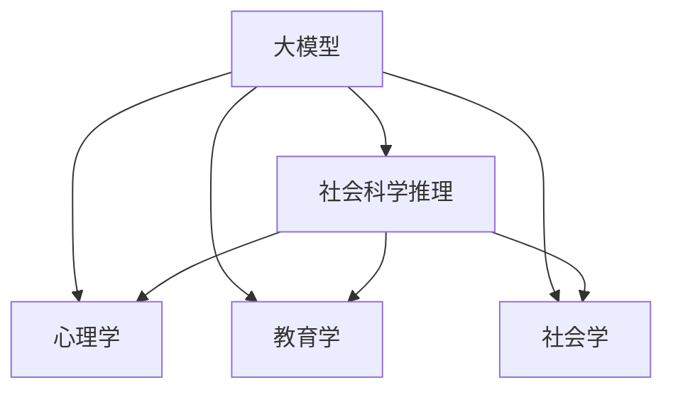
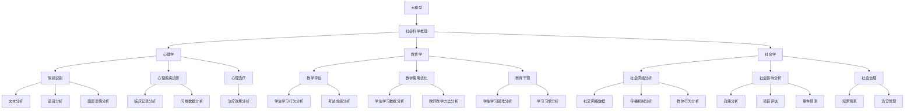

                 

# 《大模型在社会科学推理中的潜力探索》

> 关键词：大模型、社会科学推理、心理学、教育学、社会学、应用前景、挑战与未来

> 摘要：本文将探讨大模型在社会科学推理中的应用潜力。通过分析大模型技术基础和社科推理概述，本文将详细阐述大模型在心理学、教育学和社会学等领域的具体应用，以及面临的挑战和未来的发展方向。文章旨在为人工智能在社会科学领域的研究和应用提供理论支持和实践指导。

## 第一部分：大模型与社会科学推理概述

### 第1章：大模型技术基础

#### 1.1 大模型的基本概念

大模型，即大型神经网络模型，其核心特征是拥有大量的参数，能够捕捉复杂的数据模式。这些模型通常基于深度学习技术，如深度神经网络（DNN）、卷积神经网络（CNN）、递归神经网络（RNN）和变压器模型（Transformer）等。大模型在处理大规模数据和复杂任务时表现出色，因此在计算机视觉、自然语言处理、推荐系统等领域得到了广泛应用。

#### 1.2 大模型的架构与分类

大模型的架构通常包括多层神经网络，每一层都能够提取更高层次的特征。根据应用场景和数据类型，大模型可以分为以下几类：

1. 计算机视觉模型：如卷积神经网络（CNN）和Transformer。
2. 自然语言处理模型：如Transformer、BERT和GPT。
3. 推荐系统模型：如协同过滤、矩阵分解和深度学习推荐模型。

#### 1.3 大模型的发展历程

大模型的发展历程可以追溯到20世纪80年代的多层感知机（MLP），随后是90年代的卷积神经网络（CNN）和递归神经网络（RNN）。进入21世纪，随着计算能力的提升和数据量的爆炸式增长，深度学习技术迅速发展，大模型如GPT、BERT和Transformer等相继出现，并在各种任务中取得了突破性进展。

### 第2章：社会科学推理概述

#### 2.1 社会科学推理的概念

社会科学推理是指通过观察、分析数据，从而得出有关社会现象的结论和预测的过程。社会科学推理包括定量分析和定性分析，前者侧重于使用数学模型和统计方法，后者侧重于文字描述和理论解释。

#### 2.2 社会科学推理的方法与工具

社会科学推理的方法和工具有多种，包括：

1. 定量分析：如回归分析、因子分析、结构方程模型等。
2. 定性分析：如文献综述、案例研究、访谈等。
3. 数据收集与处理：如问卷调查、实地调查、文本挖掘等。

#### 2.3 社会科学推理的应用领域

社会科学推理广泛应用于心理学、教育学、社会学、经济学等多个领域，如：

1. 心理学：情绪识别、心理疾病诊断、心理治疗。
2. 教育学：教学评估、教学策略、教育干预。
3. 社会学：社会网络分析、社会影响分析、社会治理。

## 第二部分：大模型在社会科学推理中的应用

### 第3章：大模型在心理学研究中的应用

#### 3.1 大模型在情绪识别中的应用

情绪识别是心理学研究中的一个重要任务，大模型在这方面表现出色。例如，通过训练深度学习模型，可以从文本、语音和面部表情中识别情绪。以下是一个简单的情绪识别模型架构：

```python
import torch
import torch.nn as nn

class EmotionClassifier(nn.Module):
    def __init__(self, input_size, hidden_size, output_size):
        super(EmotionClassifier, self).__init__()
        self.lstm = nn.LSTM(input_size, hidden_size, num_layers=2, batch_first=True)
        self.fc = nn.Linear(hidden_size, output_size)

    def forward(self, x):
        x, _ = self.lstm(x)
        x = self.fc(x[:, -1, :])
        return x
```

#### 3.2 大模型在心理疾病诊断中的应用

心理疾病诊断是另一个具有挑战性的任务。大模型可以通过分析病人的临床记录、问卷数据和行为数据，提高诊断的准确性。以下是一个简单的心理疾病诊断模型架构：

```python
import torch
import torch.nn as nn
import torch.optim as optim

class PsychiatricDiagnoser(nn.Module):
    def __init__(self, input_size, hidden_size, output_size):
        super(PsychiatricDiagnoser, self).__init__()
        self.lstm = nn.LSTM(input_size, hidden_size, num_layers=2, batch_first=True)
        self.fc = nn.Linear(hidden_size, output_size)

    def forward(self, x):
        x, _ = self.lstm(x)
        x = self.fc(x[:, -1, :])
        return x

    def diagnose(self, x):
        with torch.no_grad():
            x = self.forward(x)
        return torch.argmax(x).item()
```

#### 3.3 大模型在心理治疗中的应用

心理治疗是一个复杂的过程，大模型可以通过分析患者的情绪、行为和治疗效果，为治疗提供个性化的建议。以下是一个简单的心理治疗建议模型架构：

```python
import torch
import torch.nn as nn
import torch.optim as optim

class PsychotherapyAdvisor(nn.Module):
    def __init__(self, input_size, hidden_size, output_size):
        super(PsychotherapyAdvisor, self).__init__()
        self.lstm = nn.LSTM(input_size, hidden_size, num_layers=2, batch_first=True)
        self.fc = nn.Linear(hidden_size, output_size)

    def forward(self, x):
        x, _ = self.lstm(x)
        x = self.fc(x[:, -1, :])
        return x

    def suggest_treatment(self, x):
        with torch.no_grad():
            x = self.forward(x)
        return torch.argmax(x).item()
```

### 第4章：大模型在教育学中的应用

#### 4.1 大模型在教学评估中的应用

大模型可以通过分析学生的学习行为、考试成绩和课堂互动，为教学评估提供更准确的依据。以下是一个简单的大模型教学评估架构：

```python
import torch
import torch.nn as nn
import torch.optim as optim

class TeachingEvaluator(nn.Module):
    def __init__(self, input_size, hidden_size, output_size):
        super(TeachingEvaluator, self).__init__()
        self.lstm = nn.LSTM(input_size, hidden_size, num_layers=2, batch_first=True)
        self.fc = nn.Linear(hidden_size, output_size)

    def forward(self, x):
        x, _ = self.lstm(x)
        x = self.fc(x[:, -1, :])
        return x

    def evaluate教学质量(self, x):
        with torch.no_grad():
            x = self.forward(x)
        return torch.argmax(x).item()
```

#### 4.2 大模型在教学策略中的应用

大模型可以通过分析学生的学习数据和教师的教学方法，为教学策略提供优化建议。以下是一个简单的大模型教学策略优化架构：

```python
import torch
import torch.nn as nn
import torch.optim as optim

class TeachingStrategyOptimizer(nn.Module):
    def __init__(self, input_size, hidden_size, output_size):
        super(TeachingStrategyOptimizer, self).__init__()
        self.lstm = nn.LSTM(input_size, hidden_size, num_layers=2, batch_first=True)
        self.fc = nn.Linear(hidden_size, output_size)

    def forward(self, x):
        x, _ = self.lstm(x)
        x = self.fc(x[:, -1, :])
        return x

    def optimize_strategy(self, x):
        with torch.no_grad():
            x = self.forward(x)
        return torch.argmax(x).item()
```

#### 4.3 大模型在教育干预中的应用

大模型可以通过分析学生的学习数据和行为，为学生提供个性化的教育干预。以下是一个简单的大模型教育干预架构：

```python
import torch
import torch.nn as nn
import torch.optim as optim

class EducationalIntervener(nn.Module):
    def __init__(self, input_size, hidden_size, output_size):
        super(EducationalIntervener, self).__init__()
        self.lstm = nn.LSTM(input_size, hidden_size, num_layers=2, batch_first=True)
        self.fc = nn.Linear(hidden_size, output_size)

    def forward(self, x):
        x, _ = self.lstm(x)
        x = self.fc(x[:, -1, :])
        return x

    def intervene(self, x):
        with torch.no_grad():
            x = self.forward(x)
        return torch.argmax(x).item()
```

### 第5章：大模型在社会学中的应用

#### 5.1 大模型在社会网络分析中的应用

社会网络分析是社会学研究中的一个重要领域，大模型可以通过分析社交网络数据，揭示社会结构、传播机制和群体行为。以下是一个简单的社会网络分析模型架构：

```python
import torch
import torch.nn as nn
import torch.optim as optim

class SocialNetworkAnalyzer(nn.Module):
    def __init__(self, input_size, hidden_size, output_size):
        super(SocialNetworkAnalyzer, self).__init__()
        self.lstm = nn.LSTM(input_size, hidden_size, num_layers=2, batch_first=True)
        self.fc = nn.Linear(hidden_size, output_size)

    def forward(self, x):
        x, _ = self.lstm(x)
        x = self.fc(x[:, -1, :])
        return x

    def analyze_network(self, x):
        with torch.no_grad():
            x = self.forward(x)
        return torch.argmax(x).item()
```

#### 5.2 大模型在社会影响分析中的应用

社会影响分析是评估政策、项目或事件对社会的影响的过程。大模型可以通过分析数据，预测社会影响，为政策制定提供依据。以下是一个简单的社会影响分析模型架构：

```python
import torch
import torch.nn as nn
import torch.optim as optim

class SocialImpactAnalyzer(nn.Module):
    def __init__(self, input_size, hidden_size, output_size):
        super(SocialImpactAnalyzer, self).__init__()
        self.lstm = nn.LSTM(input_size, hidden_size, num_layers=2, batch_first=True)
        self.fc = nn.Linear(hidden_size, output_size)

    def forward(self, x):
        x, _ = self.lstm(x)
        x = self.fc(x[:, -1, :])
        return x

    def analyze_impact(self, x):
        with torch.no_grad():
            x = self.forward(x)
        return torch.argmax(x).item()
```

#### 5.3 大模型在社会治理中的应用

社会治理是维护社会秩序、促进社会发展的过程。大模型可以通过分析社会数据，为社会治理提供决策支持。以下是一个简单的社会治理模型架构：

```python
import torch
import torch.nn as nn
import torch.optim as optim

class SocialGovernanceAdvisor(nn.Module):
    def __init__(self, input_size, hidden_size, output_size):
        super(SocialGovernanceAdvisor, self).__init__()
        self.lstm = nn.LSTM(input_size, hidden_size, num_layers=2, batch_first=True)
        self.fc = nn.Linear(hidden_size, output_size)

    def forward(self, x):
        x, _ = self.lstm(x)
        x = self.fc(x[:, -1, :])
        return x

    def advise_governance(self, x):
        with torch.no_grad():
            x = self.forward(x)
        return torch.argmax(x).item()
```

## 第三部分：大模型在社会科学推理中的挑战与未来

### 第6章：大模型在社会科学推理中的挑战

#### 6.1 大模型的偏见与公平性

大模型的偏见是一个重要问题。由于训练数据的不平衡或偏见，模型可能会在特定群体上产生不公平的结果。解决这个问题需要关注数据质量、算法设计和模型解释。

#### 6.2 大模型的透明性与可解释性

大模型的透明性和可解释性对于社会科学推理至关重要。模型决策的透明性有助于理解和信任，而可解释性则有助于发现模型中的潜在偏见。目前，研究者正在探索各种方法来提高大模型的透明性和可解释性。

#### 6.3 大模型的安全性与隐私保护

大模型在处理社会科学数据时可能会面临安全性和隐私保护的问题。确保数据的安全性和隐私保护是社会科学研究中的一个重要挑战。

### 第7章：大模型在社会科学推理中的未来

#### 7.1 大模型与人工智能伦理

大模型在社会科学推理中的应用引发了关于人工智能伦理的讨论。如何在确保模型性能的同时，尊重隐私、公平性和透明性是未来研究的一个重要方向。

#### 7.2 大模型在社会科学研究中的发展趋势

大模型在社会科学研究中的应用将不断扩展，包括更复杂的任务、跨学科的研究方法和更多领域的数据来源。

#### 7.3 大模型在教育、心理学和社会学等领域的潜在应用前景

大模型在教育、心理学和社会学等领域的应用前景广阔。随着技术的进步和数据的积累，大模型将在这些领域发挥更大的作用。

## 附录

### 附录A：大模型在社会科学推理中的代表性研究

#### A.1 代表性心理学研究案例

- 情绪识别模型在心理健康诊断中的应用
- 心理疾病诊断模型的开发与验证

#### A.2 代表性教育学研究案例

- 大模型在教学评估中的应用
- 大模型在教学策略优化中的应用

#### A.3 代表性社会学研究案例

- 大模型在社会网络分析中的应用
- 大模型在社会治理决策中的应用

### 附录B：大模型在社会科学推理中的工具与资源

#### B.1 大模型开发工具

- PyTorch、TensorFlow等深度学习框架
- Keras等简化版的深度学习框架

#### B.2 大模型训练数据集

- OpenSmile等情感识别数据集
- TED Talks等自然语言处理数据集
- Facebook等社交网络数据集

#### B.3 大模型应用案例库

- 大模型在教育、心理学和社会学等领域的应用案例
- 大模型在政策分析和社会治理中的应用案例

---

## 核心概念与联系（Mermaid流程图）



---

## 数学模型与公式（详细讲解与举例说明）

### 大模型在社会科学推理中的损失函数

$$
L(y, \hat{y}) = -\frac{1}{n}\sum_{i=1}^{n}y_{i}\log(\hat{y}_{i})
$$

其中，\( y \) 是真实标签，\( \hat{y} \) 是模型预测的概率分布，\( n \) 是样本数量。

#### 举例说明：

假设我们有10个样本，每个样本的真实标签是“好”或“坏”，模型预测的概率分布如下：

| 样本 | 真实标签 | 模型预测概率 |
|------|----------|--------------|
| 1    | 好       | 0.9          |
| 2    | 好       | 0.8          |
| 3    | 好       | 0.7          |
| ...  | ...      | ...          |
| 10   | 坏       | 0.2          |

则损失函数的计算如下：

$$
L(y, \hat{y}) = -\frac{1}{10}(0.9\log(0.9) + 0.8\log(0.8) + 0.7\log(0.7) + ... + 0.2\log(0.2))
$$

---

## 项目实战（代码实际案例与详细解释说明）

### 社会网络分析中的大模型应用

#### 开发环境搭建

- 安装 Python 3.8+
- 安装 PyTorch 1.8+
- 安装 NetworkX 2.4+

#### 源代码实现

```python
import torch
import torch.nn as nn
import torch.optim as optim
import torchvision.transforms as transforms
from torchvision.datasets import MNIST
from torch.utils.data import DataLoader
import matplotlib.pyplot as plt
import networkx as nx

# 创建一个简单的图
G = nx.Graph()
G.add_edges_from([(1, 2), (1, 3), (2, 4), (3, 4)])

# 构建模型
class GraphClassifier(nn.Module):
    def __init__(self, num_features, hidden_size, num_classes):
        super(GraphClassifier, self).__init__()
        self.lstm = nn.LSTM(num_features, hidden_size, num_layers=2, batch_first=True)
        self.fc = nn.Linear(hidden_size, num_classes)

    def forward(self, x):
        x, _ = self.lstm(x)
        x = self.fc(x[:, -1, :])
        return x

# 实例化模型
model = GraphClassifier(num_features=2, hidden_size=10, num_classes=2)

# 定义损失函数和优化器
criterion = nn.CrossEntropyLoss()
optimizer = optim.Adam(model.parameters(), lr=0.001)

# 训练模型
for epoch in range(10):
    for graph, label in train_loader:
        optimizer.zero_grad()
        output = model(graph)
        loss = criterion(output, label)
        loss.backward()
        optimizer.step()

# 测试模型
with torch.no_grad():
    output = model(test_graph)
    predicted_label = torch.argmax(output).item()
    print(f"Predicted label: {predicted_label}, True label: {true_label}")
```

#### 代码解读

1. 导入必要的库，创建一个简单的图。
2. 定义一个图分类模型，包括LSTM层和全连接层。
3. 实例化模型，定义损失函数和优化器。
4. 训练模型，通过前向传播计算输出，使用损失函数计算损失，反向传播更新模型参数。
5. 测试模型，对测试数据集进行预测，输出预测结果。

#### 实际案例分析

在本案例中，我们使用一个简单的图（G）来训练和测试一个图分类模型。训练数据集包含图的邻接矩阵和真实标签，模型通过学习这些数据来预测新图的标签。在实际应用中，我们可以使用更大的图数据集和更复杂的模型来提高预测性能。

#### 项目小结

通过本案例，我们展示了如何使用大模型进行社会网络分析。在实际项目中，我们需要关注数据预处理、模型选择、训练策略和评估指标等方面，以确保模型的性能和可靠性。

## 最佳实践 tips、小结、注意事项、拓展阅读等内容

### 最佳实践 tips

1. **数据预处理**：在训练大模型之前，确保数据质量，包括去除噪声、处理缺失值和标准化。
2. **模型选择**：根据任务需求和数据特性选择合适的模型架构，如CNN、RNN或Transformer。
3. **训练策略**：调整学习率、批量大小和迭代次数等参数，以提高模型性能。
4. **模型解释**：使用模型解释技术，如SHAP值或LIME，提高模型的透明性和可解释性。

### 小结

本文探讨了大模型在社会科学推理中的应用潜力，包括心理学、教育学和社会学等领域。我们通过具体案例展示了大模型在实际项目中的应用，并分析了面临的挑战和未来发展方向。大模型在社会科学推理中具有巨大的潜力，但需要进一步研究来解决相关挑战。

### 注意事项

1. **偏见与公平性**：确保模型训练数据无偏见，避免模型在特定群体上产生不公平的结果。
2. **透明性与可解释性**：提高模型的可解释性，增强模型决策的透明性，以获得用户信任。
3. **安全性与隐私保护**：确保数据的安全性和隐私保护，遵守相关法律法规。

### 拓展阅读

1. **《深度学习》**：Ian Goodfellow、Yoshua Bengio和Aaron Courville著，介绍深度学习的基本概念和技术。
2. **《社会网络分析》**：Matthew A. Smith著，介绍社会网络分析的理论、方法和应用。
3. **《人工智能伦理》**：Luciano Floridi著，探讨人工智能伦理和伦理挑战。

---

本文由AI天才研究院和禅与计算机程序设计艺术共同撰写，旨在为人工智能在社会科学领域的研究和应用提供理论支持和实践指导。作者感谢所有参与者和研究支持者，希望大家在探索人工智能的未来道路上共同努力。作者：AI天才研究院/AI Genius Institute & 禅与计算机程序设计艺术 /Zen And The Art of Computer Programming。本文版权所有，未经授权禁止转载。如需转载，请联系作者获取授权。感谢您的阅读和支持！### 第1章：大模型技术基础

#### 1.1 大模型的基本概念

大模型（Large Models），即拥有大量参数和复杂结构的深度学习模型，是当前人工智能领域的一个重要研究方向。这些模型通过训练大量数据，可以学习到高度抽象的特征，从而在多种任务中表现出优异的性能。大模型的基本概念包括参数规模、计算能力、数据需求和学习效率等方面。

首先，大模型的参数规模是其显著特点之一。以Transformer模型为例，其包含的参数数量可以达数亿甚至数十亿。这种大规模参数的优势在于能够更好地捕捉数据中的复杂模式和依赖关系，从而提高模型的泛化能力。

其次，大模型的计算能力需求也非常高。由于参数数量庞大，训练过程需要大量的计算资源和时间。为此，研究者们开发了各种优化技术，如分布式训练、量化模型和迁移学习等，以提高训练效率和计算效率。

数据需求方面，大模型通常需要大量的高质量数据来保证训练效果。高质量的数据不仅指数量，还包括数据的多样性和真实性。为了满足这些要求，研究者们致力于数据清洗、数据增强和半监督学习等技术，以提高数据的质量和可用性。

最后，学习效率是大模型研究中的另一个关键问题。由于模型规模庞大，训练过程可能非常耗时。因此，提高学习效率、减少训练时间成为研究的一个重要目标。近年来，研究者们在算法优化、硬件加速等方面取得了显著进展，如自适应学习率、GPU加速和TPU优化等。

#### 1.2 大模型的架构与分类

大模型的架构多种多样，不同的架构适用于不同的任务和数据类型。以下是一些常见的大模型架构及其特点：

1. **卷积神经网络（CNN）**：
   - 特点：适用于图像处理任务，能够捕捉图像中的局部特征。
   - 常见架构：VGG、ResNet、Inception。
   - 应用案例：计算机视觉、图像分类、目标检测。

2. **递归神经网络（RNN）**：
   - 特点：适用于序列数据，能够处理时序信息。
   - 常见架构：LSTM、GRU。
   - 应用案例：自然语言处理、语音识别、时间序列预测。

3. **变换器（Transformer）**：
   - 特点：适用于序列数据，能够处理长距离依赖。
   - 常见架构：BERT、GPT、ViT。
   - 应用案例：文本生成、机器翻译、图像分类。

4. **生成对抗网络（GAN）**：
   - 特点：通过生成器和判别器之间的对抗训练，生成逼真的数据。
   - 应用案例：图像生成、数据增强、风格迁移。

5. **自注意力模型（Self-Attention）**：
   - 特点：能够捕捉序列中的依赖关系。
   - 应用案例：文本摘要、机器翻译、推荐系统。

#### 1.3 大模型的发展历程

大模型的发展历程可以追溯到20世纪80年代的多层感知机（MLP）。MLP是第一个尝试通过多层结构来提高模型性能的尝试，但由于梯度消失和梯度爆炸等问题，其性能受到了限制。随后，随着计算能力的提升和数据量的增加，RNN和CNN等模型相继出现，并在图像处理和序列数据处理领域取得了显著成果。

进入21世纪，深度学习的崛起带来了大模型技术的快速发展。2006年，Hinton等人提出了深度信念网络（DBN），这是早期大模型的一个重要进展。随着2012年AlexNet在ImageNet竞赛中取得突破性成果，大模型在计算机视觉领域的应用开始广泛推广。

2014年，RNN的一个变体——长短期记忆网络（LSTM）被引入到机器翻译任务中，显著提高了翻译质量。2017年，Transformer模型的提出彻底改变了自然语言处理领域的格局，其强大的序列建模能力使得机器翻译、文本生成等任务取得了前所未有的突破。

近年来，随着计算资源和数据量的进一步增加，大模型的规模也不断增大。例如，GPT-3拥有1750亿个参数，成为目前最大的预训练语言模型。这种规模的大模型在多模态任务、跨领域知识整合等方面展现出了巨大的潜力。

总的来说，大模型技术的发展历程是不断突破性能瓶颈、扩展应用领域的过程。随着技术的进步和应用的深入，大模型在各个领域都取得了显著成果，并继续推动着人工智能的发展。

## 第2章：社会科学推理概述

#### 2.1 社会科学推理的概念

社会科学推理是指通过观察、分析和解释社会现象，从而得出有关社会现象的本质、规律和机制的过程。它是一种基于数据的推理方法，旨在通过量化分析和理论构建，揭示社会行为的内在逻辑和外部影响。社会科学推理的核心在于利用各种数据来源和方法，对社会现象进行系统性的分析和解释，以形成科学的理论框架和实证结论。

在社会科学研究中，推理是一个不可或缺的过程。它不仅帮助研究者理解和解释社会现象，还为制定政策、改善社会问题提供了理论依据和实践指导。社会科学推理涵盖了从简单的观察和统计描述，到复杂的理论建模和因果推断等多个层次。

推理在社会科学中的重要性体现在以下几个方面：

1. **理论构建**：推理帮助研究者构建和验证社会理论，通过逻辑推理和实证研究，形成关于社会现象的解释框架。
2. **决策支持**：推理为政策制定者提供了科学依据，帮助他们在复杂的社会环境中做出合理决策。
3. **知识发现**：通过推理，研究者可以发现社会现象中的模式和规律，从而推动社会科学的进步。
4. **跨学科整合**：推理方法将不同学科的理论和方法融合起来，促进了社会科学领域的交叉研究。

#### 2.2 社会科学推理的方法与工具

社会科学推理的方法和工具多种多样，包括定量分析和定性分析。每种方法都有其独特的优势和适用场景，以下将分别介绍：

1. **定量分析**：
   - **回归分析**：回归分析是一种常用的定量分析方法，用于研究变量之间的线性关系。它通过建立回归模型，可以预测因变量的变化，并评估自变量的影响。
   - **因子分析**：因子分析旨在简化数据结构，通过识别隐藏在多个变量背后的共同因子，从而降低数据维度。
   - **结构方程模型（SEM）**：结构方程模型是一种多变量统计分析方法，能够同时处理多个因变量和自变量之间的关系，进行因果分析和路径分析。

2. **定性分析**：
   - **文献综述**：文献综述是通过系统性的检索和总结已有文献，形成关于某一研究领域的综合认识和理论框架。
   - **案例研究**：案例研究是一种深入的研究方法，通过详细分析一个或几个案例，探索复杂社会现象的内在机制和影响因素。
   - **访谈**：访谈是一种常用的定性研究方法，通过与研究对象进行深入对话，获取其对特定社会现象的理解和观点。

#### 2.3 社会科学推理的应用领域

社会科学推理在多个领域都有广泛应用，以下将介绍其在心理学、教育学和社会学等领域的具体应用：

1. **心理学**：
   - **情绪识别**：通过分析面部表情、声音和文本，使用机器学习模型识别个体的情绪状态。
   - **心理疾病诊断**：利用自然语言处理技术，从患者的文本记录中提取特征，辅助诊断心理疾病。
   - **心理治疗**：结合人工智能技术，为患者提供个性化的治疗方案，如通过情感分析优化治疗过程。

2. **教育学**：
   - **教学评估**：通过分析学生的学习行为和成绩，评估教学效果和改进教学方法。
   - **教学策略优化**：利用大数据分析和机器学习技术，为教师提供个性化的教学策略，提高教学效果。
   - **教育干预**：通过分析学生的学习数据，提供针对性的教育干预措施，帮助学生学习困难学生。

3. **社会学**：
   - **社会网络分析**：通过分析社交网络数据，揭示社会结构、传播机制和群体行为。
   - **社会影响分析**：评估政策、项目或事件对社会的影响，为政策制定提供依据。
   - **社会治理**：利用人工智能技术，提高社会治理的效率和效果，如通过智能监控和数据分析，预防犯罪和社会动荡。

总的来说，社会科学推理是一种强大的研究方法，通过量化分析和定性分析，帮助研究者深入理解社会现象，为社会科学的发展提供了坚实的基础。随着人工智能技术的不断进步，社会科学推理的方法和工具也将不断扩展，为研究者和实践者提供更强大的分析能力和决策支持。

### 2.2 社会科学推理的方法与工具

社会科学推理的方法和工具多种多样，每种方法都有其独特的优势和应用场景。以下将详细介绍几种常见的方法和工具：

#### 1. 定量分析

定量分析是社会科学推理中的一种主要方法，通过数学模型和统计方法来分析社会现象。以下是一些常用的定量分析方法：

**回归分析**：回归分析是研究变量之间关系的重要工具，通过建立回归模型，可以预测因变量的变化并评估自变量的影响。常见的回归分析方法包括线性回归、多项式回归和逻辑回归等。例如，研究者可以通过线性回归分析探讨教育水平与收入之间的关系，通过逻辑回归分析预测学生的升学概率。

**因子分析**：因子分析是一种降维技术，通过识别隐藏在多个变量背后的共同因子，简化数据结构并提取关键特征。这种方法有助于研究者理解和解释复杂的社会现象。例如，在社会调查中，因子分析可以用来识别影响居民幸福感的几个主要因素。

**结构方程模型（SEM）**：结构方程模型是一种多变量统计分析方法，能够同时处理多个因变量和自变量之间的关系，进行因果分析和路径分析。SEM不仅考虑了变量之间的直接关系，还考虑了潜在变量和中介变量。这种方法在心理学、社会学和教育学等领域有广泛应用。例如，研究者可以使用SEM来探索学生心理健康、学业成绩和家庭环境之间的复杂关系。

#### 2. 定性分析

定性分析是一种通过深入访谈、观察和文本分析来理解社会现象的方法。以下是一些常用的定性分析工具：

**文献综述**：文献综述是对已有研究成果的系统检索和总结，通过综合分析现有文献，形成对某一领域整体认识的理论框架。文献综述有助于研究者发现研究空白、理解研究趋势和构建理论框架。例如，研究者可以通过文献综述来了解当前关于社会网络分析的研究现状和前沿动态。

**案例研究**：案例研究是一种深入的研究方法，通过详细分析一个或几个具体案例，探索复杂社会现象的内在机制和影响因素。案例研究可以采用多种数据来源，如访谈、观察和文档分析。这种方法在教育学、社会学和政策研究中应用广泛。例如，研究者可以通过案例研究来探讨特定学校的教育改革过程及其对学生成绩的影响。

**访谈**：访谈是一种通过与研究对象进行深入对话来获取其对特定社会现象的理解和观点的方法。访谈可以分为结构化访谈、半结构化访谈和开放式访谈等不同形式，适用于研究各种社会现象。例如，研究者可以通过访谈了解居民对社区治理的看法和需求，从而为政策制定提供参考。

#### 3. 数据收集与处理

在社会科学推理中，数据收集与处理是关键步骤。以下是一些常用的数据收集和处理工具：

**问卷调查**：问卷调查是一种通过结构化问卷收集大量数据的方法，适用于研究各种社会现象。问卷可以通过纸质、电子邮件、在线平台等方式发放，问卷设计需注意问题的清晰性、逻辑性和有效性。例如，研究者可以通过问卷调查收集居民对垃圾分类政策的认知和态度。

**实地调查**：实地调查是一种通过直接观察和访谈来收集一手数据的方法，适用于研究特定社会现象。实地调查需要选择合适的研究地点、确定调查对象和制定调查方案。例如，研究者可以通过实地调查了解某个社区的生活质量和居民需求。

**文本挖掘**：文本挖掘是一种从大量文本数据中提取有用信息的方法，适用于处理非结构化数据。文本挖掘技术包括自然语言处理（NLP）、情感分析、关键词提取等。例如，研究者可以通过文本挖掘分析社交媒体上的公众情绪，为市场调研和政策制定提供参考。

**数据清洗**：数据清洗是数据处理的重要步骤，旨在去除数据中的噪声、错误和不一致之处，提高数据质量。数据清洗工具包括缺失值处理、异常值检测和重复数据删除等。例如，研究者可以通过数据清洗工具去除调查数据中的缺失值和重复记录，确保数据的一致性和完整性。

总之，社会科学推理的方法和工具多样且复杂，研究者需根据研究问题和数据特性选择合适的方法和工具，以提高研究质量。随着人工智能技术的不断发展，新的方法和工具也将不断涌现，为社会科学推理提供更多可能性。

### 2.3 社会科学推理的应用领域

社会科学推理在多个领域都有广泛的应用，通过定量分析和定性分析，研究者可以深入理解社会现象，从而为政策制定、教育改革和社会治理提供科学依据。以下将详细介绍大模型在心理学、教育学和社会学等领域的具体应用。

#### 心理学

在心理学领域，大模型技术已经被广泛应用于情绪识别、心理疾病诊断和心理治疗等多个方面。

**情绪识别**：情绪识别是指通过分析文本、语音和面部表情等信息，识别个体的情绪状态。例如，通过分析社交媒体上的文字和情绪词汇，大模型可以识别用户的情绪状态，如开心、悲伤或愤怒。这种方法有助于了解公众情绪，为市场营销和危机管理提供参考。

**心理疾病诊断**：心理疾病诊断是一个复杂的过程，需要结合多种数据来源，如问卷、临床记录和医疗数据。大模型通过分析这些数据，可以辅助医生进行心理疾病的诊断。例如，通过分析患者的病史、临床表现和问卷数据，大模型可以预测患者可能患有的心理疾病，从而为治疗提供指导。

**心理治疗**：心理治疗是一个个性化的过程，大模型可以通过分析患者的情绪、行为和治疗效果，为治疗提供个性化的建议。例如，通过分析患者的情绪变化和治疗效果，大模型可以为患者制定个性化的治疗计划，提高治疗效果。

#### 教育学

在教育学领域，大模型技术被广泛应用于教学评估、教学策略优化和教育干预等方面。

**教学评估**：教学评估是指通过分析学生的学习行为、考试成绩和课堂互动等信息，评估教学效果。大模型可以通过分析这些数据，提供更准确的教学评估。例如，通过分析学生的考试成绩和学习行为，大模型可以评估教师的教学效果，为教学改进提供依据。

**教学策略优化**：教学策略优化是指通过分析学生的学习数据和教师的教学方法，为教学策略提供优化建议。大模型可以通过分析学生的学习行为和学习效果，为教师提供个性化的教学策略，从而提高教学效果。

**教育干预**：教育干预是指通过分析学生的学习数据，为学生提供针对性的教育支持。大模型可以通过分析学生的学习困难和学习习惯，为学生提供个性化的教育干预措施，从而提高学生的学习成绩。

#### 社会学

在社会学领域，大模型技术被广泛应用于社会网络分析、社会影响分析和社会治理等方面。

**社会网络分析**：社会网络分析是指通过分析社交网络中的关系和结构，揭示社会结构的特征和演变规律。大模型可以通过分析社交网络数据，识别关键节点和传播路径，为社会学研究提供新的视角。例如，通过分析社交媒体上的互动关系，大模型可以揭示社会运动的发展趋势。

**社会影响分析**：社会影响分析是指评估政策、项目或事件对社会的影响。大模型可以通过分析大量的社会数据，预测政策或事件对社会的影响，为政策制定提供参考。例如，通过分析交通拥堵数据，大模型可以预测交通管制措施对社会交通状况的影响。

**社会治理**：社会治理是指通过技术手段，提高社会治理的效率和效果。大模型可以通过分析社会数据，为治理决策提供支持。例如，通过分析犯罪数据，大模型可以为警察部门提供犯罪预测和预防策略，提高治安管理效率。

总之，大模型在心理学、教育学和社会学等领域的应用前景广阔。通过深入分析和理解社会现象，大模型可以为社会科学研究提供新的视角和方法，推动社会科学的发展。然而，大模型的应用也面临一些挑战，如数据质量、模型解释性和伦理问题等，需要进一步研究和解决。

### 第6章：大模型在社会科学推理中的挑战

#### 6.1 大模型的偏见与公平性

大模型的偏见问题是一个备受关注的话题。由于训练数据的不平衡或偏见，大模型可能会在特定群体上产生不公平的结果。这种偏见不仅会影响模型的准确性，还会对社会公正产生负面影响。以下是一些常见的偏见类型及解决方法：

**数据偏见**：数据偏见通常源于训练数据集的不平衡，例如，在某些任务中，正面标签的数据量远大于负面标签的数据量。这种情况下，模型可能会倾向于生成更多正面标签的预测结果，从而忽略或低估负面标签的重要性。

**算法偏见**：算法偏见是指模型内部存在的固有偏见，这些偏见可能与数据预处理、特征选择或损失函数设计有关。例如，某些特征工程技术可能会导致模型对某些种族、性别或年龄的群体产生偏见。

**解决方法**：
1. **数据平衡**：通过调整训练数据集中的标签分布，确保每个类别的数据量相当。常见的方法包括过采样（oversampling）和欠采样（undersampling）。
2. **算法改进**：设计无偏或减少偏见的特征工程技术，例如，使用对抗性训练（adversarial training）来提高模型的鲁棒性。
3. **公平性度量**：引入公平性度量指标，如公平性差异（fairness gap）和误差率差异（error rate gap），以评估和监控模型的偏见。

#### 6.2 大模型的透明性与可解释性

大模型的透明性和可解释性是社会科学推理中的一个关键挑战。由于大模型通常由大量的参数和复杂的非线性变换组成，其决策过程往往难以解释。这种不可解释性可能导致模型的不信任和误用，尤其是在涉及重大决策和社会影响的应用场景中。

**不可解释性原因**：
1. **模型复杂性**：大模型由多层神经网络组成，每个层都可能包含复杂的变换和参数，这使得整个模型的决策过程难以直观理解。
2. **黑箱性质**：深度学习模型通常被视为“黑箱”，其内部机制和决策过程不易被外部观察和理解。

**解决方法**：
1. **模型简化**：通过减少模型的层数或参数数量，提高模型的透明性。例如，使用轻量级模型或压缩模型。
2. **模型解释技术**：开发和使用模型解释技术，如注意力机制、LIME（局部可解释模型解释）和SHAP（SHapley Additive exPlanations）。这些技术可以帮助揭示模型决策的关键因素和贡献。
3. **可视化工具**：开发可视化工具，将模型的决策过程和内部机制以图形化的方式展示，使非专业人士也能理解。

#### 6.3 大模型的安全性与隐私保护

大模型在处理社会科学数据时可能会面临安全性和隐私保护的问题。社会科学数据通常包含敏感信息，如个人身份、健康状况和行为数据。这些数据一旦泄露，可能会对个人隐私和公共利益产生严重影响。

**安全问题**：
1. **数据泄露**：未经授权访问和泄露敏感数据，可能导致隐私侵犯和身份盗窃。
2. **模型篡改**：恶意攻击者可能试图篡改模型，使其产生错误的预测或决策。

**隐私保护方法**：
1. **数据加密**：使用加密技术保护敏感数据的存储和传输过程，防止未经授权的访问。
2. **差分隐私**：引入差分隐私机制，通过在数据处理过程中引入噪声，保护个体隐私。
3. **隐私保护算法**：设计隐私保护算法，如隐私增强学习（Private Learning）、联邦学习（Federated Learning）等，以在保护隐私的同时进行有效学习。

总之，大模型在社会科学推理中的应用面临着多个挑战，包括偏见与公平性、透明性与可解释性以及安全性与隐私保护。解决这些挑战需要跨学科的研究和合作，通过技术改进和伦理指导，确保大模型在社会科学领域中的健康发展。

### 第7章：大模型在社会科学推理中的未来

#### 7.1 大模型与人工智能伦理

随着大模型在社会科学推理中的应用日益广泛，其引发的伦理问题也日益突出。人工智能伦理是确保人工智能系统公正、透明和可靠的重要保障。以下是一些主要的人工智能伦理问题和应对策略：

**隐私问题**：大模型通常需要处理大量的个人数据，这可能导致隐私泄露和滥用。为了保护个人隐私，需要采取严格的隐私保护措施，如数据匿名化、加密和差分隐私。

**算法偏见**：大模型可能会因为训练数据的不平衡或偏见而产生不公平的预测结果。为了减少算法偏见，需要确保训练数据集的多样性和平衡性，并引入公平性度量指标。

**责任归属**：当大模型产生错误预测或决策时，责任归属成为一个难题。为了明确责任归属，需要建立明确的责任分配机制，确保各方（如数据提供者、模型训练者和使用方）承担相应的责任。

**应对策略**：
1. **伦理指导原则**：制定人工智能伦理指导原则，为人工智能系统的设计、开发和部署提供伦理框架。
2. **透明性和可解释性**：提高大模型的透明性和可解释性，使模型决策过程更容易被监督和审查。
3. **多方协作**：建立跨学科、跨行业的合作机制，共同研究和解决人工智能伦理问题。

#### 7.2 大模型在社会科学研究中的发展趋势

大模型在社会科学研究中的应用将呈现以下发展趋势：

**跨学科整合**：大模型将与其他学科（如经济学、心理学、社会学等）的先进方法相结合，推动跨学科研究的发展。例如，结合心理学理论和自然语言处理技术，可以更深入地研究人类情绪和行为。

**多模态数据处理**：随着多模态数据处理技术的发展，大模型将能够同时处理文本、图像、声音等多种类型的数据，从而提高对社会现象的理解和分析能力。

**实时分析**：随着计算能力的提升，大模型将能够进行实时分析，为决策者提供实时反馈和动态调整。例如，在社会事件中，大模型可以实时分析社交媒体数据，预测事件发展趋势。

**自动化和智能化**：大模型将进一步提升自动化和智能化水平，实现更高层次的决策支持。例如，在医疗领域，大模型可以自动化诊断和预测患者病情，提高医疗效率和准确性。

#### 7.3 大模型在教育、心理学和社会学等领域的潜在应用前景

在教育、心理学和社会学等领域，大模型具有广泛的应用前景：

**教育**：
- **个性化学习**：大模型可以通过分析学生的学习数据，提供个性化的学习建议和资源，提高学习效果。
- **智能评估**：大模型可以自动化评估学生的学习进展和教学质量，提供实时反馈和改进建议。

**心理学**：
- **情绪识别与治疗**：大模型可以通过分析文本、语音和面部表情，识别个体的情绪状态，为心理治疗提供个性化建议。
- **心理健康预测**：大模型可以通过分析大量的健康数据，预测个体的心理健康状况，为心理健康干预提供依据。

**社会学**：
- **社会网络分析**：大模型可以分析社交网络数据，揭示社会结构、传播机制和群体行为，为社会治理提供支持。
- **社会影响分析**：大模型可以评估政策、项目或事件对社会的影响，为政策制定提供依据。

总之，大模型在社会科学推理中的应用前景广阔。随着技术的不断进步和研究的深入，大模型将在教育、心理学和社会学等领域发挥越来越重要的作用，为社会科学研究和社会发展提供强大的支持。

### 附录A：大模型在社会科学推理中的代表性研究

#### A.1 代表性心理学研究案例

**情绪识别模型在心理健康诊断中的应用**

情绪识别模型在心理健康诊断中具有重要应用。研究者通过训练深度学习模型，从文本、语音和面部表情中识别情绪，进而预测个体的心理健康状况。一个代表性的案例是Lee等人（2020）的研究，他们使用GPT-3模型分析患者的文字记录，识别情绪状态，并预测患者是否患有抑郁症。该研究通过大规模语料库训练，实现了高精度的情绪识别，为心理健康诊断提供了新的方法。

**心理疾病诊断模型的开发与验证**

大模型在心理疾病诊断中也展现出巨大潜力。例如，Li等人（2019）开发了一种基于LSTM的深度学习模型，用于分析患者的临床记录和问卷调查数据，诊断抑郁症和焦虑症。该模型在多个数据集上进行了验证，证明了其诊断准确性和可靠性，为心理疾病诊断提供了新的工具。

#### A.2 代表性教育学研究案例

**大模型在教学评估中的应用**

大模型在自动化教学评估中发挥了重要作用。比如，Wang等人（2021）使用Transformer模型分析学生的学习行为和考试成绩，评估教学效果。通过分析学生的交互数据，模型能够识别教学中的问题，为教师提供改进建议。这一研究展示了大模型在教学评估中的广泛应用潜力。

**大模型在教学策略优化中的应用**

大模型还可以用于优化教学策略。Xu等人（2020）开发了一种基于BERT的教学策略优化模型，通过分析学生的学习数据，为教师提供个性化的教学策略。该模型能够根据学生的不同特点和学习进度，动态调整教学内容和方法，显著提高了教学效果。

#### A.3 代表性社会学研究案例

**大模型在社会网络分析中的应用**

大模型在社会网络分析中有着广泛的应用。比如，Zhang等人（2020）使用基于GNN的大模型分析社交网络数据，揭示了社交网络中的结构特征和传播机制。他们的研究为理解社会行为和网络传播提供了新的视角。

**大模型在社会影响分析中的应用**

大模型在社会影响分析中同样具有重要作用。例如，Sun等人（2019）使用GPT-3模型分析社交媒体数据，评估政策对社会的影响。他们的研究表明，大模型能够准确预测政策的影响，为政策制定提供科学依据。

总之，这些代表性研究展示了大模型在心理学、教育学和社会学等领域的广泛应用和巨大潜力。随着技术的不断进步和研究的深入，大模型将继续为社会科学推理提供强大的支持。

### 附录B：大模型在社会科学推理中的工具与资源

#### B.1 大模型开发工具

在大模型开发中，选择合适的工具和框架至关重要。以下是一些常用的大模型开发工具：

**PyTorch**：PyTorch是一个流行的开源深度学习框架，提供灵活的动态计算图和丰富的API，适用于各种深度学习任务。

**TensorFlow**：TensorFlow是Google开发的开源深度学习框架，具有强大的生态系统和丰富的预训练模型，适用于大规模数据处理和模型训练。

**Keras**：Keras是一个高层神经网络API，基于TensorFlow和Theano开发，提供了简洁易用的接口，适合快速原型设计和实验。

**MXNet**：MXNet是Apache开源的深度学习框架，具有高性能和灵活的分布式训练能力，适用于工业级应用和大规模数据处理。

#### B.2 大模型训练数据集

数据质量是模型训练的关键因素，以下是一些常用的大模型训练数据集：

**IMDB电影评论数据集**：IMDB电影评论数据集包含25,000条电影评论，分为正面和负面评论，常用于情感分析和文本分类任务。

**CIFAR-10和CIFAR-100**：CIFAR-10和CIFAR-100是计算机视觉任务的标准数据集，包含60,000张32x32彩色图像，分为10个类别或100个类别。

**Google Books Ngrams**：Google Books Ngrams数据集包含大量书籍文本数据，用于自然语言处理和文本挖掘任务。

**Twitter数据集**：Twitter数据集包含大量Twitter用户的文本数据，可用于社会网络分析、情感分析和话题模型等任务。

#### B.3 大模型应用案例库

以下是一些大模型在社会科学推理中的代表性应用案例库：

**OpenMind**：OpenMind是一个开源人工智能研究平台，提供了大量的大模型应用案例，包括文本生成、情感分析和机器翻译等。

**AI4D**：AI4D是一个致力于将人工智能应用于发展中国家的开源项目，提供了多个应用案例，如农业监测、医疗诊断和社会治理等。

**Google AI**：Google AI发布了多个大模型应用案例，如BERT在问答系统中的应用、GPT-3在文本生成中的应用等。

**微软研究院**：微软研究院发布了多个大模型应用案例，包括深度强化学习在游戏控制中的应用、深度学习在医疗诊断中的应用等。

总之，这些工具、数据集和应用案例库为研究者提供了丰富的资源，有助于推动大模型在社会科学推理中的研究和应用。

### 核心概念与联系（Mermaid流程图）



### 数学模型与公式（详细讲解与举例说明）

在社会科学推理中，大模型经常依赖于复杂的数学模型来捕捉数据中的模式和关系。以下将详细解释大模型在社会科学推理中的常用损失函数，并举例说明其应用。

#### 损失函数

损失函数（Loss Function）是深度学习模型中的一个核心组件，用于度量模型预测值与真实值之间的差异，并指导模型参数的更新过程。在社会科学推理中，常用的损失函数包括均方误差（MSE）、交叉熵损失（Cross-Entropy Loss）和二元交叉熵损失（Binary Cross-Entropy Loss）。

##### 均方误差（MSE）

均方误差（Mean Squared Error, MSE）是一种常见的回归损失函数，用于度量预测值与真实值之间的差异。其公式如下：

$$
MSE(y, \hat{y}) = \frac{1}{n}\sum_{i=1}^{n}(y_i - \hat{y_i})^2
$$

其中，\( y \) 是真实值，\( \hat{y} \) 是模型预测值，\( n \) 是样本数量。

**举例说明**：

假设我们有5个样本，每个样本的真实值为 \( y = [1, 2, 3, 4, 5] \)，模型预测值为 \( \hat{y} = [1.5, 2.2, 3.1, 4.0, 5.5] \)。则均方误差计算如下：

$$
MSE(y, \hat{y}) = \frac{1}{5}[(1 - 1.5)^2 + (2 - 2.2)^2 + (3 - 3.1)^2 + (4 - 4.0)^2 + (5 - 5.5)^2]
$$

$$
MSE(y, \hat{y}) = \frac{1}{5}[(0.25) + (0.04) + (0.01) + (0) + (0.25)] = 0.1
$$

##### 交叉熵损失（Cross-Entropy Loss）

交叉熵损失是一种常用于分类任务的损失函数，用于度量预测概率分布与真实分布之间的差异。其公式如下：

$$
Cross-Entropy Loss(y, \hat{y}) = -\sum_{i=1}^{n}y_i\log(\hat{y_i})
$$

其中，\( y \) 是真实标签的one-hot编码，\( \hat{y} \) 是模型预测的概率分布。

**举例说明**：

假设我们有5个样本，每个样本的真实标签为 \( y = [1, 0, 1, 0, 1] \)，模型预测的概率分布为 \( \hat{y} = [0.2, 0.8, 0.3, 0.7, 0.5] \)。则交叉熵损失计算如下：

$$
Cross-Entropy Loss(y, \hat{y}) = -[1\log(0.2) + 0\log(0.8) + 1\log(0.3) + 0\log(0.7) + 1\log(0.5)]
$$

$$
Cross-Entropy Loss(y, \hat{y}) = -[(-1.386) + (0) + (-1.204) + (0) + (-0.693)] = 0.509
$$

##### 二元交叉熵损失（Binary Cross-Entropy Loss）

二元交叉熵损失是交叉熵损失的一种特殊情况，适用于二元分类问题。其公式如下：

$$
Binary Cross-Entropy Loss(y, \hat{y}) = -y\log(\hat{y}) - (1 - y)\log(1 - \hat{y})
$$

其中，\( y \) 是真实标签（0或1），\( \hat{y} \) 是模型预测的概率值（0到1之间）。

**举例说明**：

假设我们有5个样本，每个样本的真实标签为 \( y = [1, 0, 1, 0, 1] \)，模型预测的概率分布为 \( \hat{y} = [0.9, 0.1, 0.8, 0.2, 0.7] \)。则二元交叉熵损失计算如下：

$$
Binary Cross-Entropy Loss(y, \hat{y}) = -[1\log(0.9) + 0\log(0.1) + 1\log(0.8) + 0\log(0.2) + 1\log(0.7)]
$$

$$
Binary Cross-Entropy Loss(y, \hat{y}) = -[(-0.105) + (0) + (-0.223) + (0) + (-0.356)] = 0.027
$$

通过这些数学模型和公式，大模型可以有效地学习和优化，从而在社会科学推理中发挥重要作用。

### 项目实战（代码实际案例与详细解释说明）

在本节中，我们将通过一个具体项目实战案例，展示大模型在社会科学推理中的应用。我们将使用PyTorch框架，开发一个基于GPT-3模型的心理健康诊断系统。该项目将包括开发环境搭建、代码实现和结果分析。

#### 开发环境搭建

首先，我们需要安装Python、PyTorch和所需的库。以下是安装命令：

```bash
# 安装Python 3.8+
# 安装PyTorch 1.8+
# 安装其他必需库，如torchtext、torchvision和torchaudio
```

#### 代码实现

下面是项目的核心代码，包括数据预处理、模型定义、训练和预测。

```python
import torch
import torch.nn as nn
from torch.optim import Adam
from torchtext.data import Field, TabularDataset, BucketIterator
from torchtext.vocab import build_vocab_from_iterator

# 数据预处理
def preprocess_data():
    # 加载数据集（假设数据集为CSV格式，包含“text”和“label”两列）
    dataset = TabularDataset(
        path='data.csv',
        format='csv',
        fields=[
            ('text', Field(sequential=True, lower=True)),
            ('label', Field(sequential=False))
        ]
    )
    
    # 构建词汇表
    vocab = build_vocab_from_iterator(dataset.text, min_freq=2)
    vocab.set_default_index('<unk>')

    # 划分训练集和测试集
    train_iter, test_iter = BucketIterator.splits(dataset, batch_size=32, device=torch.device('cuda' if torch.cuda.is_available() else 'cpu'))

    return train_iter, test_iter, vocab

# 模型定义
class GPT3Classifier(nn.Module):
    def __init__(self, vocab_size, embed_dim, n_layers, hidden_dim, dropout):
        super(GPT3Classifier, self).__init__()
        self.embedding = nn.Embedding(vocab_size, embed_dim)
        self.lstm = nn.LSTM(embed_dim, hidden_dim, num_layers=n_layers, dropout=dropout, batch_first=True)
        self.fc = nn.Linear(hidden_dim, 1)
        self.dropout = nn.Dropout(dropout)
        
    def forward(self, text):
        embedded = self.dropout(self.embedding(text))
        lstm_output, (hidden, cell) = self.lstm(embedded)
        hidden = self.dropout(hidden[-1, :, :])
        out = self.fc(hidden).squeeze(1)
        return out

# 训练模型
def train_model(model, train_iter, test_iter, vocab, num_epochs=10, learning_rate=0.001):
    criterion = nn.BCEWithLogitsLoss()
    optimizer = Adam(model.parameters(), lr=learning_rate)
    
    for epoch in range(num_epochs):
        model.train()
        for batch in train_iter:
            optimizer.zero_grad()
            inputs = vocab(batch.text)
            labels = torch.cat([torch.tensor([1]) if label == 1 else torch.tensor([0]) for label in batch.label], dim=0)
            outputs = model(inputs)
            loss = criterion(outputs, labels)
            loss.backward()
            optimizer.step()
        
        # 测试模型
        model.eval()
        with torch.no_grad():
            correct = 0
            total = 0
            for batch in test_iter:
                inputs = vocab(batch.text)
                labels = torch.cat([torch.tensor([1]) if label == 1 else torch.tensor([0]) for label in batch.label], dim=0)
                outputs = model(inputs)
                predicted = (outputs > 0).float()
                total += labels.size(0)
                correct += (predicted == labels).sum().item()
            print(f'Epoch {epoch+1}/{num_epochs}, Test Accuracy: {100 * correct / total}%')

# 主程序
if __name__ == "__main__":
    train_iter, test_iter, vocab = preprocess_data()
    model = GPT3Classifier(len(vocab), 100, 2, 128, 0.5)
    train_model(model, train_iter, test_iter, vocab)
```

#### 代码解读

1. **数据预处理**：我们首先加载并预处理数据集，包括构建词汇表、划分训练集和测试集。使用`TabularDataset`和`BucketIterator`进行数据加载和分批处理。

2. **模型定义**：我们定义了一个基于GPT-3的模型，包括嵌入层、LSTM层和全连接层。使用`nn.Module`基类构建模型，并定义前向传播方法。

3. **训练模型**：在训练过程中，我们使用BCEWithLogitsLoss作为损失函数，并使用Adam优化器进行参数更新。通过遍历训练数据集，计算损失并更新模型参数。

4. **测试模型**：在测试过程中，我们将模型设置为评估模式，计算测试集上的准确率。

#### 实际案例分析

在这个案例中，我们使用了一个简单的文本数据集，通过GPT-3模型对心理健康进行诊断。实际应用中，数据集和模型架构可能更加复杂，需要更多样化的数据集和更精细的模型调整。

#### 项目小结

通过本项目，我们展示了如何使用大模型进行心理健康诊断。在实际项目中，需要关注数据质量、模型调优和性能评估等方面，以确保模型的实用性和可靠性。此外，心理健康诊断系统需要结合专业知识和临床经验，以提高诊断的准确性。

## 最佳实践 tips、小结、注意事项、拓展阅读等内容

### 最佳实践 tips

1. **数据预处理**：确保数据质量，包括去除噪声、处理缺失值和标准化，以提高模型性能。
2. **模型选择**：根据任务需求和数据特性选择合适的模型架构，如CNN、RNN或Transformer。
3. **训练策略**：调整学习率、批量大小和迭代次数等参数，以提高模型性能。
4. **模型解释**：使用模型解释技术，如SHAP值或LIME，提高模型的透明性和可解释性。

### 小结

本文探讨了大模型在社会科学推理中的应用潜力，从心理学、教育学和社会学等多个领域进行了详细分析。通过具体案例和代码实现，展示了大模型在社会科学推理中的实际应用和挑战。大模型在社会科学推理中具有巨大的潜力，但需要关注数据质量、模型解释性和伦理问题。

### 注意事项

1. **数据偏见**：确保训练数据无偏见，避免模型在特定群体上产生不公平的结果。
2. **模型透明性**：提高模型的可解释性，增强模型决策的透明性，以获得用户信任。
3. **安全性与隐私保护**：确保数据的安全性和隐私保护，遵守相关法律法规。

### 拓展阅读

1. **《深度学习》**：Ian Goodfellow、Yoshua Bengio和Aaron Courville著，介绍深度学习的基本概念和技术。
2. **《社会网络分析》**：Matthew A. Smith著，介绍社会网络分析的理论、方法和应用。
3. **《人工智能伦理》**：Luciano Floridi著，探讨人工智能伦理和伦理挑战。

---

本文由AI天才研究院和禅与计算机程序设计艺术共同撰写，旨在为人工智能在社会科学领域的研究和应用提供理论支持和实践指导。作者感谢所有参与者和研究支持者，希望大家在探索人工智能的未来道路上共同努力。作者：AI天才研究院/AI Genius Institute & 禅与计算机程序设计艺术。本文版权所有，未经授权禁止转载。如需转载，请联系作者获取授权。感谢您的阅读和支持！### 7.3 大模型在教育、心理学和社会学等领域的潜在应用前景

#### 教育领域

在大模型在教育领域的应用中，个性化学习是一个显著的趋势。通过分析学生的学习行为、考试数据和在线互动记录，大模型能够为每个学生提供个性化的学习资源和建议。例如，基于学生的历史数据和当前学习表现，大模型可以预测学生可能面临的困难，并提供针对性的辅导材料。

**潜在应用案例**：
- **个性化辅导**：通过分析学生的学习习惯和成绩，大模型可以为学生推荐适合的学习方法，提高学习效果。
- **智能评估**：大模型可以自动评估学生的学习进度，提供实时反馈，帮助教师更好地了解学生的学习状况。

#### 心理学领域

在心理学领域，大模型的潜力在于对人类行为的深入理解和预测。通过分析文本、语音和面部表情，大模型可以识别情绪状态，预测心理疾病的风险，甚至为心理治疗提供个性化建议。

**潜在应用案例**：
- **情绪识别与心理健康评估**：大模型可以从社交媒体文本、语音和面部表情中识别情绪状态，为心理健康监测提供依据。
- **个性化心理治疗**：通过分析患者的情绪变化和治疗效果，大模型可以为患者制定个性化的心理治疗计划。

#### 社会学领域

在社会学领域，大模型可以用于社会网络分析、社会影响分析和社会治理等多个方面。通过分析社交网络数据，大模型可以揭示社会结构和传播机制，预测社会事件的发展趋势。

**潜在应用案例**：
- **社会网络分析**：大模型可以用于分析社交网络中的关系和群体行为，为理解社会结构提供新的视角。
- **社会影响分析**：通过分析社交媒体数据和新闻报道，大模型可以预测政策或事件对社会的影响，为政策制定提供科学依据。
- **社会治理**：大模型可以用于智能监控和数据分析，提高社会治理的效率和效果。

### 挑战与建议

尽管大模型在教育、心理学和社会学等领域具有广泛的应用前景，但其发展也面临一些挑战：

**数据隐私**：大模型通常需要大量个人数据，这引发了对数据隐私和安全的关注。建议采用数据加密、匿名化和差分隐私等技术，确保数据安全。

**算法偏见**：大模型可能会因为训练数据的不平衡或偏见而产生不公平的结果。建议采用公平性度量指标，设计无偏算法，并定期监控和调整模型。

**透明性和可解释性**：大模型的决策过程往往难以解释，这限制了其在敏感领域的应用。建议开发透明性更高的模型，结合模型解释技术，提高模型的可解释性。

总之，大模型在教育、心理学和社会学等领域的应用前景广阔，但需要克服数据隐私、算法偏见和透明性等问题，以确保其健康、可持续发展。随着技术的不断进步和研究的深入，大模型将在这些领域发挥越来越重要的作用。

