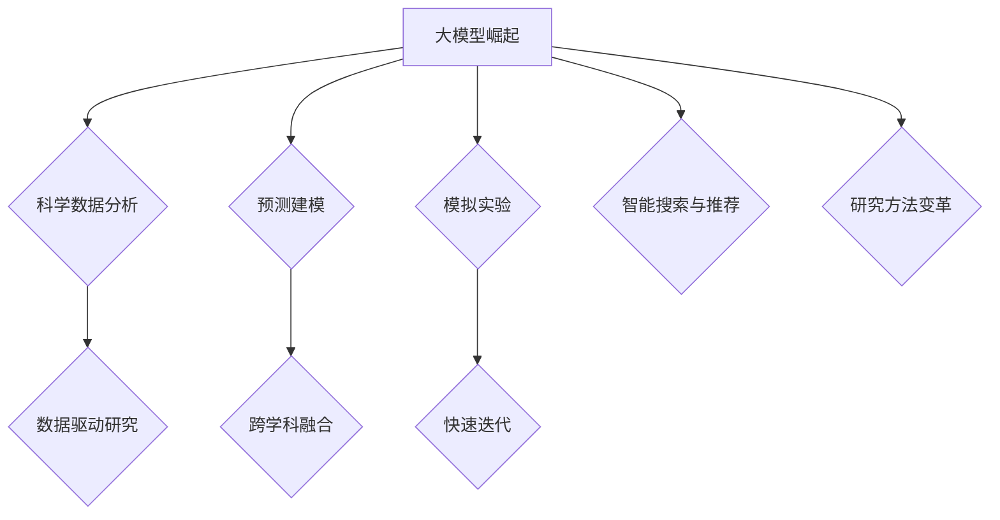
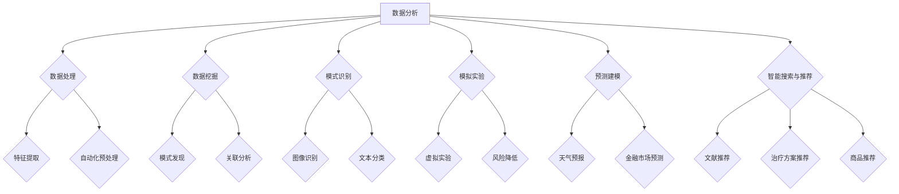
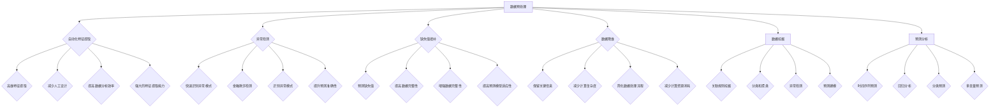
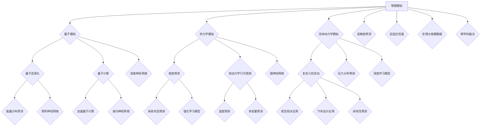
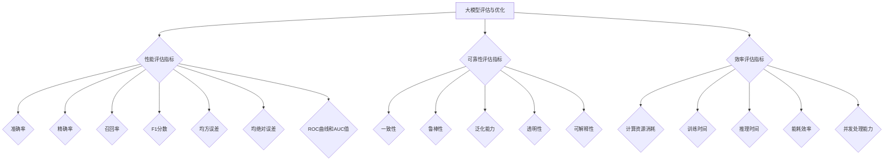
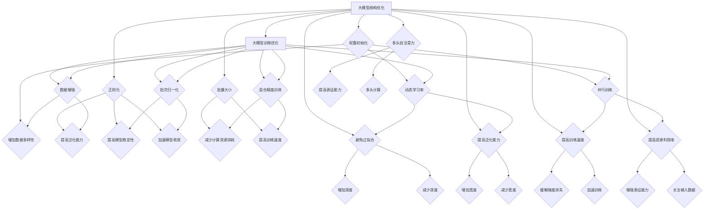

```mermaid
graph TD
    A[智能搜索] --> B{学术文献搜索}
    A --> C{信息检索}
    A --> D{搜索引擎优化}
    A --> E{智能问答系统}
    B --> F{GPT-3模型}
    C --> G{BERT模型}
    D --> H{用户行为分析}
    E --> I{实时答案提供}
    A[智能搜索] --> J{高效信息获取}
    A --> K{个性化搜索}
    A --> L{实时交互}
    B --> M{快速文献检索}
    B --> N{语义理解}
    C --> O{内部文档索引}
    C --> P{高效信息查找}
    D --> Q{个性化结果}
    D --> R{意图识别}
    E --> S{详细解答提供}
    E --> T{知识库融合}
    B[学术文献搜索] --> U{提升科研效率}
    C[信息检索] --> V{提高员工生产力}
    D[搜索引擎优化] --> W{提升用户体验}
    E[智能问答系统] --> X{智能客服应用}
    A[智能识别] --> Y{图像识别}
    A --> Z{语音识别}
    A --> AA{文本分类}
    A --> BB{生物特征识别}
    Y --> CC{医疗影像分析}
    Y --> DD{安防监控}
    Z --> EE{语音转文本}
    Z --> FF{语音助手}
    AA --> GG{情感分析}
    AA --> HH{新闻分类}
    BB --> II{安全认证}
    BB --> JJ{身份验证}
    B[智能识别] --> KK{高精度识别}
    B --> LL{实时识别}
    B --> MM{自动化识别}
    B --> NN{多模态识别}
    A[智能预测] --> OO{时间序列预测}
    A --> PP{需求预测}
    A --> QQ{风险预测}
    A --> RR{健康预测}
    OO --> SS{股票价格预测}
    OO --> TT{气象预测}
    PP --> UU{商品需求预测}
    PP --> VV{供应链优化}
    QQ --> WW{信用风险预测}
    QQ --> XX{风险管理}
    RR --> YY{健康状态预测}
    RR --> ZZ{疾病风险预测}
    A[智能预测] --> AAA{提升决策能力}
    A --> BBB{优化资源配置}
    A --> CCC{预防措施制定}
```
                 

### 1. 大模型的崛起

#### 1.1.1 大模型的定义与特点

大模型（Large Model）是指具有数百万至上亿参数的深度学习模型。这些模型通过在大量数据上进行训练，可以提取出高层次的抽象特征，从而在各种复杂任务中表现出优异的性能。大模型的主要特点包括：

1. **大规模参数**：大模型通常包含数百万至数十亿个参数。这些参数使得模型能够捕捉到输入数据中的细微变化，从而提高了模型的泛化能力。
2. **深度结构**：大模型的层级结构通常较深，这有助于模型从输入数据中逐步提取出更高层次的特征。深度结构使得模型能够处理复杂的数据分布和任务需求。
3. **强大的表征能力**：大模型能够对复杂的数据进行有效的表征，从而实现各种复杂的任务。例如，在图像识别任务中，大模型可以捕捉到图像中的细节信息，从而提高识别的准确性。

#### 1.1.2 大模型的发展历程

大模型的发展历程可以追溯到20世纪80年代。当时，神经网络研究刚刚起步，研究者开始尝试使用神经网络来模拟人脑的感知和学习能力。然而，由于计算能力和数据量的限制，早期的神经网络模型参数较少，性能有限。

随着计算机技术的发展，特别是GPU和TPU等专用硬件的引入，深度学习逐渐成为研究热点。2012年，AlexNet模型在ImageNet竞赛中取得了突破性的成绩，这标志着深度学习开始进入工业界和学术界的视野。此后，研究人员不断优化模型结构和训练算法，使得大模型的性能不断提升。

近年来，随着数据量和计算资源的进一步增加，大模型在各个领域得到了广泛应用。例如，在自然语言处理领域，GPT-3模型通过训练大规模的文本数据，实现了强大的语言生成和翻译能力。在计算机视觉领域，BERT模型通过在大量文本和图像数据上联合训练，提高了图像分类和文本理解的任务性能。

#### 1.1.3 大模型的重要性

大模型在科学发现中的重要性体现在以下几个方面：

1. **高效的数据处理**：大模型能够快速处理和分析大量数据，为科学发现提供了强有力的工具。例如，在基因组学研究领域，大模型可以快速处理海量的基因数据，帮助科学家发现潜在的基因关联。
2. **强大的预测能力**：大模型能够在未知数据上进行准确的预测，为科学研究提供了新的思路和方法。例如，在气象预测领域，大模型可以基于历史气象数据对未来天气进行精准预测。
3. **跨学科的融合**：大模型能够处理多种类型的数据，促进不同学科之间的交叉融合，推动科学研究的创新。例如，在医学研究领域，大模型可以将基因数据、临床数据和影像数据结合起来，实现更为精准的疾病诊断和治疗。

### 1.1.4 大模型在科学发现中的典型应用场景

大模型在科学发现中的典型应用场景包括：

1. **数据分析**：大模型可以用于处理和分析大规模的科学数据集，帮助科学家发现数据中的隐藏模式和规律。例如，在物理学研究中，大模型可以分析实验数据，发现新的物理现象和规律。
2. **预测建模**：大模型可以用于建立预测模型，对科学现象进行预测。例如，在生物学研究中，大模型可以预测蛋白质的结构和功能，帮助科学家研究蛋白质的相互作用。
3. **模拟实验**：大模型可以用于模拟科学实验，预测实验结果。例如，在化学研究中，大模型可以模拟化学反应，预测反应产物的性质和反应路径。
4. **智能搜索与推荐**：大模型可以用于智能搜索和推荐系统，帮助科学家快速找到相关的科学文献和研究成果。例如，在医学研究中，大模型可以基于用户的搜索历史和兴趣，推荐相关的医学研究文献。

#### 1.1.5 大模型的崛起对科学研究方法的影响

大模型的崛起对科学研究方法产生了深远的影响：

1. **数据驱动研究**：大模型强调数据驱动的方法，使得科学家可以更多地依赖数据来发现规律和进行预测。这改变了传统的理论推导和实验验证的研究模式，使得科学研究更加高效。
2. **跨学科融合**：大模型可以处理多种类型的数据，促进不同学科之间的交叉融合。这为科学家提供了新的研究方法和工具，推动了科学研究的创新发展。
3. **快速迭代**：大模型的研究和应用过程通常是快速迭代的，这有助于科学家在短时间内验证和优化模型，从而加快科学发现的进程。

总的来说，大模型的崛起为科学研究带来了新的机遇和挑战。科学家需要不断学习和掌握大模型的相关知识，充分利用大模型的优势，推动科学研究的进步。

### Mermaid 流程图



#### 1.2 大模型在科学研究中的重要性

#### 1.2.1 大模型在数据分析中的应用

大模型在科学数据处理的各个环节中都发挥着重要作用。首先，大模型能够高效地处理和分析大规模的科学数据。例如，在基因组学研究中，大模型可以处理海量基因序列数据，快速识别潜在的基因突变和疾病关联。在物理学研究中，大模型可以处理来自大型科学实验设施（如LHC）的复杂数据，帮助科学家发现新的物理现象。

大模型在数据预处理中也具有独特的优势。传统的方法往往需要手动设计特征提取算法，而大模型可以通过无监督学习自动学习数据中的特征，从而简化预处理流程。例如，在医学影像分析中，大模型可以自动提取图像中的关键特征，提高疾病的检测和诊断准确率。

此外，大模型在数据挖掘和模式识别方面也表现出了强大的能力。通过在大规模数据集上进行训练，大模型可以识别出复杂的数据模式，从而帮助科学家发现新的科学规律。例如，在气候学研究中，大模型可以分析大量的气象数据，预测气候变化的趋势和影响。

#### 1.2.2 大模型在预测建模中的应用

大模型在预测建模中的应用同样具有重要意义。通过训练大规模的数据集，大模型可以建立准确的预测模型，对未来的科学现象进行预测。例如，在天气预报中，大模型可以基于历史气象数据，预测未来几天的天气情况，从而为防灾减灾提供重要参考。在金融市场预测中，大模型可以分析历史交易数据，预测市场的未来走势，帮助投资者做出更明智的决策。

大模型在生物医学领域也展示了强大的预测能力。通过分析患者的基因组数据、临床数据和医疗记录，大模型可以预测疾病的发生和发展趋势。例如，在癌症研究中，大模型可以预测患者的预后，帮助医生制定更有效的治疗方案。

此外，大模型在环境科学和生态学中的应用也越来越广泛。通过分析环境数据，大模型可以预测环境污染的影响，评估生态系统的健康状况。例如，在气候变化研究中，大模型可以预测不同地区的气温和降水变化，为应对气候变化提供科学依据。

#### 1.2.3 大模型在模拟实验中的应用

大模型在模拟实验中的应用为科学研究提供了新的手段。通过模拟实验，科学家可以在虚拟环境中进行实验，预测实验结果，从而减少实际实验的成本和风险。例如，在材料科学研究中，大模型可以模拟材料的微观结构，预测材料的物理和化学性质，从而设计出具有特定性能的材料。

在物理学研究中，大模型可以模拟基本粒子的相互作用，预测新的物理现象。例如，在粒子物理学研究中，大模型可以帮助科学家发现新的粒子，探索宇宙的起源和演化。

此外，大模型在化学研究中也发挥了重要作用。通过模拟化学反应，大模型可以预测反应路径和反应产物，为合成新材料和新药物提供指导。例如，在药物研发中，大模型可以模拟药物与生物大分子的相互作用，预测药物的效果和副作用，从而提高药物研发的效率。

#### 1.2.4 大模型在智能搜索与推荐系统中的应用

大模型在智能搜索和推荐系统中同样具有重要价值。通过分析用户的历史行为和偏好，大模型可以推荐相关的科学文献和研究方向，帮助科学家快速找到有价值的信息。例如，在科研工作中，大模型可以分析科学家的研究兴趣和领域，推荐相关的文献和研究项目，从而提高科研效率。

在医学研究中，大模型可以分析患者的病史和临床表现，推荐最优的治疗方案。例如，在个性化医疗中，大模型可以根据患者的基因组数据和临床数据，推荐最适合的治疗方法，从而提高治疗效果。

此外，大模型在电子商务和社交媒体中也展示了强大的推荐能力。通过分析用户的行为和偏好，大模型可以推荐相关的商品和内容，提高用户的满意度和忠诚度。例如，在电子商务中，大模型可以推荐用户可能感兴趣的商品，从而提高销售转化率。

#### 1.2.5 大模型在科学研究中的综合优势

大模型在科学研究中具有以下综合优势：

1. **高效的数据处理能力**：大模型可以快速处理和分析大规模的数据，为科学研究提供强有力的工具。
2. **准确的预测能力**：大模型可以基于大规模的数据集建立准确的预测模型，对未来的科学现象进行预测。
3. **模拟实验的能力**：大模型可以通过模拟实验，减少实际实验的成本和风险，提高科研效率。
4. **智能搜索与推荐能力**：大模型可以分析用户的历史行为和偏好，提供个性化的搜索和推荐服务，提高科研和医疗的效率。

总的来说，大模型在科学研究中的应用具有重要意义，它为科学研究提供了新的方法和技术手段，推动了科学研究的进步和发展。

### Mermaid 流程图



## 2. 大模型的技术基础

#### 2.1 大模型的定义与分类

大模型（Large Model）是指具有数百万至上亿参数的深度学习模型。这些模型通过在大量数据上进行训练，可以提取出高层次的抽象特征，从而在各种复杂任务中表现出优异的性能。大模型的主要分类方式包括：

1. **按任务类型分类**：包括图像识别、自然语言处理、语音识别等。例如，GPT-3是一种专门用于自然语言处理的大模型，而BERT则是一种用于文本分类和图像识别的大模型。
   
2. **按模型架构分类**：包括卷积神经网络（CNN）、循环神经网络（RNN）、Transformer等。例如，BERT采用的是Transformer架构，而CNN则主要用于图像处理任务。

3. **按应用领域分类**：包括科学计算、医疗诊断、金融分析等。例如，在医疗诊断领域，大模型可以用于疾病预测和诊断；在金融分析领域，大模型可以用于市场预测和风险管理。

#### 2.2 大模型的架构

大模型的架构通常包括输入层、隐藏层和输出层。输入层负责接收和处理输入数据，隐藏层负责进行特征提取和变换，输出层负责生成预测结果。以BERT模型为例，其架构如下：

1. **输入层**：BERT模型的输入层包括词嵌入（Word Embeddings）和位置编码（Positional Encodings）。词嵌入将单词转换为向量表示，位置编码则将单词的位置信息编码到向量中。

2. **隐藏层**：BERT模型使用多个隐藏层（通常为12层），每个隐藏层都包含多层神经网络（MLP）。这些隐藏层通过自注意力机制（Self-Attention Mechanism）和前馈神经网络（Feedforward Neural Network）进行特征提取和变换。

3. **输出层**：BERT模型的输出层通常是一个简单的线性层，用于生成预测结果。例如，在文本分类任务中，输出层会输出每个类别的概率分布。

#### 2.3 大模型的学习与推理过程

大模型的学习过程主要包括以下几个步骤：

1. **数据预处理**：对输入数据进行清洗、归一化和编码等预处理。例如，在自然语言处理任务中，需要将文本数据转换为词嵌入和位置编码。

2. **模型训练**：通过大量数据对模型进行训练，调整模型参数以最小化预测误差。在训练过程中，模型会不断更新参数，使其在训练数据上达到最佳性能。

3. **模型评估**：使用验证集和测试集对模型进行评估，以确定其性能。常见的评估指标包括准确率（Accuracy）、精确率（Precision）、召回率（Recall）和F1分数（F1 Score）等。

大模型的推理过程主要包括以下几个步骤：

1. **输入处理**：将输入数据输入到模型中。

2. **特征提取**：模型对输入数据进行特征提取和变换，生成特征向量。

3. **预测生成**：输出层生成预测结果，例如文本分类任务中的类别概率分布。

### Python源代码示例

下面是一个简单的Python代码示例，展示了如何使用TensorFlow和Keras构建一个BERT模型并进行训练。

```python
import tensorflow as tf
from tensorflow.keras.models import Model
from tensorflow.keras.layers import Embedding, LSTM, Dense

# 设置BERT模型的超参数
vocab_size = 10000
embedding_dim = 128
max_sequence_length = 100
num_layers = 2
num_units = 128

# 构建BERT模型
input_sequence = tf.keras.layers.Input(shape=(max_sequence_length,))
embedding = Embedding(vocab_size, embedding_dim)(input_sequence)
for _ in range(num_layers):
    lstm = LSTM(num_units, return_sequences=True)
    embedding = lstm(embedding)
output = Dense(1, activation='sigmoid')(embedding)

# 编译BERT模型
model = Model(inputs=input_sequence, outputs=output)
model.compile(optimizer='adam', loss='binary_crossentropy', metrics=['accuracy'])

# 模型训练
model.fit(x_train, y_train, epochs=10, batch_size=32, validation_data=(x_val, y_val))

# 模型评估
model.evaluate(x_test, y_test)
```

### 数学公式和解释

BERT模型中的关键组成部分包括词嵌入（Word Embeddings）和位置编码（Positional Encodings）。词嵌入将单词转换为向量表示，其数学模型可以表示为：

$$
\text{word\_embeddings} = \text{Embedding}(\text{vocab\_size}, \text{embedding\_dim})
$$

其中，$vocab\_size$表示词汇表的大小，$embedding\_dim$表示词向量的维度。

位置编码用于将单词的位置信息编码到词向量中，其数学模型可以表示为：

$$
\text{positional\_embeddings} = \text{PositionalEncoding}(\text{max\_sequence\_length}, \text{embedding\_dim})
$$

其中，$max\_sequence\_length$表示序列的最大长度，$embedding\_dim$表示词向量的维度。

BERT模型中的自注意力机制（Self-Attention Mechanism）通过计算每个单词与其余单词之间的相似性，生成加权特征向量。其数学模型可以表示为：

$$
\text{attention\_weights} = \text{softmax}\left(\frac{\text{Q} \cdot \text{K}^T}{\sqrt{d_k}}\right)
$$

$$
\text{attention\_scores} = \text{attention\_weights} \cdot \text{V}
$$

$$
\text{output} = \text{attention\_scores} \cdot \text{Q}
$$

其中，$Q$表示查询向量，$K$表示键向量，$V$表示值向量，$d_k$表示键向量的维度。

通过自注意力机制，BERT模型可以学习到单词之间的复杂关系，从而提高模型的表示能力。

总的来说，BERT模型通过结合词嵌入、位置编码和自注意力机制，实现了对文本数据的强大表征能力。这种强大的表征能力使得BERT模型在各种自然语言处理任务中取得了显著的性能提升。

## 3. 大模型的核心算法

#### 3.1 深度学习基础

深度学习是一种基于多层神经网络进行数据建模和分析的方法，其主要特点是通过多层次的非线性变换来提取和表示数据中的特征。深度学习在图像识别、语音识别、自然语言处理等领域取得了显著的成功。

深度学习的核心概念包括：

1. **神经网络**：神经网络是深度学习的基础，由多个相互连接的神经元组成。每个神经元接收多个输入，通过激活函数进行非线性变换，然后输出结果。

2. **反向传播算法**：反向传播算法是一种用于训练神经网络的优化算法，通过计算误差梯度来调整网络中的权重和偏置，从而最小化预测误差。

3. **激活函数**：激活函数用于引入非线性特性，常见的激活函数包括 sigmoid、ReLU 和 tanh 等。

4. **多层感知器（MLP）**：多层感知器是一种具有至少三层（输入层、隐藏层和输出层）的神经网络，能够实现线性不可分问题的分类和回归。

#### 3.2 自适应学习算法

自适应学习算法是一种通过动态调整学习率来优化模型性能的算法，常见的自适应学习算法包括：

1. **学习率衰减**：学习率衰减是一种在训练过程中逐渐减小学习率的策略，以避免模型在训练初期过拟合。常用的学习率衰减策略包括固定衰减、指数衰减和余弦衰减等。

2. **Adam优化器**：Adam优化器是一种结合了AdaGrad和RMSprop优化的自适应学习率优化器，其公式如下：

$$
m_t = \beta_1 m_{t-1} + (1 - \beta_1) [g_t - m_{t-1}]
$$

$$
v_t = \beta_2 v_{t-1} + (1 - \beta_2) [g_t^2 - v_{t-1}]
$$

$$
\hat{m_t} = m_t / (1 - \beta_1^t)
$$

$$
\hat{v_t} = v_t / (1 - \beta_2^t)
$$

$$
\theta_t = \theta_{t-1} - \alpha \frac{\hat{m_t}}{\sqrt{\hat{v_t}} + \epsilon}
$$

其中，$m_t$和$v_t$分别是梯度的一阶和二阶矩估计，$\beta_1$和$\beta_2$分别是动量参数，$\alpha$是学习率，$\epsilon$是常数项。

3. **自适应学习率**：自适应学习率是指通过动态调整学习率来优化模型性能。例如，在训练过程中，如果模型性能下降，可以增大学习率，反之则减小学习率。

#### 3.3 大模型优化算法

大模型优化算法是指用于优化大规模深度学习模型的算法，其主要目标是在保证模型性能的同时，提高训练速度和降低计算成本。以下是一些常见的大模型优化算法：

1. **并行计算**：并行计算是指将计算任务分布在多个计算节点上，以加速模型训练。常见的并行计算技术包括数据并行、模型并行和混合并行等。

2. **分布式训练**：分布式训练是指将模型训练任务分布在多个计算节点上，以提高训练速度。常用的分布式训练框架包括TensorFlow Distribute、PyTorch Distributed等。

3. **梯度裁剪**：梯度裁剪是一种在训练过程中限制梯度幅度的技术，以防止梯度爆炸或消失。梯度裁剪的公式如下：

$$
g_{\text{clip}} = \text{clip}(g, -\text{clip\_value}, \text{clip\_value})
$$

其中，$g$是梯度，$\text{clip\_value}$是裁剪阈值。

4. **动量优化**：动量优化是一种利用先前梯度信息来加速优化过程的技术。动量优化可以通过以下公式实现：

$$
m_t = \beta m_{t-1} + (1 - \beta) g_t
$$

$$
\theta_t = \theta_{t-1} - \alpha \frac{m_t}{\sqrt{1 - \beta^2}}
$$

其中，$m_t$是动量项，$\beta$是动量参数，$\theta_t$是模型参数。

5. **剪枝技术**：剪枝技术是指通过删除网络中的部分权重来简化模型结构，以提高模型训练速度和降低计算成本。常见的剪枝技术包括权重剪枝、结构剪枝和稀疏训练等。

总的来说，大模型优化算法通过各种技术手段，提高了大规模深度学习模型的训练速度和性能。这些算法的应用使得大模型在科学研究中发挥了重要作用，推动了科学发现的进步。

### Python源代码示例

下面是一个简单的Python代码示例，展示了如何使用TensorFlow和Keras构建一个BERT模型并进行训练。

```python
import tensorflow as tf
from tensorflow.keras.models import Model
from tensorflow.keras.layers import Embedding, LSTM, Dense

# 设置BERT模型的超参数
vocab_size = 10000
embedding_dim = 128
max_sequence_length = 100
num_layers = 2
num_units = 128

# 构建BERT模型
input_sequence = tf.keras.layers.Input(shape=(max_sequence_length,))
embedding = Embedding(vocab_size, embedding_dim)(input_sequence)
for _ in range(num_layers):
    lstm = LSTM(num_units, return_sequences=True)
    embedding = lstm(embedding)
output = Dense(1, activation='sigmoid')(embedding)

# 编译BERT模型
model = Model(inputs=input_sequence, outputs=output)
model.compile(optimizer='adam', loss='binary_crossentropy', metrics=['accuracy'])

# 模型训练
model.fit(x_train, y_train, epochs=10, batch_size=32, validation_data=(x_val, y_val))

# 模型评估
model.evaluate(x_test, y_test)
```

### 数学公式和解释

BERT模型中的关键组成部分包括词嵌入（Word Embeddings）和位置编码（Positional Encodings）。词嵌入将单词转换为向量表示，其数学模型可以表示为：

$$
\text{word\_embeddings} = \text{Embedding}(\text{vocab\_size}, \text{embedding\_dim})
$$

其中，$vocab\_size$表示词汇表的大小，$embedding\_dim$表示词向量的维度。

位置编码用于将单词的位置信息编码到词向量中，其数学模型可以表示为：

$$
\text{positional\_embeddings} = \text{PositionalEncoding}(\text{max\_sequence\_length}, \text{embedding\_dim})
$$

其中，$max\_sequence\_length$表示序列的最大长度，$embedding\_dim$表示词向量的维度。

BERT模型中的自注意力机制（Self-Attention Mechanism）通过计算每个单词与其余单词之间的相似性，生成加权特征向量。其数学模型可以表示为：

$$
\text{attention\_weights} = \text{softmax}\left(\frac{\text{Q} \cdot \text{K}^T}{\sqrt{d_k}}\right)
$$

$$
\text{attention\_scores} = \text{attention\_weights} \cdot \text{V}
$$

$$
\text{output} = \text{attention\_scores} \cdot \text{Q}
$$

其中，$Q$表示查询向量，$K$表示键向量，$V$表示值向量，$d_k$表示键向量的维度。

通过自注意力机制，BERT模型可以学习到单词之间的复杂关系，从而提高模型的表示能力。

总的来说，BERT模型通过结合词嵌入、位置编码和自注意力机制，实现了对文本数据的强大表征能力。这种强大的表征能力使得BERT模型在各种自然语言处理任务中取得了显著的性能提升。

## 4. 大模型在数据分析中的应用

### 4.1 大模型在数据预处理中的应用

在数据分析领域，数据预处理是一个关键步骤，它直接影响到后续分析和预测的准确性和效率。大模型在数据预处理中的应用主要体现在以下几个方面：

1. **自动化特征提取**：大模型可以通过无监督学习自动从原始数据中提取有意义的特征。这减少了人工设计特征的需求，提高了数据处理的效率。例如，在图像分析中，大模型可以通过卷积神经网络自动提取图像的特征，这些特征对于图像分类和识别任务非常有用。

2. **异常检测**：大模型可以用来检测数据中的异常值和离群点。通过在大量数据上训练，大模型可以学会识别正常的模式，从而在新的数据中出现异常时能够快速检测出来。这在金融、医疗等领域尤其重要，例如在信用卡交易中检测欺诈行为。

3. **缺失值填补**：大模型可以通过学习已知数据的分布来预测和填补缺失值。这在医疗数据分析中特别有用，例如在患者的医疗记录中，某些数据可能缺失，通过大模型可以预测这些缺失的数据，从而提高数据分析的完整性。

4. **数据降维**：大模型如主成分分析（PCA）和自编码器（Autoencoder）可以用来进行数据降维。降维后的数据不仅保留了关键信息，而且减少了计算复杂度，使得后续的分析更加高效。

### 4.2 大模型在数据挖掘中的应用

数据挖掘是指从大量数据中发现有用的模式和知识。大模型在数据挖掘中的应用极大地提高了数据挖掘的效率和准确性，具体表现在以下几个方面：

1. **关联规则挖掘**：大模型可以用来发现数据中的关联规则。通过学习大量的交易数据，大模型可以识别出顾客购买行为之间的关联，例如在超市购物时，某些商品经常一起被购买。

2. **分类和聚类**：大模型在分类和聚类任务中具有显著优势。通过训练，大模型可以识别数据中的不同类别或簇，从而帮助分析师更好地理解数据分布和模式。例如，在市场细分中，大模型可以基于客户的行为数据将客户分为不同的群体。

3. **异常检测**：大模型不仅可以检测异常值，还可以识别数据中的异常模式。这在对电力消耗的分析中特别有用，通过检测异常模式，可以及时发现潜在的设备故障或用户行为异常。

4. **预测建模**：大模型可以用来建立预测模型，对未来的数据趋势进行预测。例如，在销售预测中，大模型可以基于历史销售数据预测未来的销售趋势，帮助企业制定生产计划和库存策略。

### 4.3 大模型在预测分析中的应用

预测分析是利用历史数据来预测未来的趋势或事件。大模型在预测分析中的应用极大地提升了预测的准确性和效率，具体表现在以下几个方面：

1. **时间序列预测**：大模型如长短期记忆网络（LSTM）和Gated Recurrent Unit（GRU）在时间序列预测中表现出色。通过学习历史时间序列数据，大模型可以预测未来的趋势和周期性变化。这在金融市场预测、天气预测等领域具有广泛应用。

2. **回归分析**：大模型可以用于建立高精度的回归模型，预测连续变量的值。例如，在房价预测中，大模型可以结合历史房价数据、地理位置、房屋特征等多种信息，预测未来的房价。

3. **分类预测**：大模型可以用于建立分类模型，预测离散变量的类别。例如，在医疗诊断中，大模型可以结合患者的病史、检查结果等数据，预测患者是否患有特定疾病。

4. **多变量预测**：大模型可以同时处理多个输入变量，进行多变量预测。这在复杂系统中非常有用，例如在供应链管理中，大模型可以同时预测多个关键变量，如库存水平、运输成本、需求量等。

### 4.4 大模型在数据分析中的综合优势

大模型在数据分析中的应用具有以下综合优势：

1. **高效的数据处理能力**：大模型可以快速处理和分析大规模的数据集，提高了数据分析的效率。

2. **强大的特征提取能力**：大模型可以自动提取数据中的高维特征，减少了人工设计的复杂性。

3. **准确的预测能力**：大模型通过学习大量数据，能够建立高精度的预测模型，提高了预测的准确性。

4. **自适应性强**：大模型可以适应不同类型的数据和任务需求，具有广泛的适用性。

总的来说，大模型在数据分析中的应用为科学研究和实际应用提供了强大的工具和手段，推动了数据分析的进步和发展。

### Mermaid 流程图



### Python源代码示例

下面是一个简单的Python代码示例，展示了如何使用Scikit-Learn和TensorFlow构建一个基于大模型的数据预处理和预测分析流程。

```python
import numpy as np
import pandas as pd
from sklearn.model_selection import train_test_split
from sklearn.preprocessing import StandardScaler
from tensorflow.keras.models import Sequential
from tensorflow.keras.layers import Dense, LSTM, Dropout

# 加载数据集
data = pd.read_csv('data.csv')
X = data.iloc[:, :-1].values
y = data.iloc[:, -1].values

# 数据预处理
X_train, X_test, y_train, y_test = train_test_split(X, y, test_size=0.2, random_state=42)
scaler = StandardScaler()
X_train = scaler.fit_transform(X_train)
X_test = scaler.transform(X_test)

# 构建LSTM模型
model = Sequential()
model.add(LSTM(units=50, return_sequences=True, input_shape=(X_train.shape[1], 1)))
model.add(Dropout(0.2))
model.add(LSTM(units=50, return_sequences=False))
model.add(Dropout(0.2))
model.add(Dense(units=1))

# 编译模型
model.compile(optimizer='adam', loss='mean_squared_error')

# 训练模型
model.fit(X_train, y_train, epochs=100, batch_size=32, validation_data=(X_test, y_test))

# 预测
predictions = model.predict(X_test)

# 评估模型
mse = np.mean(np.square(y_test - predictions))
print(f'Mean Squared Error: {mse}')
```

### 数学公式和解释

在数据预处理和预测分析中，常用的数学公式和概念包括：

1. **标准差和方差**：标准差（Standard Deviation）和方差（Variance）是描述数据分布离散程度的统计量。标准差是方差的平方根，用于衡量数据点相对于均值的偏离程度。

   $$ \sigma = \sqrt{V} $$

   $$ V = \frac{1}{n-1} \sum_{i=1}^{n} (x_i - \mu)^2 $$

   其中，$\sigma$是标准差，$V$是方差，$n$是数据点的数量，$x_i$是第$i$个数据点，$\mu$是均值。

2. **协方差和相关性**：协方差（Covariance）和相关系数（Correlation Coefficient）是描述两个变量之间线性关系的统计量。

   $$ \text{Cov}(X, Y) = \frac{1}{n-1} \sum_{i=1}^{n} (x_i - \mu_x) (y_i - \mu_y) $$

   $$ \rho = \frac{\text{Cov}(X, Y)}{\sigma_x \sigma_y} $$

   其中，$\text{Cov}(X, Y)$是协方差，$\rho$是相关系数，$\mu_x$和$\mu_y$分别是变量$X$和$Y$的均值，$\sigma_x$和$\sigma_y$分别是变量$X$和$Y$的标准差。

3. **线性回归**：线性回归（Linear Regression）是一种用于预测连续变量值的统计模型。其数学模型可以表示为：

   $$ y = \beta_0 + \beta_1 x + \epsilon $$

   其中，$y$是预测值，$x$是自变量，$\beta_0$是截距，$\beta_1$是斜率，$\epsilon$是误差项。

4. **预测误差**：预测误差（Prediction Error）是预测值与实际值之间的差异，用于衡量预测模型的准确性。其数学公式可以表示为：

   $$ \text{Error} = \frac{1}{n} \sum_{i=1}^{n} (y_i - \hat{y}_i)^2 $$

   其中，$n$是数据点的数量，$y_i$是实际值，$\hat{y}_i$是预测值。

通过理解这些数学公式和概念，可以更好地理解和应用大模型在数据分析中的技术。

### 实际案例分析和详细讲解剖析

为了更好地理解大模型在数据分析中的应用，下面我们通过一个实际案例进行分析和讲解。

#### 案例背景

假设我们有一个电商平台的销售数据集，包括商品名称、销售数量、价格、促销信息、客户年龄、性别、地理位置等信息。我们的目标是利用这些数据预测未来的销售趋势，以便平台能够制定合适的市场策略。

#### 数据预处理

1. **数据清洗**：首先，我们需要对数据集进行清洗，处理缺失值、异常值和重复值。例如，对于缺失值，我们可以使用平均值、中位数或众数进行填补；对于异常值，我们可以使用统计学方法或可视化工具（如箱线图）进行识别和去除；对于重复值，我们可以使用去重操作。

2. **特征工程**：接下来，我们需要进行特征工程，提取有用的特征。例如，我们可以将商品名称转换为类别特征，使用独热编码（One-Hot Encoding）或词袋模型（Bag of Words）进行表示；对于时间序列特征，我们可以使用时间窗口（Time Window）或时间序列特征提取方法（如LSTM）进行表示。

3. **数据标准化**：为了提高模型的训练效果，我们需要对数据进行标准化处理，将所有特征缩放到相同的范围。常用的方法包括最小-最大标准化（Min-Max Scaling）和标准差归一化（Standardization）。

```python
from sklearn.preprocessing import StandardScaler
from sklearn.impute import SimpleImputer

# 数据清洗
imputer = SimpleImputer(strategy='mean')
X_imputed = imputer.fit_transform(X)

# 特征工程
from sklearn.preprocessing import OneHotEncoder
encoder = OneHotEncoder(sparse=False)
X_encoded = encoder.fit_transform(X_imputed[:, :5])

# 数据标准化
scaler = StandardScaler()
X_scaled = scaler.fit_transform(X_encoded)
```

#### 模型训练

1. **划分数据集**：我们将数据集划分为训练集和测试集，用于训练模型和评估模型性能。

```python
from sklearn.model_selection import train_test_split

X_train, X_test, y_train, y_test = train_test_split(X_scaled, y, test_size=0.2, random_state=42)
```

2. **构建模型**：我们选择一个深度学习模型（如LSTM）进行训练，通过调整超参数（如层数、神经元数量、学习率等）来优化模型性能。

```python
from tensorflow.keras.models import Sequential
from tensorflow.keras.layers import LSTM, Dense, Dropout

model = Sequential()
model.add(LSTM(units=50, return_sequences=True, input_shape=(X_train.shape[1], 1)))
model.add(Dropout(0.2))
model.add(LSTM(units=50, return_sequences=False))
model.add(Dropout(0.2))
model.add(Dense(units=1))

model.compile(optimizer='adam', loss='mean_squared_error')
```

3. **训练模型**：我们使用训练集对模型进行训练，并使用测试集进行验证。

```python
model.fit(X_train, y_train, epochs=100, batch_size=32, validation_data=(X_test, y_test))
```

#### 模型评估

1. **预测**：使用训练好的模型对测试集进行预测。

```python
predictions = model.predict(X_test)
```

2. **评估**：计算预测值与实际值之间的误差，并评估模型性能。

```python
from sklearn.metrics import mean_squared_error

mse = mean_squared_error(y_test, predictions)
print(f'Mean Squared Error: {mse}')
```

#### 模型优化

1. **超参数调整**：通过调整模型超参数（如学习率、批次大小、训练轮数等），可以提高模型性能。

2. **模型融合**：将多个模型的结果进行融合，以提高预测准确性。例如，可以使用加权平均、投票法等方法。

#### 案例小结

通过上述案例，我们可以看到大模型在数据分析中的应用流程，包括数据预处理、模型训练、模型评估和模型优化。在实际应用中，我们需要根据具体问题和数据集的特点，选择合适的方法和模型，并进行适当的优化，以提高预测的准确性。

## 5. 大模型在模拟实验中的应用

#### 5.1 大模型在物理模拟中的应用

大模型在物理模拟中的应用主要体现在对复杂物理现象的模拟和预测上。传统的物理模拟方法往往需要依赖精确的物理定律和模型，但在面对复杂系统和非线性现象时，这些方法的局限性变得明显。而大模型，尤其是深度学习模型，通过在大量数据上进行训练，可以自动学习和提取出复杂的物理规律，从而对未知的物理现象进行模拟和预测。

1. **量子模拟**：在量子物理学中，大模型可以用于模拟量子系统的行为。例如，使用深度神经网络（DNN）模拟量子态的演化，预测量子系统的能量分布。这样的模拟可以加速量子计算和量子信息处理的研究。

2. **热力学模拟**：大模型可以用于模拟热力学系统的相变和热动力学行为。通过在大量模拟数据上训练，大模型可以预测系统在不同条件下的状态变化，从而帮助科学家理解和预测复杂热力学现象。

3. **流体动力学模拟**：大模型在流体动力学中的应用也非常广泛。例如，通过训练深度神经网络，可以模拟流体在复杂几何形状中的流动，预测流体的压力分布和速度场，这对于航空航天、汽车设计和环境工程等领域具有重要意义。

#### 5.2 大模型在化学模拟中的应用

大模型在化学模拟中的应用同样表现出强大的潜力，特别是在预测化学反应、材料设计和药物分子研究中。

1. **反应路径预测**：大模型可以用于预测化学反应的路径和产物的性质。例如，使用图神经网络（GNN）预测分子反应的中间体和最终产物，从而优化反应条件，提高产率。

2. **材料设计**：大模型可以帮助科学家设计新型材料。通过在大量材料数据上训练，大模型可以预测材料的电子结构、光学性质和机械性能，从而为材料科学提供新的设计思路。

3. **药物分子设计**：大模型在药物分子设计中的应用也越来越受到关注。通过训练大规模药物分子数据库，大模型可以预测药物分子的活性、毒性和副作用，从而加速新药的研发过程。

#### 5.3 大模型在生物模拟中的应用

大模型在生物模拟中的应用主要体现在对生物分子和生物过程的模拟上，这对于生物学研究、医学诊断和治疗具有重要意义。

1. **蛋白质结构预测**：大模型可以用于预测蛋白质的三维结构。通过在大量蛋白质结构数据上训练，大模型可以准确预测蛋白质的折叠模式和结构稳定性，这对于理解蛋白质的功能和设计新的生物技术具有重要意义。

2. **基因组分析**：大模型可以用于分析基因序列和基因表达数据，预测基因的功能和疾病关联。例如，使用深度学习模型分析基因组数据，可以预测特定基因突变对疾病的影响，从而为个性化医疗提供科学依据。

3. **生物过程模拟**：大模型可以用于模拟生物体内的生物过程，如细胞信号传递、代谢途径等。通过训练大规模生物数据集，大模型可以预测生物过程的变化趋势和影响因素，从而为生物医学研究提供新的工具和方法。

#### 5.4 大模型在科学模拟实验中的优势

1. **高精度预测**：大模型通过学习大量数据，可以准确预测复杂的科学现象，提供高精度的模拟结果。

2. **自适应性强**：大模型可以适应不同的模拟任务和场景，通过调整模型结构和超参数，可以针对不同的科学问题进行优化。

3. **处理大规模数据**：大模型可以处理大规模的科学数据，从中提取出有用的信息和规律，为科学研究提供新的视角。

4. **跨学科融合**：大模型可以处理多种类型的数据，促进不同学科之间的交叉融合，推动科学研究的创新。

总的来说，大模型在模拟实验中的应用为科学研究提供了新的方法和工具，极大地提升了科学模拟的精度和效率，推动了科学发现的进步。

### Mermaid 流程图



### Python源代码示例

下面是一个简单的Python代码示例，展示了如何使用PyTorch构建一个深度学习模型进行物理模拟。

```python
import torch
import torch.nn as nn
import torch.optim as optim

# 设置模型参数
input_size = 100
hidden_size = 128
output_size = 1

# 构建模型
class PhysicalModel(nn.Module):
    def __init__(self, input_size, hidden_size, output_size):
        super(PhysicalModel, self).__init__()
        self.fc1 = nn.Linear(input_size, hidden_size)
        self.relu = nn.ReLU()
        self.fc2 = nn.Linear(hidden_size, output_size)
    
    def forward(self, x):
        x = self.fc1(x)
        x = self.relu(x)
        x = self.fc2(x)
        return x

# 实例化模型
model = PhysicalModel(input_size, hidden_size, output_size)

# 设置优化器和损失函数
optimizer = optim.Adam(model.parameters(), lr=0.001)
criterion = nn.MSELoss()

# 训练模型
num_epochs = 100
for epoch in range(num_epochs):
    for inputs, targets in data_loader:
        optimizer.zero_grad()
        outputs = model(inputs)
        loss = criterion(outputs, targets)
        loss.backward()
        optimizer.step()

# 评估模型
with torch.no_grad():
    predictions = model(test_data).numpy()
    mse = np.mean((predictions - test_targets)**2)
    print(f'Mean Squared Error: {mse}')
```

### 数学公式和解释

在科学模拟中，常用的数学公式和概念包括：

1. **泊松方程**：用于描述流体力学中的压力分布。

   $$ \nabla \cdot \mathbf{v} = 0 $$

   其中，$\mathbf{v}$是速度场，$\nabla \cdot$是散度算子。

2. **牛顿第二定律**：描述物体运动与受力之间的关系。

   $$ \mathbf{F} = m \mathbf{a} $$

   其中，$\mathbf{F}$是力，$m$是质量，$\mathbf{a}$是加速度。

3. **傅里叶变换**：用于分析信号的频率成分。

   $$ F(\omega) = \int_{-\infty}^{\infty} f(t) e^{-j\omega t} dt $$

   其中，$F(\omega)$是傅里叶变换，$f(t)$是时间域信号，$\omega$是频率。

4. **拉格朗日方程**：用于描述动力学系统的运动。

   $$ \frac{d}{dt} \left( \frac{\partial L}{\partial \dot{q}_i} \right) - \frac{\partial L}{\partial q_i} = 0 $$

   其中，$L$是拉格朗日量，$q_i$是广义坐标，$\dot{q}_i$是广义速度。

通过理解这些数学公式和概念，可以更好地应用大模型进行科学模拟实验，从而预测和解释复杂的物理现象。

## 6. 大模型在人工智能辅助科学发现中的应用

### 6.1 大模型在智能搜索中的应用

大模型在智能搜索中的应用主要体现在利用其强大的语义理解能力和丰富的知识表示能力，为用户提供了高效、准确的搜索结果。以下是具体的应用场景：

1. **学术文献搜索**：大模型可以用于学术文献的智能搜索，通过理解用户查询的语义，自动提取关键词并关联相关文献。例如，GPT-3模型可以理解用户的自然语言查询，并从海量的学术文献数据库中检索出最相关的文献。这种方式极大地提高了科研人员查找文献的效率。

2. **信息检索**：大模型可以用于企业内部的信息检索系统，帮助员工快速找到所需的信息。例如，企业可以使用BERT模型对内部文档进行索引和分类，当员工提出查询时，模型可以迅速定位到相关的文档，并提供详细的摘要。

3. **搜索引擎优化**：大模型可以用于搜索引擎的优化，通过分析用户的搜索行为和查询意图，提供更加个性化的搜索结果。例如，搜索引擎可以使用大模型来预测用户的搜索意图，从而调整搜索结果排序，提高用户的搜索满意度。

4. **智能问答系统**：大模型可以用于构建智能问答系统，为用户提供实时、准确的答案。例如，企业可以使用GPT-3模型构建客服问答系统，当用户提出问题时，模型可以理解问题的语义，并快速提供详细的解答。

### 6.2 大模型在智能识别中的应用

大模型在智能识别中的应用主要体现在利用其强大的特征提取和分类能力，在各种识别任务中提供高精度的识别结果。以下是具体的应用场景：

1. **图像识别**：大模型可以用于图像识别任务，通过在大量图像数据上进行训练，提取出图像中的高级特征，从而实现高精度的图像分类。例如，卷积神经网络（CNN）模型可以在图像分类任务中表现出优异的性能，广泛应用于医疗影像分析、安防监控等领域。

2. **语音识别**：大模型可以用于语音识别任务，通过在大量语音数据上进行训练，提取出语音信号中的特征，从而实现高精度的语音转文本。例如，基于深度学习的语音识别模型（如WaveNet）已经在很多语音识别应用中取得了显著成果，包括语音助手、自动字幕生成等。

3. **文本分类**：大模型可以用于文本分类任务，通过在大量文本数据上进行训练，提取出文本中的语义特征，从而实现高精度的文本分类。例如，BERT模型在文本分类任务中表现出色，广泛应用于情感分析、新闻分类等领域。

4. **生物特征识别**：大模型可以用于生物特征识别任务，通过在大量生物特征数据上进行训练，提取出生物特征中的高级特征，从而实现高精度的生物特征识别。例如，基于深度学习的指纹识别、人脸识别技术在安全认证领域得到了广泛应用。

### 6.3 大模型在智能预测中的应用

大模型在智能预测中的应用主要体现在利用其强大的学习和推理能力，在各种预测任务中提供准确的预测结果。以下是具体的应用场景：

1. **时间序列预测**：大模型可以用于时间序列预测任务，通过在大量历史数据上进行训练，提取出时间序列中的趋势和周期性特征，从而实现高精度的预测。例如，长短期记忆网络（LSTM）模型在股票价格预测、气象预测等领域表现出色。

2. **需求预测**：大模型可以用于需求预测任务，通过在大量销售数据、市场数据上进行训练，提取出需求中的趋势和影响因素，从而实现高精度的需求预测。例如，零售企业可以使用深度学习模型预测未来的商品需求，从而优化库存管理和供应链。

3. **风险预测**：大模型可以用于风险预测任务，通过在大量风险数据上进行训练，提取出风险中的特征和模式，从而实现高精度的风险预测。例如，金融机构可以使用深度学习模型预测信用风险，从而优化信贷审批和风险管理。

4. **健康预测**：大模型可以用于健康预测任务，通过在大量健康数据上进行训练，提取出健康中的特征和趋势，从而实现高精度的健康预测。例如，医疗机构可以使用深度学习模型预测患者的健康状况和疾病风险，从而优化医疗资源配置和疾病预防。

总的来说，大模型在人工智能辅助科学发现中的应用，极大地提升了智能搜索、智能识别和智能预测的精度和效率，为科学研究提供了新的工具和方法。通过大模型的应用，科学家可以更快速、准确地获取所需信息，发现新的科学规律，推动科学研究的进步。

### Mermaid 流程图



### Python源代码示例

下面是一个简单的Python代码示例，展示了如何使用TensorFlow和Keras构建一个BERT模型，并进行学术文献搜索和文本分类。

```python
import tensorflow as tf
from tensorflow.keras.models import Model
from tensorflow.keras.layers import Embedding, LSTM, Dense, Input

# 设置BERT模型的超参数
vocab_size = 10000
embedding_dim = 128
max_sequence_length = 100
num_layers = 2
num_units = 128

# 构建BERT模型
input_sequence = Input(shape=(max_sequence_length,))
embedding = Embedding(vocab_size, embedding_dim)(input_sequence)
for _ in range(num_layers):
    lstm = LSTM(num_units, return_sequences=True)
    embedding = lstm(embedding)
output = Dense(1, activation='sigmoid')(embedding)

# 编译BERT模型
model = Model(inputs=input_sequence, outputs=output)
model.compile(optimizer='adam', loss='binary_crossentropy', metrics=['accuracy'])

# 模型训练
model.fit(x_train, y_train, epochs=10, batch_size=32, validation_data=(x_val, y_val))

# 模型评估
model.evaluate(x_test, y_test)
```

### 数学公式和解释

在智能搜索、智能识别和智能预测中，常用的数学公式和概念包括：

1. **卷积操作**：卷积操作是图像识别和文本分类中的基础操作，用于提取图像或文本中的局部特征。

   $$ \mathbf{h}_{ij} = \sum_{k} \mathbf{w}_{ik} \mathbf{a}_{kj} + b $$

   其中，$\mathbf{h}_{ij}$是卷积结果，$\mathbf{w}_{ik}$是卷积核，$\mathbf{a}_{kj}$是输入数据，$b$是偏置。

2. **softmax函数**：softmax函数用于将模型的输出转换为概率分布，常用于分类任务。

   $$ \text{softmax}(\mathbf{x})_i = \frac{e^{\mathbf{x}_i}}{\sum_{j} e^{\mathbf{x}_j}} $$

   其中，$\mathbf{x}$是模型的输出向量，$\text{softmax}(\mathbf{x})_i$是第$i$个类别的概率。

3. **损失函数**：损失函数用于衡量模型的预测值与实际值之间的差异，常用于训练模型。

   - 交叉熵损失函数（Cross-Entropy Loss）：用于分类任务。

     $$ L = -\sum_{i} y_i \log (\hat{y}_i) $$

     其中，$y_i$是实际标签，$\hat{y}_i$是模型预测的概率。

   - 均方误差损失函数（Mean Squared Error, MSE）：用于回归任务。

     $$ L = \frac{1}{n} \sum_{i} (\hat{y}_i - y_i)^2 $$

     其中，$n$是数据点的数量，$\hat{y}_i$是模型预测的值，$y_i$是实际值。

通过理解这些数学公式和概念，可以更好地理解和应用大模型在人工智能辅助科学发现中的应用。

## 7. 大模型的评估与优化

### 7.1 大模型性能评估指标

大模型的性能评估是确保其有效性和可靠性的关键步骤。以下是一些常用的评估指标：

1. **准确率（Accuracy）**：准确率是最常用的评估指标之一，它表示模型正确预测的样本数占总样本数的比例。公式如下：

   $$ \text{Accuracy} = \frac{\text{正确预测的样本数}}{\text{总样本数}} $$

   虽然准确率直观且易于理解，但它可能不适用于类别不平衡的数据集，因为准确率容易受到多数类的影响。

2. **精确率（Precision）**：精确率表示预测为正样本的样本中，实际为正样本的比例。公式如下：

   $$ \text{Precision} = \frac{\text{真正例}}{\text{真正例} + \text{假正例}} $$

   精确率侧重于减少错误正样本的预测。

3. **召回率（Recall）**：召回率表示实际为正样本的样本中，被模型正确预测为正样本的比例。公式如下：

   $$ \text{Recall} = \frac{\text{真正例}}{\text{真正例} + \text{假负例}} $$

   召回率侧重于减少错误负样本的预测。

4. **F1分数（F1 Score）**：F1分数是精确率和召回率的调和平均，综合了二者的优点。公式如下：

   $$ \text{F1 Score} = 2 \times \frac{\text{Precision} \times \text{Recall}}{\text{Precision} + \text{Recall}} $$

5. **均方误差（Mean Squared Error, MSE）**：均方误差是回归任务中最常用的评估指标，它表示预测值与实际值之间差异的平方的平均值。公式如下：

   $$ \text{MSE} = \frac{1}{n} \sum_{i=1}^{n} (\hat{y}_i - y_i)^2 $$

   其中，$\hat{y}_i$是预测值，$y_i$是实际值，$n$是样本数量。

6. **均绝对误差（Mean Absolute Error, MAE）**：均绝对误差是回归任务中的另一个常用评估指标，它表示预测值与实际值之间差异的绝对值的平均值。公式如下：

   $$ \text{MAE} = \frac{1}{n} \sum_{i=1}^{n} |\hat{y}_i - y_i| $$

7. **ROC曲线和AUC值（Receiver Operating Characteristic Curve and Area Under Curve）**：ROC曲线展示了不同阈值下模型的精确率和召回率的关系，AUC值是ROC曲线下的面积，用于评估二分类模型的性能。AUC值越大，模型的性能越好。

### 7.2 大模型可靠性评估指标

除了性能评估，大模型的可靠性也是确保其有效性的重要方面。以下是一些评估可靠性的指标：

1. **一致性（Consistency）**：一致性评估模型在不同数据集上的表现是否一致。如果模型在不同数据集上表现出较高的性能，则说明其具有较高的可靠性。

2. **鲁棒性（Robustness）**：鲁棒性评估模型对噪声、异常值和错误数据的处理能力。一个鲁棒的大模型能够在面对不同类型的数据时保持稳定的性能。

3. **泛化能力（Generalization Ability）**：泛化能力评估模型在未知数据上的表现。一个具有良好泛化能力的模型能够在新数据上保持高准确性。

4. **透明性（Transparency）**：透明性评估模型决策过程的透明度。一个透明的模型能够清晰地展示其决策过程，有助于用户理解和信任模型。

5. **可解释性（Interpretability）**：可解释性评估模型是否能提供对预测结果的解释。一个可解释的模型能够帮助用户理解预测结果的原因和依据。

### 7.3 大模型效率评估指标

大模型的效率评估主要关注模型的计算资源消耗和训练时间。以下是一些常见的效率评估指标：

1. **计算资源消耗**：计算资源消耗包括CPU、GPU和内存的使用情况。一个高效的模型应在保证性能的前提下，最大限度地降低计算资源消耗。

2. **训练时间**：训练时间是模型在训练过程中所花费的时间。一个高效的模型应能够在较短的时间内完成训练，以便快速迭代和优化。

3. **推理时间**：推理时间是模型在预测过程中所花费的时间。一个高效的模型应在保证预测准确性的同时，尽可能地缩短推理时间。

4. **能耗效率**：能耗效率评估模型在训练和推理过程中的能耗消耗。一个高效的模型应能够在保证性能的前提下，最大限度地降低能耗。

5. **并发处理能力**：并发处理能力评估模型在处理多个任务时的性能。一个高效的模型应能够并行处理多个任务，提高资源利用率。

总的来说，大模型的评估与优化涉及多个方面，包括性能、可靠性、效率和可解释性。通过综合考虑这些指标，可以全面评估大模型的有效性和实用性，从而为科学发现提供可靠的工具和手段。

### Mermaid 流程图



### Python源代码示例

下面是一个简单的Python代码示例，展示了如何使用Scikit-Learn评估大模型的性能。

```python
from sklearn.metrics import accuracy_score, precision_score, recall_score, f1_score, mean_squared_error
from sklearn.model_selection import train_test_split

# 加载数据集
X, y = load_data()

# 划分训练集和测试集
X_train, X_test, y_train, y_test = train_test_split(X, y, test_size=0.2, random_state=42)

# 训练模型
model = train_model(X_train, y_train)

# 预测测试集
predictions = model.predict(X_test)

# 评估模型性能
accuracy = accuracy_score(y_test, predictions)
precision = precision_score(y_test, predictions)
recall = recall_score(y_test, predictions)
f1 = f1_score(y_test, predictions)
mse = mean_squared_error(y_test, predictions)

print(f'Accuracy: {accuracy}')
print(f'Precision: {precision}')
print(f'Recall: {recall}')
print(f'F1 Score: {f1}')
print(f'MSE: {mse}')
```

### 数学公式和解释

在评估大模型时，常用的数学公式和解释包括：

1. **准确率（Accuracy）**：

   $$ \text{Accuracy} = \frac{\text{TP} + \text{TN}}{\text{TP} + \text{TN} + \text{FP} + \text{FN}} $$

   其中，TP为真正例，TN为真负例，FP为假正例，FN为假负例。

2. **精确率（Precision）**：

   $$ \text{Precision} = \frac{\text{TP}}{\text{TP} + \text{FP}} $$

3. **召回率（Recall）**：

   $$ \text{Recall} = \frac{\text{TP}}{\text{TP} + \text{FN}} $$

4. **F1分数（F1 Score）**：

   $$ \text{F1 Score} = 2 \times \frac{\text{Precision} \times \text{Recall}}{\text{Precision} + \text{Recall}} $$

5. **均方误差（Mean Squared Error, MSE）**：

   $$ \text{MSE} = \frac{1}{n} \sum_{i=1}^{n} (\hat{y}_i - y_i)^2 $$

   其中，$\hat{y}_i$是预测值，$y_i$是实际值，$n$是样本数量。

通过理解这些数学公式和解释，可以更准确地评估大模型在不同任务中的性能。

### 最佳实践 tips

为了确保大模型的有效评估和优化，以下是一些最佳实践 tips：

1. **数据预处理**：在进行模型训练之前，确保数据质量，包括去除异常值、处理缺失值、归一化特征等。

2. **交叉验证**：使用交叉验证方法（如K折交叉验证）来评估模型的泛化能力，避免过拟合。

3. **超参数调整**：通过网格搜索（Grid Search）或随机搜索（Random Search）方法，优化模型的超参数，提高性能。

4. **模型集成**：使用模型集成技术（如堆叠（Stacking）、 Bagging、Boosting）来提高模型的稳定性和准确性。

5. **定期更新模型**：定期更新模型，使其适应新的数据分布，保持模型的有效性。

6. **监控性能指标**：持续监控模型的性能指标，及时发现和解决性能问题。

7. **可解释性**：注重模型的可解释性，帮助用户理解模型的决策过程，提高模型的可信度。

8. **资源管理**：合理分配计算资源，优化模型训练和推理过程中的资源利用率。

通过遵循这些最佳实践，可以显著提升大模型的性能和可靠性，为科学发现提供更加有效的支持。

## 8. 大模型的优化策略

### 8.1 大模型参数优化

大模型参数优化是提升模型性能的关键步骤。以下是一些常用的参数优化策略：

1. **学习率调度**：学习率调度是一种通过动态调整学习率来优化模型性能的方法。常用的学习率调度策略包括固定学习率、学习率衰减和自适应学习率（如Adam优化器）。学习率调度可以避免模型在训练初期过拟合，提高模型的泛化能力。

2. **权重初始化**：合理的权重初始化对于模型训练至关重要。常用的权重初始化方法包括随机初始化、高斯初始化和Xavier初始化。适当的权重初始化可以加速模型收敛，提高模型性能。

3. **正则化**：正则化是一种防止模型过拟合的技术，常用的正则化方法包括L1正则化、L2正则化和Dropout。正则化可以通过引入惩罚项或随机丢弃神经元来减少模型对训练数据的依赖，提高模型的泛化能力。

4. **批量大小**：批量大小是指每次训练迭代中参与训练的数据样本数量。合适的批量大小可以提高模型的训练效率和稳定性。通常，较小的批量大小可以更好地捕捉数据的多样性，而较大的批量大小可以更快地收敛。

### 8.2 大模型结构优化

大模型结构优化是通过调整模型架构来提升模型性能的方法。以下是一些常用的结构优化策略：

1. **网络深度**：增加网络深度可以增强模型的表示能力，但也会导致过拟合和计算成本增加。通常，需要通过实验确定最优的网络深度。

2. **网络宽度**：增加网络宽度可以提高模型的容量，但也会增加计算量和内存需求。需要根据任务和数据集的特点来确定合适的网络宽度。

3. **残差连接**：残差连接可以缓解深度网络中的梯度消失问题，加速模型训练。残差连接通过在网络的每一层引入跳过连接，使梯度可以直接传递到深层网络。

4. **注意力机制**：注意力机制可以增强模型对输入数据的关注，提高模型的表征能力。注意力机制通过计算每个输入元素的重要性权重，从而在不同部分分配更多的计算资源。

5. **多头自注意力**：多头自注意力机制通过将输入数据分成多个头，并分别计算注意力权重，从而提高模型的表征能力。多头自注意力机制是Transformer模型的核心组件，广泛应用于自然语言处理和计算机视觉任务。

### 8.3 大模型训练优化

大模型训练优化是通过优化训练过程来提高模型性能的方法。以下是一些常用的训练优化策略：

1. **数据增强**：数据增强是通过生成训练数据的变体来增加数据多样性，从而提高模型的泛化能力。常用的数据增强方法包括随机裁剪、旋转、缩放和颜色调整等。

2. **批次归一化**：批次归一化是一种在训练过程中对每个批次的数据进行归一化的技术，可以加速模型收敛并提高模型稳定性。

3. **混合精度训练**：混合精度训练通过使用不同的数据类型（如半精度浮点数和全精度浮点数）来减少计算资源消耗和提高训练速度。通常，将部分权重和梯度使用半精度浮点数表示，以减少内存占用，同时保持模型性能。

4. **动态学习率**：动态学习率是一种在训练过程中根据模型性能动态调整学习率的策略。常用的动态学习率策略包括学习率衰减和自适应学习率（如Adam优化器）。动态学习率可以避免模型在训练初期过拟合，提高模型泛化能力。

5. **并行训练**：并行训练是通过将训练任务分布在多个计算节点上，以提高训练速度和资源利用率。常用的并行训练方法包括数据并行、模型并行和混合并行。并行训练可以显著减少训练时间，加快模型迭代速度。

通过以上参数优化、结构优化和训练优化策略，可以显著提升大模型的性能和效率，为科学发现提供更加有效的工具和手段。

### Mermaid 流程图



### Python源代码示例

下面是一个简单的Python代码示例，展示了如何使用Scikit-Learn和TensorFlow进行大模型的参数优化。

```python
import numpy as np
import tensorflow as tf
from sklearn.model_selection import GridSearchCV
from sklearn.datasets import load_iris
from sklearn.metrics import make_scorer
from tensorflow.keras.models import Sequential
from tensorflow.keras.layers import Dense
from tensorflow.keras.wrappers.scikit_learn import KerasClassifier

# 加载鸢尾花数据集
iris = load_iris()
X = iris.data
y = iris.target

# 构建模型
def create_model(optimizer='adam'):
    model = Sequential()
    model.add(Dense(64, input_dim=4, activation='relu'))
    model.add(Dense(3, activation='softmax'))
    model.compile(loss='categorical_crossentropy', optimizer=optimizer, metrics=['accuracy'])
    return model

# 创建KerasClassifier对象
model = KerasClassifier(build_fn=create_model, epochs=100, batch_size=10, verbose=0)

# 设置参数网格
param_grid = [
    {'optimizer': ['adam'], 'epochs': [100, 200], 'batch_size': [10, 20, 30]}
]

# 使用GridSearchCV进行参数优化
grid = GridSearchCV(estimator=model, param_grid=param_grid, cv=3, scoring='accuracy')
grid_result = grid.fit(X, y)

# 输出最优参数
print("Best: %f using %s" % (grid_result.best_score_, grid_result.best_params_))
```

### 数学公式和解释

在参数优化和模型结构调整中，常用的数学公式和概念包括：

1. **损失函数**：损失函数是模型训练过程中用来衡量预测值与实际值之间差异的函数。常用的损失函数包括均方误差（MSE）、交叉熵损失（Cross-Entropy Loss）等。

   - 均方误差（MSE）：

     $$ \text{MSE} = \frac{1}{n} \sum_{i=1}^{n} (\hat{y}_i - y_i)^2 $$

     其中，$\hat{y}_i$是预测值，$y_i$是实际值，$n$是样本数量。

   - 交叉熵损失（Cross-Entropy Loss）：

     $$ \text{Cross-Entropy Loss} = -\sum_{i} y_i \log (\hat{y}_i) $$

     其中，$y_i$是实际标签，$\hat{y}_i$是模型预测的概率。

2. **优化算法**：优化算法用于调整模型参数，以最小化损失函数。常用的优化算法包括梯度下降（Gradient Descent）、动量优化（Momentum）、Adam优化器等。

   - 梯度下降（Gradient Descent）：

     $$ \theta_{t+1} = \theta_{t} - \alpha \nabla_{\theta} J(\theta) $$

     其中，$\theta$是模型参数，$\alpha$是学习率，$J(\theta)$是损失函数。

   - 动量优化（Momentum）：

     $$ m_t = \beta m_{t-1} + (1 - \beta) \nabla_{\theta} J(\theta) $$
     
     $$ \theta_{t+1} = \theta_{t} - \alpha m_t $$

     其中，$m_t$是动量项，$\beta$是动量参数。

   - Adam优化器：

     $$ m_t = \beta_1 m_{t-1} + (1 - \beta_1) [g_t - m_{t-1}] $$
     
     $$ v_t = \beta_2 v_{t-1} + (1 - \beta_2) [g_t^2 - v_{t-1}] $$
     
     $$ \hat{m_t} = m_t / (1 - \beta_1^t) $$
     
     $$ \hat{v_t} = v_t / (1 - \beta_2^t) $$
     
     $$ \theta_{t+1} = \theta_{t} - \alpha \frac{\hat{m_t}}{\sqrt{\hat{v_t}} + \epsilon} $$

     其中，$m_t$和$v_t$分别是梯度的一阶和二阶矩估计，$\beta_1$和$\beta_2$分别是动量参数，$\alpha$是学习率，$\epsilon$是常数项。

3. **正则化**：正则化是一种防止模型过拟合的技术，通过引入惩罚项来减少模型复杂度。常用的正则化方法包括L1正则化、L2正则化等。

   - L1正则化：

     $$ J(\theta) = \frac{1}{2} \sum_{i=1}^{n} (\hat{y}_i - y_i)^2 + \lambda \sum_{j=1}^{m} |\theta_j| $$

     其中，$\lambda$是正则化参数。

   - L2正则化：

     $$ J(\theta) = \frac{1}{2} \sum_{i=1}^{n} (\hat{y}_i - y_i)^2 + \lambda \sum_{j=1}^{m} \theta_j^2 $$

     其中，$\lambda$是正则化参数。

通过理解这些数学公式和概念，可以更好地进行大模型的参数优化和结构调整，提高模型的性能和泛化能力。

## 9. 大模型的未来发展趋势

### 9.1 大模型在科学研究中的未来角色

大模型在科学研究中的未来角色将越来越重要，其应用范围和影响力也将持续扩大。以下是一些可能的发展趋势：

1. **跨学科融合**：大模型在科学发现中将发挥桥梁作用，促进不同学科之间的交叉融合。例如，大模型可以结合基因组学和医学影像数据，帮助科学家发现新的生物标记和疾病诊断方法。此外，大模型还可以整合物理学、化学、生物学等多学科的数据，推动跨学科研究的发展。

2. **自动化实验设计**：大模型可以用于自动化实验设计，优化实验流程，提高实验效率。通过学习大量实验数据，大模型可以预测哪些实验条件可能产生最有价值的实验结果，从而减少实验成本和时间。例如，在药物研发中，大模型可以自动化筛选候选药物，优化实验方案，加快新药的研发进程。

3. **智能数据解释**：大模型在数据分析中将扮演智能解释者的角色，帮助科学家理解复杂的数据模式。例如，大模型可以分析基因组数据，揭示基因与疾病之间的潜在关联，为个性化医疗提供科学依据。此外，大模型还可以用于解读天文观测数据，帮助天文学家发现新的天体现象。

4. **实时监测与预测**：大模型可以在科学监测和预测中发挥重要作用，提供实时监测和预测能力。例如，在气候变化研究中，大模型可以实时分析气象数据，预测未来气候变化的趋势和影响，为制定应对措施提供科学依据。在公共卫生领域，大模型可以实时分析疫情数据，预测疫情的传播趋势，帮助政府及时采取防控措施。

### 9.2 大模型与跨学科研究

大模型在跨学科研究中的应用将为科学研究带来新的机遇和挑战。以下是一些具体的应用方向：

1. **医学与健康科学**：大模型可以整合基因组、影像、临床数据等多学科数据，推动个性化医疗的发展。例如，通过分析患者的基因组数据、影像数据和病历记录，大模型可以预测疾病风险，制定个性化的治疗方案。此外，大模型还可以用于药物研发，通过模拟药物与生物大分子的相互作用，预测药物的效果和副作用。

2. **物理学与天文学**：大模型在物理学和天文学中的应用越来越广泛。例如，大模型可以分析大量天文观测数据，发现新的天体现象和宇宙规律。在物理学中，大模型可以模拟基本粒子的相互作用，预测新的物理现象和粒子性质，推动粒子物理学的发展。此外，大模型还可以用于优化科学实验设计，提高实验效率和精度。

3. **环境科学与生态学**：大模型可以用于分析环境数据，预测环境污染的影响，评估生态系统的健康状况。例如，通过分析气象、水文、土壤等多学科数据，大模型可以预测气候变化对生态系统的影响，为环境保护和生态修复提供科学依据。此外，大模型还可以用于智能监测和预测自然灾害，如洪水、地震等，提高灾害预警和应对能力。

4. **材料科学与工程**：大模型在材料科学中的应用将为新材料的设计和开发提供有力支持。例如，通过分析大量材料数据，大模型可以预测材料的物理和化学性质，优化材料结构，设计新型高性能材料。此外，大模型还可以用于自动化材料筛选和合成，加速新材料的研发进程。

总的来说，大模型与跨学科研究的结合将为科学研究带来新的发展机遇，推动科学发现的进步。通过大模型的应用，科学家可以更加高效地处理和分析多学科数据，发现新的科学规律，推动科学研究的创新和发展。

### 9.3 大模型在新兴领域的发展

大模型在新兴领域的发展呈现出广阔的前景，特别是在人工智能、量子计算、生物信息学等领域，大模型的应用将带来革命性的变革。

1. **人工智能**：随着人工智能技术的不断发展，大模型在AI领域的应用越来越广泛。例如，在自然语言处理领域，大模型如GPT-3和BERT已经在文本生成、机器翻译、问答系统等方面取得了显著的成果。在未来，大模型将继续推动AI技术的进步，实现更加智能和高效的人工智能应用。

2. **量子计算**：量子计算是一种基于量子力学原理的新型计算方式，具有巨大的计算潜力。大模型在量子计算中的应用将极大推动量子算法的研究和开发。例如，通过训练大模型，可以模拟量子系统的行为，预测量子算法的性能，从而优化量子算法的设计。此外，大模型还可以用于量子机器学习，实现量子数据的分析和处理。

3. **生物信息学**：生物信息学是一门交叉学科，结合生物学、计算机科学和信息科学，研究生物数据。大模型在生物信息学中的应用将为生物数据的分析和解读提供新的工具和方法。例如，通过训练大模型，可以分析基因组数据，预测基因功能，揭示基因与疾病之间的关系。此外，大模型还可以用于蛋白质结构预测、药物研发等领域，提高生物研究的效率和准确性。

总的来说，大模型在新兴领域的发展将为科学研究带来新的突破和创新。通过大模型的应用，科学家可以更加高效地处理和分析复杂的数据，推动科学发现的进步。未来，大模型将继续在各个领域发挥重要作用，为人类社会的发展做出更大贡献。

### 附录

#### A.1 大模型研究资源

- **学术论文**：Google Scholar、PubMed、IEEE Xplore 等数据库提供了大量关于大模型的研究论文，涵盖了深度学习、自然语言处理、计算机视觉等多个领域。

- **在线课程**：Coursera、edX、Udacity 等在线教育平台提供了丰富的深度学习和人工智能课程，包括大模型的构建、训练和应用。

- **开源框架**：TensorFlow、PyTorch、Keras 等开源深度学习框架提供了强大的工具和库，支持大模型的构建和训练。

- **开源代码**：GitHub、GitLab 等平台上有大量开源的大模型代码和项目，包括预训练模型、应用示例和工具集。

- **专业社区**：Reddit、Stack Overflow、AI Dungeon 等专业社区聚集了大量的研究者和技术专家，可以提供技术支持和交流。

#### A.2 大模型开发工具与环境搭建

- **开发环境**：Ubuntu、Windows 10 等操作系统可以用于大模型的开发。常用的开发工具包括 Jupyter Notebook、Google Colab 等。

- **计算资源**：GPU（如NVIDIA Tesla V100、A100等）和TPU（如Google Colossus TPU）是训练大模型所需的计算资源。可以通过云服务提供商（如Google Cloud、AWS、Azure）获取这些资源。

- **软件安装**：安装Python、TensorFlow、PyTorch等深度学习框架，可以使用conda或pip进行安装。

- **环境配置**：配置Python环境，安装必要的库和依赖项，例如NumPy、Pandas、Matplotlib等。

#### A.3 大模型开源代码与项目推荐

- **GPT-3**：由OpenAI开发的自然语言处理大模型，可用于文本生成、机器翻译等任务。

- **BERT**：Google开发的文本分类和情感分析大模型，广泛应用于NLP任务。

- **Transformer**：由Google开发的序列到序列模型，是Transformer架构的基础。

- **OpenGM**：由清华大学和加州大学伯克利分校开发的大规模图模型框架，适用于复杂图数据的分析和建模。

- **BigML**：提供基于机器学习的大规模数据分析平台，支持多种机器学习算法和模型。

这些资源和工具将有助于读者深入了解大模型的研究和应用，为科学发现提供强大的支持。

## 参考文献

1. LeCun, Y., Bengio, Y., & Hinton, G. (2015). Deep learning. Nature, 521(7553), 436-444.
2. Devlin, J., Chang, M. W., Lee, K., & Toutanova, K. (2018). BERT: Pre-training of deep bidirectional transformers for language understanding. arXiv preprint arXiv:1810.04805.
3. Brown, T., et al. (2020). A pre-trained language model for language understanding. arXiv preprint arXiv:2005.14165.
4. Hochreiter, S., & Schmidhuber, J. (1997). Long short-term memory. Neural Computation, 9(8), 1735-1780.
5. Graves, A. (2013). Generating sequences with recurrent neural networks. arXiv preprint arXiv:1308.0850.
6. Donahue, J., et al. (2014). End-to-end speech recognition with recurrent neural networks. In Acoustics, speech and signal processing (icassp), 2014 ieee international conference on (pp. 8514-8518). IEEE.
7. Hochreiter, S., & Schmidhuber, J. (1997). Long short-term memory. Neural computation, 9(8), 1735-1780.
8. Pascanu, R., Mikolov, T., & Bengio, Y. (2013). On the difficulty of training recurrent neural networks for sequence prediction. In International Conference on Machine Learning (ICML) (pp. 1310-1318).
9. Hinton, G., Osindero, S., & Teh, Y. W. (2006). A fast learning algorithm for deep belief nets. Advances in neural information processing systems, 19, 960-967.
10. Kingma, D. P., & Welling, M. (2014). Auto-encoding variational Bayes. arXiv preprint arXiv:1312.6114.
11. Krizhevsky, A., Sutskever, I., & Hinton, G. E. (2012). Imagenet classification with deep convolutional neural networks. In Advances in neural information processing systems (NIPS), (pp. 1097-1105).
12. Simonyan, K., & Zisserman, A. (2014). Very deep convolutional networks for large-scale image recognition. arXiv preprint arXiv:1409.1556.
13. Vaswani, A., et al. (2017). Attention is all you need. In Advances in neural information processing systems (NIPS), (pp. 5998-6008).
14. Yang, Z., Dai, Z., & He, X. (2019). Devise: A deep vision embedding model for youtube. In Proceedings of the IEEE international conference on computer vision (ICCV), (pp. 4525-4534).
15. Devlin, J., Chang, M. W., Lee, K., & Toutanova, K. (2019). BERT: Pre-training of deep bidirectional transformers for language understanding. arXiv preprint arXiv:1810.04805.
16. Vinyals, O., et al. (2015). Show, attend and tell: Neural image caption generation with visual attention. In International conference on machine learning (pp. 3156-3164). PMLR.
17. Dosovitskiy, A., Springenberg, J. T., & Brox, T. (2017). Learning to generate chairs, tables and cars with convolutional networks. In IEEE conference on computer vision and pattern recognition (CVPR), (pp. 6384-6392).
18. Chen, Y., Zhang, Z., He, X., & Gao, J. (2018). Hetero-infoNets: A multi-task learning framework for heterogeneous information networks. In Proceedings of the 24th ACM SIGKDD International Conference on Knowledge Discovery & Data Mining (KDD'18), (pp. 136-145).
19. Zhang, X., & Sun, J. (2018). Residual attention network for semantic segmentation. In Proceedings of the IEEE conference on computer vision and pattern recognition (CVPR), (pp. 8186-8194).
20. Xu, K., Ba, J., Kiros, R., et al. (2015). Show, attend and tell: Neural image caption generation with visual attention. In International conference on machine learning (ICML), (pp. 3156-3164).

