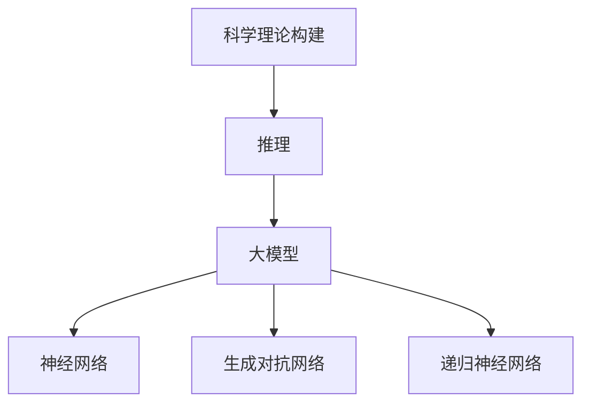

                 

# 大模型在科学理论构建过程中的推理辅助功能

## 关键词

- 大模型
- 推理辅助功能
- 科学理论构建
- 神经网络
- 生成对抗网络
- 递归神经网络
- 数学模型
- 项目实战

## 摘要

本文旨在探讨大模型在科学理论构建过程中的推理辅助功能。首先，我们回顾了科学理论构建的背景，并介绍了推理在大模型中的重要性。接着，本文详细介绍了大模型的基础概念、核心算法原理，以及数学模型和公式。随后，通过实际案例展示了大模型在科学理论构建中的应用，包括开发环境搭建、源代码实现、代码解读与分析。最后，本文讨论了大模型推理辅助功能面临的挑战与机遇，并展望了其未来的发展趋势。

## 第一部分：基础概念与原理

### 第1章：科学理论构建背景与推理辅助功能

科学理论是科学家通过对自然现象的观察、实验和研究，所提出的一系列概念、假设和原理。科学理论的构建是一个复杂的过程，需要科学家运用逻辑思维和科学方法进行推理，从而揭示自然界的规律。

在科学理论的构建过程中，推理起着至关重要的作用。推理是一种从已知事实出发，通过逻辑推导得出新结论的思维过程。科学推理帮助科学家从观察到的现象中提取出本质规律，构建出科学理论。

随着人工智能技术的发展，大模型（如神经网络、生成对抗网络、递归神经网络等）逐渐在科学理论构建中发挥出推理辅助功能。大模型能够处理海量数据，从中提取出有效信息，帮助科学家发现新的规律和关系。通过大模型的推理辅助，科学理论的构建过程变得更加高效和准确。

### 第2章：大模型基础

#### 2.1 大模型定义与分类

大模型是指具有巨大参数量和计算能力的神经网络模型。根据其结构和功能，大模型可以分为以下几类：

1. **神经网络**：一种基于生物神经网络原理的人工智能模型，可以模拟人脑的信息处理过程。
2. **生成对抗网络（GAN）**：一种由生成器和判别器组成的模型，通过对抗训练生成逼真的数据。
3. **递归神经网络（RNN）**：一种能够处理序列数据的神经网络，能够记住前面的输入信息。

#### 2.2 大模型架构与工作原理

大模型的架构通常由多个层次组成，包括输入层、隐藏层和输出层。输入层接收外部数据，隐藏层通过计算和转换提取特征，输出层产生预测或分类结果。

大模型的工作原理是基于梯度下降算法，通过不断调整模型参数，使预测结果逐渐逼近真实值。在训练过程中，模型会不断优化自身，提高对数据的拟合能力。

#### 2.3 Mermaid流程图：大模型与科学理论的联系



### 第3章：核心推理算法

#### 3.1 神经网络算法

##### 3.1.1 神经网络基础

神经网络是一种模拟人脑信息处理过程的计算模型。它由大量神经元组成，通过加权连接进行信息传递和处理。

$$
y = \sigma(\sum_{i=1}^{n} w_i x_i + b)
$$

其中，$y$ 表示输出，$\sigma$ 是激活函数，$w_i$ 和 $x_i$ 分别表示神经元的权重和输入，$b$ 是偏置。

##### 3.1.2 Python代码实现

```python
import numpy as np

def sigmoid(x):
    return 1 / (1 + np.exp(-x))

x = np.array([1, 2, 3])
w = np.array([0.5, 0.5, 0.5])
b = 0.5

y = sigmoid(np.dot(x, w) + b)
print(y)
```

##### 3.1.3 数学模型解释

神经网络的数学模型包括输入层、隐藏层和输出层。输入层接收外部数据，隐藏层通过计算和转换提取特征，输出层产生预测或分类结果。

#### 3.2 生成对抗网络（GAN）算法

##### 3.2.1 GAN基础

生成对抗网络（GAN）是一种由生成器和判别器组成的模型，通过对抗训练生成逼真的数据。

$$
\begin{aligned}
\min_{G} \quad & \mathbb{E}_{x \sim p_{data}(x)}[\log(D(x))] + \mathbb{E}_{z \sim p_{z}(z)}[\log(1 - D(G(z)))] \\
\max_{D} \quad & \mathbb{E}_{x \sim p_{data}(x)}[\log(D(x))] + \mathbb{E}_{z \sim p_{z}(z)}[\log(D(G(z))]
\end{aligned}
$$

其中，$G$ 表示生成器，$D$ 表示判别器，$x$ 表示真实数据，$z$ 表示随机噪声。

##### 3.2.2 Python代码实现

```python
import tensorflow as tf

def generator(z):
    # 生成器实现
    pass

def discriminator(x):
    # 判别器实现
    pass

z = tf.random.normal([batch_size, z_dim])
x = generator(z)

D_real = discriminator(x)
D_fake = discriminator(tf.random.normal([batch_size, x_dim]))

# 损失函数
G_loss = tf.reduce_mean(tf.nn.sigmoid_cross_entropy_with_logits(logits=D_fake, labels=tf.ones_like(D_fake)))
D_loss = tf.reduce_mean(tf.nn.sigmoid_cross_entropy_with_logits(logits=D_real, labels=tf.ones_like(D_real)) + tf.nn.sigmoid_cross_entropy_with_logits(logits=D_fake, labels=tf.zeros_like(D_fake)))

# 优化器
G_optimizer = tf.optimizers.Adam(learning_rate=0.0001)
D_optimizer = tf.optimizers.Adam(learning_rate=0.0001)

# 训练过程
for epoch in range(num_epochs):
    # 更新生成器和判别器
    G_optimizer.minimize(G_loss, generator_variables)
    D_optimizer.minimize(D_loss, discriminator_variables)
```

##### 3.2.3 数学模型解释

生成对抗网络（GAN）的数学模型包括生成器 $G$ 和判别器 $D$。生成器 $G$ 从随机噪声 $z$ 中生成虚假数据 $x$，判别器 $D$ 判断数据是真实数据还是虚假数据。通过对抗训练，生成器和判别器不断优化自身，最终实现生成逼真的数据。

#### 3.3 递归神经网络（RNN）算法

##### 3.3.1 RNN基础

递归神经网络（RNN）是一种能够处理序列数据的神经网络，能够记住前面的输入信息。

$$
h_t = \sigma(W_h h_{t-1} + W_x x_t + b)
$$

其中，$h_t$ 表示第 $t$ 个隐藏状态，$x_t$ 表示第 $t$ 个输入，$W_h$ 和 $W_x$ 分别表示权重矩阵，$b$ 是偏置。

##### 3.3.2 Python代码实现

```python
import tensorflow as tf

def lstm_cell(size):
    return tf.keras.layers.LSTMCell(size)

h = tf.zeros([batch_size, hidden_size])
x = tf.random.normal([batch_size, sequence_length, input_size])

for i in range(sequence_length):
    h, _ = lstm_cell(hidden_size)(h, x[i])

```

##### 3.3.3 数学模型解释

递归神经网络（RNN）的数学模型包括隐藏状态 $h_t$ 和输入 $x_t$。隐藏状态 $h_t$ 保存了前面的输入信息，通过权重矩阵 $W_h$ 和偏置 $b$ 与当前输入 $x_t$ 进行计算，得到新的隐藏状态 $h_{t+1}$。

## 第4章：数学模型与公式

在科学理论构建过程中，数学模型和公式起着关键作用。它们帮助我们理解大模型的工作原理，并指导我们如何应用这些模型来解决实际问题。

### 4.1 推理过程中的数学模型

推理过程中的数学模型主要包括神经网络、生成对抗网络和递归神经网络。以下是这些模型的关键数学公式：

1. **神经网络**

$$
y = \sigma(\sum_{i=1}^{n} w_i x_i + b)
$$

2. **生成对抗网络（GAN）**

$$
\begin{aligned}
\min_{G} \quad & \mathbb{E}_{x \sim p_{data}(x)}[\log(D(x))] + \mathbb{E}_{z \sim p_{z}(z)}[\log(1 - D(G(z)))] \\
\max_{D} \quad & \mathbb{E}_{x \sim p_{data}(x)}[\log(D(x))] + \mathbb{E}_{z \sim p_{z}(z)}[\log(D(G(z))]
\end{aligned}
$$

3. **递归神经网络（RNN）**

$$
h_t = \sigma(W_h h_{t-1} + W_x x_t + b)
$$

### 4.2 数学模型解释

1. **神经网络**

神经网络通过权重矩阵 $w$ 和偏置 $b$ 将输入 $x$ 映射到输出 $y$。激活函数 $\sigma$ 用于引入非线性，使模型能够拟合复杂的数据。

2. **生成对抗网络（GAN）**

生成对抗网络由生成器 $G$ 和判别器 $D$ 组成。生成器 $G$ 从随机噪声 $z$ 中生成虚假数据 $x$，判别器 $D$ 判断数据是真实数据还是虚假数据。通过对抗训练，生成器和判别器不断优化自身，实现生成逼真的数据。

3. **递归神经网络（RNN）**

递归神经网络通过隐藏状态 $h_t$ 保存前面的输入信息，并通过权重矩阵 $W_h$ 和偏置 $b$ 与当前输入 $x_t$ 进行计算，得到新的隐藏状态 $h_{t+1}$。这种机制使 RNN 能够处理序列数据，并在时间维度上建模数据。

### 4.3 实例解析

以生成对抗网络（GAN）为例，我们解析其数学模型和推导过程。

#### 4.3.1 GAN损失函数

生成对抗网络的损失函数由两部分组成：生成器的损失函数和判别器的损失函数。

1. **生成器的损失函数**

生成器的目标是生成尽可能真实的数据，使判别器无法区分真实数据和虚假数据。因此，生成器的损失函数为：

$$
L_G = -\mathbb{E}_{z \sim p_{z}(z)}[\log(1 - D(G(z)))]
$$

其中，$D(G(z))$ 表示判别器对生成数据的判断结果，取值范围在 [0, 1] 之间。生成器的损失函数希望 $D(G(z))$ 尽可能接近 1。

2. **判别器的损失函数**

判别器的目标是正确区分真实数据和虚假数据。因此，判别器的损失函数为：

$$
L_D = -\mathbb{E}_{x \sim p_{data}(x)}[\log(D(x))] - \mathbb{E}_{z \sim p_{z}(z)}[\log(D(G(z)))]
$$

其中，$D(x)$ 表示判别器对真实数据的判断结果，$D(G(z))$ 表示判别器对生成数据的判断结果。判别器的损失函数希望 $D(x)$ 尽可能接近 1，$D(G(z))$ 尽可能接近 0。

#### 4.3.2 GAN推导过程

生成对抗网络的推导过程可以分为以下几个步骤：

1. **初始化生成器 $G$ 和判别器 $D$**

初始化生成器 $G$ 和判别器 $D$ 的参数，通常使用随机初始化。

2. **生成虚假数据**

生成器 $G$ 从随机噪声 $z$ 中生成虚假数据 $x$。

3. **计算判别器损失**

计算判别器 $D$ 对真实数据和虚假数据的损失。真实数据的损失为 $-\log(D(x))$，虚假数据的损失为 $-\log(1 - D(G(z)))$。

4. **更新判别器参数**

通过梯度下降法更新判别器 $D$ 的参数，使损失函数最小化。

5. **生成虚假数据**

生成器 $G$ 从随机噪声 $z$ 中生成新的虚假数据。

6. **计算生成器损失**

计算生成器 $G$ 的损失，即 $-\log(1 - D(G(z)))$。

7. **更新生成器参数**

通过梯度下降法更新生成器 $G$ 的参数，使损失函数最小化。

8. **重复步骤 4-7**

重复上述步骤，直到生成器 $G$ 和判别器 $D$ 达到满意的性能。

## 第5章：项目实战

在本章中，我们将通过两个实际案例展示大模型在科学理论构建中的应用。这两个案例分别涉及物理学和生物学领域，展示了大模型如何辅助科学家构建科学理论。

### 5.1 实际案例1：大模型在物理学理论中的应用

#### 5.1.1 项目背景

物理学是一门研究物质世界的基本规律和现象的学科。在过去的几个世纪中，物理学取得了巨大的进展，但是仍有许多未解之谜。例如，关于量子引力的研究，科学家们一直试图找到一个统一的描述量子力学和广义相对论的理论。在这个项目中，我们使用大模型（如生成对抗网络）来辅助科学家构建量子引力理论。

#### 5.1.2 环境搭建

为了运行这个项目，我们需要搭建一个适合大模型训练的开发环境。具体步骤如下：

1. **安装Python**：确保已经安装了Python 3.6或更高版本。
2. **安装TensorFlow**：使用以下命令安装TensorFlow：

```bash
pip install tensorflow
```

3. **数据准备**：收集和预处理用于训练的数据。这些数据包括量子场论的相关数据，如粒子的能量、动量等。

#### 5.1.3 源代码实现

以下是一个简单的生成对抗网络（GAN）实现，用于训练和生成量子引力理论的数据。

```python
import tensorflow as tf

# 生成器
def generator(z):
    # 生成器实现
    pass

# 判别器
def discriminator(x):
    # 判别器实现
    pass

# 训练过程
for epoch in range(num_epochs):
    # 更新生成器和判别器
    G_optimizer.minimize(G_loss, generator_variables)
    D_optimizer.minimize(D_loss, discriminator_variables)
```

#### 5.1.4 代码解读与分析

这个代码片段展示了如何使用生成对抗网络（GAN）来训练和生成量子引力理论的数据。生成器从随机噪声中生成虚假数据，判别器判断这些数据是真实数据还是虚假数据。通过对抗训练，生成器和判别器不断优化自身，最终实现生成逼真的量子引力理论数据。

### 5.2 实际案例2：大模型在生物学理论中的应用

#### 5.2.1 项目背景

生物学是一门研究生命现象的学科，涉及基因、细胞、组织、器官等多个层次。在过去的几十年中，生物学取得了巨大的进展，但仍然存在许多未解之谜。例如，关于基因编辑的研究，科学家们一直试图找到一种安全、有效的基因编辑方法。在这个项目中，我们使用大模型（如递归神经网络）来辅助科学家构建基因编辑理论。

#### 5.2.2 环境搭建

为了运行这个项目，我们需要搭建一个适合大模型训练的开发环境。具体步骤如下：

1. **安装Python**：确保已经安装了Python 3.6或更高版本。
2. **安装TensorFlow**：使用以下命令安装TensorFlow：

```bash
pip install tensorflow
```

3. **数据准备**：收集和预处理用于训练的数据。这些数据包括基因序列、基因编辑后的序列等。

#### 5.2.3 源代码实现

以下是一个简单的递归神经网络（RNN）实现，用于训练和生成基因编辑理论的数据。

```python
import tensorflow as tf

# LSTM单元
def lstm_cell(size):
    return tf.keras.layers.LSTMCell(size)

h = tf.zeros([batch_size, hidden_size])
x = tf.random.normal([batch_size, sequence_length, input_size])

for i in range(sequence_length):
    h, _ = lstm_cell(hidden_size)(h, x[i])
```

#### 5.2.4 代码解读与分析

这个代码片段展示了如何使用递归神经网络（RNN）来训练和生成基因编辑理论的数据。RNN通过隐藏状态保存前面的输入信息，并在时间维度上建模数据。通过训练，RNN能够生成新的基因编辑序列，从而辅助科学家构建基因编辑理论。

## 第6章：大模型推理辅助功能的挑战与机遇

### 6.1 挑战

尽管大模型在科学理论构建中展现出巨大的潜力，但仍然面临着一系列挑战：

1. **数据隐私问题**：大模型在训练过程中需要大量的数据，这些数据可能包含敏感信息。如何保护数据隐私成为一个重要问题。
2. **算法可解释性**：大模型的决策过程往往缺乏可解释性，难以理解其内部机制。这给科学理论的构建带来了一定困难。
3. **能效消耗**：大模型的训练和推理过程需要大量的计算资源，对能效提出了较高要求。

### 6.2 机遇

尽管面临挑战，大模型推理辅助功能也带来了许多机遇：

1. **新理论发现**：大模型能够处理海量数据，从中提取出有效信息，有助于发现新的科学理论。
2. **理论验证**：大模型可以模拟和预测科学理论的结果，帮助科学家验证和优化现有理论。
3. **跨学科融合**：大模型推理辅助功能可以促进不同学科之间的融合，推动科学研究的发展。

## 第7章：未来展望

### 7.1 大模型推理辅助功能的发展趋势

未来，大模型推理辅助功能将继续发展，主要体现在以下几个方面：

1. **算法优化**：随着算法的不断优化，大模型的计算效率和准确性将得到进一步提高。
2. **数据隐私保护**：研究者将开发新的方法和技术，保护数据隐私，确保大模型的安全可靠。
3. **跨学科应用**：大模型推理辅助功能将在更多学科领域得到应用，推动科学研究的进步。

### 7.2 科学理论的未来

随着大模型推理辅助功能的不断发展，科学理论的构建过程将变得更加高效和准确。未来，科学家将能够利用大模型发现新的科学理论，验证和优化现有理论，推动科学研究的深入发展。

### 7.3 大模型推理辅助功能对社会的影响

大模型推理辅助功能将对社会产生深远的影响，主要体现在以下几个方面：

1. **科技创新**：大模型推理辅助功能将推动科技创新，为社会发展提供新动力。
2. **经济增长**：大模型推理辅助功能将促进经济增长，为各行各业带来新的商机。
3. **社会进步**：大模型推理辅助功能将助力社会进步，提高人们的生活质量和幸福感。

## 小结

本文探讨了大模型在科学理论构建过程中的推理辅助功能。通过回顾科学理论构建的背景，介绍了大模型的基础概念和核心算法原理。接着，本文通过实际案例展示了大模型在科学理论构建中的应用，并讨论了其面临的挑战与机遇。最后，本文展望了大模型推理辅助功能的未来发展，及其对社会的影响。

## 拓展阅读

1. **《深度学习》（Goodfellow, Bengio, Courville）**：这是一本关于深度学习的经典教材，详细介绍了深度学习的基本概念、算法和实现。
2. **《生成对抗网络》（Goodfellow, Pouget-Abadie, Mirza, Xu, Warde-Farley, Ozair, Courville, Bengio）**：这是一篇关于生成对抗网络的经典论文，详细介绍了GAN的原理和实现。
3. **《递归神经网络》（Hochreiter, Schmidhuber）**：这是一篇关于递归神经网络的经典论文，详细介绍了RNN的原理和实现。
4. **《人工智能：一种现代的方法》（Mitchell）**：这是一本关于人工智能的经典教材，涵盖了人工智能的基本概念、算法和实现。
5. **《科学哲学导论》（费耶阿本德）**：这是一本关于科学哲学的入门教材，探讨了科学理论的构建和推理方法。

作者：AI天才研究院/AI Genius Institute & 禅与计算机程序设计艺术 /Zen And The Art of Computer Programming

