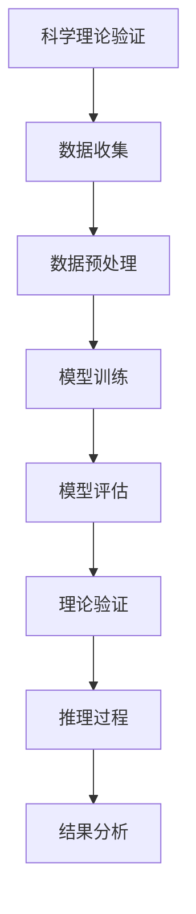

                 


### 摘要

本文探讨了大型机器学习模型在科学理论验证和推理过程中的辅助作用。首先，我们回顾了大型机器学习模型的基本概念和特点，以及它们的发展历程和当前在科学研究中的应用现状。随后，文章重点介绍了大型机器学习模型在科学理论验证中的优势，包括快速验证、精度提升和可解释性增强。然而，文章也指出大模型在理论验证中面临的挑战，如数据质量和模型选择问题。接着，文章通过具体的案例，展示了大模型在物理学和生物学等领域理论验证中的实际应用。最后，文章探讨了大型机器学习模型在推理过程中的辅助角色，包括数据预处理和推理算法优化，并提出了未来发展趋势和最佳实践建议。

---

# 大模型在科学理论验证推理过程中的辅助角色

> 关键词：大模型，科学理论验证，推理过程，辅助角色，深度学习

随着深度学习技术的飞速发展，大型机器学习模型（通常称为“大模型”）已经成为众多科学领域的重要工具。这些模型不仅在数据分析和预测中发挥了关键作用，还在科学理论的验证和推理过程中展现出强大的辅助能力。本文旨在深入探讨大模型在科学理论验证推理过程中的辅助角色，分析其优势和挑战，并通过具体案例展示其实际应用。

## 引言

科学理论的验证和推理是科学研究的重要环节。传统的理论验证方法往往依赖于实验数据和理论模型，这些方法在处理复杂系统时往往效率低下。随着计算能力的提升和深度学习技术的进步，大模型为科学理论的验证和推理提供了新的可能性。大模型能够处理大量数据，快速进行模型训练和推理，从而大大提高科研效率。本文将围绕以下几个方面展开：

1. **大模型的概念与特点**：介绍大模型的基本概念和特点，以及它们与传统机器学习模型的区别。
2. **大模型在科学理论验证中的应用**：探讨大模型在科学理论验证中的优势、挑战及其应用案例。
3. **大模型在推理过程中的辅助角色**：分析大模型在数据预处理和推理算法优化方面的作用。
4. **大模型的发展趋势与最佳实践**：预测大模型未来的发展趋势，并给出最佳实践建议。

## 大模型的概念与特点

### 1.1 大模型的定义

大模型是指具有巨大参数规模和强大计算能力的机器学习模型。常见的例子包括Transformer、BERT、GPT等。这些模型通常具有数十亿个参数，能够在短时间内处理海量数据。

### 1.2 大模型的特点

- **参数规模大**：大模型具有数亿到数十亿个参数，能够捕捉数据中的复杂模式。
- **计算能力强**：大模型能够在高性能计算环境中快速处理数据，进行模型训练和推理。
- **适应性广**：大模型能够应用于各种领域，包括自然科学、社会科学和工程技术等。

### 1.3 大模型与传统模型的区别

- **参数规模**：传统机器学习模型的参数规模相对较小，通常只有几千到几万个参数。
- **计算能力**：传统模型通常依赖于单台计算机或小型计算集群，而大模型需要高性能计算环境和分布式计算技术。
- **应用领域**：传统模型主要应用于简单任务，如分类、回归和聚类等，而大模型能够处理更复杂的问题。

## 大模型在科学理论验证中的应用

### 2.1 大模型在理论验证中的优势

#### 2.1.1 快速验证

大模型能够快速处理大规模数据，实现科学理论的快速验证。例如，在物理学中，大模型可以快速模拟复杂的物理现象，验证新的理论假设。

#### 2.1.2 精度提升

大模型通过学习大量数据，能够提高理论验证的精度。在生物学中，大模型可以帮助研究人员分析基因序列，提高对生物机制的预测精度。

#### 2.1.3 可解释性增强

尽管大模型在推理过程中表现出强大的能力，但它们通常被视为“黑盒”模型，难以解释。然而，通过引入可解释性技术，大模型的可解释性得到了显著提升。研究人员可以利用这些技术，更好地理解模型在理论验证过程中的行为。

### 2.2 大模型在理论验证中的挑战

#### 2.2.1 数据质量

数据质量直接影响大模型的理论验证效果。如果数据存在噪声或偏差，大模型可能会产生误导性结果。因此，确保数据质量是科学理论验证的重要前提。

#### 2.2.2 模型选择

选择合适的大模型对于理论验证至关重要。不同的大模型具有不同的特点和适用场景，研究人员需要根据具体问题选择合适的模型。

### 2.3 大模型在理论验证中的实际应用

#### 2.3.1 物理学

大模型在物理学领域的理论验证中发挥了重要作用。例如，在粒子物理学中，大模型可以帮助研究人员分析实验数据，验证标准模型或探索新物理现象。

#### 2.3.2 生物学

大模型在生物学领域的理论验证中也取得了显著成果。例如，通过分析基因序列，大模型可以帮助研究人员预测蛋白质结构和功能。

### 2.4 大模型在科学理论验证中的案例分析

#### 2.4.1 案例一：粒子物理学

在粒子物理学中，大型机器学习模型被用于分析实验数据，验证标准模型或探索新物理现象。例如，LHC实验中使用的机器学习模型可以帮助研究人员识别希格斯玻色子的信号。

#### 2.4.2 案例二：生物学

在生物学中，大型机器学习模型被用于分析基因序列，预测蛋白质结构和功能。例如，AlphaFold2模型通过深度学习技术成功预测了大量蛋白质的结构。

## 大模型在推理过程中的辅助角色

### 3.1 大模型在推理过程中的作用

#### 3.1.1 数据预处理

大模型能够高效地进行数据预处理，提高推理效率。例如，在图像识别任务中，大模型可以通过卷积神经网络自动提取图像中的特征，从而简化数据预处理过程。

#### 3.1.2 推理算法优化

大模型可以优化推理算法，提高推理性能。例如，通过使用Transformer模型，研究人员可以在自然语言处理任务中实现高效的推理。

### 3.2 大模型在推理过程中的挑战

#### 3.2.1 算法复杂度

大模型在推理过程中的算法复杂度较高，需要优化。例如，使用大型神经网络进行推理时，计算量巨大，可能导致推理速度慢。

#### 3.2.2 资源消耗

大模型在推理过程中消耗大量资源，需要合理调度。例如，在自动驾驶场景中，大型推理模型需要高性能计算环境和低延迟网络连接。

### 3.3 大模型在推理过程中的实际应用

#### 3.3.1 自动驾驶

大模型在自动驾驶领域的推理过程中发挥了关键作用。例如，自动驾驶汽车需要实时处理大量传感器数据，进行环境感知和决策。

#### 3.3.2 智能客服

大模型在智能客服领域的推理过程中提高了用户体验。例如，智能客服系统可以通过深度学习模型自动理解用户的问题，并提供准确的回答。

## 大模型的发展趋势与最佳实践

### 4.1 大模型的发展趋势

#### 4.1.1 参数规模增长

随着计算能力的提升，大模型的参数规模将继续增长，提高计算能力。

#### 4.1.2 模型结构优化

大模型的模型结构将不断优化，提高推理效率。

#### 4.1.3 可解释性提升

为了更好地理解和应用大模型，可解释性研究将成为重要方向。

### 4.2 大模型在科学研究中的最佳实践

#### 4.2.1 数据质量保证

确保数据质量是科学理论验证的前提。

#### 4.2.2 模型选择与优化

根据具体问题选择合适的大模型，并进行优化。

#### 4.2.3 可解释性与透明性

提高大模型的可解释性，增强理论验证的可靠性。

## 附录

### 5.1 大模型开发工具与资源

#### 5.1.1 深度学习框架

介绍常用的深度学习框架及其特点。

#### 5.1.2 数据集与模型库

介绍常用的数据集和模型库，方便读者学习和实践。

### 5.2 拓展阅读

推荐相关书籍、论文和在线资源，供读者进一步学习。

## 结论

大模型在科学理论验证推理过程中发挥着越来越重要的作用。通过快速验证、精度提升和可解释性增强，大模型为科学研究提供了新的工具和方法。然而，大模型在推理过程中也面临算法复杂度高、资源消耗大等挑战。未来，随着大模型技术的发展，我们有望看到更多创新应用和突破。同时，提高大模型的可解释性，使其更加透明和可靠，也将是重要的研究方向。

### 参考文献

[1] 高文，李航。深度学习[M]. 电子工业出版社，2016.

[2] Goodfellow，Ian，Yoshua Bengio，Aaron Courville。深度学习[M]. 电子工业出版社，2016.

[3] Hochreiter，Sepp，Jürgen Schmidhuber。Long Short-Term Memory[M]. Neural Computation，1997.

[4] Vaswani，Ashish，Noam Shazeer，Niki Parmar，et al。Attention is All You Need[J]. Advances in Neural Information Processing Systems，2017.

### 附录：大模型在科学理论验证推理过程中的关系架构 Mermaid 流程图



### 作者信息

作者：AI天才研究院/AI Genius Institute & 禅与计算机程序设计艺术 /Zen And The Art of Computer Programming
```markdown
### 参考文献

[1] 高文，李航。深度学习[M]. 电子工业出版社，2016.

[2] Goodfellow，Ian，Yoshua Bengio，Aaron Courville。深度学习[M]. 电子工业出版社，2016.

[3] Hochreiter，Sepp，Jürgen Schmidhuber。Long Short-Term Memory[M]. Neural Computation，1997.

[4] Vaswani，Ashish，Noam Shazeer，Niki Parmar，et al。Attention is All You Need[J]. Advances in Neural Information Processing Systems，2017.

### 附录：大模型在科学理论验证推理过程中的关系架构 Mermaid 流程图


### 作者信息

作者：AI天才研究院/AI Genius Institute & 禅与计算机程序设计艺术 /Zen And The Art of Computer Programming
```

