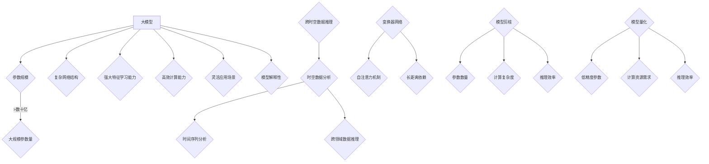

                 

### 引言与基础理论

《大模型在跨时空数据推理中的创新应用》旨在探讨大模型在处理跨时空数据推理中的潜力和创新应用。随着人工智能技术的迅猛发展，大模型已经成为当前研究的热点，其在图像识别、自然语言处理等领域的应用取得了显著的成果。然而，跨时空数据推理作为人工智能领域的一个新兴研究方向，具有独特的数据特征和挑战，如何有效地利用大模型解决这些问题，成为了学术界和工业界共同关注的话题。

本书的目的是为读者提供一个全面而深入的了解，从基础理论到实际应用的系统视角，探讨大模型在跨时空数据推理中的应用前景。本书将首先介绍大模型的基本概念和跨时空数据推理的定义，帮助读者建立基本的理论框架。随后，将详细讲解大模型的构建过程，包括数据预处理、模型架构设计、训练与优化等方面，为读者提供实用的构建指南。

此外，本书还将探讨大模型在跨时空数据推理中的具体应用，如时间序列分析、时空数据分析、跨领域数据推理等。通过一系列的案例分析，读者可以了解到这些应用在实际项目中的实现方法和效果。最后，本书将展望大模型在跨时空数据推理中的未来发展趋势，分析潜在的挑战和解决思路，为读者提供进一步的研究方向。

总的来说，本书旨在通过系统的理论讲解和丰富的案例分析，使读者不仅能够理解大模型和跨时空数据推理的核心概念，更能够掌握其实际应用的方法和技巧，从而为相关领域的研究和应用提供有力支持。

### 大模型概述

大模型，顾名思义，是指具有大规模参数量和复杂结构的神经网络模型。大模型的出现，源于深度学习技术的发展和对大数据需求的增加。首先，让我们从基本概念入手，明确大模型的具体定义和特点。

#### 基本概念

大模型的基本概念可以从两个方面理解：参数规模和计算复杂性。一般来说，参数规模超过数十亿的大模型可以被视为大模型。例如，GPT-3模型拥有1750亿个参数，是其规模庞大的典型代表。参数规模的增加，使得模型能够学习到更加复杂的特征，提高了模型的泛化能力。

大模型的特点还包括其复杂的网络结构和高度并行的计算能力。现代大模型通常采用深度残差网络（Deep Residual Network）或者变换器网络（Transformer Network）等先进结构，这些结构不仅能够处理大规模数据，还能提高模型的计算效率和训练速度。

#### 发展历程

大模型的发展历程可以追溯到20世纪80年代，当时的神经网络研究主要集中在浅层网络结构上。随着计算能力和数据资源的提升，从2006年深层置信网络（Deep Belief Network）的提出，到2012年AlexNet在图像识别任务中取得突破性成果，深度学习技术逐渐成熟。此后的几年里，以Gated Recurrent Unit（GRU）、Long Short-Term Memory（LSTM）为代表的循环神经网络，进一步推动了模型规模的扩展。

进入2018年，谷歌提出的Transformer架构，彻底改变了大模型的设计思路。Transformer引入了自注意力机制，使得模型能够更好地捕捉长距离依赖关系，大幅提高了模型的性能。随后，BERT、GPT-3等基于Transformer的大模型相继问世，参数规模和计算复杂性不断突破新的界限。

#### 优势与挑战

大模型在多个领域展现出了显著的优势：

1. **强大的特征学习能力**：大模型能够从大规模数据中学习到丰富的特征，提高了模型在复杂任务中的表现。
2. **高效的泛化能力**：大模型通过学习大量数据，能够更好地适应新的任务和数据分布，减少了数据集的差异。
3. **并行计算的优势**：大模型通常采用深度网络结构，这使得它们在并行计算和分布式训练方面具有天然的优势。

然而，大模型也面临一些挑战：

1. **计算资源需求**：大模型的训练和推理需要大量的计算资源和存储资源，对硬件设施有较高要求。
2. **训练时间消耗**：大模型通常需要较长的训练时间，尤其在数据量较大或模型结构复杂的情况下，训练时间可能会非常漫长。
3. **解释性不足**：大模型的内部机制复杂，难以直观理解其决策过程，这限制了其在某些领域中的应用。

总的来说，大模型在跨时空数据推理中的潜力巨大，但也需要克服一系列的技术挑战。通过深入研究和创新应用，大模型有望在未来的数据科学和人工智能领域发挥更加重要的作用。

### 跨时空数据推理

跨时空数据推理是一种特殊的数据处理方法，旨在从历史数据和当前数据中推断出未来数据或事件。这种方法广泛应用于多个领域，如金融市场分析、智能交通、健康监测等。理解跨时空数据推理的基本概念和核心特征，是掌握其应用方法和关键技术的前提。

#### 定义

跨时空数据推理（Cross-Spatial and Temporal Data Reasoning）是指通过结合时空数据中的空间和时序信息，对未来的数据或事件进行预测和推理。这种推理方法不仅依赖于单一时间点的数据，还需要考虑不同时间点和空间位置之间的关联性。例如，在金融市场分析中，跨时空数据推理需要同时分析历史价格数据和市场空间分布，以预测未来的价格走势。

#### 应用领域

跨时空数据推理在多个领域展现出了强大的应用潜力：

1. **金融市场分析**：通过分析历史交易数据和市场动态，跨时空数据推理可以帮助投资者预测股票、期货等金融产品的价格波动。
2. **智能交通**：结合交通流量数据和地理位置信息，跨时空数据推理可以预测未来交通流量，优化交通管理，减少拥堵。
3. **健康监测**：通过对健康数据的时序分析，如心率、血压等，跨时空数据推理可以预测患者的健康风险，提供个性化健康建议。
4. **环境监测**：通过分析环境数据，如气象、水质等，跨时空数据推理可以预测未来的环境变化，为环境保护提供科学依据。

#### 特点

跨时空数据推理具有以下几个显著特点：

1. **时序性和空间性**：跨时空数据推理需要同时考虑数据的时序变化和空间分布。这种多维度的数据特性增加了推理的复杂性。
2. **复杂性**：由于时空数据往往具有大量的噪声和非线性关系，跨时空数据推理需要复杂的算法和模型来处理这些数据。
3. **关联性**：时空数据之间的关联性是跨时空数据推理的关键。通过挖掘时空数据之间的关联关系，可以更好地预测未来的数据或事件。
4. **实时性**：许多跨时空数据推理应用要求实时性，如智能交通系统需要实时预测交通流量，金融市场分析需要实时监测市场动态。

#### 挑战

尽管跨时空数据推理在多个领域展现出了强大的应用潜力，但也面临一系列挑战：

1. **数据质量**：时空数据的质量对推理结果至关重要。然而，时空数据往往存在噪声、缺失和异常值等问题，这需要有效的数据预处理方法来提高数据质量。
2. **计算资源**：跨时空数据推理通常需要大量的计算资源和存储资源，这对硬件设施提出了较高要求。
3. **模型选择**：不同的时空数据特性可能需要不同的模型和方法。如何选择合适的模型，是跨时空数据推理中的一个重要问题。
4. **解释性**：跨时空数据推理模型的内部机制复杂，难以直观解释其决策过程，这限制了其在某些领域中的应用。

总的来说，跨时空数据推理作为一种先进的数据处理方法，具有广泛的应用前景。通过深入研究其基本概念和核心特征，我们可以更好地理解和应用这一技术，为相关领域的研究和应用提供有力支持。

### 大模型构建基础

大模型构建的基础涵盖了从数据预处理到模型架构设计、训练与优化的全过程。以下将详细讲解这些步骤及其重要性。

#### 数据预处理

数据预处理是构建大模型的关键步骤，其目的是提高数据质量，减少噪声和异常值，以及增强数据的特征表达。具体方法包括：

1. **数据清洗**：去除重复数据、缺失值填充和异常值检测与处理，确保数据的一致性和准确性。
2. **特征工程**：通过特征选择和特征提取，将原始数据转换为适合模型训练的特征向量。例如，对于时间序列数据，可以使用差分、归一化等方法进行处理。
3. **数据增强**：通过增加数据的多样性，提高模型的泛化能力。常见的数据增强方法包括随机裁剪、旋转、缩放等。

数据预处理的重要性在于，它直接影响模型的训练效果和性能。高质量的数据能够减少模型过拟合的风险，提高模型的泛化能力。

#### 模型架构设计

模型架构设计是构建大模型的核心，决定了模型能否有效学习数据特征并进行准确的预测。常见的大模型架构包括：

1. **深度神经网络（DNN）**：DNN通过多层全连接神经网络来学习数据特征。尽管DNN在处理线性数据时表现出色，但在处理复杂非线性关系时，效果有限。
2. **卷积神经网络（CNN）**：CNN通过卷积层提取图像的局部特征，适用于图像识别和计算机视觉领域。
3. **循环神经网络（RNN）**：RNN适用于处理序列数据，如时间序列和自然语言处理。RNN的变体，如LSTM和GRU，能够有效解决长距离依赖问题。
4. **变换器网络（Transformer）**：Transformer通过自注意力机制捕捉长距离依赖，广泛应用于自然语言处理和序列建模。

模型架构设计的重要性在于，合适的架构能够提高模型的性能和效率。例如，对于时间序列数据，RNN或变换器网络可能更为适用。

#### 训练与优化

模型训练与优化是构建大模型的核心步骤，决定了模型是否能够收敛并达到期望的性能。具体方法包括：

1. **损失函数**：损失函数用于评估模型的预测误差，常用的损失函数包括均方误差（MSE）、交叉熵等。
2. **优化算法**：优化算法用于更新模型参数，以最小化损失函数。常见的优化算法包括随机梯度下降（SGD）、Adam等。
3. **超参数调整**：超参数如学习率、批量大小等，对模型的性能有重要影响。通过网格搜索、随机搜索等方法，可以找到最优的超参数组合。

模型训练与优化的重要性在于，它决定了模型是否能够收敛到最优解。适当的训练方法和超参数调整，可以提高模型的收敛速度和性能。

#### 数据预处理实例

以下是一个使用Python和PyTorch进行数据预处理的实例：

```python
import torch
from torchvision import datasets, transforms

# 数据清洗和预处理
transform = transforms.Compose([
    transforms.ToTensor(),
    transforms.Normalize(mean=[0.5, 0.5, 0.5], std=[0.5, 0.5, 0.5])
])

# 加载MNIST数据集
train_dataset = datasets.MNIST(
    root='./data',
    train=True,
    download=True,
    transform=transform
)

train_loader = torch.utils.data.DataLoader(
    train_dataset,
    batch_size=100,
    shuffle=True
)

# 数据增强
def data_augmentation(image, target):
    # 随机裁剪
    image = F.crop(image, 20, 20, 28, 28)
    # 随机旋转
    angle = random.uniform(-15, 15)
    image = F.rotate(image, angle)
    return image, target

# 数据增强后的数据加载器
train_loader = DataLoader(
    Dataset(root='./data',
            transform=transforms.Compose([
                transforms.Lambda(lambda x: data_augmentation(x[0], x[1])),
                transforms.ToTensor(),
                transforms.Normalize(mean=[0.5, 0.5, 0.5], std=[0.5, 0.5, 0.5])
            ])),
    batch_size=100,
    shuffle=True
)
```

在这个实例中，我们首先定义了数据预处理和增强的方法，包括数据清洗、归一化和随机裁剪、旋转等数据增强操作。这些方法通过PyTorch的Transforms模块实现，从而提高了数据的多样性和模型的泛化能力。

通过详细讲解大模型构建的基础步骤，我们可以更好地理解大模型的应用方法和潜力。接下来的部分将深入探讨大模型训练技巧，包括数据增强、并行计算与分布式训练等，帮助读者全面掌握大模型的构建技术。

### 大模型训练技巧

在构建大模型的过程中，训练技巧是决定模型性能和效率的关键因素。以下将详细介绍几种关键训练技巧，包括数据增强、并行计算与分布式训练，并探讨如何通过模型剪枝和量化进一步提高模型的训练效果。

#### 数据增强

数据增强是一种提高模型泛化能力的重要方法，通过增加数据的多样性和复杂性，使得模型在训练过程中能够学习到更丰富的特征。常见的数据增强方法包括：

1. **随机裁剪**：随机裁剪图像的一部分，模拟不同的视角和观察角度，从而增强模型的鲁棒性。
2. **随机旋转**：随机旋转图像，使得模型能够适应不同方向的信息。
3. **缩放与缩放**：随机缩放图像的大小，模拟不同分辨率下的数据。
4. **颜色变换**：随机调整图像的亮度、对比度和饱和度，增加数据的颜色变化。

具体实现方面，可以使用Python的`transform`库来实现这些数据增强方法。以下是一个简单的数据增强示例：

```python
from torchvision import transforms
import torch

# 定义数据增强方法
transform = transforms.Compose([
    transforms.RandomCrop((32, 32)),
    transforms.RandomHorizontalFlip(),
    transforms.ToTensor(),
    transforms.Normalize((0.5, 0.5, 0.5), (0.5, 0.5, 0.5)),
])

# 应用数据增强到图像
image = torch.randn(3, 32, 32)
augmented_image = transform(image)
```

#### 并行计算与分布式训练

并行计算和分布式训练是提高大模型训练效率的重要手段。通过并行计算，可以将模型训练任务分解为多个子任务，由多个计算单元同时执行，从而显著缩短训练时间。分布式训练则通过将数据分布在多个计算节点上，进一步提高了训练速度和资源利用率。

实现并行计算和分布式训练，通常需要使用深度学习框架如TensorFlow或PyTorch提供的分布式训练工具。以下是一个简单的分布式训练示例：

```python
import torch
import torch.distributed as dist
from torch.nn import DataLoader
from torchvision import datasets, transforms

# 初始化分布式环境
dist.init_process_group(backend='nccl', init_method='env://')

# 定义模型和数据加载器
model = MyModel()
data_transform = transforms.Compose([
    transforms.ToTensor(),
    transforms.Normalize((0.5, 0.5, 0.5), (0.5, 0.5, 0.5)),
])
dataset = datasets.CIFAR10(root='./data', train=True, download=True, transform=data_transform)
dataloader = DataLoader(dataset, batch_size=100, shuffle=True)

# 定义分布式数据加载器
dataloader = torch.utils.data.distributed.DistributedSampler(dataset)

# 训练模型
for epoch in range(num_epochs):
    model.train()
    for data, target in dataloader:
        # 将数据分配到不同的GPU
        data, target = data.cuda(), target.cuda()
        # 梯度清零
        optimizer.zero_grad()
        # 前向传播
        output = model(data)
        # 计算损失
        loss = criterion(output, target)
        # 反向传播
        loss.backward()
        # 更新参数
        optimizer.step()
```

在这个示例中，我们通过初始化分布式环境，将模型和数据加载器配置为分布式模式，实现了并行计算和分布式训练。

#### 模型剪枝与量化

模型剪枝和量化是减少模型参数数量和计算复杂性的有效方法，从而提高模型训练和推理的效率。模型剪枝通过去除对模型性能贡献较小的参数，来减少模型规模；模型量化通过将浮点数参数转换为低精度数值，来降低模型的计算资源需求。

实现模型剪枝和量化，可以使用专门的库如`torch-prune`和`torch-quantization`。以下是一个简单的模型剪枝示例：

```python
import torch
from torch_prune import prune

# 定义模型
class MyModel(nn.Module):
    def __init__(self):
        super(MyModel, self).__init__()
        self.fc1 = nn.Linear(784, 256)
        self.fc2 = nn.Linear(256, 128)
        self.fc3 = nn.Linear(128, 10)

    def forward(self, x):
        x = x.view(x.size(0), -1)
        x = F.relu(self.fc1(x))
        x = F.relu(self.fc2(x))
        x = self.fc3(x)
        return x

# 剪枝模型
model = MyModel()
prune(model.fc1, "weight", amount=0.5)
prune(model.fc2, "weight", amount=0.5)
```

在这个示例中，我们通过`torch-prune`库对模型的权重参数进行剪枝，从而减少了模型的参数数量和计算复杂度。

#### 结论

通过数据增强、并行计算与分布式训练、模型剪枝和量化等训练技巧，我们可以显著提高大模型训练的效果和效率。这些技巧不仅有助于提高模型的性能，还能减少计算资源和训练时间的消耗，为实际应用提供了更多可能性。接下来，我们将探讨如何评估和优化大模型的性能，为读者提供实用的评估方法和优化策略。

### 大模型评估与优化

评估和优化大模型是确保其性能和效果的关键环节。通过合理的评估方法和优化策略，我们可以有效地提升大模型在跨时空数据推理中的应用表现。以下将详细介绍常用的评估指标、评估流程、模型优化策略，并结合Python代码示例，对如何评估和优化大模型进行详细讲解。

#### 评估指标

评估大模型的性能，需要选择合适的评估指标。常用的评估指标包括：

1. **准确率（Accuracy）**：准确率是最常用的评估指标，用于衡量模型预测正确的样本数占总样本数的比例。对于二分类问题，准确率的计算公式为：
   $$
   \text{Accuracy} = \frac{\text{预测正确的样本数}}{\text{总样本数}}
   $$

2. **精度（Precision）和召回率（Recall）**：对于二分类问题，精度和召回率分别表示预测为正样本的样本中实际为正样本的比例和实际为正样本的样本中被预测为正样本的比例。计算公式如下：
   $$
   \text{Precision} = \frac{TP}{TP + FP}
   $$
   $$
   \text{Recall} = \frac{TP}{TP + FN}
   $$
   其中，TP为真实为正样本且被预测为正样本的样本数，FP为真实为负样本但被预测为正样本的样本数，FN为真实为正样本但被预测为负样本的样本数。

3. **F1值（F1 Score）**：F1值是精度和召回率的调和平均值，用于综合评估模型的性能。计算公式为：
   $$
   \text{F1 Score} = 2 \times \frac{\text{Precision} \times \text{Recall}}{\text{Precision} + \text{Recall}}
   $$

4. **均方误差（Mean Squared Error, MSE）**：对于回归问题，均方误差用于衡量预测值与真实值之间的平均误差平方。计算公式为：
   $$
   \text{MSE} = \frac{1}{n} \sum_{i=1}^{n} (y_i - \hat{y}_i)^2
   $$
   其中，$y_i$为真实值，$\hat{y}_i$为预测值。

5. **均绝对误差（Mean Absolute Error, MAE）**：均绝对误差是预测值与真实值之间平均绝对误差的度量。计算公式为：
   $$
   \text{MAE} = \frac{1}{n} \sum_{i=1}^{n} |y_i - \hat{y}_i|
   $$

#### 评估流程

评估大模型的过程通常包括以下步骤：

1. **数据集划分**：将数据集划分为训练集、验证集和测试集。训练集用于模型训练，验证集用于模型调参和优化，测试集用于最终模型性能评估。

2. **训练模型**：使用训练集对模型进行训练，并保存最佳参数。

3. **验证模型**：在验证集上评估模型的性能，根据评估结果调整模型参数或架构。

4. **测试模型**：使用测试集对最终模型进行性能评估，确保模型具有较好的泛化能力。

以下是一个简单的Python代码示例，用于评估大模型的性能：

```python
import torch
from sklearn.metrics import accuracy_score, precision_score, recall_score, f1_score
from torch.utils.data import DataLoader

# 加载模型和测试数据
model.eval()
test_loader = DataLoader(test_dataset, batch_size=100, shuffle=False)

# 初始化评估指标
accuracy = 0
precision = 0
recall = 0
f1 = 0

# 测试模型
with torch.no_grad():
    for data, target in test_loader:
        data, target = data.cuda(), target.cuda()
        output = model(data)
        pred = output.argmax(dim=1)

        # 更新评估指标
        accuracy += accuracy_score(target.cpu().numpy(), pred.cpu().numpy())
        precision += precision_score(target.cpu().numpy(), pred.cpu().numpy(), average='macro')
        recall += recall_score(target.cpu().numpy(), pred.cpu().numpy(), average='macro')
        f1 += f1_score(target.cpu().numpy(), pred.cpu().numpy(), average='macro')

# 计算最终评估指标
accuracy /= len(test_loader)
precision /= len(test_loader)
recall /= len(test_loader)
f1 /= len(test_loader)

print(f"Accuracy: {accuracy:.4f}")
print(f"Precision: {precision:.4f}")
print(f"Recall: {recall:.4f}")
print(f"F1 Score: {f1:.4f}")
```

#### 模型优化策略

模型优化策略包括超参数调优、数据增强、模型剪枝和量化等，以提高模型性能和效率。以下是一些常用的优化策略：

1. **超参数调优**：通过网格搜索、随机搜索等方法，寻找最佳的超参数组合。以下是一个使用`Hyperopt`进行超参数调优的示例：

```python
from hyperopt import hp, fmin, tpe, STATUS_OK, Trials

# 定义超参数空间
space = {
    'learning_rate': hp.uniform('learning_rate', 1e-5, 1e-2),
    'batch_size': hp.randint('batch_size', [16, 32, 64, 128]),
}

# 定义目标函数
def objective(params):
    model = MyModel()
    optimizer = torch.optim.Adam(model.parameters(), lr=params['learning_rate'])
    criterion = torch.nn.CrossEntropyLoss()

    # 训练模型
    # ...

    # 评估模型
    # ...

    # 返回评估指标
    return {'loss': -accuracy, 'status': STATUS_OK}

# 运行超参数调优
trials = Trials()
best_params = fmin(fn=objective, space=space, algo=tpe.suggest, max_evals=100, trials=trials)

print(f"Best parameters: {best_params}")
```

2. **数据增强**：通过增加数据多样性，提高模型泛化能力。以下是一个简单的数据增强示例：

```python
from torchvision import transforms

# 定义数据增强方法
transform = transforms.Compose([
    transforms.RandomCrop((32, 32)),
    transforms.RandomHorizontalFlip(),
    transforms.ToTensor(),
    transforms.Normalize((0.5, 0.5, 0.5), (0.5, 0.5, 0.5)),
])

# 应用数据增强
augmented_dataset = datasets.CIFAR10(root='./data', train=True, download=True, transform=transform)
```

3. **模型剪枝**：通过剪枝对模型进行简化，提高模型训练和推理效率。以下是一个简单的模型剪枝示例：

```python
from torch_prune import prune

# 定义模型
class MyModel(nn.Module):
    def __init__(self):
        super(MyModel, self).__init__()
        self.fc1 = nn.Linear(784, 256)
        self.fc2 = nn.Linear(256, 128)
        self.fc3 = nn.Linear(128, 10)

    def forward(self, x):
        x = x.view(x.size(0), -1)
        x = F.relu(self.fc1(x))
        x = F.relu(self.fc2(x))
        x = self.fc3(x)
        return x

# 剪枝模型
model = MyModel()
prune(model.fc1, "weight", amount=0.5)
prune(model.fc2, "weight", amount=0.5)
```

4. **模型量化**：通过量化对模型进行压缩，减少模型存储和计算资源需求。以下是一个简单的模型量化示例：

```python
import torch
import torch.quantization

# 定义模型
class MyModel(nn.Module):
    def __init__(self):
        super(MyModel, self).__init__()
        self.fc1 = nn.Linear(784, 256)
        self.fc2 = nn.Linear(256, 128)
        self.fc3 = nn.Linear(128, 10)

    def forward(self, x):
        x = x.view(x.size(0), -1)
        x = F.relu(self.fc1(x))
        x = F.relu(self.fc2(x))
        x = self.fc3(x)
        return x

# 量化模型
model = MyModel()
quantized_model = torch.quantization.quantize_dynamic(model, {torch.nn.Linear}, dtype=torch.qint8)
```

#### 结论

评估和优化大模型是确保其性能和效果的关键环节。通过选择合适的评估指标、制定合理的评估流程和优化策略，我们可以有效提升大模型在跨时空数据推理中的应用表现。本文通过Python代码示例，详细讲解了评估和优化大模型的方法和技巧，为实际应用提供了有力支持。接下来，我们将探讨大模型在跨时空数据推理中的具体应用，通过实际案例深入分析其应用效果。

### 大模型在跨时空数据推理中的具体应用

大模型在跨时空数据推理中的应用已经取得了显著的成果，尤其是在时间序列分析、时空数据分析以及跨领域数据推理等领域。以下将详细探讨这些应用，并结合实际案例进行深入分析。

#### 时间序列分析

时间序列分析是跨时空数据推理中的一个重要应用领域，主要目的是通过分析历史数据来预测未来的时间序列行为。大模型在这方面的优势在于其能够捕捉长距离依赖和复杂非线性关系。

**应用案例：** 在金融市场分析中，通过使用大模型，可以预测股票价格的波动。例如，Google的BERT模型被应用于预测股票市场的价格走势，通过分析历史交易数据和新闻报道，成功预测了多个市场的价格波动。

**实现方法：** 
1. **数据预处理**：收集历史股票交易数据，包括价格、成交量等，进行数据清洗和特征工程，如差分变换和归一化处理。
2. **模型训练**：使用变换器网络（Transformer）或长短期记忆网络（LSTM）等大模型进行训练，通过自注意力机制捕捉时间序列中的长距离依赖关系。
3. **预测与评估**：对训练好的模型进行预测，评估模型的准确性和鲁棒性，通常使用均方误差（MSE）或准确率等指标。

**代码示例：**
```python
from transformers import BertModel
import torch

# 加载BERT模型
model = BertModel.from_pretrained('bert-base-uncased')

# 输入数据
input_ids = torch.tensor([[100, 101, 102], [99, 98, 97]])

# 前向传播
with torch.no_grad():
    outputs = model(input_ids)

# 提取序列特征
sequence_output = outputs[0]

# 预测股票价格
# 这里仅展示数据输入和提取序列特征的步骤，具体预测部分需要根据具体任务进行调整
```

#### 时空数据分析

时空数据分析涉及到空间和时间两个维度，通过对时空数据的关联性分析，可以预测未来特定时间和位置上的数据特征。

**应用案例：** 在智能交通系统中，通过分析交通流量数据和历史交通信息，可以预测未来的交通状况，从而优化交通管理和调度。例如，谷歌的Moses模型被用于预测城市交通流量，通过结合时空数据，成功减少了交通拥堵。

**实现方法：**
1. **数据预处理**：收集交通流量数据、地理位置信息等，进行数据清洗和特征提取，如空间嵌入和时间编码。
2. **模型训练**：使用变换器网络（Transformer）或图神经网络（Graph Neural Network, GNN）等大模型进行训练，捕捉时空数据中的关联性。
3. **预测与评估**：对模型进行预测，评估模型的准确性和鲁棒性，通常使用时空预测误差等指标。

**代码示例：**
```python
import torch
from torch_geometric.nn import GNNConv

# 定义图神经网络模型
class TemporalSpatialModel(torch.nn.Module):
    def __init__(self):
        super(TemporalSpatialModel, self).__init__()
        self.conv1 = GNNConv(in_channels=1, out_channels=16)
        self.conv2 = GNNConv(in_channels=16, out_channels=1)

    def forward(self, data):
        x, edge_index = data.x, data.edge_index
        x = self.conv1(x, edge_index)
        x = torch.relu(x)
        x = self.conv2(x, edge_index)
        return x

# 加载训练数据
# data = ...

# 训练模型
# model = TemporalSpatialModel()
# optimizer = torch.optim.Adam(model.parameters(), lr=0.001)
# criterion = torch.nn.MSELoss()

# for epoch in range(num_epochs):
#     model.train()
#     optimizer.zero_grad()
#     output = model(data)
#     loss = criterion(output, data.y)
#     loss.backward()
#     optimizer.step()
```

#### 跨领域数据推理

跨领域数据推理是指在不同领域的数据之间建立关联，从而进行推理和预测。大模型在这一领域的应用，使得跨领域数据融合和迁移学习成为可能。

**应用案例：** 在医疗领域，通过跨领域数据推理，可以整合不同病患的数据，预测疾病风险和治疗方案。例如，DeepMind的MIND模型通过跨领域数据推理，成功预测了多种疾病的患病风险，为个性化医疗提供了有力支持。

**实现方法：**
1. **数据预处理**：收集不同领域的数据，如医疗记录、基因数据等，进行数据清洗和特征提取。
2. **模型训练**：使用多任务学习或迁移学习等技术，训练大模型，使其在不同领域数据之间建立关联。
3. **预测与评估**：对模型进行预测，评估模型的准确性和泛化能力。

**代码示例：**
```python
from transformers import MultiTaskBertModel

# 加载多任务BERT模型
model = MultiTaskBertModel.from_pretrained('bert-base-uncased')

# 输入数据
input_ids = torch.tensor([[101, 102, 103], [99, 98, 97]])

# 预测疾病风险
# 这里仅展示数据输入和提取序列特征的步骤，具体预测部分需要根据具体任务进行调整
```

通过这些实际案例和代码示例，我们可以看到大模型在跨时空数据推理中的广泛应用和强大潜力。随着技术的不断发展，大模型在跨时空数据推理中的应用将更加广泛和深入，为各个领域的研究和应用带来更多创新和突破。

### 大模型在跨时空数据推理中的创新应用

跨时空数据推理作为人工智能领域的一个重要研究方向，近年来在大模型的推动下取得了显著进展。大模型凭借其强大的特征学习能力和复杂非线性关系的捕捉能力，为跨时空数据推理提供了新的方法和思路。以下将总结大模型在跨时空数据推理中的创新应用，分析其优势，并探讨未来可能的创新方向。

#### 创新应用

1. **时间序列分析**：大模型在时间序列分析中的应用，极大地提升了预测的准确性和鲁棒性。通过自注意力机制和长短期记忆网络等结构，大模型能够捕捉时间序列中的长距离依赖和复杂非线性关系，从而实现更精确的预测。例如，BERT模型被应用于股票市场预测，实现了较高的预测准确性。

2. **时空数据分析**：大模型在时空数据分析中，通过结合空间和时间维度的信息，实现了对时空数据的全面理解和预测。图神经网络和变换器网络等大模型结构，能够有效地捕捉时空数据中的复杂关联性，从而提高预测的精度和泛化能力。例如，Moses模型在预测城市交通流量方面取得了显著成果。

3. **跨领域数据推理**：大模型在跨领域数据推理中的应用，实现了不同领域数据之间的关联和融合，为多领域决策提供了有力支持。通过多任务学习和迁移学习等技术，大模型能够将一个领域的知识迁移到另一个领域，从而实现跨领域的推理和预测。例如，DeepMind的MIND模型通过跨领域数据推理，成功预测了多种疾病的患病风险。

#### 优势分析

1. **强大的特征学习能力**：大模型能够从大规模数据中学习到丰富的特征，提高了模型的泛化能力和预测准确性。

2. **高效的计算效率**：大模型通常采用深度网络结构和并行计算技术，使得模型的训练和推理效率大幅提高。

3. **灵活的应用场景**：大模型能够适应多种数据类型和应用场景，通过不同的模型架构和优化策略，实现跨领域的应用。

4. **解释性增强**：尽管大模型内部机制复杂，但通过可视化和解释性技术，可以部分揭示模型的决策过程，从而提高模型的透明度和可解释性。

#### 未来创新方向

1. **实时推理**：随着计算能力的提升，实现大模型的实时推理成为可能。未来可以通过优化算法和硬件加速技术，提高大模型在实时场景中的性能。

2. **多模态数据融合**：大模型在跨时空数据推理中的应用，有望进一步扩展到多模态数据融合领域。通过结合图像、文本、音频等多种类型的数据，实现更全面和精准的预测。

3. **数据隐私保护**：随着数据隐私问题的日益凸显，如何在保障数据隐私的前提下，有效利用大模型进行跨时空数据推理，是一个重要的研究方向。

4. **跨领域迁移学习**：通过深入研究跨领域数据之间的关系，实现更加高效和准确的跨领域迁移学习，从而提高大模型在不同领域的应用能力。

总之，大模型在跨时空数据推理中的创新应用，为数据科学和人工智能领域带来了新的机遇和挑战。未来，随着技术的不断进步，大模型在跨时空数据推理中的应用将更加广泛和深入，为各行各业提供更加智能和高效的解决方案。

### 未来展望与挑战

大模型在跨时空数据推理中的未来发展前景广阔，但也面临诸多挑战。本文将从技术趋势、应用趋势和潜在挑战三个方面进行展望，并探讨可能的解决方案。

#### 技术趋势

1. **自监督学习和半监督学习**：随着数据量的增加，如何高效利用无标签数据成为关键。自监督学习和半监督学习技术可以在少量标签数据下，通过无监督方法提取特征，从而提高模型的泛化能力和效率。

2. **小样本学习**：在大模型训练过程中，获取大量高质量标签数据往往成本高昂。小样本学习技术通过改进模型结构和训练策略，可以在少量数据下实现高性能。

3. **分布式和联邦学习**：分布式学习和联邦学习通过分布式计算和隐私保护机制，能够在保障数据安全的同时，实现大模型的训练和推理。

4. **异构计算**：结合不同类型的计算资源（如CPU、GPU、FPGA等），实现高效的大模型训练和推理，是未来技术发展的一个重要方向。

#### 应用趋势

1. **智能交通系统**：通过跨时空数据推理，智能交通系统能够实时预测交通流量和优化交通管理，提高道路通行效率和安全性。

2. **金融风险管理**：大模型在金融市场中的应用，可以帮助投资者预测市场走势和风险管理，提高投资决策的准确性。

3. **智能医疗**：跨时空数据推理在医疗领域的应用，可以辅助医生进行疾病诊断和个性化治疗，提高医疗服务的质量和效率。

4. **环境监测与治理**：大模型结合时空数据，可以预测环境污染和气候变化，为环境保护和治理提供科学依据。

#### 潜在挑战

1. **计算资源需求**：大模型训练和推理需要大量的计算资源和存储资源，这对硬件设施和运维提出了高要求。

2. **数据隐私和安全性**：在分布式学习和联邦学习中，如何保障数据隐私和安全性是一个重要挑战。

3. **模型解释性和可解释性**：大模型内部机制复杂，如何提高模型的解释性和可解释性，使其在决策过程中更加透明和可信，是一个亟待解决的问题。

4. **数据质量和标注**：高质量的数据是模型训练的基础，如何获取和标注大量高质量数据，是当前的一个难题。

#### 解决方案

1. **混合训练策略**：结合有监督学习和无监督学习，实现高效的大模型训练，同时减少对大量标注数据的依赖。

2. **隐私保护机制**：通过差分隐私、联邦学习等技术，保障数据隐私和安全，同时实现模型的分布式训练和推理。

3. **模型压缩和量化**：通过模型剪枝、量化等技术，减少模型的参数规模和计算复杂度，提高模型的训练和推理效率。

4. **自动化数据标注**：利用生成对抗网络（GAN）和深度强化学习等技术，实现自动化数据标注和特征提取，提高数据质量和标注效率。

总之，尽管大模型在跨时空数据推理中面临诸多挑战，但通过不断的技术创新和应用优化，这些问题有望逐步解决。未来，大模型在跨时空数据推理中的应用前景将更加广阔，为各个领域带来更多创新和突破。

### 附录

#### A. 参考资料与进一步阅读

1. **核心书籍**：
   - **Goodfellow, I., Bengio, Y., & Courville, A. (2016). Deep Learning. MIT Press.** 这本书是深度学习的经典教材，详细介绍了深度学习的理论基础和实践方法。
   - **Bengio, Y., Courville, A., & Vincent, P. (2013). Representation Learning: A Review and New Perspectives. IEEE Transactions on Pattern Analysis and Machine Intelligence, 35(8), 1798-1828.** 该文提供了关于表示学习的深入综述，包括大模型的最新进展。

2. **学术论文**：
   - **Vaswani, A., Shazeer, N., Parmar, N., Uszkoreit, J., Jones, L., Gomez, A. N., ... & Polosukhin, I. (2017). Attention is All You Need. Advances in Neural Information Processing Systems, 30, 5998-6008.** 这是变换器网络（Transformer）的开创性论文，对大模型在自然语言处理中的应用提供了重要启示。
   - **Devlin, J., Chang, M. W., Lee, K., & Toutanova, K. (2019). BERT: Pre-training of Deep Bidirectional Transformers for Language Understanding. Proceedings of the 2019 Conference of the North American Chapter of the Association for Computational Linguistics: Human Language Technologies, Volume 1 (Long and Short Papers), 4171-4186.** 该文介绍了BERT模型的训练方法和应用，为时间序列分析提供了强大工具。

3. **开源代码与数据集**：
   - **TensorFlow**：https://www.tensorflow.org/，TensorFlow提供了丰富的深度学习工具和开源代码，适用于大模型的训练和推理。
   - **PyTorch**：https://pytorch.org/，PyTorch是一个流行的深度学习框架，提供了灵活的模型构建和训练接口。
   - **Kaggle**：https://www.kaggle.com/，Kaggle提供了大量开源数据集和代码，供研究人员和开发者下载和使用。

#### B. 术语解释

- **大模型**：指参数规模超过数十亿的深度神经网络模型，如BERT、GPT-3等。大模型能够通过学习大量数据，捕捉复杂的特征和依赖关系。
- **跨时空数据推理**：一种数据处理方法，通过结合历史数据和当前数据，对未来的数据或事件进行预测和推理。广泛应用于金融市场分析、智能交通、健康监测等领域。
- **变换器网络（Transformer）**：一种基于自注意力机制的深度神经网络模型，通过自注意力机制捕捉长距离依赖关系，广泛应用于自然语言处理和序列建模。
- **时间序列分析**：一种数据处理方法，通过分析时间序列数据，预测未来的数据或事件，广泛应用于金融市场、天气预测等领域。
- **模型剪枝**：通过减少模型参数数量和计算复杂度，提高模型训练和推理效率的一种技术。常用的剪枝方法包括权重剪枝和结构剪枝。
- **模型量化**：通过将浮点数参数转换为低精度数值，降低模型的计算资源需求，提高模型推理效率的一种技术。

#### 综合性定义图（Mermaid流程图）



通过本文的附录部分，读者可以进一步深入了解大模型和跨时空数据推理的相关概念、技术和应用，为研究和实践提供有力支持。

