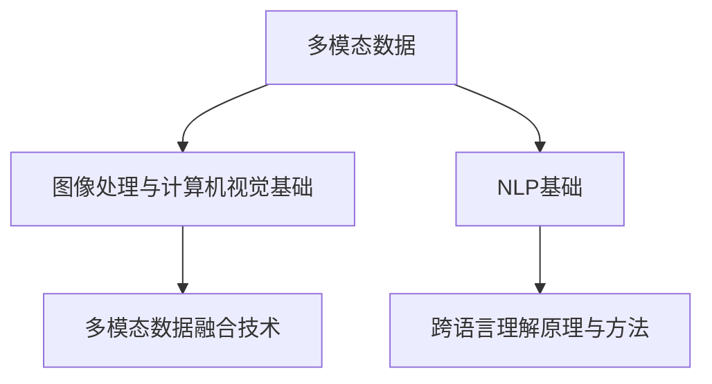

                 

# 大规模多模态预训练模型在跨语言理解中的应用

> 关键词：多模态预训练模型、跨语言理解、计算机视觉、自然语言处理、大规模预训练

> 摘要：本文深入探讨了大规模多模态预训练模型在跨语言理解中的应用。首先介绍了多模态预训练模型的基础概念和理论基础，随后详细阐述了大规模多模态预训练模型的架构设计、训练与优化方法。最后，本文通过实际案例展示了多模态预训练模型在跨语言图像文本任务和视觉问答任务中的具体应用，并对未来发展趋势进行了展望。

## 第一部分：多模态预训练模型概述

### 第1章：多模态预训练模型的基础概念

#### 1.1 多模态数据介绍

多模态数据是指由两种或两种以上不同类型的数据源组成的集合，例如图像、文本、音频、视频等。这些数据源可以来自不同的传感器或设备，例如摄像头、麦克风、屏幕等。多模态数据融合技术旨在将这些不同类型的数据进行整合，以提取更多的信息，提高系统的感知能力和理解能力。

#### 1.2 多模态预训练模型的发展历程

多模态预训练模型的发展历程可以分为几个阶段：

1. 单模态预训练：最早期的预训练模型主要是针对单模态数据，如文本或图像。通过在大规模数据集上进行预训练，模型可以学习到数据中的语言规律或视觉特征。

2. 初步的多模态预训练：随着深度学习技术的进步，研究者开始尝试将不同模态的数据进行融合，进行初步的多模态预训练。这些模型通过将图像特征和文本特征进行拼接或融合，从而提高了模型的跨模态理解能力。

3. 大规模多模态预训练：近年来，随着计算资源和数据集的不断增加，研究者开始探索大规模多模态预训练模型。这些模型通过在更大规模的多模态数据集上进行预训练，可以更好地捕获不同模态数据之间的关联性。

#### 1.3 多模态预训练模型的核心挑战

多模态预训练模型面临以下核心挑战：

1. 数据不均衡：不同模态的数据量往往不均衡，例如图像数据远多于文本数据。如何平衡不同模态的数据对模型的训练效果具有重要影响。

2. 模型设计：如何设计一个有效的模型结构，能够融合不同模态的数据，同时保持各个模态的特性，是一个重要的研究问题。

3. 预训练策略：如何设计有效的预训练策略，使得模型在多模态数据上能够达到更好的性能，是一个具有挑战性的问题。

#### 1.4 跨语言理解的多模态预训练模型需求

跨语言理解是指模型能够理解和处理不同语言之间的语义关系。在多语言环境中，跨语言理解具有很高的应用价值，例如机器翻译、跨语言检索等。多模态预训练模型在跨语言理解方面具有以下需求：

1. 跨语言数据：需要大量的跨语言多模态数据，以训练模型对不同语言的语义进行理解和建模。

2. 跨语言特征融合：如何将不同语言的文本特征进行有效融合，是一个关键问题。

3. 跨语言对比学习：通过对比不同语言的语义特征，可以提高模型在跨语言理解任务上的性能。

### 第2章：多模态预训练模型的理论基础

#### 2.1 图像处理与计算机视觉基础

图像处理是计算机视觉的基础。图像处理主要包括图像增强、图像滤波、图像分割等操作。计算机视觉则致力于让计算机像人类一样理解和解释图像内容。常见的计算机视觉任务包括目标检测、图像分类、人脸识别等。

#### 2.2 自然语言处理基础

自然语言处理（NLP）是研究计算机与人类语言之间交互的学科。NLP涉及文本预处理、词嵌入、句法分析、语义理解等任务。常见的NLP模型包括词袋模型、循环神经网络（RNN）、变换器（Transformer）等。

#### 2.3 多模态数据融合技术

多模态数据融合技术是将不同模态的数据进行有效整合，以提取更多信息的方法。常见的融合策略包括特征拼接、特征融合、图神经网络等。

#### 2.4 跨语言理解原理与方法

跨语言理解是指模型能够处理不同语言之间的语义关系。常见的跨语言理解方法包括基于翻译的方法、基于编码器-解码器框架的方法、基于对比学习的方法等。

### Mermaid流程图

## 第二部分：大规模多模态预训练模型

### 第3章：大规模多模态预训练模型的架构设计

#### 3.1 模型结构概述

大规模多模态预训练模型通常采用编码器-解码器（Encoder-Decoder）架构，其中编码器负责将不同模态的数据转换为共享的表示，解码器则根据编码器的输出生成目标输出。常见的编码器和解码器结构包括卷积神经网络（CNN）、循环神经网络（RNN）、变换器（Transformer）等。

#### 3.2 图像编码器设计

图像编码器通常采用CNN结构，通过多个卷积层和池化层提取图像特征。为了更好地处理多模态数据，图像编码器可以结合其他图像增强技术，如生成对抗网络（GAN）、图像超分辨率等。

#### 3.3 文本编码器设计

文本编码器通常采用RNN或变换器结构，通过处理文本序列来提取文本特征。为了提高文本编码器的性能，可以采用预训练的词向量，如Word2Vec、GloVe等。

#### 3.4 多模态融合策略

多模态融合策略是将不同模态的数据进行有效整合，以提取更多信息的方法。常见的融合策略包括特征拼接、特征融合、图神经网络等。

#### 3.5 大规模预训练方法

大规模预训练方法包括数据增强、迁移学习、对比学习等。数据增强可以通过生成对抗网络（GAN）等技术生成更多样化的数据，以提高模型的泛化能力。迁移学习可以通过在预训练模型的基础上进行微调，以提高特定任务的性能。对比学习可以通过对比不同模态的数据特征，以提高模型在跨模态任务上的性能。

### 第4章：大规模多模态预训练模型的训练与优化

#### 4.1 数据预处理

数据预处理是大规模多模态预训练模型训练的重要步骤。数据预处理包括数据清洗、数据标注、数据增强等。数据清洗旨在去除噪声数据和异常值。数据标注是指对数据进行标注，以便模型进行训练。数据增强可以通过生成对抗网络（GAN）等技术生成更多样化的数据。

#### 4.2 训练策略与技巧

训练策略与技巧是提高大规模多模态预训练模型性能的关键。常见的训练策略包括批量归一化、Dropout、学习率调度等。批量归一化可以提高模型的训练速度和稳定性。Dropout可以在训练过程中防止过拟合。学习率调度可以根据训练过程自动调整学习率。

#### 4.3 优化算法选择

优化算法选择是大规模多模态预训练模型训练的重要环节。常见的优化算法包括随机梯度下降（SGD）、Adam、Adagrad等。SGD是最简单的优化算法，但容易陷入局部最小值。Adam结合了SGD和Adagrad的优点，具有较强的收敛性。

#### 4.4 模型压缩与加速

模型压缩与加速是大规模多模态预训练模型在实际应用中的重要问题。常见的压缩技术包括量化、剪枝、知识蒸馏等。量化可以将浮点数模型转换为低精度的整数模型，从而降低模型大小和计算成本。剪枝可以通过去除模型中不必要的权重来减少模型大小。知识蒸馏可以通过将大模型的知识传递给小模型，以提高小模型的性能。

#### 4.5 模型评估与调整

模型评估与调整是大规模多模态预训练模型应用的重要步骤。模型评估可以通过准确率、召回率、F1分数等指标进行。模型调整可以通过交叉验证、网格搜索等方法进行，以找到最优的模型参数。

### 第5章：跨语言图像文本任务

#### 5.1 图像文本匹配任务

图像文本匹配任务是指给定一幅图像和一段文本，判断这两者是否匹配。常见的图像文本匹配模型包括基于特征的匹配、基于句法的匹配等。基于特征的匹配通过计算图像特征和文本特征之间的相似度来进行匹配。基于句法的匹配通过分析图像和文本的句法结构来进行匹配。

#### 5.2 图像文本检索任务

图像文本检索任务是指给定一段文本，检索出与之相关的图像。常见的图像文本检索模型包括基于内容的检索、基于语义的检索等。基于内容的检索通过计算图像特征和文本特征之间的相似度来进行检索。基于语义的检索通过分析文本的语义信息，结合图像特征，进行更精准的检索。

#### 5.3 图像文本生成任务

图像文本生成任务是指给定一段文本，生成与之相关的图像。常见的图像文本生成模型包括生成对抗网络（GAN）、变换器（Transformer）等。生成对抗网络通过生成器和判别器之间的对抗训练，生成与文本相关的图像。变换器通过编码器和解码器之间的交互，生成与文本相关的图像。

#### 5.4 跨语言图像文本分类任务

跨语言图像文本分类任务是指给定一幅图像和一段文本，将其分类到不同的类别中。常见的跨语言图像文本分类模型包括基于翻译的方法、基于编码器-解码器框架的方法等。基于翻译的方法通过将图像和文本翻译成同一种语言，然后进行分类。基于编码器-解码器框架的方法通过编码器提取图像特征和文本特征，然后进行分类。

### 第6章：跨语言视觉问答任务

#### 6.1 视觉问答系统简介

视觉问答系统（Visual Question Answering，VQA）是指给定一幅图像和一个问题，让模型回答这个问题。常见的视觉问答系统包括基于图像的方法、基于文本的方法、基于图像和文本融合的方法等。基于图像的方法通过分析图像内容来回答问题。基于文本的方法通过分析问题中的文本信息来回答问题。基于图像和文本融合的方法通过结合图像内容和文本信息，提高回答问题的准确性。

#### 6.2 跨语言视觉问答模型

跨语言视觉问答模型是指能够在多语言环境下进行视觉问答的模型。常见的跨语言视觉问答模型包括基于翻译的方法、基于编码器-解码器框架的方法等。基于翻译的方法通过将图像和问题翻译成同一种语言，然后进行问答。基于编码器-解码器框架的方法通过编码器提取图像特征和问题特征，然后进行问答。

#### 6.3 跨语言视觉问答应用实例

跨语言视觉问答在多个应用场景中具有重要价值，例如多语言新闻检索、多语言教育评测、多语言社交网络问答等。以下是一个简单的跨语言视觉问答应用实例：

- 应用场景：多语言新闻检索
- 模型：基于翻译的跨语言视觉问答模型
- 实例：用户输入一个法语问题：“Quelle est la capitale de la France？”（法国的首都是什么？）
- 回答：模型通过翻译将法语问题转换为英语问题：“What is the capital of France？”
- 然后，模型分析图像内容，回答用户问题：“The capital of France is Paris.”

#### 6.4 跨语言视觉问答挑战与展望

跨语言视觉问答面临着一系列挑战，包括多语言数据集的获取、跨语言特征融合、跨语言理解等。未来，跨语言视觉问答的发展趋势将包括以下几个方面：

1. 多语言数据集的构建：构建更多规模更大、质量更高的多语言数据集，为模型训练提供更多的数据支持。

2. 跨语言特征融合：设计更有效的跨语言特征融合方法，提高模型在跨语言视觉问答任务上的性能。

3. 跨语言理解：研究更先进的跨语言理解方法，提高模型对不同语言的语义理解能力。

### 第7章：多语言跨模态任务与未来展望

#### 7.1 多语言跨模态任务概述

多语言跨模态任务是指涉及多种语言和多种模态数据的任务。常见的多语言跨模态任务包括多语言文本分类、多语言情感分析、多语言图像分类等。多语言跨模态任务在自然语言处理、计算机视觉等领域具有广泛的应用。

#### 7.2 多语言跨模态任务的应用场景

多语言跨模态任务在多个应用场景中具有重要价值，例如多语言搜索引擎、多语言情感分析、多语言教育评测等。以下是一个简单的多语言跨模态任务应用实例：

- 应用场景：多语言搜索引擎
- 模型：基于多语言跨模态预训练模型的搜索引擎
- 实例：用户输入一个法语查询：“Quelle est la meilleure entreprise de technologie？”（哪个是最佳科技公司？）
- 回答：搜索引擎通过多语言跨模态预训练模型分析法语查询，检索出与查询相关的多语言网页，并返回用户最感兴趣的结果。

#### 7.3 未来发展趋势与挑战

多语言跨模态任务在未来将继续发展，面临着一系列挑战和机遇。未来发展趋势包括以下几个方面：

1. 模型性能提升：通过优化模型结构和训练策略，提高多语言跨模态任务的性能。

2. 数据集建设：构建更多规模更大、质量更高的多语言跨模态数据集，为模型训练提供更多的数据支持。

3. 跨语言理解：研究更先进的跨语言理解方法，提高模型对不同语言的语义理解能力。

4. 应用拓展：将多语言跨模态任务应用于更多实际场景，如多语言推荐系统、多语言语音助手等。

### 附录：实践资源与代码示例

#### 附录A：大规模多模态预训练模型实践资源

- A.1 开发环境搭建
- A.2 数据集获取与预处理
- A.3 模型训练与优化

#### 附录B：跨语言理解应用代码示例

- B.1 图像文本匹配任务示例
- B.2 跨语言视觉问答任务示例
- B.3 多语言跨模态任务示例

### 作者信息

作者：AI天才研究院/AI Genius Institute & 禅与计算机程序设计艺术 /Zen And The Art of Computer Programming

本文通过多模态预训练模型在跨语言理解中的应用，探讨了大规模多模态预训练模型的设计、训练与优化方法，以及其实际应用。本文旨在为读者提供全面深入的理解，并启发进一步的研究和实践。在实际应用中，读者可以根据具体需求和场景，调整模型结构和训练策略，以达到更好的效果。

### 总结

大规模多模态预训练模型在跨语言理解中具有广阔的应用前景。通过有效的模型设计、训练与优化方法，模型可以更好地理解和处理多模态数据，从而提高跨语言理解任务的性能。未来，随着多语言跨模态任务的不断发展，我们将看到更多创新的应用场景和解决方案。读者可以根据本文的阐述，结合具体需求，探索更多可能。

（注：由于篇幅限制，本文未能详细展开每个章节的内容，读者可以参考相关文献和资源，以获取更深入的理解。）

