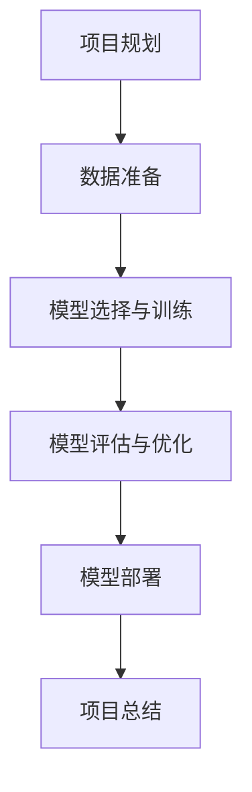

                 

### 引言

大规模自监督学习，作为近年来人工智能领域的一大热点，正逐渐改变着我们对机器学习和数据处理的认知。自监督学习是一种无需依赖标注数据的机器学习方法，它通过利用数据内在的结构性和相关性，使模型能够在未标记的数据中进行自我学习和改进。随着互联网和物联网的发展，数据量呈现出爆炸式增长，但与此同时，标注数据的获取变得越来越困难且成本高昂。因此，如何有效地利用大规模无标注数据，成为了当前研究的重要方向。

本文旨在系统地介绍大规模自监督学习，并探讨其在各种应用场景中的新方法和发展趋势。首先，我们将回顾自监督学习的核心概念和基本流程，阐述其在当前人工智能研究中的地位和重要性。随后，本文将深入分析大规模自监督学习的定义、优势、挑战及其发展现状。在接下来的章节中，我们将详细讨论大规模自监督学习在图自监督学习、语言模型自监督学习、图像自监督学习以及多模态自监督学习等领域的具体应用。

此外，文章还将探讨大规模自监督学习在实际项目中的实施步骤，从项目规划到模型评估与优化，提供一套完整的实践指南。最后，我们将展望大规模自监督学习的未来发展方向，包括算法改进、硬件加速和应用拓展等方面的研究热点。

通过本文的深入探讨，我们希望读者能够对大规模自监督学习有一个全面而深刻的理解，并激发在相关领域进一步研究和实践的兴趣。

### 第1章 自监督学习概述

自监督学习（Supervised Learning）是一种机器学习方法，其核心特征在于通过标注数据进行训练，从而实现模型的预测能力。与之相对的是无监督学习（Unsupervised Learning），它不依赖于标注数据，而是通过发现数据内在的结构和模式来进行学习。然而，自监督学习则介于这两者之间，它利用数据中的某些部分作为监督信号，而不需要全面标注。

#### 1.1 自监督学习的重要性

自监督学习的重要性主要体现在以下几个方面：

1. **降低标注成本**：在大量数据中，获取标注数据是一项耗时且成本高昂的任务。自监督学习通过利用未标记的数据进行训练，可以大大降低对标注数据的依赖，从而节省时间和资源。

2. **提高数据利用效率**：自监督学习能够有效利用未标记的数据，使得在标注数据有限的情况下，仍能提升模型的表现。这在数据稀缺的场景中尤为重要。

3. **增强模型泛化能力**：自监督学习通过学习数据中的内在结构和相关性，可以使模型在处理新数据时具有更好的泛化能力。

4. **适用多种领域**：自监督学习在自然语言处理、计算机视觉、语音识别等领域都有广泛的应用，其灵活性使其成为解决复杂问题的有力工具。

#### 1.2 自监督学习的应用领域

自监督学习在各个领域都有重要的应用：

1. **自然语言处理（NLP）**：自监督学习在语言模型训练、文本分类、机器翻译等方面有着广泛的应用。通过预训练大规模的语言模型，如BERT和GPT，可以有效提高下游任务的性能。

2. **计算机视觉**：在图像分类、目标检测、图像生成等领域，自监督学习通过使用无标注图像数据，可以大大提高模型的效果。

3. **语音识别**：自监督学习在语音信号的表征和分类中具有重要作用，如通过无监督的方式对语音数据进行特征提取和聚类。

4. **推荐系统**：自监督学习可以用于用户偏好分析和物品推荐，通过无监督的方式挖掘用户行为数据中的模式和相关性。

#### 1.3 自监督学习与无监督学习的区别

自监督学习与无监督学习的主要区别在于监督信号的使用方式：

1. **数据来源**：自监督学习利用部分标注数据作为监督信号，而无监督学习完全依靠未标记的数据。

2. **目标函数**：自监督学习的目标函数通常与标注数据相关，如预测标签或恢复部分标签，而无监督学习的目标函数通常是基于数据分布或结构。

3. **适用场景**：自监督学习更适用于有部分标注数据但获取全部标注数据困难的情况，而无监督学习则适用于完全无标注数据的环境。

#### 1.4 大规模自监督学习的挑战与机遇

大规模自监督学习面临以下挑战和机遇：

1. **计算资源需求**：大规模自监督学习需要大量的计算资源，尤其是在训练阶段。这要求硬件设备和算法都具备较高的效率。

2. **数据效率**：如何有效地利用大规模无标注数据，避免过拟合和数据冗余，是一个关键挑战。

3. **模型解释性**：大规模自监督学习的模型往往较为复杂，其内部工作机制难以解释，这给实际应用带来了一定的困难。

4. **机遇**：大规模自监督学习为处理大规模无标注数据提供了新的途径，有助于推动人工智能技术在更多领域的应用和发展。

总之，自监督学习作为一种具有广泛应用前景的机器学习方法，其在大规模数据场景中的潜力不容忽视。通过本文的深入探讨，我们将进一步了解自监督学习的基本概念、应用领域以及面临的挑战和机遇。

### 第2章 自监督学习基础

自监督学习作为一种特殊的机器学习方法，具有其独特的基本概念和流程。本章将深入探讨自监督学习的核心概念、基本流程以及主要算法，为读者提供全面的了解。

#### 2.1 自监督学习的核心概念

自监督学习的核心概念包括监督信号、未标记数据和模型自我优化。

1. **监督信号**：自监督学习中的监督信号不是完全由标注数据提供，而是利用数据中的某些部分作为监督信号。这些监督信号可以是部分标注的数据、数据的某种不变性特征，或者是数据中的某种规律性。

2. **未标记数据**：在自监督学习中，未标记数据是训练数据的主要来源。与标注数据相比，未标记数据获取成本较低，但需要通过算法发现其内在结构。

3. **模型自我优化**：自监督学习的目标是通过自我优化提高模型在未标记数据上的表现。这一过程通常通过设计特定的损失函数和优化算法来实现。

#### 2.2 自监督学习的基本流程

自监督学习的基本流程可以分为以下几个步骤：

1. **数据预处理**：对未标记数据进行预处理，如数据清洗、数据增强等，以使其更适合模型训练。

2. **监督信号设计**：根据数据特性设计监督信号，使其能够有效指导模型学习。例如，通过预测部分标签或数据的一部分特征来实现。

3. **模型训练**：使用设计的监督信号和预处理后的数据进行模型训练。训练过程中，模型不断优化自身参数，以减少损失函数。

4. **模型评估**：使用独立的数据集对训练好的模型进行评估，以验证其性能。评估指标通常包括准确率、召回率、F1分数等。

5. **模型优化**：根据评估结果，对模型进行进一步优化，如调整超参数或使用更复杂的模型结构。

#### 2.3 自监督学习的主要算法

自监督学习涵盖了许多不同的算法，以下介绍几种主要的算法：

1. **预测恢复算法（Prediction Recovery）**：
   - **原理**：通过预测部分未标记数据来恢复其他部分数据。例如，通过预测图像中的缺失部分来重建整个图像。
   - **优势**：能够利用未标记数据的全部信息。
   - **应用场景**：图像修复、图像生成。

2. **一致性损失算法（Consistency Loss）**：
   - **原理**：通过多个随机采样的数据样本训练模型，并利用模型的一致性输出作为监督信号。
   - **优势**：可以有效提高模型的鲁棒性。
   - **应用场景**：图像分类、目标检测。

3. **对比损失算法（Contrastive Loss）**：
   - **原理**：通过对比相似样本和不同样本的输出差异，来训练模型区分不同类别的数据。
   - **优势**：能够提高模型对数据分布的辨别能力。
   - **应用场景**：图自监督学习、语言模型自监督学习。

4. **多任务学习算法（Multi-Task Learning）**：
   - **原理**：将多个任务同时训练，通过共享模型参数来提高学习效率。
   - **优势**：可以同时解决多个相关任务。
   - **应用场景**：语音识别、自然语言处理。

5. **聚类与分类算法（Clustering and Classification）**：
   - **原理**：首先使用聚类算法对未标记数据进行分组，然后对每个分组的数据进行分类。
   - **优势**：能够有效地处理无标签数据。
   - **应用场景**：数据挖掘、推荐系统。

通过以上对自监督学习核心概念、基本流程和主要算法的介绍，读者可以更深入地理解自监督学习的基本原理和应用。接下来，我们将在后续章节中进一步探讨大规模自监督学习的具体实践和挑战。

### 第3章 大规模自监督学习

大规模自监督学习作为当前人工智能领域的一个重要研究方向，其研究背景、定义及其带来的优势与挑战引起了广泛的关注。本节将深入探讨大规模自监督学习的相关内容。

#### 3.1 大规模自监督学习的研究背景

随着互联网和物联网技术的飞速发展，数据量呈现爆炸式增长。然而，数据标注成本高、标注效率低的问题日益凸显，特别是在图像、语音、文本等多媒体数据领域。自监督学习作为一种无需依赖大量标注数据的机器学习方法，提供了有效的解决方案。此外，自监督学习能够充分利用未标记数据的结构性和相关性，从而在模型训练中发挥重要作用。特别是在大规模数据场景下，自监督学习展示出了巨大的潜力和优势，这为大规模自监督学习的研究提供了背景和动力。

#### 3.2 大规模自监督学习的定义

大规模自监督学习是指利用海量的无标注数据，通过设计特定的算法和模型，在无需人工标注的情况下，自动提取数据中的特征和模式，从而实现对模型的训练和优化。与传统的自监督学习相比，大规模自监督学习的主要特点在于数据量的规模和算法的复杂性。

1. **数据量规模**：大规模自监督学习需要处理的数据量通常是PB级别的，这意味着在数据预处理、存储和传输等方面都有更高的要求。
2. **算法复杂性**：大规模自监督学习通常涉及到复杂的模型结构和优化算法，如深度神经网络、图神经网络等，这对计算资源和算法效率提出了更高的要求。

#### 3.3 大规模自监督学习的优势

大规模自监督学习在以下几个方面展现出明显的优势：

1. **降低标注成本**：自监督学习通过利用未标记数据，可以大大减少对标注数据的依赖，从而降低标注成本。
2. **提高数据利用效率**：大规模自监督学习能够有效利用大量未标记数据，提高数据利用效率，这在数据稀缺的情况下尤为重要。
3. **增强模型泛化能力**：通过学习数据中的内在结构和相关性，大规模自监督学习有助于提高模型的泛化能力，使其在处理新数据时表现更加优异。
4. **适应多种应用场景**：大规模自监督学习适用于自然语言处理、计算机视觉、语音识别等多个领域，其灵活性使其能够应对各种复杂问题。

#### 3.4 大规模自监督学习的挑战

尽管大规模自监督学习具有显著的优势，但在实际应用中也面临一系列挑战：

1. **计算资源需求**：大规模自监督学习需要大量的计算资源，特别是在训练阶段，这对硬件设备和算法效率提出了更高的要求。
2. **数据效率和模型可解释性**：如何有效地利用大规模无标注数据，避免过拟合和数据冗余，同时提高模型的可解释性，是大规模自监督学习面临的重要挑战。
3. **算法复杂性**：大规模自监督学习通常涉及复杂的模型结构和优化算法，这对算法设计、模型选择和调参等环节提出了更高的要求。
4. **数据隐私和安全**：在处理大规模数据时，数据隐私和安全问题不容忽视。如何在保障数据安全的前提下，进行有效的自监督学习，是一个亟待解决的问题。

#### 3.5 大规模自监督学习的发展趋势

未来，大规模自监督学习将在以下几个方面继续发展：

1. **算法改进**：随着深度学习、图神经网络等技术的发展，大规模自监督学习算法将变得更加高效和鲁棒。
2. **硬件加速**：随着硬件技术的进步，如GPU、TPU等加速器的广泛应用，大规模自监督学习的计算效率将进一步提高。
3. **应用拓展**：大规模自监督学习将在更多领域得到应用，如医疗、金融、自动驾驶等，推动人工智能技术的全面发展。

通过以上对大规模自监督学习的深入探讨，我们可以看到，这一领域在研究背景、定义、优势与挑战以及发展趋势方面都有着丰富的内容。在接下来的章节中，我们将进一步探讨大规模自监督学习在不同领域的具体应用和实现方法。

### 第4章 图自监督学习

图自监督学习是自监督学习在图数据上的应用，通过利用图结构中的信息，自动提取特征并进行学习。图数据广泛应用于社交网络、知识图谱、生物信息学等领域，因此，图自监督学习在这些领域具有广泛的应用前景。本章将详细探讨图自监督学习的原理、主要算法以及其在实际应用中的案例。

#### 4.1 图自监督学习的原理

图自监督学习的核心思想是通过利用图结构中的邻接关系和特征，设计出一种无监督学习任务，使得模型在完成该任务的过程中自动提取有用的特征。具体来说，图自监督学习可以归纳为以下几种类型：

1. **节点分类**：通过预测图中的节点类别，模型学习节点的特征表示。这类任务通常通过对比模型预测的节点类别与其真实类别来计算损失函数。
   
2. **边分类**：通过预测图中的边是否存在，模型学习边的特征表示。这类任务同样通过对比模型预测的边标签与其真实标签来计算损失函数。

3. **图分类**：通过预测整个图的类别，模型学习图的拓扑结构和节点特征的综合表示。这类任务通常使用整个图的特征向量作为输入，通过分类器进行预测。

4. **图生成**：通过生成新的图结构，模型学习图的生成规则和特征表示。这类任务通常通过最小化生成图与真实图之间的结构差异来优化模型参数。

#### 4.2 图自监督学习的主要算法

图自监督学习算法可以分为基于图神经网络（Graph Neural Networks, GNN）的算法和其他算法。以下介绍几种主要的图自监督学习算法：

1. **节点分类算法（Node Classification）**：
   - **GNN**：图神经网络是一种通过图结构传递信息并进行特征提取的神经网络。常见的GNN算法包括图卷积网络（GCN）、图注意力网络（GAT）和图自注意力网络（GATv2）。这些算法通过聚合邻居节点的特征来更新当前节点的特征表示。
   - **无监督学习算法**：除了传统的监督学习算法，如K-Means聚类，还可以使用无监督的方法对节点进行分类，如基于随机游走的方法。

2. **边分类算法（Edge Classification）**：
   - **图神经网络**：通过预测边的存在性，可以使用图卷积网络（GCN）或图注意力网络（GAT）来学习边的特征表示。
   - **图生成算法**：可以使用图生成算法，如生成对抗网络（GAN），通过生成与真实图结构相似的边，来优化模型参数。

3. **图分类算法（Graph Classification）**：
   - **图嵌入**：将图转换为一个向量表示，通过图嵌入算法（如DeepWalk、Node2Vec）学习图的拓扑结构和节点特征。
   - **分类器**：使用嵌入向量作为输入，通过传统的分类器（如SVM、softmax）进行预测。

4. **图生成算法（Graph Generation）**：
   - **生成对抗网络（GAN）**：GAN通过生成器和判别器的对抗训练，生成与真实图结构相似的图。
   - **图卷积网络（GCN）**：通过图卷积网络，学习图的生成规则和特征表示。

#### 4.3 图自监督学习在应用中的案例

图自监督学习在多个领域有着广泛的应用，以下列举几个典型的应用案例：

1. **社交网络分析**：
   - **节点分类**：通过图自监督学习，可以对社交网络中的用户进行分类，如识别潜在的小团体、挖掘关键节点等。
   - **边分类**：可以预测社交网络中用户之间的潜在关系，如朋友关系、合作关系等。

2. **知识图谱构建**：
   - **图分类**：通过图自监督学习，可以对知识图谱中的实体和关系进行分类，提高知识图谱的准确性和完整性。
   - **图生成**：通过生成对抗网络（GAN），可以生成与真实知识图谱结构相似的图，用于补充或修正现有知识图谱。

3. **生物信息学**：
   - **节点分类**：通过对生物网络中的基因、蛋白质等进行分类，可以揭示生物网络的拓扑结构和功能模块。
   - **图嵌入**：通过图嵌入算法，可以学习生物网络的拓扑结构和节点特征，用于生物网络的挖掘和预测。

4. **自动驾驶**：
   - **图分类**：通过自监督学习，可以对自动驾驶环境中的道路、车辆等进行分类，提高自动驾驶系统的环境感知能力。
   - **图生成**：通过生成对抗网络（GAN），可以生成与真实驾驶环境相似的图，用于自动驾驶算法的测试和训练。

通过以上对图自监督学习原理、算法和应用案例的介绍，我们可以看到图自监督学习在解决复杂图数据问题方面具有巨大的潜力。在接下来的章节中，我们将进一步探讨大规模自监督学习在其他领域的应用。

### 第5章 语言模型自监督学习

语言模型自监督学习是一种利用未标记文本数据来训练语言模型的方法，其核心思想是通过设计特定的任务，使得模型在未标记的数据中自动提取语言特征并进行自我优化。这种学习方式不仅能够提高模型对语言的掌握程度，还能降低对标注数据的依赖，从而降低成本和提高数据利用效率。本章将详细介绍语言模型自监督学习的原理、主要算法以及其在实际应用中的案例。

#### 5.1 语言模型自监督学习的原理

语言模型自监督学习的原理主要基于以下两个核心思想：

1. **预测下一个词**：语言模型的基本任务是根据前文内容预测下一个词。通过这种方式，模型可以从未标记的文本中学习到语言的内在结构和模式。这种自监督学习的优势在于，它能够充分利用文本中的上下文信息，从而提高模型的准确性和泛化能力。

2. **对比损失函数**：为了进一步提高模型的性能，语言模型自监督学习通常使用对比损失函数。对比损失函数通过比较模型对相似和不同文本片段的预测结果，来强化模型对数据分布的理解。这种方法能够帮助模型更好地区分语言的细微差别，从而提高其在实际应用中的表现。

#### 5.2 语言模型自监督学习的主要算法

语言模型自监督学习算法种类繁多，以下介绍几种主要的算法：

1. **基于预测的算法**：
   - **BERT（Bidirectional Encoder Representations from Transformers）**：BERT是一种基于Transformer架构的双向编码器，通过训练文本的双向表示来预测下一个词。BERT的核心思想是利用未标记文本数据来生成大量伪标签，从而提高模型对语言的理解能力。
   - **GPT（Generative Pre-trained Transformer）**：GPT是一种生成式预训练模型，通过生成文本序列来学习语言的内在结构。GPT-3是最新版本，其预训练规模达到1750亿参数，展示了强大的文本生成和理解能力。

2. **基于对比的算法**：
   - **Momentum Contrast（MoCo）**：MoCo是一种基于对比损失的算法，通过构建动态词典来存储和更新模型的特征表示。MoCo的核心思想是保持旧特征与新特征的一致性，从而提高模型在未见数据上的表现。
   - **Denoising Autoencoder**：这是一种自编码器，通过对文本数据进行去噪处理来学习语言特征。去噪过程包括随机删除文本中的词或字符，然后使用自编码器进行重建。

3. **基于图神经网络的算法**：
   - **Graph Convolutional Networks（GCN）**：GCN通过图卷积操作来学习文本中的图结构特征。在语言模型自监督学习中，GCN可以用来提取文本中的上下文关系，从而提高模型的预测能力。

4. **基于强化学习的算法**：
   - **Reinforcement Learning for Language Modeling（RLLM）**：RLLM是一种基于强化学习的语言模型训练方法，通过奖励机制来引导模型在训练过程中优化其预测能力。这种方法能够有效地提高模型的性能和泛化能力。

#### 5.3 语言模型自监督学习在应用中的案例

语言模型自监督学习在自然语言处理领域有着广泛的应用，以下列举几个典型的应用案例：

1. **文本分类**：
   - **使用BERT进行文本分类**：BERT是一种强大的预训练语言模型，可以用于文本分类任务。通过预训练，BERT能够捕捉到文本中的语义信息，从而提高分类的准确性。

2. **机器翻译**：
   - **使用GPT进行机器翻译**：GPT是一种生成式预训练模型，可以用于机器翻译任务。通过大量未标记的双语文本进行预训练，GPT能够生成高质量的翻译结果。

3. **问答系统**：
   - **使用MoCo进行问答系统**：MoCo通过对比损失函数，能够有效提高模型在问答系统中的性能。通过对比不同问题的答案，MoCo能够更好地理解问题的语义和上下文。

4. **文本生成**：
   - **使用Denoising Autoencoder进行文本生成**：Denoising Autoencoder通过去噪处理，能够生成具有创造性的文本内容。这种方法在生成文章、小说等文本创作领域有着广泛的应用。

通过以上对语言模型自监督学习原理、算法和应用案例的介绍，我们可以看到自监督学习在语言模型训练中的重要性。在未来的研究中，随着算法的改进和硬件的发展，语言模型自监督学习将在更多应用场景中发挥关键作用。

### 第6章 图像自监督学习

图像自监督学习是自监督学习在图像处理领域的应用，它通过利用图像的内在结构和特征，在不依赖大量标注数据的情况下，实现图像特征提取和任务学习。随着深度学习技术的发展，图像自监督学习已经成为计算机视觉领域的一个重要研究方向。本章将详细探讨图像自监督学习的原理、主要算法以及其在实际应用中的案例。

#### 6.1 图像自监督学习的原理

图像自监督学习的核心思想是通过设计特定的无监督任务，使模型能够在未标记的图像数据中自动提取有用特征并进行优化。这些无监督任务通常基于图像的某些不变属性或结构，例如图像的局部一致性、全局上下文信息等。以下是几种常见的图像自监督学习任务：

1. **图像分割**：通过预测图像中每个像素的类别标签，模型学习图像的局部结构和内容。例如，将图像分割成前景和背景。

2. **图像修复**：通过预测图像中缺失或损坏的部分，模型学习图像的整体结构和细节。这种方法常用于图像去噪、图像恢复等任务。

3. **图像分类**：通过预测图像的整体类别标签，模型学习图像的高层次特征。这种任务可以用于图像检索、物体识别等应用。

4. **图像生成**：通过学习图像的分布，模型生成新的图像。生成图像可以是完全虚构的，也可以是现实世界中的场景。这种方法常用于图像合成、图像增强等任务。

5. **图像聚类**：通过将图像划分为不同的簇，模型学习图像的相似性结构。这种方法可以用于图像分类、图像检索等任务。

#### 6.2 图像自监督学习的主要算法

图像自监督学习算法可以分为基于深度学习的算法和基于传统机器学习的算法。以下介绍几种主要的图像自监督学习算法：

1. **基于深度学习的算法**：

   - **预测像素标签**：这种方法通过预测图像中每个像素的类别标签来实现自监督学习。常见的算法包括卷积神经网络（CNN）和变种，如卷积自编码器（CAE）和生成对抗网络（GAN）。

     ```python
     # Python代码示例：使用卷积神经网络进行像素标签预测
     import tensorflow as tf
     from tensorflow.keras.models import Sequential
     from tensorflow.keras.layers import Conv2D, Flatten, Dense

     model = Sequential([
         Conv2D(32, (3, 3), activation='relu', input_shape=(28, 28, 1)),
         Flatten(),
         Dense(10, activation='softmax')
     ])

     model.compile(optimizer='adam', loss='categorical_crossentropy', metrics=['accuracy'])
     model.fit(x_train, y_train, epochs=10, batch_size=32)
     ```

   - **图像生成**：生成对抗网络（GAN）通过生成器和判别器的对抗训练，生成高质量的图像。这种方法在图像增强、图像修复等任务中有着广泛的应用。

     ```python
     # Python代码示例：使用GAN进行图像生成
     import tensorflow as tf
     from tensorflow.keras.models import Sequential
     from tensorflow.keras.layers import Conv2D, Dense

     # 生成器
     generator = Sequential([
         Conv2D(64, (3, 3), activation='relu', input_shape=(28, 28, 1)),
         Flatten(),
         Dense(784, activation='tanh')
     ])

     # 判别器
     discriminator = Sequential([
         Flatten(),
         Dense(1, activation='sigmoid')
     ])

     # 训练GAN
     generator.trainable = True
     for epoch in range(100):
         # 随机生成噪声
         noise = tf.random.normal([batch_size, 100])
         # 生成假图像
         generated_images = generator(noise)
         # 训练判别器
         with tf.GradientTape() as tape:
             valid = discriminator(generated_images)
             valid_loss = tf.reduce_mean(tf.nn.sigmoid_cross_entropy_with_logits(logits=valid, labels=tf.ones_like(valid)))
             grads = tape.gradient(valid_loss, discriminator.trainable_variables)
             discriminator.optimizer.apply_gradients(zip(grads, discriminator.trainable_variables))
         # 训练生成器
         with tf.GradientTape() as tape:
             noise = tf.random.normal([batch_size, 100])
             valid = discriminator(generator(noise))
             gen_loss = tf.reduce_mean(tf.nn.sigmoid_cross_entropy_with_logits(logits=valid, labels=tf.zeros_like(valid)))
             grads = tape.gradient(gen_loss, generator.trainable_variables)
             generator.optimizer.apply_gradients(zip(grads, generator.trainable_variables))
     ```

2. **基于传统机器学习的算法**：

   - **图像匹配**：通过预测图像之间的相似性，模型学习图像的局部特征。这种方法常用于图像检索和图像相似性度量。

   - **图像聚类**：通过将图像划分为不同的簇，模型学习图像的相似性结构。常用的算法包括K-Means聚类和层次聚类等。

     ```python
     # Python代码示例：使用K-Means进行图像聚类
     from sklearn.cluster import KMeans
     import numpy as np

     # 加载图像数据
     images = np.load('images.npy')
     # 对图像进行特征提取
     features = extract_features(images)
     # 使用K-Means进行聚类
     kmeans = KMeans(n_clusters=10)
     kmeans.fit(features)
     # 获取聚类结果
     labels = kmeans.predict(features)
     ```

#### 6.3 图像自监督学习在应用中的案例

图像自监督学习在多个领域有着广泛的应用，以下列举几个典型的应用案例：

1. **自动驾驶**：
   - **图像分割**：自动驾驶系统使用图像自监督学习算法对道路、车辆、行人等物体进行分割，从而实现环境的感知和决策。

   - **图像分类**：自动驾驶系统通过图像自监督学习算法对捕获的图像进行分类，从而识别不同类型的道路标志和交通情况。

2. **医疗影像分析**：
   - **图像修复**：图像自监督学习算法可以用于医学图像的去噪和修复，从而提高图像的清晰度和诊断准确性。

   - **图像分类**：在医学影像分析中，图像自监督学习算法可以用于肿瘤的检测和分类，从而帮助医生做出更准确的诊断。

3. **图像检索**：
   - **图像匹配**：图像自监督学习算法可以用于图像检索，通过预测图像之间的相似性，帮助用户快速找到相关图像。

   - **图像聚类**：图像自监督学习算法可以用于图像分类，通过将图像划分为不同的类别，帮助用户更好地组织和浏览图像。

通过以上对图像自监督学习原理、算法和应用案例的介绍，我们可以看到图像自监督学习在计算机视觉领域的重要性。在未来的研究中，随着算法和硬件的不断发展，图像自监督学习将在更多应用场景中发挥关键作用。

### 第7章 多模态自监督学习

多模态自监督学习是自监督学习在处理多个模态数据（如文本、图像、音频等）的应用。通过融合不同模态的数据，多模态自监督学习能够更好地捕捉数据中的复杂结构和关系，从而提高模型的性能和泛化能力。本章将详细介绍多模态自监督学习的原理、主要算法以及其在实际应用中的案例。

#### 7.1 多模态自监督学习的原理

多模态自监督学习的核心思想是利用不同模态数据之间的关联性，设计无监督学习任务，使模型能够自动提取和融合多模态特征。以下是几种常见的多模态自监督学习任务：

1. **联合特征提取**：通过设计联合特征提取任务，模型学习不同模态数据之间的共同特征，从而实现多模态特征融合。例如，在视频分析中，可以同时提取图像帧和语音的特征，并使其在同一特征空间中表示。

2. **模态预测**：通过预测某一模态数据中的部分或全部内容，模型学习其他模态数据的特征。例如，在文本和图像的联合分析中，可以预测图像中的文本内容或文本中的图像内容。

3. **模态交互**：通过设计交互任务，模型学习不同模态之间的相互作用关系。例如，在文本和图像的联合分类任务中，模型需要理解图像中的内容与文本描述之间的关系。

4. **多模态生成**：通过生成对抗网络（GAN）或其他生成模型，模型学习多模态数据的分布，生成新的多模态数据。这种方法可以用于数据增强、图像修复等任务。

#### 7.2 多模态自监督学习的主要算法

多模态自监督学习算法可以分为基于深度学习和基于传统机器学习的算法。以下介绍几种主要的算法：

1. **基于深度学习的算法**：

   - **多模态卷积神经网络（Multi-modal CNN）**：通过将不同模态的数据输入到各自的卷积神经网络中，然后融合其特征进行任务学习。例如，在视频分类中，可以将视频帧和音频分别输入到图像卷积神经网络和音频卷积神经网络中，然后融合两者的特征进行分类。

   - **图卷积神经网络（Graph Convolutional Networks, GCN）**：通过将多模态数据表示为图结构，GCN可以有效地融合不同模态的数据。例如，在社交网络分析中，可以将用户、文本、图像等表示为图节点，并利用GCN学习节点之间的关联。

   - **生成对抗网络（Generative Adversarial Networks, GAN）**：GAN通过生成器和判别器的对抗训练，可以生成新的多模态数据。这种方法在图像生成、数据增强等领域有着广泛的应用。

2. **基于传统机器学习的算法**：

   - **多模态联合分类**：通过设计多模态特征向量，并使用传统分类算法（如SVM、KNN等）进行分类。这种方法简单有效，适用于任务需求不高的场景。

   - **多模态聚类**：通过设计多模态数据之间的相似性度量，并使用聚类算法（如K-Means、层次聚类等）进行聚类。这种方法可以用于数据降维和特征提取。

#### 7.3 多模态自监督学习在应用中的案例

多模态自监督学习在多个领域有着广泛的应用，以下列举几个典型的应用案例：

1. **多媒体检索**：
   - **图像和文本检索**：通过多模态自监督学习，可以同时利用图像和文本的特征进行检索，从而提高检索的准确性和用户体验。例如，用户可以通过输入文本描述，检索与其描述相符的图像。

2. **视频分析**：
   - **视频分类**：通过多模态自监督学习，可以同时利用视频帧和音频的特征进行分类，从而实现视频内容的自动识别。例如，可以将视频分类为体育、娱乐、教育等类别。

   - **视频去噪和修复**：通过多模态自监督学习，可以利用图像和音频数据共同修复视频中的噪声和损坏部分，从而提高视频的质量。

3. **虚拟现实和增强现实**：
   - **多模态交互**：通过多模态自监督学习，可以更好地理解用户的行为和意图，从而实现更自然和直观的交互体验。例如，通过文本、图像和音频的联合分析，可以更好地理解用户的查询和需求。

4. **医疗影像分析**：
   - **多模态融合**：通过多模态自监督学习，可以将不同模态的医学影像数据（如CT、MRI、X光等）进行融合，从而提高诊断的准确性和可靠性。例如，可以将CT图像和MRI图像进行融合，以更好地识别肿瘤和病变区域。

通过以上对多模态自监督学习原理、算法和应用案例的介绍，我们可以看到多模态自监督学习在处理复杂数据方面的巨大潜力。在未来的研究中，随着算法和技术的不断发展，多模态自监督学习将在更多领域得到广泛应用。

### 第8章 大规模自监督学习的应用场景

大规模自监督学习在多个领域展现出巨大的应用潜力，通过利用无标注数据，它不仅能够降低标注成本，还能提高模型的泛化能力。以下将详细介绍大规模自监督学习在自然语言处理、计算机视觉、语音识别和机器翻译等领域的应用场景。

#### 8.1 自然语言处理（NLP）

自然语言处理是大规模自监督学习的重要应用领域之一。通过预训练大规模的语言模型，如BERT（Bidirectional Encoder Representations from Transformers）和GPT（Generative Pre-trained Transformer），NLP模型可以在未标记的数据上进行训练，从而提高其在下游任务中的表现。

- **文本分类**：大规模自监督学习可以用于文本分类任务，如新闻分类、情感分析等。通过预训练模型，可以自动捕捉文本中的语义信息，从而实现高精度的分类。
- **问答系统**：大规模自监督学习可以帮助构建智能问答系统。例如，通过预训练模型，可以自动回答用户提出的问题，如“什么是量子力学？”等。
- **文本生成**：大规模自监督学习可以用于文本生成任务，如自动写作、生成摘要等。例如，GPT-3可以生成高质量的新闻文章和摘要。

#### 8.2 计算机视觉

计算机视觉是另一个大规模自监督学习的重要应用领域。通过利用无标注图像数据，模型可以在图像分类、目标检测、图像修复等任务中实现高效的自监督学习。

- **图像分类**：大规模自监督学习可以用于图像分类任务，如对自然图像进行标签预测。例如，通过使用自监督算法，可以自动将图像分类为动物、植物、城市等类别。
- **目标检测**：大规模自监督学习可以用于目标检测任务，如在图像中检测特定的目标。例如，通过使用自监督算法，可以自动检测图像中的车辆、行人等目标。
- **图像修复**：大规模自监督学习可以用于图像修复任务，如去噪、去雾、去除图像中的破损部分等。例如，通过使用自监督算法，可以自动修复图像中的噪声和损坏部分，从而提高图像的质量。

#### 8.3 语音识别

语音识别是大规模自监督学习的另一个重要应用领域。通过利用无标注语音数据，模型可以在语音识别任务中实现高效的自监督学习。

- **语音识别**：大规模自监督学习可以用于语音识别任务，如将语音转换为文本。例如，通过使用自监督算法，可以自动将语音转换为对应的文字描述。
- **语音分类**：大规模自监督学习可以用于语音分类任务，如将语音分类为不同的说话人、语言或方言。例如，通过使用自监督算法，可以自动识别语音中的说话人身份或语言类别。
- **语音增强**：大规模自监督学习可以用于语音增强任务，如去除背景噪声、改善语音质量等。例如，通过使用自监督算法，可以自动增强语音信号，从而提高语音的清晰度和可理解性。

#### 8.4 机器翻译

机器翻译是大规模自监督学习的另一个重要应用领域。通过利用无标注的双语数据，模型可以在机器翻译任务中实现高效的自监督学习。

- **翻译任务**：大规模自监督学习可以用于机器翻译任务，如将一种语言的文本翻译成另一种语言。例如，通过使用自监督算法，可以自动将英语文本翻译成中文文本。
- **翻译质量评估**：大规模自监督学习可以用于翻译质量评估任务，如评估机器翻译文本的质量。例如，通过使用自监督算法，可以自动评估翻译文本的准确性、流畅性和可读性。
- **翻译记忆库构建**：大规模自监督学习可以用于构建翻译记忆库，从而提高机器翻译的效率和准确性。例如，通过使用自监督算法，可以自动构建大规模的双语语料库，从而为机器翻译提供丰富的参考资源。

通过以上对大规模自监督学习在自然语言处理、计算机视觉、语音识别和机器翻译等领域的应用场景的介绍，我们可以看到大规模自监督学习在处理大规模无标注数据方面的巨大潜力。在未来的研究中，随着算法和技术的不断发展，大规模自监督学习将在更多领域得到广泛应用。

### 第9章 大规模自监督学习项目的实施

实施大规模自监督学习项目是一个复杂的过程，涉及项目规划、数据准备、模型选择与训练、模型评估与优化等多个步骤。以下是详细的大规模自监督学习项目实施步骤，并提供具体的指导。

#### 9.1 项目规划

项目规划是大规模自监督学习项目的第一步，包括定义项目目标、确定资源需求和制定项目时间表。

1. **项目目标**：明确项目的目标，例如提高模型对特定任务的准确率、减少标注成本、优化数据利用效率等。

2. **资源需求**：评估所需的计算资源、人力资源、数据资源等，确保项目能够顺利推进。对于大规模自监督学习项目，通常需要高性能计算资源和大数据存储解决方案。

3. **时间表**：制定详细的项目时间表，包括数据准备、模型训练、模型评估、模型优化等关键阶段，确保项目按计划进行。

#### 9.2 数据准备

数据准备是大规模自监督学习项目的重要基础，主要包括数据收集、数据预处理和数据标注。

1. **数据收集**：收集大量未标记的数据，这些数据可以从公开数据集、社交媒体、物联网设备等渠道获取。确保数据来源的多样性和数据的全面性。

2. **数据预处理**：对收集到的数据进行清洗、去重、格式化等预处理操作，以提高数据质量。例如，在图像自监督学习中，可能需要对图像进行裁剪、旋转、缩放等数据增强操作。

3. **数据标注**：虽然自监督学习依赖于无标注数据，但在某些情况下，仍然需要对部分数据进行人工标注，以提供监督信号。例如，在图像分割任务中，可能需要对部分图像进行像素级别的标注。

#### 9.3 模型选择与训练

在数据准备完成后，接下来是模型选择与训练。

1. **模型选择**：选择适合特定任务的自监督学习模型。常用的模型包括基于深度学习的模型（如自编码器、生成对抗网络）和基于传统机器学习的模型（如聚类、协同过滤）。

2. **模型训练**：使用训练数据对模型进行训练。在训练过程中，需要设置合理的超参数，如学习率、批量大小等。对于大规模自监督学习项目，可能需要使用分布式训练技术，以提高训练效率。

3. **优化算法**：采用优化算法（如梯度下降、Adam等）来更新模型参数，以最小化损失函数。在训练过程中，可以引入正则化技术（如dropout、L2正则化）来防止过拟合。

#### 9.4 模型评估与优化

模型评估与优化是大规模自监督学习项目的重要环节。

1. **模型评估**：使用独立测试数据集对训练好的模型进行评估。常用的评估指标包括准确率、召回率、F1分数等。对于自监督学习任务，可能需要设计特定评估指标，以更好地反映模型性能。

2. **模型优化**：根据评估结果，对模型进行优化。可能需要调整超参数、改进模型结构或使用更先进的算法。例如，可以通过集成学习、迁移学习等技术来提高模型性能。

3. **模型部署**：在模型达到预期性能后，将其部署到生产环境中，以实现实际应用。可能需要考虑模型压缩、量化等技术，以降低部署成本和提高运行效率。

#### 9.5 实际案例分析

以下是一个实际案例，说明如何实施大规模自监督学习项目。

**案例：图像自监督学习用于物体检测**

1. **项目目标**：提高物体检测模型的准确率和效率，减少对标注数据的依赖。

2. **数据准备**：收集100万张未标记的图像，涵盖多种场景和物体类别。对图像进行数据增强，如裁剪、旋转、缩放等，以增加训练数据多样性。

3. **模型选择**：选择基于深度学习的物体检测模型，如Faster R-CNN。使用自监督学习算法，如掩码图像生成（Masked Image Model，MIM），使模型能够在未标记数据上进行训练。

4. **模型训练**：使用分布式训练技术，在GPU集群上训练模型。设置合适的超参数，如学习率为0.001，批量大小为128。

5. **模型评估**：使用COCO数据集进行模型评估。在评估中，使用mAP（mean Average Precision）作为主要评估指标。

6. **模型优化**：根据评估结果，对模型进行优化。调整超参数，如学习率、批次大小等。同时，尝试使用其他优化技术，如迁移学习。

7. **模型部署**：将训练好的模型部署到生产环境，用于实时物体检测。使用模型压缩技术，如量化、剪枝，以提高部署效率和降低成本。

通过以上步骤，成功实施了一个大规模自监督学习项目，提高了物体检测模型的准确率和效率，同时降低了标注成本。

### 第10章 大规模自监督学习的未来发展方向

大规模自监督学习作为人工智能领域的重要研究方向，其未来的发展方向主要体现在算法改进、硬件加速和应用拓展等方面。这些进展不仅将进一步推动自监督学习技术的成熟和应用，也将为各行各业带来新的变革。

#### 10.1 算法改进

算法改进是大规模自监督学习发展的关键方向。一方面，研究者致力于提高自监督学习算法的效率和性能。例如，深度变分自编码器（DVAE）和生成对抗网络（GAN）等生成式模型在图像和文本数据上的应用取得了显著成效。另一方面，新的自监督学习算法不断涌现，如基于自监督聚类的方法和基于迁移学习的方法，这些方法能够更好地利用未标记数据，减少对标注数据的依赖。

未来的算法改进可能包括：

1. **更好的特征提取**：设计更加有效的特征提取方法，以更好地捕捉数据中的复杂结构和模式。
2. **多任务学习**：探索多任务学习在自监督学习中的应用，通过同时训练多个任务来提高模型的泛化能力和学习效率。
3. **解释性和可解释性**：提高自监督学习算法的解释性，使其在应用中更加透明和可解释。

#### 10.2 硬件加速

硬件加速是大规模自监督学习发展的另一个重要方向。随着深度学习模型的复杂度不断增加，对计算资源的需求也日益增长。硬件加速技术，如GPU、TPU和FPGA等，通过提供更高的计算速度和效率，极大地推动了大规模自监督学习的研究和应用。

未来的硬件加速可能包括：

1. **专用硬件**：开发针对大规模自监督学习的专用硬件，如专用神经网络处理器（Neural Network Processor，NPU）和人工智能加速卡（AI Accelerator）。
2. **分布式计算**：利用分布式计算技术，如云计算和边缘计算，实现大规模自监督学习任务的并行处理，以提高效率和降低成本。
3. **模型压缩**：通过模型压缩技术，如剪枝、量化等，减少模型的大小和计算量，使模型在硬件上运行更加高效。

#### 10.3 应用拓展

大规模自监督学习在多个领域的应用已经取得了显著成果，未来其应用将进一步拓展到更多的领域。例如，在医疗领域，自监督学习可以用于医学影像分析、疾病诊断和患者护理等方面；在金融领域，自监督学习可以用于风险控制、欺诈检测和市场预测等；在制造业领域，自监督学习可以用于设备故障预测、质量检测和生产优化等。

未来应用拓展可能包括：

1. **新兴领域**：探索大规模自监督学习在新兴领域（如生物信息学、金融科技、自动驾驶等）中的应用，推动这些领域的创新和发展。
2. **跨领域应用**：研究如何将大规模自监督学习在不同领域之间进行迁移和应用，实现跨领域的技术融合和创新。
3. **可解释性和伦理**：在应用大规模自监督学习时，重视其可解释性和伦理问题，确保模型的应用不会对用户隐私和公平性造成负面影响。

通过以上对大规模自监督学习未来发展方向的分析，我们可以看到，这一领域具有广阔的研究和应用前景。随着技术的不断进步，大规模自监督学习将在更多领域发挥重要作用，为人工智能的发展和社会进步做出更大贡献。

### 附录

#### 附录 A 大规模自监督学习相关资源

1. **论文和综述**：
   - Vaswani et al., "Attention is All You Need"
   - Kipf and Welling, "Variational Graph Networks"
   - Devlin et al., "BERT: Pre-training of Deep Bidirectional Transformers for Language Understanding"
   - Goodfellow et al., "Generative Adversarial Networks"

2. **开源代码和框架**：
   - TensorFlow：https://www.tensorflow.org/
   - PyTorch：https://pytorch.org/
   - PyTorch Geometric：https://pytorch-geometric.com/
   - Hugging Face Transformers：https://huggingface.co/transformers/

3. **在线课程和教程**：
   - 吴恩达的《深度学习》课程：https://www.coursera.org/specializations/deep-learning
   - fast.ai的《深度学习简介》课程：https://www.fast.ai/
   - Keras官方文档：https://keras.io/

#### 附录 B Python代码示例

以下是一个简单的Python代码示例，展示了如何使用PyTorch实现一个基本的自监督学习模型：

```python
import torch
import torch.nn as nn
import torch.optim as optim

# 定义自监督学习模型
class SelfSupervisedModel(nn.Module):
    def __init__(self):
        super(SelfSupervisedModel, self).__init__()
        self.encoder = nn.Sequential(
            nn.Conv2d(3, 32, 3, 1),
            nn.ReLU(),
            nn.Conv2d(32, 64, 3, 1),
            nn.ReLU(),
            nn.Conv2d(64, 64, 3, 1),
            nn.ReLU(),
            nn.Flatten()
        )
        self.decoder = nn.Sequential(
            nn.Linear(64, 64),
            nn.ReLU(),
            nn.Linear(64, 32*32*3),
            nn.Sigmoid()
        )

    def forward(self, x):
        x = self.encoder(x)
        x = self.decoder(x)
        return x

# 初始化模型、优化器和损失函数
model = SelfSupervisedModel()
optimizer = optim.Adam(model.parameters(), lr=0.001)
criterion = nn.BCELoss()

# 训练模型
for epoch in range(10):
    for images in data_loader:
        # 前向传播
        outputs = model(images)
        loss = criterion(outputs, images)

        # 反向传播和优化
        optimizer.zero_grad()
        loss.backward()
        optimizer.step()

    print(f'Epoch [{epoch+1}/10], Loss: {loss.item()}')

# 保存模型
torch.save(model.state_dict(), 'self_supervised_model.pth')
```

#### 附录 C Mermaid流程图示例

以下是一个Mermaid流程图示例，展示了大规模自监督学习项目的基本流程：



#### 附录 D 数学公式示例

以下是一些数学公式的示例，使用LaTeX格式进行书写：

1. 独立同分布：

   $$ X_1, X_2, ..., X_n \sim \text{IID}(\text{分布}) $$

2. 概率密度函数：

   $$ p(x|\theta) = \frac{1}{Z} \exp(-\frac{1}{2}\theta^T x) $$

3. 交叉熵损失：

   $$ L(\theta) = -\sum_{i=1}^n y_i \log(p(x_i|\theta)) $$

通过这些附录，读者可以更好地理解和应用大规模自监督学习的相关技术和方法。

