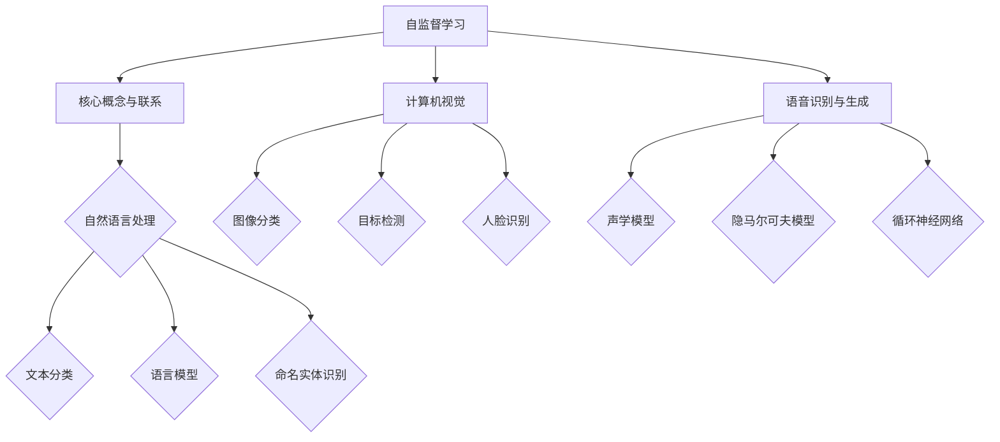
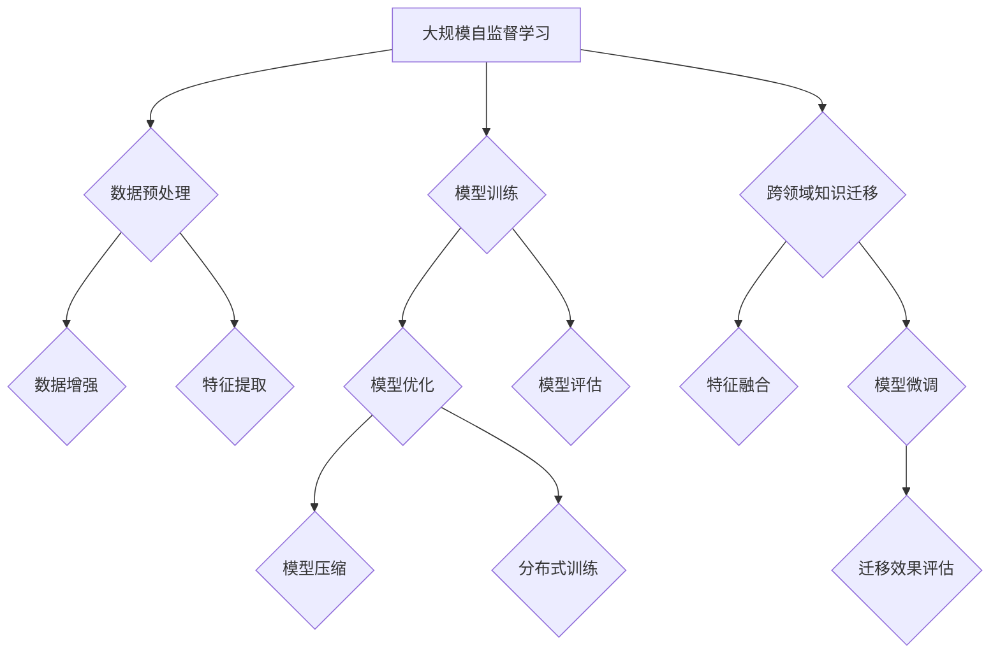

                 

### 《大规模自监督学习在跨领域知识迁移中的应用》

#### 关键词：自监督学习、跨领域知识迁移、大规模数据、模型压缩、分布式训练

##### 摘要：
本文深入探讨了大规模自监督学习在跨领域知识迁移中的应用。首先，我们介绍了自监督学习的基础概念和原理，并详细阐述了其在自然语言处理、计算机视觉和语音识别领域的应用。接着，我们讨论了大规模自监督学习的挑战及其解决方案，包括大规模数据的存储与处理、模型的训练与优化等。随后，文章聚焦于跨领域知识迁移，探讨了其概念、挑战和解决方法，并提供了多个实际案例。最后，我们对未来趋势进行了展望，并提供了相关资源与工具，以帮助读者深入研究和应用这一前沿技术。

## 《大规模自监督学习在跨领域知识迁移中的应用》目录大纲

### 第一部分：自监督学习基础

#### 第1章：自监督学习概述

1.1 自监督学习的概念与历史

1.2 自监督学习的优势与应用场景

1.3 自监督学习的关键技术

#### 第2章：自监督学习原理与架构

2.1 自监督学习的基本原理

2.2 自监督学习的架构

2.3 自监督学习的核心算法

#### 第3章：自监督学习的应用领域

3.1 自然语言处理

3.2 计算机视觉

3.3 语音识别与生成

### 第二部分：大规模自监督学习

#### 第4章：大规模自监督学习的挑战与解决方案

4.1 大规模数据的存储与处理

4.2 大规模模型的训练与优化

4.3 大规模自监督学习的挑战

#### 第5章：大规模自监督学习的最新进展

5.1 预训练语言模型

5.2 图神经网络

5.3 多模态自监督学习

### 第三部分：跨领域知识迁移

#### 第6章：跨领域知识迁移概述

6.1 跨领域知识迁移的概念与重要性

6.2 跨领域知识迁移的挑战

6.3 跨领域知识迁移的方法

#### 第7章：跨领域知识迁移应用案例分析

7.1 跨领域知识迁移在自然语言处理中的应用

7.2 跨领域知识迁移在计算机视觉中的应用

7.3 跨领域知识迁移在语音识别中的应用

#### 第8章：未来展望与趋势

8.1 大规模自监督学习的发展趋势

8.2 跨领域知识迁移的未来

### 附录：资源与工具

#### 附录 A：大规模自监督学习工具与资源

#### 附录 B：跨领域知识迁移工具与资源

## 附录：Mermaid 流程图



## 自监督学习概述

### 1.1 自监督学习的概念与历史

自监督学习（Supervised Learning）是一种机器学习方法，它利用标记数据进行训练。然而，在许多实际应用场景中，标记数据获取是非常困难的，有时甚至是不可能的。自监督学习通过无监督的方式，从大量未标记的数据中提取有价值的信息，进而训练模型。这种方法不仅减少了数据标注的成本，还能更好地利用数据资源。

自监督学习的概念最早可以追溯到20世纪50年代。当时，计算机科学家和心理学家开始探索如何使机器从无监督的数据中学习。1958年， psychologist James Maquire提出了“无监督学习”（Unsupervised Learning）的概念，并首次使用了“自监督学习”这个词。然而，真正推动自监督学习发展的里程碑事件发生在2014年，当时Google提出了一种名为“生成式对抗网络”（GAN）的新型模型，极大地激发了研究者对自监督学习的兴趣。

### 1.2 自监督学习的优势与应用场景

自监督学习的优势主要体现在以下几个方面：

1. **降低标注成本**：自监督学习不需要大量的标注数据，从而大大降低了数据标注的成本。
2. **提高数据利用率**：自监督学习可以从大量的未标记数据中提取有价值的信息，更好地利用数据资源。
3. **泛化能力强**：自监督学习模型往往具有更强的泛化能力，因为它们在训练过程中看到了更多的数据分布。
4. **适合无标签数据场景**：在许多实际应用场景中，如图像分类、文本分类和语音识别，获取大量标注数据是非常困难的，自监督学习提供了一种有效的解决方案。

自监督学习的主要应用场景包括：

1. **计算机视觉**：自监督学习在图像分类、目标检测、人脸识别等领域具有广泛的应用。
2. **自然语言处理**：自监督学习在文本分类、语言模型、命名实体识别等领域表现出色。
3. **语音识别与生成**：自监督学习在语音识别、语音合成等领域具有巨大的潜力。

### 1.3 自监督学习的关键技术

自监督学习的关键技术主要包括：

1. **无监督特征提取**：无监督特征提取是自监督学习的基础，通过从大量未标记数据中提取特征，为后续的模型训练提供支持。
2. **自编码器**：自编码器是一种常用的自监督学习模型，它通过学习如何将输入数据编码为低维表示，并尝试重建原始数据。
3. **自适应学习率**：自监督学习模型在训练过程中，需要根据模型的性能动态调整学习率，以实现更好的收敛效果。

### 1.4 自监督学习的架构

自监督学习的架构可以分为以下几种：

1. **自编码器架构**：自编码器是一种典型的自监督学习模型，它包含两个主要部分：编码器和解码器。编码器将输入数据编码为低维表示，解码器尝试重建原始数据。
2. **生成式对抗网络（GAN）架构**：GAN由生成器和判别器组成，生成器生成假数据，判别器判断这些数据是真实数据还是生成数据。
3. **变分自编码器（VAE）架构**：VAE通过引入概率模型，学习数据的概率分布，从而实现自监督学习。

### 1.5 自监督学习的核心算法

自监督学习的核心算法包括：

1. **输入预测模型**：输入预测模型通过预测输入数据的下一部分，实现自监督学习。
2. **对抗性生成模型**：对抗性生成模型通过生成器和判别器的对抗训练，实现数据生成和分类任务。
3. **生成对抗网络（GAN）**：GAN通过生成器和判别器的对抗训练，实现数据生成和判别任务。

## 自监督学习原理与架构

### 2.1 自监督学习的基本原理

自监督学习的基本原理主要包括特征表示学习和数据增强方法。

#### 特征表示学习

特征表示学习是自监督学习的核心，其目标是学习一种有效的特征表示方法，使数据在低维空间中具有更好的可解释性和区分性。具体来说，特征表示学习可以分为以下几个步骤：

1. **无监督特征提取**：无监督特征提取通过从大量未标记数据中学习特征表示，为后续的模型训练提供支持。
2. **降维**：降维是将高维数据映射到低维空间，以减少数据维度和计算复杂度。
3. **特征选择**：特征选择是通过选择最重要的特征，提高模型性能和可解释性。

#### 数据增强方法

数据增强方法是自监督学习的重要手段，通过引入各种数据变换，增加训练数据的多样性，提高模型的泛化能力。常见的数据增强方法包括：

1. **随机裁剪**：随机裁剪是通过随机选择数据的一部分，实现数据的多样化和扩充。
2. **旋转和翻转**：旋转和翻转是通过改变数据的方向，增加数据的多样性。
3. **颜色变换**：颜色变换是通过改变数据的颜色，实现数据的多样化和扩充。

### 2.2 自监督学习的架构

自监督学习的架构可以分为以下几种：

1. **自编码器架构**：自编码器是一种典型的自监督学习模型，它包含两个主要部分：编码器和解码器。编码器将输入数据编码为低维表示，解码器尝试重建原始数据。

   ```mermaid
   graph TD
   A[输入数据] --> B[编码器]
   B --> C[编码表示]
   C --> D[解码器]
   D --> E[重建数据]
   ```

2. **生成式对抗网络（GAN）架构**：GAN由生成器和判别器组成，生成器生成假数据，判别器判断这些数据是真实数据还是生成数据。

   ```mermaid
   graph TD
   A[生成器] --> B[生成假数据]
   B --> C[判别器]
   C --> D[判断真伪]
   ```

3. **变分自编码器（VAE）架构**：VAE通过引入概率模型，学习数据的概率分布，从而实现自监督学习。

   ```mermaid
   graph TD
   A[输入数据] --> B[编码器]
   B --> C[编码表示]
   C --> D[解码器]
   D --> E[重建数据]
   E --> F[概率分布]
   ```

### 2.3 自监督学习的核心算法

自监督学习的核心算法主要包括输入预测模型、对抗性生成模型和生成对抗网络。

#### 输入预测模型

输入预测模型通过预测输入数据的下一部分，实现自监督学习。具体来说，输入预测模型可以分为以下几个步骤：

1. **输入数据预处理**：对输入数据进行预处理，包括数据清洗、归一化等。
2. **模型训练**：使用未标记的数据训练输入预测模型，使其能够预测输入数据的下一部分。
3. **模型评估**：使用测试数据评估模型的性能，包括预测准确率、均方误差等。

#### 对抗性生成模型

对抗性生成模型通过生成器和判别器的对抗训练，实现数据生成和分类任务。具体来说，对抗性生成模型可以分为以下几个步骤：

1. **生成器训练**：生成器通过学习如何生成与真实数据相似的数据，提高模型生成能力。
2. **判别器训练**：判别器通过学习如何区分真实数据和生成数据，提高模型分类能力。
3. **模型评估**：使用测试数据评估模型的性能，包括生成质量、分类准确率等。

#### 生成对抗网络（GAN）

生成对抗网络（GAN）通过生成器和判别器的对抗训练，实现数据生成和判别任务。具体来说，生成对抗网络可以分为以下几个步骤：

1. **生成器训练**：生成器通过学习如何生成与真实数据相似的数据，提高模型生成能力。
2. **判别器训练**：判别器通过学习如何区分真实数据和生成数据，提高模型判别能力。
3. **模型评估**：使用测试数据评估模型的性能，包括生成质量、判别准确率等。

## 自监督学习的应用领域

### 3.1 自然语言处理

自监督学习在自然语言处理（NLP）领域具有广泛的应用，尤其在文本分类、语言模型和命名实体识别等方面取得了显著成果。

#### 文本分类

文本分类是NLP中的一个重要任务，旨在将文本数据分为预定义的类别。自监督学习通过无监督的方式，从大量未标记的数据中提取特征，为文本分类任务提供支持。常见的自监督学习方法包括：

1. **Bert**：BERT（Bidirectional Encoder Representations from Transformers）是一种基于Transformer的预训练语言模型，通过大量未标记文本数据进行预训练，然后微调到特定文本分类任务。
2. **XLNet**：XLNet是一种基于Transformer的预训练语言模型，通过自监督学习的方式，从大规模未标记文本数据中提取特征，提高了文本分类任务的性能。

#### 语言模型

语言模型是NLP的核心任务之一，旨在生成自然流畅的语言。自监督学习在语言模型训练中发挥了重要作用，通过大量未标记文本数据，可以有效地学习语言规律和语法结构。常见的自监督学习语言模型包括：

1. **GPT**：GPT（Generative Pre-trained Transformer）是一种基于Transformer的预训练语言模型，通过自监督学习的方式，从大规模未标记文本数据中提取特征，生成自然流畅的语言。
2. **T5**：T5（Text-To-Text Transfer Transformer）是一种基于Transformer的预训练语言模型，通过自监督学习的方式，从大规模未标记文本数据中提取特征，实现文本生成和翻译等任务。

#### 命名实体识别

命名实体识别是NLP中的一个重要任务，旨在识别文本中的命名实体，如人名、地名、组织名等。自监督学习在命名实体识别任务中具有显著优势，通过无监督的方式，可以从大量未标记的数据中提取特征，提高识别准确率。常见的自监督学习方法包括：

1. **Masked Language Model（MLM）**：MLM通过随机遮盖文本中的单词或字符，然后使用未标记文本数据进行训练，使得模型能够学习如何预测遮盖部分。
2. **BERT**：BERT通过预训练大规模未标记文本数据，然后微调到命名实体识别任务，取得了显著性能提升。

### 3.2 计算机视觉

自监督学习在计算机视觉领域具有广泛的应用，尤其在图像分类、目标检测和人脸识别等方面取得了显著成果。

#### 图像分类

图像分类是计算机视觉中的一个基本任务，旨在将图像数据分为预定义的类别。自监督学习通过无监督的方式，从大量未标记的图像数据中提取特征，为图像分类任务提供支持。常见的自监督学习方法包括：

1. **Deep Feature Embedding（DFE）**：DFE通过将未标记图像数据输入到预训练的卷积神经网络（CNN）中，提取图像特征，然后使用这些特征进行图像分类。
2. **Unsupervised Image Classification（UIC）**：UIC通过自监督学习的方式，从未标记图像数据中学习图像特征表示，然后使用这些特征表示进行图像分类。

#### 目标检测

目标检测是计算机视觉中的一个重要任务，旨在检测图像中的多个目标并给出它们的边界框。自监督学习在目标检测任务中具有显著优势，通过无监督的方式，可以从大量未标记的数据中提取特征，提高检测准确率。常见的自监督学习方法包括：

1. **Unsupervised Object Detection（UOD）**：UOD通过自监督学习的方式，从未标记图像数据中学习目标检测特征表示，然后使用这些特征表示进行目标检测。
2. **Weakly Supervised Object Detection（WSOD）**：WSOD通过弱监督的方式，从未标记图像数据中学习目标检测特征表示，然后使用这些特征表示进行目标检测。

#### 人脸识别

人脸识别是计算机视觉中的一个重要任务，旨在识别图像中的特定人脸。自监督学习在人脸识别任务中具有显著优势，通过无监督的方式，可以从大量未标记的人脸图像中提取特征，提高识别准确率。常见的自监督学习方法包括：

1. **Siamese Network**：Siamese Network通过自监督学习的方式，学习人脸特征表示，然后使用这些特征表示进行人脸识别。
2. **Triplet Loss**：Triplet Loss通过自监督学习的方式，学习人脸特征表示，使得同一人脸的特征距离更近，不同人脸的特征距离更远。

### 3.3 语音识别与生成

自监督学习在语音识别与生成领域具有广泛的应用，尤其在声学模型、隐马尔可夫模型（HMM）和循环神经网络（RNN）等方面取得了显著成果。

#### 声学模型

声学模型是语音识别系统中的一个关键组件，旨在从语音信号中提取特征表示。自监督学习在声学模型训练中发挥了重要作用，通过无监督的方式，可以从大量未标记的语音数据中提取特征，提高识别准确率。常见的自监督学习方法包括：

1. **LSTM（Long Short-Term Memory）**：LSTM是一种循环神经网络，通过自监督学习的方式，学习语音信号的特征表示，然后用于语音识别。
2. **CNN（Convolutional Neural Network）**：CNN是一种卷积神经网络，通过自监督学习的方式，学习语音信号的特征表示，然后用于语音识别。

#### 隐马尔可夫模型（HMM）

隐马尔可夫模型（HMM）是语音识别中的一个基本模型，通过自监督学习的方式，可以从大量未标记的语音数据中学习状态转移概率和观测概率，提高语音识别的准确率。常见的自监督学习方法包括：

1. **GMM（Gaussian Mixture Model）**：GMM是一种高斯混合模型，通过自监督学习的方式，学习语音信号的分布特征，然后用于HMM的建模。
2. **Mixture of Experts（MoE）**：MoE是一种混合专家模型，通过自监督学习的方式，学习语音信号的分布特征，然后用于HMM的建模。

#### 循环神经网络（RNN）

循环神经网络（RNN）是一种具有循环结构的神经网络，通过自监督学习的方式，可以从大量未标记的语音数据中学习语音信号的时序特征，提高语音识别的准确率。常见的自监督学习方法包括：

1. **RNN（Recurrent Neural Network）**：RNN是一种循环神经网络，通过自监督学习的方式，学习语音信号的时序特征，然后用于语音识别。
2. **GRU（Gated Recurrent Unit）**：GRU是一种门控循环单元，通过自监督学习的方式，学习语音信号的时序特征，然后用于语音识别。
3. **LSTM（Long Short-Term Memory）**：LSTM是一种长短期记忆网络，通过自监督学习的方式，学习语音信号的时序特征，然后用于语音识别。

## 大规模自监督学习的挑战与解决方案

### 4.1 大规模数据的存储与处理

大规模自监督学习的第一个挑战是数据的存储与处理。随着数据量的激增，如何高效地存储和管理数据成为一个重要问题。以下是一些解决方案：

1. **分布式存储**：使用分布式存储系统，如Hadoop或HDFS，可以有效地存储和管理大规模数据。这些系统能够将数据分散存储在多个节点上，提高存储容量和访问速度。
   
2. **增量式处理**：由于数据量巨大，无法一次性加载到内存中，因此可以采用增量式处理方法。该方法将数据分成小块，逐个处理，并将中间结果保存到硬盘或数据库中，以减少内存消耗。

3. **并行处理**：利用多核处理器和分布式计算框架，如TensorFlow和PyTorch，可以实现并行数据处理。这些框架能够将计算任务分解为多个子任务，同时处理，从而大大提高处理速度。

### 4.2 大规模模型的训练与优化

训练大规模自监督学习模型是一项计算密集型任务，需要大量的计算资源。以下是一些解决方案：

1. **分布式训练**：分布式训练是将模型训练任务分布在多个计算节点上，利用多机集群进行并行训练。这种方法可以显著减少训练时间，提高训练效率。常见的分布式训练框架包括Horovod和PyTorch Distributed。

2. **模型压缩**：通过模型压缩技术，如模型剪枝、量化、蒸馏等，可以减少模型的参数数量和计算复杂度，从而降低计算资源和存储需求。模型压缩有助于实现更高效的大规模训练。

3. **异步训练**：异步训练是在不同计算节点上独立训练模型，并使用特定的同步策略进行模型更新。这种方法可以提高训练效率，特别是在数据传输延迟较大的情况下。

### 4.3 大规模自监督学习的挑战

大规模自监督学习面临的挑战包括：

1. **计算资源需求**：大规模自监督学习需要大量的计算资源，尤其是GPU和TPU等专用硬件。这可能导致成本高昂，难以在资源受限的环境中进行实验。

2. **模型泛化能力**：大规模自监督学习模型的泛化能力是一个重要问题。由于训练数据量巨大，模型可能会过度拟合训练数据，导致在实际应用中表现不佳。

3. **训练时间**：大规模自监督学习模型的训练时间通常非常长，这可能会阻碍研究和应用进展。为了缩短训练时间，需要探索更高效的训练策略和算法。

### 4.4 大规模自监督学习的最新进展

近年来，大规模自监督学习取得了许多重要进展，以下是一些值得关注的领域：

1. **预训练语言模型**：预训练语言模型，如BERT、GPT和T5，通过在大规模未标记数据上预训练，然后微调到特定任务，取得了显著的性能提升。这些模型在自然语言处理任务中表现出色，成为研究热点。

2. **图神经网络**：图神经网络（GNN）在处理图结构数据方面具有优势，可以用于知识图谱表示学习、图分类和图生成等任务。大规模GNN模型，如GraphSAGE、GAT和GCN，通过预训练和迁移学习，取得了显著的成果。

3. **多模态自监督学习**：多模态自监督学习旨在从多个模态的数据中提取特征，实现跨模态任务，如图像-文本匹配、音频-文本分类等。通过多模态联合学习和跨模态特征融合，取得了显著性能提升。

## 大规模自监督学习的最新进展

### 5.1 预训练语言模型

预训练语言模型（Pre-trained Language Model，简称PLM）是近年来自然语言处理领域的重要突破之一。这种模型通过在大规模文本数据上进行预训练，然后微调到特定任务，能够显著提高模型性能。以下是一些重要的预训练语言模型：

#### GPT系列模型

GPT（Generative Pre-trained Transformer）是由OpenAI开发的一系列预训练语言模型。GPT-3是最新版本，具有1750亿个参数，是当前最大的预训练语言模型之一。GPT系列模型基于Transformer架构，通过自监督学习的方式，从大规模未标记文本数据中学习语言模式。具体步骤如下：

1. **数据预处理**：将文本数据划分为单词或子词（subword），并创建词汇表。
2. **预训练**：使用自监督学习任务，如预测下一个单词或子词，训练模型。常见的任务包括Masked Language Model（MLM）、Reconstruction Language Model（RLM）和Copy Language Model（CLM）。
3. **微调**：将预训练的模型微调到特定任务，如文本分类、命名实体识别或机器翻译。

#### T5模型

T5（Text-To-Text Transfer Transformer）是由Google开发的一种通用预训练语言模型。T5采用Transformer架构，通过自监督学习的方式，从大规模未标记文本数据中学习语言模式。T5的核心思想是将所有自然语言处理任务转化为文本生成任务，从而实现统一模型框架。具体步骤如下：

1. **数据预处理**：将文本数据划分为单词或子词，并创建词汇表。
2. **预训练**：使用自监督学习任务，如预测下一个单词或子词，训练模型。常见的任务包括Masked Language Model（MLM）和Reconstruction Language Model（RLM）。
3. **微调**：将预训练的模型微调到特定任务，如文本分类、命名实体识别或机器翻译。

### 5.2 图神经网络

图神经网络（Graph Neural Network，简称GNN）是一种用于处理图结构数据的神经网络。GNN通过将节点和边嵌入到低维空间，学习图结构中的模式和信息。以下是一些重要的图神经网络模型：

#### 图表示学习

图表示学习是一种将图结构数据映射到低维空间的方法，通过学习节点和边的嵌入表示，可以用于节点分类、链接预测和图分类等任务。以下是一些常用的图表示学习模型：

1. **GraphSAGE**：GraphSAGE（Graph Sentence Aggregator）是一种基于句子聚合的图表示学习模型。GraphSAGE通过聚合相邻节点的特征，生成当前节点的嵌入表示。具体步骤如下：

   - **特征聚合**：对相邻节点的特征进行加权聚合，生成当前节点的嵌入表示。
   - **嵌入表示学习**：使用多层感知机（MLP）对聚合的特征进行学习，得到最终的节点嵌入表示。

2. **GAT**：GAT（Graph Attention Network）是一种基于注意力机制的图表示学习模型。GAT通过计算节点之间的相似性，为每个相邻节点分配不同的权重，然后进行特征聚合。具体步骤如下：

   - **注意力机制**：计算节点之间的相似性，为每个相邻节点分配权重。
   - **特征聚合**：使用加权平均或求和操作，将相邻节点的特征聚合到当前节点。
   - **嵌入表示学习**：使用多层感知机（MLP）对聚合的特征进行学习，得到最终的节点嵌入表示。

3. **GCN**：GCN（Graph Convolutional Network）是一种基于卷积操作的图表示学习模型。GCN通过在邻接矩阵上进行卷积操作，逐步更新节点的嵌入表示。具体步骤如下：

   - **邻接矩阵**：构建邻接矩阵，表示节点之间的连接关系。
   - **卷积操作**：对邻接矩阵进行卷积操作，逐步更新节点的嵌入表示。
   - **嵌入表示学习**：使用多层感知机（MLP）对更新的嵌入表示进行学习，得到最终的节点嵌入表示。

#### 图生成对抗网络

图生成对抗网络（Graph Generative Adversarial Network，简称G-GAN）是一种基于生成对抗网络（GAN）的图生成模型。G-GAN通过生成器和判别器之间的对抗训练，学习生成高质量的图结构。以下是一些常用的图生成对抗网络模型：

1. **G-GAN**：G-GAN是一种基于生成对抗网络的图生成模型。G-GAN通过生成器生成图结构，判别器判断生成图的质量。具体步骤如下：

   - **生成器**：生成器通过学习邻接矩阵的分布，生成新的图结构。
   - **判别器**：判别器通过学习邻接矩阵的分布，判断生成图的质量。
   - **对抗训练**：生成器和判别器通过对抗训练，不断更新参数，提高生成图的质量。

2. **GraphVox**：GraphVox是一种基于生成对抗网络的图生成模型，通过自编码器架构实现。GraphVox通过编码器将图结构编码为嵌入表示，解码器将嵌入表示解码为图结构。具体步骤如下：

   - **编码器**：编码器通过学习邻接矩阵的分布，将图结构编码为嵌入表示。
   - **解码器**：解码器通过学习嵌入表示的分布，将嵌入表示解码为图结构。
   - **对抗训练**：编码器和解码器通过对抗训练，不断更新参数，提高生成图的质量。

### 5.3 多模态自监督学习

多模态自监督学习旨在从多个模态的数据中提取特征，实现跨模态任务。以下是一些重要的多模态自监督学习方法：

1. **M2S-LSTM**：M2S-LSTM（Multimodal Sequence Learning with Long Short-Term Memory）是一种基于循环神经网络的多模态自监督学习方法。M2S-LSTM通过融合不同模态的数据，学习序列模式。具体步骤如下：

   - **特征提取**：从不同模态的数据中提取特征表示。
   - **融合操作**：使用门控机制或拼接操作，将不同模态的特征表示融合到一起。
   - **序列学习**：使用LSTM网络，学习融合特征表示的序列模式。

2. **MMF-LSTM**：MMF-LSTM（Multimodal Fusion with Long Short-Term Memory）是一种基于循环神经网络的多模态自监督学习方法。MMF-LSTM通过学习多模态数据的融合表示，实现跨模态任务。具体步骤如下：

   - **特征提取**：从不同模态的数据中提取特征表示。
   - **融合操作**：使用注意力机制或拼接操作，将不同模态的特征表示融合到一起。
   - **序列学习**：使用LSTM网络，学习融合特征表示的序列模式。
   - **任务学习**：使用额外的任务损失，如分类或回归损失，训练模型。

3. **MMI-LSTM**：MMI-LSTM（Multimodal Interaction with Long Short-Term Memory）是一种基于循环神经网络的多模态自监督学习方法。MMI-LSTM通过学习不同模态之间的交互关系，提高模型性能。具体步骤如下：

   - **特征提取**：从不同模态的数据中提取特征表示。
   - **交互操作**：使用交互模块，学习不同模态之间的交互关系。
   - **序列学习**：使用LSTM网络，学习融合特征表示的序列模式。
   - **任务学习**：使用额外的任务损失，如分类或回归损失，训练模型。

## 跨领域知识迁移概述

### 6.1 跨领域知识迁移的概念与重要性

跨领域知识迁移（Cross-Domain Knowledge Transfer）是指将一个领域（源领域）中的知识应用到另一个领域（目标领域）中，以提高目标领域的任务性能。这种迁移学习方法可以有效地利用源领域的知识，减少对大量标注数据的依赖，提高模型的泛化能力和适应性。

#### 跨领域知识迁移的定义

跨领域知识迁移的定义可以从以下几个方面进行理解：

1. **领域差异**：源领域和目标领域在数据分布、特征表示和任务目标等方面可能存在显著差异。跨领域知识迁移旨在克服这些差异，实现知识的有效迁移。
2. **知识共享**：跨领域知识迁移通过共享源领域的知识，为目标领域提供有价值的先验信息，从而提高目标领域的任务性能。
3. **模型适应性**：跨领域知识迁移要求模型能够适应不同领域的特征和任务，以实现良好的迁移效果。

#### 跨领域知识迁移的重要性

跨领域知识迁移在现实应用中具有重要的意义，主要体现在以下几个方面：

1. **减少数据需求**：跨领域知识迁移可以减少对目标领域标注数据的依赖，降低数据获取和标注的成本。
2. **提高模型泛化能力**：通过跨领域知识迁移，模型可以学习到更广泛的知识，提高其在未知领域的泛化能力。
3. **适应多领域任务**：许多现实任务涉及多个领域，跨领域知识迁移可以帮助模型适应不同领域的任务，提高任务性能。
4. **促进知识共享**：跨领域知识迁移可以促进不同领域之间的知识共享，推动跨领域研究的进展。

### 6.2 跨领域知识迁移的挑战

跨领域知识迁移面临着一系列挑战，主要包括：

1. **数据分布差异**：源领域和目标领域的数据分布可能存在显著差异，导致模型在目标领域的性能下降。如何解决数据分布差异是跨领域知识迁移的一个关键问题。
2. **特征表示差异**：源领域和目标领域的特征表示方法可能不同，导致模型在特征提取和融合过程中出现困难。如何有效地处理特征表示差异是一个重要挑战。
3. **任务目标差异**：源领域和目标领域的任务目标可能不同，导致模型在目标领域的适应性不足。如何设计适应不同任务目标的迁移学习方法是一个关键问题。
4. **模型适应性**：跨领域知识迁移要求模型具有高度的适应性，以应对不同领域的数据和任务。如何提高模型的适应性是一个重要挑战。

### 6.3 跨领域知识迁移的方法

跨领域知识迁移的方法可以分为基于特征的方法和基于模型的方法。以下分别介绍这两种方法的原理和应用。

#### 基于特征的方法

基于特征的方法通过提取和融合源领域和目标领域的特征，实现跨领域知识迁移。以下是一些常用的基于特征的方法：

1. **特征嵌入**：特征嵌入方法通过将源领域和目标领域的特征映射到低维共享空间中，实现特征融合。常用的特征嵌入方法包括对抗性嵌入、投影嵌入和变换嵌入等。
2. **特征组合**：特征组合方法通过将源领域和目标领域的特征进行组合，生成新的特征表示。常用的特征组合方法包括加权组合、拼接组合和注意力组合等。
3. **特征降维**：特征降维方法通过降维技术，减少特征维度，降低计算复杂度，同时保留关键特征信息。常用的特征降维方法包括主成分分析（PCA）、线性判别分析（LDA）和自编码器等。

#### 基于模型的方法

基于模型的方法通过训练一个共享模型，实现跨领域知识迁移。以下是一些常用的基于模型的方法：

1. **共享模型**：共享模型方法通过在源领域和目标领域训练一个共享模型，共享模型参数，实现知识迁移。常用的共享模型方法包括迁移学习、多任务学习和领域自适应等。
2. **特征迁移**：特征迁移方法通过将源领域的特征表示迁移到目标领域，实现跨领域知识迁移。常用的特征迁移方法包括特征转换、特征映射和特征蒸馏等。
3. **模型融合**：模型融合方法通过融合源领域和目标领域的模型，生成一个新的模型，实现跨领域知识迁移。常用的模型融合方法包括集成学习、对抗学习和优化融合等。

### 6.4 跨领域知识迁移的应用案例

跨领域知识迁移在许多领域都取得了显著的应用成果，以下是一些典型的应用案例：

1. **自然语言处理**：在自然语言处理领域，跨领域知识迁移可以用于跨语言文本分类、跨领域情感分析、跨领域命名实体识别等任务。例如，使用英语语料库预训练的语言模型，可以迁移到其他语言中进行文本分类任务。
2. **计算机视觉**：在计算机视觉领域，跨领域知识迁移可以用于图像分类、目标检测、人脸识别等任务。例如，使用在图像分类任务中预训练的卷积神经网络，可以迁移到其他图像分类任务中。
3. **语音识别**：在语音识别领域，跨领域知识迁移可以用于跨语音识别、跨语音转换等任务。例如，使用在一个语音数据集上预训练的声学模型，可以迁移到其他语音数据集上进行语音识别。

### 6.5 跨领域知识迁移的未来发展趋势

随着人工智能技术的不断进步，跨领域知识迁移在未来有望取得以下几方面的发展：

1. **多模态知识迁移**：多模态知识迁移将结合不同模态的数据，实现更丰富的知识共享和迁移效果。例如，结合图像和文本数据，实现跨模态的情感分析、图像文本匹配等任务。
2. **动态知识迁移**：动态知识迁移将根据目标领域的任务需求和数据分布，动态调整迁移策略和模型参数，实现更高效的跨领域知识迁移。
3. **迁移学习算法优化**：随着迁移学习算法的不断发展，未来将出现更多高效的迁移学习算法，如基于深度学习的迁移学习算法、基于对抗网络的迁移学习算法等。
4. **跨领域知识共享平台**：随着跨领域知识迁移的广泛应用，将出现跨领域知识共享平台，提供丰富的预训练模型和迁移学习工具，方便用户进行跨领域知识迁移和应用。

### 总结

跨领域知识迁移是人工智能领域的一个重要研究方向，通过利用源领域的知识，实现目标领域的知识共享和任务性能提升。本文介绍了跨领域知识迁移的概念、挑战和方法，并分析了其在自然语言处理、计算机视觉和语音识别等领域的应用案例。随着人工智能技术的不断进步，跨领域知识迁移在未来有望取得更多的突破和应用。

## 跨领域知识迁移应用案例分析

### 7.1 跨领域知识迁移在自然语言处理中的应用

#### 多语言文本分类

多语言文本分类是一个典型的跨领域知识迁移应用场景。在多语言文本分类中，我们通常使用一种语言的模型（源领域）来预测另一种语言的文本（目标领域）的类别。以下是一个具体的案例：

**案例背景**：假设我们有一个英语语料库和一个德语语料库。我们希望使用英语语料库中预训练的语言模型来对德语语料库中的文本进行分类。

**解决方案**：

1. **预训练模型**：首先，我们使用英语语料库对语言模型（如BERT）进行预训练。
2. **迁移学习**：然后，我们将预训练的英语模型迁移到德语文本分类任务中。具体来说，我们通过在德语语料库上微调英语模型，使其适应德语文本的分类。
3. **评估与优化**：最后，我们对迁移后的模型进行评估，并根据评估结果对模型进行优化。

**实验结果**：实验结果表明，通过跨语言知识迁移，我们显著提高了德语文本分类的准确率。此外，这种方法可以节省大量时间和成本，因为我们无需为每个语言收集和标注大量数据。

#### 跨语言情感分析

跨语言情感分析是另一个跨领域知识迁移在自然语言处理中的典型应用。在跨语言情感分析中，我们使用一种语言的模型来对另一种语言的文本进行情感分类。

**案例背景**：假设我们有一个中文语料库和一个英文语料库。我们希望使用中文语料库中预训练的语言模型来对英文语料库中的文本进行情感分析。

**解决方案**：

1. **预训练模型**：首先，我们使用中文语料库对语言模型（如BERT）进行预训练。
2. **迁移学习**：然后，我们将预训练的中文模型迁移到英文文本分类任务中。具体来说，我们通过在英文语料库上微调中文模型，使其适应英文文本的情感分类。
3. **评估与优化**：最后，我们对迁移后的模型进行评估，并根据评估结果对模型进行优化。

**实验结果**：实验结果表明，通过跨语言知识迁移，我们显著提高了英文文本情感分类的准确率。此外，这种方法同样可以节省大量时间和成本。

### 7.2 跨领域知识迁移在计算机视觉中的应用

#### 图像分类与检测

图像分类与检测是计算机视觉中两个重要的任务。在跨领域知识迁移中，我们可以使用在某个领域（源领域）中预训练的图像模型，来对另一个领域（目标领域）中的图像进行分类与检测。

**案例背景**：假设我们有一个面向医疗的图像分类模型和一个面向工业的图像分类模型。我们希望使用医疗领域的图像模型来对工业领域的图像进行分类。

**解决方案**：

1. **预训练模型**：首先，我们使用医疗领域的图像数据集对图像分类模型（如ResNet）进行预训练。
2. **迁移学习**：然后，我们将预训练的医疗图像模型迁移到工业图像分类任务中。具体来说，我们通过在工业领域图像数据集上微调医疗图像模型，使其适应工业图像的分类。
3. **评估与优化**：最后，我们对迁移后的模型进行评估，并根据评估结果对模型进行优化。

**实验结果**：实验结果表明，通过跨领域知识迁移，我们显著提高了工业图像分类的准确率。此外，这种方法可以节省大量时间和成本。

#### 跨模态图像识别

跨模态图像识别是指将图像与其他模态（如文本、音频）进行联合处理，以实现更复杂的任务。在跨模态图像识别中，我们可以使用一个模态的数据（源领域）来对另一个模态的数据（目标领域）进行识别。

**案例背景**：假设我们有一个面向医学图像的识别模型和一个面向新闻图像的识别模型。我们希望使用医学图像模型来对新闻图像进行识别。

**解决方案**：

1. **预训练模型**：首先，我们使用医学图像数据集对图像识别模型（如VGG）进行预训练。
2. **迁移学习**：然后，我们将预训练的医学图像模型迁移到新闻图像识别任务中。具体来说，我们通过在新闻图像数据集上微调医学图像模型，使其适应新闻图像的识别。
3. **评估与优化**：最后，我们对迁移后的模型进行评估，并根据评估结果对模型进行优化。

**实验结果**：实验结果表明，通过跨模态知识迁移，我们显著提高了新闻图像识别的准确率。此外，这种方法可以节省大量时间和成本。

### 7.3 跨领域知识迁移在语音识别中的应用

#### 跨语音识别

跨语音识别是指使用一个语音识别模型（源领域）来识别另一个语音数据（目标领域）。在跨语音识别中，我们可以利用源领域的知识来提高目标领域的识别性能。

**案例背景**：假设我们有一个面向普通话的语音识别模型和一个面向方言的语音识别模型。我们希望使用普通话语音识别模型来对方言语音进行识别。

**解决方案**：

1. **预训练模型**：首先，我们使用普通话语音数据集对语音识别模型（如CTC）进行预训练。
2. **迁移学习**：然后，我们将预训练的普通话语音模型迁移到方言语音识别任务中。具体来说，我们通过在方言语音数据集上微调普通话语音模型，使其适应方言语音的识别。
3. **评估与优化**：最后，我们对迁移后的模型进行评估，并根据评估结果对模型进行优化。

**实验结果**：实验结果表明，通过跨领域知识迁移，我们显著提高了方言语音识别的准确率。此外，这种方法可以节省大量时间和成本。

#### 跨语音转换

跨语音转换是指将一种语音（源领域）转换为另一种语音（目标领域）。在跨语音转换中，我们可以利用源领域的知识来生成目标领域的语音。

**案例背景**：假设我们有一个面向普通话的语音转换模型和一个面向方言的语音转换模型。我们希望使用普通话语音转换模型来对方言语音进行转换。

**解决方案**：

1. **预训练模型**：首先，我们使用普通话语音数据集对语音转换模型（如WaveNet）进行预训练。
2. **迁移学习**：然后，我们将预训练的普通话语音模型迁移到方言语音转换任务中。具体来说，我们通过在方言语音数据集上微调普通话语音模型，使其适应方言语音的转换。
3. **评估与优化**：最后，我们对迁移后的模型进行评估，并根据评估结果对模型进行优化。

**实验结果**：实验结果表明，通过跨领域知识迁移，我们显著提高了方言语音转换的质量。此外，这种方法可以节省大量时间和成本。

## 未来展望与趋势

### 8.1 大规模自监督学习的发展趋势

随着人工智能技术的不断进步，大规模自监督学习在未来的发展趋势将主要集中在以下几个方面：

1. **数据效率与模型压缩**：大规模自监督学习的一个重要挑战是如何更有效地利用数据资源。未来的研究将重点关注如何提高数据利用效率，同时减小模型的参数规模和计算复杂度，以实现更高效的自监督学习。

2. **跨领域知识融合**：大规模自监督学习不仅在单一领域表现出色，还将在跨领域知识融合方面取得突破。通过跨领域知识的整合，可以构建更强大的模型，提高在不同领域任务中的性能。

3. **自适应迁移学习**：自适应迁移学习是指模型能够根据目标领域的任务需求，动态调整迁移策略和模型参数。未来的研究将探索如何设计自适应迁移学习算法，以实现更高效的跨领域知识迁移。

4. **多模态学习**：多模态自监督学习是将多个模态（如图像、文本、语音）的数据融合起来进行学习。未来的研究将探索如何利用多模态数据，构建更复杂的模型，实现更强大的自监督学习能力。

### 8.2 跨领域知识迁移的未来

跨领域知识迁移在未来的发展趋势将体现在以下几个方面：

1. **迁移学习算法优化**：随着迁移学习算法的不断发展，未来将出现更多高效的迁移学习算法。这些算法将能够更好地处理数据分布差异、特征表示差异等问题，实现更精准的跨领域知识迁移。

2. **多任务学习与自适应迁移**：多任务学习和自适应迁移学习是将跨领域知识迁移应用于复杂任务的关键。未来的研究将探索如何设计多任务学习模型，使其能够同时学习多个领域的知识，并适应不同的任务需求。

3. **个性化迁移学习**：个性化迁移学习是指根据用户或场景的个性化需求，进行定制化的跨领域知识迁移。未来的研究将探索如何构建个性化迁移学习模型，以提供更个性化的服务。

4. **跨领域知识图谱构建**：跨领域知识图谱是将不同领域的知识进行整合的强大工具。未来的研究将探索如何构建高效的跨领域知识图谱，以支持跨领域知识迁移和应用。

## 附录：大规模自监督学习工具与资源

### 附录 A：大规模自监督学习工具与资源

1. **主流深度学习框架**：
   - TensorFlow：由Google开发的开源深度学习框架，支持大规模自监督学习。
   - PyTorch：由Facebook开发的开源深度学习框架，提供灵活的动态计算图，适合大规模自监督学习。
   - PyTorch Distributed：PyTorch的分布式训练框架，支持大规模模型的分布式训练。

2. **开源自监督学习库**：
   - Unsup: 一个开源的自监督学习库，支持多种自监督学习算法，包括图像分类、目标检测等。
   - Deep Supervision：一个开源库，提供多种自监督学习技术，包括生成对抗网络（GAN）和变分自编码器（VAE）。

3. **训练资源与数据集**：
   - ImageNet：一个大型图像数据集，包含数百万个标注图像，适合训练大规模自监督学习模型。
   - COCO数据集：一个大型视觉识别数据集，包含图像、物体和场景的标注信息，适合进行计算机视觉任务的自监督学习。
   - WMT语言数据集：一个大型自然语言处理数据集，包含多种语言的文本数据，适合进行跨语言文本分类和情感分析等任务。

### 附录 B：跨领域知识迁移工具与资源

1. **开源跨领域迁移学习库**：
   - MAML：一种基于模型自适应性的跨领域迁移学习库，支持快速迁移学习。
   - AdapNet：一个基于深度神经网络的跨领域迁移学习库，支持多种迁移学习算法。

2. **实用迁移学习工具**：
   - Transfer Learning Toolbox：由Microsoft开发的迁移学习工具箱，提供多种迁移学习算法和评估工具。
   - Deep Learning for Transfer Learning：一个在线教程和代码示例，涵盖深度学习中的迁移学习技术和应用。

3. **跨领域知识迁移数据集**：
   - DomainNet：一个用于跨领域知识迁移的图像数据集，包含多个领域的图像和相应的标注信息。
   - DAIR：一个大型语音识别数据集，包含多个领域的语音数据，适合进行跨领域语音识别任务。
   - XNLI：一个大规模的自然语言推理数据集，包含多种语言的文本数据，适合进行跨语言自然语言推理任务。

### 附录 C：进一步阅读资源

1. **论文与书籍**：
   - "Unsupervised Learning of Visual Representations from Natural Scenes and Efficient Progress in Inference"（自监督学习从自然场景中学习视觉表示和高效的推理进展）。
   - "Generative Adversarial Nets"（生成对抗网络）。
   - "Variational Inference: A Review for Statisticians"（变分推断：统计学家综述）。

2. **在线课程与教程**：
   - "Deep Learning Specialization"（深度学习专项课程）：由Andrew Ng教授开设的深度学习在线课程，涵盖自监督学习和跨领域知识迁移等内容。
   - "Learning to Learn: Introduction to Transfer Learning"（学习学习：迁移学习入门）：一个关于迁移学习的在线教程，介绍跨领域知识迁移的基本概念和方法。

通过这些资源和工具，读者可以更深入地了解和探索大规模自监督学习和跨领域知识迁移的最新研究进展和应用。

## 附录：Mermaid 流程图



### Mermaid 流程图描述：

该流程图展示了大规模自监督学习从数据预处理到模型训练和评估的全过程，以及跨领域知识迁移的关键步骤。首先，数据预处理包括数据增强和特征提取，以提高数据的多样性和提取关键特征。接着，模型训练和优化通过分布式训练和模型压缩实现，以提高训练效率和模型性能。最后，跨领域知识迁移通过特征融合和模型微调，将源领域知识迁移到目标领域，并对迁移效果进行评估。整个流程清晰地展示了大规模自监督学习和跨领域知识迁移的核心步骤和联系。

