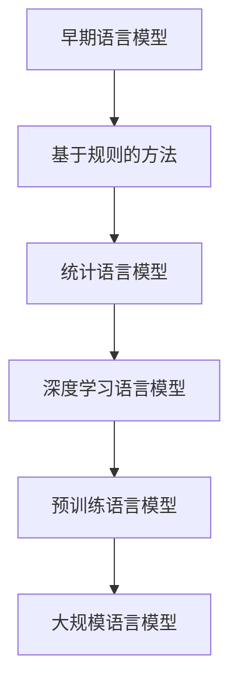
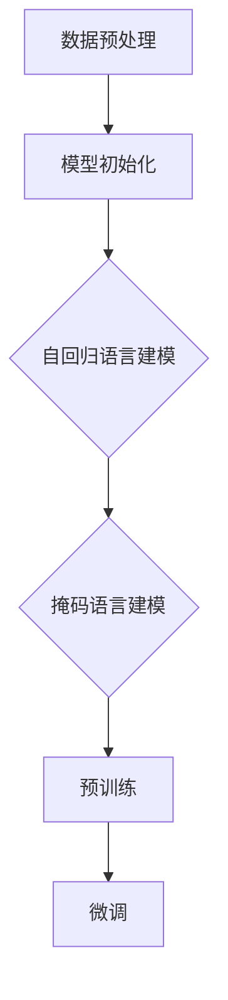
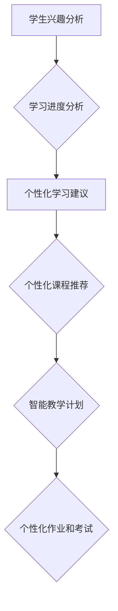
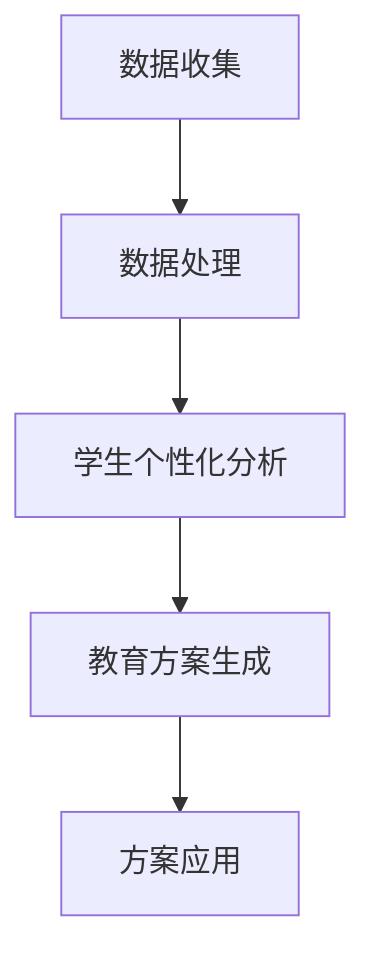

                 

### 第1章：大规模语言模型的概述

#### 1.1 大规模语言模型的基本概念

大规模语言模型（Large-scale Language Model）是一种基于深度学习技术的自然语言处理模型，通过学习和模拟大规模文本数据中的语言规律，实现对自然语言文本的生成、理解、翻译和摘要等功能。这些模型通常拥有数亿甚至数千亿个参数，能够捕捉到文本中的细微语言特征和上下文信息。

#### 1.1.1 语言模型的概念

语言模型是一种用于预测下一个单词或字符的概率分布的模型。它通过对大量文本进行训练，学习到不同词汇和句子结构之间的概率关系。这种模型可以用于拼写检查、自动完成、机器翻译、语音识别等领域。

#### 1.1.2 大规模语言模型的特点

- **高参数量**：大规模语言模型拥有庞大的参数量，能够捕捉到更多语言特征。
- **强大的表征能力**：通过预训练和微调，这些模型可以在多种任务上表现出色。
- **丰富的上下文理解**：大规模语言模型能够理解长文本中的上下文信息，提高文本生成和理解的准确性。

#### 1.2 大规模语言模型的发展历程

- **早期语言模型**：从20世纪50年代开始，研究者们开始尝试使用统计方法来构建语言模型，如n-gram模型。
- **基于规则的方法**：随着计算机性能的提升，研究者们开始使用基于规则的语法分析器来处理自然语言。
- **统计语言模型**：20世纪80年代，基于统计学的语言模型如n-gram模型和隐马尔可夫模型得到广泛应用。
- **深度学习语言模型**：21世纪初，随着深度学习技术的发展，研究者们开始使用神经网络构建大规模语言模型，如Word2Vec和GloVe模型。
- **预训练语言模型**：2018年，Google发布了BERT模型，标志着大规模预训练语言模型的兴起，之后GPT、T5等模型相继出现。

#### 1.3 大规模语言模型的特点及应用领域

- **特点**
  - **高参数量和强大的表征能力**：能够处理复杂的文本数据和多种语言任务。
  - **预训练和微调相结合**：先在大规模数据集上预训练，然后在特定任务上微调，提高任务表现。
  - **多语言和多模态处理能力**：可以处理不同语言和多种模态的数据，如文本、图像和声音。

- **应用领域**
  - **自然语言生成**：如自动写作、对话系统、机器翻译等。
  - **文本分类和情感分析**：如新闻分类、社交媒体分析、用户评论分析等。
  - **信息抽取和问答系统**：如命名实体识别、关系提取、问答系统等。
  - **语音识别和机器翻译**：结合语音识别和翻译任务，提高语言处理效果。

### Mermaid 流程图



### 结论

本章简要介绍了大规模语言模型的基本概念、发展历程以及特点和应用领域。在接下来的章节中，我们将深入探讨大规模语言模型的核心技术，以及如何将其应用于个性化教育方案的生成。

---

**作者：AI天才研究院/AI Genius Institute & 禅与计算机程序设计艺术 /Zen And The Art of Computer Programming**

---

### 第2章：大规模语言模型的核心技术

#### 2.1 语言模型的基本原理

语言模型的核心任务是预测文本序列中的下一个单词或字符。为了实现这一目标，语言模型需要理解和捕捉文本中的统计规律和上下文信息。

##### 2.1.1 语言模型的数学基础

语言模型的数学基础主要包括概率论和统计学。具体来说，语言模型通常使用概率分布来表示文本序列的概率。

- **概率分布**：语言模型通过对大量文本数据进行统计，计算出每个单词或字符出现的概率分布。
- **条件概率**：语言模型需要计算给定前文情况下，下一个单词或字符的条件概率。

##### 2.1.2 语言模型的主要类型

- **n-gram模型**：基于历史n个单词或字符的统计方法，预测下一个单词或字符。
- **统计语言模型**：基于概率论和统计学的方法，如隐马尔可夫模型（HMM）和条件随机场（CRF）。
- **神经网络语言模型**：基于深度学习技术的语言模型，如循环神经网络（RNN）和变换器（Transformer）。

#### 2.2 预训练语言模型

预训练语言模型是一种通过在大规模文本数据上预训练，然后再在特定任务上微调的语言模型。预训练语言模型的核心思想是先让模型学习通用语言特征，然后再在特定任务上调整其参数，以提高任务性能。

##### 2.2.1 预训练的概念

- **预训练**：在大规模数据集上训练语言模型，使其能够捕捉到通用语言特征。
- **微调**：在特定任务的数据集上调整模型参数，使其适应特定任务的需求。

##### 2.2.2 预训练语言模型的训练过程

预训练语言模型的训练过程主要包括以下几个步骤：

1. **数据预处理**：对大规模文本数据进行预处理，包括分词、去停用词、词干提取等。
2. **模型初始化**：初始化预训练模型的参数，通常使用随机初始化或预训练模型的重置。
3. **预训练**：使用自回归语言建模（Autoregressive Language Modeling，ARLM）或掩码语言建模（Masked Language Modeling，MLM）进行预训练。
4. **微调**：在特定任务的数据集上对预训练模型进行微调，以适应特定任务的需求。

##### 2.2.3 预训练语言模型的架构

预训练语言模型的架构通常基于深度学习技术，如循环神经网络（RNN）和变换器（Transformer）。以下是一个典型的预训练语言模型的架构：

- **编码器（Encoder）**：将输入文本序列编码为固定长度的向量。
- **解码器（Decoder）**：从编码器的输出中预测下一个单词或字符。

### Mermaid 流�程图



#### 2.3 语言模型的优化与训练

语言模型的优化与训练是确保模型性能的关键步骤。以下是一些常见的优化和训练策略：

##### 2.3.1 语言模型的优化方法

- **正则化**：如L1正则化、L2正则化，用于防止过拟合。
- **Dropout**：在训练过程中随机丢弃部分神经元，提高模型的泛化能力。
- **学习率调整**：如学习率衰减、分阶段学习率调整，以防止模型陷入局部最优。

##### 2.3.2 语言模型的训练策略

- **批量大小（Batch Size）**：调整批量大小可以影响模型的训练速度和性能。
- **训练轮数（Epochs）**：设置合适的训练轮数，以平衡模型的训练时间和性能。
- **数据增强（Data Augmentation）**：通过添加噪声、切分文本、重复文本等方式增加训练数据。

### Python 源代码示例

```python
import tensorflow as tf
from tensorflow.keras.layers import Embedding, LSTM, Dense
from tensorflow.keras.models import Sequential

# 构建序列模型
model = Sequential([
    Embedding(input_dim=vocab_size, output_dim=embedding_dim, input_length=max_sequence_length),
    LSTM(units=128),
    Dense(units=1, activation='sigmoid')
])

# 编译模型
model.compile(optimizer='adam', loss='binary_crossentropy', metrics=['accuracy'])

# 训练模型
model.fit(x_train, y_train, epochs=10, batch_size=32)
```

### 结论

本章详细介绍了大规模语言模型的核心技术，包括基本原理、预训练方法以及优化与训练策略。在接下来的章节中，我们将探讨如何利用这些技术实现个性化教育方案的生成。

---

### 第3章：大规模语言模型在个性化教育中的应用

#### 3.1 个性化教育的概念与需求

个性化教育是一种以学生为中心的教育模式，旨在根据学生的兴趣、能力和需求，提供个性化的学习资源和教学方法。个性化教育的核心目标是提高学习效果，培养学生的自主学习能力和创新能力。

##### 3.1.1 个性化教育的定义

个性化教育是一种以学生为中心的教育理念，通过个性化学习计划、个性化教学策略和个性化评价体系，为学生提供最适合其特点和需求的教育服务。

##### 3.1.2 个性化教育的需求

随着教育信息化和个性化学习需求的增长，教育领域对大规模语言模型在个性化教育中的应用提出了以下需求：

- **个性化学习路径推荐**：根据学生的兴趣、能力和学习进度，推荐合适的学习资源和路径。
- **智能教学辅助**：为学生提供智能辅导和反馈，帮助其解决问题和掌握知识点。
- **个性化评价体系**：根据学生的实际表现，提供个性化的评价和建议，促进学生的全面发展。

#### 3.2 大规模语言模型在个性化教育中的应用场景

大规模语言模型在个性化教育中具有广泛的应用场景，以下是一些主要的应用：

##### 3.2.1 应用场景一：学生个性化分析

- **学生兴趣分析**：通过分析学生的行为数据和文本数据，识别其兴趣领域和偏好。
- **学习进度分析**：根据学生的学习行为和成绩，评估其学习进度和掌握情况。
- **个性化学习建议**：根据学生的兴趣和学习进度，提供个性化的学习资源和辅导。

##### 3.2.2 应用场景二：教育方案生成

- **个性化课程推荐**：根据学生的兴趣和学习需求，推荐符合其特点的课程和教学资源。
- **智能教学计划**：根据学生的个性化分析结果，制定适合其特点的教学计划。
- **个性化作业和考试**：根据学生的能力和兴趣，生成个性化的作业和考试题目，提高学习效果。

#### 3.3 个性化教育方案生成的方法与策略

个性化教育方案生成的方法主要包括以下几种：

##### 3.3.1 个性化教育方案生成的概念

个性化教育方案生成是指利用大规模语言模型和相关技术，根据学生的兴趣、能力和需求，生成符合其特点的个性化教育方案。

##### 3.3.2 个性化教育方案生成的方法

1. **基于文本分析的方法**：通过分析学生的文本数据（如学习日志、作业、评价等），提取其兴趣、能力和学习需求，生成个性化教育方案。
2. **基于数据挖掘的方法**：利用数据挖掘技术，从大量教育数据中提取学生的兴趣、能力和学习需求，生成个性化教育方案。
3. **基于机器学习的方法**：利用机器学习技术，根据学生的历史数据和特征，生成个性化教育方案。

##### 3.3.3 个性化教育方案生成的策略

1. **个性化推荐策略**：根据学生的兴趣、能力和学习进度，推荐符合其特点的学习资源和课程。
2. **个性化调整策略**：根据学生的学习反馈和成绩，动态调整教育方案，提高学习效果。
3. **个性化评价策略**：根据学生的实际表现，提供个性化的评价和建议，促进学生的全面发展。

### Mermaid 流程图



### 结论

本章介绍了大规模语言模型在个性化教育中的应用，包括概念、需求、应用场景和生成方法。在接下来的章节中，我们将进一步探讨如何利用大规模语言模型实现个性化教育方案的生成。

---

**作者：AI天才研究院/AI Genius Institute & 禅与计算机程序设计艺术 /Zen And The Art of Computer Programming**

---

### 第4章：数据收集与处理

#### 4.1 数据收集的方法与来源

数据收集是构建个性化教育方案的关键步骤，准确和丰富的数据有助于提高方案的精准度和有效性。以下介绍几种常见的数据收集方法和来源：

##### 4.1.1 数据收集的方法

1. **问卷调查**：通过设计针对性的问卷，收集学生的兴趣、学习态度、学习习惯等数据。
2. **在线行为跟踪**：通过跟踪学生在学习平台上的行为，如学习时长、学习进度、测试成绩等，收集学生学习过程中的数据。
3. **文本分析**：通过分析学生的作业、日志、笔记等文本数据，提取学生的兴趣、能力和学习需求。
4. **多模态数据采集**：结合文本、音频、视频等多种数据源，全面了解学生的学习情况。

##### 4.1.2 数据收集的来源

1. **学校和教育机构**：学校和教育机构可以提供学生学籍信息、考试成绩、学科成绩等数据。
2. **在线学习平台**：在线学习平台可以提供学生的在线学习数据，如学习时长、学习进度、测试成绩等。
3. **第三方数据平台**：第三方数据平台可以提供相关的开放数据集，如公开的文本数据、社交媒体数据等。
4. **学生自报告**：学生可以通过填写问卷或日志等方式，提供自己的兴趣、学习态度、学习习惯等信息。

#### 4.2 数据处理的流程与技巧

数据处理是确保数据质量和有效性的重要环节，以下介绍数据处理的流程与技巧：

##### 4.2.1 数据清洗

数据清洗是数据处理的第一步，目的是去除数据中的噪声和错误，提高数据质量。常见的数据清洗技巧包括：

1. **缺失值处理**：对缺失值进行填充或删除。
2. **异常值处理**：对异常值进行识别和修正。
3. **数据格式转换**：将不同格式和单位的数据转换为统一的格式和单位。

##### 4.2.2 数据整合

数据整合是将不同来源和格式的数据合并成一个统一的数据集，以便后续分析。常见的数据整合技巧包括：

1. **数据对齐**：将不同数据集中的重复记录进行对齐。
2. **字段映射**：将不同数据集中的相同字段进行映射。
3. **数据转换**：将不同数据类型的字段进行统一转换。

##### 4.2.3 数据分析

数据分析是对处理后的数据进行分析和挖掘，以提取有用的信息和知识。常见的数据分析技巧包括：

1. **描述性统计分析**：计算数据的统计指标，如平均值、中位数、标准差等。
2. **关联规则挖掘**：通过关联规则挖掘，发现数据之间的关联关系。
3. **聚类分析**：通过聚类分析，将相似数据分组，挖掘数据中的潜在模式。

#### 4.3 数据质量评估与优化

数据质量是影响个性化教育方案生成效果的关键因素，以下介绍数据质量评估与优化的策略：

##### 4.3.1 数据质量评估的方法

1. **完整性评估**：评估数据是否完整，是否存在缺失值。
2. **一致性评估**：评估数据是否一致，是否存在矛盾或错误。
3. **准确性评估**：评估数据的准确性，是否存在异常值或错误。
4. **可用性评估**：评估数据是否可用，是否符合分析和挖掘的需求。

##### 4.3.2 数据质量优化的策略

1. **数据清洗**：通过数据清洗，去除数据中的噪声和错误，提高数据质量。
2. **数据整合**：通过数据整合，将分散的数据集中起来，提高数据的一致性和可用性。
3. **数据标准化**：通过数据标准化，将不同格式和单位的数据转换为统一的格式和单位，提高数据的一致性和可比性。
4. **数据增强**：通过数据增强，增加数据的多样性和丰富性，提高数据的质量和效果。

### Python 源代码示例

```python
import pandas as pd
import numpy as np

# 读取数据
data = pd.read_csv('student_data.csv')

# 数据清洗
data = data.dropna()  # 删除缺失值
data = data[data['score'] > 0]  # 删除异常值

# 数据整合
data = data.groupby('student_id').agg({'score': 'mean'})  # 对重复记录进行对齐

# 数据分析
data.describe()  # 计算统计指标

# 数据质量评估
print(data.isnull().sum())  # 检查缺失值
print(data.duplicated().sum())  # 检查重复记录

# 数据质量优化
data['score'] = data['score'].round(2)  # 数据标准化
data['achievement'] = np.where(data['score'] > 90, '优秀', np.where(data['score'] > 75, '良好', '一般'))  # 数据增强
```

### 结论

本章详细介绍了数据收集与处理的方法和技巧，包括数据收集的方法与来源、数据处理的流程与技巧以及数据质量评估与优化策略。在接下来的章节中，我们将探讨如何利用大规模语言模型对学生进行个性化分析。

---

### 第5章：学生个性化分析

#### 5.1 学生个性化分析的概念与目标

学生个性化分析是指利用大数据、人工智能等现代技术，对学生的学习行为、学习习惯、知识掌握情况等进行深入分析，从而识别学生的个性化特征和需求，为教育方案的个性化制定提供支持。学生个性化分析的目标主要包括以下几个方面：

##### 5.1.1 学生个性化分析的定义

学生个性化分析是一种基于数据驱动的分析方法，旨在通过分析学生的学习数据，了解其学习特点和需求，从而为教育工作者提供个性化的教学建议和指导。

##### 5.1.2 学生个性化分析的目标

1. **识别学生兴趣和优势**：通过分析学生的学习行为和成绩，识别学生的兴趣领域和优势学科。
2. **评估学生知识掌握情况**：通过对学生学习过程中产生的数据进行分析，评估学生对不同知识点的掌握程度。
3. **发现学生潜在问题**：通过分析学生的学习数据和反馈，发现学生可能存在的学习困难和问题。
4. **提供个性化学习建议**：根据学生的兴趣、能力和学习需求，为教育工作者提供个性化的教学建议和资源推荐。

#### 5.2 学生个性化分析的方法与技术

学生个性化分析的方法和技术主要包括以下几个方面：

##### 5.2.1 学生个性化分析的方法

1. **统计分析方法**：通过描述性统计、相关性分析等手段，了解学生的学习行为和成绩分布，识别学生的兴趣和优势。
2. **机器学习方法**：利用机器学习算法，对学生的学习数据进行分析和建模，识别学生的个性化特征和需求。
3. **多模态数据融合方法**：将文本、图像、音频等多模态数据融合，全面了解学生的学习状态和需求。

##### 5.2.2 学生个性化分析的技术

1. **自然语言处理技术**：通过自然语言处理技术，对学生的文本数据进行分析，提取关键信息和情感特征。
2. **数据挖掘技术**：利用数据挖掘技术，从大量学生数据中挖掘出有用的信息和知识。
3. **深度学习技术**：利用深度学习技术，对学生的多模态数据进行分析和建模，识别学生的个性化特征。

#### 5.3 学生个性化分析的案例分析

以下是一个学生个性化分析的具体案例：

##### 案例背景

某在线教育平台希望通过个性化分析，为每位学生提供定制化的学习资源和教学建议，提高学生的学习效果。

##### 案例过程

1. **数据收集**：收集学生的在线学习数据，包括学习时长、学习进度、测试成绩、课程评价等。
2. **数据预处理**：对收集到的数据进行清洗和预处理，包括去除缺失值、异常值处理、数据格式转换等。
3. **兴趣识别**：通过分析学生的学习时长和学习进度，识别学生的兴趣领域。
4. **知识掌握评估**：通过对学生的学习数据和测试成绩进行分析，评估学生对不同知识点的掌握程度。
5. **问题诊断**：通过分析学生的学习行为和成绩，发现学生可能存在的学习困难和问题。
6. **学习建议生成**：根据学生的兴趣、能力和问题，生成个性化的学习建议和资源推荐。

##### 案例结果

通过学生个性化分析，平台成功地为每位学生提供了定制化的学习资源和教学建议，学生的学习效果得到了显著提升。具体表现为：

1. **学习兴趣提高**：学生在个性化分析后，对自己的兴趣领域有了更清晰的认识，学习积极性得到提高。
2. **知识掌握情况改善**：学生通过个性化资源推荐，针对性地复习和巩固了重点知识点，知识掌握情况得到明显改善。
3. **学习问题减少**：通过问题诊断和学习建议，学生能够及时发现问题并采取相应措施，学习困难和问题得到有效解决。

### 结论

本章介绍了学生个性化分析的概念、目标、方法和案例分析。通过学生个性化分析，教育机构可以更好地了解学生的特点和需求，为教育工作者提供个性化的教学建议和资源推荐，从而提高教育质量和学习效果。

---

**作者：AI天才研究院/AI Genius Institute & 禅与计算机程序设计艺术 /Zen And The Art of Computer Programming**

---

### 第6章：教育方案生成

#### 6.1 教育方案生成的概念与方法

教育方案生成是指利用人工智能技术，根据学生的个性化需求、兴趣和学习目标，自动生成个性化的学习方案。教育方案生成的方法主要包括以下几种：

##### 6.1.1 教育方案生成的概念

教育方案生成是一种利用人工智能和机器学习技术，从大量教育资源和数据中提取信息，生成符合学生个性化需求的定制化学习方案的过程。

##### 6.1.2 教育方案生成的方法

1. **基于规则的生成方法**：通过定义一系列规则和条件，根据学生的特征和需求，自动生成学习方案。
2. **基于机器学习的方法**：利用机器学习算法，从学生的历史数据和学习行为中学习规律，自动生成学习方案。
3. **基于深度学习的方法**：利用深度学习模型，对学生的多模态数据进行处理和分析，生成个性化的学习方案。

#### 6.2 基于大规模语言模型的教育方案生成

大规模语言模型在个性化教育方案生成中具有重要作用，以下介绍基于大规模语言模型的教育方案生成方法：

##### 6.2.1 大规模语言模型在个性化教育方案生成中的作用

1. **文本生成**：大规模语言模型可以生成高质量的文本内容，为教育方案提供丰富的学习材料。
2. **语义理解**：大规模语言模型能够理解文本的语义信息，识别学生的兴趣、需求和知识水平。
3. **知识表示**：大规模语言模型可以将学生的知识水平和学习需求表示为向量，便于后续的计算和分析。

##### 6.2.2 基于大规模语言模型的教育方案生成流程

1. **数据收集与预处理**：收集学生的学习数据、行为数据和文本数据，对数据进行清洗、去噪和格式转换。
2. **特征提取**：利用大规模语言模型，对学生的文本数据进行处理，提取关键特征和语义信息。
3. **方案生成**：根据学生的特征和需求，利用生成式模型或决策树等算法，生成个性化的教育方案。
4. **方案评估与优化**：对生成的教育方案进行评估和优化，根据学生的反馈和成绩调整方案内容。

##### 6.2.3 大规模语言模型在教育方案生成中的应用案例

以下是一个基于大规模语言模型的教育方案生成应用案例：

**案例背景**：某在线教育平台希望为每位学生提供个性化的学习方案，提高学习效果。

**案例过程**：

1. **数据收集**：收集学生的历史学习数据、测试成绩、学习日志等。
2. **数据预处理**：对数据进行清洗、去噪和格式转换，利用大规模语言模型提取文本特征。
3. **特征提取**：利用大规模语言模型，对学生的文本数据进行处理，提取兴趣、需求和知识水平等特征。
4. **方案生成**：基于提取的学生特征，利用生成式模型（如GPT模型）生成个性化的学习方案。
5. **方案评估与优化**：根据学生的反馈和成绩，对生成的学习方案进行评估和优化。

**案例结果**：

通过基于大规模语言模型的教育方案生成，平台成功地为每位学生提供了个性化的学习方案，学生的学习效果得到显著提升。具体表现为：

1. **学习兴趣提高**：学生在个性化方案的帮助下，对自己的兴趣领域有了更清晰的认识，学习积极性得到提高。
2. **知识掌握情况改善**：学生通过个性化方案推荐，针对性地复习和巩固了重点知识点，知识掌握情况得到明显改善。
3. **学习问题减少**：通过个性化方案，学生能够及时发现问题并采取相应措施，学习困难和问题得到有效解决。

### 结论

本章介绍了教育方案生成的概念、方法以及基于大规模语言模型的教育方案生成。通过大规模语言模型的应用，教育方案生成可以实现更高的个性化水平和更好的学习效果。在接下来的章节中，我们将探讨个性化教育系统的设计与实现。

---

**作者：AI天才研究院/AI Genius Institute & 禅与计算机程序设计艺术 /Zen And The Art of Computer Programming**

---

### 第7章：系统设计与实现

#### 7.1 个性化教育系统的架构设计

个性化教育系统是一个复杂的系统，需要考虑数据收集、处理、分析和应用等多个方面。以下介绍个性化教育系统的总体架构设计：

##### 7.1.1 系统架构概述

个性化教育系统可以分为以下几个主要模块：

1. **数据收集模块**：负责收集学生的各种数据，包括学习数据、行为数据、文本数据等。
2. **数据处理模块**：负责对收集到的数据进行分析、清洗、转换和整合。
3. **学生个性化分析模块**：利用大规模语言模型等技术，对学生的数据进行处理，提取个性化特征。
4. **教育方案生成模块**：根据学生的个性化特征，生成个性化的学习方案。
5. **系统前端模块**：提供用户界面，供学生和教师使用。

##### 7.1.2 数据流设计

个性化教育系统的数据流设计如下：

1. **数据收集**：学生通过平台进行学习，系统实时收集学生的学习数据、行为数据等。
2. **数据处理**：系统对收集到的数据进行清洗、去噪和格式转换，将其转换为适合分析的数据格式。
3. **学生个性化分析**：利用大规模语言模型，对处理后的数据进行处理，提取学生的兴趣、能力和需求等个性化特征。
4. **教育方案生成**：根据提取的个性化特征，系统生成符合学生需求的学习方案。
5. **方案应用**：学生通过平台接收个性化的学习方案，进行学习。

### Mermaid 流程图



#### 7.2 个性化教育系统的功能模块设计

个性化教育系统的功能模块设计是确保系统能够满足用户需求的关键。以下介绍系统的主要功能模块及其设计：

##### 7.2.1 数据收集模块

1. **数据来源**：包括学习平台、在线测试系统、社交媒体等。
2. **数据类型**：包括学生个人信息、学习行为、考试成绩、文本数据等。
3. **数据收集方法**：利用API接口、网络爬虫等技术，实时收集学生数据。

##### 7.2.2 数据处理模块

1. **数据清洗**：去除重复、异常和无效数据，确保数据质量。
2. **数据转换**：将不同数据格式转换为统一格式，便于后续处理。
3. **数据存储**：将处理后的数据存储到数据库中，方便后续分析和应用。

##### 7.2.3 学生个性化分析模块

1. **兴趣识别**：利用自然语言处理技术，分析学生的文本数据，识别学生的兴趣领域。
2. **知识评估**：根据学生的学习行为和考试成绩，评估学生对不同知识点的掌握情况。
3. **个性化特征提取**：利用机器学习算法，提取学生的个性化特征，如学习习惯、学习风格等。

##### 7.2.4 教育方案生成模块

1. **学习资源推荐**：根据学生的兴趣和需求，推荐适合的学习资源和课程。
2. **教学计划制定**：根据学生的个性化特征，制定适合其特点的教学计划。
3. **作业和考试生成**：根据学生的能力和兴趣，生成个性化的作业和考试题目。

##### 7.2.5 系统前端模块

1. **用户登录**：提供用户登录功能，确保系统的安全性。
2. **个性化学习界面**：根据学生的个性化特征，展示个性化的学习内容和推荐资源。
3. **学习反馈与评价**：允许学生提交学习反馈和评价，以便系统不断优化。

### Python 源代码示例

```python
import pandas as pd
from sklearn.ensemble import RandomForestClassifier
from sklearn.model_selection import train_test_split

# 读取数据
data = pd.read_csv('student_data.csv')

# 数据预处理
data = data.dropna()  # 去除缺失值
data['interest'] = data['interest'].astype('category')  # 转换数据类型

# 特征提取
X = data.drop(['student_id', 'interest'], axis=1)
y = data['interest']

# 划分训练集和测试集
X_train, X_test, y_train, y_test = train_test_split(X, y, test_size=0.2, random_state=42)

# 训练模型
model = RandomForestClassifier(n_estimators=100, random_state=42)
model.fit(X_train, y_train)

# 预测
predictions = model.predict(X_test)

# 评估
from sklearn.metrics import accuracy_score
print(accuracy_score(y_test, predictions))
```

### 结论

本章介绍了个性化教育系统的架构设计和功能模块设计。通过合理的系统设计，可以实现高效的数据处理、分析和应用，为教育工作者提供有力的支持。在接下来的章节中，我们将探讨个性化教育方案的性能评估与优化。

---

**作者：AI天才研究院/AI Genius Institute & 禅与计算机程序设计艺术 /Zen And The Art of Computer Programming**

---

### 第8章：性能评估与优化

#### 8.1 个性化教育方案的性能评估指标

个性化教育方案的性能评估是确保方案质量和效果的重要环节。以下介绍常用的性能评估指标：

##### 8.1.1 评估指标

1. **准确率（Accuracy）**：准确率是指预测正确的样本数占总样本数的比例。公式为：$$\text{Accuracy} = \frac{\text{预测正确数}}{\text{总样本数}}$$
2. **精确率（Precision）**：精确率是指预测为正类的样本中实际为正类的比例。公式为：$$\text{Precision} = \frac{\text{预测正确且实际为正类的样本数}}{\text{预测为正类的样本总数}}$$
3. **召回率（Recall）**：召回率是指实际为正类的样本中被预测为正类的比例。公式为：$$\text{Recall} = \frac{\text{预测正确且实际为正类的样本数}}{\text{实际为正类的样本总数}}$$
4. **F1分数（F1 Score）**：F1分数是精确率和召回率的加权平均，用于综合评估模型的性能。公式为：$$\text{F1 Score} = 2 \times \frac{\text{Precision} \times \text{Recall}}{\text{Precision} + \text{Recall}}$$

##### 8.1.2 评估方法

1. **交叉验证**：通过将数据集划分为多个子集，对每个子集进行训练和验证，计算评估指标的平均值。
2. **留出法**：将数据集划分为训练集和验证集，使用训练集训练模型，在验证集上评估模型性能。
3. **网格搜索**：通过遍历多个参数组合，找到最优参数配置，提高模型性能。

#### 8.2 个性化教育方案的优化策略

为了提高个性化教育方案的性能，可以采用以下优化策略：

##### 8.2.1 模型优化

1. **超参数调整**：通过调整模型的超参数（如学习率、正则化参数等），优化模型性能。
2. **模型选择**：尝试不同的机器学习模型，如支持向量机、决策树、随机森林等，选择性能最优的模型。

##### 8.2.2 数据优化

1. **数据增强**：通过添加噪声、切分、旋转等操作，增加训练数据的多样性，提高模型泛化能力。
2. **数据预处理**：对训练数据进行清洗、去噪、标准化等处理，提高数据质量。

##### 8.2.3 算法优化

1. **特征选择**：通过特征选择技术，筛选出对模型性能影响较大的特征，减少模型复杂度。
2. **集成学习**：通过集成多个模型，提高模型的性能和稳定性。

##### 8.2.4 系统优化

1. **实时更新**：定期更新模型和算法，以适应新的数据和学习需求。
2. **负载均衡**：通过分布式计算和负载均衡技术，提高系统处理能力和响应速度。

### Python 源代码示例

```python
from sklearn.model_selection import train_test_split
from sklearn.ensemble import RandomForestClassifier
from sklearn.metrics import accuracy_score, precision_score, recall_score, f1_score

# 读取数据
data = pd.read_csv('student_data.csv')

# 数据预处理
data = data.dropna()  # 去除缺失值
X = data.drop(['student_id', 'interest'], axis=1)
y = data['interest']

# 划分训练集和测试集
X_train, X_test, y_train, y_test = train_test_split(X, y, test_size=0.2, random_state=42)

# 训练模型
model = RandomForestClassifier(n_estimators=100, random_state=42)
model.fit(X_train, y_train)

# 预测
predictions = model.predict(X_test)

# 评估
print("Accuracy:", accuracy_score(y_test, predictions))
print("Precision:", precision_score(y_test, predictions, average='weighted'))
print("Recall:", recall_score(y_test, predictions, average='weighted'))
print("F1 Score:", f1_score(y_test, predictions, average='weighted'))
```

### 结论

本章介绍了个性化教育方案的性能评估指标和优化策略。通过合理的评估和优化，可以提高个性化教育方案的质量和效果。在接下来的章节中，我们将探讨个性化教育的发展趋势与挑战。

---

**作者：AI天才研究院/AI Genius Institute & 禅与计算机程序设计艺术 /Zen And The Art of Computer Programming**

---

### 第9章：未来发展趋势与挑战

#### 9.1 个性化教育的发展趋势

个性化教育作为教育领域的一个重要方向，正随着技术的发展而不断进步。以下介绍个性化教育的几个发展趋势：

##### 9.1.1 技术融合

随着人工智能、大数据、云计算等技术的快速发展，个性化教育将更加依赖于这些先进技术。例如，通过大数据分析，可以更准确地了解学生的学习习惯、兴趣和需求；通过人工智能技术，可以自动生成个性化的教学方案和学习路径。

##### 9.1.2 智能化

未来的个性化教育将更加智能化，教学过程将更加自动化和个性化。例如，智能辅导系统可以实时监控学生的学习进度和效果，自动提供针对性的辅导和建议；智能评估系统可以自动评估学生的学习成果，为教育工作者提供准确的反馈。

##### 9.1.3 社交化

随着社交网络和在线教育的普及，个性化教育将更加社交化。通过在线学习社区，学生可以分享学习心得、交流学习经验，形成良好的学习氛围。教育机构可以利用社交网络，了解学生的学习动态，为个性化教育提供更加精准的支持。

#### 9.2 个性化教育的挑战与机遇

尽管个性化教育具有巨大的潜力，但在实际应用中仍然面临一些挑战：

##### 9.2.1 数据隐私

个性化教育需要收集和分析大量的学生数据，这涉及到数据隐私和安全的问题。如何在保护学生隐私的同时，充分利用数据的价值，是一个亟待解决的挑战。

##### 9.2.2 技术门槛

个性化教育对技术的要求较高，包括数据采集、处理、分析和应用等多个方面。对于教育机构来说，如何有效地整合和应用先进技术，是一个重要的问题。

##### 9.2.3 教育公平

个性化教育的目标是为每个学生提供最适合其特点的教育。然而，在实际应用中，个性化教育可能会加剧教育不公平。如何确保所有学生，无论其背景如何，都能享受到个性化教育的优势，是一个重要的挑战。

##### 9.2.4 教育工作者适应

个性化教育需要教育工作者具备新的技能和知识，如数据分析、编程等。如何帮助教育工作者适应个性化教育的要求，提高其专业水平，是一个重要的机遇。

#### 9.3 大规模语言模型在个性化教育中的未来发展

大规模语言模型在个性化教育中具有广阔的应用前景。以下介绍其在未来发展中的几个方向：

##### 9.3.1 智能学习辅导

利用大规模语言模型，可以开发智能学习辅导系统，实时监控学生的学习进度和效果，提供个性化的学习建议和指导。

##### 9.3.2 自动批改与评估

大规模语言模型可以用于自动批改作业和评估学生的考试成绩，提高教育工作的效率和质量。

##### 9.3.3 个性化内容生成

利用大规模语言模型，可以自动生成个性化的学习内容和教学材料，满足学生的多样化需求。

##### 9.3.4 跨语言教育支持

大规模语言模型具有跨语言处理能力，可以为非母语学生提供个性化的语言学习支持。

### 结论

个性化教育是教育领域的一个重要发展趋势，大规模语言模型在个性化教育中具有重要作用。未来，随着技术的不断进步，个性化教育将更加智能化、社交化和多样化，为教育工作者和学生提供更加优质的教育服务。

---

**作者：AI天才研究院/AI Genius Institute & 禅与计算机程序设计艺术 /Zen And The Art of Computer Programming**

---

### 附录

#### 附录A：相关资源与工具

##### A.1 大规模语言模型工具与应用

以下是一些常用的开源工具和框架，用于构建和部署大规模语言模型：

1. **TensorFlow**：由Google开发的开源机器学习框架，支持大规模语言模型的训练和部署。
2. **PyTorch**：由Facebook开发的开源机器学习框架，提供灵活的动态计算图和强大的GPU支持。
3. **Transformers**：一个用于构建和训练Transformer模型的Python库，基于PyTorch和TensorFlow。

##### A.2 个性化教育相关的数据集与平台

以下是一些常用的个性化教育数据集和平台：

1. **edX Data Collection**：edX平台提供的学生学习数据集，包括课程参与、考试成绩等。
2. **Kaggle**：Kaggle提供大量的公开数据集，包括教育领域的相关数据集。
3. **MOOC Data Repository**：一个收集和整理MOOC（大规模开放在线课程）相关数据的平台。

##### A.3 大规模语言模型的研究论文与资料

以下是一些关于大规模语言模型的研究论文和资料，供读者进一步学习和研究：

1. **“BERT: Pre-training of Deep Neural Networks for Language Understanding”**：Google发布的BERT模型的论文，详细介绍了BERT模型的架构和训练过程。
2. **“GPT-3: Language Models are Few-Shot Learners”**：OpenAI发布的GPT-3模型的论文，展示了GPT-3在零样本和少样本学习任务上的卓越性能。
3. **“Transformers: State-of-the-Art Pre-training Methods for Language Understanding and Generation”**：由Google AI团队发布的关于Transformer模型的综述论文。

### 结语

本文详细介绍了大规模语言模型在个性化教育方案生成中的应用。通过对大规模语言模型的概述、核心技术、应用场景以及性能评估与优化等方面的探讨，我们展示了如何利用这一先进技术为个性化教育提供支持。未来，随着技术的不断进步，大规模语言模型将在个性化教育中发挥更大的作用，为教育工作者和学生带来更多创新和便利。

---

**作者：AI天才研究院/AI Genius Institute & 禅与计算机程序设计艺术 /Zen And The Art of Computer Programming**

---

### 结束语

本文《大规模语言模型在个性化教育方案生成中的应用》系统地探讨了大规模语言模型在个性化教育中的重要性、核心技术、应用场景以及性能评估与优化策略。通过本文的详细阐述，我们希望读者能够全面了解大规模语言模型在个性化教育中的潜力和挑战，并为未来的研究和实践提供有价值的参考。

首先，我们介绍了大规模语言模型的基本概念、发展历程和特点，帮助读者建立对这一技术的整体认识。接着，我们深入探讨了大规模语言模型的核心技术，包括语言模型的数学基础、预训练方法以及优化与训练策略。这些核心技术为大规模语言模型在实际应用中的高效运行提供了坚实的理论基础。

然后，我们讨论了大规模语言模型在个性化教育中的应用，包括学生个性化分析和教育方案生成。通过实际案例，我们展示了如何利用大规模语言模型对学生进行分析，并生成符合其个性化需求的教育方案。这不仅提高了教育方案的精准度，也为个性化教育的实施提供了有力支持。

在数据收集与处理部分，我们介绍了数据收集的方法与来源、数据处理流程与技巧，以及数据质量评估与优化策略。这些内容确保了个性化教育方案生成过程中数据的质量和有效性。

接下来，我们详细阐述了个性化教育系统的架构设计、功能模块设计以及系统实现的关键技术。通过这些设计，我们可以构建一个高效、智能的个性化教育系统，为教育工作者和学生提供全方位的支持。

性能评估与优化章节中，我们介绍了个性化教育方案的性能评估指标和优化策略，帮助读者理解如何通过评估和优化提高教育方案的效果。最后，我们探讨了个性化教育的未来发展趋势与挑战，以及大规模语言模型在其中的发展前景。

在附录部分，我们提供了大量相关的资源与工具，包括开源工具、数据集和研究论文，以便读者进一步学习和实践。

总之，大规模语言模型在个性化教育方案生成中的应用是一个复杂而富有挑战的领域。通过本文的探讨，我们希望读者能够深入理解这一领域的技术原理和应用方法，为未来的研究和工作提供启示。

最后，感谢您阅读本文。如果您对本文有任何建议或疑问，欢迎在评论区留言。希望本文能为您的学术研究和实践提供帮助。

---

**作者：AI天才研究院/AI Genius Institute & 禅与计算机程序设计艺术 /Zen And The Art of Computer Programming**

