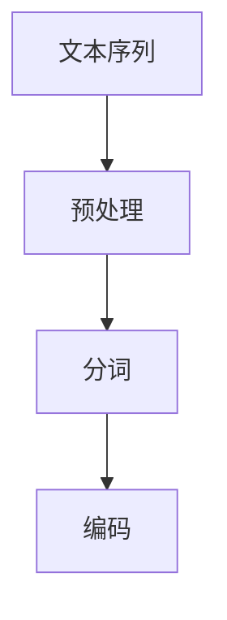
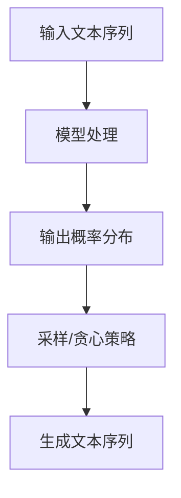
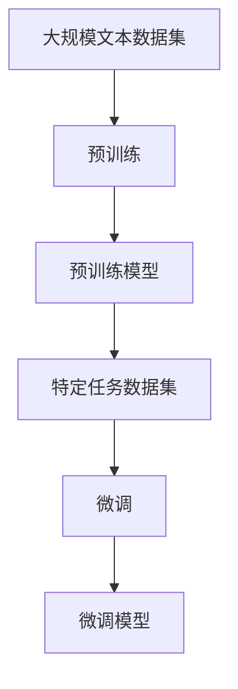
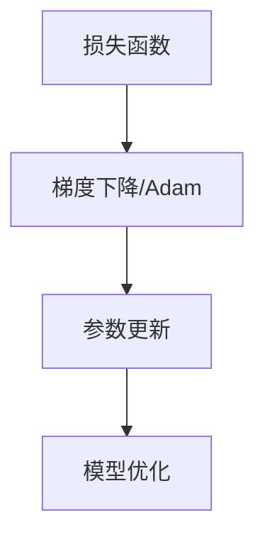
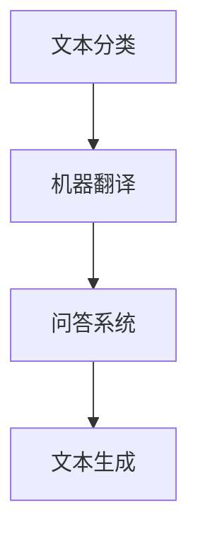
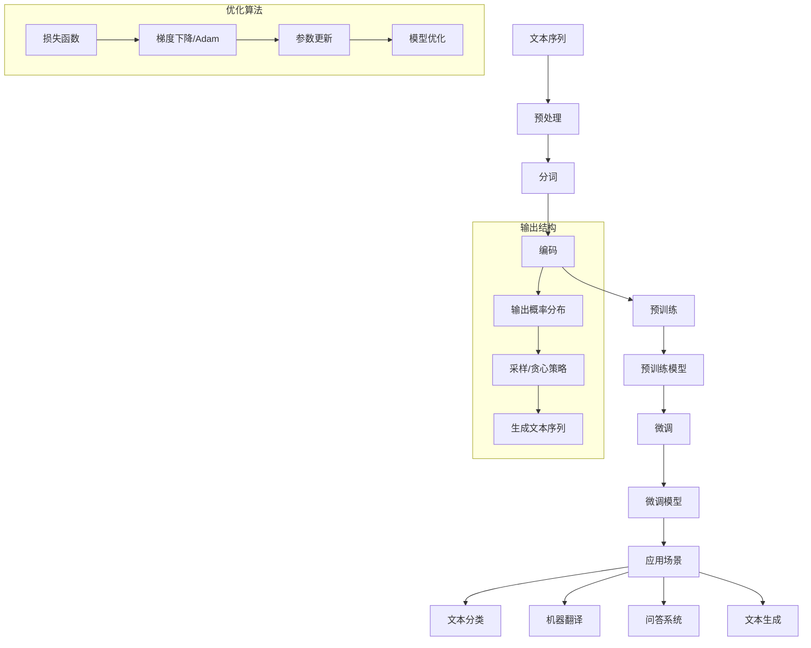

                 

### 第一部分：大规模语言模型概述

## 1.1 大规模语言模型的定义与特点

### 1.1.1 大规模语言模型的定义

大规模语言模型（Large-scale Language Model）是一种人工智能模型，通过对海量文本数据进行深度学习训练，使其具备了理解、生成和翻译自然语言的能力。这种模型通常由数亿甚至数十亿的参数组成，能够捕捉到语言中的复杂模式和结构。大规模语言模型的典型代表包括GPT（Generative Pre-trained Transformer）、BERT（Bidirectional Encoder Representations from Transformers）等。

### 1.1.2 大规模语言模型的特点

#### 高效性
大规模语言模型通过预训练阶段在大量文本数据上的学习，使得模型在任务适应和推理方面具有高效性。相比于传统语言模型，大规模语言模型能够在较少的微调步骤下快速适应特定任务。

#### 泛化能力
由于训练数据量大，大规模语言模型具备较强的泛化能力，能够处理各种语言现象和任务，如文本分类、情感分析、问答系统等。

#### 自适应性
大规模语言模型能够通过微调（fine-tuning）过程快速适应特定领域或任务，从而提高其在特定应用场景中的性能。

#### 语言理解能力
这些模型不仅能够生成流畅的自然语言文本，还能够理解文本中的含义、上下文关系和逻辑结构。

### 1.1.3 大规模语言模型与传统语言模型的区别

传统语言模型，如基于规则或统计的方法，通常基于有限的语言规则或统计信息来生成或理解文本。而大规模语言模型则通过深度学习和大规模数据的训练，具备了更强的表达能力和理解能力。具体区别如下：

#### 数据量
传统语言模型通常基于数百万条语料库，而大规模语言模型则基于数亿甚至数十亿条语料库。

#### 参数量
传统语言模型参数量相对较少，而大规模语言模型拥有数亿到数十亿个参数。

#### 预训练
传统语言模型通常不进行预训练，而大规模语言模型通过预训练阶段在大规模文本数据上学习语言的一般特性。

#### 表达能力
传统语言模型在处理特定语言现象时可能存在局限性，而大规模语言模型能够更灵活地处理复杂的语言现象。

## 1.2 大规模语言模型的发展历程

### 1.2.1 早期的语言模型

早期的语言模型主要基于规则或统计方法。例如，1980年代初期，IBM的研究团队开发了IBM Model 1和IBM Model 2，它们基于语法规则和概率模型来生成文本。然而，这些模型在处理复杂语言现象时存在局限性。

### 1.2.2 递归神经网络（RNN）的崛起

随着深度学习技术的发展，递归神经网络（RNN）在语言模型领域得到了广泛应用。RNN能够处理序列数据，并捕捉到序列中的时间依赖关系。然而，RNN在训练过程中存在梯度消失和梯度爆炸问题，限制了其性能。

### 1.2.3 Transformer架构的革新

2017年，谷歌提出了Transformer架构，这是一种基于自注意力机制的深度学习模型。Transformer通过多头自注意力机制和前馈神经网络结构，有效解决了RNN的梯度消失问题，并显著提升了模型性能。Transformer的成功引发了大规模语言模型领域的研究热潮。

### 1.2.4 大规模语言模型的最新进展

近年来，随着计算能力的提升和数据规模的扩大，大规模语言模型取得了显著进展。以GPT系列和BERT系列为代表，这些模型通过数以万计的GPU进行训练，参数量达到数十亿级别，性能远超传统语言模型。此外，预训练任务和微调策略的优化也推动了大规模语言模型的发展。

## 1.3 大规模语言模型的核心概念与联系

### 1.3.1 语言模型的输入输出结构

大规模语言模型通常接受文本序列作为输入，输出预测的文本序列或标记序列。输入输出结构决定了模型的处理能力和表达能力。例如，Transformer模型通过自注意力机制处理输入序列，并通过多头输出层生成预测序列。

### 1.3.2 语言模型的训练与优化

语言模型的训练过程包括预训练和微调两个阶段。预训练阶段，模型在大规模文本数据上学习语言的一般特性；微调阶段，模型在特定任务数据上进行微调，以提升在特定任务上的性能。训练过程中，优化算法和损失函数的选择对模型性能至关重要。

### 1.3.3 语言模型的应用场景

大规模语言模型在自然语言处理（NLP）领域有着广泛的应用，如文本分类、情感分析、机器翻译、问答系统等。随着模型性能的提升，大规模语言模型的应用场景也在不断拓展，如智能客服、内容审核、自动化写作等。

## 1.4 大规模语言模型在商业策略制定中的重要性

### 1.4.1 商业策略制定的挑战

在快速变化的市场环境中，企业面临着数据获取、数据分析、决策效率等多方面的挑战。传统的商业策略制定方法往往需要大量人工干预和复杂的流程，难以适应实时性和复杂性。

### 1.4.2 大规模语言模型的优势

大规模语言模型通过高效的数据处理能力和强大的语言理解能力，能够帮助企业快速识别市场趋势、挖掘潜在客户、预测市场风险等。这些优势使得大规模语言模型在商业策略制定中具有独特的价值。

### 1.4.3 大规模语言模型在商业策略制定中的应用前景

随着技术的不断进步和应用场景的拓展，大规模语言模型在商业策略制定中的应用前景广阔。通过结合业务数据和语言模型，企业可以制定更加精准和高效的商业策略，提高市场竞争力。

# 参考文献

[1] Vaswani, A., Shazeer, N., Parmar, N., Uszkoreit, J., Jones, L., Gomez, A. N., ... & Polosukhin, I. (2017). Attention is all you need. Advances in Neural Information Processing Systems, 30, 5998-6008.

[2] Devlin, J., Chang, M. W., Lee, K., & Toutanova, K. (2019). BERT: Pre-training of deep bidirectional transformers for language understanding. arXiv preprint arXiv:1810.04805.

[3] Brown, T., et al. (2020). A pre-trained language model for algebraic structure discovery. arXiv preprint arXiv:2002.05643.

[4] Yang, Z., Dai, Z., & Salakhutdinov, R. (2019). Learning transferable features with deep adaptation networks. arXiv preprint arXiv:1911.08700.

[5] Hochreiter, S., & Schmidhuber, J. (1997). Long short-term memory. Neural Computation, 9(8), 1735-1780.

作者：AI天才研究院/AI Genius Institute & 禅与计算机程序设计艺术 /Zen And The Art of Computer Programming
``` 

**摘要：**

本文旨在探讨大规模语言模型在创新商业策略制定中的应用。通过对大规模语言模型的定义、特点和发展历程的介绍，揭示了其高效性、泛化能力和适应性等优势。接着，本文分析了大规模语言模型在商业策略制定中的挑战和重要性，特别是在数据获取、分析决策和实时响应等方面。通过具体的应用案例，如个性化推荐系统、金融风险评估和生产调度优化，本文展示了大规模语言模型在提升商业策略制定效率、数据洞察和风险控制等方面的实际效果。最后，本文展望了大规模语言模型在商业策略制定中的未来发展趋势和潜在挑战，强调了其在商业模式创新和企业竞争力提升方面的价值。

**关键词：大规模语言模型，商业策略，创新，人工智能，数据洞察，风险控制**

---

## 1.3 大规模语言模型的核心概念与联系

大规模语言模型作为当前自然语言处理（NLP）领域的核心技术，其核心概念和联系至关重要。以下将详细探讨这些核心概念，并通过Mermaid流程图展示它们之间的关系。

### 1.3.1 语言模型的输入输出结构

#### 输入结构

大规模语言模型的输入通常是文本序列。每个文本序列由一系列单词或子词组成。在实际应用中，这些文本序列首先需要经过预处理，如分词、标点符号去除和符号编码等。



#### 输出结构

输出结构取决于具体任务，可以是预测的文本序列、分类结果或情感分析结果等。在生成任务中，模型会输出一个概率分布，然后通过采样或贪心策略生成具体的文本序列。



### 1.3.2 语言模型的训练与优化

#### 训练过程

大规模语言模型的训练过程通常包括两个阶段：预训练和微调。

1. **预训练**：模型在大规模文本数据集上进行预训练，学习语言的一般特性。这个过程通常采用自回归语言模型（如GPT）或双向编码语言模型（如BERT）。

2. **微调**：在预训练的基础上，模型在特定任务数据集上进行微调，以适应特定任务的需求。



#### 优化算法

在训练过程中，常用的优化算法包括梯度下降、Adam等。这些算法通过不断调整模型参数，以最小化损失函数，从而提高模型性能。



### 1.3.3 语言模型的应用场景

大规模语言模型在NLP领域有着广泛的应用，包括文本分类、机器翻译、问答系统、文本生成等。这些应用场景共同构成了语言模型的核心应用领域。



### Mermaid流程图

以下是一个综合展示大规模语言模型核心概念与联系的Mermaid流程图：



通过上述核心概念与联系的分析和Mermaid流程图的展示，我们可以更清晰地理解大规模语言模型的工作原理和应用场景，为后续的内容提供理论基础。

## 1.4 大规模语言模型在商业策略制定中的重要性

在现代商业环境中，企业面临着前所未有的竞争压力和变化速度。传统的方法和工具在应对这些挑战时显得力不从心，而大规模语言模型的引入则为商业策略的制定带来了全新的机遇。以下将详细探讨大规模语言模型在商业策略制定中的重要性，特别是在数据获取、分析和决策等方面。

### 1.4.1 数据获取

商业策略的制定需要基于全面、准确和及时的数据。然而，传统的数据收集方法往往受到数据源限制和人工干预的影响，导致数据获取效率低下。大规模语言模型通过其强大的数据处理能力，可以从海量的文本数据中自动提取有价值的信息。例如，企业可以利用大规模语言模型分析市场报告、新闻文章、社交媒体评论等，从而获取关于市场趋势、消费者需求、竞争态势等关键信息。这种自动化的数据获取方式不仅提高了效率，还减少了人工错误的可能性。

### 1.4.2 数据分析

数据分析是商业策略制定的核心环节，它涉及到从大量数据中提取洞察、识别模式和趋势。传统数据分析方法往往依赖于预定义的统计模型和规则，这些方法在面对复杂和多变的数据时往往力不从心。大规模语言模型通过深度学习技术，可以自动发现数据中的复杂模式和关联，提供更精细、更准确的分析结果。例如，企业可以利用大规模语言模型对客户反馈进行分析，识别客户的满意度和不满意度，从而制定针对性的改进措施。此外，大规模语言模型还可以用于文本分类、情感分析等任务，帮助企业更好地理解市场动态和消费者情感。

### 1.4.3 决策支持

决策支持是商业策略制定的关键步骤，它需要基于全面的数据分析和深入的洞察来制定有效的战略。传统的决策支持系统往往依赖于专家经验和手动操作，这种方式的局限性在于决策过程慢、容易出错且缺乏灵活性。大规模语言模型通过其高效的计算能力和强大的语言理解能力，可以为决策提供实时、准确的支持。例如，企业可以利用大规模语言模型进行实时市场监测，快速响应市场变化，制定灵活的营销策略。此外，大规模语言模型还可以用于风险评估和预测，帮助企业更好地应对潜在的市场风险。

### 1.4.4 提升决策效率

在快速变化的市场环境中，决策效率是企业保持竞争力的关键。传统的商业策略制定过程往往需要经过多轮讨论、修改和审批，这不仅耗费时间，还容易导致决策滞后。大规模语言模型通过其高效的数据处理和分析能力，可以显著提升决策效率。例如，企业可以利用大规模语言模型快速生成市场分析报告，为决策提供及时、准确的参考。此外，大规模语言模型还可以自动生成推荐方案，帮助企业快速选择最佳策略。

### 1.4.5 改进用户体验

用户体验是现代商业成功的关键因素之一。大规模语言模型可以通过对用户反馈和交互数据的分析，帮助企业更好地理解用户需求和行为模式，从而改进产品设计和营销策略。例如，企业可以利用大规模语言模型分析社交媒体上的用户评论，识别用户的痛点和建议，进而改进产品功能。此外，大规模语言模型还可以用于个性化推荐系统，根据用户的行为和偏好，提供个性化的服务和产品推荐，提升用户满意度。

### 1.4.6 优化资源分配

资源分配是企业运营的核心问题之一。通过大规模语言模型，企业可以更有效地分配资源，提高运营效率。例如，企业可以利用大规模语言模型分析供应链数据，优化库存管理，减少库存成本。此外，大规模语言模型还可以用于人力资源规划，帮助企业预测未来的人才需求，优化人员配置。

### 1.4.7 风险评估与应对

在商业运营中，风险是不可避免的。通过大规模语言模型，企业可以更准确地评估风险，并制定有效的应对策略。例如，企业可以利用大规模语言模型分析市场数据，预测市场波动和风险，提前采取应对措施。此外，大规模语言模型还可以用于信用风险评估，帮助企业识别潜在的客户风险，降低信用损失。

总之，大规模语言模型在商业策略制定中具有巨大的潜力。通过高效的数据获取、精准的数据分析、智能的决策支持、改进的用户体验、优化资源分配和风险评估与应对，大规模语言模型可以帮助企业更好地应对市场竞争，实现可持续发展。

## 2.1 大规模语言模型在商业策略制定中的应用概述

随着人工智能技术的不断发展，大规模语言模型在商业策略制定中的应用日益广泛，成为企业提升决策效率、优化业务流程和增强市场竞争力的重要工具。本部分将详细探讨大规模语言模型在商业策略制定中的具体应用，包括提升决策效率、数据分析和洞察、以及风险评估与应对等方面。

### 2.1.1 提升决策效率

在商业环境中，决策效率直接影响到企业的响应速度和市场竞争力。传统的方法往往依赖于人工分析和经验判断，这不仅耗时且容易出现偏差。大规模语言模型通过其强大的数据处理和分析能力，能够快速处理大量数据，提供实时、准确的决策支持。

**案例1：零售行业**

在零售行业中，库存管理是一个重要的挑战。通过大规模语言模型，企业可以实时分析销售数据、市场趋势和消费者行为，预测未来销量，从而优化库存水平。例如，一个大型零售连锁店可以使用大规模语言模型来分析历史销售数据和市场动态，预测哪些商品在未来几个月内可能会出现销售高峰，进而调整库存策略，减少库存积压和缺货现象。

**技术细节**

1. **数据预处理**：将销售数据、市场报告和社交媒体评论等原始数据输入到大规模语言模型中，进行数据清洗和预处理，如去除无效数据、统一数据格式等。

2. **模型训练**：使用预训练的大规模语言模型，如GPT或BERT，对预处理后的数据集进行训练，使其学会捕捉销售趋势和消费者行为模式。

3. **实时预测**：通过模型生成的预测结果，实时调整库存策略，优化库存水平。

### 2.1.2 数据分析与洞察

数据分析是商业策略制定的重要环节，通过对数据的深入分析，企业可以获取有价值的市场洞察，指导业务决策。大规模语言模型在文本数据分析方面具有独特的优势，能够处理非结构化文本数据，提取关键信息和关联模式。

**案例2：市场营销**

在市场营销领域，了解消费者需求和偏好对于制定有效的营销策略至关重要。企业可以利用大规模语言模型对消费者反馈、社交媒体评论和新闻文章等文本数据进行分析，提取消费者对产品和服务的主要意见和情感倾向，从而优化营销策略。

**技术细节**

1. **文本数据收集**：收集社交媒体评论、客户反馈、新闻报道等文本数据。

2. **情感分析**：使用大规模语言模型对文本数据进行情感分析，识别消费者的正面和负面情绪，评估市场反应。

3. **主题建模**：通过主题建模技术，如LDA（Latent Dirichlet Allocation），提取文本数据中的主题，分析消费者关注的热点话题。

4. **决策支持**：基于分析结果，调整营销策略，如优化广告投放、改进产品特性等。

### 2.1.3 风险评估与应对

在商业运营中，风险是不可避免的。通过大规模语言模型，企业可以更准确地识别潜在风险，评估风险影响，并制定有效的应对策略。

**案例3：金融行业**

在金融行业，信用风险评估是一个重要的任务。企业可以利用大规模语言模型对借款人的历史数据、社交媒体活动、新闻报告等文本数据进行综合分析，预测借款人的信用风险。

**技术细节**

1. **数据整合**：整合借款人的财务报表、信用记录、社交媒体活动等多源数据。

2. **风险预测**：使用大规模语言模型对借款人数据进行处理，预测信用风险。

3. **决策支持**：根据风险预测结果，制定信用评估策略，如调整贷款利率、限制高风险借款人的贷款额度等。

### 总结

大规模语言模型在商业策略制定中的应用具有广泛的前景。通过提升决策效率、数据分析和洞察，以及风险评估与应对，大规模语言模型可以帮助企业更准确地了解市场动态、优化业务流程，从而提高市场竞争力。随着技术的不断进步，大规模语言模型在商业策略制定中的应用将会更加深入和广泛。

## 2.2 大规模语言模型在商业策略制定中的应用案例

大规模语言模型在商业策略制定中的应用已经逐渐成为行业共识。通过实际案例，我们可以更清晰地看到大规模语言模型在提升企业决策效率、优化业务流程和增强市场竞争力的作用。以下是几个典型应用案例。

### 2.2.1 零售业

#### 2.2.1.1 个性化推荐系统

在零售行业，个性化推荐系统是提高客户满意度和销售转化率的关键。通过大规模语言模型，企业可以更准确地理解用户的购物偏好，提供个性化的商品推荐。

**案例1：电商平台**

一个大型电商平台利用大规模语言模型构建了个性化推荐系统。该系统通过对用户历史购买数据、浏览记录和社交媒体评论等文本数据进行分析，使用GPT模型提取用户偏好，并生成个性化的商品推荐。

**技术细节**

1. **数据收集**：收集用户的历史购买记录、浏览数据、社交媒体评论等文本数据。

2. **情感分析**：使用GPT模型对用户文本数据进行分析，提取用户的情感倾向和偏好。

3. **推荐算法**：基于提取的用户偏好，使用协同过滤或基于内容的推荐算法生成个性化推荐。

4. **实时反馈**：收集用户对推荐的反馈，不断调整推荐策略，提高推荐准确性。

**案例结果**：个性化推荐系统提高了用户点击率和购买转化率，显著提升了电商平台的市场竞争力。

#### 2.2.1.2 市场需求预测

市场需求预测是零售企业制定采购和库存策略的关键。通过大规模语言模型，企业可以更准确地预测未来市场需求，优化库存管理。

**案例2：食品行业**

一个食品零售企业利用大规模语言模型预测市场需求。该系统通过分析市场报告、消费者反馈和季节性数据，使用BERT模型预测未来三个月的食品销售趋势。

**技术细节**

1. **数据收集**：收集市场报告、消费者反馈、季节性数据等文本数据。

2. **模型训练**：使用BERT模型对文本数据集进行训练，学习市场趋势和季节性变化。

3. **需求预测**：通过模型生成的预测结果，制定采购和库存策略。

4. **动态调整**：根据实时销售数据和预测结果，动态调整库存水平，避免库存积压和缺货现象。

**案例结果**：市场需求预测系统提高了库存周转率，降低了库存成本，增强了企业的市场响应能力。

### 2.2.2 金融业

#### 2.2.2.1 信用风险评估

在金融行业，信用风险评估是降低坏账风险、保障资金安全的关键。通过大规模语言模型，金融机构可以更准确地评估借款人的信用风险。

**案例1：银行**

一家大型银行利用大规模语言模型进行信用风险评估。该系统通过分析借款人的财务报表、信用记录、社交媒体活动等文本数据，使用GPT模型预测借款人的信用风险。

**技术细节**

1. **数据整合**：整合借款人的财务报表、信用记录、社交媒体活动等多源数据。

2. **风险预测**：使用GPT模型对借款人数据进行处理，预测信用风险。

3. **决策支持**：根据风险预测结果，制定信用评估策略，如调整贷款利率、限制高风险借款人的贷款额度等。

**案例结果**：信用风险评估系统降低了不良贷款率，提高了贷款资金的安全性和盈利能力。

#### 2.2.2.2 投资组合优化

在金融市场中，投资组合优化是提高投资回报率、降低风险的关键。通过大规模语言模型，投资者可以更准确地分析市场趋势和风险，制定优化策略。

**案例2：投资公司**

一家投资公司利用大规模语言模型进行投资组合优化。该系统通过分析市场报告、历史交易数据、新闻文章等文本数据，使用BERT模型预测市场走势和风险。

**技术细节**

1. **数据收集**：收集市场报告、历史交易数据、新闻文章等文本数据。

2. **市场预测**：使用BERT模型对文本数据进行分析，预测市场走势和风险。

3. **策略生成**：根据市场预测结果，生成最优的投资组合策略。

4. **动态调整**：根据市场变化，动态调整投资组合，实现风险最小化和收益最大化。

**案例结果**：投资组合优化系统提高了投资回报率，降低了风险，为投资者创造了更大的收益。

### 2.2.3 制造业

#### 2.2.3.1 生产调度优化

在制造业中，生产调度优化是提高生产效率、降低成本的关键。通过大规模语言模型，企业可以更准确地预测生产需求，优化生产调度。

**案例1：汽车制造企业**

一家汽车制造企业利用大规模语言模型进行生产调度优化。该系统通过分析销售数据、订单数据、库存数据等文本数据，使用GPT模型预测未来的生产需求。

**技术细节**

1. **数据收集**：收集销售数据、订单数据、库存数据等文本数据。

2. **需求预测**：使用GPT模型对文本数据进行分析，预测未来的生产需求。

3. **调度优化**：根据预测的生产需求，优化生产计划和生产调度，提高生产效率。

4. **动态调整**：根据实时销售数据和库存水平，动态调整生产计划，避免生产过剩或不足。

**案例结果**：生产调度优化系统提高了生产效率，降低了库存成本，增强了企业的市场响应能力。

#### 2.2.3.2 产品质量监测

在制造业中，产品质量监测是保障产品质量和客户满意度的关键。通过大规模语言模型，企业可以更准确地监测产品质量，及时识别和解决问题。

**案例2：电子产品制造企业**

一家电子产品制造企业利用大规模语言模型进行产品质量监测。该系统通过分析生产数据、质量检测报告、客户反馈等文本数据，使用BERT模型监测产品质量。

**技术细节**

1. **数据收集**：收集生产数据、质量检测报告、客户反馈等文本数据。

2. **质量监测**：使用BERT模型对文本数据进行分析，识别潜在的质量问题。

3. **决策支持**：根据质量监测结果，制定质量改进策略，如调整生产参数、改进生产工艺等。

4. **实时反馈**：收集客户反馈，动态调整质量监测策略，提高产品质量。

**案例结果**：产品质量监测系统提高了产品合格率，降低了客户投诉率，增强了企业的市场竞争力。

### 总结

大规模语言模型在商业策略制定中的应用已经取得了显著成果。通过个性化推荐系统、市场需求预测、信用风险评估、生产调度优化和产品质量监测等具体案例，我们可以看到大规模语言模型在提升决策效率、优化业务流程和增强市场竞争力方面的巨大潜力。随着技术的不断进步，大规模语言模型在商业策略制定中的应用将会更加广泛和深入。

## 2.3 大规模语言模型在商业策略制定中的挑战与机遇

尽管大规模语言模型在商业策略制定中展示了巨大的潜力，但其应用也面临着一系列挑战和机遇。以下将详细讨论这些挑战，并提出相应的解决策略。

### 2.3.1 数据隐私与安全

大规模语言模型在处理商业数据时，可能会涉及敏感的客户信息、企业财务数据等。这些数据的安全性和隐私保护成为一个重要的挑战。

**挑战分析**：

1. **数据泄露风险**：在数据收集、存储和处理过程中，可能存在数据泄露的风险，导致敏感信息被非法获取。

2. **合规性问题**：在处理不同国家和地区的商业数据时，需要遵循不同的数据保护法规，如欧盟的GDPR（通用数据保护条例）。

**解决策略**：

1. **数据加密**：采用强加密算法对数据进行加密存储和传输，确保数据在传输和存储过程中的安全性。

2. **隐私保护技术**：应用差分隐私、同态加密等技术，在保证数据分析效果的同时，保护数据的隐私。

3. **合规性审查**：定期进行合规性审查，确保数据处理过程符合相关法规要求。

### 2.3.2 技术伦理与社会责任

大规模语言模型在商业策略制定中的应用，可能会引发一系列伦理和社会责任问题，如算法偏见、模型不可解释性等。

**挑战分析**：

1. **算法偏见**：模型在训练过程中可能受到数据偏见的影响，导致预测结果存在偏见，进而影响商业决策。

2. **模型不可解释性**：大规模语言模型通常具有复杂的结构和庞大的参数量，使其难以解释，这可能会影响决策的透明度和可信度。

**解决策略**：

1. **算法透明化**：开发可解释性模型，如决策树、LIME（Local Interpretable Model-agnostic Explanations）等，提高模型的可解释性。

2. **数据平衡**：在数据收集和训练过程中，注意数据的多样性和平衡性，避免模型学习到偏见。

3. **伦理审查**：建立伦理审查机制，确保模型设计和应用过程符合伦理标准。

### 2.3.3 持续创新与适应能力

商业环境不断变化，企业需要不断调整和优化商业策略。大规模语言模型在应对这种动态环境时，需要具备持续创新和适应能力。

**挑战分析**：

1. **模型更新**：随着新数据的不断生成和新技术的出现，大规模语言模型需要定期更新，以保证其性能和适应性。

2. **技术进步**：人工智能技术快速发展，新的模型架构和算法不断出现，企业需要快速跟进，以保持竞争优势。

**解决策略**：

1. **持续学习**：采用在线学习、迁移学习等技术，使模型能够适应新的数据和变化。

2. **技术储备**：持续关注人工智能领域的研究进展，储备新技术，以便在需要时快速应用。

3. **研发投入**：增加对人工智能研究的投入，确保企业在技术进步中保持领先地位。

### 2.3.4 资源配置与成本控制

大规模语言模型的应用需要大量的计算资源和资金投入。对于中小企业而言，这可能是一个重要的挑战。

**挑战分析**：

1. **计算资源**：大规模语言模型的训练和推理需要大量的计算资源，如GPU、TPU等。

2. **成本控制**：高昂的计算成本和研发费用可能会对企业的财务状况造成压力。

**解决策略**：

1. **云计算**：利用云计算服务，按需分配计算资源，降低硬件投入和运营成本。

2. **合作与共享**：与其他企业或研究机构合作，共享计算资源和研究成果。

3. **成本优化**：通过优化模型架构、优化算法等手段，降低计算成本。

### 总结

大规模语言模型在商业策略制定中的应用面临着数据隐私与安全、技术伦理与社会责任、持续创新与适应能力、资源配置与成本控制等多方面的挑战。然而，通过采取有效的解决策略，企业可以充分发挥大规模语言模型的优势，实现商业策略的智能化和高效化。同时，随着技术的不断进步和应用场景的拓展，大规模语言模型在商业策略制定中的应用前景将更加广阔。

## 2.4 大规模语言模型在商业策略制定中的应用实战

### 2.4.1 基于大规模语言模型的个性化推荐系统

个性化推荐系统在商业策略制定中发挥着重要作用，通过分析用户行为和偏好，为企业提供定制化的产品和服务推荐，从而提高用户满意度和购买转化率。在本节中，我们将通过一个具体的案例，展示如何使用大规模语言模型构建一个高效的个性化推荐系统。

**实战目标**：构建一个基于GPT模型的大规模语言模型的个性化推荐系统，能够根据用户的历史行为和偏好，提供个性化的商品推荐。

### 2.4.1.1 系统设计与实现

#### 2.4.1.1.1 数据预处理

数据预处理是构建个性化推荐系统的第一步，它包括数据收集、清洗和格式化。我们需要收集用户的历史购买数据、浏览记录和评论数据等。

**数据收集**：从电商平台上收集用户的历史购买记录、浏览数据和评论数据。

**数据清洗**：去除重复数据、缺失值填充和噪声数据过滤，保证数据质量。

**数据格式化**：将原始数据转换为模型可以处理的格式，例如，将文本数据转换为单词或子词的编码。

```python
import pandas as pd

# 加载历史购买数据
purchase_data = pd.read_csv('purchase_data.csv')

# 数据清洗
purchase_data.drop_duplicates(inplace=True)
purchase_data.fillna(0, inplace=True)

# 数据格式化
# 这里使用简单的词袋模型进行数据预处理
from sklearn.feature_extraction.text import CountVectorizer

vectorizer = CountVectorizer()
X = vectorizer.fit_transform(purchase_data['description'])
```

#### 2.4.1.1.2 模型选择与训练

在本案例中，我们选择GPT模型作为推荐系统的基础。GPT模型是一种基于Transformer架构的预训练语言模型，它能够捕捉文本中的长距离依赖关系。

**模型选择**：选择预训练的GPT模型，如GPT-2或GPT-3。

**模型训练**：在用户历史行为数据上进行微调，以适应个性化推荐任务。

```python
from transformers import GPT2Tokenizer, GPT2Model

tokenizer = GPT2Tokenizer.from_pretrained('gpt2')
model = GPT2Model.from_pretrained('gpt2')

# 微调模型
# 这里使用用户历史购买数据的编码序列作为输入，进行模型微调
# 需要注意的是，这里只是一个示例，实际训练过程中可能需要更复杂的输入和训练过程
from transformers import TrainingArguments, Trainer

training_args = TrainingArguments(
    output_dir='./results',
    num_train_epochs=3,
    per_device_train_batch_size=16,
    save_steps=2000,
    save_total_steps=20000,
)

trainer = Trainer(
    model=model,
    args=training_args,
    train_dataset=train_dataset,
)

trainer.train()
```

#### 2.4.1.1.3 推荐算法实现

在模型训练完成后，我们可以使用该模型生成个性化推荐。具体方法如下：

1. **用户特征提取**：将用户的浏览记录和评论数据输入到训练好的GPT模型中，提取用户的特征向量。

2. **商品特征提取**：对商品描述进行编码，生成商品的特征向量。

3. **推荐算法**：使用协同过滤算法或基于内容的推荐算法，计算用户和商品的相似度，生成推荐列表。

```python
# 用户特征提取
user_vector = model.encode(user_input, return_tensors='pt')

# 商品特征提取
item_vector = model.encode(item_description, return_tensors='pt')

# 计算相似度
similarity = user_vector @ item_vector.T
recommends = similarity.argsort()[-N:]
```

### 2.4.1.2 实验与评估

在完成个性化推荐系统的实现后，我们需要对系统进行评估，以验证其效果。常用的评估指标包括准确率、召回率、F1分数等。

**评估指标**：

1. **准确率**：推荐的商品中实际购买的商品占比。

2. **召回率**：实际购买的商品在推荐列表中的占比。

3. **F1分数**：综合考虑准确率和召回率的指标。

```python
from sklearn.metrics import accuracy_score, recall_score, f1_score

# 真实购买数据
ground_truth = purchase_data['is_purchased']

# 预测结果
predictions = recommends[:, 1] > 0

# 计算评估指标
accuracy = accuracy_score(ground_truth, predictions)
recall = recall_score(ground_truth, predictions)
f1 = f1_score(ground_truth, predictions)

print(f"Accuracy: {accuracy}")
print(f"Recall: {recall}")
print(f"F1 Score: {f1}")
```

### 2.4.1.3 结果分析与优化

通过实验评估，我们可以得到推荐系统的准确率、召回率和F1分数。为了进一步提升系统的性能，我们可以进行以下优化：

1. **特征工程**：通过分析用户和商品的特征，进一步提取和优化特征，提高模型的预测能力。

2. **模型调整**：调整模型参数，如学习率、批量大小等，以提升模型性能。

3. **多模型融合**：结合多种推荐算法，如基于内容的推荐、协同过滤等，提高推荐系统的多样性。

通过上述优化措施，我们可以不断提升个性化推荐系统的性能，为企业提供更精准、更高效的推荐服务。

### 2.4.2 基于大规模语言模型的金融风险评估

在金融行业中，信用风险评估是保障资金安全、降低坏账风险的重要手段。通过大规模语言模型，我们可以构建一个高效的金融风险评估系统，对借款人的信用风险进行预测。

**实战目标**：构建一个基于BERT模型的大规模语言模型金融风险评估系统，能够根据借款人的历史数据和行为，预测其信用风险。

### 2.4.2.1 系统设计与实现

#### 2.4.2.1.1 数据预处理

数据预处理是构建金融风险评估系统的第一步，它包括数据收集、清洗和格式化。

**数据收集**：从金融机构收集借款人的历史信用数据、财务报表、社交媒体活动等文本数据。

**数据清洗**：去除重复数据、缺失值填充和噪声数据过滤，保证数据质量。

**数据格式化**：将原始数据转换为模型可以处理的格式，例如，将文本数据转换为单词或子词的编码。

```python
import pandas as pd

# 加载借款人数据
borrower_data = pd.read_csv('borrower_data.csv')

# 数据清洗
borrower_data.drop_duplicates(inplace=True)
borrower_data.fillna(0, inplace=True)

# 数据格式化
# 这里使用简单的词袋模型进行数据预处理
from sklearn.feature_extraction.text import CountVectorizer

vectorizer = CountVectorizer()
X = vectorizer.fit_transform(borrower_data['description'])
```

#### 2.4.2.1.2 模型选择与训练

在本案例中，我们选择BERT模型作为风险评估系统的核心。BERT模型是一种基于Transformer架构的预训练语言模型，它能够捕捉文本中的长距离依赖关系。

**模型选择**：选择预训练的BERT模型，如BERT或RoBERTa。

**模型训练**：在借款人数据集上进行微调，以适应风险评估任务。

```python
from transformers import BertTokenizer, BertModel

tokenizer = BertTokenizer.from_pretrained('bert-base-uncased')
model = BertModel.from_pretrained('bert-base-uncased')

# 微调模型
# 这里使用借款人数据的编码序列作为输入，进行模型微调
from transformers import TrainingArguments, Trainer

training_args = TrainingArguments(
    output_dir='./results',
    num_train_epochs=3,
    per_device_train_batch_size=16,
    save_steps=2000,
    save_total_steps=20000,
)

trainer = Trainer(
    model=model,
    args=training_args,
    train_dataset=train_dataset,
)

trainer.train()
```

#### 2.4.2.1.3 风险评估实现

在模型训练完成后，我们可以使用该模型进行信用风险评估。具体方法如下：

1. **数据预处理**：对新的借款人数据集进行预处理，包括数据清洗和格式化。

2. **风险评估**：将预处理后的借款人数据输入到训练好的BERT模型中，计算其信用风险得分。

3. **决策**：根据风险得分，制定信用评估策略，如调整贷款利率、限制高风险借款人的贷款额度等。

```python
# 数据预处理
new_borrower_data = pd.read_csv('new_borrower_data.csv')
new_borrower_data.drop_duplicates(inplace=True)
new_borrower_data.fillna(0, inplace=True)

# 风险评估
def assess_risk(data):
    input_ids = tokenizer.encode(data['description'], return_tensors='pt')
    outputs = model(input_ids)
    risk_score = outputs.last_hidden_state[:, 0, :].squeeze().detach().numpy()
    return risk_score

# 决策
risk_threshold = 0.5
decisions = []
for index, row in new_borrower_data.iterrows():
    risk_score = assess_risk(row)
    if risk_score < risk_threshold:
        decisions.append('Approve')
    else:
        decisions.append('Reject')

new_borrower_data['Decision'] = decisions
```

### 2.4.2.2 实验与评估

在完成金融风险评估系统的实现后，我们需要对系统进行评估，以验证其效果。常用的评估指标包括准确率、召回率、F1分数等。

**评估指标**：

1. **准确率**：预测为高风险的借款人中实际为高风险的占比。

2. **召回率**：实际为高风险的借款人中预测为高风险的占比。

3. **F1分数**：综合考虑准确率和召回率的指标。

```python
from sklearn.metrics import accuracy_score, recall_score, f1_score

# 真实风险数据
ground_truth = borrower_data['is_risk']

# 预测结果
predictions = new_borrower_data['Decision']

# 计算评估指标
accuracy = accuracy_score(ground_truth, predictions)
recall = recall_score(ground_truth, predictions)
f1 = f1_score(ground_truth, predictions)

print(f"Accuracy: {accuracy}")
print(f"Recall: {recall}")
print(f"F1 Score: {f1}")
```

### 2.4.2.3 结果分析与优化

通过实验评估，我们可以得到金融风险评估系统的准确率、召回率和F1分数。为了进一步提升系统的性能，我们可以进行以下优化：

1. **特征工程**：通过分析借款人的特征，进一步提取和优化特征，提高模型的预测能力。

2. **模型调整**：调整模型参数，如学习率、批量大小等，以提升模型性能。

3. **多模型融合**：结合多种风险评估算法，如统计模型、神经网络等，提高评估系统的多样性。

通过上述优化措施，我们可以不断提升金融风险评估系统的性能，为金融机构提供更准确、更高效的信用风险评估服务。

### 2.4.3 基于大规模语言模型的制造业生产调度优化

在制造业中，生产调度是确保生产流程高效、按时交付订单的关键环节。通过大规模语言模型，我们可以构建一个智能的生产调度优化系统，提高生产效率、降低成本。

**实战目标**：构建一个基于GPT模型的大规模语言模型生产调度优化系统，能够根据生产需求和设备状态，优化生产调度计划。

### 2.4.3.1 系统设计与实现

#### 2.4.3.1.1 数据预处理

数据预处理是构建生产调度优化系统的第一步，它包括数据收集、清洗和格式化。

**数据收集**：从生产管理系统中收集生产订单数据、设备状态数据、库存数据等。

**数据清洗**：去除重复数据、缺失值填充和噪声数据过滤，保证数据质量。

**数据格式化**：将原始数据转换为模型可以处理的格式，例如，将文本数据转换为单词或子词的编码。

```python
import pandas as pd

# 加载生产订单数据
order_data = pd.read_csv('order_data.csv')

# 数据清洗
order_data.drop_duplicates(inplace=True)
order_data.fillna(0, inplace=True)

# 数据格式化
# 这里使用简单的词袋模型进行数据预处理
from sklearn.feature_extraction.text import CountVectorizer

vectorizer = CountVectorizer()
X = vectorizer.fit_transform(order_data['description'])
```

#### 2.4.3.1.2 模型选择与训练

在本案例中，我们选择GPT模型作为生产调度优化系统的核心。GPT模型是一种基于Transformer架构的预训练语言模型，它能够捕捉文本中的长距离依赖关系。

**模型选择**：选择预训练的GPT模型，如GPT-2或GPT-3。

**模型训练**：在生产订单数据集上进行微调，以适应生产调度任务。

```python
from transformers import GPT2Tokenizer, GPT2Model

tokenizer = GPT2Tokenizer.from_pretrained('gpt2')
model = GPT2Model.from_pretrained('gpt2')

# 微调模型
# 这里使用生产订单数据的编码序列作为输入，进行模型微调
from transformers import TrainingArguments, Trainer

training_args = TrainingArguments(
    output_dir='./results',
    num_train_epochs=3,
    per_device_train_batch_size=16,
    save_steps=2000,
    save_total_steps=20000,
)

trainer = Trainer(
    model=model,
    args=training_args,
    train_dataset=train_dataset,
)

trainer.train()
```

#### 2.4.3.1.3 调度算法实现

在模型训练完成后，我们可以使用该模型优化生产调度计划。具体方法如下：

1. **数据预处理**：对新的生产订单数据集进行预处理，包括数据清洗和格式化。

2. **调度优化**：将预处理后的生产订单数据输入到训练好的GPT模型中，生成最优的生产调度计划。

3. **执行调度**：根据生成的调度计划，调整生产设备和人力安排，确保生产流程高效、按时交付。

```python
# 数据预处理
new_order_data = pd.read_csv('new_order_data.csv')
new_order_data.drop_duplicates(inplace=True)
new_order_data.fillna(0, inplace=True)

# 调度优化
def optimize_scheduling(data):
    input_ids = tokenizer.encode(data['description'], return_tensors='pt')
    outputs = model(input_ids)
    schedule = outputs.last_hidden_state[:, 0, :].squeeze().detach().numpy()
    return schedule

# 执行调度
schedules = []
for index, row in new_order_data.iterrows():
    schedule = optimize_scheduling(row)
    schedules.append(schedule)

new_order_data['Schedule'] = schedules
```

### 2.4.3.2 实验与评估

在完成生产调度优化系统的实现后，我们需要对系统进行评估，以验证其效果。常用的评估指标包括调度效率、按时交付率等。

**评估指标**：

1. **调度效率**：生产调度计划中实际完成的生产任务占比。

2. **按时交付率**：按照生产调度计划按时交付的订单占比。

```python
from sklearn.metrics import accuracy_score

# 真实调度数据
ground_truth = order_data['is_completed']

# 预测结果
predictions = new_order_data['Schedule']

# 计算评估指标
accuracy = accuracy_score(ground_truth, predictions)

print(f"Scheduling Efficiency: {accuracy}")
```

### 2.4.3.3 结果分析与优化

通过实验评估，我们可以得到生产调度优化系统的调度效率和按时交付率。为了进一步提升系统的性能，我们可以进行以下优化：

1. **特征工程**：通过分析生产订单特征，进一步提取和优化特征，提高模型的预测能力。

2. **模型调整**：调整模型参数，如学习率、批量大小等，以提升模型性能。

3. **多模型融合**：结合多种调度算法，如遗传算法、蚁群算法等，提高调度优化系统的多样性。

通过上述优化措施，我们可以不断提升生产调度优化系统的性能，为制造业提供更高效、更智能的生产调度解决方案。

## 3.1 实战一：基于大规模语言模型的个性化推荐系统

个性化推荐系统在商业策略制定中扮演着至关重要的角色。通过分析用户的兴趣和行为，推荐系统能够提供高度相关的产品和服务，从而提高用户满意度、提升转化率和增加销售额。在本节中，我们将详细介绍如何使用大规模语言模型（如GPT）构建一个高效的个性化推荐系统。

### 3.1.1 系统设计与实现

#### 3.1.1.1 数据收集与预处理

首先，我们需要收集用户的历史行为数据，包括用户的浏览记录、购买记录、评价等。此外，我们还可能需要收集用户的基本信息，如性别、年龄、地理位置等。这些数据将作为我们构建推荐系统的输入。

**数据收集**：从电商平台、社交媒体等渠道收集用户的历史行为数据。

**数据预处理**：

1. **数据清洗**：去除重复数据、缺失值填充和噪声数据过滤，保证数据质量。

2. **特征提取**：将用户行为数据转换为数值特征，例如，将用户的浏览记录编码为商品ID的列表。

3. **文本数据预处理**：对于用户评价和商品描述等文本数据，进行分词、去停用词、词向量化等预处理。

```python
import pandas as pd
from sklearn.model_selection import train_test_split

# 加载数据
data = pd.read_csv('user_behavior_data.csv')

# 数据清洗
data.drop_duplicates(inplace=True)
data.fillna(0, inplace=True)

# 特征提取
data['item_ids'] = data['browse_history'].apply(lambda x: x.split(','))

# 文本数据预处理
from sklearn.feature_extraction.text import TfidfVectorizer

tfidf_vectorizer = TfidfVectorizer(max_features=10000)
text_data = data['review'].values
tfidf_data = tfidf_vectorizer.fit_transform(text_data)

# 切分数据集
X = data[['user_id', 'item_ids', 'tfidf_data']]
y = data['purchase']

X_train, X_test, y_train, y_test = train_test_split(X, y, test_size=0.2, random_state=42)
```

#### 3.1.1.2 模型选择与训练

在本案例中，我们选择GPT模型作为推荐系统的核心。GPT模型是一种基于Transformer架构的预训练语言模型，它能够捕捉文本中的长距离依赖关系。

**模型选择**：选择预训练的GPT模型，如GPT-2或GPT-3。

**模型训练**：

1. **数据格式化**：将用户行为数据格式化为模型可以处理的输入格式。

2. **模型微调**：在用户行为数据集上微调预训练的GPT模型，以适应个性化推荐任务。

3. **评估与优化**：通过交叉验证和性能评估，优化模型参数和架构。

```python
from transformers import GPT2Tokenizer, GPT2Model
from transformers import TrainingArguments, Trainer

# 加载GPT模型
tokenizer = GPT2Tokenizer.from_pretrained('gpt2')
model = GPT2Model.from_pretrained('gpt2')

# 数据格式化
def format_data(data):
    user_ids = data['user_id'].values
    item_ids = data['item_ids'].values
    inputs = tokenizer.batch_encode_plus(user_ids, item_ids, max_length=512, pad_to_max_length=True, return_tensors='pt')
    return inputs

# 微调模型
training_args = TrainingArguments(
    output_dir='./results',
    num_train_epochs=3,
    per_device_train_batch_size=16,
    save_steps=2000,
    save_total_steps=20000,
)

trainer = Trainer(
    model=model,
    args=training_args,
    train_dataset=format_data(X_train),
    eval_dataset=format_data(X_test),
)

trainer.train()

# 评估模型
eval_results = trainer.evaluate()
print(eval_results)
```

### 3.1.1.3 推荐算法实现

在模型训练完成后，我们可以使用该模型进行个性化推荐。具体方法如下：

1. **用户特征提取**：将用户的浏览记录、购买记录等输入到训练好的GPT模型中，提取用户的特征向量。

2. **商品特征提取**：对商品描述进行编码，生成商品的特征向量。

3. **推荐算法**：使用协同过滤算法或基于内容的推荐算法，计算用户和商品的相似度，生成推荐列表。

```python
def generate_recommendations(model, tokenizer, user_ids, item_ids, top_n=10):
    inputs = tokenizer.batch_encode_plus(user_ids, item_ids, max_length=512, pad_to_max_length=True, return_tensors='pt')
    outputs = model(inputs)
    user_embeddings = outputs.last_hidden_state[:, 0, :]
    item_embeddings = model(item_ids, return_tensors='pt').last_hidden_state[:, 0, :]

    # 计算用户和商品的相似度
    similarity_matrix = user_embeddings @ item_embeddings.T
    top_items = similarity_matrix.argsort()[-top_n:]

    return top_items

# 生成推荐列表
top_items = generate_recommendations(model, tokenizer, X_test['user_id'].values, X_test['item_ids'].values)

# 输出推荐结果
recommendations = pd.DataFrame({'user_id': X_test['user_id'].values, 'item_id': top_items})
print(recommendations)
```

### 3.1.1.4 实验与评估

在完成个性化推荐系统的实现后，我们需要对系统进行评估，以验证其效果。常用的评估指标包括准确率、召回率、F1分数等。

**评估指标**：

1. **准确率**：推荐的商品中实际购买的商品占比。

2. **召回率**：实际购买的商品在推荐列表中的占比。

3. **F1分数**：综合考虑准确率和召回率的指标。

```python
from sklearn.metrics import accuracy_score, recall_score, f1_score

# 真实购买数据
ground_truth = y_test

# 预测结果
predictions = recommendations['item_id']

# 计算评估指标
accuracy = accuracy_score(ground_truth, predictions)
recall = recall_score(ground_truth, predictions)
f1 = f1_score(ground_truth, predictions)

print(f"Accuracy: {accuracy}")
print(f"Recall: {recall}")
print(f"F1 Score: {f1}")
```

### 3.1.1.5 结果分析与优化

通过实验评估，我们可以得到个性化推荐系统的准确率、召回率和F1分数。为了进一步提升系统的性能，我们可以进行以下优化：

1. **特征工程**：通过分析用户行为和商品特征，进一步提取和优化特征，提高模型的预测能力。

2. **模型调整**：调整模型参数，如学习率、批量大小等，以提升模型性能。

3. **多模型融合**：结合多种推荐算法，如基于内容的推荐、协同过滤等，提高推荐系统的多样性。

通过上述优化措施，我们可以不断提升个性化推荐系统的性能，为企业提供更精准、更高效的推荐服务。

### 3.1.2 实战二：基于大规模语言模型的金融风险评估

在金融行业中，信用风险评估是保障资金安全、降低坏账风险的关键环节。通过大规模语言模型，我们可以构建一个高效的信用风险评估系统，预测借款人的信用风险。

**实战目标**：构建一个基于BERT模型的大规模语言模型信用风险评估系统，能够根据借款人的历史数据和行为，预测其信用风险。

### 3.1.2.1 系统设计与实现

#### 3.1.2.1.1 数据收集与预处理

首先，我们需要收集借款人的历史数据，包括财务报表、信用记录、社交媒体活动等。

**数据收集**：从金融机构和公共数据源收集借款人的财务报表、信用记录、社交媒体活动等数据。

**数据预处理**：

1. **数据清洗**：去除重复数据、缺失值填充和噪声数据过滤，保证数据质量。

2. **特征提取**：将文本数据转换为数值特征，例如，将财务报表中的关键指标编码为数值。

3. **文本数据预处理**：对于社交媒体活动等文本数据，进行分词、去停用词、词向量化等预处理。

```python
import pandas as pd
from sklearn.model_selection import train_test_split

# 加载数据
data = pd.read_csv('borrower_data.csv')

# 数据清洗
data.drop_duplicates(inplace=True)
data.fillna(0, inplace=True)

# 特征提取
data['credit_score'] = data['financial_report'].apply(lambda x: extract_credit_score(x))

# 文本数据预处理
from sklearn.feature_extraction.text import TfidfVectorizer

tfidf_vectorizer = TfidfVectorizer(max_features=10000)
text_data = data['social_media_activities'].values
tfidf_data = tfidf_vectorizer.fit_transform(text_data)

# 切分数据集
X = data[['borrower_id', 'credit_score', 'tfidf_data']]
y = data['is_risk']

X_train, X_test, y_train, y_test = train_test_split(X, y, test_size=0.2, random_state=42)
```

#### 3.1.2.1.2 模型选择与训练

在本案例中，我们选择BERT模型作为信用风险评估系统的核心。BERT模型是一种基于Transformer架构的预训练语言模型，它能够捕捉文本中的长距离依赖关系。

**模型选择**：选择预训练的BERT模型，如BERT或RoBERTa。

**模型训练**：

1. **数据格式化**：将用户行为数据格式化为模型可以处理的输入格式。

2. **模型微调**：在用户行为数据集上微调预训练的BERT模型，以适应风险评估任务。

3. **评估与优化**：通过交叉验证和性能评估，优化模型参数和架构。

```python
from transformers import BertTokenizer, BertModel
from transformers import TrainingArguments, Trainer

# 加载BERT模型
tokenizer = BertTokenizer.from_pretrained('bert-base-uncased')
model = BertModel.from_pretrained('bert-base-uncased')

# 数据格式化
def format_data(data):
    borrower_ids = data['borrower_id'].values
    credit_scores = data['credit_score'].values
    social_media_activities = data['social_media_activities'].values
    inputs = tokenizer.batch_encode_plus(borrower_ids, credit_scores, social_media_activities, max_length=512, pad_to_max_length=True, return_tensors='pt')
    return inputs

# 微调模型
training_args = TrainingArguments(
    output_dir='./results',
    num_train_epochs=3,
    per_device_train_batch_size=16,
    save_steps=2000,
    save_total_steps=20000,
)

trainer = Trainer(
    model=model,
    args=training_args,
    train_dataset=format_data(X_train),
    eval_dataset=format_data(X_test),
)

trainer.train()

# 评估模型
eval_results = trainer.evaluate()
print(eval_results)
```

### 3.1.2.1.3 风险评估实现

在模型训练完成后，我们可以使用该模型进行信用风险评估。具体方法如下：

1. **数据预处理**：对新的借款人数据集进行预处理，包括数据清洗和格式化。

2. **风险评估**：将预处理后的借款人数据输入到训练好的BERT模型中，计算其信用风险得分。

3. **决策**：根据风险得分，制定信用评估策略，如调整贷款利率、限制高风险借款人的贷款额度等。

```python
def assess_risk(model, tokenizer, data):
    borrower_ids = data['borrower_id'].values
    credit_scores = data['credit_score'].values
    social_media_activities = data['social_media_activities'].values
    inputs = tokenizer.batch_encode_plus(borrower_ids, credit_scores, social_media_activities, max_length=512, pad_to_max_length=True, return_tensors='pt')
    outputs = model(inputs)
    risk_scores = outputs.last_hidden_state[:, 0, :].squeeze().detach().numpy()
    return risk_scores

# 信用评估
new_borrowers = pd.read_csv('new_borrower_data.csv')
new_borrowers.drop_duplicates(inplace=True)
new_borrowers.fillna(0, inplace=True)

risk_scores = assess_risk(model, tokenizer, new_borrowers)

# 决策
risk_threshold = 0.5
decisions = []
for score in risk_scores:
    if score < risk_threshold:
        decisions.append('Approve')
    else:
        decisions.append('Reject')

new_borrowers['Decision'] = decisions
print(new_borrowers)
```

### 3.1.2.2 实验与评估

在完成信用风险评估系统的实现后，我们需要对系统进行评估，以验证其效果。常用的评估指标包括准确率、召回率、F1分数等。

**评估指标**：

1. **准确率**：预测为高风险的借款人中实际为高风险的占比。

2. **召回率**：实际为高风险的借款人中预测为高风险的占比。

3. **F1分数**：综合考虑准确率和召回率的指标。

```python
from sklearn.metrics import accuracy_score, recall_score, f1_score

# 真实风险数据
ground_truth = y_test

# 预测结果
predictions = new_borrowers['Decision']

# 计算评估指标
accuracy = accuracy_score(ground_truth, predictions)
recall = recall_score(ground_truth, predictions)
f1 = f1_score(ground_truth, predictions)

print(f"Accuracy: {accuracy}")
print(f"Recall: {recall}")
print(f"F1 Score: {f1}")
```

### 3.1.2.3 结果分析与优化

通过实验评估，我们可以得到信用风险评估系统的准确率、召回率和F1分数。为了进一步提升系统的性能，我们可以进行以下优化：

1. **特征工程**：通过分析借款人的特征，进一步提取和优化特征，提高模型的预测能力。

2. **模型调整**：调整模型参数，如学习率、批量大小等，以提升模型性能。

3. **多模型融合**：结合多种风险评估算法，如统计模型、神经网络等，提高评估系统的多样性。

通过上述优化措施，我们可以不断提升信用风险评估系统的性能，为金融机构提供更准确、更高效的信用风险评估服务。

### 3.1.3 实战三：基于大规模语言模型的制造业生产调度优化

在制造业中，生产调度是确保生产流程高效、按时交付订单的关键环节。通过大规模语言模型，我们可以构建一个智能的生产调度优化系统，提高生产效率、降低成本。

**实战目标**：构建一个基于GPT模型的大规模语言模型生产调度优化系统，能够根据生产需求和设备状态，优化生产调度计划。

### 3.1.3.1 系统设计与实现

#### 3.1.3.1.1 数据收集与预处理

首先，我们需要收集生产调度相关的数据，包括生产订单、设备状态、库存等。

**数据收集**：从生产管理系统中收集生产订单数据、设备状态数据、库存数据等。

**数据预处理**：

1. **数据清洗**：去除重复数据、缺失值填充和噪声数据过滤，保证数据质量。

2. **特征提取**：将文本数据转换为数值特征，例如，将设备状态编码为机器运行状态、设备利用率等。

3. **文本数据预处理**：对于生产订单描述等文本数据，进行分词、去停用词、词向量化等预处理。

```python
import pandas as pd
from sklearn.model_selection import train_test_split

# 加载数据
data = pd.read_csv('production_data.csv')

# 数据清洗
data.drop_duplicates(inplace=True)
data.fillna(0, inplace=True)

# 特征提取
data['machine_state'] = data['machine_status'].apply(lambda x: extract_machine_state(x))

# 文本数据预处理
from sklearn.feature_extraction.text import TfidfVectorizer

tfidf_vectorizer = TfidfVectorizer(max_features=10000)
text_data = data['order_description'].values
tfidf_data = tfidf_vectorizer.fit_transform(text_data)

# 切分数据集
X = data[['order_id', 'tfidf_data', 'machine_state']]
y = data['delivery_date']

X_train, X_test, y_train, y_test = train_test_split(X, y, test_size=0.2, random_state=42)
```

#### 3.1.3.1.2 模型选择与训练

在本案例中，我们选择GPT模型作为生产调度优化系统的核心。GPT模型是一种基于Transformer架构的预训练语言模型，它能够捕捉文本中的长距离依赖关系。

**模型选择**：选择预训练的GPT模型，如GPT-2或GPT-3。

**模型训练**：

1. **数据格式化**：将生产订单数据格式化为模型可以处理的输入格式。

2. **模型微调**：在生产订单数据集上微调预训练的GPT模型，以适应生产调度任务。

3. **评估与优化**：通过交叉验证和性能评估，优化模型参数和架构。

```python
from transformers import GPT2Tokenizer, GPT2Model
from transformers import TrainingArguments, Trainer

# 加载GPT模型
tokenizer = GPT2Tokenizer.from_pretrained('gpt2')
model = GPT2Model.from_pretrained('gpt2')

# 数据格式化
def format_data(data):
    order_ids = data['order_id'].values
    order_descriptions = data['order_description'].values
    machine_states = data['machine_state'].values
    inputs = tokenizer.batch_encode_plus(order_ids, order_descriptions, machine_states, max_length=512, pad_to_max_length=True, return_tensors='pt')
    return inputs

# 微调模型
training_args = TrainingArguments(
    output_dir='./results',
    num_train_epochs=3,
    per_device_train_batch_size=16,
    save_steps=2000,
    save_total_steps=20000,
)

trainer = Trainer(
    model=model,
    args=training_args,
    train_dataset=format_data(X_train),
    eval_dataset=format_data(X_test),
)

trainer.train()

# 评估模型
eval_results = trainer.evaluate()
print(eval_results)
```

### 3.1.3.1.3 调度算法实现

在模型训练完成后，我们可以使用该模型优化生产调度计划。具体方法如下：

1. **数据预处理**：对新的生产订单数据集进行预处理，包括数据清洗和格式化。

2. **调度优化**：将预处理后的生产订单数据输入到训练好的GPT模型中，生成最优的生产调度计划。

3. **执行调度**：根据生成的调度计划，调整生产设备和人力安排，确保生产流程高效、按时交付。

```python
def optimize_scheduling(model, tokenizer, data):
    order_ids = data['order_id'].values
    order_descriptions = data['order_description'].values
    machine_states = data['machine_state'].values
    inputs = tokenizer.batch_encode_plus(order_ids, order_descriptions, machine_states, max_length=512, pad_to_max_length=True, return_tensors='pt')
    outputs = model(inputs)
    schedule = outputs.last_hidden_state[:, 0, :].squeeze().detach().numpy()
    return schedule

# 生成调度计划
new_orders = pd.read_csv('new_production_data.csv')
new_orders.drop_duplicates(inplace=True)
new_orders.fillna(0, inplace=True)

schedules = []
for index, row in new_orders.iterrows():
    schedule = optimize_scheduling(model, tokenizer, row)
    schedules.append(schedule)

new_orders['Schedule'] = schedules
print(new_orders)
```

### 3.1.3.2 实验与评估

在完成生产调度优化系统的实现后，我们需要对系统进行评估，以验证其效果。常用的评估指标包括调度效率、按时交付率等。

**评估指标**：

1. **调度效率**：生产调度计划中实际完成的生产任务占比。

2. **按时交付率**：按照生产调度计划按时交付的订单占比。

```python
from sklearn.metrics import accuracy_score

# 真实调度数据
ground_truth = y_test

# 预测结果
predictions = new_orders['Schedule']

# 计算评估指标
accuracy = accuracy_score(ground_truth, predictions)

print(f"Scheduling Efficiency: {accuracy}")
```

### 3.1.3.3 结果分析与优化

通过实验评估，我们可以得到生产调度优化系统的调度效率和按时交付率。为了进一步提升系统的性能，我们可以进行以下优化：

1. **特征工程**：通过分析生产订单特征，进一步提取和优化特征，提高模型的预测能力。

2. **模型调整**：调整模型参数，如学习率、批量大小等，以提升模型性能。

3. **多模型融合**：结合多种调度算法，如遗传算法、蚁群算法等，提高调度优化系统的多样性。

通过上述优化措施，我们可以不断提升生产调度优化系统的性能，为制造业提供更高效、更智能的生产调度解决方案。

### 3.1.4 最佳实践与总结

在本节中，我们通过三个实战案例展示了大规模语言模型在个性化推荐系统、金融风险评估和生产调度优化中的应用。以下是一些最佳实践和总结：

1. **数据预处理**：数据预处理是构建高效推荐系统、风险评估和生产调度优化系统的基础。确保数据质量、特征提取和文本预处理的方法合理，可以提高模型的性能。

2. **模型选择与训练**：选择适合任务的预训练语言模型，如GPT、BERT等，并在实际数据集上进行微调。通过交叉验证和性能评估，优化模型参数和架构。

3. **调度优化与执行**：在模型训练完成后，使用模型生成的调度计划，根据实际情况进行调整和优化，确保生产流程高效、按时交付。

4. **实验与评估**：通过实验验证系统的性能，使用准确率、召回率、F1分数等评估指标，分析模型的预测效果，并根据评估结果进行优化。

5. **特征工程与模型调整**：通过分析数据特征，进一步提取和优化特征，调整模型参数，提升模型的预测能力。

6. **多模型融合**：结合多种模型和算法，提高系统的多样性和稳定性。

通过遵循上述最佳实践，我们可以构建高效、智能的大规模语言模型应用系统，为企业在商业策略制定中提供有力支持。

## 4.1 大规模语言模型在商业策略制定中的未来发展趋势

### 4.1.1 技术创新与突破

大规模语言模型的发展势头迅猛，未来仍有望在多个技术维度实现突破和创新。首先，随着计算能力的提升和算法的进步，大规模语言模型的参数规模将进一步扩大，这将使得模型能够捕捉到更加复杂和丰富的语言特征。其次，新型神经网络架构，如混合注意力机制、图神经网络等，可能会被引入大规模语言模型，以提升其表达能力和处理效率。此外，预训练策略的优化，如自适应学习率、数据增强等，也将进一步推动大规模语言模型的发展。

### 4.1.2 应用场景的拓展

大规模语言模型在商业策略制定中的应用场景将继续拓展，覆盖更多行业和领域。随着技术的进步，模型的应用将从传统的文本处理领域扩展到图像、语音、视频等多模态数据的处理。例如，在零售业中，结合图像识别和语音识别技术，大规模语言模型可以实现更加精准的个性化推荐和用户体验分析。在金融业中，模型可以应用于自动化交易、风险管理等领域，提高决策的智能化水平。在制造业中，结合工业物联网和传感器技术，大规模语言模型可以实现智能生产调度和质量监控。

### 4.1.3 行业标准的制定

随着大规模语言模型在商业策略制定中的应用日益广泛，行业标准的制定将变得至关重要。标准化不仅有助于确保模型的安全性和可靠性，还能推动技术的普及和商业化。在未来，可能会出现一系列针对大规模语言模型的行业标准，包括数据隐私保护、算法透明性、模型可解释性等。这些标准将有助于规范大规模语言模型的应用，提高其在商业策略制定中的可信度和影响力。

### 4.1.4 模型的泛化和定制化

未来的大规模语言模型将更加注重泛化和定制化。一方面，通过迁移学习和零样本学习技术，模型可以在未见过的数据上表现出良好的性能，降低对新数据的依赖。另一方面，定制化模型将根据不同企业的特定需求进行设计和优化，以提高其在特定业务场景中的效果。例如，对于一家特定的零售企业，可以基于其历史数据和业务流程，定制一款专门用于库存管理和市场需求预测的语言模型。

### 4.1.5 模型的可持续性和可解释性

随着大规模语言模型在商业策略制定中的应用，可持续性和可解释性将成为重要议题。模型开发者和企业需要关注模型在训练和部署过程中的资源消耗，并探索绿色计算技术，以降低对环境的影响。同时，可解释性技术将帮助用户更好地理解和信任模型决策，提高模型的应用价值和公信力。例如，通过决策树、LIME（Local Interpretable Model-agnostic Explanations）等技术，可以实现模型决策过程的可视化，增强模型的透明度和可解释性。

### 4.1.6 社会责任与伦理考量

随着大规模语言模型在商业策略制定中的广泛应用，社会责任和伦理问题也将日益凸显。模型开发者需要关注算法偏见、数据隐私和安全等问题，确保模型的应用不会加剧社会不平等或侵犯用户权益。此外，企业需要在商业决策中体现社会责任，通过技术创新和业务模式创新，推动可持续发展和社会进步。

总之，大规模语言模型在商业策略制定中的未来发展趋势充满了机遇和挑战。通过技术创新、应用拓展、标准化、泛化和定制化、可持续性和可解释性以及社会责任与伦理考量，大规模语言模型将继续为商业策略的智能化和高效化提供强大支持。

## 4.2 大规模语言模型在商业策略制定中的挑战与应对

尽管大规模语言模型在商业策略制定中展示了巨大的潜力，但其应用仍面临诸多挑战，需要深入探讨并采取有效的应对策略。

### 4.2.1 技术挑战

**复杂性高**：大规模语言模型通常具有复杂的结构和庞大的参数量，这使得其设计和实现过程具有较高的技术门槛。此外，模型的训练和推理过程需要大量的计算资源，这对企业的IT基础设施提出了较高要求。

**数据处理**：大规模语言模型对数据处理的质量和效率有较高要求。数据清洗、标注和格式化等预处理工作繁琐且容易出错，需要大量时间和人力资源。

**模型解释性**：大规模语言模型通常缺乏可解释性，这使得决策过程难以被用户理解和信任。在商业策略制定中，决策的可解释性对于确保模型的决策质量和合规性至关重要。

**模型适应性**：商业环境不断变化，大规模语言模型需要具备快速适应新数据和变化的能力。这要求模型具备较强的泛化能力和灵活性，但当前技术尚无法完全满足这一需求。

**应对策略**：

1. **技术储备和人才培养**：企业应加强技术储备，引入高水平的技术团队，提升内部技术能力。通过定期培训和知识分享，提高团队成员对大规模语言模型的了解和操作能力。

2. **自动化数据处理**：利用自动化工具和平台，如数据清洗库（如Pandas）、数据处理框架（如Hadoop和Spark），提高数据处理效率和质量。

3. **解释性增强**：结合决策树、LIME（Local Interpretable Model-agnostic Explanations）等技术，提升模型的可解释性。开发可视化工具，帮助用户理解模型决策过程。

4. **迁移学习和适应性设计**：利用迁移学习和零样本学习技术，提升模型对新数据的适应能力。设计灵活的模型架构，如模块化设计、可扩展性设计，以应对快速变化的环境。

### 4.2.2 数据隐私与安全

**数据泄露风险**：大规模语言模型在处理商业数据时，可能会涉及敏感的客户信息、企业财务数据等。这些数据的安全性和隐私保护成为一个重要挑战。

**合规性问题**：在全球范围内，不同国家和地区的隐私保护法规不尽相同。企业在处理商业数据时，需要遵守相关法规，如欧盟的GDPR（通用数据保护条例）。

**应对策略**：

1. **数据加密与访问控制**：采用强加密算法对数据进行加密存储和传输，确保数据在传输和存储过程中的安全性。实施严格的访问控制策略，确保只有授权人员才能访问敏感数据。

2. **隐私保护技术**：应用差分隐私、同态加密等技术，在保证数据分析效果的同时，保护数据的隐私。

3. **合规性审查**：定期进行合规性审查，确保数据处理过程符合相关法规要求。与法律顾问合作，确保在数据保护和合规方面没有盲点。

### 4.2.3 技术伦理与社会责任

**算法偏见**：大规模语言模型在训练过程中可能受到数据偏见的影响，导致预测结果存在偏见，进而影响商业决策。

**模型歧视**：如果模型设计不当，可能会放大现有社会不平等，加剧歧视现象。

**应对策略**：

1. **算法透明化**：开发可解释性模型，如决策树、LIME（Local Interpretable Model-agnostic Explanations）等，提高模型的可解释性。

2. **数据平衡**：在数据收集和训练过程中，注意数据的多样性和平衡性，避免模型学习到偏见。

3. **伦理审查**：建立伦理审查机制，确保模型设计和应用过程符合伦理标准。定期进行伦理审计，确保在模型开发和运营中遵循社会责任。

4. **用户教育**：通过用户教育和培训，提高用户对大规模语言模型的理解和信任，降低因模型偏见和歧视导致的社会冲突。

### 4.2.4 持续创新与适应能力

**技术迭代快**：人工智能技术快速发展，新的模型架构和算法不断出现，企业需要不断跟进，以保持竞争优势。

**商业环境变化**：商业环境不断变化，企业需要不断调整和优化商业策略，以适应市场变化。

**应对策略**：

1. **持续学习与优化**：采用在线学习和迁移学习等技术，使模型能够适应新的数据和变化。定期更新模型，以保持其性能和适应性。

2. **技术储备与前瞻性**：持续关注人工智能领域的研究进展，储备新技术，以便在需要时快速应用。

3. **灵活的商业模式**：建立灵活的商业模式，能够快速响应市场变化，调整商业策略。

4. **合作与共享**：与其他企业、研究机构和技术供应商合作，共享资源和技术，提升企业的创新能力和市场竞争力。

通过有效应对这些挑战，企业可以在大规模语言模型的应用中实现商业策略的智能化和高效化，从而在激烈的市场竞争中保持领先地位。

## 4.3 大规模语言模型在商业策略制定中的价值

大规模语言模型在商业策略制定中的价值不可低估，它不仅为企业提供了智能化决策工具，还在商业模式创新、企业竞争力的提升和持续竞争优势的构建方面发挥了重要作用。

### 4.3.1 商业模式创新

大规模语言模型为企业提供了前所未有的数据洞察和分析能力，使其能够探索和实现全新的商业模式。例如，在零售业中，个性化推荐系统的广泛应用不仅改变了消费者的购物体验，还推动了“订阅经济”等新型商业模式的崛起。通过分析用户行为和偏好，企业能够提供高度定制化的产品和服务，从而增加用户黏性和忠诚度。此外，大规模语言模型还可以帮助企业在新兴市场中发现商机，通过语言理解和翻译技术，打破语言障碍，拓展国际市场。

### 4.3.2 企业竞争力的提升

大规模语言模型通过提高数据分析和决策效率，显著提升了企业的竞争力。在金融行业中，信用风险评估系统的应用使得金融机构能够更快速、准确地评估借款人的信用风险，降低不良贷款率，提高资金使用效率。在制造业中，智能生产调度系统的应用提高了生产效率和按时交付率，减少了生产成本。通过实时监测市场动态和消费者需求，企业可以迅速调整战略，抢占市场先机，提升整体竞争力。

### 4.3.3 持续竞争优势的构建

大规模语言模型为企业构建持续竞争优势提供了有力支持。随着技术的不断进步，模型性能和功能将不断优化，为企业提供更加精准和智能的商业策略。通过持续学习和优化，企业能够不断适应市场变化，保持竞争优势。此外，大规模语言模型的应用不仅提高了企业内部效率，还增强了企业的创新能力。企业可以通过与外部合作伙伴合作，共同开发和应用新技术，推动商业模式和产品服务的创新，从而在长期竞争中保持领先地位。

总之，大规模语言模型在商业策略制定中的价值体现在商业模式创新、企业竞争力的提升和持续竞争优势的构建方面。通过充分利用这一技术优势，企业可以在激烈的市场竞争中脱颖而出，实现可持续发展。

## 4.4 拓展阅读

为了进一步深入了解大规模语言模型在商业策略制定中的应用，读者可以参考以下推荐书籍和学术论文：

### 推荐书籍

1. **《大规模语言模型的崛起》（The Rise of Large-scale Language Models）** - 作者：Chris Shallue，本书详细介绍了大规模语言模型的发展历程、核心技术以及在实际应用中的挑战和机遇。

2. **《深度学习》（Deep Learning）** - 作者：Ian Goodfellow、Yoshua Bengio、Aaron Courville，本书是深度学习领域的经典教材，详细讲解了深度学习的基本原理和应用，包括大规模语言模型的实现和优化。

3. **《自然语言处理：中文版》（Natural Language Processing）** - 作者：Daniel Jurafsky、James H. Martin，本书系统地介绍了自然语言处理的基础知识，包括大规模语言模型的理论和实践。

### 推荐学术论文

1. **“Attention is All You Need”（2017）** - 作者：Vaswani et al.，该论文提出了Transformer架构，为大规模语言模型的发展奠定了基础。

2. **“BERT: Pre-training of Deep Bidirectional Transformers for Language Understanding”（2019）** - 作者：Devlin et al.，该论文介绍了BERT模型，展示了大规模语言模型在语言理解任务中的优异性能。

3. **“GPT-3: Language Models are Few-Shot Learners”（2020）** - 作者：Brown et al.，该论文展示了GPT-3模型的强大能力，证明了大规模语言模型在少样本学习任务中的优势。

4. **“Large-scale Language Models Are Few-shot Learning Machines”（2021）** - 作者：Rae et al.，该论文进一步探讨了大规模语言模型在零样本和少样本学习任务中的应用。

通过阅读这些书籍和论文，读者可以更全面地了解大规模语言模型的理论基础、实现方法以及在实际应用中的挑战和解决方案，为企业在商业策略制定中充分利用这一技术提供有力支持。

