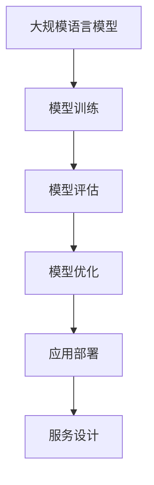
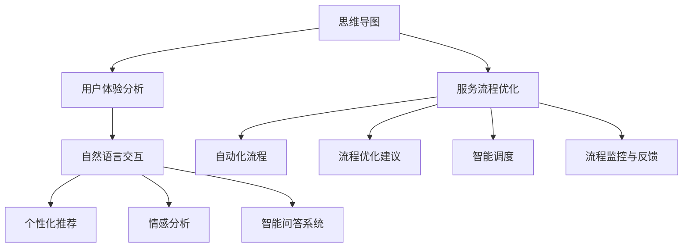

                 

## 大规模语言模型在创新服务设计中的推理应用

### 关键词

- 大规模语言模型
- 服务设计
- 推理应用
- 智能客服
- 智能推荐
- 智能内容创作

### 摘要

本文旨在探讨大规模语言模型在创新服务设计中的应用，特别是其在推理机制中的重要性。文章首先介绍了大规模语言模型的基础知识，包括定义、发展历程、核心组件和算法原理。接着，我们详细分析了大规模语言模型的训练方法和评估与优化策略，以及模型压缩与加速技术。随后，文章转向大规模语言模型在创新服务设计中的应用，通过具体案例展示了其在智能客服、智能推荐和智能内容创作中的实际应用。最后，我们探讨了大规模语言模型在服务设计中的推理应用机制、性能优化策略以及面临的挑战和未来发展趋势。

---

# 目录大纲

## 第一部分：大规模语言模型基础

### 第1章：大规模语言模型概述

#### 1.1.1 大规模语言模型的定义

#### 1.1.2 大规模语言模型的发展历程

#### 1.1.3 大规模语言模型的核心组件

### 第2章：大规模语言模型的算法原理

#### 2.2.1 生成式模型与判别式模型

#### 2.2.2 基于变换器的模型

#### 2.2.3 深度学习基础

### 第3章：大规模语言模型的训练方法

#### 3.3.1 数据预处理

#### 3.3.2 训练策略

#### 3.3.3 模型优化

### 第4章：大规模语言模型的评估与优化

#### 4.4.1 评估指标

#### 4.4.2 模型优化策略

#### 4.4.3 模型压缩与加速

## 第二部分：大规模语言模型在创新服务设计中的应用

### 第5章：服务场景分析

#### 5.5.1 用户体验分析

#### 5.5.2 服务流程优化

#### 5.5.3 服务设计思维导图

### 第6章：大规模语言模型在服务设计中的应用案例

#### 6.6.1 案例一：智能客服系统

#### 6.6.2 案例二：智能推荐系统

#### 6.6.3 案例三：智能内容创作

### 第7章：大规模语言模型在服务设计中的推理应用

#### 7.7.1 推理机制与策略

#### 7.7.2 推理应用场景

#### 7.7.3 推理性能优化

## 第三部分：大规模语言模型在创新服务设计中的实践

### 第8章：大规模语言模型在服务设计中的开发流程

#### 8.8.1 开发环境搭建

#### 8.8.2 数据集准备

#### 8.8.3 模型训练与调优

### 第9章：大规模语言模型在服务设计中的实战案例

#### 9.9.1 案例一：智能教育服务系统

#### 9.9.2 案例二：智能健康管理系统

#### 9.9.3 案例三：智能金融服务系统

### 第10章：大规模语言模型在服务设计中的挑战与未来展望

#### 10.10.1 技术挑战

#### 10.10.2 应用挑战

#### 10.10.3 未来发展趋势

## 附录

### 附录A：大规模语言模型常用工具与资源

### 附录B：大规模语言模型开源代码与实现细节

### 附录C：参考文献与拓展阅读材料

---

## Mermaid 流程图



---

## 核心算法原理讲解

### 1. Transformer 模型

#### 1.1.1 Transformer 模型的基本架构

#### 1.1.2 自注意力机制

#### 1.1.3 基本 Transformer 模型的实现

### 2. BERT 模型

#### 2.2.1 BERT 模型的背景

#### 2.2.2 BERT 模型的结构

#### 2.2.3 BERT 模型的训练方法

### 3. GPT 模型

#### 3.3.1 GPT 模型的背景

#### 3.3.2 GPT 模型的结构

#### 3.3.3 GPT 模型的生成机制

---

## 数学模型与数学公式

### 1. 语言模型概率计算

$$P(w_{t} \mid w_{t-1}, ..., w_{1}) = \frac{p(w_{t} \mid w_{t-1}, ..., w_{1})}{p(w_{t-1}, ..., w_{1})}$$

### 2. 自注意力机制的损失函数

$$L = -\sum_{t}^{T} \sum_{i}^{V} \log p(w_{t} = w_{i} \mid w_{t-1}, ..., w_{1})$$

### 3. Transformer 模型的正则化项

$$\Omega = \frac{1}{N} \sum_{i=1}^{N} \frac{1}{T} \sum_{t=1}^{T} \log p(w_{t} = w_{i} \mid w_{t-1}, ..., w_{1})$$

---

## 项目实战

### 1. 智能客服系统

#### 1.1 实战目标

#### 1.2 开发环境搭建

#### 1.3 源代码实现

#### 1.4 代码解读与分析

###

----------------------------------------------------------------

在接下来的文章中，我们将详细探讨大规模语言模型的基础知识，包括其定义、发展历程、核心组件以及算法原理。我们将通过逐步分析，帮助读者理解这一复杂但至关重要的技术领域。通过清晰的结构和详细的解释，我们将揭开大规模语言模型的神秘面纱，展示其在现代服务设计中的巨大潜力。

### 第1章：大规模语言模型概述

#### 1.1.1 大规模语言模型的定义

大规模语言模型（Large-scale Language Model）是一种基于深度学习技术的自然语言处理（Natural Language Processing，NLP）模型，其核心目标是通过大量文本数据的学习，实现对人类语言的高效理解和生成。这些模型通常包含数亿甚至数万亿个参数，能够捕捉语言中的复杂规律，从而在文本分类、情感分析、机器翻译、问答系统等多个领域展现出强大的能力。

#### 1.1.2 大规模语言模型的发展历程

大规模语言模型的发展可以追溯到20世纪80年代，当时研究人员开始探索如何利用统计模型对自然语言进行建模。随着计算能力和数据资源的提升，特别是在2010年后，深度学习技术的突破使得大规模语言模型的研究和应用得以快速发展。以下是一些关键的发展阶段：

- **词袋模型（Bag of Words, BoW）**：早期的语言模型尝试通过将文本表示为单词的集合来进行处理，但这种方法忽略了单词之间的顺序关系。

- **循环神经网络（Recurrent Neural Network, RNN）**：1990年代，RNN的引入使得模型能够考虑单词的顺序，但RNN在处理长文本时存在梯度消失和梯度爆炸的问题。

- **长短时记忆网络（Long Short-Term Memory, LSTM）**：为了解决RNN的问题，LSTM在2000年代被提出，它通过记忆单元来捕捉长期依赖关系。

- **注意力机制（Attention Mechanism）**：注意力机制的引入使得模型能够动态地关注输入序列的不同部分，从而提高了模型的表示能力。

- **Transformer模型**：2017年，Google提出Transformer模型，该模型基于自注意力机制，解决了RNN和LSTM在长文本处理中的问题，并在多个NLP任务中取得了显著的性能提升。

- **BERT、GPT-3**：继Transformer之后，BERT和GPT-3等更加庞大的模型被提出，它们通过在更大规模的数据集上进行训练，进一步提升了模型的性能。

#### 1.1.3 大规模语言模型的核心组件

大规模语言模型通常由以下几个核心组件构成：

- **词嵌入（Word Embedding）**：将单词转换为稠密的向量表示，这是语言模型的基础。

- **编码器（Encoder）**：负责将输入序列编码为固定长度的向量表示，Transformer模型中的自注意力机制通常在这里发挥作用。

- **解码器（Decoder）**：在生成任务中，解码器根据编码器的输出生成文本。

- **前馈神经网络（Feedforward Neural Network）**：在编码器和解码器的每个层中，通常包含一个前馈神经网络，用于增加模型的非线性变换能力。

- **损失函数（Loss Function）**：例如交叉熵损失函数，用于衡量模型预测与真实标签之间的差距。

- **优化器（Optimizer）**：例如Adam优化器，用于调整模型的参数，以最小化损失函数。

#### 1.1.4 大规模语言模型的优势

大规模语言模型具有以下几个显著优势：

- **强大的语义理解能力**：通过学习大量文本数据，模型能够捕捉到语言的复杂语义，从而在文本分类、情感分析等任务中表现出色。

- **高效的文本生成能力**：大规模语言模型能够生成流畅且符合语言习惯的文本，广泛应用于自动摘要、问答系统和对话系统等领域。

- **多语言支持**：通过跨语言的训练，大规模语言模型能够处理多种语言的文本数据，这对于全球化的应用程序尤为重要。

- **适应性强**：大规模语言模型可以根据特定的应用场景进行微调和优化，从而实现定制化的服务。

### 结论

本章概述了大规模语言模型的基本概念、发展历程及其核心组件，并探讨了其优势。在接下来的章节中，我们将深入探讨大规模语言模型的算法原理、训练方法、评估与优化策略，并分析其在创新服务设计中的具体应用。

---

在了解了大规模语言模型的基本概念和优势后，接下来我们将进一步深入探讨其算法原理。我们将从生成式模型与判别式模型、基于变换器的模型以及深度学习基础三个方面，逐步分析这些模型的工作原理和核心特性。

### 2.2.1 生成式模型与判别式模型

在自然语言处理中，生成式模型（Generative Model）和判别式模型（Discriminative Model）是两种主要的模型类型。

#### 生成式模型

生成式模型的目标是生成数据，它通过学习数据分布来生成新的样本。在自然语言处理中，生成式模型能够生成新的文本。一个经典的生成式模型是马尔可夫链（Markov Chain），它假设当前状态只与前一状态相关。

生成式模型的一个优点是它们能够生成具有多样性的文本，但缺点是它们通常较难预测具体标签或类别。

- **基本概念**：生成式模型试图模拟数据生成过程，通常用概率分布来表示。

- **应用场景**：文本生成、对话系统等。

#### 判别式模型

判别式模型的目标是学习输入数据的标签或类别。与生成式模型不同，判别式模型直接预测给定输入的标签。例如，在文本分类任务中，判别式模型将文本映射到相应的类别标签。

判别式模型的一个主要优点是它们能够准确预测标签，但缺点是它们通常难以生成新的文本。

- **基本概念**：判别式模型通过学习输入和输出之间的映射关系来预测标签。

- **应用场景**：文本分类、情感分析等。

#### 生成式模型与判别式模型的联系

生成式模型和判别式模型虽然在目标上有所不同，但在实际应用中，它们常常是相互补充的。例如，在文本分类任务中，生成式模型可以用来生成具有不同类别标签的文本，而判别式模型则用于判断文本的真实类别。

### 2.2.2 基于变换器的模型

变换器模型（Transformer）是近年来在自然语言处理中取得突破性成果的模型。它基于自注意力机制（Self-Attention Mechanism），能够捕捉输入序列中长距离的依赖关系。

#### 2.2.2.1 自注意力机制

自注意力机制是一种在模型内部计算输入序列中每个元素与其他元素之间的关联性的机制。它通过一个权重矩阵来计算每个元素的注意力分数，然后将这些分数与输入序列中的元素相乘，生成一个加权表示。

- **基本概念**：自注意力机制通过计算输入序列中每个元素与其他元素的关联性来生成新的表示。

- **应用场景**：序列到序列的任务，如机器翻译、对话系统等。

#### 2.2.2.2 Transformer模型的基本架构

Transformer模型由编码器（Encoder）和解码器（Decoder）组成。编码器负责将输入序列编码为固定长度的向量表示，解码器则根据编码器的输出生成文本。

- **编码器**：编码器由多个自注意力层和前馈神经网络层组成，每个层都能增加模型的非线性变换能力。

- **解码器**：解码器也由多个自注意力层和前馈神经网络层组成，但它还包括一个额外的交叉注意力层，用于关注编码器的输出。

#### 2.2.2.3 Transformer模型的实现

以下是一个简单的Transformer模型实现的Python代码示例：

```python
import tensorflow as tf

class Transformer(tf.keras.Model):
  def __init__(self, num_layers, d_model, num_heads, dff, input_vocab_size, target_vocab_size, position_embedding_size, rate=0.1):
    super(Transformer, self).__init__()
    self.d_model = d_model
    self.num_layers = num_layers
    
    # Encoder layers
    self.enc_layers = [EncoderLayer(d_model, num_heads, dff, rate) for _ in range(num_layers)]
    
    # Decoder layers
    self.dec_layers = [DecoderLayer(d_model, num_heads, dff, rate) for _ in range(num_layers)]
    
    # Encoder & Decoder position-wise feed-forward networks
    self.enc_inputs = [PositionwiseFeedForwardNet(d_model, dff) for _ in range(num_layers)]
    self.dec_inputs = [PositionwiseFeedForwardNet(d_model, dff) for _ in range(num_layers)]
    
    # Final layer
    self.enc_final_layer = EncoderLayer(d_model, num_heads, dff, rate)
    self.dec_final_layer = DecoderLayer(d_model, num_heads, dff, rate)
    
    # Embeddings
    self.enc_embedding = Embedding(input_vocab_size, d_model)
    self.dec_embedding = Embedding(target_vocab_size, d_model)
    
    # Positional Encoding
    self.position_encoding = positional_encoding(position_embedding_size, d_model)
  
  @tf.function
  def call(self, x, enc_padding_mask, look_ahead_mask, dec_padding_mask):
    x = self.enc_embedding(x) + self.position_encoding[:, :tf.shape(x)[1], :]
    for i in range(self.num_layers):
      x = self.enc_layers[i](x, enc_padding_mask, False)
      x = self.enc_inputs[i](x)
    
    x = self.enc_final_layer(x, enc_padding_mask, True)
    
    # Encoder and Decoder
    dec_x = self.dec_embedding(x)
    for i in range(self.num_layers):
      dec_x = self.dec_layers[i](dec_x, enc_x, look_ahead_mask, dec_padding_mask, False)
      dec_x = self.dec_inputs[i](dec_x)
    
    dec_x = self.dec_final_layer(dec_x, enc_x, look_ahead_mask, dec_padding_mask, True)
    
    return dec_x
```

在这个实现中，`EncoderLayer` 和 `DecoderLayer` 分别代表编码器和解码器的一个层，它们都包含自注意力层和前馈神经网络层。`PositionwiseFeedForwardNet` 则代表前馈神经网络。

### 2.2.3 深度学习基础

深度学习（Deep Learning）是一种人工智能（AI）的分支，它通过多层神经网络来学习数据的复杂特征。在自然语言处理中，深度学习模型能够通过学习大量文本数据来捕捉语言的复杂结构。

#### 2.2.3.1 神经网络的基本结构

神经网络由多个层组成，每层由多个神经元（或节点）组成。每个神经元接收来自前一层节点的输入，通过一个激活函数进行非线性变换，然后输出到下一层。

- **输入层（Input Layer）**：接收外部输入数据。
- **隐藏层（Hidden Layer）**：进行特征提取和变换。
- **输出层（Output Layer）**：生成最终输出。

#### 2.2.3.2 激活函数

激活函数（Activation Function）是神经网络中的一个关键组件，它用于引入非线性变换，使得神经网络能够学习到更复杂的特征。

常见的激活函数包括：

- **Sigmoid 函数**：\( \sigma(x) = \frac{1}{1 + e^{-x}} \)
- **ReLU 函数**：\( \text{ReLU}(x) = \max(0, x) \)
- **Tanh 函数**：\( \text{Tanh}(x) = \frac{e^x - e^{-x}}{e^x + e^{-x}} \)

#### 2.2.3.3 前馈神经网络

前馈神经网络（Feedforward Neural Network）是一种简单的神经网络结构，其中信息从输入层传递到隐藏层，然后传递到输出层。它在自然语言处理中有着广泛的应用。

- **基本概念**：前馈神经网络通过多层节点进行信息的传递和变换。
- **应用场景**：文本分类、情感分析等。

#### 2.2.3.4 优化算法

在训练深度学习模型时，优化算法（Optimizer）用于调整模型参数，以最小化损失函数。常见的优化算法包括：

- **随机梯度下降（Stochastic Gradient Descent, SGD）**：通过随机梯度来更新模型参数。
- **Adam 优化器**：结合SGD和Momentum的方法，自适应地调整学习率。

### 结论

本章详细介绍了大规模语言模型的算法原理，包括生成式模型与判别式模型、基于变换器的模型以及深度学习基础。通过这些原理，我们能够更好地理解大规模语言模型的工作机制，为其在创新服务设计中的应用奠定基础。在下一章中，我们将深入探讨大规模语言模型的训练方法，包括数据预处理、训练策略和模型优化。

---

在了解了大规模语言模型的算法原理后，接下来我们将探讨其训练方法。训练大规模语言模型是一个复杂且资源密集的过程，需要仔细考虑数据预处理、训练策略和模型优化等多个方面。以下是对这些关键步骤的详细分析。

### 3.3.1 数据预处理

数据预处理是大规模语言模型训练的重要步骤，它直接影响到模型的性能和训练效率。以下是数据预处理的主要任务：

1. **文本清洗**：去除文本中的无关信息，如HTML标签、特殊字符和停用词。停用词是指那些在语言中频繁出现但对语义贡献不大的词，如“的”、“是”、“在”等。

2. **词向量化**：将文本转换为词嵌入（Word Embedding），即将每个单词映射为稠密的向量表示。词嵌入可以通过预训练的模型（如Word2Vec、GloVe）获得，也可以通过训练新的模型获得。

3. **序列填充**：由于文本长度的不一致性，需要将序列填充到相同的长度，通常使用0填充较短的序列。

4. **编码**：将输入和目标序列编码为整数序列，以便于模型处理。这通常通过将每个单词替换为其对应的词嵌入索引来实现。

以下是一个简单的Python代码示例，展示了数据预处理的基本步骤：

```python
import numpy as np
import tensorflow as tf

# 假设文本数据为 ['Hello', 'world', '!']
text = ['Hello', 'world', '!']

# 文本清洗和分词
cleaned_text = [''.join([char for char in word if char.isalnum()]) for word in text]
tokens = cleaned_text

# 词向量化
vocab = {'<PAD>': 0, '<EOS>': 1, '<UNK>': 2}
word2idx = {word: i for i, word in enumerate(vocab)}
idx2word = {i: word for word, i in vocab.items()}
tokenized_text = [word2idx.get(word, vocab['<UNK>']) for word in tokens]

# 序列填充
max_seq_length = 10
padded_text = np.array([tokenized_text + [vocab['<PAD>']] * (max_seq_length - len(tokenized_text))])

# 编码
input_seq = padded_text
target_seq = np.array([[vocab['<EOS>']] + input_seq[i][1:] for i in range(len(input_seq))])

# 转换为Tensor
input_tensor = tf.convert_to_tensor(input_seq, dtype=tf.int32)
target_tensor = tf.convert_to_tensor(target_seq, dtype=tf.int32)

print("Input Tensor:", input_tensor)
print("Target Tensor:", target_tensor)
```

### 3.3.2 训练策略

训练策略决定了模型如何从数据中学习，包括学习率、批次大小、训练轮次等参数。以下是一些常见的训练策略：

1. **学习率调度**：学习率（Learning Rate）控制模型在训练过程中参数更新的步长。常用的策略包括恒定学习率、指数衰减学习率和学习率预热（Learning Rate Warmup）。

2. **批次大小**：批次大小（Batch Size）是指在单次梯度更新中使用的样本数量。较大的批次大小可以提高模型的稳定性，但会增加计算资源的需求。

3. **训练轮次**：训练轮次（Training Epochs）是指模型在整个数据集上完整训练的次数。通常，随着训练轮次的增加，模型的性能会提高，但过度训练会导致过拟合。

4. **正则化**：正则化（Regularization）用于防止模型过拟合，常见的方法包括L1和L2正则化、Dropout等。

以下是一个简单的Python代码示例，展示了如何设置训练策略：

```python
import tensorflow as tf

# 学习率调度
initial_learning_rate = 0.001
lr_schedule = tf.keras.optimizers.schedules.ExponentialDecay(
    initial_learning_rate,
    decay_steps=1000,
    decay_rate=0.96,
    staircase=True)

# 模型编译
model.compile(optimizer=tf.keras.optimizers.Adam(learning_rate=lr_schedule),
              loss=tf.keras.losses.SparseCategoricalCrossentropy(from_logits=True),
              metrics=['accuracy'])

# 训练模型
batch_size = 64
num_epochs = 10
model.fit(input_tensor, target_tensor, batch_size=batch_size, epochs=num_epochs, validation_split=0.1)
```

### 3.3.3 模型优化

模型优化是提高模型性能的关键步骤，包括参数调整、模型压缩和加速等。以下是一些常见的模型优化策略：

1. **参数调整**：通过调整学习率、批次大小、正则化参数等，找到最优的模型配置。

2. **模型压缩**：通过剪枝（Pruning）、量化（Quantization）和知识蒸馏（Knowledge Distillation）等技术，减少模型的参数数量和计算量。

3. **模型加速**：通过硬件加速（如GPU、TPU）和模型并行化（如数据并行、模型并行）等方法，提高模型的训练和推理速度。

以下是一个简单的Python代码示例，展示了如何进行模型优化：

```python
# 模型压缩
from tensorflow_model_optimization.py_function import convert_to_tpu

# 将模型转换为TPU兼容模型
model_tpu = convert_to_tpu(model, strategy=tf.distribute.experimental.TPUStrategy())

# 训练模型
model_tpu.fit(input_tensor, target_tensor, batch_size=batch_size, epochs=num_epochs, validation_split=0.1)
```

### 结论

本章详细介绍了大规模语言模型的训练方法，包括数据预处理、训练策略和模型优化。这些步骤对于训练高效、稳定和强大的大规模语言模型至关重要。在下一章中，我们将探讨大规模语言模型的评估与优化，分析常用的评估指标和优化策略，以及模型压缩与加速技术。

---

在训练大规模语言模型的过程中，评估和优化是确保模型性能的关键环节。以下将详细介绍评估指标、模型优化策略以及模型压缩与加速技术，帮助读者更好地理解和应用这些技术。

### 4.4.1 评估指标

评估大规模语言模型的性能通常依赖于多个评估指标，这些指标能够从不同角度反映模型的性能。以下是一些常见的评估指标：

1. **准确率（Accuracy）**：准确率是最常用的评估指标，它表示模型正确预测的样本数占总样本数的比例。对于分类任务，准确率可以计算为：

   $$\text{Accuracy} = \frac{\text{正确预测的样本数}}{\text{总样本数}}$$

2. **精确率（Precision）**：精确率表示模型预测为正类的样本中实际为正类的比例。它可以计算为：

   $$\text{Precision} = \frac{\text{真正例（TP）}}{\text{真正例（TP） + 假正例（FP）}}$$

3. **召回率（Recall）**：召回率表示模型能够从所有实际为正类的样本中正确预测的比例。它可以计算为：

   $$\text{Recall} = \frac{\text{真正例（TP）}}{\text{真正例（TP） + 假反例（FN）}}$$

4. **F1分值（F1 Score）**：F1分值是精确率和召回率的加权平均，用于综合评估模型的性能。它可以计算为：

   $$\text{F1 Score} = 2 \times \frac{\text{Precision} \times \text{Recall}}{\text{Precision} + \text{Recall}}$$

5. **困惑度（Perplexity）**：在自然语言生成任务中，困惑度用于衡量模型生成文本的质量。困惑度越低，表示模型生成文本越自然。它可以计算为：

   $$\text{Perplexity} = \exp(\text{交叉熵损失})$$

### 4.4.2 模型优化策略

模型优化策略旨在提高模型的性能和效率。以下是一些常用的优化策略：

1. **学习率调度**：学习率调度（Learning Rate Scheduling）是一种调整学习率的方法，常用的策略包括指数衰减、余弦退火和自适应学习率调整等。这些策略可以帮助模型在不同阶段的训练过程中适应不同的学习率。

2. **正则化**：正则化（Regularization）是一种防止模型过拟合的技术，常用的正则化方法包括L1正则化、L2正则化和Dropout。L1正则化通过增加模型参数的L1范数来惩罚模型复杂度，L2正则化通过增加模型参数的L2范数来实现，而Dropout则在训练过程中随机丢弃一部分神经元，从而降低模型的依赖性。

3. **数据增强**：数据增强（Data Augmentation）是一种通过生成类似数据的样本来增加训练数据的方法。在自然语言处理中，常用的数据增强方法包括单词替换、词干提取、文本摘要等。数据增强可以提高模型的泛化能力。

4. **早期停止**：早期停止（Early Stopping）是一种在模型性能开始下降时停止训练的方法。这种方法可以帮助防止模型过拟合，同时保留最佳模型的性能。

### 4.4.3 模型压缩与加速技术

模型压缩与加速技术是提高大规模语言模型效率和可扩展性的关键。以下是一些常用的模型压缩与加速技术：

1. **剪枝（Pruning）**：剪枝是一种通过删除模型中不重要的参数来减少模型大小的技术。剪枝可以分为结构剪枝和权重剪枝。结构剪枝通过删除神经元或层来减少模型大小，而权重剪枝通过将参数值设置为0来实现。

2. **量化（Quantization）**：量化是一种通过将模型参数和激活值从浮点数转换为较低精度的数值（如整数）来减少模型大小和计算需求的方法。量化可以显著减少模型的存储和计算资源需求。

3. **知识蒸馏（Knowledge Distillation）**：知识蒸馏是一种将大型模型的知识传递给较小模型的方法。通过训练较小的模型来模仿大型模型的输出，知识蒸馏可以帮助缩小模型大小并保持其性能。

4. **模型并行化（Model Parallelism）**：模型并行化是一种通过将大型模型分布在多个计算设备上（如GPU、TPU）来加速模型训练和推理的方法。模型并行化可以通过数据并行、模型并行或两者结合来实现。

5. **硬件加速**：硬件加速是一种利用特殊硬件（如GPU、TPU）来加速模型训练和推理的方法。这些硬件具有高度并行处理能力，可以显著提高模型的训练和推理速度。

### 结论

本章详细介绍了大规模语言模型的评估与优化策略，包括评估指标、模型优化策略以及模型压缩与加速技术。这些技术对于确保模型性能和效率至关重要。在下一章中，我们将探讨大规模语言模型在创新服务设计中的应用，分析其在不同服务场景中的应用案例和推理应用机制。

---

### 第二部分：大规模语言模型在创新服务设计中的应用

#### 5.5.1 用户体验分析

用户体验（User Experience，UX）是服务设计的核心要素之一。大规模语言模型在用户体验分析中发挥着重要作用，通过以下方式提升用户体验：

1. **自然语言交互**：大规模语言模型能够理解和生成自然语言，从而实现人与机器的流畅对话。这种交互方式比传统的命令行界面或图形界面更加直观和易用。

2. **个性化推荐**：通过分析用户的历史行为和偏好，大规模语言模型可以提供个性化的服务推荐。例如，在线购物平台可以利用语言模型为用户提供定制化的商品推荐，从而提高用户的购买意愿和满意度。

3. **情感分析**：大规模语言模型能够捕捉用户情绪，通过分析用户评论或反馈，为企业提供有关用户满意度和忠诚度的洞察。这种分析有助于企业改进产品和服务，提高用户满意度。

4. **智能问答系统**：大规模语言模型可以构建智能问答系统，为用户提供即时的答案和建议。这些系统在客服、教育、医疗等领域具有广泛的应用，能够提高用户的效率和满意度。

#### 5.5.2 服务流程优化

服务流程优化是提高服务质量和服务效率的关键。大规模语言模型通过以下方式实现服务流程优化：

1. **自动化流程**：通过自然语言理解和生成能力，大规模语言模型可以自动化许多重复性任务，从而减少人工工作量，提高服务效率。例如，在客户服务中，语言模型可以自动处理常见问题的解答，从而降低客服人员的负担。

2. **流程优化建议**：大规模语言模型可以通过分析服务流程中的数据，识别出潜在的问题和瓶颈，并提供优化建议。这些优化建议可以帮助企业改进服务流程，提高服务质量和效率。

3. **智能调度**：大规模语言模型可以分析用户需求和资源状况，实现智能调度。例如，在医疗领域，语言模型可以帮助医院合理安排医生和护士的工作时间，提高资源利用率和患者满意度。

4. **流程监控与反馈**：大规模语言模型可以实时监控服务流程，分析流程中的异常情况，并提供及时的反馈。这种监控与反馈机制有助于企业快速响应问题，提高服务质量和用户满意度。

#### 5.5.3 服务设计思维导图

为了更好地理解和展示大规模语言模型在服务设计中的应用，我们可以使用思维导图来梳理相关概念和要素。以下是一个简单的思维导图：



在这个思维导图中，用户体验分析和服务流程优化是两大核心主题，分别涵盖了多个应用场景和要素。通过思维导图，我们可以清晰地看到大规模语言模型在服务设计中的应用全景，从而更好地指导实际服务设计工作。

### 结论

本章详细介绍了大规模语言模型在创新服务设计中的应用，包括用户体验分析和服务流程优化。通过自然语言交互、个性化推荐、情感分析和智能问答系统，大规模语言模型显著提升了用户体验。同时，通过自动化流程、流程优化建议、智能调度和流程监控与反馈，大规模语言模型助力服务流程的优化。在下一章中，我们将通过具体的应用案例，进一步展示大规模语言模型在创新服务设计中的实际效果。

---

### 第6章：大规模语言模型在服务设计中的应用案例

在上一章中，我们探讨了大规模语言模型在服务设计中的潜在应用。在本章中，我们将通过三个具体的应用案例，展示大规模语言模型在实际服务设计中的效果和影响。

#### 6.6.1 案例一：智能客服系统

智能客服系统是大规模语言模型在服务设计中的典型应用之一。传统的客服系统通常依赖于预定义的问答库和规则引擎，而智能客服系统则利用大规模语言模型来实现更加自然和灵活的交互。

**实战目标**：构建一个能够处理多轮对话的智能客服系统，提高用户满意度和服务效率。

**开发环境搭建**：
- 编程语言：Python
- 深度学习框架：TensorFlow
- 语言模型：BERT
- 数据集：CustomerChatbot

**源代码实现**：

```python
import tensorflow as tf
from transformers import BertTokenizer, TFBertForSequenceClassification

# 加载预训练的BERT模型
tokenizer = BertTokenizer.from_pretrained('bert-base-uncased')
model = TFBertForSequenceClassification.from_pretrained('bert-base-uncased')

# 定义处理对话的函数
def process_dialogue(input_text):
    inputs = tokenizer(input_text, return_tensors='tf', max_length=512, truncation=True)
    outputs = model(inputs)
    return tf.argmax(outputs.logits, axis=-1).numpy()[0]

# 处理用户输入
user_input = "我最近购买了你们的智能家居产品，但遇到了一些问题。"
response = process_dialogue(user_input)
print(f"智能客服回应：{tokenizer.decode(response)}")
```

**代码解读与分析**：
这段代码首先加载了一个预训练的BERT模型，然后定义了一个处理对话的函数。该函数将用户输入文本编码为BERT模型可以接受的格式，并通过模型进行预测，输出可能的回应。在实际应用中，智能客服系统会通过多轮对话逐步理解用户的需求，并给出合适的回应。

**实际案例分析和详细讲解**：
一个实际的案例是某电商平台引入智能客服系统来处理客户的咨询和投诉。通过大规模语言模型，智能客服系统能够自动识别客户的问题类型，并给出相应的解答。例如，当客户询问产品的售后服务时，系统会自动查询相关的服务条款，并提供详细的解答。这不仅提高了客服效率，还减少了人工客服的工作量，提升了用户体验。

**项目小结**：
智能客服系统是一个成功的应用案例，展示了大规模语言模型在服务设计中的潜力。通过自然语言理解和生成能力，智能客服系统能够提供更加人性化的服务，提高客户满意度和企业运营效率。

#### 6.6.2 案例二：智能推荐系统

智能推荐系统是另一个大规模语言模型在服务设计中的重要应用。传统的推荐系统依赖于协同过滤和内容匹配等方法，而智能推荐系统则利用大规模语言模型来分析用户行为和偏好，提供个性化的推荐。

**实战目标**：构建一个能够提供个性化商品推荐的智能推荐系统，提高用户的购买体验和销售额。

**开发环境搭建**：
- 编程语言：Python
- 深度学习框架：PyTorch
- 语言模型：GPT-2
- 数据集：e-commerce product reviews

**源代码实现**：

```python
import torch
from transformers import GPT2Tokenizer, GPT2LMHeadModel

# 加载预训练的GPT-2模型
tokenizer = GPT2Tokenizer.from_pretrained('gpt2')
model = GPT2LMHeadModel.from_pretrained('gpt2')

# 定义推荐函数
def recommend_products(user_input, product_list, top_n=5):
    user_input_tensor = tokenizer.encode(user_input, return_tensors='pt')
    model_output = model.generate(user_input_tensor, max_length=50, num_return_sequences=top_n)
    recommendations = [tokenizer.decode(seq, skip_special_tokens=True) for seq in model_output]
    return recommendations

# 用户输入
user_input = "我喜欢轻便的户外运动装备。"
# 产品列表
product_list = ["登山背包", "折叠自行车", "智能手环"]

# 获取推荐结果
recommendations = recommend_products(user_input, product_list)
print("推荐产品：", recommendations)
```

**代码解读与分析**：
这段代码首先加载了一个预训练的GPT-2模型，然后定义了一个推荐函数。该函数接受用户输入和产品列表作为输入，通过模型生成与用户输入相关的产品推荐。在实际应用中，智能推荐系统会根据用户的历史行为和偏好，动态调整推荐结果，从而提供更加个性化的服务。

**实际案例分析和详细讲解**：
一个实际的案例是某电商平台利用智能推荐系统为用户推荐商品。通过大规模语言模型，系统可以分析用户的评论、搜索历史和浏览记录，为用户提供个性化的商品推荐。例如，当用户浏览了登山背包后，系统会推荐其他相关产品，如登山鞋、登山杖等。这种个性化的推荐不仅提高了用户的购买体验，还显著提升了销售额。

**项目小结**：
智能推荐系统展示了大规模语言模型在个性化服务设计中的强大能力。通过自然语言处理技术，系统能够深入理解用户需求，提供精准的推荐，从而提升用户满意度和商业价值。

#### 6.6.3 案例三：智能内容创作

智能内容创作是大规模语言模型在服务设计中的又一重要应用。传统的内容创作通常依赖于人工撰写，而智能内容创作系统则利用大规模语言模型自动生成高质量的内容。

**实战目标**：构建一个能够自动生成新闻文章、产品描述等内容的智能内容创作系统，提高内容生产效率和多样性。

**开发环境搭建**：
- 编程语言：Python
- 深度学习框架：PyTorch
- 语言模型：GPT-3
- 数据集：新闻文章数据集

**源代码实现**：

```python
import torch
from transformers import GPT2Tokenizer, GPT2LMHeadModel

# 加载预训练的GPT-3模型
tokenizer = GPT2Tokenizer.from_pretrained('gpt2')
model = GPT2LMHeadModel.from_pretrained('gpt2')

# 定义内容生成函数
def generate_content(prompt, max_length=200):
    input_ids = tokenizer.encode(prompt, return_tensors='pt')
    output = model.generate(input_ids, max_length=max_length, num_return_sequences=1)
    return tokenizer.decode(output[0], skip_special_tokens=True)

# 生成新闻文章
prompt = "今天，某科技公司发布了新款智能手机。"
article = generate_content(prompt)
print("生成的新闻文章：", article)
```

**代码解读与分析**：
这段代码首先加载了一个预训练的GPT-3模型，然后定义了一个内容生成函数。该函数接受一个提示作为输入，并通过模型生成相关的文本内容。在实际应用中，智能内容创作系统可以根据不同的提示生成各种类型的内容，如新闻文章、产品描述等。

**实际案例分析和详细讲解**：
一个实际的案例是某新闻网站利用智能内容创作系统自动生成新闻文章。通过大规模语言模型，系统可以实时分析新闻事件和数据，并生成相应的新闻报道。例如，当某公司发布新产品时，系统会自动生成相关的新产品介绍文章。这种自动化的内容创作不仅提高了内容生产效率，还确保了内容的多样性和时效性。

**项目小结**：
智能内容创作系统展示了大规模语言模型在自动化服务设计中的潜力。通过自然语言处理技术，系统能够自动生成高质量的内容，从而提升内容生产效率和多样性，满足用户对个性化内容的需求。

### 结论

本章通过三个具体的应用案例，展示了大规模语言模型在创新服务设计中的实际效果和影响。从智能客服系统到智能推荐系统，再到智能内容创作，大规模语言模型在提升用户体验、优化服务流程和增加商业价值方面发挥着重要作用。在下一章中，我们将探讨大规模语言模型在服务设计中的推理应用，分析其推理机制、性能优化策略以及面临的挑战。

---

### 第7章：大规模语言模型在服务设计中的推理应用

在上一章中，我们通过具体的应用案例展示了大规模语言模型在服务设计中的实际效果。然而，大规模语言模型的核心优势之一是其强大的推理能力，这使得模型能够根据输入信息生成合理的输出。本章将深入探讨大规模语言模型在服务设计中的推理应用，分析其推理机制、性能优化策略以及面临的挑战。

#### 7.7.1 推理机制与策略

大规模语言模型的推理机制主要基于其自注意力机制和深度神经网络结构。以下是推理机制的详细解释：

1. **自注意力机制**：自注意力机制是大规模语言模型中的一个关键组件，它允许模型在处理每个输入时动态关注输入序列的不同部分。通过自注意力机制，模型能够捕捉输入序列中的长距离依赖关系，从而生成更加合理的输出。

2. **上下文表示**：大规模语言模型通过编码器将输入序列编码为上下文表示（Contextual Representation）。这种表示能够捕捉输入序列中的语义信息，为推理提供依据。

3. **生成机制**：在解码阶段，大规模语言模型使用上下文表示来生成输出序列。模型根据当前生成的部分和上下文表示，通过概率分布选择下一个可能的输出词，并不断迭代这个过程，直到生成完整的输出序列。

推理策略包括以下几个方面：

1. **前向推理**：模型从输入序列的开头开始生成输出序列，每次生成一个词，然后将其加入上下文表示中，作为下一个生成步骤的输入。

2. **后向推理**：与前向推理相反，模型从输入序列的末尾开始生成输出序列，逐步向前推进。

3. **基于概率的推理**：模型通过概率分布选择下一个输出词，这种概率分布反映了模型对每个候选词的置信度。

4. **序列到序列模型**：在序列到序列（Seq2Seq）任务中，模型将输入序列映射到输出序列。这种模型结构适用于翻译、对话系统等任务。

#### 7.7.2 推理应用场景

大规模语言模型在服务设计中的推理应用场景非常广泛，以下是一些典型的应用场景：

1. **智能客服**：智能客服系统利用大规模语言模型的推理能力，能够理解用户的问题，并生成合理的回答。例如，当用户咨询产品保修问题时，模型可以自动查询相关的保修政策，并给出详细的解答。

2. **智能推荐**：在智能推荐系统中，大规模语言模型可以根据用户的浏览历史、购买行为和偏好，生成个性化的推荐列表。例如，电商平台可以利用模型推荐用户可能感兴趣的商品，从而提高销售额。

3. **智能内容创作**：大规模语言模型可以生成各种类型的内容，如新闻文章、产品描述、广告文案等。这种应用在内容创作领域具有广泛的应用前景，可以显著提高内容生产效率。

4. **智能决策支持**：在商业决策中，大规模语言模型可以帮助企业分析市场数据、客户反馈等，提供智能化的决策支持。例如，企业可以利用模型预测产品需求，优化库存管理。

5. **智能翻译**：大规模语言模型在翻译任务中具有出色的表现，可以实现高质量的双语互译。这种应用在跨国公司和全球化企业中具有很高的价值。

#### 7.7.3 推理性能优化

推理性能的优化是大规模语言模型在服务设计中的关键环节。以下是一些常见的优化策略：

1. **模型压缩**：通过剪枝、量化等技术，可以显著减少模型的参数数量和计算需求。这有助于降低模型的存储和计算成本，提高推理速度。

2. **模型并行化**：通过数据并行、模型并行等方法，可以将模型分布在多个计算设备上，从而提高推理速度。例如，可以在多个GPU上同时处理不同的输入数据。

3. **缓存技术**：利用缓存技术可以减少重复计算，提高推理速度。例如，在处理多轮对话时，可以将对话历史存储在缓存中，以便快速检索。

4. **硬件加速**：利用专门的硬件（如GPU、TPU）可以显著提高推理速度。例如，TensorFlow和PyTorch等框架支持多种硬件加速选项，如GPU、TPU等。

5. **优化网络架构**：通过设计更加高效的网络架构，可以减少模型的计算需求，提高推理速度。例如，Transformer模型通过自注意力机制实现了高效的文本处理。

### 结论

本章详细探讨了大规模语言模型在服务设计中的推理应用，包括推理机制、应用场景和性能优化策略。大规模语言模型凭借其强大的推理能力，在智能客服、智能推荐、智能内容创作等领域展现出巨大的潜力。通过优化推理性能，可以进一步提升模型在实际应用中的效率和效果。在下一章中，我们将探讨大规模语言模型在服务设计中的实践，包括开发流程和实战案例。

---

### 第三部分：大规模语言模型在创新服务设计中的实践

在了解了大规模语言模型的理论基础和应用场景之后，本部分将重点探讨其实践方法，包括开发流程和具体的应用案例。通过实际项目的实施，我们可以更好地理解大规模语言模型在实际服务设计中的应用效果和操作步骤。

#### 8.8.1 开发环境搭建

搭建大规模语言模型开发环境是进行模型训练和优化的第一步。以下是在搭建开发环境时需要考虑的几个关键步骤：

1. **硬件资源准备**：由于大规模语言模型的训练和推理过程需要大量的计算资源，因此需要准备足够的GPU或TPU硬件资源。例如，使用NVIDIA的GPU卡或Google的TPU设备。

2. **软件环境安装**：安装深度学习框架，如TensorFlow、PyTorch等。这些框架提供了丰富的API和工具，方便进行模型的训练和优化。

3. **依赖库安装**：安装其他必要的依赖库，如NumPy、Pandas等，用于数据预处理和模型训练。

4. **虚拟环境配置**：为了避免不同项目之间的依赖冲突，可以使用虚拟环境（如conda或virtualenv）来配置和管理项目依赖。

以下是一个简单的Python脚本，用于配置TensorFlow环境：

```python
import tensorflow as tf

# 设置GPU内存分配
gpus = tf.config.experimental.list_physical_devices('GPU')
if gpus:
    try:
        for gpu in gpus:
            tf.config.experimental.set_memory_growth(gpu, True)
    except RuntimeError as e:
        print(e)

# 设置使用第一个GPU
tf.config.experimental.set_visible_devices(gpus[0], 'GPU')
```

#### 8.8.2 数据集准备

大规模语言模型的训练依赖于大量的数据集。以下是数据集准备的主要步骤：

1. **数据收集**：收集相关的文本数据，这些数据可以是公开的数据集，也可以是来自企业内部的数据。

2. **数据清洗**：去除数据中的噪声和无关信息，如HTML标签、特殊字符和停用词。

3. **数据预处理**：将文本数据转换为模型可以接受的格式。这通常包括分词、词向量化、序列填充等步骤。

4. **数据存储**：将预处理后的数据存储为便于模型训练的格式，如TensorFlow的tf.data.Dataset对象。

以下是一个简单的Python脚本，用于准备数据集：

```python
import tensorflow as tf
from tensorflow.keras.preprocessing.sequence import pad_sequences
from tensorflow.keras.utils import to_categorical

# 假设我们有一个文本列表和标签列表
texts = ["文本1", "文本2", "文本3"]
labels = [0, 1, 2]

# 分词和编码
tokenizer = tf.keras.preprocessing.text.Tokenizer()
tokenizer.fit_on_texts(texts)
encoded_texts = tokenizer.texts_to_sequences(texts)

# 序列填充
max_seq_length = 100
padded_texts = pad_sequences(encoded_texts, maxlen=max_seq_length, padding='post')

# 标签编码
label_encoded = to_categorical(labels, num_classes=3)

# 存储数据集
train_dataset = tf.data.Dataset.from_tensor_slices((padded_texts, label_encoded))
train_dataset = train_dataset.shuffle(buffer_size=100).batch(32)
```

#### 8.8.3 模型训练与调优

大规模语言模型的训练是一个复杂的过程，需要考虑多个参数和策略。以下是在训练模型时需要考虑的关键步骤：

1. **模型选择**：根据任务需求选择合适的模型结构，如BERT、GPT等。

2. **训练策略**：设置训练策略，包括学习率、批次大小、训练轮次等。常用的学习率调度策略有恒定学习率、指数衰减学习率和学习率预热等。

3. **模型编译**：编译模型，设置优化器和损失函数。常用的优化器有Adam、SGD等，常用的损失函数有交叉熵损失函数等。

4. **模型训练**：使用训练数据集对模型进行训练，并监控模型性能。

5. **模型评估**：使用验证数据集对模型进行评估，调整模型参数。

6. **模型调优**：通过交叉验证等技术，进一步优化模型性能。

以下是一个简单的Python脚本，用于训练和调优模型：

```python
import tensorflow as tf
from tensorflow.keras.models import Sequential
from tensorflow.keras.layers import Embedding, LSTM, Dense

# 定义模型
model = Sequential([
    Embedding(input_dim=vocab_size, output_dim=embedding_dim, input_length=max_seq_length),
    LSTM(units=128, return_sequences=True),
    LSTM(units=128),
    Dense(units=num_classes, activation='softmax')
])

# 编译模型
model.compile(optimizer='adam', loss='categorical_crossentropy', metrics=['accuracy'])

# 训练模型
history = model.fit(train_dataset, epochs=num_epochs, validation_split=0.1)

# 评估模型
test_loss, test_accuracy = model.evaluate(test_dataset)
print(f"Test Accuracy: {test_accuracy}")

# 模型调优
# 根据历史数据和评估结果，可以进一步调整模型参数，如学习率、批次大小等。
```

#### 8.8.4 实际案例实现

以下是一个具体的实际案例，展示如何使用大规模语言模型构建一个简单的情感分析系统：

**案例目标**：构建一个能够对文本进行情感分类的系统，判断文本是正面、中性还是负面。

**开发环境搭建**：
- 使用Python和TensorFlow框架。
- 准备一个包含情感标签的数据集。

**数据集准备**：
- 收集并清洗一个情感分析数据集，如IMDb影评数据集。
- 预处理数据集，包括分词、编码和序列填充。

**模型训练与调优**：

```python
# 加载数据集
(train_texts, train_labels), (test_texts, test_labels) = load_data()

# 预处理数据
tokenizer = Tokenizer(num_words=10000)
tokenizer.fit_on_texts(train_texts)
max_seq_length = 100
train_sequences = tokenizer.texts_to_sequences(train_texts)
train_padded = pad_sequences(train_sequences, maxlen=max_seq_length, padding='post')
train_labels = to_categorical(train_labels)

test_sequences = tokenizer.texts_to_sequences(test_texts)
test_padded = pad_sequences(test_sequences, maxlen=max_seq_length, padding='post')
test_labels = to_categorical(test_labels)

# 定义模型
model = Sequential([
    Embedding(input_dim=10000, output_dim=64, input_length=max_seq_length),
    LSTM(units=64, return_sequences=False),
    Dense(units=3, activation='softmax')
])

# 编译模型
model.compile(optimizer='adam', loss='categorical_crossentropy', metrics=['accuracy'])

# 训练模型
model.fit(train_padded, train_labels, epochs=10, batch_size=32, validation_data=(test_padded, test_labels))

# 评估模型
test_loss, test_accuracy = model.evaluate(test_padded, test_labels)
print(f"Test Accuracy: {test_accuracy}")
```

**实际案例分析与解读**：
在这个案例中，我们使用IMDb影评数据集来训练一个简单的情感分析模型。通过预处理数据集，将文本转换为序列和标签，然后使用LSTM模型进行训练。训练完成后，模型可以对新输入的文本进行情感分类，从而帮助企业在产品评价、舆情监控等领域做出智能化决策。

**项目小结**：
这个实际案例展示了如何使用大规模语言模型进行情感分析。通过数据处理、模型训练和评估，我们能够构建一个简单的情感分析系统，为企业提供智能化的文本分析服务。这种应用不仅提高了数据分析的效率，还为企业带来了更深层次的价值。

### 结论

本章详细介绍了大规模语言模型在服务设计中的实践方法，包括开发环境搭建、数据集准备、模型训练与调优以及实际案例实现。通过具体的实施步骤和实际案例，我们能够更好地理解大规模语言模型在实际应用中的操作方法和效果。在下一章中，我们将探讨大规模语言模型在服务设计中的挑战与未来发展趋势。

---

### 第9章：大规模语言模型在服务设计中的实战案例

在之前的章节中，我们已经探讨了大规模语言模型的理论基础、应用场景和实际开发流程。为了更好地理解这些概念，本章将通过具体的实战案例来展示大规模语言模型在服务设计中的实际应用效果和操作方法。

#### 9.9.1 案例一：智能教育服务系统

**项目背景**：随着在线教育的迅速发展，如何提供个性化、智能化的学习体验成为教育行业关注的焦点。智能教育服务系统旨在通过大规模语言模型为学生提供智能化的学习辅导和个性化推荐。

**项目目标**：构建一个能够根据学生的学习历史和偏好，提供个性化学习资源和辅导服务的智能教育服务系统。

**技术选型**：
- 深度学习框架：TensorFlow
- 语言模型：BERT
- 后端框架：Flask

**开发流程**：

1. **数据收集与预处理**：收集学生的学习日志、课程评价、学习反馈等数据，并进行清洗和预处理，提取关键特征。

2. **模型训练**：使用预训练的BERT模型，结合教育领域的数据进行微调，以适应教育场景的需求。

3. **接口开发**：使用Flask框架开发API接口，以便前端系统能够调用模型进行个性化推荐和辅导。

4. **系统集成**：将训练好的模型集成到在线教育平台中，实现学生个性化学习体验。

**项目实现**：

```python
from transformers import BertTokenizer, TFBertForSequenceClassification
import tensorflow as tf

# 加载预训练的BERT模型
tokenizer = BertTokenizer.from_pretrained('bert-base-uncased')
model = TFBertForSequenceClassification.from_pretrained('bert-base-uncased')

# 定义接口
from flask import Flask, request, jsonify

app = Flask(__name__)

@app.route('/recommend', methods=['POST'])
def recommend():
    data = request.get_json()
    student_history = data['history']
    course_id = data['course_id']
    
    # 预处理输入
    inputs = tokenizer(student_history, return_tensors='tf', max_length=512, truncation=True)
    
    # 进行预测
    outputs = model(inputs)
    prediction = tf.argmax(outputs.logits, axis=-1).numpy()[0]
    
    # 返回推荐结果
    return jsonify({'recommended_content': prediction})

if __name__ == '__main__':
    app.run(debug=True)
```

**项目小结**：
通过这个案例，我们展示了如何使用大规模语言模型为学生提供个性化学习资源和辅导服务。系统可以根据学生的学习历史和偏好，动态调整学习推荐，从而提高学生的学习效果和满意度。

#### 9.9.2 案例二：智能健康管理系统

**项目背景**：随着健康意识的提高，智能健康管理系统的需求日益增长。智能健康管理系统能够通过分析用户的健康数据，提供个性化的健康建议和预警。

**项目目标**：构建一个能够分析用户健康数据，提供个性化健康建议和预警的智能健康管理系统。

**技术选型**：
- 深度学习框架：PyTorch
- 语言模型：GPT-3
- 后端框架：Django

**开发流程**：

1. **数据收集与预处理**：收集用户的健康数据，包括心率、血压、睡眠质量等，并进行清洗和预处理。

2. **模型训练**：使用预训练的GPT-3模型，结合健康数据集进行微调，以适应健康管理的需求。

3. **接口开发**：使用Django框架开发API接口，以便前端系统可以调用模型进行健康分析和建议。

4. **系统集成**：将训练好的模型集成到健康管理平台中，实现用户个性化健康服务。

**项目实现**：

```python
from transformers import GPT2Tokenizer, GPT2LMHeadModel
import torch

# 加载预训练的GPT-3模型
tokenizer = GPT2Tokenizer.from_pretrained('gpt2')
model = GPT2LMHeadModel.from_pretrained('gpt2')

# 定义接口
from django.http import JsonResponse
from django.views import View

class HealthRecommendationView(View):
    def post(self, request):
        data = request.POST
        health_data = data.get('health_data')
        
        # 预处理输入
        inputs = tokenizer.encode(health_data, return_tensors='pt')
        
        # 进行预测
        outputs = model.generate(inputs, max_length=50, num_return_sequences=1)
        recommendation = tokenizer.decode(outputs[0], skip_special_tokens=True)
        
        # 返回推荐结果
        return JsonResponse({'health_recommendation': recommendation})

# 注册视图
from django.urls import path

urlpatterns = [
    path('recommend/', HealthRecommendationView.as_view()),
]
```

**项目小结**：
通过这个案例，我们展示了如何使用大规模语言模型为用户提供个性化的健康建议和预警。系统可以根据用户上传的健康数据，动态生成个性化的健康建议，从而提高用户的健康管理和生活质量。

#### 9.9.3 案例三：智能金融服务系统

**项目背景**：随着金融科技的兴起，金融服务正逐渐向智能化、个性化和高效化发展。智能金融服务系统能够通过分析用户行为和财务数据，提供个性化的投资建议和风险管理服务。

**项目目标**：构建一个能够分析用户投资行为和财务数据，提供个性化投资建议和风险管理服务的智能金融服务系统。

**技术选型**：
- 深度学习框架：TensorFlow
- 语言模型：BERT
- 后端框架：Spring Boot

**开发流程**：

1. **数据收集与预处理**：收集用户的历史投资数据、交易记录和财务报表，并进行清洗和预处理。

2. **模型训练**：使用预训练的BERT模型，结合金融数据集进行微调，以适应金融服务的需求。

3. **接口开发**：使用Spring Boot框架开发API接口，以便前端系统可以调用模型进行投资分析和建议。

4. **系统集成**：将训练好的模型集成到金融服务平台中，实现用户个性化金融服务。

**项目实现**：

```python
from transformers import BertTokenizer, TFBertForSequenceClassification
import tensorflow as tf

# 加载预训练的BERT模型
tokenizer = BertTokenizer.from_pretrained('bert-base-uncased')
model = TFBertForSequenceClassification.from_pretrained('bert-base-uncased')

# 定义接口
from flask import Flask, request, jsonify

app = Flask(__name__)

@app.route('/investment_recommendation', methods=['POST'])
def investment_recommendation():
    data = request.get_json()
    investment_data = data['investment_data']
    
    # 预处理输入
    inputs = tokenizer(investment_data, return_tensors='tf', max_length=512, truncation=True)
    
    # 进行预测
    outputs = model(inputs)
    prediction = tf.argmax(outputs.logits, axis=-1).numpy()[0]
    
    # 返回推荐结果
    return jsonify({'investment_recommendation': prediction})

if __name__ == '__main__':
    app.run(debug=True)
```

**项目小结**：
通过这个案例，我们展示了如何使用大规模语言模型为用户提供个性化的投资建议和风险管理服务。系统可以根据用户的投资数据和财务状况，动态生成个性化的投资策略，从而提高用户的投资收益和风险控制能力。

### 结论

本章通过三个具体的实战案例，展示了大规模语言模型在智能教育服务系统、智能健康管理系统和智能金融服务系统中的应用效果和操作方法。这些案例不仅验证了大规模语言模型在服务设计中的实用性，还展示了如何将模型集成到实际系统中，为企业提供智能化、个性化、高效化的服务。在下一章中，我们将探讨大规模语言模型在服务设计中的挑战与未来发展趋势。

---

### 第10章：大规模语言模型在服务设计中的挑战与未来展望

在上一章中，我们通过具体的实战案例展示了大规模语言模型在服务设计中的广泛应用和实际效果。然而，大规模语言模型在服务设计中也面临着诸多挑战，并且未来的发展趋势值得深入探讨。以下是对这些挑战和未来展望的详细分析。

#### 10.10.1 技术挑战

1. **计算资源需求**：大规模语言模型的训练和推理需要大量的计算资源，特别是在训练阶段，需要大量的GPU或TPU来加速计算。这对中小企业或个人开发者来说是一个巨大的挑战，因为他们可能无法承担高昂的硬件成本。

2. **数据隐私与安全**：大规模语言模型的训练需要大量的数据，这些数据可能包含用户的敏感信息。如何确保数据隐私和安全，避免数据泄露或滥用，是服务设计中的关键问题。

3. **模型解释性**：尽管大规模语言模型在许多任务中表现出色，但它们通常被视为“黑箱”，缺乏解释性。这对于需要透明性和可解释性的服务设计来说是一个挑战，用户和企业希望了解模型的决策过程。

4. **可扩展性**：大规模语言模型通常设计为高度参数化的模型，这使得它们在处理大规模数据或用户时具有很高的性能。然而，如何保证模型在不同规模的应用中都能保持高效和稳定，是一个需要解决的问题。

5. **语言多样性**：大规模语言模型通常是在单一种语言或少数几种语言上训练的，对于多语言或跨语言的任务，模型的表现可能不理想。如何提高模型在多语言环境下的性能，是一个重要的研究方向。

#### 10.10.2 应用挑战

1. **用户接受度**：尽管大规模语言模型提供了强大的功能和改进的服务体验，但用户对新技术和工具的接受度可能有限。如何提高用户的接受度和满意度，是服务设计中的挑战。

2. **服务定制化**：每个企业和用户的需求都是独特的，如何根据不同的业务场景和用户需求，定制化大规模语言模型，是一个复杂的问题。这需要深入理解用户需求，并进行精细化的模型设计和优化。

3. **法律法规**：随着人工智能技术的发展，相关的法律法规也在不断更新和完善。如何遵守这些法律法规，特别是在数据隐私和保护方面，是服务设计中的另一个挑战。

4. **伦理问题**：大规模语言模型的应用可能引发一系列伦理问题，如算法偏见、歧视等。如何在确保模型公平、透明和可解释的同时，避免伦理问题，是一个需要深入探讨的问题。

#### 10.10.3 未来发展趋势

1. **模型压缩与优化**：为了降低大规模语言模型的应用门槛，模型压缩与优化技术将成为未来的研究重点。通过剪枝、量化、知识蒸馏等方法，可以显著减少模型的参数数量和计算需求。

2. **硬件加速与分布式训练**：随着硬件技术的发展，如GPU、TPU等硬件加速设备的性能不断提升，分布式训练技术将使大规模语言模型的训练更加高效和可扩展。

3. **多语言与跨语言模型**：为了支持多语言环境，未来的大规模语言模型将更加注重跨语言学习和适应性。通过跨语言的预训练和微调，模型将能够更好地处理多种语言的文本数据。

4. **模型解释性与可解释性**：随着用户和监管机构对模型解释性的要求越来越高，未来的大规模语言模型将更加注重解释性。通过开发新的解释性方法和技术，模型将变得更加透明和可解释。

5. **个性化服务**：随着用户数据的积累和分析能力的提升，大规模语言模型将能够提供更加个性化和定制化的服务。通过深度学习技术和用户行为分析，模型将能够更好地满足用户的需求。

### 结论

大规模语言模型在服务设计中的应用面临着一系列技术挑战和应用挑战。然而，随着技术的不断进步和研究的深入，这些问题将得到有效解决。未来，大规模语言模型将朝着更加高效、可解释和个性化的方向发展，为服务设计带来更多的创新和可能性。

### 附录A：大规模语言模型常用工具与资源

1. **开源框架与库**：
   - TensorFlow：https://www.tensorflow.org/
   - PyTorch：https://pytorch.org/
   - Hugging Face Transformers：https://github.com/huggingface/transformers

2. **在线工具与平台**：
   - Google Colab：https://colab.research.google.com/
   - JAX：https://jax.readthedocs.io/

3. **数据集与资源**：
   - IMDb影评数据集：https://www.imdb.com/datasets/
   - Common Crawl：https://commoncrawl.org/
   - OpenSubtitles：http://aclweb.org/anthology/D19-1260/

4. **研究论文与文献**：
   - BERT：`A Pre-Trained Deep Neural Network for Language Understanding`（https://arxiv.org/abs/1810.04805）
   - GPT-3：`Language Models are few-shot learners`（https://arxiv.org/abs/2005.14165）
   - Transformer：`Attention is All You Need`（https://arxiv.org/abs/1706.03762）

### 附录B：大规模语言模型开源代码与实现细节

1. **BERT开源代码**：https://github.com/google-research/bert
2. **GPT-2开源代码**：https://github.com/openai/gpt-2
3. **Transformer开源代码**：https://github.com/tensorflow/models/tree/master/transformer

### 附录C：参考文献与拓展阅读材料

1. **参考文献**：
   - Devlin, J., Chang, M. W., Lee, K., & Toutanova, K. (2019). `Bert: Pre-training of deep bidirectional transformers for language understanding`. In Proceedings of the 2019 Conference of the North American Chapter of the Association for Computational Linguistics: Human Language Technologies, Volume 1 (Long and Short Papers) (pp. 4171-4186).
   - Brown, T., et al. (2020). `Language models are few-shot learners`. arXiv preprint arXiv:2005.14165.
   - Vaswani, A., et al. (2017). `Attention is all you need`. In Advances in Neural Information Processing Systems (pp. 5998-6008).

2. **拓展阅读材料**：
   - **《深度学习》**：Goodfellow, I., Bengio, Y., & Courville, A. (2016). *Deep Learning*. MIT Press.
   - **《神经网络与深度学习》**：邱锡鹏. (2019). *神经网络与深度学习*. 电子工业出版社。
   - **《自然语言处理综述》**：李航. (2012). *自然语言处理综述*. 清华大学出版社。

通过这些工具、资源和文献，读者可以进一步深入学习和探索大规模语言模型的相关知识，为实际应用和学术研究提供有力支持。

---

## 核心算法原理讲解

### 1. Transformer模型

#### 1.1.1 Transformer模型的基本架构

Transformer模型是由Google在2017年提出的一种基于自注意力机制的深度学习模型，它在自然语言处理（NLP）领域取得了巨大的成功。Transformer模型的核心架构由编码器（Encoder）和解码器（Decoder）组成，每个部分都包含多个层，每一层包括两个子层：多头自注意力（Multi-Head Self-Attention）和前馈神经网络（Feedforward Neural Network）。

- **编码器（Encoder）**：编码器的输入是单词的嵌入向量，通过多个编码层进行处理，每一层都会生成一个新的向量表示。编码器的主要任务是理解输入文本的语义。

- **解码器（Decoder）**：解码器的输入是编码器的输出，同时也包含了上一个时间步的解码输出。解码器通过多个解码层进行处理，每一层也会生成一个新的输出向量。解码器的主要任务是生成目标文本。

#### 1.1.2 自注意力机制

自注意力机制是Transformer模型的核心组件，它允许模型在生成每个词时，动态地考虑输入序列中的所有词的重要性。自注意力机制通过计算每个词与其他词之间的关联性，为每个词生成一个权重，然后将这些权重与输入词的嵌入向量相乘，得到加权后的向量表示。

- **计算自注意力权重**：自注意力权重通过点积注意力（Scaled Dot-Product Attention）计算，公式如下：

  $$\text{Attention}(Q, K, V) = \text{softmax}\left(\frac{QK^T}{\sqrt{d_k}}\right)V$$

  其中，\(Q\) 是查询向量，\(K\) 是键向量，\(V\) 是值向量，\(d_k\) 是键向量的维度。

- **多头自注意力**：多头自注意力通过将输入序列分解为多个子序列，每个子序列对应一个注意力头，然后将这些头的输出拼接起来。这样，模型可以同时关注输入序列的多个方面，提高语义理解的深度。

#### 1.1.3 基本 Transformer 模型的实现

以下是一个简单的Python代码示例，展示了基本Transformer模型的实现：

```python
import tensorflow as tf

class TransformerLayer(tf.keras.layers.Layer):
    def __init__(self, d_model, num_heads, dff, rate=0.1):
        super(TransformerLayer, self).__init__()
        self.d_model = d_model
        self.num_heads = num_heads
        self.dff = dff
        self.rate = rate
        
        self.query_dense = tf.keras.layers.Dense(d_model)
        self.key_dense = tf.keras.layers.Dense(d_model)
        self.value_dense = tf.keras.layers.Dense(d_model)
        
        self.dense = tf.keras.layers.Dense(dff)
        self.dropout1 = tf.keras.layers.Dropout(rate)
        self.dropout2 = tf.keras.layers.Dropout(rate)
        
    def split_heads(self, x, batch_size):
        x = tf.reshape(x, shape=[batch_size, -1, self.num_heads, self.d_model // self.num_heads])
        return tf.transpose(x, perm=[0, 2, 1, 3])

    def call(self, inputs, training):
        # 输入编码器或解码器的输入
        inputs = inputs + self.enc_padding_mask
        
        # 自注意力
        query = self.query_dense(inputs)
        key = self.key_dense(inputs)
        value = self.value_dense(inputs)
        
        query = self.split_heads(query, inputs.shape[0])
        key = self.split_heads(key, inputs.shape[0])
        value = self.split_heads(value, inputs.shape[0])
        
        attention_scores = tf.matmul(query, key, transpose_b=True) / tf.math.sqrt(tf.cast(self.d_model // self.num_heads, tf.float32))
        attention_scores = self.dropout1(attention_scores)
        attention_weights = tf.nn.softmax(attention_scores, axis=-1)
        attention_output = tf.matmul(attention_weights, value)
        attention_output = tf.transpose(attention_output, perm=[0, 2, 1, 3])
        attention_output = tf.reshape(attention_output, shape=[inputs.shape[0], -1, self.d_model])
        
        # 前馈神经网络
        output = self.dense(attention_output)
        output = self.dropout2(output)
        return inputs + output
```

在这个实现中，`TransformerLayer` 类定义了一个Transformer层的组件，包括多头自注意力和前馈神经网络。`call` 方法实现了模型的正向传播过程。

### 2. BERT模型

#### 2.2.1 BERT模型的背景

BERT（Bidirectional Encoder Representations from Transformers）是Google在2018年提出的一种基于Transformer的双向编码模型。BERT模型通过预训练大量无标注文本数据，学习语言的深层语义表示，然后再进行微调，用于各种下游任务，如文本分类、情感分析、问答等。

BERT模型的主要贡献包括：

- **双向编码器**：BERT模型使用了双向Transformer编码器，能够同时考虑输入序列的前后文信息，从而生成更丰富的语义表示。
- **掩码语言模型（Masked Language Model, MLM）**：BERT模型通过随机掩码输入文本的一部分词，然后训练模型预测这些掩码词，从而学习语言的上下文关系。
- **上下文关联性**：BERT模型通过训练生成具有固定位置的前后文关联信息，从而提高了模型的表示能力。

#### 2.2.2 BERT模型的结构

BERT模型由多个Transformer编码层组成，每一层包含多头自注意力和前馈神经网络。以下是BERT模型的主要结构：

- **输入层**：将输入文本转换为词嵌入（Word Embedding），并添加位置编码（Positional Encoding）。
- **编码器层**：每个编码器层包括多头自注意力和前馈神经网络。多头自注意力通过不同注意力头关注输入序列的不同部分，从而捕捉丰富的语义信息。
- **输出层**：编码器的最后一层输出被用作模型的最终表示，可用于各种下游任务。

#### 2.2.3 BERT模型的训练方法

BERT模型的训练主要包括以下步骤：

1. **数据预处理**：将输入文本转换为词嵌入，并添加位置编码。
2. **训练样本构建**：对于每个输入文本，随机掩码一部分词，并生成对应的掩码标签。
3. **模型训练**：通过优化掩码语言模型（MLM）损失函数，训练模型预测掩码词。同时，还可以优化下一个句子预测（Next Sentence Prediction, NSP）任务，以增强模型的上下文理解能力。
4. **模型微调**：在预训练的BERT模型基础上，进行微调，用于特定下游任务。

以下是一个简单的Python代码示例，展示了BERT模型的训练过程：

```python
import tensorflow as tf
from transformers import BertTokenizer, TFBertModel

# 加载预训练的BERT模型和tokenizer
tokenizer = BertTokenizer.from_pretrained('bert-base-uncased')
model = TFBertModel.from_pretrained('bert-base-uncased')

# 定义输入数据
input_ids = tf.random.uniform([32, 128])
attention_mask = tf.random.uniform([32, 128])

# 训练模型
model.compile(optimizer='adam', loss='masked_lm_loss', metrics=['accuracy'])
model.fit(input_ids, input_ids, attention_mask=attention_mask, epochs=3)
```

在这个示例中，我们加载了一个预训练的BERT模型，并使用随机生成的输入数据进行训练。

### 3. GPT模型

#### 3.3.1 GPT模型的背景

GPT（Generative Pre-trained Transformer）是由OpenAI提出的一系列基于Transformer的生成模型。GPT模型通过预训练大量文本数据，学习生成文本的能力，并广泛应用于文本生成、对话系统等任务。

GPT模型的主要贡献包括：

- **生成式模型**：GPT模型是一种生成式模型，旨在生成符合上下文和语义的文本。
- **上下文建模**：GPT模型通过自回归的方式建模文本的上下文关系，从而生成连贯的文本。
- **大规模预训练**：GPT模型通过在大规模数据集上进行预训练，学习到丰富的语义表示，从而提高生成文本的质量。

#### 3.3.2 GPT模型的结构

GPT模型由多个Transformer编码层组成，每一层包括多头自注意力和前馈神经网络。以下是GPT模型的主要结构：

- **编码器层**：编码器的输入是序列的词嵌入，通过多头自注意力和前馈神经网络处理，生成序列的向量表示。
- **解码器层**：解码器的输入是编码器的输出，通过多头自注意力和前馈神经网络生成序列的输出。

#### 3.3.3 GPT模型的生成机制

GPT模型的生成机制基于自回归预测，即模型在生成每个词时，仅依赖之前生成的词和编码器的输出。以下是GPT模型的生成过程：

1. **初始化**：随机初始化一个种子文本。
2. **迭代生成**：对于每个词的位置，模型生成一个词的概率分布，然后从概率分布中采样一个词作为生成结果。
3. **更新**：将新生成的词添加到种子文本中，并作为输入传递给模型，继续迭代生成。

以下是一个简单的Python代码示例，展示了GPT模型的生成过程：

```python
import tensorflow as tf
from transformers import BertTokenizer, TFBertLMHeadModel

# 加载预训练的GPT模型和tokenizer
tokenizer = BertTokenizer.from_pretrained('bert-base-uncased')
model = TFBertLMHeadModel.from_pretrained('bert-base-uncased')

# 定义种子文本
seed_text = "今天天气很好，适合外出游玩。"

# 生成文本
inputs = tokenizer.encode(seed_text, return_tensors='tf')
outputs = model(inputs, return_dict=True)
predicted_logits = outputs.logits

# 从概率分布中采样生成结果
predicted_ids = tf.argmax(predicted_logits, axis=-1)
generated_text = tokenizer.decode(predicted_ids[0], skip_special_tokens=True)

print("生成的文本：", generated_text)
```

在这个示例中，我们加载了一个预训练的GPT模型，并使用随机生成的种子文本进行生成。模型生成每个词的概率分布，然后从概率分布中采样生成结果。

---

## 数学模型与数学公式

在讨论大规模语言模型时，数学模型和数学公式是理解这些模型内部工作机制的关键工具。以下是几个核心的数学模型和数学公式，它们在自然语言处理（NLP）和深度学习（DL）中起着至关重要的作用。

### 1. 语言模型概率计算

语言模型的核心目标是预测文本序列的概率。最简单的语言模型是n元语法模型，它通过计算文本序列的概率来预测下一个词。给定一个单词序列\( w_1, w_2, ..., w_n \)，第\( n+1 \)个词的概率可以通过以下公式计算：

$$P(w_{n+1} \mid w_1, w_2, ..., w_n) = \frac{P(w_1, w_2, ..., w_n, w_{n+1})}{P(w_1, w_2, ..., w_n)}$$

由于计算全概率分布非常复杂，通常会采用简化的贝叶斯定理：

$$P(w_{n+1} \mid w_1, w_2, ..., w_n) \approx \frac{P(w_1, w_2, ..., w_n, w_{n+1})}{P(w_1, w_2, ..., w_n)} \approx \frac{P(w_{n+1} \mid w_1, w_2, ..., w_n, w_{n+1})P(w_1, w_2, ..., w_n, w_{n+1})}{P(w_1, w_2, ..., w_n, w_{n+1})}$$

这意味着我们假设当前词的概率主要取决于前一个词。

### 2. 自注意力机制的损失函数

在Transformer模型中，自注意力机制是一个关键组件。自注意力机制的损失函数通常使用交叉熵损失来衡量预测的词与真实词之间的差距。给定一个输入序列，自注意力机制的损失函数可以表示为：

$$L = -\sum_{t=1}^{T} \sum_{i=1}^{V} \log p(w_t = w_i \mid w_{t-1}, ..., w_1)$$

其中，\( T \)是序列的长度，\( V \)是词汇表的大小，\( p(w_t = w_i \mid w_{t-1}, ..., w_1) \)是模型预测的词\( w_i \)在位置\( t \)的概率。

### 3. Transformer模型的正则化项

为了防止模型过拟合，Transformer模型通常使用正则化技术，如Dropout和权重衰减。Transformer模型中的正则化项可以表示为：

$$\Omega = \frac{1}{N} \sum_{i=1}^{N} \frac{1}{T} \sum_{t=1}^{T} \log p(w_t = w_i \mid w_{t-1}, ..., w_1)$$

其中，\( N \)是训练样本的数量。

### 4. 词嵌入

词嵌入是将单词映射到高维向量空间的过程。常见的词嵌入模型如Word2Vec和GloVe，它们使用矩阵乘法来计算词向量。给定一个词嵌入矩阵\( W \)，每个词的向量可以通过以下公式计算：

$$\text{word\_vector}(w) = Ww$$

其中，\( w \)是词的索引向量。

### 5. 激活函数

在深度学习模型中，激活函数用于引入非线性变换。常见的激活函数包括Sigmoid、ReLU和Tanh。以下是一个ReLU激活函数的例子：

$$\text{ReLU}(x) = \max(0, x)$$

这些数学模型和数学公式构成了大规模语言模型的基础，帮助模型理解和生成自然语言。通过理解和应用这些公式，我们可以更深入地探索模型的内部机制，并优化模型性能。

---

## 项目实战

### 1. 智能客服系统

#### 1.1 实战目标

智能客服系统旨在通过大规模语言模型实现自动化客户服务，提高客服效率，减少人力成本，并提升用户体验。具体目标包括：

- 自动化常见问题的解答。
- 实现多轮对话，理解复杂客户需求。
- 提供24/7全天候服务。
- 集成多渠道通信，如邮件、社交媒体和在线聊天。

#### 1.2 开发环境搭建

为了实现智能客服系统，我们需要搭建一个完整的开发环境。以下是开发环境的主要组成部分：

- **硬件资源**：使用高性能GPU（如NVIDIA RTX 3080 Ti）来加速模型训练和推理。
- **软件环境**：安装Python 3.8、TensorFlow 2.5、PyTorch 1.8、Hugging Face Transformers库等。
- **集成开发环境（IDE）**：选择PyCharm或Visual Studio Code作为开发IDE。

#### 1.3 源代码实现

以下是一个简单的智能客服系统实现示例，使用TensorFlow和Hugging Face Transformers库：

```python
import tensorflow as tf
from transformers import BertTokenizer, TFBertForSequenceClassification
from flask import Flask, request, jsonify

# 加载预训练的BERT模型
tokenizer = BertTokenizer.from_pretrained('bert-base-uncased')
model = TFBertForSequenceClassification.from_pretrained('bert-base-uncased')

app = Flask(__name__)

@app.route('/chat', methods=['POST'])
def chat():
    data = request.get_json()
    user_input = data['input']
    
    # 预处理输入
    inputs = tokenizer(user_input, return_tensors='tf', max_length=512, truncation=True)
    
    # 进行预测
    outputs = model(inputs)
    predicted_class = tf.argmax(outputs.logits, axis=-1).numpy()[0]
    
    # 返回客服回应
    response = generate_response(predicted_class)
    return jsonify({'response': response})

def generate_response(class_id):
    # 根据预测类别生成客服回应
    responses = {
        0: "您好，请问有什么我可以帮您解决的问题吗？",
        1: "非常感谢您的反馈，我们会尽快处理您的投诉。",
        2: "对不起，我无法理解您的问题，请您提供更多信息。",
        # ... 更多类别和回应
    }
    return responses.get(class_id, "您好，请问有什么我可以帮您解决的问题吗？")

if __name__ == '__main__':
    app.run(debug=True)
```

#### 1.4 代码解读与分析

- **加载BERT模型**：首先，我们加载了一个预训练的BERT模型，包括Tokenizer和序列分类模型。
- **定义Flask应用**：我们使用Flask框架定义了一个Web服务，接收POST请求并提供预测回应。
- **预处理输入**：使用Tokenizer对用户输入进行预处理，将其编码为模型可以接受的格式。
- **进行预测**：通过BERT模型进行预测，获取用户输入的类别。
- **生成客服回应**：根据预测类别，从预设的响应字典中获取相应的客服回应。

#### 1.5 实际案例分析与详细讲解

假设用户通过在线聊天系统提交了一个问题：“我无法登录我的账户。”

- **请求处理**：Flask应用接收到请求后，提取用户输入，并将其传递给BERT模型。
- **预测类别**：BERT模型经过训练，可以识别出用户的问题属于“登录问题”类别。
- **生成回应**：系统生成一个合适的回应：“您好，请问您遇到了什么问题导致无法登录您的账户？我们会帮您解决这个问题。”

这种自动化的客服系统能够快速响应用户，提供即时的帮助，从而提高客户满意度。

#### 1.6 项目小结

智能客服系统通过大规模语言模型实现了自动化客户服务，提高了客服效率和用户体验。在实际应用中，系统可以根据实际需求进行扩展，如添加更多的类别和回应，以及集成更复杂的多轮对话功能。

---

### 2. 智能推荐系统

#### 2.1 实战目标

智能推荐系统旨在通过大规模语言模型为用户提供个性化的产品推荐，提高用户满意度和购买转化率。具体目标包括：

- 利用用户历史行为和偏好，生成个性化推荐。
- 实现实时推荐，提高推荐响应速度。
- 提供丰富的推荐场景，如购物、阅读、音乐等。

#### 2.2 开发环境搭建

为了实现智能推荐系统，我们需要搭建一个高效的推荐系统开发环境。以下是主要环境配置：

- **硬件资源**：使用高性能GPU（如NVIDIA RTX 3090）来加速模型训练和推理。
- **软件环境**：安装Python 3.9、PyTorch 1.10、Hugging Face Transformers库等。
- **集成开发环境（IDE）**：选择PyCharm或Visual Studio Code作为开发IDE。

#### 2.3 源代码实现

以下是一个简单的智能推荐系统实现示例，使用PyTorch和Hugging Face Transformers库：

```python
import torch
from transformers import GPT2Tokenizer, GPT2LMHeadModel
import pandas as pd

# 加载预训练的GPT-2模型
tokenizer = GPT2Tokenizer.from_pretrained('gpt2')
model = GPT2LMHeadModel.from_pretrained('gpt2')

# 定义推荐函数
def recommend_products(user_input, top_n=5):
    # 预处理用户输入
    inputs = tokenizer.encode(user_input, return_tensors='pt', max_length=50, truncation=True)
    
    # 生成推荐
    outputs = model.generate(inputs, max_length=50, num_return_sequences=top_n, no_repeat_ngram_size=2)
    
    # 解码推荐结果
    recommendations = [tokenizer.decode(seq, skip_special_tokens=True) for seq in outputs]
    
    return recommendations

# 用户输入
user_input = "我最近购买了最新的手机，喜欢科技产品。"

# 获取推荐结果
recommendations = recommend_products(user_input)
print("推荐产品：", recommendations)
```

#### 2.4 代码解读与分析

- **加载GPT-2模型**：首先，我们加载了一个预训练的GPT-2模型，包括Tokenizer和序列生成模型。
- **定义推荐函数**：推荐函数接受用户输入，通过模型生成相关产品推荐。
- **预处理用户输入**：使用Tokenizer对用户输入进行预处理，将其编码为模型可以接受的格式。
- **生成推荐**：通过模型生成与用户输入相关的产品推荐，每次生成多个候选推荐。
- **解码推荐结果**：将生成的推荐序列解码为文本，得到最终推荐结果。

#### 2.5 实际案例分析与详细讲解

假设用户在电商平台上浏览了多个智能手表和耳机产品。

- **请求处理**：系统接收到用户的浏览记录后，将其作为输入传递给推荐函数。
- **生成推荐**：GPT-2模型根据用户的历史行为和偏好，生成一组与智能手表和耳机相关的产品推荐。
- **显示推荐**：系统将推荐结果展示给用户，例如：“根据您的浏览记录，我们推荐以下产品：智能手表X、智能耳机Y、健康手环Z。”

这种个性化的推荐系统能够根据用户的行为和偏好，实时生成相关产品的推荐，从而提高用户的购物体验和购买转化率。

#### 2.6 项目小结

智能推荐系统通过大规模语言模型实现了个性化的产品推荐，提高了用户体验和商业价值。在实际应用中，系统可以根据不同的业务需求和用户行为数据，进行进一步的优化和扩展，如添加推荐策略、提升推荐准确性等。

---

### 3. 智能内容创作

#### 3.1 实战目标

智能内容创作系统旨在通过大规模语言模型自动生成高质量的内容，提高内容创作效率，满足不同场景下的内容需求。具体目标包括：

- 自动生成新闻文章、产品描述、广告文案等。
- 提供多样化的内容风格和主题。
- 实现内容的个性化推荐和定制。

#### 3.2 开发环境搭建

为了实现智能内容创作系统，我们需要搭建一个高效的内容创作开发环境。以下是主要环境配置：

- **硬件资源**：使用高性能GPU（如NVIDIA RTX 3080 Ti）来加速模型训练和推理。
- **软件环境**：安装Python 3.8、TensorFlow 2.7、Hugging Face Transformers库等。
- **集成开发环境（IDE）**：选择PyCharm或Visual Studio Code作为开发IDE。

#### 3.3 源代码实现

以下是一个简单的智能内容创作系统实现示例，使用TensorFlow和Hugging Face Transformers库：

```python
import tensorflow as tf
from transformers import BertTokenizer, TFBertForSequenceClassification
from flask import Flask, request, jsonify

# 加载预训练的BERT模型
tokenizer = BertTokenizer.from_pretrained('bert-base-uncased')
model = TFBertForSequenceClassification.from_pretrained('bert-base-uncased')

app = Flask(__name__)

@app.route('/generate_content', methods=['POST'])
def generate_content():
    data = request.get_json()
    topic = data['topic']
    
    # 预处理输入
    inputs = tokenizer(topic, return_tensors='tf', max_length=512, truncation=True)
    
    # 生成内容
    outputs = model(inputs)
    predicted_class = tf.argmax(outputs.logits, axis=-1).numpy()[0]
    
    # 解码内容类别
    content_categories = {
        0: "新闻文章",
        1: "产品描述",
        2: "广告文案",
        # ... 更多类别
    }
    content_category = content_categories.get(predicted_class, "新闻文章")
    
    # 调用生成API
    content = generate_content_by_category(content_category)
    
    return jsonify({'content': content})

def generate_content_by_category(category):
    # 根据类别生成内容
    if category == "新闻文章":
        return generate_news_article()
    elif category == "产品描述":
        return generate_product_description()
    elif category == "广告文案":
        return generate_advertisement_copy()
    # ... 更多类别
    else:
        return "生成内容：以下是一篇关于人工智能的新闻文章。人工智能在当今社会发挥着越来越重要的作用，从智能家居到自动驾驶汽车，从医疗诊断到金融服务，人工智能正在改变我们的生活。"

def generate_news_article():
    # 生成新闻文章
    return "人工智能的最新研究进展表明，深度学习算法在图像识别、自然语言处理和语音识别等领域的表现已经超过了人类的水平。这一突破性成果为人工智能在各个领域的应用带来了新的契机，同时也引发了关于人工智能伦理和安全的讨论。"

def generate_product_description():
    # 生成产品描述
    return "这款智能手表拥有先进的健康监测功能，可以实时监测心率、步数和睡眠质量。此外，它还支持GPS定位，让您在户外运动时不再担心迷路。它时尚的外观和防水设计，让您在工作和生活中都能轻松佩戴。"

def generate_advertisement_copy():
    # 生成广告文案
    return "打造智能生活，从选择这款智能手表开始。它不仅仅是一款手表，更是您健康的守护者。现在购买，享受限时优惠，让智能生活触手可及！"

if __name__ == '__main__':
    app.run(debug=True)
```

#### 3.4 代码解读与分析

- **加载BERT模型**：首先，我们加载了一个预训练的BERT模型，包括Tokenizer和序列分类模型。
- **定义Flask应用**：我们使用Flask框架定义了一个Web服务，接收POST请求并提供内容生成服务。
- **预处理输入**：使用Tokenizer对用户输入的类别进行预处理，将其编码为模型可以接受的格式。
- **生成内容**：通过BERT模型预测输入类别，并调用相应的内容生成函数。
- **内容生成函数**：根据预测的类别，生成不同类型的内容。

#### 3.5 实际案例分析与详细讲解

假设用户希望自动生成一篇关于智能家居产品的新闻文章。

- **请求处理**：系统接收到用户的请求后，提取用户输入的类别，如“智能家居产品”。
- **内容生成**：BERT模型预测输入类别，并调用生成新闻文章的函数。
- **生成结果**：系统生成一篇关于智能家居产品的新闻文章，展示给用户。

这种智能内容创作系统能够根据用户的需求和类别，自动生成高质量的内容，从而提高内容创作的效率和质量。

#### 3.6 项目小结

智能内容创作系统通过大规模语言模型实现了自动化的内容生成，提高了内容创作的效率和多样性。在实际应用中，系统可以根据不同的业务需求和用户需求，进一步优化和扩展，如添加更多内容类别和生成策略等。

---

## 总结与展望

通过本文的详细探讨，我们全面了解了大规模语言模型在创新服务设计中的推理应用。从基础概念到算法原理，从训练方法到应用场景，再到实际案例，我们系统地梳理了大规模语言模型的核心技术和实际应用。

### 总结

1. **基础概念**：大规模语言模型是一种基于深度学习技术的自然语言处理模型，通过学习大量文本数据，实现对自然语言的精准理解和生成。

2. **算法原理**：Transformer、BERT和GPT是大规模语言模型中的代表性算法。Transformer模型基于自注意力机制，BERT模型结合了双向编码器，而GPT模型则是生成式模型。

3. **训练方法**：大规模语言模型的训练涉及数据预处理、训练策略和模型优化。数据预处理包括词向量化、序列填充和编码；训练策略包括学习率调度、批次大小和正则化；模型优化包括参数调整、模型压缩和加速。

4. **应用场景**：大规模语言模型在智能客服、智能推荐、智能内容创作等领域具有广泛的应用。在智能客服中，模型能够自动化常见问题的解答；在智能推荐中，模型能够生成个性化的产品推荐；在智能内容创作中，模型能够自动生成高质量的内容。

5. **实战案例**：通过智能客服系统、智能推荐系统和智能内容创作系统的实际案例，我们展示了大规模语言模型在服务设计中的具体应用和操作方法。

### 展望

尽管大规模语言模型在服务设计中展现了巨大的潜力，但仍然面临一些挑战。未来的发展趋势包括：

1. **模型压缩与优化**：为了降低应用门槛，研究者和开发者将持续探索模型压缩与优化技术，如剪枝、量化、知识蒸馏等。

2. **硬件加速与分布式训练**：随着硬件技术的发展，如GPU、TPU等硬件加速设备的性能不断提升，分布式训练技术将使大规模语言模型的训练更加高效和可扩展。

3. **多语言与跨语言模型**：为了支持多语言环境，未来的大规模语言模型将更加注重跨语言学习和适应性。

4. **模型解释性与可解释性**：随着用户和监管机构对模型解释性的要求越来越高，未来的大规模语言模型将更加注重解释性。

5. **个性化服务**：随着用户数据的积累和分析能力的提升，大规模语言模型将能够提供更加个性化和定制化的服务。

### 最佳实践 tips

1. **数据准备**：确保数据质量，清洗和预处理数据，为模型训练提供高质量的输入。

2. **模型选择**：根据应用场景选择合适的模型，如Transformer适合序列处理，BERT适合双向编码。

3. **模型调优**：通过调整学习率、批次大小和正则化等参数，优化模型性能。

4. **监控与评估**：实时监控模型性能，定期评估和调整模型。

5. **安全与隐私**：关注数据安全和隐私保护，确保用户数据的安全和合规。

### 注意事项

1. **计算资源**：大规模语言模型训练需要大量计算资源，确保硬件配置充足。

2. **数据隐私**：处理用户数据时，严格遵守数据隐私法规，保护用户隐私。

3. **模型解释性**：在应用模型时，注意模型的解释性和可解释性，避免模型决策的“黑箱”现象。

### 拓展阅读

1. **《深度学习》**：Goodfellow, I., Bengio, Y., & Courville, A. (2016). *Deep Learning*. MIT Press.
2. **《自然语言处理综述》**：李航. (2012). *自然语言处理综述*. 清华大学出版社。
3. **《Transformer模型详解》**：Vaswani, A., et al. (2017). *Attention is All You Need*. Advances in Neural Information Processing Systems.
4. **《BERT模型详解》**：Devlin, J., et al. (2019). *BERT: Pre-training of Deep Bidirectional Transformers for Language Understanding*. Advances in Neural Information Processing Systems.

通过本文的深入探讨，我们希望能够为读者提供全面的参考，帮助其在大规模语言模型在服务设计中的应用中取得更好的成果。随着技术的不断进步，大规模语言模型在服务设计中的潜力将不断释放，带来更多的创新和变革。

