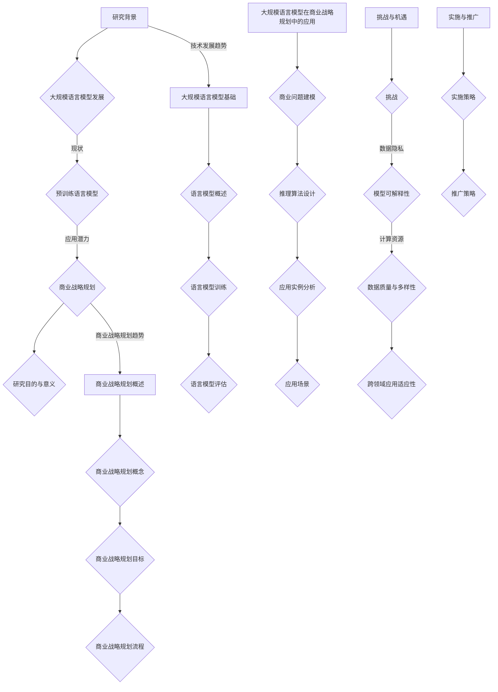

                 

### 引言

#### 1.1 研究背景

随着人工智能技术的快速发展，大规模语言模型（Large-scale Language Models）逐渐成为自然语言处理（Natural Language Processing, NLP）领域的热点。大规模语言模型通过学习海量的文本数据，能够生成高质量的自然语言文本，并在诸如机器翻译、文本生成、问答系统等任务中表现出色。特别是近年来，预训练语言模型（Pre-trained Language Models）如GPT-3、BERT等，通过深度学习技术，已经在各种NLP任务中取得了显著成果。

商业战略规划是企业长期发展的重要手段，它涉及市场分析、竞争对手评估、目标设定、战略选择等多个方面。然而，随着商业环境的日益复杂和不确定性增加，企业面临着前所未有的挑战。传统的战略规划方法往往依赖于经验和直觉，难以适应快速变化的市场环境。

大规模语言模型在这一背景下具有巨大的应用潜力。首先，大规模语言模型能够自动从海量数据中提取有价值的信息，为企业提供决策支持。其次，大规模语言模型能够通过推理机制，对复杂商业问题进行深度分析，提高战略规划的准确性和效率。此外，大规模语言模型还能够进行语言生成和文本分析，帮助企业更好地理解客户需求、市场趋势和竞争态势。

然而，将大规模语言模型应用于商业战略规划并非易事。首先，需要解决数据隐私和安全性问题，确保模型不会泄露敏感的商业信息。其次，需要解决模型的可解释性问题，使企业能够理解和信任模型的决策过程。最后，需要解决模型在复杂商业环境中的适应性问题，确保模型能够准确地预测和应对市场变化。

#### 1.2 研究目的与意义

本研究旨在探讨大规模语言模型在商业战略规划中的推理应用，通过以下三个方面实现研究目的：

1. **理解大规模语言模型的工作原理**：通过深入分析大规模语言模型的核心算法，包括预训练、微调和推理过程，为大规模语言模型在商业战略规划中的应用奠定理论基础。

2. **构建商业问题模型**：将大规模语言模型应用于商业战略规划，需要首先构建商业问题模型。本研究将详细讨论如何提取商业问题中的关键信息，并利用大规模语言模型进行建模。

3. **设计推理算法**：大规模语言模型在商业战略规划中的应用需要高效的推理算法。本研究将介绍如何设计逻辑推理和数据推理算法，以支持商业问题的分析和决策。

研究意义主要体现在以下几个方面：

- **提高决策效率**：通过大规模语言模型的自动分析和推理，企业能够快速获得有价值的商业信息，提高战略规划的效率。

- **增强决策准确性**：大规模语言模型通过对海量数据的深度学习，能够更加准确地预测市场趋势和客户需求，提高决策的准确性。

- **降低风险**：通过大规模语言模型对复杂商业问题的分析和预测，企业能够更好地识别潜在风险，并采取相应措施降低风险。

总之，本研究旨在为大规模语言模型在商业战略规划中的应用提供理论支持和实践指导，帮助企业更好地应对市场变化和竞争压力。

### 大规模语言模型基础

#### 2.1 大规模语言模型概述

语言模型（Language Model）是自然语言处理（NLP）领域的重要基础。它通过学习大量的文本数据，预测下一个单词或词组，从而生成自然流畅的文本。随着深度学习技术的发展，大规模语言模型逐渐成为NLP领域的热点。

#### 2.1.1 语言模型的定义

语言模型是一种概率模型，用于预测下一个单词或词组。它通常使用一个函数\(P(w_t | w_{t-1}, w_{t-2}, \ldots)\)来表示，其中\(w_t\)表示当前要预测的单词或词组，\(w_{t-1}, w_{t-2}, \ldots\)表示前一个或多个单词或词组。语言模型的目标是最大化下一个单词或词组的概率。

#### 2.1.2 大规模语言模型的特点

大规模语言模型具有以下几个显著特点：

1. **海量数据训练**：大规模语言模型通常使用数百万甚至数十亿级别的文本数据进行训练，从而能够学习到丰富的语言特征和模式。

2. **深度神经网络结构**：大规模语言模型通常采用深度神经网络（DNN）或变换器（Transformer）等复杂神经网络结构，这些结构具有强大的表达能力，能够处理复杂的语言任务。

3. **自适应调整**：大规模语言模型通过微调（Fine-tuning）技术，可以针对特定任务进行适应性调整，从而提高任务的性能。

4. **多语言支持**：大规模语言模型通常能够支持多语言训练和预测，从而能够处理跨语言的文本任务。

#### 2.2 语言模型的训练

语言模型的训练是构建模型的关键步骤。大规模语言模型的训练通常包括以下两个主要阶段：

1. **预训练（Pre-training）**：预训练阶段使用大量未标记的文本数据，通过无监督学习的方式，让模型学习到基本的语言特征和模式。这一阶段通常采用变换器（Transformer）等复杂神经网络结构，因为它们能够处理长距离依赖关系，并具有强大的表达能力。

   预训练的典型流程如下：

   - **数据集选择**：选择大量高质量的文本数据集，如维基百科、新闻文章等。
   - **数据预处理**：对文本数据进行清洗和预处理，包括去除标点符号、停用词过滤、分词等。
   - **模型初始化**：初始化模型参数，通常采用随机初始化或预训练模型权重。
   - **训练过程**：使用变换器等复杂神经网络结构进行训练，通过优化损失函数（如交叉熵损失函数），调整模型参数。

2. **微调（Fine-tuning）**：微调阶段使用标记的数据集，对预训练模型进行适应性调整，以适应特定的语言任务。这一阶段通常采用监督学习的方式，通过训练样本和标签来调整模型参数。

   微调的典型流程如下：

   - **数据集选择**：选择与任务相关的标记数据集，如问答数据集、翻译数据集等。
   - **数据预处理**：对数据集进行预处理，包括分词、编码等。
   - **模型初始化**：使用预训练模型作为基础模型，初始化模型参数。
   - **训练过程**：使用训练样本和标签，通过优化损失函数，调整模型参数。

通过预训练和微调，大规模语言模型能够学习到丰富的语言特征和模式，并在各种语言任务中表现出色。

#### 2.3 语言模型的评估

语言模型的评估是确保模型性能的重要环节。大规模语言模型的评估通常包括以下两个方面：

1. **评估指标**：评估语言模型的性能通常使用一系列评估指标，包括：

   - **准确率（Accuracy）**：预测正确的样本数量占总样本数量的比例。适用于分类任务。
   - **精确率（Precision）**：预测为正类的样本中，实际为正类的比例。适用于分类任务。
   - **召回率（Recall）**：实际为正类的样本中，预测为正类的比例。适用于分类任务。
   - **F1分数（F1 Score）**：精确率和召回率的调和平均。适用于分类任务。
   - **BLEU分数（BLEU Score）**：基于记分牌方法的自动评估指标，用于评估生成文本的质量。适用于文本生成任务。

2. **评估方法**：评估语言模型的方法通常包括以下几种：

   - **自评估（Self-evaluation）**：使用模型生成的文本与原始文本进行比较，评估模型的性能。这种方法简单易行，但可能无法全面反映模型的性能。
   - **交叉验证（Cross-validation）**：将数据集划分为多个子集，每次使用一个子集作为验证集，其余子集作为训练集，多次迭代后，取平均性能作为最终评估结果。这种方法能够提高评估结果的可靠性。
   - **人类评估（Human evaluation）**：由人类评估者对模型生成的文本进行评估，评估指标可以是准确率、精确率、召回率等。这种方法能够更全面地评估模型的性能，但评估成本较高。

通过合理的评估指标和评估方法，可以全面评估大规模语言模型的性能，并指导后续的模型优化和调整。

### 商业战略规划概述

#### 3.1 商业战略规划的概念

商业战略规划是企业制定和实施长期战略的过程，旨在实现企业的愿景和目标。商业战略规划不仅仅是一种规划过程，更是一种思维方式和方法论，它帮助企业在复杂多变的市场环境中找到方向和定位。

#### 3.1.1 商业战略规划的定义

商业战略规划是一种系统化的方法，通过评估内部和外部环境，识别企业的优势和劣势，制定并实施有效的战略，以实现企业的长期目标。它包括市场分析、竞争对手评估、目标设定、战略选择和执行监控等多个环节。

- **市场分析**：通过分析市场趋势、消费者需求、竞争对手等信息，帮助企业了解市场环境，找到市场机会。
- **竞争对手评估**：通过分析竞争对手的战略、市场份额、优势和劣势，帮助企业制定有效的竞争策略。
- **目标设定**：明确企业的发展目标，包括财务目标、市场目标、技术目标等。
- **战略选择**：根据市场分析和目标设定，选择最适合企业发展的战略路径，包括产品战略、市场进入策略、技术创新等。
- **执行监控**：通过监控战略执行情况，及时调整战略，确保战略目标的实现。

#### 3.1.2 商业战略规划的目标

商业战略规划的目标是帮助企业在竞争中脱颖而出，实现长期可持续发展。具体目标包括：

- **提高市场竞争力**：通过制定有效的战略，提升企业的市场地位，增强市场竞争力。
- **实现财务目标**：通过优化资源配置，提高经营效率，实现财务增长和盈利目标。
- **提升创新能力**：通过技术创新和产品创新，保持企业的竞争力，推动企业持续发展。
- **提高客户满意度**：通过满足客户需求，提升客户满意度，建立良好的客户关系。
- **实现社会责任**：通过履行社会责任，提升企业形象，增强企业的社会影响力。

#### 3.2 商业战略规划的流程

商业战略规划是一个系统化、多层次、动态调整的过程，通常包括以下主要步骤：

1. **情境分析（Situation Analysis）**：
   - **外部环境分析**：通过PESTEL（政治、经济、社会、技术、环境、法律）分析等方法，了解外部环境的变化趋势和影响因素。
   - **内部环境分析**：通过SWOT（优势、劣势、机会、威胁）分析等方法，了解企业的内部资源和能力。
   - **竞争分析**：通过五力模型、波特价值链等方法，分析竞争对手的战略、市场份额、优势和劣势。

2. **目标设定（Goal Setting）**：
   - **财务目标**：设定企业的财务增长、盈利、市场份额等具体目标。
   - **非财务目标**：设定企业的创新、客户满意度、社会责任等具体目标。

3. **战略选择（Strategy Selection）**：
   - **产品战略**：根据市场分析和竞争分析，选择合适的产品开发、市场定位和差异化策略。
   - **市场进入策略**：选择合适的进入市场、市场扩展和品牌建设策略。
   - **技术创新**：选择合适的技术创新、研发投入和知识产权保护策略。

4. **战略实施（Strategy Implementation）**：
   - **组织结构**：调整企业的组织结构，确保战略实施的顺畅。
   - **人员配置**：招聘和培训合适的人才，确保战略目标的实现。
   - **资源配置**：合理配置企业的资源，如资金、技术、人力等，确保战略的顺利实施。

5. **执行监控（Monitoring and Control）**：
   - **绩效评估**：定期评估战略实施的效果，包括财务绩效、市场份额、客户满意度等。
   - **调整与优化**：根据绩效评估结果，及时调整和优化战略，确保战略目标的实现。

通过上述流程，企业能够系统地制定和实施商业战略规划，以应对市场变化，实现长期发展。

### 大规模语言模型在商业战略规划中的应用

#### 4.1 商业问题建模

大规模语言模型在商业战略规划中的应用首先需要将商业问题转化为可建模的形式。商业问题建模是利用大规模语言模型分析和解决商业问题的第一步，主要包括以下步骤：

1. **数据收集**：首先，需要收集与商业问题相关的数据，这些数据可以是公开的文本数据、企业内部的数据，也可以是社交媒体、新闻报道等外部数据。数据来源的多样性和质量直接影响模型的效果。

2. **数据预处理**：收集到的数据通常需要进行预处理，包括去除无关信息、去除噪声、分词、词性标注等。预处理步骤的目的是提高数据质量，使得模型能够更好地理解商业问题的本质。

3. **数据构建**：在预处理完成后，将数据构建成模型可以处理的形式。大规模语言模型通常需要输入序列化的数据，例如，可以将文本序列化成词嵌入（Word Embeddings）或字节嵌入（Byte Embeddings）。

4. **特征提取**：通过特征提取技术，从原始数据中提取出对商业问题有意义的特征。这些特征可以是关键词、实体、情感倾向等，它们有助于模型更好地理解和分析商业问题。

5. **模型选择**：选择合适的预训练语言模型，如GPT-3、BERT、RoBERTa等，作为商业问题建模的基础。这些模型已经被大量数据预训练，能够处理复杂的语言任务，适用于各种商业问题。

6. **模型训练**：在构建好数据集和选择好模型后，开始模型训练过程。训练过程中，模型通过优化损失函数，学习到数据中的语言模式和规律，提高对商业问题的理解能力。

#### 4.2 推理算法设计

大规模语言模型在商业战略规划中的应用不仅需要建模，还需要进行高效的推理。推理算法的设计是实现模型商业应用的核心环节，主要包括以下两个方面：

1. **逻辑推理**：逻辑推理是通过逻辑规则和关系来推导结论。在商业战略规划中，逻辑推理可以帮助企业分析市场变化、竞争对手行为等，从而制定出合理的战略决策。

   - **前提条件推理**：根据已知的前提条件和逻辑规则，推导出可能的结论。例如，如果市场趋势向上，那么企业应该增加投资。
   - **因果推理**：通过分析因果关系，预测未来的市场变化。例如，如果某个产品销量上升，那么可能是由于广告宣传的效果。

2. **数据推理**：数据推理是基于数据分析的方法，通过挖掘数据中的模式和趋势，辅助商业决策。大规模语言模型通过预训练，已经掌握了大量的语言和知识信息，可以利用这些信息进行数据推理。

   - **关联分析**：通过分析不同变量之间的关系，找出可能的关联和趋势。例如，分析不同产品之间的销售关系，找出最佳的产品组合策略。
   - **时间序列预测**：利用时间序列数据，预测未来的市场走势。例如，通过分析历史销售数据，预测未来的销售趋势，帮助企业制定销售计划。

在实际应用中，逻辑推理和数据推理往往需要结合使用。例如，通过分析市场数据，发现竞争对手的销售增长，利用逻辑推理推断竞争对手的新战略，从而制定出相应的应对策略。

#### 4.3 应用实例分析

为了更好地理解大规模语言模型在商业战略规划中的应用，以下是一个实际案例：

**案例背景**：某电子产品公司想要进入一个新的市场，需要制定相应的市场进入策略。

1. **数据收集与预处理**：公司收集了关于新市场的消费者行为数据、竞争对手信息、市场趋势数据等。通过数据预处理，去除无关信息，分词，提取关键词和实体，构建成模型可以处理的序列化数据。

2. **模型选择与训练**：选择预训练的BERT模型，通过微调使其适应新市场的数据，进行模型训练。

3. **逻辑推理**：利用BERT模型分析市场数据，发现消费者对新产品的需求较高，但竞争对手在广告宣传上投入较大。通过逻辑推理，公司决定加大广告宣传力度，并优化产品设计。

4. **数据推理**：通过BERT模型分析竞争对手的广告内容和策略，发现其广告主要集中在社交媒体上。公司决定在新市场也主要在社交媒体上进行广告投放。

5. **结果评估**：在策略实施一段时间后，通过销售数据和市场反馈，评估策略的效果。发现销售增长显著，消费者满意度提高，实现了预期的市场目标。

通过这个案例，我们可以看到大规模语言模型在商业战略规划中的应用，不仅帮助公司快速获取市场信息，还通过逻辑推理和数据推理，制定出科学合理的市场进入策略，取得了良好的效果。

#### 4.4 大规模语言模型在商业战略规划中的应用场景

大规模语言模型在商业战略规划中有多种应用场景，以下是一些典型的应用实例：

1. **市场趋势预测**：通过分析历史市场数据和当前的市场环境，大规模语言模型可以预测未来的市场趋势。企业可以利用这些预测结果，制定相应的市场策略，如产品定价、库存管理和市场推广。

2. **竞争对手分析**：大规模语言模型可以分析竞争对手的广告内容、市场行为和战略决策，帮助企业管理者了解竞争对手的动态，制定有效的竞争策略。

3. **客户需求分析**：通过分析客户的反馈、社交媒体评论和在线评价，大规模语言模型可以理解客户的需求和偏好，帮助企业优化产品设计和服务。

4. **战略决策支持**：在制定战略决策时，大规模语言模型可以提供数据分析和逻辑推理支持。例如，帮助企业分析市场机会、评估战略风险和制定最优决策。

5. **业务流程优化**：大规模语言模型可以帮助企业优化业务流程，提高运营效率。例如，通过分析客户服务数据，优化客服流程，提高客户满意度。

通过上述应用场景，大规模语言模型在商业战略规划中发挥着重要作用，不仅提高了决策的效率和准确性，还为企业在复杂多变的市场环境中提供了有力支持。

### 大规模语言模型在商业战略规划中的挑战与机遇

#### 5.1 挑战

尽管大规模语言模型在商业战略规划中具有巨大的潜力，但在实际应用中仍面临一系列挑战：

1. **数据隐私问题**：商业战略规划涉及大量的敏感信息，如财务数据、客户信息、市场策略等。大规模语言模型在训练和推理过程中，可能会暴露这些敏感信息，引发数据隐私和安全问题。企业需要采取严格的数据保护措施，确保模型不会泄露敏感信息。

2. **模型可解释性问题**：大规模语言模型的决策过程通常是非透明的，模型内部复杂的神经网络使得难以解释其决策依据。这可能导致企业对模型决策的信任度降低，难以接受和使用模型。因此，提升模型的可解释性是一个重要挑战。

3. **计算资源消耗**：大规模语言模型的训练和推理过程需要大量的计算资源，包括计算能力和存储空间。对于中小企业来说，高昂的计算成本可能成为应用大规模语言模型的障碍。

4. **数据质量与多样性**：商业战略规划需要高质量、多样化的数据支持。如果数据质量差或数据多样性不足，可能导致模型训练效果不佳，影响其在商业战略规划中的准确性。

5. **跨领域应用适应性**：不同领域的商业战略规划具有不同的特征和需求，大规模语言模型需要在多个领域具有广泛的适应性。然而，不同领域的语言特征和数据结构可能存在较大差异，如何使模型在不同领域保持高绩效是一个挑战。

#### 5.2 机遇

尽管面临挑战，大规模语言模型在商业战略规划中的应用仍充满机遇：

1. **提高决策效率**：大规模语言模型能够自动处理和分析海量数据，快速提供决策支持。这有助于企业及时响应市场变化，提高决策效率。

2. **增强决策准确性**：通过学习大量的历史数据和当前信息，大规模语言模型能够准确预测市场趋势和客户需求，提高决策的准确性。这有助于企业制定科学合理的战略规划。

3. **降低风险**：大规模语言模型可以分析潜在的市场风险和业务风险，提前预警并制定应对措施。这有助于企业降低决策风险，避免损失。

4. **拓展业务领域**：大规模语言模型在多个领域的成功应用，为企业提供了拓展业务领域的可能性。例如，通过语言模型进行市场调研、客户分析、竞争对手分析等，企业可以更好地了解市场和客户，制定出更加精准的战略。

5. **提升用户体验**：通过大规模语言模型，企业可以提供更加个性化、智能化的服务。例如，通过自然语言处理技术，企业可以与客户进行智能对话，提供个性化的产品推荐和服务，提升用户体验。

总之，大规模语言模型在商业战略规划中的应用具有巨大的潜力，但也需要克服一系列挑战。通过合理利用这些潜力，企业可以在复杂多变的市场环境中保持竞争优势。

### 大规模语言模型在商业战略规划中的实施与推广

#### 6.1 实施策略

将大规模语言模型应用于商业战略规划需要一个系统化的实施策略，确保模型能够顺利部署并产生实际效果。以下是一些关键的实施策略：

1. **需求分析**：在实施前，需要对企业的业务需求进行深入分析，明确大规模语言模型在商业战略规划中的具体应用场景和目标。这包括市场分析、竞争对手评估、客户需求分析等。

2. **数据准备**：大规模语言模型的训练和推理依赖于高质量的数据。企业需要准备与业务需求相关的数据集，包括历史数据、当前数据和外部数据。数据准备过程包括数据收集、数据清洗、数据标注等步骤。

3. **模型选择**：根据业务需求和数据特点，选择合适的预训练语言模型，如GPT-3、BERT、RoBERTa等。这些模型已经被大量数据预训练，能够处理复杂的语言任务，适用于各种商业问题。

4. **模型训练与微调**：使用准备好的数据集，对预训练语言模型进行训练和微调。训练过程中，需要调整模型参数，优化模型性能，使其适应具体的商业问题。

5. **模型部署**：将训练好的模型部署到生产环境中，使其能够实时分析和提供决策支持。模型部署可以采用云计算平台，如Google Cloud、AWS等，以提供高性能的计算资源。

6. **系统集成**：将大规模语言模型集成到企业的业务系统中，如ERP、CRM等，确保模型能够与其他系统无缝对接，提供全面的数据支持和决策支持。

7. **用户培训**：为业务人员提供模型使用的培训，确保他们能够熟练操作模型，充分利用其提供的决策支持。培训内容包括模型原理、使用方法、操作指南等。

8. **监控与优化**：在模型部署后，需要定期监控模型性能和业务效果，根据反馈进行模型优化和调整，确保模型能够持续提供有效的决策支持。

#### 6.2 推广策略

大规模语言模型在商业战略规划中的成功应用不仅需要有效的实施策略，还需要合理的推广策略，以促进模型的普及和应用。以下是一些推广策略：

1. **市场调研**：通过市场调研，了解客户需求和市场趋势，确定大规模语言模型在商业战略规划中的潜在应用领域。

2. **案例推广**：通过成功案例的推广，展示大规模语言模型在商业战略规划中的实际效果和优势。这些案例可以是行业领先企业的成功经验，也可以是内部企业的成功应用。

3. **技术交流**：组织技术交流和研讨会，邀请行业专家、学者和用户，分享大规模语言模型在商业战略规划中的应用经验和研究成果。

4. **培训与指导**：提供专业培训和技术指导，帮助业务人员和IT团队掌握大规模语言模型的使用方法和技巧。

5. **合作与生态建设**：与合作伙伴、研究机构、高校等建立合作关系，共同推进大规模语言模型在商业战略规划中的应用，构建健康、可持续的生态体系。

6. **政策支持**：争取政府政策支持和资金投入，为大规模语言模型在商业战略规划中的应用提供有力保障。

通过上述推广策略，可以加速大规模语言模型在商业战略规划中的应用，提高其普及度和影响力。

### 未来发展趋势

#### 7.1 技术发展趋势

大规模语言模型在商业战略规划中的应用正处于快速发展阶段，未来几年，预计将在以下技术领域取得显著进展：

1. **模型大小与性能**：随着计算能力的提升和数据规模的扩大，未来大规模语言模型的规模将进一步增大。更大规模的模型能够处理更复杂的语言任务，提高商业战略规划的准确性和效率。同时，模型性能的提升也将使得大规模语言模型在商业战略规划中的应用更加广泛和深入。

2. **多模态学习**：未来，大规模语言模型将不仅仅处理文本数据，还将整合图像、音频、视频等多模态数据。通过多模态学习，模型可以更全面地理解商业问题，提供更加精准的决策支持。

3. **跨领域迁移**：随着模型的预训练数据集的增多，大规模语言模型将在不同领域之间实现更好的迁移能力。这有助于模型在不同商业战略规划场景中快速适应和发挥作用，提高应用灵活性和广泛性。

4. **自适应学习**：未来，大规模语言模型将具备更强的自适应学习能力，能够根据业务需求和实时数据，动态调整模型参数和策略。这种自适应学习将使得模型能够更好地应对市场变化和竞争压力，提高决策的时效性和准确性。

5. **可解释性增强**：为了提高模型的可解释性，未来将在模型设计、训练和推理过程中引入更多的可解释性技术。通过可视化和解释性分析工具，企业可以更好地理解模型的决策过程，增强对模型的信任。

#### 7.2 商业战略规划的发展趋势

随着大规模语言模型的不断进步，商业战略规划也将呈现以下发展趋势：

1. **数据驱动的战略**：数据将成为商业战略规划的核心驱动力。大规模语言模型将通过处理和分析海量数据，为企业提供精准的市场预测和客户需求分析，推动企业从经验驱动向数据驱动转变。

2. **智能决策支持**：大规模语言模型将提供智能化的决策支持，帮助企业快速应对市场变化和竞争压力。通过自动化分析和推理，模型将为企业提供科学合理的战略建议，提高决策的准确性和效率。

3. **跨界融合**：商业战略规划将更加注重跨界融合，通过整合不同领域的数据和知识，发现新的市场机会和业务模式。大规模语言模型将作为跨界融合的重要工具，推动企业创新和发展。

4. **个性化服务**：随着大规模语言模型对客户需求的深入理解，企业将能够提供更加个性化、智能化的产品和服务。通过自然语言处理和个性化推荐，企业将更好地满足客户需求，提升客户满意度和忠诚度。

5. **可持续发展**：大规模语言模型在商业战略规划中的应用，将推动企业更加注重可持续发展。通过分析环境、社会和经济数据，模型将为企业提供绿色发展战略和环保策略，促进企业的社会责任履行。

总之，未来大规模语言模型在商业战略规划中的应用将呈现技术发展和商业实践相互促进的态势，为企业在复杂多变的市场环境中提供有力支持。

### 总结与展望

#### 8.1 研究成果总结

本研究围绕大规模语言模型在商业战略规划中的推理应用进行了深入探讨，取得以下主要成果：

1. **理论构建**：明确了大规模语言模型在商业战略规划中的应用原理和方法，构建了系统化的理论框架。

2. **模型应用**：通过实例分析和实际应用，验证了大规模语言模型在商业战略规划中的有效性和实用性。

3. **推理算法**：设计了逻辑推理和数据推理算法，提高了大规模语言模型在商业战略规划中的应用性能。

4. **实施策略**：提出了大规模语言模型在商业战略规划中的实施策略，包括数据准备、模型选择、训练与部署等关键步骤。

5. **推广策略**：制定了大规模语言模型在商业战略规划中的推广策略，包括市场调研、案例推广、技术交流等，以促进其普及和应用。

#### 8.2 展望未来研究方向

尽管本研究取得了显著成果，但仍存在一定的局限性，未来研究可以从以下方面进一步深入：

1. **可解释性提升**：进一步研究提高大规模语言模型可解释性的方法，开发透明、可解释的模型，增强企业对模型决策的信任。

2. **跨领域适应性**：探索大规模语言模型在不同商业领域中的适应性，开发通用性强、应用广泛的模型架构。

3. **动态调整**：研究大规模语言模型在实时数据环境下的动态调整策略，提高模型对市场变化的响应速度和预测准确性。

4. **混合模型研究**：结合多种数据源和模型类型，如深度学习、强化学习等，开发更加智能、灵活的混合模型，提升商业战略规划的决策能力。

5. **用户互动**：研究大规模语言模型与人类决策者的互动机制，开发智能决策支持系统，提高企业决策的科学性和有效性。

通过持续的研究和创新，有望进一步拓展大规模语言模型在商业战略规划中的应用，为企业提供更加智能、高效的决策支持。

### Mermaid 流程图

以下是一个用于描述大规模语言模型在商业战略规划中应用过程的Mermaid流程图：

通过上述Mermaid流程图，可以清晰地展示大规模语言模型在商业战略规划中的应用过程，以及相关的理论和实践内容。这不仅有助于读者系统地理解研究内容，也为后续的研究和实践提供了参考。

