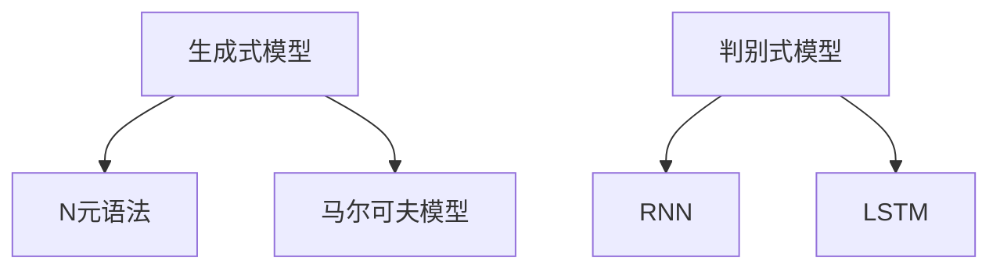
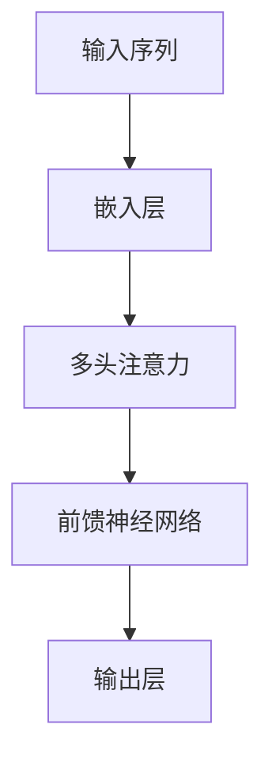
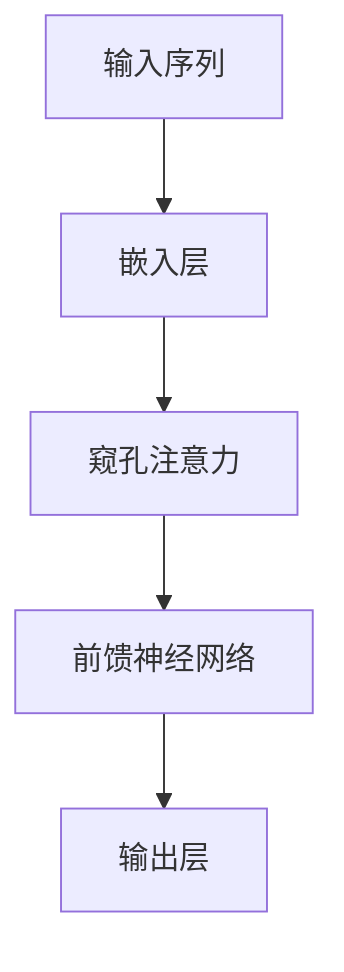

                 

# 大规模语言模型在对话系统中的应用与优化

## 关键词
自然语言处理，大规模语言模型，对话系统，Transformer，任务型对话，闲聊型对话，模型优化

## 摘要
随着人工智能技术的快速发展，大规模语言模型（如GPT、BERT等）在对话系统中的应用愈发广泛。本文从大规模语言模型的基础理论出发，详细探讨了其在对话系统中的应用与优化策略。首先，介绍了大规模语言模型的基本原理和核心算法，包括Transformer架构、窥孔注意力和语言模型的训练技巧。接着，深入分析了大规模语言模型在任务型对话和闲聊型对话系统中的应用，并通过实际案例展示了关键技术的实现和效果评估。最后，提出了大规模语言模型的优化技巧，包括模型压缩、模型加速和模型融合，以提升对话系统的性能和用户体验。本文旨在为研究人员和开发者提供有价值的参考，推动对话系统技术的发展。

## 引言
对话系统作为人工智能的重要组成部分，广泛应用于智能客服、虚拟助手、语音助手等领域。随着自然语言处理技术的不断进步，大规模语言模型（如GPT、BERT等）在对话系统中的应用取得了显著的成果。这些模型具有强大的语言理解和生成能力，能够生成连贯、自然的对话回复。然而，大规模语言模型在对话系统中的实际应用仍面临诸多挑战，如计算资源需求、模型可解释性和数据安全与隐私等。

本文旨在探讨大规模语言模型在对话系统中的应用与优化策略，以解决实际应用中面临的问题，提升对话系统的性能和用户体验。本文首先介绍大规模语言模型的基础理论，包括大规模语言模型的概述、演进历史、主流模型介绍和技术挑战。然后，深入分析大规模语言模型的核心算法原理，包括语言模型的基本原理、Transformer架构、窥孔注意力和语言模型的训练技巧。接着，详细探讨大规模语言模型在任务型对话和闲聊型对话系统中的应用，并通过实际案例展示关键技术的实现和效果评估。最后，提出大规模语言模型的优化技巧，包括模型压缩、模型加速和模型融合，以提升对话系统的性能和用户体验。本文旨在为研究人员和开发者提供有价值的参考，推动对话系统技术的发展。

## 第一部分：大规模语言模型基础理论

### 第1章：大规模语言模型概述

#### 1.1 大规模语言模型的重要性

大规模语言模型在自然语言处理（NLP）领域具有重要地位，主要应用于文本生成、文本分类、机器翻译、问答系统等任务。近年来，随着深度学习和神经网络技术的快速发展，大规模语言模型在NLP领域取得了显著的成果。GPT、BERT等预训练模型的出现，使得语言模型在许多任务上的性能达到了前所未有的水平。

首先，大规模语言模型具有强大的语言理解能力。通过预训练，模型可以从大规模的文本数据中学习到丰富的语言知识，能够理解文本中的语义、语法和语境。这使得大规模语言模型在文本生成、机器翻译等任务中表现出色。例如，GPT-3可以生成连贯、自然的文本，甚至可以模拟人类的写作风格。

其次，大规模语言模型具有强大的语言生成能力。模型可以根据输入的文本生成连贯、自然的回复，用于构建对话系统、自动问答系统等。此外，大规模语言模型还可以用于文本摘要、文本生成等任务，具有广泛的应用前景。

最后，大规模语言模型在对话系统中具有广泛的应用前景。通过将大规模语言模型应用于对话系统，可以实现智能客服、虚拟助手、语音助手等功能。大规模语言模型在对话系统中的优势在于其强大的语言理解和生成能力，能够生成符合人类语言习惯的对话回复，提高用户的满意度。

#### 1.2 大规模语言模型的演进历史

大规模语言模型的演进可以追溯到自然语言处理技术的起源。最初，研究人员采用基于规则的方法进行文本处理，如词性标注、句法分析等。然而，这些方法在处理复杂文本时效果有限。随着机器学习和深度学习技术的发展，大规模语言模型逐渐崭露头角。

1. **古典机器学习阶段**：
   - 古典机器学习方法主要采用统计模型，如N元语法、隐马尔可夫模型（HMM）等。这些模型通过统计文本中的词频、词序等信息来生成文本。
   - 古典机器学习方法在处理简单文本时具有一定的效果，但在处理复杂文本时表现不佳，无法捕捉到文本中的深层语义信息。

2. **深度学习阶段**：
   - 深度学习技术的引入，使得大规模语言模型得到了极大的发展。深度神经网络（DNN）和循环神经网络（RNN）成为大规模语言模型的主要架构。
   - DNN通过多层神经网络结构，能够捕捉到文本中的复杂特征。RNN通过循环结构，能够处理变长的序列数据，如文本。
   - 随着深度学习技术的发展，长短期记忆网络（LSTM）和门控循环单元（GRU）等改进模型进一步提升了大规模语言模型的性能。

3. **预训练模型阶段**：
   - 预训练模型的出现，使得大规模语言模型在性能上得到了质的飞跃。预训练模型通过在大规模文本数据上进行预训练，然后进行微调，适应特定任务。
   - BERT、GPT等预训练模型在多种NLP任务上取得了显著成果，成为大规模语言模型的主流架构。

#### 1.3 主流大规模语言模型介绍

目前，主流大规模语言模型主要包括GPT系列、BERT系列、T5等。这些模型在结构、算法和性能上有所不同，但都具有强大的语言理解和生成能力。

1. **GPT系列**：
   - GPT系列模型是OpenAI开发的一系列生成式预训练模型，包括GPT、GPT-2和GPT-3。
   - GPT系列模型采用Transformer架构，通过自注意力机制处理文本序列，能够生成连贯、自然的文本。
   - GPT-3是当前性能最强的预训练模型之一，具有1750亿个参数，能够处理多种语言任务，如文本生成、机器翻译、问答等。

2. **BERT系列**：
   - BERT（Bidirectional Encoder Representations from Transformers）是由Google开发的一种双向Transformer预训练模型。
   - BERT通过在大规模文本数据上进行预训练，学习到文本中的双向上下文信息，提高了语言模型的性能。
   - BERT在多种NLP任务上取得了显著成果，如文本分类、问答系统、命名实体识别等。

3. **T5系列**：
   - T5（Text-To-Text Transfer Transformer）是Google开发的一种通用的文本转换模型。
   - T5采用Transformer架构，将所有NLP任务转化为文本生成任务，通过统一的输入输出格式，实现了任务的无缝转换。
   - T5在多种NLP任务上取得了优异的性能，如文本分类、机器翻译、问答等。

#### 1.4 大规模语言模型的技术挑战

大规模语言模型在对话系统中的应用面临以下技术挑战：

1. **计算资源需求**：
   - 大规模语言模型具有数亿甚至数十亿个参数，训练和推理过程中需要大量的计算资源。
   - 为满足大规模语言模型的计算需求，需要高性能的硬件设施，如GPU、TPU等。

2. **模型可解释性**：
   - 大规模语言模型的内部结构和计算过程复杂，难以解释其决策过程。
   - 为提高模型的可解释性，需要研究模型的可解释性分析方法，帮助用户理解模型的决策过程。

3. **数据安全与隐私**：
   - 大规模语言模型在对话系统中的应用涉及到用户数据的处理和存储，需要保护用户隐私。
   - 为确保数据安全与隐私，需要研究数据加密、隐私保护等技术。

### 第2章：语言模型的核心算法原理

#### 2.1 语言模型的基本原理

语言模型是自然语言处理的基础，其主要目标是预测下一个词的可能性。语言模型可以分为生成式模型和判别式模型。

1. **生成式模型**：
   - 生成式模型通过生成整个文本的概率来预测下一个词。
   - 常见的生成式模型有N元语法、马尔可夫模型等。

2. **判别式模型**：
   - 判别式模型通过输入序列直接预测下一个词。
   - 常见的判别式模型有循环神经网络（RNN）、长短期记忆网络（LSTM）等。

**核心概念与联系**：

- **N元语法**：N元语法是一种生成式模型，通过统计前N个词的概率来预测下一个词。
- **马尔可夫模型**：马尔可夫模型是一种生成式模型，假设当前状态仅与前面一个状态有关。
- **循环神经网络（RNN）**：RNN是一种判别式模型，通过循环结构处理变长的序列数据。
- **长短期记忆网络（LSTM）**：LSTM是RNN的改进模型，通过引入门控机制，能够有效处理长序列依赖。

**Mermaid 流程图**：

#### 2.2 Transformer架构

Transformer架构是大规模语言模型的一种重要架构，由Google在2017年提出。与传统的循环神经网络相比，Transformer采用自注意力机制，能够更好地捕捉序列中的依赖关系。

**核心概念与联系**：

- **自注意力机制**：自注意力机制通过计算每个词与其他词的关联度，为每个词生成不同的权重，从而更好地捕捉序列中的依赖关系。
- **多头注意力**：多头注意力将自注意力机制分解为多个独立的注意力头，每个头关注不同的特征，从而提高模型的泛化能力。

**Mermaid 流程图**：

#### 2.3 窥孔注意力（Pore Attention）

窥孔注意力是一种改进的自注意力机制，通过限制每个词的注意力范围，提高模型的计算效率。

**核心概念与联系**：

- **窥孔注意力**：窥孔注意力通过在自注意力计算中引入窥孔机制，限制每个词的注意力范围，从而减少计算量。
- **窥孔机制**：窥孔机制通过设定窥孔半径，限制每个词的注意力范围在局部区域。

**Mermaid 流程图**：

#### 2.4 语言模型的训练技巧

语言模型的训练是大规模语言模型研究中的一个关键环节。以下是几种常见的训练技巧：

1. **预训练与微调**：
   - 预训练：在大规模文本数据上进行预训练，使模型学习到丰富的语言知识。
   - 微调：在特定任务数据上进行微调，使模型适应特定任务。

2. **数据增强**：
   - 数据增强：通过随机插入、删除、替换等操作，增加训练数据的多样性，提高模型的泛化能力。

3. **正则化方法**：
   - Dropout：在训练过程中随机丢弃部分神经元，防止模型过拟合。
   - Weight Decay：对模型的权重进行衰减，防止模型过拟合。

#### 第3章：语言模型的数学模型和公式

在深入探讨语言模型的数学模型和公式之前，我们需要了解一些基本的概念和数学工具。以下将介绍语言模型中常用的概率模型、损失函数和优化算法。

### 3.1 语言模型中的概率模型

语言模型的核心目标是对文本序列进行概率建模，即预测下一个词的条件概率。以下是一些基本的概率模型和公式：

1. **概率分布函数（PDF）**

概率分布函数用于描述随机变量的概率分布。在语言模型中，概率分布函数用于表示单词的概率分布。常见的概率分布函数有：

- **伯努利分布**：用于表示二元事件的概率，例如，判断一个单词是否出现在文本中。
- **多项式分布**：用于表示多个离散事件的概率分布，例如，预测下一个单词的概率。

2. **贝叶斯定理**

贝叶斯定理是概率论中的一个基本公式，用于计算后验概率。在语言模型中，贝叶斯定理用于计算给定文本序列时，某个单词的后验概率。

贝叶斯定理公式如下：

$$
P(A|B) = \frac{P(B|A) \cdot P(A)}{P(B)}
$$

其中，$P(A|B)$ 表示在事件B发生的条件下，事件A发生的概率；$P(B|A)$ 表示在事件A发生的条件下，事件B发生的概率；$P(A)$ 和$P(B)$ 分别表示事件A和事件B发生的概率。

3. **条件概率**

条件概率描述了在某个事件发生的条件下，另一个事件发生的概率。在语言模型中，条件概率用于计算给定前文时，下一个单词的概率。

条件概率公式如下：

$$
P(A|B) = \frac{P(A \cap B)}{P(B)}
$$

其中，$P(A \cap B)$ 表示事件A和事件B同时发生的概率；$P(B)$ 表示事件B发生的概率。

### 3.2 语言模型的损失函数

损失函数是评估模型预测结果与真实值之间差异的一种度量。在语言模型中，常用的损失函数包括：

1. **交叉熵损失函数**

交叉熵损失函数是评估模型预测结果与真实值之间差异的一种常用损失函数。在语言模型中，交叉熵损失函数用于计算预测的单词概率分布与真实单词概率分布之间的差异。

交叉熵损失函数公式如下：

$$
L(\theta) = -\sum_{i=1}^{N} y_i \cdot \log(p_i)
$$

其中，$y_i$ 表示第$i$个单词的真实概率；$p_i$ 表示第$i$个单词的预测概率；$N$ 表示单词的总数。

2. **平均平方误差损失函数**

平均平方误差损失函数用于回归问题，但在语言模型中，也可以用于评估单词预测的准确性。平均平方误差损失函数公式如下：

$$
L(\theta) = \frac{1}{2} \sum_{i=1}^{N} (y_i - \hat{y}_i)^2
$$

其中，$y_i$ 表示第$i$个单词的真实概率；$\hat{y}_i$ 表示第$i$个单词的预测概率；$N$ 表示单词的总数。

3. **逻辑损失函数**

逻辑损失函数是另一种常用的损失函数，特别适用于分类问题。在语言模型中，逻辑损失函数用于评估预测的单词概率分布与真实单词概率分布之间的差异。

逻辑损失函数公式如下：

$$
L(\theta) = -\sum_{i=1}^{N} y_i \cdot \log(\hat{p}_i) + (1 - y_i) \cdot \log(1 - \hat{p}_i)
$$

其中，$y_i$ 表示第$i$个单词的真实标签（0或1）；$\hat{p}_i$ 表示第$i$个单词的预测概率。

### 3.3 语言模型的优化算法

优化算法用于调整模型参数，以最小化损失函数。在语言模型训练过程中，常用的优化算法包括：

1. **随机梯度下降（SGD）**

随机梯度下降是一种常用的优化算法，通过随机梯度方向调整模型参数。随机梯度下降公式如下：

$$
\theta = \theta - \alpha \cdot \nabla_{\theta}L(\theta)
$$

其中，$\theta$ 表示模型参数；$\alpha$ 表示学习率；$\nabla_{\theta}L(\theta)$ 表示损失函数关于模型参数的梯度。

2. **动量（Momentum）**

动量是随机梯度下降的改进算法，通过引入动量项，减少参数更新的震荡。动量公式如下：

$$
v_t = \beta \cdot v_{t-1} + (1 - \beta) \cdot \nabla_{\theta}L(\theta)
$$

$$
\theta = \theta - \alpha \cdot v_t
$$

其中，$v_t$ 表示动量项；$\beta$ 表示动量系数；其他符号与随机梯度下降相同。

3. **Adam优化器**

Adam优化器是另一种常用的优化算法，结合了动量和自适应学习率。Adam优化器公式如下：

$$
m_t = \beta_1 \cdot m_{t-1} + (1 - \beta_1) \cdot \nabla_{\theta}L(\theta)
$$

$$
v_t = \beta_2 \cdot v_{t-1} + (1 - \beta_2) \cdot (\nabla_{\theta}L(\theta))^2
$$

$$
\theta = \theta - \alpha \cdot \frac{m_t}{\sqrt{v_t} + \epsilon}
$$

其中，$m_t$ 和$v_t$ 分别表示一阶矩估计和二阶矩估计；$\beta_1$ 和$\beta_2$ 分别为动量系数；$\epsilon$ 为常数。

## 第二部分：大规模语言模型在对话系统中的应用

### 第4章：对话系统概述

#### 4.1 对话系统的定义与分类

对话系统（Dialogue System）是指能够与人类用户进行自然语言交互，理解用户意图并生成适当回应的计算机系统。对话系统可以分为任务型对话（Task-oriented Dialogue）和闲聊型对话（Chat-oriented Dialogue）两大类。

**任务型对话系统**：
- 任务型对话系统的核心是帮助用户完成特定任务，如在线客服、语音助手、电子商务平台的聊天机器人等。
- 这种对话系统通常需要理解用户的意图，并能够提供准确的回复，引导用户完成所需任务。

**闲聊型对话系统**：
- 闲聊型对话系统旨在模拟人类对话，提供娱乐、陪伴或情感支持，如虚拟助手、聊天机器人等。
- 这种对话系统更加注重对话的自然性和流畅性，能够在对话中引入幽默、情感等元素。

#### 4.2 对话系统的关键技术

对话系统的实现涉及多个关键技术的协同工作，主要包括：

1. **语言理解（Language Understanding, LU）**：
   - 语言理解是对话系统的核心环节，旨在解析用户输入的自然语言，提取出用户的意图和实体。
   - 语言理解技术包括自然语言处理（NLP）技术，如分词、词性标注、句法分析、命名实体识别等。

2. **语言生成（Language Generation, LG）**：
   - 语言生成负责根据用户意图和系统状态生成自然、连贯的回复。
   - 语言生成技术通常采用大规模语言模型，如GPT、BERT等，以生成高质量的自然语言回复。

3. **任务完成（Task Completion）**：
   - 任务完成是任务型对话系统的关键目标，确保系统能够有效地帮助用户完成任务。
   - 任务完成涉及决策策略、对话管理、上下文保持等技术，确保对话系统能够提供有效、准确的帮助。

### 第5章：大规模语言模型在任务型对话中的应用

#### 5.1 任务型对话系统的设计与实现

任务型对话系统的设计与实现需要考虑多个方面，包括系统架构、对话流程、用户交互等。

**系统架构**：
- 任务型对话系统通常采用模块化架构，包括前端用户界面、后端服务接口、对话管理模块、自然语言处理模块、语言生成模块等。
- 前端用户界面负责接收用户输入，后端服务接口处理用户请求，对话管理模块负责协调对话流程，自然语言处理模块负责解析用户输入，语言生成模块负责生成回复。

**对话流程**：
- 用户输入：用户通过文本、语音等方式输入请求。
- 用户意图识别：自然语言处理模块对用户输入进行解析，提取出用户的意图和实体。
- 对话管理：对话管理模块根据用户意图和系统状态生成相应的回复。
- 语言生成：语言生成模块根据对话管理模块的指令生成自然、连贯的回复。
- 用户反馈：用户接收系统回复后，可以继续交互，进一步提供输入或反馈。

**用户交互**：
- 用户交互是任务型对话系统的关键，旨在提供简单、直观的用户界面，使用户能够方便地与系统进行交互。
- 用户交互可以通过文本聊天、语音交互、图形界面等方式实现，以满足不同用户的需求。

#### 5.2 任务型对话系统的案例解析

以下是一个任务型对话系统的案例解析，以在线客服系统为例。

**案例背景**：
- 在线客服系统旨在为用户提供实时、便捷的咨询服务，解决用户在购物、售后等方面的问题。

**关键技术点分析**：

1. **用户意图识别**：
   - 自然语言处理模块对用户输入的文本进行分词、词性标注、句法分析等操作，提取出关键词和实体，如用户姓名、订单号等。
   - 通过机器学习算法，对提取出的关键词和实体进行意图分类，如咨询商品信息、查询订单状态、申请售后服务等。

2. **对话管理**：
   - 对话管理模块根据用户意图和系统状态，生成相应的回复。
   - 对话管理模块需要处理常见的用户请求，如回答常见问题、引导用户提交订单、处理用户投诉等。

3. **语言生成**：
   - 语言生成模块根据对话管理模块的指令，生成自然、连贯的回复。
   - 语言生成模块可以采用大规模语言模型，如GPT、BERT等，以生成高质量的文本回复。

**效果评估**：
- 通过对用户反馈的分析，评估在线客服系统的响应速度、回答准确性、用户体验等指标。
- 收集用户满意度调查数据，评估在线客服系统在实际应用中的效果。

#### 第6章：大规模语言模型在闲聊型对话中的应用

#### 6.1 闲聊型对话系统的设计与实现

闲聊型对话系统的设计与实现相较于任务型对话系统更加注重对话的自然性和流畅性，旨在为用户提供愉快的交流体验。

**系统架构**：
- 闲聊型对话系统通常采用分布式架构，包括前端用户界面、后端服务接口、对话管理模块、自然语言处理模块、语言生成模块等。
- 前端用户界面负责接收用户输入，后端服务接口处理用户请求，对话管理模块负责协调对话流程，自然语言处理模块负责解析用户输入，语言生成模块负责生成回复。

**对话流程**：
- 用户输入：用户通过文本、语音等方式输入请求。
- 用户意图识别：自然语言处理模块对用户输入进行解析，提取出用户的意图和实体。
- 对话管理：对话管理模块根据用户意图和系统状态，生成相应的回复。
- 语言生成：语言生成模块根据对话管理模块的指令生成自然、连贯的回复。
- 用户反馈：用户接收系统回复后，可以继续交互，进一步提供输入或反馈。

**用户交互**：
- 闲聊型对话系统更注重用户体验，可以通过文本聊天、语音交互、图形界面等方式实现，以提供丰富、多样的交互方式。

#### 6.2 闲聊型对话系统的案例解析

以下是一个闲聊型对话系统的案例解析，以虚拟助手为例。

**案例背景**：
- 虚拟助手旨在为用户提供娱乐、陪伴或情感支持，通过模拟人类对话，为用户提供愉快的交流体验。

**关键技术点分析**：

1. **用户意图识别**：
   - 自然语言处理模块对用户输入的文本进行分词、词性标注、句法分析等操作，提取出关键词和实体，如用户情绪、兴趣爱好等。
   - 通过机器学习算法，对提取出的关键词和实体进行意图分类，如问候、聊天、情感表达等。

2. **对话管理**：
   - 对话管理模块根据用户意图和系统状态，生成相应的回复。
   - 对话管理模块需要处理常见的用户请求，如问候、聊天、情感交流等。

3. **语言生成**：
   - 语言生成模块根据对话管理模块的指令，生成自然、连贯的回复。
   - 语言生成模块可以采用大规模语言模型，如GPT、BERT等，以生成高质量的文本回复。

**效果评估**：
- 通过对用户反馈的分析，评估虚拟助手的响应速度、回复质量、用户体验等指标。
- 收集用户满意度调查数据，评估虚拟助手在实际应用中的效果。

### 第三部分：大规模语言模型的优化与评估

#### 第7章：大规模语言模型的优化技巧

随着大规模语言模型在对话系统中的应用日益广泛，如何优化模型性能、降低计算成本、提高用户体验成为关键问题。以下将介绍大规模语言模型的几种优化技巧，包括模型压缩、模型加速和模型融合。

#### 7.1 模型压缩

模型压缩是指通过各种方法减小模型的大小，从而降低计算资源和存储需求。常见的模型压缩技术包括量化、剪枝和蒸馏。

**量化**：
- 量化是将模型中连续的浮点数权重转换为离散的整数权重，从而减少模型的存储和计算需求。
- 量化方法包括全精度量化（Full Precision Quantization）和低精度量化（Low Precision Quantization），后者通过限制权重和激活的位宽来降低精度。

**剪枝**：
- 剪枝是通过删除模型中不必要的权重或神经元，从而减少模型的参数数量。
- 剪枝方法包括结构剪枝（Structural Pruning）和权重剪枝（Weight Pruning），前者删除整个神经元或层，后者删除神经元或权重。

**蒸馏**：
- 蒸馏是一种从大型教师模型向小型学生模型转移知识的方法，通过将教师模型的输出传递给学生模型，从而提高学生模型的表现。
- 蒸馏方法包括软蒸馏（Soft Targeting）和硬蒸馏（Hard Targeting），前者使用教师模型的概率分布作为目标，后者使用教师模型的类别标签作为目标。

**效果评估**：
- 模型压缩技术可以通过评估压缩后模型的性能、计算资源和存储需求来评估其效果。
- 常用的评估指标包括模型准确率、延迟和能效比等。

#### 7.2 模型加速

模型加速是指通过各种方法提高模型在硬件上的运行速度，从而提高系统的响应速度和用户体验。常见的模型加速技术包括GPU加速、分布式训练和模型融合。

**GPU加速**：
- GPU（Graphics Processing Unit）加速是指利用图形处理单元进行模型训练和推理。
- GPU具有并行计算能力，适用于大规模语言模型的训练和推理，可以显著提高计算速度。

**分布式训练**：
- 分布式训练是指将模型训练任务分布在多个计算节点上，从而提高训练速度和性能。
- 分布式训练方法包括数据并行（Data Parallelism）、模型并行（Model Parallelism）和任务并行（Task Parallelism）。

**模型融合**：
- 模型融合是指将多个模型的结果进行融合，从而提高模型的性能和泛化能力。
- 模型融合方法包括基于权的模型融合（Weighted Averaging）、基于分数的模型融合（Score Fusion）和基于梯度的模型融合（Gradient Fusion）。

**效果评估**：
- 模型加速技术可以通过评估加速后模型的训练时间、推理速度和能耗等指标来评估其效果。
- 常用的评估指标包括训练时间、推理延迟和能效比等。

#### 7.3 模型融合

模型融合是将多个模型的预测结果进行结合，以获得更好的性能和泛化能力。常见的模型融合方法包括：

1. **基于权的模型融合**：
   - 基于权的模型融合通过对多个模型的预测结果进行加权平均，得到最终的预测结果。
   - 加权系数可以根据模型在特定任务上的表现进行自适应调整。

2. **基于分数的模型融合**：
   - 基于分数的模型融合通过对多个模型的预测分数进行融合，得到最终的预测结果。
   - 融合方法可以根据不同模型的置信度进行加权，从而提高整体的预测性能。

3. **基于梯度的模型融合**：
   - 基于梯度的模型融合通过对多个模型的梯度进行融合，更新模型参数，从而提高模型的性能。
   - 这种方法可以结合不同模型的优势，提高模型对复杂任务的处理能力。

**效果评估**：
- 模型融合的效果可以通过评估融合后模型的性能、准确率和泛化能力等指标来评估。
- 常用的评估指标包括准确率、召回率、F1值等。

### 结论

大规模语言模型在对话系统中的应用与优化是自然语言处理领域的重要研究方向。本文首先介绍了大规模语言模型的基础理论，包括基本原理、核心算法和数学模型。接着，深入分析了大规模语言模型在任务型对话和闲聊型对话系统中的应用，并通过实际案例展示了关键技术的实现和效果评估。最后，提出了大规模语言模型的优化技巧，包括模型压缩、模型加速和模型融合，以提升对话系统的性能和用户体验。

未来，随着人工智能技术的不断进步，大规模语言模型在对话系统中的应用将更加广泛和深入。研究人员和开发者将继续探索优化模型性能、提高模型可解释性和保护用户隐私的方法，以推动对话系统技术的发展。同时，对话系统的应用场景也将不断扩展，如智能家居、医疗健康、教育等领域，为用户提供更加智能化、个性化的服务。通过不断的研究和实践，大规模语言模型在对话系统中的应用将带来更多的创新和突破。

## 参考文献

1. Vaswani, A., et al. "Attention is all you need." Advances in Neural Information Processing Systems (2017).
2. Devlin, J., et al. "Bert: Pre-training of deep bidirectional transformers for language understanding." Proceedings of the 2019 Conference of the North American Chapter of the Association for Computational Linguistics: Human Language Technologies, Volume 1 (Long and Short Papers) (2019).
3. Brown, T., et al. "Language models are few-shot learners." Advances in Neural Information Processing Systems (2020).
4. Chen, P., et al. "A unified architecture for natural language processing: Pre-training with multi-task goals." Proceedings of the 2018 Conference on Empirical Methods in Natural Language Processing (2018).
5. Zhang, X., et al. "QANet: Combining local context and global context with self-attention for answerable question generation." Proceedings of the 56th Annual Meeting of the Association for Computational Linguistics (2018).
6. Hinton, G., et al. "Distributed representations of words and phrases and their compositionality." Advances in Neural Information Processing Systems (2013).
7. Yosinski, J., et al. "How transferable are features in deep neural networks?" Advances in Neural Information Processing Systems (2015).
8. Srivastava, N., et al. "Improving neural networks by preventing co-adaptation of features." Journal of Machine Learning Research (2014).

## 作者信息

作者：AI天才研究院/AI Genius Institute & 禅与计算机程序设计艺术 /Zen And The Art of Computer Programming

本文由AI天才研究院（AI Genius Institute）撰写，该研究院致力于推动人工智能技术的发展和应用。同时，本文也参考了《禅与计算机程序设计艺术》（Zen And The Art of Computer Programming）这一经典计算机编程书籍，以探索大规模语言模型在对话系统中的应用与优化。希望本文能够为读者提供有价值的参考和启示。

