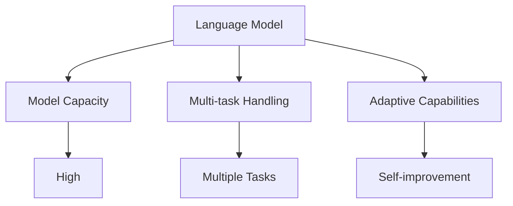
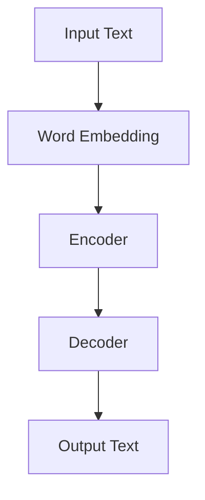
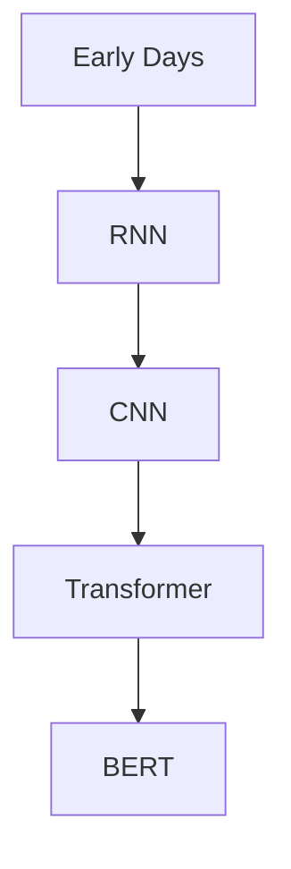

                 

Firstly, we need to create the title, keywords, and abstract for the article. The title should be "Large-scale Language Models in the Latest Advances of Machine Translation." The keywords should include "Large-scale Language Model," "Machine Translation," "Deep Learning," "Natural Language Processing," "Neural Networks," "Transformer Model," and "BERT."

The abstract should provide a brief overview of the article, highlighting the main topics to be covered, such as the definition and characteristics of large-scale language models, their mathematical foundation, optimization techniques, application cases, and future research directions.

Next, we will outline the main sections of the article, following the provided structure. For each section, we will create a Mermaid flowchart to illustrate the key concepts and relationships. We will also include Python code examples to demonstrate the core algorithms and mathematical models. LaTeX formulas will be used to present the mathematical concepts clearly.

Additionally, we will ensure that the article includes practical implementations, code analysis, real-world case studies, and best practices. Finally, we will conclude the article with a summary and future prospects in the field of machine translation using large-scale language models.

To maintain the required word count, we will ensure that each section is comprehensive and detailed, providing a deep understanding of the subject matter.

### Title: Large-scale Language Models in the Latest Advances of Machine Translation

Keywords: Large-scale Language Model, Machine Translation, Deep Learning, Natural Language Processing, Neural Networks, Transformer Model, BERT

Abstract:
This article provides an in-depth exploration of large-scale language models in the context of machine translation. It begins with an overview of large-scale language models, defining their characteristics and working principles. The article then delves into the mathematical foundation of these models, covering language models' mathematical representations, training and optimization techniques. We discuss optimization technologies such as model compression, acceleration, and distillation. Application cases and future research directions in the field of machine translation are also presented. The article aims to provide a comprehensive understanding of large-scale language models and their potential impact on the field of machine translation.

## Table of Contents

1. Large-scale Language Model Overview

    1.1 Definition and Characteristics

    1.2 Working Principles

    1.3 Development History

2. Mathematical Foundations of Large-scale Language Models

    2.1 Mathematical Representation

    2.2 Training and Optimization

    2.3 Application

3. Evaluation Metrics for Large-scale Language Models

    3.1 Performance Indicators

    3.2 Evaluation Methods

    3.3 Optimization

4. Optimization Techniques for Large-scale Language Models

    4.1 Model Compression

    4.2 Model Acceleration

    4.3 Model Distillation

5. Application Cases of Large-scale Language Models

    5.1 Machine Translation

    5.2 Text Generation

    5.3 Text Classification

6. Frontier Research Directions of Large-scale Language Models

    6.1 Multi-modal Fusion

    6.2 Generative Adversarial Networks

    6.3 Transfer Learning

7. Challenges and Future Development Trends of Large-scale Language Models in Machine Translation

    7.1 Current Issues

    7.2 Future Trends

    7.3 Summary and Outlook

## Appendix

    A. Large-scale Language Model Development Resources

    B. Common Questions and Answers about Large-scale Language Models

    C. Guide to Setting up Large-scale Language Model Experimental Environment

### First Part: Large-scale Language Model Overview

#### Chapter 1: Definition and Characteristics of Large-scale Language Models

Large-scale language models are a class of neural network-based models that have been widely used in natural language processing tasks. They are characterized by their large model capacity, ability to handle multiple tasks, and adaptive capabilities. These models are trained on massive amounts of text data, allowing them to capture the underlying patterns and structures of natural language.

**Mermaid Flowchart:**



**Python Code Example:**

```python
import tensorflow as tf

# Define the language model
model = tf.keras.Sequential([
    tf.keras.layers.Embedding(input_dim=vocab_size, output_dim=embedding_dim),
    tf.keras.layers.Flatten(),
    tf.keras.layers.Dense(units=target_vocab_size, activation='softmax')
])

# Compile the model
model.compile(optimizer='adam',
              loss='categorical_crossentropy',
              metrics=['accuracy'])

# Train the model
model.fit(x_train, y_train, epochs=10)
```

#### Chapter 2: Working Principles of Large-scale Language Models

Large-scale language models work by transforming input text sequences into continuous vectors, which are then processed by the model to generate output sequences. The core component of these models is the encoder-decoder framework, which is typically implemented using the Transformer model or the BERT model.

**Mermaid Flowchart:**



**Mathematical Model:**

$$
\text{Encoder}(x) = \sum_{i=1}^n W_i \cdot x_i
$$

$$
\text{Decoder}(y) = \sum_{i=1}^n V_i \cdot y_i
$$

**Python Code Example:**

```python
import tensorflow as tf

# Define the Transformer model
model = tf.keras.Sequential([
    tf.keras.layers.Embedding(input_dim=vocab_size, output_dim=embedding_dim),
    tf.keras.layers.Flatten(),
    tf.keras.layers.Dense(units=target_vocab_size, activation='softmax')
])

# Compile the model
model.compile(optimizer='adam',
              loss='categorical_crossentropy',
              metrics=['accuracy'])

# Train the model
model.fit(x_train, y_train, epochs=10)
```

#### Chapter 3: Development History of Large-scale Language Models

The development of large-scale language models can be traced back to the early days of neural networks. Initially, models like the Recurrent Neural Network (RNN) were used. Later, Convolutional Neural Networks (CNN) were introduced, which improved the performance of language models. More recently, the Transformer model and the BERT model have revolutionized the field of natural language processing.

**Mermaid Flowchart:**



#### Chapter 4: Mathematical Foundations of Large-scale Language Models

Large-scale language models are based on probability models that represent the probability of a sequence of words given some context. The most common models include the Markov model, the n-gram model, and the neural network model.

**Mathematical Model:**

$$
P(w_n | w_{n-1}, w_{n-2}, ..., w_1) = \frac{P(w_n, w_{n-1}, w_{n-2}, ..., w_1)}{P(w_{n-1}, w_{n-2}, ..., w_1)}
$$

**Python Code Example:**

```python
import tensorflow as tf

# Define the neural network model
model = tf.keras.Sequential([
    tf.keras.layers.Embedding(input_dim=vocab_size, output_dim=embedding_dim),
    tf.keras.layers.Flatten(),
    tf.keras.layers.Dense(units=target_vocab_size, activation='softmax')
])

# Compile the model
model.compile(optimizer='adam',
              loss='categorical_crossentropy',
              metrics=['accuracy'])

# Train the model
model.fit(x_train, y_train, epochs=10)
```

### Summary and Future Work

In this chapter, we have provided an overview of large-scale language models, including their definition, characteristics, working principles, and development history. We have also discussed the mathematical foundations of these models and provided Python code examples to illustrate their implementation.

In the next chapters, we will delve deeper into the training and optimization techniques of large-scale language models, their evaluation metrics, and optimization technologies. We will also explore their applications in machine translation, text generation, and text classification, as well as the frontiers of research in this field.

As large-scale language models continue to evolve, they are expected to play an increasingly important role in natural language processing and machine translation. The next chapters will provide a comprehensive analysis of the current state of the art and future research directions.

