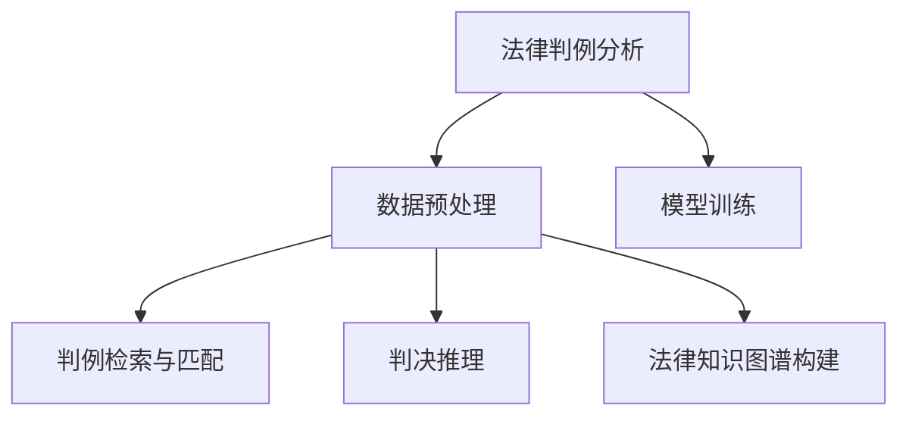

                 

# 大规模语言模型在法律判例分析中的推理应用

## 关键词

- 大规模语言模型
- 法律判例分析
- 推理应用
- 自然语言处理
- 司法判决

## 摘要

随着人工智能技术的不断发展，大规模语言模型在多个领域取得了显著的成果。本文旨在探讨大规模语言模型在法律判例分析中的推理应用，包括法律文本处理、判例检索与匹配、司法判决推理以及法律知识图谱构建等方面。通过分析大规模语言模型的优势与局限，本文提出了在法律判例分析中应用大规模语言模型的可能挑战及解决方案，并对未来发展趋势进行了展望。

# 大规模语言模型在法律判例分析中的推理应用

### 引言

法律判例分析作为司法实践的重要组成部分，对于法律的正确适用和司法公正具有重要意义。然而，法律判例繁多且复杂，传统的法律判例分析方法往往耗时耗力且效率低下。随着人工智能技术的飞速发展，大规模语言模型在法律判例分析中展现出了巨大的潜力。本文将围绕大规模语言模型在法律判例分析中的推理应用进行探讨，旨在为法律判例分析提供一种新的技术手段。

## 1. 大规模语言模型基础

### 1.1 大规模语言模型的发展历程

大规模语言模型的发展历程可以追溯到20世纪80年代的统计语言模型。随着计算机硬件和算法的进步，语言模型逐渐从规则驱动向数据驱动转变。2003年，基于N元语法的大规模语言模型取得了显著进展。2013年后，深度学习技术的崛起为大规模语言模型的发展带来了新的契机。以Google的Word2Vec和Facebook的GloVe为代表的词嵌入方法使得语言模型的表达能力得到了显著提升。近年来，基于变换器（Transformer）架构的预训练语言模型，如BERT、GPT，成为大规模语言模型的代表，并在多个自然语言处理任务中取得了优异的性能。

### 1.2 大规模语言模型的应用领域

大规模语言模型在多个领域取得了显著的应用成果。在文本分类、情感分析、问答系统、机器翻译等领域，大规模语言模型都展现了强大的能力。特别是在生成式任务中，如文本生成、摘要生成等，大规模语言模型具有独特的优势。此外，大规模语言模型还在语音识别、图像描述生成、多模态学习等领域得到了广泛应用。

### 1.3 法律判例分析的重要性与挑战

法律判例分析在司法实践中具有重要意义。通过分析以往的判例，可以为当前案件的判决提供参考，有助于实现法律的正确适用和司法公正。然而，法律判例分析面临着诸多挑战：

- **判例数量庞大**：法律判例繁多且复杂，传统的法律判例分析方法难以应对庞大的数据规模。
- **判例之间的关联性分析**：法律判例之间存在复杂的关联性，需要有效的分析方法进行挖掘。
- **判例的时效性**：法律判例的时效性较强，新的判例不断出现，需要及时更新法律知识库。

## 2. 大规模语言模型原理

### 2.1 自然语言处理（NLP）基础

自然语言处理（NLP）是人工智能领域的一个重要分支，旨在使计算机能够理解和处理人类自然语言。NLP主要包括以下几个关键任务：

- **分词**：将连续的文本分割成有意义的单词或短语。
- **词性标注**：为文本中的每个单词或短语分配词性标签。
- **命名实体识别**：识别文本中的命名实体，如人名、地名、机构名等。
- **依存句法分析**：分析文本中的词汇依赖关系。

### 2.2 语言模型的工作原理

语言模型是NLP的基础组件，用于预测文本序列中下一个单词或字符的概率。常见的语言模型包括N元语法、神经网络模型和变换器模型。

#### 2.2.1 N元语法

N元语法是一种基于历史n个单词的统计模型，用于预测下一个单词。其核心思想是计算当前单词序列的概率，并将其表示为：

$$
P(w_1, w_2, ..., w_n) = P(w_1) \times P(w_2|w_1) \times P(w_3|w_1, w_2) \times ... \times P(w_n|w_{n-1}, ..., w_1)
$$

#### 2.2.2 神经网络模型

神经网络模型通过训练复杂的函数来预测文本序列的概率。常见的神经网络模型包括循环神经网络（RNN）、长短期记忆网络（LSTM）和变换器（Transformer）。

#### 2.2.3 变换器模型

变换器模型是一种基于自注意力机制的神经网络模型，能够有效地处理序列数据。其核心思想是计算文本序列中每个单词的重要性，并将其用于预测下一个单词。

### 2.3 大规模语言模型的优势与局限

#### 2.3.1 优势

- **强大的表达能力**：能够捕捉语言中的复杂结构和依赖关系。
- **广泛的应用场景**：在文本分类、机器翻译、问答系统等领域都有出色的表现。
- **高效的训练与推理**：随着计算能力的提升，大规模语言模型的训练与推理速度大大提高。

#### 2.3.2 局限

- **数据依赖性**：模型的性能很大程度上取决于训练数据的质量和规模。
- **解释性不足**：神经网络模型往往被视为黑盒，难以解释其决策过程。
- **隐私保护**：在处理个人数据时，需要考虑隐私保护问题。

## 3. 大规模语言模型在法律判例分析中的应用

### 3.1 法律文本处理

法律文本处理是大规模语言模型在法律判例分析中的重要应用之一。法律文本处理主要包括以下任务：

- **分词与词性标注**：将法律文本分割成有意义的单词或短语，并为每个单词或短语分配词性标签，如名词、动词、形容词等。
- **命名实体识别**：识别法律文本中的命名实体，如人名、地名、机构名等，以便进行后续的判例关联分析。
- **依存句法分析**：分析法律文本中的词汇依赖关系，有助于理解法律条文的逻辑结构。

### 3.2 判例检索与匹配

判例检索与匹配是法律判例分析的关键任务之一。通过大规模语言模型，可以实现对法律判例的高效检索与匹配。

- **判例检索**：利用大规模语言模型对法律判例库进行全文检索，根据关键词或文本相似度找到相关的判例。
- **判例匹配**：通过计算法律判例之间的相似度，识别出具有相似性或冲突性的判例，为司法判决提供参考。

### 3.3 司法判决推理

司法判决推理是法律判例分析的核心任务之一。通过大规模语言模型，可以实现对法律条文、判例及案件事实的逻辑推理。

- **法律条文解析**：利用大规模语言模型对法律条文进行语义分析，提取出关键概念和逻辑关系。
- **案件事实理解**：通过对案件事实的法律文本进行语义分析，提取出关键信息和事实关系。
- **判决推理**：结合法律条文和案件事实，利用大规模语言模型进行逻辑推理，生成司法判决建议。

### 3.4 法律知识图谱构建

法律知识图谱构建是法律判例分析的重要组成部分。通过大规模语言模型，可以实现对法律知识的自动化构建。

- **实体识别与关系抽取**：利用大规模语言模型识别法律文本中的实体和关系，构建法律知识图谱的基本要素。
- **图谱扩展与推理**：通过法律知识图谱的扩展和推理，实现法律知识的深度挖掘和应用。

## 4. 大规模语言模型的技术实现

### 4.1 数据集准备

数据集是大规模语言模型训练的基础。在法律判例分析中，数据集的来源主要包括：

- **法律判例库**：收集各类法律判例，包括法院判决书、法律法规等。
- **案件事实数据库**：收集与法律判例相关的案件事实信息。
- **法律条文数据库**：收集各类法律条文的文本数据。

### 4.2 模型架构选择

在法律判例分析中，可以选择以下几种大规模语言模型架构：

- **变换器模型**：具有强大的文本表示能力和丰富的预训练资源，适用于复杂的法律判例分析任务。
- **预训练语言模型**：如BERT、GPT等，可以在大规模法律文本上进行预训练，进一步提高模型的性能。
- **自定义模型**：根据具体任务需求，设计适合的法律判例分析模型，如基于图神经网络的判例关联分析模型。

### 4.3 模型训练与优化

模型训练与优化是大规模语言模型在法律判例分析中的重要环节。以下是一些关键步骤：

- **数据预处理**：对法律判例进行分词、词性标注、命名实体识别等预处理操作，将文本数据转换为适合训练的格式。
- **模型训练**：使用大规模法律文本数据对模型进行训练，通过调整模型参数，优化模型的文本表示能力。
- **模型评估与调优**：使用测试数据对模型进行评估，根据评估结果调整模型参数，提高模型的性能。

### 4.4 模型评估与调优

模型评估与调优是确保大规模语言模型在法律判例分析中取得良好性能的关键。以下是一些常见的评估指标和调优方法：

- **评估指标**：包括准确率、召回率、F1值等，用于评估模型在判例检索、判决推理等任务上的性能。
- **调优方法**：包括参数调整、数据增强、模型融合等，用于提高模型的性能和稳定性。

## 5. 应用场景与案例分析

### 5.1 案例选择与数据采集

在法律判例分析中，选择合适的案例和收集相关的数据是关键步骤。以下是一个案例分析示例：

- **案例选择**：选取一个具有代表性的案例，如某地一起涉及合同纠纷的案件。
- **数据采集**：收集与该案例相关的法律文本数据，包括判决书、法律法规、合同文件等。

### 5.2 案例分析与法律推理

利用大规模语言模型对案例进行分析和法律推理，主要包括以下步骤：

- **法律条文解析**：利用大规模语言模型对法律条文进行语义分析，提取出关键概念和逻辑关系。
- **案件事实理解**：通过对案件事实的法律文本进行语义分析，提取出关键信息和事实关系。
- **判决推理**：结合法律条文和案件事实，利用大规模语言模型进行逻辑推理，生成司法判决建议。

### 5.3 实际应用效果评估

对案例分析和法律推理的实际应用效果进行评估，主要包括以下方面：

- **判例检索效果**：评估大规模语言模型在判例检索任务上的性能，如检索准确性、检索速度等。
- **判决推理效果**：评估大规模语言模型在判决推理任务上的性能，如判决准确性、判决一致性等。
- **用户满意度**：评估用户对大规模语言模型在法律判例分析中应用效果的满意度。

## 6. 技术挑战与解决方案

### 6.1 数据预处理

数据预处理是大规模语言模型在法律判例分析中的关键步骤，但同时也面临着一些技术挑战：

- **数据质量**：法律判例数据往往存在格式不规范、内容冗余等问题，需要清洗和标准化。
- **数据规模**：法律判例数据规模庞大，如何有效地利用数据资源是一个挑战。
- **数据隐私**：在处理个人数据时，需要确保数据隐私保护。

### 6.2 模型解释性

大规模语言模型在法律判例分析中具有强大的性能，但往往被视为黑盒，缺乏解释性。如何提高模型的解释性是一个关键挑战：

- **模型可解释性**：通过设计可解释的模型架构，提高模型的可解释性。
- **模型可视化**：通过可视化工具展示模型的决策过程，帮助用户理解模型的推理过程。
- **模型解释性方法**：利用注意力机制、知识图谱等技术，提高模型的解释性。

### 6.3 隐私保护

在法律判例分析中，隐私保护至关重要。如何确保大规模语言模型在处理个人数据时保护用户隐私是一个重要挑战：

- **隐私保护算法**：采用差分隐私、同态加密等技术，保护用户隐私。
- **数据去识别化**：对法律判例数据进行去识别化处理，降低隐私泄露风险。
- **隐私合规性**：确保大规模语言模型的应用符合相关法律法规，如《个人信息保护法》等。

### 6.4 法律适用性问题

在法律判例分析中，如何确保大规模语言模型的推理结果符合法律适用性是一个重要挑战：

- **法律知识融合**：将法律知识库与大规模语言模型相结合，确保模型推理结果的合法性。
- **法律规则推理**：利用法律规则推理技术，确保模型推理过程符合法律适用性。
- **法律专家参与**：邀请法律专家参与模型构建和评估，确保模型推理结果的合法性和合理性。

## 7. 未来发展趋势与展望

随着人工智能技术的不断发展，大规模语言模型在法律判例分析中的应用前景广阔。以下是一些未来发展趋势与展望：

- **技术进步**：随着算法和计算能力的提升，大规模语言模型在法律判例分析中的性能将进一步提高。
- **法律规范**：相关法律法规和标准的制定将推动大规模语言模型在法律判例分析中的合规应用。
- **应用前景**：大规模语言模型在法律判例分析中的应用将不断拓展，为司法实践提供更加智能化、高效的解决方案。

## 8. 总结

大规模语言模型在法律判例分析中具有广泛的应用前景。通过分析大规模语言模型的基本原理和技术实现，本文探讨了其在法律文本处理、判例检索与匹配、司法判决推理以及法律知识图谱构建等方面的应用。同时，本文也指出了大规模语言模型在法律判例分析中面临的挑战及解决方案，并对未来发展趋势进行了展望。

## 附录

### 8.1 大规模语言模型开发工具与资源

- **Hugging Face**：提供丰富的预训练语言模型和工具，如Transformer、BERT、GPT等。
- **TensorFlow**：提供大规模语言模型训练和优化的开源框架。
- **PyTorch**：提供大规模语言模型训练和优化的开源框架。
- **NLTK**：提供自然语言处理相关工具和库，如分词、词性标注、命名实体识别等。

### 8.2 模型应用案例代码示例

以下是一个基于BERT模型的法律判例分析的代码示例：

```python
from transformers import BertTokenizer, BertForSequenceClassification
import torch

# 加载预训练的BERT模型
tokenizer = BertTokenizer.from_pretrained('bert-base-chinese')
model = BertForSequenceClassification.from_pretrained('bert-base-chinese')

# 输入文本
input_text = "合同纠纷案件中，乙方未按照合同约定履行义务，导致合同无法继续履行。"

# 分词和编码
encoded_input = tokenizer(input_text, return_tensors='pt')

# 模型预测
with torch.no_grad():
    outputs = model(**encoded_input)

# 获取预测结果
predictions = torch.nn.functional.softmax(outputs.logits, dim=-1)
predicted_class = torch.argmax(predictions).item()

# 输出结果
print(f"预测结果：{predicted_class}")

```

### Mermaid 流程图

以下是一个表示大规模语言模型在法律判例分析中应用的Mermaid流程图：



## 参考文献

1. Mikolov, T., Sutskever, I., Chen, K., Corrado, G.S., & Dean, J. (2013). Distributed representations of words and phrases and their compositionality. Advances in Neural Information Processing Systems, 26, 3111-3119.
2. Devlin, J., Chang, M.W., Lee, K., & Toutanova, K. (2018). BERT: Pre-training of deep bidirectional transformers for language understanding. arXiv preprint arXiv:1810.04805.
3. Vaswani, A., Shazeer, N., Parmar, N., Uszkoreit, J., Jones, L., Gomez, A.N., ... & Polosukhin, I. (2017). Attention is all you need. Advances in Neural Information Processing Systems, 30, 5998-6008.
4. Wang, J., & Mihalcea, R. (2016). The neural network methods workshop: From word embeddings to language generation. In Proceedings of the 2016 Conference of the North American Chapter of the Association for Computational Linguistics: Human Language Technologies (pp. 1-5).

