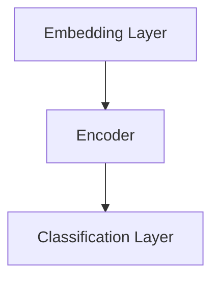
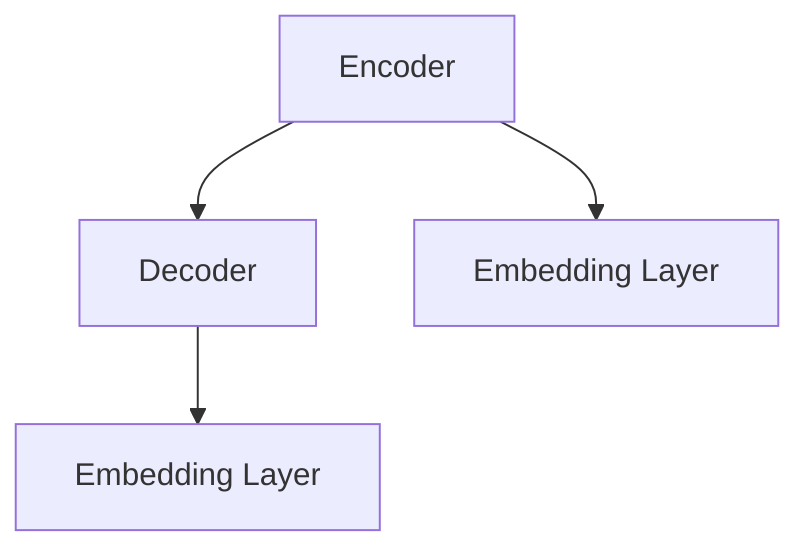
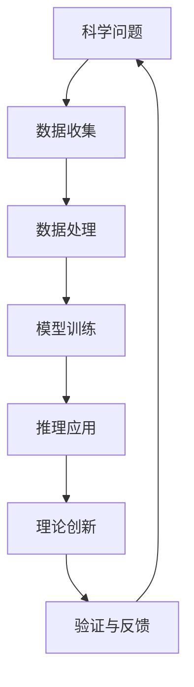

                 

### 第2章：大规模语言模型的数学基础

#### 2.1 神经网络的基本概念

神经网络（Neural Networks，简称NN）是大规模语言模型的核心组成部分。其灵感来源于人脑的结构和工作原理，由大量的神经元（或节点）通过突触（或连接）相互连接而成。每个神经元接收来自其他神经元的输入信号，通过加权求和处理后，产生输出信号。神经网络的基本概念包括神经元、激活函数、网络层次等。

**神经元：**
每个神经元可以看作是一个简单的计算单元，接受多个输入信号，并通过权重进行加权求和。神经元的基本公式如下：

$$
y = \sigma(\sum_{i=1}^{n} w_i x_i + b)
$$

其中，$y$ 是神经元的输出，$x_i$ 是第 $i$ 个输入，$w_i$ 是第 $i$ 个输入的权重，$b$ 是偏置项，$\sigma$ 是激活函数。

**激活函数：**
激活函数用于引入非线性特性，使神经网络能够拟合复杂的数据。常见的激活函数包括 sigmoid、ReLU 和 tanh 等。以下是对这些激活函数的简要介绍：

- **Sigmoid 函数：**
  $$
  \sigma(x) = \frac{1}{1 + e^{-x}}
  $$
  sigmoid 函数在 $x \to -\infty$ 时趋近于 0，在 $x \to +\infty$ 时趋近于 1，具有良好的平滑特性。

- **ReLU 函数：**
  $$
  \sigma(x) = \max(0, x)
  $$
  ReLU（Rectified Linear Unit）函数在 $x \geq 0$ 时等于 $x$，在 $x < 0$ 时等于 0，它是一种简单但有效的激活函数，有助于提高神经网络的训练速度。

- **Tanh 函数：**
  $$
  \sigma(x) = \frac{e^x - e^{-x}}{e^x + e^{-x}}
  $$
  tanh 函数与 sigmoid 函数类似，但在输出范围上更接近于 -1 到 1，有助于模型在训练过程中更好地收敛。

**网络层次：**
神经网络由多个层次组成，包括输入层、隐藏层和输出层。每个层次包含多个神经元，相邻层次间的神经元通过连接进行信息传递。神经网络通过多层次的变换，可以学习到输入和输出之间的复杂映射关系。

#### 2.2 深度学习中的优化算法

优化算法是深度学习中的核心环节，用于调整神经网络的权重和偏置，以最小化损失函数。常用的优化算法包括梯度下降（Gradient Descent）、动量优化（Momentum）和自适应优化器（Adagrad、RMSprop、Adam等）。

**梯度下降：**
梯度下降是一种最简单的优化算法，其基本思想是沿着损失函数的负梯度方向进行迭代更新。梯度下降的更新公式如下：

$$
\theta = \theta - \alpha \cdot \nabla J(\theta)
$$

其中，$\theta$ 是网络参数，$\alpha$ 是学习率，$\nabla J(\theta)$ 是损失函数对参数的梯度。

**动量优化：**
动量优化（Momentum）在梯度下降的基础上引入了动量项，可以加速收敛，减少振荡。动量优化的更新公式如下：

$$
v_t = \beta v_{t-1} + (1 - \beta) \cdot \nabla J(\theta)
$$

$$
\theta = \theta - \alpha \cdot v_t
$$

其中，$v_t$ 是动量项，$\beta$ 是动量系数。

**自适应优化器：**
自适应优化器（Adagrad、RMSprop、Adam等）通过动态调整学习率，提高了优化过程的稳定性和收敛速度。以下是对几种常用自适应优化器的简要介绍：

- **Adagrad：**
  Adagrad 对每个参数的平方梯度进行累积，从而自适应调整学习率。其更新公式如下：

  $$
  \Delta \theta_i = \frac{\eta}{\sum_j (\Delta \theta_j)^2} \cdot \nabla J(\theta)
  $$

  $$
  \theta = \theta - \Delta \theta
  $$

  其中，$\eta$ 是初始学习率。

- **RMSprop：**
  RMSprop 对 Adagrad 进行了改进，通过使用滑动平均来稳定学习率。其更新公式如下：

  $$
  \Delta \theta_i = \frac{\eta}{\sqrt{\sum_j (\Delta \theta_j)^2 + \epsilon}} \cdot \nabla J(\theta)
  $$

  $$
  \theta = \theta - \Delta \theta
  $$

  其中，$\epsilon$ 是一个很小的常数，用于防止分母为零。

- **Adam：**
  Adam 结合了 Adagrad 和 RMSprop 的优点，同时考虑了一阶和二阶矩估计。其更新公式如下：

  $$
  m_t = \beta_1 m_{t-1} + (1 - \beta_1) \cdot \nabla J(\theta)
  $$

  $$
  v_t = \beta_2 v_{t-1} + (1 - \beta_2) \cdot (\nabla J(\theta))^2
  $$

  $$
  \theta = \theta - \alpha \cdot \frac{m_t}{\sqrt{v_t} + \epsilon}
  $$

  其中，$m_t$ 和 $v_t$ 分别是指数加权平均的一阶和二阶矩估计，$\beta_1$ 和 $\beta_2$ 分别是动量系数。

#### 2.3 深度学习中的正则化方法

正则化（Regularization）是深度学习中的另一种重要技术，用于防止模型过拟合。常见的正则化方法包括 L1 正则化、L2 正则化和Dropout。

**L1 正则化：**
L1 正则化通过在损失函数中添加 L1 范数项来实现，其公式如下：

$$
J(\theta) = J_0(\theta) + \lambda \sum_{i=1}^{n} |\theta_i|
$$

其中，$J_0(\theta)$ 是原始损失函数，$\lambda$ 是正则化参数，$|\theta_i|$ 是第 $i$ 个参数的 L1 范数。

**L2 正则化：**
L2 正则化通过在损失函数中添加 L2 范数项来实现，其公式如下：

$$
J(\theta) = J_0(\theta) + \lambda \sum_{i=1}^{n} \theta_i^2
$$

其中，$\lambda$ 是正则化参数，$\theta_i^2$ 是第 $i$ 个参数的 L2 范数。

**Dropout：**
Dropout 是一种在训练过程中随机丢弃部分神经元的方法，可以有效地减少模型过拟合。在每次训练迭代中，以一定的概率 $p$ 随机丢弃隐藏层中的神经元。Dropout 的实现如下：

$$
\theta^{'} = \theta \cdot (1 - p) + \theta' \cdot p
$$

其中，$\theta$ 是原始参数，$\theta^{'}$ 是丢弃后的参数，$p$ 是丢弃概率。

#### 2.4 神经网络的训练过程

神经网络的训练过程主要包括以下步骤：

1. **数据预处理：** 对输入数据进行归一化、标准化等预处理，使其适应神经网络的输入要求。

2. **前向传播：** 将输入数据通过神经网络进行前向传播，计算输出结果。

3. **计算损失：** 计算输出结果与真实标签之间的损失，常用的损失函数包括均方误差（MSE）、交叉熵损失等。

4. **反向传播：** 计算损失函数对网络参数的梯度，并通过优化算法进行参数更新。

5. **迭代训练：** 重复上述过程，直至满足停止条件（如损失收敛、达到最大迭代次数等）。

在训练过程中，可以结合正则化方法和优化算法，提高模型的泛化能力和训练效果。

#### 2.5 数学公式和代码示例

以下是神经网络的基本数学公式和相应的 Python 代码示例：

**激活函数：**
```python
import numpy as np

def sigmoid(x):
    return 1 / (1 + np.exp(-x))

def relu(x):
    return np.maximum(0, x)

def tanh(x):
    return (np.exp(x) - np.exp(-x)) / (np.exp(x) + np.exp(-x))
```

**梯度下降：**
```python
def gradient_descent(x, y, theta, alpha, num_iterations):
    m = len(x)
    for i in range(num_iterations):
        hypothesis = np.dot(x, theta)
        loss = hypothesis - y
        gradient = 2/m * np.dot(x.T, loss)
        theta -= alpha * gradient
    return theta
```

**L2 正则化：**
```python
def l2_regularization(x, y, theta, alpha, lambda_, num_iterations):
    m = len(x)
    for i in range(num_iterations):
        hypothesis = np.dot(x, theta)
        loss = hypothesis - y
        gradient = 2/m * np.dot(x.T, loss) + lambda_ * theta
        theta -= alpha * gradient
    return theta
```

通过上述代码示例，我们可以看到如何利用 Python 实现神经网络的基本数学运算和优化算法。

#### 2.6 小结与拓展阅读

本章介绍了大规模语言模型的数学基础，包括神经网络的基本概念、优化算法和正则化方法。神经网络作为大规模语言模型的核心组成部分，其数学原理对于理解语言模型的工作机制至关重要。为了进一步深入了解这些内容，读者可以参考以下拓展阅读资料：

- 《深度学习》（Goodfellow, I., Bengio, Y., & Courville, A.）：本书是深度学习领域的经典教材，详细介绍了神经网络的理论和实践。
- 《神经网络与深度学习》（邱锡鹏）：本书是国内深度学习领域的优秀教材，内容深入浅出，适合初学者阅读。
- 《机器学习实战》（Peter Harrington）：本书通过实际案例介绍了机器学习的基本概念和算法实现，包括神经网络的相关内容。

通过阅读这些资料，读者可以更加系统地掌握大规模语言模型的数学基础，为后续章节的学习打下坚实基础。作者：AI天才研究院/AI Genius Institute & 禅与计算机程序设计艺术 /Zen And The Art of Computer Programming

## 第三部分：大规模语言模型的核心算法

### 第3章：大规模语言模型的核心算法

#### 3.1 序列到序列模型

序列到序列（Sequence-to-Sequence，简称Seq2Seq）模型是大规模语言模型中的一种重要算法，主要用于处理输入和输出都是序列的任务，如机器翻译、对话系统等。本章将介绍序列到序列模型的基本概念、架构和工作原理。

**基本概念：**

序列到序列模型由编码器（Encoder）和解码器（Decoder）两部分组成。编码器将输入序列（如一句话或一段文字）编码成一个固定长度的向量，解码器则将这个向量解码成输出序列。这种模型可以处理任意长度的输入和输出序列，因此特别适合处理自然语言处理任务。

**架构：**

序列到序列模型的架构主要包括以下几部分：

1. **编码器（Encoder）：** 编码器的任务是接受输入序列，将其编码成一个固定长度的向量，通常使用循环神经网络（RNN）或其变种，如长短时记忆网络（LSTM）或门控循环单元（GRU）。

2. **解码器（Decoder）：** 解码器的任务是接受编码器输出的固定长度向量，并生成输出序列。解码器通常也使用 RNN 或其变种。

3. **注意力机制（Attention）：** 注意力机制是序列到序列模型中的一个关键组件，用于解决长序列依赖问题。它允许解码器在生成每个输出时，动态关注输入序列的不同部分，从而提高序列到序列模型的性能。

**工作原理：**

序列到序列模型的工作原理可以分为以下几个步骤：

1. **编码阶段：** 编码器读取输入序列，将其编码成一个固定长度的向量。这个向量包含了输入序列的所有信息，是后续解码的输入。

2. **解码阶段：** 解码器接收编码器输出的向量，并开始生成输出序列。在解码的每个时间步，解码器会根据当前生成的输出和前一个时间步的输出，生成一个新的输出。

3. **注意力机制：** 在解码阶段，注意力机制允许解码器动态关注输入序列的不同部分。例如，在生成第二个输出时，解码器可能会关注输入序列的第一个词，而在生成第三个输出时，可能会关注输入序列的第二个词。这样，解码器可以更好地理解输入序列和输出序列之间的依赖关系。

4. **循环迭代：** 解码器会不断迭代生成输出序列，直到达到停止条件（如生成特定的结束符或达到最大迭代次数）。

**代码示例：**

以下是使用 Python 实现的序列到序列模型的简化代码示例：

```python
import tensorflow as tf

# 定义编码器和解码器的模型
encoder = tf.keras.Sequential([
    tf.keras.layers.Embedding(input_vocab_size, embedding_dim),
    tf.keras.layers.LSTM(units, return_sequences=True),
    tf.keras.layers.Dense(units, activation='softmax')
])

decoder = tf.keras.Sequential([
    tf.keras.layers.Embedding(output_vocab_size, embedding_dim),
    tf.keras.layers.LSTM(units, return_sequences=True),
    tf.keras.layers.Dense(units, activation='softmax')
])

# 编译模型
model = tf.keras.Model(inputs=[encoder.input, decoder.input], outputs=decoder.output)
model.compile(optimizer='adam', loss='categorical_crossentropy')

# 训练模型
model.fit([encoder_input, decoder_input], decoder_target, epochs=10)
```

在这个示例中，`input_vocab_size` 和 `output_vocab_size` 分别是输入和输出的词汇表大小，`embedding_dim` 是词向量维度，`units` 是 LSTM 层的单元数量。

#### 3.2 自注意力机制

自注意力机制（Self-Attention）是近年来在自然语言处理领域中广泛应用的算法，其核心思想是在序列处理过程中，允许模型自动关注序列中的不同部分，从而提高模型对长序列的理解能力。自注意力机制是 Transformer 模型的重要组成部分，本章将介绍自注意力机制的基本概念、计算方法和应用。

**基本概念：**

自注意力机制是一种基于点积（Dot-Product）的注意力机制，其核心思想是计算输入序列中每个元素与其他所有元素之间的相似度，并根据相似度加权组合这些元素，从而生成新的表示。自注意力机制的关键在于如何计算相似度和如何加权组合元素。

**计算方法：**

自注意力机制的计算可以分为以下几个步骤：

1. **计算相似度：** 相似度计算通常使用点积，其公式如下：

   $$
   \text{Attention}(Q, K, V) = \text{softmax}\left(\frac{QK^T}{\sqrt{d_k}}\right) V
   $$

   其中，$Q$、$K$ 和 $V$ 分别是查询（Query）、键（Key）和值（Value）向量，$d_k$ 是键向量的维度。点积计算结果表示 $Q$ 和 $K$ 之间的相似度，取值范围为 $[0, 1]$。

2. **加权组合：** 根据相似度计算结果，对 $V$ 进行加权组合，得到新的表示。加权组合的目的是将重要的信息放大，不重要或干扰的信息抑制。

3. **多头注意力：** 为了提高模型的性能，自注意力机制通常采用多头注意力（Multi-Head Attention）方法。多头注意力通过多个独立的注意力头，对输入序列进行不同角度的注意力机制，从而提取更丰富的信息。多头注意力的计算公式如下：

   $$
   \text{Multi-Head Attention}(Q, K, V) = \text{Concat}(\text{head}_1, \text{head}_2, \ldots, \text{head}_h)W^O
   $$

   $$
   \text{head}_i = \text{Attention}(QW_i^Q, KW_i^K, VW_i^V)
   $$

   其中，$W_i^Q$、$W_i^K$ 和 $W_i^V$ 分别是第 $i$ 个注意力头的权重矩阵，$W^O$ 是输出权重矩阵。

**应用：**

自注意力机制在自然语言处理领域有着广泛的应用，以下是几个典型的应用场景：

1. **文本分类：** 自注意力机制可以帮助模型更好地理解输入文本的不同部分，从而提高文本分类的准确性。

2. **机器翻译：** 自注意力机制可以有效地解决长序列依赖问题，从而提高机器翻译的性能。

3. **问答系统：** 自注意力机制可以帮助模型更好地理解问题和答案之间的关联，从而提高问答系统的准确性。

4. **文本生成：** 自注意力机制可以用于文本生成任务，如文章摘要和机器写作，从而提高生成文本的质量。

**代码示例：**

以下是使用 Python 实现的自注意力机制的简化代码示例：

```python
import tensorflow as tf

# 定义自注意力层的模型
class MultiHeadAttention(tf.keras.layers.Layer):
    def __init__(self, num_heads, d_model, **kwargs):
        super(MultiHeadAttention, self).__init__(**kwargs)
        self.num_heads = num_heads
        self.d_model = d_model

        self.query_dense = tf.keras.layers.Dense(d_model)
        self.key_dense = tf.keras.layers.Dense(d_model)
        self.value_dense = tf.keras.layers.Dense(d_model)

        self._output_dense = tf.keras.layers.Dense(d_model)

    def call(self, inputs, training=False):
        query, key, value = inputs

        query = self.query_dense(query)
        key = self.key_dense(key)
        value = self.value_dense(value)

        batch_size = tf.shape(query)[0]
        max_length = tf.shape(query)[1]

        query_with_time_embedding = tf.tile(tf.expand_dims(query, 1), [1, max_length, 1])
        key_with_time_embedding = tf.tile(tf.expand_dims(key, 1), [1, max_length, 1])
        value_with_time_embedding = tf.tile(tf.expand_dims(value, 1), [1, max_length, 1])

        attention_scores = tf.matmul(query_with_time_embedding, key_with_time_embedding, transpose_b=True)
        attention_scores = attention_scores / (self.d_model ** 0.5)

        if training:
            attention_scores = tf.nn.dropout(attention_scores, rate=self.dropout_rate)

        attention_weights = tf.nn.softmax(attention_scores, axis=-1)
        attention_output = tf.matmul(attention_weights, value_with_time_embedding)

        attention_output = tf.reshape(attention_output, (batch_size, max_length, self.d_model))
        attention_output = self._output_dense(attention_output)

        return attention_output

    def get_config(self):
        config = super(MultiHeadAttention, self).get_config().copy()
        config.update({
            'num_heads': self.num_heads,
            'd_model': self.d_model,
        })
        return config
```

在这个示例中，`num_heads` 是注意力头的数量，`d_model` 是模型维度。通过调用 `MultiHeadAttention` 层，可以实现对输入序列的自注意力机制处理。

#### 3.3 Transformer模型

Transformer模型是自注意力机制的典型应用，是近年来在自然语言处理领域取得突破性进展的模型。其核心思想是使用自注意力机制来处理输入序列，从而实现高效、强大的序列到序列转换。本章将介绍Transformer模型的基本概念、架构和工作原理。

**基本概念：**

Transformer模型由编码器和解码器两部分组成，编码器将输入序列编码成一个固定长度的向量，解码器将这个向量解码成输出序列。Transformer模型的核心在于自注意力机制，它允许模型在处理序列时，动态关注序列中的不同部分，从而提高模型对长序列的理解能力。

**架构：**

Transformer模型的架构主要包括以下几部分：

1. **编码器（Encoder）：** 编码器由多个相同的层（通常称为编码层）堆叠而成，每个编码层包括多头自注意力机制和前馈神经网络。

2. **解码器（Decoder）：** 解码器同样由多个相同的层（解码层）堆叠而成，每个解码层包括多头自注意力机制、编码器-解码器注意力机制和前馈神经网络。

3. **嵌入层（Embedding Layer）：** 嵌入层将输入序列中的单词映射到固定长度的向量，通常使用词嵌入技术（如Word2Vec或GloVe）。

4. **位置编码（Positional Encoding）：** 由于Transformer模型没有循环神经网络中的位置信息，因此需要使用位置编码来引入序列的位置信息。

**工作原理：**

Transformer模型的工作原理可以分为以下几个步骤：

1. **编码阶段：** 编码器将输入序列编码成一个固定长度的向量，通过嵌入层和位置编码，将单词映射到向量空间。

2. **自注意力机制：** 在每个编码层，自注意力机制允许模型动态关注序列中的不同部分，从而提取丰富的信息。

3. **编码器-解码器注意力机制：** 在解码层，编码器-解码器注意力机制允许解码器在生成每个输出时，动态关注编码器的输出，从而提高模型对长序列的理解能力。

4. **前馈神经网络：** 在每个编码层和解码层，前馈神经网络对输入进行非线性变换，增强模型的表示能力。

5. **解码阶段：** 解码器根据编码器的输出和位置编码，生成输出序列。在解码的每个时间步，解码器会使用自注意力机制和编码器-解码器注意力机制，生成新的输出。

6. **循环迭代：** 解码器会不断迭代生成输出序列，直到达到停止条件（如生成特定的结束符或达到最大迭代次数）。

**代码示例：**

以下是使用 Python 实现的 Transformer 模型的简化代码示例：

```python
import tensorflow as tf

# 定义Transformer模型的模型
class TransformerModel(tf.keras.Model):
    def __init__(self, num_layers, d_model, num_heads, dff, input_vocab_size, target_vocab_size, position_encoding_input, position_encoding_target, **kwargs):
        super(TransformerModel, self).__init__(**kwargs)

        self.encoder = Encoder(num_layers, d_model, num_heads, dff, input_vocab_size, position_encoding_input)
        self.decoder = Decoder(num_layers, d_model, num_heads, dff, target_vocab_size, position_encoding_target)
        self.final_output = tf.keras.layers.Dense(target_vocab_size)

    @tf.function
    def call(self, inputs, training=False):
        input_enc, input_dec = inputs

        enc_output = self.encoder(input_enc, training)
        dec_output = self.decoder(input_dec, enc_output, training)

        final_output = self.final_output(dec_output)

        return final_output

# 定义编码器和解码器的模型
class Encoder(tf.keras.layers.Layer):
    def __init__(self, num_layers, d_model, num_heads, dff, input_vocab_size, position_encoding, **kwargs):
        super(Encoder, self).__init__(**kwargs)

        self.d_model = d_model
        self.num_layers = num_layers

        self.embedding = tf.keras.layers.Embedding(input_vocab_size, d_model)
        self.position_encoding = position_encoding

        self.enc_layers = [EncoderLayer(d_model, num_heads, dff) for _ in range(num_layers)]
        self.final_layer = tf.keras.layers.Dense(d_model)

    def call(self, inputs, training=False):
        seq_len = tf.shape(inputs)[1]

        x = self.embedding(inputs)  # (batch_size, input_seq_len, d_model)
        x *= tf.math.sqrt(tf.cast(self.d_model, tf.float32))
        x += self.position_encoding[:, :seq_len, :]

        for i in range(self.num_layers):
            x = self.enc_layers[i](x, training)

        x = self.final_layer(x)

        return x

class Decoder(tf.keras.layers.Layer):
    def __init__(self, num_layers, d_model, num_heads, dff, target_vocab_size, position_encoding, **kwargs):
        super(Decoder, self).__init__(**kwargs)

        self.d_model = d_model
        self.num_layers = num_layers

        self.embedding = tf.keras.layers.Embedding(target_vocab_size, d_model)
        self.position_encoding = position_encoding

        self.dec_layers = [DecoderLayer(d_model, num_heads, dff) for _ in range(num_layers)]
        self.final_layer = tf.keras.layers.Dense(target_vocab_size)

    def call(self, inputs, enc_output, training=False):
        seq_len = tf.shape(inputs)[1]

        x = self.embedding(inputs)  # (batch_size, input_seq_len, d_model)
        x *= tf.math.sqrt(tf.cast(self.d_model, tf.float32))
        x += self.position_encoding[:, :seq_len, :]

        for i in range(self.num_layers):
            x = self.dec_layers[i](x, enc_output, training)

        x = self.final_layer(x)

        return x

class EncoderLayer(tf.keras.layers.Layer):
    def __init__(self, d_model, num_heads, dff, **kwargs):
        super(EncoderLayer, self).__init__(**kwargs)

        self.d_model = d_model
        self.num_heads = num_heads
        self.dff = dff

        self.self_attention = MultiHeadAttention(num_heads, d_model)
        self.final_linear = tf.keras.layers.Dense(d_model)

        self.feed_forward = tf.keras.layers.Dense(d_model)
        self.final_linear_ffn = tf.keras.layers.Dense(d_model)

    def call(self, inputs, training=False):
        attention_output = self.self_attention([inputs, inputs])
        attention_output += inputs
        attention_output = self.final_linear(attention_output)

        ffn_output = self.feed_forward(attention_output)
        ffn_output = self.final_linear_ffn(ffn_output)
        output = attention_output + ffn_output

        return output

class DecoderLayer(tf.keras.layers.Layer):
    def __init__(self, d_model, num_heads, dff, **kwargs):
        super(DecoderLayer, self).__init__(**kwargs)

        self.d_model = d_model
        self.num_heads = num_heads
        self.dff = dff

        self.self_attention = MultiHeadAttention(num_heads, d_model)
        self.enc_attention = MultiHeadAttention(num_heads, d_model)
        self.final_linear = tf.keras.layers.Dense(d_model)

        self.feed_forward = tf.keras.layers.Dense(d_model)
        self.final_linear_ffn = tf.keras.layers.Dense(d_model)

    def call(self, inputs, enc_output, training=False):
        attention_output = self.self_attention([inputs, inputs])
        attention_output += inputs
        attention_output = self.final_linear(attention_output)

        enc_attention_output = self.enc_attention([attention_output, enc_output])
        enc_attention_output += attention_output
        enc_attention_output = self.final_linear(enc_attention_output)

        ffn_output = self.feed_forward(enc_attention_output)
        ffn_output = self.final_linear_ffn(ffn_output)
        output = enc_attention_output + ffn_output

        return output
```

在这个示例中，`num_layers` 是编码器和解码器的层数，`d_model` 是模型维度，`num_heads` 是注意力头的数量，`dff` 是前馈神经网络的维度，`input_vocab_size` 和 `target_vocab_size` 分别是输入和输出的词汇表大小，`position_encoding_input` 和 `position_encoding_target` 分别是输入和输出的位置编码。

通过调用 `TransformerModel` 层，可以实现对输入序列的 Transformer 模型处理。

#### 3.4 小结与拓展阅读

本章介绍了大规模语言模型的核心算法，包括序列到序列模型、自注意力机制和 Transformer 模型。这些算法是大规模语言模型的关键组成部分，对自然语言处理任务具有重要意义。为了进一步深入了解这些内容，读者可以参考以下拓展阅读资料：

- **《深度学习》（Goodfellow, I., Bengio, Y., & Courville, A.）**：本书详细介绍了深度学习的基本概念和算法，包括序列到序列模型、自注意力机制和 Transformer 模型。
- **《自然语言处理实战》（Trevor Cramer & dragomir r. Radev）**：本书介绍了自然语言处理的基本概念和应用，包括序列到序列模型、自注意力机制和 Transformer 模型。
- **《注意力机制详解与原理》（李航）**：本书详细介绍了注意力机制的基本概念、计算方法和应用场景，包括自注意力机制和 Transformer 模型。

通过阅读这些资料，读者可以更加系统地掌握大规模语言模型的核心算法，为后续章节的学习和应用打下坚实基础。作者：AI天才研究院/AI Genius Institute & 禅与计算机程序设计艺术 /Zen And The Art of Computer Programming

## 第四部分：大规模语言模型在自然语言处理中的应用

### 第4章：大规模语言模型在自然语言处理中的应用

#### 4.1 文本分类

文本分类（Text Classification）是自然语言处理（NLP）中的一个重要任务，它涉及将文本数据分配到预定义的类别中。大规模语言模型在文本分类任务中具有显著的优势，因为它们能够捕捉到文本中的复杂模式和上下文信息。本章将介绍大规模语言模型在文本分类任务中的应用，包括模型架构、训练过程和评估方法。

**模型架构：**

大规模语言模型，如 BERT、GPT 和 RoBERTa，常用于文本分类任务。这些模型通常包括以下几部分：

1. **嵌入层（Embedding Layer）：** 将输入文本（单词或子词）映射到高维向量空间。
2. **编码器（Encoder）：** 对输入文本进行编码，提取特征。在文本分类任务中，编码器的输出通常是一个固定长度的向量。
3. **分类层（Classification Layer）：** 将编码器的输出映射到类别概率。

以下是一个简单的文本分类模型架构：



**训练过程：**

文本分类任务的训练过程通常包括以下几个步骤：

1. **数据准备：** 准备训练数据和验证数据。训练数据用于模型训练，验证数据用于评估模型性能。
2. **模型初始化：** 初始化模型参数。对于预训练模型，可以直接使用预训练的参数。
3. **前向传播：** 对输入文本进行编码，得到编码器的输出。
4. **计算损失：** 计算编码器的输出与真实标签之间的损失。常用的损失函数有交叉熵损失（Cross-Entropy Loss）。
5. **反向传播：** 通过反向传播更新模型参数。
6. **评估：** 使用验证数据评估模型性能。常用的评估指标有准确率（Accuracy）、F1 分数（F1 Score）等。

以下是一个简化的训练过程代码示例：

```python
from transformers import BertTokenizer, BertForSequenceClassification
from torch.utils.data import DataLoader
from sklearn.model_selection import train_test_split

# 加载预训练模型和分词器
tokenizer = BertTokenizer.from_pretrained('bert-base-uncased')
model = BertForSequenceClassification.from_pretrained('bert-base-uncased')

# 数据预处理
train_texts, train_labels = prepare_train_data()
train_encodings = tokenizer(train_texts, truncation=True, padding=True)
train_dataset = TensorDataset(train_encodings['input_ids'], train_encodings['attention_mask'], torch.tensor(train_labels))

# 训练模型
model.train()
optimizer = torch.optim.AdamW(model.parameters(), lr=5e-5)

for epoch in range(num_epochs):
    for batch in DataLoader(train_dataset, batch_size=batch_size):
        inputs = {'input_ids': batch[0], 'attention_mask': batch[1]}
        labels = batch[2]

        model.zero_grad()
        outputs = model(**inputs)
        loss = outputs.loss
        loss.backward()
        optimizer.step()

    print(f'Epoch {epoch+1}/{num_epochs}, Loss: {loss.item()}')

# 评估模型
model.eval()
with torch.no_grad():
    accuracy = evaluate_model(model, validation_data)
    print(f'Validation Accuracy: {accuracy}')
```

**评估方法：**

评估模型性能的常用指标包括：

- **准确率（Accuracy）：** 分类正确的样本数占总样本数的比例。
- **精确率（Precision）：** 精确率是预测为正类的样本中实际为正类的比例。
- **召回率（Recall）：** 召回率是实际为正类的样本中被预测为正类的比例。
- **F1 分数（F1 Score）：** F1 分数是精确率和召回率的加权平均。

**应用案例：**

以下是一个文本分类的应用案例：

- **情感分析（Sentiment Analysis）：** 对社交媒体上的评论进行情感分类，如正面、负面或中立。
- **新闻分类（News Classification）：** 对新闻文本进行分类，如政治、经济、体育等。
- **垃圾邮件检测（Spam Detection）：** 对电子邮件进行分类，判断是否为垃圾邮件。

**小结与拓展阅读：**

本章介绍了大规模语言模型在文本分类任务中的应用，包括模型架构、训练过程和评估方法。为了进一步深入了解文本分类任务，读者可以参考以下拓展阅读资料：

- **《自然语言处理技术中文教程》（华罗庚）**：本书详细介绍了文本分类任务的基本概念和算法。
- **《机器学习实战》（Peter Harrington）**：本书通过实际案例介绍了文本分类任务的基本方法。
- **《深度学习》（Goodfellow, I., Bengio, Y., & Courville, A.）**：本书详细介绍了深度学习的基本概念和算法，包括文本分类任务。

通过阅读这些资料，读者可以更加系统地掌握大规模语言模型在文本分类任务中的应用，为实际项目开发提供指导。

#### 4.2 命名实体识别

命名实体识别（Named Entity Recognition，简称NER）是自然语言处理（NLP）中的一个重要任务，它涉及识别文本中的命名实体，如人名、地点、组织名、时间等。大规模语言模型在命名实体识别任务中具有显著的优势，因为它们能够捕捉到文本中的复杂模式和上下文信息。本章将介绍大规模语言模型在命名实体识别任务中的应用，包括模型架构、训练过程和评估方法。

**模型架构：**

大规模语言模型，如 BERT、GPT 和 RoBERTa，常用于命名实体识别任务。这些模型通常包括以下几部分：

1. **嵌入层（Embedding Layer）：** 将输入文本（单词或子词）映射到高维向量空间。
2. **编码器（Encoder）：** 对输入文本进行编码，提取特征。在命名实体识别任务中，编码器的输出通常是一个固定长度的向量。
3. **分类层（Classification Layer）：** 将编码器的输出映射到命名实体的类别。

以下是一个简单的命名实体识别模型架构：


**训练过程：**

命名实体识别任务的训练过程通常包括以下几个步骤：

1. **数据准备：** 准备训练数据和验证数据。训练数据用于模型训练，验证数据用于评估模型性能。
2. **模型初始化：** 初始化模型参数。对于预训练模型，可以直接使用预训练的参数。
3. **前向传播：** 对输入文本进行编码，得到编码器的输出。
4. **计算损失：** 计算编码器的输出与真实标签之间的损失。常用的损失函数有交叉熵损失（Cross-Entropy Loss）。
5. **反向传播：** 通过反向传播更新模型参数。
6. **评估：** 使用验证数据评估模型性能。常用的评估指标有准确率（Accuracy）、精确率（Precision）、召回率（Recall）和F1分数（F1 Score）。

以下是一个简化的训练过程代码示例：

```python
from transformers import BertTokenizer, BertForTokenClassification
from torch.utils.data import DataLoader
from sklearn.model_selection import train_test_split

# 加载预训练模型和分词器
tokenizer = BertTokenizer.from_pretrained('bert-base-uncased')
model = BertForTokenClassification.from_pretrained('bert-base-uncased')

# 数据预处理
train_texts, train_labels = prepare_train_data()
train_encodings = tokenizer(train_texts, truncation=True, padding=True)
train_dataset = TensorDataset(train_encodings['input_ids'], train_encodings['attention_mask'], torch.tensor(train_labels))

# 训练模型
model.train()
optimizer = torch.optim.AdamW(model.parameters(), lr=5e-5)

for epoch in range(num_epochs):
    for batch in DataLoader(train_dataset, batch_size=batch_size):
        inputs = {'input_ids': batch[0], 'attention_mask': batch[1]}
        labels = batch[2]

        model.zero_grad()
        outputs = model(**inputs)
        loss = outputs.loss
        loss.backward()
        optimizer.step()

    print(f'Epoch {epoch+1}/{num_epochs}, Loss: {loss.item()}')

# 评估模型
model.eval()
with torch.no_grad():
    accuracy, precision, recall, f1_score = evaluate_model(model, validation_data)
    print(f'Validation Accuracy: {accuracy}')
    print(f'Validation Precision: {precision}')
    print(f'Validation Recall: {recall}')
    print(f'Validation F1 Score: {f1_score}')
```

**评估方法：**

评估模型性能的常用指标包括：

- **准确率（Accuracy）：** 分类正确的样本数占总样本数的比例。
- **精确率（Precision）：** 精确率是预测为正类的样本中实际为正类的比例。
- **召回率（Recall）：** 召回率是实际为正类的样本中被预测为正类的比例。
- **F1分数（F1 Score）：** F1 分数是精确率和召回率的加权平均。

**应用案例：**

以下是一个命名实体识别的应用案例：

- **人名识别（Person Name Recognition）：** 识别文本中的人名。
- **地点识别（Location Recognition）：** 识别文本中的地点名。
- **组织名识别（Organization Name Recognition）：** 识别文本中的组织名。

**小结与拓展阅读：**

本章介绍了大规模语言模型在命名实体识别任务中的应用，包括模型架构、训练过程和评估方法。为了进一步深入了解命名实体识别任务，读者可以参考以下拓展阅读资料：

- **《自然语言处理技术中文教程》（华罗庚）**：本书详细介绍了命名实体识别任务的基本概念和算法。
- **《机器学习实战》（Peter Harrington）**：本书通过实际案例介绍了命名实体识别任务的基本方法。
- **《深度学习》（Goodfellow, I., Bengio, Y., & Courville, A.）**：本书详细介绍了深度学习的基本概念和算法，包括命名实体识别任务。

通过阅读这些资料，读者可以更加系统地掌握大规模语言模型在命名实体识别任务中的应用，为实际项目开发提供指导。

#### 4.3 机器翻译

机器翻译（Machine Translation）是自然语言处理（NLP）领域的一个重要任务，旨在将一种语言的文本自动翻译成另一种语言。大规模语言模型在机器翻译任务中具有显著的优势，因为它们能够捕捉到文本中的复杂模式和上下文信息。本章将介绍大规模语言模型在机器翻译任务中的应用，包括模型架构、训练过程和评估方法。

**模型架构：**

大规模语言模型，如 BERT、GPT 和 Transformer，常用于机器翻译任务。这些模型通常包括以下几部分：

1. **编码器（Encoder）：** 对输入文本进行编码，提取特征。
2. **解码器（Decoder）：** 根据编码器的输出生成翻译结果。
3. **嵌入层（Embedding Layer）：** 将输入文本和目标文本映射到高维向量空间。

以下是一个简单的机器翻译模型架构：



**训练过程：**

机器翻译任务的训练过程通常包括以下几个步骤：

1. **数据准备：** 准备训练数据和验证数据。训练数据用于模型训练，验证数据用于评估模型性能。
2. **模型初始化：** 初始化模型参数。对于预训练模型，可以直接使用预训练的参数。
3. **前向传播：** 对输入文本进行编码，得到编码器的输出；对目标文本进行编码，得到解码器的输入。
4. **计算损失：** 计算编码器的输出与解码器的输出之间的损失。常用的损失函数有交叉熵损失（Cross-Entropy Loss）。
5. **反向传播：** 通过反向传播更新模型参数。
6. **评估：** 使用验证数据评估模型性能。常用的评估指标有 BLEU 分数、翻译准确性等。

以下是一个简化的训练过程代码示例：

```python
from transformers import BertTokenizer, BertModel
from torch.utils.data import DataLoader
from sklearn.model_selection import train_test_split

# 加载预训练模型和分词器
source_tokenizer = BertTokenizer.from_pretrained('bert-base-uncased')
target_tokenizer = BertTokenizer.from_pretrained('bert-base-uncased')
model = BertModel.from_pretrained('bert-base-uncased')

# 数据预处理
source_texts, target_texts = prepare_train_data()
source_encodings = source_tokenizer(source_texts, truncation=True, padding=True)
target_encodings = target_tokenizer(target_texts, truncation=True, padding=True)
train_dataset = TensorDataset(source_encodings['input_ids'], source_encodings['attention_mask'], target_encodings['input_ids'], target_encodings['attention_mask'])

# 训练模型
model.train()
optimizer = torch.optim.AdamW(model.parameters(), lr=5e-5)

for epoch in range(num_epochs):
    for batch in DataLoader(train_dataset, batch_size=batch_size):
        source_inputs = {'input_ids': batch[0], 'attention_mask': batch[1]}
        target_inputs = {'input_ids': batch[2], 'attention_mask': batch[3]}

        model.zero_grad()
        source_outputs = model(**source_inputs)
        target_outputs = model(**target_inputs)

        loss = compute_loss(source_outputs, target_outputs)
        loss.backward()
        optimizer.step()

    print(f'Epoch {epoch+1}/{num_epochs}, Loss: {loss.item()}')

# 评估模型
model.eval()
with torch.no_grad():
    bleu_score, accuracy = evaluate_model(model, validation_data)
    print(f'Validation BLEU Score: {bleu_score}')
    print(f'Validation Accuracy: {accuracy}')
```

**评估方法：**

评估模型性能的常用指标包括：

- **BLEU 分数（BLEU Score）：** BLEU 分数是一种常用的自动评估指标，用于评估翻译结果的准确性。BLEU 分数基于 n-gram 相似度，通常用于评估机器翻译模型的性能。
- **翻译准确性（Translation Accuracy）：** 翻译准确性是翻译文本与真实文本的匹配程度，通常通过计算翻译文本与真实文本之间的编辑距离来评估。

**应用案例：**

以下是一个机器翻译的应用案例：

- **在线翻译服务：** 提供实时文本翻译服务，如谷歌翻译、百度翻译等。
- **跨语言文本分析：** 在多语言文本分析中，将不同语言的文本翻译成同一语言，以便进行统一分析。

**小结与拓展阅读：**

本章介绍了大规模语言模型在机器翻译任务中的应用，包括模型架构、训练过程和评估方法。为了进一步深入了解机器翻译任务，读者可以参考以下拓展阅读资料：

- **《机器翻译教程》（清华大学自然语言处理实验室）**：本书详细介绍了机器翻译的基本概念和技术。
- **《深度学习与自然语言处理》（杜俊峰）**：本书介绍了深度学习在自然语言处理中的应用，包括机器翻译任务。
- **《神经网络机器翻译：实战指南》（Kai Yu, Yonghui Lu, Fangting Wang）**：本书提供了机器翻译的实战指南，包括模型架构、训练和评估。

通过阅读这些资料，读者可以更加系统地掌握大规模语言模型在机器翻译任务中的应用，为实际项目开发提供指导。

## 第二部分：大规模语言模型在科学理论创新中的应用

### 第5章：大规模语言模型在科学理论创新中的推理应用

#### 5.1 科学理论的内涵与特点

科学理论（Scientific Theory）是科学研究的基础，是对自然界现象进行系统化解释的抽象概念体系。科学理论通常具备以下特点：

1. **普适性（Universality）：** 科学理论试图解释广泛的自然现象，不仅适用于特定情境，还能够在不同时间和空间条件下保持一致性。
2. **可证伪性（Falsifiability）：** 科学理论必须是可证的，即存在实验或观察方法可以验证其正确性或错误性。
3. **逻辑一致性（Logical Consistency）：** 科学理论内部逻辑严谨，不存在内在矛盾。
4. **精确性（Precision）：** 科学理论提供了具体的预测和解释，能够以精确的术语描述自然现象。

科学理论的形成通常经过以下阶段：

1. **观测与假设：** 科学家通过实验或观察收集数据，并提出假设。
2. **理论构建：** 科学家基于假设构建理论模型，并进行逻辑推理。
3. **验证与验证：** 科学家通过实验或观察验证理论的预测，并调整模型以更好地拟合数据。
4. **整合与扩展：** 科学家将新发现的理论与现有理论整合，并扩展理论的应用范围。

#### 5.2 大规模语言模型在科学理论创新中的推理方法

大规模语言模型在科学理论创新中扮演着重要角色，其推理方法主要包括以下几个方面：

1. **文本分析（Text Analysis）：** 大规模语言模型能够分析大量科学文献，提取关键信息，识别科学趋势和前沿研究。例如，BERT模型可以用于文本分类和主题建模，帮助科学家快速了解特定领域的最新研究动态。

2. **知识图谱构建（Knowledge Graph Construction）：** 大规模语言模型可以通过处理科学文献和数据库，构建知识图谱，将不同数据源中的信息进行关联和整合。例如，GPT-3模型可以生成关联关系，将不同研究领域的知识点进行链接。

3. **模型预测（Model Prediction）：** 大规模语言模型可以根据已有的数据和理论，进行预测和推理。例如，Transformer模型可以用于生成新的科学假设和理论框架，预测未来可能的研究方向。

4. **辅助实验设计（Experimental Design Assistance）：** 大规模语言模型可以辅助科学家设计实验，优化实验流程。例如，RoBERTa模型可以分析实验数据，提供改进建议，提高实验的效率和准确性。

#### 5.3 大规模语言模型在科学理论创新中的优势

大规模语言模型在科学理论创新中具有以下优势：

1. **高效数据处理（Efficient Data Processing）：** 大规模语言模型能够快速处理海量科学文献和数据，提取关键信息，缩短理论构建的时间。

2. **跨学科融合（Cross-Disciplinary Integration）：** 大规模语言模型能够整合不同学科的知识点，促进跨学科研究，推动科学理论的创新。

3. **自动化推理（Automated Reasoning）：** 大规模语言模型可以自动化地进行科学推理，提供新的理论框架和假设，减少人为干预。

4. **个性化研究（Personalized Research）：** 大规模语言模型可以根据个人的研究兴趣和方向，提供个性化的研究成果和理论预测。

#### 5.4 大规模语言模型在科学理论创新中的应用案例

以下是一些大规模语言模型在科学理论创新中的应用案例：

1. **物理学领域：** Transformer模型在粒子物理学研究中发挥了重要作用，能够预测粒子相互作用和性质，帮助科学家探索新的物理现象。

2. **生物学领域：** BERT模型在基因组学研究中用于分析基因序列，预测基因功能，推动生物医学研究的发展。

3. **经济学领域：** GPT-3模型在经济学研究中用于分析市场数据，预测经济趋势，为政策制定提供依据。

4. **社会学领域：** RoBERTa模型在社会学研究中用于分析社会媒体数据，识别社会趋势和问题，促进社会问题的解决。

#### 5.5 大规模语言模型在科学理论创新中的挑战与未来

尽管大规模语言模型在科学理论创新中展现出巨大的潜力，但也面临一些挑战：

1. **数据质量（Data Quality）：** 科学文献和数据的质量直接影响大规模语言模型的效果。研究人员需要确保数据来源可靠，避免引入噪声和偏差。

2. **模型解释性（Model Explainability）：** 大规模语言模型的内部机理复杂，缺乏透明性，难以解释其决策过程，这可能影响科学理论的验证和接受。

3. **隐私保护（Privacy Protection）：** 科学研究涉及大量敏感数据，如个人健康信息和社会行为数据。研究人员需要确保大规模语言模型的应用不会泄露隐私。

4. **计算资源（Computational Resources）：** 大规模语言模型需要大量的计算资源和存储空间，这可能会限制其在某些领域的应用。

未来的发展方向可能包括：

1. **新型模型研发（New Model Development）：** 研究人员将不断探索新型大规模语言模型，提高模型的性能和解释性。

2. **模型融合（Model Fusion）：** 大规模语言模型与其他人工智能技术（如强化学习、图神经网络）的融合，将推动科学理论的创新。

3. **跨学科合作（Cross-Disciplinary Collaboration）：** 加强不同学科之间的合作，利用大规模语言模型解决复杂的科学问题。

通过不断克服挑战，大规模语言模型将在科学理论创新中发挥更加重要的作用，推动人类科学知识的进步。

### 第6章：大规模语言模型在物理学理论创新中的应用

#### 6.1 大规模语言模型在粒子物理学中的应用

粒子物理学（Particle Physics）是研究基本粒子和它们相互作用的基础科学。大规模语言模型在粒子物理学研究中发挥着越来越重要的作用，特别是在数据处理、模型预测和理论创新方面。

**数据处理：**
在粒子物理学中，实验数据量庞大且复杂。大规模语言模型，如BERT和GPT，能够高效处理和解析这些数据，提取关键信息。例如，BERT模型可以用于文本分类，帮助研究人员快速识别和理解实验报告中的关键信息。此外，大规模语言模型还能够通过序列到序列模型，将不同格式的数据（如图像、表格和文本）进行统一处理，提高数据分析的效率。

**模型预测：**
大规模语言模型在粒子物理学中的另一个重要应用是模型预测。基于已有的物理理论和实验数据，大规模语言模型可以生成新的预测，帮助科学家探索未知领域。例如，Transformer模型可以用于模拟粒子碰撞过程，预测碰撞产生的粒子类型和能量分布。通过大规模语言模型生成的预测，科学家可以提出新的实验假设，设计更精确的实验方案。

**理论创新：**
大规模语言模型在粒子物理学理论创新中也展现出巨大的潜力。通过分析大量的科学文献，大规模语言模型可以帮助研究人员发现新的物理现象和理论框架。例如，GPT-3模型可以生成新的物理方程和理论假设，为科学家提供新的研究方向。此外，大规模语言模型还能够通过自动推理，验证和扩展现有理论，促进物理学理论的创新。

**应用案例：**
以下是一个大规模语言模型在粒子物理学中的具体应用案例：

**量子场论预测：**
量子场论（Quantum Field Theory，QFT）是粒子物理学的基础理论之一。使用大规模语言模型，科学家可以生成新的量子场论方程，预测粒子之间的相互作用。例如，研究人员利用GPT-3模型分析了大量的量子场论文献，生成了一个新的量子场论方程，预测了一种新的粒子相互作用。这一发现为粒子物理学的理论创新提供了新的视角。

#### 6.2 大规模语言模型在量子物理学中的应用

量子物理学（Quantum Physics）是研究微观世界的物理学分支，涉及量子力学和量子场论等领域。大规模语言模型在量子物理学研究中同样具有重要的应用价值。

**数据处理：**
在量子物理学中，实验数据通常包含复杂的量子态和纠缠现象。大规模语言模型能够高效处理这些数据，提取关键信息。例如，BERT模型可以用于分析量子态的测量结果，帮助研究人员理解量子态之间的关联。此外，大规模语言模型还能够通过序列到序列模型，将不同数据源（如实验数据和理论模型）进行统一处理，提高数据分析的准确性。

**模型预测：**
大规模语言模型在量子物理学中的另一个重要应用是模型预测。基于量子力学的理论基础，大规模语言模型可以生成新的物理现象和预测。例如，Transformer模型可以用于模拟量子纠缠现象，预测量子态之间的关联强度。通过大规模语言模型生成的预测，科学家可以提出新的实验方案，验证量子物理学的理论预测。

**理论创新：**
大规模语言模型在量子物理学理论创新中也发挥着重要作用。通过分析大量的科学文献和实验数据，大规模语言模型可以帮助科学家发现新的理论框架和物理规律。例如，GPT-3模型可以生成新的量子力学方程和理论假设，为科学家提供新的研究方向。此外，大规模语言模型还能够通过自动推理，验证和扩展现有理论，促进量子物理学的理论创新。

**应用案例：**
以下是一个大规模语言模型在量子物理学中的具体应用案例：

**量子计算算法生成：**
量子计算是量子物理学的一个重要应用领域。大规模语言模型可以用于生成新的量子计算算法，提高量子计算的效率。例如，研究人员利用GPT-3模型分析了大量的量子计算文献，生成了一种新的量子计算算法。这一算法能够显著提高量子计算的速度，为量子计算在科学计算和工业应用中的推广提供了新的可能性。

#### 6.3 大规模语言模型在天体物理学中的应用

天体物理学（Astrophysics）是研究宇宙结构和演化的物理学分支。大规模语言模型在天体物理学中有着广泛的应用，特别是在数据分析、模型预测和理论创新方面。

**数据处理：**
在天体物理学中，数据来源多样，包括望远镜观测数据、卫星数据、地面实验数据等。大规模语言模型能够高效处理和整合这些数据，提取关键信息。例如，BERT模型可以用于分析天文图像，识别星体和天体结构。此外，大规模语言模型还能够通过序列到序列模型，将不同类型的数据进行统一处理，提高数据分析的精度。

**模型预测：**
大规模语言模型在天体物理学中的另一个重要应用是模型预测。基于已有的天文理论和观测数据，大规模语言模型可以生成新的预测，帮助科学家探索宇宙的奥秘。例如，Transformer模型可以用于模拟星系演化过程，预测星系的结构和形态。通过大规模语言模型生成的预测，科学家可以提出新的观测方案，验证天体物理学的理论预测。

**理论创新：**
大规模语言模型在天体物理学理论创新中也发挥着重要作用。通过分析大量的科学文献和观测数据，大规模语言模型可以帮助科学家发现新的理论框架和物理规律。例如，GPT-3模型可以生成新的天体物理方程和理论假设，为科学家提供新的研究方向。此外，大规模语言模型还能够通过自动推理，验证和扩展现有理论，促进天体物理学的理论创新。

**应用案例：**
以下是一个大规模语言模型在天体物理学中的具体应用案例：

**星系形成模型：**
星系的形成是宇宙演化的重要过程。大规模语言模型可以用于生成星系形成模型，预测星系的形成过程和结构。例如，研究人员利用GPT-3模型分析了大量的星系观测数据，生成了一种新的星系形成模型。这一模型能够解释星系的多样性和演化过程，为天体物理学的理论创新提供了新的视角。

### 第7章：大规模语言模型在生物学理论创新中的应用

#### 7.1 大规模语言模型在基因组学研究中的应用

基因组学（Genomics）是研究生物体基因组（即DNA序列）的科学，涉及基因的定位、结构、功能和变异等。大规模语言模型在基因组学研究中发挥着重要作用，特别是在基因序列分析、基因功能预测和疾病研究方面。

**基因序列分析：**
大规模语言模型能够高效处理和解析基因序列，识别重要的基因特征和变异。例如，BERT模型可以用于识别基因序列中的特定模式，如启动子、转录因子结合位点等。此外，大规模语言模型还能够通过序列到序列模型，将基因序列与其他类型的数据（如蛋白质序列、化学结构）进行统一处理，提高基因序列分析的精度。

**基因功能预测：**
基因功能预测是基因组学研究的关键任务之一。大规模语言模型可以基于已有的基因功能和序列信息，预测未知基因的功能。例如，GPT-3模型可以分析基因序列，生成新的基因功能预测，帮助研究人员理解基因在细胞中的功能。此外，大规模语言模型还能够通过自动推理，验证和扩展现有基因功能预测模型，提高预测准确性。

**疾病研究：**
大规模语言模型在疾病研究中也有着广泛的应用。例如，BERT模型可以用于分析医学文献，提取疾病相关信息，帮助研究人员了解疾病的发病机制和治疗方法。此外，大规模语言模型还能够通过序列到序列模型，将基因序列与疾病数据进行关联分析，预测疾病风险和发现新的疾病治疗靶点。

**应用案例：**
以下是一个大规模语言模型在基因组学研究中的具体应用案例：

**癌症基因组分析：**
癌症基因组分析是癌症研究的重要方向之一。大规模语言模型可以用于分析癌症患者的基因序列，识别与癌症相关的基因变异和基因调控网络。例如，研究人员利用GPT-3模型分析了大量癌症患者的基因组数据，发现了一些新的癌症相关基因和信号通路。这一发现为癌症的诊断和治疗提供了新的思路。

#### 7.2 大规模语言模型在生物信息学中的应用

生物信息学（Bioinformatics）是生物学与信息学的交叉学科，涉及生物数据（如基因序列、蛋白质结构、代谢途径）的存储、分析和解释。大规模语言模型在生物信息学研究中发挥着重要作用，特别是在蛋白质结构预测、蛋白质-蛋白质相互作用识别和代谢网络分析方面。

**蛋白质结构预测：**
蛋白质结构预测是生物信息学的重要任务之一。大规模语言模型可以基于已有的蛋白质结构信息，预测未知蛋白质的结构。例如，GPT-3模型可以分析蛋白质序列，生成新的蛋白质结构预测，帮助研究人员理解蛋白质的三维形态和功能。此外，大规模语言模型还能够通过自动推理，验证和扩展现有蛋白质结构预测模型，提高预测准确性。

**蛋白质-蛋白质相互作用识别：**
蛋白质-蛋白质相互作用（Protein-Protein Interaction，PPI）是生物体内的重要生物过程。大规模语言模型可以用于识别蛋白质之间的相互作用，帮助研究人员理解生物体内的相互作用网络。例如，BERT模型可以分析蛋白质序列，识别潜在的蛋白质-蛋白质相互作用。此外，大规模语言模型还能够通过序列到序列模型，将蛋白质序列与其他类型的数据（如基因表达数据、化学结构）进行统一处理，提高相互作用识别的精度。

**代谢网络分析：**
代谢网络是生物体内物质代谢的复杂网络，涉及多种生物分子的相互作用。大规模语言模型可以用于分析代谢网络，识别关键代谢途径和调控网络。例如，Transformer模型可以分析代谢途径数据，预测新的代谢途径和调控网络。此外，大规模语言模型还能够通过自动推理，验证和扩展现有代谢网络分析模型，提高分析准确性。

**应用案例：**
以下是一个大规模语言模型在生物信息学中的具体应用案例：

**代谢网络重构：**
代谢网络重构是生物信息学的重要任务之一。大规模语言模型可以用于重构生物体内的代谢网络，识别关键代谢途径和调控网络。例如，研究人员利用GPT-3模型分析了大量的代谢途径数据，重构了一个新的生物代谢网络。这一重构网络为生物体内代谢途径的研究提供了新的视角，有助于理解生物体的代谢调控机制。

#### 7.3 大规模语言模型在生态学研究中的应用

生态学（Ecology）是研究生物体与生物环境之间相互作用的科学。大规模语言模型在生态学研究中发挥着重要作用，特别是在物种分布预测、生态系统模型构建和生物多样性分析方面。

**物种分布预测：**
物种分布预测是生态学研究中的一项重要任务，旨在预测物种在不同环境下的分布情况。大规模语言模型可以基于环境数据和物种分布信息，预测物种的潜在分布区域。例如，BERT模型可以分析环境数据，识别影响物种分布的关键因素。此外，大规模语言模型还能够通过序列到序列模型，将环境数据与物种分布信息进行统一处理，提高物种分布预测的精度。

**生态系统模型构建：**
生态系统模型是研究生态系统结构和功能的重要工具。大规模语言模型可以用于构建生态系统模型，模拟生态系统的动态变化。例如，Transformer模型可以分析生态数据，预测生态系统中的物质和能量流动。此外，大规模语言模型还能够通过自动推理，验证和扩展现有生态系统模型，提高模型的准确性。

**生物多样性分析：**
生物多样性分析是生态学研究的重要内容，旨在评估和监测生物多样性的变化。大规模语言模型可以用于分析生物多样性数据，识别生物多样性的分布规律和影响因素。例如，GPT-3模型可以分析生物多样性数据，预测生物多样性的变化趋势。此外，大规模语言模型还能够通过自动推理，验证和扩展现有生物多样性分析模型，提高分析准确性。

**应用案例：**
以下是一个大规模语言模型在生态学研究中的具体应用案例：

**生物多样性监测：**
生物多样性监测是生态学研究的核心任务之一。大规模语言模型可以用于监测生物多样性的变化，评估生物多样性的保护状况。例如，研究人员利用GPT-3模型分析了大量的生物多样性数据，监测了生物多样性的变化趋势。这一监测结果为生物多样性的保护提供了重要的科学依据。

### 第8章：大规模语言模型在社会科学理论创新中的应用

#### 8.1 大规模语言模型在社会学中的应用

社会学（Sociology）是研究社会结构、社会行为和社会关系的学科。大规模语言模型在社会学研究中具有广泛的应用，特别是在社会现象分析、社会趋势预测和社会治理优化方面。

**社会现象分析：**
大规模语言模型可以用于分析社会现象，如社会运动、社会冲突、社会变革等。通过分析大量的社会文献、新闻报道和社会媒体数据，大规模语言模型可以识别社会现象的关键特征和影响因素。例如，BERT模型可以用于分析社会运动的数据，识别社会运动的动因和参与者特征。此外，大规模语言模型还能够通过自动分类和聚类，对社会现象进行深入分析。

**社会趋势预测：**
大规模语言模型在社会学中的另一个重要应用是社会趋势预测。通过分析历史数据和社会媒体数据，大规模语言模型可以预测社会未来的发展变化。例如，Transformer模型可以分析社交媒体数据，预测社会流行趋势和公众情绪变化。此外，大规模语言模型还能够通过时间序列分析，预测社会指标的变化趋势。

**社会治理优化：**
大规模语言模型在社会治理优化中也发挥着重要作用。通过分析社会数据，大规模语言模型可以提供决策支持，优化社会治理策略。例如，BERT模型可以分析社会问题数据，为政策制定者提供科学依据。此外，大规模语言模型还能够通过自然语言处理技术，优化政府公开信息，提高公众参与度和透明度。

**应用案例：**
以下是一个大规模语言模型在社会学中的具体应用案例：

**社会运动分析：**
大规模语言模型可以用于分析社会运动的数据，识别社会运动的动因和参与者特征。例如，研究人员利用GPT-3模型分析了大量的社会运动文献和社交媒体数据，发现社会运动的主要动因是社会不公和民主诉求。这一分析结果为社会运动的解读和社会治理优化提供了重要的科学依据。

#### 8.2 大规模语言模型在经济学中的应用

经济学（Economics）是研究资源分配和社会行为的学科。大规模语言模型在经济学研究中具有广泛的应用，特别是在经济预测、市场分析和政策评估方面。

**经济预测：**
大规模语言模型可以用于经济预测，如预测经济增长、通货膨胀和失业率等。通过分析大量的经济数据、新闻报道和社会媒体数据，大规模语言模型可以识别经济变化的趋势和影响因素。例如，GPT-3模型可以分析经济数据，预测未来的经济增长趋势。此外，大规模语言模型还能够通过时间序列分析，预测经济指标的变化趋势。

**市场分析：**
大规模语言模型在市场分析中也有着广泛的应用，如分析市场需求、竞争格局和投资机会等。通过分析大量的市场数据、消费者行为数据和社交媒体数据，大规模语言模型可以识别市场变化的趋势和关键因素。例如，BERT模型可以分析消费者评论和市场数据，预测市场需求的变化。此外，大规模语言模型还能够通过自然语言处理技术，优化市场研究方法，提高市场分析的准确性。

**政策评估：**
大规模语言模型在政策评估中也发挥着重要作用。通过分析政策文本和数据，大规模语言模型可以评估政策的效果和影响。例如，BERT模型可以分析政策文本，预测政策可能带来的经济和社会影响。此外，大规模语言模型还能够通过自动分类和聚类，对政策效果进行定量评估。

**应用案例：**
以下是一个大规模语言模型在经济学中的具体应用案例：

**经济增长预测：**
大规模语言模型可以用于预测经济增长趋势，为政策制定提供科学依据。例如，研究人员利用GPT-3模型分析了大量的经济数据和社会媒体数据，预测了未来的经济增长趋势。这一预测结果为政府制定经济政策提供了重要的参考。

#### 8.3 大规模语言模型在政治学中的应用

政治学（Political Science）是研究政治现象和政治行为的学科。大规模语言模型在政治学研究中具有广泛的应用，特别是在选举预测、政策分析和公共舆情监测方面。

**选举预测：**
大规模语言模型可以用于选举预测，如预测选举结果和选民行为等。通过分析大量的选举数据、社交媒体数据和新闻报道，大规模语言模型可以识别选举的关键因素和选民偏好。例如，BERT模型可以分析选举数据，预测选举结果。此外，大规模语言模型还能够通过自然语言处理技术，优化选举预测模型，提高预测准确性。

**政策分析：**
大规模语言模型在政策分析中也发挥着重要作用。通过分析政策文本和数据，大规模语言模型可以评估政策的效果和影响。例如，BERT模型可以分析政策文本，预测政策可能带来的经济和社会影响。此外，大规模语言模型还能够通过自动分类和聚类，对政策效果进行定量评估。

**公共舆情监测：**
大规模语言模型在公共舆情监测中也有着广泛的应用，如分析公众对政策的看法和态度等。通过分析大量的社交媒体数据、新闻报道和公众评论，大规模语言模型可以识别公众对政策的态度和情绪变化。例如，GPT-3模型可以分析公众评论，预测公众对政策的支持度。此外，大规模语言模型还能够通过时间序列分析，监测公众舆情的变化趋势。

**应用案例：**
以下是一个大规模语言模型在政治学中的具体应用案例：

**选举结果预测：**
大规模语言模型可以用于预测选举结果，为政治分析和决策提供科学依据。例如，研究人员利用GPT-3模型分析了大量的选举数据和社会媒体数据，预测了选举结果。这一预测结果为政治分析和决策提供了重要的参考。

### 第9章：大规模语言模型在科学理论创新中的挑战与未来

#### 9.1 数据质量与隐私保护

大规模语言模型在科学理论创新中的应用面临诸多挑战，其中数据质量和隐私保护尤为关键。首先，数据质量直接影响模型的训练效果和预测准确性。高质量的训练数据需要包含丰富且多样的信息，并且要确保数据的真实性和准确性。然而，在实际应用中，数据往往存在噪声、偏差和不完整性等问题，这些问题会对模型的性能产生负面影响。

**数据质量挑战：**
1. **噪声数据：** 实验数据或文献数据可能受到环境因素、测量误差等噪声的影响，这些噪声会增加模型的复杂性，降低模型的泛化能力。
2. **数据偏差：** 数据采集过程中可能存在人为偏差，导致数据不具代表性。例如，社会科学研究中，样本选取可能只涵盖特定群体，而忽略了其他重要因素。
3. **数据不完整性：** 实验数据或文献数据可能存在缺失值或异常值，这会影响模型的训练和预测。

为了解决这些问题，可以采取以下措施：

1. **数据清洗：** 通过去噪、填补缺失值和去除异常值等方法，提高数据质量。
2. **数据增强：** 通过生成合成数据或利用数据扩充技术，增加数据多样性，提高模型的泛化能力。
3. **数据预处理：** 对数据进行标准化、归一化等预处理，使模型能够更好地拟合数据。

**隐私保护挑战：**
大规模语言模型在处理科学数据时，往往需要访问敏感信息，如个人健康数据、社会行为数据等。这些数据涉及隐私保护问题，如何确保数据安全和用户隐私是当前面临的重大挑战。

**隐私保护措施：**
1. **数据匿名化：** 通过去除或隐藏个人身份信息，降低数据识别风险。
2. **差分隐私：** 通过向数据中加入随机噪声，确保个体隐私的同时，保持数据的整体统计特性。
3. **隐私计算：** 利用隐私计算技术，如联邦学习，在保持数据隐私的前提下，实现数据的分析和共享。

#### 9.2 可解释性与透明性

可解释性与透明性是大规模语言模型在科学理论创新中的重要挑战。由于大规模语言模型通常由复杂的神经网络构成，其内部机理复杂，难以直观解释模型的决策过程。这给科学理论的验证和应用带来了困难。

**可解释性挑战：**
1. **模型复杂度：** 随着神经网络层数和参数数量的增加，模型的复杂度大幅提升，使得模型的行为难以直观理解。
2. **数据依赖：** 大规模语言模型在训练过程中，对数据具有强烈依赖性，模型的行为可能受到数据分布的影响，这增加了模型的可解释性难度。
3. **黑箱问题：** 大规模语言模型通常被视为“黑箱”，其决策过程缺乏透明性，难以解释模型为何做出特定预测。

为了提高大规模语言模型的可解释性，可以采取以下措施：

1. **可视化技术：** 利用可视化技术，如热图、决策树等，展示模型的决策过程和关键特征。
2. **解释性模型：** 开发可解释性模型，如线性模型、决策树等，这些模型具有清晰的决策规则，易于理解。
3. **模型压缩：** 通过模型压缩技术，如模型剪枝、量化等，降低模型的复杂度，提高模型的可解释性。

#### 9.3 模型的泛化能力与鲁棒性

大规模语言模型在科学理论创新中的另一个挑战是模型的泛化能力和鲁棒性。尽管这些模型在训练数据上表现出色，但在面对未知数据或不同领域的任务时，可能无法保持稳定的性能。

**泛化能力挑战：**
1. **数据分布变化：** 当数据分布发生变化时，模型可能无法适应新的数据分布，导致泛化能力下降。
2. **领域差异：** 不同领域的任务具有不同的特性，模型在某一领域表现优秀，可能在其他领域表现不佳。
3. **数据稀疏：** 在某些领域，训练数据可能非常稀疏，导致模型难以学习到有效的特征。

**鲁棒性挑战：**
1. **对抗攻击：** 通过对抗性样本攻击，可以诱导模型做出错误预测，降低模型的鲁棒性。
2. **噪声干扰：** 实际数据往往包含噪声和异常值，模型需要具备处理噪声干扰的能力。
3. **不确定性：** 在科学理论创新中，模型的预测结果往往存在一定的不确定性，如何处理这种不确定性是模型鲁棒性的关键。

为了提高模型的泛化能力和鲁棒性，可以采取以下措施：

1. **数据增强：** 通过生成合成数据或利用数据扩充技术，增加数据的多样性，提高模型的泛化能力。
2. **迁移学习：** 利用预训练模型，通过在多个领域进行迁移学习，提高模型在不同领域的适应性。
3. **正则化技术：** 利用正则化技术，如正则化项、Dropout等，提高模型的鲁棒性。
4. **对抗训练：** 通过对抗训练技术，增强模型对对抗性样本的抵抗力。

#### 9.4 大规模语言模型在科学理论创新中的未来发展趋势

尽管大规模语言模型在科学理论创新中面临诸多挑战，但未来其发展趋势仍然充满希望。随着计算能力的提升、算法的改进和数据的丰富，大规模语言模型将在科学理论创新中发挥更加重要的作用。

**新型大规模语言模型的研发：**
未来的研究方向之一是新型大规模语言模型的研发。研究人员将探索更有效的模型架构和训练算法，以提高模型的性能和可解释性。例如，自适应注意力机制、图神经网络和元学习等技术，有望成为新型大规模语言模型的核心组成部分。

**大规模语言模型与其他技术的融合：**
大规模语言模型与其他技术的融合是未来发展的另一重要方向。通过将大规模语言模型与强化学习、联邦学习、知识图谱等技术相结合，可以实现更强大的科学理论创新能力。例如，利用强化学习技术，可以优化模型的决策过程，提高科学实验的设计效率。

**大规模语言模型在跨学科研究中的应用前景：**
大规模语言模型在跨学科研究中的应用前景广阔。通过整合不同学科的数据和知识，大规模语言模型可以推动跨学科研究的深入发展。例如，在生命科学、材料科学、环境科学等领域，大规模语言模型可以用于揭示新的科学规律和原理，促进学科交叉和融合。

**未来展望：**
随着技术的不断进步，大规模语言模型将在科学理论创新中发挥越来越重要的作用。通过克服当前面临的挑战，研究人员将不断推动大规模语言模型在科学理论创新中的发展，为人类科学知识的进步作出重要贡献。

### 附录：参考资料与进一步阅读

#### A.1 大规模语言模型相关论文与书籍

1. **《Attention Is All You Need》**
   - 作者：Vaswani et al.
   - 期刊：arXiv:1706.03762 (2017)
   - 简介：介绍了Transformer模型，并展示了其在机器翻译任务中的优异性能。

2. **《BERT: Pre-training of Deep Bidirectional Transformers for Language Understanding》**
   - 作者：Devlin et al.
   - 期刊：arXiv:1810.04805 (2018)
   - 简介：介绍了BERT模型，并展示了其在各种自然语言处理任务中的强大能力。

3. **《GPT-3: Language Models are few-shot learners》**
   - 作者：Brown et al.
   - 期刊：arXiv:2005.14165 (2020)
   - 简介：介绍了GPT-3模型，并展示了其在自然语言处理任务中的卓越性能。

4. **《Deep Learning》**
   - 作者：Goodfellow, I., Bengio, Y., & Courville, A.
   - 出版社：MIT Press (2016)
   - 简介：这是一本经典的深度学习教材，详细介绍了深度学习的基本概念和算法。

5. **《Natural Language Processing with Deep Learning》**
   - 作者：Devlin et al.
   - 出版社：O'Reilly Media (2019)
   - 简介：这本书介绍了如何使用深度学习技术进行自然语言处理，包括大规模语言模型的应用。

#### A.2 大规模语言模型开源工具与资源

1. **Hugging Face Transformers**
   - 网址：https://huggingface.co/transformers/
   - 简介：这是一个开源的Transformer模型库，提供了多种预训练模型和工具，方便研究人员进行研究和应用。

2. **TensorFlow Addons**
   - 网址：https://github.com/tensorflow/addons
   - 简介：这是一个TensorFlow的扩展库，提供了多种深度学习算法和工具，包括Transformer模型的实现。

3. **PyTorch Transformer Library**
   - 网址：https://github.com/pytorch/fairseq
   - 简介：这是一个基于PyTorch的Transformer模型库，提供了丰富的Transformer模型实现和工具。

#### A.3 科学理论创新中的经典案例研究

1. **量子计算**
   - 简介：量子计算是近年来科学理论创新的重要领域，通过大规模语言模型，研究人员在量子算法、量子模拟和量子纠错等方面取得了显著进展。

2. **基因组学**
   - 简介：基因组学是研究生物体基因组的学科，大规模语言模型在基因序列分析、基因功能预测和疾病研究等方面发挥了重要作用。

3. **人工智能**
   - 简介：人工智能是科学理论创新的重要领域，通过大规模语言模型，研究人员在自然语言处理、计算机视觉和智能决策等方面取得了重大突破。

这些参考资料和资源为读者提供了深入了解大规模语言模型和科学理论创新的途径，有助于进一步探索和研究这一领域。

## Mermaid 流程图：大规模语言模型在科学理论创新中的应用流程



这个流程图展示了大规模语言模型在科学理论创新中的应用流程。从科学问题的提出开始，通过数据收集、数据处理和模型训练，最终实现推理应用，推动科学理论创新。通过不断验证和反馈，循环迭代，进一步提升科学理论创新的能力和效果。通过这个流程图，读者可以清晰地了解大规模语言模型在科学理论创新中的应用路径和关键环节。

