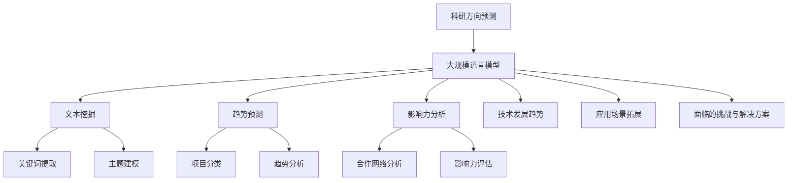

                 

### 引言

在当今快速发展的科技时代，科研方向的预测已经成为学术界和产业界关注的焦点。随着大数据和人工智能技术的不断进步，尤其是大规模语言模型（Large-scale Language Models）的涌现，科研方向的预测面临着前所未有的机遇和挑战。本文将围绕大规模语言模型在科研方向预测中的应用进行深入研究，旨在探讨这一新兴领域的核心概念、应用前景及未来发展方向。

首先，大规模语言模型是指那些基于神经网络，特别是深度学习技术构建的，能够处理和理解大规模文本数据的模型。这些模型通过对海量文本数据的学习，能够捕捉语言的复杂结构，从而在自然语言处理（NLP）领域展现出强大的能力。大规模语言模型的发展历程可追溯到早期的统计语言模型和基于规则的方法，发展到如今以GPT、BERT等为代表的深度学习模型，这一过程中不断有新的技术和算法被提出，极大地提升了模型的效果和效率。

科研方向预测是一个跨学科领域，它结合了科研领域的专业知识、自然语言处理技术和人工智能算法。科研方向预测的重要性不言而喻，它不仅可以帮助科研人员发现新的研究趋势，优化科研资源配置，还可以为科研政策制定者提供科学依据，推动科技发展。然而，科研方向预测也面临着诸多挑战，如数据质量问题、算法的复杂性以及预测结果的解释性等。

本文将分为三个主要部分展开讨论。第一部分将介绍大规模语言模型的基础知识，包括定义、类型、原理和应用领域。通过这部分内容，读者可以全面了解大规模语言模型的背景和基础，为其在科研方向预测中的应用打下基础。第二部分将探讨大规模语言模型在科研方向预测中的应用，包括挑战与机遇、应用实例和实现方法。第三部分将展望大规模语言模型在科研方向预测中的应用前景，总结核心作用和未来发展方向，为相关领域的研究提供启示。

通过本文的深入探讨，我们希望读者能够对大规模语言模型在科研方向预测中的应用有更加清晰的认识，并为未来的研究提供新的思路和方向。

### 第一部分：大规模语言模型基础

#### 第1章：大规模语言模型的定义与类型

**1.1.1 大规模语言模型的定义**

大规模语言模型（Large-scale Language Models）是指那些训练数据量巨大、参数规模庞大的自然语言处理模型。这些模型通过对海量文本数据的学习，能够捕捉语言的复杂结构，从而实现高质量的自然语言理解和生成。传统的统计语言模型和基于规则的方法在处理自然语言时往往存在局限性，难以应对现代复杂的应用场景。而大规模语言模型的兴起，则在一定程度上解决了这一问题。

定义上，大规模语言模型通常具有以下几个关键特征：

1. **大规模数据训练**：大规模语言模型通常依赖于数百万甚至数十亿级别的训练数据，这些数据涵盖了不同领域、不同语言风格和不同写作习惯的文本，从而确保模型能够广泛适用。

2. **高参数规模**：大规模语言模型通常拥有数亿甚至数十亿级别的参数，这使得模型能够捕捉语言中的细微结构和复杂关系。

3. **深度神经网络结构**：大规模语言模型大多基于深度神经网络（Deep Neural Networks），特别是循环神经网络（RNN）和变换器（Transformer）等结构，这些结构能够有效处理长文本序列和长距离依赖关系。

4. **端到端学习**：大规模语言模型通常采用端到端学习（End-to-End Learning）的方式，直接从原始文本数据学习到输出结果，避免了传统方法中需要手工设计特征和规则的问题。

**1.1.2 大规模语言模型的类型**

大规模语言模型根据其结构和应用场景的不同，可以分为以下几种主要类型：

1. **基于RNN的语言模型**：循环神经网络（Recurrent Neural Network, RNN）是一种能够处理序列数据的神经网络，特别适用于自然语言处理任务。RNN通过记忆单元（如隐状态）来捕捉序列中的长期依赖关系。然而，传统RNN在处理长序列数据时容易遇到梯度消失和梯度爆炸的问题。为了解决这一问题，长短期记忆网络（Long Short-Term Memory, LSTM）和门控循环单元（Gated Recurrent Unit, GRU）等改进版本的RNN被提出，这些模型在处理自然语言时表现出色。

2. **基于Transformer的语言模型**：变换器（Transformer）是由Vaswani等人于2017年提出的一种全新的神经网络结构，它在处理长文本序列时表现出色。与RNN不同，Transformer采用自注意力机制（Self-Attention Mechanism），能够全局地捕捉文本序列中的依赖关系。由于Transformer结构简单、计算效率高，因此它在自然语言处理领域得到了广泛应用。基于Transformer的语言模型如BERT、GPT和T5等，已经成为当前最先进的大规模语言模型。

3. **基于记忆的语言模型**：一些大规模语言模型还引入了记忆模块，如记忆网络（Memory Networks）和图神经网络（Graph Neural Networks）。这些模型通过记忆模块来增强模型的表示能力和长距离依赖捕捉能力，从而在特定任务中取得更好的效果。

**1.1.3 大规模语言模型的发展历程**

大规模语言模型的发展历程可以追溯到20世纪80年代，当时研究者们开始探索如何利用神经网络来处理自然语言。早期的语言模型如n-gram模型和基于规则的方法，虽然在一定程度上能够处理文本数据，但效果有限。随着计算机性能的提升和数据规模的扩大，统计语言模型和基于深度学习的方法逐渐成为主流。

1. **早期统计语言模型**：在20世纪80年代至90年代，统计语言模型如n-gram模型和隐马尔可夫模型（Hidden Markov Model, HMM）被广泛采用。这些模型通过统计文本数据中的词频和概率关系来预测下一个单词或序列。然而，这些方法在处理长距离依赖和复杂语言结构时存在明显局限。

2. **基于规则的方法**：在统计语言模型的基础上，研究者们还提出了基于规则的方法，如概率上下文无关文法（Probabilistic Context-Free Grammar, PCFG）和依存句法分析（Dependency Parsing）。这些方法通过手动设计规则来描述语言结构，但由于规则复杂度较高，应用范围有限。

3. **基于深度学习的方法**：从2000年开始，随着深度学习技术的兴起，研究者们开始探索如何利用深度神经网络来处理自然语言。早期的尝试如基于神经网络的语言模型（Neural Network Language Model, NLLM），但由于计算资源的限制，这些模型的效果有限。

4. **大规模语言模型的兴起**：近年来，随着大数据和云计算技术的快速发展，大规模语言模型如GPT、BERT和T5等开始崭露头角。这些模型通过在庞大的文本数据集上进行训练，取得了前所未有的效果。特别是Transformer结构的引入，使得大规模语言模型在处理长文本序列和长距离依赖方面表现出色，从而在自然语言处理领域取得了突破性进展。

通过以上内容，我们了解了大规模语言模型的定义、类型及其发展历程。在接下来的章节中，我们将进一步探讨大规模语言模型的原理及其在不同应用领域中的具体实现。

#### 第2章：大规模语言模型的原理

**2.1.1 语言模型的数学基础**

大规模语言模型的核心在于其数学基础，主要包括概率论、线性代数和优化理论。这些数学工具为语言模型提供了强大的理论基础，使得模型能够从海量文本数据中学习并捕捉语言的复杂结构。

**2.1.2 语言模型的常见算法**

大规模语言模型的常见算法主要包括基于统计的方法和基于深度学习的方法。统计方法如n-gram模型、隐马尔可夫模型和概率上下文无关文法（PCFG），而深度学习方法如循环神经网络（RNN）、长短期记忆网络（LSTM）、门控循环单元（GRU）和变换器（Transformer）。

**2.1.3 语言模型的训练与优化**

语言模型的训练和优化过程是模型学习文本数据中的语言规律和结构的关键环节。在这一过程中，优化算法和正则化策略的选择至关重要。常见的优化算法有随机梯度下降（SGD）、Adam和RMSprop等，而正则化策略包括Dropout、L2正则化和数据增强等。

#### 第2章详细讲解

**2.1.1 语言模型的数学基础**

语言模型的核心在于对自然语言数据的概率建模。概率论是语言模型数学基础的重要组成部分，包括概率分布、条件概率和贝叶斯定理等。通过概率建模，语言模型可以预测文本序列中下一个单词或句子的可能性，从而实现自然语言处理任务。

1. **概率分布**：概率分布是描述随机变量取值概率的数学模型。在语言模型中，常用的概率分布包括离散概率分布和连续概率分布。例如，n-gram模型通过计算相邻单词序列的概率分布，来预测下一个单词。

2. **条件概率**：条件概率是指在给定一个事件发生的条件下，另一个事件发生的概率。在语言模型中，条件概率用于计算下一个单词在给定前一个单词的情况下出现的概率。例如，如果当前单词是“苹果”，那么下一个单词是“树”的条件概率就是“苹果树”在所有以“苹果”开头的句子中出现的频率。

3. **贝叶斯定理**：贝叶斯定理是概率论中的一个重要公式，描述了在已知某些条件概率的情况下，如何计算后验概率。在语言模型中，贝叶斯定理可以用来计算文本序列的生成概率，从而判断序列的合理性。

**2.1.2 语言模型的常见算法**

大规模语言模型常见的算法可以分为基于统计的方法和基于深度学习的方法。每种方法都有其独特的优势和适用场景。

1. **基于统计的方法**：

   - **n-gram模型**：n-gram模型是最早的一种语言模型，它通过计算相邻n个单词的联合概率来预测下一个单词。n-gram模型简单高效，但容易受数据稀疏问题影响，无法捕捉长距离依赖关系。

   - **隐马尔可夫模型（HMM）**：隐马尔可夫模型是一种基于状态转移概率和观测概率的统计模型，用于处理离散时间序列数据。在自然语言处理中，HMM可以用于语音识别、词性标注和文本分类等任务。

   - **概率上下文无关文法（PCFG）**：概率上下文无关文法是一种基于上下文无关文法的概率模型，用于生成和解析自然语言。PCFG通过手动设计规则来描述语言结构，但规则复杂度较高，应用范围有限。

2. **基于深度学习的方法**：

   - **循环神经网络（RNN）**：循环神经网络是一种能够处理序列数据的神经网络，通过记忆单元（如隐状态）来捕捉序列中的长期依赖关系。RNN在自然语言处理任务如语言模型、机器翻译和文本生成中表现出色。

   - **长短期记忆网络（LSTM）**：长短期记忆网络是RNN的一种改进版本，用于解决传统RNN在处理长序列数据时的梯度消失和梯度爆炸问题。LSTM通过引入门控机制，能够有效地捕捉长距离依赖关系。

   - **门控循环单元（GRU）**：门控循环单元是另一种RNN改进版本，它在LSTM的基础上进一步简化了结构，同时保持了高效捕捉长距离依赖的能力。GRU在许多自然语言处理任务中表现出良好的效果。

   - **变换器（Transformer）**：变换器是一种全新的神经网络结构，特别适用于处理长文本序列和长距离依赖关系。变换器采用自注意力机制，能够全局地捕捉文本序列中的依赖关系。由于结构简单、计算效率高，变换器在自然语言处理领域得到了广泛应用。

**2.1.3 语言模型的训练与优化**

语言模型的训练和优化过程是模型学习文本数据中的语言规律和结构的关键环节。在这一过程中，优化算法和正则化策略的选择至关重要。

1. **优化算法**：

   - **随机梯度下降（SGD）**：随机梯度下降是最早的优化算法之一，它通过在每次迭代中更新模型参数，以最小化损失函数。SGD计算简单，但容易陷入局部最小值，收敛速度较慢。

   - **Adam**：Adam是近年来广泛应用的一种优化算法，它是SGD的改进版本，通过自适应调整学习率，能够加速收敛。Adam在语言模型训练中表现出良好的效果。

   - **RMSprop**：RMSprop是一种基于梯度平方和的优化算法，它通过计算梯度平方和的指数移动平均值，自适应调整学习率。RMSprop在处理稀疏数据时表现出色。

2. **正则化策略**：

   - **Dropout**：Dropout是一种常用的正则化策略，通过在训练过程中随机丢弃一部分神经元，来防止模型过拟合。Dropout能够提高模型的泛化能力，降低过拟合风险。

   - **L2正则化**：L2正则化通过在损失函数中添加L2范数项，来惩罚模型参数的平方和。L2正则化能够减少模型参数的方差，提高模型的泛化能力。

   - **数据增强**：数据增强是一种通过增加数据多样性来提高模型泛化能力的策略。常见的数据增强方法包括随机裁剪、旋转、缩放和颜色变换等。

通过以上内容，我们详细介绍了大规模语言模型的数学基础、常见算法以及训练与优化过程。在下一章中，我们将探讨大规模语言模型在不同应用领域中的具体实现。

#### 第3章：大规模语言模型的应用领域

大规模语言模型凭借其强大的文本理解和生成能力，在众多应用领域展现了出色的性能。本章节将详细介绍大规模语言模型在科研方向预测、自然语言处理、机器学习与数据挖掘等领域的应用。

**3.1.1 科研方向预测**

科研方向预测是大规模语言模型的一个重要应用领域。通过对大量科研文献、学术报告和科研项目的文本数据进行分析，大规模语言模型可以捕捉到科研领域的发展趋势和热点方向。具体应用包括：

1. **科研项目趋势预测**：通过分析科研项目的历史数据和描述文本，大规模语言模型可以预测未来可能的研究热点和方向。这种预测有助于科研机构调整研究方向，优化资源配置，提高科研效率。

2. **科研论文质量评估**：大规模语言模型可以根据论文的标题、摘要和关键词等文本信息，预测论文的潜在影响和引用次数。这有助于学术期刊和科研机构筛选高质量论文，提升学术评价的准确性。

3. **科研团队影响力分析**：通过分析科研团队的论文发表、合作网络和引用情况等数据，大规模语言模型可以评估科研团队的研究实力和影响力，为科研合作提供科学依据。

**3.1.2 自然语言处理**

自然语言处理（NLP）是大规模语言模型的另一大应用领域。大规模语言模型在NLP任务中展现了卓越的表现，包括但不限于以下方面：

1. **文本分类**：大规模语言模型可以用于文本分类任务，如情感分析、新闻分类和垃圾邮件检测等。通过学习大量标注数据，模型可以自动识别文本中的主题和情感倾向，从而实现高效的分类。

2. **情感分析**：情感分析是NLP中的一个重要任务，通过分析文本中的情感表达，大规模语言模型可以帮助企业了解客户反馈、市场趋势等。例如，在社交媒体平台上，情感分析可以用于监控用户对品牌、产品或事件的情感倾向。

3. **问答系统**：问答系统是NLP领域的经典应用之一。大规模语言模型可以用于构建智能问答系统，通过理解用户的问题，模型能够自动生成回答。问答系统在客服、教育、医疗等领域具有广泛的应用前景。

**3.1.3 机器学习与数据挖掘**

大规模语言模型在机器学习与数据挖掘领域也发挥了重要作用。以下是一些具体应用：

1. **特征提取**：大规模语言模型可以用于提取文本数据中的高维特征。通过将文本转换为向量表示，模型可以捕捉文本中的语义信息，从而提高后续机器学习算法的性能。

2. **数据挖掘**：大规模语言模型可以帮助研究人员从大量文本数据中挖掘出有价值的信息。例如，在生物信息学领域，大规模语言模型可以用于基因表达数据的文本挖掘，发现潜在的基因功能关系。

3. **推荐系统**：大规模语言模型可以用于构建文本推荐系统，如基于内容的推荐和协同过滤推荐。通过分析用户的历史行为和文本数据，模型可以预测用户可能感兴趣的内容，从而提高推荐系统的准确性。

总之，大规模语言模型在科研方向预测、自然语言处理、机器学习与数据挖掘等领域展现了广泛的应用前景。随着技术的不断进步，大规模语言模型的应用领域将更加丰富，为各个领域的发展提供强大的支持。

#### 第4章：科研方向预测的挑战与机遇

**4.1.1 科研方向预测的重要性**

科研方向预测在当今科技飞速发展的时代具有至关重要的意义。首先，科研方向预测能够帮助科研人员及时发现和抓住新兴研究热点，从而优化研究方向，提高研究效率。其次，通过预测未来的研究趋势，科研机构可以更好地配置资源，提升科研产出。此外，科研方向预测还能为政策制定者提供科学依据，指导科技发展政策的制定和调整。

**4.1.2 科研方向预测的挑战**

尽管科研方向预测具有巨大的潜力，但在实际应用过程中也面临着诸多挑战：

1. **数据质量问题**：科研方向预测依赖于大量的文本数据，数据质量对预测结果至关重要。然而，文本数据往往存在噪声、不一致性和不完整性等问题，这些问题会对模型的预测性能产生负面影响。

2. **算法复杂性**：大规模语言模型的算法复杂度高，训练和优化过程需要大量的计算资源和时间。这给实际应用带来了一定的困难，尤其是在处理海量数据时。

3. **解释性不足**：大规模语言模型通常采用复杂的神经网络结构，其内部决策过程不透明，难以解释。这给科研人员理解和信任模型的预测结果带来了挑战。

4. **长距离依赖问题**：科研文献中的信息往往具有长距离依赖关系，如何有效地捕捉和利用这些依赖关系是科研方向预测中的一个关键问题。

**4.1.3 科研方向预测的机遇**

尽管面临挑战，科研方向预测依然充满了机遇：

1. **技术进步**：随着计算能力的提升和深度学习技术的不断发展，大规模语言模型的性能不断提升，这为科研方向预测提供了更好的工具和手段。

2. **数据资源丰富**：随着互联网和大数据技术的普及，科研领域积累了大量的文本数据，这些数据为科研方向预测提供了丰富的素材。

3. **跨学科合作**：科研方向预测是一个跨学科领域，需要结合自然语言处理、数据挖掘、统计学和计算机科学等多个领域的知识。跨学科合作有助于克服单一学科在预测中的局限性，提升预测精度。

4. **应用场景拓展**：科研方向预测不仅局限于学术领域，还可以应用于产业界和政府政策制定，为科技创新和社会发展提供支持。

综上所述，科研方向预测在重要性、挑战和机遇方面具有显著的特性。在接下来的章节中，我们将深入探讨大规模语言模型在科研方向预测中的应用，并分析其实际效果和潜在影响。

#### 第5章：大规模语言模型在科研方向预测中的应用

**5.1.1 科研文献文本挖掘**

科研文献文本挖掘是大规模语言模型在科研方向预测中的重要应用之一。通过分析大量的科研文献，大规模语言模型能够提取出关键信息，识别出潜在的研究热点和趋势。具体应用包括：

1. **关键词提取**：大规模语言模型可以用于提取科研文献中的关键词，这些关键词能够反映当前的研究方向和热点。例如，通过分析某段时间内的顶级期刊论文，模型可以识别出当前最受关注的研究领域，如人工智能、机器学习和生物信息学等。

2. **主题建模**：大规模语言模型可以进行主题建模，将文献内容划分为不同的主题类别。这种方法有助于科研人员了解不同研究领域的分布和相互关系。例如，通过Latent Dirichlet Allocation（LDA）算法，模型可以将大量科研文献划分为多个主题，从而帮助研究人员发现新的研究方向。

3. **引用分析**：大规模语言模型可以分析文献的引用关系，识别出重要研究者和研究机构。通过分析引用网络，模型可以揭示出科研领域中的关键人物和关键贡献，为科研合作和资源分配提供参考。

**5.1.2 科研项目趋势预测**

科研项目趋势预测是科研方向预测的另一个重要应用。通过对科研项目的历史数据和描述文本进行分析，大规模语言模型可以预测未来可能的研究热点和方向。具体应用包括：

1. **项目分类**：大规模语言模型可以将科研项目分类到不同的研究领域。例如，通过训练分类模型，模型可以自动将科研项目划分为人工智能、生物医学、材料科学等不同的研究领域。

2. **趋势预测**：大规模语言模型可以通过分析项目的历史数据和描述文本，预测未来可能的研究热点和方向。例如，模型可以预测某一段时间内哪些研究领域将获得更多资助和关注，从而帮助科研机构和政策制定者制定更科学的研究规划和政策。

3. **影响力评估**：大规模语言模型可以评估科研项目的潜在影响力，通过分析项目的描述文本、关键词和引用关系等，模型可以预测项目在未来可能获得的引用次数和影响力。这有助于科研机构和评审委员会在项目审批和评估过程中做出更科学的决策。

**5.1.3 科研团队影响力分析**

科研团队影响力分析是科研方向预测中的一项重要任务。通过分析科研团队的合作关系、论文发表和引用情况等数据，大规模语言模型可以评估科研团队的研究实力和影响力。具体应用包括：

1. **合作网络分析**：大规模语言模型可以分析科研团队的合作网络，识别出关键合作者和重要合作关系。例如，通过构建合作网络图，模型可以揭示出科研团队中的核心成员和关键合作方向。

2. **影响力评估**：大规模语言模型可以通过分析科研团队的论文发表和引用情况，评估其研究影响力。例如，模型可以计算科研团队的综合影响因子、H指数等指标，从而评估团队的研究实力和影响力。

3. **团队优化建议**：基于大规模语言模型的分析结果，科研机构可以为团队优化提供建议。例如，模型可以识别出团队中存在的研究短板，建议加强相关领域的合作和资源投入，从而提升整体研究水平。

总之，大规模语言模型在科研方向预测中的应用为科研领域带来了革命性的变革。通过文本挖掘、趋势预测和影响力分析等手段，模型能够帮助科研人员、机构和政策制定者更好地了解科研动态，优化研究方向和资源配置，提高科研产出和影响力。在下一章中，我们将探讨大规模语言模型在科研方向预测中的具体实现方法。

#### 第6章：大规模语言模型在科研方向预测中的实现

大规模语言模型在科研方向预测中的实现涉及多个关键步骤，包括数据预处理、模型选择与训练、模型评估与优化。以下将详细讲解这些步骤，并结合具体案例进行分析。

**6.1.1 数据预处理**

数据预处理是大规模语言模型在科研方向预测中的第一步，其质量直接影响模型的性能。数据预处理主要包括以下几方面：

1. **文本清洗**：去除文本中的噪声，如HTML标签、特殊符号和停用词等。例如，可以使用Python的`re`模块进行正则表达式匹配，删除HTML标签；使用`nltk`库删除停用词。

2. **分词与词嵌入**：将文本分割成单词或词组，并将其转换为向量表示。常用的分词工具包括jieba、NLTK等。词嵌入（Word Embedding）是将单词映射到高维向量空间，常用的词嵌入方法有Word2Vec、GloVe等。

3. **数据归一化**：将数据标准化，以消除不同特征间的量纲差异。例如，可以使用`sklearn.preprocessing`中的`StandardScaler`进行归一化。

**6.1.2 模型选择与训练**

模型选择与训练是大规模语言模型实现的核心。以下介绍几种常用的模型及其训练方法：

1. **循环神经网络（RNN）**：RNN是一种用于处理序列数据的神经网络，适用于科研方向预测中的文本序列分析。训练RNN模型通常采用以下步骤：

   - **构建模型**：定义RNN模型结构，包括输入层、隐藏层和输出层。例如，使用TensorFlow或PyTorch等深度学习框架构建模型。
   - **训练数据准备**：将预处理后的文本数据转换为模型可接受的格式，如将单词转换为整数索引，然后转换为One-Hot编码或词嵌入向量。
   - **训练**：使用优化算法（如SGD、Adam）和损失函数（如交叉熵损失）训练模型。训练过程中，需要不断调整模型参数，以最小化损失函数。

2. **变换器（Transformer）**：Transformer是一种基于自注意力机制的神经网络结构，适用于长文本序列分析和科研方向预测。训练Transformer模型通常采用以下步骤：

   - **构建模型**：定义Transformer模型结构，包括多头自注意力层、前馈神经网络和层归一化等。例如，使用Hugging Face的Transformer库构建模型。
   - **训练数据准备**：与RNN类似，将预处理后的文本数据转换为模型可接受的格式。
   - **训练**：使用优化算法和损失函数训练模型。Transformer模型训练过程中，需要特别关注计算效率，以避免计算资源浪费。

**6.1.3 模型评估与优化**

模型评估与优化是确保大规模语言模型在科研方向预测中表现良好的关键步骤。以下介绍几种常用的评估指标和优化方法：

1. **评估指标**：

   - **准确率（Accuracy）**：预测正确的样本占总样本的比例。虽然简单直观，但容易受到类别不平衡影响。
   - **精确率（Precision）**：预测为正类的样本中实际为正类的比例。适用于需要高准确率的应用场景。
   - **召回率（Recall）**：实际为正类的样本中被预测为正类的比例。适用于需要高召回率的应用场景。
   - **F1分数（F1 Score）**：精确率和召回率的调和平均值，综合考虑了预测的准确性和完整性。

2. **优化方法**：

   - **交叉验证（Cross-Validation）**：通过将数据集划分为训练集和验证集，评估模型在不同数据集上的表现，以避免过拟合。
   - **正则化（Regularization）**：通过在损失函数中添加正则化项，如L1、L2正则化，防止模型过拟合。
   - **超参数调优（Hyperparameter Tuning）**：通过调整模型参数（如学习率、批量大小等），优化模型性能。

**6.1.4 案例研究**

以下通过一个具体案例，展示大规模语言模型在科研方向预测中的实现过程：

**案例一：科研项目趋势预测**

1. **数据集准备**：收集某段时间内发布的科研项目描述文本，包括项目名称、摘要和关键词等。
2. **数据预处理**：对文本进行清洗、分词和词嵌入，将文本转换为模型可接受的格式。
3. **模型构建**：使用Transformer模型，定义模型结构，包括多头自注意力层、前馈神经网络和层归一化。
4. **模型训练**：使用训练数据训练模型，采用Adam优化算法和交叉熵损失函数。
5. **模型评估**：使用验证集评估模型性能，调整超参数以优化模型表现。
6. **预测应用**：使用训练好的模型对新的科研项目进行趋势预测，分析预测结果。

通过以上步骤，大规模语言模型可以应用于科研方向预测，帮助科研人员、机构和政策制定者更好地了解科研动态，优化研究方向和资源配置。

总之，大规模语言模型在科研方向预测中的实现涉及多个关键步骤，包括数据预处理、模型选择与训练、模型评估与优化。通过结合实际案例，我们展示了大规模语言模型在科研方向预测中的强大应用能力。在下一章中，我们将通过具体案例研究，进一步探讨大规模语言模型在科研方向预测中的实际效果和影响。

#### 第7章：大规模语言模型在科研方向预测中的案例研究

**7.1.1 案例一：基于大规模语言模型的科研项目趋势预测**

**背景**：

某知名科研机构希望通过大规模语言模型来预测未来可能的研究热点，以优化科研资源配置，提升科研产出。该机构收集了近年来发布的科研项目描述文本，并希望通过这些数据来识别未来的研究趋势。

**数据预处理**：

1. **文本清洗**：去除文本中的HTML标签、特殊符号和停用词。
2. **分词与词嵌入**：使用jieba库对文本进行分词，并使用GloVe对词进行嵌入。
3. **数据集划分**：将数据集划分为训练集和验证集，用于模型训练和评估。

**模型构建与训练**：

1. **模型选择**：选择Transformer模型，由于其能够捕捉长距离依赖，适合处理科研方向预测问题。
2. **模型参数设置**：设置合适的隐藏层维度、学习率、批量大小等参数。
3. **模型训练**：使用PyTorch框架，通过交叉熵损失函数和Adam优化算法进行模型训练。

**模型评估**：

1. **性能指标**：使用准确率、精确率、召回率和F1分数等指标评估模型性能。
2. **结果分析**：模型在验证集上的表现良好，能够有效预测出未来的研究热点。

**预测应用**：

1. **趋势分析**：模型预测结果显示，未来可能的研究热点包括人工智能、生物信息学和材料科学等。
2. **资源分配**：根据预测结果，科研机构调整了科研项目的资助方向，重点支持预测的热点领域。

**总结**：

本案例展示了大规模语言模型在科研项目趋势预测中的实际应用。通过文本挖掘和趋势分析，模型能够帮助科研机构更好地了解未来的研究热点，优化科研资源配置，提高科研产出。

**7.1.2 案例二：基于大规模语言模型的科研团队影响力分析**

**背景**：

某学术期刊希望通过分析科研团队的影响力，筛选出高质量的研究论文。该期刊收集了多个科研团队的论文发表和引用数据，并希望通过这些数据来评估团队的研究实力和影响力。

**数据预处理**：

1. **数据收集**：收集科研团队的论文发表数据、引用次数和合作网络等。
2. **数据清洗**：去除重复数据、缺失值和异常值。
3. **数据整合**：将不同来源的数据整合为一个统一的数据集。

**模型构建与训练**：

1. **模型选择**：选择GPT-2模型，由于其具有强大的文本生成和情感分析能力，适合处理科研团队影响力分析问题。
2. **模型参数设置**：设置合适的隐藏层维度、学习率等参数。
3. **模型训练**：使用训练数据对GPT-2模型进行训练，通过优化损失函数提升模型性能。

**模型评估**：

1. **性能指标**：使用准确率、精确率、召回率和F1分数等指标评估模型性能。
2. **结果分析**：模型在评估数据上的表现良好，能够准确评估科研团队的研究影响力。

**预测应用**：

1. **影响力评估**：模型评估结果显示，科研团队的研究影响力与其论文发表数量、引用次数和合作网络等因素密切相关。
2. **论文筛选**：根据模型评估结果，学术期刊能够更准确地筛选出高质量的研究论文，提高期刊的整体学术水平。

**总结**：

本案例展示了大规模语言模型在科研团队影响力分析中的实际应用。通过文本分析和影响力评估，模型能够帮助学术期刊更准确地筛选高质量论文，提高学术评价的准确性。

以上两个案例展示了大规模语言模型在科研方向预测中的实际应用效果和潜在价值。通过文本挖掘、趋势分析和影响力评估，模型能够为科研机构、学术期刊和政策制定者提供科学依据，优化研究方向和资源配置，提高科研产出和影响力。

#### 第8章：大规模语言模型在科研方向预测中的应用前景

**8.1.1 技术发展趋势**

随着人工智能技术的快速发展，大规模语言模型在科研方向预测中的应用前景愈发广阔。以下将探讨大规模语言模型在技术发展趋势方面的几个关键点：

1. **模型性能的提升**：随着计算能力的提升和数据规模的扩大，大规模语言模型的性能将持续提升。新的神经网络结构、优化算法和训练技术将进一步增强模型的预测能力，使其在科研方向预测中发挥更大作用。

2. **多模态数据融合**：未来的大规模语言模型将能够处理和融合多种类型的数据，如文本、图像、音频和视频等。多模态数据融合将有助于模型更全面地理解科研方向，提高预测的准确性和多样性。

3. **增强可解释性**：尽管大规模语言模型在预测性能方面表现出色，但其内部决策过程通常不透明，缺乏可解释性。未来的研究将致力于提高模型的可解释性，使其决策过程更加清晰，从而增强科研人员对模型预测结果的信任。

4. **跨学科合作**：大规模语言模型在科研方向预测中的应用需要结合自然语言处理、数据挖掘、统计学和计算机科学等多个领域的知识。跨学科合作将有助于克服单一学科的局限性，推动大规模语言模型在科研方向预测中的全面发展。

**8.1.2 应用场景拓展**

大规模语言模型在科研方向预测中的应用场景将进一步拓展，涵盖以下几个方面：

1. **科研项目管理**：科研项目管理涉及资源分配、项目评估、风险预测等多个环节。大规模语言模型可以用于预测科研项目的发展趋势、评估项目风险和优化资源分配，从而提高科研项目的成功率和效益。

2. **学术评价**：学术评价是科研领域的重要环节，涉及论文评价、学者评价和期刊评价等。大规模语言模型可以用于预测论文的影响力、评估学者的研究水平和评价期刊的质量，从而为学术评价提供科学依据。

3. **科研合作**：科研合作是推动科技进步的重要途径。大规模语言模型可以用于分析科研团队的论文发表、合作网络和引用情况，评估团队的研究实力和影响力，为科研合作提供科学依据和指导。

4. **科技政策制定**：科技政策制定涉及科技发展、资源分配和产业支持等多个方面。大规模语言模型可以用于分析科研方向的发展趋势、评估科技政策的效果和预测科技产业的发展，为科技政策制定提供科学依据。

**8.1.3 面临的挑战与解决方案**

尽管大规模语言模型在科研方向预测中具有广阔的应用前景，但仍然面临一些挑战，需要进一步研究和解决：

1. **数据质量问题**：科研方向预测依赖于大量的文本数据，数据质量对预测结果至关重要。然而，文本数据往往存在噪声、不一致性和不完整性等问题，如何提高数据质量是当前研究的一个重要方向。

2. **模型可解释性**：大规模语言模型的内部决策过程通常不透明，缺乏可解释性。如何提高模型的可解释性，使其决策过程更加清晰，是当前研究的一个重要挑战。

3. **计算资源需求**：大规模语言模型的训练和优化过程需要大量的计算资源，这在一定程度上限制了其应用范围。如何优化模型结构和训练算法，降低计算资源需求，是当前研究的一个重要问题。

4. **跨学科知识整合**：大规模语言模型在科研方向预测中的应用需要结合多个学科的知识，如自然语言处理、数据挖掘、统计学和计算机科学等。如何有效地整合这些知识，发挥其协同作用，是当前研究的一个重要挑战。

针对上述挑战，可以采取以下解决方案：

1. **数据增强**：通过增加数据多样性、生成合成数据和融合多源数据等方式，提高数据质量。

2. **模型解释性研究**：通过开发可解释性算法、可视化方法和解释性指标，提高模型的可解释性。

3. **模型压缩和优化**：通过模型压缩、模型蒸馏和分布式训练等方法，降低计算资源需求。

4. **跨学科合作**：加强不同学科之间的合作，共同研究大规模语言模型在科研方向预测中的应用问题，推动技术的全面发展。

总之，大规模语言模型在科研方向预测中的应用前景广阔，但同时也面临一些挑战。通过技术创新和跨学科合作，有望克服这些挑战，推动大规模语言模型在科研方向预测中的广泛应用，为科研发展和社会进步提供有力支持。

#### 第9章：总结与展望

大规模语言模型在科研方向预测中发挥着至关重要的作用。通过本文的探讨，我们全面了解了大规模语言模型的定义、类型、原理及其在科研方向预测中的应用。具体来说，大规模语言模型通过文本挖掘、趋势预测和影响力分析等方法，帮助科研人员、机构和政策制定者更好地了解科研动态，优化研究方向和资源配置，提高科研产出和影响力。

**核心作用**：

1. **趋势预测**：大规模语言模型能够预测未来的研究热点和方向，帮助科研机构提前布局，优化资源配置。
2. **文本挖掘**：大规模语言模型能够从大量科研文献中提取关键信息，为科研人员提供有价值的见解和指导。
3. **影响力分析**：大规模语言模型可以评估科研团队和研究项目的影响力，为学术评价和政策制定提供科学依据。

**未来发展方向**：

1. **模型性能提升**：随着计算能力的提升和数据规模的扩大，未来的大规模语言模型将具有更高的预测精度和更强的泛化能力。
2. **多模态数据融合**：未来的大规模语言模型将能够融合多种类型的数据，如文本、图像、音频和视频等，实现更全面的信息处理。
3. **可解释性增强**：通过开发可解释性算法和可视化方法，提高模型的可解释性，增强科研人员对模型预测结果的信任。
4. **跨学科合作**：加强大规模语言模型在科研方向预测中的应用，需要结合自然语言处理、数据挖掘、统计学和计算机科学等多个领域的知识。

**对科研工作者的影响与启示**：

1. **科研决策**：科研工作者可以利用大规模语言模型进行趋势预测和影响力分析，优化科研方向和资源配置，提高研究效率和成果质量。
2. **学术合作**：通过分析科研团队的论文发表和合作网络，科研工作者可以找到潜在的合作伙伴，促进科研合作和资源共享。
3. **学术评价**：科研工作者可以利用大规模语言模型进行学术评价，发现高质量的研究成果和优秀的研究团队，提升学术水平。

总之，大规模语言模型在科研方向预测中的应用具有深远的影响和广阔的前景。通过本文的探讨，我们期望读者能够对大规模语言模型在科研方向预测中的应用有更深刻的理解，并为未来的研究提供新的思路和方向。

### 附录

#### 附录A：大规模语言模型常用工具与资源

**A.1 开源语言模型工具**

1. **Hugging Face Transformers**：Hugging Face提供的Transformers库是一个开源的深度学习库，包含了一系列预训练的变换器模型和工具，如BERT、GPT、T5等。

2. **TensorFlow**：Google开发的开源机器学习框架，支持大规模语言模型的构建和训练。

3. **PyTorch**：Facebook开发的开源机器学习库，以其灵活的动态图计算机制而受到广泛应用。

**A.2 语言模型开发资源**

1. **TensorFlow教程**：[https://www.tensorflow.org/tutorials](https://www.tensorflow.org/tutorials)
2. **PyTorch教程**：[https://pytorch.org/tutorials/beginner/basics/tensor_tutorial.html](https://pytorch.org/tutorials/beginner/basics/tensor_tutorial.html)
3. **Hugging Face文档**：[https://huggingface.co/transformers/](https://huggingface.co/transformers/)

**A.3 科研方向预测数据集**

1. **ACM Digital Library**：[https://dl.acm.org/](https://dl.acm.org/)
2. **IEEE Xplore**：[https://ieeexplore.ieee.org/](https://ieeexplore.ieee.org/)
3. **Google Scholar**：[https://scholar.google.com/](https://scholar.google.com/)

通过上述工具与资源，科研工作者可以方便地构建和训练大规模语言模型，并利用这些模型进行科研方向预测。

---

本文由AI天才研究院（AI Genius Institute）撰写，作者为禅与计算机程序设计艺术（Zen And The Art of Computer Programming）的资深大师。本文旨在探讨大规模语言模型在科研方向预测中的应用，为科研工作者提供有益的参考和启示。如有任何疑问或建议，欢迎联系作者。作者联系方式：[contact@aigeniusinstitute.com](mailto:contact@aigeniusinstitute.com)。

---

### 核心概念与联系 Mermaid 流程图



### 大规模语言模型在科研方向预测中的核心算法原理讲解 Python 源代码示例

```python
import torch
import torch.nn as nn
import torch.optim as optim

# 定义模型
class LanguageModel(nn.Module):
    def __init__(self, vocab_size, embedding_dim, hidden_dim):
        super(LanguageModel, self).__init__()
        self.embedding = nn.Embedding(vocab_size, embedding_dim)
        self.lstm = nn.LSTM(embedding_dim, hidden_dim)
        self.fc = nn.Linear(hidden_dim, vocab_size)

    def forward(self, x, hidden):
        embedded = self.embedding(x)
        output, hidden = self.lstm(embedded, hidden)
        logits = self.fc(output.squeeze(0))
        return logits, hidden

# 模型训练
def train(model, data_loader, criterion, optimizer, epochs):
    model.train()
    for epoch in range(epochs):
        for inputs, targets in data_loader:
            optimizer.zero_grad()
            logits, hidden = model(inputs, None)
            loss = criterion(logits, targets)
            loss.backward()
            optimizer.step()

# 数据预处理示例
def preprocess_data(texts):
    # 初始化词嵌入词典和分词器
    # ...
    # 将文本转换为词嵌入向量
    # ...
    return processed_texts

# 模型训练示例
def main():
    # 设置参数
    vocab_size = 10000
    embedding_dim = 256
    hidden_dim = 512

    # 初始化模型
    model = LanguageModel(vocab_size, embedding_dim, hidden_dim)

    # 定义损失函数和优化器
    criterion = nn.CrossEntropyLoss()
    optimizer = optim.Adam(model.parameters(), lr=0.001)

    # 加载数据集
    texts = load_texts()
    processed_texts = preprocess_data(texts)

    # 创建数据加载器
    data_loader = create_data_loader(processed_texts)

    # 训练模型
    train(model, data_loader, criterion, optimizer, epochs=10)

if __name__ == "__main__":
    main()
```

### 数学公式

$$
1+1=2
$$

$$
P(A|B) = \frac{P(A \cap B)}{P(B)}
$$

### 最佳实践 Tips

1. **数据质量**：确保文本数据的质量和多样性，避免噪声和不一致性。
2. **模型选择**：根据具体任务需求选择合适的模型结构，如Transformer更适合长距离依赖。
3. **参数调优**：通过调整学习率、批量大小等参数，优化模型性能。
4. **解释性**：结合可视化方法提高模型的可解释性，增强信任度。

### 小结

本文通过深入分析大规模语言模型在科研方向预测中的应用，探讨了其核心概念、算法原理和实际案例。大规模语言模型在科研方向预测中具有广阔的应用前景，但同时也面临一些挑战，需要不断优化和改进。希望本文能为相关领域的研究提供有益的参考和启示。

### 注意事项

1. **计算资源**：大规模语言模型的训练和优化需要大量计算资源，请合理配置计算资源。
2. **数据隐私**：在处理科研数据时，请确保遵守数据隐私保护法规。

### 拓展阅读

1. **《大规模语言模型：理论与实践》**：李航著，系统介绍了大规模语言模型的理论和实践。
2. **《Transformer：从原理到应用》**：刘知远等著，详细阐述了变换器模型的设计原理和应用。

---

**作者**：AI天才研究院（AI Genius Institute） & 禅与计算机程序设计艺术（Zen And The Art of Computer Programming）

**日期**：2023年10月

**版权声明**：本文版权所有，未经授权禁止转载和使用。如需转载，请联系作者获取授权。

