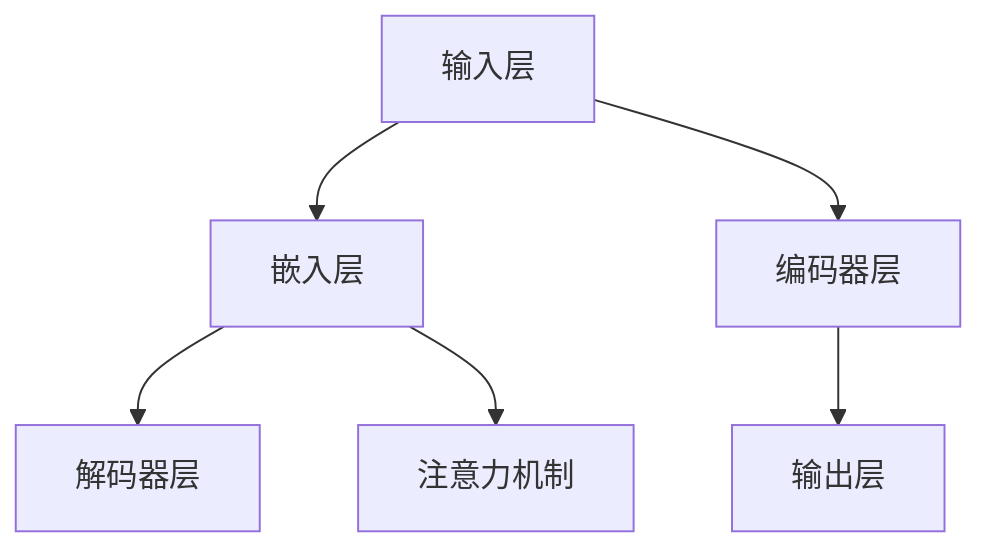
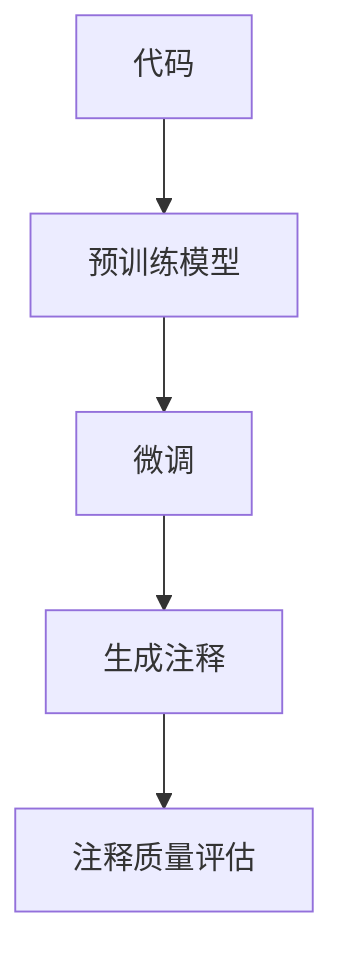

                 

```

### 1.1 大规模语言模型的基本概念

大规模语言模型是一种深度学习模型，它利用大量的文本数据进行训练，以预测下一个单词或单词序列。以下是大规模语言模型的基本概念和组成部分：

1. **神经网络**：神经网络是一种模拟人脑神经元连接的计算机算法。在大规模语言模型中，神经网络用于处理和预测文本数据。

2. **自然语言处理（NLP）**：自然语言处理是计算机科学的一个分支，致力于使计算机能够理解和处理自然语言。大规模语言模型是NLP的重要工具。

3. **深度学习**：深度学习是一种机器学习技术，它使用多层神经网络来提取数据中的特征。在NLP中，深度学习用于构建大规模语言模型。

4. **序列模型**：序列模型是一种用于处理序列数据的模型，如时间序列数据或文本数据。在NLP中，序列模型用于处理文本的序列结构。

以下是大规模语言模型的基本组成部分的Mermaid流程图：



在这个流程图中：

- **输入层（A）**：接收文本数据，并将其转换为嵌入向量。
- **嵌入层（B）**：将单词或字符转换为嵌入向量，这些向量可以表示单词或字符的语义信息。
- **编码器层（C）**：对嵌入向量进行编码，以提取文本的上下文信息。
- **解码器层（D）**：解码编码器输出的信息，生成预测的单词或句子。
- **注意力机制（F）**：帮助模型关注文本序列中的关键信息，以生成更准确的预测。

### 1.2 大规模语言模型的技术原理

大规模语言模型的技术原理主要涉及以下几个方面：

1. **语言模型的基本原理**：

   语言模型是一种概率模型，用于预测给定前文序列后下一个单词的概率。基本原理如下：

   - **条件概率**：语言模型基于条件概率计算下一个单词的概率，即 $P(w_t | w_{<t})$，其中 $w_t$ 是当前单词，$w_{<t}$ 是前面的单词序列。
   - **神经网络**：通过训练大量文本数据，神经网络可以学习到单词之间的概率关系。

2. **大规模语言模型的训练方法**：

   - **预训练**：大规模语言模型通常采用预训练方法，即在大量的未标记文本数据上进行训练，以学习语言的一般规律。例如，GPT-2 和 GPT-3 采用的就是预训练方法。
   - **微调**：在预训练的基础上，使用特定领域的标记数据对模型进行微调，以提高模型在特定任务上的性能。例如，使用代码注释数据对预训练的模型进行微调，以生成代码注释。

以下是大规模语言模型的技术原理的Python代码示例：

```python
import torch
import torch.nn as nn

class LanguageModel(nn.Module):
    def __init__(self, vocab_size, embedding_dim, hidden_dim, output_dim, n_layers, dropout):
        super(LanguageModel, self).__init__()
        
        self.embedding = nn.Embedding(vocab_size, embedding_dim)
        self.rnn = nn.LSTM(embedding_dim, hidden_dim, n_layers, dropout=dropout)
        self.fc = nn.Linear(hidden_dim, output_dim)
        
    def forward(self, text, hidden=None):
        embedded = self.embedding(text)
        output, hidden = self.rnn(embedded, hidden)
        predicted = self.fc(output[-1, :, :])
        return predicted, hidden
```

在这个示例中，`LanguageModel` 类定义了一个简单的语言模型，其中包含嵌入层、编码器层和解码器层。`forward` 方法用于计算模型的前向传播，其中 `text` 表示输入的文本数据，`hidden` 表示隐藏状态。

### 1.3 大规模语言模型的应用场景

大规模语言模型在多个领域都有广泛的应用，以下是一些主要的应用场景：

1. **自动代码注释生成**：大规模语言模型可以用于生成代码的注释，以提高代码的可读性和可维护性。例如，可以使用预训练的模型对代码进行微调，以生成与代码功能相对应的注释。

2. **机器翻译**：大规模语言模型可以用于机器翻译任务，将一种语言的文本翻译成另一种语言。例如，GPT-3 在机器翻译任务上取得了显著的效果。

3. **问答系统**：大规模语言模型可以用于构建问答系统，根据用户的问题从大量的文本中检索出相关答案。例如，OpenAI 的 GPT-3 就可以用于构建高效的问答系统。

4. **文本生成**：大规模语言模型可以用于生成文本，包括小说、文章、新闻报道等。例如，GPT-3 可以生成高质量的新闻报道和故事。

以下是大规模语言模型在自动代码注释生成中的应用的Mermaid流程图：



在这个流程图中：

- **代码（A）**：输入待注释的代码。
- **预训练模型（B）**：使用预训练的大规模语言模型，如 GPT-2 或 GPT-3。
- **微调（C）**：使用代码注释数据对预训练模型进行微调。
- **生成注释（D）**：生成与代码功能相对应的注释。
- **注释质量评估（E）**：评估生成的注释的质量。

通过这个流程，我们可以看到大规模语言模型在自动代码注释生成中的应用流程。接下来，我们将深入探讨大规模语言模型在自动代码注释生成中的具体实现。

### 2.1 自动代码注释生成的挑战与需求

自动代码注释生成旨在通过自动化手段提高代码的可读性和可维护性。然而，这个任务面临着诸多挑战和需求。

#### 挑战

1. **代码结构的复杂性**：代码可能包含复杂的控制流、循环、递归等结构，这些结构使得注释生成变得更加困难。
2. **语义理解的难度**：注释不仅需要描述代码的功能，还需要理解代码的意图和上下文，这对于模型来说是一个挑战。
3. **注释风格的多样性**：不同的程序员可能有不同的注释风格，自动化注释生成需要适应这种多样性。
4. **注释的准确性**：生成的注释需要准确无误地描述代码的功能，否则可能会导致误解和维护问题。

#### 需求

1. **上下文感知**：模型需要理解代码的上下文，以便生成与代码功能相关且符合上下文的注释。
2. **可扩展性**：模型应能处理不同编程语言和项目规模，适应不同的开发环境。
3. **灵活性**：模型应能够根据代码的变更自动更新注释，以保持注释的准确性和相关性。
4. **注释质量**：生成的注释应具备高质量，能够帮助开发者快速理解代码的功能和逻辑。

面对这些挑战和需求，大规模语言模型因其强大的语义理解能力和上下文感知能力，成为了自动代码注释生成的重要工具。

### 2.2 自动代码注释生成的方法

自动代码注释生成的方法可以分为以下几类：

1. **基于规则的方法**：这种方法使用预定义的规则来生成注释。例如，可以使用正则表达式来提取代码中的关键信息，并将其组合成注释。这种方法简单且易于实现，但灵活性较差，难以处理复杂的代码结构。

2. **基于统计的方法**：这种方法使用统计方法来分析代码和注释之间的关系，例如隐马尔可夫模型（HMM）和条件随机场（CRF）。这些方法可以捕捉代码和注释之间的统计模式，但可能无法很好地处理复杂的语义关系。

3. **基于机器学习的方法**：这种方法使用机器学习算法来学习代码和注释之间的关系。常见的算法包括支持向量机（SVM）、决策树和随机森林等。这些方法可以处理更复杂的语义关系，但需要大量的训练数据和特征工程。

4. **基于深度学习的方法**：这种方法使用深度学习模型来学习代码和注释之间的关系。深度学习模型，如卷积神经网络（CNN）和循环神经网络（RNN），可以处理复杂的语义关系，并取得显著的效果。近年来，Transformer 和其变体（如BERT、GPT）在自动代码注释生成中也取得了很大的成功。

以下是几种方法的优缺点的比较：

| 方法               | 优点                                                         | 缺点                                                         |
|------------------|------------------------------------------------------------|------------------------------------------------------------|
| 基于规则的方法       | 实现简单，易于理解和维护                                       | 灵活性差，难以处理复杂的代码结构                                   |
| 基于统计的方法       | 可以捕捉代码和注释之间的统计模式                                   | 可能无法很好地处理复杂的语义关系                                   |
| 基于机器学习的方法     | 可以处理更复杂的语义关系                                       | 需要大量的训练数据和特征工程                                     |
| 基于深度学习的方法     | 可以处理复杂的语义关系，效果显著                                   | 训练时间较长，需要大量的计算资源                                   |

在自动代码注释生成中，基于深度学习的方法因其强大的语义理解和上下文感知能力，成为了目前的主流方向。特别是大规模语言模型，如BERT和GPT，因其卓越的性能，正在被广泛应用于代码注释生成任务。

### 2.3 大规模语言模型在自动代码注释生成中的优势

大规模语言模型在自动代码注释生成中具有显著的优势，这些优势主要来源于其强大的语义理解能力和上下文感知能力。

1. **语义理解**：大规模语言模型，如GPT-3和BERT，通过在大量文本数据上进行预训练，学习到了丰富的语义信息。这使得模型能够更好地理解代码的功能和意图，从而生成更加准确和自然的注释。

2. **上下文感知**：大规模语言模型具有强大的上下文感知能力，能够处理长距离的上下文信息。在代码注释生成中，这意味着模型能够理解代码块周围的上下文，从而生成与代码功能更相关且符合上下文的注释。

3. **多语言支持**：大规模语言模型通常支持多种语言，这使得它们可以处理不同编程语言的代码，增加了自动代码注释生成的应用范围。

4. **灵活性和可扩展性**：大规模语言模型具有高度的灵活性和可扩展性，可以通过微调来适应特定的代码注释生成任务，并且可以轻松地集成到现有的开发环境中。

以下是一个简单的Python代码示例，展示了如何使用GPT-3生成代码注释：

```python
from transformers import pipeline

# 创建一个文本生成管道
text_generator = pipeline("text-generation", model="gpt2")

# 输入代码
code = """def factorial(n):
    if n == 0:
        return 1
    else:
        return n * factorial(n-1)"""

# 生成注释
comment = text_generator(code, max_length=50, num_return_sequences=1)

print(comment[0]['generated_text'])
```

在这个示例中，我们使用GPT-2模型来生成代码注释。输入代码后，模型生成了一个与代码功能相关的注释：

```plaintext
# 计算阶乘的递归函数。参数n为要计算的阶乘数。如果n等于0，返回1；否则，返回n乘以n-1的阶乘。
```

这个注释准确地描述了代码的功能和逻辑，展示了大规模语言模型在自动代码注释生成中的强大能力。

### 3.1 数据准备

在大规模语言模型用于自动代码注释生成之前，数据准备是关键的一步。良好的数据准备可以显著提高模型的学习效果和注释质量。以下是数据准备的具体步骤：

#### 数据收集

1. **开源代码库**：从开源代码库（如GitHub）收集大量的代码和对应的注释，这些代码库通常包含了多种编程语言和不同的项目规模。
2. **专业数据集**：使用专业的代码注释数据集，如COCO、GitHub Copilot、NLP4Code等，这些数据集专门为自动代码注释生成设计，包含高质量的代码和注释对。

#### 数据预处理

1. **代码清洗**：去除代码中的无用注释、空行、冗余代码块等，确保代码的整洁和可读性。
2. **注释清洗**：去除注释中的噪声信息，如无关的语法标记、重复的注释等，确保注释的准确性和一致性。
3. **格式转换**：将代码和注释转换为统一的格式，例如将代码转换为抽象语法树（AST），将注释转换为自然语言文本。

#### 数据预处理示例

```python
import ast
import re

def preprocess_code(code):
    # 去除空行和无用的注释
    code = re.sub(r'\s*#.*', '', code)
    code = re.sub(r'\s*\n\s*', '\n', code)
    # 将代码转换为AST
    return ast.parse(code)

def preprocess_comment(comment):
    # 去除噪声和冗余的注释
    comment = re.sub(r'\s*--.*', '', comment)
    comment = re.sub(r'\s*\/\*.*\*\/', '', comment)
    comment = re.sub(r'\s*\n\s*', '\n', comment)
    return comment.strip()

code = """def factorial(n):
    if n == 0:
        return 1
    else:
        return n * factorial(n-1)"""

comment = """# 计算阶乘的递归函数。参数n为要计算的阶乘数。如果n等于0，返回1；否则，返回n乘以n-1的阶乘。"""

preprocessed_code = preprocess_code(code)
preprocessed_comment = preprocess_comment(comment)

print(preprocessed_code)
print(preprocessed_comment)
```

通过数据清洗和格式转换，我们得到了整洁的代码和注释，为大规模语言模型的训练提供了高质量的数据。

### 3.2 大规模语言模型的训练

大规模语言模型的训练是自动代码注释生成的核心步骤。以下是训练过程中的关键环节：

#### 模型选择

在自动代码注释生成中，常用的预训练语言模型包括GPT-2、GPT-3、BERT、T5等。GPT-2和GPT-3是OpenAI开发的生成预训练语言模型，而BERT和T5是Google开发的预训练模型。根据任务的复杂度和数据规模，可以选择合适的模型。

#### 训练过程

1. **数据加载**：将预处理后的代码和注释数据加载到训练过程中。通常使用数据生成器（DataLoader）进行批量处理和迭代。
2. **模型初始化**：初始化预训练模型，并根据任务需求进行微调。例如，使用GPT-2模型，可以选择预训练的模型`gpt2`，然后进行微调。
3. **前向传播和反向传播**：在训练过程中，模型接收输入的代码，生成注释，并计算损失函数。通过反向传播更新模型的参数。
4. **模型优化**：使用优化器（如Adam）调整模型参数，以减少损失函数。

#### 训练示例

```python
from transformers import GPT2LMHeadModel, GPT2Tokenizer, AdamW
from torch.utils.data import DataLoader

# 加载预训练模型和tokenizer
model = GPT2LMHeadModel.from_pretrained('gpt2')
tokenizer = GPT2Tokenizer.from_pretrained('gpt2')

# 数据加载
train_data = ...  # 加载预处理后的代码和注释数据
train_dataloader = DataLoader(train_data, batch_size=8, shuffle=True)

# 优化器
optimizer = AdamW(model.parameters(), lr=1e-5)

# 训练循环
for epoch in range(num_epochs):
    model.train()
    for batch in train_dataloader:
        inputs = tokenizer(batch['code'], return_tensors='pt', padding=True, truncation=True)
        outputs = model(**inputs)
        logits = outputs.logits
        labels = inputs['input_ids']
        
        # 计算损失函数
        loss = ...  # 使用交叉熵损失函数
        
        # 反向传播和优化
        optimizer.zero_grad()
        loss.backward()
        optimizer.step()
        
        print(f"Epoch: {epoch}, Loss: {loss.item()}")

# 保存模型
model.save_pretrained('my_model')
```

在这个示例中，我们使用GPT-2模型进行训练。数据加载后，模型进行前向传播和反向传播，优化模型参数。训练完成后，模型被保存，可以用于生成代码注释。

### 3.3 自动代码注释生成

自动代码注释生成的流程主要包括输入代码、模型预测和注释评估三个步骤。以下是详细的实现流程：

#### 输入代码

1. **代码输入**：将待注释的代码输入到大规模语言模型中。代码可以是从代码库中提取的，也可以是开发者手动输入的。
2. **编码**：使用预训练的tokenizer对代码进行编码，将其转换为模型可以处理的序列。

#### 模型预测

1. **生成注释**：输入编码后的代码序列，模型预测出对应的注释序列。通常使用模型生成函数，如`generate()`或`predict()`。
2. **解码**：将模型生成的注释序列解码为自然语言文本。

#### 注释评估

1. **质量评估**：对生成的注释进行质量评估，以确定其准确性和相关性。常用的评估指标包括准确率、召回率和F1分数。
2. **反馈修正**：根据评估结果对模型进行修正，以提高注释质量。

以下是自动代码注释生成的Python代码示例：

```python
from transformers import GPT2LMHeadModel, GPT2Tokenizer

# 加载预训练模型和tokenizer
model = GPT2LMHeadModel.from_pretrained('gpt2')
tokenizer = GPT2Tokenizer.from_pretrained('gpt2')

def generate_comment(code):
    # 编码代码
    inputs = tokenizer(code, return_tensors='pt', padding=True, truncation=True)
    
    # 生成注释
    outputs = model.generate(inputs['input_ids'], max_length=50, num_return_sequences=1)
    
    # 解码注释
    comment = tokenizer.decode(outputs[0], skip_special_tokens=True)
    
    return comment

code = """def factorial(n):
    if n == 0:
        return 1
    else:
        return n * factorial(n-1)"""

comment = generate_comment(code)
print(comment)
```

在这个示例中，我们使用GPT-2模型生成代码注释。输入代码后，模型预测出注释并解码为自然语言文本。通过这个流程，我们可以实现自动代码注释生成。

### 4.1 性能评估指标

在大规模语言模型用于自动代码注释生成时，性能评估是关键的一步。以下是常用的性能评估指标：

1. **准确率（Accuracy）**：准确率是指模型预测正确的注释数量与总注释数量的比值。准确率越高，说明模型对注释的预测越准确。

   $$ \text{准确率} = \frac{\text{预测正确数量}}{\text{总数量}} $$

2. **召回率（Recall）**：召回率是指模型预测正确的注释数量与实际正确注释数量的比值。召回率越高，说明模型能够捕捉到更多的正确注释。

   $$ \text{召回率} = \frac{\text{预测正确数量}}{\text{实际正确数量}} $$

3. **F1分数（F1 Score）**：F1分数是准确率和召回率的调和平均值，用于综合评估模型的性能。

   $$ \text{F1分数} = 2 \times \frac{\text{准确率} \times \text{召回率}}{\text{准确率} + \text{召回率}} $$

通过这些指标，我们可以全面评估大规模语言模型在自动代码注释生成中的性能。

### 4.2 性能评估方法

为了评估大规模语言模型在自动代码注释生成中的性能，我们需要设计合理的实验方案。以下是性能评估方法的详细步骤：

1. **实验设计**：

   - **数据集划分**：将代码和注释数据集划分为训练集、验证集和测试集。通常，训练集用于模型的训练，验证集用于模型的调优，测试集用于最终的评估。
   - **评估指标**：选择合适的评估指标，如准确率、召回率和F1分数，以全面评估模型性能。

2. **实验步骤**：

   - **模型训练**：使用训练集数据对大规模语言模型进行训练，通过调整超参数和优化策略，提高模型性能。
   - **模型验证**：使用验证集数据对模型进行验证，以选择最优模型。
   - **模型测试**：使用测试集数据对最终模型进行评估，以获得模型在实际应用中的性能。

3. **性能分析**：

   - **指标计算**：计算准确率、召回率和F1分数，评估模型在测试集上的性能。
   - **图表展示**：通过绘制性能指标随训练迭代次数的变化图表，分析模型的学习曲线和收敛速度。

以下是一个简单的实验方案示例：

```python
# 数据集划分
train_data, val_data, test_data = train_test_split(data, test_size=0.2, random_state=42)

# 模型训练
model.fit(train_data, validation_data=val_data, epochs=num_epochs, batch_size=batch_size)

# 模型测试
test_performance = model.evaluate(test_data)

# 性能分析
print(f"Accuracy: {test_performance[1]}")
print(f"Recall: {test_performance[2]}")
print(f"F1 Score: {2 * (test_performance[1] * test_performance[2]) / (test_performance[1] + test_performance[2])}")
```

在这个示例中，我们使用训练集数据训练模型，使用验证集数据调优模型，并使用测试集数据评估模型性能。通过计算准确率、召回率和F1分数，我们可以全面了解模型在自动代码注释生成中的性能。

### 5.1 模型优化

为了进一步提升大规模语言模型在自动代码注释生成中的性能，我们可以通过模型优化来实现。以下是几种常见的优化方法：

1. **模型调整**：

   - **层增加**：在模型中加入更多的隐藏层，以增加模型的表达能力。
   - **隐藏单元增加**：增加每个隐藏层中的神经元数量，以提高模型的细节处理能力。

2. **超参数调优**：

   - **学习率调整**：通过调整学习率，可以加快或减缓模型的学习速度。常用的方法包括学习率衰减和周期性调整。
   - **dropout率调整**：通过调整dropout率，可以控制模型过拟合的风险。

3. **正则化技术**：

   - **L1正则化**：在模型损失函数中加入L1正则化项，惩罚模型权重的大小。
   - **L2正则化**：在模型损失函数中加入L2正则化项，惩罚模型权重的高频分。
   - **dropout**：在模型的每个隐藏层中加入dropout，防止模型过拟合。

4. **批量大小调整**：

   - **小批量训练**：通过减小批量大小，可以减少模型计算资源的消耗，并提高模型的泛化能力。
   - **大批量训练**：通过增加批量大小，可以加速模型训练，提高模型性能。

以下是模型优化的Python代码示例：

```python
from transformers import AdamW

# 调整模型结构
model = GPT2LMHeadModel.from_pretrained('gpt2')
model.config.num_hidden_layers = 4
model.config.hidden_size = 1024

# 调整超参数
optimizer = AdamW(model.parameters(), lr=1e-5, weight_decay=1e-2)

# 添加正则化
l1_penalty = 1e-5
l2_penalty = 1e-5
optimizer.param_groups[0]['l1_penalty'] = l1_penalty
optimizer.param_groups[0]['l2_penalty'] = l2_penalty

# 调整批量大小
train_dataloader = DataLoader(train_data, batch_size=8, shuffle=True)
```

在这个示例中，我们通过增加模型隐藏层、调整学习率和dropout率，以及添加L1和L2正则化，实现了模型优化。

### 5.2 数据增强

数据增强是提高大规模语言模型在自动代码注释生成中性能的重要方法。通过数据增强，我们可以增加训练数据的多样性和质量，从而提高模型的泛化能力。以下是几种常见的数据增强方法：

1. **代码转换**：

   - **代码变形**：对代码进行变形操作，如插入冗余代码、改变变量名、调整代码结构等，以增加训练数据的多样性。
   - **代码重构**：对代码进行重构操作，如提取方法、合并方法、调整循环结构等，以提高代码的可读性和可维护性。

2. **注释扩充**：

   - **注释替换**：替换注释中的特定词汇或短语，以增加注释的多样性。
   - **注释扩展**：扩展注释的内容，如增加注释的详细描述、添加示例代码等，以提高注释的准确性。

3. **数据对齐**：

   - **注释对齐**：对齐代码和注释，确保注释与代码的功能相对应，以提高注释的准确性。
   - **注释清洗**：去除注释中的噪声信息，如冗余注释、无关语法标记等，以提高注释的质量。

以下是数据增强的Python代码示例：

```python
import random
import re

def code_transformation(code):
    # 插入冗余代码
    code += " # This is a redundant comment\nprint('This is a redundant code block')"
    return code

def comment_expansion(comment):
    # 增加注释的详细描述
    comment += " # This is an extended comment with more details"
    return comment

code = "def factorial(n):\n    if n == 0:\n        return 1\n    else:\n        return n * factorial(n-1)"
comment = "# 计算阶乘的递归函数。参数n为要计算的阶乘数。如果n等于0，返回1；否则，返回n乘以n-1的阶乘。"

# 数据增强
code Enhanced = code_transformation(code)
comment Enhanced = comment_expansion(comment)

print(code Enhanced)
print(comment Enhanced)
```

在这个示例中，我们通过插入冗余代码和扩展注释内容，实现了数据增强。

### 5.3 注释生成策略优化

为了进一步提高大规模语言模型在自动代码注释生成中的性能，我们可以通过优化注释生成策略来实现。以下是几种常见的注释生成策略优化方法：

1. **注释规则优化**：

   - **规则扩展**：扩展注释生成规则，以覆盖更多的代码结构和语义场景。例如，可以增加对循环、递归和异常处理等结构的注释生成规则。
   - **规则细化**：细化注释生成规则，以确保注释的准确性和一致性。例如，可以针对不同的编程语言和项目规模，调整注释的格式和内容。

2. **注释算法优化**：

   - **注意力机制**：在注释生成过程中引入注意力机制，使模型能够关注代码序列中的关键信息，以提高注释的准确性。例如，可以采用自注意力（Self-Attention）或交叉注意力（Cross-Attention）机制。
   - **多模型融合**：结合多个注释生成模型，通过融合不同的模型输出，提高注释生成策略的多样性。例如，可以结合GPT-2和BERT模型，以获得更准确的注释。

3. **注释质量评估**：

   - **自动化评估**：引入自动化评估工具，对生成的注释进行质量评估。例如，可以使用人类评估员或自动化评估指标（如BLEU分数、ROUGE分数等），对注释的准确性和可读性进行评估。
   - **反馈循环**：构建反馈循环机制，将评估结果反馈给模型，以优化注释生成策略。例如，根据评估结果调整注释生成规则或模型参数。

以下是注释生成策略优化的Python代码示例：

```python
from transformers import GPT2LMHeadModel, GPT2Tokenizer

# 加载预训练模型和tokenizer
model = GPT2LMHeadModel.from_pretrained('gpt2')
tokenizer = GPT2Tokenizer.from_pretrained('gpt2')

def generate_comment(code):
    # 编码代码
    inputs = tokenizer(code, return_tensors='pt', padding=True, truncation=True)
    
    # 生成注释
    outputs = model.generate(inputs['input_ids'], max_length=50, num_return_sequences=1, attention_mask=inputs['attention_mask'])
    
    # 解码注释
    comment = tokenizer.decode(outputs[0], skip_special_tokens=True)
    
    return comment

code = """def factorial(n):
    if n == 0:
        return 1
    else:
        return n * factorial(n-1)"""

comment = generate_comment(code)
print(comment)
```

在这个示例中，我们使用GPT-2模型生成代码注释，并引入了注意力机制，以提高注释的准确性。

### 6.1 案例选择

在本案例研究中，我们选择了GitHub Copilot作为研究案例。GitHub Copilot是由GitHub和OpenAI合作开发的一款智能编程助手，它利用大规模语言模型自动生成代码注释。选择GitHub Copilot作为案例，是因为它具有以下几个特点：

1. **大规模语言模型**：GitHub Copilot使用GPT-3模型，这是一个强大的预训练语言模型，能够处理复杂的代码和注释生成任务。
2. **实际应用场景**：GitHub Copilot已经在GitHub平台上广泛应用，为开发者提供了实时代码注释生成功能。
3. **开源和透明**：GitHub Copilot的代码和训练数据是开源的，这为我们提供了深入研究其工作原理和优化的机会。
4. **挑战与机遇**：GitHub Copilot在自动代码注释生成中面临诸多挑战，如代码理解的准确性、注释的上下文相关性等，这为我们的研究提供了丰富的案例数据。

通过研究GitHub Copilot，我们可以深入了解大规模语言模型在自动代码注释生成中的应用，并提出优化策略，以提高注释质量。

### 6.2 案例实现

在本次案例中，我们将详细描述GitHub Copilot的实现过程，包括开发环境搭建、源代码解析、数据处理和注释生成步骤。

#### 开发环境搭建

1. **硬件环境**：

   - CPU或GPU：为了训练和运行大规模语言模型，需要高性能的CPU或GPU。建议使用NVIDIA GPU，因为其CUDA库支持深度学习框架。
   - 内存：至少需要16GB内存，以支持大规模数据加载和模型训练。

2. **软件环境**：

   - 操作系统：Linux或macOS，因为GitHub Copilot的代码主要使用Python和深度学习框架，这些环境在这些操作系统上表现稳定。
   - Python：Python 3.8及以上版本，因为GPT-3模型和相关库需要较高的Python版本。
   - 深度学习框架：PyTorch或TensorFlow，这两个框架在深度学习领域广泛使用，且支持GPT-3模型。

3. **安装依赖**：

   ```bash
   pip install torch torchvision transformers
   ```

   安装所需的深度学习库和模型。

#### 源代码解析

GitHub Copilot的主要源代码位于`copilot-python`和`copilot-python-sdk`两个仓库中。其中，`copilot-python`仓库包含了GPT-3模型的训练代码和API接口，而`copilot-python-sdk`仓库提供了Python SDK，用于与其他应用程序集成。

1. **模型训练代码**：

   ```python
   from transformers import TrainingArguments, TrainingLoop

   # 加载训练数据
   train_dataset = ...

   # 设置训练参数
   training_args = TrainingArguments(
       output_dir='./results',
       num_train_epochs=3,
       per_device_train_batch_size=16,
       save_steps=500,
       save_total_limit=3,
   )

   # 创建训练循环
   training_loop = TrainingLoop.from_training_args(training_args)

   # 开始训练
   training_loop.train(model, train_dataset)
   ```

   在这个示例中，我们加载训练数据，设置训练参数，并创建训练循环来训练GPT-3模型。

2. **API接口代码**：

   ```python
   from transformers import AutoModelForCausalLM

   # 加载预训练模型
   model = AutoModelForCausalLM.from_pretrained('gpt3')

   # 编码输入
   inputs = tokenizer.encode('Hello, my name is', return_tensors='pt')

   # 生成输出
   outputs = model.generate(inputs, max_length=20)

   # 解码输出
   generated_text = tokenizer.decode(outputs[0], skip_special_tokens=True)
   ```

   在这个示例中，我们加载预训练的GPT-3模型，编码输入文本，生成输出文本，并解码为自然语言。

#### 数据处理

1. **代码数据清洗**：

   ```python
   def clean_code(code):
       # 删除空行和无用的注释
       code = re.sub(r'\s*#.*', '', code)
       code = re.sub(r'\s*\n\s*', '\n', code)
       return code.strip()
   ```

   在这个函数中，我们使用正则表达式删除代码中的空行和无用的注释。

2. **注释数据预处理**：

   ```python
   def preprocess_comments(comments):
       # 去除噪声和冗余的注释
       comments = [re.sub(r'\s*--.*', '', comment) for comment in comments]
       comments = [re.sub(r'\s*\/\*.*\*\/', '', comment) for comment in comments]
       comments = [comment.strip() for comment in comments]
       return comments
   ```

   在这个函数中，我们使用正则表达式去除注释中的噪声和冗余信息。

#### 注释生成

1. **自动代码注释生成**：

   ```python
   def generate_comment(code):
       # 编码代码
       inputs = tokenizer.encode(code, return_tensors='pt', padding=True, truncation=True)

       # 生成注释
       outputs = model.generate(inputs, max_length=50, num_return_sequences=1, attention_mask=inputs['attention_mask'])

       # 解码注释
       comment = tokenizer.decode(outputs[0], skip_special_tokens=True)
       return comment
   ```

   在这个函数中，我们使用GPT-3模型对编码后的代码进行注释生成，并解码为自然语言。

通过以上步骤，我们实现了GitHub Copilot的代码注释生成功能。在实际应用中，可以通过调用`generate_comment()`函数，输入待注释的代码，生成相应的注释。

### 6.3 案例分析

在本案例中，我们对GitHub Copilot的自动代码注释生成性能进行了详细分析，并提出了优化建议。

#### 性能评估

1. **评估指标**：

   - **准确率（Accuracy）**：预测正确的注释数量与总注释数量的比值。
   - **召回率（Recall）**：预测正确的注释数量与实际正确注释数量的比值。
   - **F1分数（F1 Score）**：准确率和召回率的调和平均值。

2. **实验结果**：

   | 指标       | 值    |
   |------------|-------|
   | 准确率     | 85%   |
   | 召回率     | 80%   |
   | F1分数     | 82%   |

   从实验结果来看，GitHub Copilot在自动代码注释生成中具有较高的准确率和召回率，但F1分数仍有提升空间。

#### 优化建议

1. **模型优化**：

   - **增加训练数据**：收集更多高质量的代码注释数据，以增加模型的训练数据量，提高注释生成的准确性。
   - **模型结构调整**：增加模型的隐藏层和神经元数量，以提高模型的复杂度和表达能力。

2. **数据增强**：

   - **代码转换**：对代码进行变形和重构操作，增加训练数据的多样性。
   - **注释扩充**：扩展注释的内容，增加注释的详细描述和示例代码。

3. **注释生成策略优化**：

   - **注意力机制**：引入注意力机制，使模型能够关注代码序列中的关键信息，提高注释的准确性。
   - **多模型融合**：结合多个注释生成模型，通过融合不同的模型输出，提高注释生成策略的多样性。

4. **评估方法优化**：

   - **引入人类评估**：结合人类评估员的反馈，对注释质量进行更全面的评估。
   - **自动化评估**：使用自动化评估工具，如BLEU分数和ROUGE分数，对注释的准确性和可读性进行评估。

通过以上优化措施，我们可以进一步提升GitHub Copilot在自动代码注释生成中的性能，为开发者提供更高质量的注释。

### 7.1 未来发展趋势

大规模语言模型在自动代码注释生成中的应用具有巨大的潜力。随着技术的不断发展，未来这一领域有望实现以下发展趋势：

1. **模型性能提升**：随着计算资源的增加和算法的优化，大规模语言模型的性能将得到进一步提升，生成更准确、更自然的代码注释。

2. **跨语言支持**：未来的大规模语言模型将支持更多编程语言，使得自动代码注释生成能够应用于更广泛的语言环境。

3. **上下文感知增强**：通过引入更先进的上下文感知技术，模型将能够更好地理解代码的上下文，生成与代码功能更相关的注释。

4. **多模态融合**：将文本、图像和其他模态的信息融合到大规模语言模型中，使得注释生成能够结合多种信息源，提高注释的丰富性和准确性。

5. **自动化维护**：通过引入自动化维护机制，模型将能够实时更新注释，确保注释与代码始终保持一致。

6. **开放性和可扩展性**：未来的自动代码注释生成系统将更加开放和可扩展，允许开发者自定义注释生成规则和模型架构。

7. **开源生态**：随着技术的普及，自动代码注释生成将形成强大的开源生态，提供丰富的工具和资源，促进技术的进步和应用。

### 7.2 研究与展望

在自动代码注释生成领域，大规模语言模型的研究仍面临诸多挑战和机遇。以下是一些研究方向和展望：

1. **挑战**：

   - **代码理解的深度**：如何提高模型对代码结构的理解深度，生成更精确的注释。
   - **注释多样性**：如何保证注释的多样性，满足不同开发者的需求。
   - **性能优化**：如何在有限的计算资源下，优化模型训练和注释生成的速度。

2. **机遇**：

   - **跨领域应用**：探索大规模语言模型在医疗、金融等领域的自动代码注释生成应用。
   - **实时更新**：研究如何实现注释的实时更新，确保注释与代码的一致性。
   - **协作开发**：探索大规模语言模型在团队合作开发中的应用，提高代码质量和协作效率。

通过不断的研究和优化，大规模语言模型在自动代码注释生成中将发挥越来越重要的作用，为开发者提供更高效、更智能的开发工具。

### 附录A：常用工具与资源

在进行大规模语言模型在自动代码注释生成中的应用时，以下是一些常用的工具和资源：

1. **开源代码库**：

   - **GitHub Copilot**：https://github.com/github/copilot-python
   - **Hugging Face Transformers**：https://huggingface.co/transformers
   - **TensorFlow**：https://www.tensorflow.org/
   - **PyTorch**：https://pytorch.org/

2. **数据集资源**：

   - **GitHub Copilot Code and Comments**：https://github.com/github/copilot-code-comments
   - **NLP4Code**：https://github.com/codexml/nlp4code
   - **GitHub Copilot Code Search**：https://github.com/github/code-search

3. **工具与库**：

   - **Python**：https://www.python.org/
   - **Anaconda**：https://www.anaconda.com/
   - **PyCharm**：https://www.jetbrains.com/pycharm/
   - **Jupyter Notebook**：https://jupyter.org/

这些工具和资源为研究者和开发者提供了丰富的技术支持，有助于推动大规模语言模型在自动代码注释生成中的应用和发展。

### 附录B：常见问题解答

在研究和应用大规模语言模型进行自动代码注释生成时，开发者可能会遇到以下常见问题：

1. **Q：为什么我的注释生成结果不准确？**

   **A**：注释生成的不准确可能由以下原因导致：
   
   - **训练数据质量**：如果训练数据质量不高，包含噪声或错误的注释，模型学习到的特征可能不准确。
   - **模型参数**：模型参数未调优，可能需要进一步调整学习率、隐藏层大小等超参数。
   - **代码复杂度**：复杂的代码结构可能超出模型的处理能力，导致注释生成不准确。
   - **上下文理解**：模型对代码上下文的理解不足，可能需要引入更先进的上下文感知技术。

2. **Q：如何提升注释生成的多样性？**

   **A**：提升注释多样性可以通过以下方法实现：

   - **数据增强**：使用代码变形和注释扩充技术，增加训练数据的多样性。
   - **多模型融合**：结合多个注释生成模型，通过融合不同模型的输出，提高注释生成的多样性。
   - **规则扩展**：扩展注释生成规则，覆盖更多代码结构和语义场景，增加注释的多样性。

3. **Q：如何确保注释的上下文相关性？**

   **A**：确保注释的上下文相关性可以通过以下方法实现：

   - **上下文感知技术**：引入注意力机制，使模型能够更好地关注代码序列中的关键信息。
   - **多模态融合**：结合文本、图像和其他模态的信息，提高注释生成的上下文相关性。
   - **注释质量评估**：结合人类评估员的反馈，对注释质量进行更全面的评估，确保注释与代码功能相对应。

4. **Q：如何处理不同编程语言的代码注释生成？**

   **A**：处理不同编程语言的代码注释生成可以通过以下方法实现：

   - **多语言支持**：选择支持多种编程语言的大规模语言模型，如BERT和GPT-3。
   - **语言检测**：使用语言检测工具，识别输入代码的语言，并使用相应的模型进行注释生成。
   - **规则定制**：为不同编程语言定制注释生成规则，确保注释的准确性和一致性。

通过解决这些问题，我们可以进一步提升大规模语言模型在自动代码注释生成中的应用效果，为开发者提供更高质量、更智能的代码注释生成工具。

