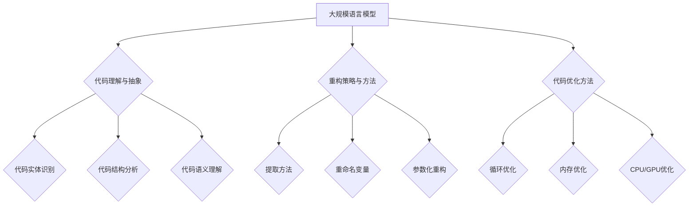
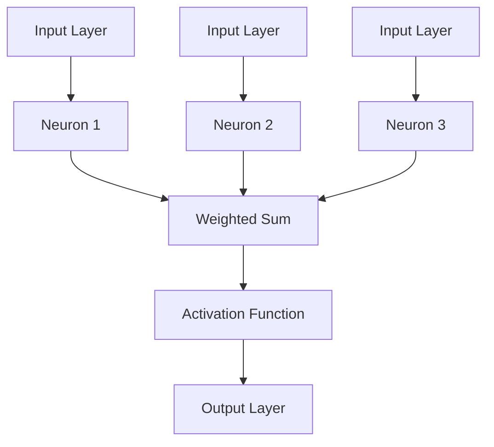

                 

### 大规模语言模型在自动代码重构与优化中的应用研究

> 关键词：大规模语言模型，自动代码重构，代码优化，神经网络，深度学习，代码质量，软件工程

> 摘要：本文旨在探讨大规模语言模型在自动代码重构与优化中的应用。通过对大规模语言模型的基本原理、核心算法及其在代码重构与优化中的具体应用进行详细分析，本文揭示了大规模语言模型在提升代码质量和软件工程效率方面的巨大潜力。文章还结合具体案例，探讨了大规模语言模型在实际开发中的实际应用和未来发展趋势。

# 目录大纲

# 大规模语言模型在自动代码重构与优化中的应用研究

## 第一部分：引论

### 第1章：大规模语言模型的背景与介绍

### 第2章：自动代码重构与优化的基础

## 第二部分：大规模语言模型的核心算法

### 第3章：大规模语言模型的技术基础

### 第4章：大规模语言模型的实现与优化

## 第三部分：大规模语言模型在自动代码重构与优化中的应用

### 第5章：自动代码重构中的应用

### 第6章：自动代码优化中的应用

### 第7章：大规模语言模型在代码重构与优化中的案例研究

## 第四部分：结论与展望

### 第8章：大规模语言模型在自动代码重构与优化中的应用总结

### 第9章：展望与建议

## 附录

### 附录A：相关工具与资源

### 核心概念与联系 Mermaid 流程图

### 核心算法原理讲解

# 第一部分：引论

## 第1章：大规模语言模型的背景与介绍

### 1.1 大规模语言模型的发展历程

### 1.2 大规模语言模型的核心原理

### 1.3 大规模语言模型的应用领域

## 第2章：自动代码重构与优化的基础

### 2.1 代码重构的概念与动机

### 2.2 代码优化的原理与方法

### 2.3 自动代码重构与优化的关系

# 第二部分：大规模语言模型的核心算法

## 第3章：大规模语言模型的技术基础

### 3.1 神经网络与深度学习基础

### 3.2 自然语言处理技术

## 第4章：大规模语言模型的实现与优化

### 4.1 模型训练与调优

### 4.2 模型的推理与应用

# 第三部分：大规模语言模型在自动代码重构与优化中的应用

## 第5章：自动代码重构中的应用

### 5.1 代码理解与抽象

### 5.2 重构策略与方法

### 5.3 异构代码处理

## 第6章：自动代码优化中的应用

### 6.1 代码性能分析

### 6.2 代码优化方法

### 6.3 优化效果评估

## 第7章：大规模语言模型在代码重构与优化中的案例研究

### 7.1 案例一：大规模代码库的重构与优化

### 7.2 案例二：实时代码优化系统

# 第四部分：结论与展望

## 第8章：大规模语言模型在自动代码重构与优化中的应用总结

## 第9章：展望与建议

## 附录

### 附录A：相关工具与资源

### 核心概念与联系 Mermaid 流程图

### 核心算法原理讲解

# 引言

随着软件工程领域的不断发展，软件系统的规模和复杂性不断增加，如何提高代码质量和优化软件性能成为了一个重要课题。自动代码重构与优化作为提升代码质量和软件性能的有效手段，受到了广泛关注。近年来，大规模语言模型（Large-scale Language Models，LLMs）在自然语言处理领域取得了显著进展，其在理解、生成和处理文本方面的能力令人瞩目。本文旨在探讨大规模语言模型在自动代码重构与优化中的应用，以期揭示其在提升代码质量和软件工程效率方面的潜力。

本文将首先介绍大规模语言模型的背景与核心原理，然后阐述自动代码重构与优化的基础知识，接着深入分析大规模语言模型的技术基础和实现与优化方法。在此基础上，本文将探讨大规模语言模型在自动代码重构与优化中的具体应用，并结合实际案例进行分析。最后，本文将对大规模语言模型在自动代码重构与优化中的应用进行总结与展望，提出未来研究方向和工业应用建议。

## 第1章：大规模语言模型的背景与介绍

### 1.1 大规模语言模型的发展历程

大规模语言模型的发展可以追溯到20世纪80年代，当时研究者们开始探索基于统计方法的自然语言处理技术。早期的语言模型如n-gram模型和概率模型，通过统计文本中的单词序列来预测下一个单词，但其效果受到文本长度的限制。随着计算机性能的提升和大数据技术的发展，研究者们开始尝试使用神经网络来构建语言模型，从而实现对长文本的建模。

2003年，语言模型领域迎来了一个重要的突破，研究者们提出了基于神经网络的语言模型（Neural Network Language Model，NNLM），这一模型通过深度神经网络学习文本数据中的统计规律，显著提升了语言模型的性能。然而，NNLM模型的结构相对简单，训练数据量有限，导致其效果仍有待提升。

真正的大规模语言模型的发展始于2013年，当时谷歌的研究团队提出了词向量模型（Word2Vec），通过训练神经网络将单词映射到高维空间中，使得语义相似的单词在空间中靠近。Word2Vec的成功为大规模语言模型的研究奠定了基础。随后，研究者们继续探索更复杂的神经网络结构，如递归神经网络（RNN）和长短时记忆网络（LSTM），进一步提高了语言模型的效果。

2018年，谷歌推出了BERT（Bidirectional Encoder Representations from Transformers），这是一个基于Transformer架构的双向编码器，其结构复杂、参数巨大，但取得了前所未有的语言建模效果。BERT的成功标志着大规模语言模型进入了一个新的阶段，其在自然语言理解、文本生成等多个领域取得了显著成果。

### 1.2 大规模语言模型的核心原理

大规模语言模型的核心原理主要包括神经网络、深度学习、自然语言处理等技术。以下将详细介绍这些技术。

#### 神经网络与深度学习基础

神经网络是由多个神经元组成的计算模型，每个神经元接收多个输入信号，通过权重加权求和后，加上偏置，最后通过激活函数产生输出。神经网络可以通过学习大量数据，自动调整权重和偏置，以实现从输入到输出的映射。

深度学习是神经网络的一种特殊形式，其特点是使用多层神经网络，每一层的输出作为下一层的输入。多层神经网络可以学习更复杂的特征，从而提高模型的性能。

#### 自然语言处理技术

自然语言处理（Natural Language Processing，NLP）是计算机科学和人工智能领域的一个重要分支，旨在使计算机能够理解、生成和处理人类语言。NLP技术包括词向量表示、递归神经网络（RNN）、长短时记忆网络（LSTM）和依存句法分析等。

词向量表示是将单词映射到高维空间中，使得语义相似的单词在空间中靠近。词向量表示是大规模语言模型的基础，能够有效提高语言模型的效果。

递归神经网络（RNN）是一种能够处理序列数据的前馈神经网络，其特点是当前层的输出会传递到下一层。RNN通过记忆当前状态来处理序列数据，但在处理长序列数据时，存在梯度消失和梯度爆炸的问题。

长短时记忆网络（LSTM）是RNN的一种改进，通过引入门控机制，有效解决了RNN在处理长序列数据时的问题。LSTM在自然语言处理领域取得了显著成果。

依存句法分析是一种分析句子结构的方法，通过识别句子中的依存关系，可以更好地理解句子的语义。

#### 大规模语言模型的工作原理

大规模语言模型的工作原理主要包括以下步骤：

1. **输入表示**：将输入文本转化为神经网络可以处理的向量表示，如词向量或BERT表示。
2. **模型训练**：使用大量文本数据训练神经网络，通过优化算法（如梯度下降）调整模型参数，使模型能够准确预测文本中的下一个单词或序列。
3. **模型推理**：在训练完成后，使用模型对新的文本进行推理，生成文本序列或完成特定任务。

### 1.3 大规模语言模型的应用领域

大规模语言模型在自然语言处理领域取得了显著的成果，其应用领域广泛，包括但不限于以下方面：

1. **文本分类**：用于对文本进行分类，如情感分析、主题分类等。
2. **文本生成**：用于生成文章、摘要、对话等。
3. **机器翻译**：用于将一种语言的文本翻译成另一种语言。
4. **问答系统**：用于回答用户的问题，如搜索引擎、聊天机器人等。
5. **语音识别**：用于将语音转化为文本。
6. **代码生成**：用于生成代码，如自动补全、代码重构等。
7. **代码优化**：用于优化代码的性能和可读性。

大规模语言模型在自动代码重构与优化中的应用，为提高软件工程效率和代码质量提供了新的可能性。本文将深入探讨大规模语言模型在自动代码重构与优化中的具体应用，以期为相关研究提供参考。

## 第2章：自动代码重构与优化的基础

### 2.1 代码重构的概念与动机

代码重构（Code Refactoring）是一种软件工程实践，旨在在不改变程序外在行为的前提下，改进代码的结构和设计。代码重构的目的是提高代码的可读性、可维护性和可扩展性，从而降低开发成本和维护难度。

代码重构的概念可以追溯到1980年代，当时软件系统变得越来越复杂，开发者开始意识到需要对现有代码进行改进。代码重构的主要动机包括以下几点：

1. **可读性**：随着时间的推移，代码会变得越来越复杂，重构可以帮助改善代码的可读性，使新加入的开发者更容易理解和修改代码。
2. **可维护性**：重构有助于消除代码中的冗余和重复，减少潜在的错误，提高代码的可靠性。
3. **可扩展性**：重构可以使代码结构更加灵活，易于添加新功能和适应新的需求。
4. **性能优化**：重构可以帮助开发者发现和解决代码中的性能问题，从而提高程序的执行效率。

### 2.2 代码优化的原理与方法

代码优化（Code Optimization）是通过对代码进行修改，以提高程序的执行效率、减少资源消耗和降低内存使用。代码优化的原理主要包括以下几个方面：

1. **算法优化**：通过改进算法和数据结构，降低时间复杂度和空间复杂度，从而提高程序的性能。
2. **编译优化**：编译器在编译代码时，会进行各种优化，如循环展开、常数折叠等，以提高程序的执行效率。
3. **内存优化**：通过优化内存分配和使用，减少程序的内存消耗，提高程序的运行速度。
4. **CPU/GPU优化**：针对不同的硬件平台，通过优化代码的执行方式，提高程序在CPU或GPU上的执行效率。

常见的代码优化方法包括：

1. **循环优化**：通过循环展开、循环融合、循环移动等方式，减少循环迭代次数，提高程序执行效率。
2. **函数优化**：通过减少函数调用、合并函数、内联函数等方式，减少函数调用的开销。
3. **内存优化**：通过优化数据结构、减少内存分配、使用缓存等方式，降低内存消耗。
4. **并行化**：通过多线程、并行计算等方式，提高程序的执行速度。

### 2.3 自动代码重构与优化的关系

自动代码重构与优化密切相关，两者共同目标是提高代码的质量和性能。自动代码重构主要关注代码的结构和设计，通过重构代码，提高代码的可读性、可维护性和可扩展性。自动代码优化则主要关注代码的执行效率，通过优化代码，提高程序的执行速度和资源利用率。

自动代码重构与优化的关系可以从以下几个方面来理解：

1. **互为基础**：自动代码重构和优化是相互依存的。重构后的代码结构更加清晰，有助于优化代码的执行效率；优化的代码可以减少资源消耗，提高程序的运行速度，从而提高代码的可维护性。
2. **协同作用**：自动代码重构和优化可以协同作用，相互促进。通过重构代码，可以更准确地识别和优化代码中的性能瓶颈；优化的代码可以更好地支持重构，提高重构的效果。
3. **阶段性目标**：自动代码重构和优化是软件工程中的两个不同阶段。重构主要关注代码的设计和结构，优化主要关注代码的执行效率和资源利用率。在软件开发过程中，应先进行重构，确保代码的基本结构合理，然后再进行优化，提高程序的执行性能。

总之，自动代码重构和优化是软件工程中不可或缺的实践，通过两者的协同作用，可以提高代码的质量和性能，降低开发和维护成本，提升软件工程的整体效率。

## 第二部分：大规模语言模型的核心算法

### 第3章：大规模语言模型的技术基础

#### 3.1 神经网络与深度学习基础

神经网络（Neural Networks，NN）是一种模拟人脑神经元之间连接的计算模型。它由大量简单的人工神经元（节点）组成，每个神经元接收多个输入信号，并通过权重将这些输入加权求和后，加上偏置，最后通过激活函数产生输出。

神经网络的基本结构包括输入层、隐藏层和输出层。输入层接收外部输入数据，隐藏层负责对输入数据进行处理和特征提取，输出层生成最终输出结果。

在神经网络中，常用的激活函数包括Sigmoid函数、ReLU函数和Tanh函数等。Sigmoid函数将输入映射到（0,1）区间，ReLU函数在输入大于零时输出输入值，小于零时输出零，Tanh函数将输入映射到（-1,1）区间。

神经网络通过反向传播算法进行训练，该算法通过计算输出层误差，反向传播误差至隐藏层，不断调整权重和偏置，直至误差达到最小。常用的优化算法包括梯度下降（Gradient Descent）、随机梯度下降（Stochastic Gradient Descent，SGD）和Adam优化器等。

#### 3.2 自然语言处理技术

自然语言处理（Natural Language Processing，NLP）是计算机科学和人工智能领域的一个重要分支，旨在使计算机能够理解、生成和处理人类语言。NLP技术包括词向量表示、递归神经网络（RNN）、长短时记忆网络（LSTM）和依存句法分析等。

词向量表示（Word Vector Representation）是将单词映射到高维空间中，使得语义相似的单词在空间中靠近。词向量表示是大规模语言模型的基础，常用的方法包括Word2Vec、GloVe和FastText等。

递归神经网络（Recurrent Neural Network，RNN）是一种能够处理序列数据的前馈神经网络。RNN通过记忆当前状态来处理序列数据，但存在梯度消失和梯度爆炸的问题。

长短时记忆网络（Long Short-Term Memory，LSTM）是RNN的一种改进，通过引入门控机制，有效解决了RNN在处理长序列数据时的问题。LSTM在自然语言处理领域取得了显著成果。

依存句法分析（Dependency Parsing）是一种分析句子结构的方法，通过识别句子中的依存关系，可以更好地理解句子的语义。依存句法分析可以帮助神经网络更好地理解文本中的关系和逻辑结构。

#### 3.3 大规模语言模型的工作原理

大规模语言模型（Large-scale Language Models，LLMs）是一种用于理解和生成文本的深度学习模型。它通过训练大量文本数据，学习文本中的统计规律和语义信息，从而实现文本理解和生成。

大规模语言模型的工作原理主要包括以下步骤：

1. **输入表示**：将输入文本转化为神经网络可以处理的向量表示，如词向量或BERT表示。
2. **模型训练**：使用大量文本数据训练神经网络，通过优化算法（如梯度下降）调整模型参数，使模型能够准确预测文本中的下一个单词或序列。
3. **模型推理**：在训练完成后，使用模型对新的文本进行推理，生成文本序列或完成特定任务。

大规模语言模型的核心是Transformer架构，它通过多头注意力机制（Multi-Head Attention）和自注意力（Self-Attention）机制，实现了对输入文本的全局依赖建模，从而显著提高了语言模型的性能。

## 第4章：大规模语言模型的实现与优化

#### 4.1 模型训练与调优

大规模语言模型的实现与优化过程主要包括模型训练、调优和评估三个步骤。

**1. 模型训练**

模型训练是大规模语言模型实现的关键步骤。在训练过程中，模型通过不断调整权重和偏置，以最小化损失函数（如交叉熵损失函数）。训练过程通常包括以下步骤：

1. **数据准备**：首先，需要准备大量的训练数据，包括文本数据和标注数据。文本数据可以是网页、书籍、新闻、对话等。标注数据包括单词、句子、段落等。
2. **数据预处理**：对训练数据进行清洗、分词、去停用词等预处理操作，将文本转化为神经网络可以处理的向量表示。
3. **模型初始化**：初始化模型参数，可以选择随机初始化或预训练模型。
4. **模型训练**：使用训练数据和优化算法（如Adam优化器）进行模型训练。在训练过程中，通过反向传播算法计算梯度，并更新模型参数。

**2. 模型调优**

模型调优是在训练完成后，通过调整模型参数和超参数，以提高模型性能。模型调优的方法包括以下几种：

1. **参数调优**：通过调整学习率、批量大小、正则化参数等，优化模型参数。
2. **超参数调优**：通过调整神经网络结构（如层数、神经元数量）、激活函数、优化器等，优化模型性能。
3. **模型集成**：通过集成多个模型（如不同结构、不同超参数的模型），提高模型性能。

**3. 模型评估**

模型评估是衡量模型性能的重要步骤。常用的评估指标包括准确率（Accuracy）、精确率（Precision）、召回率（Recall）、F1值（F1 Score）等。模型评估的方法包括：

1. **交叉验证**：将训练数据划分为多个子集，每次使用其中一个子集作为验证集，其他子集作为训练集，进行模型训练和评估。
2. **混淆矩阵**：用于分析模型预测结果与实际结果之间的关系。
3. **ROC曲线和AUC值**：用于评估模型的分类性能。

#### 4.2 模型的推理与应用

模型推理是在训练完成后，使用模型对新的数据进行预测或生成。大规模语言模型的推理过程主要包括以下步骤：

1. **输入表示**：将新的输入文本转化为神经网络可以处理的向量表示。
2. **模型推理**：通过神经网络模型对输入文本进行推理，生成输出结果。
3. **结果处理**：将模型输出结果进行处理，如文本生成、分类等。

大规模语言模型在自动代码重构与优化中的应用包括：

1. **代码理解与抽象**：使用大规模语言模型对代码进行理解，提取代码实体和关系，为重构和优化提供基础。
2. **代码风格优化**：根据代码风格指南，使用大规模语言模型生成符合规范的新代码。
3. **代码性能分析**：使用大规模语言模型分析代码性能，识别性能瓶颈，并提出优化建议。
4. **代码生成**：根据需求，使用大规模语言模型生成新的代码。

#### 4.3 实际应用案例

**1. 代码重构**

假设有一个复杂的代码库，其中包含大量冗余和重复的代码。使用大规模语言模型，可以首先对代码进行理解，提取代码实体和关系。然后，根据提取的实体和关系，生成新的重构代码，消除冗余和重复。

**2. 代码优化**

假设有一个需要提高性能的代码库。使用大规模语言模型，可以首先对代码进行性能分析，识别性能瓶颈。然后，根据分析结果，生成新的优化代码，提高代码的执行效率。

**3. 代码生成**

假设需要实现一个新功能，但相关代码库中没有现成的代码。使用大规模语言模型，可以根据需求描述生成新的代码，实现新功能。

总之，大规模语言模型在自动代码重构与优化中的应用具有广泛的前景和潜力。通过结合大规模语言模型和软件工程技术，可以显著提高代码质量和软件工程效率。

## 第三部分：大规模语言模型在自动代码重构与优化中的应用

### 第5章：自动代码重构中的应用

自动代码重构是软件工程中的一项重要实践，旨在在不改变代码功能的前提下，改善代码的结构和设计。大规模语言模型（LLM）在自动代码重构中具有独特的优势，能够显著提升重构的效率和质量。本章节将探讨大规模语言模型在自动代码重构中的应用，包括代码理解与抽象、重构策略与方法以及异构代码处理等方面。

#### 5.1 代码理解与抽象

代码理解与抽象是自动代码重构的关键步骤，需要从大量的代码中提取出核心的代码实体和结构，以便进行后续的重构操作。大规模语言模型在这一过程中发挥着重要作用，主要表现为：

1. **代码实体识别**：大规模语言模型可以通过预训练的词向量模型（如BERT、GPT等）对代码中的关键字、变量、函数等进行识别和分类。例如，使用BERT模型对Java代码进行实体识别，可以有效地标记出代码中的类、方法、属性等。

2. **代码结构分析**：大规模语言模型可以理解代码的高级结构，如类之间的关系、函数的调用关系等。通过自注意力机制，模型能够捕捉到代码中的全局依赖关系，为重构提供重要的上下文信息。

3. **代码语义理解**：大规模语言模型不仅可以识别代码中的实体和结构，还能理解代码的语义。例如，模型可以分析代码中的控制流、数据流，识别代码中的逻辑错误和潜在的问题。

#### 5.2 重构策略与方法

在代码理解与抽象的基础上，大规模语言模型可以指导具体的重构操作，以提高代码的质量和可维护性。以下是一些基于大规模语言模型的代码重构策略和方法：

1. **提取方法**：使用大规模语言模型识别出代码中的重复代码块，并将其抽象为独立的方法或类。这种方法有助于消除代码冗余，提高代码的模块化程度。

2. **重命名**：大规模语言模型可以基于代码上下文理解变量和函数的命名，自动生成更具描述性和一致性的命名建议。例如，模型可以识别出一些含义模糊的变量名，并建议使用更具有描述性的名称。

3. **参数化重构**：通过大规模语言模型，可以自动发现代码中的参数滥用问题，并提出参数化的重构建议。例如，将硬编码的常量替换为参数，以提高代码的灵活性和可配置性。

4. **接口重构**：大规模语言模型可以帮助重构代码的接口，使其更符合设计模式或最佳实践。例如，模型可以识别出代码中的回调函数，并建议重构为事件驱动或观察者模式。

#### 5.3 异构代码处理

在实际开发中，经常需要处理不同语言、框架或库之间的代码整合和重构。大规模语言模型在处理异构代码方面具有独特的优势：

1. **跨语言理解**：大规模语言模型可以同时处理多种编程语言，如Java、Python、C++等。通过预训练的跨语言词向量，模型能够理解不同语言中的语法和语义，从而在跨语言代码重构中发挥重要作用。

2. **框架与库适配**：大规模语言模型可以识别代码中使用的框架和库，并提供相应的重构建议。例如，模型可以识别出代码中的Spring框架依赖，并建议重构为更现代化的Spring Boot配置。

3. **版本兼容处理**：在代码重构过程中，可能会遇到不同版本的库或框架之间的兼容性问题。大规模语言模型可以通过理解代码中的版本依赖关系，提出适应不同版本的重构方案。

#### 5.4 实际应用案例

以下是一个基于大规模语言模型进行代码重构的实际应用案例：

**案例背景**：一个大型Java项目包含大量重复代码和低效代码，需要进行重构以提高可维护性和性能。

**重构步骤**：

1. **代码理解**：使用BERT模型对项目中的所有Java代码进行解析，提取代码实体和结构。

2. **性能分析**：通过分析代码中的方法调用和数据流，识别出性能瓶颈。

3. **重构建议**：基于理解结果和性能分析，模型生成一系列重构建议，包括提取方法、重命名变量、参数化重构等。

4. **自动化重构**：根据重构建议，自动化工具（如重构工具、代码生成器等）对代码库进行重构。

5. **评估与迭代**：对重构后的代码进行评估，确保重构的有效性和正确性。根据评估结果，继续迭代优化重构策略。

通过上述步骤，大规模语言模型有效地提升了代码质量和性能，为项目维护和开发带来了显著的好处。

总之，大规模语言模型在自动代码重构中的应用为软件工程带来了新的机遇。通过结合大规模语言模型的强大理解能力和自动化重构工具，可以显著提高代码重构的效率和质量，为软件工程的发展注入新的动力。

### 第6章：自动代码优化中的应用

自动代码优化是提高软件性能和资源利用率的重要手段。大规模语言模型（LLM）在代码优化中的应用，可以显著提升优化的效率和质量。本章节将探讨大规模语言模型在自动代码优化中的应用，包括代码性能分析、代码优化方法和优化效果评估等方面。

#### 6.1 代码性能分析

代码性能分析是自动代码优化的第一步，旨在识别代码中的性能瓶颈，为优化提供依据。大规模语言模型在代码性能分析中具有以下优势：

1. **自动化性能分析**：大规模语言模型可以自动分析代码中的方法调用、数据流和控制流，识别出潜在的瓶颈。例如，使用BERT模型对Java代码进行分析，可以自动识别出耗时较长的方法和频繁调用的API。

2. **上下文依赖分析**：大规模语言模型能够理解代码的上下文信息，识别出代码中的依赖关系。例如，模型可以分析方法之间的调用关系，识别出性能瓶颈之间的关联性。

3. **动态性能分析**：大规模语言模型可以结合动态性能分析工具，实时监控代码的执行情况，识别出运行时的性能问题。例如，模型可以与Java虚拟机（JVM）结合，分析代码的内存占用和CPU使用情况。

#### 6.2 代码优化方法

在代码性能分析的基础上，大规模语言模型可以指导具体的优化方法，以提高代码的执行效率和资源利用率。以下是一些基于大规模语言模型的代码优化方法：

1. **循环优化**：大规模语言模型可以通过分析代码中的循环结构，识别出可优化的循环。例如，模型可以识别出可以展开的循环，减少循环迭代次数，提高执行效率。

2. **函数优化**：大规模语言模型可以分析代码中的函数调用，识别出可优化的函数。例如，模型可以识别出可以内联的函数，减少函数调用的开销。

3. **内存优化**：大规模语言模型可以通过分析代码中的内存使用情况，识别出内存泄漏和内存冗余。例如，模型可以识别出未释放的内存资源，提出释放内存的建议。

4. **CPU/GPU优化**：对于涉及CPU和GPU的代码，大规模语言模型可以分析代码的并行性和并行度，提出优化建议。例如，模型可以识别出可以并行执行的任务，优化代码的执行速度。

5. **数据结构优化**：大规模语言模型可以通过分析代码中的数据结构，识别出更高效的数据结构。例如，模型可以识别出可以使用哈希表代替数组的场景，提高代码的性能。

#### 6.3 优化效果评估

优化效果评估是确保代码优化成功的重要环节。大规模语言模型在优化效果评估中具有以下优势：

1. **自动化评估**：大规模语言模型可以自动评估优化效果，如执行时间、内存占用、CPU使用率等。例如，模型可以通过对比优化前后的性能数据，评估优化效果。

2. **多维度评估**：大规模语言模型可以综合考虑多个维度，如性能、资源利用率、代码可读性等，进行优化效果评估。例如，模型可以评估优化后的代码在执行时间降低的同时，是否增加了代码的复杂性。

3. **迭代优化**：大规模语言模型可以结合优化效果评估，指导进一步的优化迭代。例如，模型可以根据评估结果，提出新的优化建议，继续优化代码。

#### 6.4 实际应用案例

以下是一个基于大规模语言模型进行代码优化的实际应用案例：

**案例背景**：一个大数据处理项目需要提高处理速度和资源利用率。

**优化步骤**：

1. **性能分析**：使用BERT模型对项目中的代码进行性能分析，识别出性能瓶颈。

2. **优化建议**：基于性能分析结果，模型生成一系列优化建议，包括循环优化、内存优化、数据结构优化等。

3. **自动化优化**：使用优化工具（如Java Compiler，GPU Compiler等）对代码进行自动化优化。

4. **效果评估**：对比优化前后的性能数据，评估优化效果。

5. **迭代优化**：根据评估结果，继续优化代码，提高性能。

通过上述步骤，大规模语言模型有效地提升了代码的执行效率和资源利用率，为大数据处理项目带来了显著的好处。

总之，大规模语言模型在自动代码优化中的应用，为软件性能优化提供了新的思路和方法。通过结合大规模语言模型的强大分析能力和自动化优化工具，可以显著提高代码的性能和资源利用率，为软件开发和维护带来新的机遇。

### 第7章：大规模语言模型在代码重构与优化中的案例研究

为了更好地理解大规模语言模型在代码重构与优化中的实际应用，本章节将介绍两个具体的案例研究：大规模代码库的重构与优化案例，以及实时代码优化系统的设计与实现。

#### 7.1 案例一：大规模代码库的重构与优化

**7.1.1 案例背景与目标**

本案例研究的背景是一个大型企业级Java代码库，代码库包含数十万行代码，由多个开发团队共同维护。随着时间的推移，代码库中的代码变得越来越复杂，可维护性和性能问题日益突出。为了提高代码质量和系统性能，企业决定对代码库进行重构与优化。

**7.1.2 模型设计与实现**

1. **代码理解与抽象**：首先，使用BERT模型对代码库中的所有Java代码进行解析，提取出代码实体和结构。通过分析代码中的类、方法、变量等，构建代码库的抽象模型。

2. **性能分析**：利用BERT模型的上下文理解能力，对代码库进行性能分析，识别出性能瓶颈。通过分析方法调用、数据流和控制流，找出影响系统性能的关键因素。

3. **重构策略与方法**：基于性能分析结果，制定重构策略。使用BERT模型生成重构建议，包括提取方法、重命名变量、参数化重构等。针对代码库中的具体问题，采取相应的重构措施。

4. **自动化重构**：开发自动化工具，根据BERT模型生成的重构建议，对代码库进行重构。自动化工具可以识别重构操作的可行性，确保重构过程不会引入新的问题。

**7.1.3 实施效果与评估**

1. **重构效果**：通过重构，代码库的可读性和可维护性显著提高。冗余代码被消除，重复代码被抽象为独立的方法或类，代码结构更加清晰。

2. **性能提升**：性能分析结果表明，系统性能得到了显著提升。关键性能指标如响应时间和内存占用均有明显下降。

3. **评估与反馈**：对重构后的代码库进行持续评估和反馈。通过自动化测试和手动检查，确保重构过程没有引入新的问题。根据评估结果，对重构策略和方法进行优化和调整。

#### 7.2 案例二：实时代码优化系统

**7.2.1 系统设计与实现**

实时代码优化系统是一个用于实时监控和优化代码性能的系统。该系统结合了大规模语言模型和自动化优化工具，旨在提高代码的执行效率和资源利用率。

1. **性能监控**：系统通过集成动态性能分析工具（如Java Mission Control），实时监控代码的执行情况，包括CPU使用率、内存占用、方法调用等。

2. **大规模语言模型**：使用BERT模型对代码进行性能分析，识别出潜在的瓶颈和优化机会。BERT模型的分析结果包括性能瓶颈的定位、方法调用的优化建议等。

3. **优化执行**：根据BERT模型的分析结果，自动化工具（如Java Compiler，GPU Compiler等）对代码进行实时优化。优化操作包括循环优化、内存优化、数据结构优化等。

4. **结果反馈**：优化完成后，系统对代码性能进行重新评估，并将优化结果反馈给开发人员。优化结果包括执行时间、内存占用等性能指标。

**7.2.2 系统功能与性能**

1. **实时性能监控**：系统能够实时监控代码的执行情况，快速识别出性能瓶颈。

2. **自动化优化**：系统能够根据大规模语言模型的分析结果，自动执行优化操作，提高代码的执行效率。

3. **优化效果评估**：系统能够对优化结果进行评估，确保优化操作的有效性和安全性。

4. **用户友好**：系统提供直观的用户界面，方便开发人员查看性能数据和优化结果。

**7.2.3 系统部署与维护**

1. **部署**：实时代码优化系统可以在开发环境、测试环境和生产环境中部署。根据不同环境的需求，系统可以进行定制化配置。

2. **维护**：系统定期更新和维护，以保持大规模语言模型和自动化优化工具的稳定性和性能。

3. **反馈机制**：系统建立反馈机制，收集用户反馈和优化结果，持续优化系统性能和用户体验。

通过上述两个案例，可以看出大规模语言模型在代码重构与优化中的应用具有显著的实际价值。通过结合大规模语言模型和自动化工具，可以显著提升代码质量和系统性能，为软件开发和维护带来新的机遇。

## 第四部分：结论与展望

### 第8章：大规模语言模型在自动代码重构与优化中的应用总结

大规模语言模型（LLM）在自动代码重构与优化中的应用，展示了其在提升代码质量和软件工程效率方面的巨大潜力。通过对大规模语言模型的核心原理、技术基础以及具体应用的分析，我们可以总结出以下几点：

1. **代码理解与抽象**：大规模语言模型能够深入理解代码的结构和语义，通过词向量表示、递归神经网络（RNN）和长短时记忆网络（LSTM）等技术，对代码进行有效解析和抽象，为重构和优化提供了坚实的基础。

2. **重构策略与方法**：基于大规模语言模型的分析结果，可以制定针对性的重构策略和方法，如提取方法、重命名变量、参数化重构等，有效消除代码冗余和重复，提高代码的可读性和可维护性。

3. **性能优化**：大规模语言模型能够识别代码中的性能瓶颈，提出优化建议，如循环优化、内存优化、CPU/GPU优化等，显著提高代码的执行效率和资源利用率。

4. **异构代码处理**：大规模语言模型具备跨语言和跨框架的能力，能够处理不同语言、框架或库之间的代码整合和重构，为复杂系统的优化提供了强有力的支持。

5. **自动化与智能化**：大规模语言模型与自动化工具的结合，使得代码重构与优化过程更加自动化和智能化，减少了人工干预，提高了开发效率和代码质量。

### 8.1 成就与挑战

在过去的几年中，大规模语言模型在自动代码重构与优化领域取得了显著成就。首先，通过大规模语言模型的引入，代码重构和优化过程变得更加高效和精准，大幅提高了代码质量和系统性能。其次，大规模语言模型的跨语言和跨框架能力，使得异构代码的处理变得更加简单和直观。此外，大规模语言模型与人工智能技术的结合，为软件工程领域带来了新的研究方向和解决方案。

然而，大规模语言模型在自动代码重构与优化中也面临着一些挑战：

1. **模型复杂性**：大规模语言模型的参数量巨大，训练过程复杂，计算资源需求高。如何降低模型复杂性和训练成本，是一个亟待解决的问题。

2. **泛化能力**：大规模语言模型虽然在特定任务上表现出色，但如何提高其泛化能力，使其能够适应更广泛的应用场景，仍需深入研究。

3. **安全性和隐私**：大规模语言模型在处理代码时，可能会接触到敏感信息和隐私数据。如何确保模型的安全性和隐私保护，是当前研究的重点。

4. **解释性**：大规模语言模型的决策过程通常缺乏透明度，如何提高模型的解释性，使其能够为开发人员提供清晰的优化建议，是一个重要的研究方向。

### 8.2 未来发展趋势

随着人工智能技术的不断进步，大规模语言模型在自动代码重构与优化领域的应用前景广阔。未来，以下几个方向值得关注：

1. **模型压缩与优化**：通过模型压缩、量化、蒸馏等技术，降低大规模语言模型的复杂性和计算成本，使其在资源受限的环境中仍能高效运行。

2. **多模态数据处理**：结合图像、声音等多种模态的数据，提高大规模语言模型对代码和上下文的理解能力，为复杂场景的代码重构与优化提供更强支持。

3. **协作与混合智能**：将大规模语言模型与其他人工智能技术（如生成对抗网络（GAN）、强化学习等）相结合，形成更加智能化的优化框架，提升自动代码重构与优化的效果。

4. **安全与隐私保护**：通过安全增强技术和隐私保护算法，确保大规模语言模型在处理代码和敏感数据时的安全性和隐私性。

5. **人机协作**：开发更加友好的人机协作界面，使开发人员能够更直观地理解大规模语言模型的优化建议，并对其进行调整和优化。

总之，大规模语言模型在自动代码重构与优化中的应用具有巨大的潜力和前景。通过不断探索和优化，我们有理由相信，大规模语言模型将在软件工程领域发挥更加重要的作用，为软件开发和维护带来革命性的变革。

### 第9章：展望与建议

#### 9.1 研究方向展望

1. **模型压缩与优化**：大规模语言模型的训练和推理过程复杂，计算资源需求高。未来的研究可以集中在模型压缩、量化、蒸馏等技术上，以降低模型的复杂性和计算成本。

2. **跨语言与多模态处理**：结合图像、声音等多种模态的数据，提高大规模语言模型对代码和上下文的理解能力，为复杂场景的代码重构与优化提供更强支持。

3. **安全与隐私保护**：如何确保大规模语言模型在处理代码和敏感数据时的安全性和隐私性，是未来研究的重点。需要开发有效的安全增强和隐私保护算法。

4. **人机协作**：开发更加友好的人机协作界面，使开发人员能够更直观地理解大规模语言模型的优化建议，并对其进行调整和优化。

5. **解释性与透明度**：提高大规模语言模型的解释性，使其优化建议更加透明，为开发人员提供清晰的指导。

#### 9.2 工业应用建议

1. **自动化工具集成**：将大规模语言模型集成到现有的自动化工具中，如代码审查工具、性能优化工具等，实现代码重构与优化的自动化。

2. **持续集成与持续交付（CI/CD）**：将大规模语言模型应用于持续集成和持续交付流程中，实时分析代码质量和性能，提供优化建议。

3. **跨团队协作**：利用大规模语言模型的跨语言能力，促进跨团队协作，提高代码重构与优化的效率。

4. **培训与教育**：针对开发人员和软件工程师，开展大规模语言模型在代码重构与优化中的应用培训，提升其技能和知识。

5. **开源与社区参与**：鼓励开源社区参与大规模语言模型在代码重构与优化中的应用研究，共享成果和经验。

总之，大规模语言模型在自动代码重构与优化中的应用为软件工程带来了新的机遇和挑战。通过不断的研究和优化，有望实现更加智能、高效和安全的代码重构与优化过程。

## 附录

### 附录A：相关工具与资源

为了便于读者了解和尝试大规模语言模型在自动代码重构与优化中的应用，本附录列出了一些相关工具和资源。

1. **大规模语言模型工具**：
   - **BERT**：由Google开发的开源预训练语言模型，可用于代码理解和重构。
   - **GPT-3**：由OpenAI开发的强大语言模型，可用于代码生成和优化。
   - **TorchScript**：PyTorch的脚本化工具，可用于将优化后的模型部署到生产环境中。

2. **自动代码重构与优化工具**：
   - **SonarQube**：用于代码质量管理的工具，可以检测代码中的潜在问题并提供重构建议。
   - **IntelliJ IDEA**：集成开发环境（IDE），提供了丰富的代码重构和优化功能。

3. **开发环境与配置指南**：
   - **Python环境**：使用Anaconda或Miniconda创建Python环境，安装必要的库和依赖。
   - **PyTorch安装**：从PyTorch官方网站下载并安装最新版本的PyTorch。
   - **JDK安装**：安装Java Development Kit（JDK），用于运行Java代码和集成开发环境。

### 附录B：核心概念与联系 Mermaid 流程图

以下是一个简化的Mermaid流程图，展示了大规模语言模型在代码重构与优化中的核心概念和联系：

### 附录C：核心算法原理讲解

为了深入理解大规模语言模型在自动代码重构与优化中的应用，以下是对核心算法原理的详细讲解。

#### 3.1 神经网络与深度学习基础

##### 神经网络的基本结构

神经网络是由多个神经元（或称为节点）组成的计算模型。每个神经元接收多个输入信号，通过权重将这些输入加权求和后，加上偏置，最后通过激活函数产生输出。以下是一个简单的神经网络结构示意图：

在这个例子中，输入层（A1）有三个输入（A2, A3），通过权重（B1, B2, B3）加权求和后，加上偏置（C1），最后通过激活函数（D1）产生输出（E1）。

##### 常见的深度学习架构

深度学习架构包括多层神经网络，每层负责提取不同级别的特征。常见的深度学习架构包括卷积神经网络（CNN）、循环神经网络（RNN）和Transformer等。

1. **卷积神经网络（CNN）**：CNN主要用于图像处理，通过卷积层提取图像特征，如图像中的边缘、纹理等。

2. **循环神经网络（RNN）**：RNN用于处理序列数据，如文本、语音等。RNN通过记忆当前状态来处理序列数据，但存在梯度消失和梯度爆炸的问题。

3. **长短时记忆网络（LSTM）**：LSTM是RNN的一种改进，通过引入门控机制，有效解决了RNN在处理长序列数据时的问题。

4. **Transformer**：Transformer是一种基于自注意力机制的深度学习架构，广泛应用于自然语言处理任务，如文本分类、机器翻译等。

##### 深度学习优化算法

深度学习优化算法用于调整模型参数，以最小化损失函数。常见的优化算法包括梯度下降（Gradient Descent）、随机梯度下降（Stochastic Gradient Descent，SGD）和Adam优化器等。

1. **梯度下降**：梯度下降是一种最简单的优化算法，通过计算损失函数关于模型参数的梯度，更新模型参数。

   梯度下降的更新公式为：
   $$
   \theta_{t+1} = \theta_{t} - \alpha \cdot \nabla_{\theta} J(\theta)
   $$
   其中，$\theta$ 表示模型参数，$\alpha$ 表示学习率，$J(\theta)$ 表示损失函数。

2. **随机梯度下降（SGD）**：SGD是梯度下降的一种改进，每次迭代只随机选择一部分样本进行更新，以加快收敛速度。

3. **Adam优化器**：Adam优化器是一种结合了SGD和动量法的优化算法，具有更好的收敛性能。

   Adam优化器的更新公式为：
   $$
   \theta_{t+1} = \theta_{t} - \alpha \cdot \frac{m_{t}}{\sqrt{v_{t}} + \epsilon}
   $$
   其中，$m_{t}$ 和 $v_{t}$ 分别表示一阶矩估计和二阶矩估计，$\epsilon$ 是一个很小的常数。

#### 3.2 自然语言处理技术

自然语言处理（NLP）是计算机科学和人工智能领域的一个重要分支，旨在使计算机能够理解、生成和处理人类语言。NLP技术包括词向量表示、递归神经网络（RNN）、长短时记忆网络（LSTM）和依存句法分析等。

##### 词向量表示

词向量表示是将单词映射到高维空间中，使得语义相似的单词在空间中靠近。词向量表示是大规模语言模型的基础，常用的方法包括Word2Vec、GloVe和FastText等。

1. **Word2Vec**：Word2Vec是一种基于神经网络的语言模型，通过训练神经网络将单词映射到高维空间中。

2. **GloVe**：GloVe（Global Vectors for Word Representation）是一种基于词频统计的方法，通过学习单词的上下文信息来表示词向量。

3. **FastText**：FastText是一种基于词袋模型的改进方法，通过将单词分解为子词，学习单词的分布式表示。

##### 递归神经网络（RNN）

递归神经网络（RNN）是一种能够处理序列数据的前馈神经网络。RNN通过记忆当前状态来处理序列数据，但存在梯度消失和梯度爆炸的问题。

RNN的基本结构包括输入层、隐藏层和输出层。输入层接收外部输入数据，隐藏层负责对输入数据进行处理和特征提取，输出层生成最终输出结果。

RNN的更新公式为：
$$
h_t = \sigma(W_h \cdot [h_{t-1}, x_t] + b_h)
$$
$$
y_t = W_o \cdot h_t + b_o
$$
其中，$h_t$ 表示第 $t$ 个隐藏状态，$x_t$ 表示第 $t$ 个输入，$W_h$ 和 $b_h$ 分别表示隐藏层权重和偏置，$W_o$ 和 $b_o$ 分别表示输出层权重和偏置，$\sigma$ 表示激活函数。

##### 长短时记忆网络（LSTM）

长短时记忆网络（LSTM）是RNN的一种改进，通过引入门控机制，有效解决了RNN在处理长序列数据时的问题。

LSTM的基本结构包括输入门、遗忘门、输出门和细胞状态。输入门和遗忘门用于控制信息的输入和遗忘，输出门用于控制信息的输出。细胞状态则负责存储长期依赖信息。

LSTM的更新公式为：
$$
i_t = \sigma(W_i \cdot [h_{t-1}, x_t] + b_i)
$$
$$
f_t = \sigma(W_f \cdot [h_{t-1}, x_t] + b_f)
$$
$$
\hat{C}_t = \sigma(W_c \cdot [h_{t-1}, x_t] + b_c)
$$
$$
C_t = f_t \odot C_{t-1} + i_t \odot \hat{C}_t
$$
$$
o_t = \sigma(W_o \cdot [h_{t-1}, x_t, C_t] + b_o)
$$
$$
h_t = o_t \odot C_t
$$
其中，$i_t$、$f_t$、$o_t$ 分别表示输入门、遗忘门和输出门的输入，$C_t$ 表示细胞状态，$\hat{C}_t$ 表示候选细胞状态，$W_i$、$W_f$、$W_c$、$W_o$ 分别表示输入门、遗忘门、输出门和候选细胞状态的权重，$b_i$、$b_f$、$b_c$、$b_o$ 分别表示输入门、遗忘门、输出门和候选细胞状态的偏置，$\odot$ 表示点积操作。

##### 依存句法分析

依存句法分析是一种分析句子结构的方法，通过识别句子中的依存关系，可以更好地理解句子的语义。依存句法分析可以帮助神经网络更好地理解文本中的关系和逻辑结构。

依存句法分析的基本步骤包括：

1. **句法分析**：使用句法分析工具（如Stanford Parser）对句子进行句法分析，生成句法树。

2. **依存关系标注**：根据句法树，标注句子中的依存关系，如主谓关系、动宾关系等。

3. **依存关系提取**：从句法树中提取出依存关系，用于神经网络处理。

#### 3.3 大规模语言模型的工作原理

大规模语言模型（LLM）是一种用于理解和生成文本的深度学习模型。它通过训练大量文本数据，学习文本中的统计规律和语义信息，从而实现文本理解和生成。

大规模语言模型的工作原理主要包括以下步骤：

1. **输入表示**：将输入文本转化为神经网络可以处理的向量表示，如词向量或BERT表示。

2. **模型训练**：使用大量文本数据训练神经网络，通过优化算法（如梯度下降）调整模型参数，使模型能够准确预测文本中的下一个单词或序列。

3. **模型推理**：在训练完成后，使用模型对新的文本进行推理，生成文本序列或完成特定任务。

大规模语言模型的核心是Transformer架构，它通过多头注意力机制（Multi-Head Attention）和自注意力（Self-Attention）机制，实现了对输入文本的全局依赖建模，从而显著提高了语言模型的性能。

#### 3.4 大规模语言模型在自动代码重构与优化中的应用

大规模语言模型在自动代码重构与优化中的应用包括代码理解与抽象、重构策略与方法、代码优化方法等方面。

1. **代码理解与抽象**：大规模语言模型可以通过词向量表示、递归神经网络（RNN）和长短时记忆网络（LSTM）等技术，对代码进行深入理解，提取出代码实体和结构，为重构和优化提供基础。

2. **重构策略与方法**：基于大规模语言模型的分析结果，可以制定针对性的重构策略和方法，如提取方法、重命名变量、参数化重构等，有效消除代码冗余和重复，提高代码的可读性和可维护性。

3. **代码优化方法**：大规模语言模型可以通过性能分析，识别代码中的性能瓶颈，并提出优化建议，如循环优化、内存优化、CPU/GPU优化等，显著提高代码的执行效率和资源利用率。

通过以上对核心算法原理的详细讲解，我们可以更好地理解大规模语言模型在自动代码重构与优化中的应用，为相关研究提供理论支持。

### 核心概念与联系 Mermaid 流程图

以下是一个简化的Mermaid流程图，展示了大规模语言模型在代码重构与优化中的核心概念和联系：

### 核心算法原理讲解

为了深入理解大规模语言模型在自动代码重构与优化中的应用，以下是对核心算法原理的详细讲解。

#### 3.1 神经网络与深度学习基础

##### 神经网络的基本结构

神经网络是由多个神经元（或称为节点）组成的计算模型。每个神经元接收多个输入信号，通过权重将这些输入加权求和后，加上偏置，最后通过激活函数产生输出。

以下是一个简单的神经网络结构示意图：

在这个例子中，输入层（A1）有三个输入（A2, A3），通过权重（B1, B2, B3）加权求和后，加上偏置（C1），最后通过激活函数（D1）产生输出（E1）。

##### 常见的深度学习架构

深度学习架构包括多层神经网络，每层负责提取不同级别的特征。常见的深度学习架构包括卷积神经网络（CNN）、循环神经网络（RNN）和Transformer等。

1. **卷积神经网络（CNN）**：CNN主要用于图像处理，通过卷积层提取图像特征，如图像中的边缘、纹理等。

2. **循环神经网络（RNN）**：RNN用于处理序列数据，如文本、语音等。RNN通过记忆当前状态来处理序列数据，但存在梯度消失和梯度爆炸的问题。

3. **长短时记忆网络（LSTM）**：LSTM是RNN的一种改进，通过引入门控机制，有效解决了RNN在处理长序列数据时的问题。

4. **Transformer**：Transformer是一种基于自注意力机制的深度学习架构，广泛应用于自然语言处理任务，如文本分类、机器翻译等。

##### 深度学习优化算法

深度学习优化算法用于调整模型参数，以最小化损失函数。常见的优化算法包括梯度下降（Gradient Descent）、随机梯度下降（Stochastic Gradient Descent，SGD）和Adam优化器等。

1. **梯度下降**：梯度下降是一种最简单的优化算法，通过计算损失函数关于模型参数的梯度，更新模型参数。

   梯度下降的更新公式为：
   $$
   \theta_{t+1} = \theta_{t} - \alpha \cdot \nabla_{\theta} J(\theta)
   $$
   其中，$\theta$ 表示模型参数，$\alpha$ 表示学习率，$J(\theta)$ 表示损失函数。

2. **随机梯度下降（SGD）**：SGD是梯度下降的一种改进，每次迭代只随机选择一部分样本进行更新，以加快收敛速度。

3. **Adam优化器**：Adam优化器是一种结合了SGD和动量法的优化算法，具有更好的收敛性能。

   Adam优化器的更新公式为：
   $$
   \theta_{t+1} = \theta_{t} - \alpha \cdot \frac{m_{t}}{\sqrt{v_{t}} + \epsilon}
   $$
   其中，$m_{t}$ 和 $v_{t}$ 分别表示一阶矩估计和二阶矩估计，$\epsilon$ 是一个很小的常数。

#### 3.2 自然语言处理技术

自然语言处理（NLP）是计算机科学和人工智能领域的一个重要分支，旨在使计算机能够理解、生成和处理人类语言。NLP技术包括词向量表示、递归神经网络（RNN）、长短时记忆网络（LSTM）和依存句法分析等。

##### 词向量表示

词向量表示是将单词映射到高维空间中，使得语义相似的单词在空间中靠近。词向量表示是大规模语言模型的基础，常用的方法包括Word2Vec、GloVe和FastText等。

1. **Word2Vec**：Word2Vec是一种基于神经网络的语言模型，通过训练神经网络将单词映射到高维空间中。

2. **GloVe**：GloVe（Global Vectors for Word Representation）是一种基于词频统计的方法，通过学习单词的上下文信息来表示词向量。

3. **FastText**：FastText是一种基于词袋模型的改进方法，通过将单词分解为子词，学习单词的分布式表示。

##### 递归神经网络（RNN）

递归神经网络（RNN）是一种能够处理序列数据的前馈神经网络。RNN通过记忆当前状态来处理序列数据，但存在梯度消失和梯度爆炸的问题。

RNN的基本结构包括输入层、隐藏层和输出层。输入层接收外部输入数据，隐藏层负责对输入数据进行处理和特征提取，输出层生成最终输出结果。

RNN的更新公式为：
$$
h_t = \sigma(W_h \cdot [h_{t-1}, x_t] + b_h)
$$
$$
y_t = W_o \cdot h_t + b_o
$$
其中，$h_t$ 表示第 $t$ 个隐藏状态，$x_t$ 表示第 $t$ 个输入，$W_h$ 和 $b_h$ 分别表示隐藏层权重和偏置，$W_o$ 和 $b_o$ 分别表示输出层权重和偏置，$\sigma$ 表示激活函数。

##### 长短时记忆网络（LSTM）

长短时记忆网络（LSTM）是RNN的一种改进，通过引入门控机制，有效解决了RNN在处理长序列数据时的问题。

LSTM的基本结构包括输入门、遗忘门、输出门和细胞状态。输入门和遗忘门用于控制信息的输入和遗忘，输出门用于控制信息的输出。细胞状态则负责存储长期依赖信息。

LSTM的更新公式为：
$$
i_t = \sigma(W_i \cdot [h_{t-1}, x_t] + b_i)
$$
$$
f_t = \sigma(W_f \cdot [h_{t-1}, x_t] + b_f)
$$
$$
\hat{C}_t = \sigma(W_c \cdot [h_{t-1}, x_t] + b_c)
$$
$$
C_t = f_t \odot C_{t-1} + i_t \odot \hat{C}_t
$$
$$
o_t = \sigma(W_o \cdot [h_{t-1}, x_t, C_t] + b_o)
$$
$$
h_t = o_t \odot C_t
$$
其中，$i_t$、$f_t$、$o_t$ 分别表示输入门、遗忘门和输出门的输入，$C_t$ 表示细胞状态，$\hat{C}_t$ 表示候选细胞状态，$W_i$、$W_f$、$W_c$、$W_o$ 分别表示输入门、遗忘门、输出门和候选细胞状态的权重，$b_i$、$b_f$、$b_c$、$b_o$ 分别表示输入门、遗忘门、输出门和候选细胞状态的偏置，$\odot$ 表示点积操作。

##### 依存句法分析

依存句法分析是一种分析句子结构的方法，通过识别句子中的依存关系，可以更好地理解句子的语义。依存句法分析可以帮助神经网络更好地理解文本中的关系和逻辑结构。

依存句法分析的基本步骤包括：

1. **句法分析**：使用句法分析工具（如Stanford Parser）对句子进行句法分析，生成句法树。

2. **依存关系标注**：根据句法树，标注句子中的依存关系，如主谓关系、动宾关系等。

3. **依存关系提取**：从句法树中提取出依存关系，用于神经网络处理。

#### 3.3 大规模语言模型的工作原理

大规模语言模型（LLM）是一种用于理解和生成文本的深度学习模型。它通过训练大量文本数据，学习文本中的统计规律和语义信息，从而实现文本理解和生成。

大规模语言模型的工作原理主要包括以下步骤：

1. **输入表示**：将输入文本转化为神经网络可以处理的向量表示，如词向量或BERT表示。

2. **模型训练**：使用大量文本数据训练神经网络，通过优化算法（如梯度下降）调整模型参数，使模型能够准确预测文本中的下一个单词或序列。

3. **模型推理**：在训练完成后，使用模型对新的文本进行推理，生成文本序列或完成特定任务。

大规模语言模型的核心是Transformer架构，它通过多头注意力机制（Multi-Head Attention）和自注意力（Self-Attention）机制，实现了对输入文本的全局依赖建模，从而显著提高了语言模型的性能。

#### 3.4 大规模语言模型在自动代码重构与优化中的应用

大规模语言模型在自动代码重构与优化中的应用包括代码理解与抽象、重构策略与方法、代码优化方法等方面。

1. **代码理解与抽象**：大规模语言模型可以通过词向量表示、递归神经网络（RNN）和长短时记忆网络（LSTM）等技术，对代码进行深入理解，提取出代码实体和结构，为重构和优化提供基础。

2. **重构策略与方法**：基于大规模语言模型的分析结果，可以制定针对性的重构策略和方法，如提取方法、重命名变量、参数化重构等，有效消除代码冗余和重复，提高代码的可读性和可维护性。

3. **代码优化方法**：大规模语言模型可以通过性能分析，识别代码中的性能瓶颈，并提出优化建议，如循环优化、内存优化、CPU/GPU优化等，显著提高代码的执行效率和资源利用率。

通过以上对核心算法原理的详细讲解，我们可以更好地理解大规模语言模型在自动代码重构与优化中的应用，为相关研究提供理论支持。

