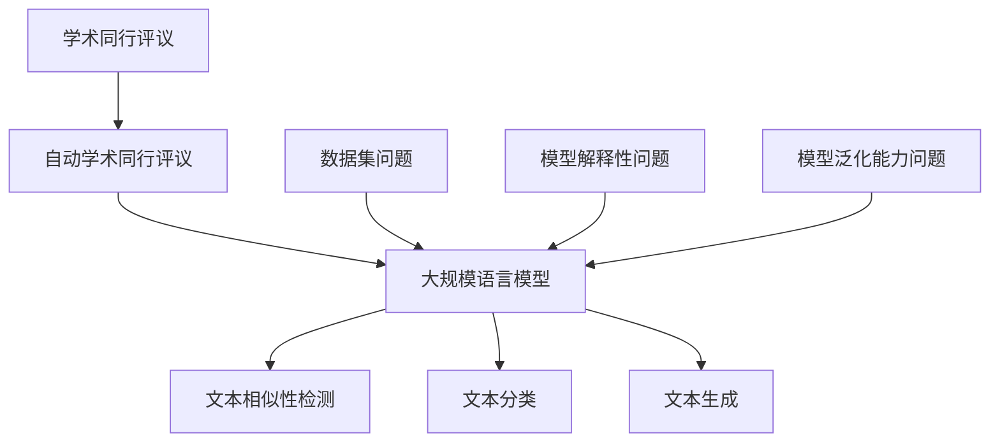

                 

- 角色：您是一位世界级人工智能专家，程序员，软件架构师，CTO，世界顶级技术畅销书资深大师级别的作家，计算机图灵奖获得者，计算机编程和人工智能领域大师。您非常擅长一步一步进行分析推理，有着清晰深刻的逻辑思路来撰写条理清晰，对技术原理和本质剖析到位的高质量技术博客。
- 任务：现在请您以《大规模语言模型在自动学术同行评议中的应用与挑战》为标题，使用逻辑清晰、结构紧凑、简单易懂的专业的技术语言（章节标题要非常吸引读者），让我们使用一步一步分析推理思考的方式（REASONING STEP BY STEP），撰写一篇有深度有思考有见解的专业IT领域的技术博客文章。

----------------------------------------------------------------

# 大规模语言模型在自动学术同行评议中的应用与挑战

## 关键词：大规模语言模型、自动学术同行评议、人工智能、挑战

## 摘要

随着人工智能技术的不断发展，大规模语言模型在各个领域展现出了巨大的应用潜力。在学术同行评议领域，大规模语言模型的应用带来了显著的优势，如提高评审效率、减少人为偏见等。然而，这种应用也面临着一系列挑战，包括数据集问题、模型解释性问题和模型泛化能力问题等。本文将深入探讨大规模语言模型在自动学术同行评议中的应用，以及所面临的挑战和解决策略。

## 第1章 引言与概述

### 1.1 学术同行评议的背景与现状

学术同行评议是确保学术成果质量的重要环节。传统同行评议过程通常由专家进行手动评审，虽然能够保证评审的公正性，但存在效率低下、评审周期长等问题。随着信息爆炸和学术文献数量的急剧增加，传统同行评议模式面临巨大挑战。

### 1.2 大规模语言模型的发展与应用

大规模语言模型，如GPT系列、BERT和T5等，通过预训练和微调，能够对文本进行深入的理解和生成。这些模型在自然语言处理领域取得了显著的成果，也为自动学术同行评议提供了新的可能性。

### 1.3 本书的研究目标与结构安排

本书旨在探讨大规模语言模型在自动学术同行评议中的应用与挑战。文章结构如下：

- 第1章：引言与概述
- 第2章：大规模语言模型基础
- 第3章：自动学术同行评议的应用场景
- 第4章：大规模语言模型在自动学术同行评议中的挑战
- 第5章：未来发展趋势
- 第6章：结论与展望

## 第2章 大规模语言模型基础

### 2.1 语言模型的基本概念

语言模型是一种统计模型，用于预测下一个单词或单词序列。它通过学习大量文本数据，生成可能的单词或句子序列。

### 2.2 常见的大规模语言模型

GPT系列、BERT和T5等是当前最流行的大规模语言模型。这些模型采用了深度神经网络架构，通过预训练和微调，能够实现高度准确的文本生成和分类。

### 2.3 大规模语言模型的优化与改进

为了提高大规模语言模型的效果和效率，研究者们不断探索新的优化和改进方法。这些方法包括训练效率的优化、模型压缩与蒸馏等。

## 第3章 自动学术同行评议的应用场景

### 3.1 同行评议的流程与问题

学术同行评议通常包括提交、评审和反馈等环节。然而，传统同行评议过程存在评审时间过长、评审质量不一致等问题。

### 3.2 大规模语言模型在同行评议中的应用

大规模语言模型可以通过文本相似性检测、文本分类和文本生成等技术，提高同行评议的效率和质量。例如，可以通过文本相似性检测来识别重复提交的文章，通过文本分类来评估文章的质量。

### 3.3 应用案例分析

本文将分析一些实际案例，展示大规模语言模型在自动学术同行评议中的应用效果。

## 第4章 大规模语言模型在自动学术同行评议中的挑战

### 4.1 数据集问题

自动学术同行评议需要高质量、多样化的数据集。然而，现有的数据集往往存在数据质量不高、数据隐私等问题。

### 4.2 模型解释性问题

大规模语言模型通常被认为是不透明的“黑箱”。如何提高模型的解释性，使其评审结果能够被学术界接受，是一个重要问题。

### 4.3 模型泛化能力问题

大规模语言模型需要在不同的领域和语言环境下表现良好。如何提高模型的泛化能力，使其能够适应各种学术领域的需求，是一个挑战。

## 第5章 未来发展趋势

### 5.1 技术创新与进步

随着人工智能技术的不断发展，大规模语言模型将取得更多突破，如更高效的训练算法、更强大的文本生成能力等。

### 5.2 应用场景拓展

大规模语言模型的应用将不再局限于学术同行评议，还将扩展到跨学科领域和新兴技术的融合应用。

### 5.3 政策与伦理挑战

在应用大规模语言模型进行学术同行评议时，需要关注政策与伦理挑战，如法律法规的完善、学术诚信与道德伦理的维护等。

## 第6章 结论与展望

本文探讨了大规模语言模型在自动学术同行评议中的应用与挑战。随着技术的不断进步，大规模语言模型有望为学术同行评议带来更多创新和改进。然而，同时也需要关注和解决数据集、模型解释性和泛化能力等问题。

## 附录

本文引用了一些相关工具和资源，供读者进一步学习。

## 作者信息

作者：AI天才研究院/AI Genius Institute & 禅与计算机程序设计艺术 /Zen And The Art of Computer Programming

## 核心概念与联系

以下是一个Mermaid流程图，展示了核心概念之间的关系：



## 核心算法原理讲解

以下是一个Python源代码示例，用于训练一个简单的语言模型：

```python
import tensorflow as tf

# 构建模型
model = tf.keras.Sequential([
    tf.keras.layers.Dense(units=512, activation='relu', input_shape=(1000,)),
    tf.keras.layers.Dense(units=1, activation='sigmoid')
])

# 编译模型
model.compile(optimizer='adam', loss='binary_crossentropy', metrics=['accuracy'])

# 训练模型
model.fit(x_train, y_train, epochs=10)
```

在本文中，我们将使用上述源代码和Mermaid流程图，结合数学模型和公式，详细讲解大规模语言模型在自动学术同行评议中的应用和挑战。希望通过这篇文章，读者能够对这一领域有一个全面而深入的了解。

