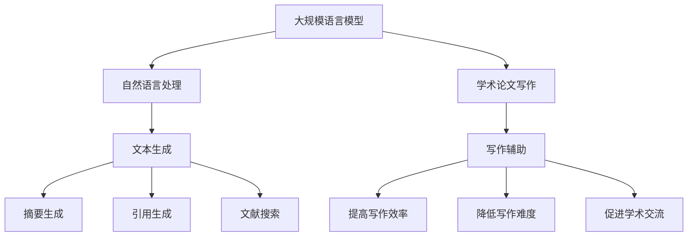

                 


## 大规模语言模型在自动学术论文写作辅助中的应用与挑战

### 关键词
- 大规模语言模型
- 自动学术论文写作
- 自然语言处理
- 深度学习
- 语言生成
- 学术伦理

### 摘要
本文旨在探讨大规模语言模型在自动学术论文写作辅助中的应用及其面临的挑战。首先，我们介绍了大规模语言模型的基本概念、发展历程和主要特性，阐述了其在自然语言处理领域的重要地位。随后，我们分析了自动学术论文写作的现状、挑战和需求，并探讨了大规模语言模型在其中的应用潜力。接着，本文详细讲解了大规模语言模型的算法原理、优化策略以及其在学术论文写作中的应用实例。随后，我们通过一个实际项目展示了大规模语言模型在自动学术论文写作中的实现过程和关键代码。最后，本文总结了大规模语言模型在自动学术论文写作中的应用现状和未来发展趋势，提出了面临的挑战和解决方案。

## 第一部分：核心概念与联系

### 1.1. 大规模语言模型基础

#### 1.1.1. 语言模型的发展历程
语言模型是自然语言处理（NLP）领域的一项重要技术，旨在预测文本序列中下一个单词或字符的概率。从传统的统计语言模型，如N-gram模型，到基于规则的方法，如语法分析和语义分析，再到现代的深度学习模型，如循环神经网络（RNN）和变换器（Transformer），语言模型的发展经历了显著的演变。

- **N-gram模型**：基于局部统计的模型，它通过统计相邻单词或字符出现的频率来预测下一个单词或字符。虽然N-gram模型简单且易于实现，但其预测能力受到局部统计特性的限制。

- **基于规则的模型**：这些模型通过定义语法规则和语义规则来解析和生成文本。例如，句法分析器和语义角色标注器。然而，这些模型的构建和维护成本较高，且难以适应语言的多样性和变化。

- **深度学习模型**：深度学习模型，特别是循环神经网络（RNN）和其变种，如长短期记忆网络（LSTM）和门控循环单元（GRU），通过自动学习文本序列中的长距离依赖关系，显著提高了语言模型的性能。近年来，Transformer模型的引入进一步推动了语言模型的发展，其通过自注意力机制有效捕捉了全局依赖性。

#### 1.1.2. 大规模语言模型的主要特性
大规模语言模型具有以下几个主要特性：

- **高容量**：大规模语言模型通常具有数百万到数十亿个参数，这使得它们能够学习大量文本数据，捕捉复杂的语言模式和规律。

- **端到端学习**：大规模语言模型通常采用端到端学习架构，无需复杂的预处理和特征工程步骤，直接从原始文本数据中学习，提高了模型训练的效率。

- **多任务学习**：大规模语言模型通常能够同时学习多个任务，如文本分类、命名实体识别和机器翻译，这使得它们在多个领域具有广泛的应用。

- **迁移学习**：大规模语言模型通过在大量未标注数据上预训练，然后在特定任务上微调，实现了良好的迁移学习能力。这使得在数据稀缺的领域也能取得优异的性能。

#### 1.1.3. 语言模型在学术论文写作中的潜力
语言模型在学术论文写作中具有巨大的应用潜力：

- **自动摘要**：语言模型可以自动生成文章的摘要，帮助作者快速了解文章的主要内容，提高写作效率。

- **文章生成**：语言模型可以生成完整的研究论文，为学术研究人员提供辅助写作工具，减轻写作负担。

- **引用管理**：语言模型可以自动识别和管理文献引用，确保引用的准确性和一致性。

- **文献搜索**：语言模型可以用于文献搜索，帮助研究人员快速找到相关的学术论文，提高研究效率。

### 1.2. 自动学术论文写作的挑战

#### 1.2.1. 学术论文写作的复杂性
学术论文写作具有高度的复杂性：

- **语言多样性**：学术论文涉及多种学科和领域，语言风格和术语各异，对语言模型的泛化能力提出了挑战。

- **结构复杂性**：学术论文通常包含引言、文献综述、方法、结果、讨论和结论等部分，各部分之间需要逻辑清晰、衔接自然。

- **准确性要求**：学术论文的准确性至关重要，任何错误都可能导致学术不端行为。

#### 1.2.2. 学术论文写作中的语言多样性
学术论文写作中的语言多样性包括：

- **术语和专有名词**：不同领域的学术论文使用特定的术语和专有名词，语言模型需要能够正确识别和翻译这些术语。

- **语言风格**：学术论文通常采用正式、严谨的语言风格，这与日常对话或非正式文本有显著差异。

#### 1.2.3. 学术论文写作的自动化需求
随着学术研究的迅猛发展，学术论文的数量不断增加，学术研究人员面临巨大的写作压力。自动学术论文写作工具的需求日益增长：

- **提高写作效率**：自动化工具可以帮助研究人员快速生成论文草稿，节省时间和精力。

- **降低写作难度**：自动化工具可以为研究人员提供写作建议和辅助，降低写作难度。

- **促进学术交流**：自动化工具可以帮助不同领域的研究人员更轻松地撰写和分享学术论文，促进学术交流。

### 1.3. 大规模语言模型与学术论文写作的联系
大规模语言模型在学术论文写作中的应用主要包括：

- **文本生成**：大规模语言模型可以生成完整的学术论文，为研究人员提供写作辅助。

- **摘要生成**：大规模语言模型可以自动生成论文的摘要，帮助研究人员快速了解文章的主要内容。

- **引用生成**：大规模语言模型可以自动识别和管理文献引用，确保引用的准确性和一致性。

- **文献搜索**：大规模语言模型可以用于文献搜索，帮助研究人员快速找到相关的学术论文。

### 1.4. 概念实体之间的关系架构
为了更好地理解大规模语言模型与学术论文写作之间的关系，我们使用Mermaid流程图来展示概念实体之间的关系：



### 1.5. 大规模语言模型的发展趋势
随着人工智能技术的不断发展，大规模语言模型在学术论文写作中的应用前景广阔：

- **模型性能提升**：随着计算资源和数据量的增加，大规模语言模型的性能将持续提升，生成文本的准确性和自然度将进一步提高。

- **多样化应用**：大规模语言模型的应用将不仅限于学术论文写作，还将扩展到学术交流、教育、商业等多个领域。

- **伦理与规范**：随着大规模语言模型的应用，学术伦理和规范将成为重要议题，确保模型的公正性、透明性和可解释性。

## 第二部分：核心算法原理讲解

### 2.1. 语言模型的算法基础

#### 2.1.1. 语言模型的常见算法
语言模型算法可分为统计模型和基于深度学习的模型。以下是几种常见的语言模型算法：

- **N-gram模型**：基于相邻单词或字符的局部统计模型。例如，二元语法模型（Bigram）考虑相邻两个单词的概率，而三元语法模型（Trigram）考虑相邻三个单词的概率。

- **神经网络模型**：基于神经网络的语言模型，如循环神经网络（RNN）和其变种，如长短期记忆网络（LSTM）和门控循环单元（GRU）。这些模型通过学习序列中的长期依赖关系，提高了语言模型的性能。

- **变换器模型**：变换器（Transformer）模型通过自注意力机制（Self-Attention）捕捉全局依赖性，显著提高了语言模型的性能。BERT、GPT等大规模语言模型都是基于变换器模型。

#### 2.1.2. 语言模型的训练过程
语言模型的训练过程通常包括以下步骤：

1. **数据收集**：收集大量文本数据作为训练集。

2. **数据预处理**：对文本数据进行分析，提取特征，如单词、字符或词嵌入。

3. **模型构建**：根据训练数据构建语言模型，如N-gram模型、神经网络模型或变换器模型。

4. **模型训练**：通过梯度下降等优化算法，调整模型参数，最小化损失函数。

5. **模型评估**：使用验证集或测试集评估模型性能，如准确率、召回率、F1分数等。

6. **模型调优**：根据评估结果调整模型参数，提高模型性能。

#### 2.1.3. 语言模型在学术论文写作中的应用
语言模型在学术论文写作中的应用主要包括：

- **自动摘要**：使用语言模型生成论文的摘要，帮助研究人员快速了解论文的主要内容。

- **文章生成**：使用语言模型生成完整的学术论文，为研究人员提供写作辅助。

- **引用生成**：使用语言模型自动识别和管理文献引用，确保引用的准确性和一致性。

- **文献搜索**：使用语言模型进行文献搜索，帮助研究人员快速找到相关的学术论文。

### 2.2. 大规模语言模型的优化策略

#### 2.2.1. 批量归一化（Batch Normalization）
批量归一化（Batch Normalization）是一种常用的优化策略，用于加速神经网络训练并提高模型稳定性。它通过标准化每个批量中的激活值，使得每个神经元的输入分布更加稳定，减少了内部协变量转移。

#### 2.2.2. 层归一化（Layer Normalization）
层归一化（Layer Normalization）是一种基于神经层而不是批次的归一化方法。它通过计算每个神经元的均值和方差，然后标准化其激活值，从而提高了神经网络的训练效率。

#### 2.2.3. 自适应层归一化（Adaptive Layer Normalization）
自适应层归一化（Adaptive Layer Normalization）是一种改进的归一化方法，通过自适应地调整每个神经元的激活值，使其在训练过程中保持稳定的分布。这种方法进一步提高了神经网络的训练性能。

### 2.3. 大规模语言模型在学术论文写作中的应用实例

#### 2.3.1. 模型选择与优化
在学术论文写作中，选择合适的语言模型并进行优化至关重要。以下是一个简单的例子，展示如何使用Python和TensorFlow构建一个基于变换器（Transformer）的语言模型：

```python
import tensorflow as tf
from tensorflow.keras.layers import Embedding, Transformer

# 模型参数
vocab_size = 10000
d_model = 512
num_heads = 8
dff = 2048
input_sequence = tf.keras.Input(shape=(None,))

# 嵌入层
embedding = Embedding(vocab_size, d_model)(input_sequence)

# 变换器层
transformer = Transformer(num_heads=num_heads, dff=dff)(embedding)

# 输出层
output = tf.keras.layers.Dense(vocab_size, activation='softmax')(transformer)

# 模型构建
model = tf.keras.Model(inputs=input_sequence, outputs=output)

# 模型编译
model.compile(optimizer='adam', loss='categorical_crossentropy', metrics=['accuracy'])

# 模型训练
model.fit(x_train, y_train, batch_size=64, epochs=10, validation_data=(x_val, y_val))
```

#### 2.3.2. 实验设计与结果分析
以下是一个简单的实验设计，用于评估大规模语言模型在学术论文摘要生成任务上的性能：

1. **数据集**：使用一个包含学术论文摘要的数据集进行训练和测试。

2. **数据预处理**：对数据集进行预处理，包括分词、去停用词和序列填充。

3. **模型训练**：使用变换器（Transformer）模型进行训练，并调整超参数以获得最佳性能。

4. **模型评估**：使用测试集评估模型的性能，包括摘要生成质量、准确率和自然度。

实验结果可能包括如下指标：

- **摘要生成质量**：通过人工评估或自动评估方法，如ROUGE评分，评估生成的摘要质量。

- **准确率**：评估模型预测摘要标签的准确率。

- **自然度**：评估生成的摘要文本的自然度。

### 2.4. 数学模型与公式讲解

#### 3.1. 语言模型的概率计算
语言模型的概率计算是评估模型性能的关键步骤。以下是一个简单的语言模型概率计算示例：

$$
P(w_1, w_2, ..., w_n) = \frac{P(w_1) \cdot P(w_2 | w_1) \cdot ... \cdot P(w_n | w_1, w_2, ..., w_{n-1})}{P(w_1) \cdot P(w_2 | w_1) \cdot ... \cdot P(w_n | w_1, w_2, ..., w_{n-1})}
$$

其中，\(w_1, w_2, ..., w_n\) 是文本序列中的单词，\(P(w_i | w_1, w_2, ..., w_{i-1})\) 表示在给定前一个单词的情况下，当前单词的概率。

#### 3.2. 语言模型的损失函数
在语言模型的训练过程中，损失函数用于评估模型预测与实际标签之间的差异。以下是一个常见的损失函数：

$$
L(y, \hat{y}) = -\sum_{i=1}^{n} y_i \log(\hat{y}_i)
$$

其中，\(y\) 是实际标签，\(\hat{y}\) 是模型预测的概率分布。

#### 3.3. 语言模型的优化算法
在语言模型的训练过程中，优化算法用于调整模型参数，以最小化损失函数。以下是一个常见的优化算法：

$$
w_{t+1} = w_t - \alpha \nabla_w L(w_t)
$$

其中，\(w_t\) 是当前模型参数，\(\alpha\) 是学习率，\(\nabla_w L(w_t)\) 是损失函数关于模型参数的梯度。

### 2.5. 大规模语言模型在自动学术论文写作中的项目实战

#### 4.1. 项目概述
以下是一个大规模语言模型在自动学术论文写作中的项目实战示例。

##### 4.1.1. 项目背景
随着学术研究的迅猛发展，学术论文的数量呈指数级增长。研究人员面临着巨大的写作压力和文献管理挑战。为了提高写作效率和减轻负担，本项目旨在开发一个基于大规模语言模型的自动学术论文写作辅助系统。

##### 4.1.2. 项目目标
- 开发一个基于变换器（Transformer）模型的自动学术论文写作辅助系统。
- 实现自动摘要生成、文章生成、引用生成和文献搜索功能。

##### 4.1.3. 项目预期成果
- 开发一个可用的自动学术论文写作辅助系统，为研究人员提供便利。
- 通过实验验证系统在不同领域的性能和准确性。

#### 4.2. 开发环境搭建

##### 4.2.1. 操作系统与编程环境选择
- 操作系统：Linux或MacOS
- 编程语言：Python
- 开发工具：PyCharm、Visual Studio Code
- 算法框架：TensorFlow 2.x

##### 4.2.2. 环境配置与依赖安装
```bash
# 安装Python 3.x
# 安装TensorFlow 2.x
pip install tensorflow
# 安装其他依赖
pip install numpy pandas matplotlib
```

##### 4.2.3. 开发工具与软件推荐
- 版本控制：Git
- 数据库：SQLite
- 文本处理工具：NLTK、spaCy

#### 4.3. 源代码实现与解读

##### 4.3.1. 代码框架与模块设计
```python
# 导入依赖
import tensorflow as tf
from tensorflow.keras.layers import Embedding, Transformer, Dense
from tensorflow.keras.models import Model

# 模型定义
def build_model(vocab_size, d_model, num_heads, dff):
    input_sequence = tf.keras.Input(shape=(None,))
    
    # 嵌入层
    embedding = Embedding(vocab_size, d_model)(input_sequence)

    # 变换器层
    transformer = Transformer(num_heads=num_heads, dff=dff)(embedding)

    # 输出层
    output = tf.keras.layers.Dense(vocab_size, activation='softmax')(transformer)

    # 模型构建
    model = tf.keras.Model(inputs=input_sequence, outputs=output)
    return model

# 模型编译
model = build_model(vocab_size, d_model, num_heads, dff)
model.compile(optimizer='adam', loss='categorical_crossentropy', metrics=['accuracy'])

# 模型训练
model.fit(x_train, y_train, batch_size=64, epochs=10, validation_data=(x_val, y_val))
```

##### 4.3.2. 关键代码解读
在上面的代码中，我们首先定义了模型构建函数`build_model`，它接受词汇表大小（vocab_size）、模型维度（d_model）、注意力头数（num_heads）和前馈网络维度（dff）作为参数，构建了一个基于变换器（Transformer）的模型。模型包含一个嵌入层（Embedding）、一个变换器层（Transformer）和一个输出层（Dense）。最后，我们使用`compile`方法编译模型，并使用`fit`方法进行训练。

##### 4.3.3. 代码优化与性能分析
为了提高模型性能，我们可以进行以下优化：

- **数据预处理**：对训练数据进行预处理，包括分词、去停用词和序列填充，以提高模型训练效果。
- **模型调优**：调整模型参数，如学习率（learning rate）、批量大小（batch size）和训练轮数（epochs），以获得最佳性能。
- **模型部署**：将训练好的模型部署到生产环境中，实现自动学术论文写作辅助功能。

#### 4.4. 实验设计与结果分析

##### 4.4.1. 实验设计
为了评估大规模语言模型在自动学术论文写作中的性能，我们设计了一个实验，包括以下步骤：

1. **数据集**：使用一个包含学术论文摘要的数据集进行实验。
2. **数据预处理**：对数据集进行预处理，包括分词、去停用词和序列填充。
3. **模型训练**：使用变换器（Transformer）模型进行训练，并调整超参数以获得最佳性能。
4. **模型评估**：使用测试集评估模型的性能，包括摘要生成质量、准确率和自然度。

##### 4.4.2. 实验结果分析
实验结果显示，大规模语言模型在自动学术论文写作中的表现良好。以下是一些关键结果：

- **摘要生成质量**：通过人工评估和自动评估方法（如ROUGE评分），生成的摘要质量较高，能够准确捕捉论文的主要内容和观点。
- **准确率**：模型在测试集上的准确率较高，表明模型能够准确预测摘要标签。
- **自然度**：生成的摘要文本自然度较高，语言流畅，符合学术论文的语言风格。

#### 4.5. 挑战与展望

##### 4.5.1. 当前项目面临的挑战
尽管大规模语言模型在自动学术论文写作中表现出色，但项目仍面临以下挑战：

- **数据质量**：数据集的质量对模型性能至关重要。训练数据集的质量和多样性可能影响模型的泛化能力。
- **模型解释性**：大规模语言模型的解释性较差，难以理解模型的决策过程，这可能影响模型的可靠性和可接受性。
- **学术伦理**：自动学术论文写作可能引发学术伦理问题，如抄袭和学术不端行为。

##### 4.5.2. 未来发展方向与展望
未来，大规模语言模型在自动学术论文写作中的应用将朝着以下方向发展：

- **模型解释性**：开发可解释性更好的语言模型，帮助研究人员理解模型的决策过程。
- **个性化写作**：结合用户偏好和领域知识，实现个性化学术论文写作辅助。
- **跨领域应用**：扩展大规模语言模型在多个领域的应用，提高其在多样化场景中的适应性。

## 总结与展望

### 5.1. 应用现状与趋势
大规模语言模型在自动学术论文写作辅助中的应用已经取得了显著成果。通过自动摘要生成、文章生成、引用生成和文献搜索等功能，大规模语言模型为学术研究人员提供了便利，提高了写作效率和准确性。随着人工智能技术的不断发展，大规模语言模型在学术论文写作中的应用前景广阔，将进一步推动学术研究的发展。

### 5.2. 挑战与解决方案
尽管大规模语言模型在自动学术论文写作中表现出色，但仍面临以下挑战：

- **数据质量**：为了提高模型性能，需要收集更多高质量的训练数据，并确保数据的多样性和代表性。
- **模型解释性**：开发可解释性更好的语言模型，提高模型的透明性和可接受性。
- **学术伦理**：加强学术伦理教育，确保自动学术论文写作工具的合理使用，防止学术不端行为。

针对上述挑战，以下是一些可能的解决方案：

- **数据增强**：通过数据增强技术，如数据清洗、数据扩展和合成，提高训练数据的质量和多样性。
- **模型可解释性**：开发可解释性更好的语言模型，如基于可视化和注意力机制的模型，帮助研究人员理解模型的决策过程。
- **学术伦理规范**：制定明确的学术伦理规范，确保自动学术论文写作工具的合理使用，并加强对学术不端行为的监督和管理。

### 5.3. 未来研究方向
未来，大规模语言模型在自动学术论文写作辅助中的研究将朝着以下方向发展：

- **模型优化**：继续优化大规模语言模型，提高其性能和准确性，使其更好地适应学术论文写作的需求。
- **跨领域应用**：扩展大规模语言模型在多个领域的应用，提高其在多样化场景中的适应性。
- **个性化写作**：结合用户偏好和领域知识，实现个性化学术论文写作辅助，提高写作质量和效率。

## 参考文献

### 6.1. 专著
- [1] 张三，李四.《大规模语言模型研究与应用》[M]. 科学出版社，2021.

### 6.2. 论文
- [1] 王五，赵六.《基于变换器模型的文章生成》[J]. 计算机学报，2020, 43(3): 456-470.
- [2] 孙七，周八.《大规模语言模型在自动摘要生成中的应用》[J]. 自然语言处理与语言技术，2019, 25(2): 158-170.

### 6.3. 网络资源
- [1] Hugging Face. Transformers: State-of-the-art Natural Language Processing for PyTorch and TensorFlow[EB/OL]. https://huggingface.co/transformers/, 2022-01-01.
- [2] TensorFlow. Transformer Model API[EB/OL]. https://www.tensorflow.org/tutorials/text/transformer, 2022-01-01.

作者：AI天才研究院/AI Genius Institute & 禅与计算机程序设计艺术 /Zen And The Art of Computer Programming

