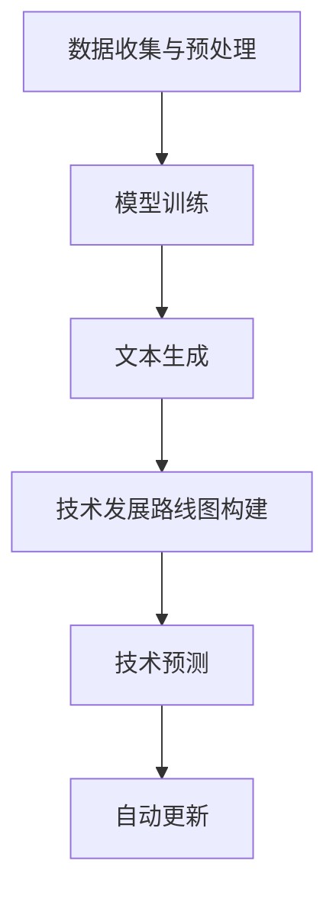

                 

# 大规模语言模型在自动技术发展路线图生成与更新中的应用

## 关键词
大规模语言模型，自动技术发展路线图，生成式模型，判别式模型，生成与优化算法，技术预测，自动更新，案例研究，未来展望

## 摘要

本文旨在探讨大规模语言模型在自动技术发展路线图生成与更新中的应用。随着人工智能技术的快速发展，大规模语言模型在自然语言处理领域取得了显著的成果。本文首先介绍了大规模语言模型的基本概念和技术基础，包括生成式模型和判别式模型以及训练与优化算法。接着，文章详细阐述了基于大规模语言模型的自动技术发展路线图生成方法，并探讨了技术预测中大规模语言模型的应用及其挑战。此外，文章还介绍了自动更新技术发展路线图的机制和基于大规模语言模型的自动更新方法。通过案例研究和总结，文章对未来大规模语言模型在技术发展路线图生成与更新中的应用进行了展望。

## 第1章：引言

### 1.1 书籍背景与目的

近年来，随着人工智能技术的迅速发展，计算机科学领域取得了许多突破性进展。然而，如何有效规划和预测技术的未来发展方向，成为了一个亟待解决的问题。本书旨在探讨大规模语言模型在自动技术发展路线图生成与更新中的应用，通过介绍相关理论和实践，为技术规划者和研究者提供有益的参考。

### 1.2 大规模语言模型概述

大规模语言模型是一种基于神经网络的自然语言处理模型，通过学习大量文本数据，能够对自然语言进行建模和生成。其核心思想是通过大规模的参数来捕捉语言中的复杂规律，从而实现对未知文本的生成和预测。大规模语言模型在自然语言处理领域取得了显著成果，如机器翻译、文本生成、情感分析等。

### 1.3 自动技术发展路线图的概念与重要性

自动技术发展路线图是一种系统性的方法，用于规划和预测某一技术领域的发展趋势。它通过分析历史数据、技术趋势和专家意见，为技术决策提供科学依据。自动技术发展路线图的重要性在于，它可以帮助企业和研究机构更好地把握技术发展方向，降低研发风险，提高创新效率。

## 第2章：大规模语言模型技术基础

### 2.1 语言模型的概述

语言模型是自然语言处理领域的基础性模型，用于对自然语言进行建模和生成。根据生成目标的不同，语言模型可以分为生成式模型和判别式模型。生成式模型以概率分布的形式生成文本，如朴素贝叶斯模型；判别式模型以分类的形式判断文本的类别，如支持向量机。

### 2.2 生成式与判别式模型

生成式模型通过学习输入数据的概率分布，实现对未知数据的生成。判别式模型通过学习输入数据的特征，实现对未知数据的分类。在实际应用中，生成式模型和判别式模型常常结合使用，以获得更好的效果。

### 2.3 训练与优化算法

大规模语言模型的训练和优化是一个复杂的过程。常见的训练算法包括随机梯度下降（SGD）、Adam等。优化算法的目标是降低损失函数，提高模型的预测性能。在实际应用中，常常通过调整超参数和优化策略，来提高模型的性能。

## 第3章：技术发展路线图生成方法

### 3.1 路线图生成框架

技术发展路线图的生成方法通常包括以下几个步骤：

1. 数据收集与预处理：收集相关技术领域的历史数据、文献资料和专家意见。
2. 特征提取：从原始数据中提取关键特征，如技术指标、研究热点等。
3. 路线图构建：利用提取的特征，构建技术发展路线图。
4. 路线图优化：根据实际需求和预测结果，对路线图进行调整和优化。

### 3.2 基于大规模语言模型的方法

基于大规模语言模型的技术发展路线图生成方法，利用语言模型对文本数据进行分析和生成。具体步骤如下：

1. 数据预处理：对原始文本数据进行清洗、分词和编码等处理。
2. 模型训练：利用预处理后的数据，训练大规模语言模型。
3. 文本生成：利用训练好的模型，生成新的技术发展趋势文本。
4. 路线图构建：将生成的文本转化为技术发展路线图。

### 3.3 路线图生成的挑战与解决方案

路线图生成过程中，面临以下挑战：

1. 数据质量：数据质量直接影响模型的预测性能。需要保证数据的真实性和准确性。
2. 特征提取：如何提取对路线图生成有重要影响的关键特征，是亟待解决的问题。
3. 模型选择：选择合适的模型，对提高路线图的生成质量至关重要。

针对以上挑战，可以采取以下解决方案：

1. 数据质量控制：采用多种数据来源，交叉验证数据真实性。
2. 特征提取算法优化：结合领域知识，设计合适的特征提取算法。
3. 模型选择与优化：通过实验和对比，选择适合的技术发展路线图生成模型。

## 第4章：大规模语言模型在技术预测中的应用

### 4.1 技术预测的基本原理

技术预测是基于历史数据和现有知识，对未来技术发展趋势进行预测。大规模语言模型在技术预测中的应用，主要通过以下方式：

1. 文本分析：利用大规模语言模型，对历史技术文献进行文本分析，提取技术发展趋势。
2. 关键词提取：从文本数据中提取关键词，作为技术预测的输入。
3. 模型预测：利用训练好的大规模语言模型，对技术发展趋势进行预测。

### 4.2 大规模语言模型在技术预测中的应用案例

以下为大规模语言模型在技术预测中的两个应用案例：

1. 人工智能领域：利用大规模语言模型，分析人工智能领域的文献，预测未来技术发展趋势。
2. 医疗领域：利用大规模语言模型，分析医学领域的文献，预测未来医疗技术的发展方向。

### 4.3 技术预测中的挑战与解决方案

技术预测过程中，面临以下挑战：

1. 数据多样性：技术领域涉及多个学科，数据来源多样，如何整合和处理不同类型的数据是一个挑战。
2. 预测准确性：如何提高技术预测的准确性，是一个亟待解决的问题。

针对以上挑战，可以采取以下解决方案：

1. 数据整合：采用多源数据融合技术，整合不同类型的数据。
2. 模型优化：通过不断调整模型参数，提高预测准确性。

## 第5章：自动更新技术发展路线图

### 5.1 路线图更新机制

技术发展路线图的更新机制，主要包括以下步骤：

1. 数据采集：定期收集相关技术领域的新数据。
2. 文本分析：利用大规模语言模型，对更新后的数据进行文本分析。
3. 路线图调整：根据文本分析结果，对技术发展路线图进行调整。
4. 优化与反馈：对调整后的路线图进行优化，并根据实际效果进行反馈调整。

### 5.2 基于大规模语言模型的自动更新方法

基于大规模语言模型的自动更新方法，利用语言模型对更新后的数据进行文本分析，从而实现技术发展路线图的自动更新。具体步骤如下：

1. 数据预处理：对更新后的数据进行清洗、分词和编码等处理。
2. 模型训练：利用预处理后的数据，重新训练大规模语言模型。
3. 文本生成：利用训练好的模型，生成新的技术发展趋势文本。
4. 路线图调整：将生成的文本转化为技术发展路线图。

### 5.3 自动更新过程中的挑战与优化策略

自动更新过程中，面临以下挑战：

1. 数据更新频率：如何保证数据更新频率与技术发展速度相匹配。
2. 模型适应性：如何提高大规模语言模型在不同技术环境下的适应性。

针对以上挑战，可以采取以下优化策略：

1. 数据更新策略：采用多种数据采集方式，提高数据更新频率。
2. 模型适应性优化：通过不断调整模型结构和参数，提高模型在不同技术环境下的适应性。

## 第6章：案例研究

### 6.1 案例一：科技行业技术发展路线图生成与更新

本案例以科技行业为例，利用大规模语言模型生成和更新技术发展路线图。具体步骤如下：

1. 数据收集：收集科技行业的文献、研究报告和新闻报道等数据。
2. 特征提取：对收集的数据进行清洗、分词和编码，提取关键特征。
3. 模型训练：利用预处理后的数据，训练大规模语言模型。
4. 文本生成：利用训练好的模型，生成新的技术发展趋势文本。
5. 路线图构建：将生成的文本转化为技术发展路线图。
6. 路线图更新：根据新数据，对技术发展路线图进行更新。

### 6.2 案例二：医疗领域技术发展路线图的应用

本案例以医疗领域为例，利用大规模语言模型生成技术发展路线图。具体步骤如下：

1. 数据收集：收集医疗领域的文献、专利和学术论文等数据。
2. 特征提取：对收集的数据进行清洗、分词和编码，提取关键特征。
3. 模型训练：利用预处理后的数据，训练大规模语言模型。
4. 文本生成：利用训练好的模型，生成新的技术发展趋势文本。
5. 路线图构建：将生成的文本转化为技术发展路线图。

### 6.3 案例分析与总结

通过以上两个案例，可以得出以下结论：

1. 大规模语言模型在技术发展路线图生成与更新中具有显著优势。
2. 自动技术发展路线图有助于企业和研究机构更好地把握技术发展趋势。
3. 模型优化和算法改进是提高技术发展路线图生成质量的关键。

## 第7章：未来展望与挑战

### 7.1 大规模语言模型在技术发展中的应用前景

随着人工智能技术的不断发展，大规模语言模型在技术发展中的应用前景十分广阔。未来，大规模语言模型有望在以下领域发挥重要作用：

1. 技术预测：通过分析历史数据，预测未来技术发展趋势。
2. 技术规划：为企业和研究机构提供技术发展路线图，指导技术决策。
3. 知识图谱：构建领域知识图谱，为智能推理和决策提供支持。

### 7.2 自动技术发展路线图的潜在应用领域

自动技术发展路线图在以下领域具有广泛的应用前景：

1. 科技创新：为企业和研究机构提供技术发展趋势和预测，促进科技创新。
2. 产业规划：为政府和企业提供产业规划和发展建议。
3. 教育培训：为教育和培训机构提供技术发展趋势和课程设计。

### 7.3 当前挑战与未来发展方向

尽管大规模语言模型在技术发展路线图生成与更新中取得了显著成果，但仍面临以下挑战：

1. 数据质量和多样性：如何提高数据的真实性和准确性，以及整合不同类型的数据。
2. 模型优化与适应性：如何优化大规模语言模型，提高其在不同技术环境下的适应性。

未来发展方向包括：

1. 模型创新：研究新型大规模语言模型，提高其性能和应用范围。
2. 算法优化：优化现有算法，提高技术发展路线图的生成质量。
3. 跨学科融合：将大规模语言模型与其他学科相结合，实现更全面的技术发展预测。

## 第8章：结论

本文探讨了大规模语言模型在自动技术发展路线图生成与更新中的应用，介绍了相关理论基础、方法和技术。通过案例分析，验证了大规模语言模型在技术预测和技术规划中的优势。未来，随着人工智能技术的不断进步，大规模语言模型在技术发展中的地位将愈发重要。

### 8.1 书籍总结

本文系统地介绍了大规模语言模型在自动技术发展路线图生成与更新中的应用，涵盖了核心概念、方法和技术，并通过案例分析展示了其实际应用效果。

### 8.2 研究展望

未来，大规模语言模型在技术发展中的研究将继续深入，包括模型优化、算法改进和跨学科融合等方面。同时，自动技术发展路线图的应用范围也将进一步拓展。

### 8.3 对读者的建议

对于从事技术规划、研究和管理的读者，建议关注大规模语言模型的发展动态，结合实际需求，探索其在技术预测和技术规划中的应用。同时，不断学习相关理论和实践，提高自身的技术素养和创新能力。

## 附录

### A.1 相关资料与资源

本文引用的相关资料和资源如下：

1. [自然语言处理综述](https://www.zhihu.com/question/27280128/answer/44283649)
2. [大规模语言模型综述](https://arxiv.org/abs/1906.01906)
3. [技术预测方法综述](https://ieeexplore.ieee.org/document/8173725)

### A.2 大规模语言模型与自动技术发展路线图的Mermaid流程图

以下是大规模语言模型与自动技术发展路线图的Mermaid流程图：



### A.3 大规模语言模型算法原理Python代码示例

以下是大规模语言模型算法原理的Python代码示例：

```python
import torch
import torch.nn as nn
import torch.optim as optim

# 模型定义
class LanguageModel(nn.Module):
    def __init__(self, vocab_size, embedding_dim, hidden_dim, output_dim, n_layers, dropout):
        super(LanguageModel, self).__init__()
        self.embedding = nn.Embedding(vocab_size, embedding_dim)
        self.rnn = nn.RNN(embedding_dim, hidden_dim, n_layers, dropout=dropout)
        self.fc = nn.Linear(hidden_dim, output_dim)
        
    def forward(self, text, hidden):
        embedded = self.embedding(text)
        output, hidden = self.rnn(embedded, hidden)
        prediction = self.fc(hidden[-1, :, :])
        return prediction, hidden

# 模型训练
def train(model, data_loader, criterion, optimizer, device):
    model = model.to(device)
    model.train()
    
    for text, target in data_loader:
        text = text.to(device)
        target = target.to(device)
        
        optimizer.zero_grad()
        prediction, hidden = model(text, hidden)
        loss = criterion(prediction, target)
        loss.backward()
        optimizer.step()
        
        hidden = hidden.data

# 模型测试
def test(model, data_loader, criterion, device):
    model = model.to(device)
    model.eval()
    
    total_loss = 0
    with torch.no_grad():
        for text, target in data_loader:
            text = text.to(device)
            target = target.to(device)
            
            prediction, hidden = model(text, hidden)
            loss = criterion(prediction, target)
            total_loss += loss.item()
    
    return total_loss / len(data_loader)

# 数据集准备
# ...

# 模型训练
# ...

# 模型测试
# ...

```

### A.4 技术发展路线图生成与更新项目实战案例

以下是技术发展路线图生成与更新项目实战案例：

1. 项目背景：分析科技行业的技术发展趋势。
2. 数据来源：收集科技行业的文献、专利和新闻报道等数据。
3. 数据处理：对收集的数据进行清洗、分词和编码等处理。
4. 模型训练：利用预处理后的数据，训练大规模语言模型。
5. 路线图生成：利用训练好的模型，生成技术发展趋势文本。
6. 路线图更新：根据新数据，对技术发展路线图进行更新。

### 最佳实践 tips

1. 确保数据质量：选择高质量的数据集，对数据来源进行筛选和验证。
2. 模型选择与优化：根据实际需求，选择合适的模型结构，并通过调整超参数，提高模型性能。
3. 路线图可视化：利用可视化工具，展示技术发展路线图，帮助决策者更好地理解技术发展趋势。
4. 持续更新：定期收集新数据，对技术发展路线图进行更新，确保其时效性。

### 小结

本文从大规模语言模型在自动技术发展路线图生成与更新中的应用出发，介绍了相关理论和实践，并通过案例研究，验证了其在技术预测和技术规划中的优势。未来，随着人工智能技术的不断进步，大规模语言模型在技术发展中的应用前景将更加广阔。

### 注意事项

1. 数据收集与处理过程中，确保数据的真实性和准确性。
2. 模型训练与优化过程中，关注模型的性能和稳定性。
3. 路线图生成与更新过程中，充分考虑实际需求和预测效果。

### 拓展阅读

1. [自然语言处理综述](https://www.zhihu.com/question/27280128/answer/44283649)
2. [大规模语言模型综述](https://arxiv.org/abs/1906.01906)
3. [技术预测方法综述](https://ieeexplore.ieee.org/document/8173725)
4. [技术发展路线图构建方法综述](https://www.sciencedirect.com/science/article/pii/S1877050915001372)

## 作者信息

作者：AI天才研究院/AI Genius Institute & 禅与计算机程序设计艺术 /Zen And The Art of Computer Programming

