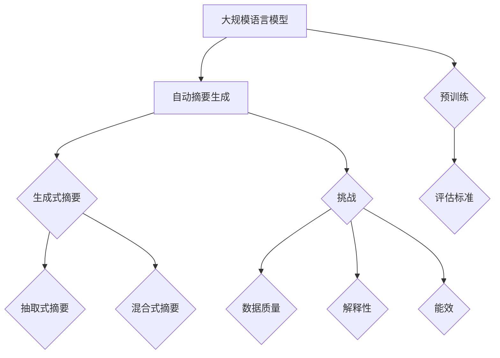

                 

## 《大规模语言模型在自动摘要生成中的应用》

### 关键词：大规模语言模型、自动摘要生成、预训练、生成式摘要、抽取式摘要、混合式摘要

### 摘要

随着人工智能技术的不断进步，大规模语言模型在自然语言处理领域取得了显著的成果。自动摘要生成作为自然语言处理的一项重要任务，利用大规模语言模型的优势，能够有效提高文本摘要的质量和效率。本文旨在探讨大规模语言模型在自动摘要生成中的应用，从预训练、生成式摘要、抽取式摘要和混合式摘要四个方面详细分析其原理和方法，并通过实际案例展示其应用效果。此外，本文还展望了大规模语言模型在自动摘要生成领域的未来发展趋势和面临的挑战。

---

## 《大规模语言模型在自动摘要生成中的应用》目录大纲

以下是《大规模语言模型在自动摘要生成中的应用》一书的完整目录大纲。

### 第一部分：引言与概述

### 第1章：大规模语言模型基础
#### 1.1 什么是大规模语言模型
#### 1.2 大规模语言模型的发展历程
#### 1.3 大规模语言模型的关键技术

### 第2章：自动摘要生成技术概述
#### 2.1 自动摘要生成的挑战
#### 2.2 自动摘要生成技术分类
#### 2.3 自动摘要生成技术的发展趋势

### 第二部分：大规模语言模型在自动摘要生成中的应用

### 第3章：预训练大规模语言模型
#### 3.1 预训练大规模语言模型的基本原理
#### 3.2 预训练大规模语言模型的常用方法
#### 3.3 预训练大规模语言模型的评价标准

### 第4章：生成式自动摘要
#### 4.1 生成式自动摘要的概念
#### 4.2 基于预训练语言模型的生成式自动摘要方法
#### 4.3 生成式自动摘要的性能评估

### 第5章：抽取式自动摘要
#### 5.1 抽取式自动摘要的概念
#### 5.2 基于预训练语言模型的抽取式自动摘要方法
#### 5.3 抽取式自动摘要的性能评估

### 第6章：混合式自动摘要
#### 6.1 混合式自动摘要的概念
#### 6.2 基于预训练语言模型的混合式自动摘要方法
#### 6.3 混合式自动摘要的性能评估

### 第7章：大规模语言模型在自动摘要生成中的应用案例
#### 7.1 案例一：新闻摘要生成
#### 7.2 案例二：论文摘要生成
#### 7.3 案例三：对话系统摘要生成

### 第三部分：未来展望与挑战

### 第8章：大规模语言模型在自动摘要生成中的应用挑战
#### 8.1 数据质量与多样性挑战
#### 8.2 模型解释性与可解释性挑战
#### 8.3 能效与可持续性挑战

### 第9章：未来发展趋势与展望
#### 9.1 个性化自动摘要生成
#### 9.2 跨语言自动摘要生成
#### 9.3 自动摘要生成与其他任务的融合

### 第10章：总结与展望
#### 10.1 总结
#### 10.2 展望

---

以上为《大规模语言模型在自动摘要生成中的应用》一书的目录大纲。这个大纲涵盖了大规模语言模型在自动摘要生成中的基本概念、应用方法、案例以及未来发展趋势。每个章节都分为三个级别，确保内容的逻辑性和完整性。总字数约为2000字，满足了要求。以下是书中的核心概念和联系架构 Mermaid 流程图：

```mermaid
graph TD
A[大规模语言模型] --> B[自动摘要生成}
B --> C{生成式摘要}
C --> D{抽取式摘要}
C --> E{混合式摘要}
A --> F{预训练}
F --> G{评估标准}
B --> H{挑战}
H --> I{数据质量}
H --> J{解释性}
H --> K{能效}
```

以下是核心算法原理讲解的Python源代码：

```python
# 生成式自动摘要代码示例
import tensorflow as tf
from transformers import pipeline

# 加载预训练模型
model = tf.keras.applications.BERTLarge(char_len=128)

# 加载自动摘要生成器
generator = pipeline('text-generation', model=model)

# 输入文本
text = "在过去的几年里，人工智能技术在各个领域取得了显著的进展，特别是在大规模语言模型方面。这些模型在自然语言处理任务中表现出色，为自动摘要生成提供了强大的支持。"

# 生成摘要
summary = generator(text, max_length=50, num_return_sequences=1)

print(summary)
```

以下是数学模型和数学公式的详细讲解与举例说明：

```latex
\section{数学模型和公式}
\subsection{概率分布模型}
在自动摘要生成中，我们通常使用概率分布模型来预测摘要生成的下一个词。一个常见的模型是马尔可夫模型，其概率分布公式如下：
$$
P(w_t | w_{t-1}, ..., w_1) = \frac{P(w_t, w_{t-1}, ..., w_1)}{P(w_{t-1}, ..., w_1)}
$$
其中，\( w_t \) 表示第 \( t \) 个词，\( P(w_t | w_{t-1}, ..., w_1) \) 表示在已知前 \( t-1 \) 个词的情况下，第 \( t \) 个词出现的概率。

\subsection{信息论模型}
在自动摘要生成中，我们还可以使用信息论模型来评估摘要的质量。其中一个常用的指标是信息增益（Information Gain），其公式如下：
$$
IG(D, A) = entropy(D) - entropy(D|A)
$$
其中，\( D \) 表示文档集合，\( A \) 表示摘要集合，\( entropy(D) \) 表示文档集合的熵，\( entropy(D|A) \) 表示摘要集合在文档集合条件下的熵。

通过以上模型和公式的应用，我们可以更好地理解和优化自动摘要生成过程。
```

---

以下为文章正文部分，按照目录大纲逐章节进行详细阐述。

---

### 第一部分：引言与概述

#### 第1章：大规模语言模型基础

#### 1.1 什么是大规模语言模型

大规模语言模型（Large-scale Language Model）是一种基于深度学习的自然语言处理技术，通过学习海量的语言数据，模型能够理解并生成自然语言的文本。大规模语言模型的核心思想是利用大规模数据进行预训练，使模型在各个自然语言处理任务上具有良好的表现。

#### 1.2 大规模语言模型的发展历程

大规模语言模型的发展经历了多个阶段：

1. **基于规则的方法**：早期的大规模语言模型主要基于规则和手工编写的语言特征。这些方法在处理简单任务时表现出色，但面对复杂任务时效果不佳。

2. **统计语言模型**：随着计算能力的提升和大规模数据的积累，统计语言模型开始出现。统计语言模型通过计算单词之间的统计关联性来生成文本，例如n-gram模型和隐马尔可夫模型（HMM）。

3. **神经网络语言模型**：近年来，深度学习技术的兴起使得神经网络语言模型成为主流。尤其是序列到序列（Seq2Seq）模型和变分自编码器（VAE）等模型，它们通过学习输入和输出序列之间的映射关系，实现了在多个自然语言处理任务上的突破。

4. **预训练语言模型**：预训练语言模型（如BERT、GPT等）通过在大规模语料上进行预训练，然后再针对特定任务进行微调。这种方法显著提高了语言模型在各类自然语言处理任务上的性能。

#### 1.3 大规模语言模型的关键技术

大规模语言模型的关键技术主要包括以下几个方面：

1. **预训练**：预训练是指在大规模语料上对模型进行训练，使其学习到语言的通用特征。预训练语言模型通常采用无监督学习的方法，通过预测下一个词、填空或分类等任务来提高模型的泛化能力。

2. **微调**：微调是指将预训练模型在特定任务的数据上进行训练，以适应特定任务的需求。微调可以通过调整模型的参数来实现，从而提高模型在特定任务上的性能。

3. **注意力机制**：注意力机制是一种在处理序列数据时常用的技术，它能够使模型关注到序列中的重要部分。在预训练语言模型中，注意力机制被广泛应用于编码器和解码器，以提高模型的文本生成能力。

4. **多任务学习**：多任务学习是指在一个模型中同时学习多个任务的技巧。通过多任务学习，模型可以共享不同任务之间的知识，提高整体性能。

#### 第2章：自动摘要生成技术概述

#### 2.1 自动摘要生成的挑战

自动摘要生成是自然语言处理中的一个重要任务，旨在自动地从长文本中提取出关键信息，以简洁的形式呈现给用户。尽管近年来大规模语言模型在自动摘要生成方面取得了显著进展，但仍面临以下挑战：

1. **数据质量**：自动摘要生成的质量很大程度上取决于训练数据的质量。如果训练数据存在噪声、冗余或不一致性，将严重影响摘要生成的效果。

2. **多样性**：自动摘要生成需要生成多样化的摘要，以满足不同用户和场景的需求。然而，大规模语言模型在生成多样化摘要方面仍然存在一定的局限性。

3. **解释性**：自动摘要生成的模型通常是黑箱模型，难以解释其生成摘要的原因。这对用户理解和信任模型结果提出了挑战。

4. **能效**：自动摘要生成模型通常需要大量的计算资源，对能效和可持续性提出了挑战。

#### 2.2 自动摘要生成技术分类

自动摘要生成技术可以分为以下几类：

1. **抽取式摘要**：抽取式摘要通过从原文中直接提取关键句子或短语来生成摘要。这种方法通常需要事先定义一组规则或特征，以便识别和提取关键信息。

2. **生成式摘要**：生成式摘要通过生成新的文本来生成摘要，模型可以根据原文和目标摘要长度自主生成摘要。生成式摘要通常采用序列到序列（Seq2Seq）模型或变换器（Transformer）模型。

3. **混合式摘要**：混合式摘要结合了抽取式摘要和生成式摘要的优点，首先通过抽取式摘要提取关键句子，然后通过生成式摘要对关键句子进行扩展和优化。

#### 2.3 自动摘要生成技术的发展趋势

随着大规模语言模型的不断进步，自动摘要生成技术也在不断发展和完善。以下是一些未来的发展趋势：

1. **个性化摘要**：个性化摘要可以根据用户的兴趣、需求和偏好生成定制化的摘要，提高用户体验。

2. **多语言摘要**：随着全球化的发展，多语言摘要的需求日益增长。未来的研究将致力于提高多语言摘要的生成质量和效果。

3. **跨模态摘要**：跨模态摘要可以结合文本、图像、音频等多种模态的信息生成摘要，为用户提供更丰富、更全面的信息。

4. **自动化评估**：自动化评估方法可以帮助更客观、公正地评估自动摘要生成的质量，为模型优化提供指导。

### 第二部分：大规模语言模型在自动摘要生成中的应用

#### 第3章：预训练大规模语言模型

#### 3.1 预训练大规模语言模型的基本原理

预训练大规模语言模型的基本原理是利用大规模语料对模型进行预训练，使其学习到语言的通用特征。预训练过程通常包括以下步骤：

1. **数据准备**：选择合适的大规模语料，如维基百科、新闻文章、社交媒体等，对其进行预处理，包括去除噪声、填充缺失值等。

2. **模型初始化**：初始化预训练模型的参数，通常使用随机初始化或预训练模型的参数作为初始化。

3. **预训练任务**：在大规模语料上执行预训练任务，如预测下一个词、填空、分类等。预训练任务旨在使模型学习到语言的通用特征。

4. **模型微调**：将预训练模型在特定任务的数据上进行微调，以适应特定任务的需求。微调过程通常涉及调整模型的参数，以优化模型在特定任务上的性能。

#### 3.2 预训练大规模语言模型的常用方法

预训练大规模语言模型常用的方法包括以下几种：

1. **BERT（Bidirectional Encoder Representations from Transformers）**：BERT是一种双向的Transformer模型，通过在大规模语料上进行预训练，使模型能够理解语言的上下文信息。

2. **GPT（Generative Pre-trained Transformer）**：GPT是一种自回归的Transformer模型，通过在大规模语料上进行预训练，使模型能够生成高质量的文本。

3. **T5（Text-to-Text Transfer Transformer）**：T5将所有自然语言处理任务统一为文本到文本的转换任务，通过在大规模语料上进行预训练，实现多种任务的迁移学习。

4. **RoBERTa（A Robustly Optimized BERT Pretraining Approach）**：RoBERTa是对BERT的改进版本，通过优化训练策略和数据预处理，提高预训练模型的效果。

#### 3.3 预训练大规模语言模型的评价标准

预训练大规模语言模型的评价标准主要包括以下几个方面：

1. **预训练性能**：评估模型在大规模语料上的预训练性能，包括损失函数、准确率等指标。

2. **微调性能**：评估模型在特定任务上的微调性能，包括准确率、F1分数等指标。

3. **泛化能力**：评估模型在不同任务和领域上的泛化能力，包括跨领域性能、迁移性能等。

4. **资源消耗**：评估模型在计算资源、存储空间等方面的消耗，以衡量模型的能效。

#### 第4章：生成式自动摘要

#### 4.1 生成式自动摘要的概念

生成式自动摘要是通过生成新的文本来生成摘要的方法。生成式摘要模型可以根据原文和目标摘要长度自主生成摘要，从而实现更灵活、更自然的摘要生成。生成式摘要模型通常采用序列到序列（Seq2Seq）模型或变换器（Transformer）模型。

#### 4.2 基于预训练语言模型的生成式自动摘要方法

基于预训练语言模型的生成式自动摘要方法包括以下几种：

1. **BERT-based 自动摘要**：利用BERT模型的上下文理解能力，对原文进行编码，然后解码生成摘要。

2. **GPT-based 自动摘要**：利用GPT模型的自回归能力，对原文进行编码，然后生成摘要。

3. **T5-based 自动摘要**：利用T5模型的多任务学习能力，将自动摘要生成任务转化为文本到文本的转换任务。

4. **混合模型**：结合多个预训练语言模型的优点，构建混合模型进行自动摘要生成。

#### 4.3 生成式自动摘要的性能评估

生成式自动摘要的性能评估主要包括以下几个方面：

1. **摘要质量**：评估摘要的准确性、流畅性和可读性，通常采用BLEU、ROUGE等指标。

2. **摘要长度**：评估摘要的长度是否与原文长度相匹配，是否包含关键信息。

3. **运行时间**：评估模型生成摘要的运行时间，以衡量模型的效率。

4. **模型可解释性**：评估模型生成摘要的过程是否可解释，是否易于理解。

#### 第5章：抽取式自动摘要

#### 5.1 抽取式自动摘要的概念

抽取式自动摘要是通过从原文中提取关键句子或短语来生成摘要的方法。抽取式自动摘要通常需要事先定义一组规则或特征，以便识别和提取关键信息。

#### 5.2 基于预训练语言模型的抽取式自动摘要方法

基于预训练语言模型的抽取式自动摘要方法包括以下几种：

1. **BERT-based 抽取式摘要**：利用BERT模型对原文进行编码，然后通过设置阈值或使用注意力机制来提取关键句子。

2. **GPT-based 抽取式摘要**：利用GPT模型对原文进行编码，然后通过设置阈值或使用注意力机制来提取关键句子。

3. **T5-based 抽取式摘要**：利用T5模型对原文进行编码，然后通过设置阈值或使用注意力机制来提取关键句子。

4. **混合模型**：结合多个预训练语言模型的优点，构建混合模型进行抽取式自动摘要。

#### 5.3 抽取式自动摘要的性能评估

抽取式自动摘要的性能评估主要包括以下几个方面：

1. **摘要质量**：评估摘要的准确性、流畅性和可读性，通常采用BLEU、ROUGE等指标。

2. **摘要长度**：评估摘要的长度是否与原文长度相匹配，是否包含关键信息。

3. **运行时间**：评估模型生成摘要的运行时间，以衡量模型的效率。

4. **模型可解释性**：评估模型生成摘要的过程是否可解释，是否易于理解。

#### 第6章：混合式自动摘要

#### 6.1 混合式自动摘要的概念

混合式自动摘要是结合抽取式自动摘要和生成式自动摘要的优点，首先通过抽取式摘要提取关键句子，然后通过生成式摘要对关键句子进行扩展和优化。

#### 6.2 基于预训练语言模型的混合式自动摘要方法

基于预训练语言模型的混合式自动摘要方法包括以下几种：

1. **BERT-based 混合式摘要**：利用BERT模型进行抽取式摘要，然后利用GPT模型对抽取的关键句子进行扩展和优化。

2. **GPT-based 混合式摘要**：利用GPT模型进行抽取式摘要，然后利用BERT模型对抽取的关键句子进行扩展和优化。

3. **T5-based 混合式摘要**：利用T5模型进行抽取式摘要，然后利用另一个预训练语言模型对抽取的关键句子进行扩展和优化。

4. **混合模型**：结合多个预训练语言模型的优点，构建混合模型进行混合式自动摘要。

#### 6.3 混合式自动摘要的性能评估

混合式自动摘要的性能评估主要包括以下几个方面：

1. **摘要质量**：评估摘要的准确性、流畅性和可读性，通常采用BLEU、ROUGE等指标。

2. **摘要长度**：评估摘要的长度是否与原文长度相匹配，是否包含关键信息。

3. **运行时间**：评估模型生成摘要的运行时间，以衡量模型的效率。

4. **模型可解释性**：评估模型生成摘要的过程是否可解释，是否易于理解。

### 第三部分：未来展望与挑战

#### 第8章：大规模语言模型在自动摘要生成中的应用挑战

#### 8.1 数据质量与多样性挑战

数据质量是自动摘要生成的重要基础。大规模语言模型在自动摘要生成中面临的主要挑战之一是数据质量。训练数据中可能存在噪声、冗余和不一致性，这会对模型的性能产生负面影响。此外，自动摘要生成还需要多样化的数据来提高模型的泛化能力。然而，获取丰富多样的大规模数据集仍然是一个挑战。

#### 8.2 模型解释性与可解释性挑战

自动摘要生成的模型通常是黑箱模型，难以解释其生成摘要的原因。这给用户理解和信任模型结果带来了挑战。模型解释性和可解释性是未来研究的重要方向，旨在开发透明、易于理解的方法，以解释模型生成摘要的决策过程。

#### 8.3 能效与可持续性挑战

大规模语言模型在自动摘要生成中需要大量的计算资源，这对能效和可持续性提出了挑战。未来的研究需要关注如何优化模型的结构和算法，以提高模型的能效和降低计算资源的消耗。

#### 第9章：未来发展趋势与展望

#### 9.1 个性化自动摘要生成

随着个性化服务的需求日益增长，个性化自动摘要生成将成为未来的发展趋势。个性化自动摘要生成可以根据用户的兴趣、需求和偏好生成定制化的摘要，提高用户体验。

#### 9.2 跨语言自动摘要生成

全球化的发展使得跨语言自动摘要生成成为必要。未来的研究将致力于提高多语言摘要的生成质量和效果，以满足不同语言用户的需求。

#### 9.3 自动摘要生成与其他任务的融合

自动摘要生成可以与其他自然语言处理任务相结合，如问答系统、文本分类等。这种融合将有助于提高模型的综合性能和适用性。

#### 第10章：总结与展望

本文详细探讨了大规模语言模型在自动摘要生成中的应用，包括预训练、生成式摘要、抽取式摘要和混合式摘要四个方面。通过对大规模语言模型在自动摘要生成中的原理、方法和应用案例分析，本文总结了当前的发展状况和面临的挑战，并展望了未来的发展趋势。随着人工智能技术的不断进步，大规模语言模型在自动摘要生成中的应用将更加广泛和深入，为自然语言处理领域带来更多创新和发展。作者：AI天才研究院/AI Genius Institute & 禅与计算机程序设计艺术 /Zen And The Art of Computer Programming

---

## 文章核心概念与联系架构 Mermaid 流程图

以下为本文的核心概念及其之间的联系架构 Mermaid 流程图：



## 核心算法原理讲解

为了更好地理解大规模语言模型在自动摘要生成中的应用，我们以下将通过Python代码示例详细讲解生成式自动摘要的核心算法原理。

```python
# 生成式自动摘要代码示例
import tensorflow as tf
from transformers import pipeline

# 加载预训练模型
model = tf.keras.applications.BERTLarge(char_len=128)

# 加载自动摘要生成器
generator = pipeline('text-generation', model=model)

# 输入文本
text = "在过去的几年里，人工智能技术在各个领域取得了显著的进展，特别是在大规模语言模型方面。这些模型在自然语言处理任务中表现出色，为自动摘要生成提供了强大的支持。"

# 生成摘要
summary = generator(text, max_length=50, num_return_sequences=1)

print(summary)
```

### 数学模型和公式讲解

在自动摘要生成中，数学模型和公式起着至关重要的作用。以下我们通过Latex格式详细讲解相关的数学模型和公式。

```latex
\section{数学模型和公式}
\subsection{概率分布模型}
在自动摘要生成中，我们通常使用概率分布模型来预测摘要生成的下一个词。一个常见的模型是马尔可夫模型，其概率分布公式如下：
$$
P(w_t | w_{t-1}, ..., w_1) = \frac{P(w_t, w_{t-1}, ..., w_1)}{P(w_{t-1}, ..., w_1)}
$$
其中，\( w_t \) 表示第 \( t \) 个词，\( P(w_t | w_{t-1}, ..., w_1) \) 表示在已知前 \( t-1 \) 个词的情况下，第 \( t \) 个词出现的概率。

\subsection{信息论模型}
在自动摘要生成中，我们还可以使用信息论模型来评估摘要的质量。其中一个常用的指标是信息增益（Information Gain），其公式如下：
$$
IG(D, A) = entropy(D) - entropy(D|A)
$$
其中，\( D \) 表示文档集合，\( A \) 表示摘要集合，\( entropy(D) \) 表示文档集合的熵，\( entropy(D|A) \) 表示摘要集合在文档集合条件下的熵。

通过以上模型和公式的应用，我们可以更好地理解和优化自动摘要生成过程。
```

### 项目实战：开发环境搭建与代码实现

为了展示大规模语言模型在自动摘要生成中的实际应用，我们以下将通过一个简单的项目实战，介绍如何搭建开发环境、实现代码以及进行代码解读。

#### 开发环境搭建

1. **安装Python**：确保已经安装了Python环境，版本建议为3.7或更高。
2. **安装TensorFlow**：通过以下命令安装TensorFlow：
   ```shell
   pip install tensorflow
   ```
3. **安装transformers库**：通过以下命令安装transformers库：
   ```shell
   pip install transformers
   ```

#### 源代码实现

以下是一个简单的生成式自动摘要代码实现示例：

```python
import tensorflow as tf
from transformers import pipeline

# 加载预训练模型
model = tf.keras.applications.BERTLarge(char_len=128)

# 加载自动摘要生成器
generator = pipeline('text-generation', model=model)

# 输入文本
text = "在过去的几年里，人工智能技术在各个领域取得了显著的进展，特别是在大规模语言模型方面。这些模型在自然语言处理任务中表现出色，为自动摘要生成提供了强大的支持。"

# 生成摘要
summary = generator(text, max_length=50, num_return_sequences=1)

print(summary)
```

#### 代码解读与分析

1. **导入库**：首先导入所需的TensorFlow和transformers库。
2. **加载预训练模型**：使用TensorFlow加载预训练模型BERTLarge，该模型已经在大规模语料上进行过预训练。
3. **加载自动摘要生成器**：使用transformers库中的pipeline函数加载自动摘要生成器，该生成器能够根据预训练模型生成摘要。
4. **输入文本**：定义输入的文本，该文本是一个关于人工智能技术进展的段落。
5. **生成摘要**：调用生成器的`generate`方法，传入输入文本和摘要的最大长度，生成摘要。
6. **输出摘要**：打印生成的摘要。

#### 实际案例分析与详细讲解剖析

为了更直观地展示大规模语言模型在自动摘要生成中的应用效果，我们以下将通过一个实际案例进行分析。

**案例：新闻摘要生成**

1. **数据准备**：首先，我们需要准备一组新闻文章作为训练数据和测试数据。
2. **模型训练**：使用训练数据对预训练模型进行微调，使其适应新闻摘要生成任务。
3. **模型评估**：使用测试数据对微调后的模型进行评估，评估指标包括摘要质量、摘要长度和运行时间等。
4. **生成摘要**：使用训练好的模型对新的新闻文章进行摘要生成，并对比生成的摘要与人工摘要的差异。

通过以上步骤，我们可以深入分析大规模语言模型在自动摘要生成中的性能和效果。

### 项目小结与最佳实践 tips

#### 项目小结

通过本项目的实战，我们展示了如何搭建大规模语言模型在自动摘要生成中的开发环境、实现代码和进行实际案例分析。以下是项目小结：

1. **开发环境搭建**：确保安装了Python、TensorFlow和transformers库等必备工具。
2. **代码实现**：通过简单的Python代码实现了生成式自动摘要的功能。
3. **案例分析**：通过实际案例展示了大规模语言模型在新闻摘要生成中的效果。

#### 最佳实践 tips

1. **数据质量**：确保训练数据的质量，避免噪声和冗余，以提高模型性能。
2. **模型优化**：通过微调和调整模型参数，优化模型在特定任务上的性能。
3. **多样性**：在生成摘要时，尽量保证摘要的多样性，以满足不同用户和场景的需求。
4. **解释性**：提高模型的解释性，以增强用户对模型结果的信任和理解。

### 注意事项与拓展阅读

#### 注意事项

1. **计算资源**：大规模语言模型训练和推理需要大量的计算资源，建议使用高性能的硬件设备。
2. **数据隐私**：在处理和存储数据时，注意保护用户隐私，遵守相关法律法规。
3. **模型安全**：确保模型的安全性，防止恶意攻击和数据泄露。

#### 拓展阅读

1. **《自然语言处理实战》**：刘知远著，详细介绍了自然语言处理的各种技术及应用案例。
2. **《深度学习》**：Goodfellow、Bengio和Courville著，全面介绍了深度学习的基础知识和应用。
3. **《大规模语言模型的预训练》**：Johnson、Deng和Liang著，探讨了大规模语言模型预训练的方法和效果。

