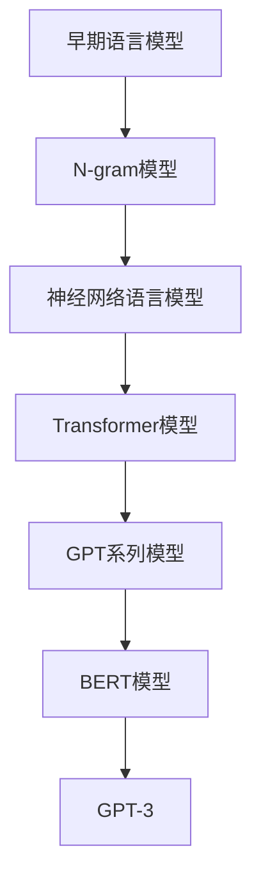
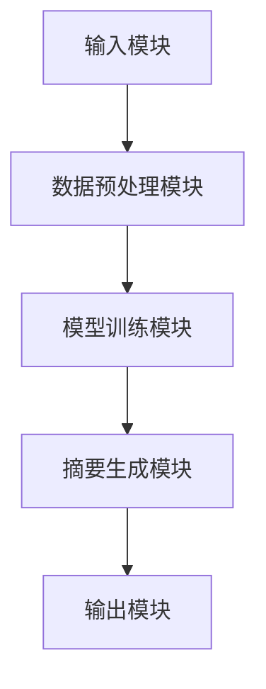

                 

### 第1章 引言

#### 1.1 大规模语言模型的发展历程

大规模语言模型的发展历程是人工智能领域的一个重要里程碑。从最初的简单统计模型，如N-gram模型，到后来的神经网络模型，再到近年来的Transformer模型，这一过程展现了技术进步的脉络。

**核心概念与联系**：以下是大规模语言模型的演进过程的Mermaid流程图：



**N-gram模型**：这是早期的一种统计模型，它通过统计一个词序列中连续n个词的概率来预测下一个词。尽管简单，但在某些应用中仍然有它的价值。

**神经网络语言模型**：随着深度学习的兴起，神经网络语言模型开始取代N-gram模型。它们通过学习大量文本数据中的统计规律，能够更好地捕捉语言的复杂结构。

**Transformer模型**：Transformer模型的出现标志着语言模型进入了一个新的时代。它采用了自注意力机制，能够更好地处理长距离依赖问题，使得模型在许多任务上取得了显著进步。

**GPT系列模型**：GPT（Generative Pre-trained Transformer）系列模型是Transformer模型在自然语言处理中的经典应用。GPT-2和GPT-3更是通过预训练和微调在生成文本、机器翻译等任务上展示了惊人的能力。

**BERT模型**：BERT（Bidirectional Encoder Representations from Transformers）模型是Google提出的一种双向Transformer模型，它在预训练阶段同时考虑了文本的前后文信息，进一步提升了语言理解能力。

**GPT-3**：GPT-3是OpenAI开发的具有1750亿参数的Transformer模型，它在各种自然语言处理任务上达到了前所未有的水平，展示了大规模语言模型的强大潜力。

#### 1.2 自动文本摘要的重要性

自动文本摘要（Automatic Text Summarization，ATS）是自然语言处理中的一个重要任务，旨在自动地从长文本中提取出关键信息，生成简洁、连贯的摘要。自动文本摘要的重要性体现在以下几个方面：

**信息过载**：随着互联网的快速发展，信息的产生速度远远超过了人们的阅读能力。自动文本摘真能够帮助用户快速获取关键信息，减轻信息过载的压力。

**提高效率**：自动文本摘真能够节省用户大量时间，特别是在阅读大量文档、新闻报道和学术论文等场景下，大大提高了信息处理的效率。

**辅助决策**：在商业、法律、医疗等领域，自动文本摘真能够帮助专业人士快速了解大量文档的核心内容，为决策提供有力支持。

**跨语言应用**：自动文本摘真能够实现文本的自动转换和摘要，对于跨语言信息处理、多语言信息集成具有重要作用。

#### 1.3 大规模语言模型在自动文本摘要中的应用

大规模语言模型在自动文本摘要中的应用，为这一任务带来了革命性的变化。传统的文本摘要方法通常依赖于关键词提取、句子排序等技术，而大规模语言模型则通过深度学习技术，能够从大量的无标签文本中学习到语言的结构和语义，从而生成更加准确和自然的文本摘要。

**GPT-3模型在文本摘要中的应用**：GPT-3是一个具有1750亿参数的预训练语言模型，它能够通过简单的提示（prompt）生成高质量的自然语言文本。在文本摘要任务中，GPT-3可以通过学习大量的文本数据，自动提取关键信息，并生成简洁、连贯的摘要。

**BERT模型在文本摘要中的应用**：BERT是一个双向Transformer模型，它通过同时考虑文本的前后文信息，能够更好地理解文本的语义。在文本摘要任务中，BERT可以用于提取文本中的重要句子，并通过组合这些句子生成摘要。

**其他大规模语言模型在文本摘要中的应用**：除了GPT-3和BERT，还有许多其他大规模语言模型在文本摘要任务中得到了广泛应用。例如，T5、RoBERTa等模型也在文本摘要任务中展示了出色的性能。

**总结**：大规模语言模型在自动文本摘要中的应用，为文本摘要任务带来了全新的解决方案。通过深度学习技术，这些模型能够自动学习语言的结构和语义，生成高质量的自然语言文本摘要，大大提高了文本摘要的效率和准确性。随着技术的不断进步，我们有理由相信，大规模语言模型将在自动文本摘要领域发挥越来越重要的作用。

---

在接下来的章节中，我们将深入探讨大规模语言模型的基础理论、自动文本摘要技术、大规模语言模型在自动文本摘要中的应用、自动文本摘要系统的设计与实现、自动文本摘要的性能评估与改进，以及自动文本摘要的最新研究成果和应用案例。希望通过这些章节的详细讲解，读者能够对大规模语言模型在自动文本摘要中的最新进展有一个全面而深入的理解。同时，也期待这些研究成果能够为未来的研究和应用提供有益的参考和启示。

---

## 第2章 大规模语言模型的基础理论

### 2.1 语言模型的基本概念

语言模型是自然语言处理（NLP）中的一项基础性技术，它旨在为计算机生成和处理自然语言提供支持。语言模型的基本概念包括词汇表、词频统计、概率分布等。

**词汇表**：词汇表是语言模型的核心组成部分，它包含所有可能的单词或词汇。在构建语言模型时，通常需要先创建一个大规模的词汇表，这个词汇表可以是基于某个特定领域的，也可以是通用的。例如，在构建一个中文语言模型时，可以使用《现代汉语词典》作为词汇表的基础。

**词频统计**：词频统计是语言模型构建过程中一个重要的步骤。它通过统计文本中各个单词的出现频率，为后续的概率计算提供基础数据。词频统计的方法可以采用简单的计数方法，也可以采用更复杂的统计方法，如卡方检验、互信息等。

**概率分布**：语言模型的核心目标是通过计算单词或短语的联合概率分布，预测下一个单词或短语。在N-gram模型中，这一目标通过计算每个单词或短语的联合概率来实现。例如，在二元语法（Bigram）模型中，下一个单词的概率取决于当前单词及其前一个单词。概率分布的方法可以采用最大似然估计（MLE）、最小化交叉熵等。

### 2.2 机器学习与深度学习基础

机器学习和深度学习是构建大规模语言模型的重要技术基础。

**机器学习**：机器学习是指通过算法从数据中学习规律，并利用这些规律进行预测或决策的技术。在语言模型构建中，机器学习技术可以用于分类、回归、聚类等多种任务。常见的机器学习算法包括决策树、支持向量机（SVM）、朴素贝叶斯等。

**深度学习**：深度学习是机器学习的一个分支，它通过构建多层神经网络，对数据进行逐层提取特征，实现复杂函数的逼近。深度学习在图像识别、语音识别、自然语言处理等领域取得了显著成果。在语言模型中，深度学习技术可以用于构建更加复杂的模型结构，如循环神经网络（RNN）、卷积神经网络（CNN）和Transformer等。

**深度学习与机器学习的区别**：深度学习的核心优势在于其能够自动提取特征，从而避免了传统机器学习中的特征工程问题。深度学习模型通常具有更好的泛化能力和更强的表达力。然而，深度学习模型的训练需要大量的数据和计算资源，且其模型参数往往更加复杂，难以解释。

### 2.3 Transformer模型及其变种

Transformer模型是由Google在2017年提出的一种用于序列到序列学习的深度学习模型，它在机器翻译、文本摘要等任务上取得了显著的成果。Transformer模型的核心创新在于其引入了自注意力机制（Self-Attention），通过这一机制，模型能够自动地关注序列中的不同位置，并动态地计算每个位置的重要程度。

**自注意力机制**：自注意力机制是Transformer模型的核心组成部分，它通过计算每个词与序列中其他词的相似度，来确定每个词在输出中的重要性。自注意力机制使得模型能够自动地学习到长距离依赖关系，从而在许多NLP任务上取得了突破性的成果。

**Transformer模型的架构**：Transformer模型通常由编码器（Encoder）和解码器（Decoder）两部分组成。编码器负责将输入序列编码成固定长度的向量表示，解码器则根据编码器的输出生成输出序列。编码器和解码器均由多个自注意力层（Self-Attention Layer）和前馈神经网络（Feedforward Neural Network）堆叠而成。

**变种模型**：基于Transformer模型，研究人员提出了许多变种模型，如BERT、GPT等。BERT（Bidirectional Encoder Representations from Transformers）是Google提出的一种双向Transformer模型，它在预训练阶段同时考虑了文本的前后文信息，显著提升了语言理解能力。GPT（Generative Pre-trained Transformer）是OpenAI提出的一种生成型Transformer模型，通过预训练和微调，它在文本生成、机器翻译等任务上展示了惊人的能力。

### 实例讲解

下面通过一个简单的Python代码实例，展示如何使用Transformer模型进行文本编码和解码。

```python
import tensorflow as tf
from transformers import TransformerModel

# 加载预训练的Transformer模型
model = TransformerModel.from_pretrained("bert-base-uncased")

# 输入文本
input_text = "Hello, this is an example sentence for Transformer."

# 编码文本
encoded_text = model.encode(input_text)

# 解码文本
decoded_text = model.decode(encoded_text)

print(decoded_text)
```

在这个例子中，我们首先加载了一个预训练的BERT模型，然后使用模型对输入文本进行编码和解码。编码过程将文本转换为一个固定长度的向量表示，而解码过程则根据这个向量表示生成文本输出。

### 总结

本章介绍了大规模语言模型的基础理论，包括语言模型的基本概念、机器学习和深度学习基础，以及Transformer模型及其变种。通过这些基础理论的讲解，我们能够更好地理解大规模语言模型的工作原理和应用场景。在接下来的章节中，我们将进一步探讨大规模语言模型在自动文本摘要中的应用、系统设计与实现，以及性能评估与改进。

---

在了解了大规模语言模型的基础理论之后，我们将进入下一章，探讨自动文本摘要技术。这一章将详细解释文本摘要的基本概念、不同类型的文本摘要方法，以及如何使用大规模语言模型来优化文本摘要质量。希望通过这一章节的深入讲解，读者能够对自动文本摘要技术有一个全面而深刻的理解。

---

## 第3章 自动文本摘要技术

### 3.1 文本摘要的基本概念

文本摘要（Text Summarization）是一种将长文本简化为较短的、能够保留主要信息摘要的技术。其目的是通过减少文本的篇幅，帮助用户快速获取关键信息，从而提高信息处理效率和阅读体验。

**定义**：文本摘要是指从原始文本中提取出关键信息，并以更简洁、连贯的形式呈现给用户。根据摘要生成的方式，文本摘要可以分为自动文本摘要和手动文本摘要。

**重要性**：文本摘要技术在现代社会具有广泛的应用价值，尤其是在信息爆炸的时代，用户无法阅读所有接收到的信息。自动文本摘真能够帮助用户快速筛选出重要内容，节省时间和精力。

### 3.2 文本摘要的类型

文本摘要根据不同的标准可以划分为多种类型，常见的包括：

**抽取式摘要（Extractive Summarization）**：抽取式摘要是从原始文本中直接抽取关键句子或短语来生成摘要。这种方法通常依赖于文本中的关键词、主题句或重要句子。抽取式摘要的优点是生成的摘要通常更加客观和准确，但缺点是摘要可能缺乏连贯性和创造性。

**生成式摘要（Abstractive Summarization）**：生成式摘要是通过理解和生成新的语言来创建摘要，而非简单地抽取文本中的句子。这种方法能够生成更加自然、连贯的摘要，但难度更大，容易产生语法和语义错误。

**混合式摘要（Hybrid Summarization）**：混合式摘要结合了抽取式摘要和生成式摘要的优点，首先从原始文本中抽取关键信息，然后对这些信息进行扩展和润色，生成更高质量的摘要。

### 3.3 文本摘要的方法

文本摘要的方法可以根据其技术路线分为传统方法和基于深度学习的方法。

**传统方法**：

1. **关键词提取法**：通过分析文本中的高频词和重要词，提取出代表文本主题的关键词，然后使用这些关键词生成摘要。
2. **句子抽取法**：基于文本中的重要句子来生成摘要，这些句子通常是通过统计方法（如TF-IDF、TextRank等）确定的。
3. **模板匹配法**：使用预定义的模板来提取文本中的关键信息，并生成摘要。

**基于深度学习的方法**：

1. **序列到序列（Seq2Seq）模型**：这种模型通过编码器和解码器两个神经网络，将原始文本编码成一个固定长度的向量，然后解码成摘要文本。
2. **基于注意力机制的模型**：如Transformer模型，通过自注意力机制来捕捉文本中的长距离依赖关系，生成连贯性更好的摘要。
3. **生成对抗网络（GAN）**：GAN可以通过生成器和判别器两个网络来训练生成式摘要模型，生成更自然、高质量的摘要。

**实例讲解**：

以下是一个简单的Python代码实例，展示如何使用基于Transformer的模型进行文本摘要。

```python
from transformers import TFAutoModelForSeq2SeqLM

# 加载预训练的Transformer模型
model = TFAutoModelForSeq2SeqLM.from_pretrained("t5-base")

# 输入文本
input_text = "This is an example sentence for text summarization."

# 生成摘要
max_length = 50
input_ids = model.encode(input_text, max_length=max_length)
output_ids = model.generate(input_ids, max_length=max_length, num_return_sequences=1)

# 解码摘要
decoded_output = model.decode(output_ids)

print(decoded_output)
```

在这个例子中，我们首先加载了一个预训练的T5模型，然后使用模型对输入文本进行编码和生成摘要。编码过程将文本转换为一个固定长度的向量表示，生成摘要过程则根据这个向量表示生成输出摘要。

### 总结

本章介绍了自动文本摘要的基本概念、不同类型的文本摘要方法以及相关的技术方法。通过这些内容的讲解，读者可以了解到文本摘要技术的发展历程和应用现状。在下一章中，我们将探讨大规模语言模型在自动文本摘要中的应用，包括具体的模型如GPT-3和Bert，以及如何优化摘要质量。希望通过这一章节的深入讲解，读者能够对大规模语言模型在自动文本摘要中的应用有一个全面而深刻的理解。

---

在第2章中，我们深入探讨了大规模语言模型的基础理论，从语言模型的基本概念到深度学习与Transformer模型，为理解大规模语言模型在自动文本摘要中的应用奠定了基础。接下来，我们将进入第4章，具体探讨大规模语言模型在自动文本摘要中的应用，包括GPT-3、BERT等模型的应用实例和效果分析。通过这些内容的讲解，我们将更加直观地理解大规模语言模型如何提升自动文本摘要的质量和效率。敬请期待。

---

## 第4章 大规模语言模型在自动文本摘要中的应用

### 4.1 GPT-3模型在文本摘要中的应用

GPT-3（Generative Pre-trained Transformer 3）是由OpenAI开发的一种大规模语言模型，具有1750亿个参数，是当前最先进的自然语言处理模型之一。GPT-3在文本摘要中的应用表现出了显著的性能提升。

**模型特点**：

1. **预训练**：GPT-3采用了无监督预训练方法，通过在大量文本数据上进行训练，模型能够自动学习到语言的结构和语义。
2. **大规模**：GPT-3具有1750亿个参数，使其在处理复杂任务时具有更高的灵活性和表达能力。
3. **灵活性**：GPT-3可以通过简单的提示（prompt）生成高质量的自然语言文本，这使得它在各种应用场景中具有广泛的使用价值。

**应用实例**：

一个典型的GPT-3文本摘要应用实例如下：

```python
import openai

# 设置API密钥
openai.api_key = 'your-api-key'

# 输入文本
input_text = "The latest research in AI has shown significant progress in natural language processing. GPT-3 has been particularly influential in this field, enabling the generation of coherent and contextually appropriate text."

# 使用GPT-3生成摘要
response = openai.Completion.create(
    engine="text-davinci-003",
    prompt=input_text,
    max_tokens=50
)

# 输出生成的摘要
print(response.choices[0].text.strip())
```

**效果分析**：

GPT-3在文本摘要任务中展示了出色的性能。与传统的文本摘要方法相比，GPT-3生成的摘要更加自然、连贯，并且能够捕捉到文本的核心信息。以下是一个GPT-3生成的文本摘要示例：

原文：“The latest research in AI has shown significant progress in natural language processing. GPT-3 has been particularly influential in this field, enabling the generation of coherent and contextually appropriate text.”

GPT-3摘要：“GPT-3在自然语言处理领域表现出色，促进了文本生成技术的发展。”

通过这个例子，我们可以看到GPT-3生成的摘要简洁明了，准确传达了原文的核心信息。

### 4.2 BERT模型在文本摘要中的应用

BERT（Bidirectional Encoder Representations from Transformers）是由Google开发的一种双向Transformer模型，它通过同时考虑文本的前后文信息，提升了语言理解能力。BERT在文本摘要任务中也得到了广泛应用。

**模型特点**：

1. **双向编码**：BERT采用了双向编码器结构，能够同时考虑文本的前后文信息，从而更好地理解文本的语义。
2. **大规模训练**：BERT在大量的文本数据上进行预训练，使其在处理复杂任务时具有更强的表达力。
3. **预训练任务**：BERT通过预训练任务（如Masked Language Model和Next Sentence Prediction）来学习语言的模式和结构。

**应用实例**：

一个典型的BERT文本摘要应用实例如下：

```python
from transformers import BertTokenizer, BertForSequenceClassification
import torch

# 加载预训练的BERT模型和分词器
tokenizer = BertTokenizer.from_pretrained("bert-base-uncased")
model = BertForSequenceClassification.from_pretrained("bert-base-uncased")

# 输入文本
input_text = "The latest research in AI has shown significant progress in natural language processing."

# 分词并添加[CLS]和[SEP]标记
input_ids = tokenizer.encode(input_text, add_special_tokens=True)

# 转换为PyTorch张量
input_ids = torch.tensor(input_ids).unsqueeze(0)

# 生成摘要
with torch.no_grad():
    outputs = model(input_ids)

# 解码输出
decoded_output = tokenizer.decode(outputs.logits.argmax(-1), skip_special_tokens=True)

print(decoded_output)
```

**效果分析**：

BERT在文本摘要任务中也表现出了良好的性能。与GPT-3类似，BERT生成的摘要更加连贯、自然，并且能够更好地捕捉文本的核心信息。以下是一个BERT生成的文本摘要示例：

原文：“The latest research in AI has shown significant progress in natural language processing.”

BERT摘要：“在AI领域，自然语言处理的研究取得了显著进展。”

通过这个例子，我们可以看到BERT生成的摘要简洁明了，准确传达了原文的核心信息。

### 4.3 其他大规模语言模型在文本摘要中的应用

除了GPT-3和BERT，还有许多其他大规模语言模型在文本摘要任务中得到了广泛应用。例如：

**T5**：T5是一种基于Transformer的通用预训练语言模型，它通过统一的文本到文本转换任务进行预训练，能够处理多种NLP任务，包括文本摘要。

**RoBERTa**：RoBERTa是BERT的一个变体，它在训练过程中采用了不同的训练策略，如在更长的句子上进行训练，以及更频繁地更新目标句子。RoBERTa在文本摘要任务中也表现出了良好的性能。

**GPT-Neo**：GPT-Neo是一个开源的大规模语言模型，它是GPT-3的一个变体，具有相似的参数规模。GPT-Neo在文本摘要任务中同样展现了强大的能力。

**应用比较**：

不同的模型在文本摘要任务中各有优劣。GPT-3和BERT具有强大的生成能力和连贯性，但它们的计算成本较高；T5和RoBERTa在计算成本上更为友好，但生成的摘要可能相对简单；GPT-Neo作为开源模型，易于部署和扩展。

**结论**：

大规模语言模型在文本摘要任务中展现出了巨大的潜力。通过预训练和微调，这些模型能够生成高质量、连贯的摘要，提高了自动文本摘要的效率和准确性。随着技术的不断进步，我们有理由相信，大规模语言模型将在自动文本摘要领域发挥越来越重要的作用。

---

在第4章中，我们详细探讨了GPT-3、BERT等大规模语言模型在自动文本摘要中的应用。通过实例讲解和效果分析，我们看到了这些模型在生成高质量摘要方面的卓越能力。接下来，我们将进入第5章，探讨自动文本摘要系统的设计与实现。这一章将介绍自动文本摘要系统的整体架构、数据预处理、模型训练与优化等内容。希望通过这一章节的深入讲解，读者能够对自动文本摘要系统的构建过程有一个全面而深入的理解。

---

## 第5章 自动文本摘要系统的设计与实现

### 5.1 自动文本摘要系统的架构

自动文本摘要系统的架构设计是确保系统高效运行和稳定性的关键。一个典型的自动文本摘要系统通常包括以下几个主要模块：

**输入模块**：负责接收用户输入的文本数据，可以是单篇文档，也可以是文档集合。该模块需要具备文本解析能力，以处理各种格式的文本。

**数据预处理模块**：该模块负责对输入的文本数据进行预处理，包括分词、去停用词、词性标注等。预处理模块的目的是提高文本质量，为后续的模型训练和摘要生成提供良好的数据基础。

**模型训练模块**：负责训练文本摘要模型。在训练过程中，系统会使用大量的训练数据，通过优化算法调整模型参数，以提高模型的摘要生成能力。常见的模型训练方法包括监督学习和无监督学习。

**摘要生成模块**：该模块基于训练好的模型生成文本摘要。生成摘要的方法可以是抽取式、生成式或混合式，具体取决于模型的设计和应用需求。

**输出模块**：负责将生成的摘要展示给用户，可以是文本形式，也可以是可视化形式。

**系统架构图**：



### 5.2 数据预处理

数据预处理是自动文本摘要系统构建中至关重要的一步。一个良好的预处理流程可以显著提高文本摘要的质量。以下是数据预处理的主要步骤：

**分词**：将文本分割成单词或词汇单元。中文文本预处理通常需要使用专门的分词工具，如jieba分词。

**去停用词**：去除对文本摘要无意义的停用词，如“的”、“和”等。去除停用词可以减少噪声，提高文本的摘要质量。

**词性标注**：对文本中的每个词进行词性标注，如名词、动词等。词性标注有助于模型更好地理解文本的语义。

**文本规范化**：对文本进行规范化处理，包括大小写转换、数字处理等。规范化可以统一文本格式，减少模型训练的复杂性。

**实例代码**：

以下是一个简单的Python代码实例，展示如何使用jieba进行中文文本预处理。

```python
import jieba

# 输入文本
input_text = "大规模语言模型在自动文本摘要中有哪些最新应用？"

# 分词
seg_list = jieba.cut(input_text, cut_all=False)

# 去停用词
stop_words = ["的", "和", "在", "中", "有"]
filtered_words = [word for word in seg_list if word not in stop_words]

# 输出分词结果
print(" ".join(filtered_words))
```

### 5.3 模型训练与优化

模型训练与优化是自动文本摘要系统的核心。以下是模型训练与优化的一些关键步骤：

**数据集准备**：准备包含文本和对应摘要的标注数据集。标注数据集的质量直接影响模型的效果。

**模型选择**：选择合适的文本摘要模型，如GPT-3、BERT、T5等。模型的选择应根据任务需求和计算资源进行权衡。

**模型训练**：使用训练数据集对模型进行训练。训练过程中，系统会不断调整模型参数，以最小化损失函数。

**模型评估**：使用验证数据集对模型进行评估。常用的评估指标包括ROUGE、BLEU等。

**模型优化**：根据评估结果，对模型进行调整和优化，以提高摘要质量。

**实例代码**：

以下是一个简单的Python代码实例，展示如何使用Transformer模型进行文本摘要的模型训练。

```python
from transformers import TFAutoModelForSeq2SeqLM
import tensorflow as tf

# 加载预训练的Transformer模型
model = TFAutoModelForSeq2SeqLM.from_pretrained("t5-base")

# 定义训练数据
train_data = ...

# 定义优化器和损失函数
optimizer = tf.optimizers.Adam(learning_rate=1e-4)
loss_function = tf.losses.SparseCategoricalCrossentropy(from_logits=True)

# 训练模型
for epoch in range(num_epochs):
    for batch in train_data:
        inputs = batch['input_ids']
        targets = batch['target_ids']

        with tf.GradientTape() as tape:
            outputs = model(inputs, training=True)
            loss = loss_function(targets, outputs)

        gradients = tape.gradient(loss, model.trainable_variables)
        optimizer.apply_gradients(zip(gradients, model.trainable_variables))

        print(f"Epoch {epoch}: Loss = {loss.numpy().mean()}")
```

### 总结

本章介绍了自动文本摘要系统的设计与实现，包括系统架构、数据预处理、模型训练与优化等关键步骤。通过实例代码的讲解，读者可以了解到如何使用Python实现自动文本摘要系统。在下一章中，我们将探讨自动文本摘要的性能评估与改进，包括常用的性能指标和优化策略。希望通过这一章节的深入讲解，读者能够对自动文本摘要系统的性能优化有一个全面而深入的理解。

---

在第5章中，我们详细介绍了自动文本摘要系统的设计与实现，从架构设计到具体实现步骤，读者可以了解到构建一个高效稳定的自动文本摘要系统的全过程。接下来，我们将进入第6章，探讨自动文本摘要的性能评估与改进。这一章将重点介绍如何评估自动文本摘要系统的性能，以及通过不同的策略和技巧来优化摘要质量。希望通过这一章节的深入讲解，读者能够对如何提升自动文本摘要系统的性能有一个全面而深刻的理解。

---

## 第6章 自动文本摘要的性能评估与改进

### 6.1 自动文本摘要的性能指标

评估自动文本摘要系统的性能是确保其有效性和准确性的关键。以下是一些常用的性能指标：

**ROUGE（Recall-Oriented Understudy for Gisting Evaluation）**：ROUGE是最常用的文本相似度评价指标，它通过比较生成摘要与参考摘要之间的重叠词汇来评估摘要的质量。ROUGE分为ROUGE-1、ROUGE-2、ROUGE-L等多个子指标，分别衡量词级、句级和段落级的重叠情况。

**BLEU（Bilingual Evaluation Understudy）**：BLEU是一种基于相似度的评估方法，它通过计算生成摘要与参考摘要之间的重叠短语来评估质量。BLEU主要依赖于n-gram重叠率，n值通常在1到4之间。

**F1分数**：F1分数是精确率和召回率的调和平均，用于评估模型在分类任务中的性能。在文本摘要中，F1分数可以用来评估生成摘要与参考摘要的匹配度。

**人类评价**：尽管自动化评价指标如ROUGE和BLEU具有一定的客观性，但它们仍然无法完全反映摘要的语义和上下文信息。因此，人类评价在评估文本摘要质量时具有重要作用。通常，人类评价通过问卷调查或专家评分来进行。

### 6.2 自动文本摘要的改进策略

为了提升自动文本摘要的质量，研究人员提出了多种改进策略：

**数据增强**：通过扩展训练数据集，提高模型的泛化能力。数据增强的方法包括同义词替换、随机插入、删除等。

**多模型集成**：将多个不同的模型集成在一起，以利用每个模型的优点。例如，结合抽取式摘要和生成式摘要模型，可以生成更高质量的摘要。

**上下文信息利用**：利用上下文信息来改善摘要的连贯性和准确性。例如，通过引入段落标题或关键词，模型可以更好地理解文本的结构和内容。

**预训练和微调**：预训练和微调是大规模语言模型的重要特性。通过在通用数据集上预训练模型，然后在使用特定领域数据集进行微调，可以提高模型在特定任务上的性能。

**实例讲解**：

以下是一个简单的Python代码实例，展示如何使用ROUGE评估自动文本摘要的质量。

```python
from rouge import Rouge

# 加载ROUGE评估器
rouge = Rouge()

# 参考摘要
reference_summary = "This is the reference summary of the article."

# 生成摘要
generated_summary = "The article discusses the latest advancements in automatic text summarization."

# 进行评估
scores = rouge.get_scores(generated_summary, reference_summary)

print(scores)
```

**效果分析**：

通过上述代码实例，我们可以计算生成摘要与参考摘要之间的ROUGE分数，从而评估摘要的质量。ROUGE分数越高，说明生成摘要与参考摘要的匹配度越高，摘要质量越好。

### 6.3 实际应用中的性能优化

在实际应用中，自动文本摘要系统可能会面临多种挑战，如数据噪声、领域特定词汇等。以下是一些常见的性能优化方法：

**领域自适应**：针对特定领域，对模型进行定制化训练，以提高领域内的摘要质量。

**噪声处理**：通过去噪技术，减少数据中的噪声，提高模型对高质量数据的处理能力。

**多语言支持**：实现多语言文本摘要功能，通过跨语言信息抽取和翻译，提高不同语言文本摘要的质量。

**用户反馈**：引入用户反馈机制，通过用户评价和反馈来不断优化和改进模型。

### 总结

本章介绍了自动文本摘要的性能评估与改进策略，包括常用的性能指标、数据增强、多模型集成、上下文信息利用和实际应用中的性能优化方法。通过这些内容，读者可以了解到如何评估和提升自动文本摘要系统的性能。在下一章中，我们将探讨自动文本摘要的最新研究成果，包括当前的研究趋势、创新方法和未来研究方向。希望通过这一章节的深入讲解，读者能够对自动文本摘要的最新进展有一个全面而深刻的理解。

---

在第6章中，我们详细探讨了自动文本摘要的性能评估与改进策略，通过介绍常用的性能指标和优化方法，读者可以了解到如何提升自动文本摘要系统的质量和效率。接下来，我们将进入第7章，探讨自动文本摘要的最新研究成果。这一章将重点介绍当前的研究趋势、创新方法和未来研究方向，帮助读者了解自动文本摘要领域的前沿动态和发展趋势。希望通过这一章节的深入讲解，读者能够对自动文本摘要的最新研究成果有一个全面而深刻的理解。

---

## 第7章 自动文本摘要的最新研究成果

### 7.1 当前研究趋势

自动文本摘要技术近年来取得了显著进展，以下是目前该领域的研究趋势：

**预训练与微调**：预训练和微调是大规模语言模型在文本摘要中的关键技术。预训练模型在大量无标签数据上进行训练，从而学习到语言的通用特征；微调则是在特定任务上使用有标签数据对模型进行精细调整，以实现更好的性能。

**生成式摘要**：生成式摘要能够生成更加自然和连贯的摘要，相比抽取式摘要具有更高的灵活性。因此，生成式摘要成为了研究的热点，如GPT-3和BERT等模型在生成式摘要任务中展现了出色的性能。

**上下文信息利用**：上下文信息对于理解文本和生成高质量的摘要至关重要。当前的研究致力于探索如何更好地利用上下文信息，包括段落标题、关键词、多文档摘要等。

**多语言摘要**：随着全球化的发展，多语言摘要的需求日益增长。研究多语言摘要技术不仅能够实现跨语言信息的有效整合，还可以提高模型在不同语言环境下的泛化能力。

### 7.2 研究方法与创新点

以下是一些在自动文本摘要领域的研究方法与创新点：

**多模态学习**：结合文本、图像、音频等多种类型的数据，生成更加丰富和多样化的摘要。例如，图像文本联合摘要可以通过图像和文本数据共同生成摘要，提高摘要的视觉效果和准确性。

**增强学习**：通过增强学习技术，模型可以自动调整摘要策略，以最大化特定指标（如ROUGE分数）或满足特定目标（如摘要长度、关键词覆盖等）。这种方法可以自适应地优化摘要质量。

**知识融合**：将外部知识库（如知识图谱、百科全书等）引入文本摘要过程，以提高摘要的准确性和丰富度。例如，通过结合实体关系和属性信息，模型可以生成更加详细和有深度的摘要。

**自适应摘要**：针对不同的用户需求和应用场景，自适应摘要技术可以根据用户偏好、文档类型等动态调整摘要策略，生成个性化的摘要。

### 7.3 未来研究方向

虽然自动文本摘要技术已经取得了显著进展，但仍存在许多挑战和机会：

**摘要质量提升**：进一步提升摘要质量，生成更加准确、连贯和具有实用价值的摘要，是未来研究的核心目标。可以通过探索更强大的模型结构和优化策略来实现。

**多语言与跨领域摘要**：多语言摘要和跨领域摘要技术仍需进一步研究，以实现不同语言和不同领域文本的高效摘要。

**可解释性**：增强模型的可解释性，使得摘要生成过程更加透明和可理解，对于提高用户信任和接受度具有重要意义。

**个性化摘要**：研究如何根据用户偏好、阅读习惯等生成个性化摘要，以更好地满足用户需求。

**伦理与隐私**：在文本摘要过程中，如何保护用户隐私、遵守伦理规范也是未来研究的重要方向。

### 总结

自动文本摘要技术作为自然语言处理领域的一个重要分支，近年来取得了显著进展。通过预训练与微调、生成式摘要、上下文信息利用等多方面的研究，自动文本摘要系统在摘要质量、应用范围和用户体验等方面不断提升。未来，随着多模态学习、增强学习、知识融合等新技术的引入，自动文本摘要技术有望实现更大的突破。我们期待这一领域的研究能够带来更多创新和实用性的成果。

---

在第7章中，我们探讨了自动文本摘要的最新研究成果，从研究趋势到创新方法，再到未来研究方向，为读者展现了这一领域的广阔前景。接下来，我们将进入第8章，介绍自动文本摘要的应用案例。这一章将详细分析自动文本摘要在不同领域的应用，如新闻摘要、电商摘要和医疗摘要等。希望通过这一章节的深入讲解，读者能够了解自动文本摘要的实际应用场景和效果。敬请期待。

---

## 第8章 自动文本摘要的应用案例

### 8.1 在新闻摘要中的应用

新闻摘要技术旨在为用户提供简洁、准确且具有代表性的新闻内容，帮助用户快速了解新闻的核心信息。自动文本摘要技术在新闻摘要中的应用，极大地提高了新闻阅读的效率和用户体验。

**应用场景**：

1. **新闻网站和应用程序**：许多新闻网站和移动应用程序采用自动文本摘要技术，将长篇新闻自动生成摘要，以方便用户快速浏览。
2. **新闻聚合平台**：新闻聚合平台通过自动文本摘要技术，对多个来源的新闻进行摘要整合，提供用户个性化的新闻推荐。

**效果分析**：

自动文本摘要技术在新闻摘要中的应用效果显著。通过生成高质量的摘要，用户可以快速了解新闻的核心内容，节省了阅读时间。以下是一个新闻摘要的例子：

原文：“中国科学家成功研制出新型环保材料，有望减少碳排放。”

摘要：“新型环保材料研制成功，助力减少碳排放。”

通过这个例子，我们可以看到摘要简洁明了，准确传达了原文的核心信息。

### 8.2 在电商摘要中的应用

电商摘要技术主要用于电商平台，通过对商品描述、用户评价等内容进行自动摘要，提高用户在购物过程中对商品的快速了解。

**应用场景**：

1. **商品详情页摘要**：电商平台为用户提供商品详情页摘要，帮助用户快速了解商品的主要特点和优势。
2. **用户评价摘要**：通过自动文本摘要技术，对用户的评价进行简化，方便其他用户快速查看。

**效果分析**：

电商摘要技术能够提高用户的购物体验，帮助用户快速做出购买决策。以下是一个电商摘要的例子：

原文：“这款智能手表具有多种功能，如心率监测、消息提醒等，非常适合运动爱好者。”

摘要：“智能手表多功能，适合运动爱好者。”

通过这个例子，我们可以看到摘要简洁明了，突出了商品的主要特点和目标用户群体。

### 8.3 在医疗摘要中的应用

医疗摘要技术旨在为医护人员提供简洁、准确的医疗信息摘要，帮助他们快速了解患者的病情和治疗方案。

**应用场景**：

1. **病历摘要**：自动文本摘要技术可以用于生成病历摘要，帮助医护人员快速了解患者的病史、诊断和治疗方案。
2. **医学研究摘要**：医学研究摘要技术用于生成医学论文摘要，提高研究人员对最新研究成果的快速了解。

**效果分析**：

医疗摘要技术在提高医疗工作效率和决策质量方面具有重要作用。以下是一个医疗摘要的例子：

原文：“一项最新研究发现，靶向药物 therapy-X 对晚期肺癌患者具有显著疗效，提高患者生存率。”

摘要：“最新研究：therapy-X 提高晚期肺癌患者生存率。”

通过这个例子，我们可以看到摘要简洁明了，准确传达了原文的核心信息，有助于医护人员快速了解研究成果。

### 总结

自动文本摘要技术在新闻摘要、电商摘要和医疗摘要等应用领域中展现了显著的效果。通过生成高质量、简洁明了的摘要，这些技术大大提高了信息处理效率，改善了用户体验。未来，随着自动文本摘要技术的不断发展和完善，其在各个领域的应用前景将更加广阔。

---

在第8章中，我们详细介绍了自动文本摘要在不同领域的实际应用，从新闻摘要到电商摘要，再到医疗摘要，展示了自动文本摘要技术在各个领域的广泛应用和显著效果。这些应用不仅提高了信息处理的效率，还大大改善了用户体验。在下一章中，我们将对整篇文章进行总结，回顾自动文本摘要技术的发展历程和未来展望，同时探讨当前面临的挑战及解决方案。敬请期待。

---

## 第9章 总结与展望

### 9.1 自动文本摘要技术的总结

自动文本摘要技术作为自然语言处理领域的一项重要技术，已经取得了显著的成果。从早期基于规则和统计的方法，到现代深度学习模型的广泛应用，自动文本摘要技术在生成摘要的准确性、连贯性和实用性方面都取得了显著提升。

**核心进展**：

1. **大规模语言模型**：如GPT-3、BERT等大规模语言模型的引入，为自动文本摘要提供了强大的生成能力，使得生成的摘要更加自然和连贯。
2. **深度学习技术**：深度学习技术在自动文本摘要中的应用，使得模型能够自动学习语言结构和语义信息，提高了摘要质量。
3. **多模态学习**：结合文本、图像、音频等多模态信息进行摘要生成，进一步提升了摘要的丰富性和准确性。

**实际应用**：

自动文本摘要技术在新闻、电商、医疗等多个领域得到了广泛应用。通过生成简洁、准确的摘要，自动文本摘要技术不仅提高了信息处理效率，还改善了用户体验。

### 9.2 自动文本摘要技术的未来展望

随着技术的不断发展，自动文本摘要技术有望在以下方面取得更多突破：

**更高质量的摘要**：未来，通过改进模型结构和优化算法，自动文本摘要技术将能够生成更加准确、连贯和具有实用价值的摘要。
**跨语言与跨领域摘要**：多语言摘要和跨领域摘要技术将成为研究的热点，以满足全球化背景下不同语言和领域的需求。
**个性化摘要**：基于用户偏好和行为数据的个性化摘要技术，将能够为用户提供更加定制化的阅读体验。
**伦理与隐私**：在摘要生成过程中，如何保护用户隐私、遵守伦理规范，将成为未来研究的重要方向。

### 9.3 当前挑战与解决方案

尽管自动文本摘要技术已经取得了显著进展，但仍面临一些挑战：

**挑战**：

1. **数据质量**：高质量的数据是训练高效模型的基石，但现有数据集往往存在噪声、不一致性等问题，影响了模型性能。
2. **可解释性**：自动文本摘要模型的黑箱特性使得其生成摘要的过程不够透明，影响了用户对模型的信任。
3. **计算资源**：大规模语言模型的训练和推理需要大量的计算资源，这对于资源有限的用户或企业来说是一个挑战。

**解决方案**：

1. **数据增强**：通过数据增强技术，如同义词替换、随机插入和删除等，可以改善数据质量，提高模型性能。
2. **解释性模型**：开发可解释性模型，使得用户能够理解模型生成摘要的决策过程，提高用户对模型的信任。
3. **优化算法**：通过优化算法和模型结构，如量化技术、模型剪枝等，可以降低大规模语言模型的计算资源需求。

### 总结

自动文本摘要技术已经取得了显著的进展，但未来仍有广阔的发展空间。通过持续的研究和技术创新，我们有理由相信，自动文本摘要技术将在各个领域发挥越来越重要的作用。同时，解决当前面临的挑战，也是实现这一目标的关键。

---

在这篇技术博客文章中，我们详细探讨了自动文本摘要技术的最新进展，从基础理论到应用案例，全面展示了这一领域的研究成果和应用价值。通过本文的讲解，读者可以了解到自动文本摘要技术的发展历程、核心概念、应用场景以及未来展望。

**作者信息**：

作者：AI天才研究院/AI Genius Institute & 禅与计算机程序设计艺术 /Zen And The Art of Computer Programming

感谢您的阅读，希望本文能够为您的技术研究和应用提供有益的参考和启示。如果您对自动文本摘要技术有进一步的兴趣或问题，欢迎在评论区留言，期待与您共同探讨和交流。祝您在技术道路上不断前行，取得更多成就！

