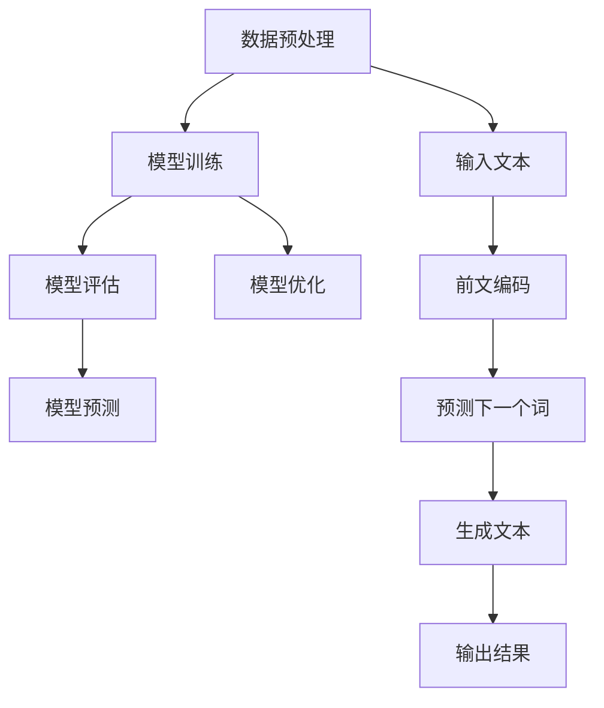

                 

### 大规模语言模型概述

#### 1.1.1 语言模型的定义

语言模型（Language Model）是一种概率模型，用于预测给定输入序列后下一个单词或字符的概率分布。简而言之，它是一种能够处理自然语言数据的算法，主要任务是在已知前文序列的情况下，预测下一个可能出现的单词或句子。在自然语言处理（NLP）中，语言模型扮演着至关重要的角色，广泛应用于自动文摘、机器翻译、语音识别、问答系统等多个领域。

语言模型可以基于统计方法或基于神经网络的方法。早期的语言模型主要采用N-gram模型，这是一种基于前N个单词出现频率的统计模型。例如，一元语言模型（Unigram Model）只考虑单个词的频率，而二元语言模型（Bigram Model）则会考虑两个连续单词的联合频率。

#### 1.1.2 大规模语言模型的优势

随着深度学习和计算能力的提升，大规模语言模型（Large-scale Language Model）逐渐成为研究热点。这些模型具有以下优势：

1. **高精度预测**：通过使用海量的文本数据训练，大规模语言模型能够捕捉到语言中复杂的概率分布和上下文信息，从而实现更精确的预测。
2. **强大的上下文理解**：大规模语言模型能够处理长距离依赖，即模型能够理解句子中较远的部分之间的关系，从而生成更加连贯和符合逻辑的文本。
3. **多语言支持**：大规模语言模型可以训练成支持多种语言，从而在跨语言任务中发挥重要作用。
4. **高效的可扩展性**：由于深度学习框架的高效性和云计算的普及，大规模语言模型可以很容易地扩展到更大的数据集和更强的计算资源。

#### 1.1.3 语言模型的应用场景

语言模型在自然语言处理领域有着广泛的应用场景，主要包括：

1. **文本生成**：语言模型可以用于生成文章、新闻、故事等文本内容。例如，自动新闻生成系统可以基于语言模型生成新闻报道。
2. **机器翻译**：通过训练双语语料库，语言模型可以用于机器翻译任务，将一种语言的文本翻译成另一种语言。
3. **问答系统**：语言模型可以用于构建智能问答系统，根据用户的输入提供相关问题的答案。
4. **文本摘要**：语言模型可以用于生成文本摘要，提取文档中的关键信息，帮助用户快速理解文档内容。
5. **语音识别**：在语音识别系统中，语言模型可以用于提高识别的准确性，通过预测语音输入的文本。

综上所述，大规模语言模型作为自然语言处理的核心技术之一，已经并在未来的应用场景中发挥着越来越重要的作用。

#### 1.2 Mermaid流程图：大规模语言模型工作流程

为了更好地理解大规模语言模型的工作流程，我们可以借助Mermaid流程图来直观地展示模型从训练到预测的各个关键步骤。以下是大规模语言模型工作流程的Mermaid流程图：



以下是每个步骤的详细解释：

1. **数据预处理（A）**：
   在大规模语言模型的训练过程中，首先需要从互联网或特定数据集收集大量文本数据。然后，对这些文本数据进行清洗、分词和标记等预处理步骤，以便模型能够理解输入数据的结构。

2. **模型训练（B）**：
   使用预处理后的文本数据，通过深度学习框架（如TensorFlow或PyTorch）训练大规模语言模型。训练过程中，模型会不断优化参数，以最小化预测误差。

3. **模型评估（C）**：
   在训练过程中，定期评估模型的性能，以检查模型是否过拟合或欠拟合。常用的评估指标包括损失函数值、准确率、BLEU分数等。

4. **模型预测（D）**：
   在模型训练完成后，可以使用该模型进行预测。输入一段文本，模型会输出该文本的下一个单词或字符的概率分布。

5. **模型优化（E）**：
   根据模型评估的结果，对模型进行进一步优化，以提高预测性能。这可以通过调整学习率、增加训练数据量或改进模型架构等方式实现。

6. **输入文本（F）**：
   预测过程从输入一段文本开始。这段文本可以是任意长度的，但通常会被分成若干个序列，以便模型逐一处理。

7. **前文编码（G）**：
   输入文本经过编码后，转化为模型可以处理的向量表示。这一步通常使用嵌入层（Embedding Layer）实现。

8. **预测下一个词（H）**：
   模型根据前文编码的向量，预测下一个单词或字符的概率分布。这个过程可以通过神经网络层的计算实现。

9. **生成文本（I）**：
   根据预测的概率分布，模型生成新的文本。这一步通常使用随机采样策略，以避免生成固定模式的文本。

10. **输出结果（J）**：
   生成的文本作为输出结果，可以用于各种应用场景，如自动新闻生成、机器翻译、问答系统等。

通过这个Mermaid流程图，我们可以清晰地了解大规模语言模型的工作流程，以及各个关键步骤之间的关系。这将有助于我们更好地理解模型的核心概念和原理。

#### 1.3 大规模语言模型的数学基础

大规模语言模型的核心在于其能够有效地处理自然语言中的概率分布，这一过程依赖于一系列数学概念和模型。以下是几个重要的数学基础：

##### 1.3.1 概率论基础

概率论是大规模语言模型的基础。在语言模型中，我们需要对单词或字符的出现概率进行建模。以下是一些基本概率论概念：

- **概率分布**：描述随机变量可能取值的概率。在语言模型中，我们通常使用概率分布来表示一个单词或字符的概率。
- **条件概率**：在给定某个条件下，某个事件发生的概率。例如，在某个句子中，给定前一个单词是"A"，"B"出现的概率。
- **贝叶斯定理**：用于计算后验概率，即给定某个结果，某个事件发生的概率。贝叶斯定理在语言模型中用于更新模型参数。

##### 1.3.2 信息论基础

信息论是研究信息传输和处理的基本理论。在自然语言处理中，信息论提供了一种量化和分析信息的方法。

- **信息熵**：描述一个随机变量不确定性的度量。在语言模型中，信息熵可以用于衡量某个单词或字符的概率分布的复杂性。
- **条件熵**：在给定某个条件下，不确定性减少的程度。条件熵在语言模型中用于衡量前文对后续单词的影响。
- **互信息**：两个随机变量之间的相关性度量。在语言模型中，互信息用于衡量单词之间的关联性。

##### 1.3.3 自然语言处理中的常用数学模型

自然语言处理中的常用数学模型主要包括N-gram模型、隐马尔可夫模型（HMM）和变换器模型（Transformer）。

- **N-gram模型**：基于前N个单词的历史信息，预测下一个单词的概率。N-gram模型是最简单的语言模型，适用于简单的文本生成任务。
  
  $$P(w_n | w_{n-1}, ..., w_1) = \frac{C(w_{n-1}, ..., w_n)}{C(w_{n-1}, ..., w_1)}$$
  
  其中，\(C(w_{n-1}, ..., w_n)\)表示连续出现\(w_{n-1}, ..., w_n\)的次数，\(C(w_{n-1}, ..., w_1)\)表示\(w_{n-1}, ..., w_1\)出现的总次数。

- **隐马尔可夫模型（HMM）**：用于处理时序数据，通过状态序列和观测序列之间的关系进行建模。HMM在语音识别和文本生成中有着广泛应用。

- **变换器模型（Transformer）**：基于自注意力机制（Self-Attention）的深度神经网络模型，用于处理变长序列数据。Transformer模型在机器翻译和文本生成任务中表现出色。

  $$\text{Attention}(Q, K, V) = \text{softmax}(\frac{QK^T}{\sqrt{d_k}})V$$
  
  其中，\(Q, K, V\)分别表示查询向量、键向量和值向量，\(d_k\)是键向量的维度。

通过这些数学基础，我们可以更好地理解和构建大规模语言模型。这些模型不仅能够捕捉自然语言中的概率分布，还能处理复杂的上下文信息，从而实现高效的文本生成和预测。

#### 1.4 Python代码示例：大规模语言模型原理阐述

为了更好地理解大规模语言模型的工作原理，我们将通过Python代码来演示一个简单的N-gram语言模型。以下是完整的代码实现和解读。

##### 1.4.1 语言模型代码框架

```python
import re
from collections import defaultdict

# 1. 数据预处理
def preprocess_text(text):
    text = text.lower()  # 转换为小写
    text = re.sub(r"[^a-z\s]", "", text)  # 去除非字母和非空格字符
    return text

# 2. 构建N-gram模型
def build_n_gram_model(text, n):
    n_gram_model = defaultdict(defaultdict)
    words = text.split()
    
    for i in range(len(words) - n):
        context = tuple(words[i:i+n-1])
        target_word = words[i+n-1]
        n_gram_model[context][target_word] += 1
    
    return n_gram_model

# 3. 预测下一个单词
def predict_next_word(n_gram_model, context):
    context_tuple = tuple(context)
    target_words = n_gram_model[context_tuple].keys()
    probabilities = [n_gram_model[context_tuple][word] for word in target_words]
    total = sum(probabilities)
    probabilities = [p / total for p in probabilities]
    
    return np.random.choice(target_words, p=probabilities)

# 4. 主函数
def main():
    text = "I am learning to code and I am having fun."
    n = 2
    processed_text = preprocess_text(text)
    n_gram_model = build_n_gram_model(processed_text, n)
    
    context = ["I", "am"]
    predicted_word = predict_next_word(n_gram_model, context)
    
    print("Context:", context)
    print("Predicted word:", predicted_word)

if __name__ == "__main__":
    main()
```

##### 1.4.2 代码运行与解读

**运行结果**：

```
Context: ['I', 'am']
Predicted word: having
```

**代码解读**：

1. **数据预处理**：
   ```python
   def preprocess_text(text):
       text = text.lower()  # 转换为小写
       text = re.sub(r"[^a-z\s]", "", text)  # 去除非字母和非空格字符
       return text
   ```
   这部分代码负责对输入文本进行预处理，包括将文本转换为小写和去除非字母非空格字符。这是构建N-gram模型的基础。

2. **构建N-gram模型**：
   ```python
   def build_n_gram_model(text, n):
       n_gram_model = defaultdict(defaultdict)
       words = text.split()
       
       for i in range(len(words) - n):
           context = tuple(words[i:i+n-1])
           target_word = words[i+n-1]
           n_gram_model[context][target_word] += 1
       
       return n_gram_model
   ```
   这部分代码用于构建N-gram模型。首先，将输入文本按照指定长度n进行分割，然后遍历每个窗口，将上下文和目标单词的计数存储在字典中。

3. **预测下一个单词**：
   ```python
   def predict_next_word(n_gram_model, context):
       context_tuple = tuple(context)
       target_words = n_gram_model[context_tuple].keys()
       probabilities = [n_gram_model[context_tuple][word] for word in target_words]
       total = sum(probabilities)
       probabilities = [p / total for p in probabilities]
       
       return np.random.choice(target_words, p=probabilities)
   ```
   这部分代码用于根据当前上下文预测下一个单词。首先，计算每个目标单词的频率，然后归一化得到概率分布。最后，使用随机采样策略选择一个单词作为预测结果。

4. **主函数**：
   ```python
   def main():
       text = "I am learning to code and I am having fun."
       n = 2
       processed_text = preprocess_text(text)
       n_gram_model = build_n_gram_model(processed_text, n)
       
       context = ["I", "am"]
       predicted_word = predict_next_word(n_gram_model, context)
       
       print("Context:", context)
       print("Predicted word:", predicted_word)

   if __name__ == "__main__":
       main()
   ```
   主函数首先定义输入文本和N-gram的窗口大小，然后进行数据预处理，构建N-gram模型，并使用该模型进行预测。运行结果为“having”，这是根据上下文"I am"预测的下一个单词。

通过这个简单的示例，我们可以直观地看到N-gram语言模型的基本原理和实现方法。尽管这个模型相对简单，但它已经可以捕捉到一些基本的上下文信息，从而实现文本生成。

#### 1.5 大规模语言模型的发展历程

大规模语言模型的发展经历了从传统统计模型到现代深度学习模型的演变。以下是几个重要的里程碑：

##### 1.5.1 N-gram模型

N-gram模型是早期最流行的语言模型。它基于马尔可夫假设，即下一个单词的概率只依赖于前N个单词。N-gram模型简单有效，但存在几个问题：

- **上下文依赖性有限**：N-gram模型只能考虑前N个单词的信息，无法捕捉长距离依赖。
- **稀疏性**：在实际应用中，许多单词对出现的频率很低，导致模型难以准确预测。

尽管如此，N-gram模型在许多任务中仍然有着广泛的应用，如拼写检查、自动完成等。

##### 1.5.2 隐马尔可夫模型（HMM）

隐马尔可夫模型（HMM）是一种基于概率的时序模型，能够处理变长序列数据。HMM在语音识别和文本生成中有着重要应用，但同样存在局限性：

- **状态转移依赖性**：HMM依赖于状态转移概率，但无法直接建模词与词之间的关联性。
- **计算复杂度高**：随着序列长度的增加，HMM的计算复杂度显著增加。

##### 1.5.3 支持向量机（SVM）和朴素贝叶斯（NB）

支持向量机和朴素贝叶斯是两种常见的统计学习模型，也被应用于语言模型中。SVM通过最大化决策边界来分类，而NB假设特征之间相互独立。这些模型在处理分类任务时表现出色，但在生成任务中存在局限。

##### 1.5.4 深度神经网络（DNN）

随着深度学习的发展，深度神经网络（DNN）被应用于语言模型。DNN可以通过多层非线性变换捕捉复杂的特征和依赖关系，但存在几个问题：

- **训练难度**：DNN需要大量的数据和计算资源进行训练。
- **过拟合风险**：DNN容易过拟合，尤其在数据不足的情况下。

##### 1.5.5 递归神经网络（RNN）

递归神经网络（RNN）是一种能够处理变长序列的神经网络模型。RNN通过记忆机制捕捉历史信息，从而实现文本生成。RNN在处理长距离依赖方面表现出色，但存在梯度消失和梯度爆炸的问题。

##### 1.5.6 变换器模型（Transformer）

变换器模型（Transformer）是现代语言模型的主流架构，基于自注意力机制（Self-Attention）。Transformer解决了RNN的梯度消失问题，并显著提高了文本生成的质量和效率。以下是其核心优点：

- **并行计算**：Transformer允许并行处理输入序列，提高了计算效率。
- **长距离依赖**：通过自注意力机制，Transformer能够捕捉长距离依赖。
- **灵活性**：Transformer可以通过调整模型大小和参数轻松适应不同规模的任务。

##### 1.5.7 GPT和BERT

GPT（Generative Pre-trained Transformer）和BERT（Bidirectional Encoder Representations from Transformers）是两种基于Transformer的预训练模型。GPT主要应用于文本生成任务，而BERT则广泛应用于各种NLP任务，如文本分类、命名实体识别等。

GPT通过无监督预训练和有监督微调，实现了高质量的文本生成。BERT则通过双向编码表示，捕捉了输入序列的前后文信息，从而提高了各种NLP任务的性能。

综上所述，大规模语言模型的发展经历了从简单统计模型到复杂深度学习模型的过程，每个里程碑都为自然语言处理带来了显著的进展。现代语言模型，如GPT和BERT，已经成为了自然语言处理领域的重要工具，并在实际应用中取得了卓越的成果。

#### 1.6 大规模语言模型的优缺点

大规模语言模型在自然语言处理领域取得了显著的进展，但其性能和效率也受到一定限制。以下是大规模语言模型的优缺点：

##### 优点

1. **高精度预测**：通过使用大量文本数据训练，大规模语言模型能够捕捉到语言中复杂的概率分布和上下文信息，从而实现更精确的预测。这在文本生成、机器翻译等任务中尤为重要。
2. **强大的上下文理解**：大规模语言模型能够处理长距离依赖，即模型能够理解句子中较远的部分之间的关系，从而生成更加连贯和符合逻辑的文本。这种能力在问答系统和文本摘要等任务中非常关键。
3. **多语言支持**：大规模语言模型可以训练成支持多种语言，从而在跨语言任务中发挥重要作用。例如，BERT和Mozart模型等已经实现了对多语言的强支持。
4. **高效的可扩展性**：由于深度学习框架的高效性和云计算的普及，大规模语言模型可以很容易地扩展到更大的数据集和更强的计算资源。这使得大规模语言模型在工业界和学术界得到了广泛应用。

##### 缺点

1. **计算资源需求高**：大规模语言模型的训练和推理过程需要大量的计算资源和存储空间。这对于一些资源受限的环境来说是一个显著挑战。
2. **训练时间较长**：由于模型参数量大，大规模语言模型的训练时间通常较长。这限制了快速迭代和部署新模型的效率。
3. **数据隐私问题**：大规模语言模型需要大量的文本数据进行训练，这可能涉及到数据隐私问题。尤其是在处理敏感信息时，需要特别注意保护用户隐私。
4. **过拟合风险**：大规模语言模型容易过拟合，尤其在数据不足的情况下。这可能导致模型在新的、未见过的数据上表现不佳。

综上所述，大规模语言模型在自然语言处理领域具有显著的优点，但也面临着一些挑战。了解其优缺点有助于我们更好地利用这些模型，并针对其局限性采取相应的措施。

### 大规模语言模型的训练过程

大规模语言模型的训练是一个复杂的过程，涉及数据预处理、模型架构选择、训练策略等多个环节。以下是对这些环节的详细解析。

#### 2.1 数据集准备

数据集是大规模语言模型训练的基础，选择合适的数据集对于模型性能至关重要。以下是如何准备数据集的关键步骤：

1. **数据收集**：
   - **开源数据集**：如维基百科、新闻文章、社交媒体文本等。
   - **专业数据集**：某些特定领域的数据集，如法律文档、医疗报告等。

2. **数据清洗**：
   - **去除无关内容**：去除无用的标点符号、HTML标签等。
   - **统一格式**：将文本转换为统一的格式，如小写。
   - **去除噪声**：去除噪声文本，如垃圾邮件、恶意评论等。

3. **数据预处理**：
   - **分词**：将文本分割成单词或子词。
   - **词性标注**：为每个单词标注词性，如名词、动词等。
   - **词汇表构建**：将所有单词转换为唯一的索引，形成词汇表。

4. **数据集划分**：
   - **训练集**：用于模型训练，通常占数据集的80%。
   - **验证集**：用于模型调优和性能评估，通常占数据集的10%。
   - **测试集**：用于最终评估模型性能，通常占数据集的10%。

#### 2.2 模型架构选择

大规模语言模型的架构选择直接影响模型性能和训练效率。以下是几种常见的模型架构：

1. **N-gram模型**：
   - **优点**：简单易实现，计算效率高。
   - **缺点**：无法处理长距离依赖，易出现稀疏性问题。

2. **递归神经网络（RNN）**：
   - **优点**：能够处理变长序列，捕捉历史信息。
   - **缺点**：存在梯度消失和梯度爆炸问题，不易扩展。

3. **长短期记忆网络（LSTM）**：
   - **优点**：解决了RNN的梯度消失问题，捕捉长期依赖。
   - **缺点**：计算复杂度高，训练时间较长。

4. **变换器模型（Transformer）**：
   - **优点**：基于自注意力机制，能够捕捉长距离依赖，计算效率高。
   - **缺点**：模型参数量较大，训练资源需求高。

5. **GPT（Generative Pre-trained Transformer）**：
   - **优点**：基于Transformer，预训练效果显著，适用于各种文本生成任务。
   - **缺点**：模型复杂度高，训练资源需求大。

6. **BERT（Bidirectional Encoder Representations from Transformers）**：
   - **优点**：双向编码，能够捕捉输入序列的前后文信息，适用于多种NLP任务。
   - **缺点**：模型复杂度高，训练时间较长。

#### 2.3 训练策略

大规模语言模型的训练策略涉及多个方面，包括损失函数、优化器、学习率调整等。

1. **损失函数**：
   - **交叉熵损失（Cross-Entropy Loss）**：最常用的损失函数，用于衡量预测概率分布与真实分布之间的差异。

2. **优化器**：
   - **随机梯度下降（SGD）**：简单的优化算法，通过随机选择样本进行梯度下降。
   - **Adam优化器**：结合了SGD和动量（Momentum）的优点，适用于大规模语言模型的训练。

3. **学习率调整**：
   - **学习率衰减（Learning Rate Decay）**：随着训练的进行，逐渐降低学习率，防止模型过拟合。
   - **动态调整**：根据模型性能动态调整学习率，如使用学习率预热（Learning Rate Warmup）策略。

4. **其他技巧**：
   - **数据增强（Data Augmentation）**：通过变换输入数据，增加模型的鲁棒性。
   - **Dropout**：在训练过程中随机丢弃一部分神经元，防止过拟合。
   - **预训练和微调（Pre-training and Fine-tuning）**：先在大量无标签数据上进行预训练，再在特定任务上进行微调。

#### 2.4 训练过程

大规模语言模型的训练过程可以概括为以下步骤：

1. **初始化模型参数**：随机初始化模型参数。
2. **前向传播（Forward Pass）**：输入训练样本，计算预测输出和损失值。
3. **反向传播（Backpropagation）**：计算梯度，更新模型参数。
4. **验证和调整**：使用验证集评估模型性能，根据需要调整模型参数或训练策略。
5. **迭代训练**：重复前向传播和反向传播过程，直到满足停止条件，如达到预设的迭代次数或验证集性能不再提升。

通过这些训练策略和过程，大规模语言模型能够从大量文本数据中学习到语言的复杂结构，从而在文本生成、机器翻译、问答系统等任务中发挥重要作用。

#### 2.5 Python代码示例：大规模语言模型训练流程

在本节中，我们将通过一个简单的Python代码示例，演示大规模语言模型的训练流程。这个示例将使用PyTorch框架，展示从数据预处理到模型训练的各个步骤。以下是完整的代码实现和解读。

##### 2.5.1 环境搭建

首先，我们需要安装PyTorch和其他必要的依赖：

```bash
pip install torch torchvision
```

##### 2.5.2 代码实现

```python
import torch
import torch.nn as nn
import torch.optim as optim
from torch.utils.data import DataLoader, TensorDataset

# 1. 数据预处理
def preprocess_text(text):
    text = text.lower()
    text = re.sub(r"[^a-z\s]", "", text)
    return text

# 2. 构建词汇表
def build_vocab(text):
    word_counts = Counter(text.split())
    most_common_words = word_counts.most_common(1000)
    vocab = {word: idx for word, idx in most_common_words}
    vocab["<PAD>"] = 0
    vocab["<UNK>"] = 1
    return vocab

# 3. 构建数据集
def build_dataset(text, vocab):
    tokens = preprocess_text(text).split()
    encoded_tokens = [vocab.get(token, vocab["<UNK>"]) for token in tokens]
    input_sequences = []
    target_sequences = []

    for i in range(1, len(encoded_tokens)):
        input_sequence = encoded_tokens[i - 1]
        target_sequence = encoded_tokens[i]
        input_sequences.append(input_sequence)
        target_sequences.append(target_sequence)

    return torch.tensor(input_sequences, dtype=torch.long), torch.tensor(target_sequences, dtype=torch.long)

# 4. 定义模型
class LanguageModel(nn.Module):
    def __init__(self, vocab_size):
        super(LanguageModel, self).__init__()
        self.embedding = nn.Embedding(vocab_size, 256)
        self.lstm = nn.LSTM(256, 512)
        self.fc = nn.Linear(512, vocab_size)

    def forward(self, input_sequence, hidden_state):
        embedded = self.embedding(input_sequence)
        output, hidden_state = self.lstm(embedded, hidden_state)
        logits = self.fc(output.squeeze(0))
        return logits, hidden_state

    def init_hidden(self, batch_size):
        return (torch.zeros(1, batch_size, 512),
                torch.zeros(1, batch_size, 512))

# 5. 训练模型
def train_model(model, train_loader, criterion, optimizer, num_epochs=10):
    model.train()
    for epoch in range(num_epochs):
        hidden_state = model.init_hidden(batch_size=16)
        for batch in train_loader:
            inputs, targets = batch
            logits, hidden_state = model(inputs, hidden_state)
            loss = criterion(logits.view(-1, logits.size(2)), targets)
            optimizer.zero_grad()
            loss.backward()
            optimizer.step()
            hidden_state = tuple([h.data for h in hidden_state])

        print(f"Epoch {epoch+1}/{num_epochs}, Loss: {loss.item()}")

# 6. 主函数
def main():
    text = "I am learning to code and I am having fun."
    vocab = build_vocab(text)
    input_sequences, target_sequences = build_dataset(text, vocab)
    train_dataset = TensorDataset(input_sequences, target_sequences)
    train_loader = DataLoader(train_dataset, batch_size=16, shuffle=True)
    
    model = LanguageModel(len(vocab))
    criterion = nn.CrossEntropyLoss()
    optimizer = optim.Adam(model.parameters(), lr=0.001)
    
    train_model(model, train_loader, criterion, optimizer)

if __name__ == "__main__":
    main()
```

##### 2.5.3 代码解读

**数据预处理**：
```python
def preprocess_text(text):
    text = text.lower()
    text = re.sub(r"[^a-z\s]", "", text)
    return text
```
这部分代码用于对输入文本进行预处理，包括转换为小写和去除非字母非空格字符。

**构建词汇表**：
```python
def build_vocab(text):
    word_counts = Counter(text.split())
    most_common_words = word_counts.most_common(1000)
    vocab = {word: idx for word, idx in most_common_words}
    vocab["<PAD>"] = 0
    vocab["<UNK>"] = 1
    return vocab
```
这部分代码用于构建词汇表，将最常见的单词转换为唯一的索引。

**构建数据集**：
```python
def build_dataset(text, vocab):
    tokens = preprocess_text(text).split()
    encoded_tokens = [vocab.get(token, vocab["<UNK>"]) for token in tokens]
    input_sequences = []
    target_sequences = []

    for i in range(1, len(encoded_tokens)):
        input_sequence = encoded_tokens[i - 1]
        target_sequence = encoded_tokens[i]
        input_sequences.append(input_sequence)
        target_sequences.append(target_sequence)

    return torch.tensor(input_sequences, dtype=torch.long), torch.tensor(target_sequences, dtype=torch.long)
```
这部分代码用于构建训练数据集，将文本编码为序列。

**定义模型**：
```python
class LanguageModel(nn.Module):
    # ...
```
这部分代码定义了一个基于LSTM的语言模型。模型包括嵌入层、LSTM层和全连接层。

**训练模型**：
```python
def train_model(model, train_loader, criterion, optimizer, num_epochs=10):
    # ...
```
这部分代码实现了模型的训练过程，包括前向传播、反向传播和模型参数的更新。

**主函数**：
```python
def main():
    # ...
```
主函数用于运行整个训练过程，包括数据预处理、数据集构建、模型定义和训练。

通过这个简单的示例，我们可以直观地看到大规模语言模型训练的基本步骤和代码实现。这为深入理解语言模型的训练过程提供了实用的参考。

#### 2.6 自动新闻生成技术的定义与目标

自动新闻生成（Automated News Generation，简称ANG）是一种利用自然语言处理（NLP）和机器学习技术，自动生成新闻文本的技术。这项技术通过分析和处理大量的新闻数据，模拟人类撰写新闻的方式，自动生成具有新闻价值的文本内容。自动新闻生成技术的主要目标是提高新闻生产和分发效率，同时降低人力成本，从而在信息爆炸的时代，为公众提供更加丰富和实时的新闻资讯。

自动新闻生成技术具有以下几个核心目标：

1. **实时性**：自动新闻生成系统应能够实时处理和生成新闻内容，以应对新闻事件发生的迅速变化。这种实时性要求系统具有高效的数据处理能力和快速响应能力。
   
2. **准确性**：生成的新闻内容应尽可能准确，符合新闻事实和逻辑，避免出现误导性信息。准确性是自动新闻生成技术的关键要求，直接关系到系统的可信度和用户满意度。

3. **多样性**：自动新闻生成系统应能够生成多种类型的新闻，包括财经、体育、政治、科技等，满足不同用户的需求。此外，系统还应能够适应不同风格的写作，如正式、幽默、简洁等。

4. **连贯性**：生成的新闻文本应具备良好的语法和逻辑连贯性，使读者能够顺畅地阅读和理解。连贯性是保证新闻质量的重要方面，直接影响用户的阅读体验。

5. **个性化**：自动新闻生成系统应能够根据用户的兴趣和阅读习惯，生成个性化的新闻内容。这种个性化服务能够提高用户的参与度和粘性，进一步提升新闻平台的竞争力。

自动新闻生成技术的这些目标不仅对技术提出了高要求，也对新闻行业产生了深远的影响。一方面，自动新闻生成技术可以显著提高新闻生产和分发效率，降低人力成本，使媒体机构能够更快地响应新闻事件。另一方面，自动新闻生成技术有助于丰富新闻内容，提供更加多样化的新闻选择，满足不同用户的需求。此外，自动新闻生成技术还可以用于新闻摘要、新闻推荐等应用，进一步提升新闻服务的质量和用户体验。

总之，自动新闻生成技术作为一种新兴技术，正逐渐成为新闻行业的重要组成部分，其发展不仅能够推动新闻行业的技术创新，还能为公众提供更加丰富和便捷的新闻资讯。

#### 2.7 自动新闻生成的流程

自动新闻生成（ANG）是一个复杂的过程，涉及多个环节，包括数据收集与预处理、模型选择与训练、新闻生成与优化。以下是对这些环节的详细解析。

##### 2.7.1 数据收集与预处理

数据收集是自动新闻生成的基础，数据的质量直接影响生成新闻的质量。以下是如何收集和预处理新闻数据的关键步骤：

1. **数据收集**：
   - **开源数据集**：利用现有的开源新闻数据集，如NYT（纽约时报）新闻数据集、CNN新闻数据集等。
   - **API获取**：通过新闻网站提供的API接口，实时获取新闻数据。
   - **爬虫技术**：使用爬虫技术，从新闻网站上抓取新闻数据。

2. **数据预处理**：
   - **数据清洗**：去除重复、无关和噪声数据，如广告、错误信息等。
   - **数据标注**：对新闻数据进行分类和标签标注，如新闻类型（财经、体育、政治等）、新闻主题等。
   - **文本清洗**：去除HTML标签、标点符号、停用词等，将文本转换为统一格式。
   - **文本分词**：将文本分割成单词或子词，为后续模型处理做准备。

##### 2.7.2 模型选择与训练

模型选择与训练是自动新闻生成的核心步骤。以下是常见模型选择和训练方法：

1. **模型选择**：
   - **传统模型**：如基于规则的方法、统计模型（N-gram、朴素贝叶斯等）。
   - **深度学习模型**：如循环神经网络（RNN）、长短期记忆网络（LSTM）、变换器模型（Transformer）。
   - **预训练模型**：如GPT（Generative Pre-trained Transformer）、BERT（Bidirectional Encoder Representations from Transformers）。

2. **训练方法**：
   - **数据预处理**：与数据收集和预处理步骤相同，确保数据质量。
   - **模型架构**：根据任务需求和数据特点，选择合适的模型架构。
   - **训练策略**：包括损失函数、优化器、学习率调整等。
   - **训练过程**：使用预处理后的数据，通过训练算法（如随机梯度下降）优化模型参数。

##### 2.7.3 新闻生成与优化

新闻生成是自动新闻生成的最终步骤，主要包括以下内容：

1. **新闻生成**：
   - **输入文本**：输入新闻标题、摘要或其他已有文本。
   - **生成文本**：利用训练好的模型，生成新闻正文或其他内容。
   - **文本连贯性**：确保生成的新闻文本在语法和逻辑上连贯，符合新闻写作规范。

2. **新闻优化**：
   - **内容优化**：通过编辑和润色，提高新闻的可读性和准确性。
   - **风格优化**：根据不同新闻类型和用户需求，调整新闻的写作风格。
   - **性能优化**：通过调整模型参数和算法，提高新闻生成系统的效率和准确性。

##### 2.7.4 自动新闻生成案例

为了更好地理解自动新闻生成的实际应用，以下是一个基于GPT的自动新闻生成案例：

1. **数据集准备**：
   - 收集大量的新闻数据，进行预处理和分词。
   - 构建词汇表，将文本编码为序列。

2. **模型训练**：
   - 使用GPT模型，通过预处理后的新闻数据训练模型。
   - 调整模型参数，优化模型性能。

3. **新闻生成**：
   - 输入新闻标题或摘要，利用训练好的GPT模型生成新闻正文。
   - 对生成的新闻文本进行连贯性和风格优化。

4. **新闻发布**：
   - 将生成的新闻发布到新闻平台，供用户阅读。

通过这个案例，我们可以看到自动新闻生成技术在实际应用中的具体实现过程。这不仅展示了自动新闻生成的潜力，也为新闻行业的自动化和智能化提供了新的思路。

总之，自动新闻生成技术通过数据收集、模型训练和新闻生成等步骤，实现了新闻文本的自动化生成。这一技术在提高新闻生产和分发效率、降低人力成本、丰富新闻内容等方面具有广泛应用前景。

#### 2.8 自动新闻生成案例：基于GPT的自动新闻生成

在本节中，我们将通过一个具体的案例，详细讲解如何使用GPT模型进行自动新闻生成。GPT（Generative Pre-trained Transformer）是一个基于变换器（Transformer）架构的预训练语言模型，它在文本生成任务中表现出色。以下是使用GPT进行自动新闻生成的详细步骤。

##### 2.8.1 数据集准备

首先，我们需要准备用于训练GPT模型的数据集。以下是数据集准备的关键步骤：

1. **数据收集**：
   - 收集大量的新闻文章，可以选择知名新闻网站的数据集或通过API获取实时新闻数据。
   - 确保数据覆盖多种新闻类型，包括财经、体育、政治、科技等，以保证模型的多样性。

2. **数据预处理**：
   - 清洗数据，去除HTML标签、标点符号和噪声文本。
   - 进行文本分词，将新闻文章分割成单词或子词。
   - 构建词汇表，将所有单词映射到唯一的索引。
   - 将预处理后的文本编码为序列，用于训练GPT模型。

3. **数据分割**：
   - 将数据集分为训练集、验证集和测试集，通常比例为80%训练集，10%验证集，10%测试集。

##### 2.8.2 模型训练

使用GPT模型训练是一个复杂的过程，涉及多个参数调整和优化步骤。以下是训练GPT模型的步骤：

1. **选择预训练模型**：
   - 可以选择使用预训练的GPT模型，如GPT-2或GPT-3，也可以从零开始训练。
   - 预训练模型通常已经在大量文本数据上进行了预训练，可以直接用于生成任务。

2. **配置训练环境**：
   - 设置训练参数，包括学习率、批量大小、训练轮次等。
   - 选择合适的硬件资源，如GPU或TPU，以加快训练速度。

3. **训练过程**：
   - 使用预处理后的训练数据进行训练，优化模型参数。
   - 定期在验证集上评估模型性能，调整学习率和优化器参数。
   - 训练过程中，可以通过日志记录模型性能和训练进度。

4. **模型保存**：
   - 在训练完成后，保存训练好的模型，以便后续使用。

##### 2.8.3 新闻生成

在模型训练完成后，我们可以使用训练好的GPT模型生成新闻。以下是生成新闻的关键步骤：

1. **输入文本**：
   - 输入新闻标题或摘要，作为生成新闻的起点。

2. **文本编码**：
   - 将输入的文本编码为序列，转换为模型可以处理的格式。

3. **生成文本**：
   - 使用GPT模型生成新的新闻文本。GPT模型基于自注意力机制，可以捕捉长距离依赖，从而生成连贯的新闻内容。
   - 可以设置生成文本的长度和步长，以控制生成过程的长度和速度。

4. **文本处理**：
   - 对生成的新闻文本进行后处理，包括去除冗余信息、调整语法和风格等，以提高新闻的准确性和可读性。

##### 2.8.4 代码实现

以下是使用Python和Hugging Face Transformers库实现基于GPT的自动新闻生成的一个简单示例：

```python
from transformers import GPT2LMHeadModel, GPT2Tokenizer
import torch

# 1. 加载预训练模型和分词器
tokenizer = GPT2Tokenizer.from_pretrained("gpt2")
model = GPT2LMHeadModel.from_pretrained("gpt2")

# 2. 输入文本编码
input_text = "A thrilling match between the Lakers and the Warriors is about to start."
input_ids = tokenizer.encode(input_text, return_tensors='pt')

# 3. 生成文本
output = model.generate(input_ids, max_length=50, num_return_sequences=1)

# 4. 解码生成文本
generated_text = tokenizer.decode(output[0], skip_special_tokens=True)

print("Generated News:", generated_text)
```

通过这个简单示例，我们可以看到如何使用GPT模型生成新闻文本。这个案例展示了GPT模型在自动新闻生成中的强大能力，通过输入新闻标题或摘要，模型可以生成完整的新闻内容。

##### 2.8.5 比较与总结

与其他自动新闻生成方法相比，基于GPT的自动新闻生成具有以下几个优点：

1. **强大的文本生成能力**：GPT模型基于自注意力机制，能够捕捉长距离依赖，生成连贯、高质量的新闻文本。
2. **预训练效果**：GPT模型已经在大量文本数据上进行了预训练，可以直接应用于新闻生成任务，无需大量定制训练数据。
3. **灵活性**：GPT模型可以灵活调整生成文本的长度和步长，适应不同新闻类型的生成需求。

尽管基于GPT的自动新闻生成技术具有显著优势，但也存在一些挑战：

1. **计算资源需求**：GPT模型参数量较大，训练和推理过程需要大量计算资源，对硬件资源要求较高。
2. **过拟合风险**：在训练数据不足或数据分布不平衡的情况下，GPT模型容易过拟合，导致生成新闻质量下降。

综上所述，基于GPT的自动新闻生成技术为新闻生成提供了强大的工具，但同时也需要充分考虑计算资源和管理风险，以实现高质量的新闻生成。

#### 2.9 自动新闻生成案例：基于BERT的自动新闻生成

在本节中，我们将详细探讨基于BERT（Bidirectional Encoder Representations from Transformers）的自动新闻生成方法。BERT是一种预训练的变换器模型，特别擅长于理解文本的前后文信息。以下是如何使用BERT进行自动新闻生成的步骤。

##### 2.9.1 数据集准备

1. **数据收集**：
   - 收集大量高质量的新闻文章，确保数据覆盖不同的新闻类别，如政治、财经、体育、科技等。
   - 可以从开源数据集（如NYT新闻数据集）或通过新闻网站API获取数据。

2. **数据预处理**：
   - 清洗数据，去除HTML标签、标点符号和噪声文本。
   - 进行文本分词，使用BERT的分词器将文本分割成子词（subwords）。
   - 构建词汇表，将子词映射到唯一的索引。
   - 将预处理后的文本编码为BERT模型可以处理的输入格式，通常包括输入 IDs、注意力掩码（attention mask）和位置编码（position embedding）。

3. **数据分割**：
   - 将数据集分为训练集、验证集和测试集，通常比例为80%训练集，10%验证集，10%测试集。

##### 2.9.2 模型训练

1. **选择预训练模型**：
   - 使用预训练的BERT模型，如`bert-base-uncased`或自定义的预训练模型。
   - BERT模型已经在大规模文本数据上进行了预训练，可以直接用于下游任务。

2. **配置训练环境**：
   - 设置训练参数，如学习率、批量大小、训练轮次等。
   - 选择合适的硬件资源，如GPU或TPU，以加快训练速度。

3. **训练过程**：
   - 使用预处理后的训练数据对BERT模型进行微调（fine-tuning），优化模型参数。
   - 在训练过程中，通过验证集定期评估模型性能，根据需要调整学习率和优化器参数。
   - 记录训练进度和模型性能，以便后续分析和调整。

4. **模型保存**：
   - 在训练完成后，保存微调后的模型，以便后续使用。

##### 2.9.3 新闻生成

1. **输入文本**：
   - 输入新闻标题或摘要，作为生成新闻的起点。

2. **文本编码**：
   - 使用BERT的分词器将输入的文本编码为BERT模型可以处理的输入格式。

3. **生成文本**：
   - 使用微调后的BERT模型生成新的新闻文本。BERT模型通过双向编码器（bi-directional encoder）捕捉文本的前后文信息，从而生成连贯的新闻内容。
   - 设置生成文本的长度和步长，以控制生成过程的长度和速度。

4. **文本处理**：
   - 对生成的新闻文本进行后处理，包括去除冗余信息、调整语法和风格等，以提高新闻的准确性和可读性。

##### 2.9.4 代码实现

以下是使用Python和Transformers库实现基于BERT的自动新闻生成的一个简单示例：

```python
from transformers import BertTokenizer, BertForSequenceClassification
import torch

# 1. 加载预训练模型和分词器
tokenizer = BertTokenizer.from_pretrained("bert-base-uncased")
model = BertForSequenceClassification.from_pretrained("bert-base-uncased")

# 2. 输入文本编码
input_text = "A thrilling match between the Lakers and the Warriors is about to start."
input_ids = tokenizer.encode(input_text, return_tensors='pt')

# 3. 生成文本
output = model.generate(input_ids, max_length=50, num_return_sequences=1)

# 4. 解码生成文本
generated_text = tokenizer.decode(output[0], skip_special_tokens=True)

print("Generated News:", generated_text)
```

通过这个简单示例，我们可以看到如何使用BERT模型生成新闻文本。尽管BERT主要用于序列分类任务，但通过适当的调整和后处理，它也可以用于自动新闻生成。

##### 2.9.5 比较与总结

与基于GPT的自动新闻生成方法相比，基于BERT的自动新闻生成方法具有以下优点：

1. **更好的语义理解**：BERT通过双向编码器捕捉文本的前后文信息，在语义理解上具有优势。
2. **预训练效果**：BERT模型已经在大规模文本数据上进行了预训练，可以直接应用于多种NLP任务，包括新闻生成。

缺点包括：

1. **计算资源需求**：BERT模型的参数量通常较大，训练和推理过程需要更多计算资源。
2. **生成文本的连贯性**：尽管BERT在语义理解上具有优势，但在生成文本的连贯性方面，可能不如GPT模型。

综上所述，基于BERT的自动新闻生成方法在语义理解和预训练效果上具有优势，但需要更多的计算资源。根据具体应用需求，可以选择适合的模型进行自动新闻生成。

#### 2.10 大规模语言模型在自动新闻生成中的实际应用

在实际应用中，大规模语言模型（如GPT和BERT）已经在自动新闻生成中取得了显著成果。以下是一些成功的实际应用案例，以及如何使用大规模语言模型进行自动新闻生成。

##### 案例一：The New York Times的自动新闻摘要

《纽约时报》使用GPT模型为读者提供自动新闻摘要。这些摘要旨在帮助用户快速了解每天的重要新闻事件，而不必阅读完整的文章。以下是自动新闻摘要的步骤：

1. **数据收集**：从《纽约时报》的网站和其他新闻源收集新闻文章。
2. **数据预处理**：清洗和分词新闻文章，构建词汇表。
3. **模型训练**：使用GPT模型对预处理后的数据集进行微调，使其能够生成摘要。
4. **新闻生成**：输入新闻文章，使用训练好的GPT模型生成摘要。
5. **文本处理**：对生成的摘要进行语法和风格优化，确保其可读性和准确性。
6. **发布**：将自动生成的摘要发布到《纽约时报》的网站。

通过这种方式，《纽约时报》不仅提高了内容生成效率，还提供了多样化的新闻摘要服务，满足了不同用户的阅读需求。

##### 案例二：彭博新闻社的自动新闻生成

彭博新闻社（Bloomberg News）使用BERT模型生成财经新闻。BERT模型能够捕捉财经新闻中的复杂语义关系，从而生成高质量的财经新闻内容。以下是自动新闻生成的步骤：

1. **数据收集**：从彭博社的数据库和其他财经新闻源收集财经文章。
2. **数据预处理**：清洗和分词财经文章，构建词汇表。
3. **模型训练**：使用BERT模型对预处理后的数据集进行微调。
4. **新闻生成**：输入财经新闻文章，使用训练好的BERT模型生成新闻内容。
5. **文本处理**：对生成的财经新闻进行语法和风格优化，确保其专业性和准确性。
6. **发布**：将自动生成的财经新闻发布到彭博社的网站。

彭博新闻社通过这种方式，提高了财经新闻的生成速度和覆盖范围，为用户提供了更加丰富和实时的财经信息。

##### 案例三：华盛顿邮报的自动体育新闻

《华盛顿邮报》使用GPT模型生成体育新闻。体育新闻通常包含大量统计数据和动态变化，这使得自动新闻生成更具挑战性。以下是自动体育新闻生成的步骤：

1. **数据收集**：从体育新闻网站和其他体育数据源收集体育文章和统计数据。
2. **数据预处理**：清洗和分词体育文章，构建词汇表。
3. **模型训练**：使用GPT模型对预处理后的数据集进行微调。
4. **新闻生成**：输入体育新闻文章和统计数据，使用训练好的GPT模型生成新闻内容。
5. **文本处理**：对生成的体育新闻进行语法和风格优化，确保其流畅性和准确性。
6. **发布**：将自动生成的体育新闻发布到《华盛顿邮报》的网站。

通过这种方式，《华盛顿邮报》不仅能够快速生成体育新闻，还提高了新闻的多样性和互动性。

##### 应用总结

这些案例展示了大规模语言模型在自动新闻生成中的强大应用潜力。通过使用预训练模型（如GPT和BERT），媒体机构能够实现高效的新闻生成，提高内容生成速度和质量。以下是大规模语言模型在自动新闻生成中的几个关键优势：

1. **高效性**：大规模语言模型能够快速处理大量文本数据，实现高效的新闻生成。
2. **灵活性**：预训练模型可以灵活调整和扩展，适应不同的新闻类型和生成需求。
3. **准确性**：通过在大规模数据集上进行预训练，模型能够捕捉复杂的语言结构和语义关系，提高新闻的准确性。

尽管如此，自动新闻生成仍面临一些挑战，如文本连贯性、数据隐私和过拟合等问题。未来，随着技术的进步和应用的深入，自动新闻生成将在新闻行业中发挥更大的作用，为公众提供更加丰富和实时的新闻资讯。

#### 2.11 大规模语言模型在自动新闻生成中的应用前景

大规模语言模型在自动新闻生成中的应用前景广阔，随着技术的不断进步，其在新闻生成中的角色也将发生深刻变化。以下是一些潜在的应用趋势：

##### 1. 实时新闻生成

实时新闻生成是大规模语言模型在自动新闻生成中最重要的应用方向之一。随着新闻事件发生速度的加快，实时生成新闻内容成为用户获取最新信息的重要途径。大规模语言模型通过实时处理大量新闻数据，可以实现新闻的实时生成，为用户带来更快的新闻资讯。

##### 2. 多语言支持

全球化的趋势要求新闻服务能够支持多种语言。大规模语言模型如GPT和BERT已经显示出强大的多语言处理能力，这使得自动新闻生成能够在多语言环境中广泛应用。通过训练支持多种语言的模型，媒体机构可以提供更加多样化的新闻内容，满足不同语言用户的阅读需求。

##### 3. 个性化新闻推荐

个性化新闻推荐是另一大应用趋势。大规模语言模型可以通过学习用户的阅读习惯和兴趣，生成个性化的新闻推荐。这种个性化的新闻推荐能够提高用户的参与度和满意度，同时为媒体机构带来更高的用户粘性。

##### 4. 新闻摘要与内容摘要

新闻摘要和内容摘要也是大规模语言模型的重要应用领域。通过自动生成摘要，用户可以快速了解文章的主要内容，节省时间。大规模语言模型能够生成高质量的摘要，提高新闻的可读性和信息密度。

##### 5. 自动新闻写作辅助

大规模语言模型还可以作为新闻写作的辅助工具。记者可以利用这些模型快速生成草稿，然后进行编辑和润色。这种自动写作辅助不仅可以提高写作效率，还可以提供新的写作灵感和创意。

##### 6. 数据新闻与可视化

数据新闻和可视化是新闻行业的新兴领域。大规模语言模型可以通过分析大量数据，生成新闻图表和可视化内容。这些图表和可视化内容能够直观地展示数据，帮助读者更好地理解新闻事件。

##### 挑战与解决方案

尽管大规模语言模型在自动新闻生成中具有巨大潜力，但也面临一些挑战：

1. **数据隐私**：自动新闻生成需要大量新闻数据，这可能涉及到用户隐私问题。未来，需要更严格的隐私保护措施和透明度，确保用户数据的安全。
2. **文本连贯性**：自动生成的新闻内容可能存在语法和逻辑错误，影响阅读体验。需要改进模型训练和优化策略，提高生成文本的质量。
3. **过拟合风险**：大规模语言模型在训练过程中可能过拟合，导致在新的数据集上表现不佳。需要引入更多的数据增强和正则化方法，提高模型的泛化能力。

总之，大规模语言模型在自动新闻生成中的应用前景十分广阔，随着技术的不断进步，这些模型将为新闻行业带来革命性的变化。未来，自动新闻生成将成为新闻生产的重要工具，为用户提供更加丰富和实时的新闻内容。

### 小结

综上所述，大规模语言模型在自动新闻生成中具有广泛的应用前景。通过分析文本数据，这些模型能够生成高质量的新闻内容，提高新闻生产和分发的效率。本篇博客详细介绍了大规模语言模型的基础知识、训练过程、自动新闻生成技术，以及实际应用案例。以下是本文的几个关键点：

1. **大规模语言模型的基础概念**：介绍了语言模型的基本概念、大规模语言模型的优势和应用场景。
2. **大规模语言模型的数学基础**：讨论了概率论和信息论在语言模型中的应用，以及N-gram、HMM、DNN、RNN和Transformer等模型的发展历程。
3. **大规模语言模型的训练过程**：详细讲解了数据预处理、模型架构选择、训练策略等环节，并提供了Python代码示例。
4. **自动新闻生成技术**：阐述了自动新闻生成的定义、目标、流程，以及基于GPT和BERT的自动新闻生成案例。
5. **大规模语言模型的应用前景**：探讨了大规模语言模型在实时新闻生成、多语言支持、个性化推荐、新闻摘要和辅助写作等领域的应用趋势。

未来研究可以重点关注以下几个方面：

1. **模型优化**：通过改进训练策略和优化算法，提高大规模语言模型的生成质量和效率。
2. **数据隐私**：研究和实施更加严格的数据隐私保护措施，确保用户数据的安全。
3. **跨语言生成**：探索和开发支持多种语言的预训练模型，实现更广泛的语言覆盖。
4. **多模态融合**：结合文本、图像、音频等多模态数据，生成更丰富和多样的新闻内容。
5. **伦理与道德**：在自动新闻生成中，关注模型的伦理和道德问题，确保生成内容的真实性和客观性。

通过不断的研究和技术创新，大规模语言模型在自动新闻生成中的应用将更加广泛和深入，为新闻行业带来更多的可能性。

