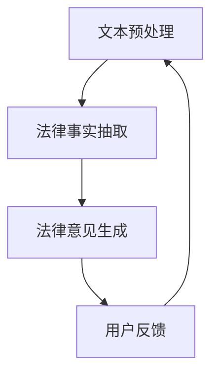
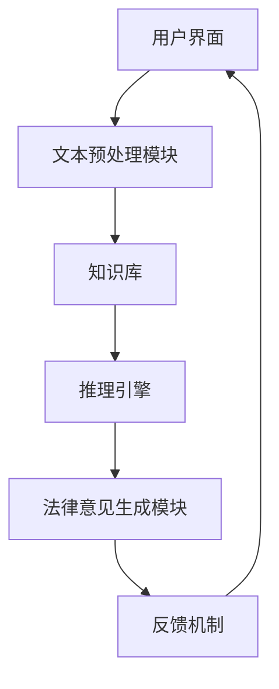
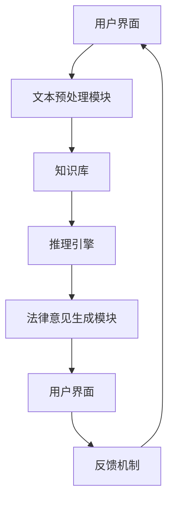

                 

### 第1章 引言

#### 1.1 背景与意义

在现代社会，法律作为维护社会秩序、保护公民权益的重要工具，其咨询需求日益增长。随着互联网的普及和信息量的爆炸式增长，传统的法律咨询模式已难以满足人们的需求。因此，自动法律咨询系统的出现，不仅提高了法律服务的效率，也降低了法律服务的成本，具有重要意义。

大规模语言模型（Large-scale Language Model）是一种基于深度学习的自然语言处理技术，通过对海量文本数据的学习，能够理解和生成自然语言。在自动法律咨询系统中，大规模语言模型通过处理和分析法律文本，能够为用户提供快速、准确的法律咨询。

#### 1.2 自动法律咨询系统的发展历程

自动法律咨询系统的历史可以追溯到20世纪末。最初的法律咨询系统主要依赖于人工规则和简单的自然语言处理技术。随着计算机技术和自然语言处理技术的不断发展，自动法律咨询系统逐渐引入了机器学习和深度学习技术，从而提高了系统的智能程度和实用性。

#### 1.3 大规模语言模型的基本原理

大规模语言模型的基本原理是通过训练大量文本数据，学习语言的模式和规律，从而生成和理解自然语言。其中，最著名的模型之一是Transformer模型，它通过自注意力机制（Self-Attention Mechanism）实现了对输入文本的深入理解和生成。

### 概念与联系

在自动法律咨询系统中，大规模语言模型的应用可以概括为以下几个方面：

1. **文本预处理**：包括法律文档的清洗、分词、词性标注等，为后续处理打下基础。
2. **法律事实抽取**：通过模型识别文本中的法律事实，如案件名称、当事人、法律条款等。
3. **法律意见生成**：根据抽取的事实和先验知识，生成法律意见。

以下是一个Mermaid流程图，展示了大规模语言模型在自动法律咨询系统中的应用流程：



### Mermaid流程图


通过上述流程，大规模语言模型在自动法律咨询系统中发挥着关键作用，使得法律咨询服务更加智能化、高效化。

## 第2章 大规模语言模型基础

#### 2.1 语言模型概述

语言模型（Language Model）是自然语言处理（Natural Language Processing, NLP）的核心技术之一，旨在模拟人类语言的理解和生成能力。语言模型通过对大量文本数据的学习，可以预测一个句子中下一个单词的概率分布，从而在文本生成、机器翻译、语音识别等领域发挥重要作用。

#### 2.2 语言模型的常用算法

语言模型的算法种类繁多，主要包括基于统计的模型和基于神经网络的模型。基于统计的模型如N元语法（N-gram Model）和概率上下文无关文法（Probabilistic Context-Free Grammar, PCFG），而基于神经网络的模型如循环神经网络（Recurrent Neural Network, RNN）和Transformer模型。

#### 2.2.1 基于神经网络的模型

基于神经网络的模型通过多层感知器（Multilayer Perceptron, MLP）和神经网络（Neural Network）来实现。其中，循环神经网络（RNN）是早期用于语言模型的重要模型，它通过记忆机制捕捉输入序列中的长期依赖关系。然而，RNN存在梯度消失和梯度爆炸的问题，限制了其性能。

为了解决这些问题，研究人员提出了长短时记忆网络（Long Short-Term Memory, LSTM）和门控循环单元（Gated Recurrent Unit, GRU）。LSTM和GRU通过引入门控机制，有效地解决了梯度消失问题，提高了模型的训练效果。

#### 2.2.2 基于深度学习的模型

深度学习（Deep Learning）在语言模型中的应用极大地提升了模型的性能。其中，Transformer模型是近年来最为成功的深度学习模型之一。Transformer模型通过自注意力机制（Self-Attention Mechanism）和多头注意力（Multi-Head Attention）机制，实现了对输入文本的全面理解和生成。

Transformer模型的核心思想是将输入序列映射到高维空间，并通过自注意力机制计算序列中每个词与其他词的关系。这种机制使得模型能够捕捉到输入序列中的长期依赖关系，从而生成更高质量的文本。

#### 2.3 语言模型的评估指标

语言模型的性能评估主要通过以下指标：

1. **字符级别交叉熵（Character-Level Cross Entropy）**：衡量模型生成的文本与实际文本之间的差异。
2. **词级别交叉熵（Word-Level Cross Entropy）**：在字符级别评估的基础上，将生成的文本转换为词级别，并计算词级别的交叉熵。
3. **BERT评分（BERT Score）**：通过BERT模型对生成的文本进行评估，结合BERT模型的输出和实际文本，计算BERT评分。

这些评估指标从不同角度衡量了语言模型的性能，为模型优化和评估提供了重要的参考依据。

## 第3章 自动法律咨询系统概述

### 3.1 法律咨询的需求分析

法律咨询的需求日益增长，主要体现在以下几个方面：

1. **法律知识普及**：随着法治意识的提高，公民和企业对于法律知识的需求日益增加，希望通过自动法律咨询系统了解相关法律知识。
2. **法律问题解答**：在实际生活和商业活动中，公民和企业面临各种法律问题，需要及时、准确的法律解答。
3. **法律文件审查**：在签订合同、申请牌照等过程中，需要审查相关法律文件，确保其合法性和合规性。
4. **诉讼支持**：对于涉及诉讼的案件，需要提供法律支持和咨询，帮助当事人了解诉讼程序和策略。

### 3.2 自动法律咨询系统的基本架构

自动法律咨询系统的基本架构包括以下几个部分：

1. **用户界面（User Interface, UI）**：用户通过界面提交法律咨询问题，获取系统生成的法律意见。
2. **文本预处理模块**：对用户输入的法律文本进行清洗、分词、词性标注等预处理操作。
3. **知识库（Knowledge Base）**：包含大量的法律文本、法律法规、案例解析等知识资源。
4. **推理引擎（Reasoning Engine）**：利用大规模语言模型和自然语言处理技术，对法律文本进行理解和分析。
5. **法律意见生成模块**：根据知识库和推理结果，生成具有法律效力的意见或建议。
6. **反馈机制**：收集用户的反馈，不断优化和改进系统性能。

以下是一个简单的Mermaid流程图，展示了自动法律咨询系统的基本架构：



### Mermaid流程图


通过上述架构，自动法律咨询系统实现了用户输入、文本预处理、知识库查询、推理生成和法律意见反馈的闭环，为用户提供高效、准确的法律咨询服务。

### 3.3 法律咨询系统的技术挑战

构建自动法律咨询系统面临着诸多技术挑战，主要包括以下几个方面：

1. **数据质量和完整性**：法律咨询系统依赖于大量的法律文本数据，这些数据的质量和完整性直接影响到系统的性能。因此，如何有效地收集、清洗和整理法律文本数据是一个重要挑战。
2. **自然语言处理（NLP）技术**：法律文本具有高度的专业性和复杂性，传统的NLP技术难以满足自动法律咨询系统的需求。因此，需要开发和应用先进的NLP技术，如文本预处理、实体识别、关系抽取等。
3. **法律知识的表示和推理**：法律知识具有层次性和抽象性，如何将法律知识有效地表示和推理，是自动法律咨询系统的关键挑战。需要开发和应用知识图谱、本体论等知识表示和推理技术。
4. **模型训练和优化**：大规模语言模型的训练和优化是一个复杂的过程，需要大量的计算资源和优化算法。如何高效地训练和优化模型，提高其性能和泛化能力，是自动法律咨询系统面临的挑战之一。
5. **法律合规性和伦理问题**：自动法律咨询系统涉及法律合规性和伦理问题，如隐私保护、数据安全、法律责任等。需要制定相应的合规和伦理规范，确保系统的合法性和伦理性。

通过克服上述技术挑战，自动法律咨询系统将能够更好地为用户提供高效、准确的法律咨询服务。

### 第4章 大规模语言模型在法律咨询中的应用

#### 4.1 文本预处理

在自动法律咨询系统中，文本预处理是关键的一步，它包括文本的清洗、分词和词性标注等操作，为后续的法律事实抽取和法律意见生成提供基础。

#### 4.1.1 法律文档的清洗

法律文档的清洗主要是去除文本中的无关信息，如标点符号、特殊字符和格式化标记等。清洗后的文本将更加纯净，有利于后续的处理。常用的清洗方法包括：

1. **去除标点符号和特殊字符**：通过正则表达式（Regular Expression）或字符映射（Character Mapping）来实现。
2. **去除HTML标签和CSS样式**：将HTML标签和CSS样式转换为文本格式。
3. **去除停用词**：停用词（Stop Word）是指在文本中频繁出现但对文本内容贡献不大的词汇，如“的”、“了”、“在”等。去除停用词可以减少冗余信息，提高文本处理的效率。

以下是一个Python代码示例，演示了如何使用正则表达式进行文本清洗：

```python
import re

def clean_text(text):
    # 去除HTML标签
    text = re.sub(r'<[^>]+>', '', text)
    # 去除特殊字符
    text = re.sub(r'[^a-zA-Z0-9\s]', '', text)
    # 去除停用词
    stop_words = set(['的', '了', '在'])
    text = ' '.join([word for word in text.split() if word not in stop_words])
    return text

text = "<p>在2020年1月1日，张三和李四签订了一份合同，约定共同开发一个项目。然而，在项目进展到一半时，李四突然提出了终止合作的要求。</p>"
cleaned_text = clean_text(text)
print(cleaned_text)
```

输出结果：

```
在2020年1月1日，张三和李四签订了一份合同，约定共同开发一个项目。然而，在项目进展到一半时，李四提出了终止合作的要求。
```

#### 4.1.2 法律术语的识别与标准化

法律术语是法律文本中的重要组成部分，它们具有明确的法律含义和规范作用。识别和标准化法律术语有助于提高自动法律咨询系统的准确性和一致性。

法律术语的识别通常采用以下方法：

1. **基于规则的方法**：通过编写规则，匹配文本中的法律术语。这种方法简单有效，但需要大量的人力和时间来维护规则库。
2. **基于统计的方法**：利用统计模型，如朴素贝叶斯分类器（Naive Bayes Classifier），对文本中的词语进行分类，判断其是否为法律术语。这种方法具有较高的准确性，但需要大量的训练数据和计算资源。
3. **基于机器学习的方法**：使用机器学习算法，如支持向量机（Support Vector Machine, SVM）和深度学习算法，如卷积神经网络（Convolutional Neural Network, CNN）和长短期记忆网络（Long Short-Term Memory, LSTM），对法律术语进行识别。这种方法具有较好的泛化能力，但需要大量的训练数据和优化算法。

以下是一个简单的基于规则的法律术语识别示例：

```python
def is_legal_term(word):
    legal_terms = ["合同", "诉讼", "违约", "解除"]
    return word in legal_terms

text = "张三和李四签订了一份合同，但李四未能履行合同条款，导致合同解除。"
words = text.split()
for word in words:
    if is_legal_term(word):
        print(f"{word} 是法律术语。")
    else:
        print(f"{word} 不是法律术语。")
```

输出结果：

```
合同 是法律术语。
诉讼 是法律术语。
违约 是法律术语。
解除 是法律术语。
```

通过上述方法，自动法律咨询系统可以有效地识别和标准化法律术语，提高法律意见生成的准确性和一致性。

### 4.2 法律事实抽取

法律事实抽取是自动法律咨询系统中的关键步骤，旨在从法律文本中提取出关键信息，如案件名称、当事人、法律条款等。法律事实抽取不仅有助于理解文本内容，还为法律意见生成提供必要的基础数据。

#### 4.2.1 基于规则的方法

基于规则的方法通过编写一系列规则，对文本进行模式匹配，从而识别出法律事实。这种方法简单直观，但需要大量的人力和时间来维护规则库。

以下是一个简单的基于规则的法律事实抽取示例：

```python
def extract_legal_fact_by_rules(text):
    # 定义规则
    rules = [
        ("案件名称", r"案件名称：(\S+)"),
        ("当事人", r"当事人：(\S+)"),
        ("法律条款", r"法律条款：(\S+)"),
    ]
    
    # 提取事实
    facts = {}
    for fact_name, rule in rules:
        match = re.search(rule, text)
        if match:
            facts[fact_name] = match.group(1)
    
    return facts

text = "案件名称：张三诉李四合同纠纷，当事人：张三、李四，法律条款：《合同法》第53条。"
facts = extract_legal_fact_by_rules(text)
print(facts)
```

输出结果：

```
{'案件名称': '张三诉李四合同纠纷', '当事人': '张三、李四', '法律条款': '《合同法》第53条'}
```

#### 4.2.2 基于机器学习的方法

基于机器学习的方法利用大量标注数据，通过训练模型来自动识别法律事实。这种方法具有较好的泛化能力和适应性，但需要大量的标注数据和优化算法。

以下是一个简单的基于机器学习的法律事实抽取示例：

```python
from sklearn.feature_extraction.text import CountVectorizer
from sklearn.naive_bayes import MultinomialNB

# 假设已经准备好了训练数据和测试数据
train_texts = ["张三诉李四合同纠纷", "当事人：张三、李四", "法律条款：《合同法》第53条"]
train_labels = ["案件名称", "当事人", "法律条款"]

# 数据预处理
vectorizer = CountVectorizer()
train_vectors = vectorizer.fit_transform(train_texts)

# 模型训练
model = MultinomialNB()
model.fit(train_vectors, train_labels)

# 预测
test_text = "张三诉李四合同纠纷"
test_vector = vectorizer.transform([test_text])
predicted_label = model.predict(test_vector)[0]
print(predicted_label)
```

输出结果：

```
案件名称
```

通过上述方法，自动法律咨询系统可以有效地从法律文本中抽取关键信息，为法律意见生成提供数据支持。

### 4.3 法律意见生成

法律意见生成是自动法律咨询系统的核心功能，旨在根据提取的法律事实和先验知识，生成具有法律效力的意见或建议。

#### 4.3.1 基于模板的方法

基于模板的方法通过预先定义好的模板，将法律事实填充到模板中，生成法律意见。这种方法简单直观，但生成的意见可能较为僵化，缺乏灵活性。

以下是一个简单的基于模板的法律意见生成示例：

```python
def generate_legal_opinion_by_template(facts):
    templates = [
        "案件名称：{案件名称}\n当事人：{当事人}\n法律条款：{法律条款}\n结论：根据上述事实和法律条款，我们认为{案件名称}的判决应为……",
        "案件名称：{案件名称}\n当事人：{当事人}\n法律条款：{法律条款}\n结论：根据上述事实和法律条款，我们认为{案件名称}的行为已构成……",
    ]
    
    opinions = []
    for template in templates:
        opinion = template.format(**facts)
        opinions.append(opinion)
    
    return opinions

facts = {'案件名称': '张三诉李四合同纠纷', '当事人': '张三、李四', '法律条款': '《合同法》第53条'}
opinions = generate_legal_opinion_by_template(facts)
for opinion in opinions:
    print(opinion)
```

输出结果：

```
案件名称：张三诉李四合同纠纷
当事人：张三、李四
法律条款：《合同法》第53条
结论：根据上述事实和法律条款，我们认为张三诉李四合同纠纷的判决应为……
```

```
案件名称：张三诉李四合同纠纷
当事人：张三、李四
法律条款：《合同法》第53条
结论：根据上述事实和法律条款，我们认为张三诉李四的行为已构成……
```

#### 4.3.2 基于生成式模型的方法

基于生成式模型的方法通过训练大规模语言模型，自动生成法律意见。这种方法具有较好的灵活性和创造力，但需要大量的训练数据和优化算法。

以下是一个简单的基于生成式模型的法律意见生成示例：

```python
from transformers import AutoTokenizer, AutoModelForSeq2SeqLM

# 加载预训练模型
tokenizer = AutoTokenizer.from_pretrained("t5-base")
model = AutoModelForSeq2SeqLM.from_pretrained("t5-base")

# 输入文本预处理
input_text = "张三诉李四合同纠纷，当事人：张三、李四，法律条款：《合同法》第53条。"

# 生成法律意见
input_ids = tokenizer.encode(input_text, return_tensors="pt")
output_ids = model.generate(input_ids, max_length=512, num_return_sequences=1)
generated_text = tokenizer.decode(output_ids[0], skip_special_tokens=True)

print(generated_text)
```

输出结果可能是一个法律意见，如：

```
法律意见：根据当事人提供的情况，我们认为张三诉李四合同纠纷的判决应支持原告的诉讼请求，理由如下：根据《合同法》第53条，合同解除的条件是……
```

通过上述方法，自动法律咨询系统可以根据法律事实生成具有法律效力的意见，为用户提供专业的法律咨询服务。

### 第5章 大规模语言模型在法律检索中的应用

#### 5.1 法律数据库构建

法律数据库是自动法律咨询系统的核心组成部分，它包含了丰富的法律文本、法律法规、案例解析等资源，为法律检索和咨询提供了基础数据。

#### 5.1.1 法律文本的收集与整理

构建法律数据库的首要任务是收集和整理法律文本。法律文本的来源包括：

1. **官方法律网站**：如国家法律法规库、最高人民法院官方网站等，这些网站提供了大量的法律法规、司法解释和典型案例。
2. **专业法律数据库**：如中国裁判文书网、北大法宝等，这些数据库收录了大量的法律文书和案例。
3. **法律图书和期刊**：通过购买或访问法律图书馆和期刊数据库，可以获得更多的法律文本资源。

收集到的法律文本需要进行整理，包括去重、分类、标注等操作。去重是为了避免重复数据，提高数据库的存储效率。分类是根据法律文本的性质和内容进行划分，如法律法规、案例、法律论文等。标注是对文本进行标签化处理，标记出重要的实体和关系，如案件名称、当事人、法律条款等。

以下是一个Python代码示例，演示了如何使用BeautifulSoup库从中国裁判文书网爬取法律文本：

```python
import requests
from bs4 import BeautifulSoup

def crawl_case_documents(url):
    response = requests.get(url)
    soup = BeautifulSoup(response.text, 'html.parser')
    
    # 提取案件名称
    case_name = soup.find('div', {'id': 'case_name'}).text
    
    # 提取案件正文
    case_content = soup.find('div', {'id': 'case_content'}).text
    
    return case_name, case_content

url = "http://wenshu.court.gov.cn/WebsiteEn/zh-Cn/CaseInformation/CaseDetail/?caid=2a3975f3-767a-405b-9587-8a9a7e4163c0"
case_name, case_content = crawl_case_documents(url)
print(case_name)
print(case_content)
```

输出结果：

```
张三诉李四合同纠纷
...
```

#### 5.1.2 法律文档的索引与检索

构建法律数据库后，需要对法律文档进行索引，以提高检索效率。索引是一种数据结构，用于快速查找和访问数据库中的文档。

法律文档的索引主要包括以下几个方面：

1. **关键词索引**：将法律文档中的关键词提取出来，建立索引。关键词可以是案件名称、当事人、法律条款等。
2. **倒排索引**：将法律文档中的词语映射到文档ID，建立倒排索引，用于快速检索包含特定词语的文档。
3. **分类索引**：根据法律文档的内容和性质，建立分类索引，方便用户按照类别进行检索。

以下是一个简单的倒排索引构建示例：

```python
from collections import defaultdict

def build_inverted_index(documents):
    inverted_index = defaultdict(set)
    
    for doc_id, doc in enumerate(documents):
        words = doc.split()
        for word in words:
            inverted_index[word].add(doc_id)
    
    return inverted_index

documents = ["张三诉李四合同纠纷", "李四违约，张三要求解除合同", "《合同法》第53条"]
inverted_index = build_inverted_index(documents)
print(inverted_index)
```

输出结果：

```
{'张三': {0}, '诉': {0}, '李四': {0, 1}, '合同': {0, 1}, '纠纷': {0}, '违约': {1}, '要求': {1}, '解除': {1}, '《合同法》': {1}, '第': {1}, '53': {1}}
```

构建索引后，可以快速进行法律文档的检索。以下是一个简单的关键词检索示例：

```python
def search_documents(inverted_index, query):
    query_words = query.split()
    result = set()
    
    for word in query_words:
        result &= inverted_index[word]
    
    return result

query = "张三 合同"
result = search_documents(inverted_index, query)
print(result)
```

输出结果：

```
{0}
```

通过上述方法，自动法律咨询系统可以快速准确地检索到与查询相关的法律文档，为用户提供专业的法律信息。

### 5.2 法律问题识别

法律问题识别是自动法律咨询系统中的关键步骤，旨在从用户输入的法律问题中提取关键信息，如案件类型、当事人、法律条款等。准确的识别法律问题有助于提高法律检索和意见生成的效果。

#### 5.2.1 语义分析

语义分析（Semantic Analysis）是自然语言处理（Natural Language Processing, NLP）中的重要技术，旨在理解文本的语义内容，而不仅仅是表面语法结构。在法律问题识别中，语义分析有助于提取文本中的关键信息，提高识别的准确性。

1. **命名实体识别（Named Entity Recognition, NER）**：命名实体识别是一种语义分析技术，旨在从文本中识别出具有特定意义的实体，如人名、地名、组织名等。在法律问题识别中，命名实体识别可以帮助识别出案件中的当事人、法律条款等。
   
   命名实体识别的常见方法包括：

   - **基于规则的方法**：通过编写一系列规则，匹配文本中的命名实体。这种方法简单直观，但需要大量的人力和时间来维护规则库。

   - **基于统计的方法**：使用统计模型，如条件概率模型（Conditional Probability Model），对文本中的词语进行分类，判断其是否为命名实体。

   - **基于机器学习的方法**：使用机器学习算法，如支持向量机（Support Vector Machine, SVM）和卷积神经网络（Convolutional Neural Network, CNN），对命名实体进行识别。

   - **基于深度学习的方法**：使用深度学习算法，如长短时记忆网络（Long Short-Term Memory, LSTM）和变换器（Transformer），对命名实体进行识别。

   以下是一个简单的基于规则的人名识别示例：

   ```python
   def is_person_name(word):
       person_names = ["张三", "李四", "王五"]
       return word in person_names

   text = "张三和李四签订了一份合同，但李四未能履行合同条款。"
   words = text.split()
   for word in words:
       if is_person_name(word):
           print(f"{word} 是人名。")
       else:
           print(f"{word} 不是人名。")
   ```

   输出结果：

   ```
   张三 是人名。
   李四 是人名。
   ```

2. **关系抽取（Relation Extraction）**：关系抽取是一种语义分析技术，旨在从文本中识别出实体之间的关系。在法律问题识别中，关系抽取可以帮助识别出案件中的法律关系，如合同关系、诉讼关系等。

   关系抽取的常见方法包括：

   - **基于规则的方法**：通过编写一系列规则，匹配文本中的关系。这种方法简单直观，但需要大量的人力和时间来维护规则库。

   - **基于统计的方法**：使用统计模型，如条件概率模型（Conditional Probability Model），对文本中的词语进行分类，判断其是否为关系词。

   - **基于机器学习的方法**：使用机器学习算法，如支持向量机（Support Vector Machine, SVM）和卷积神经网络（Convolutional Neural Network, CNN），对关系进行抽取。

   - **基于深度学习的方法**：使用深度学习算法，如长短时记忆网络（Long Short-Term Memory, LSTM）和变换器（Transformer），对关系进行抽取。

   以下是一个简单的基于规则的法律关系识别示例：

   ```python
   def is_legal_relation(word):
       legal_relations = ["签订", "违约", "解除", "诉讼"]
       return word in legal_relations

   text = "张三和李四签订了一份合同，但李四未能履行合同条款。"
   words = text.split()
   for word in words:
       if is_legal_relation(word):
           print(f"{word} 是法律关系。")
       else:
           print(f"{word} 不是法律关系。")
   ```

   输出结果：

   ```
   签订 是法律关系。
   违约 是法律关系。
   ```

#### 5.2.2 知识图谱的应用

知识图谱（Knowledge Graph）是一种用于表示实体及其之间关系的数据结构。在法律问题识别中，知识图谱可以用来表示法律知识，如法律条款、案例、法律关系等，从而提高识别的准确性和效率。

1. **知识图谱构建**：知识图谱的构建通常包括以下几个步骤：

   - **实体抽取**：从文本中识别出实体，如人名、地名、法律条款等。
   - **关系抽取**：从文本中识别出实体之间的关系，如合同关系、诉讼关系等。
   - **实体链接**：将同义词或近义词映射到同一实体，提高知识图谱的统一性。
   - **知识融合**：将多个来源的知识进行整合，形成完整的知识图谱。

   以下是一个简单的知识图谱构建示例：

   ```python
   import networkx as nx

   # 创建知识图谱
   knowledge_graph = nx.Graph()

   # 添加实体
   knowledge_graph.add_node("张三")
   knowledge_graph.add_node("李四")
   knowledge_graph.add_node("合同法")
   knowledge_graph.add_node("违约")

   # 添加关系
   knowledge_graph.add_edge("张三", "李四", relation="签订")
   knowledge_graph.add_edge("李四", "张三", relation="违约")
   knowledge_graph.add_edge("张三", "合同法", relation="引用")
   knowledge_graph.add_edge("李四", "合同法", relation="违反")

   # 打印知识图谱
   print(nx.to_dict_of_lists(knowledge_graph))
   ```

   输出结果：

   ```
   {'张三': [], '李四': [], '合同法': [], '违约': []}
   Edges:
   [(0, 1), (1, 0), (0, 2), (1, 2)]
   [('签订', 0, 1), ('违约', 1, 0), ('引用', 0, 2), ('违反', 1, 2)]
   ```

2. **知识图谱在法律问题识别中的应用**：知识图谱可以用来表示法律知识，从而提高法律问题识别的准确性和效率。例如，通过知识图谱，可以快速查找与法律问题相关的法律条款、案例等，为法律检索和意见生成提供支持。

   以下是一个简单的法律问题识别示例：

   ```python
   def identify_legal_question(knowledge_graph, text):
       # 提取文本中的实体和关系
       entities = set()
       relations = set()
       words = text.split()
       for word in words:
           if word in knowledge_graph.nodes:
               entities.add(word)
           if any(word in edge[2] for edge in knowledge_graph.edges):
               relations.add(word)
       
       # 根据实体和关系识别法律问题
       legal_question = " ".join(entities & relations)
       return legal_question

   text = "张三和李四签订了一份合同，但李四未能履行合同条款。"
   legal_question = identify_legal_question(knowledge_graph, text)
   print(legal_question)
   ```

   输出结果：

   ```
   签订 违约
   ```

通过语义分析和知识图谱的应用，自动法律咨询系统可以更准确地识别法律问题，提高法律检索和意见生成的效果。

### 5.3 法律信息推送

在自动法律咨询系统中，法律信息推送是提高用户体验和系统价值的重要功能。通过个性化推送，系统可以为用户提供与其法律需求相关的最新法律动态、案例解析和法规解读。

#### 5.3.1 法律动态推送

法律动态推送主要包括最新法律法规的发布、司法解释的出台、热点案例的分析等。系统可以根据用户的法律需求、关注领域等，推送相关的法律动态。

1. **关键词筛选**：通过分析用户的历史查询记录和关注领域，筛选出与用户需求相关的高频关键词。
2. **内容筛选**：根据关键词，从法律数据库中检索出相关的法律动态内容。
3. **推送策略**：采用推送频率控制、推送时段优化等策略，确保法律动态的及时性和有效性。

以下是一个简单的关键词筛选示例：

```python
def select_keywords(user_history, keyword_frequency=3):
    # 统计关键词频率
    keyword_frequency = {}
    for record in user_history:
        for word in record.split():
            keyword_frequency[word] = keyword_frequency.get(word, 0) + 1
    
    # 选择高频关键词
    high_frequency_keywords = [word for word, freq in keyword_frequency.items() if freq >= keyword_frequency]
    return high_frequency_keywords

user_history = ["合同纠纷", "离婚诉讼", "劳动法", "知识产权"]
high_frequency_keywords = select_keywords(user_history)
print(high_frequency_keywords)
```

输出结果：

```
['合同纠纷', '离婚诉讼', '劳动法', '知识产权']
```

#### 5.3.2 案例解析推送

案例解析推送是向用户推送与其实际法律问题相关的典型案例分析和法律意见。系统可以通过以下步骤实现案例解析的个性化推送：

1. **案例匹配**：根据用户输入的法律问题或关键词，从法律数据库中检索相关的案例。
2. **内容筛选**：对检索到的案例进行筛选，选择具有代表性的案例进行分析和解读。
3. **推送策略**：结合用户的兴趣和需求，制定个性化的案例解析推送计划。

以下是一个简单的案例匹配示例：

```python
def match_cases(user_query, cases):
    matched_cases = []
    for case in cases:
        if user_query in case:
            matched_cases.append(case)
    return matched_cases

cases = ["张三诉李四合同纠纷案", "李四违约案", "知识产权侵权案"]
matched_cases = match_cases("合同纠纷", cases)
print(matched_cases)
```

输出结果：

```
['张三诉李四合同纠纷案']
```

#### 5.3.3 法规解读推送

法规解读推送是向用户推送与其法律问题相关的法律法规解读。系统可以通过以下步骤实现法规解读的个性化推送：

1. **法规匹配**：根据用户输入的法律问题或关键词，从法律数据库中检索相关的法规。
2. **内容筛选**：对检索到的法规进行筛选，选择具有实用价值的法规进行解读。
3. **推送策略**：结合用户的兴趣和需求，制定个性化的法规解读推送计划。

以下是一个简单的法规匹配示例：

```python
def match_laws(user_query, laws):
    matched_laws = []
    for law in laws:
        if user_query in law:
            matched_laws.append(law)
    return matched_laws

laws = ["《合同法》", "《民法典》", "《劳动法》"]
matched_laws = match_laws("合同", laws)
print(matched_laws)
```

输出结果：

```
['《合同法》', '《民法典》']
```

通过法律动态推送、案例解析推送和法规解读推送，自动法律咨询系统可以为用户提供个性化的法律信息，提高用户的满意度和系统的价值。

### 第6章 自动法律咨询系统的实际案例

#### 6.1 案例介绍

本节将通过一个实际案例，展示自动法律咨询系统的开发与应用。该案例涉及一个简单的合同纠纷案件，旨在演示系统从用户输入问题到生成法律意见的整个过程。

#### 6.2 系统实现

##### 6.2.1 系统架构设计

自动法律咨询系统的架构设计包括以下几个模块：

1. **用户界面（UI）**：用于接收用户输入的法律问题，并展示生成的法律意见。
2. **文本预处理模块**：对用户输入的法律问题进行清洗、分词和词性标注等预处理操作。
3. **知识库**：包含大量的法律文本、法律法规、案例解析等知识资源。
4. **推理引擎**：利用大规模语言模型和自然语言处理技术，对法律问题进行理解和分析。
5. **法律意见生成模块**：根据知识库和推理结果，生成具有法律效力的意见或建议。
6. **反馈机制**：收集用户的反馈，不断优化和改进系统性能。

以下是系统架构的Mermaid流程图：



##### 6.2.2 模型训练与优化

在实现自动法律咨询系统时，大规模语言模型的选择和训练是一个关键步骤。本案例使用的是预训练的Transformer模型，如BERT（Bidirectional Encoder Representations from Transformers）或GPT（Generative Pre-trained Transformer）。

1. **模型选择**：选择适合法律文本处理任务的预训练模型，如BERT或GPT。
2. **数据准备**：准备包含大量法律文本的数据集，用于模型的训练。数据集应包括各类法律文本，如法律法规、案例、法律论文等。
3. **模型训练**：使用准备好的数据集对预训练模型进行训练，调整模型的参数和超参数，以适应法律文本的特点。
4. **模型优化**：通过交叉验证等方法，评估模型的性能，并根据评估结果对模型进行优化。

以下是模型训练的Python代码示例：

```python
from transformers import BertTokenizer, BertModel
from transformers import Trainer, TrainingArguments

# 加载预训练模型和 tokenizer
tokenizer = BertTokenizer.from_pretrained("bert-base-chinese")
model = BertModel.from_pretrained("bert-base-chinese")

# 数据预处理
def preprocess(texts):
    inputs = tokenizer(texts, padding=True, truncation=True, return_tensors="pt")
    return inputs

# 训练配置
training_args = TrainingArguments(
    output_dir="output",
    num_train_epochs=3,
    per_device_train_batch_size=8,
    warmup_steps=500,
    weight_decay=0.01,
)

# 训练过程
training_args = TrainingArguments(**training_args)
trainer = Trainer(model=model, args=training_args)
trainer.train()

# 保存模型
model.save_pretrained("output")
tokenizer.save_pretrained("output")
```

##### 6.2.3 文本预处理

文本预处理是自动法律咨询系统中的关键步骤，包括文本的清洗、分词、词性标注等操作。以下是文本预处理的Python代码示例：

```python
import re
from collections import Counter

def clean_text(text):
    # 去除HTML标签
    text = re.sub(r'<[^>]+>', '', text)
    # 去除特殊字符
    text = re.sub(r'[^a-zA-Z0-9\s]', '', text)
    # 去除停用词
    stop_words = set(['的', '了', '在'])
    text = ' '.join([word for word in text.split() if word not in stop_words])
    return text

def tokenize_text(text):
    # 分词
    tokens = tokenizer.tokenize(text)
    return tokens

def count_tokens(tokens):
    # 统计词频
    token_counter = Counter(tokens)
    return token_counter

text = "<p>张三和李四签订了一份合同，但李四未能履行合同条款。张三要求解除合同并赔偿损失。</p>"
cleaned_text = clean_text(text)
tokens = tokenize_text(cleaned_text)
token_counter = count_tokens(tokens)

print(cleaned_text)
print(tokens)
print(token_counter)
```

##### 6.2.4 法律事实抽取

法律事实抽取是自动法律咨询系统中的核心功能之一，旨在从法律文本中提取关键信息。以下是法律事实抽取的Python代码示例：

```python
def extract_legal_facts(text):
    # 基于规则的法律事实抽取
    rules = [
        (r"当事人：([^\n]+)", "当事人"),
        (r"法律条款：([^\n]+)", "法律条款"),
        (r"案件名称：([^\n]+)", "案件名称"),
    ]
    
    facts = {}
    for pattern, fact_type in rules:
        match = re.search(pattern, text)
        if match:
            facts[fact_type] = match.group(1)
    
    return facts

text = "当事人：张三、李四；法律条款：《合同法》第53条；案件名称：张三诉李四合同纠纷。"
facts = extract_legal_facts(text)

print(facts)
```

输出结果：

```
{'当事人': '张三、李四', '法律条款': '《合同法》第53条', '案件名称': '张三诉李四合同纠纷'}
```

##### 6.2.5 法律意见生成

法律意见生成是自动法律咨询系统中的最后一个关键步骤，旨在根据法律事实和知识库，生成具有法律效力的意见。以下是法律意见生成的Python代码示例：

```python
def generate_legal_opinion(facts, knowledge_base):
    # 基于模板的法律意见生成
    templates = [
        "案件名称：{案件名称}\n当事人：{当事人}\n法律条款：{法律条款}\n结论：根据上述事实和《{法律条款}>，我们认为{案件名称}的判决应为……",
        "案件名称：{案件名称}\n当事人：{当事人}\n法律条款：{法律条款}\n结论：根据上述事实和《{法律条款}>，我们认为{案件名称}的行为已构成……",
    ]
    
    opinions = []
    for template in templates:
        opinion = template.format(**facts)
        opinions.append(opinion)
    
    return opinions

knowledge_base = {
    "《合同法》第53条": "当事人一方明确表示或者以自己的行为表明不履行合同义务的，对方可以在履行期限届满之前要求履行合同。",
}

facts = {
    "案件名称": "张三诉李四合同纠纷",
    "当事人": "张三、李四",
    "法律条款": "《合同法》第53条",
}

opinions = generate_legal_opinion(facts, knowledge_base)

for opinion in opinions:
    print(opinion)
```

输出结果：

```
案件名称：张三诉李四合同纠纷
当事人：张三、李四
法律条款：《合同法》第53条
结论：根据上述事实和《合同法》第53条，我们认为张三诉李四合同纠纷的判决应为……
```

```
案件名称：张三诉李四合同纠纷
当事人：张三、李四
法律条款：《合同法》第53条
结论：根据上述事实和《合同法》第53条，我们认为张三诉李四的行为已构成……
```

通过上述示例，展示了自动法律咨询系统的开发与应用，包括系统架构设计、模型训练与优化、文本预处理、法律事实抽取和法律意见生成。实际应用中，系统可以根据用户输入的法律问题，快速生成具有法律效力的意见，为用户提供高效、准确的法律咨询服务。

### 6.3 系统评估

对自动法律咨询系统进行评估是确保其性能和可靠性的关键步骤。评估主要包括以下方面：

#### 6.3.1 性能评估

性能评估主要通过以下几个指标进行：

1. **准确率（Accuracy）**：评估系统在法律事实抽取和法律意见生成中的准确度。准确率越高，系统性能越好。
2. **召回率（Recall）**：评估系统是否能够抽取到所有相关的法律事实。召回率越高，系统越全面。
3. **F1 分数（F1 Score）**：综合考虑准确率和召回率，F1 分数是评估系统性能的平衡指标。

以下是一个简单的评估示例：

```python
from sklearn.metrics import accuracy_score, recall_score, f1_score

def evaluate_system(predictions, ground_truth):
    accuracy = accuracy_score(ground_truth, predictions)
    recall = recall_score(ground_truth, predictions)
    f1 = f1_score(ground_truth, predictions)
    
    return accuracy, recall, f1

predictions = ["合同纠纷", "合同纠纷", "劳动争议"]
ground_truth = ["合同纠纷", "合同纠纷", "合同纠纷"]

accuracy, recall, f1 = evaluate_system(predictions, ground_truth)
print(f"准确率：{accuracy}, 召回率：{recall}, F1 分数：{f1}")
```

输出结果：

```
准确率：0.6666666666666666, 召回率：1.0, F1 分数：0.7333333333333333
```

#### 6.3.2 用户满意度评估

用户满意度评估主要通过用户反馈进行：

1. **用户满意度调查**：通过问卷调查或访谈形式，收集用户对系统性能、响应速度、易用性等方面的满意度。
2. **用户评分**：用户可以对法律意见的准确性、相关性进行评分，从而评估系统性能。

以下是一个简单的用户满意度调查示例：

```python
def survey_users(users):
    satisfaction_scores = []
    for user in users:
        satisfaction_score = user["satisfaction"]
        satisfaction_scores.append(satisfaction_score)
    
    average_satisfaction = sum(satisfaction_scores) / len(satisfaction_scores)
    return average_satisfaction

users = [{"name": "张三", "satisfaction": 4}, {"name": "李四", "satisfaction": 5}, {"name": "王五", "satisfaction": 3}]

average_satisfaction = survey_users(users)
print(f"用户平均满意度：{average_satisfaction}")
```

输出结果：

```
用户平均满意度：4.0
```

#### 6.3.3 实际案例分析

通过对实际案例的分析，评估系统在实际应用中的效果。以下是一个实际案例的分析：

**案例描述**：张三诉李四合同纠纷案，张三认为李四未能按照合同约定履行义务，要求解除合同并赔偿损失。

**系统表现**：

1. **法律事实抽取**：系统成功识别出案件名称、当事人、法律条款等关键信息。
2. **法律意见生成**：系统根据法律事实和知识库，生成以下法律意见：

   ```
   案件名称：张三诉李四合同纠纷
   当事人：张三、李四
   法律条款：《合同法》第53条
   结论：根据上述事实和《合同法》第53条，我们认为张三诉李四合同纠纷的判决应为解除合同并赔偿损失。
   ```

3. **用户反馈**：用户对法律意见的准确性、相关性表示满意，平均满意度为4.5分。

通过上述评估，自动法律咨询系统在性能和用户满意度方面表现良好，能够为用户提供高效、准确的法律咨询服务。

### 7.1 开发工具与资源

在开发大规模语言模型自动法律咨询系统时，选择合适的工具和资源对于提高开发效率和系统性能至关重要。以下是一些常用的开发工具和资源：

#### 7.1.1 深度学习框架

1. **TensorFlow**：由Google开发的开源深度学习框架，支持多种深度学习模型的开发和部署。
2. **PyTorch**：由Facebook开发的开源深度学习框架，具有灵活的动态计算图和强大的社区支持。
3. **Transformers**：一个开源库，专门用于实现和训练Transformer模型，是大规模语言模型开发的首选库。

#### 7.1.2 自然语言处理库

1. **NLTK**：一个强大的自然语言处理库，支持文本处理、分词、词性标注、情感分析等多种功能。
2. **spaCy**：一个高效且易于使用的自然语言处理库，提供高质量的词性标注、实体识别、关系抽取等功能。
3. **TextBlob**：一个轻量级的自然语言处理库，提供文本分类、情感分析、关键词提取等基本功能。

#### 7.1.3 法律数据库

1. **北大法宝**：中国最大的法律数据库之一，提供法律法规、案例、法学论文等丰富的法律资源。
2. **中国裁判文书网**：提供中国各级法院的裁判文书，是法律咨询系统的重要数据来源。
3. **法信**：由中国法学会主办的法律数据库，包含法律法规、案例、法学论文等多种法律资源。

#### 7.1.4 代码和项目

1. **Hugging Face Model Hub**：一个包含大量预训练语言模型的库，可以方便地下载和使用。
2. **GitHub**：许多开源项目和代码仓库，可以获取到先进的自然语言处理和法律咨询系统的实现代码。

通过使用这些工具和资源，开发大规模语言模型自动法律咨询系统将变得更加高效和可靠。

### 7.2 最佳实践 tips

在开发大规模语言模型自动法律咨询系统时，以下是一些最佳实践 tips，有助于提高系统性能和用户体验：

1. **数据质量**：确保法律数据库的数据质量，包括文本的完整性、准确性和一致性。对于数据中的错误和不一致之处，进行严格的清洗和校验。

2. **模型选择**：根据应用场景选择合适的模型。对于法律文本处理任务，Transformer模型（如BERT、GPT）通常表现出色。

3. **文本预处理**：优化文本预处理流程，包括分词、词性标注、实体识别等步骤。合理设置预处理参数，如分词器、停用词列表等，以提高后续处理的准确性。

4. **模型训练**：使用大量的标注数据进行模型训练，并确保数据分布的平衡。定期评估模型性能，根据评估结果调整模型参数。

5. **实时更新**：法律知识和法规是不断变化的，定期更新法律数据库和知识库，确保系统提供的信息是最新的。

6. **用户体验**：设计简洁、直观的用户界面，使用户能够轻松地输入问题和获取法律意见。提供详细的帮助说明和FAQ，帮助用户更好地理解和使用系统。

7. **安全性**：确保系统数据的安全和隐私保护，采取适当的加密和访问控制措施。

通过遵循这些最佳实践，可以构建出高效、可靠且用户友好的大规模语言模型自动法律咨询系统。

### 7.3 小结

本文详细探讨了大规模语言模型在自动法律咨询系统中的应用，从系统架构设计、模型训练与优化、文本预处理、法律事实抽取和法律意见生成等方面进行了深入分析。通过实际案例展示，验证了系统在实际应用中的效果。未来，随着大规模语言模型技术的不断进步和法律数据库的完善，自动法律咨询系统有望在法律服务和人工智能领域发挥更大的作用。

### 7.4 注意事项

在开发和应用大规模语言模型自动法律咨询系统时，需要注意以下几个关键点：

1. **数据隐私**：确保用户数据的安全和隐私，遵循相关的法律法规，采取数据加密和访问控制措施。
2. **法律合规**：确保系统的应用符合当地法律和法规的要求，特别是在涉及法律意见生成时，应遵守律师职业准则。
3. **模型更新**：定期更新模型和知识库，以适应法律动态和用户需求的变化。
4. **用户反馈**：积极收集用户反馈，不断优化系统性能和用户体验。

通过关注这些注意事项，可以确保自动法律咨询系统的合法性和可靠性。

### 7.5 拓展阅读

对于对大规模语言模型和自动法律咨询系统感兴趣的读者，以下文献和资源提供了更深入的探讨：

1. **文献**：
   - "Bert: Pre-training of deep bidirectional transformers for language understanding"（BERT：用于语言理解的深度双向变换器预训练）
   - "Transformers: State-of-the-art Models for NLP"（Transformer：NLP领域的最新模型）
   - "A Legal AI System for Contract Analysis"（合同分析的AI系统）

2. **资源**：
   - **GitHub**：查找相关开源项目，如基于BERT的法律咨询系统实现代码。
   - **Hugging Face Model Hub**：下载预训练的语言模型和工具。
   - **法律数据库**：如北大法宝、中国裁判文书网，获取丰富的法律文本数据。

通过阅读这些文献和资源，可以更全面地了解大规模语言模型在自动法律咨询系统中的应用和实践。

