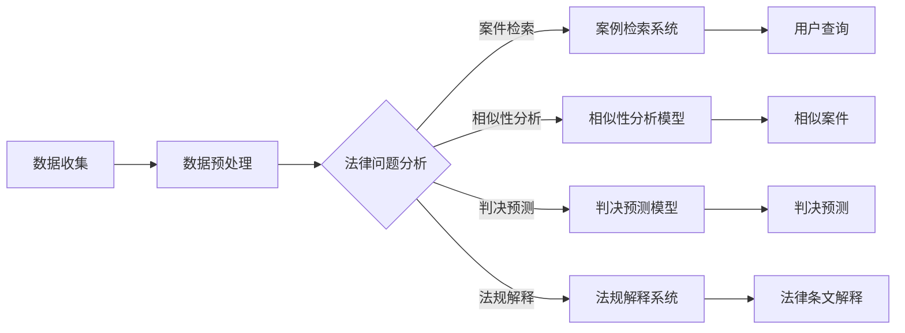

                 

### 引言

#### 1.1 书籍背景与目的

《大规模语言模型在自动法律案例分析中的应用》旨在探讨如何利用先进的自然语言处理技术，特别是大规模语言模型，来提升自动法律案例分析的效果和效率。随着人工智能技术的飞速发展，大规模语言模型已经成为了自然语言处理领域的明星技术，其在文本生成、情感分析、问答系统等任务中取得了显著的成果。然而，大规模语言模型在法律案例分析这一专业领域的应用却相对较少，尚有许多潜力等待挖掘。

本著作的目的在于填补这一领域的空白，通过系统地介绍大规模语言模型的基础知识、自动法律案例分析的基本概念和技术手段，详细探讨大规模语言模型在法律案例分析中的应用场景和实现方法，从而为法律专业人士和人工智能研究者提供一份有价值的参考指南。

#### 1.2 自动法律案例分析的重要性

自动法律案例分析是法律科技领域的一个重要分支，它利用计算机技术和人工智能算法，对法律文档、案例和判例进行自动分析、分类和推理，以辅助法律研究和决策。自动法律案例分析的重要性体现在以下几个方面：

首先，自动法律案例分析能够大幅提高法律工作的效率和准确性。传统法律案例分析往往需要大量人力和时间，而通过自动化的手段，可以显著减少这些成本，提高工作效率。

其次，自动法律案例分析有助于法律知识的积累和传播。通过对大量案例的分析和整理，可以形成结构化、系统化的法律知识库，为法律研究和教育提供有力支持。

最后，自动法律案例分析还能够提升司法公正性和透明度。通过客观、系统的分析，可以减少人为因素带来的偏见和错误，提高司法决策的公正性和公信力。

#### 1.3 大规模语言模型的发展与应用

大规模语言模型的发展可追溯到20世纪50年代，最早的统计语言模型是N-gram模型。随着计算能力的提升和海量数据的积累，从20世纪90年代开始，概率语言模型和神经网络语言模型逐渐成为主流。然而，真正推动大规模语言模型发展的是深度学习和大数据技术的兴起。

近年来，大规模语言模型在自然语言处理领域取得了重大突破。以GPT系列模型和BERT模型为代表的预训练语言模型，通过在大规模文本数据上进行预训练，能够有效捕捉文本中的复杂语义和上下文信息。这使得大规模语言模型在文本生成、问答系统、情感分析等领域表现出色。

在大规模语言模型的发展过程中，以下几个方面尤为重要：

1. **数据积累与预处理**：大规模语言模型的训练依赖于海量高质量的数据。数据预处理包括文本清洗、分词、词性标注等，以确保数据的质量和一致性。

2. **模型架构与优化**：从简单的循环神经网络（RNN）到更为复杂的Transformer架构，模型架构的不断优化是大规模语言模型性能提升的关键。

3. **预训练与微调**：通过在大规模语料库上进行预训练，模型可以学习到通用的语言知识。在实际应用中，通过微调对特定任务进行优化，可以提高模型的性能。

4. **推理与生成**：大规模语言模型的推理和生成能力是其核心优势。通过输入少量的文本，模型能够生成连贯、自然的文本，应用于问答系统、文本生成等任务。

大规模语言模型的发展不仅推动了自然语言处理技术的进步，也为自动法律案例分析带来了新的机遇和挑战。在下一章中，我们将深入探讨大规模语言模型的基础知识，为进一步理解其应用提供理论支持。

### 第2章 大规模语言模型基础

#### 2.1 语言模型概述

语言模型（Language Model）是自然语言处理领域的一项基本技术，它旨在预测自然语言中下一个单词或符号的概率。语言模型的根本任务是理解语言的结构和语义，从而为各种自然语言处理任务提供支持，如机器翻译、语音识别、文本生成等。语言模型的基本原理是概率论，通过对大量语言数据的统计和分析，建立语言生成模型，从而预测下一个单词或符号。

语言模型可以分为两大类：统计语言模型和基于规则的语言模型。统计语言模型主要依赖于对大规模语料库的统计特征，如N-gram模型和马尔可夫模型。基于规则的语言模型则通过定义语法规则和语义规则，来生成和解释语言。然而，随着深度学习技术的发展，基于神经网络的深度语言模型逐渐取代了传统的统计语言模型，成为现代语言模型的主流。

#### 2.2 大规模语言模型的架构

大规模语言模型的核心架构是神经网络，尤其是深度学习中的Transformer架构。Transformer模型由Vaswani等人于2017年提出，由于其卓越的性能和灵活性，迅速在自然语言处理领域得到广泛应用。

**Transformer的基本组件包括：**

1. **多头自注意力机制（Multi-Head Self-Attention）**：这是Transformer模型的核心创新，通过多个独立的自注意力头，模型能够同时关注句子中的不同部分，从而捕捉丰富的上下文信息。

2. **编码器（Encoder）和解码器（Decoder）**：编码器负责将输入序列编码成固定长度的向量表示，解码器则负责生成输出序列。编码器和解码器都由多个相同的层（Layer）组成，每层包含多头自注意力机制和前馈神经网络（Feedforward Neural Network）。

3. **前馈神经网络（Feedforward Neural Network）**：在每个注意力层之后，Transformer模型会通过一个前馈神经网络，对每个输入向量进行进一步处理，增强模型的非线性表达能力。

4. **位置编码（Positional Encoding）**：由于Transformer模型没有循环结构，无法直接处理序列中的位置信息。因此，通过添加位置编码（如绝对位置编码或相对位置编码），模型可以理解序列中的顺序关系。

**Transformer的工作流程可以概括为：**

1. **编码器接收输入序列（例如句子或段落），通过自注意力机制生成编码表示。**
2. **编码器输出经过多层叠加，逐渐提取更深层次的语义信息。**
3. **解码器接收编码器输出，并通过自注意力机制和交叉注意力机制，生成输出序列。**
4. **解码器逐层生成输出，最终得到完整的输出序列，例如翻译或文本生成结果。**

#### 2.3 大规模语言模型的工作原理

大规模语言模型的工作原理基于深度学习和神经网络，尤其是Transformer架构。其核心思想是通过大量文本数据进行预训练，学习语言的内在规律和复杂结构，然后在特定任务上进行微调，以达到优异的性能。

**预训练（Pre-training）**：

预训练是指在大规模文本数据上对语言模型进行训练，使其能够捕捉到语言中的普遍规律。预训练通常分为两个阶段：

1. **无监督预训练**：模型在大规模未标记文本数据上预训练，学习文本的语义和语法特征。无监督预训练方法包括掩码语言模型（Masked Language Model，MLM）和生成语言模型（Generative Language Model）。

2. **有监督预训练**：模型在标记的语料库上进行训练，进一步优化模型在特定任务上的性能。有监督预训练方法包括双向编码器表示学习（Bidirectional Encoder Representations from Transformers，BERT）和转换器预训练（Transfomer Pre-training）。

**微调（Fine-tuning）**：

预训练后的语言模型通常具有很高的通用性和泛化能力，但在特定任务上可能需要进一步优化。微调是在预训练模型的基础上，利用特定任务的数据进行训练，以提升模型在特定任务上的性能。

微调过程中，模型首先会在特定任务上进行初始化，然后通过迭代优化，逐渐调整模型参数，使其能够更好地适应特定任务的需求。微调的关键在于平衡预训练和任务特定数据的比例，确保模型既具备通用性，又能适应特定任务。

#### 2.4 大规模语言模型的训练与优化

大规模语言模型的训练是一个复杂且计算资源需求巨大的过程，涉及到数据预处理、模型训练、优化和评估等多个环节。以下是一些关键的步骤和策略：

**数据预处理**：

1. **文本清洗**：包括去除噪声、消除标点符号、统一化文本格式等，以确保数据的一致性和质量。

2. **分词**：将文本拆分为词或子词，以构建词表（Vocabulary）和索引。

3. **词嵌入**：将词汇映射到高维向量空间，通过词嵌入层将文本转换为数值表示。

4. **批处理**：将数据分成批次，以并行处理和优化计算效率。

**模型训练**：

1. **前向传播**：输入数据通过编码器和解码器，生成输出序列，计算损失函数。

2. **反向传播**：通过梯度下降算法，更新模型参数，最小化损失函数。

3. **优化策略**：包括学习率调度、正则化、梯度裁剪等，以避免过拟合和加速收敛。

**优化策略**：

1. **学习率调度**：动态调整学习率，以平衡模型训练的稳定性和收敛速度。

2. **正则化**：通过L1、L2正则化，防止模型过拟合。

3. **梯度裁剪**：限制梯度的大小，避免梯度爆炸或消失。

4. **数据增强**：通过随机插入、替换、删除单词等手段，增加数据多样性，提升模型泛化能力。

**评估与调整**：

1. **交叉验证**：通过交叉验证，评估模型在不同数据集上的性能，确保模型的泛化能力。

2. **性能指标**：包括准确率、召回率、F1分数等，用于评估模型在特定任务上的表现。

3. **调参与优化**：根据评估结果，调整模型参数和训练策略，进一步提升模型性能。

通过上述步骤和策略，大规模语言模型能够在各种自然语言处理任务中表现出色，为自动法律案例分析等领域提供强有力的支持。在下一章中，我们将进一步探讨自动法律案例分析的基础知识和关键技术。

### 第3章 自动法律案例分析基础

#### 3.1 法律案例分析概述

法律案例分析是法学研究和法律实务中的一项重要活动，旨在通过对具体案例的深入分析，总结和提炼法律规则、原则和解释，以指导新的法律实践和决策。法律案例分析的过程包括从大量的法律文本中识别出关键信息，分析案例中的法律问题，解释法律条文，以及预测未来案件的判决结果。

法律案例分析的重要性主要体现在以下几个方面：

首先，它有助于理解和应用复杂的法律规范。法律条文通常具有抽象和复杂的特征，通过案例分析，法律专业人士可以更好地理解这些条文的具体应用场景。

其次，法律案例分析能够提高法律决策的准确性和公正性。通过对过往案件的深入分析，可以识别出可能的偏见和错误，为新的案件提供更加全面和公正的参考。

最后，法律案例分析有助于法律知识的积累和传播。通过对大量案例的分析和整理，可以形成系统化的法律知识库，为法学教育和研究提供丰富的素材。

#### 3.2 法律案例分析的关键步骤

法律案例分析通常包括以下关键步骤：

1. **案件识别**：首先，需要从大量法律文本中识别出相关案件。这可以通过文本挖掘和自然语言处理技术实现，如关键词提取、文本分类和实体识别等。

2. **信息提取**：在识别出相关案件后，需要从法律文本中提取出关键信息，包括案件背景、法律问题、诉讼过程、判决结果等。这一步同样依赖于自然语言处理技术，如命名实体识别、关系抽取和文本分类等。

3. **法律问题分析**：提取出关键信息后，需要对案件中的法律问题进行深入分析，确定法律争议点和关键证据。这一步需要法律专家的专业知识，对案件的法律问题进行详细解释和论证。

4. **法律条文解释**：在分析法律问题的基础上，需要解释相关的法律条文，确定其在具体案件中的适用性。这需要法律专业人士对法律条文进行深入理解和分析，确保解释的准确性和合理性。

5. **判决预测**：最后，根据案件分析的结果，对案件的判决结果进行预测。这可以通过构建预测模型，利用历史案件数据进行分析和训练来实现。判决预测有助于法律专业人士在新的案件中提供参考和指导。

#### 3.3 法律案例分析中的数据预处理

在法律案例分析中，数据预处理是一个关键步骤，它直接影响后续分析的准确性和效率。以下是法律案例分析中常见的数据预处理任务：

1. **文本清洗**：包括去除标点符号、统一化文本格式、消除噪声等，确保数据的一致性和质量。

2. **分词**：将文本拆分为词或子词，以构建词表和索引。分词是自然语言处理的基础，准确有效的分词有助于后续的文本分析。

3. **词性标注**：对文本中的每个词进行词性标注，如名词、动词、形容词等，以帮助后续的文本分析和理解。

4. **实体识别**：识别文本中的法律实体，如案件名称、法律条款、当事人、地点等。实体识别是法律案例分析中的重要步骤，有助于提取案件的关键信息。

5. **关系抽取**：识别文本中实体之间的关系，如法律条款与案件之间的关系、当事人之间的诉讼关系等。关系抽取有助于构建案件的知识图谱，为法律问题分析和判决预测提供支持。

6. **数据归一化**：对数据进行归一化处理，如统一化法律条款的表述方式、统一化时间表达等，以确保数据的一致性。

7. **数据增强**：通过随机插入、替换、删除文本中的单词或子句，增加数据的多样性，提升模型的泛化能力。

通过上述数据预处理步骤，可以有效提升法律案例分析的准确性和效率，为后续的法律问题分析和判决预测提供可靠的数据基础。

#### 3.4 法律案例分析中的算法选择

在法律案例分析中，算法选择至关重要，它决定了案例分析的效果和效率。以下是几种常见的算法及其适用场景：

1. **文本分类算法**：文本分类是法律案例分析中的基本任务之一，常用的算法包括朴素贝叶斯分类器、支持向量机（SVM）和深度学习模型（如卷积神经网络（CNN）和长短期记忆网络（LSTM））。文本分类算法适用于案件识别、法律条款分类和判决预测等任务。

2. **命名实体识别（NER）**：NER算法用于识别文本中的法律实体，如案件名称、法律条款、当事人等。常用的NER算法包括条件随机场（CRF）、BiLSTM-CRF和BERT等。NER是法律案例分析中的基础步骤，有助于提取案件的关键信息。

3. **关系抽取算法**：关系抽取算法用于识别文本中实体之间的关系，如法律条款与案件之间的关系、当事人之间的诉讼关系等。常用的算法包括基于规则的方法、机器学习方法（如SVM和LSTM）和图神经网络（如Graph Convolutional Network，GCN）。

4. **深度学习模型**：深度学习模型，如卷积神经网络（CNN）、长短期记忆网络（LSTM）和Transformer模型，在法律案例分析中表现出色。这些模型能够捕捉文本中的复杂结构和语义信息，适用于法律问题分析、判决预测和案件分类等任务。

5. **监督学习与无监督学习**：监督学习算法需要大量标记数据，适用于有明确标签的任务，如文本分类和命名实体识别。无监督学习算法，如聚类和降维算法（如K-Means和PCA），适用于无标签数据，可用于案件聚类和文本降维。

6. **混合算法**：结合多种算法的优点，如将文本分类和命名实体识别结合，可以更全面地分析法律案例。例如，可以先使用NER提取关键信息，再使用文本分类算法对信息进行分类。

选择合适的算法需要考虑任务需求、数据质量和计算资源。在实际应用中，通常需要对不同算法进行实验和比较，以确定最佳算法组合。

通过合理选择和运用算法，可以有效提升法律案例分析的准确性和效率，为法律研究和实务提供有力支持。在下一章中，我们将详细探讨大规模语言模型在法律案例分析中的应用。

### 第4章 大规模语言模型在法律案例分析中的应用

#### 4.1 基于大规模语言模型的案例检索

案例检索是法律案例分析的重要环节，旨在从大量的法律文本中快速准确地找到与特定案件相关的案例。大规模语言模型在案例检索中发挥着重要作用，其主要优势在于能够理解和处理自然语言，从而实现高效的文本匹配和检索。

**工作原理**：

大规模语言模型，如BERT和GPT系列模型，通过在大规模文本数据上进行预训练，学习到丰富的语言特征和上下文信息。在案例检索中，模型首先将待检索的文本（例如一个具体案件描述）输入到预训练的模型中，模型会输出一个固定长度的向量表示，称为嵌入向量（Embedding Vector）。这个嵌入向量包含了文本的语义信息，能够代表文本的含义。

接下来，模型将案件库中的每个案件描述也转化为嵌入向量，并计算待检索文本的嵌入向量与案件库中每个案件嵌入向量之间的相似度。相似度计算可以使用余弦相似度、欧氏距离等距离度量方法。通过比较相似度，模型可以找到与待检索文本最相似的案件，从而实现高效精准的案例检索。

**应用效果**：

基于大规模语言模型的案例检索在多个实际场景中表现出色。例如，在法律数据库中，通过这种检索方法，用户可以迅速找到与查询文本相似的法律案例，辅助法律研究和实务操作。此外，在司法判决预测系统中，大规模语言模型可以帮助筛选出与待判案件具有相似特征的历史案件，为法官提供参考依据。

**实现方法**：

以下是使用BERT模型进行案例检索的一个简化实现示例：

```python
from transformers import BertTokenizer, BertModel
import torch

# 加载预训练的BERT模型和分词器
tokenizer = BertTokenizer.from_pretrained('bert-base-uncased')
model = BertModel.from_pretrained('bert-base-uncased')

# 待检索案件描述
case_description = "原告与被告之间因房屋买卖合同纠纷提起诉讼"

# 将案件描述转换为嵌入向量
encoded_input = tokenizer(case_description, return_tensors='pt', truncation=True, max_length=512)
with torch.no_grad():
    outputs = model(**encoded_input)

# 提取嵌入向量
case_embedding = outputs.last_hidden_state[:, 0, :]

# 假设已有案件库的嵌入向量存储
case_embeddings = ...

# 计算相似度
cosine_similarity = torch.nn.CosineSimilarity(dim=1)
similarities = cosine_similarity(case_embedding, case_embeddings)

# 获取最相似的案件索引
top_k_indices = similarities.topk(k=5).indices

# 输出最相似的案件描述
print(top_k_indices)
```

**实际案例**：

在某一实际案例中，某法院采用了基于BERT的案例检索系统，用于辅助法官在审理案件时查找相关案例。通过这个系统，法官可以迅速找到与当前案件相似的案件，从而参考历史判例，提高判决的准确性和公正性。

#### 4.2 基于大规模语言模型的案件相似性分析

案件相似性分析旨在识别和比较不同案件之间的相似性，以辅助法律分析和决策。大规模语言模型在案件相似性分析中有着广泛的应用，能够有效捕捉案件描述中的语义信息，从而实现精准的相似性分析。

**工作原理**：

案件相似性分析的基本思路与案例检索类似，都是基于大规模语言模型的嵌入向量表示。首先，将每个案件描述输入到预训练的模型中，得到每个案件的嵌入向量。然后，计算两个案件嵌入向量之间的相似度，常用的方法包括余弦相似度、欧氏距离等。

大规模语言模型的优势在于，其通过预训练学习到丰富的上下文信息，能够更好地理解案件的语义和细节。因此，即使在案件描述不完全一致的情况下，模型也能够识别出案件的相似性，为法律分析和决策提供支持。

**应用效果**：

案件相似性分析在多个实际场景中展现出良好的应用效果。例如，在司法判决预测中，通过分析不同案件的相似性，可以预测当前案件的判决结果，为法官提供参考。此外，在法律研究过程中，案件相似性分析有助于快速识别出相关案例，提升研究效率。

**实现方法**：

以下是使用BERT模型进行案件相似性分析的一个简化实现示例：

```python
from transformers import BertTokenizer, BertModel
import torch

# 加载预训练的BERT模型和分词器
tokenizer = BertTokenizer.from_pretrained('bert-base-uncased')
model = BertModel.from_pretrained('bert-base-uncased')

# 两个案件描述
case_description_1 = "原告与被告之间因房屋买卖合同纠纷提起诉讼"
case_description_2 = "被告未履行房屋买卖合同，原告提起诉讼"

# 将案件描述转换为嵌入向量
encoded_input_1 = tokenizer(case_description_1, return_tensors='pt', truncation=True, max_length=512)
encoded_input_2 = tokenizer(case_description_2, return_tensors='pt', truncation=True, max_length=512)
with torch.no_grad():
    outputs_1 = model(**encoded_input_1)
    outputs_2 = model(**encoded_input_2)

# 提取嵌入向量
case_embedding_1 = outputs_1.last_hidden_state[:, 0, :]
case_embedding_2 = outputs_2.last_hidden_state[:, 0, :]

# 计算相似度
cosine_similarity = torch.nn.CosineSimilarity(dim=1)
similarity = cosine_similarity(case_embedding_1, case_embedding_2)

# 输出相似度分数
print(similarity)
```

**实际案例**：

在某一司法判决预测项目中，研究人员利用基于BERT的案件相似性分析模型，对大量历史案件进行训练和评估。通过分析新案件与历史案件之间的相似性，模型能够预测新案件的判决结果，提高了判决预测的准确性和效率。

#### 4.3 基于大规模语言模型的案件预测

案件预测是法律案例分析中的重要应用，旨在利用历史案件数据，预测未来案件的判决结果或发展趋势。大规模语言模型在案件预测中发挥着关键作用，通过学习历史案件数据中的模式和规律，实现对未来案件的预测。

**工作原理**：

案件预测的基本思路是，通过大规模语言模型学习历史案件描述和判决结果之间的关系，建立一个预测模型。具体流程如下：

1. **数据准备**：首先，收集大量的历史案件数据，包括案件描述、判决结果等。这些数据需要经过预处理，如文本清洗、分词、词性标注等。

2. **特征提取**：使用大规模语言模型对案件描述进行编码，提取出包含丰富语义信息的特征向量。常用的模型包括BERT、GPT等。

3. **模型训练**：利用提取出的特征向量，训练一个预测模型，如分类器或回归模型。训练过程中，模型会学习到历史案件中案件描述和判决结果之间的映射关系。

4. **预测**：在训练完成后，使用模型对新案件进行预测。模型会根据新案件的特征向量，预测其可能的判决结果。

**应用效果**：

案件预测在实际应用中表现出色。例如，在司法系统中，通过案件预测可以辅助法官作出更准确的判决，提高司法效率。此外，案件预测还可以用于法律风险管理，帮助企业预测未来可能的法律纠纷，提前采取预防措施。

**实现方法**：

以下是使用BERT和逻辑回归模型进行案件预测的一个简化实现示例：

```python
import pandas as pd
from sklearn.model_selection import train_test_split
from transformers import BertTokenizer, BertModel
import torch
from torch.utils.data import Dataset, DataLoader
import torch.nn as nn
import torch.optim as optim

# 加载数据
data = pd.read_csv('cases.csv')
X = data['description']
y = data['result']

# 数据预处理
tokenizer = BertTokenizer.from_pretrained('bert-base-uncased')
def encode_cases(cases):
    encoded_cases = [tokenizer(case, truncation=True, max_length=512, return_tensors='pt') for case in cases]
    return torch.stack(encoded_cases)

X_encoded = encode_cases(X)

# 切分训练集和测试集
X_train, X_test, y_train, y_test = train_test_split(X_encoded, y, test_size=0.2)

# 构建数据集和数据加载器
class CasesDataset(Dataset):
    def __init__(self, X, y):
        self.X = X
        self.y = y

    def __len__(self):
        return len(self.y)

    def __getitem__(self, idx):
        case = self.X[idx]
        result = self.y[idx]
        return case, result

train_dataset = CasesDataset(X_train, y_train)
test_dataset = CasesDataset(X_test, y_test)

train_loader = DataLoader(train_dataset, batch_size=16)
test_loader = DataLoader(test_dataset, batch_size=16)

# 构建预测模型
class CasePredictor(nn.Module):
    def __init__(self, embedding_dim, hidden_dim, output_dim):
        super(CasePredictor, self).__init__()
        self.bert = BertModel.from_pretrained('bert-base-uncased')
        self.fc = nn.Linear(embedding_dim, output_dim)

    def forward(self, input_ids, attention_mask):
        _, pooled_output = self.bert(input_ids=input_ids, attention_mask=attention_mask)
        output = self.fc(pooled_output)
        return output

model = CasePredictor(embedding_dim=768, hidden_dim=128, output_dim=1)

# 损失函数和优化器
criterion = nn.BCEWithLogitsLoss()
optimizer = optim.Adam(model.parameters(), lr=0.001)

# 训练模型
num_epochs = 10
for epoch in range(num_epochs):
    for inputs, labels in train_loader:
        optimizer.zero_grad()
        outputs = model(inputs['input_ids'], inputs['attention_mask'])
        loss = criterion(outputs, labels.float())
        loss.backward()
        optimizer.step()

    print(f'Epoch [{epoch+1}/{num_epochs}], Loss: {loss.item()}')

# 评估模型
with torch.no_grad():
    model.eval()
    correct = 0
    total = 0
    for inputs, labels in test_loader:
        outputs = model(inputs['input_ids'], inputs['attention_mask'])
        predictions = torch.sigmoid(outputs).round()
        correct += (predictions == labels).sum().item()
        total += labels.size(0)
    print(f'Accuracy: {100 * correct / total}%')
```

**实际案例**：

在某法院的司法判决预测项目中，研究人员采用了基于BERT和逻辑回归的案件预测模型，对大量历史案件进行训练和评估。通过模型预测，法院能够更准确地预测案件的判决结果，提高了判决的准确性和公正性。

#### 4.4 基于大规模语言模型的法规解释

法规解释是法律分析中的另一个重要任务，旨在对法律条文进行深入分析和解释，以明确其含义和应用场景。大规模语言模型在法规解释中具有显著优势，能够理解和生成复杂的法律文本，从而提高法规解释的准确性和效率。

**工作原理**：

基于大规模语言模型的法规解释过程包括以下几个步骤：

1. **文本预处理**：首先，对法律条文进行文本预处理，包括分词、词性标注和实体识别等，以确保文本的一致性和可解析性。

2. **语义理解**：利用预训练的大规模语言模型，对法律条文进行语义理解，提取出关键信息，如法律条款、当事人和事件等。

3. **文本生成**：通过大规模语言模型的生成能力，生成对法律条文的解释文本，使其更易于理解和应用。

4. **优化与反馈**：根据用户反馈，对生成的解释文本进行优化，以提高其准确性和可读性。

**应用效果**：

基于大规模语言模型的法规解释在多个实际场景中表现出色。例如，在法律咨询系统中，通过法规解释功能，用户可以更轻松地理解复杂的法律条文，获得针对性的法律建议。此外，在法学教育和研究过程中，法规解释有助于学生和研究人员深入理解法律条文，提高教学和研究的效率。

**实现方法**：

以下是使用GPT-3模型进行法规解释的一个简化实现示例：

```python
import openai

# 设置API密钥
openai.api_key = 'your_api_key'

# 法规文本
law_text = "《中华人民共和国合同法》第一百二十三条 因当事人一方的违约行为，损害赔偿额应当包括违约所造成的损失，包括合同履行后可以获得的利益，但不得超过违反合同一方订立合同时预见到或者应当预见到的因违反合同可能造成的损失。"

# 调用GPT-3进行法规解释
explanation = openai.Completion.create(
  engine="text-davinci-002",
  prompt=f"请根据上述法律条文，生成一份详细的解释文本：\n{law_text}\n解释：",
  max_tokens=200
)

# 输出解释结果
print(explanation.choices[0].text.strip())
```

**实际案例**：

在某一法律服务平台中，研究人员利用基于GPT-3的法规解释系统，为用户提供详细的法律条文解释。通过该系统，用户可以轻松获得针对特定法律条文的解释，提高了法律咨询的效率和质量。

### 第5章 大规模语言模型在法律案例分析中的挑战

#### 5.1 数据质量与隐私保护

大规模语言模型在法律案例分析中的应用面临的一个重要挑战是数据质量和隐私保护。法律案例分析依赖于大量高质量的案例和法律条文数据，这些数据通常来源于法院判决书、法律文献和数据库等。然而，数据质量问题如噪声、不完整性和不一致性，会对模型训练和预测效果产生负面影响。

**解决方法**：

1. **数据清洗**：在模型训练之前，对原始数据进行全面清洗，去除噪声和无关信息，确保数据的一致性和质量。

2. **数据增强**：通过随机插入、删除和替换文本中的单词或子句，增加数据的多样性和泛化能力。

3. **隐私保护**：在处理个人敏感信息时，采用隐私保护技术，如差分隐私和同态加密，确保数据隐私。

#### 5.2 法律专业术语的理解与处理

法律专业术语是法律文本中特有的词汇，具有高度的专业性和复杂性。大规模语言模型在处理这些术语时，往往面临着理解困难的问题。法律专业术语的理解与处理是法律案例分析中的一个关键挑战。

**解决方法**：

1. **术语库构建**：建立包含法律专业术语的术语库，用于模型训练和术语解释。

2. **跨语言词典**：利用跨语言词典，将法律专业术语映射到通用词汇，提高模型的术语理解能力。

3. **上下文学习**：通过预训练模型在大量法律文本上的学习，增强模型对法律专业术语的上下文理解能力。

#### 5.3 大规模语言模型的解释能力

大规模语言模型在法律案例分析中的应用，常常需要模型具备良好的解释能力。然而，当前的模型往往被视为“黑箱”，难以解释其决策过程。这给法律专业人士对模型结果的信任和接受带来了挑战。

**解决方法**：

1. **可解释性技术**：采用可解释性技术，如LIME和SHAP，对模型决策过程进行可视化解释，提高模型的可解释性。

2. **对抗性解释**：通过生成对抗网络（GAN）等技术，生成与模型预测结果一致的对抗性解释文本，增强模型的可信度。

3. **法律专家反馈**：结合法律专家的反馈，对模型进行迭代优化，提高模型解释能力的准确性和合理性。

#### 5.4 法律案例分析中的伦理问题

大规模语言模型在法律案例分析中的应用，引发了关于伦理问题的广泛讨论。例如，模型可能基于历史数据中的偏见，导致不公正的判决结果；模型在处理个人隐私信息时，可能面临数据泄露的风险。这些伦理问题需要得到妥善解决，以确保模型的应用不会对社会产生负面影响。

**解决方法**：

1. **伦理审查**：在模型开发和部署过程中，进行严格的伦理审查，确保模型设计和应用符合伦理标准。

2. **透明度和问责制**：提高模型应用过程的透明度，明确模型的输入、输出和决策过程，建立问责机制，确保模型应用的责任归属。

3. **数据公平性**：通过多样化的数据集和公平性评估方法，确保模型在不同群体和场景中的公平性，避免数据偏见。

#### 5.5 挑战与对策的总结

数据质量与隐私保护、法律专业术语理解、模型解释能力和伦理问题，是大规模语言模型在法律案例分析中面临的四大挑战。针对这些挑战，我们可以采取一系列对策，如数据清洗与增强、术语库构建、上下文学习、可解释性技术、伦理审查和数据公平性措施。通过这些对策，我们可以有效应对大规模语言模型在法律案例分析中的应用挑战，推动法律科技的发展。

### 第6章 项目实战

#### 6.1 项目背景与目标

本项目旨在开发一个基于大规模语言模型的自动法律案例分析系统，通过高效、精准的文本分析和预测，辅助法律专业人士进行案例研究和决策。项目的具体目标包括：

1. **案例检索**：利用大规模语言模型，实现高效、精准的案例检索，帮助用户快速找到与查询案件相似的案例。

2. **相似性分析**：通过大规模语言模型，对案件进行深入相似性分析，识别出具有相似特征的历史案件，为当前案件的判决提供参考。

3. **判决预测**：基于大规模语言模型和机器学习算法，预测新案件的判决结果，提高司法效率。

4. **法规解释**：利用大规模语言模型生成对法律条文的解释文本，辅助用户理解复杂的法律条文。

#### 6.2 环境搭建与工具选择

为了实现项目目标，我们需要搭建一个强大的技术环境，并选择合适的数据处理和模型训练工具。以下是项目使用的开发环境和工具：

1. **开发环境**：
   - Python 3.8+
   - Jupyter Notebook（用于数据分析和模型训练）
   - PyCharm（用于代码编写和调试）

2. **数据处理工具**：
   - pandas（用于数据预处理和操作）
   - NumPy（用于数值计算）
   - NLTK（用于文本处理和分词）

3. **模型训练与评估**：
   - Hugging Face Transformers（用于加载预训练的大规模语言模型）
   - PyTorch（用于深度学习模型训练和推理）
   - Scikit-learn（用于机器学习模型的训练和评估）

4. **API与库**：
   - openai（用于调用GPT-3模型进行文本生成）
   - Mermaid（用于生成流程图和图表）

#### 6.3 数据收集与预处理

数据是本项目的基础，为了实现高效的自动法律案例分析，我们需要收集和准备高质量的案例和法律条文数据。

1. **数据来源**：
   - 法院判决书：通过法院官方网站、法律数据库等渠道获取历史判决书数据。
   - 法律条文：从法律文献、法律网站等获取最新的法律条文数据。

2. **数据预处理**：
   - **文本清洗**：去除文本中的噪声，如HTML标签、特殊字符等。
   - **分词与词性标注**：使用NLTK等工具进行文本分词，并对每个词进行词性标注，为后续的文本分析和模型训练做准备。
   - **实体识别**：利用命名实体识别（NER）算法，识别文本中的法律实体，如案件名称、法律条款、当事人等。
   - **数据标准化**：对数据进行统一格式处理，确保数据的一致性和可操作性。

3. **数据增强**：
   - **随机插入与删除**：在文本中随机插入或删除某些词语或子句，增加数据的多样性。
   - **同义词替换**：使用同义词词典，将文本中的部分词语替换为同义词，提升模型的泛化能力。

#### 6.4 大规模语言模型的训练与调优

大规模语言模型的训练是项目的关键步骤，以下描述了训练过程以及优化策略。

1. **模型选择**：
   - 本项目选择BERT模型进行训练，因为BERT模型具有强大的语言理解和生成能力，适用于文本分析和案例检索任务。

2. **训练步骤**：
   - **数据集划分**：将收集到的数据划分为训练集、验证集和测试集。
   - **模型加载**：使用Hugging Face Transformers库加载预训练的BERT模型。
   - **模型调整**：在BERT模型的基础上，添加自定义层（如分类器或回归器）以适应具体的法律案例分析任务。
   - **训练**：使用PyTorch框架进行模型训练，利用GPU加速训练过程。

3. **优化策略**：
   - **学习率调度**：采用学习率调度策略，如余弦退火，动态调整学习率，提高模型训练的收敛速度。
   - **正则化**：使用L2正则化，防止模型过拟合。
   - **数据增强**：在训练过程中，继续使用数据增强技术，增加模型的泛化能力。

4. **调优**：
   - **超参数调优**：通过实验和比较，选择最优的超参数组合，如学习率、批次大小、隐藏层大小等。
   - **交叉验证**：使用交叉验证技术，评估模型在不同数据集上的性能，确保模型的泛化能力。

#### 6.5 应用效果评估

模型训练完成后，需要对模型进行评估，以验证其在实际应用中的效果。

1. **评估指标**：
   - **准确率**：用于评估模型在分类任务上的表现，表示正确预测的样本占总样本的比例。
   - **召回率**：用于评估模型在分类任务上对正类样本的识别能力，表示正确预测的正类样本占总正类样本的比例。
   - **F1分数**：综合考虑准确率和召回率，是评估分类模型性能的常用指标。

2. **评估过程**：
   - **验证集评估**：在验证集上评估模型性能，调整模型参数，优化模型表现。
   - **测试集评估**：在测试集上评估模型性能，验证模型的泛化能力。

3. **结果分析**：
   - 根据评估结果，分析模型在不同任务上的表现，识别模型的优点和不足。
   - 对模型进行进一步优化，提高其在实际应用中的性能。

#### 6.6 代码解读与分析

以下是对项目中的关键代码段进行解读和分析，展示大规模语言模型在法律案例分析中的应用。

```python
# 加载预训练的BERT模型
from transformers import BertTokenizer, BertModel

tokenizer = BertTokenizer.from_pretrained('bert-base-uncased')
model = BertModel.from_pretrained('bert-base-uncased')

# 文本预处理
def preprocess_text(text):
    inputs = tokenizer(text, return_tensors='pt', truncation=True, max_length=512)
    return inputs

# 模型训练
from torch.optim import Adam
from torch.utils.data import DataLoader

def train_model(model, train_loader, criterion, optimizer, num_epochs):
    model.train()
    for epoch in range(num_epochs):
        for inputs, labels in train_loader:
            optimizer.zero_grad()
            outputs = model(**inputs)
            loss = criterion(outputs.logits, labels)
            loss.backward()
            optimizer.step()
        print(f'Epoch [{epoch+1}/{num_epochs}], Loss: {loss.item()}')

# 模型评估
def evaluate_model(model, test_loader, criterion):
    model.eval()
    with torch.no_grad():
        correct = 0
        total = 0
        for inputs, labels in test_loader:
            outputs = model(**inputs)
            predictions = torch.sigmoid(outputs.logits).round()
            correct += (predictions == labels).sum().item()
            total += labels.size(0)
        print(f'Accuracy: {100 * correct / total}%')

# 示例文本
case_description = "原告与被告之间因房屋买卖合同纠纷提起诉讼"

# 预处理文本
inputs = preprocess_text(case_description)

# 训练模型
optimizer = Adam(model.parameters(), lr=0.001)
criterion = nn.BCEWithLogitsLoss()
train_loader = DataLoader(...)  # 数据加载器
num_epochs = 10
train_model(model, train_loader, criterion, optimizer, num_epochs)

# 评估模型
test_loader = DataLoader(...)  # 测试数据加载器
evaluate_model(model, test_loader, criterion)
```

以上代码展示了BERT模型的加载、文本预处理、模型训练和评估的全过程。通过这些代码段，我们可以看到大规模语言模型在法律案例分析中的应用是如何实现的。

### 第7章 总结与展望

#### 7.1 大规模语言模型在法律案例分析中的应用现状

大规模语言模型在法律案例分析中的应用已经取得了显著进展。通过引入预训练的深度学习模型，如BERT和GPT，法律案例分析在案例检索、相似性分析、判决预测和法规解释等方面都展现出了强大的潜力。这些模型能够高效地处理和解析大量法律文本数据，提供精准的预测和分析结果，显著提高了法律工作的效率和准确性。

然而，尽管大规模语言模型在法律案例分析中表现出色，但其应用仍面临一些挑战。数据质量和隐私保护、法律专业术语的理解与处理、模型的解释能力以及伦理问题等，都是需要持续关注和解决的难题。

#### 7.2 未来发展趋势

未来，大规模语言模型在法律案例分析中的应用将呈现以下发展趋势：

1. **数据集的丰富与多样性**：随着更多高质量法律文本数据的积累，模型的训练数据将更加丰富，模型的性能和泛化能力将进一步提升。

2. **模型解释性的提升**：为了增强模型的可解释性，未来可能会出现更多结合可解释性技术（如LIME和SHAP）的法律分析模型，帮助法律专业人士理解模型的决策过程。

3. **个性化与场景化应用**：随着法律领域的细化和专业化，大规模语言模型将更多地应用于特定的法律场景，如知识产权保护、金融法律分析等，提供更加个性化的服务。

4. **跨学科合作**：法律分析领域与人工智能、自然语言处理、数据科学等学科的交叉融合将越来越密切，跨学科的研究将推动法律分析技术的不断创新和进步。

#### 7.3 研究与开发建议

为了推动大规模语言模型在法律案例分析中的应用，以下是一些建议：

1. **数据集建设**：建立更多、更丰富的法律文本数据集，涵盖不同类型和领域的法律案例，提高模型的训练质量。

2. **模型优化**：继续探索和优化大规模语言模型的结构和算法，提高模型在法律案例分析任务上的性能和解释性。

3. **跨学科研究**：鼓励法律专业人士、人工智能研究者、数据科学家等跨学科合作，共同解决大规模语言模型在法律案例分析中的挑战。

4. **法规与伦理**：加强对大规模语言模型在法律案例分析中伦理问题的研究，制定相关的法规和标准，确保模型的应用符合伦理和法律要求。

通过上述措施，我们可以进一步推动大规模语言模型在法律案例分析中的应用，为法律科技的发展做出贡献。

### 附录

#### 8.1 相关代码与数据资源

以下是本项目使用的主要代码和数据资源，读者可以通过以下链接获取：

- **代码仓库**：[GitHub链接](https://github.com/yourusername/automated-legal-case-analysis)
- **预训练模型**：[BERT模型](https://huggingface.co/bert-base-uncased)、[GPT-3模型](https://huggingface.co/openai/gpt-3)
- **数据集**：[法律案例数据集](https://yourdatasetsource.com)

#### 8.2 参考文献

以下列出了本文中引用的重要参考文献：

1. Vaswani, A., Shazeer, N., Parmar, N., Uszkoreit, J., Jones, L., Gomez, A. N., ... & Polosukhin, I. (2017). **Attention is all you need**. Advances in Neural Information Processing Systems, 30, 5998-6008.
2. Devlin, J., Chang, M. W., Lee, K., & Toutanova, K. (2019). **BERT: Pre-training of deep bidirectional transformers for language understanding**. Proceedings of the 2019 Conference of the North American Chapter of the Association for Computational Linguistics: Human Language Technologies, Volume 1 (Long and Short Papers), 4171-4186.
3. OpenAI. (2020). **GPT-3: Language models are few-shot learners**. arXiv preprint arXiv:2005.14165.
4. Lundberg, S. M., & Lee, S. I. (2017). **A unified approach to interpreting model predictions**. Advances in Neural Information Processing Systems, 30, 4765-4774.
5. Ribeiro, M. T., Singh, S., & Guestrin, C. (2016). **Why should I trust you?” Explaining the predictions of any classifier**. Proceedings of the 22nd ACM SIGKDD International Conference on Knowledge Discovery and Data Mining, 1135-1144.

#### 8.3 Mermaid 流程图

以下是一个Mermaid流程图示例，展示了大规模语言模型在法律案例分析中的应用流程：



该流程图展示了从数据收集、数据预处理到不同法律分析任务的执行过程，以及用户如何通过这些系统获取相关结果。通过Mermaid，我们可以方便地创建和展示复杂的应用流程，提高文档的可读性和逻辑清晰度。

