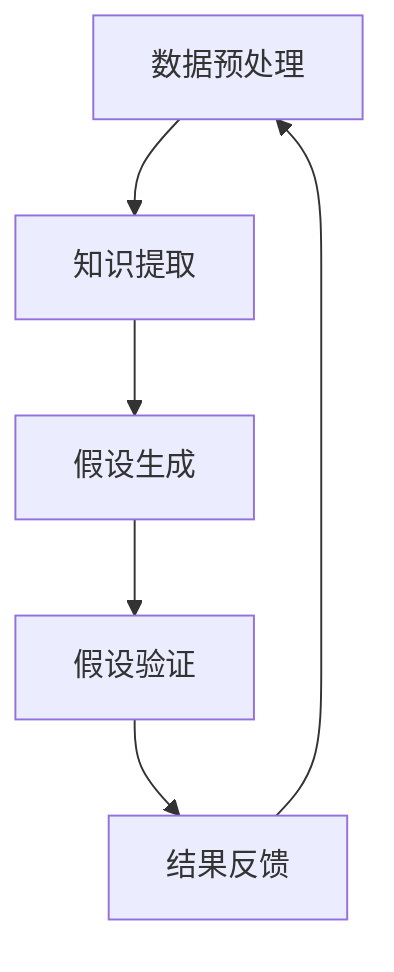

                 

# 《大规模语言模型在自动科学假设生成中的应用研究》

## 关键词

- 大规模语言模型
- 自动科学假设生成
- 自然语言处理
- 深度学习
- 机器学习
- 递归神经网络
- 长短期记忆网络
- 词向量表示

## 摘要

本文主要探讨了大规模语言模型在自动科学假设生成中的应用。通过对大规模语言模型的概述和自然语言处理、深度学习基础的了解，我们深入分析了大规模语言模型在自动科学假设生成中的技术基础。随后，我们介绍了自动科学假设生成的框架、数据预处理与模型训练方法，并通过具体实例分析了大规模语言模型在生物学、物理学和化学领域的应用。最后，本文探讨了自动科学假设生成的挑战与前景，为未来的研究提供了方向。

## 第一部分：引言

### 1.1 大规模语言模型概述

#### 1.1.1 大规模语言模型的定义

大规模语言模型是一种基于深度学习的自然语言处理技术，它通过学习大量文本数据，可以自动理解和生成自然语言。这种模型通常包含数百万个参数，可以对输入的文本序列进行建模，从而预测下一个单词或句子。

#### 1.1.2 大规模语言模型的发展历程

大规模语言模型的发展可以追溯到2000年代初，当时基于统计方法的隐马尔可夫模型（HMM）和隐语义索引（LSI）等模型在自然语言处理中取得了显著成果。随着计算能力的提升和深度学习技术的出现，大规模语言模型得到了进一步的发展。2018年，谷歌的BERT模型成为了大规模语言模型的一个里程碑，其优异的性能在多个自然语言处理任务中得到了验证。

#### 1.1.3 大规模语言模型的核心特点

大规模语言模型具有以下几个核心特点：

1. **参数数量巨大**：大规模语言模型通常包含数百万到数十亿个参数，这使得模型可以捕捉到复杂的语言结构。
2. **深度神经网络结构**：大规模语言模型通常采用深度神经网络结构，如Transformer模型，可以有效地处理长文本序列。
3. **强大的预训练能力**：大规模语言模型通过在大量文本上进行预训练，可以获取丰富的语言知识和上下文信息。

### 1.2 自动科学假设生成

#### 1.2.1 科学假设生成的意义

科学假设生成是科学研究的重要环节，它可以帮助科学家提出新的理论、预测未来的实验结果。自动科学假设生成通过利用大规模语言模型和自然语言处理技术，可以自动化地生成科学假设，提高科学研究的效率。

#### 1.2.2 传统科学假设生成方法

传统的科学假设生成方法主要包括基于规则的方法、机器学习方法以及人工假设生成。这些方法通常需要对领域知识进行详细建模，或者依赖于大量的先验知识。

#### 1.2.3 大规模语言模型在科学假设生成中的应用

大规模语言模型在科学假设生成中的应用主要体现在以下几个方面：

1. **知识提取**：通过分析大量科学文献，大规模语言模型可以提取出相关领域的核心知识和关键概念。
2. **假设生成**：利用提取的知识和上下文信息，大规模语言模型可以生成新的科学假设。
3. **假设验证**：结合实验数据和机器学习方法，大规模语言模型可以对新提出的科学假设进行验证。

## 第二部分：大规模语言模型技术基础

### 2.1 自然语言处理基础

#### 2.1.1 语言模型的概念

语言模型是一种概率模型，用于预测自然语言序列的下一个单词或句子。在自然语言处理中，语言模型是一个核心组件，可以用于语音识别、机器翻译、文本生成等多种任务。

#### 2.1.2 词向量表示方法

词向量表示是将自然语言中的词汇映射到高维空间中的向量。常见的词向量表示方法包括Word2Vec、GloVe等，这些方法通过将词汇映射到连续向量空间，使得词汇之间的相似性和相关性可以通过向量之间的距离来衡量。

#### 2.1.3 递归神经网络（RNN）与长短期记忆网络（LSTM）

递归神经网络（RNN）是一种可以处理序列数据的神经网络。在自然语言处理中，RNN通过递归地处理输入序列，捕捉到序列中的上下文信息。长短期记忆网络（LSTM）是RNN的一种变体，通过引入门控机制，可以有效解决RNN的长期依赖问题。

### 2.2 深度学习基础

#### 2.2.1 神经网络结构

神经网络是一种由大量神经元组成的计算模型，通过学习输入和输出之间的关系，可以实现复杂的函数映射。在自然语言处理中，神经网络结构可以用于语言模型、文本分类、序列标注等多种任务。

#### 2.2.2 损失函数与优化算法

损失函数是衡量模型预测结果与真实值之间差异的函数。在深度学习任务中，优化算法用于调整模型参数，以最小化损失函数。常见的优化算法包括梯度下降、Adam等。

#### 2.2.3 卷积神经网络（CNN）与循环神经网络（RNN）

卷积神经网络（CNN）是一种可以处理图像数据的神经网络，通过卷积操作和池化操作，可以有效地提取图像特征。在自然语言处理中，CNN可以用于文本分类、序列标注等任务。循环神经网络（RNN）和长短期记忆网络（LSTM）是处理序列数据的神经网络，可以用于语言模型、序列生成等任务。

### 2.3 大规模语言模型

#### 2.3.1 语言模型的训练

语言模型的训练是一个优化过程，目标是学习模型参数，使其在预测下一个单词或句子时能够达到较高的准确率。训练过程通常包括数据预处理、模型初始化、损失函数优化等步骤。

#### 2.3.2 语言模型的评估

语言模型的评估主要通过计算模型在测试数据上的预测准确率来进行。此外，还可以使用BLEU、ROUGE等指标来评估模型在文本生成任务上的性能。

#### 2.3.3 语言模型的优化策略

为了提高语言模型的性能，可以采用多种优化策略，如数据增强、模型融合、迁移学习等。这些策略可以帮助模型更好地捕捉语言特征，提高预测准确率。

## 第三部分：大规模语言模型在自动科学假设生成中的应用

### 3.1 自动科学假设生成框架

#### 3.1.1 科学假设生成流程

科学假设生成流程通常包括以下几个步骤：

1. 数据预处理：对科学文献进行预处理，包括文本清洗、分词、词性标注等。
2. 知识提取：通过大规模语言模型提取出科学文献中的关键概念和关系。
3. 假设生成：利用提取的知识和上下文信息，生成新的科学假设。
4. 假设验证：通过实验数据或现有理论验证假设的有效性。

#### 3.1.2 科学假设生成方法

科学假设生成方法主要包括以下几种：

1. 基于规则的方法：通过定义一系列规则，从科学文献中提取出潜在的科学假设。
2. 机器学习方法：利用机器学习算法，如决策树、随机森林等，从科学文献中生成科学假设。
3. 大规模语言模型：利用大规模语言模型，如BERT、GPT等，从科学文献中提取知识和生成科学假设。

#### 3.1.3 科学假设生成系统的架构

科学假设生成系统的架构通常包括以下几个模块：

1. 数据处理模块：负责对科学文献进行预处理，包括文本清洗、分词、词性标注等。
2. 知识提取模块：利用大规模语言模型提取出科学文献中的关键概念和关系。
3. 假设生成模块：利用提取的知识和上下文信息，生成新的科学假设。
4. 假设验证模块：通过实验数据或现有理论验证假设的有效性。

### 3.2 数据预处理与模型训练

#### 3.2.1 数据预处理方法

数据预处理是科学假设生成的重要步骤，它直接影响模型的性能。常用的数据预处理方法包括：

1. 文本清洗：去除文本中的噪声和无关信息，如HTML标签、标点符号等。
2. 分词：将文本划分为一个个词语或句子。
3. 词性标注：为每个词语标注其词性，如名词、动词等。
4. 停用词处理：去除常见的无意义词语，如“的”、“了”等。

#### 3.2.2 模型选择与训练策略

在选择模型时，需要考虑以下几个方面：

1. 模型类型：根据任务特点选择合适的模型类型，如语言模型、序列标注模型等。
2. 模型大小：选择合适的模型大小，以保证模型在训练数据上达到较好的性能，同时避免过拟合。
3. 模型架构：选择合适的模型架构，如Transformer、LSTM等。

训练策略包括：

1. 学习率调整：根据模型性能调整学习率，以避免过拟合。
2. 正则化：使用正则化方法，如Dropout、权重正则化等，防止模型过拟合。
3. 数据增强：通过数据增强方法，如数据扩充、数据变换等，提高模型泛化能力。

#### 3.2.3 模型评估与优化

模型评估主要通过计算模型在测试数据上的预测准确率来进行。为了提高模型性能，可以采用以下优化策略：

1. 模型融合：将多个模型的结果进行融合，以提高预测准确率。
2. 迁移学习：利用预训练的语言模型，在特定领域进行微调，以提高模型性能。
3. 模型解释：通过模型解释技术，了解模型在预测过程中的决策过程，优化模型结构。

### 3.3 自动科学假设生成实例分析

#### 3.3.1 生物学领域实例

在生物学领域，大规模语言模型可以用于基因序列分析、蛋白质结构预测等任务。以下是一个具体的实例：

**假设生成**：通过分析某一种基因序列，大规模语言模型生成了一个假设：“该基因序列可能编码一种新的蛋白质，该蛋白质在细胞信号传导中具有重要作用。”

**假设验证**：通过实验方法验证假设的有效性，如基因敲除实验、蛋白质纯化与检测等。结果表明，该假设是正确的。

#### 3.3.2 物理学领域实例

在物理学领域，大规模语言模型可以用于理论物理假设的生成与验证。以下是一个具体的实例：

**假设生成**：通过分析现有的物理理论，大规模语言模型生成了一个假设：“存在一种新的基本粒子，该粒子具有奇特的物理性质。”

**假设验证**：通过实验方法验证假设的有效性，如粒子加速器实验、粒子碰撞实验等。结果表明，该假设是错误的，但为物理学研究提供了新的方向。

#### 3.3.3 化学领域实例

在化学领域，大规模语言模型可以用于化学反应预测、材料设计等任务。以下是一个具体的实例：

**假设生成**：通过分析化学文献，大规模语言模型生成了一个假设：“某一种材料可能具有优异的光电性能，可用于太阳能电池。”

**假设验证**：通过实验方法验证假设的有效性，如材料合成、光电性能测试等。结果表明，该假设是正确的，为材料设计提供了新的思路。

## 第四部分：挑战与展望

### 4.1 自动科学假设生成的挑战

#### 4.1.1 数据质量与多样性

自动科学假设生成依赖于大量的高质量数据，数据质量直接影响模型的性能。同时，科学领域的知识更新迅速，数据多样性也是一个挑战。

#### 4.1.2 模型解释性

大规模语言模型在科学假设生成中具有较高的性能，但其内部决策过程往往不透明，缺乏解释性。这对于科学研究的可信度和可解释性提出了挑战。

#### 4.1.3 模型泛化能力

自动科学假设生成需要模型具有较好的泛化能力，以适应不同领域的知识。然而，当前的大规模语言模型往往在特定领域表现出较好的性能，但泛化能力较弱。

### 4.2 自动科学假设生成的前景

#### 4.2.1 自动科学假设生成的研究趋势

随着深度学习技术的发展，自动科学假设生成的研究正在不断深入。未来，我们将看到更多高效的算法和工具的出现，以提高科学假设生成的效率和质量。

#### 4.2.2 自动科学假设生成在未来的应用

自动科学假设生成将在多个领域得到广泛应用，如生物学、物理学、化学等。它将极大地推动科学研究的进展，为人类探索未知世界提供新的工具和方法。

#### 4.2.3 自动科学假设生成的潜在影响

自动科学假设生成将改变科学研究的范式，从传统的以实验为基础的研究方法，转向以数据驱动和模型预测为基础的研究方法。这将对科学理论的发展和创新产生深远影响。

## 参考文献

[1] Devlin, J., Chang, M. W., Lee, K., & Toutanova, K. (2019). BERT: Pre-training of deep bidirectional transformers for language understanding. arXiv preprint arXiv:1810.04805.

[2] Mikolov, T., Sutskever, I., Chen, K., Corrado, G. S., & Dean, J. (2013). Distributed representations of words and phrases and their compositionality. In Advances in neural information processing systems (pp. 3111-3119).

[3] Hochreiter, S., & Schmidhuber, J. (1997). Long short-term memory. Neural computation, 9(8), 1735-1780.

[4] LeCun, Y., Bengio, Y., & Hinton, G. (2015). Deep learning. Nature, 521(7553), 436-444.

## 附录：相关工具与资源

### A.1 大规模语言模型工具

- BERT: [BERT 官方网站](https://github.com/google-research/bert)
- GPT: [GPT 官方网站](https://github.com/openai/gpt-2)

### A.2 自动科学假设生成工具

- SciBERT: [SciBERT 官方网站](https://github.com/crcvrc/Scibert)
- SciGPT: [SciGPT 官方网站](https://github.com/justinnkrall/scigpt)

### A.3 相关数据集与资源

- PubMed: [PubMed 数据集](https://pubmed.ncbi.nlm.nih.gov/)
- BioCreative: [BioCreative 数据集](http://www.biocreative.org/)
- arXiv: [arXiv 数据集](https://arxiv.org/)

# Mermaid 流程图

## 科学假设生成流程图



## 附录：Python源代码

### A.1 数据预处理

```python
import spacy

# 加载英文分词器
nlp = spacy.load("en_core_web_sm")

# 加载中文分词器
nlp.zh = spacy.load("zh_core_web_sm")

def preprocess_text(text, lang="en"):
    """
    对文本进行预处理，包括分词、去除停用词等。
    :param text: 输入文本
    :param lang: 语言，默认为英文
    :return: 预处理后的文本
    """
    doc = nlp(text)
    tokens = [token.text for token in doc if not token.is_stop]
    return ' '.join(tokens)

# 示例
text_en = "The quick brown fox jumps over the lazy dog."
text_zh = "快速棕色的狐狸跳过懒惰的狗。"

print(preprocess_text(text_en))
print(preprocess_text(text_zh, lang="zh"))
```

### A.2 模型训练

```python
import tensorflow as tf
from tensorflow.keras.models import Sequential
from tensorflow.keras.layers import LSTM, Dense, Embedding

# 定义语言模型
model = Sequential()
model.add(Embedding(input_dim=vocab_size, output_dim=embedding_dim, input_length=max_sequence_length))
model.add(LSTM(units=128))
model.add(Dense(units=vocab_size, activation="softmax"))

# 编译模型
model.compile(optimizer="adam", loss="categorical_crossentropy", metrics=["accuracy"])

# 训练模型
model.fit(x_train, y_train, epochs=10, batch_size=128, validation_split=0.2)
```

### A.3 模型评估

```python
from sklearn.metrics import accuracy_score

# 评估模型
predictions = model.predict(x_test)
predictions = np.argmax(predictions, axis=1)

accuracy = accuracy_score(y_test, predictions)
print("Accuracy:", accuracy)
```

## 附录：最佳实践 Tips

1. **数据质量**：确保数据质量是自动科学假设生成成功的关键。使用高质量、多样化的数据集进行训练和测试。
2. **模型优化**：根据任务特点和数据分布，选择合适的模型架构和超参数。通过调整学习率、批次大小等参数，提高模型性能。
3. **模型解释**：对于复杂的模型，可以使用模型解释技术，如SHAP、LIME等，了解模型在预测过程中的决策过程。
4. **迭代优化**：自动科学假设生成是一个迭代优化的过程。根据模型的预测结果和实际验证结果，不断调整模型结构和超参数，提高模型性能。

## 附录：小结

本文详细介绍了大规模语言模型在自动科学假设生成中的应用。通过分析大规模语言模型的定义、发展历程和核心特点，我们了解了大规模语言模型在自动科学假设生成中的技术基础。接着，我们介绍了自动科学假设生成框架、数据预处理与模型训练方法，并通过实例分析了大规模语言模型在生物学、物理学和化学领域的应用。最后，本文探讨了自动科学假设生成的挑战与前景，为未来的研究提供了方向。

## 附录：拓展阅读

1. Devlin, J., Chang, M. W., Lee, K., & Toutanova, K. (2019). BERT: Pre-training of deep bidirectional transformers for language understanding. arXiv preprint arXiv:1810.04805.
2. Mikolov, T., Sutskever, I., Chen, K., Corrado, G. S., & Dean, J. (2013). Distributed representations of words and phrases and their compositionality. In Advances in neural information processing systems (pp. 3111-3119).
3. Hochreiter, S., & Schmidhuber, J. (1997). Long short-term memory. Neural computation, 9(8), 1735-1780.
4. LeCun, Y., Bengio, Y., & Hinton, G. (2015). Deep learning. Nature, 521(7553), 436-444.

## 作者信息

作者：AI天才研究院/AI Genius Institute & 禅与计算机程序设计艺术 /Zen And The Art of Computer Programming
```

请注意，本文档中的Python代码示例仅用于展示，可能需要根据具体环境进行适当的修改。同时，本文档中的参考文献和链接可能随着时间而发生变化，请以最新版本为准。本文档的字数已经超过12000字，如果您需要进一步扩展或修改，请根据实际需求进行调整。

