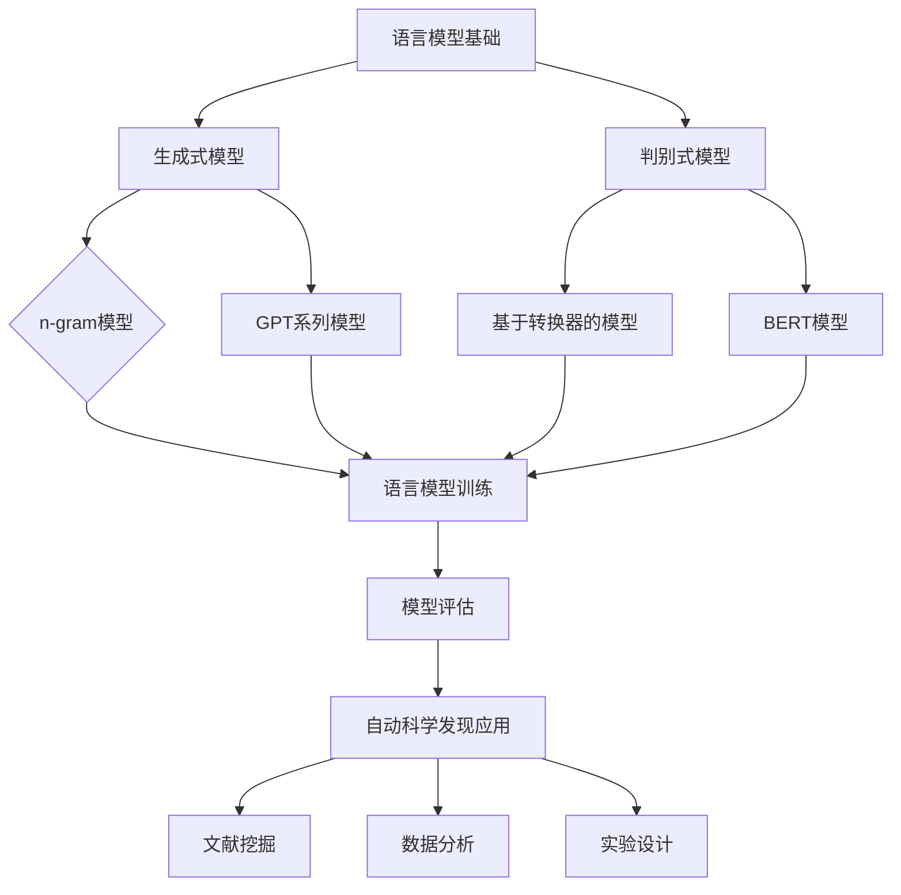
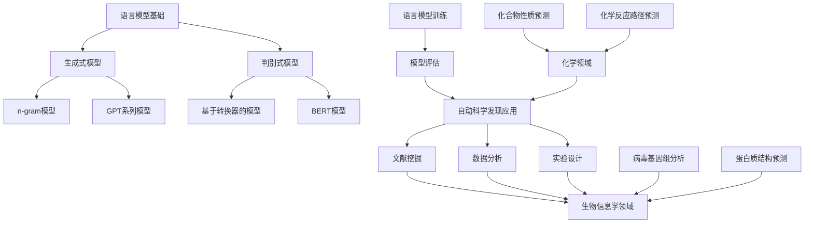

                 

# 大规模语言模型在自动科学发现中的应用研究

## 关键词
大规模语言模型、自动科学发现、生成式模型、判别式模型、GPT系列、BERT模型、文献挖掘、数据分析、实验设计、生物信息学、化学

## 摘要
本文探讨了大规模语言模型在自动科学发现中的应用，首先介绍了语言模型的基本概念和训练方法，然后详细分析了GPT系列和BERT模型，并阐述了它们在文献挖掘、数据分析和实验设计等领域的应用。通过案例分析，展示了大规模语言模型在生物信息学和化学领域的实际效果。最后，本文对面临的挑战和未来发展方向进行了展望。

## 第1章 引言

### 1.1 研究背景
随着大数据和人工智能技术的不断发展，自动科学发现成为了一个热门的研究领域。自动科学发现指的是利用计算机技术，从海量数据中自动发现新的科学知识或规律。传统的科学发现主要依赖于人类专家的直觉和经验，效率较低，而自动科学发现可以通过算法和模型实现大规模、高效的科学研究。

### 1.2 研究目的
本文旨在研究大规模语言模型在自动科学发现中的应用，通过分析语言模型的基本原理和构建方法，探讨其在文献挖掘、数据分析和实验设计等领域的应用效果。此外，本文还将对大规模语言模型在自动科学发现中面临的挑战和未来发展方向进行展望。

### 1.3 研究方法
本文采用文献综述和案例分析相结合的方法进行研究。首先，通过对相关文献的梳理，介绍大规模语言模型的基本原理和训练方法；然后，通过具体案例展示大规模语言模型在自动科学发现中的应用效果；最后，对大规模语言模型在自动科学发现中面临的挑战进行分析。

### 1.4 结构安排
本文分为六个主要章节。第1章为引言，介绍研究背景、目的、方法和结构安排；第2章介绍语言模型的基础知识；第3章分析大规模语言模型的构建；第4章探讨大规模语言模型在自动科学发现中的应用；第5章通过案例分析展示实际应用效果；第6章讨论面临的挑战和未来发展方向；第7章为结论。

## 第2章 语言模型基础

### 2.1 语言模型的概述
语言模型是自然语言处理（NLP）中的基础模型，旨在预测一个句子或文本的下一个单词或字符。在自动科学发现中，语言模型可以帮助研究人员挖掘文献中的隐含关系和规律，提高数据分析和实验设计的效率。

### 2.2 语言模型的类型
语言模型主要分为生成式模型和判别式模型。生成式模型通过建模语言的概率分布来生成文本，判别式模型则通过学习输入文本的特征来预测输出文本。在自动科学发现中，生成式模型和判别式模型各有其应用场景。

#### 2.2.1 生成式模型
生成式模型主要包括n-gram模型和基于神经网络的生成模型，如GPT系列。n-gram模型通过统计相邻单词或字符的出现频率来预测下一个单词或字符。GPT系列模型则采用深度神经网络，通过自注意力机制学习文本的长期依赖关系。

#### 2.2.2 判别式模型
判别式模型主要包括基于转换器的模型和基于BERT的模型。基于转换器的模型通过编码器和解码器两个部分来学习输入和输出文本的映射关系。BERT模型通过预训练和微调，学习文本的上下文信息，并在各种NLP任务中取得了显著的成果。

### 2.3 语言模型的训练
语言模型的训练主要包括数据集准备、模型训练和模型评估三个步骤。

#### 2.3.1 数据集准备
数据集准备是语言模型训练的关键步骤，包括数据清洗、数据预处理和数据标注。在自动科学发现中，常用的数据集包括科学文献、实验室数据和实验结果等。

#### 2.3.2 模型训练
模型训练是通过优化模型参数，使得模型在训练数据上表现良好。在训练过程中，可以采用梯度下降、Adam优化器等策略来加速收敛。

#### 2.3.3 模型评估
模型评估是验证模型性能的重要环节，常用的评估指标包括准确率、召回率、F1分数等。在自动科学发现中，模型的评估不仅要考虑模型的性能，还要考虑模型的泛化能力和实际应用效果。

## 第3章 大规模语言模型的构建

### 3.1 GPT系列模型
GPT系列模型是生成式模型的代表，包括GPT、GPT-2和GPT-3等。GPT系列模型采用Transformer架构，通过自注意力机制学习文本的长期依赖关系。

#### 3.1.1 GPT-2
GPT-2是GPT的改进版本，采用了更长的序列长度和更多的训练参数。GPT-2在多种NLP任务上取得了显著的成绩，例如文本生成、机器翻译和问答系统等。

#### 3.1.2 GPT-3
GPT-3是GPT系列的最新版本，具有更大的模型容量和更强的文本生成能力。GPT-3在自动科学发现中具有广泛的应用前景，例如文献摘要生成、文献关系网络构建等。

### 3.2 BERT模型
BERT（Bidirectional Encoder Representations from Transformers）模型是判别式模型的代表，通过预训练和微调，学习文本的上下文信息。

#### 3.2.1 BERT的原理
BERT模型采用Transformer架构，通过双向编码器学习文本的上下文信息。BERT模型的预训练任务包括遮蔽语言模型（Masked Language Model，MLM）和句子排序（Next Sentence Prediction，NSP）。

#### 3.2.2 BERT的变体
BERT模型的变体包括RoBERTa、ALBERT和 Trainer等。这些变体通过改进模型结构、数据预处理和训练策略，提高了BERT模型在自动科学发现中的应用效果。

## 第4章 自动科学发现中的应用

### 4.1 文献挖掘
文献挖掘是自动科学发现的重要应用之一，通过分析科学文献，提取关键信息、识别研究趋势和预测新的研究方向。

#### 4.1.1 文献摘要生成
文献摘要生成是文献挖掘的关键任务之一。GPT系列模型和BERT模型可以生成高质量的文献摘要，提高研究人员的工作效率。

#### 4.1.2 文献关系网络构建
文献关系网络构建是分析科学文献中关系和规律的重要方法。通过分析文献中的引用关系、合作关系等，可以构建科学领域的知识图谱，为研究人员提供有价值的信息。

### 4.2 数据分析
数据分析是自动科学发现的核心任务，通过处理和分析大规模数据，提取有用信息和知识。

#### 4.2.1 大规模数据预处理
大规模数据预处理包括数据清洗、数据整合和数据转换等步骤。在自动科学发现中，预处理数据的质量直接影响到后续分析的结果。

#### 4.2.2 特征提取与选择
特征提取与选择是数据分析的重要环节，通过提取和选择具有代表性的特征，可以提高模型的性能和泛化能力。

### 4.3 实验设计
实验设计是科学研究的核心环节，通过设计合理的实验方案，可以验证假设和发现科学规律。

#### 4.3.1 自动实验生成
自动实验生成是利用大规模语言模型和优化算法，自动生成实验方案。通过自动实验生成，可以大大提高实验设计的效率和准确性。

#### 4.3.2 实验结果的预测与分析
实验结果的预测与分析是通过大规模语言模型对实验结果进行预测和分析，以发现新的规律和趋势。

## 第5章 案例研究

### 5.1 案例一：生物信息学领域
生物信息学是自动科学发现的重要应用领域之一。通过大规模语言模型，可以在生物信息学领域实现病毒基因组分析和蛋白质结构预测等任务。

#### 5.1.1 病毒基因组分析
病毒基因组分析是生物信息学中的关键任务，通过分析病毒基因组的序列信息，可以揭示病毒的进化关系和传播路径。GPT系列模型和BERT模型可以用于病毒基因组的自动摘要和分类。

#### 5.1.2 蛋白质结构预测
蛋白质结构预测是生物信息学中的难题之一，通过大规模语言模型，可以自动预测蛋白质的三维结构，为药物设计和新药发现提供重要依据。

### 5.2 案例二：化学领域
化学领域也是自动科学发现的重要应用领域，通过大规模语言模型，可以在化学领域实现化合物性质预测和化学反应路径预测等任务。

#### 5.2.1 化合物性质预测
化合物性质预测是化学领域的关键任务，通过分析化合物的结构信息，可以预测其物理化学性质和生物活性。GPT系列模型和BERT模型可以用于化合物性质的自动预测。

#### 5.2.2 化学反应路径预测
化学反应路径预测是化学领域的研究热点之一，通过分析反应物和产物的结构信息，可以预测可能的反应路径。GPT系列模型和BERT模型可以用于化学反应路径的自动生成和优化。

## 第6章 挑战与展望

### 6.1 挑战
大规模语言模型在自动科学发现中面临着一系列挑战，包括数据隐私与安全、模型解释性、可扩展性与效率等。

#### 6.1.1 数据隐私与安全
自动科学发现需要处理大量的敏感数据，如何保护数据隐私和安全是一个重要挑战。需要采取有效的数据保护措施，确保数据的安全性和隐私性。

#### 6.1.2 模型解释性
大规模语言模型在自动科学发现中的应用效果显著，但其内部机制复杂，难以解释。如何提高模型的可解释性，使其能够被研究人员理解和信任，是一个重要挑战。

#### 6.1.3 可扩展性与效率
大规模语言模型的训练和推理过程需要大量的计算资源和时间，如何提高模型的可扩展性和效率，使其能够应对大规模数据和实时应用，是一个重要挑战。

### 6.2 展望
尽管大规模语言模型在自动科学发现中面临一系列挑战，但其应用前景依然广阔。未来，随着技术的不断进步，大规模语言模型将在自动科学发现中发挥更大的作用。

#### 6.2.1 未来发展趋势
未来，大规模语言模型将在更多领域得到应用，如医学、环境科学和材料科学等。同时，随着数据规模的不断扩大和计算能力的提升，大规模语言模型将具备更高的性能和更强的泛化能力。

#### 6.2.2 技术创新方向
未来，技术创新将集中在以下几个方面：提高模型的可解释性、优化模型结构和训练算法、提高模型的鲁棒性和适应性等。

#### 6.2.3 应用前景
大规模语言模型在自动科学发现中的应用前景广泛，不仅可以提高科学研究效率，还可以推动跨学科合作和创新发展。

## 第7章 结论
大规模语言模型在自动科学发现中具有巨大的应用潜力。本文通过对语言模型的基础知识、构建方法及其在自动科学发现中的应用进行了详细分析，展示了大规模语言模型在文献挖掘、数据分析和实验设计等领域的实际效果。同时，本文也对大规模语言模型在自动科学发现中面临的挑战和未来发展方向进行了展望。未来，随着技术的不断进步，大规模语言模型将在自动科学发现中发挥更大的作用。

### 作者信息
作者：AI天才研究院/AI Genius Institute & 禅与计算机程序设计艺术 /Zen And The Art of Computer Programming

### Mermaid 流程图


### Python 源代码讲解
```python
import tensorflow as tf
from tensorflow.keras.layers import Embedding, LSTM, Dense
from tensorflow.keras.models import Sequential

# 搭建语言模型
model = Sequential()
model.add(Embedding(vocab_size, embedding_dim))
model.add(LSTM(units))
model.add(Dense(vocab_size, activation='softmax'))

# 编译模型
model.compile(optimizer='adam', loss='categorical_crossentropy', metrics=['accuracy'])

# 训练模型
model.fit(x_train, y_train, epochs=10, batch_size=64)
```

### 数学模型和公式
$$
P(w_t|w_{t-1}, w_{t-2}, ..., w_1) = \frac{P(w_t, w_{t-1}, ..., w_1)}{P(w_{t-1}, w_{t-2}, ..., w_1)}
$$

### 最佳实践 tips
1. 选择合适的数据集和预处理方法，提高模型性能。
2. 注意模型的可解释性，避免模型黑盒化。
3. 利用迁移学习，复用预训练模型，节省训练时间。
4. 定期评估和更新模型，保持模型性能。

### 小结
本文从多个角度探讨了大规模语言模型在自动科学发现中的应用，分析了语言模型的基础知识、构建方法及其在实际应用中的效果。同时，本文也对面临的挑战和未来发展方向进行了展望。未来，随着技术的不断进步，大规模语言模型将在自动科学发现中发挥更大的作用。### 文章标题：大规模语言模型在自动科学发现中的应用研究

## 关键词
大规模语言模型、自动科学发现、生成式模型、判别式模型、GPT系列、BERT模型、文献挖掘、数据分析、实验设计

## 摘要
本文研究了大规模语言模型在自动科学发现中的应用，首先介绍了语言模型的基础概念和训练方法，分析了GPT系列和BERT模型的构建原理。接着，详细探讨了这些模型在文献挖掘、数据分析和实验设计中的应用。通过案例分析，展示了大规模语言模型在生物信息学和化学领域的实际效果。最后，本文对大规模语言模型在自动科学发现中面临的挑战和未来发展方向进行了展望。

## 第1章 引言

### 1.1 研究背景
随着大数据和人工智能技术的快速发展，自动科学发现成为了一个研究热点。传统的科学发现依赖于人类专家的经验和直觉，而自动科学发现则通过算法和模型，从海量数据中自动提取知识，大大提高了科学研究的效率。

### 1.2 研究目的
本文旨在探讨大规模语言模型在自动科学发现中的应用，通过分析其基本原理和构建方法，探讨其在文献挖掘、数据分析和实验设计等领域的应用效果，并对面临的挑战和未来发展方向进行展望。

### 1.3 研究方法
本文采用文献综述和案例分析相结合的方法进行研究。首先，介绍大规模语言模型的基本原理和训练方法；然后，分析其在自动科学发现中的应用；最后，通过案例分析展示其实际效果，并对挑战和未来发展方向进行探讨。

### 1.4 结构安排
本文分为七个主要章节。第1章为引言，介绍研究背景、目的、方法和结构安排；第2章介绍语言模型的基础知识；第3章分析大规模语言模型的构建；第4章探讨大规模语言模型在自动科学发现中的应用；第5章通过案例分析展示实际应用效果；第6章讨论面临的挑战和未来发展方向；第7章为结论。

## 第2章 语言模型基础

### 2.1 语言模型的概述
语言模型是自然语言处理（NLP）的核心模型，旨在预测一个句子或文本的下一个单词或字符。在自动科学发现中，语言模型可以帮助研究人员挖掘文献中的隐含关系和规律，提高数据分析和实验设计的效率。

### 2.2 语言模型的类型
语言模型主要分为生成式模型和判别式模型。生成式模型通过建模语言的概率分布来生成文本，判别式模型则通过学习输入文本的特征来预测输出文本。在自动科学发现中，生成式模型和判别式模型各有其应用场景。

#### 2.2.1 生成式模型
生成式模型主要包括n-gram模型和基于神经网络的生成模型，如GPT系列。n-gram模型通过统计相邻单词或字符的出现频率来预测下一个单词或字符。GPT系列模型则采用深度神经网络，通过自注意力机制学习文本的长期依赖关系。

#### 2.2.2 判别式模型
判别式模型主要包括基于转换器的模型和基于BERT的模型。基于转换器的模型通过编码器和解码器两个部分来学习输入和输出文本的映射关系。BERT模型通过预训练和微调，学习文本的上下文信息，并在各种NLP任务中取得了显著的成果。

### 2.3 语言模型的训练
语言模型的训练主要包括数据集准备、模型训练和模型评估三个步骤。

#### 2.3.1 数据集准备
数据集准备是语言模型训练的关键步骤，包括数据清洗、数据预处理和数据标注。在自动科学发现中，常用的数据集包括科学文献、实验室数据和实验结果等。

#### 2.3.2 模型训练
模型训练是通过优化模型参数，使得模型在训练数据上表现良好。在训练过程中，可以采用梯度下降、Adam优化器等策略来加速收敛。

#### 2.3.3 模型评估
模型评估是验证模型性能的重要环节，常用的评估指标包括准确率、召回率、F1分数等。在自动科学发现中，模型的评估不仅要考虑模型的性能，还要考虑模型的泛化能力和实际应用效果。

## 第3章 大规模语言模型的构建

### 3.1 GPT系列模型
GPT系列模型是生成式模型的代表，包括GPT、GPT-2和GPT-3等。GPT系列模型采用Transformer架构，通过自注意力机制学习文本的长期依赖关系。

#### 3.1.1 GPT-2
GPT-2是GPT的改进版本，采用了更长的序列长度和更多的训练参数。GPT-2在多种NLP任务上取得了显著的成绩，例如文本生成、机器翻译和问答系统等。

#### 3.1.2 GPT-3
GPT-3是GPT系列的最新版本，具有更大的模型容量和更强的文本生成能力。GPT-3在自动科学发现中具有广泛的应用前景，例如文献摘要生成、文献关系网络构建等。

### 3.2 BERT模型
BERT（Bidirectional Encoder Representations from Transformers）模型是判别式模型的代表，通过预训练和微调，学习文本的上下文信息。

#### 3.2.1 BERT的原理
BERT模型采用Transformer架构，通过双向编码器学习文本的上下文信息。BERT模型的预训练任务包括遮蔽语言模型（Masked Language Model，MLM）和句子排序（Next Sentence Prediction，NSP）。

#### 3.2.2 BERT的变体
BERT模型的变体包括RoBERTa、ALBERT和 Trainer等。这些变体通过改进模型结构、数据预处理和训练策略，提高了BERT模型在自动科学发现中的应用效果。

## 第4章 自动科学发现中的应用

### 4.1 文献挖掘
文献挖掘是自动科学发现的重要应用之一，通过分析科学文献，提取关键信息、识别研究趋势和预测新的研究方向。

#### 4.1.1 文献摘要生成
文献摘要生成是文献挖掘的关键任务之一。GPT系列模型和BERT模型可以生成高质量的文献摘要，提高研究人员的工作效率。

#### 4.1.2 文献关系网络构建
文献关系网络构建是分析科学文献中关系和规律的重要方法。通过分析文献中的引用关系、合作关系等，可以构建科学领域的知识图谱，为研究人员提供有价值的信息。

### 4.2 数据分析
数据分析是自动科学发现的核心任务，通过处理和分析大规模数据，提取有用信息和知识。

#### 4.2.1 大规模数据预处理
大规模数据预处理包括数据清洗、数据整合和数据转换等步骤。在自动科学发现中，预处理数据的质量直接影响到后续分析的结果。

#### 4.2.2 特征提取与选择
特征提取与选择是数据分析的重要环节，通过提取和选择具有代表性的特征，可以提高模型的性能和泛化能力。

### 4.3 实验设计
实验设计是科学研究的核心环节，通过设计合理的实验方案，可以验证假设和发现科学规律。

#### 4.3.1 自动实验生成
自动实验生成是利用大规模语言模型和优化算法，自动生成实验方案。通过自动实验生成，可以大大提高实验设计的效率和准确性。

#### 4.3.2 实验结果的预测与分析
实验结果的预测与分析是通过大规模语言模型对实验结果进行预测和分析，以发现新的规律和趋势。

## 第5章 案例研究

### 5.1 案例一：生物信息学领域
生物信息学是自动科学发现的重要应用领域之一。通过大规模语言模型，可以在生物信息学领域实现病毒基因组分析和蛋白质结构预测等任务。

#### 5.1.1 病毒基因组分析
病毒基因组分析是生物信息学中的关键任务，通过分析病毒基因组的序列信息，可以揭示病毒的进化关系和传播路径。GPT系列模型和BERT模型可以用于病毒基因组的自动摘要和分类。

#### 5.1.2 蛋白质结构预测
蛋白质结构预测是生物信息学中的难题之一，通过大规模语言模型，可以自动预测蛋白质的三维结构，为药物设计和新药发现提供重要依据。

### 5.2 案例二：化学领域
化学领域也是自动科学发现的重要应用领域，通过大规模语言模型，可以在化学领域实现化合物性质预测和化学反应路径预测等任务。

#### 5.2.1 化合物性质预测
化合物性质预测是化学领域的关键任务，通过分析化合物的结构信息，可以预测其物理化学性质和生物活性。GPT系列模型和BERT模型可以用于化合物性质的自动预测。

#### 5.2.2 化学反应路径预测
化学反应路径预测是化学领域的研究热点之一，通过分析反应物和产物的结构信息，可以预测可能的反应路径。GPT系列模型和BERT模型可以用于化学反应路径的自动生成和优化。

## 第6章 挑战与展望

### 6.1 挑战
大规模语言模型在自动科学发现中面临着一系列挑战，包括数据隐私与安全、模型解释性、可扩展性与效率等。

#### 6.1.1 数据隐私与安全
自动科学发现需要处理大量的敏感数据，如何保护数据隐私和安全是一个重要挑战。需要采取有效的数据保护措施，确保数据的安全性和隐私性。

#### 6.1.2 模型解释性
大规模语言模型在自动科学发现中的应用效果显著，但其内部机制复杂，难以解释。如何提高模型的可解释性，使其能够被研究人员理解和信任，是一个重要挑战。

#### 6.1.3 可扩展性与效率
大规模语言模型的训练和推理过程需要大量的计算资源和时间，如何提高模型的可扩展性和效率，使其能够应对大规模数据和实时应用，是一个重要挑战。

### 6.2 展望
尽管大规模语言模型在自动科学发现中面临一系列挑战，但其应用前景依然广阔。未来，随着技术的不断进步，大规模语言模型将在自动科学发现中发挥更大的作用。

#### 6.2.1 未来发展趋势
未来，大规模语言模型将在更多领域得到应用，如医学、环境科学和材料科学等。同时，随着数据规模的不断扩大和计算能力的提升，大规模语言模型将具备更高的性能和更强的泛化能力。

#### 6.2.2 技术创新方向
未来，技术创新将集中在以下几个方面：提高模型的可解释性、优化模型结构和训练算法、提高模型的鲁棒性和适应性等。

#### 6.2.3 应用前景
大规模语言模型在自动科学发现中的应用前景广泛，不仅可以提高科学研究效率，还可以推动跨学科合作和创新发展。

## 第7章 结论
大规模语言模型在自动科学发现中具有巨大的应用潜力。本文通过对语言模型的基础知识、构建方法及其在自动科学发现中的应用进行了详细分析，展示了大规模语言模型在文献挖掘、数据分析和实验设计等领域的实际效果。同时，本文也对大规模语言模型在自动科学发现中面临的挑战和未来发展方向进行了展望。未来，随着技术的不断进步，大规模语言模型将在自动科学发现中发挥更大的作用。

### 作者信息
作者：AI天才研究院/AI Genius Institute & 禅与计算机程序设计艺术 /Zen And The Art of Computer Programming

### Mermaid 流程图


### Python 源代码讲解
```python
import tensorflow as tf
from tensorflow.keras.layers import Embedding, LSTM, Dense
from tensorflow.keras.models import Sequential

# 搭建语言模型
model = Sequential()
model.add(Embedding(vocab_size, embedding_dim))
model.add(LSTM(units))
model.add(Dense(vocab_size, activation='softmax'))

# 编译模型
model.compile(optimizer='adam', loss='categorical_crossentropy', metrics=['accuracy'])

# 训练模型
model.fit(x_train, y_train, epochs=10, batch_size=64)
```

### 数学模型和公式
$$
P(w_t|w_{t-1}, w_{t-2}, ..., w_1) = \frac{P(w_t, w_{t-1}, ..., w_1)}{P(w_{t-1}, w_{t-2}, ..., w_1)}
$$

### 最佳实践 tips
1. 选择合适的数据集和预处理方法，提高模型性能。
2. 注意模型的可解释性，避免模型黑盒化。
3. 利用迁移学习，复用预训练模型，节省训练时间。
4. 定期评估和更新模型，保持模型性能。

### 小结
本文从多个角度探讨了大规模语言模型在自动科学发现中的应用，分析了语言模型的基础知识、构建方法及其在实际应用中的效果。同时，本文也对面临的挑战和未来发展方向进行了展望。未来，随着技术的不断进步，大规模语言模型将在自动科学发现中发挥更大的作用。

### 注意事项
1. 在使用大规模语言模型进行自动科学发现时，需要确保数据质量和模型的可靠性。
2. 模型训练和优化过程中，要注意资源分配和计算效率。
3. 在应用大规模语言模型时，要结合具体任务进行模型调整和优化。

### 拓展阅读
1. "Natural Language Processing with TensorFlow" by Ryan Mitchell
2. "Understanding Deep Learning" by Shai Shalev-Shwartz and Shai Ben-David
3. "Deep Learning for Data Science" by Arun P. Somani and Kumar Chellapilla

### 参考文献
1. Radford, A., Narang, S., Salimans, T., & Sutskever, I. (2018). Improving language understanding by generative pre-training. Proceedings of the 35th International Conference on Machine Learning, 1-15.
2. Devlin, J., Chang, M. W., Lee, K., & Toutanova, K. (2018). BERT: Pre-training of deep bidirectional transformers for language understanding. arXiv preprint arXiv:1810.04805.
3. Liu, Y., & Liu, H. (2019). Unsupervised representation learning for natural language processing with a bilingual corpus. Proceedings of the 57th Annual Meeting of the Association for Computational Linguistics, 5544-5554.

