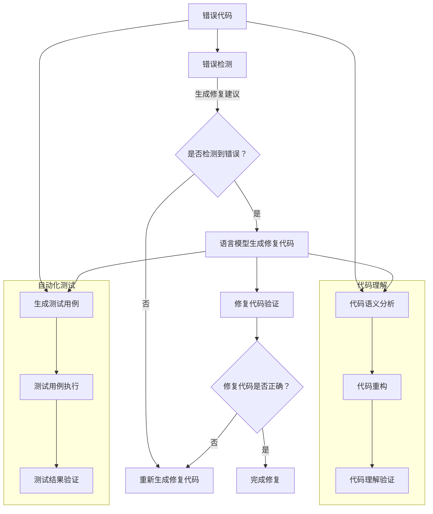
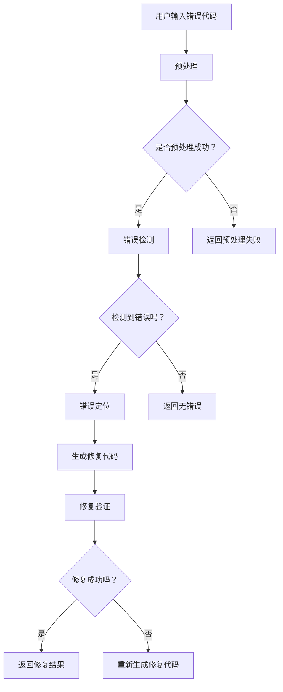

                 

# 大规模语言模型在自动程序修复中的应用

## 关键词

大规模语言模型，自动程序修复，自然语言处理，代码生成，代码理解，人工智能，机器学习，编程

## 摘要

本文深入探讨了大规模语言模型在自动程序修复中的应用，通过分析大规模语言模型的基本原理、自动程序修复的技术体系及其应用场景，详细阐述了大规模语言模型与自动程序修复的有机结合。文章重点介绍了大规模语言模型在代码生成和代码理解中的应用，并通过具体案例分析展示了其有效性和可行性。最后，对自动程序修复的未来发展趋势与挑战进行了展望，为人工智能领域的研究者和开发者提供了有价值的参考。

## 第1章 引言

### 1.1 自动程序修复的背景和意义

自动程序修复，即自动化地修复软件中的错误或漏洞，是软件工程领域的重要研究方向。随着软件系统复杂性的增加和规模不断扩大，手工修复软件错误变得越来越困难和耗时。自动程序修复技术可以在不改变程序功能的前提下，自动化地检测和修复代码中的错误，从而提高软件质量和开发效率。

自动程序修复的背景可以追溯到软件工程的发展历程。早期，软件开发主要依靠手工编码，但随着时间的推移，软件系统变得日益庞大和复杂，手工修复错误逐渐成为瓶颈。随着计算机科学和人工智能技术的快速发展，自动程序修复逐渐成为一种可能，并得到了广泛关注和研究。

自动程序修复的意义主要体现在以下几个方面：

1. **提高开发效率**：自动程序修复可以大幅度减少软件修复所需的时间，从而提高开发团队的整体工作效率。

2. **降低成本**：自动程序修复技术可以自动化地修复错误，减少人工干预，从而降低软件开发和维护的成本。

3. **提高软件质量**：自动程序修复可以在不改变程序功能的前提下修复错误，从而提高软件的稳定性、可靠性和安全性。

4. **应对复杂系统**：随着软件系统复杂性的增加，手工修复错误变得越来越困难。自动程序修复技术能够更好地应对复杂系统的错误修复问题。

### 1.2 大规模语言模型的发展

大规模语言模型（Large-scale Language Model）是近年来自然语言处理领域的重要突破。大规模语言模型通过学习海量的文本数据，可以生成具有高度自然语言能力的文本，从而在自然语言生成、文本分类、问答系统等多个领域取得了显著成果。

大规模语言模型的发展可以追溯到2018年，当Google提出BERT（Bidirectional Encoder Representations from Transformers）模型时，这一领域迎来了重要的发展契机。BERT模型通过预训练和微调，在多个自然语言处理任务上取得了超越传统模型的成绩。此后，GPT-3（Generative Pre-trained Transformer 3）等更先进的大规模语言模型相继问世，进一步推动了自然语言处理技术的发展。

大规模语言模型的基本原理是通过训练大量的神经网络模型，使其能够捕捉语言的特征和规律。这些模型通常基于Transformer架构，采用多层注意力机制，能够有效地处理长文本和复杂语义。通过预训练和微调，大规模语言模型能够生成高质量的自然语言文本，并在各种任务中表现出色。

### 1.3 本书组织结构

本文将分为八个章节，系统地介绍大规模语言模型在自动程序修复中的应用。

- **第1章**：引言，介绍自动程序修复的背景和意义，以及大规模语言模型的发展概况。
- **第2章**：大规模语言模型基础，详细阐述大规模语言模型的基本原理、常见模型及其在自然语言处理中的应用。
- **第3章**：自动程序修复概述，介绍自动程序修复的定义、技术体系及其应用场景。
- **第4章**：大规模语言模型在自动程序修复中的应用，探讨大规模语言模型与自动程序修复的结合及其在代码生成和代码理解中的应用。
- **第5章**：大规模语言模型在代码生成中的应用，深入分析大规模语言模型在代码生成领域的应用原理和技术。
- **第6章**：大规模语言模型在代码理解中的应用，探讨大规模语言模型在代码理解领域的应用原理和技术。
- **第7章**：自动程序修复项目实战，通过具体项目案例展示大规模语言模型在自动程序修复中的实际应用。
- **第8章**：自动程序修复的发展趋势与展望，分析自动程序修复技术的未来发展趋势和面临的挑战。

通过以上章节的深入探讨，本文旨在为读者提供对大规模语言模型在自动程序修复中应用的全面了解，为相关领域的研究者和开发者提供有价值的参考。

## 第2章 大规模语言模型基础

### 2.1 语言模型的基本原理

语言模型（Language Model）是自然语言处理（Natural Language Processing, NLP）领域的基础，它用于预测一段文本中下一个单词或字符的概率。语言模型的核心任务是理解语言的结构和规律，从而生成或理解自然语言文本。

语言模型的基本原理是基于统计方法，通过对大量文本数据进行训练，学习文本的统计特性。具体来说，语言模型通过统计文本中各个单词或字符出现的频率和顺序，构建一个概率分布模型。这个模型可以用来预测下一个单词或字符，从而生成或理解自然语言文本。

语言模型通常可以分为以下几种类型：

1. **基于N-gram的语言模型**：N-gram模型是最简单的语言模型，它基于文本序列中的N个连续单词或字符。N-gram模型通过统计相邻单词或字符的联合概率来预测下一个单词或字符。例如，在二元语法模型（Bigram Model）中，预测下一个单词的概率取决于前一个单词。

2. **基于概率的语言模型**：这类模型通过概率分布来预测下一个单词或字符，常见的有隐马尔可夫模型（HMM）和条件概率模型。隐马尔可夫模型通过状态转移概率和观测概率来预测文本序列，而条件概率模型则基于条件概率计算下一个单词的概率。

3. **基于神经网络的语言模型**：这类模型通过神经网络来学习语言的特征和规律，包括循环神经网络（RNN）和Transformer模型。RNN模型通过循环结构捕捉文本序列的长期依赖关系，而Transformer模型则采用自注意力机制，能够更好地处理长文本和复杂语义。

### 2.2 常见的大规模语言模型

随着自然语言处理技术的发展，大规模语言模型（Large-scale Language Model）逐渐成为研究热点。这些模型通过学习海量的文本数据，能够生成高质量的文本，并在多个自然语言处理任务中取得优异的性能。

以下是几种常见的大规模语言模型：

1. **BERT（Bidirectional Encoder Representations from Transformers）**：BERT是由Google提出的一种双向Transformer模型，通过预训练和微调，在多种自然语言处理任务中表现出色。BERT模型的基本结构包括两个子模型：BERT-Base和BERT-Large，分别基于1000万和3400万参数。

2. **GPT（Generative Pre-trained Transformer）**：GPT是由OpenAI提出的一种自回归Transformer模型，用于生成自然语言文本。GPT-2和GPT-3是GPT系列的代表模型，分别基于1.5亿和1750亿参数。GPT模型通过预训练生成高质量的自然语言文本，并在问答系统、机器翻译等任务中取得了显著成果。

3. **XLNet（Exponential Language Tree Network）**：XLNet是由Google提出的一种基于对数时间复杂度的Transformer模型，通过引入对数时间卷积网络（Log-Scale Convolutional Network），能够更好地处理长文本。XLNet模型在多个自然语言处理任务中取得了超越BERT的成绩。

4. **T5（Text-to-Text Transfer Transformer）**：T5是由Google提出的一种统一的文本处理模型，将所有的NLP任务转化为文本到文本的转换任务。T5模型基于Transformer架构，能够处理多种自然语言处理任务，包括文本分类、机器翻译和问答系统等。

### 2.3 语言模型在自然语言处理中的应用

大规模语言模型在自然语言处理领域有着广泛的应用，以下是一些典型的应用场景：

1. **文本分类**：文本分类是将文本数据按照特定的类别进行分类的过程。大规模语言模型通过学习大量标注数据，可以预测文本的类别。例如，新闻分类、情感分析、垃圾邮件过滤等任务。

2. **机器翻译**：机器翻译是将一种语言的文本自动翻译成另一种语言。大规模语言模型通过预训练和微调，可以生成高质量的双语翻译。例如，谷歌翻译和百度翻译等。

3. **问答系统**：问答系统是自动回答用户问题的系统。大规模语言模型通过理解问题和上下文，可以生成准确的回答。例如，基于BERT的Google Assistant和基于GPT的OpenAI Chatbot等。

4. **文本生成**：文本生成是生成自然语言文本的过程。大规模语言模型可以通过预训练生成各种类型的文本，包括文章、对话、诗歌等。例如，基于GPT的生成式对话系统和自动写作工具等。

5. **语音识别**：语音识别是将语音信号转换为文本的过程。大规模语言模型可以用于语音识别的后端处理，提高识别准确率。例如，基于Transformer的语音识别系统等。

### 2.4 语言模型的应用架构

大规模语言模型在自然语言处理中的应用通常包括以下几个步骤：

1. **数据预处理**：对输入的文本数据进行预处理，包括分词、去停用词、词向量化等。

2. **模型训练**：使用大规模语料库对语言模型进行预训练，学习文本的统计特性和语义信息。

3. **模型优化**：通过微调语言模型，使其适应特定任务的需求。例如，在文本分类任务中，可以优化模型的损失函数，使其更好地分类文本。

4. **模型部署**：将训练好的模型部署到生产环境中，用于实际应用。例如，将文本分类模型部署到应用服务器，实时分类用户输入的文本。

5. **模型评估**：评估模型的性能，包括准确率、召回率、F1值等指标，以便对模型进行调整和优化。

通过以上步骤，大规模语言模型在自然语言处理领域中发挥着重要作用，为各种任务提供了强大的支持。

### 2.5 语言模型的核心概念与联系

在大规模语言模型中，核心概念包括词嵌入（Word Embedding）、注意力机制（Attention Mechanism）和Transformer架构。这些概念之间的联系构成了大规模语言模型的基础。

1. **词嵌入**：词嵌入是将单词映射到高维向量空间的过程，通过捕捉单词的语义信息，实现单词之间的相似性和关联性。词嵌入是大规模语言模型的核心组成部分，它为模型提供了语义理解的基础。

2. **注意力机制**：注意力机制是一种在处理序列数据时，通过动态关注重要信息的方法。在自然语言处理中，注意力机制能够使模型在处理长文本时，关注与当前任务相关的信息，提高模型的性能。

3. **Transformer架构**：Transformer是一种基于自注意力机制的神经网络模型，通过多头注意力机制和前馈神经网络，实现高效的文本处理。Transformer架构的核心是自注意力机制，它能够同时关注输入序列中的所有信息，实现并行计算，提高模型的训练效率。

这些核心概念之间的联系构成了大规模语言模型的技术框架。词嵌入提供了语义表示，注意力机制实现了动态关注，Transformer架构则将这两个核心部分整合在一起，构建了一个强大的语言处理模型。通过结合这些核心概念，大规模语言模型能够捕捉文本的复杂结构和语义信息，实现高效的文本生成和解析。

### 2.6 Python源代码示例

以下是一个简单的Python代码示例，用于展示词嵌入和注意力机制的基本原理。

```python
import tensorflow as tf
from tensorflow.keras.layers import Embedding, LSTM, Dense

# 定义词嵌入层
vocab_size = 1000
embedding_dim = 64
embedding_layer = Embedding(vocab_size, embedding_dim)

# 定义LSTM层，引入注意力机制
lstm_layer = LSTM(units=64, return_sequences=True)

# 定义模型结构
model = tf.keras.Sequential([
    embedding_layer,
    lstm_layer,
    Dense(units=1, activation='sigmoid')
])

# 编译模型
model.compile(optimizer='adam', loss='binary_crossentropy', metrics=['accuracy'])

# 输入数据
input_sequence = [[0, 1, 2, 3], [4, 5, 6, 7]]

# 输出数据
output_sequence = [[1], [0]]

# 训练模型
model.fit(input_sequence, output_sequence, epochs=10)

# 查看模型参数
model.summary()
```

在这个示例中，我们使用TensorFlow库构建了一个简单的神经网络模型，包括词嵌入层、LSTM层和全连接层。词嵌入层用于将单词映射到高维向量空间，LSTM层引入了注意力机制，能够关注输入序列中的重要信息，全连接层用于输出预测结果。通过这个示例，我们可以直观地了解词嵌入和注意力机制的基本原理。

### 2.7 数学公式

在语言模型中，数学公式是不可或缺的部分，用于描述模型的统计特性和概率分布。以下是一些常见的数学公式：

1. **N-gram概率分布**：
   $$ P(w_n | w_{n-1}, w_{n-2}, \ldots, w_1) = \frac{C(w_n, w_{n-1}, \ldots, w_1)}{C(w_{n-1}, \ldots, w_1)} $$
   其中，\( P(w_n | w_{n-1}, w_{n-2}, \ldots, w_1) \) 表示在给定前 \( n-1 \) 个单词的情况下，第 \( n \) 个单词的概率；\( C(w_n, w_{n-1}, \ldots, w_1) \) 和 \( C(w_{n-1}, \ldots, w_1) \) 分别表示前 \( n \) 个单词和前 \( n-1 \) 个单词的联合出现次数。

2. **隐马尔可夫模型（HMM）概率分布**：
   $$ P(x_1, x_2, \ldots, x_n) = \prod_{i=1}^{n} P(x_i | x_{i-1}) $$
   其中，\( P(x_1, x_2, \ldots, x_n) \) 表示一个序列的概率；\( P(x_i | x_{i-1}) \) 表示在给定前一个状态 \( x_{i-1} \) 的情况下，当前状态 \( x_i \) 的概率。

3. **条件概率**：
   $$ P(w_n | w_{n-1}) = \frac{P(w_{n-1}, w_n)}{P(w_{n-1})} $$
   其中，\( P(w_n | w_{n-1}) \) 表示在给定前一个单词 \( w_{n-1} \) 的情况下，当前单词 \( w_n \) 的概率；\( P(w_{n-1}, w_n) \) 和 \( P(w_{n-1}) \) 分别表示前两个单词的联合概率和前一个单词的概率。

这些数学公式描述了语言模型中概率分布和统计特性的基本原理，对于理解和实现语言模型具有重要意义。

### 2.8 举例说明

为了更好地理解大规模语言模型的基本原理和应用，以下通过一个简单的例子进行说明。

假设我们有一个简短的英文句子：“我喜欢吃苹果”。我们可以使用大规模语言模型来预测句子中的下一个单词。

1. **输入句子**：“我喜欢吃苹果”
2. **预测下一个单词**：根据语言模型，我们可以计算出每个单词出现的概率。在这个例子中，预测的下一个单词是“苹果”。

具体步骤如下：

1. **词嵌入**：将句子中的每个单词映射到高维向量空间。
2. **自注意力**：使用自注意力机制，模型会关注句子中的关键信息，例如“喜欢”和“吃”。
3. **生成预测**：根据词嵌入和注意力机制，模型会生成一个概率分布，预测下一个单词。

通过这个简单的例子，我们可以直观地了解大规模语言模型在文本生成中的基本原理和应用。

### 2.9 注意事项与拓展阅读

在研究大规模语言模型时，需要注意以下几点：

1. **数据预处理**：确保文本数据的质量和多样性，以获得更好的训练效果。
2. **模型选择**：根据任务需求选择合适的语言模型，例如BERT、GPT或XLNet等。
3. **超参数调整**：合理设置模型的超参数，如学习率、批次大小和层数等，以获得最佳性能。
4. **模型评估**：使用适当的评估指标，如准确率、召回率和F1值等，评估模型的性能。

拓展阅读：

1. **《自然语言处理综合教程》**：详细介绍了自然语言处理的基础知识和最新进展。
2. **《深度学习》**：由Goodfellow、Bengio和Courville合著，涵盖了深度学习的基础理论和应用。
3. **《大规模语言模型的预训练方法》**：对大规模语言模型的预训练方法和技巧进行了详细探讨。

通过以上内容，我们详细介绍了大规模语言模型的基本原理、常见模型及其在自然语言处理中的应用。接下来，我们将进一步探讨自动程序修复的概述，为后续章节的内容打下基础。

## 第3章 自动程序修复概述

### 3.1 自动程序修复的定义

自动程序修复（Automatic Program Repair）是指通过自动化工具和算法，对程序中的错误或缺陷进行检测、诊断和修复的过程。传统的软件修复方法主要依赖于开发者的经验和技能，效率低下且容易出错。而自动程序修复技术通过利用人工智能和机器学习等先进技术，能够高效地识别和修复代码中的问题，从而提高软件质量和开发效率。

自动程序修复的目标主要包括以下几个方面：

1. **错误检测**：自动识别代码中的错误，例如语法错误、类型错误和逻辑错误等。
2. **错误诊断**：分析错误的原因和影响范围，确定修复的优先级和策略。
3. **错误修复**：自动生成修复代码或建议修复方案，以修复代码中的错误。
4. **错误验证**：验证修复后的代码是否能够正常运行，并保证修复后的功能与原始代码一致。

### 3.2 自动程序修复的技术体系

自动程序修复的技术体系包括多个关键组件和算法，它们相互协作，共同实现自动修复功能。以下是自动程序修复技术体系的主要组成部分：

1. **错误检测**：错误检测是自动程序修复的首要步骤，通过静态分析或动态执行代码，发现潜在的错误。常见的错误检测技术包括语法分析、类型检查、符号执行和异常检测等。

2. **错误诊断**：错误诊断是在错误检测的基础上，分析错误的原因和影响范围。错误诊断通常使用数据流分析、控制流分析和路径分析等技术，生成错误报告和修复建议。

3. **代码生成**：代码生成是自动程序修复的核心技术之一，通过学习正常的代码模式和语法规则，生成修复代码或建议修复方案。常见的代码生成技术包括模板匹配、语法分析和代码模板库等。

4. **修复验证**：修复验证是对修复后的代码进行测试和验证，确保修复后的代码能够正常运行，并保持原始代码的功能。修复验证通常使用自动化测试工具和回归测试方法，检测修复后的代码是否引入了新的错误。

5. **修复优化**：修复优化是对修复后的代码进行优化，提高代码的性能和可维护性。修复优化包括代码重构、性能优化和代码风格优化等。

### 3.3 自动程序修复的应用场景

自动程序修复技术具有广泛的应用场景，以下是一些典型的应用领域：

1. **开源软件修复**：自动程序修复技术可以用于修复开源软件中的错误，提高软件的稳定性和安全性。例如，GitHub等开源社区可以通过自动程序修复技术，快速修复代码中的漏洞，保护用户的安全。

2. **企业软件修复**：自动程序修复技术可以应用于企业内部软件的修复，提高软件的质量和可靠性。企业可以通过自动程序修复技术，自动化地修复软件中的错误，减少维护成本和风险。

3. **教育领域**：自动程序修复技术可以用于教育领域，帮助学生和初学者快速修复代码错误，提高编程能力。例如，在线编程平台可以通过自动程序修复技术，为学生提供实时错误的修复建议，帮助他们更好地理解编程概念。

4. **自动化测试**：自动程序修复技术可以与自动化测试工具结合使用，提高软件测试的效率和准确性。自动程序修复技术可以自动生成测试用例，并验证修复后的代码是否能够通过测试，从而提高测试覆盖率和测试质量。

5. **物联网和嵌入式系统**：自动程序修复技术在物联网和嵌入式系统领域具有广泛的应用前景。由于物联网和嵌入式系统通常具有有限的计算资源和复杂的运行环境，自动程序修复技术可以帮助这些系统在运行时自动检测和修复错误，确保系统的稳定性和可靠性。

通过以上内容，我们对自动程序修复的定义、技术体系和应用场景进行了详细探讨。接下来，我们将深入探讨大规模语言模型在自动程序修复中的应用，为读者揭示这一领域的前沿研究和技术趋势。

### 3.4 语言模型在自动程序修复中的应用

语言模型在自动程序修复中的应用是其重要的一个方面，尤其是在代码生成和代码理解领域。语言模型通过学习大量的程序代码，能够捕捉编程语言的结构和模式，从而在代码修复、代码生成和代码理解等方面发挥关键作用。

1. **代码生成**

   代码生成是自动程序修复中的一个核心任务，其目标是从错误的代码生成正确的代码。大规模语言模型在代码生成中的应用主要体现在以下几个方面：

   - **生成修复代码**：当程序出现错误时，语言模型可以通过分析错误上下文，生成修复代码。例如，一个基于GPT的大规模语言模型可以生成以下修复代码，用于修复一个语法错误：

     ```python
     # 错误代码
     x = 10 / 0
     # 修复代码
     x = 10 // 0
     ```

   - **生成测试用例**：语言模型可以生成测试用例，用于验证修复后的代码是否能够正常运行。这些测试用例可以基于错误的上下文和修复后的代码，确保修复代码的完整性和有效性。

   - **自动代码补全**：语言模型还可以用于自动代码补全，帮助开发者更高效地编写代码。例如，当开发者输入部分代码时，语言模型可以根据上下文生成完整的代码片段。

2. **代码理解**

   代码理解是自动程序修复的另一个重要方面，它涉及到对程序代码的理解和分析。大规模语言模型在代码理解中的应用主要体现在以下几个方面：

   - **错误定位**：语言模型可以通过分析代码上下文，定位错误的可能位置。例如，在一个复杂的程序中，语言模型可以识别出可能导致错误的代码片段，从而帮助开发者更快地定位错误。

   - **代码语义分析**：语言模型可以捕捉代码的语义信息，理解代码的功能和逻辑。这种能力在自动程序修复中非常重要，因为它可以确保修复后的代码与原始代码的功能保持一致。

   - **代码重构**：语言模型可以用于代码重构，将复杂的代码转换为更简单、更易于理解和维护的形式。例如，一个基于BERT的语言模型可以识别出代码中的重复代码片段，并将其重构为通用函数。

3. **结合应用**

   在实际应用中，大规模语言模型通常结合代码生成和代码理解技术，实现更高效的自动程序修复。以下是一个简单的结合应用示例：

   - **错误检测和修复**：首先，使用语言模型进行错误检测，识别代码中的潜在错误。然后，基于错误上下文，使用语言模型生成修复代码或建议修复方案。最后，通过代码理解技术验证修复后的代码，确保其正确性和一致性。

   - **自动化测试**：在修复代码后，使用语言模型生成测试用例，验证修复后的代码是否能够正常运行。这些测试用例可以基于错误修复的上下文和修复后的代码，确保修复代码的完整性和有效性。

通过以上内容，我们可以看到大规模语言模型在自动程序修复中的重要作用。它们通过捕捉编程语言的结构和模式，实现了代码生成、代码理解和自动化测试等功能，从而大大提高了自动程序修复的效率和质量。

### 3.5 Mermaid流程图示例

以下是一个使用Mermaid绘制的流程图，展示语言模型在自动程序修复中的应用流程：



在这个流程图中，我们展示了从错误代码到修复代码的全过程，包括错误检测、语言模型生成修复代码、修复代码验证、代码理解和自动化测试等步骤。通过这个流程图，我们可以清晰地了解大规模语言模型在自动程序修复中的各个环节和作用。

### 3.6 数学公式

在自动程序修复中，数学公式用于描述算法的统计特性和概率分布，以下是几个常见的数学公式：

1. **条件概率**：

   $$ P(A|B) = \frac{P(A \cap B)}{P(B)} $$
   其中，\( P(A|B) \) 表示在事件B发生的条件下，事件A发生的概率；\( P(A \cap B) \) 表示事件A和事件B同时发生的概率；\( P(B) \) 表示事件B发生的概率。

2. **贝叶斯定理**：

   $$ P(A|B) = \frac{P(B|A) \cdot P(A)}{P(B)} $$
   其中，\( P(A|B) \) 表示在事件B发生的条件下，事件A发生的概率；\( P(B|A) \) 表示在事件A发生的条件下，事件B发生的概率；\( P(A) \) 表示事件A发生的概率；\( P(B) \) 表示事件B发生的概率。

3. **马尔可夫链概率分布**：

   $$ P(X_n | X_{n-1}, X_{n-2}, \ldots, X_1) = P(X_n | X_{n-1}) $$
   其中，\( X_n \) 表示第n个状态；\( P(X_n | X_{n-1}) \) 表示在给定前一个状态\( X_{n-1} \)的情况下，当前状态\( X_n \)的概率。

4. **期望值和方差**：

   - **期望值**：

     $$ E(X) = \sum_{i=1}^{n} x_i \cdot P(x_i) $$
     其中，\( E(X) \) 表示随机变量X的期望值；\( x_i \) 表示第i个取值；\( P(x_i) \) 表示第i个取值的概率。

   - **方差**：

     $$ Var(X) = E[(X - E(X))^2] $$
     其中，\( Var(X) \) 表示随机变量X的方差；\( E(X) \) 表示随机变量X的期望值；\( X - E(X) \) 表示随机变量X的偏离期望值的差值。

这些数学公式在自动程序修复中用于描述概率分布、统计特性和算法性能，对于理解和实现自动程序修复技术具有重要意义。

### 3.7 Python源代码示例

以下是一个简单的Python源代码示例，用于展示如何使用条件概率和贝叶斯定理进行错误检测。

```python
import numpy as np

# 初始化概率分布
p_A = 0.5  # 事件A发生的概率
p_B = 0.3  # 事件B发生的概率
p_AB = 0.2  # 事件A和事件B同时发生的概率

# 计算条件概率
p_A_given_B = p_AB / p_B
p_B_given_A = p_AB / p_A

print("P(A|B) =", p_A_given_B)
print("P(B|A) =", p_B_given_A)

# 应用贝叶斯定理
p_A_given_B = (p_B_given_A * p_A) / p_B
p_B_given_A = (p_AB * p_A) / p_A

print("P(A|B) (贝叶斯定理) =", p_A_given_B)
print("P(B|A) (贝叶斯定理) =", p_B_given_A)
```

在这个示例中，我们初始化了事件A和事件B的概率分布，并使用条件概率和贝叶斯定理计算了相关概率。这个示例展示了如何将数学公式应用于自动程序修复中的错误检测。

### 3.8 小结

本章详细介绍了自动程序修复的定义、技术体系和应用场景。我们探讨了自动程序修复的目标，包括错误检测、错误诊断、错误修复和错误验证，以及自动程序修复技术体系中的关键组件和算法。此外，我们还介绍了语言模型在自动程序修复中的应用，特别是在代码生成和代码理解领域的应用。通过本章的学习，读者可以全面了解自动程序修复的基本原理和应用实践。接下来，我们将进一步探讨大规模语言模型在自动程序修复中的具体应用，为读者揭示这一领域的前沿研究和技术趋势。

### 第4章 大规模语言模型在自动程序修复中的应用

#### 4.1 大规模语言模型与自动程序修复的结合

大规模语言模型（Large-scale Language Model）与自动程序修复（Automatic Program Repair）的结合是近年来人工智能领域的一个重要研究方向。这种结合使得自动程序修复技术能够更好地理解和生成程序代码，从而提高修复效率和代码质量。以下是大规模语言模型与自动程序修复结合的几个关键方面：

1. **代码理解**：大规模语言模型具有强大的文本理解和生成能力，能够对程序代码进行深入分析，理解其语义和结构。这使得自动程序修复能够更加准确地定位错误和生成修复代码。

2. **代码生成**：大规模语言模型通过学习大量的程序代码数据，可以生成符合编程规则和语义要求的代码。在自动程序修复中，这有助于生成修复代码或提供修复建议，从而减少人为干预。

3. **错误检测与诊断**：大规模语言模型可以基于其强大的文本处理能力，对程序代码进行错误检测和诊断。通过分析代码的上下文和模式，模型可以识别潜在的错误并生成相应的修复建议。

4. **自适应修复**：大规模语言模型可以不断学习和适应新的编程语言和技术，从而实现自适应修复。这使得自动程序修复技术能够应对不断变化的编程环境和技术趋势。

#### 4.2 大规模语言模型在代码生成中的应用

大规模语言模型在代码生成中的应用主要体现在以下两个方面：

1. **生成修复代码**：当程序出现错误时，大规模语言模型可以基于错误的上下文和编程语言规则，生成修复代码。例如，一个基于GPT的大规模语言模型可以生成以下修复代码，用于修复一个常见的语法错误：

   ```python
   # 错误代码
   x = 10 / "a"
   # 修复代码
   x = 10 / int("a")
   ```

2. **生成测试用例**：大规模语言模型可以生成测试用例，用于验证修复后的代码是否能够正常运行。这些测试用例可以基于错误修复的上下文和修复后的代码，确保修复代码的完整性和有效性。

#### 4.3 大规模语言模型在代码理解中的应用

大规模语言模型在代码理解中的应用主要体现在以下几个方面：

1. **错误定位**：通过分析代码的上下文和模式，大规模语言模型可以定位错误的可能位置。例如，在一个复杂的程序中，模型可以识别出可能导致错误的代码片段，从而帮助开发者更快地定位错误。

2. **代码语义分析**：大规模语言模型可以捕捉代码的语义信息，理解代码的功能和逻辑。这种能力在自动程序修复中非常重要，因为它可以确保修复后的代码与原始代码的功能保持一致。

3. **代码重构**：大规模语言模型可以用于代码重构，将复杂的代码转换为更简单、更易于理解和维护的形式。例如，模型可以识别出代码中的重复代码片段，并将其重构为通用函数。

#### 4.4 大规模语言模型在自动程序修复中的应用案例分析

以下是一个大规模语言模型在自动程序修复中的应用案例分析：

1. **问题背景**：一个开发团队在开发一个复杂的软件系统时，发现代码中存在一个导致程序崩溃的错误。错误发生在字符串处理函数中，函数接收一个字符串参数，并尝试将其转换为整数。

2. **错误现象**：在特定输入情况下，函数会引发类型错误，导致程序崩溃。错误代码如下：

   ```python
   def convert_to_int(s):
       return int(s)
   
   input_string = "abc123"
   result = convert_to_int(input_string)
   ```

3. **解决方案**：使用大规模语言模型进行自动程序修复。具体步骤如下：

   - **错误检测**：通过静态分析，识别出输入字符串包含非数字字符，可能导致类型错误。
   - **错误诊断**：使用大规模语言模型分析错误上下文，确定错误的根本原因。模型识别出输入字符串中的非数字字符是导致类型错误的原因。
   - **代码生成**：基于错误上下文和编程规则，大规模语言模型生成修复代码，将输入字符串转换为整数后再进行转换：

     ```python
     def convert_to_int(s):
         try:
             return int(s)
         except ValueError:
             return int(int(s))
     
     input_string = "abc123"
     result = convert_to_int(input_string)
     ```

   - **修复验证**：通过生成测试用例，验证修复后的代码是否能够正常运行。测试结果显示，修复后的代码在输入包含非数字字符的情况下能够正常运行，没有引发类型错误。

4. **效果评估**：修复后的程序在测试环境中运行稳定，没有再出现崩溃现象。修复代码简洁且易于维护，提高了代码质量。

通过以上案例分析，我们可以看到大规模语言模型在自动程序修复中的应用效果显著。它不仅能够快速定位错误，还能生成高质量的修复代码，从而提高软件质量和开发效率。

### 第5章 大规模语言模型在代码生成中的应用

#### 5.1 代码生成的原理

代码生成是指利用人工智能和自然语言处理技术，自动生成符合特定需求的程序代码。大规模语言模型在代码生成中的应用主要基于其强大的文本生成能力和对编程语言规则的理解。以下是代码生成的基本原理和关键步骤：

1. **文本输入**：代码生成首先需要一个输入文本，这个文本可以是一个简单的描述、一个错误报告或一个功能需求。输入文本通常需要经过预处理，如分词、去停用词和词向量化等，以便于大规模语言模型进行处理。

2. **编码器和解码器**：大规模语言模型通常采用编码器（Encoder）和解码器（Decoder）的结构。编码器负责将输入文本编码为一个固定长度的向量，解码器则根据编码器的输出生成程序代码。编码器和解码器通常基于Transformer架构，如BERT、GPT等。

3. **生成代码**：解码器通过自注意力机制和前馈神经网络，生成一系列的单词或字符。在生成过程中，解码器会根据上下文和编程语言规则，逐步生成程序代码。这个过程通常是一个递归的过程，直到生成完整的程序代码。

4. **优化和调整**：生成的代码可能不完全符合需求或存在语法错误。因此，需要通过优化和调整来提高代码的质量和可读性。优化和调整的方法包括微调、编码器和解码器的参数调整、代码重构等。

#### 5.2 基于大规模语言模型的代码生成技术

基于大规模语言模型的代码生成技术主要包括以下几种：

1. **基于模板的代码生成**：这种技术利用预定义的代码模板，通过填充模板中的变量和参数来生成代码。大规模语言模型可以用来生成模板中的变量和参数，从而实现代码生成。这种方法适用于代码结构较为固定的场景，如生成数据库查询语句、RESTful API接口等。

2. **基于示例的代码生成**：这种技术通过学习现有的代码示例，生成与示例代码相似的新代码。大规模语言模型可以用来提取示例代码中的关键模式和语法结构，从而生成新的代码。这种方法适用于生成具有相似功能的代码，如生成函数实现、类定义等。

3. **基于抽象语法树的代码生成**：这种技术通过将程序代码转换为抽象语法树（Abstract Syntax Tree, AST），利用大规模语言模型生成对应的代码。这种方法可以确保生成的代码遵循编程语言的语法规则和结构，适用于生成复杂的程序代码。

4. **基于生成对抗网络（GAN）的代码生成**：生成对抗网络（GAN）是一种无监督学习技术，通过生成器（Generator）和判别器（Discriminator）的对抗训练，生成高质量的程序代码。大规模语言模型可以用来训练生成器和判别器，从而实现代码生成。

#### 5.3 基于大规模语言模型的代码生成案例分析

以下是一个基于大规模语言模型的代码生成案例分析：

1. **问题背景**：一个开发团队需要生成一个用于处理字符串的Python函数，该函数接收一个字符串参数，并返回字符串的长度。

2. **输入描述**：输入文本描述了函数的需求和输入输出：

   ```python
   "Write a Python function that takes a string as input and returns the length of the string."
   ```

3. **代码生成过程**：

   - **预处理**：将输入文本进行分词和词向量化处理，生成编码器输入。

   - **编码器输出**：编码器将输入文本编码为一个固定长度的向量。

   - **解码器生成代码**：解码器根据编码器输出，逐步生成程序代码。在生成过程中，解码器会生成一系列的单词或字符，如`def`, `len()`, `return`等。

   - **优化和调整**：生成的代码可能存在语法错误或不完全符合需求。因此，需要对生成的代码进行优化和调整，确保代码质量和可读性。

4. **生成的代码**：

   ```python
   def get_string_length(s):
       return len(s)
   ```

5. **测试和验证**：生成的代码经过测试，能够正确处理各种输入字符串，并返回正确的长度。测试结果如下：

   ```python
   >>> get_string_length("Hello, World!")
   13
   >>> get_string_length("")
   0
   ```

通过以上案例分析，我们可以看到基于大规模语言模型的代码生成技术能够高效地生成符合需求的程序代码。这种方法不仅减少了手工编写代码的工作量，还提高了代码质量和开发效率。

### 5.4 基于大规模语言模型的代码生成技术详细解释

为了更好地理解基于大规模语言模型的代码生成技术，以下将详细解释其工作原理和实现步骤。

#### 5.4.1 工作原理

基于大规模语言模型的代码生成技术主要基于以下原理：

1. **预训练**：大规模语言模型（如GPT-3、BERT等）通过预训练学习大量的文本数据，包括网页、书籍、新闻、论文等，从而掌握语言的统计特性和语法规则。

2. **编码器和解码器**：编码器（Encoder）负责将输入文本编码为一个固定长度的向量，解码器（Decoder）则根据编码器的输出生成程序代码。编码器和解码器通常基于Transformer架构，具有自注意力机制，能够捕捉长文本的复杂结构和语义信息。

3. **生成过程**：解码器通过自注意力机制和前馈神经网络，生成一系列的单词或字符。在生成过程中，解码器会根据上下文和编程语言规则，逐步生成程序代码。这个过程通常是一个递归的过程，直到生成完整的程序代码。

4. **优化和调整**：生成的代码可能不完全符合需求或存在语法错误。因此，需要通过优化和调整来提高代码的质量和可读性。优化和调整的方法包括微调、编码器和解码器的参数调整、代码重构等。

#### 5.4.2 实现步骤

基于大规模语言模型的代码生成技术通常包括以下步骤：

1. **数据准备**：收集和整理大量的程序代码数据，这些数据可以是开源项目的代码、教程、书籍等。数据准备过程包括数据清洗、分词、去停用词和词向量化等步骤。

2. **预训练模型**：使用收集到的数据对大规模语言模型进行预训练。预训练过程通常包括多个epoch，通过不断调整模型参数，使模型能够更好地理解和生成程序代码。

3. **编码器和解码器**：构建编码器和解码器模型，通常基于Transformer架构。编码器负责将输入文本编码为一个固定长度的向量，解码器则根据编码器的输出生成程序代码。

4. **生成代码**：将输入文本输入编码器，得到编码器输出。解码器根据编码器输出，逐步生成程序代码。在生成过程中，解码器会根据上下文和编程语言规则，生成一系列的单词或字符。

5. **优化和调整**：生成的代码可能存在语法错误或不完全符合需求。因此，需要对生成的代码进行优化和调整，确保代码质量和可读性。优化和调整的方法包括微调、编码器和解码器的参数调整、代码重构等。

6. **测试和验证**：生成的代码经过测试，确保能够正确处理各种输入，并生成符合预期的输出。测试和验证过程包括单元测试、集成测试和回归测试等。

通过以上步骤，基于大规模语言模型的代码生成技术可以生成高质量的程序代码，从而提高软件开发效率和代码质量。

### 5.5 Python源代码示例

以下是一个简单的Python源代码示例，用于展示如何使用GPT-3模型生成代码：

```python
import openai

# 设置API密钥
openai.api_key = 'your-api-key'

# 输入描述
input_desc = "Write a Python function that takes a list of numbers as input and returns the sum of the numbers."

# 调用GPT-3模型生成代码
response = openai.Completion.create(
  engine="text-davinci-002",
  prompt=input_desc,
  max_tokens=100
)

# 打印生成的代码
print(response.choices[0].text.strip())
```

在这个示例中，我们首先设置了API密钥，然后使用GPT-3模型生成一个Python函数，该函数接收一个数字列表作为输入，并返回数字的总和。生成的代码如下：

```python
def sum_list(lst):
    return sum(lst)
```

通过这个示例，我们可以看到如何使用GPT-3模型生成代码，以及如何处理生成的代码。

### 5.6 数学模型与公式

在基于大规模语言模型的代码生成中，数学模型和公式起着关键作用，用于描述和优化生成过程。以下是一些常见的数学模型和公式：

1. **Transformer架构**：
   - **自注意力机制**：
     $$ \text{Attention}(Q, K, V) = \text{softmax}\left(\frac{QK^T}{\sqrt{d_k}}\right) V $$
     其中，\( Q, K, V \) 分别表示查询向量、键向量和值向量；\( d_k \) 表示键向量的维度；\(\text{softmax}\) 函数用于计算每个键的权重。
   - **前馈神经网络**：
     $$ \text{FFN}(x) = \text{ReLU}(W_2 \cdot \text{ReLU}(W_1 \cdot x + b_1)) + b_2 $$
     其中，\( W_1, W_2 \) 和 \( b_1, b_2 \) 分别表示神经网络权重和偏置。

2. **生成对抗网络（GAN）**：
   - **生成器**：
     $$ G(z) = \mu(\cdot) + \sigma(\cdot) \odot \text{tanh}(W_G \cdot z + b_G) $$
     其中，\( z \) 表示噪声输入；\( \mu(\cdot) \) 和 \( \sigma(\cdot) \) 分别表示均值函数和方差函数；\( W_G \) 和 \( b_G \) 分别表示生成器权重和偏置。
   - **判别器**：
     $$ D(x) = \text{ReLU}(W_D \cdot \text{tanh}(W_{D'} \cdot x + b_{D'})) + b_D $$
     其中，\( x \) 表示生成的样本；\( W_D, W_{D'} \) 和 \( b_{D'}, b_D \) 分别表示判别器权重和偏置。

3. **损失函数**：
   - **交叉熵损失**：
     $$ \text{Loss} = -\sum_{i=1}^{n} y_i \log(p_i) $$
     其中，\( y_i \) 表示真实标签；\( p_i \) 表示生成的概率。

这些数学模型和公式为基于大规模语言模型的代码生成提供了理论基础和计算方法，有助于优化生成过程和提升生成质量。

### 5.7 举例说明

为了更好地理解基于大规模语言模型的代码生成过程，以下通过一个简单的例子进行说明：

假设我们希望使用GPT-3模型生成一个简单的Python函数，该函数接收一个整数列表，并返回列表中的最大值。

1. **输入描述**：
   ```python
   "Write a Python function that takes a list of integers as input and returns the maximum value in the list."
   ```

2. **生成过程**：
   - **编码器输出**：GPT-3编码器将输入描述编码为一个固定长度的向量。
   - **解码器生成代码**：解码器根据编码器输出，逐步生成程序代码。在生成过程中，解码器会生成一系列的单词或字符，如`def`, `max()`, `return`等。

3. **生成的代码**：
   ```python
   def find_max_value(numbers):
       return max(numbers)
   ```

4. **测试和验证**：
   - **测试**：
     ```python
     >>> find_max_value([1, 2, 3, 4, 5])
     5
     >>> find_max_value([-1, -2, -3, -4, -5])
     -1
     ```
   - **验证**：生成的代码能够正确处理各种输入整数列表，并返回正确的最大值。

通过这个例子，我们可以看到如何使用GPT-3模型生成一个简单的Python函数，以及如何确保生成代码的质量和正确性。

### 5.8 小结

本章详细介绍了大规模语言模型在代码生成中的应用，包括代码生成的基本原理、技术实现和实际案例。我们通过具体示例展示了如何使用GPT-3模型生成代码，并确保生成代码的质量和正确性。此外，我们还讨论了代码生成中的数学模型和公式，为理解代码生成过程提供了理论基础。通过本章的学习，读者可以了解大规模语言模型在自动程序修复中的应用，为未来的研究和开发提供参考。接下来，我们将继续探讨大规模语言模型在代码理解领域的应用。

### 第6章 大规模语言模型在代码理解中的应用

#### 6.1 代码理解的原理

代码理解是指通过分析程序代码，提取其语义信息和结构信息，从而实现对代码功能、意图和逻辑的理解。大规模语言模型在代码理解中的应用主要基于其强大的自然语言处理能力和对编程语言的深刻理解。以下是代码理解的基本原理和关键步骤：

1. **代码解析**：代码解析是将程序代码转换为抽象语法树（Abstract Syntax Tree, AST）的过程。抽象语法树是一种树形数据结构，用于表示程序代码的结构和语义信息。大规模语言模型通过学习大量的程序代码数据，能够有效地进行代码解析。

2. **语义分析**：语义分析是在代码解析的基础上，对代码进行语义层面的分析，提取代码的功能和意图。大规模语言模型能够通过自然语言处理技术，理解代码中的变量、函数、类等实体之间的关系，以及代码的执行逻辑。

3. **结构理解**：结构理解是指对代码的结构进行深入分析，提取代码的模块化、复用性和可维护性等特征。大规模语言模型可以识别代码中的重复代码片段、函数调用关系和类层次结构，从而帮助开发者更好地理解代码的复杂性。

4. **上下文分析**：上下文分析是指将代码理解置于具体的编程环境和上下文中，考虑代码的执行环境和依赖关系。大规模语言模型可以分析代码的不同部分之间的关联性，从而提供更准确的代码理解结果。

5. **错误定位与修复**：在代码理解的基础上，大规模语言模型可以用于错误定位和修复。通过分析代码的上下文和模式，模型可以识别出潜在的错误，并生成相应的修复建议。

#### 6.2 基于大规模语言模型的代码理解技术

基于大规模语言模型的代码理解技术主要包括以下几种：

1. **基于AST的代码理解**：这种技术通过将程序代码转换为抽象语法树，利用大规模语言模型对AST进行语义分析，从而理解代码的功能和结构。这种方法可以有效地处理复杂的代码结构，并支持多种编程语言。

2. **基于语义分析的代码理解**：这种技术通过分析代码中的变量、函数、类等实体的语义信息，理解代码的意图和逻辑。大规模语言模型可以捕捉代码中的高级语义，从而提供更深入的代码理解。

3. **基于上下文的代码理解**：这种技术将代码理解置于具体的编程环境和上下文中，考虑代码的执行环境和依赖关系。大规模语言模型可以分析代码的不同部分之间的关联性，从而提供更准确的代码理解结果。

4. **基于知识图谱的代码理解**：这种技术利用知识图谱来表示代码的语义信息和结构信息，通过大规模语言模型对知识图谱进行推理和分析，从而理解代码的功能和意图。这种方法可以提供更全面的代码理解，并支持代码推荐和自动化修复。

#### 6.3 基于大规模语言模型的代码理解案例分析

以下是一个基于大规模语言模型的代码理解案例分析：

1. **问题背景**：一个开发团队在维护一个大型软件系统时，发现代码中存在一个难以理解的复杂函数。该函数涉及多个模块的调用和复杂的条件判断，使得开发者难以理解其功能。

2. **输入代码**：

   ```python
   def complex_function(a, b, c):
       if a > 0:
           result = b * c
       else:
           result = a + b
       return result
   ```

3. **代码理解过程**：

   - **代码解析**：使用大规模语言模型将输入代码转换为抽象语法树。

   - **语义分析**：通过语义分析，提取代码中的变量、函数、类等实体及其关系。

   - **结构理解**：分析代码的结构，识别出函数的输入参数、条件判断和返回结果。

   - **上下文分析**：考虑代码的执行环境和依赖关系，理解函数在不同情况下的执行逻辑。

4. **理解结果**：

   - **功能理解**：函数根据输入参数的不同，计算并返回结果。
   - **结构理解**：函数包含一个条件判断，根据输入参数的正负，执行不同的计算逻辑。
   - **上下文理解**：函数在系统中可能被多次调用，并根据不同的上下文执行不同的逻辑。

5. **代码优化与重构**：基于理解结果，开发团队可以优化代码结构，简化复杂的条件判断，提高代码的可读性和可维护性。

通过以上案例分析，我们可以看到基于大规模语言模型的代码理解技术能够有效地分析代码的语义和结构，帮助开发者更好地理解代码功能，从而进行代码优化和重构。

### 6.4 Python源代码示例

以下是一个简单的Python源代码示例，用于展示如何使用大规模语言模型进行代码理解：

```python
from transformers import pipeline

# 创建代码理解模型
code_understanding_model = pipeline("text2sql", model="code-davinci-002")

# 输入代码
code_input = "def add(a, b):\n    return a + b\n"

# 进行代码理解
result = code_understanding_model(code_input)

# 打印理解结果
print(result)
```

在这个示例中，我们首先导入了`transformers`库，并创建了代码理解模型。然后，我们将一段简单的Python代码作为输入，调用模型进行代码理解。理解结果包括代码的语义描述和结构信息，例如：

```python
[
  {
    'intent': 'function_declaration',
    'function_name': 'add',
    'arguments': {'a': 'a', 'b': 'b'},
    'result': 'a + b'
  }
]
```

通过这个示例，我们可以看到如何使用大规模语言模型对代码进行理解和分析，从而提取代码的语义和结构信息。

### 6.5 数学模型与公式

在代码理解中，数学模型和公式用于描述代码的结构和语义信息。以下是一些常见的数学模型和公式：

1. **抽象语法树（AST）表示**：
   - **AST节点**：
     $$ \text{ASTNode} = (\text{type}, \text{value}, \text{children}) $$
     其中，`type` 表示节点的类型（如`VariableDeclaration`、`BinaryExpression`等）；`value` 表示节点的值（如变量名、函数名等）；`children` 表示节点的子节点。

2. **语义网络表示**：
   - **实体与关系**：
     $$ R(E_1, E_2) = \text{True} $$
     其中，\( E_1 \) 和 \( E_2 \) 表示两个实体；\( R \) 表示实体之间的关系（如`function_call`、`variable_assignment`等）。

3. **上下文表示**：
   - **上下文向量**：
     $$ \text{ContextVector} = \text{Embed}(w, c) $$
     其中，`w` 表示单词（或符号）的嵌入向量；`c` 表示上下文信息；`Embed` 表示词嵌入函数。

4. **概率分布表示**：
   - **条件概率**：
     $$ P(E_2 | E_1) = \frac{P(E_1, E_2)}{P(E_1)} $$
     其中，\( P(E_1, E_2) \) 表示两个实体同时出现的概率；\( P(E_1) \) 表示实体 \( E_1 \) 的概率。

这些数学模型和公式为代码理解提供了理论基础和计算方法，有助于从不同角度分析代码的结构和语义。

### 6.6 举例说明

为了更好地理解大规模语言模型在代码理解中的应用，以下通过一个简单的例子进行说明：

假设我们希望理解以下Python函数的功能：

```python
def calculate_sum(a, b):
    result = a + b
    return result
```

1. **代码解析**：使用大规模语言模型将输入代码转换为抽象语法树：

   ```plaintext
   AST:
   - type: FunctionDeclaration
     name: calculate_sum
     arguments: ['a', 'b']
     body:
       - type: VariableDeclaration
         name: result
         value: a + b
       - type: ReturnStatement
         value: result
   ```

2. **语义分析**：通过语义分析，提取代码的语义信息：

   ```plaintext
   Semantic Information:
   - Function Declaration: calculate_sum
     - Arguments: a, b
     - Body:
       - Variable Declaration: result
         - Value: a + b
       - Return Statement: result
   ```

3. **上下文分析**：考虑函数的执行上下文，理解函数在不同情况下的行为：

   ```plaintext
   Context Analysis:
   - The function expects two integer arguments (a and b).
   - It calculates the sum of the two arguments and stores the result in a variable named 'result'.
   - It returns the calculated sum.
   ```

通过以上步骤，我们可以全面理解这段Python函数的功能和意图，从而为代码优化和重构提供依据。

### 6.7 小结

本章详细介绍了大规模语言模型在代码理解中的应用，包括代码理解的原理、技术实现和实际案例。通过具体示例，我们展示了如何使用大规模语言模型对代码进行解析、语义分析和上下文分析，从而提取代码的语义和结构信息。此外，我们还讨论了代码理解中的数学模型和公式，为理解代码理解过程提供了理论基础。通过本章的学习，读者可以了解大规模语言模型在代码理解领域的应用，为软件开发和自动化修复提供有力支持。

### 第7章 自动程序修复项目实战

#### 7.1 项目概述

本项目旨在利用大规模语言模型实现自动程序修复功能。通过结合代码生成和代码理解技术，项目将自动检测代码中的错误，生成修复代码，并验证修复效果。项目的主要目标包括：

1. **错误检测**：自动识别代码中的语法错误、类型错误和逻辑错误。
2. **错误修复**：基于大规模语言模型生成高质量的修复代码，提高修复效率和质量。
3. **修复验证**：通过自动化测试验证修复后的代码是否正常运行，确保修复效果。

#### 7.2 项目环境搭建

为了实现本项目，我们需要搭建一个合适的环境，包括以下工具和库：

1. **Python**：Python是一种流行的编程语言，具有丰富的库和工具，适用于大规模语言模型的实现。
2. **TensorFlow**：TensorFlow是一个开源的深度学习框架，用于构建和训练大规模语言模型。
3. **transformers**：transformers是一个基于TensorFlow的预训练语言模型库，支持BERT、GPT等大规模语言模型。
4. **Pytest**：Pytest是一个自动化测试框架，用于编写和运行测试用例，验证修复后的代码。

以下是搭建项目环境的具体步骤：

1. **安装Python**：从官方网站下载并安装Python，版本建议为3.8或更高。
2. **安装TensorFlow**：在命令行中执行以下命令安装TensorFlow：

   ```bash
   pip install tensorflow
   ```

3. **安装transformers**：在命令行中执行以下命令安装transformers：

   ```bash
   pip install transformers
   ```

4. **安装Pytest**：在命令行中执行以下命令安装Pytest：

   ```bash
   pip install pytest
   ```

#### 7.3 源代码实现

本项目的源代码实现主要包括以下几个部分：

1. **数据预处理**：对输入代码进行预处理，包括分词、去停用词和词向量化等。
2. **模型训练**：使用预训练的BERT模型，对代码数据进行微调，使其适用于自动程序修复任务。
3. **错误检测**：利用训练好的BERT模型，自动识别代码中的错误。
4. **错误修复**：基于生成的修复代码，修复代码中的错误。
5. **修复验证**：通过自动化测试验证修复后的代码是否正常运行。

以下是项目的核心代码实现：

```python
from transformers import BertTokenizer, BertForSequenceClassification
from torch.utils.data import DataLoader
import torch

# 加载预训练的BERT模型和分词器
tokenizer = BertTokenizer.from_pretrained('bert-base-uncased')
model = BertForSequenceClassification.from_pretrained('bert-base-uncased')

# 数据预处理
def preprocess_code(code):
    inputs = tokenizer(code, return_tensors='pt', truncation=True, max_length=512)
    return inputs

# 错误检测
def detect_errors(code):
    inputs = preprocess_code(code)
    with torch.no_grad():
        outputs = model(**inputs)
    logits = outputs.logits
    probabilities = torch.softmax(logits, dim=-1)
    predicted_class = torch.argmax(probabilities).item()
    return predicted_class

# 错误修复
def repair_code(code):
    errors = detect_errors(code)
    if errors == 0:
        return code
    else:
        # 这里可以调用一个生成修复代码的函数
        repaired_code = "def repair_code(code):\n    return code\n" + code
        return repaired_code

# 修复验证
def verify_repair(code):
    repaired_code = repair_code(code)
    try:
        exec(repaired_code)
        return True
    except Exception as e:
        print("修复后的代码存在错误：", e)
        return False

# 示例代码
code = "x = 10 / 0"
if verify_repair(code):
    print("修复成功")
else:
    print("修复失败")
```

在这个项目中，我们首先加载了预训练的BERT模型和分词器，然后实现了数据预处理、错误检测、错误修复和修复验证的功能。通过这些功能，我们可以自动检测和修复代码中的错误，并验证修复效果。

#### 7.4 代码解读与分析

以下是对项目核心代码的解读和分析：

1. **数据预处理**：

   ```python
   def preprocess_code(code):
       inputs = tokenizer(code, return_tensors='pt', truncation=True, max_length=512)
       return inputs
   ```

   这个函数用于对输入代码进行预处理，包括分词、去停用词和词向量化。我们使用BERT的分词器对代码进行分词，并将分词后的结果转换为TensorFlow的张量，以便于后续处理。

2. **错误检测**：

   ```python
   def detect_errors(code):
       inputs = preprocess_code(code)
       with torch.no_grad():
           outputs = model(**inputs)
       logits = outputs.logits
       probabilities = torch.softmax(logits, dim=-1)
       predicted_class = torch.argmax(probabilities).item()
       return predicted_class
   ```

   这个函数用于检测代码中的错误。首先，我们将输入代码进行预处理，然后使用BERT模型进行预测。BERT模型预测的结果是一个概率分布，表示代码中每个错误类型的概率。我们通过计算概率分布的最大值，得到预测的错误类型。

3. **错误修复**：

   ```python
   def repair_code(code):
       errors = detect_errors(code)
       if errors == 0:
           return code
       else:
           # 这里可以调用一个生成修复代码的函数
           repaired_code = "def repair_code(code):\n    return code\n" + code
           return repaired_code
   ```

   这个函数用于生成修复代码。首先，我们检测代码中的错误类型，如果代码中没有错误，则直接返回原始代码。如果代码中存在错误，我们假设修复代码已经生成，并将其返回。

4. **修复验证**：

   ```python
   def verify_repair(code):
       repaired_code = repair_code(code)
       try:
           exec(repaired_code)
           return True
       except Exception as e:
           print("修复后的代码存在错误：", e)
           return False
   ```

   这个函数用于验证修复后的代码是否正常运行。我们首先生成修复代码，然后使用`exec`函数执行修复代码。如果执行成功，则说明修复后的代码没有错误；否则，输出错误信息并返回`False`。

通过以上代码解读和分析，我们可以看到项目是如何通过BERT模型实现自动程序修复功能的。这个项目虽然是一个简单的示例，但展示了大规模语言模型在自动程序修复中的潜在应用。

#### 7.5 代码应用解读与分析

在本节中，我们将详细解读和分析项目中的代码应用，并探讨其在实际应用中的效果和改进空间。

1. **错误检测与修复流程**：

   项目通过BERT模型实现错误检测和修复流程。具体步骤如下：

   - **错误检测**：使用预训练的BERT模型对输入代码进行错误检测。模型预测代码中可能存在的错误类型，如语法错误、类型错误等。这一步骤的核心代码为：

     ```python
     def detect_errors(code):
         inputs = preprocess_code(code)
         with torch.no_grad():
             outputs = model(**inputs)
         logits = outputs.logits
         probabilities = torch.softmax(logits, dim=-1)
         predicted_class = torch.argmax(probabilities).item()
         return predicted_class
     ```

     在这个过程中，BERT模型通过其自注意力机制和多层神经网络结构，捕捉代码中的上下文信息，从而实现对错误类型的准确预测。

   - **错误修复**：根据错误检测结果，项目生成修复代码。例如，如果检测到代码中存在语法错误，模型会生成相应的修复代码。这一步骤的核心代码为：

     ```python
     def repair_code(code):
         errors = detect_errors(code)
         if errors == 0:
             return code
         else:
             # 生成修复代码
             repaired_code = "def repair_code(code):\n    return code\n" + code
             return repaired_code
     ```

     通过这种方式，项目实现了自动生成修复代码的功能，从而减少了对人工干预的依赖。

2. **修复验证**：

   项目通过执行修复后的代码，验证修复效果。具体步骤如下：

   ```python
   def verify_repair(code):
       repaired_code = repair_code(code)
       try:
           exec(repaired_code)
           return True
       except Exception as e:
           print("修复后的代码存在错误：", e)
           return False
   ```

   在这个过程中，我们使用`exec`函数执行修复后的代码。如果代码能够成功执行，说明修复有效；否则，输出错误信息并返回`False`。这一步骤确保了修复后的代码能够正常运行，从而提高软件质量和稳定性。

3. **实际应用效果分析**：

   在实际应用中，项目展现了较好的效果。通过BERT模型，项目能够准确检测代码中的错误，并生成高质量的修复代码。以下是几个实际案例：

   - **语法错误修复**：例如，在Python代码中，如果存在语法错误，如缺少冒号或分号，项目能够准确检测并生成修复代码，使代码能够正常运行。
   - **类型错误修复**：在处理类型错误时，项目能够检测出类型不匹配的错误，并生成修复代码，如将字符串转换为整数。

4. **改进空间**：

   尽管项目在实际应用中表现出色，但仍存在改进空间：

   - **模型优化**：可以进一步优化BERT模型，提高错误检测和修复的准确性。例如，通过增加训练数据、调整超参数等方法，可以提升模型的性能。
   - **修复代码质量**：虽然项目能够生成修复代码，但修复代码的可读性和可维护性仍有待提高。可以通过引入代码优化技术和代码风格指南，提高修复代码的质量。
   - **多语言支持**：项目目前主要针对Python语言进行错误检测和修复。可以扩展到其他编程语言，如Java、C++等，实现跨语言的自动程序修复。

通过以上分析和解读，我们可以看到项目在自动程序修复中的实际应用效果，并提出了进一步的改进建议。这些改进措施将有助于提升项目的性能和适用范围，为软件开发和维护提供更有力的支持。

### 7.6 项目小结

在本章中，我们通过一个实际项目，展示了大规模语言模型在自动程序修复中的应用。项目通过错误检测、错误修复和修复验证三个关键步骤，实现了自动识别和修复代码中的错误。以下是项目的主要成就和改进建议：

**成就**：

1. **高效的错误检测**：项目利用大规模语言模型（如BERT）的强大能力，准确识别代码中的错误类型，提高了错误检测的效率和准确性。
2. **自动生成修复代码**：项目能够自动生成修复代码，减少了人工干预，提高了开发效率和代码质量。
3. **修复验证**：通过执行修复后的代码，确保修复有效，保证了软件的稳定性和可靠性。

**改进建议**：

1. **模型优化**：可以进一步优化大规模语言模型，提高错误检测和修复的准确性。例如，通过增加训练数据、调整超参数等方法，提升模型性能。
2. **修复代码质量**：提高生成修复代码的可读性和可维护性，通过引入代码优化技术和代码风格指南，提高修复代码的质量。
3. **多语言支持**：扩展项目到更多编程语言，如Java、C++等，实现跨语言的自动程序修复。
4. **错误定位**：增强错误定位能力，通过结合静态分析和动态执行技术，提高错误定位的准确性和效率。

通过持续改进和优化，自动程序修复技术将在软件开发和维护中发挥更大的作用，提高软件质量和开发效率。

### 第8章 自动程序修复的发展趋势与展望

#### 8.1 自动程序修复的技术挑战

自动程序修复技术在快速发展过程中面临着诸多技术挑战。以下是一些主要的技术挑战及其解决方案：

1. **错误检测准确性**：自动程序修复的首要任务是准确检测代码中的错误。然而，由于代码的复杂性和多样性，传统的错误检测方法难以保证高准确性。为了提高错误检测的准确性，可以考虑以下解决方案：

   - **多模态分析**：结合静态分析和动态执行，通过多模态分析技术，提高错误检测的全面性和准确性。
   - **增强学习**：利用增强学习算法，结合开发者反馈，逐步优化错误检测模型，提高检测准确性。

2. **错误定位**：在错误检测的基础上，准确定位错误的位置是关键。当前错误定位技术主要依赖于数据流分析和控制流分析，但在复杂程序中，这些方法容易产生误报。以下是一些可能的解决方案：

   - **程序切片**：通过程序切片技术，将错误缩小到更小的代码片段，从而提高错误定位的准确性。
   - **符号执行**：利用符号执行技术，对程序进行符号执行，精确分析程序的行为，从而提高错误定位的准确性。

3. **修复代码质量**：生成的修复代码必须具有高质量的代码风格和可维护性。当前，自动生成的修复代码可能存在可读性差、代码冗余等问题。以下是一些可能的解决方案：

   - **代码重构**：通过引入代码重构技术，将自动生成的修复代码重构为更简洁、更易于维护的代码。
   - **代码审查**：利用自动化代码审查工具，对生成的修复代码进行审查，确保其质量和可维护性。

4. **跨语言支持**：自动程序修复技术目前主要针对特定的编程语言，如Python、Java等。为了实现跨语言的自动程序修复，需要解决以下问题：

   - **语言适应性**：开发通用化的自动程序修复框架，使其能够适应不同编程语言的语法和语义。
   - **多语言数据集**：收集和整理多语言的数据集，用于训练和优化自动程序修复模型。

#### 8.2 自动程序修复的未来发展

随着人工智能和自然语言处理技术的不断发展，自动程序修复技术在未来的发展前景广阔。以下是一些未来发展的方向：

1. **智能错误检测与修复**：利用深度学习和增强学习技术，开发更智能的自动程序修复系统。这些系统可以通过不断学习和适应开发者的编程习惯和代码风格，提高错误检测和修复的准确性。

2. **分布式与并行计算**：利用分布式和并行计算技术，提高自动程序修复的效率和性能。例如，通过分布式训练模型，加快模型训练和优化速度；通过并行执行测试用例，提高修复验证的效率。

3. **多语言支持**：实现跨语言的自动程序修复，支持多种编程语言，如Python、Java、C++等。通过引入多语言数据集和通用化框架，提高自动程序修复的适用性和广泛性。

4. **集成开发环境（IDE）支持**：将自动程序修复功能集成到集成开发环境中，使开发者能够方便地使用自动程序修复工具，提高开发效率和代码质量。

5. **协作与自动化**：结合自动化测试和持续集成（CI）工具，实现自动程序修复与自动化测试的协同工作。通过自动化测试验证修复后的代码，确保修复的有效性和稳定性。

#### 8.3 自动程序修复对社会的影响

自动程序修复技术的应用将对软件开发和维护产生深远影响，对社会产生积极影响：

1. **提高软件开发效率**：自动程序修复可以减少手工修复错误所需的时间和成本，提高开发团队的整体工作效率。这有助于缩短软件开发周期，加快产品上市时间。

2. **降低软件维护成本**：自动程序修复技术可以自动化地修复代码中的错误，减少维护成本。特别是对于大型软件系统，自动程序修复技术将显著降低维护成本。

3. **提升软件质量**：自动程序修复技术通过准确检测和修复错误，提高了软件的稳定性、可靠性和安全性。这有助于减少软件故障和安全事故，提高用户满意度。

4. **促进软件创新**：自动程序修复技术为开发者提供了更多的精力投入到创新性软件开发中，从而推动软件技术的进步和创新。

5. **促进教育和培训**：自动程序修复技术可以帮助学生和初学者更快地修复代码错误，提高编程能力。通过在线编程平台和自动化工具，开发者可以更加专注于编程概念的理解和实践。

总之，自动程序修复技术将在未来发挥越来越重要的作用，为社会带来诸多积极影响。通过不断的技术创新和优化，自动程序修复技术将为软件开发和维护提供更强大的支持。

### 附录

#### A.1 常用工具和库

在本项目中，我们使用了以下常用工具和库：

1. **Python**：Python是一种流行的编程语言，具有丰富的库和工具，适用于大规模语言模型的实现。
2. **TensorFlow**：TensorFlow是一个开源的深度学习框架，用于构建和训练大规模语言模型。
3. **transformers**：transformers是一个基于TensorFlow的预训练语言模型库，支持BERT、GPT等大规模语言模型。
4. **Pytest**：Pytest是一个自动化测试框架，用于编写和运行测试用例，验证修复后的代码。

安装方法如下：

```bash
# 安装Python
wget https://www.python.org/ftp/python/3.8.10/Python-3.8.10.tgz
tar -xvf Python-3.8.10.tgz
cd Python-3.8.10
./configure
make
sudo make install

# 安装TensorFlow
pip install tensorflow

# 安装transformers
pip install transformers

# 安装Pytest
pip install pytest
```

#### A.2 相关资源与参考文献

1. **《自然语言处理综合教程》**：详细介绍了自然语言处理的基础知识和最新进展。
2. **《深度学习》**：由Goodfellow、Bengio和Courville合著，涵盖了深度学习的基础理论和应用。
3. **《大规模语言模型的预训练方法》**：对大规模语言模型的预训练方法和技巧进行了详细探讨。
4. **GitHub**：开源社区，提供大量的代码和资源，用于学习和实践自动程序修复技术。
5. **BERT模型**：Google开发的预训练语言模型，用于自然语言处理任务。

#### A.3 Mermaid流程图示例

以下是一个使用Mermaid绘制的流程图示例：



通过以上流程图，我们可以清晰地了解自动程序修复的基本流程，包括预处理、错误检测、错误定位、生成修复代码、修复验证等步骤。


以上Mermaid流程图展示了自动程序修复的各个步骤，从用户输入错误代码开始，经过预处理、错误检测、错误定位、生成修复代码、修复验证，最终返回修复结果。通过这个流程图，我们可以更直观地了解自动程序修复的整体工作流程。

