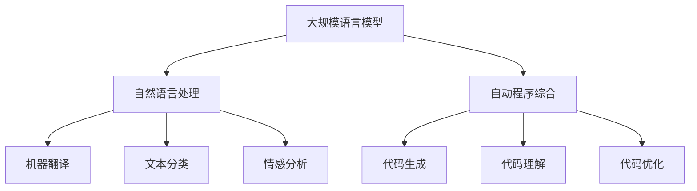

                 

### 第一部分：大规模语言模型基础

#### 第1章：大规模语言模型概述

##### 1.1 大规模语言模型的概念

**定义：** 大规模语言模型（Large-scale Language Model）是一种能够对自然语言进行建模的机器学习模型，通过学习大量的语言数据，这些模型能够捕捉到语言中的复杂结构和语义信息。

**发展历程：** 大规模语言模型的发展历程可追溯到20世纪80年代的统计语言模型。早期的统计语言模型，如N元语法模型（N-gram Model），使用历史频率来预测下一个单词。随着计算能力的提升和数据量的增加，语言模型逐渐发展出了更加复杂的结构，例如基于神经网络的模型。

##### 1.2 大规模语言模型的特点

**数据规模：** 大规模语言模型通常基于数百万甚至数十亿级别的文本数据集进行训练，这使得它们能够捕捉到语言中的细微差异和长期依赖关系。

**参数规模：** 大规模语言模型具有数亿到数十亿个参数，这使得模型能够对大量的语言特征进行建模。

**预处理技术：** 为了适应大规模数据处理需求，大规模语言模型采用了诸如词嵌入（word embeddings）、文本清洗和分词等技术进行预处理。

**模型架构：** 大规模语言模型通常采用深度神经网络结构，如变换器（Transformer）模型，其具有并行计算的优势，可以处理长序列数据。

##### 1.3 大规模语言模型的应用领域

**自然语言处理：** 大规模语言模型在自然语言处理（NLP）领域有着广泛的应用，包括机器翻译、文本分类、情感分析等。

**自动程序综合：** 大规模语言模型在自动程序综合（Automated Program Synthesis）领域显示出巨大的潜力，可以通过理解自然语言描述自动生成代码。

**其他领域：** 除了上述应用领域外，大规模语言模型还在问答系统、语音识别、图像描述生成等领域有着重要应用。

---

**核心概念与联系：**



**核心算法原理讲解：**

大规模语言模型的核心算法基于深度学习，尤其是变换器（Transformer）模型。下面简要介绍变换器模型的基本原理。

**变换器模型概述：**

变换器模型是一种基于自注意力机制（Self-Attention Mechanism）的深度神经网络模型，其设计目的是处理序列数据。自注意力机制允许模型在编码过程中将序列中的每个单词都与序列中的所有其他单词建立关联，从而更好地捕捉长距离依赖关系。

**自注意力机制：**

自注意力机制是变换器模型的核心组件。在自注意力机制中，每个输入词都会通过一个线性层映射到一个高维空间，然后与自身和序列中的其他词进行点积操作。通过权重分配，模型能够自动学习到不同词之间的相对重要性，从而提高模型对长序列的理解能力。

**数学模型：**

设输入序列为 \( X = [x_1, x_2, ..., x_n] \)，其中每个 \( x_i \) 是一个词的嵌入向量。变换器模型通过以下步骤处理输入序列：

$$
\text{Attention}(Q, K, V) = \text{softmax}\left(\frac{QK^T}{\sqrt{d_k}}\right) V
$$

其中，\( Q, K, V \) 分别是查询向量、关键向量、值向量，\( d_k \) 是关键向量的维度。计算过程包括以下步骤：

1. **查询（Query）生成：** 对于输入序列中的每个词 \( x_i \)，通过一个线性层生成查询向量 \( Q_i \)。

$$
Q_i = W_Q \cdot x_i
$$

2. **关键（Key）生成：** 对于输入序列中的每个词 \( x_i \)，通过一个线性层生成关键向量 \( K_i \)。

$$
K_i = W_K \cdot x_i
$$

3. **值（Value）生成：** 对于输入序列中的每个词 \( x_i \)，通过一个线性层生成值向量 \( V_i \)。

$$
V_i = W_V \cdot x_i
$$

4. **计算注意力分数：** 使用查询向量 \( Q_i \) 和关键向量 \( K_i \) 计算注意力分数。

$$
\text{Attention score}_{ij} = Q_i K_j^T / \sqrt{d_k}
$$

5. **加权求和：** 根据注意力分数对值向量 \( V_i \) 进行加权求和，得到加权值向量。

$$
\text{Context vector}_i = \sum_j \text{Attention score}_{ij} V_j
$$

6. **输出：** 将所有加权值向量组合成一个输出向量，作为模型的输出。

$$
O = [o_1, o_2, ..., o_n] = \text{Context vector}_1, \text{Context vector}_2, ..., \text{Context vector}_n
$$

**核心算法原理讲解：**

下面通过一个简单的Python示例来讲解变换器模型的基本原理。

```python
import torch
import torch.nn as nn
import torch.optim as optim

# 假设输入序列为 "hello world"
input_sequence = torch.tensor([1, 2, 3, 4, 5])  # 假设词嵌入维度为5

# 定义变换器模型
class TransformerModel(nn.Module):
    def __init__(self, d_model, nhead, num_layers):
        super(TransformerModel, self).__init__()
        self.embedding = nn.Embedding(d_model, d_model)
        self.transformer = nn.Transformer(d_model, nhead, num_layers)
        self.fc = nn.Linear(d_model, d_model)
        
    def forward(self, input_sequence):
        x = self.embedding(input_sequence)
        x = self.transformer(x)
        x = self.fc(x)
        return x

# 实例化模型和优化器
model = TransformerModel(d_model=5, nhead=2, num_layers=1)
optimizer = optim.Adam(model.parameters(), lr=0.001)

# 训练模型
for epoch in range(100):
    optimizer.zero_grad()
    output = model(input_sequence)
    loss = nn.MSELoss()(output, input_sequence)
    loss.backward()
    optimizer.step()
    print(f"Epoch {epoch+1}, Loss: {loss.item()}")

# 输出模型参数
print(model.embedding.weight)
```

在上面的代码中，我们首先定义了一个简单的变换器模型，包括词嵌入层、变换器层和全连接层。然后，我们通过训练模型来学习输入序列的表示。最后，我们输出模型参数，以展示词嵌入层的权重。

---

通过上述讲解，我们可以看到大规模语言模型在自动程序综合领域具有巨大的潜力。然而，这些模型的应用也面临诸多挑战，如数据质量和模型可解释性等。在接下来的章节中，我们将进一步探讨这些挑战，并提出可能的解决方案。

