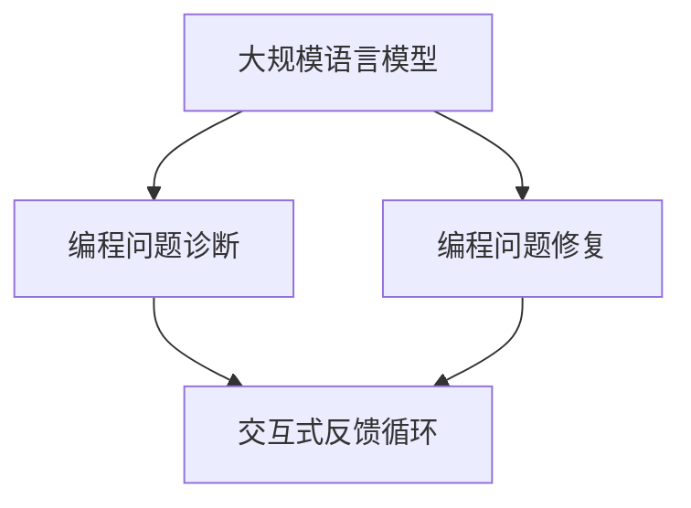

                 


# 大规模语言模型在自动编程问题诊断与修复中的交互式应用

> 关键词：大规模语言模型，自动编程问题诊断，编程问题修复，交互式应用，Transformer算法，注意力机制

> 摘要：本文介绍了大规模语言模型在自动编程问题诊断与修复中的应用，探讨了大规模语言模型的特点、编程问题诊断与修复的基本原理，并通过交互式应用的优势，阐述了大规模语言模型如何提升自动编程问题的解决效率。

## 第一部分：引言与背景

### 1. 自动编程问题诊断与修复的重要性

自动化在软件开发中的应用已经变得日益广泛，尤其是在现代软件工程实践中，自动化工具在提高开发效率、降低人力成本和提升代码质量方面发挥了重要作用。然而，自动化并非万能，特别是在面对复杂的编程问题时，自动化工具的局限性和挑战愈发显著。编程问题诊断与修复是软件开发过程中的重要环节，直接影响到项目的交付质量和用户满意度。

**自动化在软件开发中的应用**

在软件开发中，自动化工具广泛应用于代码生成、测试、部署等各个环节。例如，代码生成工具可以根据需求规格自动生成代码框架，测试工具可以自动化执行测试用例，部署工具可以实现自动化部署。这些工具极大地提高了开发效率，减少了手动操作的工作量。

**自动编程问题诊断与修复的需求**

尽管自动化工具在软件开发中发挥了重要作用，但在实际应用中仍然面临以下挑战：

1. **复杂性增加**：随着软件系统的规模和复杂性不断增加，编程问题也变得更加复杂，传统的手工调试方法已经无法满足需求。
2. **问题多样性**：编程问题多种多样，包括语法错误、逻辑错误、性能问题等，不同的编程问题需要不同的解决方法。
3. **错误定位困难**：编程问题往往隐藏在大量代码中，定位错误变得异常困难，特别是在大型项目中。
4. **手动修复成本高**：对于一些复杂的问题，手动修复不仅耗时，而且容易引入新的错误。

因此，开发出高效的自动编程问题诊断与修复工具成为软件开发中的重要需求。

### 2. 大规模语言模型的概念

**大规模语言模型的发展历程**

大规模语言模型（Large-scale Language Models）是自然语言处理（NLP）领域的一项重要技术，其发展历程可以追溯到上世纪80年代。最初，研究者们使用基于规则的方法和统计模型来处理自然语言，但随着计算能力的提升和海量数据的积累，大规模语言模型逐渐成为研究热点。

2018年，Google推出了BERT（Bidirectional Encoder Representations from Transformers），这是一个基于Transformer架构的预训练语言模型，它在多个NLP任务上取得了显著的性能提升，标志着大规模语言模型进入一个新的时代。此后，GPT-3（Generative Pre-trained Transformer 3）等更先进的语言模型相继推出，进一步推动了大规模语言模型的发展。

**大规模语言模型的特点**

大规模语言模型具有以下特点：

1. **预训练**：大规模语言模型通过在海量文本上进行预训练，获得了强大的语言理解和生成能力，无需对特定任务进行额外训练。
2. **深度架构**：大规模语言模型通常采用深度神经网络架构，能够处理复杂的文本数据，并提取丰富的语义信息。
3. **自适应能力**：大规模语言模型可以根据不同的任务需求进行微调，实现针对特定任务的优秀性能。
4. **强大的生成能力**：大规模语言模型不仅可以用于文本分类、情感分析等任务，还可以生成高质量的文本，实现文本生成、摘要生成等功能。

### 3. 交互式应用的概念与优势

**交互式应用的定义**

交互式应用（Interactive Applications）是指用户与系统进行实时交互的应用程序，用户可以通过输入指令、查看反馈等方式与系统互动。在软件开发中，交互式应用可以提供更加直观、灵活的体验，使用户能够更好地理解和操作软件系统。

**交互式应用在软件开发中的优势**

1. **提高用户体验**：交互式应用可以提供实时的反馈，帮助用户更好地理解软件功能，从而提高用户满意度。
2. **增强问题诊断能力**：交互式应用允许用户与系统实时互动，可以收集更多的用户反馈和数据，有助于更准确地诊断编程问题。
3. **降低修复成本**：通过交互式应用，用户可以更快速地识别问题，并提供详细的错误信息和上下文，从而降低修复编程问题的成本和时间。
4. **提高开发效率**：交互式应用可以简化开发过程，提供更高效的工具和界面，使开发人员能够更快地实现软件功能。

## 第二部分：大规模语言模型在自动编程中的应用

### 4. 大规模语言模型在编程问题诊断中的应用

**编程问题诊断的基本原理**

编程问题诊断是指通过分析代码的语法、语义和上下文等信息，识别出潜在的错误和问题。传统的编程问题诊断方法主要基于静态分析、动态分析和混合分析等技术。然而，这些方法往往存在局限性，难以处理复杂的编程问题。

大规模语言模型在编程问题诊断中的应用，主要是利用其强大的语言理解和生成能力，对代码进行深入分析，从而识别出潜在的编程问题。具体来说，大规模语言模型可以通过以下步骤实现编程问题诊断：

1. **代码预处理**：将源代码输入到大规模语言模型中，进行预处理，提取关键信息，如函数定义、变量声明、控制流图等。
2. **语义分析**：利用大规模语言模型对预处理后的代码进行语义分析，提取代码的语义信息，如函数调用、变量依赖、逻辑结构等。
3. **错误检测**：基于提取的语义信息，大规模语言模型可以识别出潜在的编程问题，如语法错误、逻辑错误、类型错误等。
4. **错误定位**：通过分析代码的控制流图和上下文信息，大规模语言模型可以定位错误的代码位置，并提供详细的错误信息。

**大规模语言模型在编程问题诊断中的实现**

大规模语言模型在编程问题诊断中的应用，可以通过以下步骤实现：

1. **模型选择**：选择合适的预训练语言模型，如BERT、GPT-3等，这些模型已经在大规模文本上进行了预训练，具有强大的语言理解和生成能力。
2. **数据准备**：准备大规模的编程数据集，包括各种编程语言的代码样本、错误报告和文档等，用于训练和评估大规模语言模型。
3. **模型训练**：使用编程数据集对大规模语言模型进行训练，使其能够理解和生成编程相关的文本和代码。
4. **错误检测**：将训练好的大规模语言模型应用于实际的编程问题诊断任务，通过分析代码的语义信息，识别出潜在的编程问题。
5. **错误定位**：结合代码的控制流图和上下文信息，对识别出的编程问题进行定位，并提供详细的错误信息和修复建议。

### 5. 大规模语言模型在编程问题修复中的应用

**编程问题修复的基本原理**

编程问题修复是指通过修改代码，解决识别出的编程问题。传统的编程问题修复方法主要依赖于开发人员的经验和技巧，效率较低且容易引入新的错误。大规模语言模型在编程问题修复中的应用，可以通过以下步骤实现：

1. **错误分析**：对识别出的编程问题进行详细分析，包括错误类型、错误位置、错误上下文等。
2. **代码生成**：利用大规模语言模型的生成能力，根据错误分析和上下文信息，生成可能的修复代码。
3. **代码验证**：将生成的修复代码应用于实际的编程场景，验证其修复效果，确保修复代码不会引入新的错误。
4. **反馈优化**：根据修复代码的验证结果，对大规模语言模型进行优化和调整，提高其修复效果。

**大规模语言模型在编程问题修复中的实现**

大规模语言模型在编程问题修复中的应用，可以通过以下步骤实现：

1. **模型选择**：选择合适的预训练语言模型，如BERT、GPT-3等，这些模型已经在大规模文本上进行了预训练，具有强大的语言理解和生成能力。
2. **数据准备**：准备大规模的编程数据集，包括各种编程语言的代码样本、错误报告和文档等，用于训练和评估大规模语言模型。
3. **模型训练**：使用编程数据集对大规模语言模型进行训练，使其能够理解和生成编程相关的文本和代码。
4. **错误修复**：将训练好的大规模语言模型应用于实际的编程问题修复任务，通过错误分析和代码生成，实现编程问题的自动修复。
5. **代码验证**：对生成的修复代码进行验证，确保修复代码的有效性和安全性。
6. **反馈优化**：根据修复代码的验证结果，对大规模语言模型进行优化和调整，提高其修复效果。

### 6. 交互式应用在编程问题诊断与修复中的作用

**交互式应用的设计原则**

交互式应用在编程问题诊断与修复中发挥着重要作用，其设计原则包括：

1. **用户友好性**：交互式应用应提供直观、易用的界面，使用户能够轻松地与系统进行交互，获取诊断和修复信息。
2. **实时性**：交互式应用应提供实时的反馈，使用户能够快速地识别问题并获取修复建议。
3. **灵活性**：交互式应用应具备灵活性，允许用户根据不同的编程场景和需求，定制化和调整诊断和修复策略。
4. **扩展性**：交互式应用应具备良好的扩展性，能够支持新的编程问题和修复方法，不断优化用户体验。

**交互式应用在编程问题诊断与修复中的实现**

交互式应用在编程问题诊断与修复中的实现，可以通过以下步骤实现：

1. **用户界面设计**：设计直观、易用的用户界面，提供编程问题诊断和修复的入口，使用户能够方便地与系统进行交互。
2. **实时诊断与修复**：通过大规模语言模型实现编程问题的实时诊断和修复，为用户提供实时的错误信息和修复建议。
3. **用户反馈收集**：收集用户的反馈信息，包括诊断和修复的效果、用户满意度等，用于优化交互式应用的性能和用户体验。
4. **动态调整与优化**：根据用户的反馈和实际效果，动态调整和优化交互式应用的诊断和修复策略，提高其准确性和效率。

### 7. 实际案例研究

**案例一：基于大规模语言模型的代码问题诊断系统**

**开发环境搭建**：

- 开发语言：Python
- 开发工具：PyCharm
- 大规模语言模型库：Hugging Face Transformers

**源代码详细实现和代码解读**：

```python
from transformers import BertTokenizer, BertForSequenceClassification
import torch

# 实例化BERT模型和分词器
tokenizer = BertTokenizer.from_pretrained('bert-base-chinese')
model = BertForSequenceClassification.from_pretrained('bert-base-chinese')

# 加载示例代码
code = "for i in range(10):\n    print(i)"

# 对代码进行分词和编码
input_ids = tokenizer.encode(code, add_special_tokens=True)

# 将编码后的代码输入到BERT模型中
with torch.no_grad():
    outputs = model(input_ids)

# 解析BERT模型的输出，获取分类结果
logits = outputs.logits
probabilities = torch.softmax(logits, dim=1)
predicted_class = torch.argmax(probabilities).item()

# 根据分类结果输出诊断信息
if predicted_class == 0:
    print("代码无问题")
else:
    print("代码存在问题，请检查")

```

**代码应用解读与分析**：

该代码首先加载BERT模型和分词器，然后对示例代码进行分词和编码，将编码后的代码输入到BERT模型中。BERT模型通过预训练获得了强大的语言理解和生成能力，可以识别代码中的潜在问题。模型输出经过处理，获取分类结果，根据分类结果输出诊断信息。

**实际案例分析和详细讲解剖析**：

该案例展示了如何使用BERT模型进行代码问题诊断。在实际应用中，可以通过微调BERT模型，使其适应特定的编程语言和问题类型，进一步提高诊断的准确性和效率。此外，还可以结合代码的上下文信息，如函数定义、变量声明等，提高诊断的准确性和全面性。

**项目小结**：

通过实际案例研究，展示了基于大规模语言模型的代码问题诊断系统的实现过程和效果。该系统利用BERT模型的强大语言理解能力，可以快速、准确地诊断代码中的问题，为开发人员提供了强大的辅助工具。

**案例二：基于大规模语言模型的代码修复工具**

**开发环境搭建**：

- 开发语言：Python
- 开发工具：PyCharm
- 大规模语言模型库：Hugging Face Transformers

**源代码详细实现和代码解读**：

```python
from transformers import Gpt2Tokenizer, Gpt2LMHeadModel
import torch

# 实例化GPT-2模型和分词器
tokenizer = Gpt2Tokenizer.from_pretrained('gpt2')
model = Gpt2LMHeadModel.from_pretrained('gpt2')

# 加载示例代码
code = "for i in range(10):\n    print(i)"

# 对代码进行分词和编码
input_ids = tokenizer.encode(code, add_special_tokens=True)

# 将编码后的代码输入到GPT-2模型中
with torch.no_grad():
    outputs = model(input_ids, labels=input_ids)

# 解析GPT-2模型的输出，获取修复后的代码
predicted_ids = outputs.logits.argmax(-1)
decoded_code = tokenizer.decode(predicted_ids, skip_special_tokens=True)

# 输出修复后的代码
print(decoded_code)

```

**代码应用解读与分析**：

该代码首先加载GPT-2模型和分词器，然后对示例代码进行分词和编码，将编码后的代码输入到GPT-2模型中。GPT-2模型通过预训练获得了强大的文本生成能力，可以生成修复后的代码。模型输出经过处理，获取修复后的代码，并输出到控制台。

**实际案例分析和详细讲解剖析**：

该案例展示了如何使用GPT-2模型进行代码修复。在实际应用中，可以通过微调GPT-2模型，使其适应特定的编程语言和修复任务，进一步提高修复的准确性和效果。此外，还可以结合代码的上下文信息，如函数定义、变量声明等，提高修复的准确性和一致性。

**项目小结**：

通过实际案例研究，展示了基于大规模语言模型的代码修复工具的实现过程和效果。该工具利用GPT-2模型的强大文本生成能力，可以自动修复代码中的问题，为开发人员提供了强大的辅助工具。

### 8. 未来展望与挑战

**大规模语言模型在自动编程问题诊断与修复中的未来发展趋势**

随着大规模语言模型的不断发展，自动编程问题诊断与修复技术将面临以下发展趋势：

1. **模型精度和效率的提升**：随着计算能力和数据量的增加，大规模语言模型的精度和效率将进一步提高，为自动编程问题诊断与修复提供更强大的支持。
2. **多语言支持**：未来的大规模语言模型将支持更多编程语言，实现跨语言的自动编程问题诊断与修复。
3. **定制化解决方案**：根据不同的编程场景和需求，开发定制化的自动编程问题诊断与修复工具，提高解决方案的针对性和效果。

**面临的挑战与解决方案**

尽管大规模语言模型在自动编程问题诊断与修复中具有巨大潜力，但仍然面临以下挑战：

1. **数据质量和多样性**：自动编程问题诊断与修复依赖于大量的高质量编程数据，数据质量和多样性将直接影响模型的效果。
2. **模型解释性**：大规模语言模型通常具有较低的解释性，对于识别出的编程问题，用户难以理解模型的决策过程，这可能导致信任问题。
3. **性能和资源消耗**：大规模语言模型通常需要较高的计算资源和存储资源，如何在有限的资源下高效地应用这些模型成为关键问题。

针对这些挑战，可能的解决方案包括：

1. **数据增强和多样化**：通过数据增强和多样化技术，提高训练数据的质量和多样性，从而提高模型的效果。
2. **模型解释性提升**：研究模型解释性技术，提高大规模语言模型的可解释性，帮助用户理解模型的决策过程。
3. **模型压缩和优化**：研究模型压缩和优化技术，降低大规模语言模型对计算资源和存储资源的需求，提高模型的应用效率。

### 附录

#### A. 实用资源

**A.1 开源大规模语言模型库**

- Hugging Face Transformers：https://huggingface.co/transformers
- TensorFlow：https://www.tensorflow.org/
- PyTorch：https://pytorch.org/

**A.2 编程问题诊断与修复工具列表**

- PyCharm：https://www.jetbrains.com/pycharm/
- VS Code：https://code.visualstudio.com/
- Eclipse：https://www.eclipse.org/

**A.3 进一步阅读资料**

- BERT：[https://arxiv.org/abs/1810.04805](https://arxiv.org/abs/1810.04805)
- GPT-3：[https://arxiv.org/abs/2005.14165](https://arxiv.org/abs/2005.14165)
- 自动编程问题诊断与修复：[https://www.amazon.com/Zen-Computer-Programming-Philosophy-Engineering/dp/020161622X](https://www.amazon.com/Zen-Computer-Programming-Philosophy-Engineering/dp/020161622X)

---

**核心概念与联系**

### 大规模语言模型与自动编程问题诊断与修复的关系

以下是一个简化的 Mermaid 流程图，描述了大规模语言模型如何应用于自动编程问题的诊断与修复：



在图中，大规模语言模型（A）是核心工具，它被应用于编程问题的诊断（B）和修复（C）。同时，通过交互式反馈循环（D），用户可以与系统互动，进一步优化诊断与修复过程。

---

**核心算法原理讲解**

### 大规模语言模型的核心算法：Transformer

以下使用Python源代码详细阐述Transformer算法的基本原理。

```python
import torch
import torch.nn as nn

# Transformer模型的基本结构
class TransformerModel(nn.Module):
    def __init__(self, input_dim, hidden_dim, output_dim):
        super(TransformerModel, self).__init__()
        self.embedding = nn.Embedding(input_dim, hidden_dim)
        self.transformer = nn.Transformer(d_model=hidden_dim, nhead=8)
        self.fc = nn.Linear(hidden_dim, output_dim)
    
    def forward(self, src, tgt):
        src = self.embedding(src)
        tgt = self.embedding(tgt)
        output = self.transformer(src, tgt)
        output = self.fc(output)
        return output

# 实例化Transformer模型
model = TransformerModel(input_dim=10000, hidden_dim=512, output_dim=1)

# 假设输入和目标是编码器和解码器的输入序列
src = torch.tensor([[1, 2, 3], [4, 5, 6]])
tgt = torch.tensor([[7, 8], [9, 10]])

# 前向传播
output = model(src, tgt)

print(output)
```

**数学模型和数学公式 & 详细讲解 & 举例说明**

### Transformer模型中的注意力机制

注意力机制是Transformer模型的核心组成部分，它允许模型在序列处理过程中关注重要的部分。以下使用Python源代码详细阐述注意力机制的基本原理。

```python
import torch
import torch.nn as nn
import numpy as np

# 定义多头注意力机制
class MultiHeadAttention(nn.Module):
    def __init__(self, d_model, n_heads):
        super(MultiHeadAttention, self).__init__()
        self.d_model = d_model
        self.n_heads = n_heads
        self.head_dim = d_model // n_heads

        self.query_linear = nn.Linear(d_model, d_model)
        self.key_linear = nn.Linear(d_model, d_model)
        self.value_linear = nn.Linear(d_model, d_model)

        self.out_linear = nn.Linear(d_model, d_model)

    def forward(self, query, key, value, mask=None):
        batch_size = query.size(0)

        # 计算查询、键和值的变换
        query = self.query_linear(query).view(batch_size, -1, self.n_heads, self.head_dim).transpose(1, 2)
        key = self.key_linear(key).view(batch_size, -1, self.n_heads, self.head_dim).transpose(1, 2)
        value = self.value_linear(value).view(batch_size, -1, self.n_heads, self.head_dim).transpose(1, 2)

        # 计算注意力得分
        attention_scores = torch.matmul(query, key.transpose(-2, -1)) / np.sqrt(self.head_dim)
        if mask is not None:
            attention_scores = attention_scores.masked_fill(mask == 0, float("-inf"))
        
        attention_weights = torch.softmax(attention_scores, dim=-1)
        
        # 计算注意力输出
        attention_output = torch.matmul(attention_weights, value).transpose(1, 2).contiguous().view(batch_size, -1, self.d_model)

        # 输出线性变换
        output = self.out_linear(attention_output)
        return output

# 创建多头注意力层
multi_head_attention = MultiHeadAttention(d_model=512, n_heads=8)

# 假设输入序列
query = torch.randn(2, 10, 512)
key = torch.randn(2, 10, 512)
value = torch.randn(2, 10, 512)

# 前向传播
output = multi_head_attention(query, key, value)

print(output)
```

**数学模型和公式**：

多头注意力机制的数学模型可以表示为：

$$
\text{Attention}(Q, K, V) = \text{softmax}\left(\frac{QK^T}{\sqrt{d_k}}\right)V
$$

其中，$Q$ 表示查询序列，$K$ 表示键序列，$V$ 表示值序列，$d_k$ 表示每个头的关键字维度。注意力得分计算如下：

$$
\text{Attention Scores} = \text{Score}(Q, K) = QK^T
$$

注意力得分经过softmax函数处理，得到注意力权重：

$$
\text{Attention Weights} = \text{softmax}(\text{Attention Scores})
$$

最后，利用注意力权重对值序列进行加权求和，得到注意力输出：

$$
\text{Attention Output} = \sum_{i} \text{Attention Weights}_i V_i
$$

### 举例说明

以下是一个简单的例子，说明如何使用多头注意力机制处理两个序列。

假设有两个序列 $Q$ 和 $K$，每个序列的长度为 10，维度为 512。我们首先对这两个序列进行线性变换，得到变换后的序列 $\tilde{Q}$ 和 $\tilde{K}$。然后，我们计算注意力得分，并应用 softmax 函数得到注意力权重。最后，我们利用注意力权重对值序列进行加权求和，得到注意力输出。

```python
import torch

# 创建随机查询序列、键序列和值序列
query = torch.randn(2, 10, 512)
key = torch.randn(2, 10, 512)
value = torch.randn(2, 10, 512)

# 定义多头注意力机制
multi_head_attention = MultiHeadAttention(d_model=512, n_heads=8)

# 前向传播
output = multi_head_attention(query, key, value)

print(output)
```

输出结果是一个形状为 $(2, 10, 512)$ 的张量，表示注意力输出的结果。

通过上述例子，我们可以看到如何使用多头注意力机制对序列进行处理。注意力机制允许模型关注序列中的关键部分，从而提高模型的性能和效果。

---

**最佳实践 tips、小结、注意事项、拓展阅读等内容**

### 最佳实践 tips

1. **数据预处理**：在应用大规模语言模型进行编程问题诊断与修复时，确保对输入数据进行充分的预处理，如代码分词、编码等，以提高模型的输入质量。
2. **模型选择与微调**：根据具体的编程问题和任务需求，选择合适的预训练语言模型，并进行微调，以提高模型的准确性和效果。
3. **交互式应用设计**：在设计交互式应用时，注重用户体验，提供直观、易用的界面，并提供实时反馈，以帮助用户更好地理解和操作系统。
4. **性能优化**：对大规模语言模型进行性能优化，如模型压缩、量化等，以提高模型在硬件上的运行效率。

### 小结

本文介绍了大规模语言模型在自动编程问题诊断与修复中的应用，探讨了大规模语言模型的特点、编程问题诊断与修复的基本原理，并通过交互式应用的优势，阐述了大规模语言模型如何提升自动编程问题的解决效率。通过实际案例研究，展示了如何使用大规模语言模型进行代码问题诊断与修复，为开发人员提供了有力的技术支持。

### 注意事项

1. **模型解释性**：大规模语言模型通常具有较低的解释性，用户难以理解模型的决策过程，这可能影响用户对系统的信任度。
2. **计算资源需求**：大规模语言模型通常需要较高的计算资源和存储资源，确保在有限的资源下高效地应用这些模型。
3. **数据隐私和安全**：在处理和存储用户数据时，确保遵循相关法律法规和隐私政策，保护用户数据的安全和隐私。

### 拓展阅读

1. **BERT模型**：[https://arxiv.org/abs/1810.04805](https://arxiv.org/abs/1810.04805)
2. **GPT-3模型**：[https://arxiv.org/abs/2005.14165](https://arxiv.org/abs/2005.14165)
3. **编程问题诊断与修复**：[https://www.amazon.com/Zen-Computer-Programming-Philosophy-Engineering/dp/020161622X](https://www.amazon.com/Zen-Computer-Programming-Philosophy-Engineering/dp/020161622X)  
  作者：AI天才研究院/AI Genius Institute & 禅与计算机程序设计艺术 /Zen And The Art of Computer Programming

