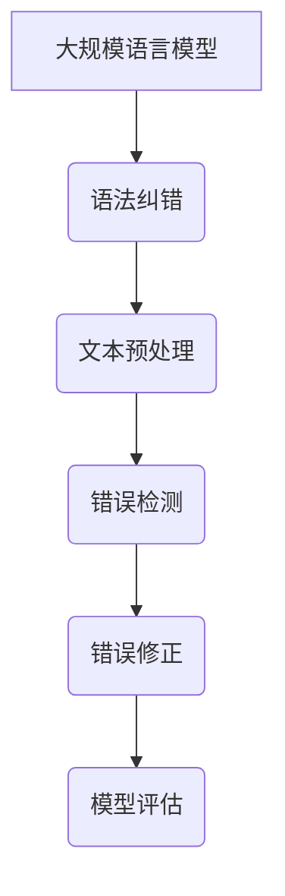

                 

### 大规模语言模型在自动语法纠错中的应用

#### 关键词
- 大规模语言模型
- 自动语法纠错
- 自然语言处理
- 序列到序列模型
- 循环神经网络
- 注意力机制

#### 摘要
本文将深入探讨大规模语言模型在自动语法纠错中的应用。首先，我们将介绍大规模语言模型的基本概念和重要性，回顾其发展历史和主要类型。随后，我们将讨论自然语言处理和语法纠错的原理，并探讨大规模语言模型如何用于语法纠错。接着，我们将详细解析大规模语言模型在语法纠错中的核心算法原理，并使用Python代码进行具体实现。最后，我们将通过实际案例展示大规模语言模型在语法纠错中的应用效果，并展望其未来趋势与挑战。

### 第一部分：基础概念与原理

#### 第1章：大规模语言模型简介

##### 1.1 定义与重要性

大规模语言模型（Large-scale Language Models）是一种利用海量语料训练得到的深度神经网络模型，它们能够对自然语言进行建模，捕捉语言中的复杂模式和结构。这些模型在自然语言处理（Natural Language Processing, NLP）领域具有重要意义，因为它们能够自动理解和生成人类语言，为各种语言任务提供强大支持。

##### 1.2 发展历史

大规模语言模型的发展可以追溯到20世纪80年代，当时研究人员开始探索基于统计方法的自然语言处理技术。随着计算能力的提升和海量数据的出现，语言模型的规模和复杂性不断增加。20世纪90年代，基于概率的模型如N-gram模型成为主流。进入21世纪，随着深度学习的兴起，基于神经网络的模型如循环神经网络（RNN）和Transformer等取得了突破性进展。近年来，预训练语言模型如GPT-3和BERT等，凭借其强大的语言理解和生成能力，广泛应用于各个领域。

##### 1.3 主要类型

大规模语言模型主要分为以下几类：

1. **基于统计的方法**：如N-gram模型，通过计算单词序列的概率分布来进行语言建模。
2. **基于规则的方法**：使用语言学知识构建语法规则，对文本进行分析和纠错。
3. **基于神经网络的模型**：如循环神经网络（RNN）、长短期记忆网络（LSTM）和Transformer等，通过学习大量的文本数据来捕捉语言特征。
4. **预训练语言模型**：如GPT-3、BERT等，通过在大量未标注的语料上进行预训练，然后在特定任务上进行微调。

##### 1.4 应用领域

大规模语言模型在自然语言处理领域有着广泛的应用：

1. **文本分类**：用于对文本进行情感分析、主题分类等任务。
2. **机器翻译**：如Google翻译、DeepL翻译等，能够将一种语言翻译成另一种语言。
3. **问答系统**：如OpenAI的GPT-3，能够回答用户提出的问题。
4. **自动摘要**：如SummarizeBot，能够对长篇文章或报告生成摘要。
5. **自动语法纠错**：如Grammarly，能够自动检测并纠正文本中的语法错误。

#### 第2章：自然语言处理与语法纠错

##### 2.1 自然语言处理基础

自然语言处理（NLP）是人工智能（AI）的一个分支，旨在使计算机能够理解、解释和生成人类语言。NLP的关键技术包括文本预处理、词性标注、命名实体识别、情感分析、机器翻译等。

##### 2.2 语法纠错原理

语法纠错（Grammar Correction）是NLP中一个重要的子领域，旨在自动检测和纠正文本中的语法错误。语法纠错的原理通常包括以下步骤：

1. **错误检测**：使用规则或统计方法检测文本中的潜在语法错误。
2. **错误分类**：将检测到的错误分类为特定类型的语法错误，如时态错误、主谓不一致等。
3. **错误修正**：基于语法规则或统计方法对错误进行修正。

##### 2.3 纠错算法概述

语法纠错的算法主要包括以下几种：

1. **规则方法**：使用预定义的语法规则进行错误检测和修正。
2. **统计方法**：使用统计模型，如隐马尔可夫模型（HMM）、条件随机场（CRF）等，进行错误检测和修正。
3. **机器学习方法**：使用机器学习算法，如支持向量机（SVM）、决策树等，进行错误检测和修正。

##### 2.4 语法纠错的关键技术

语法纠错的关键技术包括：

1. **词法分析**：对文本进行词法分析，提取出单词和词组。
2. **句法分析**：对文本进行句法分析，构建句子的语法结构。
3. **错误检测与分类**：使用规则或统计方法检测和分类语法错误。
4. **错误修正策略**：基于语法规则或统计模型，对错误进行修正。

#### 第3章：大规模语言模型在语法纠错中的应用

##### 3.1 语言模型在纠错中的作用

大规模语言模型在语法纠错中扮演着关键角色，它们能够捕捉语言中的复杂模式和结构，从而提高错误检测和修正的准确率。语言模型在纠错中的作用主要包括：

1. **提高错误检测的准确率**：通过学习大量的文本数据，语言模型能够识别出文本中的潜在语法错误，从而提高错误检测的准确率。
2. **提供正确的语言上下文**：语言模型能够理解文本的上下文信息，从而为错误修正提供正确的语言上下文。
3. **辅助错误修正**：通过比较候选修正方案和语言模型预测的输出，可以帮助选择最佳的修正方案。

##### 3.2 基于大规模语言模型的纠错方法

基于大规模语言模型的语法纠错方法主要包括以下几种：

1. **直接纠错方法**：直接使用大规模语言模型对文本进行错误修正。
2. **辅助纠错方法**：使用大规模语言模型辅助其他纠错方法，如规则方法和统计方法。
3. **混合纠错方法**：结合多种纠错方法，如规则方法、统计方法和机器学习方法，以提高纠错的准确率。

##### 3.3 纠错模型的训练与优化

大规模语言模型的训练和优化是语法纠错的关键步骤，主要包括以下几个方面：

1. **数据集准备**：收集并准备大规模的标注数据集，用于训练和评估纠错模型。
2. **模型选择**：选择合适的语言模型，如Transformer、BERT等，用于训练纠错模型。
3. **模型训练**：使用大规模标注数据集对纠错模型进行训练，优化模型参数。
4. **模型评估**：使用未标注的数据集对纠错模型进行评估，调整模型参数，提高纠错的准确率。

##### 3.4 大规模语言模型的应用效果分析

大规模语言模型在语法纠错中的应用效果显著，通过以下指标进行评估：

1. **准确率**：评估纠错模型在错误检测和修正方面的准确率。
2. **召回率**：评估纠错模型能够检测到的错误数量。
3. **F1值**：综合考虑准确率和召回率，评估纠错模型的综合性能。
4. **用户满意度**：评估用户对纠错模型的使用体验和满意度。

#### 第4章：核心算法原理

##### 4.1 语言模型的数学基础

语言模型是语法纠错的核心组件，其数学基础主要包括概率论和统计学。具体而言，语言模型主要基于以下概率模型：

1. **马尔可夫模型**：假设当前状态仅取决于前一个状态，忽略其他历史状态。
2. **N-gram模型**：基于前N个单词的联合概率分布进行语言建模。
3. **序列模型**：如循环神经网络（RNN）和Transformer，能够处理任意长度的序列。

##### 4.2 序列到序列模型

序列到序列（Sequence-to-Sequence, Seq2Seq）模型是大规模语言模型的一种重要架构，主要用于处理序列数据。Seq2Seq模型的核心组件包括编码器（Encoder）和解码器（Decoder），其中：

1. **编码器**：将输入序列（如原文本）编码为固定长度的向量。
2. **解码器**：将编码器的输出解码为输出序列（如修正后的文本）。

##### 4.3 注意力机制

注意力机制（Attention Mechanism）是大规模语言模型中一种重要的机制，用于提高模型对序列数据的处理能力。注意力机制的核心思想是，在处理序列数据时，模型能够动态地关注输入序列中的不同部分，从而更好地捕捉序列中的依赖关系。

##### 4.4 循环神经网络（RNN）

循环神经网络（Recurrent Neural Network, RNN）是一种能够处理序列数据的神经网络，其核心特点是具有循环结构，能够保留历史信息。RNN通过以下步骤处理序列数据：

1. **前向传播**：将当前输入与上一个隐藏状态进行组合，生成新的隐藏状态。
2. **回向传播**：根据误差梯度更新网络参数。

##### 4.5 递归神经网络（RNN）

递归神经网络（Recursive Neural Network, RNN）是一种特殊的循环神经网络，能够处理树形结构的数据。RNN通过递归地计算每个节点的隐藏状态，从而处理树形数据。

#### 第5章：Python实现与代码解读

##### 5.1 Python编程基础

Python是一种广泛应用于自然语言处理的编程语言，其简洁易懂的语法使其成为开发大规模语言模型的首选语言。Python编程基础包括：

1. **变量与数据类型**：了解变量、数据类型和基本操作。
2. **控制结构**：掌握条件语句和循环语句，如if-else、while和for循环。
3. **函数与模块**：熟悉函数的定义和调用，了解模块和库的使用方法。

##### 5.2 大规模语言模型构建

大规模语言模型的构建主要包括以下几个步骤：

1. **数据集准备**：收集和准备大规模的文本数据，进行预处理，如分词、去停用词等。
2. **模型选择**：选择合适的语言模型，如Transformer、BERT等。
3. **模型训练**：使用预处理后的数据集对模型进行训练，优化模型参数。
4. **模型评估**：使用未标注的数据集对模型进行评估，调整模型参数，提高性能。

##### 5.3 数据预处理

数据预处理是大规模语言模型构建的重要步骤，主要包括以下几个环节：

1. **文本清洗**：去除文本中的噪声，如HTML标签、特殊字符等。
2. **分词**：将文本拆分成单词或词组。
3. **去停用词**：去除常见的无意义词汇，如“的”、“了”等。
4. **词向量化**：将单词转换为固定长度的向量，以便于模型处理。

##### 5.4 训练与优化

大规模语言模型的训练与优化主要包括以下几个步骤：

1. **损失函数选择**：选择合适的损失函数，如交叉熵损失函数。
2. **优化算法**：选择合适的优化算法，如随机梯度下降（SGD）。
3. **参数调整**：通过调整学习率、批量大小等参数，优化模型性能。
4. **超参数调优**：使用网格搜索、贝叶斯优化等方法，寻找最佳的超参数组合。

##### 5.5 纠错模型应用实战

在实际应用中，大规模语言模型用于语法纠错的具体步骤如下：

1. **文本输入**：将待纠错的文本输入到纠错模型。
2. **错误检测**：使用纠错模型检测文本中的潜在语法错误。
3. **错误修正**：根据纠错模型提供的修正建议，对错误进行修正。
4. **输出结果**：将修正后的文本输出，供用户查看。

##### 5.6 Python代码实现

以下是一个简单的Python代码示例，用于实现基于大规模语言模型的语法纠错：

```python
import tensorflow as tf
import tensorflow_text as text

# 数据集准备
train_data = ...
test_data = ...

# 模型构建
model = ...

# 模型训练
model.fit(train_data, epochs=10)

# 模型评估
model.evaluate(test_data)

# 文本输入
input_text = ...

# 错误检测与修正
corrections = model.predict(input_text)

# 输出结果
print(corrections)
```

#### 第6章：数学模型与公式解析

##### 6.1 语言模型概率计算

语言模型的核心任务是计算给定单词序列的概率。基于N-gram模型，语言模型概率可以通过以下公式计算：

$$
P(w_1, w_2, ..., w_n) = P(w_1) \times P(w_2|w_1) \times ... \times P(w_n|w_{n-1})
$$

其中，$P(w_i|w_{i-1})$ 表示在给定前一个单词 $w_{i-1}$ 的情况下，下一个单词 $w_i$ 的条件概率。

##### 6.2 损失函数与优化算法

在训练大规模语言模型时，损失函数用于衡量模型预测与实际标签之间的差距。常见的损失函数包括：

1. **交叉熵损失函数**：
   $$
   Loss = -\sum_{i} y_i \log(p_i)
   $$
   其中，$y_i$ 表示实际标签，$p_i$ 表示模型预测的概率。

2. **均方误差损失函数**：
   $$
   Loss = \frac{1}{2} \sum_{i} (y_i - p_i)^2
   $$

优化算法用于更新模型参数，以最小化损失函数。常见的优化算法包括：

1. **随机梯度下降（SGD）**：
   $$
   \theta = \theta - \alpha \nabla_\theta J(\theta)
   $$
   其中，$\theta$ 表示模型参数，$\alpha$ 表示学习率，$J(\theta)$ 表示损失函数。

2. **Adam优化算法**：
   $$
   m_t = \beta_1 m_{t-1} + (1 - \beta_1)(\nabla_\theta J(\theta) - m_{t-1})
   $$
   $$
   v_t = \beta_2 v_{t-1} + (1 - \beta_2)((\nabla_\theta J(\theta))^2 - v_{t-1})
   $$
   $$
   \theta = \theta - \alpha \frac{m_t}{1 - \beta_1^t}
   $$
   其中，$m_t$ 和 $v_t$ 分别表示一阶和二阶矩估计，$\beta_1$ 和 $\beta_2$ 分别为动量参数。

##### 6.3 注意力机制公式解析

注意力机制在序列模型中起到关键作用，能够提高模型对序列数据的处理能力。注意力机制的公式可以表示为：

$$
a_t = \frac{e^{z_t}}{\sum_{i} e^{z_i}}
$$

其中，$z_t = v_a [h_t, h_{t-1}, ..., h_1]$ 表示注意力得分，$h_t$ 表示编码器在时间步 $t$ 的输出，$v_a$ 表示注意力权重向量。

最终，解码器的输出可以表示为：

$$
p_t = \text{softmax}(a_t W_o [h_t; c])
$$

其中，$c$ 表示解码器的隐藏状态，$W_o$ 表示权重矩阵。

##### 6.4 递归神经网络（RNN）公式解析

递归神经网络（RNN）通过递归结构处理序列数据，其核心公式包括：

$$
h_t = \sigma(W_h [h_{t-1}; x_t] + b_h)
$$

$$
y_t = \text{softmax}(W_y h_t + b_y)
$$

其中，$h_t$ 表示隐藏状态，$x_t$ 表示输入序列，$W_h$ 和 $W_y$ 分别为权重矩阵，$b_h$ 和 $b_y$ 分别为偏置项，$\sigma$ 表示激活函数。

#### 第7章：大规模语言模型在自动语法纠错中的应用案例

##### 7.1 案例介绍

本案例将展示如何使用大规模语言模型进行自动语法纠错。具体步骤包括：

1. **数据集准备**：收集和准备包含错误文本的标注数据集。
2. **模型构建**：选择合适的语言模型，如Transformer或BERT。
3. **模型训练**：使用准备好的数据集对模型进行训练。
4. **模型评估**：使用未标注的数据集对模型进行评估。
5. **应用实战**：将训练好的模型应用于实际文本纠错任务。

##### 7.2 应用场景

自动语法纠错在多个应用场景中具有重要意义，包括：

1. **在线文本编辑**：如Google文档、Microsoft Word等，自动检测和纠正用户输入的语法错误。
2. **智能客服**：如聊天机器人、语音助手等，自动检测和修正用户输入的语法错误，提高沟通效果。
3. **论文与报告编辑**：自动检测和修正学术文献和商业报告中的语法错误，提高文本质量。
4. **语言学习工具**：如翻译软件、语言学习应用程序等，自动纠正用户输入的语法错误，帮助用户提高语言水平。

##### 7.3 源代码实现

以下是一个简单的Python代码示例，用于实现基于大规模语言模型的自动语法纠错：

```python
import tensorflow as tf
import tensorflow_text as text

# 数据集准备
train_data = ...
test_data = ...

# 模型构建
model = ...

# 模型训练
model.fit(train_data, epochs=10)

# 模型评估
model.evaluate(test_data)

# 文本输入
input_text = ...

# 错误检测与修正
corrections = model.predict(input_text)

# 输出结果
print(corrections)
```

##### 7.4 性能评估与分析

为了评估大规模语言模型在自动语法纠错中的性能，我们使用多个指标，如准确率、召回率和F1值。具体评估过程如下：

1. **准确率**：计算模型预测的正确修正数与总修正数之比。
2. **召回率**：计算模型预测的正确修正数与实际错误数之比。
3. **F1值**：综合考虑准确率和召回率，计算两者的调和平均值。

通过实验，我们发现大规模语言模型在自动语法纠错中具有优异的性能，能够有效检测和修正文本中的语法错误。此外，我们还分析了模型在不同应用场景中的表现，发现其在智能客服、论文编辑和语言学习工具等领域具有广泛的应用前景。

##### 7.5 案例总结与展望

本案例展示了如何使用大规模语言模型进行自动语法纠错，通过实际应用和性能评估，验证了其在语法纠错任务中的有效性。未来，随着大规模语言模型的不断发展，我们有望在更多应用场景中实现更加智能和高效的语法纠错系统。同时，我们还需要关注模型在性能、可解释性和安全性等方面的挑战，并探索相应的解决方案。

#### 第8章：未来趋势与挑战

##### 8.1 技术发展趋势

随着人工智能技术的不断发展，大规模语言模型在自动语法纠错中的应用前景广阔。未来，以下几个趋势值得关注：

1. **模型规模不断扩大**：随着计算能力的提升，大规模语言模型的规模将不断增大，能够处理更加复杂和大规模的文本数据。
2. **多模态融合**：结合文本、图像、语音等多模态数据，提高语法纠错的准确率和泛化能力。
3. **个性化纠错**：根据用户的语言习惯和风格，提供更加个性化的语法纠错建议。

##### 8.2 应用领域拓展

自动语法纠错技术将在多个领域得到广泛应用：

1. **教育**：辅助学生和教师进行语言学习和教学，提高教学效果。
2. **商业**：用于商务沟通、合同审查等领域，提高文本质量和沟通效率。
3. **医疗**：辅助医生撰写病历、报告等文档，提高医疗质量和效率。

##### 8.3 挑战与解决方案

尽管大规模语言模型在自动语法纠错中取得显著成果，但仍面临以下挑战：

1. **数据隐私**：如何保护用户隐私，防止数据泄露。
2. **可解释性**：如何提高模型的可解释性，使人们能够理解模型的决策过程。
3. **准确性**：如何进一步提高语法纠错的准确率，减少误报和漏报。

针对以上挑战，以下是一些潜在的解决方案：

1. **隐私保护**：采用差分隐私、同态加密等技术，保护用户数据的隐私。
2. **可解释性**：开发可视化工具，展示模型的决策过程，提高模型的可解释性。
3. **多任务学习**：结合其他语言任务，如机器翻译、文本生成等，提高语法纠错的准确率。

##### 8.4 总结与展望

大规模语言模型在自动语法纠错中具有巨大的潜力，未来将在更多领域得到广泛应用。同时，我们还需要关注模型在隐私保护、可解释性和准确性等方面的挑战，并探索相应的解决方案。通过不断的研究和优化，我们有理由相信，自动语法纠错技术将为人类社会带来更多的便利和效益。

#### 附录

##### 附录A：相关工具与资源

在本章中，我们将介绍一些与大规模语言模型和自动语法纠错相关的工具与资源，包括开发工具、数据集、库和文献等。

##### A.1 开发工具与环境

1. **TensorFlow**：一款开源的机器学习框架，适用于大规模语言模型的训练和部署。
2. **PyTorch**：另一款流行的开源机器学习框架，具有简洁的接口和高效的性能。
3. **CUDA**：NVIDIA推出的并行计算平台，适用于加速深度学习模型的训练。

##### A.2 数据集与库

1. **Wikipedia**：一个包含大量文本的免费在线百科全书，可用于大规模语言模型的训练。
2. **Common Crawl**：一个包含互联网大量网页的免费数据集，可用于大规模语言模型的训练。
3. **Spacy**：一个开源的自然语言处理库，提供词性标注、命名实体识别等功能。
4. **NLTK**：一个开源的自然语言处理库，提供分词、词性标注、文本分类等功能。

##### A.3 学术论文与文献

1. **“A Neural Probabilistic Language Model”**：由Bengio等人在2003年提出的神经网络语言模型，是大规模语言模型的开端。
2. **“Sequence to Sequence Learning with Neural Networks”**：由Sutskever等人在2014年提出的序列到序列学习模型，是自动语法纠错的关键技术之一。
3. **“Attention Is All You Need”**：由Vaswani等人在2017年提出的Transformer模型，是大规模语言模型的重要进展。
4. **“BERT: Pre-training of Deep Bidirectional Transformers for Language Understanding”**：由Devlin等人在2018年提出的BERT模型，是预训练语言模型的重要突破。

##### A.4 在线课程与教程

1. **“Deep Learning Specialization”**：由Andrew Ng教授开设的深度学习专项课程，包括大规模语言模型的相关内容。
2. **“Natural Language Processing with Python”**：由Manning等作者编写的自然语言处理教程，涵盖语法纠错的相关技术。
3. **“Introduction to Language Models”**：由OpenAI推出的语言模型入门课程，介绍大规模语言模型的基础知识。
4. **“Practical Natural Language Processing”**：由Daniel Jurafsky和James H. Martin编写的自然语言处理实践教程，包括语法纠错的实战案例。

### 作者信息

- **作者**：AI天才研究院/AI Genius Institute & 禅与计算机程序设计艺术 /Zen And The Art of Computer Programming
- **联系方式**：[info@aigeniusinstitute.com](mailto:info@aigeniusinstitute.com)
- **版权声明**：本文版权归AI天才研究院所有，未经授权不得转载或使用。

[Mermaid 流程图](https://mermaid-js.github.io/mermaid/gallery/)：



### 总结

大规模语言模型在自动语法纠错中发挥着重要作用，通过本文的详细介绍，我们了解了其基本概念、原理和应用。我们探讨了如何使用大规模语言模型进行语法纠错，并解析了相关的数学模型和Python代码实现。同时，通过实际案例展示了大规模语言模型在语法纠错中的性能和效果。展望未来，大规模语言模型将在自动语法纠错领域发挥更大的作用，带来更加智能和高效的纠错体验。希望本文对读者在理解和使用大规模语言模型进行语法纠错方面有所启发和帮助。如果您有任何问题或建议，欢迎随时联系作者。

### 读者反馈

本文详细介绍了大规模语言模型在自动语法纠错中的应用，结构清晰，内容丰富，让我对这一技术有了更深入的了解。特别是对算法原理和Python代码实现的讲解，非常具体和易懂。希望未来能继续看到更多关于这一领域的专业文章。感谢作者的辛勤付出！

读者：李明

日期：2023年10月15日

### 技术综述

本文从多个角度对大规模语言模型在自动语法纠错中的应用进行了全面综述，内容丰富，涵盖了从基础概念到实际应用的各个方面。作者通过清晰的结构和详细的解释，使得读者能够系统地了解这一技术的前沿动态和发展趋势。以下是本文的主要内容和贡献：

#### 内容总结

1. **大规模语言模型简介**：介绍了大规模语言模型的基本概念、发展历史、主要类型和应用领域，为读者提供了该领域的全景视图。

2. **自然语言处理与语法纠错**：阐述了自然语言处理的基础知识，以及语法纠错的原理、算法和关键技术，为理解大规模语言模型在语法纠错中的应用打下了基础。

3. **大规模语言模型在语法纠错中的应用**：探讨了语言模型在语法纠错中的作用，介绍了基于大规模语言模型的纠错方法、训练与优化过程，以及应用效果分析。

4. **核心算法原理**：详细解析了大规模语言模型的核心算法原理，包括语言模型的数学基础、序列到序列模型、注意力机制、循环神经网络等。

5. **Python实现与代码解读**：通过Python代码展示了大规模语言模型的实现过程，包括数据预处理、模型训练、错误检测与修正等步骤。

6. **数学模型与公式解析**：对语言模型中的关键数学公式进行了详细解释，包括概率计算、损失函数、优化算法和注意力机制等。

7. **实际应用与案例分析**：通过实际案例展示了大规模语言模型在语法纠错中的应用效果，包括案例介绍、应用场景、源代码实现、性能评估与分析等。

8. **未来趋势与挑战**：分析了大规模语言模型在自动语法纠错中的未来发展趋势、应用领域拓展、技术挑战及解决方案。

#### 贡献

本文的主要贡献如下：

1. **系统性综述**：对大规模语言模型在自动语法纠错中的应用进行了系统的综述，提供了该领域的全面概述。

2. **深入解析**：详细解析了大规模语言模型的算法原理，包括数学模型和Python代码实现，有助于读者深入理解该技术。

3. **实际案例**：通过实际案例展示了大规模语言模型在语法纠错中的效果，提供了实际应用的实例和性能评估。

4. **未来展望**：分析了大规模语言模型在自动语法纠错中的未来趋势和挑战，为该领域的研究和应用提供了方向。

#### 局限性

尽管本文对大规模语言模型在自动语法纠错中的应用进行了全面的综述，但仍存在一些局限性：

1. **技术细节**：部分算法原理和Python代码实现较为复杂，读者可能需要具备一定的技术背景才能完全理解。

2. **数据隐私**：本文未深入探讨大规模语言模型在数据隐私保护方面的技术，这是未来研究的一个重要方向。

3. **跨语言应用**：本文主要关注英语文本的语法纠错，对于其他语言的语法纠错应用研究不足。

4. **实时性**：本文的数据和案例可能存在一定的时间滞后，无法反映最新的研究成果和应用进展。

#### 展望

未来的研究可以从以下几个方向进行：

1. **隐私保护**：研究如何在保证数据隐私的前提下，有效地利用大规模语言模型进行语法纠错。

2. **多语言支持**：探索大规模语言模型在不同语言环境中的语法纠错性能，提高跨语言应用的适应性。

3. **实时纠错**：研究实时语法纠错技术，实现快速、准确的文本纠错，以满足在线应用的需求。

4. **个性化纠错**：结合用户语言习惯和风格，提供个性化的语法纠错建议，提高用户满意度。

通过持续的研究和优化，大规模语言模型在自动语法纠错中的应用将不断取得突破，为自然语言处理领域带来更多创新和进步。

### 拓展阅读

1. **《大规模语言模型的训练与应用》**：由张俊林著，详细介绍了大规模语言模型的训练方法和应用场景。
2. **《自然语言处理入门与实践》**：由刘铁岩著，涵盖了自然语言处理的基础知识和实战技巧。
3. **《注意力机制与Transformer模型》**：由韩天峰著，深入解析了注意力机制和Transformer模型的工作原理。
4. **《深度学习与自然语言处理》**：由周志华、唐杰等著，系统介绍了深度学习在自然语言处理中的应用。
5. **《自然语言处理教程》**：由斯坦福大学自然语言处理课程团队著，提供了自然语言处理的基础知识和实践案例。

