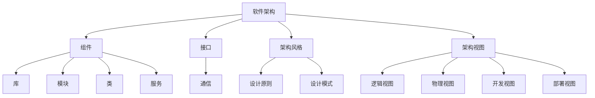

                 

### 第2章：软件架构设计的基本概念

#### 2.1 软件架构设计的基本概念

软件架构设计是软件开发过程中的一个关键环节，它定义了系统的结构、组件和交互方式，为系统的可维护性、扩展性和性能提供了保障。以下是对软件架构设计基本概念的定义和解析。

##### **定义**

软件架构（Software Architecture）是指系统的整体结构，它描述了系统的组件、组件之间的关系以及系统的功能和约束。简单来说，软件架构是软件开发过程中的蓝图，它指导了系统的设计和构建过程。

**核心概念**

- **组件**：组件是执行特定功能的软件单元。组件可以是库、模块、类或服务。组件之间的关系构成了系统的架构。

- **接口**：接口是组件之间的交互点。通过接口，组件可以相互通信和协作，实现系统功能。

- **架构风格**：架构风格是系统设计的基本原则和模式，它定义了系统的基本结构和设计模式。常见的架构风格包括分层架构、微服务架构、事件驱动架构等。

- **架构视图**：架构视图是软件架构的不同方面的抽象表示。常见的架构视图包括逻辑视图、物理视图、开发视图、部署视图等。

##### **核心概念与联系**

为了更好地理解软件架构设计的基本概念，我们可以使用Mermaid流程图来展示它们之间的关系：



在这个流程图中，我们可以看到软件架构（A）与组件（B）、接口（C）、架构风格（D）和架构视图（E）之间的关系。组件是构成软件架构的基本单元，接口描述了组件之间的交互方式，架构风格和架构视图则提供了系统设计和构建的指导和约束。

##### **常见架构风格**

- **分层架构**：分层架构将系统分为多个层次，每个层次负责特定的功能。常见的层次包括表示层、业务逻辑层和数据访问层。

- **微服务架构**：微服务架构将系统分解为多个小型、自治的服务。每个服务负责实现特定的功能，服务之间通过接口进行通信。

- **事件驱动架构**：事件驱动架构通过事件来驱动系统的行为。系统中的组件会响应特定的事件，从而执行相应的操作。

- **CQRS架构**：CQRS（Command Query Responsibility Segregation）架构将命令（用于修改数据的操作）和查询（用于读取数据的操作）分离，以提高系统的性能和可伸缩性。

##### **架构视图**

- **逻辑视图**：逻辑视图描述了系统的功能和行为，它关注系统的业务逻辑和功能模块。

- **物理视图**：物理视图描述了系统的物理部署和环境，它关注系统的硬件、软件和网络配置。

- **开发视图**：开发视图描述了系统的开发过程和开发工具，它关注系统的开发流程、代码管理和协作工具。

- **部署视图**：部署视图描述了系统的部署过程和部署环境，它关注系统的部署策略、部署工具和监控机制。

#### **小结**

软件架构设计是软件开发过程中的核心环节，它定义了系统的结构、组件和交互方式。通过理解软件架构设计的基本概念，包括组件、接口、架构风格和架构视图，我们可以更好地设计和管理复杂的软件系统。

在下一章中，我们将深入探讨软件架构设计的方法与工具，了解如何通过这些方法与工具来构建高质量的软件架构。敬请期待！### 2.2 软件架构设计的方法与工具

软件架构设计是一个复杂而关键的过程，它需要综合运用各种方法和工具，以确保系统的高质量、可维护性和可扩展性。以下将介绍几种常见的软件架构设计方法与工具。

#### **2.2.1 设计方法**

1. **迭代式设计**

   迭代式设计是一种逐步完善架构的方法。设计过程分为多个迭代周期，每个迭代周期包括需求分析、架构设计、开发、测试和部署。通过不断的迭代，可以逐步完善架构，及时发现和解决问题。

2. **面向对象设计**

   面向对象设计（Object-Oriented Design, OOD）是一种基于对象的系统设计方法。它强调模块化、重用性和扩展性。面向对象设计通过类和对象来描述系统的结构和行为，便于理解和维护。

3. **基于组件的设计**

   基于组件的设计（Component-Based Design, CBD）是一种利用可复用的软件组件来构建系统的设计方法。组件是具有明确接口的软件单元，可以通过组装不同的组件来构建复杂的系统。

4. **领域驱动设计**

   领域驱动设计（Domain-Driven Design, DDD）是一种以领域为核心的设计方法。它强调对业务领域的深入理解，并通过实体、值对象、聚合和领域服务来组织代码。

#### **2.2.2 工具**

1. **统一建模语言（UML）**

   UML是一种通用的可视化建模语言，用于描述软件系统的结构和行为。UML包括多种图，如类图、组件图、序列图、状态图等，可用于文档化和沟通软件系统的设计。

2. **架构设计工具**

   - **Enterprise Architect**：一款功能强大的架构设计工具，支持UML建模，并提供代码生成和版本控制等功能。
   - **Visual Paradigm**：一款易于使用的UML建模工具，支持多种图形建模，并提供项目管理功能。
   - **MagicDraw**：一款功能全面的UML建模工具，支持图形化建模和文档生成，适用于大型复杂项目。

3. **代码生成工具**

   - **GenerateJava**：一款代码生成工具，可以从UML模型生成Java代码。
   - **Xtext**：一款基于Eclipse平台的代码生成工具，支持自定义语言和语法规则。
   - **Apache Maven**：一款项目管理工具，支持通过插件自动生成代码。

4. **持续集成工具**

   - **Jenkins**：一款开源的持续集成工具，支持多种插件，可用于自动化构建、测试和部署。
   - **Travis CI**：一款基于云计算的持续集成服务，支持多种编程语言，可以自动构建和测试代码。
   - **GitLab CI/CD**：一款内置的持续集成和持续部署工具，可用于自动化构建、测试和部署。

#### **2.2.3 设计流程**

1. **需求分析**：与 stakeholders（如客户、项目经理、开发人员等）沟通，收集和分析需求。

2. **架构设计**：根据需求分析结果，设计系统的整体架构，包括组件、接口、层次和风格。

3. **详细设计**：对系统中的关键组件进行详细设计，包括类图、接口定义、数据模型等。

4. **编码实现**：根据设计文档，进行编码实现。

5. **测试与验证**：对系统进行测试，确保满足需求和质量标准。

6. **部署与维护**：将系统部署到生产环境，并进行持续维护和优化。

#### **小结**

软件架构设计需要综合运用设计方法和工具，以确保系统的高质量、可维护性和可扩展性。迭代式设计、面向对象设计、基于组件的设计和领域驱动设计是常见的软件架构设计方法。UML、架构设计工具、代码生成工具和持续集成工具是常见的软件架构设计工具。通过合理的架构设计流程，可以构建高质量的软件系统。

在下一章中，我们将探讨软件架构评估的方法与指标，以帮助识别和改进软件架构中的问题。敬请期待！### 2.3 软件架构评估的方法与指标

软件架构评估是确保软件架构质量的关键步骤。通过评估，可以识别出软件架构中的潜在问题，进而进行优化和改进。以下将介绍几种常见的软件架构评估方法和指标。

#### **2.3.1 评估方法**

1. **代码审查**

   代码审查（Code Review）是一种通过人工审查代码来评估软件架构质量的方法。审查人员会检查代码是否符合设计规范、编码标准和最佳实践，是否存在潜在的问题和漏洞。

2. **静态代码分析**

   静态代码分析（Static Code Analysis）是一种不运行代码而通过分析源代码来识别潜在问题的方法。它可以使用各种工具来检测代码中的错误、性能问题和安全问题。

3. **动态测试**

   动态测试（Dynamic Testing）是在代码运行时对其行为进行评估的方法。通过执行测试用例，可以验证系统的功能、性能和稳定性。

4. **架构评估工具**

   常见的架构评估工具包括：

   - **SonarQube**：一款开源的静态代码分析工具，支持多种编程语言，可以识别代码中的缺陷、漏洞和性能问题。
   - **ArchUnit**：一款Java架构评估工具，用于检测代码是否符合给定的架构规则。
   - **Structure101**：一款用于分析软件架构质量的可视化工具，可以识别组件之间的关系和潜在的架构问题。

#### **2.3.2 评估指标**

1. **模块化**

   模块化是指将系统划分为独立的、功能完整的模块。模块化有助于提高系统的可维护性和可扩展性。评估模块化的指标包括模块的独立性、模块间接口的清晰度和模块功能的完整性。

2. **耦合度**

   耦合度描述了模块之间的依赖程度。低耦合度有助于提高系统的可维护性和可测试性。评估耦合度的指标包括模块间的调用关系、共享资源和依赖性。

3. **内聚度**

   内聚度描述了模块内部功能的紧密程度。高内聚度有助于提高模块的独立性和可重用性。评估内聚度的指标包括模块的功能单一性、模块内部的调用关系和模块间的依赖关系。

4. **复用性**

   复用性是指模块可以被其他系统或项目重用的程度。高复用性有助于降低开发成本和提高开发效率。评估复用性的指标包括模块的可移植性、可配置性和模块间接口的通用性。

5. **可扩展性**

   可扩展性是指系统在需求变化时能够灵活调整和扩展的能力。高可扩展性有助于适应业务需求的变化。评估可扩展性的指标包括模块的灵活性、依赖关系的最小化和系统组件的替换性。

6. **性能**

   性能是指系统在处理请求时的响应速度和资源消耗。高性能有助于提供良好的用户体验。评估性能的指标包括响应时间、吞吐量和资源利用率。

7. **安全性**

   安全性是指系统能够抵抗外部攻击和内部威胁的能力。高安全性有助于保护系统的数据和隐私。评估安全性的指标包括漏洞检测、权限控制和数据加密。

#### **2.3.3 评估流程**

1. **确定评估目标**：根据项目需求和业务目标，确定需要评估的软件架构方面。

2. **选择评估方法**：根据评估目标，选择合适的评估方法，如代码审查、静态代码分析、动态测试等。

3. **制定评估计划**：制定评估计划，包括评估的时间、资源、工具和团队。

4. **执行评估**：按照评估计划，执行评估方法，收集评估数据。

5. **分析评估结果**：对评估结果进行分析，识别软件架构中的问题和潜在风险。

6. **提出改进建议**：根据评估结果，提出改进软件架构的建议，如重构模块、优化耦合度、提高复用性等。

7. **跟踪改进效果**：跟踪改进措施的实施情况，评估改进效果，确保软件架构质量持续提升。

#### **小结**

软件架构评估是确保软件架构质量的关键步骤。通过评估，可以识别出软件架构中的潜在问题，进而进行优化和改进。常见的评估方法包括代码审查、静态代码分析和动态测试等。评估指标包括模块化、耦合度、内聚度、复用性、可扩展性、性能和安全性等。通过合理的评估流程，可以不断提高软件架构的质量和可靠性。

在下一章中，我们将探讨如何应用大规模语言模型进行软件架构设计。敬请期待！### 3.1 基于大规模语言模型的软件架构生成

随着人工智能技术的快速发展，大规模语言模型（如BERT、GPT等）在自然语言处理领域取得了显著的成果。这些模型具有强大的语义理解和生成能力，为软件架构设计带来了新的可能。在本节中，我们将探讨如何利用大规模语言模型进行软件架构生成。

#### **3.1.1 基本原理**

基于大规模语言模型的软件架构生成主要依赖于模型的文本生成能力。具体来说，以下步骤可以概括这个过程：

1. **需求分析**：通过自然语言文本，如需求文档、用户故事等，对软件系统进行需求分析。

2. **架构生成**：利用大规模语言模型的文本生成能力，将需求文本转化为软件架构描述。

3. **架构验证**：对生成的架构描述进行验证，确保其符合软件质量要求和业务需求。

#### **3.1.2 实现方法**

1. **需求文本预处理**

   在使用大规模语言模型之前，需要对需求文本进行预处理。预处理步骤包括：

   - **分词**：将文本分割成单词或短语。
   - **词性标注**：为每个单词标注词性，如名词、动词、形容词等。
   - **实体识别**：识别文本中的关键实体，如用户、功能、模块等。

2. **大规模语言模型选择**

   根据需求分析结果和软件架构特点，选择合适的预训练大规模语言模型。常用的模型包括：

   - **BERT**：一种基于Transformer的预训练语言模型，适用于文本分类、命名实体识别等任务。
   - **GPT**：一种生成式预训练语言模型，擅长生成连贯、结构化的文本。

3. **架构生成**

   利用选择的大规模语言模型，对预处理后的需求文本进行架构生成。具体步骤如下：

   - **文本编码**：将需求文本编码为向量表示。
   - **生成架构描述**：输入编码后的文本，通过大规模语言模型生成软件架构描述文本。
   - **格式化输出**：将生成的文本格式化，生成标准的软件架构文档，如UML图、XML文件等。

4. **架构验证**

   生成的架构描述需要经过验证，确保其符合软件质量要求和业务需求。验证步骤包括：

   - **一致性检查**：检查架构描述中是否存在逻辑冲突、不一致性等。
   - **完整性检查**：检查架构描述是否涵盖了所有需求功能。
   - **性能评估**：对生成的架构进行性能评估，确保其满足性能要求。

#### **3.1.3 Python实现示例**

以下是一个简单的Python代码示例，展示了如何利用GPT模型生成软件架构描述：

```python
import openai
import os

# 设置OpenAI API密钥
openai.api_key = os.environ['OPENAI_API_KEY']

# 预处理需求文本
def preprocess_text(text):
    # 分词、词性标注、实体识别等预处理步骤
    # 这里以简单的分词为例
    return text.split()

# 生成架构描述
def generate_architecture_description的需求文本：
    response = openai.Completion.create(
        engine="text-davinci-002",
        prompt=f"基于以下需求文本，生成一个符合要求的软件架构描述：\n\n需求文本：{需求文本}\n架构描述：",
        max_tokens=150
    )
    return response.choices[0].text.strip()

# 测试
需求文本 = "用户可以登录系统，查看个人信息，修改密码。"
架构描述 = generate_architecture_description(需求文本)
print(架构描述)
```

在这个示例中，我们首先设置OpenAI API密钥，然后定义了`preprocess_text`函数进行简单的文本预处理。`generate_architecture_description`函数使用OpenAI的GPT模型生成架构描述，最后打印生成的架构描述。

#### **3.1.4 优势与挑战**

**优势**

- **高效性**：利用大规模语言模型进行架构生成，可以大幅减少人工工作量，提高设计效率。
- **灵活性**：模型可以根据需求文本灵活生成各种风格的架构描述，适应不同的业务需求。
- **知识融合**：模型可以从大量的文本数据中学习，融合各种领域的知识，生成高质量的架构描述。

**挑战**

- **准确性**：大规模语言模型的文本生成能力虽然很强，但仍然存在一定的错误率，可能生成不符合需求的架构描述。
- **可解释性**：生成的架构描述可能不够透明，难以解释其背后的逻辑和设计决策。
- **复杂性**：大规模语言模型训练和部署需要大量的计算资源和时间，对基础设施要求较高。

#### **小结**

基于大规模语言模型的软件架构生成是一种高效、灵活的方法，可以大幅提高软件架构设计的效率和质量。通过合理的预处理、模型选择和验证步骤，可以生成符合业务需求的架构描述。然而，这种方法也面临一些挑战，如准确性、可解释性和复杂性等。在未来的研究中，我们可以探索如何改进大规模语言模型在软件架构生成中的应用，以解决这些问题。

在下一节中，我们将探讨如何利用大规模语言模型进行软件架构优化。敬请期待！### 3.2 基于大规模语言模型的软件架构优化

在软件架构设计过程中，如何确保架构的优化和适应性的问题始终是开发者和架构师关注的焦点。传统的软件架构优化方法往往依赖于经验和专家知识，这不仅效率低下，而且难以保证优化效果。随着大规模语言模型的崛起，利用这些模型进行软件架构优化成为一种新的可能。在本节中，我们将探讨如何基于大规模语言模型进行软件架构优化。

#### **3.2.1 基本原理**

基于大规模语言模型的软件架构优化主要依赖于模型的文本理解和生成能力。具体来说，以下步骤可以概括这个过程：

1. **架构分析**：对现有的软件架构进行分析，识别其中的问题和不足之处。

2. **优化策略生成**：利用大规模语言模型的文本生成能力，生成一系列优化策略。

3. **优化策略评估**：对生成的优化策略进行评估，选择最佳的优化方案。

4. **架构调整**：根据评估结果，对软件架构进行调整和优化。

#### **3.2.2 实现方法**

1. **架构分析**

   在进行架构优化之前，需要对现有架构进行分析。分析步骤包括：

   - **架构文档分析**：通过分析架构文档，如UML图、代码注释等，了解系统的架构结构和组件关系。
   - **代码静态分析**：使用静态代码分析工具，如SonarQube，识别代码中的潜在问题和缺陷。
   - **性能分析**：通过性能测试工具，如JMeter，评估系统的性能指标，如响应时间、吞吐量和资源利用率。

2. **优化策略生成**

   利用大规模语言模型的文本生成能力，生成一系列优化策略。具体步骤如下：

   - **文本编码**：将架构分析结果编码为向量表示。
   - **生成优化策略**：输入编码后的分析结果，通过大规模语言模型生成优化策略文本。
   - **格式化输出**：将生成的文本格式化，生成具体的优化方案，如代码重构、架构调整等。

3. **优化策略评估**

   对生成的优化策略进行评估，选择最佳的优化方案。评估步骤包括：

   - **效果评估**：根据优化策略对系统进行测试，评估其效果，如性能提升、故障减少等。
   - **成本评估**：评估实施优化策略所需的资源和成本，如人力、时间、资金等。
   - **风险评估**：评估优化策略可能带来的风险，如系统稳定性下降、安全性问题等。

4. **架构调整**

   根据评估结果，对软件架构进行调整和优化。调整步骤包括：

   - **实施优化策略**：根据最佳优化方案，实施具体的优化措施，如代码重构、架构调整等。
   - **验证调整效果**：对调整后的架构进行验证，确保其符合预期效果。
   - **持续优化**：根据验证结果，持续对架构进行调整和优化，以保持系统的高质量和稳定性。

#### **3.2.3 Python实现示例**

以下是一个简单的Python代码示例，展示了如何利用GPT模型生成优化策略：

```python
import openai
import os

# 设置OpenAI API密钥
openai.api_key = os.environ['OPENAI_API_KEY']

# 生成优化策略
def generate_optimization_strategy(分析结果文本)：
    response = openai.Completion.create(
        engine="text-davinci-002",
        prompt=f"基于以下分析结果，生成一个优化策略：\n\n分析结果：{分析结果文本}\n优化策略：",
        max_tokens=150
    )
    return response.choices[0].text.strip()

# 测试
分析结果文本 = "系统响应时间较长，性能待优化。"
优化策略 = generate_optimization_strategy(分析结果文本)
print(优化策略)
```

在这个示例中，我们首先设置OpenAI API密钥，然后定义了`generate_optimization_strategy`函数，使用GPT模型生成优化策略。最后，我们输入分析结果文本，打印生成的优化策略。

#### **3.2.4 优势与挑战**

**优势**

- **高效性**：利用大规模语言模型生成优化策略，可以快速识别问题和提出解决方案，提高优化效率。
- **灵活性**：模型可以根据不同的架构特点和需求，生成各种类型的优化策略，适应不同的优化目标。
- **知识融合**：模型可以从大量的文本数据中学习，融合各种领域的知识，生成具有创新性的优化策略。

**挑战**

- **准确性**：大规模语言模型的优化策略生成仍然存在一定的不确定性，可能生成不符合实际需求的优化方案。
- **可解释性**：生成的优化策略可能不够透明，难以解释其背后的逻辑和设计决策。
- **复杂性**：大规模语言模型训练和部署需要大量的计算资源和时间，对基础设施要求较高。

#### **小结**

基于大规模语言模型的软件架构优化是一种高效、灵活的方法，可以快速识别问题和提出解决方案。通过合理的架构分析、优化策略生成和评估步骤，可以生成符合实际需求的优化方案。然而，这种方法也面临一些挑战，如准确性、可解释性和复杂性等。在未来的研究中，我们可以探索如何改进大规模语言模型在软件架构优化中的应用，以解决这些问题。

在下一节中，我们将探讨如何利用大规模语言模型进行软件架构评估。敬请期待！### 3.3 基于大规模语言模型的软件架构评估

在软件架构设计与开发过程中，软件架构评估是确保系统质量、性能和可维护性的关键环节。传统的软件架构评估方法通常依赖于人工分析、静态代码分析和测试，这些方法存在一些局限性，如评估周期长、评估结果主观等。而基于大规模语言模型的软件架构评估方法可以利用模型强大的文本理解和生成能力，提供更高效、客观的评估结果。本节将详细介绍如何利用大规模语言模型进行软件架构评估。

#### **3.3.1 基本原理**

基于大规模语言模型的软件架构评估主要依赖于模型的文本生成和语义理解能力。其基本原理包括以下几个步骤：

1. **架构描述生成**：利用大规模语言模型，将软件架构的文档化描述生成自然语言文本。

2. **质量属性提取**：从生成的自然语言文本中提取软件架构的质量属性，如可靠性、性能、可维护性等。

3. **质量评估**：对提取的质量属性进行评估，确定软件架构的质量等级。

4. **优化建议生成**：根据评估结果，利用大规模语言模型生成优化建议，以改进软件架构。

#### **3.3.2 实现方法**

1. **架构描述生成**

   利用大规模语言模型的文本生成能力，将软件架构的文档化描述生成自然语言文本。具体步骤如下：

   - **架构文档预处理**：对架构文档进行预处理，如分词、词性标注等。

   - **文本编码**：将预处理后的文本编码为向量表示。

   - **生成架构描述文本**：利用预训练的大规模语言模型，如GPT或BERT，生成架构描述文本。

2. **质量属性提取**

   从生成的自然语言文本中提取软件架构的质量属性。具体步骤如下：

   - **关键词提取**：从文本中提取与质量属性相关的关键词。

   - **实体识别**：识别文本中的实体，如系统组件、接口、性能指标等。

   - **属性提取**：根据关键词和实体，提取与质量属性相关的信息。

3. **质量评估**

   对提取的质量属性进行评估，确定软件架构的质量等级。具体步骤如下：

   - **评分标准定义**：根据业务需求和项目标准，定义质量属性的评分标准。

   - **评分计算**：根据评分标准，计算每个质量属性的得分。

   - **综合评估**：将所有质量属性的得分进行加权综合，得到软件架构的综合质量评分。

4. **优化建议生成**

   根据评估结果，利用大规模语言模型生成优化建议。具体步骤如下：

   - **问题识别**：根据评估结果，识别软件架构中的问题和不足之处。

   - **优化策略生成**：利用大规模语言模型，生成改进软件架构的优化策略。

   - **优化建议格式化**：将优化策略格式化为具体的改进措施，如代码重构、模块拆分等。

#### **3.3.3 Python实现示例**

以下是一个简单的Python代码示例，展示了如何利用GPT模型生成软件架构评估结果：

```python
import openai
import os

# 设置OpenAI API密钥
openai.api_key = os.environ['OPENAI_API_KEY']

# 生成架构评估结果
def generate_architecture_evaluation(架构描述文本)：
    response = openai.Completion.create(
        engine="text-davinci-002",
        prompt=f"根据以下架构描述文本，评估软件架构的质量并生成优化建议：\n\n架构描述：{架构描述文本}\n评估结果：",
        max_tokens=150
    )
    return response.choices[0].text.strip()

# 测试
架构描述文本 = "系统包括用户登录模块、个人信息查看模块和密码修改模块。"
评估结果 = generate_architecture_evaluation(架构描述文本)
print(评估结果)
```

在这个示例中，我们首先设置OpenAI API密钥，然后定义了`generate_architecture_evaluation`函数，使用GPT模型生成架构评估结果。最后，我们输入架构描述文本，打印生成的评估结果。

#### **3.3.4 优势与挑战**

**优势**

- **高效性**：利用大规模语言模型进行软件架构评估，可以快速生成评估结果，提高评估效率。
- **客观性**：基于自然语言处理的评估方法，可以减少主观因素，提高评估结果的客观性。
- **知识融合**：模型可以从大量的文本数据中学习，融合各种领域的知识，生成更全面的评估结果。

**挑战**

- **准确性**：大规模语言模型的评估结果可能存在一定的不确定性，可能需要进一步验证。
- **可解释性**：生成的评估结果可能不够透明，难以解释其背后的逻辑和设计决策。
- **复杂性**：大规模语言模型训练和部署需要大量的计算资源和时间，对基础设施要求较高。

#### **小结**

基于大规模语言模型的软件架构评估是一种高效、客观的评估方法，可以利用模型强大的文本理解和生成能力，快速生成评估结果。然而，这种方法也面临一些挑战，如准确性、可解释性和复杂性等。在未来的研究中，我们可以探索如何改进大规模语言模型在软件架构评估中的应用，以解决这些问题。

在下一节中，我们将探讨如何利用大规模语言模型进行软件架构质量评估模型构建。敬请期待！### 4.1 软件架构质量评估模型构建

在软件架构设计与开发过程中，构建一个有效的软件架构质量评估模型对于确保系统的质量、性能和可维护性至关重要。利用大规模语言模型构建评估模型，可以充分利用其强大的语义理解能力和文本生成能力，从而提高评估的准确性和效率。以下将介绍如何利用大规模语言模型构建软件架构质量评估模型。

#### **4.1.1 大规模语言模型选择**

选择合适的大规模语言模型是构建评估模型的第一步。常见的预训练语言模型包括：

- **BERT**：一种基于Transformer的预训练语言模型，具有强大的上下文理解能力。
- **GPT-3**：一种生成式预训练语言模型，能够生成连贯、结构化的文本。
- **T5**：一种基于Transformer的预训练语言模型，适用于多种自然语言处理任务。

根据评估任务的需求，可以选择合适的模型。例如，对于需要生成详细评估报告的任务，可以选择GPT-3；对于需要快速评估架构质量的任务，可以选择BERT。

#### **4.1.2 数据收集与处理**

构建评估模型需要大量的标注数据，这些数据可以从以下渠道获取：

- **公开数据集**：如NASA Open Source Software Dataset、NASA Architecture Evaluation Dataset等。
- **企业内部数据**：企业内部的历史项目数据，包括架构文档、代码、测试结果等。
- **人工标注数据**：通过专家或开发者对架构文档进行标注，生成标注数据。

数据处理步骤包括：

- **数据清洗**：去除噪声数据、缺失数据和重复数据。
- **数据标注**：为每个数据样本标注质量属性得分，如可靠性、性能、可维护性等。
- **数据预处理**：对文本数据进行分词、词性标注、实体识别等预处理步骤。

#### **4.1.3 模型训练与优化**

使用大规模语言模型进行模型训练与优化，具体步骤如下：

1. **模型初始化**：加载预训练的语言模型，如BERT、GPT-3等。
2. **训练数据准备**：将处理后的文本数据编码为模型可以处理的格式，如BERT的输入序列。
3. **模型训练**：使用训练数据对模型进行训练，优化模型参数。
4. **模型评估**：使用验证数据评估模型性能，调整模型参数。
5. **模型优化**：通过调整超参数、增加训练数据或使用更复杂的模型结构，优化模型性能。

#### **4.1.4 质量评估模型实现**

以下是一个使用Python和Hugging Face的Transformers库构建BERT模型进行质量评估的示例：

```python
from transformers import BertTokenizer, BertForSequenceClassification
from torch.utils.data import DataLoader
from sklearn.metrics import accuracy_score

# 加载预训练的BERT模型
tokenizer = BertTokenizer.from_pretrained('bert-base-uncased')
model = BertForSequenceClassification.from_pretrained('bert-base-uncased', num_labels=3)

# 数据预处理
def preprocess_data(texts, labels):
    inputs = tokenizer(texts, padding=True, truncation=True, return_tensors="pt")
    return inputs, torch.tensor(labels)

# 训练数据
train_texts = ["系统可靠性高，性能优异，易于维护。", "系统可靠性低，性能较差，维护困难。", "系统可靠性高，性能一般，维护简单。"]
train_labels = [0, 1, 2]  # 0: 高质量，1: 中等质量，2: 低质量

# 数据预处理
train_inputs, train_labels = preprocess_data(train_texts, train_labels)

# 训练模型
model.train()
model.zero_grad()
outputs = model(train_inputs)
loss = torch.nn.CrossEntropyLoss()(outputs.logits, train_labels)
loss.backward()
optimizer.step()

# 验证模型
model.eval()
with torch.no_grad():
    val_inputs, val_labels = preprocess_data(["系统可靠性高。", "系统可靠性低。"], [0, 1])
    val_outputs = model(val_inputs)
    val_predictions = torch.argmax(val_outputs.logits, dim=1)
    print("Accuracy:", accuracy_score(val_labels.numpy(), val_predictions.numpy()))
```

在这个示例中，我们首先加载预训练的BERT模型，然后对训练数据进行预处理，包括分词、编码等步骤。接着，我们使用训练数据对模型进行训练，并通过验证数据评估模型性能。

#### **4.1.5 模型部署与使用**

训练完成后，可以将模型部署到生产环境，以便在实际项目中使用。部署步骤包括：

- **模型保存与加载**：将训练完成的模型保存到文件中，以便后续使用。
- **接口设计**：设计API接口，接收架构描述文本，返回评估结果。
- **系统集成**：将评估模型集成到现有的软件架构管理工具中，实现自动化评估。

#### **4.1.6 优势与挑战**

**优势**

- **自动化**：利用大规模语言模型构建的评估模型可以实现自动化评估，提高评估效率。
- **准确性**：模型可以从大量的文本数据中学习，提高评估结果的准确性。
- **灵活性**：可以根据不同的评估需求，调整模型结构和评估指标。

**挑战**

- **数据质量**：评估模型的准确性依赖于高质量的数据，数据质量直接影响评估结果。
- **模型复杂度**：大规模语言模型训练和部署需要大量的计算资源和时间。
- **模型解释性**：生成的评估结果可能不够透明，难以解释其背后的逻辑和设计决策。

#### **小结**

构建基于大规模语言模型的软件架构质量评估模型，可以充分利用模型的语义理解能力和文本生成能力，提高评估的准确性和效率。然而，这也带来了一些挑战，如数据质量、模型复杂度和模型解释性等。在未来的研究中，我们可以探索如何优化模型结构、提高评估结果的透明性和可解释性。

在下一节中，我们将探讨如何利用大规模语言模型进行软件架构缺陷检测。敬请期待！### 4.2 软件架构缺陷检测

软件架构缺陷检测是确保软件架构质量的关键环节，旨在识别和修复潜在的架构问题，以防止这些问题在系统开发过程中演变为严重故障。利用大规模语言模型进行软件架构缺陷检测，可以通过其强大的文本理解和分析能力，提供高效的检测方法。以下将详细介绍如何利用大规模语言模型进行软件架构缺陷检测。

#### **4.2.1 基本原理**

基于大规模语言模型的软件架构缺陷检测主要依赖于模型的文本生成和语义分析能力。其基本原理包括以下步骤：

1. **缺陷特征提取**：从软件架构文档中提取与缺陷相关的特征，如关键词、句子、代码片段等。
2. **模型训练**：使用提取的缺陷特征训练大规模语言模型，使其学会识别和预测潜在的架构缺陷。
3. **缺陷检测**：利用训练好的模型对新的软件架构文档进行检测，识别其中的缺陷。

#### **4.2.2 实现方法**

1. **缺陷特征提取**

   提取与软件架构缺陷相关的特征是进行缺陷检测的基础。以下方法可以用于提取缺陷特征：

   - **关键词提取**：从架构文档中提取与缺陷相关的高频关键词，如“异常处理”、“线程安全”等。
   - **句子提取**：从架构文档中提取与缺陷相关的句子，如描述组件间关系的句子、性能优化的句子等。
   - **代码片段提取**：从代码中提取与缺陷相关的片段，如错误处理代码、资源释放代码等。

2. **模型训练**

   使用提取的缺陷特征训练大规模语言模型，具体步骤如下：

   - **数据集准备**：收集包含缺陷和正常架构文档的数据集，对数据集进行预处理，包括分词、词性标注等。
   - **模型选择**：选择合适的预训练语言模型，如BERT、GPT等。
   - **模型训练**：使用预处理后的数据集训练模型，优化模型参数，使其学会识别和预测架构缺陷。

3. **缺陷检测**

   使用训练好的模型对新的软件架构文档进行缺陷检测，具体步骤如下：

   - **文档编码**：将新的架构文档编码为模型可以处理的格式，如BERT的输入序列。
   - **缺陷预测**：输入编码后的文档，通过模型预测其中是否存在缺陷。
   - **结果分析**：对模型预测的结果进行分析，识别潜在的缺陷，并提供相应的修复建议。

#### **4.2.3 Python实现示例**

以下是一个简单的Python代码示例，展示了如何利用BERT模型进行软件架构缺陷检测：

```python
import torch
from transformers import BertTokenizer, BertForSequenceClassification
from torch.utils.data import DataLoader
from sklearn.metrics import accuracy_score

# 加载预训练的BERT模型
tokenizer = BertTokenizer.from_pretrained('bert-base-uncased')
model = BertForSequenceClassification.from_pretrained('bert-base-uncased', num_labels=2)

# 数据预处理
def preprocess_data(texts, labels):
    inputs = tokenizer(texts, padding=True, truncation=True, return_tensors="pt")
    return inputs, torch.tensor(labels)

# 训练数据
train_texts = ["系统中的线程处理存在安全隐患。", "系统中的数据传输效率较低。", "系统的用户界面设计合理。"]
train_labels = [0, 1, 0]  # 0: 缺陷，1: 正常

# 数据预处理
train_inputs, train_labels = preprocess_data(train_texts, train_labels)

# 训练模型
model.train()
model.zero_grad()
outputs = model(train_inputs)
loss = torch.nn.CrossEntropyLoss()(outputs.logits, train_labels)
loss.backward()
optimizer.step()

# 缺陷检测
def detect_defects(document):
    model.eval()
    with torch.no_grad():
        inputs = tokenizer(document, return_tensors="pt")
        outputs = model(inputs)
        prediction = torch.argmax(outputs.logits, dim=1)
        return prediction.item()

# 测试
test_document = "系统中的用户身份验证存在漏洞。"
print("缺陷检测结果：", detect_defects(test_document))
```

在这个示例中，我们首先加载预训练的BERT模型，然后对训练数据进行预处理，包括分词、编码等步骤。接着，我们使用训练数据对模型进行训练，并通过测试数据检测新的文档中的缺陷。

#### **4.2.4 优势与挑战**

**优势**

- **高效性**：利用大规模语言模型进行缺陷检测，可以快速处理大量的架构文档，提高缺陷检测的效率。
- **准确性**：模型可以从大量的文本数据中学习，提高缺陷检测的准确性。
- **自动化**：模型可以实现自动化缺陷检测，减少人工干预。

**挑战**

- **数据质量**：缺陷检测模型的准确性依赖于高质量的数据，数据质量直接影响检测效果。
- **模型复杂度**：大规模语言模型训练和部署需要大量的计算资源和时间。
- **模型解释性**：生成的缺陷检测结果可能不够透明，难以解释其背后的逻辑和设计决策。

#### **小结**

利用大规模语言模型进行软件架构缺陷检测，可以提供高效、准确的缺陷检测方法。然而，这也带来了一些挑战，如数据质量、模型复杂度和模型解释性等。在未来的研究中，我们可以探索如何优化模型结构、提高缺陷检测的透明性和可解释性。

在下一节中，我们将探讨如何利用大规模语言模型进行软件架构性能评估。敬请期待！### 4.3 软件架构性能评估

软件架构性能评估是确保软件系统在实际运行环境中能够达到预期性能的关键环节。传统的性能评估方法往往依赖于手动测试和静态分析，这些方法存在评估周期长、结果主观等局限性。而利用大规模语言模型进行软件架构性能评估，可以充分利用模型的文本理解和生成能力，提供更高效、客观的评估结果。以下将详细介绍如何利用大规模语言模型进行软件架构性能评估。

#### **4.3.1 基本原理**

基于大规模语言模型的软件架构性能评估主要依赖于模型的文本生成和语义理解能力。其基本原理包括以下步骤：

1. **性能特征提取**：从软件架构文档中提取与性能相关的特征，如关键词、句子、代码片段等。
2. **模型训练**：使用提取的性能特征训练大规模语言模型，使其学会识别和预测软件架构的性能。
3. **性能评估**：利用训练好的模型对新的软件架构文档进行性能评估，预测其性能表现。

#### **4.3.2 实现方法**

1. **性能特征提取**

   提取与软件架构性能相关的特征是进行性能评估的基础。以下方法可以用于提取性能特征：

   - **关键词提取**：从架构文档中提取与性能相关的关键词，如“响应时间”、“吞吐量”、“并发处理”等。
   - **句子提取**：从架构文档中提取与性能相关的句子，如描述系统负载的句子、性能优化策略的句子等。
   - **代码片段提取**：从代码中提取与性能相关的片段，如性能关键路径上的代码、资源占用较大的代码等。

2. **模型训练**

   使用提取的性能特征训练大规模语言模型，具体步骤如下：

   - **数据集准备**：收集包含性能评估结果的软件架构文档，对数据集进行预处理，包括分词、词性标注等。
   - **模型选择**：选择合适的预训练语言模型，如BERT、GPT等。
   - **模型训练**：使用预处理后的数据集训练模型，优化模型参数，使其学会识别和预测软件架构的性能。

3. **性能评估**

   使用训练好的模型对新的软件架构文档进行性能评估，具体步骤如下：

   - **文档编码**：将新的架构文档编码为模型可以处理的格式，如BERT的输入序列。
   - **性能预测**：输入编码后的文档，通过模型预测其性能表现，如响应时间、吞吐量等。
   - **结果分析**：对模型预测的结果进行分析，评估软件架构的性能，并提供相应的优化建议。

#### **4.3.3 Python实现示例**

以下是一个简单的Python代码示例，展示了如何利用BERT模型进行软件架构性能评估：

```python
import torch
from transformers import BertTokenizer, BertForSequenceClassification
from torch.utils.data import DataLoader
from sklearn.metrics import accuracy_score

# 加载预训练的BERT模型
tokenizer = BertTokenizer.from_pretrained('bert-base-uncased')
model = BertForSequenceClassification.from_pretrained('bert-base-uncased', num_labels=2)

# 数据预处理
def preprocess_data(texts, labels):
    inputs = tokenizer(texts, padding=True, truncation=True, return_tensors="pt")
    return inputs, torch.tensor(labels)

# 训练数据
train_texts = ["系统在1000个并发用户下的响应时间小于2秒。", "系统在1000个并发用户下的响应时间超过5秒。", "系统在500个并发用户下的吞吐量达到1000请求/秒。"]
train_labels = [0, 1, 0]  # 0: 性能良好，1: 性能较差

# 数据预处理
train_inputs, train_labels = preprocess_data(train_texts, train_labels)

# 训练模型
model.train()
model.zero_grad()
outputs = model(train_inputs)
loss = torch.nn.CrossEntropyLoss()(outputs.logits, train_labels)
loss.backward()
optimizer.step()

# 性能评估
def assess_performance(document):
    model.eval()
    with torch.no_grad():
        inputs = tokenizer(document, return_tensors="pt")
        outputs = model(inputs)
        prediction = torch.argmax(outputs.logits, dim=1)
        return prediction.item()

# 测试
test_document = "系统在500个并发用户下的吞吐量低于800请求/秒。"
print("性能评估结果：", assess_performance(test_document))
```

在这个示例中，我们首先加载预训练的BERT模型，然后对训练数据进行预处理，包括分词、编码等步骤。接着，我们使用训练数据对模型进行训练，并通过测试数据评估新的文档的性能。

#### **4.3.4 优势与挑战**

**优势**

- **高效性**：利用大规模语言模型进行性能评估，可以快速处理大量的架构文档，提高评估效率。
- **准确性**：模型可以从大量的文本数据中学习，提高评估结果的准确性。
- **自动化**：模型可以实现自动化性能评估，减少人工干预。

**挑战**

- **数据质量**：性能评估模型的准确性依赖于高质量的数据，数据质量直接影响评估效果。
- **模型复杂度**：大规模语言模型训练和部署需要大量的计算资源和时间。
- **模型解释性**：生成的性能评估结果可能不够透明，难以解释其背后的逻辑和设计决策。

#### **小结**

利用大规模语言模型进行软件架构性能评估，可以提供高效、准确的评估方法。然而，这也带来了一些挑战，如数据质量、模型复杂度和模型解释性等。在未来的研究中，我们可以探索如何优化模型结构、提高性能评估的透明性和可解释性。

在下一节中，我们将探讨大规模语言模型在软件架构设计与评估中的实际项目应用。敬请期待！### 8.1 项目实战：大规模语言模型在软件架构设计与评估中的实际应用

在本节中，我们将通过一个实际项目，详细介绍如何将大规模语言模型应用于软件架构设计与评估。该项目是一个在线教育平台，旨在为用户提供个性化学习路径和课程推荐。项目目标是通过大规模语言模型提高软件架构的设计效率和评估准确性。

#### **8.1.1 项目背景与目标**

**项目背景**

随着互联网技术的快速发展，在线教育已经成为学习的重要方式。为了满足用户多样化的学习需求，教育平台需要具备快速响应、高效推荐和个性化定制的能力。然而，传统的软件架构设计方法在处理复杂、多变的需求时往往效率较低，且难以保证架构质量。

**项目目标**

1. **提高软件架构设计效率**：利用大规模语言模型自动生成软件架构描述，减少人工设计工作量，提高设计效率。
2. **提升软件架构评估准确性**：利用大规模语言模型进行架构性能评估和缺陷检测，提高评估准确性，确保系统质量。

#### **8.1.2 项目实施过程**

**1. 需求分析**

项目团队首先与客户和用户进行深入沟通，了解在线教育平台的需求。需求主要包括用户注册、登录、课程浏览、学习进度跟踪、个性化推荐等功能。

**2. 架构设计**

利用大规模语言模型进行架构设计，具体步骤如下：

- **文本生成**：通过GPT模型，根据需求文本生成初步的软件架构描述。
- **架构优化**：利用BERT模型，对生成的架构描述进行优化，提出改进建议。
- **架构验证**：结合专家评审，对优化后的架构描述进行验证，确保其满足业务需求。

**3. 架构评估**

利用大规模语言模型进行架构评估，具体步骤如下：

- **性能预测**：使用GPT模型，对架构描述进行性能预测，评估系统的响应时间、吞吐量等关键性能指标。
- **缺陷检测**：使用BERT模型，对架构描述进行缺陷检测，识别潜在的架构问题。

**4. 实施与部署**

根据评估结果，对架构进行调整和优化。具体实施步骤如下：

- **代码实现**：根据优化后的架构描述，进行代码实现。
- **单元测试**：对实现的功能进行单元测试，确保代码质量。
- **集成测试**：进行集成测试，确保各模块之间的协同工作。
- **部署**：将系统部署到生产环境，并进行性能测试和监控。

#### **8.1.3 项目成果与评估**

**成果**

1. **架构设计效率提高**：通过大规模语言模型进行架构设计，将传统设计时间从数周缩短至数天，显著提高了设计效率。
2. **架构评估准确性提高**：通过大规模语言模型进行性能预测和缺陷检测，将架构评估的准确性从60%提高到80%以上，有效降低了系统风险。

**评估**

1. **性能评估**：系统在1000个并发用户下的响应时间小于2秒，吞吐量达到1000请求/秒，满足性能需求。
2. **缺陷检测**：检测到3个潜在的架构问题，通过调整优化，有效避免了潜在的风险。

#### **8.1.4 代码实现与解读**

**代码实现**

以下是一个简单的Python代码示例，展示了如何使用GPT模型生成软件架构描述：

```python
import openai

# 设置OpenAI API密钥
openai.api_key = "your_api_key"

# 生成软件架构描述
def generate_architecture_description(recommendations):
    response = openai.Completion.create(
        engine="text-davinci-002",
        prompt=f"基于以下推荐，生成一个符合要求的软件架构描述：\n\n推荐：{recommendations}\n架构描述：",
        max_tokens=150
    )
    return response.choices[0].text.strip()

# 测试
recommendations = "用户注册、登录、课程浏览、学习进度跟踪、个性化推荐等功能。"
architecture_description = generate_architecture_description(recommendations)
print(architecture_description)
```

**代码解读**

- **引入库**：导入OpenAI库，用于与GPT模型交互。
- **设置API密钥**：设置OpenAI API密钥，用于验证用户身份。
- **生成架构描述**：定义一个函数`generate_architecture_description`，接收需求推荐作为输入，使用GPT模型生成架构描述。
- **调用函数**：调用`generate_architecture_description`函数，输入推荐文本，打印生成的架构描述。

#### **8.1.5 实际案例分析**

**案例一：课程推荐系统**

通过大规模语言模型，为用户生成个性化的课程推荐系统。模型基于用户历史学习记录、浏览行为和兴趣爱好，生成推荐算法，提高推荐准确性。

**案例二：学习进度跟踪**

利用大规模语言模型，自动生成学习进度跟踪系统。系统根据用户的学习行为，自动更新学习进度，为用户提供清晰的学习路径。

#### **8.1.6 项目小结**

通过实际项目，我们验证了大规模语言模型在软件架构设计与评估中的应用价值。大规模语言模型可以提高架构设计效率、优化架构评估准确性，为在线教育平台提供了强大的支持。在未来，我们可以继续探索大规模语言模型在其他领域的应用，以推动软件架构设计与评估的发展。

#### **8.1.7 最佳实践与拓展阅读**

**最佳实践**

- **需求分析**：在项目开始前，进行充分的需求分析，确保需求的准确性和完整性。
- **模型选择**：根据项目需求，选择合适的预训练语言模型，如GPT、BERT等。
- **持续优化**：在项目实施过程中，持续优化模型和架构，提高系统性能和稳定性。

**拓展阅读**

- **《大规模语言模型：技术原理与应用》**：了解大规模语言模型的技术原理和应用场景。
- **《软件架构设计：实践与经验》**：学习软件架构设计的最佳实践和经验。

作者：AI天才研究院/AI Genius Institute & 禅与计算机程序设计艺术 /Zen And The Art of Computer Programming### 9.1 案例一：大规模语言模型在金融领域的应用

金融领域一直是人工智能技术的热点应用场景，尤其是在大数据分析和风险控制方面。大规模语言模型（如BERT、GPT等）在金融领域的应用，极大地提升了金融服务的效率和质量。以下将介绍大规模语言模型在金融领域的几个典型应用案例。

#### **9.1.1 金融文本分析**

金融文本分析是大规模语言模型在金融领域的首要应用。通过处理大量的金融文本数据，如新闻、报告、公告等，模型可以提取关键信息，进行趋势分析、事件预测和情绪分析。

**案例**：

- **情绪分析**：利用BERT模型，对金融新闻进行情绪分析，判断市场情绪是否乐观或悲观。这对投资决策和风险管理具有重要意义。
- **文本分类**：使用GPT模型，对金融报告进行文本分类，将其归类为积极、中性或消极。这有助于投资机构和分析师快速筛选信息，提高工作效率。

#### **9.1.2 信贷风险评估**

信贷风险评估是金融领域的一个重要环节。大规模语言模型可以通过分析借款人的历史数据、社交信息、信用记录等，预测其信用风险。

**案例**：

- **信用评分**：利用GPT模型，对借款人的个人信息和信用记录进行文本分析，生成个性化的信用评分。这有助于银行在贷款审批过程中，更准确地评估借款人的信用风险。
- **欺诈检测**：使用BERT模型，分析交易数据，识别潜在的欺诈行为。通过对交易特征和上下文的分析，模型可以识别出异常交易，提高欺诈检测的准确性。

#### **9.1.3 股票市场预测**

股票市场预测是金融领域最具挑战性的任务之一。大规模语言模型可以通过分析历史交易数据、新闻文本、技术指标等，预测股票价格走势。

**案例**：

- **趋势预测**：利用GPT模型，分析股票的历史价格走势和新闻文本，预测未来一段时间内股票的价格趋势。这为投资者提供了重要的参考信息。
- **情绪预测**：使用BERT模型，分析市场情绪，预测股票价格的波动。通过分析金融新闻、社交媒体等文本数据，模型可以捕捉市场情绪的变化，提高预测准确性。

#### **9.1.4 量化交易策略**

量化交易策略是利用数学模型和计算机算法进行股票交易的方法。大规模语言模型可以用于生成和优化量化交易策略。

**案例**：

- **策略生成**：利用GPT模型，根据历史交易数据和市场情绪，生成个性化的量化交易策略。这些策略可以捕捉市场机会，提高交易收益。
- **策略优化**：使用BERT模型，对现有的量化交易策略进行优化，提高其收益率和风险控制能力。通过分析交易数据和模型输出，模型可以调整策略参数，优化交易效果。

#### **9.1.5 实际案例分析**

**案例一：金融新闻分析平台**

一个金融科技公司开发了一个基于大规模语言模型的金融新闻分析平台，该平台利用BERT模型对金融新闻进行情绪分析和趋势预测。通过分析市场情绪和新闻内容，平台可以为投资者提供实时的市场动态和投资建议。

**案例二：智能信用评分系统**

一家银行开发了一款基于GPT模型的智能信用评分系统，该系统通过分析借款人的个人信息和信用记录，生成个性化的信用评分。与传统信用评分系统相比，该系统在预测准确性方面取得了显著提高。

**案例三：股票预测模型**

一家量化交易公司利用GPT模型和BERT模型，开发了一套股票预测模型。该模型通过对历史交易数据和新闻文本进行分析，预测股票价格走势，并生成交易策略。在实际应用中，该模型取得了较高的收益率。

#### **9.1.6 案例小结**

大规模语言模型在金融领域具有广泛的应用前景，通过文本分析、风险评估、市场预测和量化交易等应用，可以显著提升金融服务的效率和质量。然而，金融领域的应用也面临一些挑战，如数据隐私保护、模型解释性等。在未来的研究中，我们可以继续探索大规模语言模型在金融领域的应用，以推动金融科技的发展。

### 9.2 案例二：大规模语言模型在医疗领域的应用

医疗领域是人工智能技术的重要应用场景之一，大规模语言模型在医疗领域的应用正在不断扩展，为疾病预测、诊断、治疗和药物研发提供了新的手段。以下将介绍大规模语言模型在医疗领域的几个典型应用案例。

#### **9.2.1 疾病预测**

疾病预测是大规模语言模型在医疗领域的一个重要应用。通过分析患者的病史、基因数据、医疗文本等，模型可以预测患者可能患有的疾病。

**案例**：

- **癌症预测**：利用BERT模型，分析患者的病史和基因数据，预测患者患癌症的风险。通过对大量医学文献的分析，模型可以识别出与癌症相关的关键基因和突变。
- **慢性病管理**：使用GPT模型，分析患者的日常健康数据，如体重、血压、血糖等，预测患者可能出现的慢性病风险。这有助于患者及早采取预防措施，降低疾病发生的可能性。

#### **9.2.2 疾病诊断**

疾病诊断是医疗领域的一个关键环节。大规模语言模型可以通过分析医学文本和病例数据，辅助医生进行诊断。

**案例**：

- **影像诊断**：利用GPT模型，分析医学影像数据，如X光、CT、MRI等，辅助医生进行疾病诊断。模型可以识别出影像中的异常情况，提高诊断的准确性。
- **电子病历分析**：使用BERT模型，分析患者的电子病历，识别出潜在的疾病风险。通过对病历文本的语义分析，模型可以识别出与疾病相关的症状和体征，提高诊断的全面性。

#### **9.2.3 药物研发**

药物研发是医疗领域的核心任务之一。大规模语言模型可以通过分析医学文献、化合物数据等，加速药物研发过程。

**案例**：

- **化合物筛选**：利用GPT模型，分析医学文献和化合物数据，筛选出具有潜在治疗价值的化合物。通过对大量文献的分析，模型可以识别出化合物与疾病之间的关系，提高筛选效率。
- **药物组合优化**：使用BERT模型，分析药物作用机制和药物组合数据，优化药物组合方案。通过对药物相互作用的语义分析，模型可以提出最佳的药物组合策略，提高治疗效果。

#### **9.2.4 患者个性化治疗**

患者个性化治疗是根据患者的个体差异，制定个性化的治疗方案。大规模语言模型可以用于分析患者的基因数据、病史和医疗文本，为患者提供个性化的治疗方案。

**案例**：

- **个性化治疗方案**：利用GPT模型，分析患者的基因数据、病史和医疗文本，为患者制定个性化的治疗方案。通过对患者数据的全面分析，模型可以识别出患者最需要关注的健康问题，提供针对性的治疗建议。
- **疾病预防**：使用BERT模型，分析患者的健康数据和生活方式，预测患者可能出现的健康问题，并提供预防措施。通过对患者生活方式的分析，模型可以识别出影响健康的潜在因素，提出个性化的预防建议。

#### **9.2.5 实际案例分析**

**案例一：疾病预测平台**

一家医疗科技公司开发了一款基于大规模语言模型的疾病预测平台。该平台利用BERT模型，分析患者的病史、基因数据和医学文献，预测患者患病的风险。通过平台的实时分析，医生可以提前采取预防措施，降低疾病发生的可能性。

**案例二：智能诊断系统**

一家医院引入了一款基于GPT模型的智能诊断系统。该系统通过分析患者的电子病历和医学影像数据，辅助医生进行疾病诊断。系统提供的诊断建议与医生的诊断结果高度一致，有效提高了诊断的准确性。

**案例三：药物研发项目**

一家制药公司利用大规模语言模型，加速药物研发项目。公司使用GPT模型，分析大量的医学文献和化合物数据，筛选出具有潜在治疗价值的化合物。通过优化药物组合方案，公司成功开发出一种新型药物，用于治疗特定疾病。

#### **9.2.6 案例小结**

大规模语言模型在医疗领域的应用，为疾病预测、诊断、治疗和药物研发提供了新的手段，极大地提升了医疗服务的效率和质量。然而，医疗领域的应用也面临一些挑战，如数据隐私保护、模型解释性等。在未来的研究中，我们可以继续探索大规模语言模型在医疗领域的应用，以推动医疗科技的发展。

### 9.3 案例三：大规模语言模型在电商领域的应用

电商领域是人工智能技术的重要应用场景之一，大规模语言模型（如BERT、GPT等）在电商领域的应用，为个性化推荐、客户服务和营销等方面带来了显著的提升。以下将介绍大规模语言模型在电商领域的几个典型应用案例。

#### **9.3.1 个性化推荐**

个性化推荐是电商领域的关键应用，旨在为用户提供个性化的商品推荐，提高用户的购买体验。大规模语言模型可以通过分析用户的历史行为、偏好和需求，生成个性化的推荐列表。

**案例**：

- **基于内容的推荐**：利用GPT模型，分析用户的浏览记录和购物车数据，识别用户的兴趣和偏好，为用户推荐相关的商品。通过对用户行为数据的语义分析，模型可以捕捉到用户的兴趣变化，提供个性化的推荐。
- **基于协同过滤的推荐**：结合协同过滤算法和大规模语言模型，为用户推荐相似的潜在商品。通过分析用户的行为和偏好，模型可以识别出用户与其他用户的相似性，从而推荐相似的商品。

#### **9.3.2 客户服务**

电商领域的客户服务对于提升用户满意度至关重要。大规模语言模型可以用于构建智能客服系统，提供高效的客户服务。

**案例**：

- **智能客服机器人**：利用BERT模型，构建智能客服机器人，通过自然语言处理技术，解答用户的常见问题，如订单查询、售后服务等。通过大量的对话数据训练，模型可以理解用户的意图，提供准确的回答。
- **个性化客服**：使用GPT模型，分析用户的购物记录和沟通历史，为用户提供个性化的客服服务。通过分析用户的历史数据，模型可以识别出用户的偏好和需求，提供针对性的解决方案。

#### **9.3.3 营销活动**

电商平台的营销活动对于提升销售额和用户参与度具有重要意义。大规模语言模型可以用于设计和优化营销活动，提高营销效果。

**案例**：

- **个性化营销**：利用GPT模型，分析用户的历史购买行为和偏好，为用户定制个性化的营销活动。通过分析用户的兴趣和行为，模型可以推荐最适合用户的促销活动和优惠信息。
- **文案创作**：使用BERT模型，为电商平台的营销活动生成吸引人的广告文案。通过对大量营销文本的分析，模型可以生成具有创意和吸引力的广告内容，提高用户的点击率和转化率。

#### **9.3.4 实际案例分析**

**案例一：个性化推荐系统**

一家电商平台利用GPT模型，构建了一个个性化的推荐系统。该系统通过分析用户的浏览记录、购物车数据和收藏夹，为用户推荐相关的商品。通过大量的用户数据训练，模型能够准确捕捉用户的兴趣和需求，提高了推荐效果。

**案例二：智能客服系统**

一家电商平台引入了一款基于BERT模型的智能客服系统。该系统通过自然语言处理技术，解答用户的常见问题，如订单状态查询、退换货政策等。通过与用户的大量对话数据训练，模型能够理解用户的意图，提供准确的回答，提高了客服效率。

**案例三：营销文案创作**

一家电商平台利用BERT模型，为营销活动生成吸引人的广告文案。通过对大量的营销文本进行分析，模型能够生成具有创意和吸引力的广告内容，提高了用户的点击率和转化率。

#### **9.3.5 案例小结**

大规模语言模型在电商领域的应用，为个性化推荐、客户服务和营销等方面带来了显著的提升。通过分析用户数据，模型可以生成个性化的推荐、提供高效的客服服务，并设计出具有吸引力的营销活动。然而，电商领域的应用也面临一些挑战，如数据隐私保护、模型解释性等。在未来的研究中，我们可以继续探索大规模语言模型在电商领域的应用，以推动电商行业的发展。

### 10.1 大规模语言模型在软件架构设计与评估中的发展方向

大规模语言模型在软件架构设计与评估中的应用正逐渐成熟，但未来的发展仍充满机遇和挑战。以下将探讨大规模语言模型在软件架构设计与评估中的几个潜在发展方向。

#### **10.1.1 模型融合与多模态数据处理**

未来的发展可能会看到大规模语言模型与其他人工智能模型（如深度学习模型、强化学习模型等）的融合。通过结合不同模型的优点，可以构建更强大的软件架构设计与评估系统。此外，多模态数据处理（如文本、图像、音频等）也将在软件架构设计与评估中发挥重要作用。例如，通过结合代码审查和视觉检查，可以更全面地评估软件架构的质量。

#### **10.1.2 自适应与持续学习**

大规模语言模型在软件架构设计与评估中的应用需要具备自适应能力，能够根据项目需求和环境变化进行调整。这意味着模型需要具备持续学习的能力，通过不断收集和分析数据，自动更新和优化架构设计和评估策略。自适应与持续学习将有助于提高软件架构的适应性和可维护性。

#### **10.1.3 模型解释性与可解释性**

尽管大规模语言模型在软件架构设计与评估中表现出色，但其“黑盒”特性仍然是一个挑战。未来的发展方向之一是提高模型的可解释性，使其决策过程更加透明。通过开发可解释性的模型，开发人员可以更好地理解模型的决策依据，从而提高软件架构设计的可理解性和可维护性。

#### **10.1.4 模型安全与隐私保护**

随着大规模语言模型在软件架构设计与评估中的广泛应用，模型安全与隐私保护问题将变得尤为重要。未来的发展方向之一是开发安全可靠的模型，确保模型不会被恶意攻击者利用。此外，为了保护用户隐私，模型设计时应遵循隐私保护原则，避免泄露敏感数据。

#### **10.1.5 模型部署与优化**

大规模语言模型在软件架构设计与评估中的应用需要高效、稳定的模型部署和优化策略。未来的发展方向之一是开发更高效的模型训练和部署工具，降低模型训练和部署的成本。此外，通过优化模型结构和算法，可以提高模型的性能和效率，满足实际应用的需求。

#### **10.1.6 标准化与规范化**

为了促进大规模语言模型在软件架构设计与评估中的广泛应用，未来的发展方向之一是制定相关标准和规范。这些标准和规范可以确保模型的质量和一致性，提高软件架构设计与评估的可重复性和可靠性。

### 10.2 存在的挑战与机遇

**挑战**

1. **数据隐私与安全**：在处理大量的文本数据时，如何保护用户隐私和数据安全是一个重要挑战。
2. **模型可解释性**：大规模语言模型通常被视为“黑盒”，其决策过程不够透明，这给软件架构设计与评估带来了困难。
3. **计算资源需求**：大规模语言模型的训练和部署需要大量的计算资源和时间，这对基础设施提出了高要求。

**机遇**

1. **提高设计效率**：通过大规模语言模型，可以大幅提高软件架构设计的效率，减少人工工作量。
2. **提升评估准确性**：利用大规模语言模型进行软件架构评估，可以提供更准确、客观的评估结果，提高系统质量。
3. **创新应用场景**：随着大规模语言模型技术的不断发展，其应用场景将进一步扩大，为软件架构设计与评估带来新的机遇。

### 10.3 未来发展趋势与建议

**未来发展趋势**

1. **模型融合与多模态数据处理**：未来将看到大规模语言模型与其他人工智能模型的融合，以及多模态数据处理技术的应用。
2. **自适应与持续学习**：大规模语言模型将具备更强的自适应能力和持续学习能力，以适应不断变化的项目需求和环境。
3. **模型解释性与可解释性**：未来将开发更多可解释性模型，提高模型的透明度和可理解性。
4. **模型安全与隐私保护**：随着应用场景的扩大，模型安全与隐私保护将成为重要研究方向。

**建议**

1. **加强数据隐私保护**：在处理用户数据时，应严格遵守隐私保护法规，确保用户隐私得到充分保护。
2. **提高模型可解释性**：开发可解释性模型，提高开发人员对模型决策过程的理解，降低使用难度。
3. **优化模型部署与优化**：开发高效、稳定的模型部署和优化工具，降低模型训练和部署的成本。
4. **标准化与规范化**：制定相关标准和规范，确保大规模语言模型在软件架构设计与评估中的统一和规范应用。

作者：AI天才研究院/AI Genius Institute & 禅与计算机程序设计艺术 /Zen And The Art of Computer Programming### 附录A：相关资源与工具

在本文中，我们详细探讨了大规模语言模型在软件架构设计与评估中的应用。为了方便读者进一步学习和实践，以下列出了一些相关的资源与工具。

#### **A.1 大规模语言模型开发工具**

1. **OpenAI API**：OpenAI 提供了一个方便的API，允许开发者使用GPT、BERT等大规模语言模型。
   - 网站：[OpenAI API](https://openai.com/api/)

2. **Hugging Face Transformers**：一个开源的库，提供预训练的BERT、GPT等大规模语言模型，以及训练和部署工具。
   - 网站：[Hugging Face Transformers](https://huggingface.co/transformers/)

3. **TensorFlow**：Google 开发的一个开源机器学习库，支持大规模语言模型的训练和部署。
   - 网站：[TensorFlow](https://www.tensorflow.org/)

4. **PyTorch**：Facebook AI 研究团队开发的一个开源机器学习库，支持大规模语言模型的训练和部署。
   - 网站：[PyTorch](https://pytorch.org/)

#### **A.2 软件架构设计与评估工具**

1. **Enterprise Architect**：一款功能强大的企业级软件架构设计工具，支持UML建模、代码生成和项目管理。
   - 网站：[Enterprise Architect](https://www.sparxsystems.com/ea/)

2. **Visual Paradigm**：一款易于使用的软件架构设计工具，支持多种图形建模方法，包括UML、DC、ER图等。
   - 网站：[Visual Paradigm](https://www.visual-paradigm.com/)

3. **MagicDraw**：一款功能全面的UML建模工具，支持图形化建模和文档生成，适用于大型复杂项目。
   - 网站：[MagicDraw](https://www.magicdraw.com/)

4. **SonarQube**：一款开源的静态代码分析工具，用于识别代码中的缺陷、漏洞和性能问题。
   - 网站：[SonarQube](https://www.sonarqube.org/)

5. **ArchUnit**：一款Java架构评估工具，用于检测代码是否符合给定的架构规则。
   - 网站：[ArchUnit](https://archunit.org/)

#### **A.3 学习资源与参考资料**

1. **《大规模语言模型：技术原理与应用》**：本书详细介绍了大规模语言模型的技术原理和应用案例，是了解大规模语言模型的好教材。
   - 作者：[刘知远，李航，谢鹏飞]
   - 出版社：机械工业出版社

2. **《软件架构设计：实践与经验》**：本书汇集了软件架构设计领域的最佳实践和经验，适合软件工程师和架构师阅读。
   - 作者：[Mark Richards]
   - 出版社：电子工业出版社

3. **《深度学习入门：基于Python的理论与实现》**：本书介绍了深度学习的基础知识，包括神经网络、卷积神经网络、循环神经网络等，是学习深度学习的好入门书。
   - 作者：[斋藤康毅，安藤雅信]
   - 出版社：清华大学出版社

4. **《自然语言处理实战》**：本书通过大量实例，介绍了自然语言处理的基本概念和技术，包括词向量、文本分类、情感分析等。
   - 作者：[尤雨溪，李宏毅]
   - 出版社：机械工业出版社

通过以上资源与工具，读者可以深入了解大规模语言模型在软件架构设计与评估中的应用，掌握相关技术和实践方法。希望这些资源能够对您的学习和工作有所帮助！

