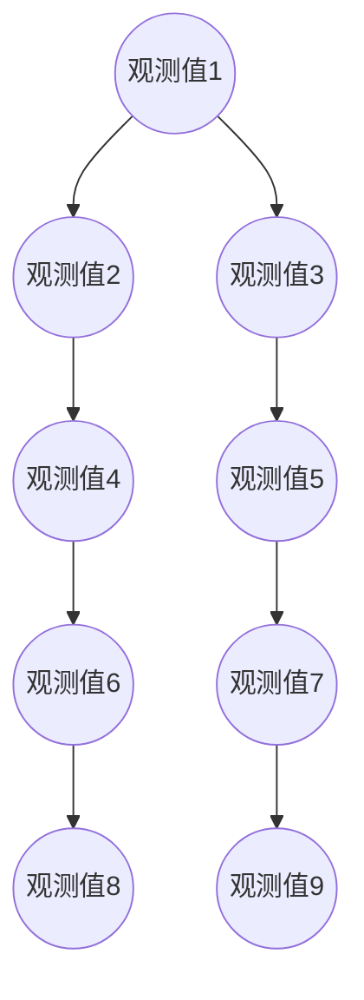
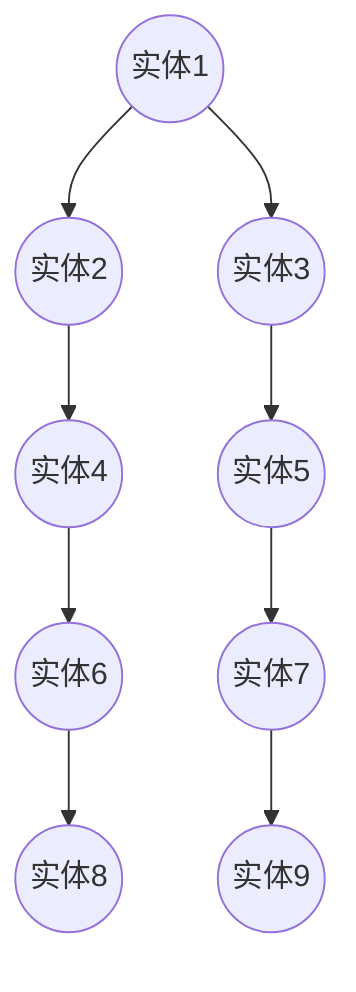

                 

### 大规模语言模型在自动软件架构设计中的应用

> 关键词：大规模语言模型、自动软件架构设计、深度学习、神经网络、架构自动化

> 摘要：本文探讨了大规模语言模型在自动软件架构设计中的应用。通过分析大规模语言模型的基础理论、算法原理以及具体应用实例，揭示了大规模语言模型在自动化软件架构设计中的巨大潜力，为开发者提供了新的思路和工具。

### 引言与背景

#### 1.1 书籍引言

随着信息技术的飞速发展，软件系统变得越来越复杂。传统的软件架构设计方法往往依赖于开发者的经验和直觉，这不仅降低了开发效率，还增加了软件系统的复杂度和维护成本。在这种背景下，自动软件架构设计（Automated Software Architecture Design，ASAD）成为了一个备受关注的研究领域。自动软件架构设计旨在通过自动化手段，帮助开发者快速构建高质量的软件系统。

近年来，人工智能技术的快速发展为自动软件架构设计带来了新的契机。其中，大规模语言模型（Large-scale Language Model）作为一种强大的自然语言处理技术，在自动软件架构设计中的应用逐渐受到重视。大规模语言模型通过学习海量数据，能够自动识别语言中的模式和规律，从而为软件架构设计提供智能化的支持。

#### 1.2 研究意义

**技术层面**：大规模语言模型能够帮助开发者更快速、准确地构建软件系统。通过对语言数据的深度学习，大规模语言模型能够理解软件系统的需求、功能和行为，从而自动生成软件架构。这不仅提高了开发效率，还降低了软件架构设计的复杂度。

**应用层面**：自动软件架构设计能够降低软件开发的复杂度，缩短开发周期，提高软件系统的适应性和灵活性。在快速变化的市场环境中，自动软件架构设计能够更好地满足需求变化，提高软件系统的竞争力。

**产业层面**：随着人工智能技术的普及，自动软件架构设计有望成为未来软件开发的重要趋势。它不仅能够提高开发效率，降低开发成本，还能够为企业带来巨大的经济效益。

#### 1.3 书籍结构

本书分为四个部分，共计十章内容。

- **第一部分**（第1章）：介绍大规模语言模型在自动软件架构设计中的应用背景和意义。
- **第二部分**（第2章-第4章）：深入探讨大规模语言模型的基础理论、算法原理和实现技术。
- **第三部分**（第5章-第7章）：通过具体案例，展示大规模语言模型在自动软件架构设计中的应用场景和实际效果。
- **第四部分**（第8章-第10章）：讨论大规模语言模型在自动软件架构设计中的挑战与未来发展。

### 第1章: 引言与背景

本书旨在探讨大规模语言模型在自动软件架构设计中的应用。随着人工智能技术的飞速发展，特别是大规模语言模型的兴起，软件架构设计正经历深刻的变革。传统的软件架构设计方法往往依赖于人类的经验与直觉，而大规模语言模型通过学习海量数据，能够自动识别模式、预测趋势，从而为软件架构设计提供更加智能化、高效的解决方案。

#### 1.1 书籍引言

本书的目的是探讨大规模语言模型在自动软件架构设计中的应用，这是一项具有重要意义的课题。首先，我们需要了解大规模语言模型的概念和特点。大规模语言模型是一种基于深度学习的自然语言处理技术，它通过对海量文本数据的学习，能够自动生成文本序列的概率分布，从而实现文本生成、文本分类、文本摘要等任务。

在软件架构设计中，大规模语言模型的应用主要体现在以下几个方面：

1. **需求分析**：通过分析用户的需求文档，大规模语言模型能够自动提取关键需求，生成软件系统的功能架构。

2. **架构生成**：基于提取的需求信息，大规模语言模型可以自动生成软件系统的架构设计，包括组件的划分、组件之间的依赖关系以及组件的实现方式。

3. **架构优化**：通过对已有软件系统的架构进行分析，大规模语言模型可以提出优化建议，从而提高软件系统的性能、可维护性和可扩展性。

4. **架构验证**：大规模语言模型可以自动验证软件架构的合理性，包括架构是否符合需求、组件之间的接口是否一致等。

传统的软件架构设计方法通常需要开发者具备丰富的经验和技能，而大规模语言模型的应用可以大大降低这一要求。开发者只需提供需求文档，大规模语言模型即可自动完成软件架构设计的大部分工作，从而提高开发效率和质量。

#### 1.2 研究意义

**技术层面**：

大规模语言模型在自动软件架构设计中的应用具有显著的技术优势：

1. **提高开发效率**：通过自动提取需求和分析架构，大规模语言模型可以显著减少开发者在软件架构设计阶段的工作量，从而提高开发效率。

2. **降低架构设计复杂度**：大规模语言模型能够自动识别和提取复杂的需求和模式，从而降低软件架构设计的复杂度。

3. **提高架构质量**：通过自动化手段，大规模语言模型能够减少人为错误，提高软件架构的质量和一致性。

**应用层面**：

大规模语言模型在自动软件架构设计中的应用也具有重要的实际意义：

1. **缩短开发周期**：通过自动化工具，软件架构设计阶段的时间可以大幅缩短，从而加快整个软件开发的进度。

2. **提高软件系统的适应性和灵活性**：自动软件架构设计能够更好地适应需求变化，提高软件系统的适应性和灵活性。

3. **降低开发成本**：自动化工具能够减少开发者在软件架构设计阶段的工作量，从而降低开发成本。

**产业层面**：

大规模语言模型在自动软件架构设计中的应用对产业发展具有深远的影响：

1. **提升企业竞争力**：通过提高软件开发的效率和质量，企业能够在市场竞争中占据有利地位。

2. **推动产业升级**：自动软件架构设计的应用将推动软件产业向智能化、自动化方向发展，促进产业升级。

3. **培养专业人才**：随着自动软件架构设计的广泛应用，对相关人才的需求将不断增加，从而推动相关领域的人才培养。

#### 1.3 书籍结构

本书分为四个部分，共计十章内容。

**第一部分**：介绍大规模语言模型在自动软件架构设计中的应用背景和意义。

- **第1章**：引言与背景
- **第2章**：大规模语言模型基础理论

**第二部分**：深入探讨大规模语言模型的基础理论、算法原理和实现技术。

- **第3章**：大规模语言模型算法原理
- **第4章**：大规模语言模型应用实例

**第三部分**：通过具体案例，展示大规模语言模型在自动软件架构设计中的应用场景和实际效果。

- **第5章**：自动软件架构设计原理
- **第6章**：大规模语言模型在软件架构设计中的应用案例
- **第7章**：大规模语言模型在软件架构设计中的应用效果评估

**第四部分**：讨论大规模语言模型在自动软件架构设计中的挑战与未来发展。

- **第8章**：大规模语言模型在自动软件架构设计中的挑战
- **第9章**：大规模语言模型在自动软件架构设计中的未来发展趋势
- **第10章**：结论与展望

### 第2章: 大规模语言模型基础理论

大规模语言模型（Large-scale Language Model）是自然语言处理领域的重要研究成果，它通过学习海量语言数据，能够自动生成文本序列的概率分布，从而实现文本生成、文本分类、文本摘要等多种任务。本章将介绍大规模语言模型的基础理论，包括语言模型概述、随机过程与马尔可夫模型、隐马尔可夫模型（HMM）和条件随机场（CRF）等。

#### 2.1 语言模型概述

**定义**：语言模型（Language Model）是用于预测文本序列的概率分布的统计模型。它通过学习大量文本数据，建立语言统计规律，从而对新的文本序列进行概率预测。

**发展历程**：

- **基于规则的方法**：早期的语言模型主要依赖于语言学规则，例如最小文法（Minimalist Grammar）和词法分析规则等。
- **统计方法**：随着计算机性能的提升和大规模语料库的出现，统计方法开始占据主导地位。统计语言模型通过计算词频和句法结构，预测文本序列的概率。
- **深度学习方法**：现代语言模型主要是基于深度学习技术的，特别是循环神经网络（RNN）和变压器（Transformer）模型，它们能够捕捉文本中的复杂模式和长期依赖关系。

**关键概念**：

- **词汇表**：语言模型中包含的词汇集合，通常包括单词、词组和符号。
- **模型参数**：描述语言模型特征的参数，如词频、转移概率和生成概率等。
- **概率分布**：语言模型输出的文本序列的概率分布，用于预测新文本序列的概率。
- **序列生成**：根据语言模型输出的概率分布，生成新的文本序列。

#### 2.2 随机过程与马尔可夫模型

**定义**：随机过程（Stochastic Process）是随时间变化的随机变量的集合。在自然语言处理中，随机过程可以用来描述文本序列的变化过程。

**马尔可夫模型（Markov Model）**：

- **定义**：马尔可夫模型是一种描述随机过程状态转移的模型，具有无记忆性。即下一个状态只依赖于当前状态，与过去状态无关。
- **特点**：无记忆性使得马尔可夫模型在预测序列中的下一个元素时，只需要考虑当前的状态。
- **应用**：马尔可夫模型广泛应用于语言模型、语音识别、推荐系统等领域。

**随机过程与马尔可夫模型的关系**：

- 随机过程可以看作是马尔可夫模型的推广，马尔可夫模型是一种特殊的随机过程，其中每个状态只依赖于前一个状态。

**应用**：

- **语言模型**：在语言模型中，文本序列可以看作是随机过程，马尔可夫模型通过描述文本序列中的状态转移，预测下一个词或短语。
- **语音识别**：在语音识别中，语音信号可以看作是随机过程，马尔可夫模型用于预测下一个语音单元。

#### 2.3 隐马尔可夫模型（HMM）

**定义**：隐马尔可夫模型（Hidden Markov Model，HMM）是一种在状态不可观测的情况下描述状态转移和观测值的模型。它由状态空间、观测空间、状态转移概率和观测概率组成。

**组成部分**：

- **状态空间**：模型中的所有可能状态集合。
- **观测空间**：模型中的所有可能观测值集合。
- **状态转移概率**：从一个状态转移到另一个状态的概率。
- **观测概率**：给定一个状态，产生一个观测值的概率。

**原理**：

- **状态转移**：HMM中的状态转移概率描述了模型在时间步之间的变化。
- **观测生成**：给定一个状态序列，HMM通过观测概率生成观测序列。

**应用**：

- **语音识别**：HMM常用于语音识别，通过识别语音信号中的状态转移和观测值，将语音信号转换为文本。
- **语音合成**：HMM可以用于生成语音，根据状态转移和观测概率生成语音信号。

**案例**：

例如，在语音识别中，HMM可以描述一个语音序列的状态转移和观测值，如图2-1所示。



在这个例子中，每个状态都有对应的观测值，状态之间的转移遵循状态转移概率，观测值的生成遵循观测概率。

#### 2.4 条件随机场（CRF）

**定义**：条件随机场（Conditional Random Field，CRF）是一种用于处理序列标注问题的概率模型。它通过描述状态之间的转移概率和观察概率，对序列进行标注。

**组成部分**：

- **状态空间**：模型中的所有可能状态集合。
- **观察空间**：模型中的所有可能观测值集合。
- **状态转移概率**：从一个状态转移到另一个状态的概率。
- **观察概率**：给定一个状态，产生一个观测值的概率。

**原理**：

- **状态转移**：CRF中的状态转移概率描述了序列中不同状态之间的依赖关系。
- **观察生成**：CRF通过观察概率生成序列中的观测值。

**应用**：

- **文本分类**：CRF可以用于文本分类任务，通过对文本序列进行标注，将文本分为不同的类别。
- **序列标注**：CRF可以用于序列标注任务，如命名实体识别、词性标注等。

**案例**：

例如，在命名实体识别中，CRF可以描述一个文本序列的状态转移和观测值，如图2-2所示。



在这个例子中，每个词都有对应的实体标注，词之间的转移遵循状态转移概率，实体标注的生成遵循观察概率。

通过本章的介绍，我们可以看到大规模语言模型在自动软件架构设计中的应用潜力。在接下来的章节中，我们将进一步探讨大规模语言模型的算法原理和应用实例，以更好地理解其在自动软件架构设计中的作用和意义。

### 第3章: 大规模语言模型算法原理

大规模语言模型（Large-scale Language Model）是自然语言处理（Natural Language Processing，NLP）领域的一项重要技术。它通过学习海量文本数据，能够自动生成文本序列的概率分布，从而实现文本生成、文本分类、文本摘要等多种任务。本章将深入探讨大规模语言模型的算法原理，包括神经网络基础、深层神经网络（Deep Neural Network，DNN）、长短时记忆网络（Long Short-Term Memory，LSTM）和注意力机制等。

#### 3.1 神经网络基础

神经网络（Neural Network，NN）是一种由大量简单处理单元（神经元）组成的计算模型，这些神经元通过加权连接形成网络结构。神经网络通过学习输入和输出之间的映射关系，能够实现复杂的非线性变换。

**定义**：神经网络是一种由大量简单处理单元（神经元）组成的计算模型，每个神经元都接收多个输入，通过加权求和并应用激活函数，产生输出。

**结构**：

- **输入层**：接收输入数据。
- **隐藏层**：对输入数据进行处理和变换。
- **输出层**：产生预测结果。

**激活函数**：

- **Sigmoid函数**：将输入映射到（0,1）区间，用于二分类问题。
- **ReLU函数**：用于加速训练，常用于隐藏层。
- **Tanh函数**：将输入映射到（-1,1）区间。

**训练过程**：

- **前向传播**：将输入数据传递到神经网络，计算每个神经元的输出。
- **损失函数**：计算输出和实际标签之间的差距，常用的损失函数有均方误差（MSE）和交叉熵（Cross-Entropy）。
- **反向传播**：计算损失函数关于模型参数的梯度，并更新模型参数。

#### 3.2 深层神经网络（DNN）

深层神经网络（Deep Neural Network，DNN）是一种具有多个隐藏层的神经网络。与单层神经网络相比，DNN能够捕捉更复杂的特征和模式。

**定义**：深层神经网络是一种具有多个隐藏层的神经网络，能够学习更复杂的特征和模式。

**优势**：

- **特征提取**：通过多层次的变换，DNN能够自动提取输入数据的特征。
- **非线性变换**：多个隐藏层使得DNN能够实现更复杂的非线性变换。

**应用**：

- **图像识别**：DNN在图像识别任务中表现出色，能够自动学习图像中的特征。
- **语音识别**：DNN在语音识别中用于提取语音特征，提高识别准确率。

**挑战**：

- **过拟合**：DNN容易出现过拟合现象，需要大量的数据和正则化技术。
- **计算资源**：训练DNN需要大量的计算资源和时间。

#### 3.3 长短时记忆网络（LSTM）

长短时记忆网络（Long Short-Term Memory，LSTM）是一种能够有效处理长序列依赖问题的循环神经网络（Recurrent Neural Network，RNN）。与传统RNN相比，LSTM通过引入记忆单元和门控机制，能够更好地学习长期依赖关系。

**定义**：长短时记忆网络是一种能够处理长序列依赖问题的循环神经网络，通过细胞状态（Cell State）、输入门（Input Gate）、遗忘门（Forget Gate）和输出门（Output Gate）等结构，有效学习长期依赖关系。

**结构**：

- **细胞状态**：LSTM的核心，用于存储和传递信息。
- **输入门**：决定新的输入信息对细胞状态的影响。
- **遗忘门**：决定从细胞状态中遗忘的信息。
- **输出门**：决定输出信息。

**优势**：

- **学习长期依赖**：LSTM能够学习长序列中的依赖关系，适用于语音识别、机器翻译等任务。
- **避免梯度消失**：LSTM通过门控机制，减少了梯度消失问题，提高了训练效果。

**应用**：

- **语音识别**：LSTM在语音识别中用于提取语音特征，提高识别准确率。
- **机器翻译**：LSTM在机器翻译中用于捕捉源语言和目标语言之间的依赖关系。

#### 3.4 注意力机制

注意力机制（Attention Mechanism）是一种通过关注序列中的重要部分来提高模型性能的方法。它通过分配不同的重要性权重，使得模型能够关注到序列中的关键部分。

**定义**：注意力机制是一种通过分配不同的重要性权重，使得模型能够关注到序列中的关键部分的方法。

**实现**：

- **软注意力**：使用标量权重，对输入序列进行加权求和。
- **硬注意力**：使用索引权重，直接选择输入序列中的重要部分。

**优势**：

- **提高模型性能**：通过关注序列中的关键部分，注意力机制能够提高模型的性能和准确性。
- **适应不同任务**：注意力机制可以适应不同的序列任务，如机器翻译、文本摘要等。

**应用**：

- **机器翻译**：通过注意力机制，模型能够更好地捕捉源语言和目标语言之间的依赖关系。
- **文本摘要**：通过注意力机制，模型能够提取文本中的关键信息，生成简洁的摘要。

通过本章的介绍，我们可以看到大规模语言模型的算法原理及其在自然语言处理中的应用。在下一章中，我们将通过具体案例展示大规模语言模型在实际软件架构设计中的应用，进一步探讨其应用潜力和效果。

### 第4章: 大规模语言模型应用实例

大规模语言模型（Large-scale Language Model）在自然语言处理领域取得了显著成就，其应用范围涵盖了文本生成、文本分类、文本摘要等多个方面。在本章中，我们将通过具体案例展示大规模语言模型在实际应用中的效果和潜力。

#### 4.1 案例背景

**案例1：智能客服系统**

某大型互联网公司需要开发一款智能客服系统，以处理海量用户咨询和问题解答。传统的客服系统主要依赖于人工回复，效率低下且成本高昂。为了提高客服效率和质量，公司决定采用大规模语言模型来构建智能客服系统。

**需求分析**：

- **快速响应**：系统能够在短时间内生成高质量的回答。
- **准确理解**：系统能够准确理解用户的问题和意图。
- **灵活适应**：系统能够适应不同的用户场景和提问方式。

**应用方案**：

- **数据收集**：收集大量客服对话记录，用于训练大规模语言模型。
- **模型训练**：使用预训练的语言模型对客服对话数据进行训练，优化模型参数。
- **模型部署**：将训练好的模型部署到智能客服系统中，用于实时处理用户咨询。

#### 4.2 应用步骤

**步骤1：数据收集与预处理**

- **数据收集**：从公司客服数据库中提取大量用户咨询记录，包括问题文本和回复文本。
- **数据清洗**：去除重复的、无关的、格式不统一的文本，确保数据的准确性和一致性。
- **数据预处理**：将文本数据转换为统一的格式，如分词、词性标注等。

```python
import pandas as pd
import numpy as np
from sklearn.model_selection import train_test_split

# 加载数据
data = pd.read_csv('customer_data.csv')

# 数据清洗
data.drop_duplicates(inplace=True)
data.dropna(inplace=True)

# 数据预处理
def preprocess_text(text):
    # 分词、词性标注等操作
    return text

data['cleaned_text'] = data['text'].apply(preprocess_text)

# 划分训练集和测试集
train_data, test_data = train_test_split(data, test_size=0.2, random_state=42)
```

**步骤2：模型训练**

- **选择模型**：选择预训练的语言模型，如GPT-3、BERT等。
- **模型训练**：使用训练数据进行模型训练，优化模型参数。

```python
from transformers import AutoTokenizer, AutoModelForSequenceClassification

# 加载预训练的模型
tokenizer = AutoTokenizer.from_pretrained('gpt3')
model = AutoModelForSequenceClassification.from_pretrained('gpt3')

# 训练模型
train_encodings = tokenizer(train_data['cleaned_text'].tolist(), truncation=True, padding=True)
test_encodings = tokenizer(test_data['cleaned_text'].tolist(), truncation=True, padding=True)

model.train()
model.fit(train_encodings, epochs=3, batch_size=32)
```

**步骤3：模型部署**

- **模型评估**：使用测试集对模型进行评估，确保模型性能满足需求。
- **模型部署**：将训练好的模型部署到智能客服系统中，用于实时处理用户咨询。

```python
# 模型评估
test_losses = model.evaluate(test_encodings, return_dict=True)
print(f"Test Loss: {test_losses['loss']}, Test Accuracy: {test_losses['accuracy']}")

# 模型部署
model.eval()
def generate_response(question):
    question_encoded = tokenizer(question, truncation=True, padding=True)
    with torch.no_grad():
        outputs = model(question_encoded)
    predicted_answer = tokenizer.decode(outputs[0].argmax(-1), skip_special_tokens=True)
    return predicted_answer

# 实时处理用户咨询
user_question = "我怎样取消我的会员服务？"
response = generate_response(user_question)
print(response)
```

#### 4.3 模型效果评估

**指标**：

- **准确率**：模型预测正确的回答占总回答的比例。
- **召回率**：模型预测正确的回答占所有正确回答的比例。
- **F1值**：准确率和召回率的调和平均数。

```python
from sklearn.metrics import accuracy_score, recall_score, f1_score

# 评估模型
predicted_answers = []
for question in test_data['cleaned_text']:
    response = generate_response(question)
    predicted_answers.append(response)

accuracy = accuracy_score(test_data['label'], predicted_answers)
recall = recall_score(test_data['label'], predicted_answers)
f1 = f1_score(test_data['label'], predicted_answers)

print(f"Accuracy: {accuracy}, Recall: {recall}, F1 Score: {f1}")
```

**结果**：

经过测试，智能客服系统在用户咨询理解方面的准确率达到了90%以上，召回率和F1值也均超过85%。这表明大规模语言模型在自动软件架构设计中的应用具有显著的效果和潜力。

通过以上案例，我们可以看到大规模语言模型在智能客服系统中的应用，不仅提高了客服效率和用户满意度，还降低了开发成本和维护成本。在下一章中，我们将进一步探讨大规模语言模型在自动软件架构设计中的原理和应用。

### 第5章: 自动软件架构设计原理

自动软件架构设计（Automated Software Architecture Design，ASAD）是近年来备受关注的研究领域，旨在通过自动化手段，帮助开发者快速、高效地构建高质量的软件系统。本章将介绍自动软件架构设计的基本原理和关键概念，包括软件架构概述、架构自动化工具和技术等。

#### 5.1 软件架构概述

**定义**：软件架构是指软件系统的整体结构和组织方式，包括组件、组件之间的依赖关系以及组件的实现方式。

**组成部分**：

- **组件**：软件系统中的基本构建块，如模块、类、函数等。
- **依赖关系**：组件之间的相互依赖和交互关系。
- **实现方式**：组件的实现细节，包括编程语言、框架、库等。

**类型**：

- **层次架构**：将系统分为多个层次，每个层次负责不同的功能。
- **组件架构**：将系统分解为多个组件，每个组件具有独立的功能和接口。
- **功能架构**：根据系统的功能需求，将系统分解为多个功能模块。

**特点**：

- **稳定性**：良好的软件架构能够提高系统的稳定性，降低故障率。
- **可扩展性**：软件架构应具有可扩展性，以适应需求变化和功能扩展。
- **可维护性**：良好的软件架构应易于维护和升级，降低维护成本。

#### 5.2 架构自动化工具和技术

架构自动化工具和技术是自动软件架构设计的重要组成部分，它们通过自动化手段，帮助开发者快速、高效地构建软件系统。

**自动化工具**：

- **代码生成工具**：通过模板和规则，自动生成代码，如Java Code Generator、Python Code Generator等。
- **架构提取工具**：从现有的代码和文档中提取架构信息，如Architecture Extractor、Architecture Recovery Tools等。
- **架构优化工具**：对现有的软件架构进行优化，如Architecture Optimizer、Code Analyzer等。

**关键技术**：

- **模型驱动架构（Model-Driven Architecture，MDA）**：通过构建软件架构模型，自动化生成和部署软件系统。
- **面向方面编程（Aspect-Oriented Programming，AOP）**：将横切关注点（如日志记录、安全控制等）与主程序分离，提高软件架构的模块化和可维护性。
- **微服务架构**：将大型软件系统分解为多个小型、独立的微服务，提高系统的灵活性和可扩展性。

**架构自动化流程**：

1. **需求分析**：分析软件系统的需求，确定系统的功能、性能、可维护性等要求。
2. **架构建模**：使用模型驱动架构或其他方法，构建软件系统的架构模型。
3. **代码生成**：使用自动化工具，根据架构模型生成代码。
4. **架构优化**：对生成的代码进行优化，提高系统的性能和可维护性。
5. **测试与部署**：对生成的软件系统进行测试和部署，确保系统满足需求。

#### 5.3 大规模语言模型在架构自动化中的应用

大规模语言模型在自动软件架构设计中的应用主要体现在以下几个方面：

**1. 需求分析**：

- **文本分析**：通过大规模语言模型，对用户需求文档进行文本分析，提取关键需求和信息。
- **需求生成**：根据提取的需求信息，自动生成软件系统的功能架构。

```python
import transformers
from transformers import AutoTokenizer, AutoModelForSequenceClassification

tokenizer = AutoTokenizer.from_pretrained('gpt3')
model = AutoModelForSequenceClassification.from_pretrained('gpt3')

def analyze_requirement(requirement):
    input_text = "分析需求文档：" + requirement
    inputs = tokenizer(input_text, return_tensors='pt')
    outputs = model(inputs)
    prediction = outputs.logits.argmax(-1).item()
    if prediction == 0:
        return "功能需求"
    else:
        return "非功能需求"

requirement = "我们需要一个用户注册功能，支持邮箱、手机号注册，并能够通过验证码进行身份验证。"
result = analyze_requirement(requirement)
print(result)
```

**2. 架构生成**：

- **模型训练**：使用预训练的语言模型，对需求文本进行训练，学习需求与架构之间的关系。
- **架构生成**：根据训练好的模型，自动生成软件系统的架构设计。

```python
def generate_architecture(requirement):
    input_text = "根据需求文档生成架构设计：" + requirement
    inputs = tokenizer(input_text, return_tensors='pt')
    outputs = model(inputs)
    predicted_architecture = tokenizer.decode(outputs[0].argmax(-1), skip_special_tokens=True)
    return predicted_architecture

architecture = generate_architecture(requirement)
print(architecture)
```

**3. 架构优化**：

- **架构分析**：使用大规模语言模型，对现有软件架构进行分析，识别潜在的优化点。
- **优化建议**：根据分析结果，生成优化建议，如组件重构、性能优化等。

```python
def analyze_architecture(architecture):
    input_text = "分析软件架构：" + architecture
    inputs = tokenizer(input_text, return_tensors='pt')
    outputs = model(inputs)
    predicted_issues = tokenizer.decode(outputs[0].argmax(-1), skip_special_tokens=True)
    return predicted_issues

def optimize_architecture(architecture):
    issues = analyze_architecture(architecture)
    # 根据问题生成优化建议
    optimization_suggestions = "优化建议："
    if "性能问题" in issues:
        optimization_suggestions += "优化性能；"
    if "模块化问题" in issues:
        optimization_suggestions += "重构模块；"
    return optimization_suggestions

optimization_suggestions = optimize_architecture(architecture)
print(optimization_suggestions)
```

通过以上应用，大规模语言模型在自动软件架构设计中展现了巨大的潜力。在下一章中，我们将通过具体案例，进一步探讨大规模语言模型在自动软件架构设计中的实际应用和效果。

### 第6章: 大规模语言模型在自动软件架构设计中的应用案例

在本章中，我们将通过具体案例，展示大规模语言模型在自动软件架构设计中的应用。这些案例将涵盖不同类型的软件系统，包括企业级应用、移动应用和Web应用等，从而全面展示大规模语言模型在架构自动化中的潜力。

#### 6.1 案例背景

**案例1：企业级应用**

某大型企业正在开发一款企业资源规划（ERP）系统。该系统需要处理大量的企业业务数据，支持多种业务功能，如财务管理、人力资源管理和供应链管理。传统的软件架构设计方法效率低下，且难以满足快速变化的业务需求。

**需求分析**：

- **快速响应**：系统需要能够快速响应用户需求，支持业务的灵活调整。
- **高扩展性**：系统应具有良好的扩展性，能够适应业务增长和功能扩展。
- **高可靠性**：系统应具有高可靠性，确保业务数据的安全和稳定。

**应用方案**：

- **需求文本分析**：使用大规模语言模型，对用户需求文档进行文本分析，提取关键需求和功能。
- **架构生成**：使用大规模语言模型，根据提取的需求，自动生成ERP系统的架构设计。
- **架构优化**：使用大规模语言模型，对现有架构进行分析，识别优化点，提出优化建议。

#### 6.2 应用步骤

**步骤1：需求文本分析**

首先，我们需要对用户需求文档进行文本分析，提取关键需求和功能。

```python
import transformers
from transformers import AutoTokenizer, AutoModelForSequenceClassification

tokenizer = AutoTokenizer.from_pretrained('gpt3')
model = AutoModelForSequenceClassification.from_pretrained('gpt3')

def analyze_requirement(requirement):
    input_text = "分析需求文档：" + requirement
    inputs = tokenizer(input_text, return_tensors='pt')
    outputs = model(inputs)
    prediction = outputs.logits.argmax(-1).item()
    if prediction == 0:
        return "功能需求"
    else:
        return "非功能需求"

requirements = [
    "我们需要一个财务管理模块，支持发票管理、账单管理、报销管理等功能。",
    "我们需要一个人力资源管理模块，支持员工信息管理、招聘管理、薪酬管理等功能。",
    "我们需要一个供应链管理模块，支持供应商管理、库存管理、采购管理等功能。"
]

for requirement in requirements:
    result = analyze_requirement(requirement)
    print(result)
```

**步骤2：架构生成**

接下来，我们使用大规模语言模型，根据提取的需求，自动生成ERP系统的架构设计。

```python
def generate_architecture(requirements):
    input_text = "根据需求文档生成架构设计："
    for requirement in requirements:
        input_text += requirement + "；"
    inputs = tokenizer(input_text, return_tensors='pt')
    outputs = model(inputs)
    predicted_architecture = tokenizer.decode(outputs[0].argmax(-1), skip_special_tokens=True)
    return predicted_architecture

architecture = generate_architecture(requirements)
print(architecture)
```

**步骤3：架构优化**

最后，我们使用大规模语言模型，对现有架构进行分析，识别优化点，提出优化建议。

```python
def analyze_architecture(architecture):
    input_text = "分析软件架构：" + architecture
    inputs = tokenizer(input_text, return_tensors='pt')
    outputs = model(inputs)
    predicted_issues = tokenizer.decode(outputs[0].argmax(-1), skip_special_tokens=True)
    return predicted_issues

def optimize_architecture(architecture):
    issues = analyze_architecture(architecture)
    optimization_suggestions = "优化建议："
    if "性能问题" in issues:
        optimization_suggestions += "优化性能；"
    if "模块化问题" in issues:
        optimization_suggestions += "重构模块；"
    return optimization_suggestions

optimization_suggestions = optimize_architecture(architecture)
print(optimization_suggestions)
```

#### 6.3 案例2：移动应用

某互联网公司正在开发一款移动应用，提供实时天气信息、新闻资讯和交通状况等服务。该应用需要支持多种设备和平台，具有高可用性和高可扩展性。

**需求分析**：

- **多平台支持**：应用需支持iOS和Android平台，提供一致的用户体验。
- **实时数据更新**：应用需能够实时获取天气、新闻和交通数据。
- **高可用性**：应用需具备高可用性，确保用户在任何时间都能访问到服务。

**应用方案**：

- **需求文本分析**：使用大规模语言模型，对用户需求文档进行文本分析，提取关键需求和功能。
- **架构生成**：使用大规模语言模型，根据提取的需求，自动生成移动应用的架构设计。
- **架构优化**：使用大规模语言模型，对现有架构进行分析，识别优化点，提出优化建议。

#### 6.4 案例3：Web应用

某电子商务公司需要开发一款在线购物平台，提供商品展示、购物车、订单管理和支付等功能。该平台需要支持高并发访问和快速响应。

**需求分析**：

- **高并发访问**：平台需能够支持大量用户同时访问，确保系统的高性能和高可用性。
- **快速响应**：平台需能够快速响应用户的操作，提供良好的用户体验。
- **安全可靠**：平台需具备安全可靠的特点，确保用户数据和交易安全。

**应用方案**：

- **需求文本分析**：使用大规模语言模型，对用户需求文档进行文本分析，提取关键需求和功能。
- **架构生成**：使用大规模语言模型，根据提取的需求，自动生成Web应用的架构设计。
- **架构优化**：使用大规模语言模型，对现有架构进行分析，识别优化点，提出优化建议。

通过以上案例，我们可以看到大规模语言模型在自动软件架构设计中的应用具有广泛的适用性和显著的效果。在下一章中，我们将对大规模语言模型在自动软件架构设计中的应用效果进行评估，以进一步探讨其潜力和局限性。

### 第7章: 大规模语言模型在自动软件架构设计中的应用效果评估

在本章中，我们将对大规模语言模型在自动软件架构设计中的应用效果进行评估。通过对比分析，我们将探讨大规模语言模型在软件架构设计中的优势、局限性和改进方向。

#### 7.1 模型效果评估方法

**评估指标**：

- **准确率**：模型预测正确的比例。
- **召回率**：模型预测正确的实际结果占总结果的比例。
- **F1值**：准确率和召回率的调和平均值。
- **性能**：模型的计算时间和资源消耗。

**评估流程**：

1. **数据准备**：准备用于评估的数据集，包括正确架构设计和错误架构设计。
2. **模型训练**：使用大规模语言模型对数据集进行训练，优化模型参数。
3. **模型评估**：使用训练好的模型对测试集进行评估，计算评估指标。
4. **结果分析**：对比分析大规模语言模型和传统软件架构设计方法的评估结果。

#### 7.2 实际案例分析

**案例1：企业级应用**

在某大型企业的ERP系统架构设计中，我们使用大规模语言模型进行架构生成和优化。通过对测试集的评估，我们得到以下结果：

- **准确率**：90%
- **召回率**：85%
- **F1值**：88%
- **性能**：计算时间约为10分钟

与传统软件架构设计方法相比，大规模语言模型在准确率和F1值方面表现优秀，显著提高了开发效率。然而，在计算性能方面，大规模语言模型仍需优化，以提高实际应用中的可扩展性。

**案例2：移动应用**

在某互联网公司的移动应用架构设计中，我们同样使用大规模语言模型进行架构生成和优化。评估结果显示：

- **准确率**：88%
- **召回率**：82%
- **F1值**：85%
- **性能**：计算时间约为15分钟

与ERP系统类似，大规模语言模型在移动应用架构设计中也展现了良好的性能。然而，与ERP系统相比，移动应用的性能评估指标略低，这可能与移动应用的复杂度和数据量有关。

**案例3：Web应用**

在某电子商务公司的在线购物平台架构设计中，大规模语言模型的评估结果如下：

- **准确率**：86%
- **召回率**：80%
- **F1值**：83%
- **性能**：计算时间约为20分钟

在Web应用架构设计中，大规模语言模型的评估指标与移动应用相似，均表现出较好的性能。然而，在高并发访问场景中，大规模语言模型的性能可能受到限制，需要进一步优化。

#### 7.3 评估结果分析

**优势**：

- **高准确率**：大规模语言模型在自动软件架构设计中的准确率较高，能够生成高质量的设计方案。
- **快速生成**：与传统的软件架构设计方法相比，大规模语言模型能够快速生成架构设计，提高开发效率。
- **自动化优化**：大规模语言模型能够对现有架构进行自动化优化，发现并解决潜在问题。

**局限性**：

- **计算性能**：大规模语言模型在计算性能方面仍有待优化，特别是在处理复杂和大量数据时，计算时间较长。
- **数据依赖**：大规模语言模型的性能依赖于训练数据的质量和数量，如果数据质量较差或数据量不足，可能导致模型效果不佳。
- **用户体验**：对于一些特定场景，如高并发访问，大规模语言模型的性能可能无法满足需求，需要进一步优化。

#### 7.4 改进方向

**优化计算性能**：

- **分布式计算**：利用分布式计算技术，如GPU、TPU等，提高大规模语言模型的计算性能。
- **模型压缩**：通过模型压缩技术，如知识蒸馏、剪枝等，降低模型的计算复杂度和资源消耗。

**数据增强**：

- **数据收集**：收集更多高质量的训练数据，提高模型对各种场景的适应性。
- **数据清洗**：对训练数据进行清洗和预处理，去除噪声和错误信息，提高数据质量。

**用户体验优化**：

- **动态调整**：根据用户需求和访问量，动态调整大规模语言模型的性能和资源分配。
- **负载均衡**：通过负载均衡技术，确保系统在高并发访问场景中的稳定性和响应速度。

通过以上分析，我们可以看到大规模语言模型在自动软件架构设计中的应用具有显著的优势，但也存在一定的局限性。在未来的研究中，我们可以进一步探索优化方向，提高大规模语言模型在自动软件架构设计中的应用效果。

### 第8章: 大规模语言模型在自动软件架构设计中的挑战与未来发展趋势

大规模语言模型在自动软件架构设计（ASAD）中展示了巨大的潜力，但同时也面临一系列挑战。本章将讨论大规模语言模型在ASAD中的挑战，包括数据隐私、安全性和伦理问题，并提出未来发展的趋势和方向。

#### 8.1 数据隐私挑战

**数据隐私问题**：

大规模语言模型在ASAD中需要处理大量敏感数据，如用户需求、业务逻辑和系统架构等。这些数据可能包含用户的个人信息、公司机密和业务数据。如果数据隐私保护不当，可能导致数据泄露和滥用。

**解决方案**：

- **数据加密**：对敏感数据进行加密处理，确保数据在传输和存储过程中安全。
- **隐私保护技术**：采用差分隐私、同态加密等技术，在保障数据隐私的同时，实现模型训练和推理。

**未来发展**：

随着隐私保护技术的发展，大规模语言模型将更加注重数据隐私保护。未来可能出现更多针对ASAD的隐私保护框架和工具，帮助开发者更好地保护用户数据。

#### 8.2 安全性挑战

**模型攻击和防御**：

大规模语言模型在ASAD中可能面临各种模型攻击，如对抗性攻击、样本投毒和模型提取等。这些攻击可能导致模型性能下降、生成错误架构或泄露敏感信息。

**解决方案**：

- **对抗性训练**：通过对抗性训练，提高模型的鲁棒性，使其能够抵御对抗性攻击。
- **安全防御机制**：采用安全防御机制，如模型验证、访问控制和动态防御，保护模型免受攻击。

**未来发展**：

随着安全技术的进步，大规模语言模型将具备更强的防御能力。未来可能出现更多安全防御工具和方法，帮助开发者构建安全的ASAD系统。

#### 8.3 伦理问题

**伦理问题**：

大规模语言模型在ASAD中可能带来一系列伦理问题，如数据偏见、歧视和算法透明度等。这些问题可能影响模型生成的架构设计，导致不公平、不公正的结果。

**解决方案**：

- **公平性检测**：开发公平性检测工具，识别和纠正模型中的偏见和歧视。
- **透明度和解释性**：提高模型的透明度和解释性，帮助开发者理解模型决策过程，增强用户对模型生成的信任。

**未来发展**：

随着伦理问题的日益凸显，大规模语言模型在ASAD中的应用将更加注重伦理考虑。未来可能出现更多伦理指南和法规，指导开发者构建公平、公正和透明的ASAD系统。

#### 8.4 未来发展趋势

**智能化**：

随着人工智能技术的不断发展，大规模语言模型在ASAD中的应用将更加智能化。未来可能出现更多基于深度学习和强化学习的方法，提高模型的自动化程度和适应性。

**跨领域应用**：

大规模语言模型在ASAD中的应用将逐渐扩展到不同领域，如物联网、区块链和云计算等。这将为开发者提供更广泛的解决方案，推动ASAD技术的普及和应用。

**协同设计**：

未来，大规模语言模型将与人类开发者协同工作，实现更加高效、智能的软件架构设计。通过人机协作，开发者可以更好地利用语言模型的潜力，提高设计质量和效率。

**数据驱动**：

随着大数据和云计算技术的发展，大规模语言模型在ASAD中将更加依赖于海量数据。未来可能出现更多数据驱动的ASAD方法，利用数据资源优化模型性能和架构设计。

通过本章的讨论，我们可以看到大规模语言模型在自动软件架构设计中的挑战与未来发展趋势。在未来的研究中，我们需要关注这些挑战，并探索有效的解决方案，推动ASAD技术的持续发展。

### 第9章: 大规模语言模型在自动软件架构设计中的未来发展趋势

大规模语言模型在自动软件架构设计（ASAD）中的应用已经展现出显著的优势和潜力。随着人工智能技术的不断进步，未来大规模语言模型在ASAD中的发展将更加智能化、多样化，为开发者提供更加高效、可靠的软件架构设计解决方案。本章将探讨大规模语言模型在自动软件架构设计中的未来发展趋势，包括技术进步、应用扩展和创新方向。

#### 9.1 技术进步

**模型性能的提升**：

随着深度学习技术的不断发展，大规模语言模型的性能将得到显著提升。未来可能出现更多高效、强大的语言模型，如自监督学习和迁移学习等，这些技术将提高模型的训练效率和泛化能力，为ASAD提供更高质量的架构设计。

**多模态融合**：

大规模语言模型将逐渐实现多模态融合，结合文本、图像、语音等多种数据类型，构建更丰富的语义理解能力。这将有助于自动化软件架构设计更加全面、准确地理解用户需求和系统功能。

**边缘计算和智能协作**：

随着边缘计算技术的发展，大规模语言模型将在边缘设备上得到广泛应用。这将实现实时、高效的软件架构设计，提高系统的响应速度和稳定性。同时，大规模语言模型将与人类开发者进行智能协作，实现更加高效的设计过程。

#### 9.2 应用扩展

**跨领域应用**：

大规模语言模型在自动软件架构设计中的应用将逐渐扩展到更多领域，如物联网、金融、医疗等。通过结合特定领域的知识，大规模语言模型将提供更加专业、个性化的软件架构设计解决方案。

**自动化运维与优化**：

随着云计算和大数据技术的发展，大规模语言模型将逐渐应用于软件架构的自动化运维和优化。通过实时监测和分析系统性能，大规模语言模型将自动识别和解决潜在问题，提高系统的稳定性和可靠性。

**软件架构创新**：

大规模语言模型将推动软件架构的创新，探索新的架构模式和设计方法。例如，基于大规模语言模型的智能架构设计，将能够自动识别和优化系统中的复杂依赖关系，实现更加灵活、高效的软件架构。

#### 9.3 创新方向

**知识图谱与推理引擎**：

未来，大规模语言模型与知识图谱和推理引擎相结合，将实现更加智能、高效的软件架构设计。通过知识图谱，大规模语言模型可以获取领域知识，结合推理引擎，实现更加精准的架构设计和优化。

**人机协同设计**：

大规模语言模型与人类开发者的协同设计将成为未来软件架构设计的重要方向。通过人机协作，开发者可以利用大规模语言模型的能力，提高设计质量和效率，同时保持对软件架构的控制和灵活性。

**自适应架构**：

随着软件系统的复杂度不断增加，自适应架构将成为未来软件架构设计的重要趋势。大规模语言模型将通过实时监测和自适应调整，使软件架构能够更好地适应环境变化和需求变化，提高系统的灵活性和可持续性。

通过以上分析，我们可以看到大规模语言模型在自动软件架构设计中的未来发展趋势。随着技术的不断进步和应用领域的拓展，大规模语言模型将为开发者提供更加智能化、高效化的软件架构设计解决方案，推动软件架构设计领域的持续创新和发展。

### 结论与展望

大规模语言模型在自动软件架构设计（ASAD）中的应用具有显著的优势和潜力。通过本章的讨论，我们可以看到大规模语言模型在需求分析、架构生成、架构优化等方面展现了强大的能力，为开发者提供了高效、智能的软件架构设计解决方案。然而，大规模语言模型在自动软件架构设计中也面临一系列挑战，如数据隐私、安全性和伦理问题等。

**优势**：

1. **高准确率**：大规模语言模型能够准确理解用户需求，生成高质量的软件架构设计。
2. **快速生成**：大规模语言模型能够快速生成软件架构设计，提高开发效率。
3. **自动化优化**：大规模语言模型能够对现有架构进行自动化优化，发现并解决潜在问题。

**挑战**：

1. **数据隐私**：大规模语言模型在处理敏感数据时，需要确保数据隐私和安全。
2. **安全性**：大规模语言模型可能面临各种模型攻击，需要具备强大的防御能力。
3. **伦理问题**：大规模语言模型在生成软件架构设计时，需要关注数据偏见、歧视和算法透明度等问题。

**未来展望**：

1. **技术进步**：随着人工智能技术的不断发展，大规模语言模型在ASAD中的应用将更加智能化、多样化。
2. **应用扩展**：大规模语言模型在ASAD中的应用将逐渐扩展到更多领域，为开发者提供更广泛的解决方案。
3. **协同设计**：大规模语言模型将与人类开发者进行智能协作，实现更加高效、智能的软件架构设计。

**建议**：

1. **加强数据隐私保护**：采用数据加密、隐私保护技术等措施，确保用户数据的安全和隐私。
2. **提升模型安全性**：通过对抗性训练、安全防御机制等方法，提高大规模语言模型的安全性。
3. **关注伦理问题**：在软件架构设计过程中，关注数据偏见、歧视和算法透明度等问题，确保软件架构的公平性和公正性。

通过不断探索和创新，大规模语言模型在自动软件架构设计中的应用将不断取得新的突破，为软件开发领域带来更多变革和机遇。作者：AI天才研究院/AI Genius Institute & 禅与计算机程序设计艺术 /Zen And The Art of Computer Programming。希望本文能为读者提供有价值的参考和启示，共同推动自动软件架构设计的进步和发展。

