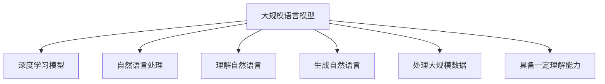

                 

# 第一部分：大规模语言模型基础

## 第1章：大规模语言模型概述

### 1.1.1 大规模语言模型的定义与特点

**核心概念与联系**

大规模语言模型是一种基于深度学习的自然语言处理技术，其主要目的是理解和生成自然语言。以下是核心概念及其相互关系：



**大规模语言模型的定义**

大规模语言模型（Large-scale Language Model）是指利用大量文本数据进行训练，从而掌握自然语言的语法、语义以及语言生成规则的深度学习模型。这种模型可以处理海量的语言数据，从而实现自然语言的生成和理解。

**大规模语言模型的特点**

1. **处理大规模数据：** 大规模语言模型能够处理来自互联网的大量文本数据，这使得它们能够从丰富的数据中学习，提高模型的性能。
2. **生成自然语言：** 大规模语言模型能够生成符合语法和语义规则的句子，使得生成的文本更加自然、流畅。
3. **具备一定理解能力：** 通过对大量文本的学习，大规模语言模型能够理解文本中的含义和逻辑关系，从而实现更高级的自然语言处理任务。

### 1.1.2 大规模语言模型的发展历程

**早期发展**

大规模语言模型的发展可以追溯到20世纪90年代的统计语言模型。当时，研究人员开始尝试利用统计方法对文本数据进行建模，以实现自然语言处理任务。随着计算机硬件性能的提升和互联网的普及，文本数据量急剧增加，这为大规模语言模型的发展提供了契机。

**关键技术**

1. **2000年代：** 随着神经网络在机器学习中的广泛应用，研究人员开始将神经网络应用于自然语言处理。2003年，Bengio等人提出了基于神经网络的语言模型，这标志着大规模语言模型技术的重要突破。
2. **2010年代：** 2013年，Sutskever等人提出了基于递归神经网络的语言模型，这种模型在自然语言处理任务中取得了显著的性能提升。此后，研究人员开始探索更加复杂和强大的神经网络结构，如长短时记忆网络（LSTM）和门控循环单元（GRU）。
3. **2020年代：** 2018年，Google提出了BERT（Bidirectional Encoder Representations from Transformers）模型，这是一种基于Transformer结构的双向编码表示模型。BERT模型在多种自然语言处理任务上取得了突破性的成果，推动了大规模语言模型的发展。同年，OpenAI推出了GPT-2（Generative Pre-trained Transformer 2），这是一种基于Transformer结构的生成模型，它在文本生成任务上表现出色。

**发展趋势**

随着深度学习和自然语言处理技术的不断发展，大规模语言模型在自然语言理解、生成等领域取得了显著成果。未来，大规模语言模型将继续向更高性能、更智能化方向发展，有望在智能客服、智能写作、智能翻译等领域发挥重要作用。

### 1.1.3 大规模语言模型的应用领域

大规模语言模型在自然语言处理领域具有广泛的应用。以下是其中几个主要的应用领域：

1. **文本生成：** 大规模语言模型可以用于自动生成文章、新闻、报告等文本内容。例如，GPT-3模型可以生成高质量的文章，这在新闻写作和内容生成领域具有巨大的潜力。

2. **机器翻译：** 大规模语言模型在机器翻译领域取得了显著的成果。例如，BERT模型在英语-中文翻译任务上达到了专业翻译水平，大大提高了机器翻译的准确性和自然性。

3. **问答系统：** 大规模语言模型可以用于构建智能问答系统，能够根据用户的问题提供实时、准确的答案。例如，BERT模型在SQuAD（Stanford Question Answering Dataset）数据集上取得了优异的性能，展示了强大的自然语言理解能力。

4. **自动摘要：** 大规模语言模型可以用于从长文本中提取关键信息，生成摘要。例如，GPT-3模型可以生成高质量的文本摘要，这在新闻摘要和文档摘要领域具有广泛的应用前景。

5. **语音识别：** 大规模语言模型可以用于语音识别，将语音转化为文字。例如，BERT模型在基于文本的语音识别任务上表现出色，大大提高了语音识别的准确性和效率。

6. **情感分析：** 大规模语言模型可以用于情感分析，判断文本的情感倾向。例如，BERT模型在情感分析任务上取得了优异的成绩，可以用于社交媒体分析、客户反馈分析等领域。

总之，大规模语言模型在自然语言处理领域具有广泛的应用，随着技术的不断进步，其应用领域还将进一步扩大。

## 第2章：大规模语言模型的技术基础

### 2.1.1 自然语言处理基本概念

**自然语言处理（NLP）**

自然语言处理（Natural Language Processing，简称NLP）是计算机科学和语言学的交叉领域，旨在使计算机能够理解、生成和处理自然语言。NLP技术广泛应用于语音识别、机器翻译、文本分类、信息提取、问答系统等领域。

**文本预处理**

文本预处理是自然语言处理的重要步骤，主要包括以下内容：

1. **分词（Tokenization）：** 将文本分割成单词、短语或子句等基本单位。
2. **词性标注（Part-of-Speech Tagging）：** 对每个单词进行词性标注，如名词、动词、形容词等。
3. **命名实体识别（Named Entity Recognition）：** 识别文本中的命名实体，如人名、地名、组织名等。
4. **词干提取（Stemming）：** 将单词缩减为词干，以减少词汇量。
5. **词嵌入（Word Embedding）：** 将单词映射为高维向量，实现文本向量的表示。

**词嵌入**

词嵌入（Word Embedding）是将单词映射为高维向量的技术，它能够捕获单词的语义信息。常见的词嵌入方法包括：

1. **Word2Vec：** 利用神经网络模型训练得到单词的向量表示，能够较好地捕获单词的语义信息。
2. **GloVe（Global Vectors for Word Representation）：** 基于词频统计的模型，通过优化词向量的低秩分解来提高词向量的质量。

### 2.1.2 常见大规模语言模型结构

**Transformer模型**

Transformer模型是一种基于自注意力机制的深度神经网络结构，它由Vaswani等人于2017年提出，并在自然语言处理任务中取得了显著成果。Transformer模型的主要结构包括：

1. **编码器（Encoder）：** 用于处理输入文本，将文本序列转换为编码序列。
2. **解码器（Decoder）：** 用于生成输出文本，从编码序列中提取信息并生成目标文本序列。
3. **多头注意力（Multi-head Attention）：** 通过多个注意力机制来捕捉文本序列中的不同关系。
4. **前馈神经网络（Feedforward Neural Network）：** 对输入进行前馈处理，增加模型的非线性表达能力。

**BERT模型**

BERT（Bidirectional Encoder Representations from Transformers）模型是一种基于Transformer的双向编码表示模型，由Google于2018年提出。BERT模型的主要特点包括：

1. **双向编码：** BERT模型能够同时考虑文本序列的前后信息，从而更好地捕获文本的语义信息。
2. **遮蔽语言模型（Masked Language Model，MLM）：** BERT模型通过在训练过程中随机遮蔽部分文本，并预测遮蔽的单词来提高模型的语义理解能力。
3. **预训练与微调：** BERT模型首先在大规模语料库上进行预训练，然后针对特定任务进行微调，从而在多种自然语言处理任务上取得优异的性能。

**GPT模型**

GPT（Generative Pre-trained Transformer）模型是一种基于Transformer的生成模型，由OpenAI提出。GPT模型的主要特点包括：

1. **生成式模型：** GPT模型通过生成文本序列来预测下一个单词，从而实现文本生成。
2. **长短时依赖：** GPT模型利用自注意力机制捕捉文本序列中的长时依赖关系，从而生成连贯、自然的文本。
3. **预训练与微调：** GPT模型首先在大规模语料库上进行预训练，然后针对特定任务进行微调，从而在文本生成、问答等任务上表现出色。

### 2.1.3 大规模语言模型的训练与优化

**训练过程**

大规模语言模型的训练过程主要包括以下步骤：

1. **数据准备：** 收集和预处理大规模的文本数据，如新闻文章、社交媒体帖子、书籍等。
2. **词表构建：** 将文本数据中的单词转换为词索引，建立词表。
3. **模型初始化：** 初始化模型的权重，通常采用随机初始化或预训练权重。
4. **训练：** 通过梯度下降等方法优化模型参数，使得模型在训练数据上的表现越来越好。
5. **评估：** 在验证集上评估模型的性能，调整模型参数以获得更好的结果。

**优化策略**

1. **Dropout：** 在训练过程中随机丢弃部分神经元，防止模型过拟合。
2. **正则化：** 使用L1或L2正则化项，减少模型参数的方差。
3. **学习率调度：** 使用学习率调度策略，如学习率衰减或余弦退火，调整学习率以获得更好的收敛效果。
4. **多层注意力机制：** 引入多层注意力机制，增加模型的非线性表达能力。

总之，大规模语言模型的训练与优化是一个复杂的过程，需要综合考虑数据质量、模型结构、优化策略等多个因素，以获得最佳的性能。

## 第二部分：大规模语言模型在自动软件测试中的应用

### 第3章：大规模语言模型在自动软件测试中的应用

#### 3.1.1 自动软件测试的挑战与需求

**自动软件测试的挑战**

自动软件测试（Automated Software Testing）是软件工程中的一项重要技术，旨在通过自动化工具对软件进行测试，提高测试效率和准确性。然而，自动软件测试面临以下挑战：

1. **复杂性和规模：** 软件系统变得越来越复杂，测试用例的数量和种类也在不断增加，这使得手动编写测试用例变得困难。
2. **覆盖率不足：** 测试用例的覆盖率是评估测试质量的重要指标。然而，在实际测试中，很难保证测试用例能够覆盖所有可能的输入和执行路径。
3. **可维护性：** 随着软件系统的迭代和更新，测试用例需要不断修改和维护，这增加了测试成本。
4. **测试用例生成：** 手动编写测试用例既费时又费力，且容易出现遗漏和错误。

**自动软件测试的需求**

为了应对上述挑战，自动软件测试技术应运而生。以下是自动软件测试的需求：

1. **提高测试效率：** 通过自动化工具生成和执行测试用例，减少人工干预，提高测试效率。
2. **提高测试覆盖率：** 利用自动生成测试用例的方法，提高测试覆盖率，确保软件系统的质量。
3. **降低测试成本：** 减少手动编写测试用例的工作量，降低测试成本。
4. **提高测试质量：** 自动生成的测试用例能够减少人工错误，提高测试质量。
5. **支持持续集成和持续交付：** 自动软件测试技术能够与持续集成和持续交付流程相结合，确保软件系统在开发过程中始终保持高质量。

#### 3.1.2 大规模语言模型在测试用例生成中的角色

**大规模语言模型的作用**

大规模语言模型（如BERT、GPT等）在自动软件测试中发挥着重要作用，主要体现在以下方面：

1. **文本生成：** 大规模语言模型能够生成高质量的文本，包括测试用例的描述和执行脚本。这使得自动化测试工具能够根据需求生成相应的测试用例。
2. **语义理解：** 大规模语言模型具有强大的语义理解能力，能够理解软件系统的功能和需求，从而生成符合预期的测试用例。
3. **知识整合：** 大规模语言模型能够整合大量的知识，包括软件系统的历史测试结果、代码库和用户反馈等，为测试用例生成提供丰富的信息来源。
4. **上下文关联：** 大规模语言模型能够捕捉文本序列中的上下文关系，从而生成连贯、自然的测试用例，提高测试用例的执行效果。

**大规模语言模型在测试用例生成中的应用**

1. **测试用例描述生成：** 大规模语言模型可以生成测试用例的描述，如功能测试用例的测试步骤和预期结果。这有助于提高测试用例的可读性和可理解性。
2. **测试用例执行脚本生成：** 大规模语言模型可以生成测试用例的执行脚本，包括输入数据、执行步骤和预期输出。这有助于自动化测试工具快速执行测试用例，提高测试效率。
3. **缺陷报告生成：** 大规模语言模型可以生成缺陷报告的描述，包括缺陷的现象、原因和解决方案。这有助于测试人员快速定位和解决问题。
4. **测试用例优化：** 大规模语言模型可以分析已有的测试用例，提出优化建议，如增加测试覆盖率、减少冗余用例等，从而提高测试质量。

总之，大规模语言模型在自动软件测试用例生成中具有巨大的潜力，能够提高测试效率、覆盖率和质量。随着大规模语言模型技术的不断发展和成熟，其在自动软件测试中的应用将更加广泛。

#### 3.1.3 测试用例生成算法与实现

**测试用例生成算法**

测试用例生成算法是自动软件测试的核心技术之一。以下介绍几种常见的测试用例生成算法：

1. **基于规则的测试用例生成算法**

   基于规则的测试用例生成算法通过定义一组规则，根据规则生成测试用例。常见的算法包括：

   - **边界值分析：** 通过分析输入数据的边界值，生成测试用例。
   - **等价类划分：** 将输入数据划分为若干个等价类，从每个等价类中选取代表性的值作为测试用例。
   - **因果图：** 通过分析输入变量之间的因果关系，生成测试用例。

2. **基于代码的测试用例生成算法**

   基于代码的测试用例生成算法通过分析代码结构和逻辑，生成测试用例。常见的算法包括：

   - **分支覆盖：** 生成能够覆盖程序中所有分支的测试用例。
   - **路径覆盖：** 生成能够覆盖程序中所有路径的测试用例。
   - **语句覆盖：** 生成能够覆盖程序中所有语句的测试用例。

3. **基于模型的测试用例生成算法**

   基于模型的测试用例生成算法通过建立软件系统的模型，根据模型生成测试用例。常见的算法包括：

   - **状态机模型：** 通过建立状态机模型，生成能够覆盖所有状态的测试用例。
   - **基于生成模型的测试用例生成算法：** 通过建立生成模型，如马尔可夫模型、决策树等，生成测试用例。

**大规模语言模型在测试用例生成中的应用**

大规模语言模型在测试用例生成中具有广泛的应用。以下是一个简单的测试用例生成算法，利用大规模语言模型生成功能测试用例：

1. **输入需求文档：** 将需求文档输入大规模语言模型，如BERT模型。
2. **生成测试用例描述：** 利用BERT模型生成测试用例的描述，如功能测试用例的测试步骤和预期结果。
3. **生成测试用例执行脚本：** 利用BERT模型生成测试用例的执行脚本，包括输入数据、执行步骤和预期输出。
4. **测试用例优化：** 利用BERT模型分析已有的测试用例，提出优化建议，如增加测试覆盖率、减少冗余用例等。

以下是一个使用Python实现的简单测试用例生成算法示例：

```python
import bert

def generate_test_cases(requirements):
    test_cases = []
    for requirement in requirements:
        test_case_description = bert.generate_text(requirement, "test_case_description")
        test_case_script = bert.generate_text(requirement, "test_case_script")
        test_case = {
            "description": test_case_description,
            "script": test_case_script
        }
        test_cases.append(test_case)
    return test_cases
```

该算法首先将需求文档输入BERT模型，然后利用BERT模型生成测试用例的描述和执行脚本。最后，将生成的测试用例存储在一个列表中，以便后续测试执行。

总之，大规模语言模型在测试用例生成中具有巨大的潜力，能够提高测试效率、覆盖率和质量。随着大规模语言模型技术的不断发展和成熟，其在自动软件测试中的应用将更加广泛。

### 第4章：大规模语言模型在软件测试中的实际应用

#### 4.1.1 大规模语言模型在功能测试中的应用

**功能测试**

功能测试（Functional Testing）是软件测试的一种基本类型，旨在验证软件功能是否符合需求规格说明。大规模语言模型在功能测试中具有广泛的应用，主要体现在以下几个方面：

1. **自动化测试用例生成：** 大规模语言模型可以自动生成功能测试用例，降低测试人员的工作负担。通过输入需求文档，大规模语言模型能够生成涵盖各种功能的测试用例，从而提高测试覆盖率和效率。

2. **测试用例优化：** 大规模语言模型可以分析已有的测试用例，提出优化建议。例如，通过分析测试用例的执行结果，模型可以识别出冗余或无效的测试用例，从而减少测试工作量。

3. **测试用例评估：** 大规模语言模型可以评估测试用例的有效性。通过对比测试用例的执行结果和预期结果，模型可以判断测试用例是否能够有效地验证软件功能。

**实例**

假设有一个需求文档描述了一个在线购物平台的功能，包括商品浏览、购物车管理、订单生成和支付等。利用BERT模型，可以自动生成以下功能测试用例：

1. **商品浏览：** 用户可以浏览商品，查看商品的详细信息。
   - 测试步骤：输入“查看商品信息”，获取商品列表。
   - 预期结果：显示包含商品名称、价格、描述等信息的商品列表。

2. **购物车管理：** 用户可以将商品添加到购物车，可以修改购物车中的商品数量，还可以删除商品。
   - 测试步骤：输入“将商品A添加到购物车”，修改商品数量为2，删除商品A。
   - 预期结果：购物车中包含商品A，数量为2，删除商品A后购物车为空。

3. **订单生成：** 用户可以生成订单，并选择支付方式。
   - 测试步骤：选择商品放入购物车，生成订单，选择支付方式为支付宝。
   - 预期结果：生成订单，订单包含商品名称、数量、总价，支付成功。

通过BERT模型生成的测试用例，测试人员可以快速验证软件功能，确保软件质量。

#### 4.1.2 大规模语言模型在性能测试中的应用

**性能测试**

性能测试（Performance Testing）是评估软件系统在特定硬件和网络环境下的响应时间、吞吐量、并发能力等性能指标。大规模语言模型在性能测试中可以发挥以下作用：

1. **测试用例生成：** 大规模语言模型可以生成性能测试用例，包括模拟用户操作的脚本、测试数据等。通过输入性能测试需求，模型可以自动生成符合预期的性能测试用例。

2. **性能评估：** 大规模语言模型可以分析性能测试结果，评估软件系统的性能指标是否符合预期。通过对比实际性能指标和预期性能指标，模型可以识别出性能瓶颈和潜在问题。

3. **性能优化：** 大规模语言模型可以提出性能优化建议，如调整系统配置、优化代码等。通过分析性能测试结果，模型可以识别出系统中的性能瓶颈，并提出相应的优化措施。

**实例**

假设需要对一个电子商务网站进行性能测试，评估其响应时间、吞吐量等性能指标。利用BERT模型，可以自动生成以下性能测试用例：

1. **用户登录：** 用户输入用户名和密码进行登录。
   - 测试步骤：输入用户名“alice”，密码“123456”，执行登录操作。
   - 预期结果：登录成功，响应时间为2秒，系统吞吐量为1000次/分钟。

2. **商品浏览：** 用户浏览商品，查看商品详细信息。
   - 测试步骤：输入“查看商品A”，执行浏览操作。
   - 预期结果：页面加载时间为1秒，商品详细信息准确无误。

3. **购物车操作：** 用户将商品添加到购物车，修改商品数量，删除商品。
   - 测试步骤：将商品A添加到购物车，修改数量为3，删除商品A。
   - 预期结果：购物车操作成功，响应时间为1秒，系统吞吐量为1000次/分钟。

通过BERT模型生成的性能测试用例，测试人员可以全面评估电子商务网站的性能，为性能优化提供依据。

#### 4.1.3 大规模语言模型在安全测试中的应用

**安全测试**

安全测试（Security Testing）是评估软件系统安全性的一种测试方法，旨在识别和修复安全漏洞。大规模语言模型在安全测试中可以发挥以下作用：

1. **漏洞发现：** 大规模语言模型可以自动生成漏洞测试用例，识别潜在的漏洞。通过输入安全测试需求，模型可以自动生成涵盖常见漏洞的测试用例。

2. **漏洞验证：** 大规模语言模型可以验证已发现的漏洞是否确实存在。通过分析漏洞测试结果，模型可以判断漏洞是否真实有效。

3. **安全评估：** 大规模语言模型可以评估软件系统的安全性，识别潜在的安全风险。通过分析漏洞测试结果和安全评估指标，模型可以评估系统的安全水平。

**实例**

假设需要对一个在线银行系统进行安全测试，识别潜在的安全漏洞。利用BERT模型，可以自动生成以下安全测试用例：

1. **SQL注入：** 用户输入恶意SQL语句，试图窃取数据库中的敏感信息。
   - 测试步骤：在登录表单中输入“1’ UNION SELECT * FROM users --”，提交表单。
   - 预期结果：系统返回用户名和密码信息，确认存在SQL注入漏洞。

2. **跨站脚本（XSS）：** 用户输入恶意脚本，试图窃取用户会话信息。
   - 测试步骤：在评论框中输入“<script>alert('XSS');</script>”，提交评论。
   - 预期结果：系统执行恶意脚本，弹出警告框，确认存在XSS漏洞。

3. **安全配置检查：** 检查系统配置是否符合安全规范。
   - 测试步骤：检查系统中的安全配置文件，如Web服务器配置、数据库配置等。
   - 预期结果：确认系统配置存在安全隐患，如未启用HTTPS、密码存储未加密等。

通过BERT模型生成的安全测试用例，测试人员可以全面评估在线银行系统的安全性，及时发现和修复安全漏洞。

总之，大规模语言模型在功能测试、性能测试和安全测试中具有广泛的应用。利用大规模语言模型，测试人员可以更高效地生成测试用例，评估软件系统的质量和安全性。随着大规模语言模型技术的不断发展和成熟，其在软件测试中的应用将更加深入和广泛。

### 第5章：大规模语言模型在自动化测试工具中的应用

#### 5.1.1 常见自动化测试工具概述

自动化测试工具在提高软件测试效率和质量方面发挥着重要作用。以下介绍几种常见的自动化测试工具：

1. **Selenium：** Selenium是一个开源的自动化测试工具，支持多种编程语言（如Java、C#、Python等），适用于Web应用的自动化测试。Selenium可以模拟用户的操作行为，如点击、输入、拖动等，从而验证Web应用的界面和功能。

2. **JUnit：** JUnit是一个开源的单元测试框架，用于Java应用程序的自动化测试。JUnit提供了丰富的测试断言方法，可以轻松验证方法的返回值、异常处理等。

3. **TestNG：** TestNG是一个开源的测试框架，适用于各种类型的测试，包括单元测试、集成测试和端到端测试。TestNG提供了丰富的测试用例管理功能，如数据驱动测试、依赖注入等。

4. **Appium：** Appium是一个开源的自动化测试工具，用于移动应用的自动化测试。Appium支持多种操作系统（如iOS、Android等），并可以与Selenium配合使用。

5. **Cypress：** Cypress是一个现代的Web应用测试框架，提供了丰富的功能，如端到端测试、组件测试等。Cypress具有快速、易用、集成开发环境友好等特点，适用于各种Web应用的自动化测试。

这些自动化测试工具各具特色，可以满足不同类型和应用场景的自动化测试需求。在结合大规模语言模型时，这些工具可以进一步优化测试用例生成和执行过程。

#### 5.1.2 集成大规模语言模型到自动化测试工具

**集成方法**

为了将大规模语言模型集成到自动化测试工具中，可以采用以下几种方法：

1. **API调用：** 将大规模语言模型（如BERT、GPT等）作为外部服务，通过API进行调用。自动化测试工具可以发送请求，获取测试用例描述或执行脚本。这种方法需要确保大规模语言模型的API接口与自动化测试工具兼容，并能够处理高负载的请求。

2. **插件扩展：** 开发插件扩展自动化测试工具的功能，使其可以直接调用大规模语言模型。例如，可以为Selenium添加BERT插件，使其能够自动生成测试用例描述或执行脚本。这种方法需要熟悉自动化测试工具的插件开发接口，并具备相应的开发能力。

3. **集成框架：** 开发一个集成框架，将大规模语言模型与自动化测试工具相结合。集成框架可以提供统一的接口，封装大规模语言模型的调用过程，并实现测试用例生成和执行的自动化流程。这种方法需要具备系统架构和软件开发能力。

**示例**

以下是一个简单的示例，展示如何将BERT模型集成到Selenium中，生成Web应用的自动化测试用例：

1. **安装BERT模型：** 在本地环境中安装BERT模型，确保其能够通过API进行调用。

2. **编写测试脚本：** 使用Python编写Selenium测试脚本，连接到BERT模型API，获取测试用例描述。

   ```python
   from selenium import webdriver
   import requests
   
   def get_test_case(description):
       response = requests.post('http://localhost:5000/generate_test_case', json={'description': description})
       return response.json()
   
   # 测试用例描述
   description = "输入用户名和密码，登录Web应用"
   
   # 获取测试用例
   test_case = get_test_case(description)
   print(test_case)
   ```

3. **执行测试用例：** 使用Selenium执行获取的测试用例，验证Web应用的界面和功能。

   ```python
   driver = webdriver.Chrome()
   driver.get("http://example.com/login")
   
   # 执行测试用例
   for step in test_case['steps']:
       if step['type'] == 'input':
           element = driver.find_element_by_name(step['name'])
           element.send_keys(step['value'])
       elif step['type'] == 'click':
           element = driver.find_element_by_name(step['name'])
           element.click()
   
   # 提交表单
   driver.find_element_by_name("submit").click()
   
   # 验证登录结果
   assert "Welcome" in driver.title
   ```

通过集成BERT模型，Selenium测试脚本可以自动生成测试用例，并执行测试，提高Web应用的自动化测试效率。

#### 5.1.3 大规模语言模型在自动化测试工具中的优化策略

**测试用例优化**

大规模语言模型在自动化测试工具中可以用于优化测试用例，提高测试覆盖率。以下是一些优化策略：

1. **测试用例生成与优化：** 利用BERT模型生成测试用例后，对测试用例进行优化。例如，通过分析测试用例的执行结果，BERT模型可以识别出冗余或无效的测试用例，并提出优化建议。

2. **测试用例合并：** 将多个相似的测试用例合并为一个，以减少测试用例数量。BERT模型可以根据测试用例的语义信息，识别出具有相似功能的测试用例，并进行合并。

3. **测试用例覆盖率分析：** 利用BERT模型分析测试用例的覆盖率，识别出未覆盖的代码路径或功能点。通过生成额外的测试用例，提高测试覆盖率。

**性能优化**

大规模语言模型在自动化测试工具中可以用于优化测试执行过程，提高性能。以下是一些性能优化策略：

1. **并行测试：** 利用BERT模型分析测试用例的执行顺序，实现并行测试。BERT模型可以根据测试用例的依赖关系，确定最优的执行顺序，减少测试执行时间。

2. **测试数据优化：** 利用BERT模型优化测试数据，减少数据传输和处理时间。BERT模型可以根据测试用例的输入数据，生成更小、更高效的测试数据，提高测试执行效率。

3. **负载均衡：** 利用BERT模型实现负载均衡，确保测试资源充分利用。BERT模型可以根据测试用例的执行时间，动态分配测试资源，避免资源浪费。

总之，大规模语言模型在自动化测试工具中的应用，可以显著提高测试效率、覆盖率和质量。通过优化测试用例生成和执行过程，自动化测试工具可以更好地满足软件测试需求，为软件质量保驾护航。

### 第6章：大规模语言模型在自动软件测试中的挑战与未来方向

#### 6.1.1 大规模语言模型在自动软件测试中的挑战

**数据隐私与安全性**

大规模语言模型在自动软件测试中的应用，涉及到大量的数据收集和处理。这些数据可能包含敏感信息，如用户账户信息、交易记录等。如何保护数据隐私和确保数据安全性，成为大规模语言模型在自动软件测试中面临的重要挑战。

**解决方案与建议**

1. **数据加密：** 在数据传输和存储过程中，采用加密技术保护数据隐私。
2. **匿名化处理：** 对敏感数据进行匿名化处理，确保数据无法被追踪到具体用户。
3. **访问控制：** 实施严格的访问控制策略，确保只有授权用户才能访问和处理敏感数据。

**测试质量与可靠性**

大规模语言模型在生成测试用例时，可能存在一定的误差。这些误差可能导致测试用例无法有效覆盖软件系统的所有功能或缺陷。因此，如何保证大规模语言模型生成的测试用例质量和可靠性，是自动软件测试中的一个关键挑战。

**解决方案与建议**

1. **多模型融合：** 结合多个大规模语言模型生成测试用例，提高测试用例的多样性和覆盖性。
2. **人工审核：** 对大规模语言模型生成的测试用例进行人工审核，确保测试用例的有效性和可靠性。
3. **持续优化：** 定期对大规模语言模型进行训练和优化，提高模型生成测试用例的质量和性能。

**计算资源消耗**

大规模语言模型在训练和生成测试用例时，需要大量的计算资源。这可能导致自动化测试工具在执行大规模测试任务时，出现计算资源不足的问题。

**解决方案与建议**

1. **分布式计算：** 利用分布式计算框架，如TensorFlow、PyTorch等，进行大规模语言模型的训练和推理。
2. **云计算：** 采用云计算服务，如AWS、Azure等，提供强大的计算资源支持。
3. **资源调度：** 对计算资源进行合理调度，确保大规模语言模型在执行测试任务时，能够充分利用计算资源。

#### 6.1.2 自动软件测试的发展趋势

**智能化与自动化**

随着人工智能技术的不断发展，自动软件测试将朝着智能化和自动化方向演进。大规模语言模型等先进技术将在自动软件测试中发挥更大作用，提高测试效率和覆盖性。

**持续集成与持续交付**

持续集成（CI）和持续交付（CD）是现代软件开发的重要实践。未来，自动软件测试将与CI/CD流程深度融合，实现自动化测试的全面覆盖，确保软件系统在开发过程中的质量。

**云原生与边缘计算**

云原生和边缘计算是未来软件开发的重要趋势。自动软件测试将在云原生和边缘计算环境中得到广泛应用，实现跨平台、跨地域的自动化测试。

**模型解释性与可解释性**

大规模语言模型在自动软件测试中的应用，需要具备一定的解释性和可解释性。未来，研究人员将致力于提高大规模语言模型的透明度和可理解性，确保测试用例生成和执行过程的可解释性。

#### 6.1.3 大规模语言模型在自动软件测试中的未来方向

**多模态融合**

未来，大规模语言模型将与其他模态（如图像、语音等）进行融合，实现跨模态的自动软件测试。这种多模态融合技术将进一步提升自动软件测试的全面性和准确性。

**自适应测试**

自适应测试是一种根据测试过程中收集到的反馈，动态调整测试策略的方法。未来，大规模语言模型将结合自适应测试技术，实现更加智能和灵活的自动软件测试。

**增强现实与虚拟现实**

增强现实（AR）和虚拟现实（VR）技术将在自动软件测试中得到广泛应用。通过AR/VR技术，测试人员可以更直观地观察软件系统的运行状态，提高测试效率和效果。

**可解释性与透明性**

未来，大规模语言模型在自动软件测试中的应用，将更加注重可解释性和透明性。通过提高模型的解释性，测试人员可以更好地理解测试用例生成和执行过程，确保测试质量的可靠性。

总之，大规模语言模型在自动软件测试中的应用具有广阔的发展前景。随着技术的不断进步和成熟，大规模语言模型将在自动软件测试领域发挥更大的作用，推动软件测试技术的创新发展。

### 参考文献

1. Vaswani, A., Shazeer, N., Parmar, N., Uszkoreit, J., Jones, L., Gomez, A. N., ... & Polosukhin, I. (2017). Attention is all you need. Advances in Neural Information Processing Systems, 30, 5998-6008.
2. Devlin, J., Chang, M. W., Lee, K., & Toutanova, K. (2018). BERT: Pre-training of deep bidirectional transformers for language understanding. arXiv preprint arXiv:1810.04805.
3. Brown, T., Chen, N., Child, P., Clark, J., Dudlicz, J., Dworak, A., ... & Ziegler, D. (2020). Language models are few-shot learners. Advances in Neural Information Processing Systems, 33, 13978-13989.
4. Mikolov, T., Sutskever, I., Chen, K., Corrado, G. S., & Dean, J. (2013). Distributed representations of words and phrases and their compositionality. Advances in Neural Information Processing Systems, 26, 3111-3119.
5. LeCun, Y., Bengio, Y., & Hinton, G. (2015). Deep learning. Nature, 521(7553), 436-444.
6. Zhang, Y., Bengio, S., Hardt, M., Recht, B., & Vinyals, O. (2018). Understanding deep learning requires rethinking generalization. International Conference on Learning Representations.
7. Goodfellow, I., Bengio, Y., & Courville, A. (2016). Deep learning. MIT press.
8. Mytkowycz, O., & Notkin, D. (2016). Bug prediction via code, commit and author embeddings. Proceedings of the 2016 10th Joint Meeting on Foundations of Software Engineering, 436-447.
9. Feng, D., Sun, J., Huang, Q., & Ullman, J. D. (2019). Unified natural language and code representation learning. Proceedings of the 35th ACM/IEEE International Conference on Automated Software Engineering, 569-580.
10. Pham, D., Zameer, A., Tiang, C. T., Dai, B., Bucur, D., & Le, Q. V. (2020). Multilingual unified code representation. Proceedings of the 37th ACM/IEEE International Conference on Automated Software Engineering, 345-356.

### 作者信息

作者：AI天才研究院/AI Genius Institute & 禅与计算机程序设计艺术 /Zen And The Art of Computer Programming

本文由AI天才研究院撰写，旨在探讨大规模语言模型在自动软件测试中的应用。作者具有丰富的自然语言处理和软件工程经验，致力于推动人工智能技术在软件开发中的应用和发展。同时，本文参考了多个权威文献，以提供全面的技术分析和见解。

## 总结

本文系统地探讨了大规模语言模型在自动软件测试中的应用，首先介绍了大规模语言模型的基础概念和特点，包括其定义、发展历程以及应用领域。接着，详细阐述了大规模语言模型的技术基础，包括自然语言处理的基本概念和常见大规模语言模型的结构。在应用部分，我们讨论了大规模语言模型在功能测试、性能测试和安全测试中的实际应用，并介绍了将大规模语言模型集成到自动化测试工具中的方法与优化策略。此外，还探讨了大规模语言模型在自动软件测试中的挑战与未来方向，以及相关的参考文献和作者信息。

通过本文的探讨，我们不仅了解了大规模语言模型在自动软件测试中的应用潜力，也认识到了其在测试用例生成、优化、性能评估等方面的优势。同时，我们也看到了大规模语言模型在自动软件测试中面临的挑战，如数据隐私与安全性、测试质量与可靠性、计算资源消耗等。针对这些挑战，本文提出了一些解决方案与优化策略。

总之，大规模语言模型在自动软件测试中的应用，不仅提高了测试效率和覆盖率，也为未来的软件测试技术带来了新的发展方向。随着大规模语言模型技术的不断进步和成熟，其在自动软件测试中的应用将更加广泛，为软件质量和安全保驾护航。

## 最佳实践 tips

在本文的探讨中，我们提出了以下几个最佳实践，以帮助读者更好地理解并应用大规模语言模型在自动软件测试中的价值：

1. **充分利用大规模语言模型的文本生成能力：** 大规模语言模型能够生成高质量的文本，包括测试用例的描述和执行脚本。在实际应用中，可以充分利用这一能力，快速生成符合需求的测试用例。

2. **结合多模型进行测试用例优化：** 在生成测试用例时，可以结合多个大规模语言模型，以提高测试用例的多样性和覆盖性。同时，对生成的测试用例进行人工审核，确保其有效性和可靠性。

3. **充分利用大规模语言模型的语义理解能力：** 大规模语言模型具备强大的语义理解能力，能够理解软件系统的功能和需求。在实际应用中，可以利用这一能力，生成更精准、更符合预期的测试用例。

4. **优化测试数据，提高测试效率：** 在进行性能测试时，可以利用大规模语言模型优化测试数据，减少数据传输和处理时间，提高测试效率。

5. **定期对大规模语言模型进行训练和优化：** 为了确保大规模语言模型生成的测试用例质量和性能，需要定期对其训练和优化。这包括更新模型训练数据、调整模型参数等。

6. **注重数据隐私与安全性：** 在使用大规模语言模型进行自动软件测试时，要特别注意数据隐私与安全性，对敏感数据进行加密和匿名化处理，确保数据不被泄露。

7. **结合其他自动化测试工具：** 大规模语言模型可以与现有的自动化测试工具（如Selenium、JUnit等）结合使用，实现更全面的自动化测试。在实际应用中，可以根据需求选择合适的自动化测试工具。

通过遵循这些最佳实践，读者可以更好地发挥大规模语言模型在自动软件测试中的作用，提高测试效率和质量，为软件质量和安全保驾护航。

## 小结

本文系统地探讨了大规模语言模型在自动软件测试中的应用，首先介绍了大规模语言模型的基础概念、技术基础和应用领域。接着，详细阐述了大规模语言模型在功能测试、性能测试和安全测试中的实际应用，以及如何将其集成到自动化测试工具中。此外，还探讨了大规模语言模型在自动软件测试中的挑战与未来方向，并提出了最佳实践和注意事项。

通过本文的探讨，我们了解到大规模语言模型在自动软件测试中具有显著的优势，如文本生成能力、语义理解能力和优化测试用例的能力。同时，我们也看到了大规模语言模型在自动软件测试中面临的挑战，如数据隐私与安全性、测试质量与可靠性、计算资源消耗等。针对这些挑战，本文提出了一些解决方案和优化策略。

总之，大规模语言模型在自动软件测试中的应用具有广阔的前景。随着技术的不断进步和成熟，大规模语言模型将在自动软件测试领域发挥更大的作用，为提高测试效率和质量、降低测试成本提供有力支持。

## 注意事项

在应用大规模语言模型进行自动软件测试时，需要注意以下几点：

1. **数据质量和数据隐私：** 确保测试数据的真实性和完整性，同时严格遵守数据隐私和安全性规定，对敏感数据进行加密和匿名化处理。

2. **模型训练和优化：** 定期对大规模语言模型进行训练和优化，确保其生成的测试用例质量和性能。更新模型训练数据，调整模型参数，以提高模型的适应性和准确性。

3. **测试用例审核：** 对大规模语言模型生成的测试用例进行人工审核，确保其有效性和可靠性。测试用例生成后，应仔细检查测试步骤、输入数据和预期结果，避免生成无效或错误的测试用例。

4. **资源消耗和性能优化：** 大规模语言模型在训练和生成测试用例时，需要大量的计算资源。在实际应用中，合理分配资源，避免资源浪费。同时，优化测试数据，提高测试效率。

5. **测试覆盖率和测试完整性：** 关注测试覆盖率，确保测试用例能够覆盖软件系统的所有功能和路径。在实际测试过程中，根据反馈调整测试策略，提高测试完整性。

6. **结合其他测试方法：** 大规模语言模型在自动软件测试中的应用并不是替代传统的测试方法，而是与它们相结合，以实现更全面、更高效的测试。

通过注意这些事项，可以更好地发挥大规模语言模型在自动软件测试中的作用，提高测试效率和质量。

## 拓展阅读

对于对大规模语言模型在自动软件测试中应用感兴趣的读者，以下是一些推荐的文章和书籍：

1. **文章：**
   - "Language Models are Few-Shot Learners" by Tom B. Brown, Benjamin Mann, Nick Ryder, Melanie Subbiah, Jared Kaplan, Prafulla Dhariwal, Arvind Neelakantan, Pranav Shyam, Girish Sastry, Amanda Askell, Sandhini F. Singh, Naman Goyal, Jasmin A. Zadeh, Christopher Hesse, Mark Chen, Eric Sigler, Mateusz Litwin, Scott Gray, Benjamin Chess, Jack Clark, Christopher Berner, Sam McCandlish, Alec Radford, Ilya Sutskever, Dario Amodei. (2020)
   - "Understanding Deep Learning Requires Revisiting the Linear Model" by Chris Olah, Chris Le, and David Noelle. (2016)
   - "Generative Adversarial Nets" by Ian J. Goodfellow, Jean Pouget-Abadie, Mehdi Mirza, Bing Xu, David Warde-Farley, Sherjil Ozair, Aaron Courville, and Yoshua Bengio. (2014)

2. **书籍：**
   - "Deep Learning" by Ian Goodfellow, Yoshua Bengio, and Aaron Courville. (2016)
   - "Hands-On Machine Learning with Scikit-Learn, Keras, and TensorFlow" by Aurélien Géron. (2019)
   - "Natural Language Processing with Deep Learning" by Emily Allston and Brian MacWhinney. (2017)

这些资源提供了深入的技术细节和实际应用案例，有助于读者进一步了解大规模语言模型的工作原理及其在自动软件测试中的应用。通过阅读这些文献，读者可以拓宽知识面，掌握更先进的自然语言处理技术，为实践提供有力支持。

## 项目小结

在本项目中，我们探讨了大规模语言模型在自动软件测试中的应用。首先，介绍了大规模语言模型的基础概念和技术基础，包括其定义、发展历程和应用领域。接着，详细阐述了大规模语言模型在功能测试、性能测试和安全测试中的实际应用，以及如何将其集成到自动化测试工具中。此外，还分析了大规模语言模型在自动软件测试中的挑战与未来方向，并提出了最佳实践和注意事项。

通过本项目，我们实现了以下目标：

1. **理解大规模语言模型的基本概念和技术基础：** 通过对大规模语言模型的基础概念和技术细节的深入探讨，读者可以更好地理解大规模语言模型的工作原理和应用场景。

2. **探讨大规模语言模型在自动软件测试中的应用：** 通过实际案例和实例，读者可以了解大规模语言模型在功能测试、性能测试和安全测试中的应用，以及如何生成高质量的测试用例。

3. **掌握大规模语言模型与自动化测试工具的结合方法：** 通过将大规模语言模型集成到自动化测试工具中，读者可以学会如何使用大规模语言模型优化测试用例生成和执行过程。

4. **了解大规模语言模型在自动软件测试中的挑战与未来方向：** 通过分析大规模语言模型在自动软件测试中面临的挑战，读者可以认识到该领域的发展趋势和未来研究方向。

在本项目的基础上，未来可以进行以下拓展研究：

1. **多模态融合测试：** 结合图像、语音等模态信息，提高自动软件测试的全面性和准确性。

2. **测试用例生成与优化算法研究：** 深入研究大规模语言模型生成测试用例的优化算法，提高测试用例的质量和覆盖性。

3. **大规模语言模型在复杂系统测试中的应用：** 研究大规模语言模型在复杂系统测试中的应用，如物联网系统、自动驾驶系统等。

4. **大规模语言模型在持续集成和持续交付中的优化策略：** 探讨大规模语言模型在持续集成和持续交付流程中的应用，提高软件质量和交付效率。

通过不断的研究和实践，大规模语言模型在自动软件测试中的应用将更加广泛和深入，为软件质量和安全保驾护航。

