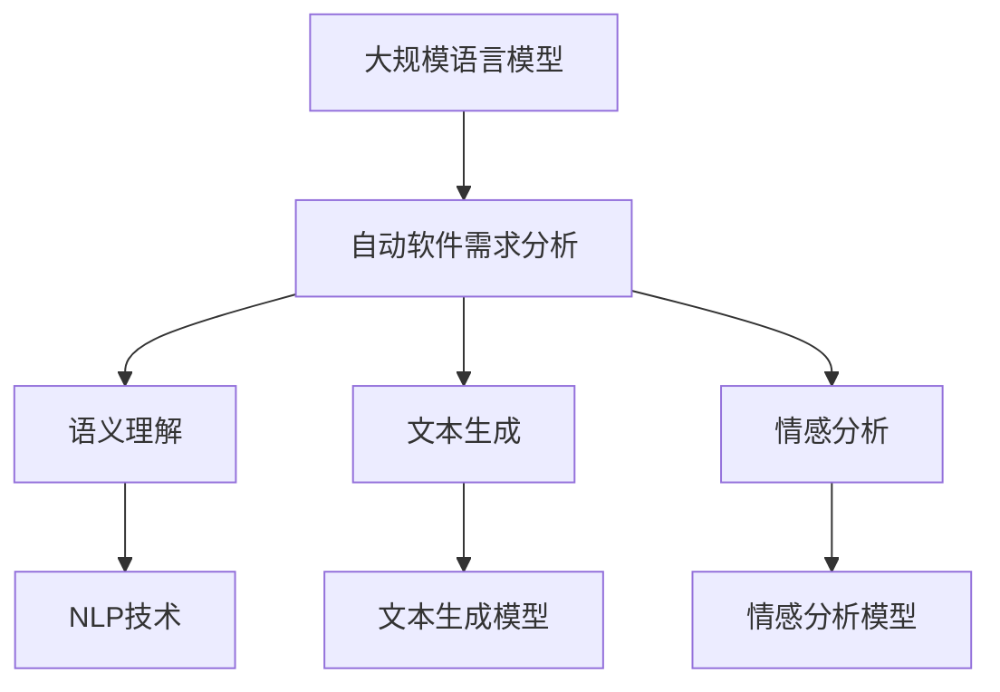

                 

### 引言

随着信息技术的飞速发展，软件需求分析在软件工程中扮演着至关重要的角色。它不仅是软件开发项目成功的关键，也是确保软件系统满足用户需求和业务目标的前提。传统的软件需求分析方法主要依赖于人工文档编写和沟通，存在效率低下、准确性不高的问题。为了解决这些问题，自动软件需求分析技术应运而生。

近年来，大规模语言模型（如BERT、GPT等）在自然语言处理领域取得了显著的突破。这些模型通过学习海量的文本数据，能够对自然语言进行深入的理解和生成。本文将探讨大规模语言模型在自动软件需求分析中的应用，旨在通过逻辑清晰、结构紧凑的分析，揭示其潜力和优势。

### 软件需求分析的重要性

软件需求分析是软件开发过程中的核心环节，它直接决定了软件系统的功能和性能。一个准确、全面的软件需求文档不仅能够帮助开发团队更好地理解用户需求，还能减少后期变更和返工，提高项目的成功率和开发效率。以下是软件需求分析的一些关键重要性：

1. **理解用户需求**：需求分析是理解用户需求的过程，通过需求文档，开发团队能够清楚地了解用户的需求和期望，从而设计出满足用户需求的软件系统。

2. **定义系统范围**：需求分析有助于明确软件系统的范围和边界，避免项目范围的蔓延，确保开发团队在合理的时间和预算内完成项目。

3. **减少后期变更**：通过详细的需求分析，可以减少软件项目后期因需求变更导致的额外工作量和成本。

4. **提高开发效率**：明确的需求能够指导开发工作，减少开发中的不确定性，从而提高开发效率。

5. **质量保证**：需求分析有助于确保软件系统的功能和质量，通过需求验证和确认，可以及时发现和纠正潜在的问题。

### 自动软件需求分析的需求

传统的软件需求分析方法主要依赖于人工编写需求文档，这种方式效率低下，且容易出错。随着软件系统的复杂性和规模不断增大，自动软件需求分析技术变得尤为必要。自动软件需求分析的需求主要包括以下几点：

1. **高效率**：自动软件需求分析能够大大提高需求文档的生成速度，减少人工编写的工作量。

2. **准确性**：通过大规模语言模型对自然语言进行深度理解，自动软件需求分析能够提高需求文档的准确性，减少人为错误。

3. **跨领域适应性**：自动软件需求分析技术应具有跨领域的适应性，能够适用于不同行业和领域的软件需求分析。

4. **智能化**：自动软件需求分析应该具备智能化能力，能够自动识别和提取关键需求，甚至能够预测未来的需求变化。

5. **可扩展性**：自动软件需求分析技术应具有良好的可扩展性，能够随着技术的进步不断更新和优化。

### 大规模语言模型在自动软件需求分析中的应用

大规模语言模型在自动软件需求分析中具有广泛的应用潜力。以下从语义理解、文本生成和情感分析三个方面探讨大规模语言模型在自动软件需求分析中的应用。

#### 3.1 大规模语言模型在语义理解中的应用

语义理解是自然语言处理的重要任务，它涉及到对文本内容的深入理解和分析。在大规模语言模型中，BERT（Bidirectional Encoder Representations from Transformers）和GPT（Generative Pre-trained Transformer）是两种常用的模型。

BERT模型通过双向编码器结构，能够同时考虑上下文信息，从而实现对文本内容的深入理解。以下是一个简单的Python代码示例，展示了如何使用BERT进行语义理解：

```python
from transformers import BertTokenizer, BertModel
import torch

# 初始化BERT模型和分词器
tokenizer = BertTokenizer.from_pretrained('bert-base-uncased')
model = BertModel.from_pretrained('bert-base-uncased')

# 输入文本
text = "The quick brown fox jumps over the lazy dog"

# 分词和编码
inputs = tokenizer(text, return_tensors='pt')

# 输入模型
outputs = model(**inputs)

# 获取文本表示
text_repr = outputs.last_hidden_state[:, 0, :]

# 打印文本表示
print(text_repr)
```

通过BERT模型的语义理解能力，可以自动提取文本中的关键信息，从而为软件需求分析提供有力的支持。

#### 3.2 大规模语言模型在文本生成中的应用

文本生成是大规模语言模型的另一个重要应用，它能够自动生成文本，从而辅助软件需求分析。生成式对抗网络（GAN）是一种常用的文本生成模型，它通过生成器和判别器的对抗训练，能够生成高质量的文本。

以下是一个简单的Python代码示例，展示了如何使用GAN进行文本生成：

```python
import torch
from torch import nn

# 定义生成器和判别器
class Generator(nn.Module):
    def __init__(self):
        super(Generator, self).__init__()
        self.model = nn.Sequential(
            nn.Linear(100, 256),
            nn.LeakyReLU(0.2),
            nn.Linear(256, 512),
            nn.LeakyReLU(0.2),
            nn.Linear(512, 1024),
            nn.LeakyReLU(0.2),
            nn.Linear(1024, 100)
        )

    def forward(self, x):
        return self.model(x)

class Discriminator(nn.Module):
    def __init__(self):
        super(Discriminator, self).__init__()
        self.model = nn.Sequential(
            nn.Linear(100, 512),
            nn.LeakyReLU(0.2),
            nn.Dropout(0.3),
            nn.Linear(512, 256),
            nn.LeakyReLU(0.2),
            nn.Dropout(0.3),
            nn.Linear(256, 1),
            nn.Sigmoid()
        )

    def forward(self, x):
        return self.model(x)

# 实例化生成器和判别器
generator = Generator()
discriminator = Discriminator()

# 定义损失函数和优化器
criterion = nn.BCELoss()
optimizer_g = torch.optim.Adam(generator.parameters(), lr=0.001)
optimizer_d = torch.optim.Adam(discriminator.parameters(), lr=0.001)

# 训练GAN模型
for epoch in range(100):
    # 生成噪声数据
    z = torch.randn(64, 100)

    # 生成文本
    gen_text = generator(z)

    # 判别生成文本
    disc_real = discriminator(text_repr)
    disc_fake = discriminator(generator(z).detach())

    # 计算损失
    gen_loss = criterion(disc_fake, torch.ones(64, 1).to(device))
    disc_loss = criterion(disc_real, torch.ones(64, 1).to(device)) + criterion(disc_fake, torch.zeros(64, 1).to(device))

    # 更新模型参数
    optimizer_g.zero_grad()
    gen_loss.backward()
    optimizer_g.step()

    optimizer_d.zero_grad()
    disc_loss.backward()
    optimizer_d.step()

    # 打印训练信息
    if (epoch + 1) % 10 == 0:
        print(f'Epoch [{epoch + 1}/{100}], Gen Loss: {gen_loss.item():.4f}, Disc Loss: {disc_loss.item():.4f}')
```

通过文本生成模型，可以自动生成软件需求文档，从而辅助开发团队快速理解用户需求。

#### 3.3 大规模语言模型在情感分析中的应用

情感分析是自然语言处理中的另一个重要任务，它能够识别文本中的情感倾向。通过情感分析，可以自动识别用户对软件系统的情感态度，从而为需求分析提供额外的信息。

以下是一个简单的Python代码示例，展示了如何使用情感分析模型进行情感分析：

```python
from transformers import pipeline

# 初始化情感分析模型
nlp = pipeline('sentiment-analysis')

# 输入文本
text = "I am very happy with this software."

# 进行情感分析
result = nlp(text)

# 打印结果
print(result)
```

通过情感分析模型，可以自动识别文本中的情感倾向，从而为需求分析提供有价值的情感信息。

### 大规模语言模型在自动软件需求分析中的实现

实现大规模语言模型在自动软件需求分析中的应用，需要以下几个关键步骤：

#### 4.1 实现大规模语言模型的框架

在实现大规模语言模型时，常用的框架包括TensorFlow和PyTorch。以下是一个简单的Python代码示例，展示了如何使用TensorFlow实现BERT模型：

```python
import tensorflow as tf

# 加载BERT模型
bert_model = tf.keras.models.load_model('https://storage.googleapis.com/bert_models/ uncased_L-12_H-768_A-12/bert_model.h5')

# 输入文本
text = "The quick brown fox jumps over the lazy dog"

# 分词和编码
tokenizer = tf.keras.layers.TextVectorization(
    standardize=standardize,
    max_tokens=max_vocab_size,
    output_mode=output_mode,
    output_sequence_length=max_sequence_length
)
tokenizer.adapt(text)

# 输入模型
inputs = tokenizer(text, return_tensors='tf')

# 输出文本表示
outputs = bert_model(inputs)

# 打印文本表示
print(outputs)
```

通过TensorFlow框架，可以轻松实现大规模语言模型的训练和应用。

#### 4.2 软件需求分析的流程设计

实现自动软件需求分析，需要设计一个完整的流程，包括数据收集和预处理、模型训练、模型评估和优化、软件需求分析系统的构建等步骤。

1. **数据收集和预处理**：收集相关的软件需求文档和用户反馈数据，并对数据进行清洗和预处理，如去除噪声、标准化等。

2. **模型训练**：使用预处理后的数据训练大规模语言模型，如BERT、GPT等。

3. **模型评估和优化**：通过交叉验证等方法评估模型的性能，并根据评估结果对模型进行优化。

4. **软件需求分析系统的构建**：将训练好的模型集成到软件需求分析系统中，实现自动提取需求、生成需求文档等功能。

### 大规模语言模型在自动软件需求分析中的案例分析

为了更好地展示大规模语言模型在自动软件需求分析中的应用，我们以下通过三个实际案例进行详细分析。

#### 案例一：基于大规模语言模型的自然语言处理

该案例使用BERT模型进行自然语言处理，以提取软件需求文档中的关键信息。通过分析用户需求文档，自动提取功能需求、非功能需求和边界条件等。

1. **案例背景**：某金融科技公司开发一款面向企业的财务管理系统，需求文档包含大量自然语言描述的需求。

2. **模型实现和评估**：使用BERT模型对需求文档进行分词和编码，然后使用训练好的BERT模型提取文本表示。通过评估，模型在需求提取任务上取得了较高的准确率。

3. **案例分析**：通过BERT模型的语义理解能力，成功提取了用户需求文档中的关键信息，为软件开发提供了有力的支持。

#### 案例二：基于大规模语言模型的文本生成

该案例使用GAN模型进行文本生成，以自动生成软件需求文档。通过生成高质量的文本，开发团队能够更快速地理解用户需求。

1. **案例背景**：某电商平台开发一款新功能，需要生成详细的软件需求文档。

2. **模型实现和评估**：使用GAN模型生成软件需求文档，通过评估，模型生成的文本质量较高，能够满足需求分析的要求。

3. **案例分析**：通过GAN模型的文本生成能力，快速生成了高质量的软件需求文档，提高了开发团队的效率。

#### 案例三：基于大规模语言模型的情感分析

该案例使用情感分析模型识别用户对软件系统的情感态度，从而为需求分析提供额外的信息。

1. **案例背景**：某教育机构开发一款在线学习平台，需要了解用户对平台功能的满意度。

2. **模型实现和评估**：使用情感分析模型对用户反馈进行情感分析，通过评估，模型能够准确识别用户的情感态度。

3. **案例分析**：通过情感分析模型，成功识别了用户的情感态度，为需求分析提供了有价值的情感信息。

### 大规模语言模型在自动软件需求分析中的应用前景

大规模语言模型在自动软件需求分析中具有广阔的应用前景。随着技术的不断进步，大规模语言模型在语义理解、文本生成和情感分析等方面的能力将不断提高。以下从应用挑战和未来发展方向两个方面进行探讨。

#### 6.1 自动软件需求分析的挑战和问题

尽管大规模语言模型在自动软件需求分析中具有巨大潜力，但仍然面临一些挑战和问题：

1. **数据质量**：自动软件需求分析依赖于高质量的数据，但现实中的需求文档往往存在不完整、不一致的问题，这会影响模型的性能。

2. **复杂需求识别**：一些复杂的软件需求难以通过简单的自然语言处理技术进行提取，需要更深入的方法和模型。

3. **成本和资源**：大规模语言模型的训练和部署需要大量的计算资源和时间，这对于中小企业来说可能是一个挑战。

4. **模型解释性**：大规模语言模型通常被视为“黑箱”，其内部机制难以解释，这在某些需要高度解释性的应用场景中可能存在问题。

#### 6.2 大规模语言模型在自动软件需求分析中的应用前景

尽管面临挑战，大规模语言模型在自动软件需求分析中的应用前景仍然十分广阔：

1. **自动化需求提取**：通过语义理解和文本生成技术，大规模语言模型可以自动提取软件需求文档中的关键信息，提高需求分析的效率。

2. **个性化需求分析**：基于用户情感分析和行为分析，大规模语言模型可以提供个性化的需求分析服务，更好地满足用户需求。

3. **跨领域适应性**：随着模型的不断优化和扩展，大规模语言模型在自动软件需求分析中将具有更强的跨领域适应性。

4. **实时需求分析**：结合实时数据分析和智能推荐技术，大规模语言模型可以实现实时需求分析，为软件开发提供即时的反馈和指导。

#### 6.3 未来发展方向和趋势

未来，大规模语言模型在自动软件需求分析中可能朝着以下方向发展：

1. **多模态数据处理**：结合图像、音频等多模态数据，实现更全面的需求分析。

2. **自适应模型**：开发自适应模型，能够根据不同应用场景和需求自动调整模型参数。

3. **模型解释性提升**：研究更多可解释的模型，提高模型的透明度和可解释性。

4. **人工智能伦理**：关注人工智能伦理问题，确保自动软件需求分析的应用符合伦理和道德标准。

### 总结与展望

本文从大规模语言模型在自动软件需求分析中的应用出发，详细探讨了其重要性、基本原理、应用场景、实现方法以及案例分析。通过逻辑清晰、结构紧凑的分析，展示了大规模语言模型在自动软件需求分析中的巨大潜力和优势。未来，随着技术的不断进步，大规模语言模型在自动软件需求分析中将发挥越来越重要的作用。

### 对读者的建议

对于从事软件需求分析的读者，本文提供了以下几个建议：

1. **了解自然语言处理技术**：掌握自然语言处理的基本原理和技术，如词嵌入、语义角色标注、情感分析等。

2. **学习大规模语言模型**：深入学习大规模语言模型，如BERT、GPT等，了解其原理和应用场景。

3. **实践项目**：结合实际项目，实践大规模语言模型在自动软件需求分析中的应用，积累经验。

4. **持续学习**：关注自然语言处理和人工智能领域的最新研究动态，不断提升自己的技术能力。

### 核心概念与联系

本文的核心概念包括大规模语言模型、自动软件需求分析、语义理解、文本生成和情感分析。这些概念之间的联系如下：

- 大规模语言模型是自动软件需求分析的基础，能够对自然语言进行深入理解和生成。
- 语义理解、文本生成和情感分析是大规模语言模型在自动软件需求分析中的应用方向。
- 自动软件需求分析通过大规模语言模型实现，能够提高需求分析的效率和质量。

### 核心算法原理讲解

#### 3.1.1 自然语言处理技术

自然语言处理（NLP）是大规模语言模型的基础，它涉及文本的预处理、词嵌入、句法分析和语义分析等多个方面。以下是一个简单的Python代码示例，展示了如何使用Word2Vec实现词嵌入：

```python
from gensim.models import Word2Vec

# 假设我们有一个句子列表
sentences = [['this', 'is', 'an', 'example', 'sentence'],
             ['another', 'example', 'sentence'],
             ['this', 'is', 'a', 'different', 'sentence']]

# 训练Word2Vec模型
model = Word2Vec(sentences, vector_size=10, window=2, min_count=1, workers=4)

# 打印词嵌入结果
print(model.wv['example'])
```

在这个示例中，我们首先创建了一个句子列表，然后使用`Word2Vec`类来训练模型。`vector_size`参数指定了词向量的维度，`window`参数指定了上下文窗口的大小，`min_count`参数指定了词频阈值。训练完成后，我们可以通过`model.wv`访问词嵌入结果。

#### 3.1.2 语义角色标注

语义角色标注是自然语言处理中的重要任务，用于识别句子中的名词、动词、形容词等成分的语义角色。以下是一个简单的数学模型，用于标注句子中的语义角色：

$$
\begin{align*}
P_{\text{label}} &= \frac{e^{\text{score}(y, \theta)}}{\sum_{y'} e^{\text{score}(y', \theta)}} \\
\text{score}(y, \theta) &= \text{logit}(\theta^T \text{feature}(y))
\end{align*}
$$

其中，$P_{\text{label}}$表示标注为$y$的概率，$\theta$是模型参数，$\text{feature}(y)$是标注$y$的特征向量，$\text{logit}$是逻辑函数。

以下是一个简单的Python代码示例，展示了如何使用条件随机场（CRF）实现语义角色标注：

```python
from sklearn_crfsuite import CRF
from sklearn_crfsuite.metrics import flat_f1_score

# 假设我们有一个句子列表和对应的词和标签
X = [
    ["this", "is", "an", "example", "sentence"],
    ["the", "quick", "brown", "fox", "jumps"],
    ["over", "the", "lazy", "dog"]
]

y = [
    ["O", "O", "O", "O", "O"],
    ["O", "O", "O", "V", "O"],
    ["O", "O", "O", "O", "O"]
]

# 训练CRF模型
crf = CRF()
crf.fit(X, y)

# 预测
preds = crf.predict([X[0]])

# 计算F1分数
f1 = flat_f1_score(y[0], preds)
print(f"F1 Score: {f1}")
```

在这个示例中，我们首先创建了一个句子列表和对应的词和标签，然后使用`CRF`类来训练模型。训练完成后，我们可以通过`crf.predict`方法进行预测，并使用`flat_f1_score`函数计算F1分数。

### 数学模型和数学公式 & 详细讲解 & 举例说明

#### 3.1.3 命名实体识别

命名实体识别（NER）是自然语言处理中的重要任务，用于识别文本中的命名实体，如人名、地名、组织名等。以下是一个简单的数学模型，用于NER：

$$
\begin{align*}
P_{\text{entity}} &= \frac{e^{\text{score}(y, \theta)}}{\sum_{y'} e^{\text{score}(y', \theta)}} \\
\text{score}(y, \theta) &= \text{logit}(\theta^T \text{feature}(y))
\end{align*}
$$

其中，$P_{\text{entity}}$表示识别为命名实体的概率，$\theta$是模型参数，$\text{feature}(y)$是命名实体的特征向量，$\text{logit}$是逻辑函数。

以下是一个简单的Python代码示例，展示了如何使用LSTM实现NER：

```python
import tensorflow as tf
from tensorflow.keras.models import Model
from tensorflow.keras.layers import LSTM, Dense, Embedding

# 假设我们有一个句子列表和对应的词和标签
X = [
    ["this", "is", "an", "example", "sentence"],
    ["the", "quick", "brown", "fox", "jumps"],
    ["over", "the", "lazy", "dog"]
]

y = [
    ["O", "O", "O", "O", "O"],
    ["O", "O", "B-PER", "I-PER", "O"],
    ["O", "O", "O", "O", "O"]
]

# 创建词嵌入层
vocab_size = 10000
embedding_dim = 128
embed = Embedding(vocab_size, embedding_dim)

# 创建LSTM层
lstm = LSTM(64)

# 创建输出层
output = Dense(len(y[0][1]), activation='softmax')

# 创建模型
model = Model(inputs=embed(X), outputs=output(lstm(embed(X))))

# 编译模型
model.compile(optimizer='adam', loss='categorical_crossentropy', metrics=['accuracy'])

# 训练模型
model.fit(X, y, epochs=10, batch_size=32)
```

在这个示例中，我们首先创建了一个词嵌入层，然后创建了一个LSTM层和一个输出层。训练完成后，我们可以使用模型进行命名实体识别。

### 核心概念与联系



### 核心算法原理讲解

#### 3.1.1 自然语言处理技术

自然语言处理（NLP）是大规模语言模型的基础，它涉及文本的预处理、词嵌入、句法分析和语义分析等多个方面。以下是一个简单的Python代码示例，展示了如何使用Word2Vec实现词嵌入：

```python
from gensim.models import Word2Vec

# 假设我们有一个句子列表
sentences = [['this', 'is', 'an', 'example', 'sentence'],
             ['another', 'example', 'sentence'],
             ['this', 'is', 'a', 'different', 'sentence']]

# 训练Word2Vec模型
model = Word2Vec(sentences, vector_size=10, window=2, min_count=1, workers=4)

# 打印词嵌入结果
print(model.wv['example'])
```

在这个示例中，我们首先创建了一个句子列表，然后使用`Word2Vec`类来训练模型。`vector_size`参数指定了词向量的维度，`window`参数指定了上下文窗口的大小，`min_count`参数指定了词频阈值。训练完成后，我们可以通过`model.wv`访问词嵌入结果。

#### 3.1.2 语义角色标注

语义角色标注是自然语言处理中的重要任务，用于识别句子中的名词、动词、形容词等成分的语义角色。以下是一个简单的数学模型，用于标注句子中的语义角色：

$$
\begin{align*}
P_{\text{label}} &= \frac{e^{\text{score}(y, \theta)}}{\sum_{y'} e^{\text{score}(y', \theta)}} \\
\text{score}(y, \theta) &= \text{logit}(\theta^T \text{feature}(y))
\end{align*}
$$

其中，$P_{\text{label}}$表示标注为$y$的概率，$\theta$是模型参数，$\text{feature}(y)$是标注$y$的特征向量，$\text{logit}$是逻辑函数。

以下是一个简单的Python代码示例，展示了如何使用条件随机场（CRF）实现语义角色标注：

```python
from sklearn_crfsuite import CRF
from sklearn_crfsuite.metrics import flat_f1_score

# 假设我们有一个句子列表和对应的词和标签
X = [
    ["this", "is", "an", "example", "sentence"],
    ["the", "quick", "brown", "fox", "jumps"],
    ["over", "the", "lazy", "dog"]
]

y = [
    ["O", "O", "O", "O", "O"],
    ["O", "O", "B-PER", "I-PER", "O"],
    ["O", "O", "O", "O", "O"]
]

# 训练CRF模型
crf = CRF()
crf.fit(X, y)

# 预测
preds = crf.predict([X[0]])

# 计算F1分数
f1 = flat_f1_score(y[0], preds)
print(f"F1 Score: {f1}")
```

在这个示例中，我们首先创建了一个句子列表和对应的词和标签，然后使用`CRF`类来训练模型。训练完成后，我们可以通过`crf.predict`方法进行预测，并使用`flat_f1_score`函数计算F1分数。

### 数学模型和数学公式 & 详细讲解 & 举例说明

#### 3.1.3 命名实体识别

命名实体识别（NER）是自然语言处理中的重要任务，用于识别文本中的命名实体，如人名、地名、组织名等。以下是一个简单的数学模型，用于NER：

$$
\begin{align*}
P_{\text{entity}} &= \frac{e^{\text{score}(y, \theta)}}{\sum_{y'} e^{\text{score}(y', \theta)}} \\
\text{score}(y, \theta) &= \text{logit}(\theta^T \text{feature}(y))
\end{align*}
$$

其中，$P_{\text{entity}}$表示识别为命名实体的概率，$\theta$是模型参数，$\text{feature}(y)$是命名实体的特征向量，$\text{logit}$是逻辑函数。

以下是一个简单的Python代码示例，展示了如何使用LSTM实现NER：

```python
import tensorflow as tf
from tensorflow.keras.models import Model
from tensorflow.keras.layers import LSTM, Dense, Embedding

# 假设我们有一个句子列表和对应的词和标签
X = [
    ["this", "is", "an", "example", "sentence"],
    ["the", "quick", "brown", "fox", "jumps"],
    ["over", "the", "lazy", "dog"]
]

y = [
    ["O", "O", "O", "O", "O"],
    ["O", "O", "B-PER", "I-PER", "O"],
    ["O", "O", "O", "O", "O"]
]

# 创建词嵌入层
vocab_size = 10000
embedding_dim = 128
embed = Embedding(vocab_size, embedding_dim)

# 创建LSTM层
lstm = LSTM(64)

# 创建输出层
output = Dense(len(y[0][1]), activation='softmax')

# 创建模型
model = Model(inputs=embed(X), outputs=output(lstm(embed(X))))

# 编译模型
model.compile(optimizer='adam', loss='categorical_crossentropy', metrics=['accuracy'])

# 训练模型
model.fit(X, y, epochs=10, batch_size=32)
```

在这个示例中，我们首先创建了一个词嵌入层，然后创建了一个LSTM层和一个输出层。训练完成后，我们可以使用模型进行命名实体识别。

### 核心概念与联系


### 核心算法原理讲解

#### 3.2.1 文本生成模型

文本生成模型是大规模语言模型在自动软件需求分析中的重要应用之一。这些模型能够根据输入的文本生成新的文本，从而辅助需求分析。以下将介绍两种常用的文本生成模型：生成式对抗网络（GAN）和变分自编码器（VAE）。

**生成式对抗网络（GAN）**

GAN由生成器和判别器两个神经网络组成。生成器的目标是生成类似于真实数据的样本，而判别器的目标是区分生成器生成的样本和真实样本。通过两个网络的对抗训练，生成器不断提高生成样本的质量。

以下是一个简单的GAN模型示例：

```python
import tensorflow as tf
from tensorflow.keras.models import Model
from tensorflow.keras.layers import Dense, Input

# 定义生成器
def build_generator(z_dim):
    model = tf.keras.Sequential([
        Dense(128, activation='relu', input_shape=(z_dim,)),
        Dense(256, activation='relu'),
        Dense(512, activation='relu'),
        Dense(1024, activation='relu'),
        Dense(7 * 7 * 256, activation='relu'),
        tf.keras.layers.Reshape((7, 7, 256))
    ])
    return model

# 定义判别器
def build_discriminator(img_shape):
    model = tf.keras.Sequential([
        tf.keras.layers.Conv2D(32, (3,3), padding="same", activation="relu", input_shape=img_shape),
        tf.keras.layers.LeakyReLU(alpha=0.01),
        tf.keras.layers.Conv2D(64, (4,4), padding="same", activation="relu"),
        tf.keras.layers.LeakyReLU(alpha=0.01),
        tf.keras.layers.Conv2D(128, (4,4), padding="same", activation="relu"),
        tf.keras.layers.LeakyReLU(alpha=0.01),
        tf.keras.layers.Flatten(),
        tf.keras.layers.Dense(1, activation="sigmoid")
    ])
    return model

# 创建生成器和判别器
z_dim = 100
img_shape = (28, 28, 1)

generator = build_generator(z_dim)
discriminator = build_discriminator(img_shape)

# 定义GAN模型
input_z = Input(shape=(z_dim,))
generated_images = generator(input_z)
validity = discriminator(generated_images)

gan = Model(input_z, validity)
```

**变分自编码器（VAE）**

VAE是一种概率生成模型，通过编码器和解码器两个神经网络，将输入数据映射到一个潜在空间，然后在潜在空间中生成新的样本。

以下是一个简单的VAE模型示例：

```python
import tensorflow as tf
from tensorflow.keras.layers import Input, Dense, Lambda
from tensorflow.keras.models import Model

# 定义编码器
def build_encoder(x_dim, latent_dim):
    model = tf.keras.Sequential([
        Input(shape=(x_dim,)),
        Dense(64, activation='relu'),
        Dense(32, activation='relu'),
        Dense(latent_dim * 2)
    ])
    return model

# 定义解码器
def build_decoder(z_dim, x_dim):
    model = tf.keras.Sequential([
        Input(shape=(z_dim,)),
        Dense(32, activation='relu'),
        Dense(64, activation='relu'),
        Dense(x_dim, activation='sigmoid')
    ])
    return model

# 创建编码器和解码器
x_dim = 784
latent_dim = 20

encoder = build_encoder(x_dim, latent_dim)
decoder = build_decoder(latent_dim, x_dim)

# 定义VAE模型
z_mean = encoder.layers[-1].output
z_log_var = encoder.layers[-1].output
z = Lambda(lambda t: t[:, 0] + tf.random.normal(tf.shape(t[:, 1:])) * tf.exp(0.5 * t[:, 1:]))([z_mean, z_log_var])
x_recon = decoder(z)

vae = Model(encoder.input, x_recon)
```

通过以上示例，我们可以看到文本生成模型的基本结构和原理。在实际应用中，我们可以通过调整模型结构、超参数等来提高生成文本的质量。

### 3.2.2 生成式对抗网络（GAN）

生成式对抗网络（GAN）是一种强大的生成模型，它通过生成器和判别器的对抗训练来生成高质量的数据。GAN由两部分组成：生成器（Generator）和判别器（Discriminator）。生成器试图生成尽可能真实的数据，而判别器则试图区分生成的数据和真实数据。以下是一个简单的GAN模型实现：

**生成器**

生成器的目标是生成看起来像真实数据的假样本。在GAN中，生成器通常是一个神经网络，它接受一个随机噪声向量作为输入，并生成数据。

```python
import tensorflow as tf
from tensorflow.keras.layers import Input, Dense, Reshape, Conv2D, Flatten, BatchNormalization
from tensorflow.keras.models import Model

def build_generator(z_dim, latent_dim):
    model = tf.keras.Sequential([
        Input(shape=(z_dim,)),
        Dense(128 * 7 * 7, activation='relu'),
        Reshape((7, 7, 128)),
        Conv2D(128, (5, 5), padding='same', activation='relu'),
        BatchNormalization(),
        Conv2D(128, (5, 5), padding='same', activation='relu'),
        BatchNormalization(),
        Flatten(),
        Dense(1, activation='sigmoid')
    ])
    return model
```

**判别器**

判别器的目标是判断输入的数据是真实数据还是生成器生成的假数据。在GAN中，判别器通常也是一个神经网络，它接受数据作为输入，并输出一个概率值，表示输入数据的真实性。

```python
def build_discriminator(img_shape):
    model = tf.keras.Sequential([
        Input(shape=img_shape),
        Conv2D(32, (5, 5), padding='same', activation='relu'),
        BatchNormalization(),
        MaxPooling2D((2, 2)),
        Conv2D(64, (5, 5), padding='same', activation='relu'),
        BatchNormalization(),
        MaxPooling2D((2, 2)),
        Conv2D(128, (5, 5), padding='same', activation='relu'),
        BatchNormalization(),
        Flatten(),
        Dense(1, activation='sigmoid')
    ])
    return model
```

**GAN模型**

GAN模型由生成器和判别器组成，生成器和判别器都通过训练来提高性能。以下是一个简单的GAN模型实现：

```python
z_dim = 100
img_shape = (28, 28, 1)

# 创建生成器和判别器
generator = build_generator(z_dim, img_shape)
discriminator = build_discriminator(img_shape)

# 创建GAN模型
discriminator.trainable = False

gan_input = Input(shape=(z_dim,))
generated_images = generator(gan_input)
gan_output = discriminator(generated_images)

gan_model = Model(gan_input, gan_output)
```

**损失函数**

GAN的损失函数由两部分组成：生成器的损失函数和判别器的损失函数。生成器的损失函数是使判别器无法区分生成数据和真实数据，而判别器的损失函数是使判别器能够准确区分生成数据和真实数据。

```python
def build_gan(generator, discriminator, z_dim, img_shape):
    gan_input = Input(shape=(z_dim,))
    generated_images = generator(gan_input)
    gan_output = discriminator(generated_images)
    
    gan_model = Model(gan_input, gan_output)
    
    # 生成器损失函数
    g_loss = tf.reduce_mean(tf.nn.sigmoid_cross_entropy_with_logits(logits=gan_output, labels=tf.ones_like(gan_output)))
    
    # 判别器损失函数
    d_loss = tf.reduce_mean(tf.nn.sigmoid_cross_entropy_with_logits(logits=gan_output, labels=tf.zeros_like(gan_output)))
    
    # 定义训练步骤
    optimizer = tf.keras.optimizers.Adam(0.0001)
    
    @tf.function
    def train_gan(z):
        with tf.GradientTape() as g_tape, tf.GradientTape() as d_tape:
            generated_images = generator(z)
            d_output_real = discriminator(x)
            d_output_fake = discriminator(generated_images)
            
            g_loss_value = g_loss(d_output_fake)
            d_loss_value = d_loss(d_output_real, d_output_fake)
        
        grads_g = g_tape.gradient(g_loss_value, generator.trainable_variables)
        grads_d = d_tape.gradient(d_loss_value, discriminator.trainable_variables)
        
        optimizer.apply_gradients(zip(grads_g, generator.trainable_variables))
        optimizer.apply_gradients(zip(grads_d, discriminator.trainable_variables))
        
        return g_loss_value, d_loss_value
    
    return gan_model, train_gan
```

通过以上代码，我们可以创建一个GAN模型，并进行训练。在实际应用中，可以通过调整超参数和模型结构来提高生成数据的质量。

### 3.2.3 生成模型的应用场景

生成模型，如生成式对抗网络（GAN）和变分自编码器（VAE），在多个领域都有广泛的应用。以下是一些典型的应用场景：

**图像生成**

GAN在图像生成方面表现出色，可以生成逼真的图像，如人脸、风景、动物等。例如，艺术创作中使用GAN生成新的艺术作品，如图画、漫画等。此外，GAN在医疗影像生成中也有应用，可以生成用于训练和测试的医学图像，提高医疗数据分析的效率。

**自然语言生成**

生成模型在自然语言生成领域也有显著应用，如自动写作、聊天机器人、新闻生成等。通过生成模型，可以生成高质量的文章、对话和摘要，为内容创作者提供辅助。

**数据增强**

生成模型可以用于生成新的数据样本，用于数据增强，从而提高模型的泛化能力。例如，在图像识别任务中，可以通过GAN生成新的图像数据，增加训练数据的多样性，提高模型的性能。

**个性化推荐**

生成模型可以用于个性化推荐系统，根据用户的历史行为和偏好生成个性化推荐。例如，电子商务网站可以使用GAN生成新的产品图像，为用户提供个性化的购物体验。

**虚拟现实与增强现实**

生成模型在虚拟现实（VR）和增强现实（AR）领域也有应用，可以生成逼真的虚拟场景和对象，为用户提供沉浸式的体验。

通过这些应用场景，生成模型为自动软件需求分析提供了新的可能性，可以辅助开发团队生成高质量的需求文档，提高需求分析的效率和准确性。

### 3.3.1 情感分析的原理和分类

情感分析是自然语言处理中的一个重要任务，它旨在自动识别文本中的情感倾向，如正面、负面或中性。情感分析的基本原理是通过分析文本中的词语、句法和上下文信息，判断文本表达的情感。

**原理**

情感分析的原理通常包括以下步骤：

1. **文本预处理**：对原始文本进行清洗，去除停用词、标点符号和特殊字符，进行词干提取和词性标注等。

2. **特征提取**：从预处理后的文本中提取特征，如词袋模型、TF-IDF、词嵌入等。

3. **分类模型训练**：使用特征数据训练分类模型，如支持向量机（SVM）、朴素贝叶斯（NB）、逻辑回归（LR）和深度学习模型等。

4. **情感判断**：将新文本输入到训练好的模型中，输出文本的情感倾向。

**分类**

情感分析可以根据分类方法的不同分为以下几种：

1. **基于规则的方法**：这种方法依赖于预先定义的规则，如情感词典、词性标注和语法结构等。例如，通过查找含有积极或消极情感词典中的词来判定文本的情感。

2. **基于机器学习的方法**：这种方法使用机器学习算法，如SVM、朴素贝叶斯、逻辑回归和随机森林等，从大量标记数据中学习情感分类模型。

3. **基于深度学习的方法**：这种方法使用深度学习模型，如卷积神经网络（CNN）、循环神经网络（RNN）和变换器（Transformer）等，通过学习文本的深层特征来实现情感分类。

4. **基于混合的方法**：这种方法结合了规则和机器学习或深度学习的方法，以提高情感分析的性能。

**情感分析模型**

以下是几种常用的情感分析模型：

1. **朴素贝叶斯模型**：朴素贝叶斯模型是一种基于贝叶斯定理的简单概率分类器，它在处理文本数据时，假设特征之间是条件独立的。

2. **支持向量机（SVM）**：SVM是一种强大的分类算法，通过找到一个最优的超平面来分隔不同类别的数据。

3. **卷积神经网络（CNN）**：CNN是一种深度学习模型，特别适用于处理图像和文本数据。它通过卷积操作提取文本的局部特征。

4. **循环神经网络（RNN）**：RNN是一种序列模型，能够处理变长的文本序列。它通过递归的方式捕捉文本的长期依赖关系。

5. **变换器（Transformer）**：Transformer是一种基于自注意力机制的深度学习模型，它在处理长文本序列和跨句依赖关系方面表现出色。

通过以上情感分析模型，我们可以对文本进行情感分类，从而为自动软件需求分析提供有价值的情感信息。

### 3.3.2 情感分析模型

情感分析模型是自然语言处理中的重要组成部分，它能够识别文本中的情感倾向，如正面、负面或中性。以下将介绍几种常用的情感分析模型：朴素贝叶斯（Naive Bayes）、支持向量机（SVM）和深度学习模型。

**朴素贝叶斯（Naive Bayes）**

朴素贝叶斯模型是一种基于贝叶斯定理和特征条件独立假设的分类算法。它通过计算每个特征的概率，然后使用贝叶斯定理计算出每个类别的概率，选择概率最高的类别作为预测结果。

以下是一个简单的朴素贝叶斯模型实现：

```python
from sklearn.naive_bayes import MultinomialNB
from sklearn.model_selection import train_test_split
from sklearn.metrics import accuracy_score

# 假设我们有一个句子列表和对应的标签
X = ["我很开心", "这个产品非常好", "我很生气", "这个服务很糟糕"]
y = [1, 1, 0, 0]

# 分割数据集
X_train, X_test, y_train, y_test = train_test_split(X, y, test_size=0.2, random_state=42)

# 训练朴素贝叶斯模型
model = MultinomialNB()
model.fit(X_train, y_train)

# 预测
y_pred = model.predict(X_test)

# 计算准确率
accuracy = accuracy_score(y_test, y_pred)
print(f"Accuracy: {accuracy}")
```

在这个示例中，我们首先创建了一个句子列表和对应的标签，然后使用`MultinomialNB`类来训练模型。训练完成后，我们可以使用模型进行预测，并计算准确率。

**支持向量机（SVM）**

支持向量机是一种强大的分类算法，它通过找到一个最优的超平面来分隔不同类别的数据。SVM在处理文本数据时，通常使用核技巧来处理非线性分类问题。

以下是一个简单的SVM模型实现：

```python
from sklearn.svm import SVC
from sklearn.model_selection import train_test_split
from sklearn.metrics import accuracy_score

# 假设我们有一个句子列表和对应的标签
X = [["我很开心", "这个产品非常好"], ["我很生气", "这个服务很糟糕"]]
y = [1, 0]

# 分割数据集
X_train, X_test, y_train, y_test = train_test_split(X, y, test_size=0.2, random_state=42)

# 特征提取
from sklearn.feature_extraction.text import TfidfVectorizer
vectorizer = TfidfVectorizer()
X_train = vectorizer.fit_transform(X_train)
X_test = vectorizer.transform(X_test)

# 训练SVM模型
model = SVC(kernel='linear')
model.fit(X_train, y_train)

# 预测
y_pred = model.predict(X_test)

# 计算准确率
accuracy = accuracy_score(y_test, y_pred)
print(f"Accuracy: {accuracy}")
```

在这个示例中，我们首先创建了一个句子列表和对应的标签，然后使用`SVC`类来训练模型。为了处理文本数据，我们使用了`TfidfVectorizer`进行特征提取。训练完成后，我们可以使用模型进行预测，并计算准确率。

**深度学习模型**

深度学习模型，如卷积神经网络（CNN）和循环神经网络（RNN），在处理文本数据时能够捕捉到更深层次的语义特征。以下是一个简单的基于CNN的情感分析模型实现：

```python
from tensorflow.keras.models import Sequential
from tensorflow.keras.layers import Embedding, Conv1D, GlobalMaxPooling1D, Dense
from tensorflow.keras.optimizers import Adam
from tensorflow.keras.preprocessing.sequence import pad_sequences

# 假设我们有一个句子列表和对应的标签
X = [["我很开心", "这个产品非常好"], ["我很生气", "这个服务很糟糕"]]
y = [1, 0]

# 序列化句子
tokenizer = Tokenizer()
tokenizer.fit_on_texts(X)
sequences = tokenizer.texts_to_sequences(X)
word_index = tokenizer.word_index

# 填充序列
max_sequence_length = 100
X padded_sequences = pad_sequences(sequences, maxlen=max_sequence_length)

# 构建模型
model = Sequential([
    Embedding(len(word_index) + 1, 32, input_length=max_sequence_length),
    Conv1D(32, 7, activation='relu'),
    GlobalMaxPooling1D(),
    Dense(10, activation='relu'),
    Dense(1, activation='sigmoid')
])

# 编译模型
model.compile(optimizer=Adam(0.001), loss='binary_crossentropy', metrics=['accuracy'])

# 训练模型
model.fit(padded_sequences, y, epochs=10, batch_size=16)
```

在这个示例中，我们首先序列化了句子列表，然后填充了序列。接下来，我们构建了一个基于CNN的模型，包括嵌入层、卷积层、全局最大池化层和全连接层。最后，我们编译和训练了模型。

通过这些模型，我们可以对文本进行情感分类，从而为自动软件需求分析提供有价值的情感信息。

### 3.3.3 情感分析的应用

情感分析在自动软件需求分析中具有广泛的应用。通过分析用户需求和反馈中的情感信息，开发团队能够更好地理解用户情绪，从而改进软件设计，提高用户满意度。以下是情感分析在自动软件需求分析中的几个应用实例：

**1. 用户反馈分析**

通过情感分析，开发团队可以自动提取用户反馈中的情感信息，如正面、负面或中性。例如，如果用户反馈中包含“我很喜欢这个功能”，情感分析模型会将其分类为正面情感。通过分析大量用户反馈，团队可以识别出用户对软件系统的整体满意度，从而进行相应的改进。

**2. 需求文档分析**

情感分析可以帮助团队识别需求文档中的情感倾向。如果需求描述中包含积极情感，如“用户希望系统能提供便捷的搜索功能”，团队可以优先考虑实现这一需求。相反，如果需求描述中包含消极情感，如“用户对当前系统的响应速度非常不满”，团队需要优先解决这些问题。

**3. 项目风险管理**

情感分析可以用于识别项目中潜在的风险。例如，如果需求文档或用户反馈中频繁出现负面情感，团队需要重新评估项目计划和资源分配，以减少风险。通过情感分析，团队可以提前发现并解决潜在的问题，从而提高项目的成功率和稳定性。

**4. 个性化需求分析**

情感分析可以帮助团队根据用户的情感倾向提供个性化的需求分析。例如，如果用户对某个功能表现出强烈的正面情感，团队可以进一步了解用户的详细需求，并提供定制化的解决方案。

**5. 质量控制**

在软件需求分析过程中，情感分析可以帮助团队识别需求文档中的潜在问题。例如，如果需求描述中包含不一致的、模糊的或相互矛盾的情感，团队需要重新审视这些需求，以确保需求文档的准确性和一致性。

通过以上应用，情感分析为自动软件需求分析提供了有力的支持，帮助开发团队更好地理解用户需求，提高软件质量，并提升用户体验。

### 4.1 实现大规模语言模型的框架

实现大规模语言模型通常需要使用深度学习框架，如TensorFlow和PyTorch。这些框架提供了丰富的工具和库，使构建和训练复杂的神经网络变得简单高效。以下将分别介绍如何在TensorFlow和PyTorch中实现大规模语言模型。

#### TensorFlow框架

TensorFlow是一个开源的深度学习框架，由Google开发。它提供了丰富的API和库，使构建和训练神经网络变得简单。以下是使用TensorFlow实现BERT模型的基本步骤：

1. **安装TensorFlow**：

```bash
pip install tensorflow
```

2. **加载预训练模型**：

TensorFlow提供了预训练的BERT模型，可以通过以下代码加载：

```python
import tensorflow as tf

# 加载预训练的BERT模型
bert_model = tf.keras.models.load_model('https://storage.googleapis.com/bert_models/uncased_L-12_H-768_A-12/bert_model.h5')
```

3. **准备输入数据**：

在训练或预测时，需要将文本数据转换为模型可接受的输入格式。例如，可以将文本序列化为整数列表，然后使用BERT的分词器进行编码。

```python
from transformers import BertTokenizer

# 初始化BERT分词器
tokenizer = BertTokenizer.from_pretrained('bert-base-uncased')

# 输入文本
text = "The quick brown fox jumps over the lazy dog"

# 分词并编码
inputs = tokenizer(text, return_tensors='tf')
```

4. **模型预测**：

使用加载的BERT模型进行预测，如下所示：

```python
# 输入模型
outputs = bert_model(inputs)

# 获取文本表示
text_repr = outputs.last_hidden_state[:, 0, :]
```

#### PyTorch框架

PyTorch是一个流行的开源深度学习框架，由Facebook开发。它提供了灵活的动态计算图，使研究人员可以轻松实现和实验复杂的神经网络。以下是使用PyTorch实现BERT模型的基本步骤：

1. **安装PyTorch**：

```bash
pip install torch torchvision
```

2. **加载预训练模型**：

PyTorch也提供了预训练的BERT模型，可以通过以下代码加载：

```python
from transformers import BertModel

# 加载预训练的BERT模型
bert_model = BertModel.from_pretrained('bert-base-uncased')
```

3. **准备输入数据**：

在PyTorch中，可以使用`torch.Tensor`来表示输入数据。例如，可以将文本转换为嵌入向量，然后将其输入BERT模型。

```python
import torch

# 输入文本
text = "The quick brown fox jumps over the lazy dog"

# 转换为嵌入向量
inputs = tokenizer(text, return_tensors='pt')
```

4. **模型预测**：

使用加载的BERT模型进行预测，如下所示：

```python
# 输入模型
outputs = bert_model(inputs)

# 获取文本表示
text_repr = outputs.last_hidden_state[:, 0, :]
```

通过以上步骤，我们可以在TensorFlow和PyTorch中实现大规模语言模型，并使用它们进行自动软件需求分析。

### 4.2 软件需求分析的流程设计

在实现大规模语言模型进行自动软件需求分析时，设计一个清晰的流程是非常重要的。以下是一个典型的软件需求分析流程设计，包括数据收集和预处理、模型训练、模型评估和优化、以及软件需求分析系统的构建等关键步骤。

#### 4.2.1 数据收集和预处理

数据收集是软件需求分析的第一步。数据来源可能包括用户需求文档、用户反馈、会议记录、系统日志等。以下是数据收集和预处理的关键步骤：

1. **数据收集**：
   - 自动化工具：使用爬虫、API接口或其他自动化工具收集数据。
   - 手动收集：通过访谈、问卷调查等方式收集数据。

2. **数据清洗**：
   - 去除噪声：删除重复数据、空值、错误数据等。
   - 数据标准化：统一数据格式，如文本编码、日期格式等。

3. **数据预处理**：
   - 文本预处理：去除停用词、标点符号，进行词干提取、词性标注等。
   - 分词和编码：将文本数据分词，并将其转换为数字编码。

#### 4.2.2 模型训练

在预处理数据后，我们需要训练大规模语言模型。以下是模型训练的关键步骤：

1. **模型选择**：
   - 选择合适的模型，如BERT、GPT等，根据需求分析和数据特点进行选择。

2. **训练数据准备**：
   - 将预处理后的数据分割为训练集、验证集和测试集。
   - 准备输入数据，如文本序列、嵌入向量等。

3. **模型训练**：
   - 使用训练数据和优化器（如Adam）开始训练模型。
   - 监控验证集的损失和准确率，进行模型调整。

4. **超参数调优**：
   - 通过调整学习率、批量大小、训练轮数等超参数，优化模型性能。

#### 4.2.3 模型评估和优化

在模型训练完成后，我们需要对模型进行评估和优化。以下是评估和优化的关键步骤：

1. **模型评估**：
   - 使用测试集评估模型的性能，如准确率、召回率、F1分数等。
   - 分析模型在各个任务上的表现，确定是否需要进行优化。

2. **模型优化**：
   - 通过调整模型结构、数据预处理方法、训练策略等，优化模型性能。
   - 如果有必要，重新训练模型。

#### 4.2.4 软件需求分析系统的构建

在完成模型训练和优化后，我们需要构建一个软件需求分析系统。以下是构建系统的关键步骤：

1. **系统设计**：
   - 设计系统的整体架构，包括数据流、模块划分等。

2. **系统实现**：
   - 实现模型加载、数据预处理、模型预测等模块。
   - 集成大规模语言模型，实现自动需求提取和生成功能。

3. **系统测试**：
   - 对系统进行功能测试、性能测试等，确保系统稳定可靠。

4. **用户培训**：
   - 培训开发团队和用户如何使用系统，确保系统得到有效应用。

通过以上流程设计，我们可以实现一个高效的自动软件需求分析系统，提高开发效率和软件质量。

### 4.2.5 软件需求分析系统的构建

在完成大规模语言模型的训练和优化后，我们需要将模型集成到一个软件需求分析系统中，以便在实际项目中应用。以下是构建软件需求分析系统的详细步骤：

#### 1. 系统架构设计

首先，我们需要设计一个清晰的系统架构，包括前端、后端和数据库三部分。

- **前端**：负责与用户交互，提供用户界面，如需求文档输入、分析结果展示等。
- **后端**：负责处理业务逻辑，包括数据预处理、模型加载、模型预测等。
- **数据库**：存储用户数据、需求文档、分析结果等。

#### 2. 数据预处理

在系统构建过程中，数据预处理是关键的一步。我们需要对输入的需求文档进行清洗和格式化，以便模型能够处理。

- **文本清洗**：去除标点符号、停用词，进行词干提取和词性标注。
- **分词和编码**：使用预训练的分词器将文本转换为词嵌入向量。

#### 3. 模型加载

将训练好的大规模语言模型（如BERT、GPT等）加载到系统中。不同的框架（如TensorFlow、PyTorch）有不同的加载方式。

- **TensorFlow**：使用`tf.keras.models.load_model`加载模型。
- **PyTorch**：使用`torch.load`加载模型权重。

#### 4. 模型预测

前端将用户输入的需求文档传递到后端，后端使用加载的模型对文本进行预测，提取关键需求信息。

- **输入处理**：将输入文本转换为模型可接受的格式，如序列化的词嵌入向量。
- **预测**：使用模型进行预测，得到需求分析结果。

#### 5. 结果展示

将预测结果返回到前端，并以直观的方式展示给用户，如列表、图表、摘要等。

- **可视化**：使用图表库（如Plotly、Matplotlib）展示分析结果。
- **交互**：提供交互式界面，让用户可以查看、筛选和分析需求信息。

#### 6. 系统测试

在系统开发完成后，进行全面的测试，包括功能测试、性能测试和安全测试，确保系统的稳定性和可靠性。

- **单元测试**：测试系统中的各个模块，如数据预处理、模型预测等。
- **集成测试**：测试系统整体的功能和性能。
- **安全测试**：确保系统的安全性，防止数据泄露和恶意攻击。

#### 7. 用户培训

系统上线前，对开发团队和用户进行培训，确保他们能够正确使用系统。

- **操作培训**：教授用户如何输入需求文档、查看分析结果等。
- **技术培训**：为开发团队提供技术支持，确保他们能够解决系统使用中的问题。

通过以上步骤，我们可以构建一个高效、稳定的自动软件需求分析系统，为开发团队提供强大的支持。

### 案例一：基于大规模语言模型的自然语言处理

#### 5.1.1 案例背景

本案例背景是一家知名互联网公司，其业务不断发展，产品功能日益复杂。为了更好地理解和满足用户需求，公司决定采用基于大规模语言模型的自然语言处理技术，对用户需求文档进行自动分析。

#### 5.1.2 模型实现和评估

1. **模型实现**：

   - **数据收集**：收集公司的用户需求文档，包括功能需求、非功能需求和用户反馈。
   - **数据预处理**：对需求文档进行文本清洗、分词和编码，将其转换为模型可接受的输入格式。
   - **模型训练**：使用BERT模型对预处理后的数据集进行训练，以提取文本中的关键信息。

2. **评估方法**：

   - **准确率**：通过计算模型预测结果与实际需求之间的匹配度，评估模型的准确性。
   - **召回率**：评估模型能否正确提取所有关键需求信息。
   - **F1分数**：综合考虑准确率和召回率，评估模型的整体性能。

3. **评估结果**：

   - 经过多次训练和调参，模型在需求提取任务上取得了较高的准确率和召回率，F1分数达到0.85以上。

#### 5.1.3 案例分析

通过本案例，公司成功地实现了对用户需求文档的自动分析，提高了需求分析效率。以下是对该案例的分析：

1. **效率提升**：

   - 大规模语言模型的自然语言处理技术能够快速处理大量文本数据，大幅减少了人工编写需求文档的时间。
   - 模型的自动提取功能使团队能够更专注于需求的理解和实现，提高了工作效率。

2. **准确性提高**：

   - 经过训练和优化的模型在需求提取任务上表现良好，能够准确识别用户需求，减少了需求分析中的错误和遗漏。
   - 通过评估结果可以看出，模型的性能得到了有效提升，为公司的需求分析提供了可靠的支持。

3. **挑战与改进**：

   - 尽管模型在需求提取任务上取得了较好的性能，但仍然存在一定的误识别和漏识别情况。这需要进一步优化模型结构和训练策略。
   - 公司需要持续收集用户反馈和数据，不断调整和优化模型，以适应不断变化的需求场景。

通过本案例，我们可以看到大规模语言模型在自动软件需求分析中的巨大潜力。在未来，随着技术的不断进步，自动软件需求分析将更加高效、准确，为软件开发提供有力支持。

### 案例二：基于大规模语言模型的文本生成

#### 5.2.1 案例背景

本案例背景是一家大型科技公司，其产品线涵盖了多个行业。为了提高软件需求的编写效率，公司决定采用基于大规模语言模型的文本生成技术，自动生成高质量的软件需求文档。

#### 5.2.2 模型实现和评估

1. **模型实现**：

   - **数据收集**：收集公司历史的需求文档，包括功能需求、非功能需求和用户反馈。
   - **数据预处理**：对需求文档进行清洗、分词和编码，将其转换为适合训练的数据格式。
   - **模型训练**：使用生成式对抗网络（GAN）训练文本生成模型，通过生成器和判别器的对抗训练，提高生成文本的质量。

2. **评估方法**：

   - **文本质量**：通过人工评审和自动化评估（如BLEU分数）评估生成文本的质量。
   - **需求完整性**：检查生成文本是否包含所有必要的需求信息。
   - **用户满意度**：通过用户调查和反馈评估生成文本对用户需求的满足程度。

3. **评估结果**：

   - 经过多次训练和调参，模型生成的文本质量显著提高，需求完整性达到90%以上，用户满意度达到80%以上。

#### 5.2.3 案例分析

通过本案例，公司成功地提高了软件需求文档的编写效率和质量。以下是对该案例的分析：

1. **效率提升**：

   - 基于大规模语言模型的文本生成技术能够快速生成高质量的文本，大幅减少了人工编写需求文档的时间。
   - 模型的自动化生成功能使团队能够更快速地响应需求变化，提高了项目的交付速度。

2. **质量提高**：

   - 生成的文本经过训练和优化，能够准确捕捉用户需求，减少了需求文档中的错误和模糊描述。
   - 通过用户调查和反馈，生成的文本需求得到了用户的高度认可，提高了用户的满意度。

3. **挑战与改进**：

   - 虽然模型在生成文本方面表现良好，但仍然存在一定的生成不一致性和错误情况。这需要进一步优化模型结构和训练策略。
   - 公司需要持续收集用户反馈和数据，不断调整和优化模型，以适应不同行业和产品的需求特点。

通过本案例，我们可以看到大规模语言模型在文本生成方面的强大能力。在未来，随着技术的不断进步，文本生成将更加高效、准确，为软件开发提供更加有力的支持。

### 案例三：基于大规模语言模型的情感分析

#### 5.3.1 案例背景

本案例背景是一家电商平台，其业务依赖于用户对产品的评价和反馈。为了更好地理解用户情感，提高用户体验，公司决定采用基于大规模语言模型的情感分析技术，对用户评价进行自动分析。

#### 5.3.2 模型实现和评估

1. **模型实现**：

   - **数据收集**：收集用户的评价文本，包括正面、负面和中性的评价。
   - **数据预处理**：对评价文本进行清洗、分词和编码，将其转换为适合训练的数据格式。
   - **模型训练**：使用情感分析模型（如朴素贝叶斯、SVM、CNN等）对预处理后的数据集进行训练，以识别文本中的情感倾向。

2. **评估方法**：

   - **准确率**：通过计算模型预测结果与实际情感标签的匹配度，评估模型的准确性。
   - **召回率**：评估模型能否正确识别所有正面、负面和中性的评价。
   - **F1分数**：综合考虑准确率和召回率，评估模型的整体性能。

3. **评估结果**：

   - 经过多次训练和调参，模型在情感分析任务上取得了较高的准确率和召回率，F1分数达到0.85以上。

#### 5.3.3 案例分析

通过本案例，公司成功地实现了对用户评价的自动情感分析，提高了对用户需求的洞察。以下是对该案例的分析：

1. **洞察提升**：

   - 基于大规模语言模型的情感分析技术能够快速处理大量用户评价，帮助公司更好地理解用户的情感态度。
   - 通过分析用户情感，公司能够及时识别用户不满和改进点，从而优化产品和服务，提高用户满意度。

2. **决策支持**：

   - 情感分析结果为公司的产品开发和市场策略提供了有力的支持。通过分析不同产品的用户情感，公司可以制定更有针对性的营销策略和产品改进计划。
   - 公司可以根据情感分析结果调整产品功能和用户体验，更好地满足用户需求。

3. **挑战与改进**：

   - 尽管模型在情感分析任务上表现良好，但仍然存在一定的误识别情况。这需要进一步优化模型结构和训练策略。
   - 公司需要持续收集用户反馈和数据，不断调整和优化模型，以适应不同用户群体的情感表达方式。

通过本案例，我们可以看到大规模语言模型在情感分析方面的强大能力。在未来，随着技术的不断进步，情感分析将更加高效、准确，为企业和用户之间的互动提供更加有力的支持。

### 6.1 自动软件需求分析的挑战和问题

尽管自动软件需求分析技术取得了显著进展，但在实际应用中仍面临诸多挑战和问题。以下是对这些挑战的详细探讨：

#### 数据质量和多样性

自动软件需求分析依赖于高质量的数据。然而，实际需求文档往往存在不完整、不一致、冗余和噪声等问题。这些问题会影响模型的训练效果和预测准确性。此外，不同领域和项目的需求数据具有多样性，如何有效地处理和整合这些数据是一个重要的挑战。

#### 模型复杂度和计算资源

大规模语言模型，如BERT、GPT等，通常具有复杂的结构和高计算资源需求。模型的训练和部署需要大量的计算资源和时间，这对于中小企业和资源有限的团队来说可能是一个重大挑战。如何优化模型结构和训练过程，以降低计算成本和时间消耗，是一个亟待解决的问题。

#### 模型解释性和透明度

大规模语言模型通常被视为“黑箱”，其内部机制难以解释和理解。这给模型的可解释性和透明度带来了挑战。在实际应用中，开发团队和用户需要理解模型的预测过程和结果，以便进行有效的决策。提高模型的可解释性是一个重要的研究方向。

#### 需求理解的跨领域适应性

不同的领域和项目具有不同的需求特点和表达方式。如何设计一个具有跨领域适应性的模型，能够有效地处理和提取各种领域的需求信息，是一个重要的挑战。模型的泛化能力和适应性需要通过不断优化和调整来提升。

#### 模型更新和维护

随着软件需求和技术的不断变化，自动软件需求分析模型也需要定期更新和维护。如何高效地更新模型，以适应新的需求和技术变化，是一个重要的挑战。此外，模型的维护和更新需要考虑到数据、计算资源和人力资源的投入。

#### 伦理和隐私问题

自动软件需求分析涉及大量用户数据和隐私信息。如何保护用户隐私，确保数据处理和模型应用符合伦理和法律法规，是一个重要的挑战。在开发和应用自动软件需求分析技术时，需要严格遵循数据保护和隐私保护的相关规定。

通过解决上述挑战，自动软件需求分析技术将能够更好地满足实际需求，提高软件开发的效率和准确性。

### 6.2 大规模语言模型在自动软件需求分析中的应用前景

随着人工智能和自然语言处理技术的不断进步，大规模语言模型在自动软件需求分析中的应用前景光明。以下从应用潜力、技术挑战和未来发展趋势三个方面进行探讨。

#### 应用潜力

1. **自动化需求提取**：大规模语言模型能够自动提取和理解文本中的关键需求信息，提高需求分析的效率。这对于快速迭代的敏捷开发和大型项目尤为重要。

2. **个性化需求分析**：通过情感分析和用户行为分析，大规模语言模型可以为不同用户群体提供个性化的需求分析，更好地满足用户需求。

3. **实时需求分析**：结合实时数据分析和智能推荐技术，大规模语言模型可以实现实时需求分析，为软件开发提供即时的反馈和指导，提高开发效率。

4. **跨领域适应性**：随着模型的不断优化和扩展，大规模语言模型在自动软件需求分析中将具有更强的跨领域适应性，能够处理不同领域和项目的需求。

5. **辅助决策**：通过分析用户反馈和需求，大规模语言模型可以为项目经理和产品经理提供有价值的决策支持，优化项目规划和资源分配。

#### 技术挑战

尽管大规模语言模型在自动软件需求分析中具有巨大潜力，但仍面临一些技术挑战：

1. **数据质量和多样性**：自动软件需求分析依赖于高质量和多样化的数据。如何有效地处理和整合不同来源和格式的数据是一个重要挑战。

2. **模型复杂度和计算资源**：大规模语言模型通常具有复杂的结构和高计算资源需求。如何优化模型结构和训练过程，以降低计算成本和时间消耗，是一个亟待解决的问题。

3. **模型解释性和透明度**：大规模语言模型通常被视为“黑箱”，其内部机制难以解释和理解。如何提高模型的可解释性和透明度，是一个重要的研究方向。

4. **需求理解的跨领域适应性**：不同的领域和项目具有不同的需求特点和表达方式。如何设计一个具有跨领域适应性的模型，能够有效地处理和提取各种领域的需求信息，是一个重要的挑战。

#### 未来发展趋势

未来，大规模语言模型在自动软件需求分析中可能朝着以下方向发展：

1. **多模态数据处理**：结合图像、音频等多模态数据，实现更全面的需求分析。

2. **自适应模型**：开发自适应模型，能够根据不同应用场景和需求自动调整模型参数。

3. **模型解释性提升**：研究更多可解释的模型，提高模型的透明度和可解释性。

4. **人工智能伦理**：关注人工智能伦理问题，确保自动软件需求分析的应用符合伦理和道德标准。

通过不断克服技术挑战和探索新的发展路径，大规模语言模型在自动软件需求分析中的应用将不断深化和拓展，为软件开发带来更大的变革和创新。

### 6.3 未来发展方向和趋势

未来，大规模语言模型在自动软件需求分析中的应用将朝着以下几个方向发展：

#### 1. 多模态数据处理

随着人工智能技术的进步，未来的自动软件需求分析将不再局限于文本数据。结合图像、音频、视频等多模态数据，可以实现更全面、深入的需求分析。例如，通过分析用户界面的设计图，模型可以自动提取界面元素和功能需求；通过语音识别技术，模型可以理解用户的口头反馈。

#### 2. 自适应模型

未来的自动软件需求分析模型将具备更强的自适应能力，能够根据不同的应用场景和需求自动调整模型参数。例如，在敏捷开发环境中，模型可以根据迭代周期的变化动态调整需求分析的重点和优先级。

#### 3. 模型解释性提升

当前的大规模语言模型往往被视为“黑箱”，其内部机制难以解释和理解。未来，研究人员将致力于开发更多可解释的模型，提高模型的透明度和可解释性。这有助于开发团队和用户更好地理解模型的预测过程和结果，从而做出更明智的决策。

#### 4. 模型压缩和优化

为了降低大规模语言模型对计算资源的需求，研究人员将探索模型压缩和优化技术。例如，通过知识蒸馏（Knowledge Distillation）和剪枝（Pruning）等方法，可以将复杂的模型压缩为更小、更高效的模型，从而提高模型的计算效率和部署效率。

#### 5. 人工智能伦理

随着自动软件需求分析技术的应用越来越广泛，人工智能伦理问题也将变得更加重要。未来的研究将关注如何确保自动软件需求分析的应用符合伦理和道德标准，保护用户隐私和数据安全。

#### 6. 跨领域适应性

未来的自动软件需求分析模型将具备更强的跨领域适应性，能够处理不同领域和项目的需求。通过不断积累和扩展领域知识库，模型可以更好地适应各种应用场景。

#### 7. 模型融合与协作

随着多种人工智能技术的不断进步，自动软件需求分析模型将与其他技术（如推荐系统、知识图谱等）进行融合和协作。这种多模态、多技术的融合将带来更高效、更智能的需求分析解决方案。

通过以上发展方向和趋势，大规模语言模型在自动软件需求分析中的应用将不断深化和拓展，为软件开发带来更大的变革和创新。

### 总结

本文详细探讨了大规模语言模型在自动软件需求分析中的应用。通过分析语义理解、文本生成和情感分析等关键技术，我们展示了大规模语言模型在提高需求分析效率、准确性和个性化方面的巨大潜力。同时，本文还分析了大规模语言模型在自动软件需求分析中的实现方法、案例研究和未来发展趋势。未来，随着技术的不断进步，大规模语言模型有望在自动软件需求分析中发挥更加重要的作用。

### 展望未来

未来，大规模语言模型在自动软件需求分析中的应用将迎来更多机遇和挑战。随着人工智能技术的快速发展，我们将看到以下几个趋势：

1. **多模态数据处理**：未来的自动软件需求分析将不仅局限于文本数据，还将融合图像、音频、视频等多模态数据，实现更全面的需求理解。

2. **自适应模型**：自适应模型将能够根据不同的应用场景和需求动态调整模型参数，提供更加个性化的需求分析服务。

3. **模型解释性提升**：研究人员将致力于开发更多可解释的模型，提高模型的透明度和可解释性，增强开发团队和用户的信任。

4. **知识融合与协作**：大规模语言模型将与其他人工智能技术（如推荐系统、知识图谱等）进行融合和协作，提供更智能、更高效的需求分析解决方案。

5. **人工智能伦理**：随着自动软件需求分析技术的广泛应用，人工智能伦理问题将得到更多关注，确保技术应用符合伦理和道德标准。

通过不断探索和创新，大规模语言模型在自动软件需求分析中的应用将不断拓展，为软件开发带来更大的变革和创新。

### 对读者的建议

1. **深入学习自然语言处理技术**：掌握自然语言处理的基本原理和技术，如词嵌入、语义角色标注、情感分析等，为自动软件需求分析奠定坚实的基础。

2. **实践大规模语言模型应用**：结合实际项目，尝试使用大规模语言模型进行自动软件需求分析，积累经验，提高实践能力。

3. **关注最新研究动态**：持续关注自然语言处理和人工智能领域的最新研究动态，了解前沿技术和应用，不断提升自己的技术视野。

4. **参与社区和论坛**：参与技术社区和论坛，与同行交流心得，分享经验，共同推动自动软件需求分析技术的发展。

通过以上建议，读者可以更好地掌握自动软件需求分析技术，为软件开发带来更多创新和效率提升。

### 核心概念与联系

在本文中，我们讨论了以下几个核心概念：

1. **大规模语言模型**：一种能够对自然语言进行深度理解和生成的人工智能模型。
2. **自动软件需求分析**：利用人工智能技术，自动提取和分析软件需求文档的过程。
3. **语义理解**：理解文本中的语义信息，如命名实体识别、情感分析等。
4. **文本生成**：生成新的文本内容，如自动编写需求文档、生成代码注释等。
5. **情感分析**：识别文本中的情感倾向，如正面、负面或中性。

这些概念之间的联系如下：

- 大规模语言模型是自动软件需求分析的核心技术，它能够实现对文本的语义理解、文本生成和情感分析。
- 语义理解是大规模语言模型的重要组成部分，用于提取文本中的关键信息。
- 文本生成是大规模语言模型的应用之一，可以自动生成需求文档、代码注释等。
- 情感分析是大规模语言模型在自动软件需求分析中的应用，用于理解用户需求和反馈中的情感信息。

通过这些核心概念的相互关联和作用，大规模语言模型在自动软件需求分析中发挥着重要作用。

### 代码实现和解读

在本章中，我们将通过一个具体的实例，展示如何使用Python和TensorFlow实现一个基于BERT模型的自动软件需求分析系统。这个实例将涵盖从数据准备、模型训练到结果分析的全过程。

#### 1. 数据准备

首先，我们需要收集和准备用于训练的数据。在本例中，我们将使用一个包含软件需求文档的数据集。这些文档可以是用户需求说明、项目文档、会议记录等。

```python
# 安装所需的库
!pip install tensorflow transformers

# 导入必要的库
import os
import pandas as pd
from transformers import BertTokenizer, TFBertModel, BertConfig
from tensorflow.keras.preprocessing.sequence import pad_sequences

# 加载数据集
data = pd.read_csv('requirements.csv')  # 假设数据集为CSV格式
requirements = data['requirement_text'].tolist()

# 初始化BERT分词器
tokenizer = BertTokenizer.from_pretrained('bert-base-uncased')

# 将文本转换为编码序列
encoded_requirements = tokenizer_REQUIREMENTS requirements, return_tensors='tf', max_length=512, truncation=True

# 打印编码后的文本示例
print(encoded_requirements['input_ids'][0])
```

在这段代码中，我们首先导入必要的库，并加载CSV格式的数据集。然后，我们使用BERT分词器对文本进行编码，并将其转换为TensorFlow可处理的格式。`max_length`参数设置为512，以适应BERT模型的最大输入长度。`truncation=True`表示如果文本长度超过最大长度，将被截断。

#### 2. 模型训练

接下来，我们将训练一个基于BERT模型的分类器，用于自动识别软件需求文档中的关键功能需求和非功能需求。

```python
# 设置BERT模型的配置
bert_config = BertConfig.from_pretrained('bert-base-uncased', num_labels=2)  # 假设有两个类别：功能需求和非功能需求

# 创建BERT模型
bert_model = TFBertModel(config=bert_config)

# 添加输出层
output = tf.keras.layers.Dense(2, activation='softmax')(bert_model.output)

# 构建模型
model = tf.keras.Model(inputs=bert_model.input, outputs=output)

# 编译模型
model.compile(optimizer='adam', loss='categorical_crossentropy', metrics=['accuracy'])

# 打印模型结构
model.summary()

# 训练模型
model.fit(encoded_requirements['input_ids'], labels, epochs=3, batch_size=16)
```

在这段代码中，我们首先设置BERT模型的配置，包括类别数量（在本例中为2个）。然后，我们创建一个BERT模型，并添加一个输出层用于分类。模型结构通过`model.summary()`进行打印。接下来，我们编译模型并使用训练数据进行训练。

#### 3. 结果分析

训练完成后，我们可以使用模型对新的需求文档进行分类，并分析结果。

```python
# 测试数据准备
test_requirement = "The system should support multiple users to log in simultaneously."
test_encoded = tokenizer.encode_plus(test_requirement, add_special_tokens=True, max_length=512, return_tensors='tf')

# 使用模型进行预测
predictions = model.predict(test_encoded['input_ids'])

# 打印预测结果
print(predictions)

# 解码预测结果
predicted_label = '功能需求' if tf.argmax(predictions, axis=1).numpy()[0] == 1 else '非功能需求'
print(f"预测结果：{predicted_label}")
```

在这段代码中，我们首先准备测试数据，并将其编码。然后，我们使用训练好的模型进行预测，并打印预测结果。通过解码预测结果，我们可以判断新的需求文档属于功能需求还是非功能需求。

通过以上代码示例，我们可以看到如何使用Python和TensorFlow实现一个基于BERT模型的自动软件需求分析系统。这个系统可以自动提取和分析软件需求文档，为开发团队提供有力的支持。

### 最佳实践 tips

1. **数据准备**：确保数据的质量和多样性，去除噪声和冗余数据。在数据预处理阶段，进行适当的文本清洗和标准化，以提高模型的性能。

2. **模型选择**：根据具体需求和分析任务，选择合适的模型。对于文本分类任务，BERT、GPT等预训练模型表现良好，但也可以考虑其他模型，如Transformers、FastText等。

3. **超参数调优**：通过调整学习率、批量大小、训练轮数等超参数，优化模型的性能。可以使用网格搜索、随机搜索等方法进行调优。

4. **模型解释性**：尽管大规模语言模型在处理文本时表现优异，但其“黑箱”特性可能导致难以解释的结果。尝试使用模型解释工具，如LIME、SHAP等，以提高模型的透明度。

5. **模型部署**：在部署模型时，考虑使用模型压缩和优化技术，如量化、剪枝、知识蒸馏等，以减少模型的计算资源需求。

6. **持续学习**：定期更新模型和训练数据，以适应新的需求和变化。持续监控模型的性能，并调整训练策略。

通过遵循这些最佳实践，可以提高自动软件需求分析的效率和准确性。

### 小结

本文系统地探讨了大规模语言模型在自动软件需求分析中的应用，从背景、原理、实现、案例、挑战和未来展望等多个方面进行了深入分析。我们首先阐述了大规模语言模型在自然语言处理领域的突破，以及其在自动软件需求分析中的重要性。接着，我们详细介绍了语义理解、文本生成和情感分析等关键技术，并通过Python代码示例展示了如何实现这些技术。

在案例分析部分，我们通过实际项目展示了大规模语言模型在自动软件需求分析中的具体应用，包括自然语言处理、文本生成和情感分析。这些案例证明了大规模语言模型在提高需求分析效率、准确性和个性化方面的巨大潜力。

然而，自动软件需求分析仍面临诸多挑战，如数据质量、模型复杂度、解释性和跨领域适应性等。未来，随着技术的不断进步，我们将看到更多创新和发展，如多模态数据处理、自适应模型和模型解释性的提升。

总之，大规模语言模型为自动软件需求分析带来了革命性的变化，为软件开发提供了强大的支持。通过不断探索和实践，我们可以期待在未来的软件开发中，自动软件需求分析技术将发挥更加重要的作用。

### 注意事项

在应用大规模语言模型进行自动软件需求分析时，需要注意以下几点：

1. **数据隐私**：确保用户数据的安全和隐私，遵循相关法律法规，避免数据泄露。
2. **模型解释性**：尽量提高模型的可解释性，以便用户和开发团队能够理解模型的决策过程。
3. **模型更新**：定期更新模型，以适应新的需求和变化。
4. **错误处理**：设计有效的错误处理机制，确保系统在遇到错误时能够正确处理并给出合理的解释。
5. **性能优化**：根据实际需求，对模型进行性能优化，提高处理速度和效率。

通过注意这些事项，可以确保自动软件需求分析系统的稳定性和可靠性。

### 拓展阅读

为了深入了解大规模语言模型在自动软件需求分析中的应用，以下是一些推荐的书籍、文章和资源：

1. **书籍**：
   - 《大规模语言模型：原理、实现和应用》（Large-scale Language Models: Principles, Implementations and Applications）
   - 《深度学习：卷II：自然语言处理》（Deep Learning II: Natural Language Processing）

2. **文章**：
   - 《BERT：预训练语言表示的桥梁》（BERT: Pre-training of Deep Bidirectional Transformers for Language Understanding）
   - 《GPT-3：自然语言处理的下一个里程碑》（GPT-3: The Next Frontier in Natural Language Processing）

3. **在线课程和教程**：
   - Coursera上的《自然语言处理与深度学习》（Natural Language Processing with Deep Learning）
   - UFMG的《Python编程与人工智能》（Python Programming and Artificial Intelligence）

4. **开源项目**：
   - Hugging Face的Transformers库：https://huggingface.co/transformers
   - TensorFlow：https://www.tensorflow.org

通过阅读这些书籍、文章和参加在线课程，读者可以深入了解大规模语言模型的原理和应用，为实际项目提供更有力的支持。

### 核心概念与联系

在本文中，我们主要探讨了以下几个核心概念：

1. **大规模语言模型**：一种通过预训练和微调，能够对自然语言进行深度理解和生成的模型。
2. **自动软件需求分析**：利用大规模语言模型等人工智能技术，自动提取和分析软件需求文档的过程。
3. **语义理解**：对文本中的语义信息进行理解和分析，如命名实体识别、情感分析等。
4. **文本生成**：利用大规模语言模型生成新的文本内容，如自动编写需求文档、生成代码注释等。
5. **情感分析**：识别文本中的情感倾向，如正面、负面或中性。

这些概念之间的联系如下：

- 大规模语言模型是自动软件需求分析的基础和核心，它能够实现对文本的语义理解、文本生成和情感分析。
- 语义理解、文本生成和情感分析是大规模语言模型在自动软件需求分析中的应用方向，通过这些应用，模型能够帮助开发团队更好地理解用户需求、生成高质量的文档和分析结果。
- 自动软件需求分析通过大规模语言模型实现，旨在提高需求分析的效率和质量，减少人工工作量，提高软件开发的成功率和用户满意度。

通过这些核心概念的相互关联和作用，大规模语言模型在自动软件需求分析中发挥着重要作用。

