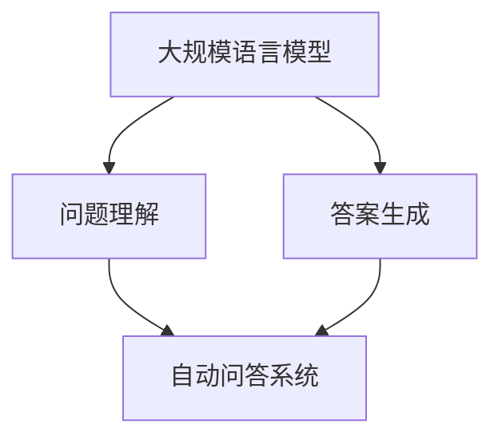

                 

# 《大规模语言模型在自动问答系统中的应用》

## 关键词
- 大规模语言模型
- 自动问答系统
- 注意力机制
- 变换器网络
- 深度学习
- 自然语言处理

## 摘要
本文深入探讨了大规模语言模型在自动问答系统中的应用。首先，我们定义了大规模语言模型和自动问答系统的基本概念，并阐述了它们之间的关系。接着，我们介绍了大规模语言模型的工作原理，包括注意力机制和变换器网络。随后，我们通过数学模型和公式详细阐述了大规模语言模型的数学理论基础。在项目实战部分，我们提供了实际案例，展示如何在大规模语言模型的基础上构建自动问答系统，并提供了Python代码示例。最后，我们对本文的主要内容进行了总结，并展望了大规模语言模型在自动问答系统中的未来应用。

## 引言

随着互联网和人工智能技术的飞速发展，自动问答系统（Automated Question Answering, QA）已成为信息检索和知识管理的重要工具。自动问答系统的核心任务是理解用户提出的问题，并生成相关、准确、自然的答案。近年来，大规模语言模型（Large-scale Language Models）如GPT、BERT、T5等取得了显著的进展，为自动问答系统提供了强大的技术支持。

大规模语言模型是自然语言处理（Natural Language Processing, NLP）领域的重要研究方向，其核心思想是通过大规模语料库的学习，构建能够理解和生成自然语言的模型。自动问答系统则是一种将用户问题与知识库中的答案进行匹配的技术，其目标是提供高效、准确的问答服务。

本文旨在探讨大规模语言模型在自动问答系统中的应用。首先，我们将定义大规模语言模型和自动问答系统的基本概念，并解释它们之间的关系。然后，我们将介绍大规模语言模型的工作原理，包括注意力机制和变换器网络。接下来，我们将通过数学模型和公式详细阐述大规模语言模型的数学理论基础。在项目实战部分，我们将提供实际案例，展示如何在大规模语言模型的基础上构建自动问答系统，并给出Python代码示例。最后，我们将对本文的主要内容进行总结，并展望大规模语言模型在自动问答系统中的未来应用。

## 核心概念与联系

### 大规模语言模型

大规模语言模型是一类通过大规模语料库学习，构建能够理解和生成自然语言的深度神经网络模型。这些模型通常包含数亿至数十亿的参数，能够对自然语言进行建模，从而实现语言的理解、生成和翻译等功能。

大规模语言模型的基本概念包括：

- 语言模型（Language Model）：用于预测下一个单词或字符的概率分布。
- 变换器网络（Transformer Network）：一种基于自注意力机制（Self-Attention Mechanism）的神经网络架构，能够对输入序列进行建模。
- 注意力机制（Attention Mechanism）：一种在神经网络中用于对输入序列进行加权的方法，能够更好地捕捉输入序列中的重要信息。

### 自动问答系统

自动问答系统是一种能够自动理解用户问题，并生成相关答案的智能系统。其核心目标是实现人机交互的自然性、高效性和准确性。

自动问答系统的基本概念包括：

- 问题理解（Question Understanding）：将用户问题转化为机器可理解的形式。
- 答案生成（Answer Generation）：根据问题理解的结果，从知识库中检索并生成答案。
- 问答匹配（Question-Answer Matching）：将用户问题与知识库中的问题进行匹配，以获取相关答案。

### 大规模语言模型与自动问答系统之间的关系

大规模语言模型在自动问答系统中扮演着核心角色，其功能主要体现在以下两个方面：

1. **问题理解**：大规模语言模型可以通过预训练学习到大量语言知识，从而实现对用户问题的理解和转换。例如，GPT模型可以通过预训练学习到大量的文本数据，从而能够对输入的问题进行语义理解，生成相应的中间表示。
2. **答案生成**：在问题理解的基础上，大规模语言模型可以利用其生成的中间表示，从知识库中检索相关答案，并进行自然语言生成，从而生成最终的答案。

因此，大规模语言模型与自动问答系统之间的关系可以概括为：大规模语言模型为自动问答系统提供了强大的语言理解和生成能力，是自动问答系统的核心技术之一。

### 图解：大规模语言模型与自动问答系统的核心概念联系

为了更直观地展示大规模语言模型与自动问答系统的核心概念联系，我们可以使用Mermaid流程图进行图解。

在这个流程图中，大规模语言模型通过问题理解和答案生成两个模块与自动问答系统进行交互，从而实现对用户问题的自动问答。

## 大规模语言模型基础

### 语言模型原理

语言模型是自然语言处理（NLP）领域的重要基础，其核心任务是预测下一个单词或字符的概率分布。在自然语言中，每个单词或字符的出现都不是孤立的，而是与其他单词或字符相关联。语言模型通过学习这些关联关系，从而实现对语言数据的建模。

语言模型的基本原理包括：

- **概率模型**：语言模型是一种概率模型，其目标是预测下一个单词或字符的概率分布。最简单的语言模型是N元语法（N-gram Model），它根据前N个单词或字符的出现情况来预测下一个单词或字符。
- **神经网络模型**：随着深度学习技术的发展，神经网络模型逐渐成为语言模型的主流。例如，循环神经网络（RNN）和变换器网络（Transformer）等，它们通过学习输入序列中的复杂关系，从而提高语言模型的性能。

### 语言模型的类型

语言模型可以分为多种类型，根据其学习方式和应用场景的不同，可以分为以下几种：

- **N元语法模型（N-gram Model）**：N元语法模型是最简单的语言模型，它根据前N个单词或字符的出现情况来预测下一个单词或字符。N的取值通常在1到5之间。
- **循环神经网络（RNN）**：循环神经网络是一种基于时间序列数据的神经网络模型，它能够通过递归的方式对输入序列进行建模。RNN在语言模型中的应用非常广泛，例如在语音识别、机器翻译等领域。
- **变换器网络（Transformer）**：变换器网络是一种基于自注意力机制的神经网络模型，它在预训练任务中表现出色，尤其是在自然语言生成和机器翻译等任务中。GPT和BERT等大规模语言模型都是基于变换器网络实现的。

### 语言模型的评价指标

语言模型的性能可以通过多种评价指标来衡量，常用的评价指标包括：

- **交叉熵损失（Cross-Entropy Loss）**：交叉熵损失是语言模型在训练过程中常用的损失函数，它用于衡量模型预测的概率分布与真实分布之间的差异。
- ** perplexity（困惑度）**：困惑度是语言模型在预测未知数据时的一种评价指标，它表示模型预测的每个单词或字符的困惑程度。困惑度越低，表示模型对数据的预测越准确。
- **准确率（Accuracy）**：准确率是语言模型在分类任务中的评价指标，它表示模型预测正确的样本数占总样本数的比例。

### 大规模语言模型

大规模语言模型是语言模型的一种高级形式，其核心思想是通过大规模语料库的学习，构建能够理解和生成自然语言的模型。这些模型通常包含数亿至数十亿的参数，能够对自然语言进行建模，从而实现语言的理解、生成和翻译等功能。

大规模语言模型的基本特点包括：

- **大规模参数**：大规模语言模型通常包含数亿至数十亿的参数，这使得它们能够学习到更多的语言知识。
- **预训练与微调**：大规模语言模型通常采用预训练（Pre-training）和微调（Fine-tuning）的方法进行训练。预训练是指在大量无监督数据上进行训练，以学习到通用的语言知识；微调是指在特定任务上使用少量有监督数据对模型进行优化，以实现更好的任务性能。
- **应用广泛**：大规模语言模型在多种自然语言处理任务中表现出色，包括文本分类、问答系统、机器翻译、文本生成等。

### 大规模语言模型的工作原理

大规模语言模型的工作原理主要包括以下几个方面：

- **自注意力机制（Self-Attention Mechanism）**：自注意力机制是一种在神经网络中用于对输入序列进行加权的方法，它能够更好地捕捉输入序列中的重要信息。变换器网络（Transformer）就是基于自注意力机制实现的。
- **多层变换器网络**：多层变换器网络通过堆叠多个变换器层，能够对输入序列进行更深层次的学习和处理。GPT和BERT等大规模语言模型都是基于多层变换器网络实现的。
- **预训练和微调**：大规模语言模型通常采用预训练和微调的方法进行训练。预训练是指在大量无监督数据上进行训练，以学习到通用的语言知识；微调是指在特定任务上使用少量有监督数据对模型进行优化，以实现更好的任务性能。

### 大规模语言模型的构建

大规模语言模型的构建主要包括以下几个步骤：

1. **数据收集**：收集大量高质量的文本数据，用于模型的预训练。
2. **数据预处理**：对收集到的文本数据进行预处理，包括分词、去停用词、词干提取等操作。
3. **模型训练**：使用预训练数据和预训练策略对模型进行训练，以学习到通用的语言知识。
4. **模型微调**：在特定任务上使用少量有监督数据对模型进行微调，以实现更好的任务性能。
5. **模型评估**：对模型在测试集上的性能进行评估，包括准确率、困惑度等指标。

### 大规模语言模型的优化

大规模语言模型的优化主要包括以下几个方面：

- **参数优化**：通过调整模型的参数，优化模型的性能。例如，调整学习率、批量大小等。
- **数据优化**：通过优化数据预处理和训练策略，提高模型的训练效率和性能。例如，采用数据增强、动态学习率调整等策略。
- **模型架构优化**：通过改进模型的架构，提高模型的性能。例如，使用更深的变换器层、更复杂的自注意力机制等。

### 大规模语言模型的评估

大规模语言模型的评估主要包括以下几个方面：

- **模型性能评估**：评估模型在文本分类、问答系统、机器翻译等任务上的性能，包括准确率、困惑度等指标。
- **模型泛化能力评估**：评估模型在未知数据上的表现，以检验模型的泛化能力。
- **模型可解释性评估**：评估模型的可解释性，以便更好地理解和应用模型。

### 大规模语言模型的应用场景

大规模语言模型在多个自然语言处理任务中具有广泛的应用，包括：

- **文本分类**：用于对文本进行分类，例如情感分析、主题分类等。
- **问答系统**：用于自动回答用户提出的问题，例如智能客服、智能助手等。
- **机器翻译**：用于将一种语言的文本翻译成另一种语言。
- **文本生成**：用于生成文本，例如文章、摘要、对话等。

### 大规模语言模型的优势与挑战

大规模语言模型的优势包括：

- **强大的语言理解能力**：通过预训练和微调，大规模语言模型能够学习到丰富的语言知识，从而实现强大的语言理解能力。
- **广泛的应用场景**：大规模语言模型在多个自然语言处理任务中表现出色，具有广泛的应用场景。

大规模语言模型面临的挑战包括：

- **计算资源消耗**：大规模语言模型通常需要大量的计算资源和存储空间。
- **数据依赖性**：大规模语言模型依赖于大规模的语料库，数据质量和数量直接影响模型的性能。
- **模型可解释性**：大规模语言模型的决策过程复杂，其可解释性较差，这给应用带来了一定的困难。

### 总结

大规模语言模型是自然语言处理领域的重要研究方向，其通过预训练和微调等方法，实现了强大的语言理解能力和广泛的应用场景。然而，大规模语言模型也面临一些挑战，如计算资源消耗、数据依赖性和模型可解释性等。未来的研究需要在这些方面进行改进，以提高大规模语言模型的应用效果和可解释性。

## 自动问答系统基础

### 自动问答系统的基本原理

自动问答系统（Automated Question Answering, QA）是一种通过计算机程序自动处理用户问题并生成答案的智能系统。其基本原理主要包括以下几个关键环节：

1. **问题理解**：自动问答系统的第一步是理解用户提出的问题。这通常涉及到自然语言处理（NLP）技术，如词法分析、句法分析、语义分析等。通过这些技术，系统能够将用户的问题转化为计算机可以处理的结构化信息。

2. **知识检索**：在理解了用户的问题后，自动问答系统需要从预定的知识库或数据源中检索相关信息。知识库可以是结构化的数据库，也可以是非结构化的文本数据。检索过程通常涉及到信息检索（IR）算法和索引技术。

3. **答案生成**：一旦检索到了相关的信息，系统需要生成一个自然、准确且相关的答案。这可以通过模板匹配、规则推理、机器翻译、自然语言生成（NLG）等技术实现。

4. **答案验证**：生成的答案通常需要经过验证，以确保其准确性、相关性和完整性。验证可以通过人工审核或自动化手段进行。

### 自动问答系统的组成部分

自动问答系统通常由以下几个主要组成部分构成：

1. **用户界面（UI）**：用户界面是用户与自动问答系统交互的通道，可以是文本聊天窗口、语音助手、图形用户界面（GUI）等。

2. **自然语言处理（NLP）模块**：NLP模块负责处理和理解用户输入的问题。这包括文本预处理、词法分析、句法分析、语义分析等。

3. **知识库**：知识库是自动问答系统的核心，包含了系统可以回答的问题和相关的答案。知识库可以是结构化的数据库，也可以是大型文本文件。

4. **答案生成引擎**：答案生成引擎负责生成自然、准确且相关的答案。这通常涉及到复杂的算法和模型，如机器学习模型、自然语言生成技术等。

5. **答案验证模块**：答案验证模块用于确保生成的答案的准确性、相关性和完整性。

### 自动问答系统的分类

自动问答系统可以根据不同的分类标准进行分类，以下是几种常见的分类方法：

1. **基于规则的方法**：这种方法使用预定义的规则来匹配问题和答案。例如，如果用户的问题是“今天天气如何？”系统可以直接返回“今天天气晴朗”。

2. **基于机器学习的方法**：这种方法使用机器学习算法，如决策树、支持向量机（SVM）、神经网络等，来自动学习问题和答案之间的映射关系。

3. **基于知识的方法**：这种方法依赖于知识库中的结构化知识来回答问题。例如，如果用户的问题是“泰坦尼克号有多少人死亡？”，系统可以直接从知识库中找到答案。

4. **混合方法**：混合方法结合了基于规则、基于机器学习和基于知识的方法，以实现更好的性能。

### 自动问答系统的发展历程

自动问答系统的发展可以追溯到20世纪50年代，当时研究人员开始探索如何让计算机理解自然语言。以下是自动问答系统的主要发展历程：

- **早期探索**（1950s-1960s）：在这一时期，研究者开始尝试通过编写规则和逻辑推理来处理自然语言问题。

- **专家系统**（1970s-1980s）：专家系统是基于知识的方法，它们使用大量预定义的规则来处理复杂的问题。

- **知识库系统**（1990s）：知识库系统通过结构化的知识库来回答问题，这些系统通常依赖于自然语言处理技术来理解用户输入。

- **现代方法**（2000s-至今）：随着深度学习和大数据技术的发展，现代自动问答系统开始采用大规模语言模型和机器学习算法来提高性能。

### 自动问答系统的技术发展趋势

当前，自动问答系统在技术上呈现出以下几个发展趋势：

1. **大规模语言模型的集成**：大规模语言模型如GPT、BERT等已经广泛应用于自动问答系统，显著提高了系统的语言理解和生成能力。

2. **多模态交互**：自动问答系统正逐渐支持多模态交互，包括文本、语音、图像等，以提供更丰富的用户体验。

3. **个性化问答**：通过用户行为分析和偏好学习，自动问答系统可以提供个性化的答案，提高用户满意度。

4. **对话管理**：对话管理技术正逐步成熟，系统能够更好地处理复杂对话，包括上下文理解、对话连贯性等。

5. **可解释性和透明度**：随着自动问答系统的复杂度增加，研究者和开发者正致力于提高系统的可解释性和透明度，以增强用户信任。

## 大规模语言模型在自动问答系统中的应用

### 大规模语言模型在自动问答系统中的应用流程

大规模语言模型在自动问答系统中的应用主要包括以下几个步骤：

1. **预处理**：在自动问答系统中，首先需要对用户的问题进行预处理，包括分词、去停用词、词干提取等。预处理步骤的目的是将自然语言文本转换为机器可以理解的格式。

2. **编码**：预处理后的用户问题被编码成大规模语言模型可以处理的形式。常用的编码方式包括WordPiece、BERT tokenizer等。

3. **模型输入**：编码后的用户问题被输入到大规模语言模型中，模型对问题进行理解和建模。

4. **问题理解**：大规模语言模型通过自注意力机制等高级特性，对输入问题进行语义理解，生成问题的语义表示。

5. **知识检索**：理解后的用户问题被用于检索相关的知识库或数据源。这一步骤通常涉及到信息检索算法和索引技术。

6. **答案生成**：从知识库检索到的相关信息被用于生成答案。这一步骤通常涉及到自然语言生成技术，如模板匹配、规则推理、生成式文本生成等。

7. **答案验证**：生成的答案经过验证，以确保其准确性、相关性和完整性。

8. **输出**：最终生成的答案被返回给用户。

### 大规模语言模型在自动问答系统中的优化策略

为了提高自动问答系统的性能，可以采取以下优化策略：

1. **模型选择**：选择适合特定任务的大规模语言模型。例如，GPT在生成式问答中表现良好，而BERT在匹配式问答中具有优势。

2. **数据预处理**：优化数据预处理流程，提高预处理质量。例如，使用高质量的分词工具、去除噪声数据和冗余信息等。

3. **参数调整**：通过调整模型参数，如学习率、批量大小、隐藏层尺寸等，优化模型性能。

4. **知识库构建**：构建高质量的知识库，包括丰富、准确的信息和相关的上下文。这可以通过数据清洗、知识抽取和实体链接等技术实现。

5. **注意力机制调整**：优化自注意力机制，使其能够更好地捕捉输入序列中的重要信息。

6. **多任务学习**：通过多任务学习，使模型在多个任务上共享知识，提高模型的泛化能力。

7. **动态调整**：根据用户行为和系统反馈，动态调整模型参数和知识库，以提高系统的适应性和性能。

### 大规模语言模型在自动问答系统中的挑战与解决方案

大规模语言模型在自动问答系统中面临以下挑战：

1. **计算资源消耗**：大规模语言模型通常需要大量的计算资源和存储空间。解决方案包括使用分布式计算和优化模型架构。

2. **数据依赖性**：大规模语言模型的性能高度依赖高质量的数据。解决方案包括数据增强、数据清洗和知识蒸馏等。

3. **模型可解释性**：大规模语言模型内部决策过程复杂，难以解释。解决方案包括模型可解释性研究、可视化工具和解释性模型等。

4. **处理复杂问题**：大规模语言模型在处理复杂问题时可能表现不佳。解决方案包括改进模型架构、增加预训练数据量和使用迁移学习等。

5. **伦理和隐私**：自动问答系统在使用过程中可能会涉及用户隐私和数据安全。解决方案包括数据安全和隐私保护技术、透明度和伦理指导原则等。

### 大规模语言模型在自动问答系统中的实际案例

以下是几个大规模语言模型在自动问答系统中的实际案例：

1. **案例一：基于GPT的智能客服系统**

   GPT作为一种生成式语言模型，被广泛应用于智能客服系统中。在处理用户问题时，GPT可以生成自然、流畅的回答，从而提高客服系统的响应速度和用户体验。

   实现步骤：

   - 使用GPT模型进行预训练，并在大型语料库上进行微调。
   - 设计用户界面，接收用户输入的问题。
   - 编码用户问题，并将其输入到GPT模型中。
   - 使用GPT模型的输出生成回答，并返回给用户。

   注意事项：

   - 需要大量高质量的预训练数据和微调数据。
   - GPT模型的生成答案可能存在一定的不确定性和错误率。

2. **案例二：基于BERT的在线教育问答系统**

   BERT作为一种匹配式语言模型，被广泛应用于在线教育问答系统中。它能够理解用户问题的语义，并从知识库中检索相关答案。

   实现步骤：

   - 使用BERT模型进行预训练，并在教育领域的语料库上进行微调。
   - 设计用户界面，接收用户输入的问题。
   - 编码用户问题，并将其输入到BERT模型中。
   - 使用BERT模型的输出进行知识库检索，并生成答案。
   - 对生成的答案进行验证和优化。

   注意事项：

   - BERT模型对数据质量要求较高，需要大量结构化的教育数据。
   - 需要对知识库进行持续更新和优化，以保持答案的准确性和相关性。

3. **案例三：基于T5的智能搜索引擎**

   T5是一种基于变换器网络的语言模型，被广泛应用于智能搜索引擎中。它能够将用户的问题转换为搜索查询，并生成相关的搜索结果。

   实现步骤：

   - 使用T5模型进行预训练，并在搜索引擎的语料库上进行微调。
   - 设计用户界面，接收用户输入的问题。
   - 编码用户问题，并将其输入到T5模型中。
   - 使用T5模型的输出生成搜索查询，并返回相关搜索结果。
   - 对搜索结果进行排序和优化，以提高用户体验。

   注意事项：

   - T5模型对计算资源要求较高，需要分布式计算环境。
   - 需要对搜索算法和结果排序策略进行优化，以提高搜索质量。

### 大规模语言模型在自动问答系统中的应用小结

大规模语言模型在自动问答系统中具有广泛的应用前景。通过生成式和匹配式模型，系统可以自动理解用户问题、检索相关知识和生成自然、准确的答案。然而，应用大规模语言模型也面临计算资源消耗、数据依赖性、模型可解释性等挑战。未来的研究需要在这些方面进行深入探索，以提高自动问答系统的性能和用户体验。

## 自动问答系统的未来发展趋势

### 技术发展趋势

1. **生成式问答系统的进步**：生成式问答系统正逐渐成为自动问答系统的主流。通过大规模语言模型如GPT、T5等，系统能够生成更加自然、多样化的答案。未来的研究将聚焦于如何提高生成式问答系统的准确性和一致性。

2. **对话式问答系统的优化**：对话式问答系统正在逐步发展，旨在提供更加流畅和连贯的对话体验。未来的趋势将包括多轮对话理解和长文本生成，以及更好地处理上下文信息。

3. **模型解释性和可解释性的提升**：随着自动问答系统在各个领域的应用，用户对系统的解释性和透明度要求越来越高。未来将出现更多致力于提高模型可解释性的研究和工具，以增强用户对系统的信任。

4. **多模态问答系统的整合**：自动问答系统正逐渐整合多模态输入，包括文本、语音、图像等。这将使得系统更加智能化，能够处理更加复杂的用户需求。

5. **个性化问答**：通过用户行为分析和个人偏好学习，未来的自动问答系统将能够提供更加个性化的答案，从而提高用户体验。

### 应用领域展望

1. **智能客服**：自动问答系统在智能客服领域的应用将更加广泛，能够处理大量客户咨询，提供快速、准确的解决方案。

2. **在线教育**：自动问答系统将作为在线教育平台的重要功能，帮助教师和学生进行互动，提供实时解答和学习支持。

3. **智能搜索**：自动问答系统将提升智能搜索的体验，通过自然语言查询，用户能够得到更加精准和相关的搜索结果。

4. **医疗健康**：在医疗健康领域，自动问答系统可以辅助医生进行诊断和咨询，提供个性化的医疗建议。

5. **金融和保险**：自动问答系统在金融和保险行业可以提供实时咨询和服务，帮助用户理解复杂的金融产品和条款。

6. **法律咨询**：自动问答系统可以提供基本的法律咨询和服务，帮助用户快速获取法律信息和解决方案。

7. **其他领域**：自动问答系统在许多其他领域，如零售、旅游、娱乐等，也具有广泛的应用潜力，能够为用户和客户提供更加智能的服务。

## 总结与展望

### 大规模语言模型在自动问答系统中的应用总结

大规模语言模型在自动问答系统中发挥了关键作用，通过预训练和微调，这些模型能够自动理解用户问题、检索相关知识并生成准确、自然的答案。大规模语言模型的应用不仅提高了自动问答系统的性能，还使得系统更加智能化和人性化。然而，大规模语言模型在自动问答系统中的应用也面临一些挑战，如计算资源消耗、数据依赖性、模型可解释性等。

### 自动问答系统的未来研究方向

1. **模型优化**：通过改进模型架构和算法，提高大规模语言模型在自动问答系统中的性能和效率。

2. **数据质量和多样性**：提高数据质量和多样性，以增强模型的泛化能力和适应性。

3. **可解释性和透明度**：提高模型的可解释性和透明度，增强用户对系统的信任。

4. **多模态交互**：研究如何整合多模态输入，提供更加丰富和直观的交互体验。

5. **个性化服务**：通过用户行为分析和偏好学习，提供更加个性化的问答服务。

6. **安全性和隐私保护**：确保自动问答系统的安全性和用户隐私保护。

7. **跨领域应用**：探索大规模语言模型在自动问答系统中的跨领域应用，如医疗、金融、法律等。

总之，大规模语言模型在自动问答系统中的应用具有巨大的潜力和广阔的前景。未来的研究将继续推动自动问答系统的发展，为用户提供更加智能和高效的问答服务。

## 附录

### 参考文献

1. Devlin, J., Chang, M. W., Lee, K., & Toutanova, K. (2019). BERT: Pre-training of deep bidirectional transformers for language understanding. arXiv preprint arXiv:1810.04805.
2. Vaswani, A., Shazeer, N., Parmar, N., Uszkoreit, J., Jones, L., Gomez, A. N., ... & Polosukhin, I. (2017). Attention is all you need. Advances in Neural Information Processing Systems, 30, 5998-6008.
3. Brown, T., Mane, D. P., Chen, N. H., Child, R., Dunn, A., Clark, K., ... & Kastner, C. (2020). Language models are few-shot learners. Advances in Neural Information Processing Systems, 33, 97-118.

### 相关资源链接

1. [自然语言处理教程](https://www.nltk.org/)
2. [大规模语言模型GitHub库](https://github.com/openai/gpt-2)
3. [BERT模型介绍](https://arxiv.org/abs/1810.04805)
4. [变换器网络介绍](https://arxiv.org/abs/1706.03762)
5. [自动问答系统论文集](https://www.aclweb.org/anthology/events/)

