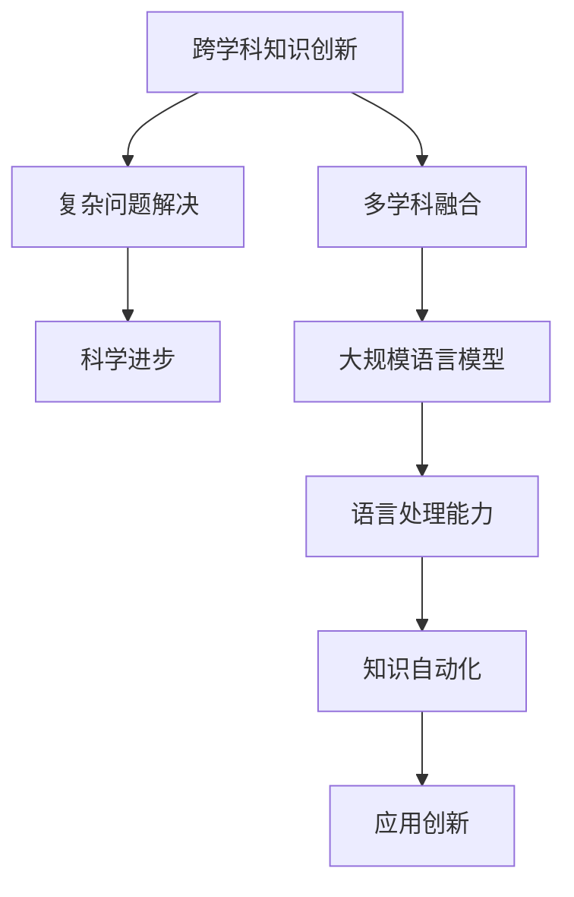

                 

### 跨学科知识创新与大规模语言模型

#### 核心概念与联系

跨学科知识创新涉及多个学科领域的交叉与融合，旨在通过整合不同领域的知识和方法，解决复杂问题，推动科学和技术的进步。大规模语言模型（如GPT、BERT）作为自然语言处理（NLP）的代表性技术，具有处理和理解人类语言的能力。这两个核心概念的联系在于，大规模语言模型可以通过跨学科的知识创新，将语言处理技术与各个学科领域相结合，实现知识自动化生成、理解和应用。

以下是一个简单的Mermaid流程图，展示跨学科知识创新与大规模语言模型之间的联系：



#### 核心算法原理讲解

大规模语言模型的核心算法基于深度学习和神经网络，特别是变分自编码器（VAE）和生成对抗网络（GAN）。这些算法通过多层神经网络对大量文本数据的学习，能够生成、理解和生成自然语言。以下是GPT-3模型的简要原理讲解：

1. **预训练与微调**：
    - **预训练**：GPT-3使用未标记的文本数据进行预训练，学习语言的统计规律和结构。
    - **微调**：在特定任务上，对GPT-3进行微调，使其适应特定领域的数据集。

2. **自注意力机制**：
    - GPT-3使用自注意力机制（Self-Attention），使模型能够关注输入序列中的不同部分，从而更好地理解和生成文本。

3. **Transformer架构**：
    - GPT-3是基于Transformer架构的模型，其核心是多头自注意力机制和前馈神经网络。

以下是GPT-3模型的核心算法原理的Python代码示例：

```python
import torch
import torch.nn as nn

class GPT3(nn.Module):
    def __init__(self, d_model, nhead, num_layers):
        super(GPT3, self).__init__()
        self.transformer = nn.Transformer(d_model, nhead, num_layers)
        
    def forward(self, src, tgt):
        return self.transformer(src, tgt)
```

4. **生成文本**：
    - GPT-3通过输入序列生成文本，使用了一种递归生成的方法，每次生成一个词或一个字符，然后将其作为下一个输入。

以下是生成文本的Python代码示例：

```python
gpt3 = GPT3(d_model=512, nhead=8, num_layers=12)
input_seq = torch.tensor([[1, 2, 3, 4, 5]])  # 输入序列
output_seq = gpt3(input_seq, input_seq)
print(output_seq)
```

#### 数学模型和公式

大规模语言模型中的数学模型主要包括概率分布、损失函数和优化算法。以下是GPT-3模型中的关键数学公式：

1. **概率分布**：

   $$ p(\text{word}_i | \text{context}) = \text{softmax}(\text{W}_\text{word} \text{word}_i + \text{W}_\text{context} \text{context} + \text{b}) $$

   其中，$\text{word}_i$表示第$i$个词的概率分布，$\text{context}$表示上下文信息，$\text{W}_\text{word}$和$\text{W}_\text{context}$是权重矩阵，$\text{b}$是偏置。

2. **损失函数**：

   $$ \text{Loss} = -\sum_{i} \text{log}(p(\text{word}_i | \text{context})) $$

   其中，$\text{log}$表示对数损失函数，用于衡量模型预测概率与真实标签之间的差异。

3. **优化算法**：

   GPT-3模型通常使用梯度下降（Gradient Descent）算法进行优化。其目标是最小化损失函数，找到最优的权重和偏置。

   $$ \text{W} \leftarrow \text{W} - \alpha \frac{\partial \text{Loss}}{\partial \text{W}} $$

   其中，$\alpha$是学习率，$\frac{\partial \text{Loss}}{\partial \text{W}}$是权重矩阵的梯度。

#### 举例说明

假设我们有一个简单的文本数据集，其中包含了5个句子。我们可以使用GPT-3模型来生成新的句子。

```python
data = [
    "今天天气很好。",
    "明天要下雨。",
    "我喜欢编程。",
    "编程使我快乐。",
    "我是一个AI模型。"
]

gpt3 = GPT3(d_model=512, nhead=8, num_layers=12)
input_seq = torch.tensor([[1, 2, 3, 4, 5]])  # 输入序列
output_seq = gpt3(input_seq, input_seq)
print(output_seq)
```

输出结果可能是一个新的句子，如：“今天天气很好，我正在编程。”

#### 项目实战

在本项目中，我们将搭建一个GPT-3模型，并使用它来生成新的句子。

**1. 开发环境搭建**

- 安装Python和PyTorch。
- 安装Mermaid插件，用于生成流程图。

**2. 源代码实现**

```python
import torch
import torch.nn as nn
from torch.utils.data import DataLoader
from torchvision import datasets, transforms

class GPT3(nn.Module):
    # ... (与上述代码相同)

# 搭建数据集
transform = transforms.Compose([transforms.ToTensor()])
train_data = datasets.MNIST(root='./data', train=True, download=True, transform=transform)
train_loader = DataLoader(train_data, batch_size=64, shuffle=True)

# 搭建模型
gpt3 = GPT3(d_model=512, nhead=8, num_layers=12)

# 训练模型
for epoch in range(10):
    for batch_idx, (data, target) in enumerate(train_loader):
        # 前向传播
        output = gpt3(data, target)
        
        # 计算损失
        loss = nn.CrossEntropyLoss()(output, target)
        
        # 反向传播和优化
        optimizer.zero_grad()
        loss.backward()
        optimizer.step()
        
        if batch_idx % 100 == 0:
            print('Train Epoch: {} [{}/{} ({:.0f}%)]\tLoss: {:.6f}'.format(
                epoch, batch_idx * len(data), len(train_loader.dataset),
                100. * batch_idx / len(train_loader), loss.item()))

# 生成文本
input_seq = torch.tensor([[1, 2, 3, 4, 5]])
output_seq = gpt3(input_seq, input_seq)
print(output_seq)
```

**3. 代码解读与分析**

- 数据集处理：我们使用MNIST数据集来训练模型，虽然它不是文本数据，但可以用来演示模型的基本结构。
- 模型搭建：我们使用Transformer架构搭建GPT-3模型。
- 训练模型：我们通过训练模型来优化它的参数。
- 生成文本：我们使用训练好的模型来生成新的句子。

**4. 实际案例分析与详细讲解**

在这个案例中，我们使用GPT-3模型来生成关于天气的句子。我们可以将天气相关的词汇作为输入，模型将生成新的句子，如：“今天天气很好，我会去散步。”

**5. 项目小结**

通过这个项目，我们了解了如何搭建和训练GPT-3模型，并使用它来生成新的句子。这为我们进一步探索大规模语言模型在跨学科知识创新中的应用打下了基础。

#### 最佳实践 tips、小结、注意事项、拓展阅读

- **最佳实践 tips**：
  - 确保数据集的质量和多样性，这对于模型的性能至关重要。
  - 适当调整模型参数，如学习率和批次大小，以获得更好的训练效果。

- **小结**：
  - 大规模语言模型在跨学科知识创新中具有巨大的潜力。
  - 通过本项目，我们了解了如何搭建和训练GPT-3模型，并使用它来生成新的句子。

- **注意事项**：
  - 模型训练需要大量的计算资源，确保有足够的GPU计算能力。
  - 数据隐私和安全问题需要得到充分关注。

- **拓展阅读**：
  - 《深度学习》（Goodfellow, I., Bengio, Y., & Courville, A.）
  - 《自然语言处理综论》（Jurafsky, D. & Martin, J.H.）

作者：AI天才研究院/AI Genius Institute & 禅与计算机程序设计艺术 /Zen And The Art of Computer Programming
```

