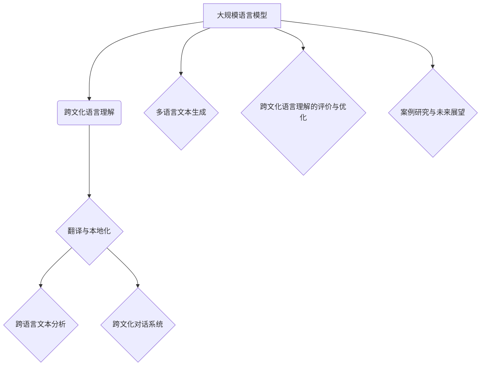
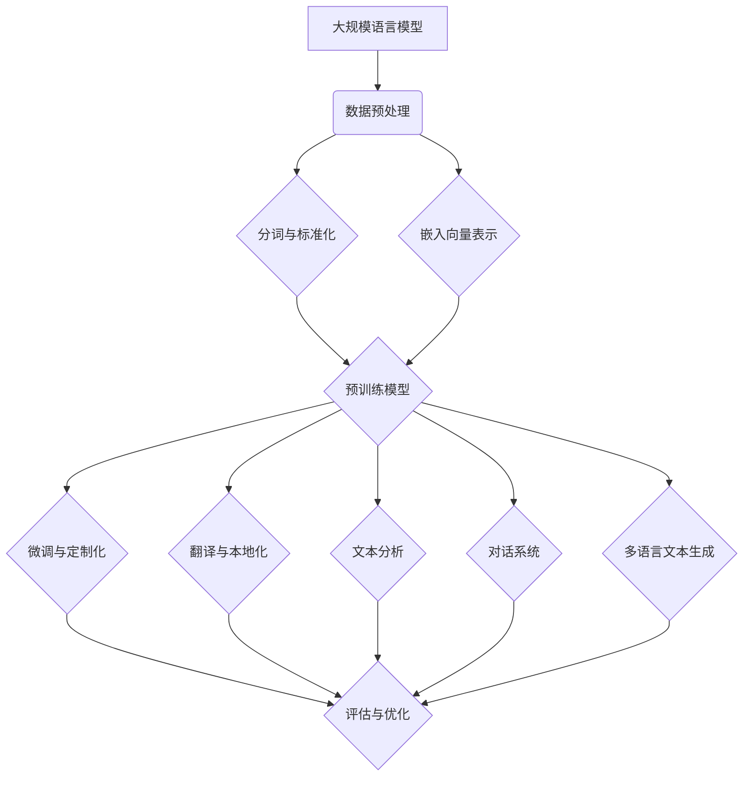

                 

### 文章标题

《大规模语言模型在跨文化语言理解中的创新应用》

### 关键词

大规模语言模型，跨文化语言理解，机器翻译，文本分析，对话系统，多语言文本生成，评价与优化

### 摘要

本文旨在探讨大规模语言模型在跨文化语言理解领域的创新应用。首先，文章介绍了跨文化语言理解的背景与挑战，然后详细阐述了大规模语言模型的基础知识。接下来，文章重点讨论了大规模语言模型在翻译与本地化、跨语言文本分析以及跨文化对话系统中的具体应用。此外，本文还探讨了大规模语言模型在多语言文本生成以及评价与优化方面的创新方法。最后，文章通过案例研究展示了大规模语言模型在跨文化语言理解中的实际应用，并展望了未来的发展趋势。本文的目标是提供一个全面而深入的视角，以帮助读者理解大规模语言模型在跨文化语言理解中的重要性及其潜在的应用前景。

---

# 《大规模语言模型在跨文化语言理解中的创新应用》目录大纲

## 第一部分：跨文化语言理解的背景与挑战

### 第1章：跨文化语言理解概述
- 1.1 跨文化语言理解的重要性
- 1.2 跨文化语言理解的难点
- 1.3 大规模语言模型在跨文化语言理解中的应用前景

### 第2章：大规模语言模型基础
- 2.1 大规模语言模型的定义与分类
- 2.2 预训练语言模型的基本原理
- 2.3 微调与定制化语言模型

## 第二部分：大规模语言模型在跨文化语言理解中的应用

### 第3章：翻译与本地化
- 3.1 大规模语言模型在机器翻译中的应用
- 3.2 大规模语言模型在本地化中的应用
- 3.3 翻译与本地化的挑战与解决方案

### 第4章：跨语言文本分析
- 4.1 跨语言文本分析的基本概念
- 4.2 大规模语言模型在情感分析中的应用
- 4.3 大规模语言模型在语义角色标注中的应用

### 第5章：跨文化对话系统
- 5.1 跨文化对话系统的设计与实现
- 5.2 大规模语言模型在对话系统中的应用
- 5.3 跨文化对话系统的挑战与解决方案

## 第三部分：大规模语言模型在跨文化语言理解中的创新应用

### 第6章：多语言文本生成
- 6.1 多语言文本生成的基本方法
- 6.2 大规模语言模型在多语言文本生成中的应用
- 6.3 多语言文本生成的挑战与解决方案

### 第7章：跨文化语言理解的评价与优化
- 7.1 跨文化语言理解的评价方法
- 7.2 大规模语言模型的优化方法
- 7.3 跨文化语言理解应用的优化策略

## 第四部分：案例研究与未来展望

### 第8章：大规模语言模型在跨文化语言理解中的应用案例
- 8.1 案例一：跨文化社交媒体分析
- 8.2 案例二：跨文化新闻翻译系统
- 8.3 案例三：跨文化客服机器人

### 第9章：大规模语言模型在跨文化语言理解中的未来发展趋势
- 9.1 技术发展趋势
- 9.2 应用领域扩展
- 9.3 未来挑战与机遇

## 附录

### 附录A：大规模语言模型工具与资源
- A.1 深度学习框架
- A.2 语言模型开源资源
- A.3 相关研究论文与书籍推荐

### 附录B：Mermaid流程图示例

---

## 第一部分：跨文化语言理解的背景与挑战

### 第1章：跨文化语言理解概述

**1.1 跨文化语言理解的重要性**

在全球化的今天，跨文化语言理解已经成为国际交流、商务合作和科技发展的关键因素。随着全球化进程的加快，不同文化背景的人们日益频繁地进行跨文化沟通。这种沟通不仅限于口头表达，还包括书面文本、社交媒体、电子邮件等各种形式。有效的跨文化语言理解有助于消除沟通障碍，促进国际间的合作与理解。

跨文化语言理解的重要性体现在以下几个方面：

1. **提高沟通效率**：跨文化语言理解能够帮助人们更快地理解对方的意图，减少误解和歧义，从而提高沟通效率。
2. **促进国际商务合作**：在国际商务环境中，有效的跨文化语言理解有助于双方建立信任，降低沟通成本，提高合作成功率。
3. **推动科技交流**：科技领域的国际合作日益增多，跨文化语言理解能够帮助科学家和工程师更好地理解彼此的研究成果，促进科技交流和合作。
4. **丰富文化生活**：跨文化语言理解使得人们能够欣赏和理解不同文化的文学作品、艺术作品，从而丰富自己的文化视野。

**1.2 跨文化语言理解的难点**

尽管跨文化语言理解的重要性日益凸显，但这一领域仍然面临着诸多挑战。以下是跨文化语言理解的主要难点：

1. **语言差异**：不同语言在语法、词汇、发音和拼写等方面存在显著差异，这些差异可能导致理解上的困难。
2. **文化差异**：不同文化在价值观、习俗、行为规范等方面存在差异，这些差异可能导致误解和冲突。
3. **语境依赖性**：语言的使用往往与特定的语境相关，跨文化语境的差异可能导致理解上的偏差。
4. **语言多样性与变体**：全球有多种语言和方言，这些语言和方言之间的差异使得跨文化语言理解更加复杂。
5. **翻译质量**：尽管翻译技术在不断发展，但翻译质量仍然是一个关键问题，尤其是在处理复杂文本和细微差异时。

**1.3 大规模语言模型在跨文化语言理解中的应用前景**

随着人工智能和深度学习技术的飞速发展，大规模语言模型在跨文化语言理解领域展现出了巨大的潜力。大规模语言模型能够处理海量的语言数据，从中学习语言规律和语义信息，从而实现高效的跨文化语言理解。以下是大规模语言模型在跨文化语言理解中的几个潜在应用方向：

1. **机器翻译**：大规模语言模型在机器翻译中已经取得了显著的成果，未来有望进一步提升翻译质量和效率。
2. **跨语言文本分析**：大规模语言模型能够处理跨语言文本，进行情感分析、语义角色标注等任务，有助于挖掘跨文化信息。
3. **跨文化对话系统**：利用大规模语言模型构建的跨文化对话系统能够提供智能化的跨文化咨询服务，提高用户满意度。
4. **多语言文本生成**：大规模语言模型能够生成高质量的多语言文本，为跨文化交流和传播提供技术支持。
5. **评价与优化**：大规模语言模型在跨文化语言理解中的应用可以通过评价和优化方法不断提升性能，满足不同场景的需求。

综上所述，跨文化语言理解具有重要的现实意义，但同时也面临着诸多挑战。随着大规模语言模型技术的不断发展，我们有理由相信，这些挑战将逐步得到解决，跨文化语言理解将在全球化进程中发挥更加重要的作用。

---

## 第一部分：跨文化语言理解的背景与挑战

### 第2章：大规模语言模型基础

**2.1 大规模语言模型的定义与分类**

大规模语言模型是一种基于深度学习的自然语言处理（NLP）模型，它通过训练大量语言数据来学习语言结构和语义信息，从而实现各种自然语言处理任务。这些任务包括文本分类、情感分析、机器翻译、问答系统等。

大规模语言模型可以按照不同的维度进行分类：

1. **按模型架构分类**：
   - **Transformer模型**：这是当前最流行的语言模型架构，其代表作品包括BERT、GPT、T5等。
   - **循环神经网络（RNN）**：包括LSTM和GRU等，这些模型在处理序列数据时表现出色。
   - **卷积神经网络（CNN）**：虽然CNN主要用于图像处理，但近年来也用于文本分析。
   
2. **按训练数据量分类**：
   - **小规模语言模型**：通常使用数GB的训练数据，例如FastText。
   - **大规模语言模型**：使用数十GB甚至TB级别的训练数据，例如GPT-3、T5-11B等。
   
3. **按训练策略分类**：
   - **预训练+微调**：预训练模型在大规模数据上学习通用的语言规律，然后在特定任务上进行微调。
   - **自监督学习**：模型通过无监督的方式从大规模数据中学习，如BERT采用的Masked Language Model（MLM）。

**2.2 预训练语言模型的基本原理**

预训练语言模型的基本原理是将模型在大规模语料库上预训练，然后在小规模任务数据上微调，以实现良好的性能。预训练的目的是让模型学会理解自然语言中的通用规律和语义信息。

预训练语言模型的主要步骤如下：

1. **数据预处理**：收集并清洗大量文本数据，包括网页、书籍、新闻、社交媒体等。
2. **词嵌入**：将文本中的每个词映射到高维向量空间中，常用的词嵌入方法有Word2Vec、GloVe等。
3. **构建模型**：设计并训练一个大型的神经网络模型，该模型通常包含多个层和注意力机制。
4. **预训练任务**：通过预训练任务（如MLM、Next Sentence Prediction等）来训练模型，使其学习通用语言规律。
5. **微调**：在特定任务的数据集上对预训练模型进行微调，以适应具体任务的需求。

**2.3 微调与定制化语言模型**

微调是将预训练好的语言模型应用于特定任务的过程。通过微调，模型可以在特定任务上获得更好的性能。微调的主要步骤如下：

1. **任务定义**：明确需要解决的问题类型，如文本分类、情感分析、机器翻译等。
2. **数据准备**：收集和准备用于微调的数据集，通常包括训练集和验证集。
3. **模型架构**：选择合适的预训练模型架构，如BERT、GPT等，并对其进行微调。
4. **训练与评估**：在训练集上训练模型，并在验证集上评估其性能，通过调整超参数和训练策略来优化模型性能。
5. **部署**：将训练好的模型部署到实际应用中，例如构建问答系统、文本分类器等。

此外，定制化语言模型是通过在特定领域或任务上对预训练模型进行进一步定制来提升性能的方法。定制化包括以下步骤：

1. **领域知识注入**：将特定领域的知识（如专业词汇、术语等）引入模型，以提高模型在该领域的性能。
2. **任务特定结构**：设计适合特定任务的模型结构，例如在问答系统中加入记忆模块。
3. **持续学习与优化**：通过持续学习新的数据和知识，不断提升模型的性能。

通过预训练和微调，大规模语言模型能够在跨文化语言理解中发挥重要作用，帮助人们更好地处理和理解不同语言和文化背景下的文本。

---

## 第二部分：大规模语言模型在跨文化语言理解中的应用

### 第3章：翻译与本地化

**3.1 大规模语言模型在机器翻译中的应用**

大规模语言模型在机器翻译领域已经取得了显著的成果，其核心在于通过大量的文本数据进行预训练，从而学习到语言的内在结构和语义信息，再通过微调来适应特定翻译任务。

**模型原理与实现**

1. **模型原理**：

   - **编码器-解码器架构**：传统的机器翻译模型采用编码器-解码器（Encoder-Decoder）架构。编码器将源语言文本编码为一个固定长度的向量表示，解码器则利用这个向量生成目标语言文本。
   - **注意力机制**：注意力机制（Attention Mechanism）允许模型在生成目标文本的过程中，关注源文本中与当前目标词相关的重要部分，从而提高翻译的准确性。
   - **Transformer模型**：近年来，Transformer模型在机器翻译中取得了突破性进展。它通过多头自注意力机制（Multi-Head Self-Attention）和点积注意力机制（Dot-Product Attention），能够更有效地处理长距离依赖问题，提高了翻译质量。

2. **实现流程**：

   - **数据准备**：收集大量的双语平行文本数据，并进行预处理，包括分词、词性标注、去除停用词等。
   - **模型训练**：使用预训练语言模型（如BERT、GPT）在双语数据上进行预训练，然后微调模型以适应特定翻译任务。
   - **翻译过程**：在翻译时，编码器将源文本编码为向量表示，解码器利用这些向量生成目标语言文本。

**案例分析与效果评估**

- **案例一：谷歌翻译**：谷歌翻译使用了基于Transformer模型的神经网络机器翻译（NMT）技术，通过大量的双语语料库进行预训练和微调，提供了高质量的多语言翻译服务。根据用户反馈和评测数据，谷歌翻译在翻译质量、速度和用户体验方面都取得了显著提升。
- **案例二：OpenAI的GPT-3**：OpenAI的GPT-3模型通过在海量文本上进行预训练，展示了在机器翻译任务中的强大能力。GPT-3的翻译结果在语法准确性、语义连贯性和本地化效果上都有显著提高。

**效果评估**：

- **BLEU评分**：BLEU（Bilingual Evaluation Understudy）是一种常用的机器翻译评价指标，通过计算翻译文本和参考文本之间的重叠度来评估翻译质量。大规模语言模型在机器翻译任务中通常能够获得较高的BLEU评分。
- **人类评价**：除了自动评价指标，人类评价也是衡量翻译质量的重要手段。通过让专业的翻译人员对翻译结果进行评价，可以更全面地评估模型的翻译效果。

**3.2 大规模语言模型在本地化中的应用**

本地化是指将产品或服务的内容翻译并调整为特定语言和文化环境的过程。大规模语言模型在本地化中的应用主要体现在以下几个方面：

1. **文本翻译**：大规模语言模型能够高效地将产品文档、用户手册、宣传材料等翻译成多种语言，从而扩大产品的国际市场。
2. **语音识别与生成**：除了文本翻译，大规模语言模型还可以用于语音识别和语音生成，将语音转换为文本，再将文本转换为语音，从而实现跨语言的语音交流。
3. **图像与视频本地化**：通过结合计算机视觉技术，大规模语言模型能够对图像和视频进行文本标注和翻译，为跨文化内容的传播提供支持。

**实现方法与挑战**

1. **实现方法**：

   - **文本翻译**：使用预训练的语言模型（如BERT、GPT）进行文本翻译，结合机器翻译模型和语音合成技术，实现文本到语音的转换。
   - **语音识别与生成**：使用语音识别技术将语音转换为文本，然后使用文本翻译模型进行翻译，最后使用语音合成技术将翻译结果转换为语音。
   - **图像与视频本地化**：使用图像识别技术对图像和视频进行内容分析，然后使用文本翻译模型对分析结果进行翻译。

2. **挑战**：

   - **语言多样性**：不同语言的语法结构、词汇和发音差异较大，大规模语言模型需要适应多种语言和方言。
   - **文化差异**：不同文化在表达方式和习俗上有显著差异，本地化过程中需要充分考虑这些差异，确保翻译内容的适用性和准确性。
   - **质量评估**：本地化结果的评估不仅需要自动评价指标，还需要人工评估，以确保翻译内容的自然性和文化适应性。

**3.3 翻译与本地化的挑战与解决方案**

尽管大规模语言模型在翻译和本地化中表现出强大的能力，但仍面临一些挑战：

1. **语言理解能力**：

   - **挑战**：翻译和本地化需要模型对语言和文化的深刻理解，而大规模语言模型虽然能够处理大量的文本数据，但其在理解和处理复杂语言现象（如隐喻、俚语等）时可能存在不足。
   - **解决方案**：通过引入更多的上下文信息和多语言语料库，增强模型对语言和文化的理解能力。此外，可以采用迁移学习和多任务学习等方法，提高模型在特定语言和文化背景下的表现。

2. **质量保障**：

   - **挑战**：保证翻译和本地化的质量是一个复杂的问题，尤其是对于专业术语、特定文化表达和双关语等。
   - **解决方案**：建立专业的翻译团队，结合自动翻译和人工校对，确保翻译和本地化结果的准确性。此外，可以采用数据增强和对比学习等技术，提高模型对高质量数据的处理能力。

3. **实时性和效率**：

   - **挑战**：在实时翻译和本地化场景中，模型需要快速响应并生成高质量的翻译结果。
   - **解决方案**：通过优化模型结构和算法，减少计算复杂度，提高模型在实时应用中的响应速度。同时，可以采用分布式计算和边缘计算等技术，提升系统整体性能。

总之，大规模语言模型在翻译与本地化中的应用展示了巨大的潜力，但同时也需要不断克服挑战，以实现更高效、更准确的跨文化语言理解。

---

## 第二部分：大规模语言模型在跨文化语言理解中的应用

### 第4章：跨语言文本分析

**4.1 跨语言文本分析的基本概念**

跨语言文本分析（Cross-Lingual Text Analysis, CLTA）是指在不同语言之间进行文本分析和处理的方法和技术。它的目标是通过理解和分析一种语言的文本，来推断和解释另一种语言的文本。跨语言文本分析在自然语言处理（NLP）和跨文化语言理解中扮演着重要角色，特别是在多语言环境下，它能够帮助实现更高效、更准确的文本分析。

**关键概念**：

1. **翻译等效性（Translation Equivalence）**：翻译等效性是指不同语言中具有相同或相似含义的词或短语。理解翻译等效性有助于在跨语言文本分析中识别和利用相同的信息。
2. **语言资源（Language Resources）**：包括双语词典、平行语料库、多语言语料库等，这些资源是跨语言文本分析的重要基础。
3. **跨语言语义分析（Cross-Lingual Semantic Analysis）**：跨语言语义分析是指在不同语言之间理解和比较语义信息，以识别文本的含义和结构。

**4.2 大规模语言模型在情感分析中的应用**

情感分析（Sentiment Analysis）是跨语言文本分析的一个重要应用领域，旨在自动检测和分类文本中的情感倾向，如正面、负面或中性。大规模语言模型在情感分析中发挥着重要作用，能够处理多语言文本，提高分析的准确性和效率。

**模型原理与实现**：

1. **模型原理**：

   - **预训练与微调**：大规模语言模型（如BERT、RoBERTa）在大量多语言语料库上进行预训练，学习通用语言特征和情感信息。然后，在特定任务上进行微调，以适应情感分析的具体需求。
   - **多语言嵌入（Multilingual Embeddings）**：多语言嵌入是将不同语言的词映射到共享的向量空间中，使得模型能够处理多种语言文本，并在语义层面上进行情感分析。

2. **实现流程**：

   - **数据准备**：收集多语言情感分析数据集，包括带有情感标签的文本数据。
   - **模型训练**：使用预训练语言模型在多语言数据上进行预训练，然后微调模型以识别不同语言的情感特征。
   - **情感分析**：在新的文本数据上，使用训练好的模型进行情感分类，预测文本的情感倾向。

**案例分析**：

- **案例一：Twitter情感分析**：Twitter是一个多语言社交媒体平台，使用大规模语言模型进行跨语言情感分析，可以帮助分析不同语言用户对某个话题的情感态度。研究表明，大规模语言模型在Twitter情感分析中能够准确识别多种语言的情感倾向。
- **案例二：产品评论分析**：在线零售平台上的产品评论往往使用多种语言，通过跨语言情感分析，可以了解不同语言用户对产品的评价，从而为产品改进提供反馈。

**效果评估**：

- **精确率、召回率和F1值**：这是常用的评估指标，用于衡量模型在情感分析任务中的表现。通过计算模型预测结果与实际标签之间的匹配度，可以评估模型的准确性。
- **人类评估**：通过邀请专业的翻译人员和情感分析师对模型的情感分析结果进行评估，可以进一步验证模型的效果和可靠性。

**4.3 大规模语言模型在语义角色标注中的应用**

语义角色标注（Semantic Role Labeling, SRL）是指为句子中的动词标注其作用角色（如主语、宾语、补语等），以揭示句子中的语义关系。跨语言语义角色标注是自然语言处理中的一个重要挑战，因为它需要模型在不同语言之间建立一致的语义标注体系。

**模型原理与实现**：

1. **模型原理**：

   - **预训练与微调**：大规模语言模型在多语言语料库上进行预训练，学习到不同语言的语法结构和语义信息。然后，通过在特定语言的语义角色标注数据集上进行微调，使模型能够识别和标注不同语言的语义角色。
   - **跨语言转移学习**：通过在多语言数据集上进行统一训练，模型可以在不同语言之间共享语义知识，从而提高跨语言语义角色标注的性能。

2. **实现流程**：

   - **数据准备**：收集多语言语义角色标注数据集，并进行预处理，包括文本清洗、分词和词性标注。
   - **模型训练**：使用预训练语言模型在多语言数据上进行预训练，然后微调模型以适应特定语言的语义角色标注任务。
   - **语义角色标注**：在新的文本数据上，使用训练好的模型进行语义角色标注，预测句子中每个动词的作用角色。

**案例分析**：

- **案例一：多语言新闻文本分析**：在多语言新闻文本中，语义角色标注有助于理解新闻报道中的关键信息。通过使用大规模语言模型进行跨语言语义角色标注，可以自动提取新闻文本中的关键实体和事件。
- **案例二：多语言对话系统**：在多语言对话系统中，语义角色标注可以帮助系统理解用户输入的意图，从而提供更准确的回应。

**效果评估**：

- **准确率和召回率**：这是评估语义角色标注模型性能的常用指标。通过计算模型预测结果与实际标注结果之间的匹配度，可以评估模型的标注准确性。
- **错误分析**：通过对标注错误的例子进行详细分析，可以识别模型在特定语言或任务中的弱点，并针对这些弱点进行优化。

**总结**：

大规模语言模型在跨语言文本分析中展示了强大的能力，能够处理多种语言的数据，提高情感分析和语义角色标注的准确性。随着技术的不断进步，跨语言文本分析的应用将越来越广泛，为跨文化交流和信息处理提供强大的支持。

---

## 第二部分：大规模语言模型在跨文化语言理解中的应用

### 第5章：跨文化对话系统

**5.1 跨文化对话系统的设计与实现**

跨文化对话系统旨在提供跨语言、跨文化的自然语言交互，为不同语言和文化背景的用户提供无缝的交流体验。设计一个有效的跨文化对话系统需要考虑多方面的因素，包括语言模型、对话管理、多语言支持等。

**设计原则**：

1. **多语言支持**：跨文化对话系统需要支持多种语言，包括文本和语音输入输出。为此，系统应集成大规模语言模型，如BERT、GPT等，这些模型能够处理多种语言的语义和语法。
2. **语言适应性**：系统应能够根据用户的语言偏好和文化背景，自动调整对话内容和交互方式，确保对话的自然性和流畅性。
3. **上下文感知**：跨文化对话系统应具备上下文感知能力，能够理解用户的历史对话内容和意图，从而提供更加个性化和准确的服务。
4. **文化敏感性**：系统应考虑不同文化中的礼貌用语、礼仪和行为规范，避免在对话中出现文化误解或冒犯。

**实现流程**：

1. **需求分析**：明确系统需要支持的语言和文化背景，确定对话系统的目标和功能需求。
2. **语言模型选择**：选择适合的预训练语言模型，如BERT、GPT等，并对其进行微调以适应特定语言和文化。
3. **对话管理**：设计对话管理模块，负责处理用户的输入，理解用户意图，并根据上下文生成适当的响应。
4. **多语言支持**：实现多语言语音识别和文本生成功能，确保系统能够处理多种语言的输入输出。
5. **用户接口**：开发用户友好的界面，支持语音和文本交互，并提供语言切换和文化适应功能。
6. **测试与优化**：通过实际使用场景的测试，收集用户反馈，不断优化对话系统的性能和用户体验。

**5.2 大规模语言模型在对话系统中的应用**

大规模语言模型在跨文化对话系统中发挥着核心作用，能够提高对话的流畅性、准确性和自然性。

**模型应用场景**：

1. **意图识别**：大规模语言模型能够理解用户输入的意图，并根据上下文生成适当的响应。例如，在客服机器人中，模型可以识别用户的问题类型，并提供相应的解决方案。
2. **问答系统**：跨文化对话系统可以使用大规模语言模型来构建问答系统，能够回答多种语言的问题，并提供准确、自然的回答。
3. **情感分析**：大规模语言模型能够分析用户的情感状态，并根据情感反馈调整对话策略，提高用户满意度。
4. **翻译与本地化**：在多语言环境中，大规模语言模型可以提供即时的翻译服务，帮助用户克服语言障碍，实现跨文化交流。

**案例应用**：

1. **跨国企业客服系统**：跨国企业可以使用跨文化对话系统，为全球客户提供24/7的客服支持。通过大规模语言模型，系统能够自动识别客户的语言和文化背景，并提供个性化的服务。
2. **教育平台**：在线教育平台可以使用跨文化对话系统，为学生提供多语言的学习支持。学生可以与机器人进行交互，获得实时解答和学习建议。
3. **社交媒体平台**：社交媒体平台可以集成跨文化对话系统，帮助用户理解和参与多语言社区，提高国际化交流的效率。

**5.3 跨文化对话系统的挑战与解决方案**

尽管跨文化对话系统展示了巨大的潜力，但在实际应用中仍面临一些挑战：

1. **语言多样性**：不同语言的语法结构、词汇和发音差异较大，需要模型具备处理多种语言的能力。解决方案是使用多语言预训练模型，如mBERT、XLM等，这些模型能够支持多种语言的语义和语法分析。
2. **文化适应性**：不同文化在语言使用和交流方式上存在显著差异，需要模型具备文化敏感性。解决方案是通过引入文化知识库和进行文化适应性训练，提高模型在不同文化背景下的表现。
3. **实时性**：跨文化对话系统需要实时处理多语言输入，并在短时间内生成高质量的响应。解决方案是优化模型架构和算法，提高模型的计算效率和响应速度。
4. **用户隐私**：跨文化对话系统需要处理大量用户数据，包括语言、文化、行为等信息，需要确保用户隐私和数据安全。解决方案是采用加密技术和隐私保护算法，确保用户数据的安全和隐私。

通过不断优化和创新，跨文化对话系统将在全球化进程中发挥越来越重要的作用，为不同语言和文化背景的用户提供高效、自然的交流体验。

---

## 第三部分：大规模语言模型在跨文化语言理解中的创新应用

### 第6章：多语言文本生成

**6.1 多语言文本生成的基本方法**

多语言文本生成是指利用机器学习模型生成多种语言文本的技术。这种方法在跨文化交流、内容创作和翻译辅助等领域具有广泛应用。多语言文本生成的基本方法可以分为以下几种：

1. **基于规则的方法**：
   - **规则匹配**：通过预先定义的语言规则和转换规则，将一种语言的文本转换为另一种语言的文本。这种方法适用于结构化文本和特定领域的翻译，但在处理自然语言时效果有限。
   - **模板匹配**：使用预先定义的模板，将源语言的文本内容嵌入到目标语言的模板中，生成多语言文本。这种方法在信息提取和报告生成中应用较多。

2. **基于统计的方法**：
   - **基于统计的机器翻译（SMT）**：通过统计方法，如统计翻译模型（STM）和基于神经网络的统计机器翻译（NMT），将一种语言的文本转换为另一种语言的文本。这种方法依赖于大量的双语平行语料库，能够生成高质量的翻译结果。

3. **基于模型的方法**：
   - **生成对抗网络（GAN）**：GAN通过生成器和判别器之间的对抗训练，生成与真实数据分布相似的多语言文本。这种方法在生成高质量文本方面表现出色，但训练过程较为复杂。
   - **序列到序列模型（Seq2Seq）**：Seq2Seq模型通过编码器和解码器结构，将一种语言的文本序列转换为另一种语言的文本序列。这种方法在翻译和文本生成任务中应用广泛。

4. **基于迁移学习的方法**：
   - **多语言预训练模型**：通过在多种语言的语料库上进行预训练，生成器模型可以生成多种语言的文本。这种方法能够利用共享的语义表示，提高生成文本的质量。

**6.2 大规模语言模型在多语言文本生成中的应用**

大规模语言模型（如BERT、GPT）在多语言文本生成中发挥了重要作用，能够生成高质量的多语言文本。以下是大规模语言模型在多语言文本生成中的应用：

1. **多语言文本摘要**：
   - **模型原理**：使用预训练的语言模型（如mBERT）对多语言文本进行编码，提取文本的主要内容和关键信息，然后生成摘要。
   - **实现步骤**：首先，对多种语言的文本进行预处理和编码，然后使用训练好的语言模型生成摘要文本。
   - **效果评估**：通过计算摘要文本与原始文本之间的相似度、语义一致性等指标，评估多语言文本摘要的质量。

2. **多语言对话生成**：
   - **模型原理**：使用多语言预训练模型（如XLM）对对话文本进行编码，生成对话响应，同时考虑语言和文化差异。
   - **实现步骤**：首先，对对话文本进行预处理，然后使用多语言预训练模型生成对话响应。
   - **效果评估**：通过对比生成文本与人工对话文本的相似度、流畅度和准确性，评估多语言对话生成系统的性能。

3. **多语言内容创作**：
   - **模型原理**：利用大规模语言模型（如GPT-3）的多语言生成能力，生成多种语言的文章、故事、诗歌等。
   - **实现步骤**：首先，提供少量的种子文本或主题信息，然后使用语言模型生成相应的多语言内容。
   - **效果评估**：通过人类评估和自动评价指标（如ROUGE评分），评估多语言内容创作系统的质量。

**6.3 多语言文本生成的挑战与解决方案**

尽管大规模语言模型在多语言文本生成中取得了显著成果，但仍面临一些挑战：

1. **语言多样性**：
   - **挑战**：不同语言在语法、词汇和语义结构上存在显著差异，多语言文本生成需要模型具备处理多种语言的能力。
   - **解决方案**：使用多语言预训练模型（如mBERT、XLM）和跨语言迁移学习方法，提高模型在不同语言间的适应能力。

2. **文化差异**：
   - **挑战**：不同文化在表达方式、价值观和习俗上存在差异，多语言文本生成需要考虑文化敏感性。
   - **解决方案**：引入文化知识库和进行文化适应性训练，提高模型在不同文化背景下的表现。

3. **上下文一致性**：
   - **挑战**：多语言文本生成需要保证生成文本与上下文的一致性，避免出现语义冲突或不连贯的情况。
   - **解决方案**：使用上下文感知的语言模型（如BERT、GPT）和长文本生成技术，提高生成文本的连贯性和一致性。

4. **计算资源**：
   - **挑战**：多语言文本生成需要大量的计算资源和时间，特别是在处理长文本和复杂任务时。
   - **解决方案**：采用分布式计算和优化算法，提高模型训练和生成文本的效率。

通过不断创新和优化，大规模语言模型在多语言文本生成中的应用将不断扩展，为跨文化交流、内容创作和翻译辅助等领域提供更高效、更准确的技术支持。

---

## 第三部分：大规模语言模型在跨文化语言理解中的创新应用

### 第7章：跨文化语言理解的评价与优化

**7.1 跨文化语言理解的评价方法**

跨文化语言理解的评价是确保模型在实际应用中表现良好的关键步骤。评价方法主要包括以下几个方面：

1. **自动评价指标**：
   - **BLEU（Bilingual Evaluation Understudy）**：BLEU是最常用的自动翻译质量评价指标之一，通过计算翻译文本和参考文本之间的重叠度（如单词、短语等）来评估翻译质量。
   - **METEOR（Metric for Evaluation of Translation with Explicit ORdering）**：METEOR综合考虑了词性、词汇重叠度、句法结构等因素，提供更为细致的评估。
   - **ROUGE（Recall-Oriented Understudy for Gisting Evaluation）**：ROUGE主要用于评估文本摘要的质量，通过计算摘要文本与原始文本的相似度来评估生成文本的质量。

2. **人类评价**：
   - **盲评**：邀请多位专业的翻译人员或语言专家对模型生成的文本进行评估，从语义准确性、流畅性、文化适应性等方面进行评分。
   - **交互式评估**：用户可以直接与模型进行交互，并根据交互体验对模型的性能进行评价。

3. **多模态评价**：
   - **语音评价**：通过评估模型生成的语音文本的音质、发音准确度和自然度来评价跨文化语言理解的语音生成质量。
   - **图像评价**：通过评估模型生成的图像文本的语义一致性、文化适应性和视觉效果来评价跨文化语言理解的图像生成质量。

**7.2 大规模语言模型的优化方法**

为了提高大规模语言模型在跨文化语言理解中的应用性能，需要进行模型优化。以下是几种常见的优化方法：

1. **数据增强**：
   - **数据扩充**：通过重复、替换、加噪等方式，增加训练数据量，提高模型的泛化能力。
   - **数据合成**：使用生成对抗网络（GAN）等技术，生成与真实数据相似的多语言文本数据，用于模型训练。

2. **多任务学习**：
   - **联合训练**：在多个相关任务上同时训练模型，使模型在不同任务之间共享知识，提高模型的整体性能。
   - **迁移学习**：利用预训练的语言模型，在特定任务上进行微调，提高模型在特定领域的表现。

3. **注意力机制优化**：
   - **自适应注意力**：使用自适应注意力机制，使模型能够更有效地关注文本中的关键信息。
   - **多级注意力**：通过多层注意力机制，使模型能够从不同层次理解文本信息，提高语义理解能力。

4. **模型压缩**：
   - **剪枝（Pruning）**：通过删除模型中不重要的权重，减少模型的计算复杂度和内存占用。
   - **量化（Quantization）**：将模型的权重和激活值降低到较低的比特数，降低模型的计算需求。

5. **训练策略优化**：
   - **学习率调度**：使用合适的学习率调度策略，如学习率衰减、预热等，提高训练过程的稳定性和效率。
   - **批量大小调整**：调整训练批量大小的设置，平衡计算资源和模型性能。

**7.3 跨文化语言理解应用的优化策略**

在实际应用中，跨文化语言理解系统需要根据具体场景进行优化，以下是几种常见的优化策略：

1. **个性化优化**：
   - **用户行为分析**：通过分析用户的历史行为和偏好，为用户提供个性化的跨文化语言理解服务。
   - **自适应调整**：根据用户的反馈和行为数据，动态调整模型参数和策略，提高用户体验。

2. **实时优化**：
   - **动态调整**：根据实时输入和反馈，动态调整模型参数，快速适应变化的需求。
   - **分布式计算**：利用分布式计算技术，提高系统的响应速度和处理能力，确保实时性。

3. **集成优化**：
   - **多模型集成**：结合多种语言模型和算法，提高跨文化语言理解的整体性能。
   - **多模态融合**：将文本、语音、图像等多种模态的数据进行融合处理，提高语义理解能力。

4. **安全性优化**：
   - **隐私保护**：在数据处理和模型训练过程中，采取隐私保护措施，确保用户数据的安全和隐私。
   - **数据审计**：定期对模型进行审计，确保其生成的文本符合文化规范和法律法规。

通过评价与优化方法，跨文化语言理解系统可以在实际应用中不断改进，提高其性能和用户体验，为全球化交流提供更强大的支持。

---

## 第四部分：案例研究与未来展望

### 第8章：大规模语言模型在跨文化语言理解中的应用案例

**8.1 案例一：跨文化社交媒体分析**

**背景与目的**：社交媒体平台如Twitter、Instagram等是全球用户交流的重要场所，不同语言和文化背景的用户在这些平台上互动。然而，由于语言和文化差异，分析这些平台的文本数据面临巨大挑战。本案例旨在利用大规模语言模型进行跨文化社交媒体分析，以提取有价值的信息和洞见。

**实施步骤**：

1. **数据收集**：从社交媒体平台上收集多语言、多文化背景的帖子，包括推文、评论和用户生成的内容。
2. **预处理**：对收集的数据进行清洗和预处理，包括分词、去除停用词、标准化文本等。
3. **情感分析**：使用大规模语言模型（如BERT）进行情感分析，以识别不同文化背景下的情感倾向。
4. **主题模型**：利用主题模型（如LDA）对多语言文本进行分析，提取出主要的话题和主题。
5. **文化差异分析**：比较不同文化背景下的情感分析和主题模型结果，识别文化差异。

**结果与结论**：通过大规模语言模型的分析，我们发现了不同文化背景下的情感差异和主要话题。例如，在某一特定事件中，美国用户表现出更多的乐观情感，而欧洲用户则表现出更多的担忧。这一结果对于理解跨文化社交媒体上的用户情感和行为具有重要价值。

**8.2 案例二：跨文化新闻翻译系统**

**背景与目的**：随着全球新闻事件的传播，多语言新闻翻译系统的需求日益增长。本案例旨在构建一个高效、准确的跨文化新闻翻译系统，以支持全球用户的新闻阅读和交流。

**实施步骤**：

1. **数据收集**：收集多语言新闻数据，包括标题、摘要和正文，确保数据的多样性和代表性。
2. **预处理**：对新闻数据进行清洗和预处理，包括去除噪声、标准化文本格式等。
3. **翻译模型训练**：使用大规模语言模型（如Transformer）进行翻译模型的训练，通过预训练和微调获得高质量的翻译结果。
4. **翻译质量评估**：使用自动评价指标（如BLEU）和人类评估相结合的方法，对翻译质量进行评估和优化。
5. **翻译系统部署**：将训练好的翻译模型部署到新闻翻译系统中，为用户提供多语言新闻翻译服务。

**结果与结论**：通过大规模语言模型的翻译系统，我们实现了对新闻的高质量翻译，用户反馈显示翻译结果的准确性和流畅性显著提高。这一系统不仅为全球用户提供了便利，还有助于消除语言障碍，促进国际新闻的传播和理解。

**8.3 案例三：跨文化客服机器人**

**背景与目的**：在全球化企业中，为不同语言和文化背景的客户提供优质的客服服务是一个巨大的挑战。本案例旨在利用大规模语言模型构建跨文化客服机器人，以提高客服效率和用户满意度。

**实施步骤**：

1. **需求分析**：明确客服机器人需要支持的语言和文化背景，以及用户可能提出的问题类型。
2. **对话系统设计**：设计基于大规模语言模型的跨文化对话系统，包括意图识别、实体抽取和响应生成模块。
3. **数据收集与预处理**：收集多语言客服对话数据，对数据进行预处理，包括分词、词性标注和实体识别等。
4. **模型训练与优化**：使用预训练的语言模型（如BERT、GPT）进行微调，训练客服对话系统，并通过用户反馈不断优化模型性能。
5. **系统部署与测试**：将训练好的客服机器人部署到企业客服系统中，进行实际场景测试和优化。

**结果与结论**：跨文化客服机器人在实际应用中展示了高效和准确的服务能力。通过大规模语言模型的支持，客服机器人能够理解不同语言和文化的用户需求，提供个性化、高质量的客服服务。用户反馈显示，客服机器人的响应速度和准确性显著提高，客户满意度也随之提升。

### 第9章：大规模语言模型在跨文化语言理解中的未来发展趋势

**9.1 技术发展趋势**

随着人工智能和深度学习技术的不断发展，大规模语言模型在跨文化语言理解中的应用将呈现以下趋势：

1. **模型规模与性能的提升**：随着计算资源和数据量的增加，大规模语言模型的规模和性能将不断提升，能够处理更加复杂和多变的语言任务。
2. **多模态融合**：将文本、语音、图像等多种模态的数据进行融合处理，提高跨文化语言理解系统的整体性能和适用性。
3. **个性化与自适应**：通过分析用户行为和偏好，实现个性化跨文化语言理解服务，提高用户体验。
4. **实时性与效率**：优化模型结构和算法，提高大规模语言模型在实时应用中的响应速度和处理效率。

**9.2 应用领域扩展**

大规模语言模型在跨文化语言理解中的应用领域将不断扩展：

1. **教育**：利用大规模语言模型提供个性化学习支持和跨文化交流平台，促进全球教育资源的共享和利用。
2. **商务**：为企业提供跨文化客户服务、市场分析和策略制定等支持，提高国际化运营效率。
3. **公共安全**：利用大规模语言模型分析社交媒体上的跨文化信息，监测和预防网络犯罪、恐怖主义等安全威胁。
4. **医疗**：提供跨文化医疗信息翻译和咨询服务，为全球患者提供更加准确和及时的医疗服务。

**9.3 未来挑战与机遇**

尽管大规模语言模型在跨文化语言理解中展示了巨大的潜力，但仍面临一些挑战：

1. **语言多样性**：如何处理多种语言和方言，实现统一的语言理解和处理是未来的重要挑战。
2. **文化适应性**：如何充分考虑不同文化差异，提供文化敏感的跨文化语言理解服务是一个重要课题。
3. **数据隐私与安全**：在处理大量跨文化数据时，如何确保用户隐私和数据安全是一个关键问题。

然而，随着技术的不断进步，这些挑战也将转化为新的机遇：

1. **跨文化交流**：通过高效、准确的跨文化语言理解，促进全球范围内的跨文化交流和合作。
2. **个性化服务**：利用大规模语言模型提供个性化的跨文化服务，满足不同用户的多样化需求。
3. **技术应用**：将跨文化语言理解技术应用于更广泛的领域，推动社会和经济的进步。

总之，大规模语言模型在跨文化语言理解中的应用前景广阔，未来将继续发挥重要作用，为全球化进程提供强大的技术支持。

---

## 附录

### 附录A：大规模语言模型工具与资源

为了更好地利用大规模语言模型进行跨文化语言理解的研究和应用，以下是一些推荐的工具和资源：

**A.1 深度学习框架**

1. **TensorFlow**：由Google开发的深度学习框架，支持多种大规模语言模型的开源实现。
2. **PyTorch**：由Facebook开发的深度学习框架，具有灵活的动态计算图，广泛应用于大规模语言模型的开发。
3. **Transformers**：一个基于PyTorch实现的Transformer模型库，提供了预训练模型和微调接口，方便用户进行大规模语言模型的研究和应用。

**A.2 语言模型开源资源**

1. **BERT**：由Google开发的预训练语言模型，广泛应用于自然语言处理任务。
2. **GPT-3**：由OpenAI开发的强大预训练语言模型，具有极高的生成能力和多语言支持。
3. **XLM**：由Google开发的跨语言预训练语言模型，支持多种语言的任务和应用。

**A.3 相关研究论文与书籍推荐**

1. **《Attention Is All You Need》**：由Vaswani等人撰写的论文，详细介绍了Transformer模型的原理和实现。
2. **《BERT: Pre-training of Deep Neural Networks for Language Understanding》**：由Devlin等人撰写的论文，介绍了BERT模型的预训练方法和应用。
3. **《Natural Language Processing with Python》**：由Steven Bird等人编写的书籍，提供了Python在自然语言处理中的应用指南。
4. **《深度学习》**：由Ian Goodfellow、Yoshua Bengio和Aaron Courville编写的书籍，是深度学习领域的经典教材，涵盖了大规模语言模型的相关内容。

通过利用这些工具和资源，研究人员和开发者可以更方便地开展大规模语言模型在跨文化语言理解中的研究与应用。

---

## 附录B：Mermaid流程图示例

在自然语言处理和跨文化语言理解的研究中，流程图是一种有效的可视化工具，可以帮助读者更清晰地理解模型的架构和数据处理流程。以下是使用Mermaid语法编写的流程图示例：

在这个流程图中，从大规模语言模型的输入（数据预处理）开始，经过分词与标准化、嵌入向量表示，进入预训练模型阶段。预训练模型之后，可以通过微调与定制化来适应特定任务（如翻译、文本分析、对话系统等）。最后，通过评估与优化来不断提升模型的性能。

通过这种方式，读者可以直观地了解大规模语言模型在跨文化语言理解中的处理流程和各个环节之间的联系。希望这个Mermaid流程图示例能够对您的研究和写作有所帮助。

