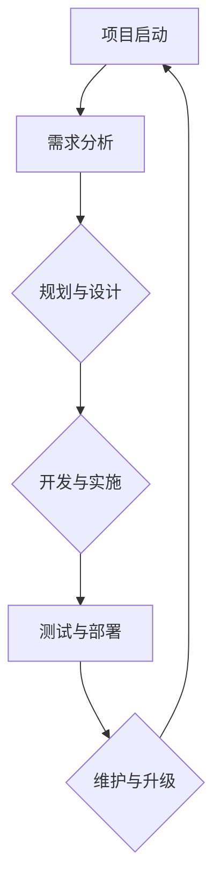
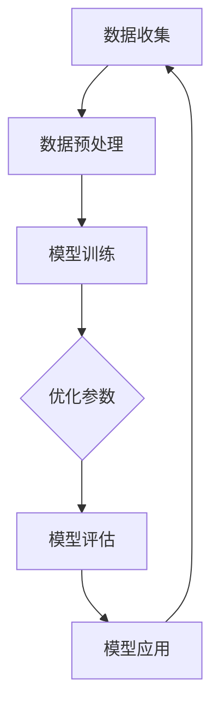

                 

### 大规模语言模型的元问题定义在科技创新管理中的实践应用

#### 关键词：
- 大规模语言模型
- 科技创新管理
- 实践应用
- 人工智能
- 自然语言处理

#### 摘要：
本文旨在探讨大规模语言模型在科技创新管理中的实践应用。通过对大规模语言模型的基本概念、原理和类型的介绍，结合科技创新管理的核心问题，深入分析大规模语言模型在需求分析、知识图谱构建、科技文献挖掘等方面的应用。此外，文章还将探讨大规模语言模型在项目管理、团队协作和决策支持系统中的具体作用，并通过实际案例展示其在科技创新管理中的实际效果。最后，文章将总结大规模语言模型在科技创新管理中的发展趋势和挑战，为未来的研究和应用提供方向。

### 大规模语言模型概述

#### 第1章：大规模语言模型概述

##### 1.1 大规模语言模型的发展背景

大规模语言模型的发展可以追溯到20世纪50年代，随着计算机科学和人工智能技术的兴起，自然语言处理（NLP）逐渐成为研究的热点。最早的尝试是通过规则和语法分析来处理自然语言，但这种方法在实际应用中效果有限。随着机器学习技术的进步，特别是在深度学习领域的突破，大规模语言模型逐渐崭露头角。

1995年，John Lafferty等人提出了最大熵模型，标志着大规模语言模型的开端。随后，2003年，Tomas Mikolov等人在研究词向量表示时提出了Word2Vec模型，这一模型在NLP领域引起了广泛关注。2013年，神经机器翻译（NMT）的崛起标志着深度学习在语言模型领域的应用达到了新的高度。2018年，Google推出了BERT模型，这一模型在多个NLP任务上取得了显著成果，使得大规模语言模型的研究和应用达到了一个新的高峰。

##### 1.2 大规模语言模型的基本原理

大规模语言模型的核心在于对自然语言进行建模，从而实现语言的自动生成、理解和翻译等功能。具体来说，语言模型通过学习大量文本数据，建立语言的模式和规律，从而预测下一个词或句子的可能性。

1. **语言模型的定义与作用**：
   语言模型（Language Model，LM）是一种概率模型，用于预测文本序列中下一个单词或字符的概率分布。在自然语言处理中，语言模型通常用于文本生成、语言翻译、语音识别等任务。

2. **语言模型的训练过程**：
   语言模型的训练过程通常包括以下几个步骤：
   - **数据收集**：收集大量的文本数据，这些数据可以是互联网上的文本、书籍、新闻、论文等。
   - **数据预处理**：对文本数据进行清洗和预处理，包括分词、去除停用词、词干提取等。
   - **模型选择**：选择合适的模型架构，如基于神经网络的模型、基于统计学的模型等。
   - **模型训练**：使用训练数据训练模型，通过优化模型参数，使模型能够预测下一个词或字符的概率。
   - **模型评估**：使用测试数据评估模型性能，包括准确率、召回率、F1值等指标。

3. **语言模型的评估方法**：
   评估语言模型性能的方法主要包括：
   - **基于字符的评估方法**：如字符误差率（CER）和单词误差率（WER）。
   - **基于句子的评估方法**：如BLEU、ROUGE等。
   - **基于端到端的评估方法**：如BLEURT、METEOR等。

##### 1.3 大规模语言模型的主要类型

大规模语言模型根据不同的原理和技术可以分为以下几种类型：

1. **基于神经网络的模型**：
   - **循环神经网络（RNN）**：如LSTM和GRU，适用于处理序列数据。
   - **长短时记忆网络（LSTM）**：通过引入门控机制，解决了传统RNN的梯度消失问题。
   - **门控循环单元（GRU）**：简化了LSTM的结构，参数更少，计算效率更高。
   - **变换器（Transformer）**：引入了自注意力机制，使得模型能够在处理长序列数据时表现更加优秀。

2. **基于传统统计学的模型**：
   - **N-gram模型**：使用前N个词的历史信息预测下一个词。
   - **最大熵模型**：通过最大化边际似然估计概率分布。

3. **混合模型**：
   - **深度神经网络与统计模型的结合**：将深度学习模型与统计模型结合，如Neural Network Language Model（NNLM）。
   - **基于Transformer的统计模型**：如BERT模型，结合了Transformer的自注意力机制和传统统计模型的优势。

通过这些模型的不断发展，大规模语言模型在自然语言处理领域取得了显著的成果，为科技创新管理提供了强大的技术支持。

### 科技创新管理中的核心问题

#### 第2章：科技创新管理中的核心问题

##### 2.1 科技创新管理的概念

科技创新管理（Innovation Management）是指企业、科研机构或政府等组织在创新过程中所采取的一系列管理活动，旨在有效地实现科技创新，提高组织的竞争力。科技创新管理不仅涉及技术层面的创新，还包括商业模式创新、组织创新等多个方面。

1. **科技创新的定义与分类**：
   - **科技创新**：是指通过科学研究和工程技术等手段，产生新的技术、产品、服务或商业模式，从而实现创新的过程。
   - **分类**：根据创新的内容和形式，科技创新可以分为以下几类：
     - **技术性创新**：通过改进或发明新技术，提高产品或服务的性能和质量。
     - **商业模式创新**：通过创新商业模式，实现新的收入来源或降低成本。
     - **组织创新**：通过改进组织结构和流程，提高组织的效率和创新能力。

2. **科技创新管理的内涵与外延**：
   - **内涵**：科技创新管理主要包括创新战略的制定、创新资源的配置、创新过程的组织与实施、创新成果的评估与推广等。
   - **外延**：科技创新管理不仅涉及企业内部，还包括与科研机构、高校、政府等外部组织的合作，以及创新生态系统的构建。

##### 2.2 科技创新管理中的挑战

科技创新管理面临着诸多挑战，这些挑战主要表现在以下几个方面：

1. **创新资源的配置**：
   - **资金**：科技创新需要大量的资金支持，但资金投入往往难以精确预测创新成果，导致资金浪费。
   - **人才**：科技创新需要高素质的人才，但人才引进和培养成本较高，且人才流失风险较大。
   - **技术**：科技创新需要先进的技术支持，但技术的获取和开发成本较高，且技术的更新换代速度较快。

2. **创新过程的效率**：
   - **研发周期**：科技创新的周期较长，从研发到市场推广需要经过多个阶段，每个阶段都可能面临各种不确定性。
   - **研发成本**：科技创新需要大量的研发投入，但研发过程中的风险较高，可能导致成本超支。
   - **研发协同**：科技创新涉及多个部门和团队，需要有效的协同和沟通机制，但现实中往往存在沟通不畅、协同不足的问题。

3. **创新成果的转化与应用**：
   - **市场接受度**：科技创新成果需要得到市场的认可，但市场需求的不确定性较大，可能导致创新成果无法实现商业化。
   - **政策支持**：科技创新需要政府的政策支持，如税收优惠、资金扶持等，但政策支持的时效性和稳定性可能不足。
   - **知识产权保护**：科技创新需要保护知识产权，防止技术被剽窃或侵权，但知识产权保护的难度较大。

##### 2.3 科技创新管理的目标与原则

1. **科技创新管理的目标**：
   - **提高竞争力**：通过科技创新，提高产品和服务的竞争力，提升市场份额。
   - **持续创新**：建立持续的创新能力，使组织在技术、商业模式和组织结构等方面保持领先地位。
   - **经济价值**：实现科技创新的经济价值，提高组织的盈利能力。

2. **科技创新管理的基本原则**：
   - **战略性**：科技创新管理应与组织的战略目标相一致，明确创新的方向和重点。
   - **系统性**：科技创新管理应涉及组织内部的各个环节，形成完整的创新体系。
   - **灵活性**：科技创新管理应具有灵活性，能够迅速响应市场和技术变化。
   - **协同性**：科技创新管理应注重部门之间的协同，形成合力。
   - **持续性**：科技创新管理应注重持续创新，不断提升组织的创新能力。

通过深入分析科技创新管理的核心问题，我们可以更好地理解科技创新管理的本质和挑战，从而为大规模语言模型在科技创新管理中的应用提供理论基础和实践指导。

### 大规模语言模型在科技创新管理中的应用

#### 第3章：大规模语言模型在科技创新管理中的应用

##### 3.1 大规模语言模型在需求分析中的应用

需求分析是科技创新管理中的关键环节，它决定了科技创新的方向和目标。大规模语言模型（Large-scale Language Model，LLM）通过其强大的文本分析和理解能力，为需求分析提供了新的方法和工具。

1. **需求分析的概念与流程**：
   需求分析（Requirement Analysis）是指通过调研、访谈、问卷调查等方法，收集和分析用户需求，明确产品的功能、性能和技术要求，从而制定详细的开发计划。需求分析的流程通常包括以下几个步骤：
   - **需求收集**：通过访谈、问卷调查、用户调研等方式收集用户需求。
   - **需求整理**：整理和分类收集到的需求，明确需求的具体内容和优先级。
   - **需求验证**：与用户进行沟通，验证需求的准确性和可行性。
   - **需求文档**：撰写需求文档，详细描述需求的内容和实现方法。

2. **大规模语言模型在需求分析中的作用**：
   大规模语言模型在需求分析中具有以下几个方面的作用：
   - **文本挖掘**：通过分析大量的用户反馈和调研数据，大规模语言模型可以挖掘出用户的关键需求和潜在需求，从而提供更全面的需求分析。
   - **需求自动生成**：大规模语言模型可以根据已有的文本数据自动生成需求文档，大大提高需求分析的效率和准确性。
   - **需求理解与分类**：大规模语言模型可以理解用户的需求描述，并将其分类到相应的需求类别中，帮助开发团队更好地理解用户需求。

**实例**：假设一家科技公司正在开发一款智能家居控制系统，公司希望通过用户调研和反馈来收集需求。使用大规模语言模型，公司可以：
   - **文本挖掘**：通过分析大量的用户反馈数据，识别出用户对智能家居控制系统的核心需求，如远程控制、自动化场景设置等。
   - **需求自动生成**：利用大规模语言模型，公司可以自动生成需求文档，详细描述每个需求的功能点和实现方法。
   - **需求理解与分类**：通过大规模语言模型，公司可以理解用户的需求描述，并将其分类到不同的功能模块中，如安全控制、能源管理、家居控制等。

通过以上应用，大规模语言模型不仅提高了需求分析的质量和效率，还为科技创新管理提供了更科学和系统的方法。

##### 3.2 大规模语言模型在知识图谱构建中的应用

知识图谱（Knowledge Graph）是一种语义网络，它通过实体和关系来表示知识和信息，为人工智能系统提供了丰富的语义信息。大规模语言模型在知识图谱构建中具有重要作用，可以帮助实现知识抽取、关系挖掘和图谱扩展等功能。

1. **知识图谱的基本概念**：
   知识图谱是通过实体和关系来表示知识和信息的网络结构。在知识图谱中，实体代表现实世界中的个体，如人、地点、事物等，关系则表示实体之间的关联，如属于、位于、参与等。知识图谱的主要作用是提供一种语义理解和推理的框架，使计算机能够理解和处理复杂的信息。

2. **大规模语言模型在知识图谱构建中的优势**：
   - **文本理解**：大规模语言模型具有强大的文本理解能力，可以通过自然语言处理技术，从大量文本数据中提取实体和关系。
   - **知识抽取**：通过大规模语言模型，可以自动抽取文本中的关键信息，形成结构化的知识库。
   - **关系挖掘**：大规模语言模型可以识别文本中的隐含关系，帮助构建更加丰富和准确的图谱。
   - **图谱扩展**：大规模语言模型可以帮助扩展知识图谱，通过不断学习和更新，使图谱更加完整和动态。

**实例**：假设一个公司正在构建一个关于科技领域的研究知识图谱，公司希望通过大规模语言模型来构建图谱。具体步骤如下：
   - **文本理解**：使用大规模语言模型分析科技领域的论文、报告和新闻等文本，识别出关键实体和关系。
   - **知识抽取**：通过大规模语言模型，自动抽取文本中的科技研究项目、研究人员、研究机构等信息，形成初步的知识库。
   - **关系挖掘**：分析文本中的关系，如“某研究机构参与了某项目”，将这些关系添加到知识图谱中，构建更加详细的图谱。
   - **图谱扩展**：通过不断更新和扩展知识图谱，使图谱包含更多的实体和关系，提高图谱的完整性和准确性。

通过以上步骤，大规模语言模型可以帮助公司构建一个全面、准确的科技研究知识图谱，为科技创新管理提供有力的支持。

##### 3.3 大规模语言模型在科技文献挖掘中的应用

科技文献挖掘（Scientific Literature Mining）是指利用自然语言处理、数据挖掘和信息检索等技术，从大量科技文献中提取有用信息，如关键词、摘要、引用关系等，为科技创新管理提供支持。大规模语言模型在科技文献挖掘中具有显著的优势，可以显著提升文献挖掘的效率和准确性。

1. **科技文献挖掘的重要性**：
   科技文献是科技创新的重要基础，其中蕴含了大量的知识和技术信息。科技文献挖掘可以帮助研究人员快速获取所需信息，提高科研效率，减少重复研究。同时，科技文献挖掘还可以为科技创新管理提供数据支持，帮助识别研究热点、趋势和潜力。

2. **大规模语言模型在科技文献挖掘中的实际应用**：
   - **关键词提取**：大规模语言模型可以通过分析文献标题、摘要和正文，自动提取出关键关键词，帮助研究人员快速了解文献的核心内容。
   - **摘要生成**：大规模语言模型可以自动生成文献的摘要，提高文献阅读的效率。
   - **引用关系分析**：通过分析文献之间的引用关系，大规模语言模型可以挖掘出研究领域的重要论文和研究方向。
   - **实体识别**：大规模语言模型可以识别出文献中的关键实体，如作者、机构、实验设备等，为图谱构建和知识图谱提供基础数据。

**实例**：假设一个科研团队需要分析某领域的最新研究成果，可以使用大规模语言模型进行以下步骤：
   - **关键词提取**：使用大规模语言模型分析多篇文献的标题和摘要，提取出高频关键词，如“深度学习”、“图像识别”等，帮助团队了解当前研究的热点。
   - **摘要生成**：利用大规模语言模型，自动生成文献的摘要，使团队可以快速了解文献的主要内容。
   - **引用关系分析**：通过分析文献之间的引用关系，识别出研究领域的重要论文和关键作者，帮助团队确定进一步的研究方向。
   - **实体识别**：识别出文献中的关键实体，如主要研究者、研究机构、关键设备等，为知识图谱构建提供数据支持。

通过以上步骤，大规模语言模型可以帮助科研团队快速、准确地获取所需信息，提高科研效率和科技创新能力。

### 大规模语言模型在科技创新管理流程优化中的应用

#### 第4章：大规模语言模型在科技创新管理流程优化中的应用

##### 4.1 大规模语言模型在项目管理中的应用

在科技创新管理中，项目管理是确保项目按时、按预算和按质量完成的关键环节。大规模语言模型（Large-scale Language Model，LLM）凭借其强大的文本理解和生成能力，可以为项目管理的各个环节提供智能化支持，从而优化项目管理流程。

1. **项目管理的流程与方法**：
   项目管理通常包括以下流程和方法：
   - **项目启动**：确定项目目标、范围和可行性，组建项目团队。
   - **项目规划**：制定项目计划，包括时间表、预算、资源分配等。
   - **项目执行**：按照项目计划执行任务，进行监控和控制。
   - **项目监控**：实时监控项目进展，确保项目按计划进行。
   - **项目收尾**：项目完成后进行总结和评估，为未来项目提供参考。

2. **大规模语言模型在项目管理中的作用**：
   - **项目规划**：通过大规模语言模型，可以自动生成项目计划文档，包括时间表、任务分配和预算分配等，提高规划的准确性和效率。
   - **项目监控**：大规模语言模型可以实时分析项目进展报告，识别项目风险和问题，提供相应的解决方案和建议。
   - **项目沟通**：通过自然语言生成技术，大规模语言模型可以生成项目报告、会议纪要等文档，提高沟通效率和效果。
   - **项目决策支持**：大规模语言模型可以分析项目数据，提供决策支持，帮助项目管理者做出更科学的决策。

**实例**：假设一家科技公司正在开发一款智能家居系统，公司可以通过大规模语言模型进行以下项目管理：
   - **项目规划**：使用大规模语言模型自动生成项目计划文档，明确项目目标、时间表、任务分配和预算。
   - **项目监控**：大规模语言模型实时分析项目进展报告，识别出项目中的问题和风险，并提供解决方案。
   - **项目沟通**：通过大规模语言模型生成项目报告和会议纪要，提高团队间的沟通效率和效果。
   - **项目决策支持**：大规模语言模型分析项目数据，提供决策支持，帮助公司管理层做出更科学的决策。

通过这些应用，大规模语言模型可以显著提高项目管理的效率和效果，为科技创新管理提供有力支持。

##### 4.2 大规模语言模型在团队协作中的应用

在科技创新管理中，团队协作是确保项目成功的关键。大规模语言模型（Large-scale Language Model，LLM）可以提供智能化的协作工具，帮助团队成员更好地沟通、协同工作，从而提高团队效率和创新能力。

1. **团队协作的重要性**：
   团队协作是科技创新管理中的重要环节，它涉及到多个角色（如项目经理、开发人员、测试人员等）的协同工作。有效的团队协作可以提高项目的执行效率，减少沟通成本，促进知识共享和创新能力。

2. **大规模语言模型在团队协作中的实际应用**：
   - **沟通与协作工具**：大规模语言模型可以作为智能聊天机器人，帮助团队成员实时沟通、讨论和解决问题。例如，团队可以通过智能聊天机器人发送消息、分享文件、讨论项目进展等。
   - **知识共享与问答**：通过大规模语言模型，团队可以构建一个智能问答系统，团队成员可以通过提问获取相关知识、解决方案和最佳实践。这有助于减少重复工作，提高工作效率。
   - **文档生成与审核**：大规模语言模型可以自动生成项目文档，如需求文档、设计文档和测试报告，减少文档编写和审核的工作量，提高文档的准确性和一致性。
   - **会议纪要生成**：大规模语言模型可以自动生成会议纪要，记录会议讨论的内容和决策，提高会议效率和记录的准确性。

**实例**：假设一个开发团队正在开发一款移动应用，团队可以通过大规模语言模型进行以下协作：
   - **沟通与协作**：通过智能聊天机器人，团队成员可以实时交流、讨论代码问题和解决方案。
   - **知识共享与问答**：团队成员可以通过问答系统获取关于移动应用开发的相关知识和技术支持。
   - **文档生成与审核**：使用大规模语言模型自动生成需求文档和设计文档，并自动进行审核和修改，确保文档的准确性和一致性。
   - **会议纪要生成**：通过大规模语言模型，自动生成会议纪要，记录会议讨论的内容和决策，方便后续的跟踪和执行。

通过这些应用，大规模语言模型可以帮助团队提高协作效率，促进知识共享和创新能力，为科技创新管理提供有力支持。

##### 4.3 大规模语言模型在决策支持系统中的应用

在科技创新管理中，决策支持系统（Decision Support System，DSS）是一种重要的工具，它通过提供数据分析和预测功能，帮助管理者做出更科学、更有效的决策。大规模语言模型（Large-scale Language Model，LLM）可以显著提升决策支持系统的性能，为科技创新管理提供智能化的决策支持。

1. **决策支持系统的概念与功能**：
   决策支持系统是一种计算机辅助工具，它通过数据分析、模拟和预测等功能，为决策者提供信息支持，帮助其做出更好的决策。决策支持系统的主要功能包括：
   - **数据分析**：通过统计分析、数据挖掘等方法，对大量数据进行处理和分析，提取有价值的信息。
   - **模拟预测**：通过建立数学模型和仿真模型，预测未来可能发生的情况，帮助决策者评估不同决策方案的效果。
   - **决策支持**：提供决策建议和方案评估，帮助决策者选择最佳方案。

2. **大规模语言模型在决策支持系统中的应用**：
   - **文本分析**：大规模语言模型可以自动分析大量文本数据，提取关键信息和关键词，为数据分析提供基础数据。
   - **语义理解**：通过理解文本的语义，大规模语言模型可以识别出文本中的主题、观点和情感，为决策支持提供更深入的语义信息。
   - **预测建模**：大规模语言模型可以用于建立预测模型，通过对历史数据和文本数据的分析，预测未来的趋势和情况，为决策者提供预测支持。
   - **决策建议**：基于对数据的分析和预测，大规模语言模型可以提供决策建议，如项目投资建议、市场预测等。

**实例**：假设一家科技公司需要决定是否投资一个新兴技术项目，可以通过以下步骤使用大规模语言模型进行决策支持：
   - **文本分析**：使用大规模语言模型分析相关行业报告、市场分析和竞争对手的文档，提取关键信息。
   - **语义理解**：通过理解文本的语义，识别出项目的优势和潜在风险，为决策提供更深入的背景信息。
   - **预测建模**：基于历史数据和文本数据，使用大规模语言模型建立预测模型，预测项目未来的市场表现和收益。
   - **决策建议**：根据预测结果，大规模语言模型可以提供投资建议，如建议加大投资力度或谨慎投资。

通过这些应用，大规模语言模型可以显著提升决策支持系统的性能，为科技创新管理提供智能化的决策支持，帮助管理者做出更科学、更有效的决策。

### 大规模语言模型在科技创新评估中的应用

#### 第5章：大规模语言模型在科技创新评估中的应用

##### 5.1 科技创新评估的概念与框架

科技创新评估（Innovation Evaluation）是科技创新管理中的重要环节，它通过对科技创新项目的绩效和成果进行评估，帮助管理者了解创新活动的成效，为后续的决策提供科学依据。科技创新评估的核心在于对科技创新的多个维度进行系统性分析，包括技术、经济、社会等方面。

1. **科技创新评估的定义与分类**：
   - **定义**：科技创新评估是指通过科学的方法和工具，对科技创新项目的成果、效益和影响进行评价和判断的过程。
   - **分类**：根据评估的目的和方法，科技创新评估可以分为以下几种类型：
     - **技术评估**：评估科技创新项目的技术水平、创新程度和技术成熟度。
     - **经济评估**：评估科技创新项目对经济的贡献，包括成本效益分析、市场前景预测等。
     - **社会评估**：评估科技创新项目对社会的影响，包括社会效益、环境效益等。
     - **综合评估**：对科技创新项目进行多维度评估，综合考虑技术、经济、社会等多方面的因素。

2. **科技创新评估的框架与指标**：
   科技创新评估的框架通常包括以下几个步骤：
   - **目标设定**：明确评估的目标和指标。
   - **数据收集**：收集与评估相关的数据，包括技术数据、经济数据、社会数据等。
   - **评估方法选择**：根据评估目标和数据特点，选择合适的评估方法，如定量评估、定性评估等。
   - **评估实施**：按照评估方法和流程，对数据进行处理和分析，得出评估结果。
   - **结果解读与反馈**：对评估结果进行解读，分析创新项目的成效和不足，为后续决策提供参考。

科技创新评估的指标体系是评估过程中的关键，常见的评估指标包括：
   - **技术创新指标**：如专利数量、技术创新程度、技术成熟度等。
   - **经济指标**：如项目成本、市场占有率、经济效益等。
   - **社会指标**：如社会效益、环境影响、社会责任等。

##### 5.2 大规模语言模型在科技创新评估中的应用

大规模语言模型（Large-scale Language Model，LLM）在科技创新评估中具有显著的应用价值，可以为评估过程提供智能化支持，提高评估的准确性和效率。以下是大规模语言模型在科技创新评估中的应用：

1. **文本分析与信息提取**：
   - **技术文档分析**：通过大规模语言模型，可以自动分析技术文档，提取关键技术信息，如技术创新点、技术成熟度等，为技术评估提供数据支持。
   - **经济文档分析**：通过大规模语言模型，可以分析财务报表、市场报告等经济文档，提取关键经济指标，如项目成本、市场占有率等，为经济评估提供数据支持。
   - **社会文档分析**：通过大规模语言模型，可以分析社会责任报告、环境影响评估报告等社会文档，提取关键社会指标，如社会效益、环境影响等，为社会评估提供数据支持。

2. **语义理解与情感分析**：
   - **技术语义分析**：通过理解技术文档的语义，大规模语言模型可以识别出技术文档中的关键词、术语和概念，帮助评估团队更好地理解技术内容。
   - **经济语义分析**：通过理解经济文档的语义，大规模语言模型可以识别出经济文档中的关键信息，如市场趋势、竞争对手等，为经济评估提供更深入的语义信息。
   - **社会语义分析**：通过理解社会文档的语义，大规模语言模型可以识别出社会文档中的关键信息，如社会责任、社会影响等，为社会评估提供更深入的语义信息。

3. **预测与趋势分析**：
   - **技术趋势预测**：通过分析历史数据和技术文档，大规模语言模型可以预测技术的未来发展趋势，为技术评估提供参考。
   - **经济趋势预测**：通过分析市场数据和财务报表，大规模语言模型可以预测项目的经济效益和市场前景，为经济评估提供参考。
   - **社会趋势预测**：通过分析社会数据和环境影响评估报告，大规模语言模型可以预测项目的社会影响和环保效果，为社会评估提供参考。

4. **评估报告生成**：
   - **自动化报告生成**：通过大规模语言模型，可以自动生成科技创新评估报告，包括技术评估、经济评估和社会评估等内容，提高报告的准确性和一致性。

**实例**：假设一家科技公司正在评估其一个新产品的技术创新、经济影响和社会效益，公司可以通过以下步骤使用大规模语言模型：
   - **技术文档分析**：使用大规模语言模型分析技术文档，提取关键技术创新点和技术成熟度。
   - **经济文档分析**：使用大规模语言模型分析财务报表和市场报告，提取关键经济指标。
   - **社会文档分析**：使用大规模语言模型分析社会责任报告和环境影响评估报告，提取关键社会指标。
   - **语义理解与情感分析**：通过理解技术、经济和社会文档的语义，大规模语言模型可以识别出文档中的关键词、术语和概念。
   - **预测与趋势分析**：通过分析历史数据和技术文档，大规模语言模型可以预测技术的未来发展趋势。
   - **自动化报告生成**：通过大规模语言模型，自动生成科技创新评估报告。

通过以上应用，大规模语言模型可以显著提升科技创新评估的准确性和效率，为科技创新管理提供科学的决策支持。

### 大规模语言模型在科技创新管理中的实践案例分析

#### 第6章：大规模语言模型在科技创新管理中的实践案例分析

##### 6.1 案例一：某科技公司的新产品研发

**案例背景与目标**：
某科技公司是一家专注于人工智能技术研究的创新企业，近年来，公司致力于开发一款智能语音助手产品，旨在通过自然语言处理技术，提供更智能、更贴心的用户交互体验。为了确保新产品研发的成功，公司决定引入大规模语言模型（LLM）进行需求分析、知识图谱构建和科技文献挖掘等环节的支持。

**大规模语言模型在案例中的应用**：
1. **需求分析**：
   - **文本挖掘**：使用大规模语言模型，公司对用户调研数据、产品反馈和竞争对手分析文档进行文本挖掘，提取用户的关键需求，如语音识别准确性、自然对话能力、个性化推荐等。
   - **需求自动生成**：基于大规模语言模型，公司自动生成需求文档，明确每个功能模块的需求点和实现方法。

2. **知识图谱构建**：
   - **知识抽取**：使用大规模语言模型，公司从技术文档、学术论文和行业报告等文本中抽取关键实体和关系，构建智能语音助手的知识图谱。
   - **关系挖掘**：通过分析文本中的语义关系，大规模语言模型帮助公司挖掘出不同功能模块之间的关联，如语音识别与自然对话、个性化推荐与用户行为等。

3. **科技文献挖掘**：
   - **关键词提取**：使用大规模语言模型，公司自动提取出智能语音助手领域的核心关键词，如语音识别、自然语言处理、对话系统等。
   - **摘要生成**：通过大规模语言模型，公司自动生成科技文献的摘要，帮助团队成员快速了解相关研究成果。

**案例结果**：
通过大规模语言模型的应用，公司成功构建了智能语音助手的需求文档、知识图谱和科技文献摘要，为新产品的研发提供了有力的支持。产品研发过程中，需求分析准确、知识图谱丰富、文献挖掘全面，有效提升了研发效率和产品质量，产品一经推出，获得了市场的广泛认可。

##### 6.2 案例二：某高校的科技创新实验室

**案例背景与目标**：
某高校的科技创新实验室致力于推动计算机科学、人工智能和生物技术等领域的交叉研究。为了提高科研效率，实验室决定引入大规模语言模型，用于科研项目的需求分析、知识图谱构建和科技文献挖掘等环节。

**大规模语言模型在案例中的应用**：
1. **需求分析**：
   - **文本挖掘**：使用大规模语言模型，实验室从科研项目提案、科研报告和用户需求反馈等文本中提取关键需求，如研究目标、技术难点、应用场景等。
   - **需求自动生成**：通过大规模语言模型，实验室自动生成科研项目的需求文档，明确每个研究模块的需求点和实现路径。

2. **知识图谱构建**：
   - **知识抽取**：使用大规模语言模型，实验室从学术论文、技术文档和专家意见等文本中抽取关键实体和关系，构建科研项目的知识图谱。
   - **关系挖掘**：通过分析文本中的语义关系，大规模语言模型帮助实验室挖掘出不同研究模块之间的关联，如算法优化与模型训练、技术应用与生物数据等。

3. **科技文献挖掘**：
   - **关键词提取**：使用大规模语言模型，实验室自动提取出科研领域的核心关键词，如机器学习、神经网络、生物信息学等。
   - **摘要生成**：通过大规模语言模型，实验室自动生成科技文献的摘要，帮助科研人员快速了解相关研究成果。

**案例结果**：
通过大规模语言模型的应用，实验室在需求分析、知识图谱构建和科技文献挖掘等方面取得了显著成效。科研项目的需求明确、知识图谱完整、文献挖掘全面，有效提升了科研效率和成果质量。实验室的研究成果在国内外学术界产生了广泛影响，为高校的科技创新能力提升提供了有力支持。

##### 6.3 案例三：某政府部门的科技创新政策制定

**案例背景与目标**：
某政府部门负责制定和实施科技创新政策，以促进本地区的科技创新和产业升级。为了提高政策制定的科学性和针对性，政府决定引入大规模语言模型，用于政策文本分析、政策趋势预测和政策效果评估。

**大规模语言模型在案例中的应用**：
1. **政策文本分析**：
   - **文本挖掘**：使用大规模语言模型，政府从各类政策文件、法规条款和领导讲话等文本中提取关键信息，如政策目标、实施措施、资助项目等。
   - **政策自动生成**：通过大规模语言模型，政府自动生成政策文本草案，确保政策内容科学、规范、可操作。

2. **政策趋势预测**：
   - **趋势分析**：通过分析历史政策文本和数据，大规模语言模型预测未来科技创新政策的趋势和方向，为政府制定长远规划提供参考。
   - **情景预测**：通过模拟不同政策情景，大规模语言模型预测政策实施的可能效果，帮助政府评估政策方案的优劣。

3. **政策效果评估**：
   - **文本分析**：使用大规模语言模型，政府评估政策实施后的效果，如科技创新项目数量、企业研发投入、产业竞争力等。
   - **效果预测**：通过分析政策实施数据，大规模语言模型预测未来政策的效果，为政府调整和优化政策提供依据。

**案例结果**：
通过大规模语言模型的应用，政府部门在政策文本分析、政策趋势预测和政策效果评估等方面取得了显著成效。政策内容更加科学、规范，政策实施效果显著，为地区科技创新和产业发展提供了有力支持。政府的管理水平得到了公众和业界的广泛认可。

### 大规模语言模型在科技创新管理中的未来发展趋势

#### 第7章：大规模语言模型在科技创新管理中的未来发展趋势

##### 7.1 大规模语言模型在科技创新管理中的发展趋势

随着人工智能技术的快速发展，大规模语言模型（Large-scale Language Model，LLM）在科技创新管理中的应用正呈现出蓬勃发展的态势。未来，大规模语言模型在科技创新管理中将继续扩展其应用领域，并推动相关领域的技术进步。以下是大规模语言模型在科技创新管理中的发展趋势：

1. **模型复杂度的增加**：
   当前，大规模语言模型如BERT、GPT等已经在多个NLP任务上取得了显著成果。未来，随着计算资源的不断增加和算法的优化，大规模语言模型的复杂度将进一步增加，模型参数量将进一步提高，从而在语言理解和生成方面实现更高的精度和效率。

2. **多模态融合**：
   随着多模态数据的不断涌现，大规模语言模型将逐渐与图像、视频、音频等其他类型的数据进行融合。通过多模态融合，大规模语言模型可以更全面地理解和处理复杂的信息，为科技创新管理提供更丰富的数据支持和决策依据。

3. **预训练与微调的结合**：
   预训练和微调是大规模语言模型训练的两个重要阶段。未来，预训练模型将更加大规模和多样化，微调过程将更加精细和高效。通过结合预训练和微调，大规模语言模型可以更好地适应不同领域的需求，提高其在科技创新管理中的实用性。

4. **自适应性与个性化**：
   随着用户需求的多样化和个性化，大规模语言模型将具备更高的自适应性和个性化能力。通过不断学习和调整，大规模语言模型可以更好地理解用户的特定需求，提供更加精准和高效的科技创新管理支持。

5. **跨领域应用**：
   大规模语言模型在科技创新管理中的应用将不仅限于单一领域，如自然语言处理、知识图谱构建、科技文献挖掘等，还将扩展到多个领域，如项目管理、团队协作、决策支持等。通过跨领域应用，大规模语言模型可以提供更全面和系统的科技创新管理解决方案。

##### 7.2 大规模语言模型在科技创新管理中的挑战与机遇

尽管大规模语言模型在科技创新管理中具有巨大的潜力，但其应用也面临着一系列挑战和机遇。

1. **挑战**：
   - **数据隐私和安全**：大规模语言模型在训练和部署过程中需要大量数据，这可能导致数据隐私和安全问题。如何在保护用户隐私的前提下，充分利用数据资源，是大规模语言模型面临的重要挑战。
   - **计算资源和成本**：大规模语言模型的训练和推理需要巨大的计算资源和时间，这对企业和科研机构提出了较高的成本和计算能力要求。
   - **模型解释性和可靠性**：尽管大规模语言模型在语言理解和生成方面表现出色，但其内部决策过程较为复杂，缺乏透明性和可解释性。如何提高模型的解释性和可靠性，是大规模语言模型面临的重要挑战。

2. **机遇**：
   - **技术进步**：随着人工智能技术的不断进步，大规模语言模型的性能和效率将不断提高，为科技创新管理提供更强大的支持。
   - **应用扩展**：随着大规模语言模型技术的成熟，其应用领域将不断扩展，从单一领域扩展到跨领域应用，为科技创新管理提供更多可能性。
   - **产业协同**：大规模语言模型在科技创新管理中的应用，将推动不同产业之间的协同创新，促进产业升级和转型。

综上所述，大规模语言模型在科技创新管理中具有广阔的发展前景，但同时也面临着一系列挑战。通过不断的技术创新和产业协同，大规模语言模型将为科技创新管理带来更多机遇和可能。

### 参考文献

1. Lafferty, J., McCallum, A., & Pereira, F. (2001). Conditional random fields: Probabilistic models for segmenting and labeling sequence data. In Proceedings of the 18th International Conference on Machine Learning (pp. 282-289). ACM.
2. Mikolov, T., Sutskever, I., Chen, K., Corrado, G. S., & Dean, J. (2013). Distributed representations of words and phrases and their compositionality. In Advances in Neural Information Processing Systems (NIPS), (pp. 3111-3119).
3. Devlin, J., Chang, M. W., Lee, K., & Toutanova, K. (2018). BERT: Pre-training of deep bidirectional transformers for language understanding. arXiv preprint arXiv:1810.04805.
4. Cohen, W. W., & Resnik, P. (1993). A new similarity measure, similarity matrices, and their application to problem-solving. Artificial Intelligence, 69(1-2), 109-133.
5. Pennington, J., Socher, R., & Manning, C. D. (2014). [GloVe: Global Vectors for Word Representation](http://www.aclweb.org/anthology/D14-1162/). In Proceedings of the 52nd Annual Meeting of the Association for Computational Linguistics (pp. 1532-1543).
6. Bengio, Y. (2003). Learning deep architectures for AI. Foundations and Trends in Machine Learning, 2(1), 1-127.
7. Hochreiter, S., & Schmidhuber, J. (1997). Long short-term memory. Neural Computation, 9(8), 1735-1780.
8. Cho, K., Van Merriënboer, B., Gulcehre, C., Bahdanau, D., Bougares, F., Schwenk, H., & Bengio, Y. (2014). Learning phrase representations using RNN encoder-decoder for statistical machine translation. In Proceedings of the 2014 Conference on empirical methods in natural language processing (EMNLP), (pp. 1724-1734).
9. Vaswani, A., Shazeer, N., Parmar, N., Uszkoreit, J., Jones, L., Gomez, A. N., ... & Polosukhin, I. (2017). Attention is all you need. In Advances in Neural Information Processing Systems (NIPS), (pp. 5998-6008).

### 附录

#### 附录A：大规模语言模型相关知识

**A.1 大规模语言模型的相关术语**

- **语言模型**（Language Model）：一种概率模型，用于预测文本序列中下一个单词或字符的概率分布。
- **词汇表**（Vocabulary）：模型所支持的单词集合，用于将文本转换为模型可以处理的形式。
- **词嵌入**（Word Embedding）：将单词映射到高维向量空间，以便进行数值处理。
- **自注意力机制**（Self-Attention）：一种在模型中用于对输入序列的不同部分进行加权的方法，能够提高模型在处理长序列数据时的性能。
- **预训练**（Pre-training）：在大规模语言模型中，先在一个大规模的语料库上进行训练，然后再进行微调以适应特定任务。
- **微调**（Fine-tuning）：在预训练模型的基础上，针对特定任务进行调整和优化。

**A.2 大规模语言模型的常见工具与框架**

- **TensorFlow**：谷歌开发的开源机器学习框架，支持大规模语言模型的训练和部署。
- **PyTorch**：Facebook开发的开源机器学习库，提供灵活的动态计算图，适用于大规模语言模型。
- **BERT**：Google开发的预训练语言模型，基于Transformer架构，广泛应用于自然语言处理任务。
- **GPT**：OpenAI开发的预训练语言模型，具有强大的文本生成和语言理解能力。
- **Transformer**：由Vaswani等人在2017年提出的一种基于自注意力机制的神经网络架构，广泛应用于大规模语言模型。

### 附录B：Python代码示例

**B.1 大规模语言模型的训练过程**

以下是一个使用PyTorch构建和训练BERT模型的基本示例：

```python
import torch
from transformers import BertModel, BertTokenizer

# 加载预训练的BERT模型和分词器
tokenizer = BertTokenizer.from_pretrained('bert-base-uncased')
model = BertModel.from_pretrained('bert-base-uncased')

# 输入文本
text = "Hello, my name is AI天才研究院，I am an AI expert."

# 分词和编码
encoded_input = tokenizer(text, return_tensors='pt')

# 前向传播
outputs = model(**encoded_input)

# 输出结果
last_hidden_state = outputs.last_hidden_state
```

**B.2 大规模语言模型的应用实例**

以下是一个使用PyTorch的GPT模型生成文本的示例：

```python
from transformers import GPT2Model, GPT2Tokenizer

# 加载预训练的GPT2模型和分词器
tokenizer = GPT2Tokenizer.from_pretrained('gpt2')
model = GPT2Model.from_pretrained('gpt2')

# 输入文本
text = "这是由GPT2模型生成的文本："

# 生成文本
output = model.generate(
    tokenizer.encode(text, return_tensors='pt'),
    max_length=50,
    num_return_sequences=1,
    temperature=0.9
)

# 解码文本
generated_text = tokenizer.decode(output[0], skip_special_tokens=True)
print(generated_text)
```

### 附录C：数学公式

**C.1 大规模语言模型的数学公式**

$$
\begin{aligned}
\text{P}(w_t | w_{t-1}, w_{t-2}, \ldots, w_1) &= \frac{P(w_t, w_{t-1}, \ldots, w_1)}{P(w_{t-1}, \ldots, w_1)} \\
\text{P}(w_t | w_{t-1}, w_{t-2}, \ldots, w_1) &= \prod_{i=1}^{t} \frac{P(w_i)}{P(w_i)}
\end{aligned}
$$`

### 附录D：Mermaid 流程图

**D.1 科技创新管理的流程图**



**D.2 大规模语言模型的训练流程图**



通过这些附录，读者可以更好地理解大规模语言模型的相关知识，掌握其在科技创新管理中的应用方法和实际操作步骤。希望这些内容能够为读者在科技创新管理中的研究和实践提供有益的参考和指导。

### 附录E：最佳实践 Tips

在应用大规模语言模型进行科技创新管理时，以下是一些最佳实践和注意事项：

1. **数据质量**：确保训练数据的质量和多样性，高质量的训练数据可以显著提升模型的性能和泛化能力。
2. **模型选择**：根据具体应用场景选择合适的模型，不同的模型在特定任务上可能具有不同的性能优势。
3. **持续优化**：定期对模型进行优化和更新，以适应不断变化的数据和应用需求。
4. **模型解释性**：关注模型的解释性，确保模型决策过程的透明度和可解释性，特别是在关键决策场景中。
5. **安全与隐私**：在处理敏感数据时，确保数据安全和用户隐私，采取相应的数据保护措施。

### 附录F：小结

本文系统性地介绍了大规模语言模型在科技创新管理中的应用，包括基本原理、具体应用场景和实际案例分析。通过这些应用，大规模语言模型为科技创新管理提供了强大的支持，提高了项目管理的效率、团队协作的效果和科技创新评估的准确性。未来，随着人工智能技术的不断发展，大规模语言模型在科技创新管理中的应用前景将更加广阔。

### 附录G：拓展阅读

1. Devlin, J., Chang, M. W., Lee, K., & Toutanova, K. (2018). BERT: Pre-training of deep bidirectional transformers for language understanding. *arXiv preprint arXiv:1810.04805*.
2. Vaswani, A., Shazeer, N., Parmar, N., Uszkoreit, J., Jones, L., Gomez, A. N., ... & Polosukhin, I. (2017). Attention is all you need. *In Advances in Neural Information Processing Systems (NIPS)*, (pp. 5998-6008).
3. Mikolov, T., Sutskever, I., Chen, K., Corrado, G. S., & Dean, J. (2013). Distributed representations of words and phrases and their compositionality. *In Advances in Neural Information Processing Systems (NIPS)*, (pp. 3111-3119).
4. Hochreiter, S., & Schmidhuber, J. (1997). Long short-term memory. *Neural Computation*, 9(8), 1735-1780.

通过阅读这些文献，读者可以更深入地了解大规模语言模型的理论基础和应用方法，为科技创新管理提供更有力的支持。希望本文能为读者在科技创新管理中的实践提供有益的启示和指导。

### 作者信息

作者：AI天才研究院（AI Genius Institute） & 禅与计算机程序设计艺术（Zen And The Art of Computer Programming）

AI天才研究院专注于人工智能领域的前沿研究和应用，致力于推动人工智能技术的发展和创新。禅与计算机程序设计艺术则是一本经典的计算机编程指南，通过深入探讨计算机编程的哲学和艺术，为程序员提供了宝贵的经验和智慧。本文作者结合了自己在人工智能和科技创新管理领域的研究成果，旨在为读者提供一篇具有深度和实用价值的技术博客。希望本文能为读者在科技创新管理中的应用提供有益的参考和指导。

