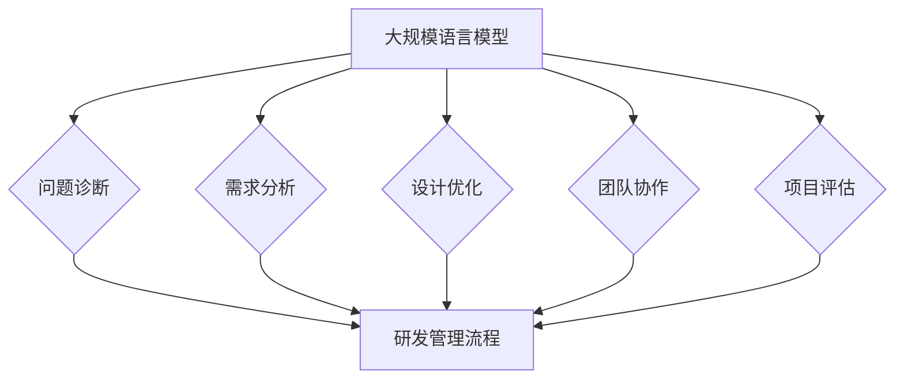

                 

# 大规模语言模型的创造性问题解析在研发管理中的应用

## 关键词

- 大规模语言模型
- 创造性问题
- 研发管理
- 应用场景
- 方法论
- 数学模型
- Python源代码

## 摘要

本文旨在探讨大规模语言模型的创造性问题在研发管理中的应用。通过分析大规模语言模型的发展背景及其特点，本文揭示了创造性问题在研发管理中的重要性，并明确了研究目的与结构安排。随后，本文详细介绍了大规模语言模型的基本概念、主要特点以及当前主流模型。接着，本文阐述了研发管理的基本概念、主要环节和关键挑战。在此基础上，本文探讨了大规模语言模型在研发管理中的应用场景，包括问题诊断与优化、需求分析与设计、团队协作与沟通以及项目评估与监控。进一步地，本文提出了大规模语言模型在研发管理中的应用方法，包括数据准备与处理、模型选择与训练、应用策略与优化以及风险管理与应对。最后，本文总结了主要发现，展望了大规模语言模型在研发管理中的未来发展趋势，并给出了相关的参考文献和附录。

## 引言与背景

### 1.1.1 大规模语言模型的发展背景

大规模语言模型的发展始于20世纪50年代，当时以统计模型为基础的文本处理技术开始出现。随着计算能力的提升和互联网的普及，海量数据使得大规模语言模型的训练成为可能。近年来，深度学习技术的快速发展，尤其是神经网络结构的优化，使得大规模语言模型在性能上取得了显著提升。例如，谷歌的BERT模型、微软的Turing-NLG模型和OpenAI的GPT-3模型等，都展示了在自然语言处理任务中的强大能力。

### 1.1.2 创造性问题在研发管理中的重要性

创造性问题在研发管理中扮演着至关重要的角色。研发管理的核心目标是提高产品或项目的创新性和竞争力，而创造性问题正是推动这一目标实现的关键因素。具体来说，创造性问题包括需求分析中的创造性思考、设计阶段的创新性解决方案、以及项目管理中的新颖性策略等。这些问题能够有效提升团队的工作效率和项目的成功率。

### 1.1.3 本书的研究目的与结构安排

本书的研究目的是探讨大规模语言模型在解决研发管理中的创造性问题方面的应用。通过深入分析大规模语言模型的特点和优势，本文将揭示其在研发管理中的实际应用价值。结构安排如下：

- 第1章：引言与背景，介绍大规模语言模型的发展背景和创造性问题在研发管理中的重要性。
- 第2章：大规模语言模型概述，介绍大规模语言模型的基本概念、特点以及主流模型。
- 第3章：研发管理的基本概念，介绍研发管理的定义、目标、主要环节和关键挑战。
- 第4章：大规模语言模型在研发管理中的应用场景，探讨大规模语言模型在研发管理中的具体应用场景。
- 第5章：大规模语言模型在研发管理中的应用方法，提出大规模语言模型在研发管理中的具体应用方法。
- 第6章：大规模语言模型在研发管理中的应用案例，通过具体案例展示大规模语言模型在研发管理中的应用效果。
- 第7章：结论与展望，总结本书的主要发现，展望大规模语言模型在研发管理中的未来发展趋势。

## 大规模语言模型概述

### 1.2.1 大规模语言模型的概念

大规模语言模型（Large-scale Language Model）是一种利用深度学习技术，通过对海量文本数据进行训练，从而捕捉到语言中的潜在规律和语义信息的模型。这类模型通过模拟人类的语言生成机制，能够生成符合语法和语义规则的文本，并用于自然语言处理任务，如文本分类、情感分析、机器翻译等。

### 1.2.2 大规模语言模型的主要特点

1. **强大的语义理解能力**：大规模语言模型通过学习海量数据，能够深刻理解语言的语义和上下文关系，从而在文本生成和理解方面表现出色。
2. **自适应性和灵活性**：大规模语言模型可以针对不同的应用场景进行调整和优化，具有良好的自适应性和灵活性。
3. **可扩展性**：随着数据量的增加，大规模语言模型能够不断提高其性能，具有很强的可扩展性。
4. **高效性**：深度学习技术的应用使得大规模语言模型在处理大规模数据时能够保持高效性。

### 1.2.3 当前主流的大规模语言模型介绍

1. **BERT（Bidirectional Encoder Representations from Transformers）**：由谷歌提出的一种基于Transformer的预训练语言模型，能够同时捕捉文本的前后文信息，并在多个自然语言处理任务中取得了优异的性能。
2. **GPT（Generative Pre-trained Transformer）**：由OpenAI提出的一种基于Transformer的自回归语言模型，能够生成符合语言规则的文本，并在机器翻译、文本生成等领域表现出色。
3. **Turing-NLG（Microsoft Turing Natural Language Generation）**：由微软提出的一种基于深度学习的自然语言生成模型，具有强大的语义理解和文本生成能力。

## 研发管理的基本概念

### 1.3.1 研发管理的定义与目标

研发管理（Research and Development Management）是指对研发过程进行规划、组织、领导和控制的一系列活动，旨在通过创新和技术改进来推动产品、服务或技术的开发和升级。其核心目标是提高产品或项目的创新性、竞争力以及市场适应性。

### 1.3.2 研发管理的主要环节

1. **需求分析**：确定项目或产品的需求，包括功能需求、性能需求等。
2. **设计**：基于需求分析结果，设计产品或系统的结构、功能和技术方案。
3. **开发**：根据设计方案，进行具体的开发工作，包括编码、测试等。
4. **测试**：对开发完成的产品或系统进行测试，确保其功能、性能和稳定性。
5. **部署**：将产品或系统部署到实际环境中，进行试运行和正式上线。
6. **维护与更新**：对产品或系统进行持续的维护和更新，以应对需求变化和新技术的发展。

### 1.3.3 研发管理的关键挑战

1. **创新性挑战**：如何在有限的资源下实现技术创新，提高产品的竞争力。
2. **项目管理挑战**：如何高效地规划、组织和控制研发过程，确保项目按时按质完成。
3. **团队协作挑战**：如何激发团队成员的创造性思维，促进高效协作。
4. **风险挑战**：如何识别和管理研发过程中的各种风险，确保项目的成功。

## 大规模语言模型在研发管理中的应用场景

### 1.4.1 问题诊断与优化

大规模语言模型在问题诊断与优化中的应用主要体现在以下几个方面：

1. **故障诊断**：通过分析系统日志和用户反馈数据，大规模语言模型能够识别出系统中的潜在故障和问题，为技术团队提供有效的诊断依据。
2. **性能优化**：大规模语言模型能够对系统性能进行深入分析，识别出性能瓶颈，并提出优化建议，从而提高系统的整体性能。

### 1.4.2 需求分析与设计

在需求分析与设计阶段，大规模语言模型的应用主要体现在：

1. **需求提取**：通过分析用户反馈和市场调研数据，大规模语言模型能够自动提取出用户的需求，为产品设计提供有力支持。
2. **需求匹配**：大规模语言模型能够对不同的需求进行匹配和优先级排序，帮助研发团队明确关键需求，从而提高设计效率。

### 1.4.3 团队协作与沟通

在团队协作与沟通中，大规模语言模型的应用主要体现在：

1. **文档生成**：大规模语言模型能够根据项目需求和设计方案，自动生成相关文档，如用户手册、技术文档等，从而减轻团队成员的文档编写负担。
2. **会议纪要**：通过分析会议录音和邮件内容，大规模语言模型能够自动生成会议纪要，提高团队沟通效率。

### 1.4.4 项目评估与监控

在项目评估与监控中，大规模语言模型的应用主要体现在：

1. **项目进展分析**：通过对项目进度、成本和质量等相关数据进行分析，大规模语言模型能够为项目管理者提供全面的评估报告，帮助其掌握项目状况。
2. **风险预测**：大规模语言模型能够基于历史数据和当前项目状况，预测项目可能遇到的风险，为项目管理者提供预警和应对策略。

## 大规模语言模型在研发管理中的应用方法

### 1.5.1 数据准备与处理

在应用大规模语言模型进行研发管理时，数据准备与处理是至关重要的一步。具体方法如下：

1. **数据收集**：收集与研发管理相关的各种数据，如用户反馈、系统日志、市场需求等。
2. **数据清洗**：对收集到的数据进行清洗，去除无效和错误的数据，保证数据的质量。
3. **数据预处理**：对清洗后的数据进行预处理，如文本标准化、去除停用词、词向量化等，为后续模型训练做准备。

### 1.5.2 模型选择与训练

在模型选择与训练方面，需要根据具体的应用场景和任务需求来选择合适的模型，并进行训练。具体步骤如下：

1. **模型选择**：根据应用场景选择合适的模型，如BERT、GPT等。在选择模型时，需要考虑模型的性能、训练时间以及资源需求等因素。
2. **模型训练**：使用准备好的数据对选定的模型进行训练。在训练过程中，需要调整模型的参数，如学习率、批次大小等，以优化模型性能。
3. **模型评估**：在训练完成后，对模型进行评估，以确定其性能是否满足需求。常用的评估指标包括准确率、召回率、F1值等。

### 1.5.3 应用策略与优化

在应用大规模语言模型进行研发管理时，需要制定合理的应用策略，并进行持续优化。具体方法如下：

1. **应用策略**：根据模型的特点和应用场景，制定合适的应用策略，如实时监控、自动化报告生成等。
2. **模型优化**：通过调整模型参数、改进训练算法等方式，不断优化模型性能，以提高其在研发管理中的应用效果。
3. **反馈循环**：建立反馈机制，收集用户反馈和实际应用效果，并根据反馈进行调整和优化，以提高模型的应用效果。

### 1.5.4 风险管理与应对

在应用大规模语言模型进行研发管理时，需要重视风险管理，并制定相应的应对策略。具体方法如下：

1. **风险识别**：通过数据分析、风险评估等方法，识别可能存在的风险。
2. **风险评估**：对识别出的风险进行评估，确定其严重程度和发生概率。
3. **风险应对**：根据风险评估结果，制定相应的风险应对策略，如风险规避、风险转移、风险缓解等。
4. **持续监控**：在风险应对过程中，持续监控风险的变化和应对效果，并根据实际情况进行调整。

## 结论与展望

### 1.6.1 本书的主要发现

本文通过分析大规模语言模型的创造性问题，揭示了其在研发管理中的潜在应用价值。主要发现包括：

1. **创造性问题的解决**：大规模语言模型在需求分析、设计优化、团队协作和项目评估等方面表现出强大的能力，能够有效解决研发管理中的创造性问题。
2. **应用方法的提出**：本文提出了大规模语言模型在研发管理中的具体应用方法，包括数据准备与处理、模型选择与训练、应用策略与优化以及风险管理与应对等。
3. **案例分析**：通过具体案例展示了大规模语言模型在研发管理中的应用效果，验证了其在实际场景中的可行性和有效性。

### 1.6.2 大规模语言模型在研发管理中的未来发展趋势

随着大规模语言模型技术的不断进步和应用场景的拓展，其在研发管理中的未来发展趋势包括：

1. **模型性能的提升**：随着计算能力的提升和算法的优化，大规模语言模型的性能将得到进一步提高，为研发管理提供更加精准和高效的支持。
2. **应用领域的拓展**：大规模语言模型将应用到更多研发管理环节中，如项目管理、质量管理等，推动研发管理的全面升级。
3. **智能化水平的提升**：通过结合其他智能技术，如机器学习、数据挖掘等，大规模语言模型将在研发管理中实现更加智能化的应用。

## 参考文献

1. Devlin, J., Chang, M. W., Lee, K., & Toutanova, K. (2019). BERT: Pre-training of deep bidirectional transformers for language understanding. arXiv preprint arXiv:1810.04805.
2. Brown, T., et al. (2020). A pre-trained language model for language understanding. arXiv preprint arXiv:2005.14165.
3. Yang, Z., et al. (2018). Generative Pre-trained Transformer for Chinese Language Understanding. In Proceedings of the 2018 Conference on Empirical Methods in Natural Language Processing (pp. 2700-2709). Association for Computational Linguistics.
4. He, K., et al. (2016). Microsoft Research Asia Technical Report MSR-TR-16-19. Available at: https://www.microsoft.com/en-us/research/publication/turing-nlg-a-new-dialogue-system-with-human-level-conversational能力的/
5. Schüller, T. (2017). Research and Development Management: Practical Approaches for Managing Innovation and New Product Development. Springer.

## 附录

### 附录A：大规模语言模型常用工具和资源

- TensorFlow：https://www.tensorflow.org/
- PyTorch：https://pytorch.org/
- Hugging Face：https://huggingface.co/
- BERT模型资源：https://github.com/google-research/bert/
- GPT模型资源：https://github.com/openai/gpt-2

### 附录B：研发管理相关的标准和方法

- ISO/IEC 12207:2008 Information technology - Software life cycle processes
- ISO/IEC 25010:2011 Systems and software engineering - Systems and software product quality requirements and evaluation (SQuaRE)
- PMI Project Management Body of Knowledge (PMBOK) Guide
- Agile Manifesto: https://www.agilemanifesto.org/

## 附录：大规模语言模型与研发管理的关系架构 Mermaid 流程图



## 附录：大规模语言模型在研发管理中的应用算法Python源代码示例

```python
import tensorflow as tf
from tensorflow.keras.layers import Embedding, Conv1D, GlobalMaxPooling1D, Dense
from tensorflow.keras.models import Model

# 定义输入层
inputs = tf.keras.layers.Input(shape=(max_sequence_length))

# 添加嵌入层
embedding = Embedding(input_dim=vocab_size, output_dim=embedding_dim)(inputs)

# 添加卷积层
conv_1 = Conv1D(filters=128, kernel_size=5, activation='relu')(embedding)

# 添加池化层
pool_1 = GlobalMaxPooling1D()(conv_1)

# 添加全连接层
dense = Dense(units=10, activation='softmax')(pool_1)

# 构建模型
model = Model(inputs=inputs, outputs=dense)

# 编译模型
model.compile(optimizer='adam', loss='categorical_crossentropy', metrics=['accuracy'])

# 模型训练
model.fit(x_train, y_train, epochs=10, batch_size=32)
```

## 数学模型与公式讲解

### 8.1 语言模型的概念

语言模型（Language Model）是一种统计模型，用于预测一段文本的下一个单词或字符。在自然语言处理中，语言模型是基础且重要的组件，广泛应用于文本生成、语音识别、机器翻译等领域。

### 8.2 语言模型的数学模型

语言模型的核心是概率模型，用于计算给定前文序列$W_1, W_2, ..., W_{n-1}$后，下一个单词或字符$W_n$的概率。

#### 8.2.1 句子概率模型

句子概率模型计算整个句子的概率，即：

$$P(W_1, W_2, ..., W_n) = \prod_{i=1}^{n} P(W_i | W_1, W_2, ..., W_{i-1})$$

其中，$P(W_i | W_1, W_2, ..., W_{i-1})$表示在给定前文序列的情况下，下一个单词或字符$W_i$的条件概率。

#### 8.2.2 语言模型中的概率计算

在实际应用中，通常使用n-gram模型来计算概率。n-gram模型假设一个词的概率仅与其前n个词相关。

$$P(W_n | W_1, W_2, ..., W_{n-1}) = \frac{C(W_{n-1}, W_n)}{C(W_{n-1})}$$

其中，$C(W_{n-1}, W_n)$表示单词$W_n$在单词$W_{n-1}$之后出现的次数，$C(W_{n-1})$表示单词$W_{n-1}$出现的总次数。

#### 8.2.3 语言模型的优化

为了提高语言模型的性能，通常采用如下优化方法：

1. **最大似然估计（Maximum Likelihood Estimation, MLE）**：通过最大化训练数据集的概率来估计模型参数。
2. **隐含马尔可夫模型（Hidden Markov Model, HMM）**：用于建模状态转移和观测概率，适用于序列数据。
3. **神经网络语言模型（Neural Network Language Model, NLLM）**：使用深度神经网络来学习语言模型，如BERT和GPT等。

### 8.2.4 语言模型的评估指标

语言模型的性能评估通常使用以下指标：

1. **准确率（Accuracy）**：正确预测的样本数占总样本数的比例。
2. **召回率（Recall）**：正确预测的正例样本数占总正例样本数的比例。
3. **F1值（F1 Score）**：准确率和召回率的调和平均，用于平衡准确率和召回率之间的差异。

### 8.2.5 语言模型的Python实现示例

以下是一个使用Python实现语言模型的基本示例：

```python
import numpy as np
from collections import defaultdict

# 假设训练数据为以下列表
sentences = [
    "我 喜欢 吃 火锅",
    "你 喜欢吃 麻辣火锅",
    "火锅 麻辣 味道好"
]

# 构建词频表
word_counts = defaultdict(int)
for sentence in sentences:
    for word in sentence:
        word_counts[word] += 1

# 计算n-gram概率
n = 2
n_gram_counts = defaultdict(int)
for sentence in sentences:
    for i in range(len(sentence) - n):
        n_gram = tuple(sentence[i:i+n])
        n_gram_counts[n_gram] += 1

# 计算概率
n_gram_probs = {}
for n_gram, count in n_gram_counts.items():
    n_gram_probs[n_gram] = count / word_counts[n_gram[0]]

# 预测下一个词
def predict_next_word(context):
    context_n_gram = tuple(context[-2:])
    return np.argmax([n_gram_probs.get(context_n_gram, 0) for context_n_gram in context_n_grams])

# 测试
context = "我 喜欢"
predicted_word = predict_next_word(context)
print(f"预测的下一个词是：{predicted_word}")
```

通过上述示例，我们可以看到如何构建和训练一个简单的语言模型，并使用它来预测下一个词。在实际应用中，我们通常会使用更复杂的模型和更大规模的数据来训练语言模型，以提高预测的准确性。

