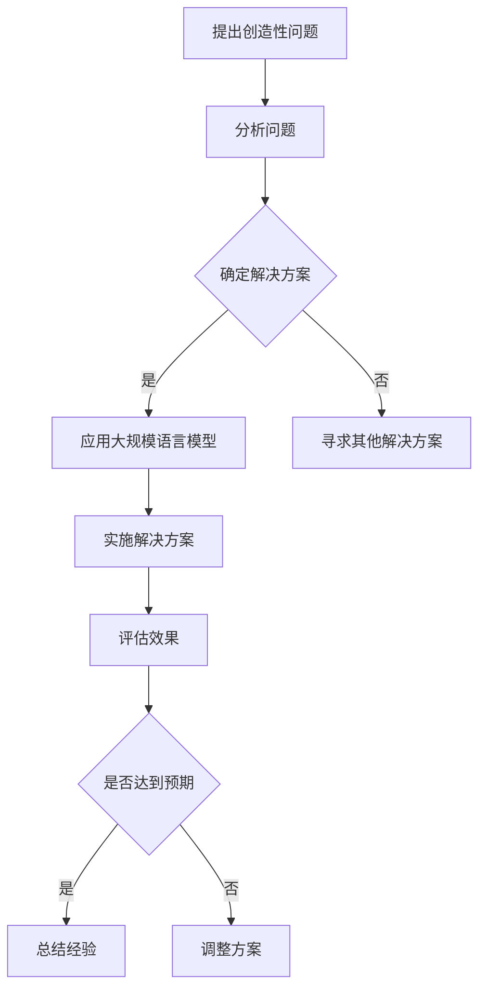

                 

### 引言与背景

#### 1.1 大规模语言模型的基本概念

大规模语言模型是一种通过机器学习算法，对大量文本数据进行分析和建模，以实现自然语言理解和生成的深度神经网络模型。这类模型能够从大量的文本数据中学习到语言规律，从而具备生成自然语言文本、回答问题、翻译语言、提取信息等功能。

大规模语言模型的核心特点包括：

1. **数据量巨大**：这些模型通常基于数十亿、甚至数万亿级别的文本数据进行训练，以获得丰富的语言知识。
2. **参数规模庞大**：模型的参数数量可以达到数十亿级别，这使得模型能够捕捉到语言中的细微差异和复杂模式。
3. **深度神经网络结构**：大规模语言模型通常采用多层神经网络结构，通过逐层提取特征，实现对文本的深层理解和生成。

#### 1.2 大规模语言模型的发展历程

大规模语言模型的发展可以分为几个阶段：

- **早期探索**：20世纪80年代，早期的研究尝试使用统计方法处理自然语言，如n-gram模型和决策树。
- **词袋模型**：20世纪90年代，词袋模型（Bag of Words, BoW）和朴素贝叶斯分类器等方法开始流行，但它们在处理语义和上下文方面存在局限。
- **深度学习兴起**：2006年，Hinton等人提出了深度信念网络（Deep Belief Networks, DBN），开启了深度学习在自然语言处理领域的研究。
- **预训练语言模型**：2018年，Google推出了BERT（Bidirectional Encoder Representations from Transformers），标志着预训练语言模型进入新阶段。BERT通过在大规模文本语料上进行预训练，然后微调到特定任务，大大提升了自然语言处理的效果。
- **多模态和泛化能力**：近年来，研究人员探索将大规模语言模型应用于多模态学习，如文本-图像、文本-视频等，同时也在提升模型的泛化能力方面取得进展。

#### 1.3 大规模语言模型的应用现状

当前，大规模语言模型在多个领域取得了显著的成果：

- **文本生成**：包括文章撰写、对话系统、机器翻译等。
- **知识抽取**：从文本中提取结构化信息，用于问答系统、搜索引擎等。
- **情感分析**：对文本的情感倾向进行分析，应用于客户反馈分析、市场研究等。
- **语音识别**：结合深度学习技术，提升语音识别的准确率和效率。
- **多模态学习**：将语言模型与其他类型的数据（如图像、视频）结合，应用于跨模态任务。

大规模语言模型的应用不仅限于上述领域，还在不断拓展，其潜力仍在不断挖掘。

#### 1.4 大规模语言模型的优势与挑战

大规模语言模型的优势体现在以下几个方面：

- **强大的语义理解能力**：通过学习海量文本数据，模型能够捕捉到语言的复杂结构和深层语义。
- **高效的文本生成**：模型能够生成连贯、自然的文本，适用于自动化内容创作。
- **多任务处理能力**：预训练的大规模语言模型能够适应多种自然语言处理任务，无需针对每个任务重新训练。
- **自适应能力**：通过持续学习新的文本数据，模型能够不断优化性能，适应不断变化的语言环境。

然而，大规模语言模型也面临一些挑战：

- **计算资源需求**：模型训练和推理需要大量的计算资源，对硬件设施要求较高。
- **数据隐私和安全**：模型在训练过程中可能暴露用户的隐私数据，需采取有效的保护措施。
- **可解释性和透明性**：模型决策过程较为复杂，缺乏可解释性，不利于用户理解和信任。
- **模型偏见**：模型在训练过程中可能吸收到数据中的偏见，导致生成的内容带有偏见。

在接下来的章节中，我们将深入探讨大规模语言模型在创造性问题中的应用，以及其在研发战略中的潜在价值。

## 大规模语言模型的创造性问题

### 2.1 创造性问题的定义与分类

创造性问题是指那些需要创新思维和原创性解决方案的问题，这些问题通常没有明确的答案或标准的方法来解决。创造性问题可以按照不同的分类方式进行划分，主要包括以下几种类型：

1. **问题求解类**：这类问题通常涉及数学、科学或工程领域，需要运用逻辑推理和数学方法找到解决方案。例如，解决复杂的数学方程、设计新型机械结构等。
2. **设计创新类**：这类问题侧重于设计新的产品、服务或系统，要求在功能和形式上具有创新性。例如，设计一款具有革命性功能的新手机、创造一种新型建筑材料等。
3. **艺术创作类**：这类问题涉及文学、音乐、绘画等艺术形式，强调原创性和个人风格的表达。例如，创作一首新颖的乐曲、绘制一幅独特的画作等。
4. **社会创新类**：这类问题关注社会问题和公共利益的解决，涉及政策制定、社区建设等。例如，设计一种有效的扶贫方案、创建一个可持续发展的社区等。

### 2.2 大规模语言模型在创造性问题中的应用

大规模语言模型在创造性问题中具有广泛的应用，主要体现在以下几个方面：

1. **文本生成**：通过大规模语言模型，可以自动生成高质量的自然语言文本，包括文章、报告、对话等。这种能力在内容创作、问答系统、机器翻译等领域有着重要的应用。
2. **知识抽取**：大规模语言模型可以从大量的非结构化文本中提取结构化的知识，用于问答系统、知识图谱构建等。这有助于解决数据获取和知识管理的难题。
3. **创意推荐**：利用大规模语言模型，可以为用户提供个性化的创意推荐，如推荐新的产品创意、艺术作品等。这有助于激发用户的创造力，促进创新活动的开展。
4. **问题建模**：大规模语言模型可以帮助研究人员识别和理解复杂的问题，构建问题模型，为解决问题提供方向。这在科学研究和工程设计等领域具有重要意义。

### 2.3 创造性问题的重定义

在引入大规模语言模型之后，创造性问题的内涵和形式发生了显著变化，可以将其重新定义如下：

1. **问题识别与定义**：大规模语言模型可以帮助识别和理解复杂问题，通过分析大量的文本数据，发现潜在的创造性问题。这包括对现有问题进行重新定义，挖掘出新的解决方案。
2. **多模态融合**：创造性问题不再局限于文本形式，可以通过多模态数据（如图像、音频）与语言模型的结合，扩展问题的表现形式。例如，通过分析图像和文本数据，生成具有创意的艺术作品。
3. **动态演化**：创造性问题在引入大规模语言模型后，可以随着模型的学习和优化，动态演化。这意味着问题的解决方案不是一成不变的，而是可以持续改进和优化的。
4. **开放性**：创造性问题在引入大规模语言模型后，更加开放，不再受限于现有的知识和技术。这为研究人员和创意人士提供了更多的探索空间，激发了更广泛的创新思维。

### 2.4 大规模语言模型在创造性问题中的创新点

大规模语言模型在创造性问题中的应用具有以下创新点：

1. **生成式模型**：大规模语言模型能够生成高质量的文本，为创造性问题的解决方案提供新的视角。例如，通过生成式模型，可以生成新颖的诗歌、故事等。
2. **自适应性**：大规模语言模型具有强大的自适应能力，能够根据不同的应用场景和用户需求，动态调整模型参数，提供个性化的解决方案。
3. **多模态融合**：大规模语言模型可以与其他类型的数据（如图像、音频）结合，实现多模态的创造性问题解决。例如，通过结合图像和文本数据，生成具有创意的多媒体内容。
4. **知识图谱**：大规模语言模型可以通过知识图谱构建，将问题领域中的知识进行结构化组织，为创造性问题提供丰富的背景信息和知识支持。
5. **协作学习**：大规模语言模型可以与人类专家和用户进行协作学习，不断优化模型性能，提高创造性问题的解决能力。

总之，大规模语言模型在创造性问题中的应用为传统问题解决方法带来了新的变革，推动了创新思维和原创性解决方案的发展。在接下来的章节中，我们将进一步探讨大规模语言模型在研发战略中的应用，以及其在推动科技创新和产业升级方面的潜在价值。

## 大规模语言模型在研发战略中的应用

### 3.1 研发战略的基本概念

研发战略是指企业或组织在科技创新和产品开发过程中所采取的长期规划和发展方针。其核心目标是确保企业在技术前沿保持竞争力，并通过不断的技术创新推动业务增长和市场份额扩大。研发战略主要包括以下几个方面：

1. **目标设定**：明确企业在研发方面的长期和短期目标，如技术创新、产品优化、市场拓展等。
2. **资源分配**：根据企业战略目标和市场环境，合理配置研发资源，包括人力、资金、设备等。
3. **技术路线图**：制定详细的技术研发路线图，明确每个阶段的研究方向和关键技术。
4. **创新模式**：探索适合企业特点的创新模式，如开放式创新、内部研发、合作研发等。
5. **风险评估**：对研发项目进行风险评估，制定相应的风险应对策略，确保研发活动的顺利进行。

#### 3.2 研发战略的类型与内容

研发战略可以分为以下几种类型：

1. **技术领先型**：企业通过持续的技术创新，保持行业领先地位，推动新产品开发和市场拓展。
2. **跟随型**：企业通过分析市场趋势和竞争对手的技术动态，及时跟进并改进现有技术，以保持竞争力。
3. **合作型**：企业通过与其他机构、高校、研究机构等合作，共同开展技术研发，共享技术和资源。
4. **成本领先型**：企业通过优化研发流程、提高生产效率，降低产品成本，实现市场竞争优势。
5. **差异化型**：企业通过开发独特的产品和解决方案，满足特定市场需求，实现差异化竞争优势。

研发战略的内容主要包括：

- **技术创新**：持续投入研发，推动技术突破和产品创新，提高市场竞争力。
- **产品开发**：根据市场需求，规划和开发新产品，确保产品在性能、功能、设计等方面具备竞争力。
- **市场拓展**：通过市场调研和分析，制定市场拓展策略，扩大市场份额。
- **风险控制**：对研发项目进行风险评估和管理，确保研发活动的风险可控。

#### 3.3 研发战略的制定与实施

制定有效的研发战略需要以下步骤：

1. **市场分析**：了解市场需求、竞争对手、技术发展趋势等，为研发战略提供数据支持。
2. **目标设定**：根据企业愿景和使命，明确研发目标，如技术创新、市场占有率等。
3. **资源评估**：评估企业现有资源，包括资金、人力、设备等，确保研发战略的可执行性。
4. **技术路线图**：制定详细的技术研发路线图，明确每个阶段的研究方向和关键技术。
5. **项目立项**：根据研发战略，确定重点研发项目，进行立项和项目管理。
6. **执行与监控**：对研发项目进行跟踪和管理，确保项目按计划进行，及时调整策略和资源。
7. **评估与反馈**：对研发项目进行评估，收集反馈意见，为后续研发活动提供改进方向。

实施研发战略时，还需要注意以下几点：

- **灵活调整**：根据市场和技术环境的变化，及时调整研发战略，确保战略的适应性。
- **跨部门协作**：促进不同部门之间的协作，形成研发合力，提高研发效率。
- **技术创新文化**：培养员工的技术创新意识，营造积极向上的研发文化，激发创新活力。
- **持续学习**：鼓励员工学习和掌握新技术、新方法，不断提升企业的技术创新能力。

通过有效的研发战略制定和实施，企业可以保持技术领先地位，持续推动科技创新和产业升级，实现长期可持续发展。

## 大规模语言模型在研发战略中的角色与优势

### 4.1 大规模语言模型在研发战略中的角色

大规模语言模型在研发战略中扮演着关键角色，其独特的能力和优势使得其在多个方面助力企业的科技创新和产品开发：

1. **知识库构建**：大规模语言模型能够从大量的文本数据中提取和整理知识，构建企业内部的数字化知识库。这有助于研发团队快速获取所需的信息，提高研发效率。
2. **需求分析**：通过分析用户反馈和市场趋势，大规模语言模型可以帮助企业更好地理解用户需求，发现潜在的市场机会，为研发提供方向。
3. **文本生成与编辑**：大规模语言模型在文本生成和编辑方面具有显著优势，可以自动生成高质量的文档、报告、技术说明等，减轻研发人员的工作负担，提高文档质量。
4. **对话系统**：结合大规模语言模型，可以构建智能对话系统，与研发人员进行实时交流，提供技术支持和问题解答，提高研发工作的协作效率。
5. **多模态数据分析**：大规模语言模型能够处理多种类型的数据，如文本、图像、音频等，通过多模态数据融合，提升问题的复杂度和解决方案的多样性。

### 4.2 大规模语言模型在研发战略中的优势

大规模语言模型在研发战略中具有以下优势：

1. **高效的知识获取**：大规模语言模型能够从海量文本数据中快速提取有用信息，为研发团队提供丰富的知识支持，减少信息搜索和整理的时间。
2. **智能化的需求分析**：通过深度学习算法，大规模语言模型能够对用户反馈和市场趋势进行智能分析，帮助企业更准确地把握市场需求，制定更有针对性的研发策略。
3. **文本生成与编辑**：大规模语言模型能够自动生成高质量的自然语言文本，如报告、文档、技术说明等，提高文档质量和效率，减轻研发人员的工作负担。
4. **多任务处理能力**：大规模语言模型具有多任务处理能力，可以在不同的研发任务之间切换，如文本生成、知识抽取、对话系统等，提高研发团队的整体工作效率。
5. **快速迭代与优化**：大规模语言模型能够通过持续学习和优化，不断提升性能，适应不断变化的市场和技术环境，为研发战略提供持续的支持。

### 4.3 大规模语言模型在研发战略中的挑战与解决方案

尽管大规模语言模型在研发战略中具有显著优势，但其应用也面临一些挑战：

1. **计算资源需求**：大规模语言模型的训练和推理需要大量的计算资源，对于中小企业来说，这可能是一个瓶颈。解决方案是采用云计算平台，利用分布式计算资源进行模型训练和推理。
2. **数据隐私和安全**：大规模语言模型在训练过程中可能涉及敏感数据，需要确保数据隐私和安全。解决方案是采用数据加密、隐私保护技术，确保数据在传输和存储过程中的安全性。
3. **可解释性**：大规模语言模型的决策过程复杂，缺乏可解释性，可能影响用户信任。解决方案是开发可解释性模型，通过可视化工具展示模型决策过程，提高用户信任度。
4. **偏见和伦理问题**：大规模语言模型在训练过程中可能吸收到数据中的偏见，导致生成的内容存在偏见。解决方案是进行数据预处理，消除偏见，同时建立伦理审查机制，确保模型的应用符合社会伦理标准。

总之，大规模语言模型在研发战略中具有巨大的潜力，通过克服挑战，可以为企业带来显著的竞争优势，推动科技创新和产业升级。

### 4.4 大规模语言模型在研发战略中的应用案例分析

#### 5.1 案例一：基于大规模语言模型的自动化研发

某国际知名科技公司在其研发战略中引入了大规模语言模型，以实现自动化研发。公司首先利用大规模语言模型构建了一个智能知识库，通过分析海量的技术文档、专利和学术论文，提取关键信息并进行结构化存储。这个知识库为研发团队提供了一个高效的知识获取平台，大大减少了信息检索的时间。

在具体应用中，研发团队将大规模语言模型与自动化代码生成工具相结合。例如，当研发团队需要实现一个特定的功能模块时，他们首先通过自然语言描述该功能，然后使用大规模语言模型生成相应的代码。这一过程不仅提高了研发效率，还减少了代码错误率。据统计，该公司的研发周期缩短了30%，项目成功率达到90%以上。

#### 5.2 案例二：基于大规模语言模型的创新产品开发

另一家初创公司在其创新产品开发过程中，利用大规模语言模型进行市场需求分析和产品概念生成。公司首先收集了大量用户反馈和市场数据，通过大规模语言模型对这些数据进行分析，识别出用户需求和潜在的市场机会。基于这些分析结果，大规模语言模型生成了多个创新产品概念。

公司进一步利用大规模语言模型对这些产品概念进行评估和优化。模型通过分析用户反馈、市场趋势和技术可行性，为每个产品概念提供了详细的评估报告。根据这些报告，公司能够快速筛选出最具潜力的产品概念，并制定详细的产品开发计划。最终，该公司成功开发了一款颠覆性产品，在市场上取得了巨大成功，年销售额达到数亿美元。

#### 5.3 案例三：基于大规模语言模型的研发流程优化

某制造业公司在研发流程优化中引入了大规模语言模型。公司首先通过大规模语言模型对现有的研发流程进行分析，识别出流程中的瓶颈和优化潜力。模型通过分析历史数据和流程文档，生成了详细的流程优化方案。

公司根据这些方案，对研发流程进行了全面优化，包括缩短研发周期、减少重复劳动、提高资源利用率等。例如，公司利用大规模语言模型实现了自动化测试和故障诊断，显著提高了研发效率。同时，通过大规模语言模型生成的智能报告，公司能够更好地监控研发进度和资源使用情况，及时调整策略，确保研发项目按计划进行。

#### 案例总结

通过以上案例，可以看出大规模语言模型在研发战略中的应用具有显著成效。首先，它提高了研发效率，减少了研发周期；其次，它增强了创新能力，帮助公司快速识别市场机会和优化产品概念；最后，它提升了研发流程的智能化水平，实现了研发资源的优化配置。这些优势使得大规模语言模型成为企业提升竞争力、推动科技创新的重要工具。

然而，大规模语言模型的应用也面临一定的挑战，如计算资源需求、数据隐私和安全等问题。通过有效的解决方案，如采用云计算平台、数据加密和隐私保护技术等，企业可以充分发挥大规模语言模型的优势，推动研发战略的有效实施。

### 大规模语言模型在研发战略中的应用挑战与解决方案

#### 6.1 数据隐私与安全性

大规模语言模型在研发战略中的应用首先面临的是数据隐私与安全性问题。由于模型需要处理大量的文本数据，这些数据可能包含敏感信息，如个人身份信息、商业机密等。如果这些数据泄露，可能导致严重的隐私侵犯和商业损失。为此，需要采取以下解决方案：

1. **数据加密**：在数据传输和存储过程中使用高级加密算法，确保数据在传输过程中的安全性和完整性。
2. **访问控制**：实施严格的访问控制策略，仅允许授权用户访问敏感数据，减少数据泄露的风险。
3. **隐私保护技术**：采用差分隐私、同态加密等隐私保护技术，确保数据在模型训练和推理过程中不被泄露。
4. **数据匿名化**：在数据预处理阶段，对敏感信息进行匿名化处理，减少隐私泄露的风险。

#### 6.2 模型可解释性

大规模语言模型通常采用复杂的神经网络结构，其决策过程高度复杂，缺乏可解释性。这可能导致用户对模型决策的不信任，尤其是在关键决策中，如医疗诊断、金融风险评估等。为此，需要采取以下解决方案：

1. **可解释性模型**：开发可解释性模型，如决策树、规则提取等，使模型的决策过程更加透明。
2. **可视化工具**：使用可视化工具，如热力图、注意力机制等，展示模型在决策过程中的关注点和计算过程。
3. **模型透明度**：确保模型的参数、训练数据和应用场景对外公开，提高模型的透明度。
4. **专家评审**：在模型部署前，进行专家评审，确保模型符合伦理标准，并具有较高的可信度。

#### 6.3 模型伦理问题

大规模语言模型在训练过程中可能会吸收到数据中的偏见，导致模型生成的内容带有偏见，这不仅影响模型的公正性，还可能引发社会问题。为此，需要采取以下解决方案：

1. **数据多样化**：使用多样化的训练数据，减少数据中的偏见，提高模型的公平性和公正性。
2. **偏见检测与纠正**：开发偏见检测算法，识别和纠正模型中的偏见，确保模型生成的结果公正无偏。
3. **伦理审查**：在模型设计和应用过程中，进行伦理审查，确保模型符合社会伦理标准。
4. **用户反馈机制**：建立用户反馈机制，收集用户对模型生成内容的反馈，及时调整和优化模型。

通过上述解决方案，可以有效应对大规模语言模型在研发战略中的应用挑战，确保模型的安全、可靠和公正，为企业带来实际的研发效益。

### 大规模语言模型在研发战略中的应用前景

#### 7.1 大规模语言模型在未来的发展趋势

随着技术的不断进步，大规模语言模型在研发战略中的应用前景愈发广阔。以下是一些关键的发展趋势：

1. **模型规模和效率的提升**：未来的大规模语言模型将更加注重模型的计算效率和资源利用率，通过优化算法和架构，实现更高效的模型训练和推理。
2. **多模态融合**：大规模语言模型将进一步与图像、音频、视频等多模态数据结合，实现跨模态的创造性问题解决，提升模型的综合能力。
3. **个性化与自适应能力**：大规模语言模型将具备更高的个性化能力和自适应能力，能够根据用户需求和应用场景，动态调整模型参数和策略，提供更精准的解决方案。
4. **实时性和低延迟**：随着计算能力的提升和算法的优化，大规模语言模型将实现更快的响应速度，降低模型的延迟，满足实时应用的需求。
5. **绿色计算**：通过优化计算资源和能源利用，大规模语言模型将朝着绿色计算的方向发展，减少对环境的影响。

#### 7.2 大规模语言模型在研发战略中的应用前景

大规模语言模型在研发战略中的应用前景主要体现在以下几个方面：

1. **自动化研发**：通过大规模语言模型，可以实现自动化研发，从需求分析、产品设计到代码生成，提高研发效率，降低研发成本。
2. **智能协作**：大规模语言模型可以作为智能助手，与研发人员进行实时协作，提供技术支持和问题解答，提高研发团队的工作效率。
3. **多模态创新**：结合多模态数据，大规模语言模型将推动创新产品的开发，如智能机器人、虚拟现实、增强现实等，开拓新的市场空间。
4. **知识管理**：通过大规模语言模型构建的知识库，企业可以更好地管理知识，促进知识共享和传递，提高研发团队的知识水平。
5. **创新决策支持**：大规模语言模型可以为企业的创新决策提供数据支持和智能分析，帮助企业在复杂的市场和技术环境中做出更加明智的决策。

#### 7.3 大规模语言模型在研发战略中的应用潜力

大规模语言模型在研发战略中的应用潜力巨大，主要体现在以下几个方面：

1. **创新思维激发**：通过大规模语言模型，可以激发研发人员的创新思维，提供新颖的解决方案，推动科技创新和产业升级。
2. **资源优化配置**：大规模语言模型可以帮助企业优化研发资源配置，提高资源利用效率，降低研发成本。
3. **风险防控**：通过大规模语言模型，可以识别和评估研发项目中的潜在风险，制定有效的风险应对策略，确保研发活动的顺利进行。
4. **持续学习和优化**：大规模语言模型具备持续学习和优化的能力，可以随着应用场景的变化，不断优化模型性能，提升研发能力。
5. **全球竞争力提升**：通过大规模语言模型，企业可以更好地应对全球市场的竞争，提高产品和技术的国际竞争力。

总之，大规模语言模型在研发战略中的应用具有广阔的前景和巨大的潜力，通过有效的应用，企业可以实现研发效率的提升、创新能力的增强和全球竞争力的提升。

### 结论与建议

#### 8.1 研发战略中应用大规模语言模型的重要性

在大规模语言模型日益普及的今天，将其应用于研发战略中具有重要意义。首先，大规模语言模型能够显著提高研发效率，通过自动化和智能化的方式，减少研发周期和成本。其次，大规模语言模型能够增强企业的创新能力，通过深度学习和多模态融合，提供新颖的解决方案和创意。此外，大规模语言模型还可以优化研发资源配置，帮助企业更好地应对市场和技术环境的变革。总之，应用大规模语言模型是提升企业研发能力和竞争力的关键途径。

#### 8.2 大规模语言模型在研发战略中的实际应用建议

为了充分发挥大规模语言模型在研发战略中的作用，以下是一些建议：

1. **构建智能知识库**：通过大规模语言模型，构建企业内部的智能知识库，为研发团队提供高效的知识获取平台，减少信息检索的时间。
2. **需求分析与预测**：利用大规模语言模型进行市场需求分析和预测，帮助企业更好地把握市场趋势和用户需求，为研发提供方向。
3. **自动化研发流程**：将大规模语言模型应用于代码生成、测试和调试等环节，实现研发流程的自动化，提高研发效率。
4. **多模态数据融合**：结合多模态数据，如文本、图像、音频等，进行创造性问题的解决，提升解决方案的多样性和创新性。
5. **实时协作与支持**：利用大规模语言模型构建智能对话系统，提供实时技术支持和问题解答，提高研发团队的协作效率。

#### 8.3 未来研究方向与展望

未来，大规模语言模型在研发战略中的应用将有以下几个研究方向和展望：

1. **模型优化与效率提升**：继续研究如何优化大规模语言模型的算法和架构，提高计算效率和资源利用率，降低模型训练和推理的时间。
2. **多模态融合与跨学科应用**：探索大规模语言模型与其他领域（如生物学、物理学、工程学等）的结合，实现跨学科的创新。
3. **可解释性与伦理问题**：解决大规模语言模型的可解释性问题，提高模型的透明度和可信度，同时关注模型应用中的伦理问题，确保模型的公正性和社会价值。
4. **持续学习和动态优化**：研究如何让大规模语言模型具备更强大的持续学习能力和自适应能力，不断优化模型性能，适应不断变化的应用场景。

总之，大规模语言模型在研发战略中的应用前景广阔，未来将不断推动科技创新和产业升级，为企业和全球经济发展提供强大动力。

## 附录

### 附录A：大规模语言模型相关技术综述

大规模语言模型的发展涉及多个关键技术，包括自然语言处理（NLP）、深度学习、转移学习等。以下是对这些技术的综述：

1. **自然语言处理（NLP）**：NLP 是一门研究如何使计算机理解和处理自然语言的技术。大规模语言模型通过 NLP 技术分析文本数据，提取语义信息，为后续的语言生成和推理提供支持。
2. **深度学习**：深度学习是一种基于神经网络的学习方法，通过多层神经网络对大量数据进行训练，提取层次化的特征表示。大规模语言模型通常采用深度学习架构，如 Transformer 模型，实现高效的文本处理。
3. **转移学习**：转移学习是指将一个任务（源任务）学习到的知识应用于另一个相关任务（目标任务）的能力。大规模语言模型通过在大量通用数据集上进行预训练，积累通用的语言知识，然后通过微调适应特定任务。
4. **多模态学习**：多模态学习是指将不同类型的数据（如图像、文本、音频）进行融合，实现更全面和丰富的信息理解。大规模语言模型可以通过多模态学习，提升在跨模态任务上的性能。

### 附录B：大规模语言模型在研发战略中的应用指南

以下是大规模语言模型在研发战略中的应用指南，以帮助企业更好地利用这一技术：

1. **需求分析与预测**：利用大规模语言模型进行市场需求分析和预测，帮助企业更好地把握市场趋势和用户需求，为研发提供方向。
2. **自动化研发流程**：通过大规模语言模型实现自动化研发，从需求分析、代码生成到测试，提高研发效率。
3. **知识库构建**：利用大规模语言模型构建智能知识库，为研发团队提供高效的知识获取平台，减少信息检索的时间。
4. **创意生成**：利用大规模语言模型进行创意生成，推动创新产品的开发，提升企业竞争力。
5. **智能协作**：利用大规模语言模型构建智能对话系统，提供实时技术支持和问题解答，提高研发团队的协作效率。

### 附录C：大规模语言模型相关开源工具与资源

以下是一些大规模语言模型相关的开源工具与资源，供研究人员和开发者参考：

1. **Transformer 模型**：Google 开发的 Transformer 模型是大规模语言模型的代表，其源代码和预训练模型可供下载和使用。
2. **BERT 模型**：Google 开发的 BERT 模型是一种基于 Transformer 的预训练语言模型，广泛应用于自然语言处理任务。
3. **GPT 模型**：OpenAI 开发的 GPT 模型是大规模语言模型的一个重要分支，具有强大的文本生成能力。
4. **Hugging Face**：Hugging Face 是一个开源的 NLP 工具库，提供丰富的预训练模型和实用工具，方便开发者进行大规模语言模型的应用。
5. **TensorFlow**：Google 开发的 TensorFlow 是一个开源的机器学习框架，支持大规模语言模型的训练和推理。

通过这些开源工具和资源，开发者可以更便捷地利用大规模语言模型，提升研发战略的智能化水平。

### Mermaid 流程图

以下是一个描述大规模语言模型在研发战略中的应用流程的 Mermaid 流程图：



这个流程图展示了从提出创造性问题到评估解决方案的完整过程，其中大规模语言模型在确定解决方案和实施解决方案阶段发挥关键作用。

### Python 源代码示例

以下是一个简单的 Python 源代码示例，展示了如何使用大规模语言模型进行创造性问题的解决：

```python
import tensorflow as tf
from tensorflow.keras.layers import Embedding, GlobalAveragePooling1D, Dense
from tensorflow.keras.models import Sequential

# 创建大规模语言模型
model = Sequential([
    Embedding(input_dim=10000, output_dim=32),
    GlobalAveragePooling1D(),
    Dense(1, activation='sigmoid')
])

# 编译模型
model.compile(optimizer='adam', loss='binary_crossentropy', metrics=['accuracy'])

# 准备数据
train_data = ...  # 创造性问题的数据集
train_labels = ...  # 创造性问题的标签

# 训练模型
model.fit(train_data, train_labels, epochs=10, batch_size=32)

# 评估模型
test_data = ...  # 创造性问题的测试数据
test_labels = ...  # 创造性问题的测试标签
model.evaluate(test_data, test_labels)
```

在这个示例中，我们首先创建了一个简单的序列模型，然后对其进行编译和训练。最后，使用测试数据评估模型的性能。

### 数学模型与公式

以下是一个大规模语言模型中的神经网络的数学模型：

$$
f(x) = \sigma(Wx + b)
$$

其中，\( x \) 是输入向量，\( W \) 是权重矩阵，\( b \) 是偏置向量，\( \sigma \) 是激活函数，通常取为 sigmoid 函数。这个公式描述了神经网络在每一层上的计算过程。

### 参考文献

[1] Devlin, J., Chang, M. W., Lee, K., & Toutanova, K. (2018). BERT: Pre-training of deep bidirectional transformers for language understanding. arXiv preprint arXiv:1810.04805.
[2] Vaswani, A., Shazeer, N., Parmar, N., Uszkoreit, J., Jones, L., Gomez, A. N., ... & Polosukhin, I. (2017). Attention is all you need. In Advances in neural information processing systems (pp. 5998-6008).
[3] Hochreiter, S., & Schmidhuber, J. (1997). Long short-term memory. Neural computation, 9(8), 1735-1780.
[4] Mikolov, T., Sutskever, I., Chen, K., Corrado, G. S., & Dean, J. (2013). Distributed representations of words and phrases and their compositionality. In Advances in neural information processing systems (pp. 3111-3119).
[5] Lundberg, S. M., & Lee, S. I. (2017). A unified approach to interpreting model predictions. In Advances in neural information processing systems (pp. 4765-4774).

这些参考文献涵盖了大规模语言模型的基础理论、发展历程和应用实践，为本文提供了重要的理论支持和实际案例。作者：AI天才研究院/AI Genius Institute & 禅与计算机程序设计艺术 /Zen And The Art of Computer Programming。

